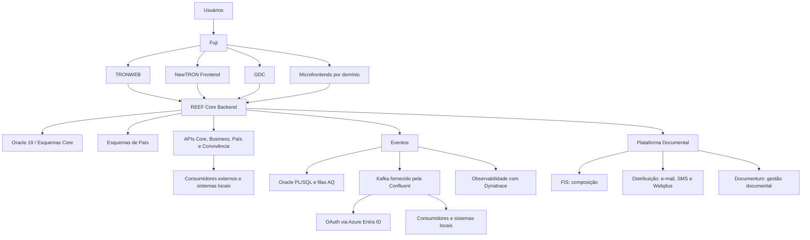

# Arquitetura REEF Core, NewTRON, Integrações por APIs e Eventos e Cenários Cloud

## 1. Metadados do Documento
- **Arquivo de Origem:** Não identificado no conteúdo extraído
- **Tipo de Documento:** Apresentação Executiva / Arquitetura de Software
- **Domínio / Sistema:** REEF Core, TRON, NewTRON, integração corporativa e plataformas cloud
- **Público-Alvo:** Arquitetos, desenvolvedores, equipes de integração, operação e países/unidades consumidoras do REEF
- **Data/Versão Identificada:** rls2023.01 é citada como versão mínima para geração parametrizada de mensagens em bases TRON; 2025 é citada para entrada de Guatemala e El Salvador na América Central. Versão do documento não identificada.

---

## 2. Resumo Executivo & Contexto de Negócio

O documento apresenta o REEF como uma plataforma PaaS cujo Core atua como núcleo de configuração de produtos, processos de emissão, sinistros, administração e capacidades comuns. A plataforma é complementada por soluções globais voltadas ao atendimento de clientes e distribuidores, autosserviços, cotadores/emissores, gestão documental, BPM, motor de regras, eventos, clientes e microsserviços especializados.

A arquitetura estabelece uma separação explícita entre capacidades globais do REEF Core e implementações específicas de cada país. O código Core é descrito como não alterável, multi-país e multi-companhia. As necessidades locais devem ser tratadas por esquemas independentes, parametrização de processos de negócio e extensões configuradas dinamicamente, evitando a substituição de sinônimos e reduzindo impacto na evolução de versões do Core.

A camada de experiência evolui de interfaces legadas TRONWEB em Java Swing para NewTRON, GDC, microfrontends e Fuji. Fuji é definido como o ponto único de acesso aos usuários, responsável por orquestrar frontais, gerir menu, idioma, companhia, comunicação entre frontais e autenticação SSO Azure.

As integrações são organizadas em APIs e eventos. APIs representam ações que um consumidor deseja executar, como emitir uma apólice ou gerar condições particulares. Eventos representam fatos imutáveis já ocorridos, como uma apólice emitida, permitindo que consumidores reajam e executem seus processos de negócio. A plataforma de eventos usa Kafka fornecido pela Confluent, OAuth via Azure Entra ID e observabilidade com Dynatrace.

O documento também descreve implantações cloud para América Central, Vida e Mawdy, com diferenças de região, recuperação de desastre, execução Java, banco de dados e integrações locais. A apresentação não detalha contratos HTTP, esquemas JSON, topologias de rede, nomes de tópicos Kafka, SLAs, políticas de retenção ou procedimentos operacionais de contingência.

---

## 3. Arquitetura, Componentes & Tecnologias Envolvidas

### Componentes e capacidades identificadas

| Componente / Tecnologia | Papel descrito |
| :--- | :--- |
| REEF Core | Coração da plataforma; configura produtos, emissão, sinistros, administração e capacidades comuns. |
| Marketplace | Canal no qual capacidades funcionais são incorporadas continuamente, incluindo desenvolvimentos próprios, soluções de mercado e Insurtechs. |
| TRONWEB | Front legado associado ao REEF Core Backend; usa Java Swing 1.3 e permanece temporariamente para telas de Tesouraria. |
| NewTRON Frontend | Frontend baseado em AngularJS + Spring MVC; atende todos os processos e famílias TRON, exceto Tesouraria; não é destinado a novos desenvolvimentos. |
| GDC | Gerador de telas e manutenção zero code de tabelas; baseado em Angular + Spring Boot e MAR 2.0. |
| Microfrontends | Um microfrontend por domínio funcional; apresentam telas parametrizadas, têm implantação independente e usam componentes reutilizáveis. |
| Fuji | Ponto único de acesso do usuário; orquestra frontais, menu, idioma, companhia, comunicação entre frontais e SSO Azure. |
| Oracle 19 | Banco de dados indicado para o Core Backend. |
| Type Objects | Base do modelo lógico do Core e dos esquemas de país. |
| APIs Core | APIs expostas para funcionalidade Core, módulos e consumidores. |
| API Business | Catálogo de serviços com linguagem mais padronizada e comunicação com API EDGE. |
| API de Convivência | Integração síncrona entre REEF e sistema local do país. |
| Kafka / Confluent | Broker e serviço de eventos para publicação, assinatura, armazenamento e processamento de fluxos de registros em tempo real. |
| Azure Entra ID | IdP para autenticação OAuth de produtores e consumidores de tópicos. |
| Dynatrace | Observabilidade e monitoramento de eventos, integrações e ambientes cloud. |
| Plataforma Documental | Composição de documentos, distribuição por e-mail/SMS/Webplus e gestão documental por Documentum. |
| FIS | Serviço técnico de composição de documentos dentro da Plataforma Documental. |
| Documentum | Tecnologia de gestão documental citada na Plataforma Documental. |
| WebLogic Server | Ambiente de execução dos componentes Java na implantação da América Central. |
| AWS Fargate | Serviço serverless para execução de componentes Java no cenário Vida. |
| RDS Oracle | Banco de dados do cenário Vida. |
| Control-M | Agente cloud integrado ao mestre de Espaço MAPFRE na América Central. |
| Okta | Gestão de dealers e empregados externos no cenário Mawdy. |

### Arquitetura lógica extraída



### Camadas e esquemas do Core Backend

| Esquema / Camada | Função sustentada pelo documento |
| :--- | :--- |
| TRON2000 | Código original do sistema e modelo físico do Core, incluindo tabelas e vistas. |
| NWT_O | Definição do modelo lógico, arquivos de constantes e definição de tipos manipulados pelo sistema. |
| NWT_DL | Camada de acesso a dados. Possui nível interno para tabelas e carga/descarga de dados dos objetos lógicos e nível de interface para receber conceitos de negócio e orquestrar os NWT_DL internos. |
| NWT_AQ_DL | Modelo de filas AQ para geração de mensagens JMS. |
| NWT_BL | Validações de atributos dos conceitos de negócio. |
| NWT_SR | Camada de serviço com orquestrador de propriedades de um conceito lógico, orquestrador de processo e interface de serviço visível aos esquemas de conexão. |
| NWT_APP | Acesso às interfaces de serviço definidas em NWT_SR. |
| NWT_DM_APP | Acesso ao modelo físico para novos desenvolvimentos com implementação completa em Java. |
| TRON2000_APP | Acesso à pacotaria TRONWEB, incluindo APIs, TRONWEB e módulo de Tesouraria. |
| NWT_AQ_APP | Acesso às filas AQ como fonte de mensagens JMS para eventos Kafka. |
| TRP_XX | Objetos de definição de produtos Core, como Vida; controla dados do sistema por programas PTDs disponíveis em TRON2000. |
| NWT_IL | Camada de tradução entre o modelo lógico NewTRON, baseado em type objects, e o modelo TRONWEB, baseado em types records. |
| NWT_TS / NWT_TB / NWT_TD | Acesso dos esquemas TRONWEB à lógica NewTRON. |

### Camadas e esquemas do Backend País

| Esquema / Camada | Função sustentada pelo documento |
| :--- | :--- |
| TRC_XX_O | Modelo lógico do país baseado em type objects. |
| TRC_XX_DL | Tabelas próprias do país, pacotaria interna de acesso às tabelas e interface para expor o conceito lógico às demais camadas. |
| TRON2000_XX | Novo esquema previsto para alojar pacotaria TRONWEB original local e controlar dívida técnica. |
| Configuração de processo de negócio | Mecanismo de personalização do país, com possibilidade de procedimentos e funções configurados e executados dinamicamente. |

> **Nota de Análise:** O documento descreve as responsabilidades dos esquemas, porém não especifica dependências compilatórias, privilégios Oracle, nomenclatura real de países, contratos de tipos, procedures, packages ou tabelas.

---

## 4. Regras de Negócio, Especificações Funcionais & Processos

### Princípios do REEF Core

1. O REEF Core é responsável pela configuração de produtos, emissão, sinistros, administração e funções comuns.
2. O REEF Core é multi-país e multi-companhia.
3. O código Core não pode ser alterado.
4. Não é permitida personalização por substituição de sinônimos.
5. O código específico de país deve permanecer separado do código Core.
6. O modelo lógico do Core é baseado em type objects.
7. A arquitetura é organizada por esquemas Oracle, e cada camada possui propósito próprio.
8. O Core inclui utilitários para diagnóstico de erros em execução.
9. Não são permitidos utilitários que abram comunicações externas por `UTL_HTTP` ou `UTL_FILE`.

### Personalização e evolução de país

1. A arquitetura de país é similar à arquitetura Core, porém contém código independente.
2. A personalização local deve ocorrer por configuração, parametrização e execução dinâmica.
3. A personalização não deve ser implementada por substituição de sinônimos.
4. Procedimentos e funções podem ser definidos por configuração para extensão dinâmica dos processos de negócio.
5. Processos TRONWEB locais legados são reconhecidos como dívida técnica.
6. O documento menciona que processos já desenvolvidos localmente no Uruguai, em REEF Latam Vida, foram incorporados em `TRC_XX_DL`.
7. Após nova análise, o documento indica intenção de abrir `TRON2000_XX` para controlar a dívida técnica dessa pacotaria.
8. O desacoplamento do modelo físico busca permitir compatibilidade retroativa entre versões NewTRON e reduzir impacto nos países.

### Camada de frontais

1. TRONWEB usa Java Swing 1.3.
2. TRONWEB está associado a manutenção corretiva e é mantido temporariamente para telas de Tesouraria.
3. NewTRON Frontend usa AngularJS e Spring MVC.
4. NewTRON atende processos e famílias TRON, exceto Tesouraria.
5. NewTRON oferece componentes modulares e reutilizáveis e look & feel totalmente personalizável.
6. NewTRON não deve ser usado em novos desenvolvimentos.
7. GDC usa Angular, Spring Boot e MAR 2.0.
8. GDC permite geração de telas, manutenção zero code de tabelas e definição por parametrização.
9. GDC integra APIs para executar validações.
10. Cada microfrontend é associado a um domínio funcional.
11. Microfrontends apresentam telas geradas por parametrização, usam MAR, são implantados independentemente e possuem componentes reutilizáveis.
12. Módulos de microfrontends podem ser personalizados por configuração em banco de dados.
13. Fuji concentra o acesso dos usuários, orquestra os frontais e gerencia menu, idioma, companhia, comunicação entre frontais e SSO Azure.

### Integração por APIs

1. API Core expõe funcionalidades Core para módulos e consumidores.
2. API Batch é associada a tarefas e tarefas Java.
3. API Business é um catálogo de serviços com linguagem mais padronizada.
4. API Business se comunica com API EDGE.
5. APIs são utilizadas para ações que o consumidor deseja executar no sistema.
6. Exemplos apresentados de ações via API: emitir apólice e gerar condições particulares de uma apólice.
7. API de Convivência realiza integração síncrona entre REEF e o sistema local de um país.
8. API de Convivência e API Core são apresentadas como capacidades distintas.
9. O documento não descreve verbos HTTP, autenticação de APIs, formatos de payload, códigos de retorno ou contratos de serviço.

### Integração orientada a eventos

1. Um evento é uma representação de algo que ocorreu no sistema.
2. Um evento também pode ser chamado de mensagem ou registro.
3. Um evento representa uma mudança de estado de um sistema.
4. Eventos são definidos como fatos já ocorridos, imutáveis e persistentes.
5. A arquitetura orientada a eventos é apresentada como paradigma no qual um componente executa em resposta a uma ou mais notificações de eventos.
6. O produtor de evento não conhece a identidade dos receptores no momento da compilação, resultando em menor acoplamento que arquiteturas cliente/servidor.
7. Eventos buscam isolar processos e delimitar responsabilidades.
8. A orquestração síncrona de operações pós-emissão dentro da mesma transação é apontada como fator de impacto de performance, maior possibilidade de falhas e maior envolvimento de equipes na resolução de erros.
9. Eventos podem ser emitidos por Oracle Backend, via serviço PL/SQL e filas AQ, e por Java.
10. Eventos podem ser consumidos por TRON on-premise e sistemas locais.
11. O serviço de eventos é fornecido por Confluent e implantado em AWS na região da Irlanda, segundo as notas do apresentador.
12. Conectores para bancos TRON funcionam como fontes de mensagens JMS, que são convertidas em eventos e encaminhadas para tópicos.
13. Cada país dispõe de tópicos originados do Core e tópicos definidos pelo próprio país.
14. Um serviço parametrizado no TRON permite gerar mensagens nas bases TRON a partir da versão `rls2023.01`.
15. O acesso a tópicos é protegido por OAuth contra Azure Entra ID.
16. A observabilidade e monitorização são gerenciadas com Dynatrace.
17. REEF Centro América e Vida Latam já nascem com integração estabelecida.
18. Países exigem uma versão mínima de Core e habilitação de comunicações pela rede interna Mapfre; o documento não informa qual é a versão mínima.
19. APIs e eventos são capacidades complementares: APIs tratam ações solicitadas; eventos notificam fatos concluídos.

### Casos de uso de eventos

| Caso de uso | Processo descrito |
| :--- | :--- |
| Gestão de Impagos | Sincronização de recibos impagados no REEF com o ativo centralizado de Gestão de Impagos para processamento. |
| Autoservicio Proveedores | Sincronização de dados de terceiros do tipo Proveedor do TRON Chile para Autoservicio Proveedor; próxima implantação citada para México. |
| Ficha Cliente 360 | Sincronização de dados de clientes de diferentes sistemas transacionais para a base de dados do ativo Ficha Cliente 360. |
| REEF Vida | Sincronização bidirecional de dados de clientes entre REEF e TRON local do Uruguai; notificação de Controles Técnicos. |
| Cotizador Rápido / Portal de Ventas | Emissão de documentação de cotações, orçamentos e Welcome Pack; resultado de Controles Técnicos. |
| Prestaciones Salud | Novo sistema de prestações de saúde da Espanha; integração principal entre domínios do sistema e sistemas externos. |
| Outros | Autoservicio Clientes, Platea, Métricas Funcionales, Módulo Suscripción, RE21 e outros não detalhados. |

### Reporting e documentos

1. A Plataforma Documental disponibiliza composição de documentos por FIS.
2. A Plataforma Documental distribui documentos por e-mail, SMS e Webplus.
3. A Plataforma Documental realiza gestão de documentos por Documentum.
4. O mapa documental deve ser normalizado.
5. REEF Core expõe serviços funcionais que exploram a Plataforma Documental com base em parametrização.
6. A integração documental está presente no Frontal REEF Core, tanto em D2 quanto no módulo Gestor de Documentos.
7. O Gestor de Documentos abrange apólices, orçamentos, sinistros, expedientes, serviços, faturas e fornecedores.
8. Os documentos enviados aos clientes são gerenciados pela Plataforma Documental.

---

## 5. Tabelas de Parâmetros, Ambientes e Estruturas de Dados

### Domínios de microfrontends citados

| Item / Parâmetro | Descrição / Função | Tipo / Valores / Formato | Ambiente / Observações |
| :--- | :--- | :--- | :--- |
| Siniestros | Domínio funcional de microfrontend. | Domínio funcional | Sem detalhamento adicional. |
| Emisión | Domínio funcional de microfrontend. | Domínio funcional | Sem detalhamento adicional. |
| Proveedores | Domínio funcional de microfrontend. | Domínio funcional | Sem detalhamento adicional. |
| Tesorería | Domínio funcional de microfrontend; telas temporariamente preservadas em TRONWEB. | Domínio funcional | Exceção mencionada para NewTRON. |
| Países | Domínio funcional de microfrontend. | Domínio funcional | Sem detalhamento adicional. |
| Documentos | Domínio funcional de microfrontend. | Domínio funcional | Relacionável à Plataforma Documental, sem contrato explícito. |

### Restrições e regras técnicas

| Item / Parâmetro | Descrição / Função | Tipo / Valores / Formato | Ambiente / Observações |
| :--- | :--- | :--- | :--- |
| Código Core | Não pode ser alterado. | Regra arquitetural | REEF Core. |
| Personalização por sinônimos | Não permitida. | Restrição arquitetural | Core e personalização de país. |
| Personalização local | Deve ocorrer por configuração, parametrização e execução dinâmica. | Regra de extensão | Backend País. |
| UTL_HTTP | Não permitido para utilitários que abram comunicações externas. | Restrição Oracle | Core Backend. |
| UTL_FILE | Não permitido para utilitários que abram comunicações externas. | Restrição Oracle | Core Backend. |
| Modelo lógico | Baseado em type objects. | Padrão de modelagem | Core e País. |
| Eventos | Imutáveis e persistentes. | Regra de domínio | Plataforma de eventos. |
| Tópicos Kafka | Protegidos por OAuth via Azure Entra ID. | Controle de acesso | Produtores e consumidores. |
| rls2023.01 | Versão a partir da qual existe serviço TRON parametrizado para gerar mensagens nas bases TRON. | Versão | Citada nas notas do apresentador. |

### Ambientes cloud citados

| Item / Parâmetro | Descrição / Função | Tipo / Valores / Formato | Ambiente / Observações |
| :--- | :--- | :--- | :--- |
| América Central — região primária | Implantação principal. | Ashburn (US East) | Cenário América Central. |
| América Central — DR | Recuperação de desastre. | San José (US West) | Cenário América Central. |
| América Central — componentes Java | Execução dos componentes Java. | WebLogic Server | Cenário América Central. |
| América Central — observabilidade | Monitoramento, inclusive de serviços locais como API de Convivência. | Dynatrace | Cenário América Central. |
| América Central — Gestão Documental | Reutilização de frameworks disponíveis. | Data center de Miami | Cenário América Central. |
| América Central — API de Convivência | Integra REEF com SISMAP. | Panamá | Cenário América Central. |
| América Central — agendamento | Agente cloud integrado ao mestre de Espaço MAPFRE. | Control-M | Cenário América Central. |
| América Central — países ativos | Países atualmente atendidos. | Panamá e Honduras | Guatemala e El Salvador são previstos para 2025. |
| Vida — região primária | Implantação principal. | São Paulo (`sa-east-1`) | Cenário Vida. |
| Vida — DR | Recuperação de desastre. | Ohio (`us-east-2`) | Cenário Vida. |
| Vida — componentes Java | Execução de componentes Java. | Contêineres em AWS Fargate serverless | Cenário Vida. |
| Vida — banco de dados | Persistência de dados. | RDS Oracle | Cenário Vida. |
| Vida — padrão arquitetural | Arquetipos aplicados na arquitetura. | MAR 2.0 | Toda a arquitetura Vida. |
| Vida — implantação | Implantação automatizada. | Multirregião | Cenário Vida. |
| Vida — integração de clientes | Sincronização REEF–TRON Uruguai. | Eventos | Cenário Vida. |
| Vida — serviços integrados | Seleção de riscos e módulos. | DUP e RTE | Cenário Vida. |
| Mawdy — regiões | Regiões de implantação. | Virginia (`us-east-1`) e Europa (`eu-west-1`) | Cenário Mawdy. |
| Mawdy — serviços comuns | Novas integrações de serviços comuns. | TMD, Taller de productos, Gestor de colecciones, Docthor | Sem detalhamento adicional. |
| Mawdy — implantação | Implantação automatizada. | Multirregião | Cenário Mawdy. |
| Mawdy — identidade | Gestão de dealers e empregados externos. | Okta | Cenário Mawdy. |
| Mawdy — sincronização | Sincronização de dealers e agentes. | Integração TRON–Okta via Kafka desde Portal de ventas | Cenário Mawdy. |

### Tecnologias de front-end e backend

| Item / Parâmetro | Descrição / Função | Tipo / Valores / Formato | Ambiente / Observações |
| :--- | :--- | :--- | :--- |
| TRONWEB | Front legado. | Java Swing 1.3 | Manutenção corretiva; temporário para Tesouraria. |
| NewTRON Frontend | Frontend modular e reutilizável. | AngularJS + Spring MVC | Não destinado a novos desenvolvimentos. |
| GDC | Gerador de telas e manutenção zero code. | Angular + Spring Boot + MAR 2.0 | Validações via integração de API. |
| Microfrontends | Frontais por domínio funcional. | Baseados em MAR | Implantação independente e configuração em banco de dados. |
| Core Backend | Backend principal. | Oracle 19; arquitetura por esquemas | Modelo lógico por type objects. |
| Eventos | Plataforma de integração assíncrona. | PL/SQL, filas AQ, Java, Kafka/Confluent | OAuth com Azure Entra ID; Dynatrace. |

---

## 6. Bateria de Perguntas & Respostas para RAG (FAQ Sintético)

### P1: Qual é a função do REEF Core na plataforma?
**R:** O REEF Core atua como coração da plataforma. O documento atribui ao REEF Core a configuração de produtos, processos de emissão, sinistros, administração e capacidades comuns. O REEF Core também disponibiliza serviços funcionais parametrizados para explorar a Plataforma Documental.

### P2: O código do REEF Core pode ser personalizado diretamente por cada país?
**R:** Não. O documento afirma que o código do Core não é alterável e que não é permitida personalização por substituição de sinônimos. A personalização de cada país deve ocorrer em esquemas independentes, por configuração de processos de negócio, parametrização e execução dinâmica de procedimentos ou funções configuradas.

### P3: Como a arquitetura separa o código global do código específico de país?
**R:** O código Core e o código de país permanecem em esquemas separados. No Core, são citados esquemas como `NWT_O`, `NWT_DL`, `NWT_BL` e `NWT_SR`. Para o país, são citados `TRC_XX_O` e `TRC_XX_DL`. A separação busca desacoplar o modelo físico e reduzir o impacto de novas versões NewTRON nos países.

### P4: Qual é a diferença entre uma API e um evento no modelo de integração apresentado?
**R:** APIs representam ações que um consumidor quer executar no sistema, como emitir uma apólice ou gerar condições particulares. Eventos representam fatos que já ocorreram, como uma apólice emitida. Consumidores de eventos reagem ao fato publicado e executam seus próprios processos de negócio. O documento define APIs e eventos como capacidades complementares.

### P5: Como os eventos são produzidos e distribuídos na arquitetura REEF?
**R:** Eventos podem ser emitidos por Oracle Backend, por meio de serviço PL/SQL e filas AQ, e por Java. As filas AQ podem atuar como fonte de mensagens JMS, que são convertidas em eventos e encaminhadas a tópicos Kafka. O broker de eventos é fornecido pela Confluent, e os tópicos são acessados por OAuth via Azure Entra ID.

### P6: Quais propriedades um evento deve possuir segundo o documento?
**R:** Um evento é um fato que já ocorreu no sistema. O documento o define como imutável e persistente. Também descreve um evento como uma representação de algo que acontece ou como um registro de uma mudança de estado de um sistema.

### P7: Qual é a responsabilidade do Fuji?
**R:** Fuji é o ponto único de acesso para usuários. Fuji orquestra os frontais, gerencia menu, idioma e companhia, permite comunicação entre frontais e fornece autenticação SSO Azure.

### P8: Por que NewTRON não deve ser usado em novos desenvolvimentos?
**R:** O documento informa explicitamente que o NewTRON Frontend não é destinado a novos desenvolvimentos. A apresentação não informa justificativa técnica adicional, cronograma de descontinuação ou tecnologia substituta oficial para todos os casos.

### P9: Quais são os papéis das camadas `NWT_DL`, `NWT_BL` e `NWT_SR`?
**R:** `NWT_DL` é a camada de acesso a dados, com nível interno para acesso a tabelas e carga/descarga de objetos lógicos e nível de interface para orquestrar conceitos de negócio. `NWT_BL` realiza validações dos atributos de conceitos de negócio. `NWT_SR` é a camada de serviço, contendo orquestração de propriedades, orquestração de processos e interfaces de serviço visíveis aos esquemas de conexão.

### P10: Quais integrações documentais são oferecidas pela Plataforma Documental?
**R:** A Plataforma Documental oferece composição de documentos por FIS, distribuição por e-mail, SMS e Webplus e gestão documental por Documentum. No REEF Core, essas capacidades são utilizadas por serviços funcionais parametrizados e integradas ao Frontal REEF Core, D2 e Gestor de Documentos.

### P11: Quais casos de uso de eventos são mencionados?
**R:** Os casos de uso incluem Gestão de Impagos, Autoservicio Proveedores, Ficha Cliente 360, REEF Vida, Cotizador Rápido/Portal de Ventas, Prestaciones Salud e outros ativos citados sem detalhamento, como Autoservicio Clientes, Platea, Métricas Funcionales, Módulo Suscripción e RE21.

### P12: Como é o ambiente cloud da América Central?
**R:** A América Central é implantada em Ashburn, US East, com recuperação de desastre em San José, US West. Os componentes Java são implantados sobre WebLogic Server. Há observabilidade com Dynatrace, API de Convivência no Panamá para integração REEF–SISMAP, reutilização dos frameworks de Gestão Documental do data center de Miami e agente Control-M integrado ao mestre de Espaço MAPFRE.

### P13: Quais características diferenciam o cenário Vida?
**R:** O cenário Vida é implantado em São Paulo (`sa-east-1`) com DR em Ohio (`us-east-2`). Componentes Java executam como contêineres em AWS Fargate serverless, o banco de dados é RDS Oracle, a arquitetura usa arquetipos MAR 2.0, a implantação multirregião é automatizada e a observabilidade é realizada por Dynatrace.

### P14: Quais restrições Oracle explícitas existem no Core Backend?
**R:** O documento informa que não são permitidos utilitários que abram comunicações externas usando `UTL_HTTP` ou `UTL_FILE`. Também informa que o Core usa Oracle 19, arquitetura em camadas por esquemas e modelo lógico baseado em type objects.

---

## 7. Glossário de Termos, Siglas & Conceitos-Chave

- **API:** Interface usada para executar ações no sistema, como emitir uma apólice ou gerar condições particulares.
- **API Batch:** API associada a tarefas e tarefas Java.
- **API Business:** Catálogo de serviços com linguagem mais padrão e comunicação com API EDGE.
- **API de Convivência:** API destinada à integração síncrona entre REEF e o sistema local de um país.
- **AQ:** Modelo de filas Oracle utilizado para gerar mensagens JMS.
- **BBDD:** Abreviação de bases de dados, conforme utilizada no conteúdo em espanhol.
- **BPM:** Capacidade de suporte citada como parte das soluções globais; o documento não expande a sigla.
- **Core:** Núcleo REEF responsável por configuração de produtos, emissão, sinistros, administração e funções comuns.
- **D2:** Componente citado como integrado ao Frontal REEF Core; sem detalhamento adicional.
- **DL:** Camada de acesso a dados nos esquemas Core e País.
- **DR:** Recuperação de desastre, indicada por regiões secundárias de implantação.
- **Dynatrace:** Ferramenta de observabilidade e monitorização.
- **EDA:** Arquitetura orientada a eventos; paradigma em que um componente é executado em resposta a notificações de eventos.
- **FIS:** Serviço técnico de composição de documentos da Plataforma Documental.
- **GDC:** Gerador de telas e manutenção zero code de tabelas.
- **IdP:** Provedor de identidade; Azure Entra ID é citado como IdP para OAuth.
- **JMS:** Tipo de mensagem gerada a partir de filas AQ e convertida em eventos.
- **Kafka:** Plataforma de software de código aberto para publicar, assinar, guardar e processar fluxos de registros em tempo real.
- **MAR 2.0:** Base declarada para GDC e arquetipos de toda a arquitetura Vida; significado não expandido no documento.
- **Microfrontend:** Frontend independente associado a um domínio funcional.
- **NewTRON:** Conjunto de frontais, esquemas e lógica de evolução do sistema, separado da lógica TRONWEB original.
- **NWT:** Prefixo dos esquemas NewTRON citados no Core Backend.
- **OAuth:** Mecanismo utilizado para validar acesso de produtores e consumidores aos tópicos.
- **PaaS:** Modelo sob o qual REEF é apresentado; o documento não expande a sigla.
- **PTD:** Programas disponíveis em TRON2000 usados por `TRP_XX` para controlar dados do sistema; significado não expandido.
- **REEF:** Plataforma descrita como PaaS, composta por Core, soluções globais, marketplace e governo.
- **RTE / DUP:** Serviços integrados no cenário Vida para seleção de riscos e módulos; siglas não expandidas.
- **SSO:** Autenticação única; Fuji usa SSO Azure.
- **TRC_XX:** Prefixo de esquemas específicos de país.
- **TRON2000:** Esquema que contém código original do sistema e modelo físico do Core.
- **TRONWEB:** Front legado baseado em Java Swing 1.3 e lógica original acessada por esquemas de mediação.
- **Type Objects:** Base do modelo lógico utilizado no Core e nas camadas de país.
- **Webplus:** Canal de distribuição documental citado junto a e-mail e SMS.

---

## 8. Notas Críticas, Riscos & Limitações

- O código REEF Core não pode ser alterado; extensões devem respeitar o modelo de configuração e esquemas locais.
- A substituição de sinônimos não é permitida para personalização, tanto no Core quanto no modelo de país.
- A manutenção de TRONWEB e de telas de Tesouraria é temporária e voltada à manutenção corretiva, indicando coexistência com componentes legados.
- NewTRON não deve ser empregado em novos desenvolvimentos, porém o documento não especifica uma política completa de substituição, cronograma ou produto sucessor.
- A existência de pacotaria TRONWEB local é identificada como dívida técnica. O documento prevê o esquema `TRON2000_XX` para controlar essa dívida.
- A arquitetura de país é descrita como desconectada; há alerta explícito para cuidado com globais em nível de pacote.
- A orquestração de múltiplas operações dentro da mesma transação é apontada como risco de performance, de erros de execução e de aumento no número de equipes envolvidas em resolução de incidentes.
- Países requerem versão mínima de Core e habilitação de rede interna Mapfre para integração por eventos, mas a apresentação não informa a versão mínima nem os requisitos técnicos de rede.
- O acesso aos tópicos Kafka depende de OAuth e Azure Entra ID; detalhes de escopos, papéis, rotação de credenciais, gestão de certificados e autorização por tópico não foram fornecidos.
- O documento cita implantação multirregião e DR, mas não especifica RPO, RTO, estratégia de failover, testes de desastre ou procedimentos operacionais.
- Não foram apresentados contratos de APIs, verbos HTTP, payloads, versionamento, limites de taxa, SLAs, políticas de retry ou tratamento de falhas.
- Não foram fornecidos nomes de tópicos, esquemas de eventos, formatos de serialização, políticas de retenção Kafka ou regras de compatibilidade de mensagens.
- Termos como MAR 2.0, D2, TMD, DUP, RTE, Docthor e RE21 são citados sem definição suficiente no conteúdo.

---

## 9. Conteúdo Bruto Estruturado (Referência Fiel)

```text
--- [SLIDE 1 DE 22: Sem Título] ---

* Arquitectura Core

--- [SLIDE 2 DE 22: Sem Título] ---

* 2
* _Reef como PaaS
* Core
* Actúa como corazón de la Plataforma, responsable de la configuración de los productos, procesos de emisión, siniestros, administración y comunes.
* .
* Soluciones globales
* de atención al cliente final y distribuidor Autoservicios, Cotizadores / Emisores.
* de soporte para Gestión Documental, BPM, Motor de Reglas, gestor de eventos, Clientes…
* microservicios para dar respuesta a necesidades específicas (cotización, suscripción de riesgos)
* Marketplace
* Los componentes son ofertados en un Marketplace en el que se van incorporando más capacidades funcionales de forma continua (desarrollos propios, de mercado, de Insurtechs,…).
* Gobierno
* Para establecer un modelo de entrega que sea capaz de servir a todas las regiones, unidades y países, en base a un modelo de gobierno.

--- [SLIDE 3 DE 22: Sem Título] ---

* Reef como PaaS
* Arquitectura Reef Core
  * Core
  * Gestion Documental
* Arquitectura Soluciones Globales
  * RTE / DUP
  * Impagos
  * Ficha 360
  * Plataforma Eventos
* 3
  * Finametrix
  * Cotizador / Contratador
  * BPM/LowCode
  * TMD

--- [SLIDE 4 DE 22: Sem Título] ---

* _front
* Tronweb
* Tronweb
* Java Swing 1.3
* Mantenimiento correctivo
* Temporalmente para pantallas de Tesorería
* REEF Core Backend

--- [SLIDE 5 DE 22: Sem Título] ---

* _front
* Newtron Frontend
* AngularJS + Spring MVC
* Todos los procesos y familias de TRON excepto Tesorería
* Componentes modulares y reutilizables
* Look & feel 100% personalizable
* No para nuevos desarrollos
* Tronweb
* REEF Core Backend
* NewTRON

--- [SLIDE 6 DE 22: Sem Título] ---

* _front
* Generador de pantallas
* Mantenimiento de tablas zero code
* Angular + Spring Boot
* Basado en MAR 2.0
* Definición por parametrización
* Todas las funcionalidades mantenimiento
* Validaciones a través de integración de API
* Tronweb
* REEF Core Backend
* NewTRON
* GDC

--- [SLIDE 7 DE 22: Sem Título] ---

* _front
* Microfrontends
* Uno por dominio funcional
* Presentación de pantallas generadas por parametrización.
* Basado en MAR
* Despliegue independiente
* Basado en componentes reutilizables
* Módulos personalizados por configuración en BD
* Tronweb
* REEF Core Backend
* NewTRON
* GDC
* Siniestros
* Emisión
* Proveedores
* Tesorería
* Países
* Documentos

--- [SLIDE 8 DE 22: Sem Título] ---

* _front
* Fuji
* Único punto de acceso para usuarios
* Orquestación de frontales
* Gestión del Menú, idioma y compañía
* Comunicación entre frontales
* Autenticación SSO AZURE
* Tronweb
* REEF Core Backend
* NewTRON
* GDC
* Proveedores
* Siniestros
* Emisión
* Tesorería
* FUJI
* Países
* Documentos

--- [SLIDE 9 DE 22: Sem Título] ---

* 9
* _backend Java
* Backend Java
* Artefactos CORE en REEF
* Artefactos locales del país
* Actualización de artefactos

--- [SLIDE 10 DE 22: Sem Título] ---

* _backend Core
* Core Backend
* Oracle 19
* Arquitectura en capas (esquemas). Cada capa tiene un propósito.
* Modelo Lógico basado en type Objects.
* Código de Core no alterable.
* No se permite la personalización por sustitución de sinónimos.
* Core Multi-País y Multi-Compañía
* Se separa el código de País del Core.
* Utilidades diagnóstico errores en Ejecución.
* No se permite utilidades que abren comunicaciones externas (UTL_HTTP, UTL_FILE)

📌 [NOTAS DO APRESENTADOR / CONTEXTO ADICIONAL]:
Si recuerdan, originalmente TRON disponía de todos los objetos en un único esquema TRON2000, donde se mezclaba la lógia de acceso a datos con la lógica de negocio. Para ordenar todo este software se genera esta arquitectura basada en esquemas de BBDD:
- TRON2000: código original del sistema + modelo físico de CORE (tablas + vistas)
- NWT_O – definición del modelo lógico y ficheos de constantes y definición de tipos que va a manejar el sistema.
- NWT_DL – capa de acceso a datos. Dos niveles:
  + interno – acceso a las tables y carga y descarga de información sobre los objetos del modelo lógico (conceptos lógicos).
  + interfaz – recibe los conectpos de negocio y orquesta los dl internos
- NWT_AQ_DL: modelo de colas AQ para generar los mensajes JMS.
- NWT_BL – validaciones de los atributos de los conceptos de negocio.
- NWT_SR: Capa de servicio con tres niveles:
  + Orquestador de propiedades de un concepto lógico
  + Orquestador de proceso, donde se hace uso de los distintos conceptos lógicos que intervienen en una funcionalidad.
  + interfaz de servicio visible desde los esquemas de conexión.
Esquemas de conexión al backend Oracle:
- NWT_APP: acceso a las intefaces de servicio definidas en NWT_SR
- NWT_DM_APP: acceso al modelo físico (nuevos desarrollos con implementación complete en java).
- TRON2000_APP: acceso a la paquetería TRONWEB (APIS + TRONWEB + Módulo de Tesorería)
- NWT_AQ_APP: acceso a las colas AQ como Fuente de mensajes JMS (eventos kafka)
Esquema de product o :
- TRP_XX: objetos de definición de productos de CORE (como puede ser el caso de vida). Se controla los datos del Sistema a los que accede a través de programas PTDs disponibles en TRON2000.
Esquemas de mediación entre NEWTron y TRONWEB:
- NWT_IL: acceso desde los esquemas de NEWTron a la lógica original de TRONWEB. Es una capa de traducción entre modelo lógico NEWTron (type objects) y el de TRONWEB (types records)
- NWT_TS, NWT_TB y NWT_TD: acceso desde los esquemas de TRONWEB a lógica de NEWTron. Desde hace años, la evolución del Sistema se realiza en las capas de NEWTron, por lo que hay casos que es encesario acceder a funcioalidades presents en NEWTron.

--- [SLIDE 11 DE 22: Sem Título] ---

* _backend País
* Backend País
* Arquitectura en capas (esquemas). Cada capa tiene un propósito. Similar al CORE.
* Código independiente al de CORE
* Personalización por configuración (parametrización & ejecución dinámica).
* Nuevo esquema para incorporar procesos TRONWEB originales del Tron local (deuda técnica).
* Arquitectura desconectada. Cuidado con las globales a nivel paquete.
* Desacoplamiento del modelo físico para minimizar el impacto con las nuevas versiones de CORE

📌 [NOTAS DO APRESENTADOR / CONTEXTO ADICIONAL]:
Estructura muy similar a la de CORE pero para el país.
Cada país dispondrá de sus porpios esquemas donde alojar su código.
TRC_XX_O: Modelo Lógico basa en type objects
TRC_XX_DL: Tablas propias del país y dos niveles de paquetería, interna de acceso a estas tablas y de interfaz para exposición del concepto lógico hacia el resto de capas.
Como pueden observar, no se mezcla el código de core con el de país, van a esquemas separados.
En este modelo, la personalización no se realiza por sustitución de sinónimos, sino por configuración del proceso de negocio correspondiente, con posibilidad de extensión vía definición de procedimientos / funciones configuradas y que se ejecutan de forma dinámica.
Con Uruguay (reef latam vida) ciertos procesos ya desarrollados localmente se han incorporado a TRC_XX_DL como esquema donde albergar esta deuda técnica. Tras un segundo análisis realizado, vamos a abrir un nuevo esquema TRON2000_XX para albergar esta paquetería y tener controlada esta deuda téncia. El resto del modelo está desacoplado del modelo físico, con lo que las versiones de NEWTron, deberían ser compatibles hacia atrás, minimizando el impacto en los países y favoreciendo la incorporación de las nuevas versiones.

--- [SLIDE 12 DE 22: Sem Título] ---

* _integracion
* API
* 12
* API CORE
* Funcionalidad de Core
* Módulos
* Consumidores
* API BATCH. Tareas. Tareas Java
* API Business
* Catálogo de servicios con lenguaje más estándar
* Comunicación con API EDGE
* Preconstruido
* API CORE
* REEF CORE
* Frontales REEF
* API Business
* Consumidores Externos
* Introducción
* Catálogo de servicios
* Intermediación con el Core
* API PAÍS

--- [SLIDE 13 DE 22: Sem Título] ---

* _integracion
* API de convivencia
* 13
* API CORE
* REEF CORE
* Frontales REEF
* API Business
* Integración REEF y sistema local del país
* Integraciones síncronas
* API de Convivencia vs API CORE
* Sistema Local
* CORE Local
* API Convivencia
* API PAÍS

--- [SLIDE 14 DE 22: Sem Título] ---

* _integracion
* Eventos
* Los eventos son cosas que pasan o definidos de otra manera, representaciones de hechos.
* En el flujo de eventos, un evento (también llamado mensaje o registro) es simplemente un registro de un cambio de estado en un sistema.

📌 [NOTAS DO APRESENTADOR / CONTEXTO ADICIONAL]:
Cuando hablamos de eventos, no sólo hablamos de una nueva plataforma o capacidad de integración que se ofrece desde Reef.
Eventos y las arquitecturas orientas a eventos es un nuevo paradigama de diseño de aplicaciones. Si observamos algunas definiciones esto es lo que nos dicen:
- Gartner: Arquitecturas basada en eventos (EDA) es un paradigma de diseño en el que un componente de software se ejecuta en respuesta a recibir una o más notificaciones de eventos.
EDA tiene un menor acoplamiento que arquitecturas cliente/servidor porque el componente que envía la notificación no conoce la identidad de los componentes receptores en el momento de la compilación.
Es decir, permite aislar los procesos y fijar mejor las responsabilidades de los mismos. Por ejemplo, procesos como la emisión de póliza y todos los procesos post emisión que ejecutamos.
Actualmente, dentro de la misma transacción incluimos la orquestación de llamadas al resto de operaciones / funcionalidades que se han de ejecutar, lo cual impacta directamente en performance, mayor posibilidad de errores de ejecución, más equipos interviniendo en la resolución de posibles errores.
- ChatGPT:

--- [SLIDE 15 DE 22: Sem Título] ---

* _integracion
* Eventos
* Eventos
* Definición: Hecho que ya ha sucedido en el sistema, inmutable y con persistencia.
* Emisión de eventos desde backend Oracle (servicio plsql&colas AQ) y Java.
* Uso desde los Tron onPremise y Sistemas locales.
* Broker de Eventos, a través de servicio Kafka ofrecido por Confluent. Kafka es una plataforma de software de código abierto que permite publicar, subscribirte, guardar y procesar flujos de registros en tiempo real.
* Acceso a los topics securizado a través de Oauth vía IdP Azure Entra ID.
* Observabilidad / Monitorización Gestionada con Dynatrace

📌 [NOTAS DO APRESENTADOR / CONTEXTO ADICIONAL]:
Disponbilizamos una plataforma de evenetos centralizada a través de un servicio que nos provee Confluent y actualmente desplegado en AWS en la región de Irlanda. Desde esta plataforma, disponibilizamos conectores a las BBDD TRON para que funcionen como fuentes de mensajes JMS que son convertidos a eventos y se encaminan a los topics.
Cada país dispone de un juego de topics, que son los que originalmente proporciona CORE + aquellos propios que el país defina. A su vez, se disponibliza a nivel de TRON de un servicio parametrizado que permite generar estos mensajes en estas BBDD Tron desde la versión rls2023.01.
A su vez, existen multitud de librerías para los diferentes lenguajes de programación para poder integrar los topics de la plataforma de eventos (El nativo es java, puesto que Kafka está desarrollado en java). El acceso está securizado y actualmente se valida a través de Oauth contra Azure AD el acceso de los diferentes productores / consumidores. Por tanto, podemos generar eventos, tando desde las BBDD de los Trones, como de forma externa desde los serviios pertinentes.
Los reef, tanto Centro América como Vida Latam, nacen con la integración establecida. Para los países, se requiere como comentábamos una versión mínima de core + hablitar comunicaciones a través de la red interna de Mapfre.
A su vez, disponemos de activos que ya disponen y tendrán estas capacidades de generar o consumir eventos, como son Autorservicios (Autoservicio proveedores, Cotizadores, Tarificador, impagos, Ficha Cliente 360).

--- [SLIDE 16 DE 22: Sem Título] ---

* Casos de uso
* 01.
* Gestión de Impagos
* 02.
* Autoservicio Proveedores
* 03.
* Ficha Cliente 360
* 04.
* REEF Vida
* Sincronización de recibos impagados en REEF con el activo centralizado de Gestión de Impagos para su procesamiento
* Sincronización de datos de terceros de tipo Proveedor desde TRON Chile a Autoservicio Proveedor. Próxima implantación: Méjico
* Sincronización de datos de clientes desde los distintos sistemas transaccionales hacia la BD del activo Ficha Cliente 360
* Sincronización bidireccional de datos de Clientes entre REEF y TRON local Uruguay. Notificación de Controles Técnicos
* 05.
* Cotizador Rápido / Portal de Ventas
* Emisión de documentación de Cotizaciones / Presupuestos y Wellcome Pack. Resultado Controles Técnicos.
* 06.
* Prestaciones Salud
* Nuevos Sistema de Prestaciones de Salud España. Método principal de integración entre dominios del sistema, así como sistemas externos.
* _integracion
* Eventos
* 07.
* Otros
* Autoservicio Clientes
* Platea
* Métricas Funcionales
* Módulo Suscripción
* ...
* RE21

--- [SLIDE 17 DE 22: Sem Título] ---

* _integracion

📌 [NOTAS DO APRESENTADOR / CONTEXTO ADICIONAL]:
Resumen de las capacidades de Integración, Centrándonos en APIS y Eventos.
APIS: Acciones que quiero ejecutar en el sistema (Emitir Póliza, Generar Condiciones Particulares de una Póliza)
Eventos: Hechos que ya se han producido en el sistema (Poliza Emitida) donde los consumidores reaccionan a estos eventos y ejecutan sus proceso de negocio.
Las dos capacidades son complementarias. Si vemos una pequeña comparative entre estas dos capacidades temenos:

--- [SLIDE 18 DE 22: Sem Título] ---

* _reporting
* REPORTING
* Plataforma Documental ofrece servicios técnicos de Composición de Documentos (FIS) + Distribución de Documentos (email, SMS, Webplus...) + Gestión de Documentos (Documentum)
* Normalización del Mapa Documental
* Reef Core ofrece servicios funcionales que, en base a una parametrización, explota las capacidades de la Plataforma Documental.
* Integrados en Frontal Reef Core, tanto D2 como módulo Gestor de Documentos (pólizas, presupuestos, Siniestros, Expedientes, Servicios, Facturas, Proveedores).
* Los documentos enviados a los clientes son gestionados a través de la plataforma Documental

--- [SLIDE 19 DE 22: Sem Título] ---

* _cloud
* Despliegue en la region de Ashburn (US East) y DR en San José (US West)
* Componentes Java desplegados sobre Weblogic server
* Observabilidad con Dynatrace incluyendo servicios locales como el API de convivencia
* Reutilización de la instalación de los frameworks de Gestion Documental disponibles en el DC de Miami
* API de Convivencia en Panamá para integración desde REEF con SISMAP
* Agente Control-M en cloud integrado con el maestro de Espacio MAPFRE
* 2 Países actualmente, Panamá y Honduras
* En 2025 se unen Guatemala y El Salvador
* America Central

--- [SLIDE 20 DE 22: Sem Título] ---

* _cloud
* Despliegue en la region de Sao Paulo (sa-east-1) y DR en Ohio (us-east-2)
* Componentes Java desplegados como contenedores en el servicio serverless Fargate
* Base de datos en RDS Oracle
* Arquetipos MAR 2.0 en toda la arquitectura
* Despliegue multiregion automatizado
* Observabilidad con Dynatrace
* Sincronizacion de datos de clientes entre REEF y TRON Uruguay mediante eventos
* Integracion de los servicios DUP y RTE para selección de riesgos y modulos.
* Vida

--- [SLIDE 21 DE 22: Sem Título] ---

* _cloud
* Despliegue en la region de Virginia (us-east-1) y Europa (eu-west-1)
* Integración de nuevos servicios comunes: TMD, Taller de productos, Gestor de colecciones, Docthor..
* Despliegue multirregión automatizado
* Observabilidad con Dynatrace
* Gestión de dealers y empleados externos con Okta
* Integración Tron – Okta para sincronización de Dealers y agentes mediante Kafka desde Portal de ventas
* Mawdy

--- [SLIDE 22 DE 22: Sem Título] ---

* GRACIAS
```
