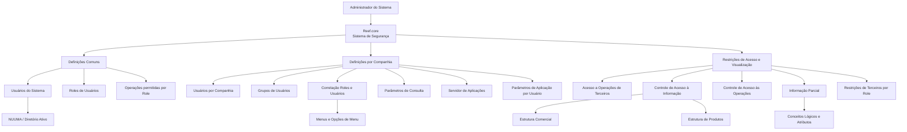
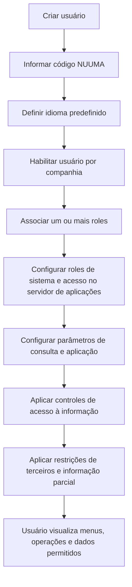

# Reef.core — Perfilado de Usuarios, Roles e Restrições de Acesso e Visualização

## 1. Metadados do Documento
- **Arquivo de Origem:** Não identificado no conteúdo fornecido
- **Tipo de Documento:** Apresentação Executiva / Manual Funcional
- **Domínio / Sistema:** Reef.core — Sistema de Segurança e perfilado de usuários
- **Público-Alvo:** Administradores de sistema, operação, desenvolvedores, arquitetos e responsáveis por configuração de companhias seguradoras
- **Data/Versão Identificada:** Não identificada

---

## 2. Resumo Executivo & Contexto de Negócio

O documento descreve o perfilado de usuários no Reef.core, com foco na configuração do denominado **Sistema de Segurança**. Esse conjunto de catálogos permite criar contas de usuários, definir papéis (roles) e estabelecer atributos operacionais de autenticação para utilização do sistema.

A configuração é dividida entre definições comuns a todas as companhias da entidade seguradora e definições específicas por companhia. As definições comuns incluem usuários do sistema, idioma predefinido, roles e operações permitidas. As definições por companhia incluem usuários habilitados, grupos de usuários, correlação entre roles e usuários, parâmetros de consulta, servidor de aplicações e parâmetros de aplicação por usuário.

O modelo de segurança do Reef.core combina controle de acesso funcional e controle de acesso à informação. Os roles determinam funcionalidades, menus e opções de menu disponíveis; controles adicionais restringem acesso a informações conforme estruturas comercial e de produtos, ramos, atividades de terceiros e critérios de informação parcial.

O documento também estabelece regras específicas para operações relacionadas a terceiros. Usuários que criam ou alteram terceiros precisam receber atividades administráveis; o código `999` representa a possibilidade de administrar todas as atividades. Restrições podem ocultar informações, permitir apenas leitura ou permitir criação sem alteração posterior.

O conteúdo apresenta regras de configuração, mas não detalha telas, APIs, contratos de integração, persistência de dados, fluxos de autenticação técnica, códigos genéricos específicos ou procedimentos operacionais de implantação.  

---

## 3. Arquitetura, Componentes & Tecnologias Envolvidas

### Componentes e conceitos identificados

| Componente / Conceito | Função descrita |
| :--- | :--- |
| **Reef.core** | Sistema que permite criar usuários, configurar roles e definir atributos operacionais de autenticação no Sistema de Segurança. |
| **Sistema de Seguridad** | Grupo de catálogos no Reef.core usado para administrar contas, roles e atributos de autenticação. |
| **Directorio activo** | Diretório ativo da entidade no qual o usuário é identificado pelo mesmo código utilizado no Reef.core: NUUMA. |
| **NUUMA** | Código de usuário utilizado para identificar o usuário no diretório ativo e na configuração do sistema. |
| **MGUA** | Referência usada para orientar os roles necessários conforme responsabilidades e requisitos dos tipos de usuário. O significado da sigla não é detalhado. |
| **Compañía** | Companhia configurada na entidade seguradora; possui usuários, roles, parâmetros e controles próprios. |
| **Estructura Comercial** | Estrutura usada para configurar controle de acesso à informação. |
| **Estructura de Productos** | Estrutura usada para configurar controle de acesso à informação. |
| **Servidor de aplicaciones** | Componente no qual são configurados roles de sistema e dados de acesso por usuário e por companhia. |
| **JSPOOL** | Ambiente ou contexto associado aos roles AJP/EJP, UJP e OJP. O documento não detalha tecnicamente a plataforma. |
| **WebTronweb** | Ambiente ou contexto associado aos roles WTWPRG e WTWADM. O documento não detalha tecnicamente a plataforma. |
| **Usuario DEFECTO** | Usuário de fallback cujos valores de parâmetros são utilizados quando não existe um parâmetro específico para o usuário conectado. |
| **COD_CIA** | Parâmetro que deve existir para todos os usuários em ambientes com mais de uma companhia, com o mesmo valor em todas as companhias nas quais o usuário estiver definido. |



### Fluxo funcional inferido do conteúdo



> **Nota de Análise:** O documento descreve uma arquitetura funcional de segurança e parametrização. Não apresenta componentes técnicos de infraestrutura, protocolos de comunicação, APIs, bases de dados, URLs, servidores físicos, portas ou mecanismos de autenticação além da referência ao diretório ativo e ao código NUUMA.

---

## 4. Regras de Negócio, Especificações Funcionais & Processos

### 4.1. Definições comuns para todas as companhias

1. Devem ser definidos os usuários da entidade.
2. Cada usuário deve possuir um idioma predefinido.
3. O usuário deve ser criado com o mesmo código de usuário, denominado **NUUMA**, utilizado para identificá-lo no diretório ativo da entidade.
4. Devem ser criados roles de usuário conforme:
   - Responsabilidades dos usuários.
   - Requisitos dos diferentes tipos de usuário.
   - Definições existentes na MGUA da companhia.
5. Cada role deve possuir as operações que poderá utilizar.
6. Uma operação não precisa ser exclusiva de um único role; a mesma operação pode estar associada a mais de um role.

### 4.2. Definições por companhia

1. Para cada companhia configurada no sistema, devem ser definidos os usuários autorizados a realizar operações naquela companhia.
2. Para usuários com role de terceiro, devem ser informados:
   - Tipo de documento.
   - Código de documento.
3. O atributo **Información Parcial** determina se o usuário terá restrições de visualização de dados nas consultas.
4. O atributo **Usuario de Agencia** determina se o usuário está identificado como empregado de agência externa.
5. Grupos de usuários representam conjuntos de usuários que compartilham características.
6. Um usuário pode receber mais de um role na mesma companhia.
7. Menus e opções de menu visualizados pelo usuário dependem dos roles associados ao usuário na companhia.
8. Os parâmetros de consulta configuram os critérios de visualização utilizados na execução de programas de consulta e definem a forma padrão de apresentação da informação.
9. Para cada companhia em que um usuário estiver definido, devem ser configurados:
   - Roles de sistema.
   - Dados de acesso ao sistema.
   - Código de usuário correspondente ao NUUMA.

### 4.3. Roles disponíveis no servidor de aplicações

| Código | Role descrito |
| :--- | :--- |
| `SUA/ADM` | Super Usuario / Administrador |
| `PRG` | Usuario / Operador |
| `AJP/EJP` | Administrador / Super Usuario JSPOOL |
| `UJP` | Usuario JSPOOL |
| `OJP` | Operador JSPOOL |
| `WTWPRG` | Operador WebTronweb |
| `WTWADM` | Administrador WebTronweb |

### 4.4. Parâmetros de aplicação por usuário

1. O programa de parâmetros de aplicação por usuário permite personalizar parâmetros de aplicação por usuário.
2. Esse programa deve ser utilizado exclusivamente por administradores do sistema.
3. Quando o sistema procura um parâmetro:
   - Primeiro busca o valor configurado para o usuário conectado.
   - Caso não encontre um valor específico, recupera o valor definido para o usuário `DEFECTO`.
4. Devem sempre existir valores de parâmetros para o usuário `DEFECTO`.
5. Em ambientes com mais de uma companhia:
   - Todos os usuários devem possuir o parâmetro `COD_CIA`.
   - O valor de `COD_CIA` deve ser o mesmo em todas as companhias nas quais o usuário estiver definido.

### 4.5. Restrições de acesso a operações de terceiros

1. Usuários que podem criar e modificar terceiros devem possuir as atividades de terceiros que podem administrar.
2. Caso um usuário possa administrar todas as atividades de terceiros, deve ser atribuído o código único `999`.

### 4.6. Controle de acesso à informação

1. O Reef.core possui controle de acesso baseado em roles de programas.
2. Além do controle por roles de programas, o Reef.core permite definir controle de acesso à informação para cada usuário da companhia.
3. O controle de acesso à informação considera:
   - Definições da Estrutura Comercial.
   - Definições da Estrutura de Produtos.
4. Para conceder acesso total a um usuário, o perfil de acesso deve ser configurado usando códigos genéricos na tabela correspondente.
5. Quando o acesso é configurado para uma Estrutura Comercial ou Estrutura de Produtos específica, o usuário somente poderá acessar informações que atendam às restrições definidas.

### 4.7. Controle de acesso às operações

1. Pode ser definido o conjunto de operações acessíveis a um usuário específico.
2. O acesso a operações pode ser restringido por ramo.
3. Quando o usuário puder acessar uma operação em todos os ramos, deve ser utilizado um código genérico.

### 4.8. Informação parcial

1. Roles de Informação Parcial permitem estabelecer restrições de visualização para usuários do sistema.
2. Cada role pode ter diversas restrições.
3. Quando a restrição for definida no nível de conceito lógico:
   - Nenhum atributo desse conceito lógico será visualizado.
4. Quando a restrição for definida no nível de atributo:
   - Somente o atributo definido deixará de ser visualizado.
5. Todo usuário sujeito a controle de informação parcial deve possuir o role de informação parcial correspondente.

### 4.9. Restrições de terceiros por role

As restrições associadas a roles e conceitos lógicos podem modular o comportamento da aplicação considerando:

1. Quais atividades de terceiros são afetadas.
2. Se uma atividade específica afeta:
   - Pessoas físicas.
   - Pessoas jurídicas.
   - Ambas.
3. A forma como a operação será restringida.

Exemplo funcional apresentado:

- Se um usuário possuir um role que afeta o conceito lógico contendo os **Contactos del Tercero**;
- Se a restrição afetar apenas consultas de informações de pessoas físicas;
- Ao consultar uma pessoa física, a aplicação não visualizará os contatos do terceiro;
- Ao consultar uma pessoa jurídica, a aplicação visualizará os contatos;
- Caso seja utilizado um valor genérico, a restrição se aplicará tanto aos dados de pessoas físicas quanto aos dados de pessoas jurídicas.

### 4.10. Tipos de acesso aplicáveis às restrições

| Código | Tipo de acesso | Regra |
| :--- | :--- | :--- |
| `O` | Oculto | A informação não é mostrada. |
| `L` | Sólo Lectura | A edição do valor não é permitida. |
| `C` | Sólo creación | A criação do dado é permitida, mas a modificação posterior não é permitida. |

---

## 5. Tabelas de Parâmetros, Ambientes e Estruturas de Dados

| Item / Parâmetro | Descrição / Função | Tipo / Valores / Formato | Ambiente / Observações |
| :--- | :--- | :--- | :--- |
| Usuário do sistema | Conta utilizada para acessar e operar o Reef.core. | Usuário identificado por código. | Deve ser criado com o mesmo NUUMA usado no diretório ativo. |
| NUUMA | Código de identificação do usuário. | Código de usuário. | Deve ser usado no diretório ativo e no servidor de aplicações. |
| Idioma predefinido | Idioma associado ao usuário. | Não detalhado. | Deve ser informado na definição do usuário. |
| Role de usuário | Define funcionalidades que o usuário pode utilizar. | Um usuário pode possuir um ou mais roles. | Criado conforme responsabilidades, requisitos e MGUA da companhia. |
| Operação | Funcionalidade que pode ser utilizada por um role. | Não detalhado. | Uma operação pode estar associada a mais de um role. |
| Usuário por companhia | Define usuários autorizados a operar em uma companhia. | Usuário associado à companhia. | Deve ser definido para cada companhia configurada. |
| Tipo e código de documento | Dados obrigatórios para usuário com role de terceiro. | Tipo e código. | Obrigatórios quando o usuário possuir role de terceiro. |
| Información Parcial | Indica se há restrições de visualização em consultas. | Indicador não detalhado. | Associado à configuração de usuário por companhia. |
| Usuario de Agencia | Indica se o usuário é empregado de agência externa. | Indicador não detalhado. | Associado à configuração de usuário por companhia. |
| Grupo de Usuarios | Conjunto de usuários com características compartilhadas. | Agrupamento lógico. | Configurado por companhia. |
| Correlação Roles e Usuarios | Associação entre usuários e roles da companhia. | Um ou mais roles por usuário. | Determina menus e opções exibidas. |
| Parámetros de Consulta | Critérios padrão de visualização em programas de consulta. | Configuração de critérios. | Configurado por usuário. |
| `SUA/ADM` | Super Usuario / Administrador. | Role de sistema. | Servidor de aplicações. |
| `PRG` | Usuario / Operador. | Role de sistema. | Servidor de aplicações. |
| `AJP/EJP` | Administrador / Super Usuario JSPOOL. | Role de sistema. | Servidor de aplicações. |
| `UJP` | Usuario JSPOOL. | Role de sistema. | Servidor de aplicações. |
| `OJP` | Operador JSPOOL. | Role de sistema. | Servidor de aplicações. |
| `WTWPRG` | Operador WebTronweb. | Role de sistema. | Servidor de aplicações. |
| `WTWADM` | Administrador WebTronweb. | Role de sistema. | Servidor de aplicações. |
| Parâmetro de aplicação por usuário | Personaliza parâmetros de aplicação por usuário. | Configuração por usuário. | Deve ser usado somente por administradores. |
| `DEFECTO` | Usuário de fallback para parâmetros de aplicação. | Usuário padrão. | Deve possuir valores de parâmetros sempre configurados. |
| `COD_CIA` | Parâmetro associado à companhia. | Valor não detalhado. | Obrigatório para todos os usuários em ambientes com mais de uma companhia; deve manter o mesmo valor em todas as companhias do usuário. |
| Atividades de terceiros | Atividades de terceiros que um usuário pode administrar. | Uma ou mais atividades. | Obrigatórias para usuários que criam ou modificam terceiros. |
| `999` | Código único para administrar todas as atividades de terceiros. | Código de atividade. | Aplicável quando o usuário administra todas as atividades. |
| Controle de acesso à informação | Restringe dados acessíveis por usuário. | Configuração por usuário e companhia. | Considera Estrutura Comercial e Estrutura de Produtos. |
| Código genérico | Permite acesso total ou aplicação de regra a todos os valores aplicáveis. | Código não especificado. | Utilizado para acesso total à informação, acesso a todos os ramos e aplicação a pessoas físicas e jurídicas. |
| Controle de acesso às operações | Restringe operações acessíveis por usuário. | Configurável por operação e ramo. | Pode usar código genérico para todos os ramos. |
| Role de Informação Parcial | Aplica restrições de visualização. | Role associado ao usuário. | Necessário para usuários sujeitos ao controle de informação parcial. |
| Conceito lógico | Agrupamento lógico de atributos sujeito a restrições. | Conceito de informação. | Restrição no nível do conceito oculta todos os atributos. |
| Atributo | Elemento individual de um conceito lógico. | Campo ou atributo. | Restrição no nível de atributo oculta somente o atributo definido. |
| `O` | Oculto. | Tipo de acesso. | Não mostra a informação. |
| `L` | Sólo Lectura. | Tipo de acesso. | Não permite editar o valor. |
| `C` | Sólo creación. | Tipo de acesso. | Permite criar, mas não modificar posteriormente. |

---

## 6. Bateria de Perguntas & Respostas para RAG (FAQ Sintético)

### P1: Qual é a finalidade do Sistema de Segurança do Reef.core?
**R:** O Sistema de Segurança do Reef.core é um conjunto de catálogos usado para criar contas de usuários, configurar roles e definir atributos operacionais de autenticação. O objetivo é controlar quais usuários podem acessar o sistema, quais funcionalidades podem utilizar e quais informações podem visualizar ou modificar.

### P2: Qual código deve ser usado para criar um usuário no Reef.core?
**R:** O usuário deve ser criado com o mesmo código de usuário utilizado para identificá-lo no diretório ativo da entidade. Esse código é denominado NUUMA no documento.

### P3: Um mesmo usuário pode possuir mais de um role na mesma companhia?
**R:** Sim. Na correlação de roles e usuários por companhia, é possível atribuir mais de um role ao mesmo usuário. Os menus e as opções de menu exibidos para o usuário dependem dos roles que ele possui na companhia.

### P4: Uma operação do sistema pode pertencer a mais de um role?
**R:** Sim. O documento estabelece que devem ser definidas as operações que cada role pode utilizar e esclarece que uma operação não precisa ser exclusiva de um único role.

### P5: O que deve ser informado quando um usuário possui role de terceiro?
**R:** Quando o usuário possuir role de terceiro, devem estar informados o tipo e o código de documento. O documento não especifica os valores possíveis para esses campos.

### P6: Como funciona o fallback de parâmetros de aplicação por usuário?
**R:** Quando o sistema procura um parâmetro de aplicação, primeiro busca a configuração específica do usuário conectado. Se não localizar esse parâmetro para o usuário, o sistema recupera o valor definido para o usuário `DEFECTO`. Por isso, sempre devem existir valores configurados para o usuário `DEFECTO`.

### P7: Qual é a regra do parâmetro COD_CIA em ambientes com múltiplas companhias?
**R:** Em ambientes com mais de uma companhia, todos os usuários devem possuir o parâmetro `COD_CIA`. Além disso, o usuário deve possuir o mesmo valor de `COD_CIA` em todas as companhias nas quais estiver definido.

### P8: Como um usuário recebe acesso total à informação no Reef.core?
**R:** Para conceder acesso total a um usuário, o perfil de acesso deve ser configurado na tabela correspondente usando códigos genéricos. O controle de acesso à informação considera as definições da Estrutura Comercial e da Estrutura de Produtos.

### P9: O que ocorre quando o acesso do usuário é configurado para uma estrutura comercial ou de produtos específica?
**R:** Quando o acesso é configurado para uma Estrutura Comercial ou Estrutura de Produtos particular, o usuário somente pode acessar informações que atendam às restrições configuradas para essas estruturas.

### P10: Qual código permite que um usuário administre todas as atividades de terceiros?
**R:** O código `999` deve ser atribuído quando o usuário puder administrar todas as atividades de terceiros. Usuários que criam ou modificam terceiros devem possuir as atividades que podem administrar.

### P11: Qual é a diferença entre uma restrição de informação parcial em nível de conceito lógico e uma restrição em nível de atributo?
**R:** Uma restrição em nível de conceito lógico impede a visualização de qualquer atributo daquele conceito lógico. Uma restrição em nível de atributo impede somente a visualização do atributo especificamente definido.

### P12: Como as restrições de terceiros podem variar entre pessoas físicas e jurídicas?
**R:** As restrições podem determinar quais atividades de terceiros são afetadas, se a restrição se aplica a pessoas físicas, pessoas jurídicas ou ambas, e como a operação deve ser restringida. No exemplo apresentado, uma restrição sobre contatos de terceiros pode ocultar os contatos em consultas a pessoas físicas, mas permitir a visualização em consultas a pessoas jurídicas. Um valor genérico aplica a restrição aos dois tipos de pessoa.

### P13: Quais tipos de acesso podem ser definidos nas restrições de terceiros por role?
**R:** O documento apresenta três tipos de acesso: `O` para ocultar a informação; `L` para permitir somente leitura, sem edição; e `C` para permitir a criação do dado, mas impedir alterações posteriores.

---

## 7. Glossário de Termos, Siglas & Conceitos-Chave

- **Reef.core:** Sistema que possui funcionalidades de criação de usuários, configuração de roles e atributos operacionais de autenticação.
- **Sistema de Seguridad:** Denominação genérica, no Reef.core, para o grupo de catálogos relacionado a contas, roles e autenticação.
- **NUUMA:** Código de usuário utilizado para identificar o usuário no diretório ativo e no sistema.
- **MGUA:** Referência utilizada para definir roles conforme responsabilidades e requisitos dos tipos de usuário da companhia. O significado da sigla não é apresentado.
- **Role:** Papel associado a um usuário, usado para determinar funcionalidades, operações, menus e opções de menu acessíveis.
- **Compañía:** Companhia configurada na entidade seguradora.
- **Tercero:** Entidade ou cadastro de terceiro sujeito a atividades, operações e restrições específicas.
- **Información Parcial:** Configuração que permite restringir a visualização de dados em consultas.
- **Usuario de Agencia:** Usuário identificado como empregado de agência externa.
- **Estructura Comercial:** Estrutura utilizada para configurar controle de acesso à informação.
- **Estructura de Productos:** Estrutura utilizada para configurar controle de acesso à informação.
- **JSPOOL:** Contexto associado aos roles AJP/EJP, UJP e OJP; o documento não fornece detalhamento técnico.
- **WebTronweb:** Contexto associado aos roles WTWPRG e WTWADM; o documento não fornece detalhamento técnico.
- **DEFECTO:** Usuário padrão cujos valores de parâmetros são recuperados quando não há um valor definido para o usuário conectado.
- **COD_CIA:** Parâmetro obrigatório para usuários em ambientes com múltiplas companhias.
- **Conceito lógico:** Elemento lógico que contém atributos e pode receber restrições de visualização.
- **Atributo:** Elemento individual de um conceito lógico que pode ser ocultado por restrição.
- **Código genérico:** Código usado para aplicar uma regra de acesso total ou uma regra comum a todos os valores aplicáveis.

---

## 8. Notas Críticas, Riscos & Limitações

- O documento não informa o nome do arquivo de origem, data, versão, autoria ou classificação documental.
- Não há detalhamento de APIs, serviços, métodos HTTP, contratos JSON, banco de dados, protocolos, URLs, servidores, portas ou processos de integração.
- A sigla **MGUA** é citada como referência para responsabilidades e requisitos de tipos de usuário, mas não é definida.
- Os significados técnicos de **JSPOOL** e **WebTronweb** não são detalhados; o conteúdo somente apresenta roles associados a esses contextos.
- Os valores concretos dos códigos genéricos para acesso total, todos os ramos e aplicação a pessoas físicas e jurídicas não são apresentados.
- Os domínios de valores para idioma, tipo de documento, código de documento, `COD_CIA`, ramos, atividades de terceiros e estruturas comerciais ou de produtos não são especificados.
- A regra de fallback para o usuário `DEFECTO` cria uma dependência operacional crítica: a ausência de parâmetros para `DEFECTO` pode comprometer a recuperação de configurações quando não houver parametrização específica do usuário.
- Em ambientes multiempresa, divergências de `COD_CIA` entre companhias podem violar a regra de consistência explicitamente exigida pelo documento.
- A atribuição inadequada do código `999` pode conceder administração sobre todas as atividades de terceiros.
- A configuração incorreta de códigos genéricos pode conceder acesso total à informação, a todos os ramos ou a pessoas físicas e jurídicas quando a intenção era restringir o acesso.
- As restrições de informação parcial exigem que o usuário receba o role correspondente; a ausência dessa associação pode impedir a aplicação da política de visualização prevista.

---

## 9. Conteúdo Bruto Estruturado (Referência Fiel)

```text
--- [SLIDE 1 DE 30: Sem Título] ---

* Perfilado
* de Usuarios

--- [SLIDE 2 DE 30: Sem Título] ---

* Índice
* 01_ Introducción
* 02_ Definiciones Comunes
* 03_ Definiciones por Compañía
* 04_ Restricciones en accesos y/o visualización

--- [SLIDE 3 DE 30: Sem Título] ---

* 01_ Introducción

--- [SLIDE 4 DE 30: Sem Título] ---

* 04
* Funcionalmente Reef.core cuenta con la posibilidad de crear las cuentas de los Usuarios que van a utilizar el Sistema, configurar sus Roles y definir los atributos operativos de autentificación en un grupo de catálogos que conforman lo que en Reef.core se denomina genéricamente como 'Sistema de Seguridad'.
* Introducción

--- [SLIDE 5 DE 30: Sem Título] ---

* 02_ Definiciones Comunes

--- [SLIDE 6 DE 30: Sem Título] ---

* 06
* Definiciones Comunes
* DEFINICIONES comunes para todas las compañías configuradas en la entidad aseguradora.
* Usuarios del sistema
* Roles de Usuarios

--- [SLIDE 7 DE 30: Sem Título] ---

* 07
* Se deben definir los usuarios de la entidad, indicando el idioma predefinido para el usuario. Los usuarios deben crearse con el mismo código de usuario (NUUMA) con el que se le identifica en el directorio activo de la Entidad
* Definiciones Comunes
* Usuarios del Sistema

--- [SLIDE 8 DE 30: Sem Título] ---

* 08
* Los roles de usuario son los que van a permitir al usuario poder usar una funcionalidad del sistema. Se deben crear los roles necesarios según las responsabilidades y requisitos de los distintos tipos de usuario que se definan en la MGUA de la compañía
* Definiciones Comunes
* Roles de Usuarios

--- [SLIDE 9 DE 30: Sem Título] ---

* 09
* Hay que definir qué operaciones va a poder usar cada uno de los roles se definan teniendo en cuenta que una operación no tiene por qué ser exclusiva de un rol
* Definiciones Comunes
* Roles de Usuario

--- [SLIDE 10 DE 30: Sem Título] ---

* 02_ Definiciones por compañía

--- [SLIDE 11 DE 30: Sem Título] ---

* 11
* Definiciones por Compañía
* DEFINICIONES a realizar por cada compañía configurada en la entidad aseguradora.
* Usuarios por compañía
* Grupos de usuarios
* Correlación de roles y usuarios
* Parámetros de Consulta
* Servidor de aplicaciones
* Parámetros de aplicación por usuario

--- [SLIDE 12 DE 30: Sem Título] ---

* Tipo y Código de Documento: Si el usuario va a tener un rol de Tercero, tienen que estar informados
* Información Parcial: establece si el usuario va a tener restricciones de visualización de datos en las consultas
* Usuario de Agencia: establece si el usuario está identificado como empleado de agencia externa
* 12
* Definiciones por Compañía
* Por cada una de las compañías definidas en el sistema tenemos que definir los usuarios que van a poder realizar operaciones en ellas
* Usuarios por Compañía

--- [SLIDE 13 DE 30: Sem Título] ---

* 13
* Definiciones por Compañía
* Se entiende por Grupo de Usuarios al conjunto de usuario que comparten características entre ellos
* Grupos de Usuarios

--- [SLIDE 14 DE 30: Sem Título] ---

* 14
* Definiciones por Compañía
* Debemos asignar a los usuarios los roles que van a tener en la compañía. Podemos asignarle más de un rol al mismo usuario.
* Correlación de Roles y Usuarios

--- [SLIDE 15 DE 30: Sem Título] ---

* 15
* Definiciones por Compañía
* Los menús y opciones de menú que visualizará el usuario dependen de los roles que tenga asignados en la compañía.
* Correlación de Roles y Usuarios

--- [SLIDE 16 DE 30: Sem Título] ---

* 16
* Definiciones por Compañía
* Configuración de los criterios de visualización asignados a los usuarios en la ejecución de los programas de consulta, configurando la forma en la que éste va a visualizar la información por defecto
* Parámetros de Consulta

--- [SLIDE 17 DE 30: Sem Título] ---

* 17
* Definiciones por Compañía
* Se tienen que configurar los roles de sistema del usuario y sus datos de acceso al sistema por cada una de las compañías en las que está el usuario. El código de usuario ha de ser el NUUMA del usuario.
* Servidor de aplicaciones
* Los posibles roles son:
* SUA/ADM  Super Usuario / Administrador
* PRG	  Usuario / Operador
* AJP/EJP	  Administrador / Super Usuario JSPOOL
* UJP	  Usuario JSPOOL
* OJP	  Operador JSPOOL
* WTWPRG	  Operador WebTronweb
* WTWADM Administrador WebTronweb

--- [SLIDE 18 DE 30: Sem Título] ---

* 18
* Definiciones por Compañía
* Este programa se usa para poder personalizar algunos parámetros de aplicación por usuario. Debe usarse únicamente por administradores del sistema. Cuando el sistema busca algún parámetro, si no lo encuentra para el usuario que está conectado, recupera el valor definido para el usuario DEFECTO, por lo que siempre tienen que existir valores para este usuario.
* Parámetros de Aplicación por Usuario
* En los entornos en los que exista más de una compañía, TODOS los usuarios tienen que tener creado el parámetro COD_CIA y deben tener asignado el mismo valor para todas las compañías en las que estén definidos.

--- [SLIDE 19 DE 30: Sem Título] ---

* 03_ Restricciones en los accesos
* y/o visualización de la información

--- [SLIDE 20 DE 30: Sem Título] ---

* 20
* Restricciones en los accesos y/o visualización de la información
* Restricciones en los accesos y/o en la visualización de la información en las pantallas de la aplicación.
* Acceso a operaciones de Terceros
* Control de Acceso a la Información
* Control de Acceso a las operaciones
* Información Parcial
* Acceso a Información de Terceros con Conceptos Lógicos/Propiedades

--- [SLIDE 21 DE 30: Sem Título] ---

* 21
* Restricciones en los accesos y/o visualización de la información
* Aquellos usuarios que puedan crear y modificar Terceros tienen que tener asignados las distintas actividades de Terceros que puede administrar. Si un usuario puede administrar todas, se le asignará un único código 999
* Acceso a Operaciones de Terceros

--- [SLIDE 22 DE 30: Sem Título] ---

* 22
* Restricciones en los accesos y/o visualización de la información
* Además del control de acceso implementado con los roles de Programas, Reef permite definir para cada Usuario de la compañía un Control en el Acceso a la información, de acuerdo con las definiciones realizadas en la Estructura Comercial y en la Estructura de Productos. Si se desea conceder a un Usuario el acceso total se debe configurar su perfil de acceso en la Tabla utilizando los códigos genéricos
* .
* Control de Acceso a la Información

--- [SLIDE 23 DE 30: Sem Título] ---

* 23
* Restricciones en los accesos y/o visualización de la información
* En cambio, si se configura su acceso para una estructura Comercial o de Productos en particular el usuario sólo tendrá acceso a la información que cumplan con estas restricciones..
* Control de Acceso a la Información

--- [SLIDE 24 DE 30: Sem Título] ---

* 24
* Restricciones en los accesos y/o visualización de la información
* Se puede definir a qué operaciones tiene acceso un usuario en particular, pudiéndose restringir por ramo. Si el usuario va a poder acceder a una operación en todos los ramos, se usa el código genérico
* Control de Acceso a las Operaciones

--- [SLIDE 25 DE 30: Sem Título] ---

* 25
* Restricciones en los accesos y/o visualización de la información
* Los Roles de Información Parcial permiten establecer restricciones en la visualización de información a los Usuarios del Sistema.
* Roles de Información Parcial

--- [SLIDE 26 DE 30: Sem Título] ---

* 26
* Definiciones por Compañía
* Cada rol puede tener establecidas diversas restricciones. Si se define a nivel de concepto lógico no se muestra la información de ningún atributo de ese concepto. Si se define a nivel de atributo, únicamente el atributo definido es el que no se visualiza
* Roles de Información Parcial

--- [SLIDE 27 DE 30: Sem Título] ---

* 27
* Definiciones por Compañía
* Todo usuario al que haya que aplicarle control de información parcial tendrá que tener asignado el rol de información parcial que corresponda
* Roles de Información Parcial

--- [SLIDE 28 DE 30: Sem Título] ---

* 28
* Definiciones por Compañía
* Reef permite profundizar en la manera en la que las restricciones, en la asignación de los Roles y Conceptos Lógicos a los Usuarios, van a modular el comportamiento de la aplicación ya que se contemplan:
  * Qué actividades de los Terceros están afectadas.
  * Si para una actividad en concreto están afectadas tanto las personas físicas como las personas jurídicas y
  * La manera en la que se restringe la operación.
* Por ejemplo, si un usuario tiene asignado un Rol que afecta al Concepto lógico que contiene los "Contactos del Tercero" y la restricción solamente afecta a las consultas de información de las personas físicas, cuando ese Usuario realice una consulta a los datos de una persona física La Aplicación no visualizaría sus Contactos, mostrándolos en cambio si la consulta se realizara para una persona Jurídica.
* Utilizando un valor genérico, la restricción aplicará tanto a los datos de personas físicas como a los datos de personas jurídicas
* .
* Restricciones de Terceros por Rol

--- [SLIDE 29 DE 30: Sem Título] ---

* 29
* Definiciones por Compañía
* Los tipos de Acceso que se pueden definir son:
* O – Oculto – No se muestra la información
* L – Sólo Lectura – No se permite la edición del valor
* C – Sólo creación – Se permite crear el dato, pero no se permite modificarlo posteriormente
* .
* Restricciones de Terceros por Rol

--- [SLIDE 30 DE 30: Sem Título] ---

* ¡Gracias!
```
