# Autenticação de Usuários no Ecossistema Reef.core

## 1. Metadados do Documento
- **Arquivo de Origem:** Não identificado no conteúdo fornecido
- **Tipo de Documento:** Arquitetura de Software / Apresentação Executiva
- **Domínio / Sistema:** Reef.core, NewTRON, Tronweb, Verticales, Fuji / GDC, APIs e Mapfre
- **Público-Alvo:** Desenvolvedores, Arquitetos e Operação
- **Data/Versão Identificada:** Versões 23.01 e 21.09; demais data/versão não identificadas

---

## 2. Resumo Executivo & Contexto de Negócio

O documento define o modelo homogêneo de autenticação de usuários adotado pelo Reef.core para os frontais e APIs existentes. O provedor de identidade (IDP) indicado para o fluxo padrão é o Entra ID, com uso de OAuth como perfil padrão em todos os ambientes.

A apresentação diferencia os perfis de autenticação por aplicação. NewTRON utiliza a propriedade `app.env.nwt.security`; Tronweb possui autenticação OAuth2 baseada em Entra ID desde a versão 23.01; Verticales usa `app.env.spring.active.profile.user`; Fuji / GDC usa `app.env.profiles`; e APIs utiliza `app.env.spring.active.profile`.

O conteúdo também registra mecanismos legados ou depreciados. Esses mecanismos incluem autenticação direta contra banco de dados, autenticação LDAP, segurança por cabeçalho e autenticação com diretório corporativo. Para Tronweb, o documento destaca que a autenticação LDAP usava anteriormente uma biblioteca baseada no protocolo SMB1, considerado inseguro, e que, desde a versão 21.09, utiliza JNDI.

A gestão de acesso no Entra ID ocorre por meio de um registro de aplicação específico para cada aplicação e para cada Reef. Esses registros podem conter grupos de usuários para limitar o acesso. Todos os registros de aplicação do Reef ficam no tenant de produção.

Quando um ativo precisa autenticar usuários externos ou finais associados à Mapfre, como dealers e clientes, o documento informa o uso da plataforma Okta, referenciando `https://www.okta.com/`.

---

## 3. Arquitetura, Componentes & Tecnologias Envolvidas

### Componentes, aplicações e mecanismos identificados

| Componente / Tecnologia | Papel descrito no documento | Situação / Observações |
| :--- | :--- | :--- |
| Reef.core | Define o processo homogêneo de autenticação para frontais e APIs existentes. | Componente central do modelo de autenticação apresentado. |
| Entra ID | Provedor de identidade (IDP) do processo padrão de autenticação. | OAuth é o perfil padrão em todos os ambientes. |
| OAuth | Perfil de autenticação padrão. | Utiliza Entra ID como IDP. |
| OAuth2 | Mecanismo usado pela autenticação Entra ID no Tronweb. | Fluxo ROPC; disponível desde a versão 23.01. |
| ROPC | Fluxo OAuth2 utilizado pelo Tronweb para autenticação com Entra ID. | O documento não expande a sigla nem detalha o contrato do fluxo. |
| NewTRON | Aplicação configurada pela propriedade `app.env.nwt.security`. | Aceita os perfis `demo`/`mock`, `sso`, `real` e `ldap`. |
| Tronweb | Aplicação com opções de autenticação Entra ID, banco de dados e diretório ativo. | Entra ID disponível desde 23.01; opções de banco de dados e LDAP depreciadas. |
| Verticales | Conjunto de aplicações configuradas por `app.env.spring.active.profile.user`. | Suporta Entra ID, mock, LDAP depreciado e SSO por cabeçalho depreciado. |
| Fuji / GDC | Aplicações configuradas por `app.env.profiles`. | Suporta desenvolvimento, Entra ID, LDAP depreciado e SSO por cabeçalho depreciado. |
| APIs | Aplicações configuradas por `app.env.spring.active.profile`. | Incluem autenticação mock e, adicionalmente, OAuth. |
| zeroConfig | Módulo de projeto que disponibiliza os perfis de configuração citados. | Referenciado para NewTRON, Verticales, Fuji / GDC e APIs. |
| LDAP | Mecanismo de autenticação contra diretório corporativo ou diretório ativo. | Marcado como depreciado em vários contextos. |
| JNDI | Tecnologia usada na autenticação LDAP do Tronweb desde a versão 21.09. | Substituiu a biblioteca anterior baseada em SMB1. |
| SMB1 | Protocolo utilizado por uma biblioteca LDAP anterior do Tronweb. | Considerado inseguro no documento. |
| Banco de dados | Fonte de credenciais na autenticação Tronweb depreciada. | Consulta a tabela `G1010108`. |
| Okta | Plataforma usada para autenticação de usuários externos ou finais associados à Mapfre. | Aplicável a dealers e clientes. |
| Mapfre | Contexto associado a usuários externos ou finais autenticados por Okta. | O documento cita dealers e clientes como exemplos. |

```mermaid
graph TD
    A[Frontais e APIs existentes] --> B[Processo homogêneo de autenticação Reef.core]
    B --> C[Entra ID como IDP]
    C --> D[OAuth como perfil padrão]

    E[NewTRON] --> E1[app.env.nwt.security]
    E1 --> E2[demo / mock]
    E1 --> E3[sso - OAuth]
    E1 --> E4[real - depreciado]
    E1 --> E5[ldap - depreciado]

    F[Tronweb] --> F1[Entra ID via OAuth2 e fluxo ROPC]
    F --> F2[Autenticação BBDD - depreciada]
    F --> F3[Autenticação LDAP - depreciada]
    F3 --> F4[JNDI desde versão 21.09]

    G[Verticales] --> G1[app.env.spring.active.profile.user]
    G1 --> G2[oauth2-login-security]
    G1 --> G3[mock-security]
    G1 --> G4[ldap-security - depreciado]
    G1 --> G5[sso-security - depreciado]

    H[Fuji / GDC] --> H1[app.env.profiles]
    H1 --> H2[dev-security]
    H1 --> H3[aad-security]
    H1 --> H4[ldap-security - depreciado]
    H1 --> H5[sso-security - depreciado]

    I[APIs] --> I1[app.env.spring.active.profile]
    I1 --> I2[demo-security]
    I1 --> I3[real-security - depreciado]
    I --> I4[OAuth adicional]

    J[Ativos com clientes finais Mapfre] --> K[Okta]
```



> **Nota de Análise:** O documento lista configurações de autenticação, mas não descreve URLs de callback, escopos OAuth, emissão ou validação de tokens, contratos HTTP, portas, políticas de expiração de sessão ou detalhes de autorização além do uso de grupos no Entra ID.

---

## 4. Regras de Negócio, Especificações Funcionais & Processos

### Processo transversal de autenticação Reef.core

1. O Reef.core define um processo de autenticação homogêneo para todos os frontais e APIs existentes.
2. O Entra ID atua como provedor de identidade (IDP) nesse processo.
3. OAuth é o perfil padrão em todos os ambientes.
4. O perfil `mock` / `demo` é destinado ao desenvolvimento e normalmente realiza login como o usuário `TRON2000`.
5. Os perfis `real` e `ldap` são considerados depreciados no contexto geral apresentado.
6. O perfil `real` autentica diretamente contra banco de dados e foi utilizado anteriormente em instalações on-premise.
7. O perfil LDAP autentica contra o diretório corporativo e foi utilizado anteriormente em instalações on-premise.

### NewTRON

1. A configuração de autenticação de NewTRON é realizada pela propriedade `app.env.nwt.security`.
2. A propriedade está disponível nos perfis do módulo `zeroConfig` do projeto.
3. Os valores disponíveis são:
   - `demo` / `mock`
   - `sso` (`oauth`)
   - `real` — depreciado
   - `ldap` — depreciado

### Tronweb

1. A autenticação com Entra ID está disponível desde a versão `23.01`.
2. A autenticação com Entra ID usa OAuth2 com fluxo ROPC.
3. A autenticação de banco de dados está depreciada.
4. A autenticação de banco de dados usa as colunas `COD_SAPTRON` e `TXT_CLAVE_SAPTRON` da tabela `G1010108`.
5. Na autenticação de banco de dados:
   - `COD_SAPTRON` representa o nome de usuário.
   - `TXT_CLAVE_SAPTRON` representa a chave criptografada.
   - As credenciais são verificadas pela recuperação desses valores por consulta ao banco de dados.
6. A autenticação com Diretório Ativo está depreciada.
7. Até a versão `21.09`, a autenticação LDAP usava uma biblioteca baseada no protocolo SMB1.
8. O documento classifica SMB1 como inseguro.
9. Desde a versão `21.09`, a autenticação LDAP usa JNDI.

### Verticales

1. A propriedade de configuração é `app.env.spring.active.profile.user`.
2. A propriedade está disponível nos perfis do módulo `zeroConfig`.
3. O valor `oauth2-login-security` habilita login com Entra ID.
4. O valor `mock-security` habilita login mockado:
   - O usuário padrão é `TRON2000`.
   - Caso a propriedade `usrVal` seja informada na URL, o login mockado pode usar esse valor.
5. O valor `ldap-security` é depreciado e corresponde à segurança contra LDAP.
6. O valor `sso-security` é depreciado e corresponde à segurança por cabeçalho.
7. Um valor vazio para a propriedade equivale a um formulário de login simulado, correspondente a `mock-security`.

### Fuji / GDC

1. A propriedade de configuração é `app.env.profiles`.
2. A propriedade está disponível nos perfis do módulo `zeroConfig`.
3. O valor `dev-security` fornece acesso de desenvolvimento como administrador.
4. O valor `aad-security` habilita autenticação com Entra ID.
5. O valor `ldap-security` está depreciado e habilita autenticação via LDAP.
6. O valor `sso-security` está depreciado:
   - Realiza autenticação pelo cabeçalho `REMOTE_USER`.
   - Realiza autorização via LDAP.

### APIs

1. A propriedade de configuração é `app.env.spring.active.profile`.
2. A propriedade está disponível nos perfis do módulo `zeroConfig`.
3. O valor `demo-security` habilita acesso com usuário mockado `APITRON`.
4. O valor `real-security` está depreciado e corresponde à autenticação com LDAP.
5. Além da autenticação com usuário mockado, as APIs possuem autenticação OAuth adicional.

### Configuração de acesso no Entra ID

1. Cada aplicação deve ter o próprio registro de aplicação para cada Reef.
2. Cada registro de aplicação pode configurar grupos de usuários.
3. Os grupos de usuários podem ser usados para limitar o acesso a cada aplicação.
4. Todos os registros de aplicação Reef estão no tenant de produção.

### Ativos associados a clientes finais

1. Quando um ativo necessita autenticar usuários externos ou finais associados à Mapfre, deve-se utilizar a plataforma Okta.
2. O documento cita dealers e clientes como exemplos de usuários externos ou finais associados à Mapfre.

---

## 5. Tabelas de Parâmetros, Ambientes e Estruturas de Dados

### Perfis gerais de autenticação

| Item / Parâmetro | Descrição / Função | Tipo / Valores / Formato | Ambiente / Observações |
| :--- | :--- | :--- | :--- |
| Perfil `mock` / `demo` | Perfil de desenvolvimento; normalmente realiza login com o usuário `TRON2000`. | `mock`, `demo` | Destinado a desenvolvimento. |
| Perfil `oauth` | Perfil padrão de autenticação. | OAuth com Entra ID como IDP | Perfil padrão em todos os ambientes. |
| Perfil `real` | Autenticação direta contra banco de dados. | `real` | Depreciado; utilizado anteriormente em instalações on-premise. |
| Perfil `ldap` | Autenticação contra diretório corporativo. | `ldap` | Depreciado; utilizado anteriormente em instalações on-premise. |

### NewTRON

| Item / Parâmetro | Descrição / Função | Tipo / Valores / Formato | Ambiente / Observações |
| :--- | :--- | :--- | :--- |
| `app.env.nwt.security` | Define o perfil de autenticação da aplicação NewTRON. | `demo` / `mock`; `sso`; `real`; `ldap` | Disponível nos perfis do módulo `zeroConfig`. |
| `demo` / `mock` | Perfil de demonstração ou mock. | Valor de configuração | Não há detalhamento adicional específico para NewTRON. |
| `sso` | Perfil associado a OAuth. | Valor de configuração | Indicado como `sso (oauth)`. |
| `real` | Perfil de autenticação real. | Valor de configuração | Depreciado. |
| `ldap` | Perfil de autenticação LDAP. | Valor de configuração | Depreciado. |

### Tronweb

| Item / Parâmetro | Descrição / Função | Tipo / Valores / Formato | Ambiente / Observações |
| :--- | :--- | :--- | :--- |
| Entra ID | Autenticação OAuth2 com fluxo ROPC. | OAuth2 / ROPC | Disponível desde a versão `23.01`. |
| `COD_SAPTRON` | Nome de usuário usado na autenticação de banco de dados. | Coluna da tabela `G1010108` | Autenticação depreciada. |
| `TXT_CLAVE_SAPTRON` | Chave criptografada usada na autenticação de banco de dados. | Coluna da tabela `G1010108` | Autenticação depreciada. |
| `G1010108` | Tabela consultada para validação das credenciais. | Tabela de banco de dados | Usada pela autenticação de banco de dados depreciada. |
| LDAP anterior | Autenticação LDAP por biblioteca que utiliza SMB1. | Biblioteca / SMB1 | Aplicável até a versão `21.09`; SMB1 é considerado inseguro. |
| LDAP atual | Autenticação LDAP via JNDI. | JNDI | Aplicável desde a versão `21.09`. |

### Verticales

| Item / Parâmetro | Descrição / Função | Tipo / Valores / Formato | Ambiente / Observações |
| :--- | :--- | :--- | :--- |
| `app.env.spring.active.profile.user` | Define o perfil de autenticação das aplicações Verticales. | Propriedade de configuração | Disponível nos perfis do módulo `zeroConfig`. |
| `oauth2-login-security` | Login com Entra ID. | Valor de perfil | Não há detalhamento adicional sobre o fluxo. |
| `mock-security` | Login mockado. | Valor de perfil | Usuário `TRON2000` ou valor de `usrVal` informado na URL. |
| `ldap-security` | Segurança contra LDAP. | Valor de perfil | Depreciado. |
| `sso-security` | Segurança por cabeçalho. | Valor de perfil | Depreciado. |
| Valor vazio | Formulário de login simulado. | Propriedade sem valor | Equivale a `mock-security`. |
| `usrVal` | Propriedade que pode ser recebida na URL. | Parâmetro de URL | Usada pelo `mock-security`. |

### Fuji / GDC

| Item / Parâmetro | Descrição / Função | Tipo / Valores / Formato | Ambiente / Observações |
| :--- | :--- | :--- | :--- |
| `app.env.profiles` | Define o perfil de autenticação das aplicações Fuji / GDC. | Propriedade de configuração | Disponível nos perfis do módulo `zeroConfig`. |
| `dev-security` | Acesso de desenvolvimento como administrador. | Valor de perfil | Não há detalhamento adicional sobre a identidade de administrador. |
| `aad-security` | Autenticação com Entra ID. | Valor de perfil | Não há detalhamento adicional sobre o fluxo. |
| `ldap-security` | Autenticação via LDAP. | Valor de perfil | Depreciado. |
| `sso-security` | Autenticação por cabeçalho e autorização via LDAP. | Valor de perfil | Depreciado; utiliza `REMOTE_USER`. |
| `REMOTE_USER` | Cabeçalho utilizado na autenticação `sso-security`. | Cabeçalho | Autorização complementar via LDAP. |

### APIs

| Item / Parâmetro | Descrição / Função | Tipo / Valores / Formato | Ambiente / Observações |
| :--- | :--- | :--- | :--- |
| `app.env.spring.active.profile` | Define o perfil de autenticação das APIs. | Propriedade de configuração | Disponível nos perfis do módulo `zeroConfig`. |
| `demo-security` | Acesso com usuário mockado. | Valor de perfil | Usuário mockado: `APITRON`. |
| `real-security` | Autenticação com LDAP. | Valor de perfil | Depreciado. |
| OAuth adicional | Autenticação adicional disponível para APIs. | OAuth | Coexiste com a autenticação de usuário mockado. |

### Registros Entra ID e autenticação externa

| Item / Parâmetro | Descrição / Função | Tipo / Valores / Formato | Ambiente / Observações |
| :--- | :--- | :--- | :--- |
| Registro de aplicação | Registro próprio por aplicação e por Reef. | Configuração Entra ID | Todos os registros Reef ficam no tenant de produção. |
| Grupos de usuários | Limitam o acesso a cada aplicação. | Grupos configuráveis | Configurados dentro dos registros de aplicação. |
| Tenant de produção | Tenant onde residem todos os registros de aplicação Reef. | Tenant Entra ID | O documento não informa identificador do tenant. |
| Okta | Plataforma de autenticação para usuários externos ou finais associados à Mapfre. | Plataforma externa | Aplicável a dealers e clientes. |
| `https://www.okta.com/` | URL referenciada para a plataforma Okta. | URL | Única URL apresentada no conteúdo. |

---

## 6. Bateria de Perguntas & Respostas para RAG (FAQ Sintético)

### P1: Qual é o provedor de identidade definido pelo Reef.core para o processo homogêneo de autenticação?
**R:** O Reef.core define o Entra ID como provedor de identidade, ou IDP, para o processo homogêneo de autenticação dos frontais e APIs existentes. OAuth é apresentado como o perfil padrão em todos os ambientes.

### P2: Quais tipos de autenticação são mencionados no modelo geral do Reef.core?
**R:** O documento menciona `mock` / `demo`, OAuth, `real` e LDAP. O perfil `mock` / `demo` é destinado ao desenvolvimento e normalmente usa o usuário `TRON2000`; OAuth usa o Entra ID como IDP; `real` autentica diretamente contra banco de dados e está depreciado; LDAP autentica contra o diretório corporativo e também está depreciado.

### P3: Qual propriedade configura a autenticação da aplicação NewTRON?
**R:** A aplicação NewTRON é configurada pela propriedade `app.env.nwt.security`, disponível nos perfis do módulo `zeroConfig`. Os valores listados são `demo` / `mock`, `sso` (`oauth`), `real` depreciado e `ldap` depreciado.

### P4: Desde quando o Tronweb disponibiliza autenticação com Entra ID e qual fluxo utiliza?
**R:** O Tronweb disponibiliza autenticação com Entra ID desde a versão `23.01`. Essa autenticação usa OAuth2 com o fluxo ROPC. O documento não detalha endpoints, escopos, contratos ou parâmetros do fluxo ROPC.

### P5: Como funcionava a autenticação de banco de dados depreciada do Tronweb?
**R:** A autenticação de banco de dados do Tronweb utilizava a tabela `G1010108`. A coluna `COD_SAPTRON` representa o nome de usuário e a coluna `TXT_CLAVE_SAPTRON` representa a chave criptografada. A verificação das credenciais ocorria pela consulta e recuperação desses valores no banco de dados. Esse mecanismo está marcado como depreciado.

### P6: Qual mudança ocorreu na autenticação LDAP do Tronweb a partir da versão 21.09?
**R:** Até a versão `21.09`, a autenticação LDAP do Tronweb utilizava uma biblioteca baseada no protocolo SMB1, que o documento classifica como inseguro. Desde a versão `21.09`, a autenticação LDAP passou a ser realizada mediante JNDI.

### P7: Como configurar login mockado nas aplicações Verticales?
**R:** Nas aplicações Verticales, deve-se usar a propriedade `app.env.spring.active.profile.user` com o valor `mock-security`. O login mockado utiliza o usuário `TRON2000` ou, se a propriedade `usrVal` estiver informada na URL, utiliza o valor recebido nessa propriedade. Um valor vazio para a propriedade corresponde a um formulário de login simulado, equivalente a `mock-security`.

### P8: Qual perfil habilita autenticação com Entra ID nas aplicações Verticales?
**R:** O perfil `oauth2-login-security`, configurado pela propriedade `app.env.spring.active.profile.user`, habilita o login com Entra ID nas aplicações Verticales. A propriedade é disponibilizada nos perfis do módulo `zeroConfig`.

### P9: Quais são os perfis de segurança das aplicações Fuji / GDC?
**R:** Fuji / GDC usa a propriedade `app.env.profiles`. Os perfis são `dev-security`, para acesso de desenvolvimento como administrador; `aad-security`, para autenticação com Entra ID; `ldap-security`, para autenticação via LDAP e depreciado; e `sso-security`, depreciado, para autenticação pelo cabeçalho `REMOTE_USER` com autorização via LDAP.

### P10: Qual perfil de autenticação mockada é usado pelas APIs e qual usuário ele utiliza?
**R:** As APIs usam a propriedade `app.env.spring.active.profile`. O perfil `demo-security` fornece acesso com o usuário mockado `APITRON`. O documento também declara que, além da autenticação mockada, existe autenticação OAuth adicional para APIs.

### P11: Como os registros de aplicação do Entra ID são organizados para aplicações Reef?
**R:** Cada aplicação possui o próprio registro de aplicação para cada Reef. Dentro de cada registro podem ser configurados grupos de usuários para restringir o acesso à aplicação. Todos os registros de aplicação Reef ficam no tenant de produção.

### P12: Quando deve ser usada a plataforma Okta no contexto apresentado?
**R:** A plataforma Okta deve ser usada quando um ativo precisar autenticar usuários externos ou finais associados à Mapfre, incluindo dealers e clientes. O documento referencia a URL `https://www.okta.com/`.

---

## 7. Glossário de Termos, Siglas & Conceitos-Chave

- **AAD:** Sigla presente no perfil `aad-security`; o documento associa esse perfil à autenticação com Entra ID, sem expandir a sigla.
- **API:** Aplicação ou interface identificada no documento como configurável pela propriedade `app.env.spring.active.profile`.
- **BBDD:** Abreviação usada no conteúdo para banco de dados.
- **Entra ID:** Provedor de identidade (IDP) definido pelo Reef.core para o processo padrão de autenticação.
- **IDP:** Provedor de identidade; no documento, Entra ID.
- **JNDI:** Mecanismo usado na autenticação LDAP do Tronweb desde a versão `21.09`.
- **LDAP:** Mecanismo de autenticação contra diretório corporativo ou diretório ativo; marcado como depreciado em múltiplos contextos.
- **Mock / Demo:** Perfil de autenticação voltado ao desenvolvimento, normalmente associado ao usuário `TRON2000`.
- **OAuth:** Perfil padrão de autenticação em todos os ambientes, usando Entra ID como IDP.
- **OAuth2:** Protocolo utilizado pela autenticação Entra ID no Tronweb.
- **Okta:** Plataforma usada para autenticação de usuários externos ou finais associados à Mapfre.
- **On-premise:** Tipo de instalação anterior mencionado para os mecanismos `real` e LDAP.
- **REMOTE_USER:** Cabeçalho usado no perfil `sso-security` de Fuji / GDC.
- **ROPC:** Fluxo OAuth2 utilizado pelo Tronweb para autenticação com Entra ID; a expansão da sigla não é fornecida no documento.
- **SMB1:** Protocolo utilizado por biblioteca LDAP anterior do Tronweb, considerado inseguro.
- **SSO:** Perfil ou mecanismo de segurança identificado como `sso`, `sso-security` ou segurança por cabeçalho, conforme a aplicação.
- **zeroConfig:** Módulo do projeto cujos perfis disponibilizam as propriedades de autenticação citadas.

---

## 8. Notas Críticas, Riscos & Limitações

- A autenticação `real` está depreciada e era usada anteriormente em instalações on-premise.
- A autenticação LDAP está depreciada nos contextos gerais, NewTRON, Verticales, Fuji / GDC e APIs.
- A autenticação de banco de dados do Tronweb está depreciada e consulta dados de credencial na tabela `G1010108`.
- A autenticação com Diretório Ativo do Tronweb está depreciada.
- Até a versão `21.09`, uma implementação LDAP do Tronweb dependia de SMB1, protocolo explicitamente classificado como inseguro.
- A migração para JNDI na autenticação LDAP do Tronweb é indicada desde a versão `21.09`.
- Todos os registros de aplicação Reef no Entra ID estão no tenant de produção; o documento não detalha estratégias de segregação por ambiente, identificadores de tenant ou processo de administração desses registros.
- O conteúdo não descreve políticas de senha, MFA, expiração de token, renovação de sessão, revogação, escopos OAuth, endpoints, certificados, segredo de cliente, grupos específicos ou critérios detalhados de autorização.
- O documento não fornece detalhes adicionais sobre métodos HTTP, contratos JSON, URLs de integração ou mecanismos concretos de autenticação OAuth para as APIs.

---

## 9. Conteúdo Bruto Estruturado (Referência Fiel)

```text
--- [SLIDE 1 DE 17: Sem Título] ---

* Autenticación de Usuarios

--- [SLIDE 2 DE 17: Sem Título] ---

* Índice
* 01_ Introducción
* 02_ Tipos de autenticación
* 03_ Definiciones por Aplicación
* 04_ Configuración Entra ID
* 05_ Activos con clientes finales

--- [SLIDE 3 DE 17: Sem Título] ---

* 01_ Introducción

--- [SLIDE 4 DE 17: Sem Título] ---

* 01
* Desde Reef.core se ha definido un proceso de autenticación de forma homogénea para todos los frontales o APIs existentes. Este proceso cuenta con Entra ID como proveedor de identidad (IDP).
* Introducción

--- [SLIDE 5 DE 17: Sem Título] ---

* 02_ Tipos de autenticación

--- [SLIDE 6 DE 17: Sem Título] ---

* 02
* Tipos de autenticación
* Mock / demo: Perfil para desarrollo. Habitualmente se hace login como el usuario “TRON2000”.
* OAuth: Perfil por defecto en todos los entornos. Utiliza Entra ID como IDP.
* Real (deprecado): Perfil que autentica contra base de datos directamente. Utilizado anteriormente en instalaciones on-premise
* LDAP (deprecado): Perfil que autentica contra el directorio corporativo. Utilizado anteriormente en las instalaciones on-premise.

--- [SLIDE 7 DE 17: Sem Título] ---

* 03_ Definiciones por aplicación

--- [SLIDE 8 DE 17: Sem Título] ---

* 03
* Para esta aplicación se debe configurar la propiedad app.env.nwt.security. Está disponible en los perfiles del modulo zeroConfig disponible en el Proyecto.
* Existen los siguientes valores:
* demo / mock
* sso (oauth)
* real (deprecado)
* ldap (deprecado)
* Definiciones Por aplicación
* NewTRON

--- [SLIDE 9 DE 17: Sem Título] ---

* 03
* Autenticación con Entra ID. Disponible desde la versión 23.01. Esta autenticación utiliza autenticación OAuth2 con flujo ROPC.
* Autenticación de BBDD (deprecado). Utiliza los valores de las columnas COD_SAPTRON (nombre de usuario) y TXT_CLAVE_SAPTRON (clave encriptada) de la tabla G1010108. Para comprobar las credenciales del usuario se recuperan esos valores mediante una consulta a la BBDD.
* Autenticación con Directorio Activo (deprecado).
  * Hasta la versión 21.09 esta autenticación hacía uso de una librería que utiliza el protocolo smb1 que es considerado inseguro.
  * Desde la versión 21.09 la autenticación LDAP se hace mediante JNDI.
* Definiciones por aplicación
* Tronweb

--- [SLIDE 10 DE 17: Sem Título] ---

* 03
* Para estas aplicaciones se debe configurar la propiedad app.env.spring.active.profile.user.
* Está disponible en los perfiles del modulo zeroConfig disponible en el Proyecto.
* Existen los siguientes valores:
* oauth2-login-security: login con Entra ID.
* mock-security: login mockeado, usuario TRON2000 o si viene informada en la URL la propiedad usrVal
* ldap-security (deprecado): seguridad contra LDAP
* sso-security (deprecado): seguridad por cabecera
* <vacío>: formulario de login simulado (mock-security)
* Definiciones Por aplicación
* Verticales

--- [SLIDE 11 DE 17: Sem Título] ---

* 03
* Definiciones Por aplicación
* Para estas aplicaciones se debe configurar la propiedad app.env.profiles.
* Está disponible en los perfiles del modulo zeroConfig disponible en el Proyecto.
* Existen los siguientes valores:
* dev-security: Acceso de desarrollo como administrador.
* aad-security: Autenticación con Entra ID.
* ldap-security (deprecado): Autenticación via LDAP
* sso-security (deprecado): Autenticación por cabecera REMOTE_USER y autorización via LDAP.
* Fuji / GDC

--- [SLIDE 12 DE 17: Sem Título] ---

* Definiciones Por aplicación
* APIs
* 03
* Para estas aplicaciones se debe configurar la propiedad app.env.spring.active.profile.
* Está disponible en los perfiles del modulo zeroConfig disponible en el Proyecto.
* Existen los siguientes valores:
* demo-security: Acceso con usuario mockeado (APITRON)
* real-security (deprecado): Autenticación con LDAP.
* En este caso para las apis, a parte de la autenticación con usuario mockeado, existe de forma adicional autenticación con OAuth.

--- [SLIDE 13 DE 17: Sem Título] ---

* 04_ Configuración Entra ID

--- [SLIDE 14 DE 17: Sem Título] ---

* 04
* Configuración Entra ID
* Cada aplicación tendrá su propio registro de aplicación, para cada Reef. Dentro de estos, se podrán configurar grupos de usuarios para limitar el acceso a cada aplicación.
* Todos los registros de aplicación de Reef estarán en el tenant de producción.

--- [SLIDE 15 DE 17: Sem Título] ---

* 05_ Activos con clientes finales

--- [SLIDE 16 DE 17: Sem Título] ---

* 05
* Activos con clientes finales
* Cuando un activo necesita autenticar usuarios externos o finales asociados con Mapfre (dealers, clientes), se utiliza la plataforma de Okta (https://www.okta.com/)

--- [SLIDE 17 DE 17: Sem Título] ---

* ¡Gracias!
```
