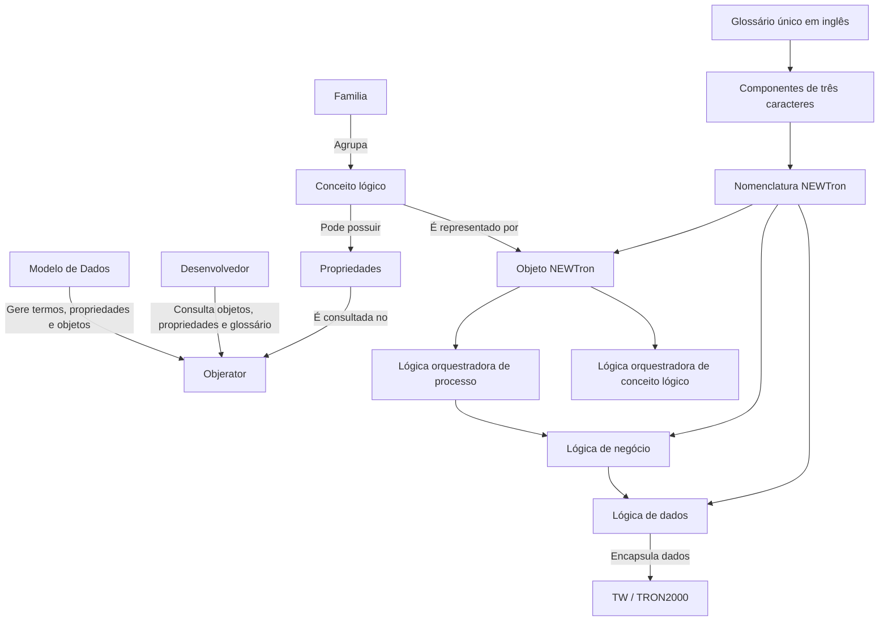

# Core — Nomenclatura NEWTron, Conceitos Lógicos, Objetos e Objerator

## 1. Metadados do Documento
- **Arquivo de Origem:** Não identificado no conteúdo extraído
- **Tipo de Documento:** Apresentação Executiva / Material de Formação Técnica
- **Domínio / Sistema:** Core, TRON2000, NEWTron, Modelo de Dados e Objerator
- **Público-Alvo:** Desenvolvedores, Arquitetos, Modelo de Dados e equipes de operação técnica
- **Data/Versão Identificada:** Não identificada

---

## 2. Resumo Executivo & Contexto de Negócio

O documento apresenta uma formação básica sobre a nomenclatura utilizada no ecossistema Core/NEWTron. O foco central é permitir que desenvolvedores compreendam os conceitos de família, conceito lógico, objeto, objeto conjunto, propriedade e componentes de nomenclatura antes de criar ou consultar artefatos técnicos no Modelo de Dados.

A apresentação estabelece que um objeto NEWTron representa um conceito lógico por meio de uma estrutura de dados. Além das informações funcionais do conceito lógico, um objeto contém informações de processo. Cada conceito lógico pertence exclusivamente a uma família, que agrupa conceitos relacionados a um mesmo âmbito funcional ou não funcional.

A nomenclatura NEWTron usa componentes padronizados, geralmente formados por três letras e/ou números em inglês. A posição dos componentes, a separação por sublinhado (`_`) ou por letras maiúsculas e a utilização de um glossário único permitem identificar a finalidade e o conteúdo de tabelas, objetos, lógicas de dados, lógicas de processo e propriedades.

Objerator é apresentado como o repositório de termos, propriedades e objetos. A ferramenta permite consultar objetos, propriedades e glossário; também permite identificar em quais objetos uma propriedade está definida. O material indica URLs de consulta direta ao Objerator, com parâmetros como família (`fml`) e objeto (`obj`).

O conteúdo não detalha contratos HTTP, estruturas JSON, mecanismos de autenticação, permissões de acesso, responsáveis pelo processo de solicitação ao Modelo de Dados ou a lista completa de famílias. O material menciona a necessidade de localizar um e-mail sobre como solicitar termos, propriedades e objetos ao Modelo de Dados, mas não apresenta esse procedimento.

---

## 3. Arquitetura, Componentes & Tecnologias Envolvidas

### Componentes e conceitos identificados

| Componente / Conceito | Descrição sustentada pelo documento |
| :--- | :--- |
| Core | Contexto identificado no cabeçalho da apresentação sobre nomenclatura. |
| TRON2000 | Sistema ou contexto de nomenclatura legado usado nas tabelas de correspondência com NEWTron. |
| NEWTron | Contexto de nomenclatura para conceitos lógicos, objetos, propriedades, lógicas e componentes. |
| Modelo de Dados | Responsável ou gestor indicado para solicitações de termos, propriedades e objetos no Objerator. |
| Objerator | Repositório e ferramenta de consulta de termos, propriedades e objetos. |
| Família | Agrupador de conceitos lógicos de um mesmo grupo funcional ou não funcional. |
| Conceito lógico | Conceito representado tecnicamente por um objeto. |
| Objeto | Estrutura de dados que contém informação funcional do conceito lógico e informação de processo. |
| Objeto conjunto | Tipo de objeto identificado pelo sufixo `pt` nos exemplos apresentados. |
| Propriedade | Elemento consultável no Objerator; a ferramenta permite verificar em quais objetos uma propriedade foi definida. |
| Lógica de processo | Lógica nomeada com componentes associados a serviços, operações e conceitos lógicos. |
| Lógica orquestradora de processo | Camada apresentada como “Lógica Orquestador de Proceso”. |
| Lógica orquestradora de conceito lógico | Camada indicada como orquestradora de propriedades. |
| Lógica de negócio | Camada com ações como bloquear, comprovar, calcular, validar e personalizar. |
| Lógica de dados | Camada com ações como consultar, atualizar, transferir, apagar e apilar. |
| TW | Sistema citado no fluxo de integração NEWTron para TW e no encapsulamento de dados TW em objetos NEWTron. |



### Exemplos de objetos e objetos conjuntos

| Tipo | Exemplo | Observação |
| :--- | :--- | :--- |
| Objeto de pessoa | `o_thp_prs_p` | Exemplo de objeto associado a Pessoa. |
| Objeto de atividade | `o_thp_acv_p` | Exemplo de objeto associado a Actividad. |
| Objeto de endereço | `o_thp_adr_p` | Exemplo de objeto associado a Dirección. |
| Objeto de recibo de prima | `o_rcp_pmr_p` | Exemplo de objeto associado a Recibo prima. |
| Objeto conjunto de pessoa | `o_thp_prs_pt` | Exemplo de Persona Conjunto. |
| Objeto conjunto de atividade | `o_thp_acv_pt` | Exemplo de Actividad Conjunto. |
| Objeto conjunto de recibo de prima | `o_rcp_pmr_pt` | Exemplo de Recibo prima Cjto. |

> **Nota de Análise:** O documento mostra diagramas visuais para a visão funcional-técnica de objetos e para a formação de propriedades, mas a extração textual não contém os detalhes internos das imagens. Portanto, não é possível reconstruir fielmente esses diagramas além das informações textuais e das notas disponíveis.

---

## 4. Regras de Negócio, Especificações Funcionais & Processos

### 4.1 Objetivos da formação

1. Dar a conhecer, de forma básica, o que são os objetos ou conceitos de negócio NEWTron.
2. Explicar o que é a nomenclatura NEWTron.
3. Permitir identificar termos NEWTron, compreender o uso desses termos e aplicá-los em novas construções.
4. Orientar o uso de Objerator como repositório de termos, propriedades e objetos.
5. Apoiar a associação correta de novos objetos a famílias existentes.

### 4.2 Regras sobre famílias e conceitos lógicos

- Um conceito lógico é representado por um tipo de dado denominado objeto.
- O objeto é uma estrutura de dados.
- Um objeto contém informação funcional do conceito lógico e informação de processo.
- Um conceito lógico pertence a uma única família.
- Uma família agrupa conceitos lógicos pertencentes ao mesmo grupo funcional ou não funcional.

### 4.3 Exemplos de famílias funcionais

| Família | Código | Escopo funcional descrito |
| :--- | :--- | :--- |
| Recibo | `RCP` | Agrupa conceitos lógicos aplicáveis à gestão de cobranças e anulação de recibos. |
| Póliza | `PLY` | Agrupa conceitos lógicos necessários para emissão de uma póliza. |
| Siniestro | `LSS` | Agrupa conceitos lógicos aplicáveis à abertura de sinistros. |
| Información Orden | `PYO` | Agrupa conceitos lógicos que fazem parte do fluxo de ordens de pagamento. |

### 4.4 Estrutura geral dos elementos de nomenclatura

- Os valores possíveis dos componentes devem estar descritos em um glossário único de termos em inglês.
- O glossário utiliza grupos de três caracteres, correspondentes ao comprimento habitual de um componente.
- Um grupo de três caracteres deve identificar uma única palavra, salvo exceções, como a família.
- Cada componente possui significado conforme a posição que ocupa no nome do elemento.
- Os componentes devem ser separados por sublinhado (`_`) ou pelo uso de letra maiúscula.
- A nomenclatura normativa indica como nomear elementos funcionais por meio de verbo, família/conceito lógico e informação adicional que complemente a ação do verbo.

### 4.5 Regras para formação de componentes

| Regra | Descrição |
| :--- | :--- |
| Idioma | O idioma utilizado deve ser inglês. |
| Tamanho | Todo componente é formado por três letras e/ou números. |
| Inicial | O componente deve começar pela primeira letra daquilo que se pretende identificar. |
| Consoantes iguais | Não podem ser unidas duas consoantes iguais, salvo quando não se chega a três posições. |
| Vogais | Não devem ser usadas vogais, salvo quando não se chega a três posições ou quando a palavra começa por vogal. |
| Prioridade em palavras curtas | Se não houver letras suficientes, prevalece a regra de não usar vogais sobre a regra de evitar duas consoantes iguais. |
| Colisão com termo existente | Quando houver coincidência com outro termo, deve ser usada a próxima consoante. |
| Esgotamento de consoantes | Quando acabarem as consoantes, devem ser usadas vogais na ordem natural, da esquerda para a direita. |
| Nova colisão | Caso a coincidência persista, devem ser utilizados números. |
| Duas palavras | Para formar um componente a partir de duas palavras, devem ser usadas duas letras da primeira palavra e uma letra da segunda, respeitando as demais regras. |

### 4.6 Exemplos de formação de componentes

| Termo | Componente | Razão indicada |
| :--- | :--- | :--- |
| `FIELD` | `FLD` | Segundo a norma. |
| `IDENTIFY` | `IDN` | A palavra começa por vogal. |
| `ADDRESS` | `ADR` | Duas consoantes iguais. |
| `ERROR` | `ERR` | Consoantes iguais; a alternativa seria uma vogal. |
| `COUNTRY` | `CNT` | Segundo a norma. |
| `COUNTER` | `CNR` | `CNT` já existe; utiliza a consoante seguinte. |
| `NAME` | `NAM` | Não há consoantes suficientes; passam a ser usadas vogais na ordem natural. |
| `RECEIPT SITUATION` | `RCS` | Duas letras da primeira palavra e uma letra da segunda. |

### 4.7 Exceções de componentes apresentadas

| Termo | Componente |
| :--- | :--- |
| THIRD PARTY | `THP` |
| ORACLE | `ORA` |
| TREASURY ACCOUNT | `TAC` |
| TREASURY DEFINITION | `TRF` |
| DOCUMENTATION | `DOC` |
| COMMERCIAL STRUCTURE | `CMU` |
| PRODUCT STRUCTURE | `PRT` |
| GEOGRAPHIC STRUCTURE | `GRS` |
| PRODUCT GENERATOR | `PRG` |
| PERCENT | `PER` |
| SESSION | `SES` |
| CONSTRUCTOR | `CON` |
| NETWORK | `NET` |

### 4.8 Operações e verbos de lógicas

| Camada / Contexto | Operação descrita | Componente / Exemplo apresentado |
| :--- | :--- | :--- |
| Serviços | Aperturar siniestro/expediente | `ope_lss` / `ope_fli` |
| Serviços | Emitir póliza/aplicación | `isu_ply` / `isu_apl` |
| Serviços | Emitir suplemento | `alt` |
| Serviços | Criar / Modificar | `crt` / `mdf` |
| Serviços | Liquidar | `stl` |
| Serviços | Procesar/Tratar | `pss` |
| Lógica de negócio | Bloquear | `lck` |
| Lógica de negócio | Comprobar | `cck` |
| Lógica de negócio | Comprobar Existencia | `exs` |
| Lógica de negócio | Hallar/Calcular | `cue` |
| Lógica de negócio | Validar | `vld` |
| Lógica de negócio | Personalizar | `psz` |
| Lógica de dados | Consultar | `get` |
| Lógica de dados | Actualizar | `upd` |
| Lógica de dados | Traspasar | `set` / `inr` |
| Lógica de dados | Borrar | `dlt` |
| Lógica de dados | Apilar | `add` |

### 4.9 Padrões de nomenclatura mostrados

| Elemento | Padrão ou exemplo apresentado |
| :--- | :--- |
| Lógica de processo | `sr_fml_clg_opr_zzz_trn.f_ppp…` |
| Serviço | `ISrFmlClgOprZzz.ppp…` |
| Lógica orquestradora de processo | `op_fml_clg_opr_zzz_trn.p_ppp` |
| Emissão com gravação | `op_fml_clg_opr_zzz_trn.p_sav_ppp` |
| Validação em lógica de negócio | `bl_fml_clg_opr_zzz_trn.f_vld` |
| Lógica de dados | `dl_fml_clg_trn.f_yyy…` |
| Comprovação de existência | `bl_fml_clg_vrb_exs_trn.f_zzz` |
| Lógica de integração | `il_fml_log_xxx_..._trn.p_ppp` |
| Consulta / lookup de dados | `dl_fml_clg_lkp_trn.f_nnn` |
| Lógica de dados em tabela | `dl_tablaY.f_xxx_mmm` |
| Lógica de dados de família/conceito | `dl_fml_clg_jon_trn.f_xxx_mmm` |

---

## 5. Tabelas de Parâmetros, Ambientes e Estruturas de Dados

### 5.1 URLs de consulta do Objerator

| Item / Parâmetro | Descrição / Função | Tipo / Valores / Formato | Ambiente / Observações |
| :--- | :--- | :--- | :--- |
| Consulta de objeto | Consulta online da informação de um objeto diretamente no Objerator. | `http://10.76.143.11:8080/ObjeratorServer/ObjeratorServlet?jq=y&ins=trn&fml=rcp&obj=Pmr&prj=NWT&ds_obr=OBR_PRD&cny=ES&lng=es` | O documento indica que devem ser modificados os parâmetros de família e objeto. |
| Informação geral de objeto | Consulta de informação geral de objeto no Objerator. | `http://disdi.mapfre.com/ObjeratorServer/ObjeratorServlet?jq=y&ins=trn&fml=ply&obj=Gni&prj=NWT&ds_obr=OBR_PRD&cny=ES&lng=es` | Exemplo fornecido nas notas dos slides 6 e 11. |
| Consulta de propriedades | URL indicada para consultar propriedades. | `http://10.76.143.11:8080/ObjeratorServer/ObjeratorServlet?jq=y&ins=trn&fml=&obj=&prj=NWT&ds_obr=OBR_PRD&cny=ES&lng=es` | O documento não detalha todos os parâmetros de consulta de propriedades. |
| Página de nomenclatura | Referência indicada para “Formación de componentes”. | `https://internos.mapfre.com/tronweb/desarrollo-nomenclatura/` | URL citada nas notas do slide 7. |

### 5.2 Parâmetros observáveis nas URLs do Objerator

| Parâmetro | Valor de exemplo | Descrição sustentada pelo material |
| :--- | :--- | :--- |
| `jq` | `y` | Presente nas URLs fornecidas. Não há descrição adicional. |
| `ins` | `trn` | Presente nas URLs fornecidas. Não há descrição adicional. |
| `fml` | `rcp`, `ply`, vazio | Parâmetro a ser alterado para consultar uma família. |
| `obj` | `Pmr`, `Gni`, vazio | Parâmetro a ser alterado para consultar um objeto. |
| `prj` | `NWT` | Presente nas URLs fornecidas. Não há descrição adicional. |
| `ds_obr` | `OBR_PRD` | Presente nas URLs fornecidas. Não há descrição adicional. |
| `cny` | `ES` | Presente nas URLs fornecidas. Não há descrição adicional. |
| `lng` | `es` | Presente nas URLs fornecidas. Não há descrição adicional. |

### 5.3 Correspondências entre campos TRON2000 e NEWTron

| Descrição Funcional | TRON2000 | NEWTron | Exemplo TRON2000 | Correspondência NEWTron |
| :--- | :--- | :--- | :--- | :--- |
| Abreviatura | `abr` | `abr` | `Abr_cia` | `Cmp_abr` |
| codigo | `cod` | `val` | `Cod_cia` | `Cmp_val` |
| Código | `Cod` | `Val` | `Cod_idioma` | `Lng_val` |
| Cuota recibo | `cuota` | `inm` | `Num_cuota` | `Inm_val` |
| Descricipion | `des` | `nam` | `Des_docto` | `Dcm_nam` |
| Descrición | `desc` | `nam` | `Desc_formato` | `Frm_nam` |
| Expediente | `exp` | `fil` | `Num_exp` | `Fil_val` |
| fecha | `fec` | `dat` | `Fec_actu` | `Mdf_dat` |
| Fecha | `Fec` | `Dat` | `Fec_efecto` | `Efc_dat` |
| Importe | `imp` | `amn` | `Imp_anticipo` | `Adv_amn` |
| Importe | `Imp` | `Amn` | `Imp_anual` | `Anl_amn` |
| Importe | `imp` | `amn` | `Imp_liq` | `Stl_amn` |
| Marca | `mca` | Não indicado | `Mca_provisional` associada a póliza | `Prv_ply` |
| Marca | `mca` | Não indicado | `Mca_provisional` associada a siniestro | `Prv_lss` |
| Marca-particularidad | `mca` | Não indicado | `Mca_exclusivo` associada a póliza | `Exl_val` |
| Nombre | `Nom` | `nam` | `Nom_cia` | `Cmp_nam` |
| Nombre Corto | `Nom_cor` | `shn` | `Nom_cor_cia` | `Cmp_shn` |
| Dinamico | `Nom_prg` | `Prd_nam` | `Nom_prg_campo` | `Fld_val_prd_nam` |
| previo poliza dinamico | Não indicado | Não indicado | `nom_prg_pre_num_poliza` | `prr_ply_val_prd_nam` |
| numero | `num` | `val` | `Num_recibo` | `Rcp_val` |
| Numero | `Num` | `Val` | `Num_póliza` | `Ply_val` |
| Numero | `Num` | `Val` | `Num_sini` | `Lss_val` |
| N.Asiento | `num` | `Val` | `Num_asto` | `Eny_val` |
| Porcentaje | `pct` | `per` | `pct_impto` | `tax_per` |
| Poliza | `poliza` | `ply` | `num_poliza` | `ply_val` |
| Ramo | `ramo` | `lob` | `cod_ramo` | `lob_val` |
| Recibo | `recibo` | `rcp` | `num_recibo` | `rcp_val` |
| Riesgo | `riesgo` | `rsk` | `num_riesgo` | `rsk_val` |
| siniestro | `sini` | `lss` | `num_sini` | `lss_val` |
| suplemento | `spto` | `enr` | `num_spto` | `enr_sqn` |
| Tipo | `Tip` | `typ_val` | `tip_docum`, `cod_docum` | `dcm_typ_val`, `dcm_val` |
| Nombre Tipo | `Tip_nam` | `Typ_nam` | `Nom_tip_docum` | `Dcm_typ_nam` |

### 5.4 Exemplos de elementos estruturais

| Categoria | Exemplo |
| :--- | :--- |
| Tabela | `T_TRN_TRN_D_GLS` |
| Objeto | `O_PLY_GNI_S` |
| Objeto | `O_PLY_GNI_P` |
| Lógica de dados | `DL_PLY_GNI_TRN` |
| Lógica de processo | `OP_PLY_GNI_ISU_PLY_TRN` |
| Objeto | `O_THP_ACV_S` |
| Objeto | `O_THP_ACV_P` |
| Lógica de dados | `DL_THP_ACV_TRN` |
| Lógica de processo | `OP_THP_ACV_CRT_TRN` |
| Tabela de relacionamento | `RL_PLY_NWT_XX_MIL` |
| Tabela adicional | `ML_PLY_NWT_XX_MIL` |
| Lógica de dados de relacionamento | `DL_RL_PLY_NWT_XX_MIL` |
| Lógica de dados adicional | `DL_ML_PLY_NWT_XX_MIL` |
| Lógica de processo | `OP_PLY_MIL_CUE_TRN` |
| Outro campo | `Cmp_val` |
| Outro campo | `thp_dcm_typ_val` |

---

## 6. Bateria de Perguntas & Respostas para RAG (FAQ Sintético)

### P1: O que é um objeto no contexto NEWTron?
**R:** Um objeto NEWTron é a estrutura de dados que representa um conceito lógico. Além de conter a informação funcional própria desse conceito lógico, o objeto também contém informação de processo.

### P2: Um conceito lógico pode pertencer a mais de uma família?
**R:** Não. O documento estabelece explicitamente que um conceito lógico pertence a uma única família.

### P3: O que representa uma família no Modelo de Dados NEWTron?
**R:** Uma família é um agrupador de conceitos lógicos pertencentes a um mesmo grupo funcional ou não funcional. Por exemplo, a família Recibo (`RCP`) agrupa conceitos relacionados à gestão de cobranças e à anulação de recibos.

### P4: Como deve ser formado um componente de nomenclatura NEWTron?
**R:** Um componente deve ser formado em inglês por três letras e/ou números. Deve começar pela primeira letra do termo identificado, evitar vogais quando possível, evitar duas consoantes iguais, tratar colisões usando a próxima consoante e, quando necessário, usar vogais ou números conforme as regras apresentadas.

### P5: Como é formado um componente a partir de duas palavras?
**R:** Quando um componente precisa ser formado a partir de duas palavras, ele deve usar duas letras da primeira palavra e uma letra da segunda palavra, aplicando as demais regras de seleção de letras. O exemplo apresentado é `RECEIPT SITUATION`, que forma o componente `RCS`.

### P6: Como consultar um objeto no Objerator?
**R:** O documento apresenta uma URL de consulta direta ao Objerator. Para consultar outro objeto, devem ser modificados os parâmetros de família (`fml`) e objeto (`obj`). Um exemplo é a consulta com `fml=ply` e `obj=Gni`.

### P7: Qual recurso do Objerator permite identificar em quais objetos uma propriedade está definida?
**R:** A tela de consulta de propriedades do Objerator possui um botão que permite saber em quais objetos a propriedade está definida.

### P8: Qual é a diferença entre lógica de negócio e lógica de dados no material?
**R:** A lógica de negócio contém ações como bloquear (`lck`), comprovar (`cck`), comprovar existência (`exs`), calcular (`cue`), validar (`vld`) e personalizar (`psz`). A lógica de dados contém ações como consultar (`get`), atualizar (`upd`), transferir (`set` ou `inr`), apagar (`dlt`) e apilar (`add`).

### P9: Como a nomenclatura normativa organiza os elementos funcionais?
**R:** A normativa orienta a nomeação usando um verbo, a família ou o conceito lógico e informações adicionais que complementem a ação do verbo. Essa estrutura deve ser traduzida mediante o uso dos termos equivalentes de NEWTron.

### P10: O que são `val`, `dat`, `nam`, `amn`, `typ_val` e `typ_nam`?
**R:** O documento os apresenta como componentes usados em nomenclatura de campos NEWTron, em correspondência com descrições funcionais como código, data, nome, importe e tipo. O material não fornece uma definição textual completa e individual para cada componente além dos exemplos tabulados.

### P11: Quais são exemplos de objeto conjunto apresentados?
**R:** Os exemplos são `o_thp_prs_pt` para Persona Conjunto, `o_thp_acv_pt` para Actividad Conjunto e `o_rcp_pmr_pt` para Recibo prima Cjto.

### P12: O documento descreve como solicitar novos termos, propriedades ou objetos ao Modelo de Dados?
**R:** Não de forma operacional. As notas indicam a necessidade de localizar um e-mail que explique como solicitar um termo, uma propriedade ou um objeto ao Modelo de Dados, identificado como gestor do Objerator.

---

## 7. Glossário de Termos, Siglas & Conceitos-Chave

- **AMN:** Componente NEWTron associado a importe em exemplos como `Adv_amn`, `Anl_amn` e `Stl_amn`.
- **CMP:** Componente associado a campo ou elemento genérico em exemplos como `Cmp_val`, `Cmp_abr` e `Cmp_nam`.
- **Conceito lógico:** Conceito de negócio representado por um objeto.
- **DAT:** Componente associado a data em exemplos como `Mdf_dat` e `Efc_dat`.
- **DL:** Prefixo apresentado para lógica de dados.
- **FML:** Abreviação usada nos padrões para família.
- **GNI:** Componente exibido em exemplos de objetos e consultas no Objerator.
- **LSS:** Código da família Siniestro.
- **NAM:** Componente associado a nome em exemplos como `Dcm_nam`, `Frm_nam` e `Cmp_nam`.
- **NEWTron:** Contexto de conceitos lógicos, objetos, propriedades e nomenclatura apresentado no material.
- **NWT:** Valor do parâmetro `prj` nas URLs de consulta do Objerator.
- **OBR_PRD:** Valor do parâmetro `ds_obr` nas URLs de consulta do Objerator.
- **Objeto:** Estrutura de dados que representa um conceito lógico e contém informação funcional e de processo.
- **Objeto conjunto:** Tipo de objeto mostrado com sufixo `pt`.
- **Objerator:** Repositório e ferramenta de consulta de termos, propriedades e objetos.
- **OP:** Prefixo apresentado para lógica orquestradora ou lógica de processo.
- **PLY:** Código da família Póliza.
- **PRD:** Componente utilizado em exemplos associados a dinâmico.
- **RCP:** Código da família Recibo.
- **SHN:** Componente associado a nome curto.
- **THP:** Exceção de componente para `THIRD PARTY`; também presente nos exemplos de Pessoa, Atividade e Direção.
- **TRON2000:** Contexto legado usado nas correspondências de nomenclatura com NEWTron.
- **TW:** Sistema mencionado no encapsulamento de dados TW em objetos NEWTron.
- **TYP_VAL:** Componente apresentado para tipo/valor.
- **TYP_NAM:** Componente apresentado para nome de tipo.
- **VAL:** Componente associado a código, número e valor em exemplos como `Cmp_val`, `Rcp_val` e `Ply_val`.

---

## 8. Notas Críticas, Riscos & Limitações

- O conteúdo é introdutório e não apresenta uma especificação completa de contratos, APIs, métodos HTTP, modelos JSON, esquemas físicos ou regras de validação executável.
- Diagramas de objetos, telas e exemplos visuais foram extraídos como imagens sem conteúdo textual detalhado; a interpretação desses elementos não deve ser ampliada além do texto disponível.
- O documento menciona um arquivo Excel de famílias, identificado pelo padrão `O_FML_LGC_`, mas esse arquivo não está presente na extração.
- A apresentação menciona a necessidade de identificar como solicitar novos termos, propriedades e objetos ao Modelo de Dados, mas não contém o fluxo, e-mail, formulário ou responsável específico.
- As URLs apresentadas contêm endereços internos e parâmetros de ambiente, mas o documento não descreve requisitos de rede, credenciais, autorização ou disponibilidade.
- Os componentes `val`, `dat`, `nam`, `amn`, `typ_val`, `typ_nam` e marca são apresentados como tópicos de explicação, mas não recebem definição textual completa no material extraído.
- A apresentação repete o conteúdo introdutório nos slides 1 e 13, sem acrescentar detalhamento adicional.
- O material indica que a coluna `TEXTOS` deve ser usada para selecionar o termo a utilizar e descartar alternativas, mas não explica a estrutura, localização ou regras completas dessa coluna.

---

## 9. Conteúdo Bruto Estruturado (Referência Fiel)

```text
<!-- Slide number: 1 -->
Core
Nomenclatura

Introducción
Reglas Nomenclatura TRON
Nomenclatura – Conceptos Lógicos/Objetos
Objerator

Notes:
Identificar mejor las necesidades de los desarrolladores.

Documentación de nuestros objetos definidos (Excell familias).
Explicación Breve: que es una familia; si tienen que crear algún objeto deben saber a que familia deben asociarlo.
Explicación Breve: Objeto y los objetos Tesoreria definidos en tron.
Ellos necesitan entender parte del objeto ‘config’ de java = objeto ‘trn_prc’ de pl.

Uso de Objertator: nuestro repositorio de términos; propiedades y objetos.
Documentacion del uso de Objerator.

Documentación Nomenclatura NEWtron, porque si ellos van a crear términos, propiedades y objetos, tienen que saber como.
Buscar Correo sobre como solicitar a Modelo de Datos, que son los gestores de Objerator:
Un término.
Una propiedad.
Un objeto.

<!-- Slide number: 2 -->
Core - Nomenclatura
Introducción

Objetivo1: Dar a Conocer que de forma básica que son los ‘Objetos/Conceptos de Negocio NEWTron’
y que es la ‘Nomenclatura NEWTron’.

Objetivo2: Poder identificar los ‘términos newtron’, su uso y aplicarlo en las nuevas construcciones a realizar.

Notes:
Incluir el Excell de las familias para Mostrar como se identifican los objetos: O_FML_LGC_.

<!-- Slide number: 3 -->
Recordatorio: Que es un objeto

Objeto:
El Concepto lógico se representa mediante un tipo de dato llamado “Objeto”, una estructura de datos,
que además de contener la información funcional propia del concepto lógico, también contiene información del proceso.

Un concepto lógico solo pertenece a una familia.

Que es una familia y como define el objeto:
Una familia es un agrupador de conceptos lógicos de un mismo grupo funcional/no funcional.

Recibo [RCP] agrupa todos los conceptos lógicos identificados que aplican en la Gestión de Cobros/Anulación de Recibos.
Poliza [PLY] agrupa los conceptos lógicos identificados necesarios para la Emisión de una Póliza.
Siniestro [LSS] agrupa los conceptos lógicos identificados que se aplican en la Apertura de Siniestros.
Información Orden [PYO] agrupa todos los conceptos lógicos identificados que forman parte del flujo de las Ordenes de Pago.

<!-- Slide number: 4 -->
Recordatorio: Que es un objeto

Concepto Lógico: Objeto Proceso.
NEWTron.
Logic Concept/Object.

Ejemplos:
Persona: o_thp_prs_p
Actividad: o_thp_acv_p
Direccion: o_thp_adr_p
Recibo prima: o_rcp_pmr_p

Modelo de datos.
NEWTron-Familias-Conceptos-logicos.
Reglas Nomenclatura NEWTron.

<!-- Slide number: 5 -->
Recordatorio: Que es un Objeto Conjunto

Concepto Lógico: Objeto Conjunto Proceso.
Ejemplos:
Persona Conjunto: o_thp_prs_pt
Actividad Conjunto: o_thp_acv_pt
Recibo prima Cjto: o_rcp_pmr_pt

Notes:
Distintos tipos de Objetos.
Paquete de TIPOS.

<!-- Slide number: 6 -->
Vista Funcional-Técnica del Objeto.

Notes:
http://10.76.143.11:8080/ObjeratorServer/ObjeratorServlet?jq=y&ins=trn&fml=rcp&obj=Pmr&prj=NWT&ds_obr=OBR_PRD&cny=ES&lng=es

Url sobre Objerator para ver objetos.
Hay una URL que nos lleva a una página web que consulta en línea la información de un objeto obtenida directamente de OBJERATOR.
Sólo hay que modificar la Familia y el Objeto que quieres consultar y se mostrará la información del objeto.

[Información General]
http://disdi.mapfre.com/ObjeratorServer/ObjeratorServlet?jq=y&ins=trn&fml=ply&obj=Gni&prj=NWT&ds_obr=OBR_PRD&cny=ES&lng=es

Uso de la Columna TEXTOS para seleccionar el término a utilizar y descartar el resto.

<!-- Slide number: 7 -->
Estructura de los elementos.

Glosario único: Los valores posibles de los componentes deben estar descritos en un único glosario de términos en inglés.
El glosario se encuentra definido en grupos de tres caracteres que coincide con la longitud de un componente.
El grupo identificará una única palabra: SAV: Grabar [SAVe], salvo excepciones como el elemento familia.

Posición: Es importante dotar de significado a cada componente por la posición que ocupa.
Separación: Los componentes deben estar separados con guión bajo (_) o utilizando letra mayúscula.

Ejemplos:
O_PLY_GNI_S
O_PLY_GNI_P
DL_PLY_GNI_TRN
OP_PLY_GNI_ISU_PLY_TRN
O_THP_ACV_S
O_THP_ACV_P
DL_THP_ACV_TRN
OP_THP_ACV_CRT_TRN
T_TRN_TRN_D_GLS
RL_PLY_NWT_XX_MIL
ML_PLY_NWT_XX_MIL
O_PLY_MIL_S
O_PLY_MIL_P
DL_PLY_MIL_TRN
DL_RL_PLY_NWT_XX_MIL
DL_ML_PLY_NWT_XX_MIL
OP_PLY_MIL_CUE_TRN
Cmp_val
thp_dcm_typ_val

Notes:
https://internos.mapfre.com/tronweb/desarrollo-nomenclatura/

Excepciones:
THIRD PARTY: THP
ORACLE: ORA
TREASURY ACCOUNT: TAC
TREASURY DEFINITION: TRF
DOCUMENTATION: DOC
COMMERCIAL STRUCTURE: CMU
PRODUCT STRUCTURE: PRT
GEOGRAPHIC STRUCTURE: GRS
PRODUCT GENERATOR: PRG
PERCENT: PER
SESSION: SES
CONSTRUCTOR: CON
NETWORK: NET

<!-- Slide number: 8 -->
Formación de componentes.

Reglas:
El idioma será el inglés.
Está compuesto por tres letras y/o números.
Debe comenzar por la primera letra de aquello que se pretende identificar.
No se pueden unir dos consonantes iguales, salvo que no se llegue a las tres posiciones.
No se debe hacer uso de vocales, salvo que no se llegue a tres posiciones o la palabra comience por vocal.
En caso de no existir suficientes letras, prevalecerá la regla de no usar vocales sobre el uso de dos consonantes iguales.
En caso de coincidencia con otro término, se hará uso de la siguiente consonante.
En caso de quedarse sin consonantes, se utilizarán las vocales en su orden natural.
En caso de coincidencia, se comenzará a utilizar números.
Para dos palabras, se tomarán dos letras de la primera palabra y una letra de la segunda.

Ejemplos:
FIELD: FLD.
IDENTIFY: IDN.
ADDRESS: ADR.
ERROR: ERR.
COUNTRY: CNT.
COUNTER: CNR.
NAME: NAM.
RECEIPT SITUATION: RCS.

<!-- Slide number: 9 -->
Tipos de campos:
Abreviatura: Abr_cia -> Cmp_abr.
codigo: Cod_cia -> Cmp_val.
Código: Cod_idioma -> Lng_val.
Cuota recibo: Num_cuota -> Inm_val.
Descricipion: Des_docto -> Dcm_nam.
Descrición: Desc_formato -> Frm_nam.
Expediente: Num_exp -> Fil_val.
fecha: Fec_actu -> Mdf_dat.
Fecha: Fec_efecto -> Efc_dat.
Importe: Imp_anticipo -> Adv_amn.
Importe: Imp_anual -> Anl_amn.
Importe: Imp_liq -> Stl_amn.
Marca provisional asociada a póliza: Prv_ply.
Marca provisional asociada a siniestro: Prv_lss.
Marca exclusivo asociada a póliza: Exl_val.
Nombre: Nom_cia -> Cmp_nam.
Nombre Corto: Nom_cor_cia -> Cmp_shn.
Dinamico: Nom_prg_campo -> Fld_val_prd_nam.
previo poliza dinamico: nom_prg_pre_num_poliza -> prr_ply_val_prd_nam.
numero: Num_recibo -> Rcp_val.
Numero: Num_póliza -> Ply_val.
Numero: Num_sini -> Lss_val.
N.Asiento: Num_asto -> Eny_val.
Porcentaje: pct_impto -> tax_per.
Poliza: num_poliza -> ply_val.
Ramo: cod_ramo -> lob_val.
Recibo: num_recibo -> rcp_val.
Riesgo: num_riesgo -> rsk_val.
siniestro: num_sini -> lss_val.
suplemento: num_spto -> enr_sqn.
Tipo: tip_docum/cod_docum -> dcm_typ_val/dcm_val.
Nombre Tipo: Nom_tip_docum -> Dcm_typ_nam.

<!-- Slide number: 10 -->
Aplicación de los componentes en nomenclatura de las lógicas.

Servicios:
Aperturar Sini/expediente: ope_lss / ope_fli.
Emitir poliza/aplicación: isu_ply / isu_apl.
Emitir suplemento: alt.
Crear / Modificar: crt / mdf.
Liquidar: stl.
Procesar/Tratar: pss.

Lógica de negocio:
Bloquear: lck.
Comprobar: cck.
Comprobar Existencia: exs.
Hallar/Calcular: cue.
Validar: vld.
Personalizar: psz.

Lógica de datos:
Consultar: get.
Actualizar: upd.
Traspasar: set/inr.
Borrar: dlt.
Apilar: add.

Patrones:
ISrFmlClgOprZzz.ppp…
sr_fml_clg_opr_zzz_trn.f_ppp…
op_fml_clg_opr_zzz_trn.p_ppp
op_fml_clg_opr_zzz_trn.p_sav_ppp
bl_fml_clg_opr_zzz_trn.f_vld
dl_fml_clg_trn.f_yyy…
bl_fml_clg_vrb_exs_trn.f_zzz
il_fml_log_xxx_..._trn.p_ppp
dl_tablaY.f_xxx_mmm
dl_fml_clg_jon_trn.f_xxx_mmm
dl_fml_clg_lkp_trn.f_nnn

Notes:
Nomenclatura: NORMATIVA dice como hay que nombrar los Elementos Funcionales:
[VERBO] + Familia/conceptoLogico + información adicional que complementa la acción del verbo.

<!-- Slide number: 11 -->
Ejemplo de formación de propiedades haciendo uso de los componentes.

Notes:
URL de objeto:
http://10.76.143.11:8080/ObjeratorServer/ObjeratorServlet?jq=y&ins=trn&fml=rcp&obj=Pmr&prj=NWT&ds_obr=OBR_PRD&cny=ES&lng=es

Información General:
http://disdi.mapfre.com/ObjeratorServer/ObjeratorServlet?jq=y&ins=trn&fml=ply&obj=Gni&prj=NWT&ds_obr=OBR_PRD&cny=ES&lng=es

Uso de la Columna TEXTOS para seleccionar el término y descartar el resto.

<!-- Slide number: 12 -->
Ejemplo de formación de propiedades haciendo uso de los componentes.

Notes:
URL sobre Objerator para ver propiedades:
http://10.76.143.11:8080/ObjeratorServer/ObjeratorServlet?jq=y&ins=trn&fml=&obj=&prj=NWT&ds_obr=OBR_PRD&cny=ES&lng=es

Hay una URL que nos lleva a una página web que consulta en línea la información de un objeto obtenida directamente de OBJERATOR.
Sólo hay que modificar la Familia y el Objeto que quieres consultar y se mostrará la información del objeto.

<!-- Slide number: 13 -->
Core.
Nomenclatura.
Introducción.
Reglas Nomenclatura TRON.
Nomenclatura – Conceptos Lógicos/Objetos.
Objerator.

Notes:
Conteúdo equivalente ao slide 1 sobre necessidades dos desenvolvedores, documentação de famílias,
objetos definidos, uso de Objerator, nomenclatura NEWTron e solicitação de termos, propriedades e objetos
ao Modelo de Dados.

<!-- Slide number: 14 -->
Herramientas: Objerator.

Notes:
Nivel 1. Basico – Visión General. Nomenclatura General del desarrollo.
Nivel 1 – Nomenclatura General del desarrollo: conceptos, familias, etc.

<!-- Slide number: 15 -->
Herramientas: Objerator.
Objeto.
Pestaña.
Buscar por.

<!-- Slide number: 16 -->
Herramientas: Objerator.
Buscar por.
Pestaña.
Propiedades.

En esta pantalla tenemos el botón que nos permite saber en qué objetos está definida la propiedad.

<!-- Slide number: 17 -->
Herramientas: Objerator.
Glosario.
Acceder por la Opción del Menú.
Y Consultar por.

<!-- Slide number: 18 -->
Core.
Nomenclatura.

Hasta aquí hemos llegado en el día de hoy.
Muchas Gracias por su atención.
```
