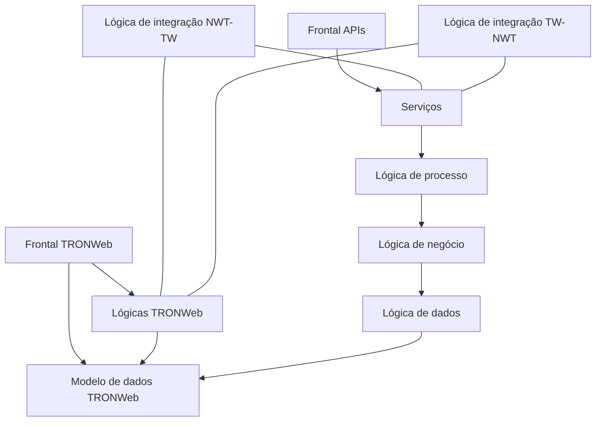

# Visão Geral do Core Backend Oracle: Evolução Arquitetural de TRONWeb para NEWTron

## 1. Metadados do Documento
- **Arquivo de Origem:** Não identificado no conteúdo extraído
- **Tipo de Documento:** Apresentação Executiva / Arquitetura de Software
- **Domínio / Sistema:** Core, TRONWeb, NEWTron, Backend Oracle
- **Público-Alvo:** Arquitetos, Desenvolvedores, Operação e equipes de integração
- **Data/Versão Identificada:** Não identificada

---

## 2. Resumo Executivo & Contexto de Negócio

O documento apresenta uma visão geral do **Core Backend Oracle** e contextualiza a evolução de **TRONWeb** para **NEWTron**. A motivação central é superar limitações atribuídas à arquitetura e ao modelo de desenvolvimento de TRONWeb, incluindo obsolescência tecnológica, integração complexa, ausência de serviços web de núcleo, documentação insuficiente, dispersão de versões e baixa escalabilidade.

TRONWeb é descrito como um sistema com modelo de dados que armazena definições e operações. Entretanto, as lógicas existentes não possuem uma distribuição definida em camadas, não têm fronteiras de acesso e podem acessar livremente outras lógicas ou o modelo de dados. O frontal de TRONWeb também pode acessar qualquer lógica e diretamente o modelo de dados.

NEWTron é apresentado como a iniciativa que deve permitir uma mudança no modelo de governo e na organização do sistema. Os objetivos explicitados incluem compatibilidade com TRONWeb, separação entre lógica e modelo de dados, atomização dos elementos de software, reutilização, rastreabilidade, orientação a objetos, desenho técnico integrado, integração e redução do tempo de reação diante de modificações.

A arquitetura funcional de NEWTron é apresentada progressivamente com as camadas ou elementos: modelo de dados TRONWeb, lógica de dados, lógica de negócio, lógica de processo, serviços, frontal APIs e lógicas de integração entre NEWTron e TRONWeb. O conteúdo faz referência a documentação interna de arquitetura para detalhamentos adicionais de conceitos lógicos, lógica de dados, lógica de negócio, serviços, intérprete e lógicas de integração.

---

## 3. Arquitetura, Componentes & Tecnologias Envolvidas

### Componentes e elementos identificados

| Componente / Elemento | Descrição sustentada pelo documento |
| :--- | :--- |
| **Core** | Contexto geral da apresentação e do backend Oracle. |
| **Backend Oracle** | Identificado no título inicial como contexto tecnológico do Core. Não há detalhamento de produtos Oracle, versões ou estruturas físicas. |
| **TRONWeb** | Sistema existente cuja arquitetura, integração, documentação e escalabilidade motivam a evolução. |
| **NEWTron** | Evolução arquitetural orientada à compatibilidade com TRONWeb, separação de lógica e dados, reutilização, integração e manutenção. |
| **Modelo de dados TRONWeb** | Armazena definições e operações realizadas em TRONWeb. |
| **Lógica de dados** | Camada identificada na arquitetura funcional de NEWTron. |
| **Lógica de negócio** | Camada identificada na arquitetura funcional de NEWTron. |
| **Lógica de processo** | Camada identificada na arquitetura funcional de NEWTron. |
| **Serviços** | Elemento identificado na arquitetura NEWTron; a documentação referenciada menciona orquestradores de conceito lógico, orquestradores de processo e intérprete. |
| **Frontal APIs** | Elemento frontal identificado na arquitetura de NEWTron. O documento não especifica protocolos, métodos HTTP, contratos ou endpoints. |
| **Lógica de integração NWT-TW** | Lógica de integração entre NEWTron e TRONWeb. |
| **Lógica de integração TW-NWT** | Lógica de integração entre TRONWeb e NEWTron. |
| **TRONWeb Frontal** | Frontal do sistema TRONWeb, com acesso sem fronteiras às lógicas e acesso direto ao modelo de dados. |
| **Objerator** | Citado no tópico “Tratamiento de Etiquetas -Objerator”; não há explicação adicional. |
| **REEF Core / Reef.academy** | Referências presentes nos títulos de apresentações relacionadas a segurança e controle de acesso. |

### Diagrama arquitetural reconstruído

> **Nota de Análise:** O diagrama abaixo representa as camadas e relações conceituais explicitamente nomeadas na apresentação. O documento não especifica protocolos, interfaces, contratos, sentido técnico detalhado de chamadas ou dependências de execução entre todas as camadas.



### Referências internas identificadas

| URL | Epígrafe / assunto associado |
| :--- | :--- |
| `https://internos.mapfre.com/tronweb/desarrollo-arquitectura/` | Conceito Lógico |
| `https://internos.mapfre.com/tronweb/desarrollo-arquitectura/` | Lógica de Dados |
| `https://internos.mapfre.com/tronweb/desarrollo-arquitectura/` | Lógica de negócio |
| `https://internos.mapfre.com/tronweb/desarrollo-arquitectura/` | Serviço: orquestradores de conceito lógico e orquestradores de processo |
| `https://internos.mapfre.com/tronweb/desarrollo-arquitectura/` | Serviço: intérprete |
| `https://internos.mapfre.com/tronweb/desarrollo-arquitectura/` | Lógicas de Integração NEWTron-TronWeb |
| `https://internos.mapfre.com/tronweb/desarrollo-arquitectura/` | Lógicas de integração TronWeb-NEWTron |

---

## 4. Regras de Negócio, Especificações Funcionais & Processos

### Problemas e motivadores da evolução

1. **Obsolescência tecnológica**
   - A tecnologia utilizada dificulta a integração com novos canais de distribuição.
   - Essa dificuldade gera redundância no software.

2. **Falta de metodologia**
   - TRONWeb possui normativa de desenvolvimento.
   - A apresentação afirma que TRONWeb carece de uma metodologia que cubra o processo de desenvolvimento.

3. **Escassa documentação**
   - Existe carência de documentação metodológica, funcional e técnica.

4. **Integração complexa**
   - Os grandes componentes de TRONWeb dificultam a composição dos elementos necessários para novos canais de distribuição.
   - Essa composição complexa gera redundância.

5. **Dispersão**
   - O modelo de governo do sistema é considerado inadequado.
   - Esse modelo propiciou dispersão de versões.
   - NEWTron pretende ser a alavanca para alterar esse cenário.

6. **Fronteiras web insuficientes**
   - A arquitetura não dispõe de uma alternativa web que satisfaça as necessidades desse âmbito.

7. **Escalabilidade**
   - O software do sistema não favorece uma progressão simples.
   - A necessidade de ampliação gera custo adicional.

8. **Serviços web**
   - O documento declara que não existe serviço web de núcleo.
   - O documento também declara ausência de normativa sobre esse ponto.

### Objetivos arquiteturais de NEWTron

| Objetivo | Regra ou intenção declarada |
| :--- | :--- |
| **Compatibilidade** | NEWTron deve ser compatível com TRONWeb, apesar de as arquiteturas serem totalmente distintas e haver falta de conhecimento sobre a realidade dos desenvolvimentos realizados nos países. |
| **Separar lógica do modelo de dados** | O modelo de dados não evoluiu, sendo apontado como principal motivo da compatibilidade; o modelo de dados deve ficar totalmente separado da lógica. |
| **Atomização** | Todos os elementos de software devem ser tão simples quanto possível para garantir reutilização, simplicidade e componentização em elementos mais complexos. |
| **Reutilização** | Deve ser garantida a não duplicidade de componentes desenvolvidos para um propósito concreto. Os desenvolvimentos devem ser válidos para mais de uma instalação. |
| **Rastreabilidade** | Todos os elementos de NEWTron devem estar relacionados entre si para facilitar evolução e manutenção do aplicativo. |
| **Desenho técnico integrado** | NEWTron deve ser simples e homogêneo; os elementos do sistema devem acompanhar o desenho técnico. |
| **Manutenção** | NEWTron está preparado para a etapa de manutenção. |
| **Orientação a objetos** | NEWTron deve ser orientado a objetos para simplificar as fases de desenvolvimento e facilitar busca e utilização dos elementos construídos. |
| **Integração** | NEWTron deve oferecer a fachada necessária para apresentar aspecto e funcionalidade de produto, mesmo quando utiliza funções oferecidas por outros produtos ou ferramentas. |
| **Time to market** | O tempo de reação diante de modificações deve ser reduzido significativamente. |
| **Modelo conceitual único** | Foi definido um modelo que identifica todos os elementos de negócio junto com suas características. |
| **Integrável** | NEWTron permite integração com TRONWeb quando necessária. |

### Caracterização arquitetural de TRONWeb

| Aspecto | Caracterização |
| :--- | :--- |
| **Modelo de dados** | Armazena definições e operações realizadas. |
| **Distribuição das lógicas** | Os diferentes tipos de lógicas não possuem localização estabelecida. Não existe distribuição dessas lógicas em camadas. |
| **Fronteiras de acesso** | As lógicas não possuem fronteiras; cada lógica pode acessar qualquer outra lógica ou o modelo de dados livremente. |
| **Acesso do frontal** | O frontal tem acesso a qualquer tipo de lógica, inclusive acesso direto ao modelo de dados. |

### Tópicos listados sem detalhamento funcional adicional

O conteúdo apresenta os seguintes tópicos, mas não fornece regras, interfaces, passos operacionais ou parâmetros detalhados:

- Metodologia.
- Documentação de elementos backend.
- Documentação frontal.
- Esquema de definição de produto.
- Compatibilidade TW-NWT.
- Controle de acesso de usuários.
- Controle de acesso a operações NEWTron.
- Validação passo a passo versus validação em bloco.
- Tratamento de valores “branco” e arrays em pacotes de validação de produto TW.
- Tratamento de etiquetas com Objerator.
- Definição de listas de valores.
- Tabela de conceitos/variáveis.
- Gestão de erros.

> **Nota de Análise:** A apresentação lista controle de acesso, validações, etiquetas, listas de valores, conceitos, variáveis e gestão de erros, mas não detalha regras de autorização, formatos de dados, algoritmos de validação, códigos de erro, fluxos de tratamento ou contratos técnicos.

---

## 5. Tabelas de Parâmetros, Ambientes e Estruturas de Dados

| Item / Parâmetro | Descrição / Função | Tipo / Valores / Formato | Ambiente / Observações |
| :--- | :--- | :--- | :--- |
| Modelo de dados TRONWeb | Armazena definições e operações realizadas em TRONWeb. | Modelo de dados | Não há esquema, tabelas, campos ou tipos de dados no conteúdo. |
| Lógica de dados | Camada funcional identificada para NEWTron. | Camada lógica | Referência documental sob o epígrafe “Lógica de Datos”. |
| Lógica de negócio | Camada funcional identificada para NEWTron. | Camada lógica | Referência documental sob o epígrafe “Lógica de negocio”. |
| Lógica de processo | Camada funcional identificada para NEWTron. | Camada lógica | Associada a serviços, orquestradores de conceito lógico e orquestradores de processo. |
| Serviços | Elemento da arquitetura NEWTron. | Serviços | São citados orquestradores e intérprete; não há tecnologias ou contratos especificados. |
| Intérprete | Elemento associado à documentação de serviços. | Não detalhado | Sem detalhamento de responsabilidade, entradas ou saídas. |
| Frontal APIs | Elemento frontal da arquitetura NEWTron. | APIs | Métodos, protocolos, URLs, autenticação e contratos não são informados. |
| Lógica de integração NWT-TW | Integração NEWTron para TRONWeb. | Lógica de integração | Referência interna para “Lógicas de Integração NEWTron-TronWeb”. |
| Lógica de integração TW-NWT | Integração TRONWeb para NEWTron. | Lógica de integração | Referência interna para “Lógicas de integração TronWeb-NEWTron”. |
| URL de arquitetura interna | Fonte interna de documentação arquitetural. | URL HTTPS | `https://internos.mapfre.com/tronweb/desarrollo-arquitectura/` |
| Backend Oracle | Contexto declarado no título inicial. | Tecnologia / plataforma | Não são identificadas versões, bancos, esquemas, instâncias ou servidores. |
| Objerator | Associado ao tratamento de etiquetas. | Ferramenta ou componente não detalhado | O nome aparece apenas no tópico listado. |
| REEF Core / Reef.academy | Associado a apresentações de segurança e controle de acesso. | Referência documental | O documento não fornece conteúdo dessas apresentações. |

---

## 6. Bateria de Perguntas & Respostas para RAG (FAQ Sintético)

### P1: Quais problemas motivaram a evolução de TRONWeb para NEWTron?
**R:** A apresentação aponta obsolescência tecnológica, dificuldade de integração com novos canais de distribuição, redundância de software, ausência de metodologia completa de desenvolvimento, documentação insuficiente, integração complexa, dispersão de versões, ausência de alternativa web adequada, baixa escalabilidade e inexistência de serviços web de núcleo com normativa definida.

### P2: Qual é a principal exigência de compatibilidade entre NEWTron e TRONWeb?
**R:** NEWTron deve ser compatível com TRONWeb, embora as arquiteturas sejam consideradas totalmente distintas. A apresentação relaciona essa compatibilidade ao fato de que o modelo de dados não evoluiu e deve permanecer totalmente separado da lógica.

### P3: Como o documento descreve o acesso às lógicas e ao modelo de dados em TRONWeb?
**R:** O documento afirma que as lógicas de TRONWeb não possuem fronteiras de acesso. Assim, cada lógica pode utilizar qualquer outra lógica ou acessar livremente o modelo de dados. O frontal também pode acessar qualquer tipo de lógica e possuir acesso direto ao modelo de dados.

### P4: Qual é a organização de camadas apresentada para NEWTron?
**R:** A arquitetura funcional de NEWTron identifica modelo de dados TRONWeb, lógica de dados, lógica de negócio, lógica de processo, serviços, frontal APIs e lógicas de integração entre NEWTron e TRONWeb. A apresentação não detalha contratos, chamadas, protocolos ou responsabilidades completas de cada elemento.

### P5: O que significa atomização no contexto de NEWTron?
**R:** Atomização significa que todos os elementos de software devem ser projetados de forma tão simples quanto possível. Segundo o documento, essa característica busca garantir reutilização, simplicidade e componentização desses elementos em estruturas mais complexas.

### P6: Como NEWTron pretende reduzir duplicidade de software?
**R:** O objetivo de reutilização determina que não deve haver duplicidade de componentes desenvolvidos para um propósito concreto. Além disso, os desenvolvimentos devem ser válidos para mais de uma instalação.

### P7: O que o documento estabelece sobre rastreabilidade em NEWTron?
**R:** Todos os elementos de NEWTron devem estar relacionados entre si. Essa relação tem como finalidade facilitar a evolução do sistema e, sobretudo, a manutenção do aplicativo.

### P8: O documento detalha endpoints ou contratos das Frontal APIs de NEWTron?
**R:** Não. O documento apenas identifica “Frontal APIs” como elemento da arquitetura NEWTron. Não informa endpoints, métodos HTTP, protocolos, formatos JSON, mecanismos de autenticação ou contratos de integração.

### P9: Quais elementos de serviço são mencionados na documentação arquitetural referenciada?
**R:** A apresentação referencia documentação sobre serviços e associa a ela orquestradores de conceito lógico, orquestradores de processo e intérprete. O conteúdo extraído não descreve as responsabilidades técnicas, interfaces ou fluxos desses elementos.

### P10: Qual é o objetivo do modelo conceitual único de NEWTron?
**R:** O modelo conceitual único foi definido para identificar todos os elementos de negócio junto com suas características.

### P11: NEWTron substitui integralmente TRONWeb segundo o documento?
**R:** O documento não declara uma substituição integral. Ele afirma que NEWTron deve ser compatível e integrável com TRONWeb quando necessário, além de apresentar lógicas de integração nos dois sentidos: NEWTron–TRONWeb e TRONWeb–NEWTron.

### P12: Quais assuntos são listados, mas não recebem detalhamento na apresentação?
**R:** Entre os temas listados sem detalhamento estão controle de acesso de usuários, controle de acesso a operações NEWTron, validação passo a passo versus validação em bloco, tratamento de valores em branco e arrays, etiquetas com Objerator, listas de valores, tabela de conceitos/variáveis e gestão de erros.

---

## 7. Glossário de Termos, Siglas & Conceitos-Chave

- **APIs:** Interfaces identificadas no elemento “Frontal APIs”. A apresentação não expande a sigla nem define contratos.
- **Backend Oracle:** Contexto de backend indicado na apresentação. Não há versão, produto Oracle ou configuração detalhada.
- **Core:** Contexto central da apresentação, associado à visão geral e ao backend Oracle.
- **Frontal:** Camada de interface citada em TRONWeb e NEWTron.
- **Lógica de dados:** Camada identificada em NEWTron e relacionada à documentação interna de arquitetura.
- **Lógica de negócio:** Camada identificada em NEWTron, relacionada à documentação interna de arquitetura.
- **Lógica de processo:** Camada identificada em NEWTron, associada a serviços e orquestração.
- **NWT:** Abreviação usada na expressão “NWT-TW”; no contexto, representa NEWTron.
- **Objerator:** Nome citado no tópico de tratamento de etiquetas; significado e funcionamento não são definidos.
- **REEF Core / Reef.academy:** Referências documentais relacionadas a arquitetura e segurança.
- **TRONWeb / TW:** Sistema existente. “TW” é utilizado nas expressões de compatibilidade e integração com NEWTron.
- **NEWTron:** Arquitetura ou sistema evolutivo apresentado como compatível e integrável com TRONWeb.
- **Time to market:** Objetivo de reduzir significativamente o tempo de reação a modificações.

---

## 8. Notas Críticas, Riscos & Limitações

- A apresentação identifica explicitamente **falta de documentação** metodológica, funcional e técnica em TRONWeb.
- O documento declara que há **falta de conhecimento** sobre a realidade dos desenvolvimentos realizados nos países, apesar da exigência de compatibilidade entre NEWTron e TRONWeb.
- O modelo de governo anterior é descrito como inadequado e associado à **dispersão de versões**.
- A inexistência de fronteiras entre lógicas e de restrições de acesso direto ao modelo de dados em TRONWeb representa uma limitação arquitetural declarada.
- Não são fornecidos diagramas técnicos completos, contratos, endpoints, tecnologias de serviço, versões, configurações de ambiente, portas, mecanismos de autenticação, modelos físicos de dados ou políticas de tratamento de erros.
- Os temas de segurança, controle de acesso, validação, tratamento de etiquetas, listas de valores e erros são somente listados; o conteúdo extraído não permite especificar suas regras.
- As URLs internas são fornecidas como referência de aprofundamento, mas o conteúdo dessas páginas não está presente na extração.
- Há inconsistência na numeração das páginas: a extração contém quinze blocos, enquanto os slides internos são numerados de `1` a `16`, com ausência visível do slide `6`.

---

## 9. Conteúdo Bruto Estruturado (Referência Fiel)

```text
--- [PÁGINA 1 DE 15] ---

1
              
core
• Visión general
Backend Oracle


--- [PÁGINA 2 DE 15] ---

2
• Introducción 
• Arquitectura Funcional
• Metodología 
• Documentación Elementos Backend
• Documentación Frontal  
• Esquema Definición Producto.
• Integración 
• Compatibilidad
              Compatibilidad TW-NWT
              Control de Acceso Usuarios                            (Presentacion M.4Feb Reef.academy - Reef.core -ARQ – Seguridad
              Control Acceso a Operaciones NEWTron     (Presentacion M.4Feb Reef.academy - Reef.core -ARQ – Seguridad
              Validación paso a paso vs validación en bloque 
             T  t m   to d  v    b    “ ” y arrays en paquetes de validación producto TW
             Tratamiento de Etiquetas -Objerator
             Definición de Listas de Valores; Tabla de Conceptos/Variables
             Gestión de Errores
Core


--- [PÁGINA 3 DE 15] ---

3
Core  -Visión general
OBSOLESCENCIA 
TECNOLÓGICA
LA TECNOLOGÍA UTILIZADA 
DIFICULTA LA INTEGRACIÓN 
CON LOS NUEVOS CANALES 
DE DISTRIBUCIÓN, ALGO QUE 
GENERA REDUNDANCIA EN EL 
SOFTWARE
FALTA DE 
METODOLOGÍA
SI BIEN TRONWeb CUENTA 
CON NORMATIVA DE 
DESARROLLO, ES CIERTO QUE 
ADOLECE DE UNA 
METODOLOGÍA QUE CUBRA 
EL PROCESO DEL DESARROLLO
ESCASA 
DOCUMENTACIÓN
EXISTE UNA CARENCIA DE 
DOCUMENTACIÓN TANTO DE 
LA METODOLOGÍA, COMO 
FUNCIONAL Y TÉCNICA
INTEGRACIÓN 
COMPLEJA
LOS GRANDES COMPONENTES 
QUE FORMAN TRONWeb 
DIFICULTAN LA COMPOSICIÓN 
DE LOS ELEMENTOS 
NECESARIOS PARA LOS NUEVOS 
CANALES DE DISTRIBUCIÓN, 
ALGO QUE GENERA 
REDUNDANCIA
DISPERSIÓN 
EL MODELO DE GOBIERNO 
DEL SISTEMA NO HA SIDO EL 
MÁS APROPIADO Y HA 
PROPICIADO LA DISPERSIÓN 
DE LAS VERSIONES. NEWTron 
PRETENDE SER LA PALANCA 
QUE PERMITA ESTE CAMBIO
FRONTALES WEB
LA ARQUITECTURA NO 
DISPONE DE UNA 
ALTERNATIVA WEB QUE 
SATISFAGA LAS NECESIDADES 
DENTRO DE ESTE AMBITO
ESCALABILIDAD
EL SOFTWARE DEL SISTEMA 
NO PROPICIA UNA 
PROGRESIÓN SENCILLA, POR 
LO QUE GENERA UN COSTE 
AÑADIDO CUANDO EXISTE 
NECESIDAD DE AMPLIACIÓN
SERVICIOS WEB
NO EXISTE NINGÚN SERVICIO 
WEB DE NÚCLEO. ADEMÁS, NO 
EXISTE NORMATIVA A CERCA 
DE ESTE PUNTO
Introducción > Motivos Evolución


--- [PÁGINA 4 DE 15] ---

4
Core  -Visión general
Introducción > Objetivos
COMPATIBILIDAD
NEWTron DEBE SER 
COMPATIBLE CON TRONWeb, 
AUNQUE LAS 
ARQUITECTURAS SON 
TOTALMENTE DISTINTAS Y 
EXISTE UNA TOTAL FALTA DE 
COCIMIENTO DE LA 
REALIDAD DE LOS 
DESARROLLOS REALIZADOS 
EN  LOS PAÍSES
SEPARAR LÓGICA 
DEL MODELO DE 
DATOS
EL MODELO DE DATOS NO  HA 
EVOLUCIONADO  (PRINCIPAL 
MOTIVO DE LA 
COMPATIBILIDAD), Y DEBE 
ESTAR TOTALMENTE 
SEPARADO DE LA LÓGICA
ATOMIZACION
TODOS LOS ELEMENTOS DE 
SOFTWARE QUE SE DISEÑEN 
DEBEN SER LO MÁS SIMPLES 
POSIBLE. ESTO GARANTIZARÁ 
LA REUTILIZACIÓN, LA 
SENCILLEZ Y LA 
COMPONENTIZACIÓN EN 
ELEMENTOS MÁS COMPLEJOS
REUTILIZACIÓN
HA DE GARANTIZARSE LA NO 
DUPLICIDAD DE 
COMPONENTES 
DESARROLLADOS PARA UN 
PROPÓSITO CONCRETO.
ADICIONALMENTE LOS 
DESARROLLOS SON VALIDOS 
PARA MÁS DE UNA 
INSTALACIÓN
TRAZABILIDAD
TODOS LOS ELEMENTOS DE 
NEWTron DEBEN ESTAR 
RELACIONADOS ENTRE SI 
CON EL FIN DE FACILITAR LA 
EVOLUCIÓN Y SOBRE TODO 
EL MANTENIMIENTO DEL 
APLICATIVO
DISEÑO TECNICO 
INTEGRADO
NEWTron DEBE SER LO MÁS 
SIMPLE  Y HOMOGENEO 
POSIBLE. POR ESTE MOTIVO 
LOS ELEMENTOS QUE 
COMPONEN EL SISTEMA 
DEBEN ACOMPAÑAR EL 
DISEÑO TECNICO
MANTENIMIENTO
NEWTron ESTÁ PREPARADO 
EN LA ETAPA DE 
MANTENIMIENTO 
ORIENTACION A 
OBJETOS
NEWTron DEBE ESTAR 
ORIENTADO A OBJETOS, CON 
EL FIN DE SIMPLIFICAR LAS 
DISTINTAS FASES DEL 
DESARROLLO, ASI COMO 
FACILITAR LA BÚSQUEDA Y 
UTILIZACIÓN DE LOS 
ELEMENTOS CONSTRUIDOS
INTEGRADOR
OFRECER LA FACHADA 
NECESARIA PARA MOSTRAR 
UN ASPECTO Y 
FUNCIONALIDAD DE 
PRODUCTO, AUNQUE 
DISPONGA DE FUNCIONES 
QUE OFRECEN OTROS 
PRODUCTOS O 
HERRAMIENTAS
TIME TO MARKET
EL TIEMPO DE REACCIÓN 
ANTE MODIFICACIONES SE 
REDUCE 
SIGNIFICATIVAMENTE
MODELO 
CONCEPTUAL 
ÚNICO
SE HA DEFINIDO UN MODELO 
QUE IDENTIFICA TODOS LOS 
ELEMENTOS DE NEGOCIO 
JUNTO CON SUS 
CARACTERÍSTICAS
INTEGRABLE
PERMITE LA INTEGRACIÓN 
CON TRONWeb CUANDO SE 
HACE NECESARIO


--- [PÁGINA 5 DE 15] ---

5
• Introducción
• Arquitectura Funcional
• Metodología 
• Documentación Elementos Backend
• Documentación Frontal  
• Esquema Definición Producto.
• Integración 
• Compatibilidad
              Compatibilidad TW-NWT
              Control de Acceso Usuarios                            (Presentacion M.4Feb Reef.academy - Reef.core -ARQ – Seguridad
              Control Acceso a Operaciones NEWTron     (Presentacion M.4Feb Reef.academy - Reef.core -ARQ – Seguridad
              Validación paso a paso vs validación en bloque 
             T  t m   to d  v    b    “ ” y arrays en paquetes de validación producto TW
             Tratamiento de Etiquetas -Objerator
             Definición de Listas de Valores; Tabla de Conceptos/Variables
             Gestión de Errores


--- [PÁGINA 6 DE 15] ---

7
Core  -Visión general
Arquitectura Funcional > TRONWeb
Frontal TRONWeb
Modelo de datos TRONWeb
Lógica de datosLógica de negocioLógica de procesoFrontal
Lógicas TRONWeb
MODELO DE DATOS
TRONWeb DISPONE DE UN 
MODELO DE DATOS DONDE 
SE ALMACENAN LAS 
DEFINICIONES Y LAS 
OPERACIONES  QUE SE 
REALIZAN
LÓGICAS
LOS DISTINTOS TIPOS DE 
LÓGICAS QUE EXISTEN NO 
TIENEN UNA UBICACIÓN 
ESTABLECIDA. NO EXISTIENDO 
UNA DISTRIBUCIÓN DE ESTAS 
EN CAPAS
ACCESO
LAS LÓGICAS NO DISPONEN 
DE NINGÚN TIPO DE 
FRONTERA, POR LO QUE 
CADA UNA DE ELLAS PUEDE 
DISPONER DE CUALQUIER 
OTRA LÓGICA O ACCESO AL 
MODELO DE DATOS DE 
FORMA LIBRE
FRONTAL
AL IGUAL QUE LAS LÓGICAS, 
EL FRONTAL TIENE ACCESO A 
CUALQUIER TIPO DE LÓGICA, 
INCLUSO ACCESO DIRECTO AL 
MODELO DE DATOS


--- [PÁGINA 7 DE 15] ---

8
Core  -Visión general
Arquitectura Funcional > NEWTron
NEWTron
Modelo de datos TRONWeb
Lógica de datos
Lógicas TRONWeb
https://internos.mapfre.com/tronweb/desarrollo-arquitectura/  
 Epígrafe: Concepto Lógico
https://internos.mapfre.com/tronweb/desarrollo-arquitectura/  
 Epígrafe: Lógica de Datos


--- [PÁGINA 8 DE 15] ---

9
Core  -Visión general
Arquitectura Funcional > NEWTron
NEWTron
Modelo de datos TRONWeb
Lógica de datos
Lógica de negocio
Lógicas TRONWeb
https://internos.mapfre.com/tronweb/desarrollo-arquitectura/  
 Epígrafe: Lógica de negocio


--- [PÁGINA 9 DE 15] ---

10
Core  -Visión general
Arquitectura Funcional > NEWTron
NEWTron
Modelo de datos TRONWeb
Lógica de datos
Lógica de negocio
Lógica de proceso
Lógicas TRONWeb
https://internos.mapfre.com/tronweb/desarrollo-arquitectura/  
 Epígrafe: Servicio  
       (Orquestadores de Concepto lógico
        Orquestadores de Proceso)


--- [PÁGINA 10 DE 15] ---

11
Core  -Visión general
Arquitectura Funcional > NEWTron
NEWTron
Modelo de datos TRONWeb
Lógica de datos
Lógica de negocio
Lógica de proceso
Lógicas TRONWeb
Servicios
https://internos.mapfre.com/tronweb/desarrollo-arquitectura/  
 Epígrafe: Servicio  
       (Intérprete)


--- [PÁGINA 11 DE 15] ---

12
Core  -Visión general
Arquitectura Funcional > NEWTron
NEWTron
Modelo de datos TRONWeb
Lógica de datos
Lógica de negocio
Lógica de proceso
Lógicas TRONWeb
Servicios
Frontal Apis


--- [PÁGINA 12 DE 15] ---

13
Core  -Visión general
Arquitectura Funcional > NEWTron
NEWTron
Modelo de datos TRONWeb
Lógica de datos
Lógica de negocio
Lógica de proceso
Lógicas TRONWeb
Servicios
Frontal Apis


--- [PÁGINA 13 DE 15] ---

14
Core  -Visión general
Arquitectura Funcional > NEWTron
NEWTron
Modelo de datos TRONWeb
Lógica de datos
Lógica de negocio
Lógica de proceso
Lógicas TRONWeb
Lógica integración Nwt-Tw
Servicios
Frontal Apis
https://internos.mapfre.com/tronweb/desarrollo-arquitectura/  
 Epígrafe: Lógicas de Integración NEWTron-TronWeb


--- [PÁGINA 14 DE 15] ---

15
Core  -Visión general
Arquitectura Funcional > NEWTron
NEWTron
Modelo de datos TRONWeb
Lógica de datos
Lógica de negocio
Lógica de proceso
Lógicas TRONWeb
Lógica integración TW-NWT
Servicios
Frontal Apis
https://internos.mapfre.com/tronweb/desarrollo-arquitectura/  
 Epígrafe: Lógicas de integración TronWeb-NEWTron


--- [PÁGINA 15 DE 15] ---

16
Core  -Visión general
Arquitectura Funcional > NEWTron
* Hasta aquí hemos llegado en esta Sesión.
                       Muchas gracias por su atención
```
