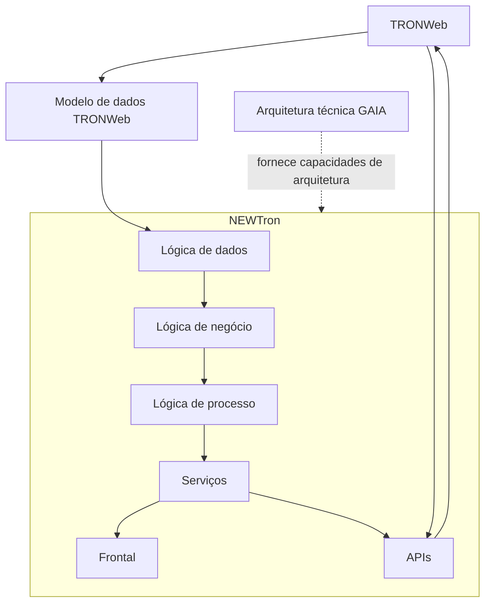

# Visão Geral do Core: Evolução de TRONWeb para NEWTron e Arquitetura GAIA

## 1. Metadados do Documento
- **Arquivo de Origem:** `Não identificado`
- **Tipo de Documento:** `Apresentação Executiva / Arquitetura de Software`
- **Domínio / Sistema:** `Core, TRONWeb, NEWTron e GAIA`
- **Público-Alvo:** `Arquitetos, Desenvolvedores, Operação e Equipas de Negócio`
- **Data/Versão Identificada:** `Não identificada`

---

## 2. Resumo Executivo & Contexto de Negócio

A apresentação descreve a evolução arquitetural do sistema Core, centrada na transição e coexistência entre TRONWeb e NEWTron. O principal motivador da evolução é a identificação de limitações no modelo vigente de TRONWeb, incluindo obsolescência tecnológica, dificuldade de integração com novos canais de distribuição, redundância de software, documentação insuficiente, dispersão de versões e baixa escalabilidade.

NEWTron é apresentado como a iniciativa de modernização destinada a corrigir essas limitações sem romper a compatibilidade com TRONWeb. A compatibilidade é destacada como requisito relevante porque o modelo de dados não evoluiu e existe falta de conhecimento completo sobre a realidade dos desenvolvimentos realizados nos diferentes países.

A proposta de NEWTron enfatiza separação entre lógica e modelo de dados, atomização dos elementos de software, reutilização, rastreabilidade, orientação a objetos e desenho técnico integrado. O objetivo é reduzir duplicidade, facilitar manutenção, permitir composição de elementos simples em componentes mais complexos e reduzir o tempo de reação perante modificações.

A arquitetura técnica GAIA é apresentada como a base moderna e escalável para a evolução. GAIA contempla escalabilidade por camadas, requisitos de segurança fornecidos por DISMA, procedimentos operacionais e de administração, interfaces responsivas, integração via serviços web SOAP e REST e utilização de tecnologias amplamente difundidas.

A apresentação também introduz uma organização funcional de NEWTron por camadas de lógica de dados, lógica de negócio, lógica de processo, serviços, frontal e APIs. Contudo, o material não detalha contratos técnicos, métodos HTTP, estruturas de dados, implementações concretas ou responsabilidades exatas de cada componente.

---

## 3. Arquitetura, Componentes & Tecnologias Envolvidas

### Componentes e conceitos identificados

| Componente / Conceito | Papel descrito no documento | Observações |
| :--- | :--- | :--- |
| Core | Contexto principal da apresentação e da evolução arquitetural. | Não há detalhamento funcional do Core. |
| TRONWeb | Sistema existente cuja evolução é discutida. | Possui frontal, modelo de dados e lógicas. |
| NEWTron | Arquitetura/evolução proposta para modernizar o ecossistema TRONWeb. | Deve ser compatível e integrável com TRONWeb. |
| GAIA | Arquitetura técnica com características de escalabilidade, segurança, operação, acessibilidade e orientação a serviços. | Não são informadas versões, infraestrutura ou produtos específicos. |
| Modelo de dados TRONWeb | Repositório de definições e operações realizadas no TRONWeb. | Deve permanecer separado da lógica no NEWTron. |
| Lógica de dados | Camada indicada na arquitetura funcional de NEWTron. | Referenciada por epígrafe “Lógica de Dados”. |
| Lógica de negócio | Camada indicada na arquitetura funcional de NEWTron. | Referenciada por epígrafe “Lógica de negócio”. |
| Lógica de processo | Camada indicada na arquitetura funcional de NEWTron. | Inclui orquestradores de conceito lógico e de processo. |
| Serviços | Elementos de serviço indicados na arquitetura NEWTron. | O documento menciona “Intérprete”, sem detalhar comportamento. |
| Frontal | Camada de interface indicada para NEWTron. | GAIA prevê frontais compatíveis com navegadores e responsivos. |
| APIs | Elementos de integração na arquitetura NEWTron. | São citadas lógicas de integração NEWTron–TRONWeb e TRONWeb–NEWTron. |
| SOAP | Tecnologia padrão para exposição de serviços web reutilizáveis. | Citada como capacidade de GAIA. |
| REST | Tecnologia padrão para exposição de serviços web reutilizáveis. | Citada como capacidade de GAIA. |
| DISMA | Fonte dos requisitos de segurança que a arquitetura GAIA deve cumprir. | A apresentação não expande a sigla. |
| Objerator | Referência relacionada ao tratamento de etiquetas. | Não há detalhamento adicional. |

### Fluxo arquitetural conceitual extraído



> **Nota de Análise:** O diagrama representa somente as camadas e relações conceituais explicitamente listadas nos slides. A apresentação não detalha protocolos de comunicação entre camadas, dependências de implantação, métodos de APIs, contratos SOAP/REST ou direção operacional definitiva das integrações.

### Características técnicas declaradas para GAIA

| Característica | Descrição sustentada pelo documento |
| :--- | :--- |
| Escalabilidade | A evolução GAIA é altamente escalável em cada uma das suas camadas para adaptar-se às necessidades de desempenho de cada país. |
| Segurança | A arquitetura GAIA garante cumprimento dos requisitos de segurança fornecidos por DISMA. |
| Operabilidade | GAIA fornece procedimentos de operação, administração de infraestrutura e implantação da aplicação para servidores homologados. |
| Acessibilidade | Os frontais GAIA são compatíveis com navegadores web e adaptam-se ao tamanho do dispositivo do utilizador, com comportamento responsive. |
| Orientação a serviços | GAIA permite expor serviços web reutilizáveis com tecnologias padrão como SOAP e REST para acesso de aplicações terceiras. |
| Tecnologia moderna | GAIA incorpora tecnologias modernas de desenvolvimento web nas camadas cliente e servidor, amplamente difundidas. |
| Ampla comunidade | O tipo de tecnologia permite acesso a comunidade ampla de desenvolvedores, documentação abundante e extensões de terceiros. |

---

## 4. Regras de Negócio, Especificações Funcionais & Processos

### Motivos para evolução do Core e TRONWeb

1. **Obsolescência tecnológica**
   - A tecnologia utilizada dificulta a integração com novos canais de distribuição.
   - A dificuldade de integração gera redundância no software.

2. **Falta de metodologia**
   - TRONWeb possui normativa de desenvolvimento.
   - A apresentação indica ausência de metodologia que cubra o processo completo de desenvolvimento.

3. **Escassez de documentação**
   - Existe carência de documentação metodológica, funcional e técnica.

4. **Integração complexa**
   - Os grandes componentes de TRONWeb dificultam a composição dos elementos necessários para novos canais de distribuição.
   - Essa dificuldade gera redundância.

5. **Dispersão de versões**
   - O modelo de governo do sistema não foi considerado apropriado.
   - O modelo de governo propiciou dispersão de versões.
   - NEWTron pretende funcionar como alavanca para alterar esse cenário.

6. **Ausência de alternativa web**
   - A arquitetura existente não possui alternativa web que satisfaça as necessidades desse âmbito.

7. **Escalabilidade limitada**
   - O software do sistema não favorece progressão simples.
   - A necessidade de ampliação gera custo adicional.

8. **Ausência de serviços web de núcleo**
   - Não existe serviço web de núcleo.
   - Não existe normativa declarada sobre esse ponto.

### Objetivos e princípios de NEWTron

| Objetivo / Princípio | Especificação extraída |
| :--- | :--- |
| Compatibilidade | NEWTron deve ser compatível com TRONWeb, apesar de as arquiteturas serem totalmente diferentes e de haver falta de conhecimento sobre a realidade dos desenvolvimentos realizados nos países. |
| Separação entre lógica e modelo de dados | O modelo de dados não evoluiu, sendo este o principal motivo da compatibilidade; o modelo de dados deve estar totalmente separado da lógica. |
| Atomização | Todo elemento de software deve ser projetado de forma tão simples quanto possível para garantir reutilização, simplicidade e composição em elementos mais complexos. |
| Reutilização | Deve ser garantida a não duplicidade de componentes desenvolvidos para uma finalidade concreta. Os desenvolvimentos devem ser válidos para mais de uma instalação. |
| Rastreabilidade | Todos os elementos de NEWTron devem estar relacionados entre si para facilitar evolução e manutenção da aplicação. |
| Desenho técnico integrado | NEWTron deve ser simples e homogêneo; os elementos do sistema devem acompanhar o desenho técnico. |
| Manutenção | NEWTron é apresentado como preparado para a etapa de manutenção. |
| Orientação a objetos | NEWTron deve ser orientado a objetos para simplificar fases de desenvolvimento e facilitar busca e uso dos elementos construídos. |
| Integrador | NEWTron deve oferecer a fachada necessária para apresentar aspecto e funcionalidade de produto, mesmo quando disponha de funções oferecidas por outros produtos ou ferramentas. |
| Time to market | O tempo de reação a modificações deve ser significativamente reduzido. |
| Modelo conceptual único | Foi definido um modelo que identifica elementos de negócio e respetivas características. |
| Integrável | NEWTron permite integração com TRONWeb quando necessário. |

### Situação arquitetural de TRONWeb

| Área | Situação descrita |
| :--- | :--- |
| Modelo de dados | TRONWeb possui um modelo de dados no qual são armazenadas definições e operações realizadas. |
| Lógicas | Os vários tipos de lógica não possuem localização estabelecida. Não existe distribuição das lógicas em camadas. |
| Acesso entre lógicas | As lógicas não possuem fronteiras; cada lógica pode utilizar qualquer outra lógica ou aceder livremente ao modelo de dados. |
| Frontal | O frontal pode aceder a qualquer tipo de lógica e também diretamente ao modelo de dados. |

### Estrutura funcional indicada para NEWTron

1. Utilização do **modelo de dados TRONWeb**.
2. Organização por **lógica de dados**.
3. Organização por **lógica de negócio**.
4. Organização por **lógica de processo**.
5. Utilização de **serviços**.
6. Existência de **frontal**.
7. Existência de **APIs**.
8. Integração em ambos os sentidos conceituais:
   - Lógicas de integração **NEWTron–TRONWeb**.
   - Lógicas de integração **TRONWeb–NEWTron**.
9. A lógica de processo inclui:
   - Orquestradores de conceito lógico.
   - Orquestradores de processo.
10. O slide de serviços cita um componente ou conceito denominado **Intérprete**.

### Tópicos funcionais e de segurança listados sem detalhamento

| Tópico | Detalhamento disponível |
| :--- | :--- |
| Metodologia | Apenas listado. |
| Documentação de elementos backend | Apenas listado. |
| Documentação frontal | Apenas listado. |
| Esquema de definição de produto | Apenas listado. |
| Integração | Apenas listado. |
| Compatibilidade | Apenas listado, além dos objetivos gerais de NEWTron. |
| Compatibilidade TW–NWT | Apenas listado. |
| Controlo de acesso de utilizadores | Referência a apresentação “Reef.academy - Reef.core -ARQ – Segurança”. |
| Controlo de acesso a operações NEWTron | Referência a apresentação “Reef.academy - Reef.core -ARQ – Segurança”. |
| Validação passo a passo versus validação em bloco | Apenas listado. |
| Tratamento de variáveis “g” e arrays em pacotes de validação de produto TW | Apenas listado. |
| Tratamento de etiquetas – Objerator | Apenas listado. |
| Definição de listas de valores; tabela de conceitos/variáveis | Apenas listado. |
| Gestão de erros | Apenas listado. |

> **Nota de Análise:** A apresentação lista temas relevantes de segurança, validação, gestão de erros e compatibilidade, mas não fornece regras de autorização, matrizes de permissão, algoritmos de validação, formatos de variáveis, contratos de integração ou procedimentos de tratamento de erro.

---

## 5. Tabelas de Parâmetros, Ambientes e Estruturas de Dados

| Item / Parâmetro | Descrição / Função | Tipo / Valores / Formato | Ambiente / Observações |
| :--- | :--- | :--- | :--- |
| TRONWeb | Sistema legado/evoluído no contexto do Core. | Sistema / arquitetura funcional. | Possui frontal, lógicas e modelo de dados. |
| NEWTron | Evolução proposta com objetivos de modernização, integração e manutenção. | Sistema / arquitetura funcional. | Deve manter compatibilidade com TRONWeb. |
| Modelo de dados TRONWeb | Armazena definições e operações realizadas no TRONWeb. | Modelo de dados. | Não deve permanecer acoplado à lógica em NEWTron. |
| Lógica de dados | Camada funcional de NEWTron. | Camada lógica. | Referida pela documentação interna indicada. |
| Lógica de negócio | Camada funcional de NEWTron. | Camada lógica. | Referida pela documentação interna indicada. |
| Lógica de processo | Camada que inclui orquestração de conceito lógico e processo. | Camada lógica. | Não há detalhes de interfaces ou responsabilidades operacionais. |
| Serviços | Camada/elemento de serviço de NEWTron. | Serviços. | Inclui referência a “Intérprete”. |
| Frontal | Interface de acesso ao sistema. | Camada de apresentação. | Os frontais GAIA são compatíveis com navegadores e responsivos. |
| APIs | Elementos para integração. | APIs. | Há referências a integrações NEWTron–TRONWeb e TRONWeb–NEWTron. |
| SOAP | Tecnologia de serviços web reutilizáveis. | Padrão de serviço web. | Disponibilizado como capacidade de GAIA. |
| REST | Tecnologia de serviços web reutilizáveis. | Padrão de serviço web. | Disponibilizado como capacidade de GAIA. |
| DISMA | Origem dos requisitos de segurança considerados por GAIA. | Sigla / entidade não expandida. | Sem definição adicional no documento. |
| URL de arquitetura TRONWeb | Referência interna para tópicos de conceito lógico, lógica de dados, lógica de negócio, serviço e integrações. | URL. | `https://internos.mapfre.com/tronweb/desarrollo-arquitectura/` |
| Variáveis “g” | Tema de tratamento em pacotes de validação de produto TW. | Variáveis. | O formato e as regras não são detalhados. |
| Arrays | Tema de tratamento em pacotes de validação de produto TW. | Estrutura de dados. | O formato e as regras não são detalhados. |
| Listas de valores | Tema associado à tabela de conceitos/variáveis. | Estrutura de referência. | Sem formato ou exemplos. |
| Objerator | Referência associada ao tratamento de etiquetas. | Ferramenta ou conceito não detalhado. | Sem explicação adicional. |

---

## 6. Bateria de Perguntas & Respostas para RAG (FAQ Sintético)

### P1: Quais são os principais motivos para evoluir TRONWeb para NEWTron?
**R:** Os motivos declarados são obsolescência tecnológica, dificuldade de integração com novos canais de distribuição, redundância de software, falta de metodologia de desenvolvimento abrangente, escassez de documentação metodológica, funcional e técnica, integração complexa devido a grandes componentes, dispersão de versões, ausência de alternativa web adequada, limitações de escalabilidade e inexistência de serviços web de núcleo com normativa definida.

### P2: Por que NEWTron precisa ser compatível com TRONWeb?
**R:** NEWTron deve ser compatível com TRONWeb porque as arquiteturas são totalmente distintas, o modelo de dados não evoluiu — sendo este o principal motivo da compatibilidade — e existe falta de conhecimento completo sobre a realidade dos desenvolvimentos realizados nos diferentes países.

### P3: Como o modelo de dados deve ser tratado na arquitetura NEWTron?
**R:** O documento estabelece que o modelo de dados não evoluiu e deve estar totalmente separado da lógica. O modelo de dados TRONWeb é mantido como elemento identificado na arquitetura funcional de NEWTron, enquanto as lógicas são estruturadas em camadas de dados, negócio e processo.

### P4: Qual é o problema de organização das lógicas no TRONWeb atual?
**R:** Os diferentes tipos de lógica de TRONWeb não possuem uma localização estabelecida e não existe distribuição dessas lógicas por camadas. Além disso, as lógicas não possuem fronteiras: uma lógica pode utilizar qualquer outra lógica ou aceder livremente ao modelo de dados.

### P5: O frontal TRONWeb possui acesso direto ao modelo de dados?
**R:** Sim. A apresentação informa que o frontal TRONWeb pode aceder a qualquer tipo de lógica, incluindo acesso direto ao modelo de dados. O documento apresenta essa condição no contexto das limitações da arquitetura funcional atual de TRONWeb.

### P6: Quais são as camadas ou elementos funcionais citados para NEWTron?
**R:** A arquitetura funcional de NEWTron cita o modelo de dados TRONWeb, lógica de dados, lógica de negócio, lógica de processo, serviços, frontal e APIs. A lógica de processo inclui orquestradores de conceito lógico e orquestradores de processo; os serviços incluem referência a um “Intérprete”.

### P7: Como GAIA suporta escalabilidade e desempenho?
**R:** A apresentação afirma que a evolução GAIA é altamente escalável em cada uma das suas camadas para adaptar-se às necessidades de desempenho de cada país. Não são fornecidos mecanismos concretos de escalabilidade, métricas, infraestrutura ou parâmetros de capacidade.

### P8: Quais tecnologias de serviços web são explicitamente suportadas por GAIA?
**R:** GAIA permite que aplicações exponham serviços web reutilizáveis usando tecnologias padrão como SOAP e REST, permitindo acesso por aplicações terceiras. O documento não especifica endpoints, contratos, versões de protocolos ou políticas de autenticação.

### P9: O que o documento afirma sobre segurança na arquitetura GAIA?
**R:** O documento afirma que a arquitetura GAIA garante o cumprimento de todos os requisitos de segurança fornecidos por DISMA. Contudo, a apresentação não detalha os requisitos de DISMA, mecanismos de autenticação, autorização, criptografia, auditoria ou gestão de identidades.

### P10: Quais objetivos de engenharia são associados à atomização em NEWTron?
**R:** A atomização exige que todos os elementos de software sejam projetados de forma tão simples quanto possível. Segundo o documento, essa simplicidade garante reutilização, simplicidade e componentização em elementos mais complexos.

### P11: Como NEWTron busca reduzir duplicidade de software?
**R:** NEWTron estabelece a reutilização como objetivo e determina que deve ser garantida a não duplicidade de componentes desenvolvidos para um propósito concreto. Adicionalmente, os desenvolvimentos devem ser válidos para mais de uma instalação.

### P12: Que tipos de integração entre NEWTron e TRONWeb são mencionados?
**R:** São mencionadas lógicas de integração NEWTron–TRONWeb e lógicas de integração TRONWeb–NEWTron. A apresentação indica também que NEWTron é integrável e permite integração com TRONWeb quando necessária, mas não detalha protocolos, eventos, APIs, contratos ou responsabilidades de cada fluxo.

### P13: A apresentação define regras para validação passo a passo e validação em bloco?
**R:** Não. A apresentação apenas lista “Validação passo a passo vs validação em bloco” como tópico. Não há critérios, sequências, exceções, entradas, saídas ou regras de execução apresentadas.

### P14: Onde estão referenciados os conteúdos complementares sobre lógica e integração?
**R:** A apresentação referencia a URL interna `https://internos.mapfre.com/tronweb/desarrollo-arquitectura/` para os epígrafes de Conceito Lógico, Lógica de Dados, Lógica de Negócio, Serviço, Lógicas de Integração NEWTron–TRONWeb e Lógicas de integração TRONWeb–NEWTron.

---

## 7. Glossário de Termos, Siglas & Conceitos-Chave

- **API:** Elemento de integração citado na arquitetura funcional de NEWTron. A apresentação não expande a sigla nem define contratos.
- **Core:** Contexto/sistema central abordado na apresentação.
- **DISMA:** Entidade ou referência que fornece requisitos de segurança para a arquitetura GAIA. A sigla não é expandida no documento.
- **Frontal:** Camada de interface ou apresentação do sistema.
- **GAIA:** Arquitetura técnica apresentada com características de escalabilidade, segurança, operabilidade, acessibilidade, orientação a serviços e tecnologia moderna.
- **Intérprete:** Elemento citado no contexto de serviços de NEWTron, sem descrição funcional adicional.
- **Lógica de dados:** Camada de lógica indicada para NEWTron.
- **Lógica de negócio:** Camada de lógica indicada para NEWTron.
- **Lógica de processo:** Camada de lógica indicada para NEWTron, associada a orquestradores de conceito lógico e de processo.
- **NEWTron:** Arquitetura/evolução proposta para modernizar o Core e manter compatibilidade e integração com TRONWeb.
- **Objerator:** Referência ligada ao tratamento de etiquetas; não há definição adicional.
- **Orquestradores de conceito lógico:** Elementos citados na lógica de processo. O documento não define o comportamento.
- **Orquestradores de processo:** Elementos citados na lógica de processo. O documento não define o comportamento.
- **REST:** Tecnologia padrão citada para exposição de serviços web reutilizáveis por aplicações GAIA.
- **SOAP:** Tecnologia padrão citada para exposição de serviços web reutilizáveis por aplicações GAIA.
- **TRONWeb:** Sistema existente cuja arquitetura funcional, limitações e compatibilidade com NEWTron são tratadas na apresentação.
- **TW:** Abreviação usada para TRONWeb em “Compatibilidade TW-NWT” e “pacotes de validação produto TW”.
- **NWT:** Abreviação usada no item “Compatibilidade TW-NWT”; o documento não expande explicitamente a sigla, mas o contexto sugere relação com NEWTron.

---

## 8. Notas Críticas, Riscos & Limitações

- A apresentação descreve motivadores e princípios arquiteturais, mas não fornece especificações implementáveis de APIs, serviços, contratos, modelos de dados, métodos HTTP, esquemas JSON, mensagens SOAP ou mecanismos de persistência.
- A compatibilidade entre NEWTron e TRONWeb é considerada crítica porque o modelo de dados não evoluiu e porque existe falta de conhecimento sobre os desenvolvimentos realizados nos países.
- A ausência de fronteiras entre lógicas e o acesso direto do frontal TRONWeb ao modelo de dados representam limitações explícitas da arquitetura existente.
- A dispersão de versões é associada a um modelo de governo considerado inadequado; NEWTron é apresentado como alavanca para mudança, sem detalhar um novo modelo de governação.
- O documento cita controlo de acesso de utilizadores e de operações NEWTron, mas não disponibiliza regras de permissão, papéis, políticas ou mecanismos de autenticação.
- A arquitetura GAIA declara conformidade com requisitos de segurança de DISMA, porém esses requisitos não são apresentados.
- Os tópicos de validação, tratamento de variáveis “g”, arrays, etiquetas, listas de valores, tabela de conceitos/variáveis e gestão de erros são apenas listados, sem detalhamento técnico.
- A documentação complementar é referida por URL interna, mas o conteúdo dessa referência não faz parte do texto analisado.
- As notas do apresentador do slide sobre características GAIA indicam “OMITIR”; portanto, não existe contexto adicional aproveitável nesse slide.

---

## 9. Conteúdo Bruto Estruturado (Referência Fiel)

```text
--- [SLIDE 1 DE 15: Sem Título] ---

* core
* Visión general
* Backend Oracle

--- [SLIDE 2 DE 15: Sem Título] ---

* Core

--- [SLIDE 3 DE 15: Sem Título] ---

* Core  -Visión general
* Introducción > Motivos Evolución
  * OBSOLESCENCIA TECNOLÓGICA
  * LA TECNOLOGÍA UTILIZADA DIFICULTA LA INTEGRACIÓN CON LOS NUEVOS CANALES DE DISTRIBUCIÓN, ALGO QUE GENERA REDUNDANCIA EN EL SOFTWARE
  * FALTA DE METODOLOGÍA
  * SI BIEN TRONWeb CUENTA CON NORMATIVA DE DESARROLLO, ES CIERTO QUE ADOLECE DE UNA METODOLOGÍA QUE CUBRA EL PROCESO DEL DESARROLLO
  * ESCASA DOCUMENTACIÓN
  * EXISTE UNA CARENCIA DE DOCUMENTACIÓN TANTO DE LA METODOLOGÍA, COMO FUNCIONAL Y TÉCNICA
  * INTEGRACIÓN COMPLEJA
  * LOS GRANDES COMPONENTES QUE FORMAN TRONWeb DIFICULTAN LA COMPOSICIÓN DE LOS ELEMENTOS NECESARIOS PARA LOS NUEVOS CANALES DE DISTRIBUCIÓN, ALGO QUE GENERA REDUNDANCIA
  * DISPERSIÓN
  * EL MODELO DE GOBIERNO DEL SISTEMA NO HA SIDO EL MÁS APROPIADO Y HA PROPICIADO LA DISPERSIÓN DE LAS VERSIONES. NEWTron PRETENDE SER LA PALANCA QUE PERMITA ESTE CAMBIO
  * FRONTALES WEB
  * LA ARQUITECTURA NO DISPONE DE UNA ALTERNATIVA WEB QUE SATISFAGA LAS NECESIDADES DENTRO DE ESTE AMBITO
  * ESCALABILIDAD
  * EL SOFTWARE DEL SISTEMA NO PROPICIA UNA PROGRESIÓN SENCILLA, POR LO QUE GENERA UN COSTE AÑADIDO CUANDO EXISTE NECESIDAD DE AMPLIACIÓN
  * SERVICIOS WEB
  * NO EXISTE NINGÚN SERVICIO WEB DE NÚCLEO. ADEMÁS, NO EXISTE NORMATIVA A CERCA DE ESTE PUNTO

--- [SLIDE 4 DE 15: Sem Título] ---

* Core  -Visión general
* Introducción > Objetivos
  * COMPATIBILIDAD
  * NEWTron DEBE SER COMPATIBLE CON TRONWeb, AUNQUE LAS ARQUITECTURAS SON TOTALMENTE DISTINTAS Y EXISTE UNA TOTAL FALTA DE COCIMIENTO DE LA REALIDAD DE LOS DESARROLLOS REALIZADOS EN  LOS PAÍSES
  * SEPARAR LÓGICA DEL MODELO DE DATOS
  * EL MODELO DE DATOS NO  HA EVOLUCIONADO  (PRINCIPAL MOTIVO DE LA COMPATIBILIDAD), Y DEBE ESTAR TOTALMENTE SEPARADO DE LA LÓGICA
  * ATOMIZACION
  * TODOS LOS ELEMENTOS DE SOFTWARE QUE SE DISEÑEN DEBEN SER LO MÁS SIMPLES POSIBLE. ESTO GARANTIZARÁ LA REUTILIZACIÓN, LA SENCILLEZ Y LA COMPONENTIZACIÓN EN ELEMENTOS MÁS COMPLEJOS
  * REUTILIZACIÓN
  * HA DE GARANTIZARSE LA NO DUPLICIDAD DE COMPONENTES DESARROLLADOS PARA UN PROPÓSITO CONCRETO.
  * ADICIONALMENTE LOS DESARROLLOS SON VALIDOS PARA MÁS DE UNA INSTALACIÓN
  * TRAZABILIDAD
  * TODOS LOS ELEMENTOS DE NEWTron DEBEN ESTAR RELACIONADOS ENTRE SI CON EL FIN DE FACILITAR LA EVOLUCIÓN Y SOBRE TODO EL MANTENIMIENTO DEL APLICATIVO
  * DISEÑO TECNICO INTEGRADO
  * NEWTron DEBE SER LO MÁS SIMPLE  Y HOMOGENEO POSIBLE. POR ESTE MOTIVO LOS ELEMENTOS QUE COMPONEN EL SISTEMA DEBEN ACOMPAÑAR EL DISEÑO TECNICO
  * MANTENIMIENTO
  * NEWTron ESTÁ PREPARADO EN LA ETAPA DE MANTENIMIENTO
  * ORIENTACION A OBJETOS
  * NEWTron DEBE ESTAR ORIENTADO A OBJETOS, CON EL FIN DE SIMPLIFICAR LAS DISTINTAS FASES DEL DESARROLLO, ASI COMO FACILITAR LA BÚSQUEDA Y UTILIZACIÓN DE LOS ELEMENTOS CONSTRUIDOS
  * INTEGRADOR
  * OFRECER LA FACHADA NECESARIA PARA MOSTRAR UN ASPECTO Y FUNCIONALIDAD DE PRODUCTO, AUNQUE DISPONGA DE FUNCIONES QUE OFRECEN OTROS PRODUCTOS O HERRAMIENTAS
  * TIME TO MARKET
  * EL TIEMPO DE REACCIÓN ANTE MODIFICACIONES SE REDUCE SIGNIFICATIVAMENTE
  * MODELO CONCEPTUAL ÚNICO
  * SE HA DEFINIDO UN MODELO QUE IDENTIFICA TODOS LOS ELEMENTOS DE NEGOCIO JUNTO CON SUS CARACTERÍSTICAS
  * INTEGRABLE
  * PERMITE LA INTEGRACIÓN CON TRONWeb CUANDO SE HACE NECESARIO

--- [SLIDE 5 DE 15: Sem Título] ---

* Introducción
* Arquitectura Funcional
* Metodología
* Documentación Elementos Backend
* Documentación Frontal
* Esquema Definición Producto.
* Integración
* Compatibilidad
* Compatibilidad TW-NWT
* Control de Acceso Usuarios                            (Presentacion M.4Feb Reef.academy - Reef.core -ARQ – Seguridad
* Control Acceso a Operaciones NEWTron     (Presentacion M.4Feb Reef.academy - Reef.core -ARQ – Seguridad
* Validación paso a paso vs validación en bloque
* Tratamiento de variables “g” y arrays en paquetes de validación producto TW
* Tratamiento de Etiquetas -Objerator
* Definición de Listas de Valores; Tabla de Conceptos/Variables
* Gestión de Errores

--- [SLIDE 6 DE 15: Sem Título] ---

* Core  -Visión general
* Arquitectura Técnica > GAIA Características principales
  * ESCALABILIDAD
  * EVOLUCION GAIA  ES ALTAMENTE ESCALABLE EN CADA UNA DE SUS CAPAS PARA ADAPTARSE A LAS NECESIDADES DE RENDIMIENTO DE CADA PAÍS
  * SEGURIDAD
  * LA ARQUITECTURA GAIA GARANTIZA EL CUMPLIMIENTO DE TODOS LOS REQUERIMIENTOS DE SEGURIDAD PROPORCIONADOS POR DISMA
  * OPERABLE
  * GAIA PROPORCIONA PROCEDIMIENTOS DE OPERACIÓN Y ADMINISTRACIÓN DE INFRAESTRUCTURA ASÍ COMO DE DESPLIEGUE DE LA APLICACIÓN PARA LOS SERVIDORES HOMOLOGADOS
  * ACCESIBLE
  * LOS FRONTALES GAIA SON COMPATIBLES CON TODOS LOS NAVEGADORES WEB Y SE ADAPTA AL TAMAÑO DEL DISPOSITIVO DEL USUARIO (RESPONSIVE)
  * ORIENTADO A SERVICIOS
  * GAIA PERMITE A LAS APLICACIONES EXPONER SERVICIOS WEB REUTILIZABLES EN TECNOLOGÍAS ESTÁNDAR COMO SOAP Y REST PARA EL ACCESO DESDE TERCERAS APLICACIONES
  * TECNOLOGIA MODERNA
  * GAIA INCORPORA TECNOLOGÍAS MODERNAS DE DESARROLLO DE APLICACIONES WEB TANTO PARA LA CAPA CLIENTE COMO PARA LA CAPA SERVIDOR QUE ADICIONALMENTE ESTÁN AMPLIAMENTE EXTENDIDAS
  * AMPLIA COMUNIDAD
  * ESTE TIPO D E TECNOLOGÍA, PERMITE DISPONER DE UNA AMPLIA COMUNIDAD DE DESARROLLADORES, ABUNDANTE DOCUMENTACIÓN Y EXTENSIONES DE TERCEROS

📌 **[NOTAS DO APRESENTADOR / CONTEXTO ADICIONAL]:**
> OMITIR

--- [SLIDE 7 DE 15: Sem Título] ---

* Core  -Visión general
* Arquitectura Funcional > TRONWeb
* Frontal TRONWeb
* Modelo de datos TRONWeb
* Lógicas TRONWeb
  * MODELO DE DATOS
  * TRONWeb DISPONE DE UN MODELO DE DATOS DONDE SE ALMACENAN LAS DEFINICIONES Y LAS OPERACIONES  QUE SE REALIZAN
  * LÓGICAS
  * LOS DISTINTOS TIPOS DE LÓGICAS QUE EXISTEN NO TIENEN UNA UBICACIÓN ESTABLECIDA. NO EXISTIENDO UNA DISTRIBUCIÓN DE ESTAS EN CAPAS
  * ACCESO
  * LAS LÓGICAS NO DISPONEN DE NINGÚN TIPO DE FRONTERA, POR LO QUE CADA UNA DE ELLAS PUEDE DISPONER DE CUALQUIER OTRA LÓGICA O ACCESO AL MODELO DE DATOS DE FORMA LIBRE
  * FRONTAL
  * AL IGUAL QUE LAS LÓGICAS, EL FRONTAL TIENE ACCESO A CUALQUIER TIPO DE LÓGICA, INCLUSO ACCESO DIRECTO AL MODELO DE DATOS

--- [SLIDE 8 DE 15: Sem Título] ---

* Core  -Visión general
* Arquitectura Funcional > NEWTron
* NEWTron
* Modelo de datos TRONWeb
* Lógica de datos
* Lógicas TRONWeb
* https://internos.mapfre.com/tronweb/desarrollo-arquitectura/
* Epígrafe: Concepto Lógico
* https://internos.mapfre.com/tronweb/desarrollo-arquitectura/
* Epígrafe: Lógica de Datos

--- [SLIDE 9 DE 15: Sem Título] ---

* Core  -Visión general
* Arquitectura Funcional > NEWTron
* NEWTron
* Modelo de datos TRONWeb
* Lógica de datos
* Lógica de negocio
* Lógicas TRONWeb
* https://internos.mapfre.com/tronweb/desarrollo-arquitectura/
* Epígrafe: Lógica de negocio

--- [SLIDE 10 DE 15: Sem Título] ---

* Core  -Visión general
* Arquitectura Funcional > NEWTron
* NEWTron
* Modelo de datos TRONWeb
* Lógica de datos
* Lógica de negocio
* Lógica de proceso
* Lógicas TRONWeb
* https://internos.mapfre.com/tronweb/desarrollo-arquitectura/
* Epígrafe: Servicio
* (Orquestadores de Concepto lógico
* Orquestadores de  Proceso)

--- [SLIDE 11 DE 15: Sem Título] ---

* Core  -Visión general
* Arquitectura Funcional > NEWTron
* NEWTron
* Modelo de datos TRONWeb
* Lógica de datos
* Lógica de negocio
* Lógica de proceso
* Lógicas TRONWeb
* Servicios
* https://internos.mapfre.com/tronweb/desarrollo-arquitectura/
* Epígrafe: Servicio
* (Intérprete)

--- [SLIDE 12 DE 15: Sem Título] ---

* Core  -Visión general
* Arquitectura Funcional > NEWTron
* NEWTron
* Modelo de datos TRONWeb
* Lógica de datos
* Lógica de negocio
* Lógica de proceso
* Lógicas TRONWeb
* Servicios
* Frontal
* Apis

--- [SLIDE 13 DE 15: Sem Título] ---

* Core  -Visión general
* Arquitectura Funcional > NEWTron
* Apis
* https://internos.mapfre.com/tronweb/desarrollo-arquitectura/
* Epígrafe: Lógicas de Integración NEWTron-TronWeb

--- [SLIDE 14 DE 15: Sem Título] ---

* Core  -Visión general
* Arquitectura Funcional > NEWTron
* Apis
* https://internos.mapfre.com/tronweb/desarrollo-arquitectura/
* Epígrafe: Lógicas de integración TronWeb-NEWTron

--- [SLIDE 15 DE 15: Sem Título] ---

* Core  -Visión general
* Arquitectura Funcional > NEWTron
* * Hasta aquí hemos llegado en esta Sesión.
* Muchas gracias por su atención
```
