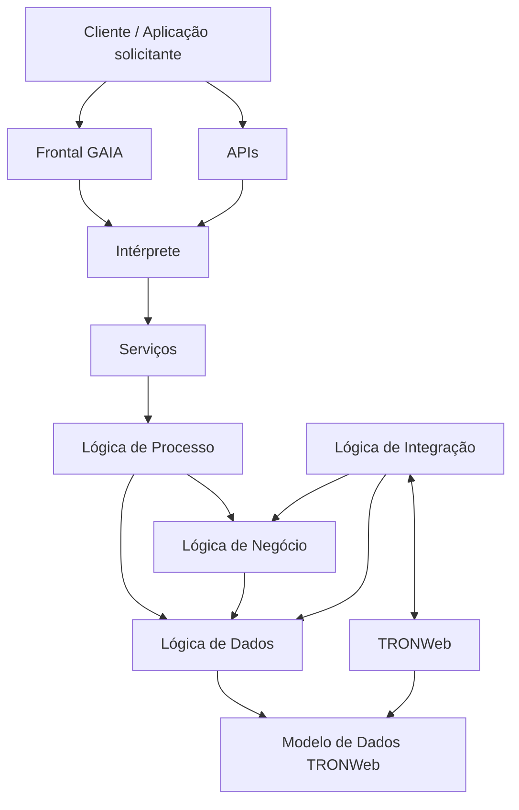
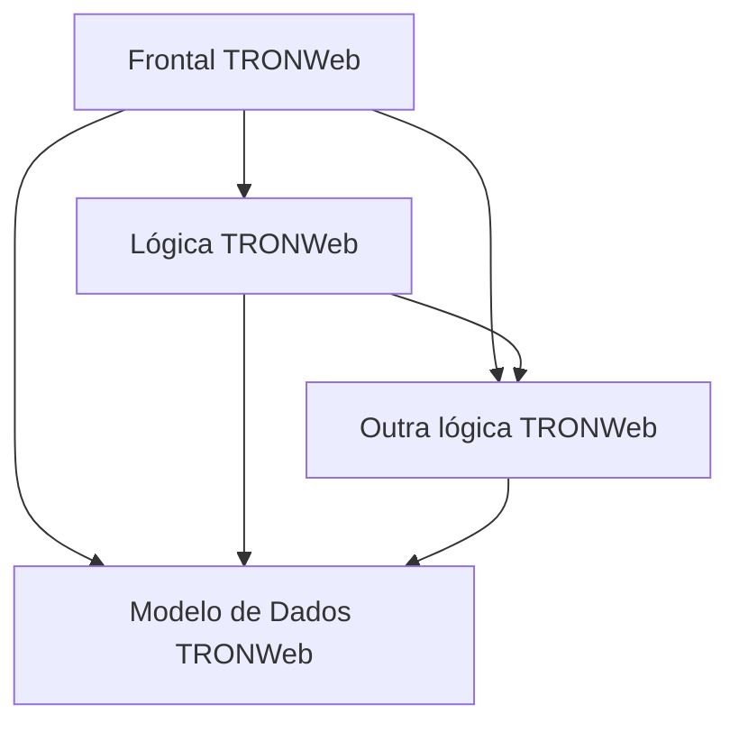
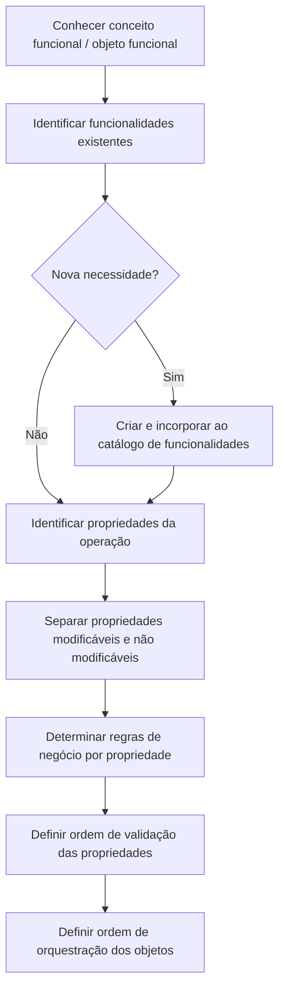

# Core — Visão Geral: Evolução de TRONWeb para NEWTron e Arquitetura GAIA

## 1. Metadados do Documento
- **Arquivo de Origem:** Não informado; conteúdo extraído de apresentação com 50 slides.
- **Tipo de Documento:** Apresentação Executiva / Arquitetura de Software / Guia Metodológico.
- **Domínio / Sistema:** Core, TRONWeb, NEWTron, GAIA.
- **Público-Alvo:** Arquitetos, desenvolvedores, analistas funcionais, equipes de integração e operação.
- **Data/Versão Identificada:** Não identificada.

---

## 2. Resumo Executivo & Contexto de Negócio

A apresentação descreve a evolução do ecossistema **TRONWeb** para **NEWTron**, sob uma arquitetura técnica denominada **GAIA**. A motivação principal é enfrentar problemas identificados no sistema legado: obsolescência tecnológica, dificuldade de integração com novos canais, redundância de software, carência documental, dispersão de versões, ausência de serviços web de núcleo, escalabilidade limitada e inexistência de uma alternativa web adequada.

NEWTron busca manter compatibilidade com TRONWeb, embora o documento declare que as arquiteturas são completamente distintas e que existe desconhecimento relevante sobre os desenvolvimentos realizados nos países. O modelo de dados TRONWeb deve permanecer como base de compatibilidade, mas precisa ser separado da lógica aplicacional.

A proposta arquitetural introduz uma separação explícita entre **modelo de dados**, **lógica de dados**, **lógica de negócio**, **lógica de processo**, **lógica de integração**, **serviços**, **frontal** e **APIs**. A decomposição visa atomização, reutilização, rastreabilidade, homogeneidade técnica, manutenção e redução de *time to market*.

A metodologia substitui uma abordagem baseada em tabelas físicas por um modelo baseado em objetos e conceitos lógicos. Cada objeto possui propriedades e funcionalidades; exemplos de funcionalidades incluem criar, modificar, inabilitar, consultar e bloquear. O documento enfatiza que métodos não devem ser duplicados, que as funcionalidades devem entrar em um catálogo do objeto e que deve existir um vocabulário único para ações.

GAIA é apresentada como arquitetura escalável, segura conforme requisitos DISMA, operável por meio de procedimentos de infraestrutura e implantação, acessível por frontais responsivos compatíveis com navegadores web, orientada a serviços SOAP e REST e apoiada em tecnologias modernas com ampla comunidade de desenvolvimento.

---

## 3. Arquitetura, Componentes & Tecnologias Envolvidas

### Componentes e camadas identificados

| Componente / Camada | Papel descrito no documento | Observações |
| :--- | :--- | :--- |
| **TRONWeb** | Sistema existente com frontal, lógicas e modelo de dados. | As lógicas não possuem fronteiras estáveis ou distribuição em camadas. |
| **Modelo de dados TRONWeb** | Armazena definições e operações realizadas. | Não evoluiu; é o principal motivo declarado para a compatibilidade com TRONWeb. |
| **NEWTron** | Evolução arquitetural compatível com TRONWeb. | Deve ser orientado a objetos, integrado, reutilizável e rastreável. |
| **GAIA** | Arquitetura técnica para evolução. | Características: escalabilidade, segurança, operação, acessibilidade, serviços e tecnologia moderna. |
| **Lógica de dados** | Camada voltada a operações de dados. | São citadas operações como consultar, inserir, atualizar e eliminar. |
| **Lógica de negócio** | Camada para ações funcionais associadas ao conceito lógico. | Exemplos: bloquear, desbloquear, comprovar, hallar, calcular, validar, existir, lançar, verificar e personalizar. |
| **Lógica de processo** | Orquestra lógicas e conceitos lógicos para atender processos. | Atua nos níveis de conceito lógico e processo. |
| **Lógica de integração** | Integra NEWTron e TRONWeb. | Existem referências tanto a NEWTron–TRONWeb quanto a TRONWeb–NEWTron. |
| **Serviços** | Expõem ou atendem processos total ou parcialmente. | Incluem orquestradores e intérpretes. |
| **Intérprete** | Adapta dados entre o cliente e o serviço. | Adapta a saída do serviço ao cliente e a entrada do cliente ao serviço. |
| **Frontal** | Camada de interface do usuário. | GAIA declara compatibilidade com navegadores e comportamento responsivo. |
| **APIs** | Interface exposta pela arquitetura NEWTron. | O documento não detalha contratos HTTP ou JSON. |
| **SOAP / REST** | Tecnologias de serviços web reutilizáveis. | Citadas como padrões de acesso por aplicações terceiras. |
| **DISMA** | Fonte de requisitos de segurança atendidos por GAIA. | O documento não define a sigla. |



### Arquitetura funcional: limitação declarada de TRONWeb



> **Nota de Análise:** O documento declara que TRONWeb não estabelece fronteiras para suas lógicas; qualquer lógica pode usar outras lógicas ou acessar livremente o modelo de dados. O frontal também pode acessar lógicas e o modelo de dados diretamente.

---

## 4. Regras de Negócio, Especificações Funcionais & Processos

### Objetivos de evolução para NEWTron

1. **Compatibilidade:** NEWTron deve ser compatível com TRONWeb.
2. **Separação de responsabilidades:** o modelo de dados deve estar totalmente separado da lógica.
3. **Atomização:** os elementos de software devem ser tão simples quanto possível, visando reutilização e composição.
4. **Reutilização:** componentes criados para uma finalidade não devem ser duplicados; os desenvolvimentos devem ser válidos para mais de uma instalação.
5. **Rastreabilidade:** os elementos NEWTron devem estar relacionados entre si para facilitar evolução e manutenção.
6. **Desenho técnico integrado:** o sistema deve ser simples e homogêneo; os elementos devem acompanhar o desenho técnico.
7. **Manutenção:** NEWTron é declarado como preparado para a etapa de manutenção.
8. **Orientação a objetos:** deve simplificar fases de desenvolvimento, busca e uso dos elementos construídos.
9. **Integração:** deve oferecer uma fachada de produto mesmo quando funções forem oferecidas por outros produtos ou ferramentas.
10. **Time to market:** o tempo de reação a modificações deve ser reduzido.
11. **Modelo conceitual único:** identifica elementos de negócio e suas características.
12. **Integração com TRONWeb:** NEWTron deve permitir a integração quando necessária.

### Metodologia baseada em objetos e conceitos lógicos

| Elemento | Definição extraída |
| :--- | :--- |
| **Objeto** | Entidade que contém propriedades e operações. |
| **Propriedades** | Características do objeto, como documento, nome, sobrenomes, data de nascimento, sexo e nacionalidade. |
| **Métodos / funcionalidades** | Ações que o objeto pode realizar, como criar, modificar, inabilitar e consultar. |
| **Conceito de negócio** | Representação de negócio formada por atributos e funcionalidades. |
| **Família** | Agrupamento de conceitos lógicos por funcionalidade. |
| **Catálogo de funcionalidades** | Catálogo do objeto no qual novas necessidades funcionais devem ser incorporadas. |

### Processo de análise funcional



### Regras para análise de propriedades

- Para implementar uma funcionalidade, o analista deve conhecer previamente o conceito funcional ou objeto funcional.
- Devem ser identificados os atributos/propriedades que não serão validados ou modificados na funcionalidade.
- No exemplo de **MODIFICAR pessoa**, o documento menciona a chave primária **Documento** como exemplo de atributo que não será validado/modificado.
- A ordem de validação das propriedades deve refletir dependências entre propriedades: se a obtenção ou validação de uma propriedade depende de outra, essa dependência determina a ordem.
- Devem ser definidas regras de negócio por propriedade.
- A validação não deve duplicar métodos já existentes.

### Vocabulário de ações

O documento determina que as ações de um objeto sejam expressas por verbos no singular, com vocabulário único e sem sinônimos, exceto quando seja necessário distinguir múltiplas funcionalidades.

| Categoria | Verbos / termos identificados |
| :--- | :--- |
| Verbos principais | Oferecer, consultar, existir, comprovar, verificar, criar, modificar, eliminar, tratar, hallar, bloquear, desbloquear, validar, gestionar, lanzar, personalizar, actualizar, borrar, traspasar, trasladar, apilar. |
| Sinônimos associados a criar | Aperturar, cargar, cotizar, descontar, devengar, incluir, emitir, formar, generar, liquidar, prorrogar, reemplazar, registrar, regularizar, valorar. |
| Sinônimos associados a modificar | Abandonar, activar, alterar, anular, asociar, autorizar, cambiar, cancelar, cobrar, convertir, desasociar, desremesar, disminuir, extender, finalizar, habilitar, liberar, pagar, prerenovar, recalcular, rechazar, reducir, reembolsar, remesar, renovar, rescatar, retrasar, inhabilitar, rehabilitar, restituir, terminar, vender. |

### Orquestração de processo e propriedades

O software de lógica de processo atende total ou parcialmente a um processo e orquestra os demais tipos de lógica em dois níveis:

| Nível | Responsabilidade |
| :--- | :--- |
| **Conceito lógico** | Invoca lógicas de negócio e/ou de dados exclusivas do conceito lógico. |
| **Processo** | Invoca orquestradores dos conceitos lógicos participantes do processo e contém a orquestração necessária para todos eles. |
| **Orquestrador de propriedades** | Valida informações funcionais totais ou parciais de um conceito lógico dentro de uma operação funcional e, ao final, grava informações no modelo de dados. |

Regras do orquestrador de propriedades:

- Inclui ações funcionais para validar propriedades participantes do ponto corrente da operação funcional.
- Quando uma propriedade produz erro, o erro é empilhado no conceito lógico ou objeto.
- A validação continua para a propriedade seguinte, mesmo quando há erro.
- Ao final, devolve o conceito lógico com os erros produzidos.
- É comum para determinada operação funcional, tanto no modo *online* quanto no processo *batch*.
- No processo online, obtém descrições do conceito lógico, valida a informação e, se não houver erros, grava em tabela de trabalho.
- No processo batch, apenas valida a informação do conceito lógico.
- Deve receber toda a informação de entrada necessária.
- Deve especificar o conceito lógico com o qual trabalha como informação de saída.

### Integração TRONWeb–NEWTron

A integração TRONWeb–NEWTron é declarada necessária para executar lógicas NEWTron a partir de TRONWeb, preservando a estrutura por camadas.

| Camada de integração | Finalidade |
| :--- | :--- |
| Integração TRONWeb–NEWTron Serviço | Contém lógicas de integração para serviço. |
| Integração TRONWeb–NEWTron Negócio | Contém lógicas de integração para negócio. |
| Integração TRONWeb–NEWTron Dados | Contém lógicas de integração para dados. |

Regras técnicas declaradas:

- As lógicas de integração possuem a mesma nomenclatura ou desenho técnico da funcionalidade NEWTron conectada.
- Em vez dos prefixos `DL`, `BL`, `OP` ou `PR`, utilizam os prefixos `TD`, `TB` ou `TS`.
- O software é considerado NEWTron e deve obedecer à norma e nomenclatura NEWTron.
- A lógica é acessada desde TRONWeb e devolve a informação obtida àquela aplicação.
- Quando a lógica `TD` retorna um tipo simples, o tipo deve ser definido em NEWTron.
- Para uma operação sem saída funcional, como `CONECTAR ACTUALIZAR xxx yyy`, a integração retorna o tipo `void` NEWTron `d_trn.vod`.
- Quando a lógica retorna objeto de linha ou conjunto, TRONWeb não enxerga objetos NEWTron; portanto, a informação deve ser devolvida em estrutura de memória de tipo registro ou tabela.

---

## 5. Tabelas de Parâmetros, Ambientes e Estruturas de Dados

| Item / Parâmetro | Descrição / Função | Tipo / Valores / Formato | Ambiente / Observações |
| :--- | :--- | :--- | :--- |
| `o_thp_prs_p` | Referência apresentada para Pessoa. | Nome técnico extraído. | Slide 36. |
| `o_thp_acv_p` | Referência apresentada para Actividad. | Nome técnico extraído. | Slide 36. |
| `o_thp_adr_p` | Referência apresentada para Dirección. | Nome técnico extraído. | Slide 36. |
| `dl_tabla1.f_get_mmm` | Exemplo de lógica de dados. | Nome técnico extraído. | Slide 38; sem contrato detalhado. |
| `dl_tabla2.f_get_mmm` | Exemplo de lógica de dados. | Nome técnico extraído. | Slide 38; sem contrato detalhado. |
| `dl_fml_lgc_jon_trn.f_get_mmm` | Exemplo de lógica de dados. | Nome técnico extraído. | Slide 38. |
| `dl_fml_lgc_trn.f_get_nnn` | Exemplo de consulta de dados. | Nome técnico extraído. | Slide 38. |
| `dl_fml_lgc_trn.f_inr_nnn` | Exemplo de inserção de dados. | Nome técnico extraído. | Slide 38. |
| `dl_fml_lgc_trn.f_set_nnn` | Exemplo de operação de dados. | Nome técnico extraído. | Slide 38. |
| `dl_fml_lgc_trn.f_upd_nnn` | Exemplo de atualização de dados. | Nome técnico extraído. | Slide 38. |
| `dl_fml_lgc_trn.f_dlt_nnn` | Exemplo de eliminação de dados. | Nome técnico extraído. | Slide 38. |
| `bl_fml_lgc_trn.f_lck / f_unl` | Bloquear e desbloquear. | Nomes técnicos extraídos. | Slide 40. |
| `bl_trn_DYN_trn.f_lnc_dyn` | Lançar. | Nome técnico extraído. | Slide 40. |
| `bl_fml_lgc_VLD_trn.f_zzz` | Validar. | Nome técnico parcial. | Slide 40. |
| `bl_fml_lgc_VRF_trn.f_zzz` | Verificar. | Nome técnico parcial. | Slide 40. |
| `bl_fml_lgc_PSZ_trn.f_zzz` | Personalizar. | Nome técnico parcial. | Slide 40. |
| `IL_fml_lgc_PSZ_trn.f_zzz` | Personalizar. | Nome técnico parcial. | Slide 40. |
| `op_fml_lgc_xxx_zzz_trn.p_sav_yyy` | Exemplo de lógica de processo. | Nome técnico extraído. | Slide 44. |
| `pr_fml_fml_MOV_trn.p_prc_yyy` | Exemplo de processo. | Nome técnico extraído. | Slide 44. |
| `d_trn.vod` | Tipo `void` definido em NEWTron. | Tipo de retorno. | Integração TRONWeb–NEWTron. |
| SOAP | Tecnologia padrão de serviço web. | Protocolo / estilo de serviço. | Citado na arquitetura GAIA. |
| REST | Tecnologia padrão de serviço web. | Estilo de serviço web. | Citado na arquitetura GAIA. |
| `https://internos.mapfre.com/tronweb/desarrollo-arquitectura/` | Referência à arquitetura e epígrafes de conceitos lógicos, lógica de dados, negócio, integração e serviço. | URL interna. | Citada em vários slides. |
| `https://internos.mapfre.com/tronweb/conceptos-logicos/` | Referência para elementos que definem um objeto. | URL interna. | Slides 30 e 37. |
| `https://internos.mapfre.com/tronweb/desarrollo-logicas-datos/` | Referência para lógica de dados. | URL interna. | Slides 37 e 38. |
| `https://internos.mapfre.com/tronweb/desarrollo-logicas-negocio/` | Referência para lógica de negócio. | URL interna. | Slides 39 e 40. |
| `https://internos.mapfre.com/tronweb/desarrollo-logicas-integracion/` | Referência para lógica de integração. | URL interna. | Slides 41, 42 e 47. |
| `https://internos.mapfre.com/tronweb/desarrollo-logicas-servicio/` | Referência para lógica de serviço. | URL interna. | Slides 43 a 46. |

---

## 6. Bateria de Perguntas & Respostas para RAG (FAQ Sintético)

### P1: Por que NEWTron foi proposto como evolução de TRONWeb?
**R:** NEWTron foi proposto para enfrentar a obsolescência tecnológica de TRONWeb, a dificuldade de integração com novos canais, a redundância de software, a falta de metodologia e documentação, a dispersão de versões, a integração complexa, limitações de escalabilidade, ausência de serviços web de núcleo e ausência de uma alternativa web adequada.

### P2: Qual é a relação entre NEWTron e o modelo de dados TRONWeb?
**R:** NEWTron deve manter compatibilidade com TRONWeb. O documento afirma que o modelo de dados TRONWeb não evoluiu e é o principal motivo para a compatibilidade. Ao mesmo tempo, NEWTron deve separar completamente o modelo de dados da lógica aplicacional.

### P3: Quais camadas funcionais compõem a arquitetura NEWTron?
**R:** O documento apresenta modelo de dados TRONWeb, lógica de dados, lógica de negócio, lógica de processo, lógicas TRONWeb, lógica de integração, serviços, frontal e APIs. A arquitetura procura organizar responsabilidades que no TRONWeb não possuíam fronteiras estáveis.

### P4: Como a arquitetura GAIA atende à integração com aplicações terceiras?
**R:** GAIA permite que aplicações exponham serviços web reutilizáveis por tecnologias padrão SOAP e REST, possibilitando acesso de aplicações terceiras. O conteúdo fornecido não detalha endpoints, métodos HTTP, portas ou contratos de payload.

### P5: O que é um conceito lógico na metodologia NEWTron?
**R:** Um conceito lógico representa um objeto de negócio com informação funcional e informação de processo. Ele contém propriedades ou atributos e funcionalidades ou métodos. Exemplos de propriedades apresentados incluem documento, nome, sobrenomes, data de nascimento, sexo e nacionalidade.

### P6: Como devem ser tratadas novas necessidades funcionais de um objeto?
**R:** O analista deve estudar e conhecer as ações que o objeto pode realizar. Se surgirem novas necessidades, essas funcionalidades devem ser implementadas e incorporadas ao catálogo de funcionalidades do objeto, sem duplicar métodos existentes.

### P7: Como o orquestrador de propriedades trata erros de validação?
**R:** Quando a validação de uma propriedade gera erro, o erro é empilhado no conceito lógico ou objeto. A validação continua para as propriedades seguintes até terminar. No final, o orquestrador retorna o conceito lógico com todos os erros produzidos.

### P8: Qual é a diferença entre o orquestrador de conceito lógico e o orquestrador de processo?
**R:** O orquestrador de conceito lógico invoca lógicas de negócio e/ou lógicas de dados exclusivas de um conceito lógico. O orquestrador de processo invoca os orquestradores dos diferentes conceitos lógicos participantes e contém a orquestração necessária para atender todo o processo.

### P9: Como TRONWeb executa lógicas NEWTron?
**R:** TRONWeb acessa lógicas NEWTron por camadas de integração TRONWeb–NEWTron para serviço, negócio e dados. Essas camadas preservam a arquitetura por níveis e adotam prefixos `TD`, `TB` ou `TS` em vez de `DL`, `BL`, `OP` ou `PR`.

### P10: Como objetos NEWTron são devolvidos para TRONWeb durante uma integração?
**R:** Como TRONWeb não visualiza os objetos NEWTron, quando uma lógica retorna o conteúdo de um objeto de linha ou de um objeto conjunto, a informação deve ser devolvida como estrutura de memória de tipo registro ou tabela.

### P11: Como é definida a ordem de validação das propriedades?
**R:** A ordem deve ser determinada pelas dependências entre propriedades. Quando a obtenção ou a validação de uma propriedade depende de outra, essa relação estabelece a sequência das validações.

### P12: Quais são as características principais declaradas para GAIA?
**R:** GAIA é apresentada como escalável em cada camada, segura conforme requisitos DISMA, operável por procedimentos de infraestrutura e implantação, acessível por frontais responsivos, orientada a serviços SOAP e REST, baseada em tecnologias modernas e apoiada por ampla comunidade de desenvolvimento.

---

## 7. Glossário de Termos, Siglas & Conceitos-Chave

- **API:** Interface de programação citada como parte da arquitetura funcional NEWTron.
- **Batch:** Processo que, no contexto do orquestrador de propriedades, apenas valida a informação do conceito lógico.
- **Conceito lógico:** Objeto de negócio definido por informação funcional e informação de processo.
- **DISMA:** Fonte dos requisitos de segurança que a arquitetura GAIA declara cumprir; a expansão da sigla não foi fornecida.
- **Frontal:** Camada de interface do usuário.
- **GAIA:** Arquitetura técnica apresentada para a evolução, com características de escalabilidade, segurança, operação, acessibilidade e orientação a serviços.
- **Intérprete:** Componente que adapta informação recebida de um serviço para o cliente e informação fornecida pelo cliente para o serviço.
- **Lógica de dados:** Camada para operações sobre dados, com exemplos de consultar, inserir, atualizar e eliminar.
- **Lógica de integração:** Camada para comunicação entre NEWTron e TRONWeb.
- **Lógica de negócio:** Camada para ações funcionais como bloquear, validar, verificar e personalizar.
- **Lógica de processo:** Camada de orquestração de lógicas e conceitos lógicos.
- **NEWTron:** Sistema evolutivo compatível com TRONWeb, orientado a objetos e estruturado por camadas.
- **Orquestrador de propriedades:** Componente que valida propriedades de um conceito lógico, acumula erros e pode persistir dados após validação sem erros.
- **REST:** Tecnologia padrão de serviços web reutilizáveis citada para GAIA.
- **SOAP:** Tecnologia padrão de serviços web reutilizáveis citada para GAIA.
- **TRONWeb:** Sistema de origem, caracterizado no documento por acesso pouco restrito entre frontal, lógicas e modelo de dados.

---

## 8. Notas Críticas, Riscos & Limitações

- O documento afirma existir **falta total de conhecimento** sobre a realidade dos desenvolvimentos realizados nos países, apesar de exigir compatibilidade entre NEWTron e TRONWeb.
- A arquitetura TRONWeb é descrita sem fronteiras entre lógicas e com acesso direto do frontal ao modelo de dados, representando risco de acoplamento e dificuldade de manutenção.
- Há carência declarada de documentação metodológica, funcional e técnica no contexto legado.
- O modelo de governo anterior é apontado como causa de dispersão de versões.
- O documento menciona SOAP, REST, APIs e integração, mas não fornece contratos de serviços, métodos HTTP, esquemas JSON, autenticação, portas, SLAs ou políticas de observabilidade.
- As referências internas MAPFRE, Confluence, Polarion e Jira são citadas como fontes complementares, mas o conteúdo dessas referências não foi incluído na extração.
- Os slides 48 e 49 não apresentam conteúdo extraído.
- Diversos nomes técnicos aparecem como exemplos (`f_zzz`, `xxx`, `yyy`, `nnn`, `mmm`) e não devem ser interpretados como contratos completos ou identificadores funcionais definitivos.

---

## 9. Conteúdo Bruto Estruturado (Referência Fiel)

```text
--- [SLIDES 1–6] ---

Core — Visión general.
A apresentação introduz Backend Oracle, os motivos para evolução e os objetivos de NEWTron.

Motivos de evolução:
- Obsolescencia tecnológica.
- Dificuldade de integração com novos canais de distribuição, gerando redundância.
- Falta de metodologia para cobrir o processo de desenvolvimento.
- Escassa documentação metodológica, funcional e técnica.
- Integração complexa devido aos grandes componentes de TRONWeb.
- Dispersão de versões decorrente do modelo de governo.
- Ausência de alternativa web.
- Escalabilidade limitada e custo adicional para ampliações.
- Ausência de serviços web de núcleo e de normativa associada.

Objetivos:
- Compatibilidade NEWTron–TRONWeb.
- Separar lógica do modelo de dados.
- Atomização, reutilização e rastreabilidade.
- Desenho técnico integrado, manutenção e orientação a objetos.
- Papel integrador, redução de time to market, modelo conceitual único e integração com TRONWeb.

GAIA:
- Escalabilidade.
- Segurança segundo requisitos DISMA.
- Operabilidade por procedimentos de infraestrutura e implantação.
- Acessibilidade por frontais responsivos e compatíveis com navegadores.
- Serviços SOAP e REST.
- Tecnologia moderna e ampla comunidade.

--- [SLIDES 7–17] ---

TRONWeb:
- Modelo de dados armazena definições e operações.
- Lógicas sem localização ou distribuição em camadas estabelecida.
- Lógicas podem acessar outras lógicas e o modelo de dados livremente.
- Frontal pode acessar lógicas e modelo de dados diretamente.

NEWTron:
- Modelo de dados TRONWeb.
- Lógica de dados.
- Lógica de negócio.
- Lógica de processo.
- Serviços.
- Frontal.
- APIs.
- Lógica de integração.

Referências:
https://internos.mapfre.com/tronweb/desarrollo-arquitectura/
Epígrafes: Concepto Lógico, Lógica de Datos, Lógica de negocio, Servicio,
Lógicas de Integración NEWTron-TronWeb e TronWeb-NEWTron.

--- [SLIDES 19–35] ---

Mudança metodológica:
- Migração de modelo baseado em tabela para modelo baseado em objetos.
- Nota do apresentador: passagem de modelo físico a modelo lógico.
- Objetos podem representar informações de risco, cobertura, sinistro, pessoa,
  contato, endereço, pagamento, licença e expediente.
- A família agrupa conceitos lógicos por funcionalidade.
- Objetos possuem propriedades e métodos.
- Exemplo de propriedades: Documento, Nombre, Apellidos, Fecha de nacimiento,
  Sexo, Nacionalidad.
- Exemplo de métodos: CREAR, MODIFICAR, INHABILITAR, CONSULTAR.
- Características de objeto: contém propriedades, contém operações e é simples.
- Objetos iniciais identificados: PÓLIZA e SINIESTRO.
- Conceito de negócio contém atributos e funcionalidades.
- Funcionalidades citadas: CREAR, MODIFICAR, INHABILITAR, CONSULTAR, BLOQUEAR.
- Não duplicar métodos.
- Conhecer a definição funcional do objeto.
- Identificar propriedades modificáveis e não modificáveis.
- Para MODIFICAR persona, Documento é apresentado como exemplo de PK que não
  será validada/modificada.
- Determinar regras de negócio por propriedade.
- Determinar ordem das propriedades e dos objetos para orquestração.
- Definir vocabulário único e identificar sinônimos.

--- [SLIDES 36–42] ---

Conceito lógico / objeto processo:
- Informação funcional + informação do processo.
- Exemplos: Persona o_thp_prs_p; Actividad o_thp_acv_p;
  Direccion o_thp_adr_p.
- Referências: NEWTron-Familias-Conceptos-logicos e Reglas Nomenclatura NEWTron.

Lógica de dados:
- Exemplos técnicos: dl_tabla1.f_get_mmm, dl_tabla2.f_get_mmm,
  dl_fml_lgc_jon_trn.f_get_mmm, dl_fml_lgc_trn.f_get_nnn,
  dl_fml_lgc_trn.f_inr_nnn, dl_fml_lgc_trn.f_set_nnn,
  dl_fml_lgc_trn.f_upd_nnn, dl_fml_lgc_trn.f_dlt_nnn.
- Referências a Log, Escaparate e Inicializacion objetos.

Lógica de negócio:
- BLOQUEAR / DESBLOQUEAR: bl_fml_lgc_trn.f_lck / f_unl.
- COMPROBAR: bl_fml_lgc_CCK_trn.f_zzz.
- HALLAR / CALCULAR: bl_fml_lgc_CUE_trn.f_zzz.
- EXISTIR: bl_fml_lgc_EXS_trn.f_zzz.
- LANZAR: bl_trn_DYN_trn.f_lnc_dyn.
- VALIDAR: bl_fml_lgc_VLD_trn.f_zzz.
- VERIFICAR: bl_fml_lgc_VRF_trn.f_zzz.
- PERSONALIZAR: bl_fml_lgc_PSZ_trn.f_zzz e IL_fml_lgc_PSZ_trn.f_zzz.

Lógica de integração:
- Referências à integração NEWTron–TRONWeb e à lógica de integração.
- Caso citado: TRNDP-81389.

--- [SLIDES 43–47] ---

Lógica de processo:
- Software que atende total ou parcialmente a um processo.
- Orquestra lógicas nos níveis de conceito lógico e processo.
- Exemplo: alta de cliente com dados pessoais, direções e formas de pagamento.
- Intérprete adapta informação entre serviço e cliente.
- Orquestrador de propriedades valida propriedades, empilha erros e continua
  a validação.
- Online: obtém descrições, valida e, sem erros, grava em tabela de trabalho.
- Batch: valida informação do conceito lógico.
- Entrada deve conter toda informação necessária.
- Saída deve especificar o conceito lógico trabalhado.

Integração TRONWeb–NEWTron:
- Permite executar lógicas NEWTron desde TRONWeb.
- Camadas: Serviço, Negócio e Dados.
- Prefixos de integração: TD, TB e TS.
- Prefixos NEWTron de referência: DL, BL, OP e PR.
- Tipos simples devolvidos devem ser tipos definidos NEWTron.
- Exemplo de void: d_trn.vod.
- Objetos de linha ou conjunto devem voltar a TRONWeb como registro ou tabela.

--- [SLIDES 48–50] ---

Slides 48 e 49: sem conteúdo extraído.
Slide 50: encerramento da sessão sobre Arquitetura Funcional NEWTron.
```
