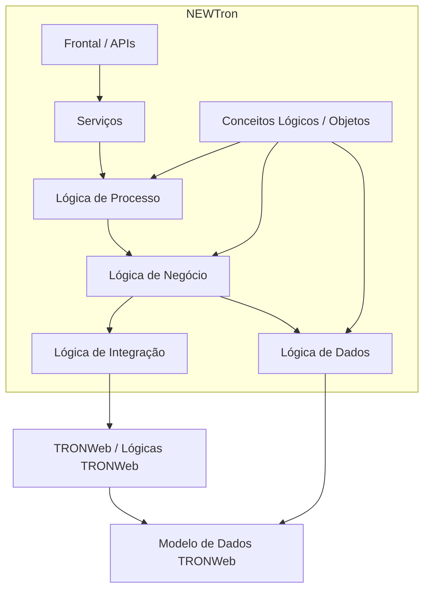
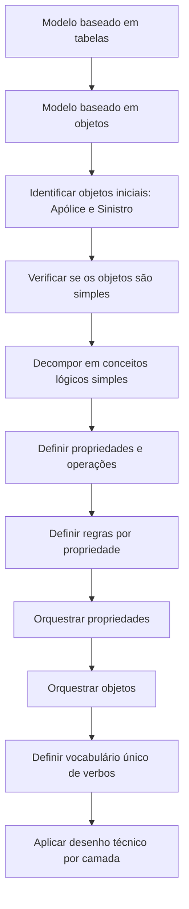

# NEWTron Core — Visão Geral, Arquitetura Funcional e Metodologia Orientada a Objetos

## 1. Metadados do Documento
- **Arquivo de Origem:** Não identificado; conteúdo bruto fornecido no enunciado.
- **Tipo de Documento:** Apresentação Executiva / Arquitetura de Software / Metodologia.
- **Domínio / Sistema:** Core, TRONWeb, NEWTron, Mapfre.
- **Público-Alvo:** Arquitetos, desenvolvedores backend, desenvolvedores frontend, analistas funcionais e equipes de manutenção.
- **Data/Versão Identificada:** Não identificada.

---

## 2. Resumo Executivo & Contexto de Negócio

O documento apresenta a visão geral do Core e a evolução arquitetural de TRONWeb para NEWTron. A iniciativa surge em resposta a problemas identificados na plataforma TRONWeb: obsolescência tecnológica, dificuldades de integração com novos canais de distribuição, redundância de software, baixa escalabilidade, dispersão de versões, carência de documentação e inexistência de serviços web de núcleo.

NEWTron é apresentado como uma arquitetura compatível com TRONWeb, embora as arquiteturas sejam descritas como totalmente distintas. A compatibilidade é particularmente relevante porque o modelo de dados TRONWeb não evoluiu e constitui o principal motivo para preservar a integração entre os dois contextos tecnológicos.

A proposta de NEWTron é separar a lógica do modelo de dados, organizar responsabilidades em camadas, atomizar componentes, evitar duplicidade de desenvolvimento, promover reutilização entre instalações e garantir rastreabilidade entre os elementos do sistema. O documento também estabelece a orientação a objetos e um modelo conceitual único como fundamentos para simplificar desenvolvimento, manutenção, busca e utilização dos elementos construídos.

A metodologia descrita transforma um modelo baseado em tabelas em um modelo baseado em objetos ou conceitos lógicos. Conceitos de negócio como Pessoa, Direção, Meio de Contato, Meio de Pagamento, Cliente, Apólice e Sinistro são decompostos em elementos simples, com propriedades, operações, regras de negócio e ordem de orquestração explicitamente definidos.

---

## 3. Arquitetura, Componentes & Tecnologias Envolvidas

### Componentes e camadas identificados

| Componente / Camada | Papel documentado |
| :--- | :--- |
| **TRONWeb** | Plataforma existente cuja arquitetura apresenta lógicas sem localização estável em camadas e acesso amplo ao modelo de dados. |
| **Modelo de dados TRONWeb** | Repositório das definições e operações realizadas no contexto TRONWeb. |
| **Lógica de dados** | Camada associada a consultas, inserções, atualizações, exclusões, inicialização de objetos, logging e acesso a tabelas/funções. |
| **Lógica de negócio** | Camada associada a operações como bloquear, desbloquear, comprovar, calcular, existir, lançar, validar, verificar e personalizar. |
| **Lógica de processo** | Camada que orquestra operações como criar, modificar, gerenciar, trasladar, tratar, validar e achar, em nível de família e conceito lógico. |
| **Lógica de integração NEWTron–TRONWeb** | Camada para integração entre NEWTron e TRONWeb. |
| **Lógica de integração TRONWeb–NEWTron** | Camada para integração no sentido TRONWeb para NEWTron. |
| **Serviços** | Camada exposta ao frontal; o documento cita intérprete, interfaces Java e serviço JavaScript. |
| **Frontal / APIs** | Elementos consumidores dos serviços e das funcionalidades da arquitetura NEWTron. |
| **Conceito lógico / Objeto** | Unidade funcional composta por atributos, ações, processo, campos, obrigatoriedade, modificabilidade, erros, códigos, textos e `rowid`. |
| **Família** | Agrupamento de conceitos lógicos por funcionalidade. |

### Arquitetura TRONWeb identificada

O documento descreve que TRONWeb possui modelo de dados no qual são armazenadas definições e operações. Entretanto, os diversos tipos de lógica não possuem localização estável nem distribuição organizada em camadas.

As lógicas TRONWeb não possuem fronteiras: cada lógica pode acessar livremente outras lógicas ou o modelo de dados. O frontal TRONWeb também possui acesso a qualquer lógica e, inclusive, acesso direto ao modelo de dados.

### URLs e referências documentadas

| Referência | Seção / epígrafe citada |
| :--- | :--- |
| `https://internos.mapfre.com/tronweb/desarrollo-arquitectura/` | Conceito Lógico |
| `https://internos.mapfre.com/tronweb/desarrollo-arquitectura/` | Lógica de Dados |
| `https://internos.mapfre.com/tronweb/desarrollo-arquitectura/` | Lógica de Negócio |
| `https://internos.mapfre.com/tronweb/desarrollo-arquitectura/` | Serviço |
| `https://internos.mapfre.com/tronweb/desarrollo-arquitectura/` | Lógicas de Integração NEWTron–TRONWeb |
| `https://internos.mapfre.com/tronweb/desarrollo-arquitectura/` | Lógicas de integração TRONWeb–NEWTron |
| `https://internos.mapfre.com/tronweb/desarrollo-objetos/` | Objetos / conceitos lógicos |
| `https://internos.mapfre.com/tronweb/desarrollo-logicas-datos/` | Lógica de Dados |
| `https://internos.mapfre.com/tronweb/desarrollo-logicas-negocio/` | Lógica de Negócio |
| `https://internos.mapfre.com/tronweb/desarrollo-logicas-integracion/` | Lógica de Integração |
| `https://internos.mapfre.com/tronweb/desarrollo-logicas-servicio/` | Serviço, conceito lógico, processo e intérprete |

---

## 4. Regras de Negócio, Especificações Funcionais & Processos

### Motivações para evolução do Core

| Motivação | Descrição fiel ao conteúdo |
| :--- | :--- |
| Obsolescência tecnológica | A tecnologia utilizada dificulta a integração com novos canais de distribuição e gera redundância no software. |
| Falta de metodologia | TRONWeb possui normativa de desenvolvimento, mas carece de uma metodologia que cubra o processo de desenvolvimento. |
| Escassa documentação | Há carência de documentação metodológica, funcional e técnica. |
| Integração complexa | Os grandes componentes TRONWeb dificultam a composição dos elementos necessários a novos canais de distribuição e geram redundância. |
| Dispersão | O modelo de governo não foi apropriado e propiciou dispersão das versões; NEWTron pretende ser a alavanca para mudança. |
| Frontais web | A arquitetura não dispõe de alternativa web que satisfaça as necessidades nesse âmbito. |
| Escalabilidade | O software não propicia progressão simples e gera custo adicional quando há necessidade de ampliação. |
| Serviços web | Não existe serviço web de núcleo nem normativa sobre esse ponto. |

### Objetivos de NEWTron

| Objetivo | Regra / intenção arquitetural |
| :--- | :--- |
| Compatibilidade | NEWTron deve ser compatível com TRONWeb. |
| Separação de lógica e dados | O modelo de dados deve estar totalmente separado da lógica. |
| Atomização | Os elementos de software devem ser simples para permitir reutilização, simplicidade e composição em elementos mais complexos. |
| Reutilização | Deve ser evitada a duplicidade de componentes desenvolvidos para uma finalidade concreta; desenvolvimentos devem servir a mais de uma instalação. |
| Rastreabilidade | Todos os elementos NEWTron devem estar relacionados para facilitar evolução e manutenção. |
| Desenho técnico integrado | NEWTron deve ser simples e homogêneo; seus elementos devem acompanhar o desenho técnico. |
| Manutenção | NEWTron é preparado para a etapa de manutenção. |
| Orientação a objetos | Deve simplificar fases de desenvolvimento, busca e uso dos elementos construídos. |
| Integração | Deve oferecer fachada de produto e permitir integração com TRONWeb quando necessária. |
| Time to market | O tempo de reação ante modificações deve ser significativamente reduzido. |
| Modelo conceitual único | Deve identificar elementos de negócio e suas características. |

### Metodologia de identificação e decomposição

### Conceitos lógicos e famílias

O documento estabelece que um objeto contém propriedades e operações e deve ser simples. Os objetos inicialmente identificados incluem Apólice e Sinistro, sendo posteriormente decompostos em elementos menores.

A agrupação de conceitos lógicos por funcionalidade é denominada **Família**. Entre os conceitos apresentados estão Pessoa, Direção, Atividade, Agente, Segurado, Terceiro, Meio de Contato, Meio de Cobro/Pagamento, Sinistro, Causa de Sinistro, Tramitador, Intervenção Externa, Documentos, Relato de Sinistro, Informação de Expediente, Apólice, Coberturas, Desgloses, Cláusulas, Recibos e Atributos/Dados Variáveis.

### Exemplo funcional: Pessoa

| Elemento | Conteúdo identificado |
| :--- | :--- |
| Objeto | Pessoa |
| Propriedades | Documento, Nome, Apelidos, Data de Nascimento, Sexo e Nacionalidade. |
| Métodos | Criar, Modificar, Inabilitar e Consultar. |
| Regra metodológica | Não duplicar métodos. |
| Regra metodológica | Conhecer a definição funcional do objeto. |

### Regras de negócio por propriedade para modificar Pessoa

| Propriedade | Regra documentada |
| :--- | :--- |
| Segundo apelido | Letras maiúsculas; comprimento superior a 3. |
| Primeiro apelido | Letras maiúsculas; comprimento superior a 3. |
| Data de nascimento | Deve ser inferior à data do sistema. |
| Nome | Opcional; comprimento superior a 3. |
| Nacionalidade | Valores corretos exemplificados: china, polaca, entre outros. |
| Sexo | Valores corretos exemplificados: mujer, hombre. |

> **Nota de Análise:** O documento apresenta exemplos de valores para nacionalidade e sexo, mas não fornece uma enumeração completa, contratos de validação, tipos de dados ou mensagens de erro associadas.

### Orquestração documentada

| Escopo | Ordem identificada |
| :--- | :--- |
| Propriedades do objeto Pessoa | Segundo apelido: 4; Primeiro apelido: 2; Data de nascimento: 1; Nome: 5; Nacionalidade: 3; Sexo: 6. |
| Objetos | Pessoa: 1; Direção: 3; Meio de contato: 5; Meio de pagamento: 4; Cliente: 2. |

### Vocabulário de ações

O documento determina que ações executadas por um conceito de negócio devem ser expressas por verbos no singular. Não devem existir sinônimos, exceto quando necessários para diferenciar múltiplas funcionalidades.

| Classificação | Verbos |
| :--- | :--- |
| Verbos principais | Oferecer, Consultar, Existir, Comprovar, Verificar, Criar, Modificar, Eliminar, Tratar, Achar, Bloquear, Desbloquear, Validar, Gerenciar, Lançar, Personalizar, Atualizar, Apagar, Transferir, Trasladar, Empilhar. |
| Sinônimos associados a Criar | Aperturar, Carregar, Cotizar, Descontar, Devengar, Incluir, Emitir, Formar, Gerar, Liquidar, Prorrogar, Reemplazar, Registrar, Regularizar, Valorar. |
| Sinônimos associados a Modificar | Abandonar, Ativar, Alterar, Anular, Associar, Autorizar, Mudar, Cancelar, Cobrar, Converter, Desassociar, Desremesar, Diminuir, Estender, Finalizar, Habilitar, Liberar, Pagar, Prerrenovar, Recalcular, Rejeitar, Reduzir, Reembolsar, Remesar, Renovar, Resgatar, Retrasar, Inabilitar, Reabilitar, Restituir, Terminar, Vender. |

---

## 5. Tabelas de Parâmetros, Ambientes e Estruturas de Dados

### Exemplos de conceitos lógicos e nomenclatura

| Item / Parâmetro | Descrição / Função | Tipo / Valores / Formato | Ambiente / Observações |
| :--- | :--- | :--- | :--- |
| `o_thp_prs_p` | Conceito lógico associado a Pessoa. | Nome de objeto/conceito lógico. | NEWTron. |
| `o_thp_acv_p` | Conceito lógico associado a Atividade. | Nome de objeto/conceito lógico. | NEWTron. |
| `o_thp_adr_p` | Conceito lógico associado a Direção. | Nome de objeto/conceito lógico. | NEWTron. |
| `rowid` | Elemento apresentado na definição do conceito lógico. | Campo identificado no diagrama. | Sem detalhamento adicional. |
| `acción` | Elemento apresentado na definição do conceito lógico. | Campo identificado no diagrama. | Sem detalhamento adicional. |
| `terminacion` | Elemento apresentado na definição do conceito lógico. | Campo identificado no diagrama. | Sem detalhamento adicional. |
| `seleccion` | Elemento apresentado na definição do conceito lógico. | Campo identificado no diagrama. | Sem detalhamento adicional. |
| `campos` | Elemento apresentado na definição do processo. | Estrutura de processo. | Sem detalhamento adicional. |
| `campo obligatorio` | Indicação de obrigatoriedade de campo. | Regra de campo. | Sem detalhamento adicional. |
| `modific` | Indicação de modificabilidade de campo. | Regra de campo. | Sem detalhamento adicional. |
| `error` | Elemento de erro no conceito lógico. | Estrutura de erro. | Sem contratos detalhados. |
| `cód` | Código associado ao erro. | Campo de erro. | Sem catálogo informado. |
| `texto` | Texto associado ao erro. | Campo de erro. | Sem mensagens informadas. |

### Lógica de dados — elementos e padrões citados

| Item / Parâmetro | Descrição / Função | Tipo / Valores / Formato | Ambiente / Observações |
| :--- | :--- | :--- | :--- |
| `dl_tabla1.f_get_mmm` | Operação de consulta. | Padrão de função. | Lógica de dados. |
| `dl_tabla2.f_get_mmm` | Operação de consulta. | Padrão de função. | Lógica de dados. |
| `dl_fml_lgc_jon_trn.f_get_mmm` | Operação de consulta. | Padrão de função. | Lógica de dados. |
| `dl_tabla.f_inr_mmm` | Operação de inserção, conforme nomenclatura apresentada. | Padrão de função. | Lógica de dados. |
| `dl_tabla.f_upd_nnn` | Operação de atualização. | Padrão de função. | Lógica de dados. |
| `dl_tabla.f_dlt_nnn` | Operação de exclusão. | Padrão de função. | Lógica de dados. |
| `dl_fml_lgc_trn.f_get_nnn` | Operação de consulta para família/conceito lógico. | Padrão de função. | Lógica de dados. |
| `dl_fml_lgc_trn.f_inr_nnn` | Operação de inserção para família/conceito lógico. | Padrão de função. | Lógica de dados. |
| `dl_fml_lgc_trn.f_set_nnn` | Operação de definição/atribuição. | Padrão de função. | Lógica de dados. |
| `dl_fml_lgc_trn.f_upd_nnn` | Operação de atualização. | Padrão de função. | Lógica de dados. |
| `dl_fml_lgc_trn.f_dlt_nnn` | Operação de exclusão. | Padrão de função. | Lógica de dados. |
| `dl_fml_lgc.p_add` | Operação de adição. | Procedimento/função apresentado. | Lógica de dados. |
| `dl_fml_lgc_lkp_trn.f_get_nnn` | Operação de consulta de lookup. | Padrão de função. | Lógica de dados. |
| `f_inl` | Inicialização de objetos. | Função apresentada. | Lógica de dados. |
| Log | Elemento explicitamente citado. | Capacidade de log. | Sem rota, formato ou retenção informados. |
| Escaparate | Elemento explicitamente citado. | Não detalhado. | Lógica de dados. |

### Lógica de negócio — elementos e padrões citados

| Item / Parâmetro | Descrição / Função | Tipo / Valores / Formato | Ambiente / Observações |
| :--- | :--- | :--- | :--- |
| `bl_fml_lgc_trn.f_lck` | Bloquear. | Função. | Lógica de negócio. |
| `bl_fml_lgc_trn.f_unl` | Desbloquear. | Função. | Lógica de negócio. |
| `bl_fml_lgc_CCK_trn.f_zzz` | Comprovar / achar / calcular, conforme slide. | Padrão de função. | Lógica de negócio. |
| `bl_fml_lgc_EXS_trn.f_zzz` | Existir. | Padrão de função. | Lógica de negócio. |
| `bl_fml_lgc_CUE_trn.f_zzz` | Comprovar / achar / calcular, conforme slide. | Padrão de função. | Lógica de negócio. |
| `bl_trn_DYN_trn.f_lnc_dyn` | Lançar. | Função. | Lógica de negócio. |
| `bl_fml_lgc_VLD_trn.f_zzz` | Validar. | Padrão de função. | Lógica de negócio. |
| `bl_fml_lgc_VRF_trn.f_zzz` | Verificar. | Padrão de função. | Lógica de negócio. |
| `bl_fml_lgc_PSZ_trn.f_zzz` | Personalizar. | Padrão de função. | Lógica de negócio. |
| `IL_fml_lgc_PSZ_trn.f_zzz` | Personalizar. | Padrão de função. | Lógica de negócio. |

### Lógica de processo e serviço — elementos citados

| Item / Parâmetro | Descrição / Função | Tipo / Valores / Formato | Ambiente / Observações |
| :--- | :--- | :--- | :--- |
| `op_fml_lgc_xxx_zzz_trn.p_sav_yyy` | Criar / modificar / sinônimos. | Procedimento. | Lógica de processo. |
| `bl_fml_lgc_xxx_zzz_trn.f_vld_prp_A` | Validar propriedade. | Função. | Lógica de processo. |
| `op_fml_lgc_CUE_trn.p_yyy` | Achar / validar, conforme slide. | Procedimento. | Lógica de processo. |
| `op_fml_lgc_MAG_trn.p_xxx` | Gerenciar. | Procedimento. | Lógica de processo. |
| `op_fml_lgc_MOV_trn.p_yyy` | Trasladar. | Procedimento. | Lógica de processo. |
| `IL_fml_lgc_PRC_trn.f_zzz` | Tratar. | Função. | Lógica de processo. |
| `pr_fml_fml_MOV_trn.p_prc_yyy` | Processo de trasladar. | Procedimento. | Lógica de processo. |
| `op_fml_lgc_VLD_trn.p_yyy` | Validar. | Procedimento. | Lógica de processo. |
| `op_fml_lgc_PSS_trn.p_xxx` | Elemento apresentado no slide. | Procedimento. | Lógica de processo. |
| `sr_fml_fml_prc1_zzz_trn.f_yyy_zzz` | Serviço de camada. | Função. | Lógica de serviço. |
| `sr_fml_fml_prc2_zzz_trn.f_yyy_zzz` | Serviço de camada. | Função. | Lógica de serviço. |
| `ISrFmlFmlPrc1Zzzz.yyyZzz` | Interface Java. | Interface/método. | Camada Java. |
| `ISrFmlLgcPrc2Zzzz.yyyZzz` | Interface Java. | Interface/método. | Camada Java. |
| Serviço JavaScript | Serviço consumido pelo frontal. | JavaScript. | Frontal. |
| Tela HTML | Tela apresentada no contexto do frontal. | HTML. | Frontal. |
| Imagem Jade | Elemento visual identificado como Jade. | Jade. | Frontal. |
| Controlador Java | Controlador da camada frontal. | Java. | Frontal. |

---

## 6. Bateria de Perguntas & Respostas para RAG (FAQ Sintético)

### P1: Qual problema arquitetural NEWTron pretende resolver em relação ao TRONWeb?
**R:** NEWTron pretende responder à obsolescência tecnológica, integração complexa com novos canais de distribuição, redundância de software, falta de metodologia abrangente, documentação insuficiente, dispersão de versões, ausência de alternativa web adequada, baixa escalabilidade e inexistência de serviços web de núcleo identificados no TRONWeb.

### P2: Por que a compatibilidade entre NEWTron e TRONWeb é relevante?
**R:** O documento determina que NEWTron deve ser compatível com TRONWeb, embora as arquiteturas sejam totalmente distintas. A manutenção do modelo de dados TRONWeb, que não evoluiu, é apontada como o principal motivo para a necessidade de compatibilidade.

### P3: Como a arquitetura de TRONWeb é caracterizada no documento?
**R:** TRONWeb possui um modelo de dados que armazena definições e operações. Contudo, suas lógicas não possuem localização estável nem distribuição em camadas, não existem fronteiras entre lógicas e o frontal pode acessar qualquer lógica ou diretamente o modelo de dados.

### P4: Quais camadas funcionais são apresentadas na arquitetura NEWTron?
**R:** O documento apresenta modelo de dados TRONWeb, lógica de dados, lógica de negócio, lógica de processo, lógicas TRONWeb, lógica de integração NEWTron–TRONWeb, lógica de integração TRONWeb–NEWTron, serviços, frontal e APIs.

### P5: O que é um conceito lógico em NEWTron?
**R:** Um conceito lógico é apresentado como a definição de um objeto ou processo combinando informação funcional e informação de processo. O diagrama cita atributos, ações, processo, campos, obrigatoriedade, modificabilidade, erros, código, texto e `rowid` como elementos associados.

### P6: Quais propriedades e operações são apresentadas para o objeto Pessoa?
**R:** O objeto Pessoa possui Documento, Nome, Apelidos, Data de Nascimento, Sexo e Nacionalidade. As operações mostradas são Criar, Modificar, Inabilitar e Consultar.

### P7: Quais regras de validação são citadas para propriedades de Pessoa?
**R:** Segundo apelido e primeiro apelido devem estar em maiúsculas e possuir comprimento superior a 3. A data de nascimento deve ser inferior à data do sistema. Nome é opcional e deve possuir comprimento superior a 3. Nacionalidade deve conter valores corretos, com exemplos “china” e “polaca”; sexo deve conter valores corretos, com exemplos “mujer” e “hombre”.

### P8: O que significa a regra de não duplicar métodos?
**R:** Durante a análise de objetos, o documento destaca que métodos não devem ser duplicados e que é necessário conhecer a definição funcional do objeto. A regra está alinhada ao objetivo de reutilização e à prevenção de duplicidade de componentes em NEWTron.

### P9: Como NEWTron organiza conceitos lógicos por funcionalidade?
**R:** NEWTron utiliza o conceito de Família para agrupar conceitos lógicos por funcionalidade. O material exemplifica famílias e conceitos relacionados a Pessoa, Direção, Atividade, Meios de Contato, Meios de Pagamento, Sinistro, Apólice, Coberturas, Cláusulas, Documentos e outros elementos de negócio.

### P10: Qual é a finalidade do vocabulário único de verbos?
**R:** O vocabulário único padroniza as ações que um conceito de negócio pode executar. As ações devem ser expressas por verbos no singular e não devem ser sinônimos, salvo quando a diferenciação for necessária para representar mais de uma funcionalidade.

### P11: Quais operações pertencem à lógica de negócio no exemplo apresentado?
**R:** O exemplo associa bloquear/desbloquear, comprovar, achar/calcular, existir, lançar, validar, verificar e personalizar à lógica de negócio. São citados padrões como `bl_fml_lgc_trn.f_lck`, `bl_fml_lgc_trn.f_unl`, `bl_trn_DYN_trn.f_lnc_dyn`, `bl_fml_lgc_VLD_trn.f_zzz` e `bl_fml_lgc_VRF_trn.f_zzz`.

### P12: O que a lógica de processo orquestra?
**R:** A lógica de processo orquestra ações de criar, modificar e sinônimos, achar, validar, gerenciar, trasladar e tratar. O documento indica atuação tanto em nível de Família quanto em nível de Conceito Lógico.

---

## 7. Glossário de Termos, Siglas & Conceitos-Chave

- **API:** Elemento citado como parte do frontal de NEWTron; o documento não detalha contratos, protocolos ou métodos HTTP.
- **Core:** Contexto central da apresentação e visão geral do sistema.
- **Família:** Agrupação de conceitos lógicos por funcionalidade.
- **Frontal:** Camada de interface/consumo apresentada com serviço JavaScript, tela HTML, imagem Jade e controlador Java.
- **Lógica de Dados:** Camada associada a acesso e operações sobre dados, incluindo consultas, inserções, atualizações, exclusões, log e inicialização.
- **Lógica de Integração:** Camada destinada à integração entre NEWTron e TRONWeb.
- **Lógica de Negócio:** Camada que concentra operações de regras como validar, verificar, bloquear, desbloquear, existir e personalizar.
- **Lógica de Processo:** Camada responsável por orquestrar operações de negócio em nível de família e conceito lógico.
- **NEWTron / NWT:** Arquitetura apresentada como evolução do Core e compatível com TRONWeb.
- **Objeto / Conceito Lógico:** Unidade simples de negócio que contém propriedades e operações.
- **TRONWeb / TW:** Sistema legado ou preexistente, com modelo de dados e lógicas citadas como integradas a NEWTron.
- **`rowid`:** Campo citado na estrutura de definição do conceito lógico, sem detalhamento adicional.

---

## 8. Notas Críticas, Riscos & Limitações

- O documento identifica explicitamente a obsolescência tecnológica, a integração complexa, a falta de metodologia, a escassez de documentação, a dispersão de versões e limitações de escalabilidade no contexto TRONWeb.
- A compatibilidade entre NEWTron e TRONWeb é um requisito relevante, apesar de o documento afirmar que as arquiteturas são totalmente distintas e existir falta de conhecimento sobre a realidade dos desenvolvimentos realizados nos países.
- Os slides citam diversos padrões de nomenclatura e funções, mas não detalham assinaturas, tipos de parâmetros, retornos, exceções, contratos de integração ou regras de versionamento.
- As URLs citadas são internas e podem exigir acesso corporativo; o conteúdo da apresentação não reproduz o detalhamento das páginas referenciadas.
- O documento lista elementos como `thp`, `f_get_mmm`, `f_zzz`, `p_yyy`, `xxx` e `nnn`, porém não define integralmente as convenções de abreviação ou todos os seus significados.
- Não são apresentados ambientes de implantação, portas, servidores, mecanismos de autenticação, rotas de logs, políticas de retenção ou protocolos de comunicação.
- **Nota de Análise:** O material menciona serviços, APIs, Java, JavaScript, HTML e Jade, mas não detalha versões, frameworks, contratos de interface ou tecnologia de transporte.

---

## 9. Conteúdo Bruto Estruturado (Referência Fiel)

A referência literal fornecida contém 45 páginas extraídas, identificadas das páginas **1 a 48** conforme a numeração interna dos slides. O conteúdo bruto abrange:

| Faixa de páginas extraídas | Conteúdo principal |
| :--- | :--- |
| 1–5 | Agenda, introdução, motivos de evolução e objetivos de NEWTron. |
| 6–17 | Arquitetura funcional TRONWeb e NEWTron, incluindo camadas, serviços, APIs e integrações. |
| 18–34 | Metodologia orientada a objetos, famílias, conceitos lógicos, propriedades, regras, orquestração e vocabulário. |
| 35–48 | Desenho técnico de objeto, lógica de dados, lógica de negócio, lógica de integração, lógica de processo e lógica de serviço. |

> **Referência de auditoria:** A transcrição literal integral é o conteúdo bruto apresentado no enunciado de origem desta análise, delimitado pelos marcadores `--- [PÁGINA 1 DE 45] ---` até `--- [PÁGINA 45 DE 45] ---`.
