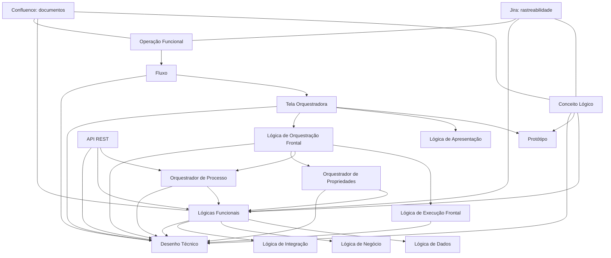
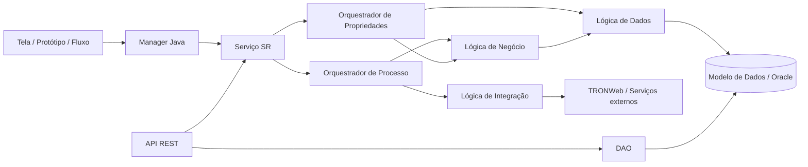

# REEF.Core / NEWTron — Documentação Funcional e Técnica, Elementos, Rastreabilidade e Desenho Técnico

## 1. Metadados do Documento
- **Arquivo de Origem:** Não identificado no conteúdo bruto; extração estruturada de apresentação com 79 slides.
- **Tipo de Documento:** Apresentação Executiva e Manual de Documentação Funcional e Técnica.
- **Domínio / Sistema:** REEF.Core, NEWTron, TRON, TRONWeb, Jira, Confluence, Polarion, Objerator.
- **Público-Alvo:** Analistas funcionais, desenvolvedores, arquitetos, equipes de operação, responsáveis por documentação e equipes que mantêm requisitos evolutivos.
- **Data/Versão Identificada:** Não identificada.

---

## 2. Resumo Executivo & Contexto de Negócio

O documento define as normas de documentação funcional e técnica do ecossistema NEWTron/REEF.Core. O objetivo é organizar o conhecimento por **Conceito Lógico**, reduzindo a fragmentação documental e permitindo que cada conceito possua um catálogo rastreável de funcionalidades, ações, lógicas, telas, protótipos, fluxos, APIs e respectivos desenhos técnicos.

A proposta reduz níveis de documentação considerados sem valor funcional direto, incluindo requisitos não funcionais que possam ser determinados durante a construção por meio das normas de programação NEWTron. A documentação passa a ser menos técnica para o público funcional, mais esquemática e centrada em diagramas de fluxo, tabelas de ações, propriedades e relacionamentos entre elementos.

A documentação é mantida principalmente em Jira e Confluence, sob o projeto **“TRON Documentación Funcional y Técnica”**. O conteúdo histórico migrado do Polarion permanece acessível no projeto **“TRON Polarion Documentacion Funcional y Tecnica (Origen Polarion)”**, mas é bloqueado para alterações funcionais. Ainda assim, os itens migrados continuam utilizáveis para criação e remoção de rastreabilidades.

A rastreabilidade é um requisito central: documentos funcionais devem ser ligados, em Jira, por relações como `Traced From` e `Traced To`, e em Confluence por hyperlinks e listas de documentos relacionados. Essa abordagem permite avaliar o impacto de ajustes funcionais, identificar dependências entre artefatos e preservar a ligação entre requisitos funcionais, implementações técnicas, objetos, serviços, tabelas e componentes de interface.

O desenho técnico segue a arquitetura em camadas do NEWTron e usa nomenclatura derivada de termos definidos no Objerator e nos glossários NEWTron. O documento também descreve como fluxos, telas e protótipos são construídos em tempo de execução a partir de parametrizações em banco de dados.

---

## 3. Arquitetura, Componentes & Tecnologias Envolvidas

### Sistemas e ferramentas citados

| Componente / Tecnologia | Papel descrito |
| :--- | :--- |
| **REEF.Core** | Contexto da documentação funcional e técnica apresentada. |
| **NEWTron** | Aplicação e modelo de documentação funcional/técnica tratado pelo documento. |
| **TRON / TRONWeb** | Sistemas e funcionalidades integradas por lógicas e APIs. |
| **Jira** | Gestão de épicas, tarefas, subtarefas, tipos de item, campos e rastreabilidade. |
| **Confluence** | Repositório de documentos funcionais e técnicos, modelos e hyperlinks. |
| **Polarion** | Origem de documentação histórica migrada e bloqueada para edição funcional. |
| **Objerator** | Aplicação de desenho e manutenção de conceitos lógicos; fonte de definição e nomenclatura. |
| **Oracle / PL/SQL** | Tecnologia de construção para lógicas de dados e elementos de banco de dados. |
| **Java** | Tecnologia de nomenclatura e implementação de objetos, serviços, orquestradores, APIs e managers. |
| **REST** | Estilo de interface das APIs destinadas a serviços NEWTron, TRONWeb e aplicações externas. |
| **Swagger** | Local de publicação/documentação das APIs, incluindo entradas, saídas e erros. |
| **draw.io** | Ferramenta indicada para diagramas funcionais de processos, fluxos e telas. |
| **RAM** | Repositório citado como local onde há informação publicada da operação de API. |
| **DAO** | Classe Java que encapsula acesso direto a tabelas quando uma API não chama serviços NEWTron. |

### Elementos documentais funcionais

| Elemento | Responsabilidade funcional |
| :--- | :--- |
| Conceito Lógico | Contêiner de informação de negócio, propriedades e relações com o modelo de dados. |
| Lógica Funcional de Conceito Lógico | Lógica de dados, negócio ou integração associada a um conceito lógico. |
| Orquestrador de Processo | Coordena lógicas e orquestradores para atender uma operação funcional. |
| Orquestrador de Propriedades | Valida propriedades de um conceito lógico e, no processo online sem erros, grava dados. |
| Fluxo | Visão de alto nível da operação funcional, telas e navegação. |
| Tela Orquestradora | Representação da interface, conceitos lógicos, telas integradas, ações e botões. |
| Protótipo | Representação genérica de um conceito lógico em tela. |
| Lógica de Apresentação | Define dinamismos específicos de propriedades de um protótipo em uma operação. |
| Lógica de Orquestração Frontal | Coordena ações de tela e chamadas à lógica funcional de backend. |
| Lógica de Execução Frontal | Executa ações associadas a botões ou elementos de ação que podem envolver múltiplas etapas. |
| API | Interface REST para acesso a funcionalidades TRON, NEWTron, serviços web ou aplicações externas. |
| Desenho Técnico | Especificação técnica do software que resolve um documento funcional associado. |

### Fluxo conceitual de documentação e implementação



### Camadas técnicas identificadas



---

## 4. Regras de Negócio, Especificações Funcionais & Processos

### 4.1 Princípios de documentação

1. A documentação deve ser organizada por **Conceito Lógico**.
2. Cada conceito lógico deve permitir identificar um catálogo de ações e funcionalidades associadas.
3. A documentação deve reduzir elementos que não acrescentem valor funcional e que possam ser resolvidos por normas de programação NEWTron.
4. Lógicas de dados de um mesmo conceito lógico devem ser agrupadas por verbo funcional.
5. Lógicas e orquestradores devem informar propósito, entradas, saídas, ações e documentos ligados.
6. Diagramas funcionais devem ser usados para explicar fluxos de ações, especialmente quando houver sequência de funcionalidades.
7. O nome dos requisitos funcionais não deve conter acentos.
8. Diagramas não são pesquisáveis por texto; portanto, documentos devem conter uma seção de documentos ligados com os nomes funcionais explícitos.
9. A rastreabilidade deve ser mantida entre Jira, Confluence, funcional e técnico.
10. O nome técnico deve corresponder à tradução para a terminologia NEWTron do nome funcional.

### 4.2 Conceito Lógico

O Conceito Lógico é um contêiner lógico de informação relacionado a um conceito funcional ou de negócio, ou a parte dele. O artefato contém informações funcionais das propriedades que definem o conceito e a relação com tabelas do modelo de dados.

Cada Conceito Lógico deve conter hyperlink para a definição correspondente na aplicação Objerator. O documento deve ser rastreado com todas as funcionalidades associadas, permitindo descobrir o catálogo de ações definidas sobre o conceito.

**Modelo de nome funcional:**

```text
[Objeto] Nome_Conceito_Lógico
```

### 4.3 Lógicas Funcionais de Conceito Lógico

| Categoria | Definição | Exemplos de verbos ou ações |
| :--- | :--- | :--- |
| Lógica de Dados Funcional | Interage com o modelo de dados para recuperar, criar, modificar ou eliminar informação. | Consultar, Traspasar, Atualizar, Borrar. |
| Lógica de Negócio Funcional | Executa verificações, cálculos, validações ou devolve informação calculada/validada que não é um conceito lógico. | Hallar, Verificar, Existir, Comprobar. |
| Lógica de Integração | Executa lógicas TRONWeb ou operações sobre bases de dados requeridas desde NEWTron. | Personalizar. |
| Lógica de Negócio de Regras | Executa cálculos, validações e comprovações funcionais. | Validar, Hallar, Comprobar. |

Para lógicas de dados, o documento deve agrupar as variações de um verbo por conceito lógico. Por exemplo, um documento `CONSULTAR + Conceito Lógico + Índice` reúne diferentes condições de consulta sobre o mesmo conceito lógico.

Os verbos `TRASPASAR`, `ACTUALIZAR` e `BORRAR` devem ser documentados com condições equivalentes, mas classificados como **Lógicas No Funcionales de Concepto Lógico**.

### 4.4 Orquestrador de Processo

O Orquestrador de Processo atende total ou parcialmente uma operação funcional e coordena outros orquestradores, lógicas de negócio e lógicas de dados.

| Nível | Responsabilidade |
| :--- | :--- |
| Conceito Lógico | Invoca orquestradores de processo do conceito lógico e/ou lógicas exclusivas de negócio e dados. |
| Processo | Invoca orquestradores dos diversos conceitos lógicos envolvidos no processo. |

O Orquestrador de Processo deve explicitar:
- Toda informação de entrada necessária.
- A informação de saída, que deve ser um único elemento: conceito lógico de processo, propriedade ou objeto de processo.
- A ação ou as ações funcionais necessárias para resolver o processo.
- O gráfico funcional em draw.io.
- A lista de documentos ligados correspondentes às funcionalidades chamadas.

**Nomenclatura funcional:**

```text
VERBO + Família/Conceito Lógico + [Informação adicional]
```

Existem menções especiais a:
- **Orquestradores prévios:** preparam a informação inicial de conceitos lógicos para a tela.
- **Orquestradores de propriedades:** validam e gravam dados de conceitos lógicos.

### 4.5 Orquestrador de Propriedades

O Orquestrador de Propriedades valida informação funcional total ou parcial de um conceito lógico em uma operação funcional. No processamento online, quando não há erros, grava a informação no modelo de dados; no processamento batch, valida apenas a informação do conceito lógico.

Regras obrigatórias:
1. Deve receber todos os parâmetros necessários.
2. Deve retornar o conceito lógico com o qual opera.
3. Deve identificar ações necessárias para preparar a validação das propriedades.
4. Deve conter uma tabela de propriedades aplicáveis ao criar ou modificar o conceito lógico.
5. Cada propriedade deve ser associada às ações necessárias para sua validação.
6. Se a validação de uma propriedade produzir erro, o erro deve ser acumulado no conceito lógico ou objeto.
7. A validação deve continuar para as demais propriedades após cada erro.
8. Ao concluir, o processo retorna o conceito lógico com todos os erros acumulados.
9. No processo online, sem erro, a informação é gravada em tabela de trabalho.
10. Quando há erro, todos os erros produzidos são mostrados em tela.
11. Os valores das propriedades do conceito lógico devem ser levados a “globais”, conforme nota do documento.

### 4.6 Fluxo de Operação Funcional

O Fluxo identifica o início da documentação de uma operação funcional. Ele representa:
- A descrição funcional de alto nível.
- O diagrama funcional de alto nível.
- O conjunto de telas da funcionalidade.
- As possíveis navegações entre telas.
- Os documentos/telas ligados.

**Modelo de nome:**

```text
[Flujo] VERBO + Família/Conceito Lógico + [texto aclaratorio]
```

O diagrama de fluxo em draw.io deve conter hyperlinks Confluence para os documentos de telas incluídos.

### 4.7 Tela Orquestradora

A Tela Orquestradora representa graficamente uma tela associada a uma operação funcional. Pode conter:
- Outras telas funcionais integradas.
- Conceitos lógicos exibidos.
- Protótipos e formatos de apresentação.
- Elementos de ação, botões e navegação.
- Ações sobre conceitos lógicos.
- Ações próprias da tela.
- Chamadas a lógicas de frontend e backend.

Formatos de apresentação citados:
- Colapsador.
- Colapsador lateral.
- Pestaña.
- Agrupador.
- Conjunto.
- Formulário.
- Filtro.

Ações padrão citadas:

| Ação | Nome em inglês | Função |
| :--- | :--- | :--- |
| Anterior | Back | Retornar à tela anterior do fluxo. |
| Buscar | Search | Executar busca associada ao conceito lógico. |
| Finalizar | Finish | Finalizar o fluxo. |
| Invalidar | Cancel | Cancelar a execução do fluxo. |
| Siguiente | Advance | Avançar para a próxima tela. |
| Salir | Leave | Abandonar o fluxo. |
| Verificar / Validar | Verify | Executar validação de dados, normalmente pelo botão Aceitar. |

### 4.8 Protótipo de Conceito Lógico

O Protótipo é a representação gráfica geral de um conceito lógico. Há três formatos genéricos:

| Formato | Uso |
| :--- | :--- |
| Formulário / Agrupador | Mostra propriedades do objeto visualizáveis pelo usuário; é o formato padrão de detalhe. |
| Conjunto / Lista | Mostra propriedades visualizáveis em listas e cenários multirregistro. |
| Filtro / Busca | Painel de busca que pode usar propriedades do conceito ou propriedades externas, como faixas de datas ou valores. |

A tabela de propriedades do protótipo pode definir, entre outros:
- Propriedade/elemento.
- Tipo: numérico, moeda, alfanumérico, data, booleano ou clob.
- Comprimento máximo.
- Visibilidade.
- Possibilidade de alteração.
- Obrigatoriedade.

Dinamismos comuns:
- `OnFocus`
- `OnBlur`
- `OnChange`
- `OnClick`
- `OnLoad`

### 4.9 Lógica de Apresentação Frontal

A Lógica de Apresentação define dinamismos ou comportamentos específicos sobre elementos do protótipo para uma operação funcional concreta. É associada ao protótipo do conceito lógico e só deve ser usada quando o comportamento for diferente da definição geral do protótipo.

**Modelo de nome:**

```text
PRESENTAR + [VERBO] + Conceito Lógico + [informação adicional]
```

O documento informa que, atualmente, esta documentação é levada para o elemento **Tela**, que funciona como tela orquestradora.

A lógica de apresentação possui rastreabilidade:
- `TRACED FROM` para conceito lógico, serviços backend executados e desenho técnico correspondente.
- `TRACED TO` para a tela que a contém.

### 4.10 Lógica de Orquestração Frontal

A Lógica de Orquestração Frontal resolve ações realizadas sobre protótipos ou elementos de ação da tela e coordena chamadas para a lógica funcional backend.

Pode:
- Invocar requisitos prévios para obter o conceito lógico a tratar.
- Chamar requisitos de dados quando dinamismos dependerem de validações ou cálculos entre propriedades.
- Coordenar ações vinculadas a botões.
- Delegar para uma Lógica de Execução quando uma ação exige múltiplas ações.

A documentação também foi marcada como trasladada para o elemento **Tela**.

**Modelo de nome em nível de conceito lógico:**

```text
ORQUESTAR + Verbo + Conceito Lógico + [informação adicional]
```

**Modelo de nome em nível de família/tela:**

```text
ORQUESTAR + Verbo + Família + [informação adicional]
```

### 4.11 Lógica de Execução Frontal

A Lógica de Execução Frontal resolve ações ou interações associadas a botões e elementos de ação, envolvendo orquestradores de processo, orquestradores de propriedades e outras lógicas backend.

Ações descritas:
- Validar conceito lógico ou objeto: normalmente botão Aceitar.
- Restaurar conceito lógico ou objeto para o estado de inicialização: normalmente botão Cancelar.
- Voltar à tela anterior: botão Anterior.
- Desfazer modificações e voltar ao fluxo/tela chamadora: botão Sair.
- Validar e avançar ao próximo passo: botão Siguiente.
- Finalizar a operação em curso: botão Finalizar.

Quando a ação envolve fluxo funcional, deve ser documentada em diagrama funcional.

**Modelo de nome:**

```text
EJECUTAR + Verbo + Família/Conceito Lógico + [informação adicional]
```

### 4.12 APIs

A API é uma interface REST para acesso a:
- Serviços web.
- Aplicações externas.
- Serviços NEWTron.
- Funcionalidades TRON.

O documento de API deve especificar:
- Propósito.
- Se executa funcionalidades TRONWeb e/ou NEWTron.
- Informação de entrada.
- Informação de saída.
- Fluxo funcional da API.
- Interações com serviços backend.
- Documentos relacionados.
- Versão e URL quando aplicável.
- Nome em espanhol e inglês.

Verbos de API citados:

| Ação funcional | Verbos citados |
| :--- | :--- |
| Criar | Create, Generate, Issue, Save |
| Consultar | Get, Query |
| Hallar | Calculate |
| Executar | Execute |
| Tratar | Process |
| Modificar | Alter, Autorize, Modify |

Classificações mencionadas:
- **TRON:** classe Java resolve diretamente a consulta.
- **NEWTron:** classe Java acessa um serviço NEWTron; requer NEWTron instalado.
- **TRONWeb:** classe Java acessa um serviço TRONWeb; requer TRONWeb instalado.

### 4.13 Processo para novos requisitos evolutivos

#### Nova funcionalidade

1. Criar novo documento funcional segundo as normas.
2. Relacionar a funcionalidade com as que ela contém usando `Trazed From` em Jira.
3. Criar hyperlinks em Confluence usando a URL do nome do documento.
4. Se o documento chamado não estiver em Jira, registrar em Confluence o identificador conhecido do Polarion, tanto na tabela de ações quanto em elementos ligados.
5. Se o documento estiver no projeto novo, criar rastreabilidade Jira, hyperlink Confluence e registrar identificador Jira + nome em elementos ligados.
6. Se o documento estiver no projeto migrado, criar rastreabilidade Jira, hyperlink para o documento migrado e registrar nome + identificador Jira atribuído.

#### Modificação de funcionalidade migrada do Polarion

1. Criar novo documento que reflita a funcionalidade modificada.
2. Criar `Trazed From` para funcionalidades chamadas.
3. Adicionar hyperlinks Confluence correspondentes.
4. Criar `Trazed To` a partir das funcionalidades que chamavam o documento antigo.
5. Para o documento migrado que se tornou obsoleto:
   - Remover as rastreabilidades dos elementos que o chamam.
   - Alterar o estado Jira para `Dismissed`, usado como equivalente a depreciado.
   - Arquivar o documento em Confluence.

---

## 5. Tabelas de Parâmetros, Ambientes e Estruturas de Dados

### 5.1 Projetos documentais

| Item / Parâmetro | Descrição / Função | Tipo / Valores / Formato | Ambiente / Observações |
| :--- | :--- | :--- | :--- |
| TRON Documentación Funcional y Técnica | Projeto ativo para documentação atual de NEWTron. | Jira + Confluence | Permite rastreabilidade. |
| TRON Polarion Documentacion Funcional y Tecnica (Origen Polarion) | Projeto de migração com conteúdo proveniente do Polarion. | Jira + Confluence | Conteúdo funcional bloqueado; rastreabilidade permitida. |
| Épica | Representa família no modelo documental. | Campo Jira | Projeto migrado usa Épica como Família. |
| Conceito Lógico | Campo que identifica o conceito lógico associado. | Campo Jira | Presente nos projetos novo e migrado. |
| Source | Identificador Polarion migrado. | Campo Jira | Aplicável ao projeto de migração. |
| Parent | Indica família no projeto novo. | Campo Jira | Aplicável ao projeto TRON Documentación. |

### 5.2 Tipos de elementos em Jira e Confluence

| Elemento | Jira | Confluence |
| :--- | :---: | :---: |
| Orquestrador de Processo | Sim | Sim |
| Conceito Lógico | Sim | Sim |
| API | Sim | Sim |
| Lógica de Orquestração | Sim | Sim |
| Lógicas de Conceito Lógico | Sim | Sim |
| Protótipo | Sim | Sim |
| Lógica de Apresentação | Sim | Sim |
| Orquestrador de Propriedades | Sim | Sim |
| Fluxo | Sim | Sim |
| Tela | Sim | Sim |
| Lógicas específicas de conceito lógico | Sim | Sim |
| Lógica de Execução | Sim | Sim |
| Épica / Família | Sim | Não indicado como documento |
| Tarefa / Issue | Sim | Não indicado como documento |
| Subtarefa / Subissue | Sim | Não indicado como documento |

### 5.3 Estrutura de parâmetros para desenho técnico

| Campo | Descrição / Função | Tipo / Valores / Formato | Ambiente / Observações |
| :--- | :--- | :--- | :--- |
| Nome NEWTron do parâmetro | Nome técnico da propriedade. | Conforme propriedade NEWTron | Deve constar na tabela de parâmetros. |
| Tipo | Tipo de dado do parâmetro. | Não detalhado por tipo no documento | Deve ser informado. |
| Nome do parâmetro | Identificador do parâmetro técnico. | Conforme implementação | Deve ser informado. |
| Tipo de elemento obtido | Tipo associado ao retorno. | Conforme implementação | Deve ser informado. |
| Retorno | Valor ou estrutura retornada. | Conforme método/função | Deve ter descrição funcional. |
| Método Java GET/POST | Método de endpoint ou chamada Java. | Máximo de 3 parâmetros | Acima de 3 parâmetros, utilizar DTO. |

### 5.4 Tabelas de parametrização de fluxo e tela

| Tabela | Descrição / Função | Tipo / Valores / Formato | Ambiente / Observações |
| :--- | :--- | :--- | :--- |
| `DF_TRN_NWT_XX_FLW_SCR` | Definição de fluxos. | Contém `flw_idn` | Banco de dados / parametrização de fluxo. |
| `DF_TRN_NWT_XX_FLW_STE` | Definição de passos/telas dentro de um fluxo. | Contém `ste_idn` | Banco de dados. |
| `DF_TRN_NWT_XX_FLW_TSN` | Definição de transições entre telas dentro de um fluxo. | Relacionada a `ste_idn` | Banco de dados. |
| `DF_TRN_NWT_XX_FLW_ELM_CPO` | Definição de elementos agrupados em objeto de tela. | Inclui formato de protótipo; `obj_idn_prn_val` | Inclui side-capa e tabs/pestañas. |
| `DF_TRN_NWT_XX_FLW_ACN_CPO` | Definição de ações de componente técnico em tela. | Inclui `acn_idn_run` e `cpo_idn` | Banco de dados. |
| `DF_TRN_NWT_XX_FLW_ACN_DEP` | Dependências de ações de componente técnico em tela. | Não detalhado | Banco de dados. |
| `DF_TRN_NWT_XX_FLW_CFG_DSH` | Configuração do dispatcher. | Relação objeto/protótipo → ação → manager | Banco de dados. |
| `DF_TRN_NWT_XX_FLW_ELM_DEP` | Definição de elementos de agrupador. | Tela → formato de protótipo → componente | Banco de dados. |
| `DF_TRN_NWT_XX_FLW_ELM_SCR` | Definição de elementos de uma tela. | Tela, objeto/protótipo, ordem, JSON e comportamento especial | Banco de dados. |

### 5.5 Nomenclaturas técnicas e funcionais

| Elemento | Padrão citado | Observações |
| :--- | :--- | :--- |
| Conceito Lógico / Objeto | `O<Fml><Lgc>P` | Documento único para todas as formas do objeto. |
| Lógica de Dados | `IDl+Fml+Clg (índice)` | Agrupa funções/procedimentos por verbo. |
| Lógica de Dados técnica | `dl_fml_clg_ins.f_vrb_nnn` | Verbo reside na função, não no pacote/classe. |
| Lógica de Tabela | `dl+tabla (índice)` | Agrupa funções/procedimentos de tabela por verbo. |
| Lógica de Negócio | `Bl + Fml + Clg + Vrb/FunOpr + [instalación] .Adt/Ifm` | Formato Java. |
| Lógica de Integração | `Il + Fml + Clg + Vrb/FunOpr + .Adt/Ifm` | Formato Java. |
| Orquestrador de Processo | `Op/Pr + Fml + Fml/Clg + Vrb/FunOpr + [instalación] .<Adt><Ifm>` | Pode requerer serviço SR se chamado pelo frontend. |
| Orquestrador de Propriedades | `Op + Fml + Clg + Vrb/FunOpr + [instalación] .sav[<Adt><Ifm>]` | Pode exigir elementos OP, BL e DL. |
| Fluxo | `<fml><fml\Lgc><Prc> (Flw)` | Construído em runtime por parametrização em banco. |
| Tela | `<fml><fml\Lgc><Prc>[<Adt><Txt>]V` | `V` representa vista/tela. |
| Protótipo | `<fml><Lgc>[<Adt><Ifm>] <Frm> (Ptp)` | `Frl`, `Lst` e `Srh` são formatos citados. |
| Manager de orquestração | `<fml><fml\Lgc><Prc>Mnr.java` | Método no padrão `<evento>Och[<Adt><Ifm>]`. |
| Manager de execução | `<fml><fml\Lgc><Prc>Mnr.java` | Método no padrão `<evento>Run[<Adt><Ifm>]`. |
| API | `ISr<fml><fml\Lgc><Prc>[<Adt><Ifm>].nombreTecnicoFuncionalidad` | Pode também usar somente nome técnico funcional e URL. |

### 5.6 Verbos e abreviações de processo

| Verbo / ação | Abreviação citada |
| :--- | :--- |
| Aperturar Sini | `ope` |
| Alterar Poliza | `alt_ply` |
| Crear | `crt` |
| Emitir Poliza | `isu_ply` |
| Modificar | `mdf...` |
| Terminar | `fnz` |
| Tratar | `pss` |
| Hallar | `cue` |
| Validar | `vld` |
| Bloquear | `lck` |
| Comprobar | `cck` |
| Existir | `exs` |
| Personalizar | `psz` |
| Consultar | `get` |
| Actualizar | `upd` |
| Traspasar | `set/inr/upd` |
| Borrar | `dlt` |
| Apilar | `add` |

---

## 6. Bateria de Perguntas & Respostas para RAG (FAQ Sintético)

### P1: Qual é o objetivo da reorganização da documentação NEWTron?
**R:** A reorganização busca estruturar a documentação por Conceito Lógico, permitindo que cada conceito tenha um catálogo identificável de funcionalidades e ações. O modelo também reduz elementos documentais sem valor funcional direto, simplifica a leitura para públicos não técnicos e preserva rastreabilidade para análise de impacto de mudanças.

### P2: O que é um Conceito Lógico na documentação REEF.Core/NEWTron?
**R:** Um Conceito Lógico é um contêiner de informação associado a um conceito funcional ou de negócio, ou a parte dele. O documento do conceito deve registrar propriedades funcionais, relações com o modelo de dados e um hyperlink para sua definição no Objerator. O conceito também deve ser rastreado com todas as funcionalidades que atuam sobre ele.

### P3: Como devem ser documentadas as lógicas de dados funcionais?
**R:** As lógicas de dados devem ser agrupadas por verbo e por conceito lógico. Um documento como `CONSULTAR + Conceito Lógico + Índice` reúne diferentes condições de consulta do mesmo conceito. Cada condição deve informar propósito, parâmetros de entrada e informação obtida. Os verbos `TRASPASAR`, `ACTUALIZAR` e `BORRAR` seguem estrutura semelhante, porém são classificados como lógicas não funcionais de conceito lógico.

### P4: Como um Orquestrador de Propriedades trata erros de validação?
**R:** Se uma validação de propriedade produzir erro, o erro deve ser acumulado no conceito lógico ou objeto e a validação deve continuar para as propriedades seguintes. Ao término, o orquestrador devolve o conceito lógico com todos os erros produzidos. No processo online, apenas quando não há erro, a informação é gravada em tabela de trabalho; quando há erro, todos os erros são exibidos em tela.

### P5: Qual é a diferença entre Orquestrador de Processo e Orquestrador de Propriedades?
**R:** O Orquestrador de Processo atende uma operação funcional total ou parcialmente e coordena orquestradores e lógicas de diversos conceitos lógicos. O Orquestrador de Propriedades trata propriedades de um conceito lógico dentro de uma operação, preparando validações, validando os dados e, no cenário online sem erros, gravando-os no modelo de dados.

### P6: Quais são os três formatos genéricos de Protótipo de Conceito Lógico?
**R:** Os formatos são: Formulário/Agrupador, usado para detalhes e propriedades visualizáveis; Conjunto/Lista, usado para múltiplos registros e listagens; e Filtro/Busca, usado como painel de critérios de pesquisa, que pode incluir propriedades externas ao conceito lógico, como faixas de data ou valores.

### P7: Quando deve ser criada uma Lógica de Execução Frontal?
**R:** A Lógica de Execução Frontal é usada para ações associadas a botões ou elementos de ação que envolvem interações com lógica de negócio, orquestradores ou múltiplas ações. Exemplos citados incluem validar dados pelo botão Aceitar, restaurar o estado inicial pelo botão Cancelar, avançar após validação pelo botão Siguiente e concluir uma operação pelo botão Finalizar.

### P8: Como uma API NEWTron deve ser documentada?
**R:** Uma API deve documentar propósito, informação de entrada, informação de saída, fluxo funcional, interações com serviços backend e documentos relacionados. O nome deve estar em espanhol e inglês e pode incluir verbo, família ou conceito lógico, texto aclaratório, versão e URL. A documentação técnica deve conter hyperlink para Swagger, onde ficam parâmetros, retornos e possíveis erros.

### P9: O que fazer quando uma API acessa diretamente uma tabela sem chamar um serviço NEWTron?
**R:** O documento técnico deve especificar a consulta `SELECT` ou o acesso a dados associado à ação. O texto informa que esse acesso é encapsulado em uma classe Java DAO. O desenho técnico também deve ser rastreado com a tabela tratada quando aplicável.

### P10: Como são construídos fluxos e telas no NEWTron?
**R:** Fluxos e telas são construídos em tempo de execução por leitura de parametrização em banco de dados. Para fluxos, o documento cita tabelas como `DF_TRN_NWT_XX_FLW_SCR`, `DF_TRN_NWT_XX_FLW_STE` e `DF_TRN_NWT_XX_FLW_TSN`. Para telas e componentes, cita tabelas de elementos, ações, dependências e configuração de dispatcher.

### P11: Como criar uma nova funcionalidade quando há dependências de documentos migrados do Polarion?
**R:** Deve-se criar o novo documento funcional no projeto atual, estabelecer `Trazed From` em Jira e links em Confluence. Se a funcionalidade chamada estiver apenas no conteúdo legado e não existir em Jira, deve-se registrar em Confluence o identificador Polarion conhecido nas tabelas de ações e em elementos ligados. Se houver item Jira migrado, deve-se criar rastreabilidade e hyperlink para o documento migrado, registrando nome e identificador Jira.

### P12: Como substituir uma funcionalidade migrada que se tornou obsoleta?
**R:** Deve-se criar um novo documento para a funcionalidade modificada, rastreá-lo com suas dependências e criar `Trazed To` a partir dos documentos que chamavam a versão antiga. No item migrado obsoleto, devem ser removidas rastreabilidades de chamadores, o item Jira deve receber o estado `Dismissed` e o documento Confluence deve ser arquivado.

---

## 7. Glossário de Termos, Siglas & Conceitos-Chave

- **API:** Interface REST para acesso a serviços NEWTron, TRONWeb, serviços web, aplicações externas ou funcionalidades TRON.
- **BL:** Lógica de Negócio no modelo de nomenclatura técnica.
- **BBDD:** Base de dados.
- **Conceito Lógico:** Contêiner funcional de negócio com propriedades e relações com o modelo de dados.
- **DAO:** Classe Java que encapsula acesso direto a tabelas por uma API.
- **DL:** Lógica de Dados.
- **DTO:** Objeto de Transferência de Dados; deve ser usado quando método Java GET/POST possui mais de três parâmetros.
- **Flujo / Fluxo:** Documento que representa a operação funcional, suas telas e navegação.
- **IL:** Lógica de Integração.
- **Jira:** Ferramenta de gestão de itens, rastreabilidade, épicas, tarefas e subtarefas.
- **Lógica de Apresentação:** Lógica frontal de dinamismos específicos de um protótipo em determinada tela/operação.
- **Lógica de Execução:** Lógica frontal associada a ações ou botões que podem chamar funcionalidades backend.
- **Lógica de Orquestração:** Lógica frontal que coordena ações de interface e chamadas a serviços/lógicas backend.
- **Manager / Mnr:** Classe Java associada à lógica frontal de orquestração ou execução.
- **NEWTron:** Sistema e modelo de documentação, arquitetura e nomenclatura tratado na apresentação.
- **Objerator:** Aplicação de desenho e manutenção de conceitos lógicos.
- **OP / Op:** Orquestrador de Processo ou nomenclatura de orquestrador, conforme contexto.
- **Orquestrador de Processo:** Software que coordena lógicas e orquestradores para executar uma operação funcional.
- **Orquestrador de Propriedades:** Orquestrador que valida propriedades e, no online sem erros, persiste informação.
- **Polarion:** Origem de documentação histórica migrada para Jira/Confluence.
- **Protótipo / Ptp:** Representação gráfica de um conceito lógico em formulário, lista ou filtro.
- **REST:** Estilo de serviço utilizado pelas APIs descritas.
- **SR / ISr:** Serviço/intérprete técnico requerido quando uma funcionalidade é chamada pelo frontend em determinados casos.
- **Swagger:** Documentação publicada de API com entradas, saídas e erros.
- **TRACED FROM:** Relação de rastreabilidade usada para apontar dependências ou funcionalidades chamadas.
- **TRACED TO:** Relação de rastreabilidade usada para apontar artefatos que contêm ou consomem o elemento.
- **TRONWeb:** Plataforma/serviço que pode ser chamado por lógicas de integração ou APIs.
- **UI-LOGIC:** Tipo de issue Jira indicado para lógicas de apresentação, orquestração e execução frontal.

---

## 8. Notas Críticas, Riscos & Limitações

- **Documentação migrada bloqueada:** O conteúdo do projeto “TRON Polarion Documentacion Funcional y Tecnica (Origen Polarion)” não pode ser modificado funcionalmente. Alterações exigem a criação de novos documentos no projeto atual.
- **Risco de perda de rastreabilidade:** A substituição de funcionalidades migradas requer remoção de rastreabilidades antigas, criação de `Trazed To` para a nova funcionalidade, mudança para `Dismissed` e arquivamento do documento Confluence antigo.
- **Diagramas não suportam busca textual:** Diagramas em draw.io não são recuperáveis por busca textual; por isso, a seção de documentos ligados é obrigatória para registrar explicitamente títulos funcionais e permitir recuperação.
- **Lógicas de apresentação e orquestração trasladadas para Tela:** O documento afirma que parte da documentação de lógica de apresentação e lógica de orquestração foi transferida para o elemento Tela. Essa mudança exige atenção para evitar documentação duplicada ou localização incorreta de regras.
- **Restrição de parâmetros Java:** Métodos Java GET/POST devem receber no máximo três parâmetros; mais parâmetros exigem DTO.
- **Restrição de nomes PL/SQL:** O documento alerta que packages PL/SQL possuem limite de 30 caracteres. Um nome como `op_fml_clg_fun_opc_xxx_btc_trn` não é permitido, enquanto `op_fml_clg_fun_opc_btc_trn` é apresentado como referência compatível.
- **Detalhamento incompleto de contratos:** O documento explica a estrutura de documentação de APIs, mas não fornece contratos HTTP completos, esquemas JSON, códigos HTTP, mecanismos de autenticação ou especificações de headers.
- **Nota de Análise:** O conteúdo cita elementos técnicos, classes, packages, tabelas e nomenclaturas, mas não detalha versões de Java, Oracle, Jira, Confluence, Swagger ou Objerator.
- **Nota de Análise:** URLs internas e externas são apresentadas como exemplos documentais. O documento não declara requisitos de rede, credenciais, permissões ou disponibilidade desses ambientes.
- **Nota de Análise:** Há menções a termos como `oFmlLgc`, `IPrFmlFmlFunOpr.ppp`, `ITSFmlXxxFunPrc.ppp` e outros padrões técnicos sem uma definição formal completa de todos os seus segmentos.

---

## 9. Conteúdo Bruto Estruturado (Referência Fiel)

```text
Documento de origem: apresentação “Core - Documentación Funcional y Técnica”.
Quantidade identificada na extração: 79 slides.
Idioma predominante: espanhol, com nomenclatura técnica NEWTron, Java, PL/SQL e termos em inglês.

[Slides 1, 4, 46, 74]
Título recorrente:
.Core
Documentación Funcional y Técnica

Seções de agenda:
- Introducción
- Elementos Documentación
- Relación entre elementos
- Diseño Técnico
- Operativa de Requisitos en Evolutivos
- Herramientas

[Slide 2 — Introducción > Objetivos y Expectativas]
O documento apresenta normas de documentação atual de NEWTron.
Objetivos:
- Organizar documentação orientada ao Conceito Lógico.
- Possuir catálogo de funcionalidades por conceito lógico.
- Favorecer reutilização.
- Reduzir elementos e níveis de documentação.
- Eliminar requisitos não funcionais sem valor documental e resolvíveis por normas NEWTron.
- Agrupar, em único documento funcional, toda lógica associada a uma ação sobre um conceito lógico.
- Aplicar agrupamento equivalente aos documentos de desenho técnico.
- Simplificar documentação com diagramas funcionais e tabelas de ações.
- Reduzir uso de elementos técnicos na documentação funcional.
- Incluir novo elemento de definição funcional de Conceito Lógico integrado ao Objerator.
- Manter rastreabilidade para análise de impacto.
Expectativas:
- Agilidade na geração de documentação.
- Redução da curva de aprendizagem.
- Documentação mais compreensível para usuários sem conhecimento técnico.

[Slide 3 — Espaços de documentação]
Espaço 1: Projeto Jira-Confluence “TRON Documentacion Funcinal y Tecnica”.
Espaço 2: Projeto Jira-Confluence “TRON Polarion Documentacion Funcional y Tecnia [Origen Polarion]”.

[Slides 5 a 7 — Elementos de documentação]
Elementos identificados:
- Conceito Lógico.
- Lógicas de Conceito Lógico.
- Lógicas No Funcionales de Concepto Lógico.
- Orquestrador de Processo.
- Orquestrador de Propriedades.
- API.
- Fluxo.
- Tela.
- Protótipo.
- Lógica de Apresentação Frontal.
- Lógica de Orquestração Frontal.
- Lógica de Execução Frontal.
- Documento de Implementação / Desenho Técnico.

Jira contém:
- Épica.
- Tarefa/Issue.
- Subtarefa/Subissue.
- Família/Épica.
- API.
- Fluxo.
- Lógicas de conceito lógico.
- Tela.
- Protótipo.
- Lógica de apresentação.
- Lógica de orquestração.
- Lógicas específicas de conceito lógico.
- Orquestrador de propriedades.
- Orquestrador de processo.
- Conceito lógico.
- Lógica de execução.

Confluence contém documentos de:
- Orquestrador de processo.
- Conceito lógico.
- API.
- Lógica de orquestração.
- Lógicas de conceito lógico.
- Protótipo.
- Lógica de apresentação.
- Orquestrador de propriedades.
- Fluxo.
- Tela.
- Lógicas específicas de conceito lógico.
- Lógica de execução.

[Slides 8 e 9 — Conceito Lógico]
Definição:
“Contenedor lógico de información, que atiende a un concepto funcional/de negocio o parte de él.”

Conteúdo:
- Informação funcional de propriedades.
- Relação com modelo de dados e tabelas relacionadas.
- Hyperlink para definição no Objerator.
- Rastreabilidade com funcionalidades associadas.
- Catálogo de ações sobre o conceito.

Modelo:
Nome Documento: `[Objeto] Nombre_Concepto_Lógico`.

URL de exemplo Objerator:
http://vles044273-011.es.mapfre.net:8080/ObjeratorServer/ObjeratorServlet?jq=y&ins=trn&fml=ply&obj=Gni&prj=NWT&ds_obr=OBR_PRD&cny=ES&lng=es

Exemplos:
- Objeto Información General.
- Objeto Persona.
- Busca Confluence/Jira por verbo e conceito lógico.

[Slides 10 a 14 — Lógicas de Conceito Lógico]
Categorias:
- Lógicas de Dados funcionais: recuperar, criar, modificar ou eliminar informação.
- Lógicas de Negócio funcionais: Hallar, Verificar, Existir, Comprobar.
- Lógicas de Integração: executar lógicas TRONWeb ou de base de dados desde NEWTron.
- Lógicas de Negócio: cálculos, validações e comprovações que retornam informação calculada ou validada não representada como Conceito Lógico.

Modelo de lógica de negócio:
- Nome: `VERBO + Concepto Lógico + información adicional`.
- Propósito.
- Informação de entrada.
- Ações.

Lógicas de dados:
- Documento agrupador por verbo.
- `Consultar` agrupa condições distintas de consulta.
- `Traspasar` agrupa procedimentos de transferência.
- `TRASPASAR`, `ACTUALIZAR` e `BORRAR` são documentados como lógicas não funcionais.
- Modelo: `VERBO + Concepto Lógico (Índice)`.
- Cada funcionalidade possui propósito, parâmetro de entrada e saída.
- O elemento é rastreado apenas com Conceito Lógico e Desenho Técnico.
- Subtarefa Jira identifica uma funcionalidade descrita no documento agrupador Confluence.

[Slides 15 a 21 — Orquestradores]
Orquestrador de Processo:
- Software que atende processo ou operação funcional.
- Em nível de conceito lógico: chama orquestradores/lógicas exclusivas do conceito.
- Em nível de processo: chama orquestradores dos conceitos lógicos participantes.
- Deve descrever entradas, saída única e ações funcionais.
- Possui orquestradores prévios e orquestradores de propriedades.

Modelo:
`VERBO + Familia/Concepto Lógico + [Información adicional]`.

Orquestrador de Propriedades:
- Valida informação funcional de conceito lógico.
- No online, sem erros, grava em tabela de trabalho.
- No batch, somente valida.
- Acumula erros e continua validações.
- Retorna o conceito lógico com erros.
- Deve possuir tabela de ações e tabela de propriedades.
- As propriedades devem ser associadas a ações de validação.

[Slides 22 a 29 — Estrutura documental do frontend]
Fluxo:
- Representa informação funcional de alto nível de operação.
- Representa telas da funcionalidade e navegações.
- Contém descrição funcional, diagrama funcional e fluxo principal de telas.
- O diagrama draw.io deve conter links Confluence.

Tela Orquestradora:
- Representação gráfica de tela associada à operação.
- Pode conter telas funcionais integradas.
- Inclui conceitos lógicos, ações, botões e navegação.
- Informa formato de apresentação.
- Determina ações sobre conceitos usando catálogo.
- Possui rastreabilidade para protótipos, lógicas frontend, orquestradores e lógicas backend.
- Possui rastreabilidade para o Fluxo.

Formatos:
- Colapsador.
- Colapsador lateral.
- Pestaña.
- Agrupador.
- Conjunto.
- Formulário.
- Filtro.

Ações:
- Anterior / Back.
- Buscar / Search.
- Finalizar / Finish.
- Invalidar / Cancel.
- Siguiente / Advance.
- Salir / Leave.
- Verificar/Validar / Verify.

[Slides 30 a 35 — Protótipo e Lógica de Apresentação]
Protótipo:
- Representação gráfica geral de Conceito Lógico.
- Formatos: Formulário/Agrupador, Conjunto/Lista, Filtro/Busca.
- Tabela de propriedades define tipo, comprimento, visibilidade, modificabilidade e obrigatoriedade.
- Catálogo de dinamismos: OnFocus, OnBlur, OnChange, OnClick, OnLoad.

Lógica de Apresentação:
- Resolve dinamismos específicos de protótipo por tela/operação.
- Modelo: `PRESENTAR + [VERBO] + Concepto Lógico + [información adicional]`.
- Pode alterar comportamento de propriedade usando tabela do conceito.
- Issue Jira indicado: `UI-LOGIC`.
- Tipo/Kind indicado: `MANAGER`.
- Deve possuir rastreabilidades para conceito lógico, serviços backend, desenho técnico e tela.

[Slides 36 a 42 — Lógica de Orquestração e Execução]
Lógica de Orquestração:
- Coordena ações no protótipo ou em elementos de ação de tela.
- Chama requisitos prévios.
- Pode chamar requisitos de dados para cálculos/validações.
- Pode delegar ações múltiplas à Lógica de Execução.
- Modelos:
  - `ORQUESTAR + Verbo + Concepto Lógico + [información adicional]`.
  - `ORQUESTAR + Verbo + Familia + [información adicional]`.

Lógica de Execução:
- Resolve ações relacionadas a botões.
- Trata validação, restauração, voltar, sair, avançar e finalizar.
- Ações com fluxo funcional devem possuir diagrama.
- Modelo:
  - `EJECUTAR + Verbo + Familia/Concepto Lógico + [información adicional]`.

[Slides 43 a 45 — API]
API:
- Interface REST para serviços web, aplicações externas, NEWTron e TRON.
- Deve detalhar fluxo funcional e serviços backend chamados.
- Nome em espanhol e inglês.
- Modelo:
  `API + VERBO + Familia/Concepto Lógico + [Texto Aclaratorio] + [Version] + [url_api]`.
- Verbos: Create, Generate, Issue, Save, Query, Calculate, Execute, Process, Alter, Autorize, Modify.
- Classific