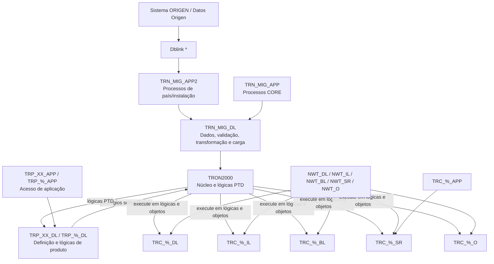

# Arquitetura de Esquemas de Migração, Produto e Personalização para TRON

## 1. Metadados do Documento
- **Arquivo de Origem:** Não identificado no conteúdo extraído
- **Tipo de Documento:** Arquitetura de Software
- **Domínio / Sistema:** TRON / NEWTron / CORE
- **Público-Alvo:** Arquitetos, desenvolvedores, administradores de banco de dados e equipes de produto
- **Data/Versão Identificada:** Não identificada

---

## 2. Resumo Executivo & Contexto de Negócio

O documento descreve uma arquitetura de esquemas de banco de dados para o sistema TRON, organizada em três domínios principais: migração (`TRN_MIG`), definição de produto (`TRP`) e personalização por país (`TRC`). Todos os domínios são projetados na mesma base de dados de TRON, porém permanecem separados dos esquemas centrais `TRON2000` e `NWT_%`.

Os esquemas de migração são destinados a migrações massivas e ao tratamento de sinistros de apólices que não estão em TRON. A camada `TRN_MIG_DL` concentra modelo de dados, validações, transformações, carga, tabelas de controle e registros de erro. As camadas de aplicação `TRN_MIG_APP` e `TRN_MIG_APP2` possuem responsabilidades de acesso distintas para processos CORE e processos específicos de país ou instalação.

Os esquemas de produto usam o acrônimo `TRP` e se estruturam entre um escopo corporativo, identificado pelo código de país `XX`, e esquemas de país identificados por códigos ISO de duas posições. Os esquemas de produto não acessam diretamente o modelo de dados de `TRON2000`; a integração ocorre exclusivamente por lógicas PTD disponibilizadas por `TRON2000`.

Os esquemas de personalização usam o acrônimo `TRC` e existem por país. Eles podem acessar lógicas e objetos disponibilizados por TRON mediante privilégios de execução, mas não recebem acesso direto ao modelo de dados de TRON. A arquitetura segmenta lógicas de dados, integração, negócio, serviço e objetos para suportar personalizações locais sem acoplamento direto ao núcleo.

O documento apresenta convenções de nomenclatura, modelos de concessão de privilégios, uso de sinônimos, referências entre esquemas e exemplos de pacotes de produto. Alguns diagramas possuem textos resumidos, rótulos gráficos e códigos sem uma explicação completa; estes pontos são preservados como apresentados, sem inferência adicional.

---

## 3. Arquitetura, Componentes & Tecnologias Envolvidas

### Componentes e esquemas identificados

| Componente / Esquema | Papel descrito |
| :--- | :--- |
| `TRON2000` | Esquema central de TRON; contém lógicas PTD; disponibiliza lógicas de núcleo para produto e personalização. |
| `NWT_%` | Conjunto de esquemas NEWTron separado de `TRON2000`; citado como parte do núcleo. |
| `TRN_MIG_DL` | Modelo de dados e lógicas de validação, transformação e carga dos processos CORE de migração. |
| `TRN_MIG_APP` | Acesso de aplicação ao banco de dados para processos CORE de migração. |
| `TRN_MIG_APP2` | Acesso de aplicação ao banco de dados para processos de país/instalação, como Malta e México. |
| `TRP_XX_DL` | Modelo de dados e lógicas corporativas de produto. |
| `TRP_XX_APP` | Acesso da aplicação corporativa de produtos. |
| `TRP_%_DL` | Esquema de produto por país, conforme código ISO de duas posições. |
| `TRP_%_APP` | Esquema de acesso de aplicação de produto por país. |
| `TRC_%_DL` | Modelo de dados e lógicas de personalização por país. |
| `TRC_%_IL` | Lógicas de integração de personalização. |
| `TRC_%_BL` | Lógicas de negócio de personalização. |
| `TRC_%_SR` | Lógicas de serviço de personalização. |
| `TRC_%_O` | Objetos e lógicas de objetos de personalização. |
| `TRC_%_APP` | Acesso de aplicação ao banco de dados de personalização. |
| `NWT_DL` | Lógicas de núcleo de descrição e escaparate. |
| `NWT_IL` | Lógicas de núcleo de integração. |
| `NWT_BL` | Lógicas de núcleo de negócio. |
| `NWT_SR` | Lógicas de núcleo de orquestrador, processo e serviço. |
| `NWT_O` | Definições de objetos. |
| `Dblink` | Elemento indicado no diagrama de migração entre ambiente TRON e sistema de origem. |



### Nota de análise

O diagrama Mermaid consolida relações explicitamente indicadas nas páginas 6, 10, 17, 18 e 19. O documento não especifica direção técnica detalhada, protocolos, métodos de conexão, contratos de interface ou regras operacionais do `Dblink`.

---

## 4. Regras de Negócio, Especificações Funcionais & Processos

### 4.1. Regras para esquemas de migração

1. A migração é utilizada em migrações massivas.
2. A migração é utilizada no tratamento de sinistros de apólices que não estão em TRON.
3. A definição de migração é criada na mesma base de dados de TRON.
4. Os esquemas de migração são próprios e separados de `TRON2000` e `NWT_%`.
5. O acrônimo dos esquemas de migração é `TRN_MIG`.
6. A nomenclatura segue o padrão `TRN_MIG_Capa de lógica`.
7. `TRN_MIG_DL` contém:
   - Modelo de dados;
   - Lógicas próprias de validação;
   - Lógicas próprias de transformação;
   - Lógicas próprias de carga para processos CORE;
   - Tabelas réplicas de TRON com sufixo `_MIG`;
   - Tabelas de controle;
   - Tabelas de registro de erro com sufixo `_ERR`.
8. Deve ser declarada integridade referencial física com as tabelas-pai de `TRON2000`.
9. `TRN_MIG_APP` recebe privilégios e sinônimos de `TRN_MIG_DL`.
10. `TRN_MIG_APP` recebe privilégios de `insert`, `update`, `delete` e `select` sobre tabelas de `TRN_MIG_DL`, com sinônimos sobre essas tabelas.
11. `TRN_MIG_APP` recebe privilégio `execute` sobre lógicas de `TRN_MIG_DL`, com sinônimos sobre essas lógicas.
12. `TRN_MIG_APP` recebe de `TRON2000` privilégios `insert` e `select` sobre tabelas de destino da migração provenientes das tabelas `%_MIG` de `TRN_MIG_DL`.
13. Não devem ser criados sinônimos sobre as tabelas de `TRON2000` usadas como destino de migração.
14. `TRN_MIG_APP` recebe privilégio `select` sobre tabelas de definição de `TRON2000` usadas para validar informações.
15. Não devem ser criados sinônimos sobre as tabelas de definição de `TRON2000`.
16. `TRN_MIG_APP` recebe privilégio `references` sobre tabelas-pai de `TRON2000` para estabelecer integridade referencial física e validar integridade da informação.
17. Não devem ser criados sinônimos sobre as tabelas-pai de `TRON2000`.
18. `TRN_MIG_APP2` recebe de `TRN_MIG_DL` privilégios `insert`, `update`, `delete` e `select` sobre tabelas, com sinônimos sobre as mesmas tabelas.

### 4.2. Regras para esquemas de produto

1. A definição de produto é criada na mesma base de dados de TRON.
2. Os esquemas de produto são separados de `TRON2000` e `NWT_%`.
3. `TRON2000` disponibiliza lógicas PTD para os esquemas de produto.
4. Os esquemas de produto são estruturados em esquema corporativo e esquemas de país.
5. O acrônimo dos esquemas de produto é `TRP`.
6. A nomenclatura segue o padrão `TRP_Código de país_Capa de lógica`.
7. Os países usam código ISO de duas posições.
8. O escopo corporativo usa o código `XX`.
9. Esquemas de produto corporativos e de país concedem privilégios sobre suas lógicas para `TRON2000`.
10. Esquemas de produto não têm acesso ao modelo de dados de `TRON2000`.
11. Esquemas de produto acessam `TRON2000` exclusivamente por meio das lógicas PTD.
12. O documento cita a existência da template `TRP Plantilla pdc Lógica v1.2.pdc` para concessão de privilégios de produto a `TRON2000`.
13. `TRON2000` recebe privilégios sobre lógicas de `TRP_%_DL` e `TRP_XX_DL`.
14. Os esquemas de produto recebem privilégios de `TRON2000` sobre lógicas PTD.

### 4.3. Regras para definição de produto e pacotes

1. A definição de produto insere definição de produto nas tabelas de núcleo.
2. O documento cita como exemplos de tabelas de núcleo `A1001800` e `A1002150`.
3. A definição de produto disponibiliza lógicas que acessam os dados inseridos.
4. A definição de produto utiliza lógicas Conectar para acessar funcionalidades NEWTron.
5. As tabelas próprias do produto possuem nomenclatura NEWTron como `df_pid_nwt_PA_brx`.
6. A nomenclatura anterior de tabelas próprias de produto é `TARRRXXX`.
7. Os pacotes de acesso a tabelas usam formato tronweb, identificado como Genoma.
8. O pacote de definição de produto segue o padrão `modulo_K_RRR_CptoLogico`; o exemplo fornecido é `em_k_999_cvr`.
9. O pacote de definição de produto usa formato Tronweb.
10. O pacote de definição de produto contém procedimentos de validação DV e procedimentos de cálculo de produto.
11. O pacote de definição de produto não pode acessar tabelas ou pacotes de TRON.
12. O pacote de controle técnico de produto segue o padrão `modulo_K_RRR_CtrlTecnico`.
13. Os exemplos fornecidos para controle técnico são `em_k_999_utc` e `ts_k_999_ltc`.
14. O documento sugere que o controle técnico genérico possa ser comum para todos os ramos, exemplificado por `em_k_999_utc_trn`.
15. A definição de cobertura cita o campo `A1002150.nom_prg` e a referência `trp_xx_dl.em_k_cvr_trn.p_calc_cap`.

### 4.4. Regras para esquemas de personalização

1. A definição de personalização é criada na mesma base de dados de TRON.
2. Os esquemas de personalização são separados de `TRON2000` e `NWT_%`.
3. Esquemas de personalização possuem acesso a lógicas de TRON.
4. Esquemas de personalização não possuem acesso ao modelo de dados de TRON.
5. Os esquemas de personalização são estruturados por país.
6. O acrônimo dos esquemas de personalização é `TRC`.
7. A nomenclatura segue o padrão `TRC_Código de país_Capa de lógica`.
8. O código de país usa ISO de duas posições.
9. TRON disponibiliza lógicas e objetos aos esquemas de personalização mediante privilégio `execute`.
10. Devem ser criados sinônimos, nos esquemas de personalização, para as lógicas de TRON.
11. Não devem ser criados sinônimos de personalização sobre objetos de `NWT_O`.
12. As camadas de personalização são:
    - `TRC_%_DL`: modelo de dados e lógicas;
    - `TRC_%_IL`: lógicas de integração;
    - `TRC_%_BL`: lógicas de negócio;
    - `TRC_%_SR`: lógicas de serviço;
    - `TRC_%_O`: objetos e lógicas de objetos;
    - `TRC_%_APP`: acesso da aplicação ao banco de dados.

---

## 5. Tabelas de Parâmetros, Ambientes e Estruturas de Dados

### 5.1. Convenções de nomenclatura

| Item / Parâmetro | Descrição / Função | Tipo / Valores / Formato | Ambiente / Observações |
| :--- | :--- | :--- | :--- |
| Esquema de migração | Identifica a camada lógica de migração. | `TRN_MIG_Capa de lógica` | Separado de `TRON2000` e `NWT_%`. |
| Esquema de produto | Identifica camada de produto e país. | `TRP_Código de país_Capa de lógica` | País usa ISO de 2 posições; corporativo usa `XX`. |
| Esquema de personalização | Identifica camada de personalização e país. | `TRC_Código de país_Capa de lógica` | País usa ISO de 2 posições. |
| Tabela réplica de TRON | Tabela de migração correspondente a uma tabela TRON. | Sufixo `_MIG` | Localizada em `TRN_MIG_DL`. |
| Tabela de erro | Registro de erros de processos de migração. | Sufixo `_ERR` | Localizada em `TRN_MIG_DL`. |
| Tabela própria de produto | Tabela de produto em nomenclatura NEWTron. | `df_pid_nwt_PA_brx` | Exemplo documentado. |
| Nomenclatura anterior de tabela | Nomenclatura legada de tabela de produto. | `TARRRXXX` | Apresentada como nomenclatura anterior. |
| Pacote de definição de produto | Pacote de validação e cálculo de produto. | `modulo_K_RRR_CptoLogico` | Exemplo: `em_k_999_cvr`. |
| Pacote de controle técnico | Pacote de controle técnico do produto. | `modulo_K_RRR_CtrlTecnico` | Exemplos: `em_k_999_utc`, `ts_k_999_ltc`. |

### 5.2. Matriz de privilégios de migração

| Item / Parâmetro | Descrição / Função | Tipo / Valores / Formato | Ambiente / Observações |
| :--- | :--- | :--- | :--- |
| `TRN_MIG_DL` → `TRN_MIG_APP` | Acesso às tabelas de migração. | `insert`, `update`, `delete`, `select` | Há sinônimos sobre as tabelas. |
| `TRN_MIG_DL` → `TRN_MIG_APP` | Execução das lógicas de migração. | `execute` | Há sinônimos sobre as lógicas. |
| `TRON2000` → `TRN_MIG_APP` | Carga de informação nas tabelas TRON de destino. | `insert`, `select` | Sem sinônimos sobre as tabelas de `TRON2000`. |
| `TRON2000` → `TRN_MIG_APP` | Leitura de tabelas de definição para validação. | `select` | Sem sinônimos sobre as tabelas de definição. |
| `TRON2000` → `TRN_MIG_APP` | Integridade referencial física com tabelas-pai. | `references` | Sem sinônimos sobre tabelas-pai. |
| `TRN_MIG_DL` → `TRN_MIG_APP2` | Acesso às tabelas de migração. | `insert`, `update`, `delete`, `select` | Há sinônimos sobre as tabelas. |

### 5.3. Matriz de privilégios de produto e personalização

| Item / Parâmetro | Descrição / Função | Tipo / Valores / Formato | Ambiente / Observações |
| :--- | :--- | :--- | :--- |
| `TRP_%_DL` → `TRON2000` | Concede acesso às lógicas de produto por país. | Privilégios sobre lógicas | Não são especificados nomes individuais de privilégios. |
| `TRP_XX_DL` → `TRON2000` | Concede acesso às lógicas corporativas de produto. | Privilégios sobre lógicas | Não são especificados nomes individuais de privilégios. |
| `TRON2000` → `TRP` | Disponibiliza lógicas PTD aos esquemas de produto. | Privilégios sobre lógicas PTD | Produto não acessa o modelo de dados de `TRON2000`. |
| TRON → `TRC_%` | Disponibiliza lógicas e objetos do núcleo. | `execute` | Há sinônimos para lógicas de TRON. |
| `NWT_O` → `TRC_%` | Disponibiliza definições de objetos. | Não especificado | Não criar sinônimos de personalização sobre objetos de `NWT_O`. |

### 5.4. Camadas de personalização e núcleo

| Item / Parâmetro | Descrição / Função | Tipo / Valores / Formato | Ambiente / Observações |
| :--- | :--- | :--- | :--- |
| `TRC_%_DL` | Modelo de dados e lógicas. | Camada de dados | O diagrama também associa descrição e escaparate a esta camada. |
| `TRC_%_IL` | Lógicas de integração. | Camada de integração | Relacionada a `NWT_IL`. |
| `TRC_%_BL` | Lógicas de negócio. | Camada de negócio | O diagrama cita escaparate e integração. |
| `TRC_%_SR` | Lógicas de serviço. | Camada de serviço | O diagrama cita escaparate, integração, negócio, orquestrador, processo e serviço. |
| `TRC_%_O` | Objetos e lógicas de objetos. | Camada de objetos | Relacionada a objetos. |
| `TRC_%_APP` | Acesso da aplicação ao banco de dados. | Camada de aplicação | O diagrama cita lógicas de serviço e objetos. |
| `TRON2000` | Lógicas de núcleo. | Núcleo TRON | Disponibiliza lógicas aos esquemas de personalização. |
| `NWT_DL` | Lógicas de descrição e escaparate. | Núcleo NEWTron | Citado no modelo de acesso de personalização. |
| `NWT_IL` | Lógicas de integração. | Núcleo NEWTron | Citado no modelo de acesso de personalização. |
| `NWT_BL` | Lógicas de negócio. | Núcleo NEWTron | Citado no modelo de acesso de personalização. |
| `NWT_SR` | Lógicas de orquestrador, processo e serviço. | Núcleo NEWTron | Citado no modelo de acesso de personalização. |
| `NWT_O` | Definições de objetos. | Núcleo NEWTron | Não gerar sinônimos de personalização. |

---

## 6. Bateria de Perguntas & Respostas para RAG (FAQ Sintético)

### P1: Para quais cenários os esquemas `TRN_MIG` devem ser utilizados?
**R:** Os esquemas `TRN_MIG` devem ser utilizados em migrações massivas e em migrações destinadas ao tratamento de sinistros de apólices que não estão em TRON. A definição de migração fica na mesma base de dados de TRON, mas em esquemas próprios e separados de `TRON2000` e `NWT_%`.

### P2: Qual é a responsabilidade do esquema `TRN_MIG_DL`?
**R:** `TRN_MIG_DL` contém o modelo de dados e as lógicas próprias de validação, transformação e carga dos processos CORE. O esquema contém tabelas réplicas de TRON com sufixo `_MIG`, tabelas de controle e tabelas de error logging com sufixo `_ERR`. O documento também estabelece que deve existir integridade referencial física com as tabelas-pai de `TRON2000`.

### P3: Quais privilégios `TRN_MIG_APP` recebe de `TRN_MIG_DL`?
**R:** `TRN_MIG_APP` recebe privilégios `insert`, `update`, `delete` e `select` sobre tabelas de `TRN_MIG_DL`, além de sinônimos para essas tabelas. Também recebe privilégio `execute` sobre lógicas de `TRN_MIG_DL`, com sinônimos sobre essas lógicas.

### P4: Por que não são criados sinônimos para as tabelas de `TRON2000` acessadas por `TRN_MIG_APP`?
**R:** O documento define que `TRN_MIG_APP` recebe privilégios sobre tabelas de `TRON2000` para carga, validação e integridade referencial, mas não devem ser criados sinônimos sobre essas tabelas. A regra aplica-se às tabelas de destino de migração, às tabelas de definição acessadas para validação e às tabelas-pai usadas para integridade referencial física.

### P5: Como os esquemas de produto acessam funcionalidades de `TRON2000`?
**R:** Os esquemas de produto não têm acesso ao modelo de dados de `TRON2000`. O acesso a `TRON2000` ocorre somente por meio das lógicas PTD disponibilizadas pelo próprio `TRON2000`. Em sentido inverso, os esquemas `TRP_%_DL` e `TRP_XX_DL` concedem a `TRON2000` privilégios sobre suas lógicas.

### P6: Qual é a convenção de nomenclatura dos esquemas de produto corporativos e de país?
**R:** A nomenclatura dos esquemas de produto é `TRP_Código de país_Capa de lógica`. Para esquemas de país, deve ser utilizado o código ISO de duas posições. Para o escopo corporativo, deve ser utilizado o código `XX`, como em `TRP_XX_DL` e `TRP_XX_APP`.

### P7: Quais componentes de produto são citados como responsáveis por validação e cálculo?
**R:** O documento cita o pacote de definição de produto com padrão `modulo_K_RRR_CptoLogico`, exemplificado por `em_k_999_cvr`. Esse pacote contém procedimentos de validação DV e procedimentos de cálculo de produto, usa formato Tronweb e não pode acessar tabelas ou pacotes de TRON.

### P8: O que são os esquemas `TRC` e como são organizados?
**R:** `TRC` é o acrônimo para esquemas de personalização. Eles são organizados por país, usando código ISO de duas posições, e seguem o padrão `TRC_Código de país_Capa de lógica`. As camadas documentadas são `DL`, `IL`, `BL`, `SR`, `O` e `APP`, correspondendo respectivamente a dados, integração, negócio, serviço, objetos e acesso da aplicação.

### P9: Os esquemas de personalização podem acessar diretamente o modelo de dados de TRON?
**R:** Não. O documento afirma que os esquemas de personalização têm acesso às lógicas de TRON, mas não ao modelo de dados de TRON. TRON disponibiliza lógicas e objetos aos esquemas de personalização por meio de privilégios `execute`.

### P10: Quando sinônimos devem ser criados nos esquemas de personalização?
**R:** Devem ser criados sinônimos nos esquemas de personalização para as lógicas de TRON. Entretanto, não devem ser criados sinônimos de personalização sobre os objetos de `NWT_O`.

### P11: Qual é o papel de `TRN_MIG_APP2`?
**R:** `TRN_MIG_APP2` é o esquema de acesso da aplicação ao banco de dados para processos de país ou instalação, com exemplos como Malta e México. Recebe de `TRN_MIG_DL` privilégios `insert`, `update`, `delete` e `select` sobre tabelas, além de sinônimos sobre essas tabelas.

### P12: Quais esquemas NEWTron são relacionados às camadas de personalização?
**R:** O documento relaciona `NWT_DL` a lógicas de descrição e escaparate, `NWT_IL` a lógicas de integração, `NWT_BL` a lógicas de negócio, `NWT_SR` a lógicas de orquestrador, processo e serviço e `NWT_O` a definições de objetos. `TRON2000` é citado como fonte de lógicas de núcleo.

---

## 7. Glossário de Termos, Siglas & Conceitos-Chave

- **APP:** Camada de acesso da aplicação ao banco de dados.
- **BL:** Camada de lógicas de negócio.
- **CORE:** Processos ou elementos centrais do sistema.
- **DL:** Camada que contém modelo de dados e lógicas associadas.
- **Dblink:** Elemento apresentado no diagrama entre sistema TRON e sistema de origem; o documento não detalha sua implementação.
- **DV:** Tipo de procedimento de validação citado nos pacotes de produto; o documento não expande a sigla.
- **IL:** Camada de lógicas de integração.
- **ISO:** Padrão de código de país com duas posições, conforme citado no documento.
- **NEWTron:** Conjunto de esquemas e funcionalidades citados como `NWT_%`.
- **NWT_%:** Esquemas NEWTron separados de `TRON2000`.
- **NWT_BL:** Esquema de lógicas de núcleo de negócio.
- **NWT_DL:** Esquema de lógicas de núcleo de descrição e escaparate.
- **NWT_IL:** Esquema de lógicas de núcleo de integração.
- **NWT_O:** Esquema de definições de objetos.
- **NWT_SR:** Esquema de lógicas de núcleo de orquestrador, processo e serviço.
- **PTD:** Lógicas disponibilizadas por `TRON2000` aos esquemas de produto; o documento não expande a sigla.
- **SR:** Camada de lógicas de serviço.
- **TRC:** Acrônimo dos esquemas de personalização.
- **TRN_MIG:** Acrônimo dos esquemas de migração.
- **TRON2000:** Esquema TRON que contém lógicas PTD e lógicas de núcleo.
- **TRP:** Acrônimo dos esquemas de produto.
- **UTC:** Sufixo ou conceito de controle técnico citado nos exemplos de pacote; o documento não expande a sigla.

---

## 8. Notas Críticas, Riscos & Limitações

- O documento não identifica arquivo original, autor, data, versão, ambiente, servidor, URL, porta ou mecanismo de autenticação.
- A sigla `PTD` é usada para lógicas de `TRON2000`, mas não é expandida.
- As siglas `DV`, `UTC`, `LTC`, `ATR`, `BRW`, `TCC`, `CGD`, `PLY` e `CVR` aparecem em exemplos, mas não possuem definição explícita no texto.
- O diagrama de migração apresenta `Dblink *`, mas não especifica topologia, origem, destino, credenciais, configuração ou comportamento de falha.
- A página 9 apresenta “Esquemas de Produto (País) % = ISO de 2 posiciones País”, mas repete os nomes `TRP_XX_DL` e `TRP_XX_APP`; o conteúdo não esclarece se a repetição é intencional ou um erro de apresentação.
- As páginas 11 e 12 apresentam diagramas de relação TRON e produto com poucos elementos textuais e sem detalhamento completo dos rótulos gráficos.
- A página 13 afirma que o pacote de definição de produto não pode acessar tabelas ou pacotes de TRON, enquanto o modelo geral estabelece acesso por lógicas PTD; o documento não detalha a fronteira técnica exata entre essas lógicas.
- A sugestão de controle técnico genérico comum para todos os ramos é apresentada como possibilidade (“Podríamos dejar”), não como regra obrigatória.
- Não há detalhamento de métodos HTTP, contratos JSON, serviços externos, transações, estratégias de rollback, monitoração ou retenção dos registros `_ERR`.

---

## 9. Conteúdo Bruto Estruturado (Referência Fiel)

```text
--- [PÁGINA 1 DE 20] ---

1
core
Nuevos esquemas
(TRN_MIG - TRP - TRC)


--- [PÁGINA 2 DE 20] ---

2
core
1. Esquemas de Migración
2. Esquemas de Producto
3. Esquemas de Personalización
ÍNDICE


--- [PÁGINA 3 DE 20] ---

3
core
➢ La migración se utilizará:
• En las migraciones masivas
• En las migraciones para el tratamiento de Siniestros de pólizas que no están en 
TRON
➢ La definición de Migración se diseña en la misma base de datos de TRON, pero en  
esquemas propios y separados de los esquemas de TRON (TRON2000 y NWT_%)
➢ El acrónimo para estos esquemas es TRN_MIG
➢ La nomenclatura de estos esquemas es TRN_MIG_Capa de lógica
Introducción Esquemas MIGRACIÓN


--- [PÁGINA 4 DE 20] ---

4
core Esquemas de Migración TRON
Esquemas de Migración (TRN_MIG)
• TRN_MIG_DL -> Contiene el Modelo de datos y lógicas propias de validación, transformación 
y carga de los procesos CORE. Hay tablas réplicas de TRON con el sufijo _MIG, tablas de 
control y tablas para “error logging” con el sufijo _ERR. Se va a declarar integridad referencial 
física con las tablas padre de TRON2000.
• TRN_MIG_APP -> Acceso de la Aplicación a la base de datos, para los procesos CORE
• TRN_MIG_APP2 -> Acceso de la Aplicación a la base de datos, para los procesos del 
País/instalación (Malta, México, …)


--- [PÁGINA 5 DE 20] ---

5
core Esquemas de Migración TRON
Accesos TRN_MIG_APP
• Tiene Privilegios y sinónimos otorgados por TRN_MIG_DL:
• Privilegios (insert, update, delete, select) sobre tablas de TRN_MIG_DL. Sinónimos sobre esas 
mismas tablas.
• Privilegios (execute) sobre lógicas del esquema TRN_MIG_DL. Sinónimos sobre esas mismas 
lógicas.
• Tiene Privilegios otorgados por TRON2000:
• Privilegios (insert, select) sobre tablas de TRON2000 a las que se migra información desde las 
tablas %_MIG del esquema TRN_MIG_DL. No se crearán sinónimos sobre esas tablas.
• Privilegios (select) sobre tablas (tablas de definición) de TRON2000 a las que se accede para 
validar información. No se crearán sinónimos sobre esas tablas.
• Privilegios (references) sobre tablas (tablas padre de TRON2000 a las que se establecerá 
integridad referencial física, para validar la integridad de la información. No se crearán sinónimos 
sobre esas tablas.
Accesos TRN_MIG_APP2
• Privilegios y sinónimos otorgados por TRN_MIG_DL:
• Privilegios (insert, update, delete, select) sobre tablas de TRN_MIG_DL. Sinónimos sobre esas 
mismas tablas.


--- [PÁGINA 6 DE 20] ---

6
core Esquemas de Migración TRON
TRON2000 TRN_MIG_DL Datos Origen
Sistema TRON Sistema ORIGEN
trn_mig_app trn_mig_app2
Dblink *


--- [PÁGINA 7 DE 20] ---

7
1. Esquemas de Migración
2. Esquemas de Producto
3. Esquemas de Personalización
core
ÍNDICE


--- [PÁGINA 8 DE 20] ---

8
core Introducción Esquemas PRODUCTO
➢ La definición de Producto se diseña en la misma base de datos de TRON, pero en  esquemas 
propios y separados de los esquemas de TRON (TRON2000 y NWT_%)
➢ TRON2000 disponibiliza las lógicas PTD a los esquemas de producto.
➢ Los esquemas se estructuran en esquema Corporativo y esquemas de País.
➢ El acrónimo para estos esquemas es TRP
➢ La nomenclatura de estos esquemas es TRP_Código de país_Capa de lógica:
• Para el país se utiliza el código ISO de 2 posiciones
• Para Corporativo se utilizará XX
➢ Los esquemas de producto (Corporativo, País):
• Otorgan privilegios sobres sus lógicas a TRON2000
• No tienen acceso al Modelo de datos de TRON2000
• Acceden a TRON2000 sólo a través de las lógicas PTD
➢ Existen plantilla para otorgar los privilegios de producto a TRON2000:
• TRP Plantilla pdc Lógica v1.2.pdc


--- [PÁGINA 9 DE 20] ---

9
core Esquemas de Producto
Esquemas de Producto (Corporativo)
•TRP_XX_DL -> Contiene el Modelo de datos y lógicas corporativas de los productos 
•TRP_XX_APP -> Acceso aplicación corporativa de los productos
Esquema TRON2000
•En este esquema se ubican las lógicas PTD
Esquemas de Producto (País) % = ISO de 2 posiciones País 
•TRP_XX_DL -> Contiene el Modelo de datos y lógicas corporativas de los productos 
•TRP_XX_APP -> Acceso aplicación corporativa de los productos


--- [PÁGINA 10 DE 20] ---

10
core Esquemas de Producto
Accesos TRON2000
•Privilegios otorgados por TRP_%_DL:
➢ Privilegios sobre lógicas a TRON2000
•Privilegios otorgados por TRP_XX_DL:
➢ Privilegios sobre lógicas a TRON2000
Accesos Producto
•  Privilegios otorgados por TRON2000:
➢ Privilegios sobre lógicas PTD a TRP


--- [PÁGINA 11 DE 20] ---

11
core Relación esquemas TRON y PRODUCTO


--- [PÁGINA 12 DE 20] ---

12
core Relación esquemas TRON y PRODUCTO
ESQUEMA “DEFINICIÓN DE PRODUCTO”ESQUEMA “TRON”
P
T
D
A
1
3
2
5
4
D
E
B
C


--- [PÁGINA 13 DE 20] ---

13
core Relación esquemas TRON y PRODUCTO
ESQUEMA “DEFINICION PRODUCTO”ESQUEMA “TRON”
A
E
B
Características Datos Definición Producto
GENERADOR PRODUCTO
-DEFINICION- PTD
- Inserta Definición producto en 
Tablas de Núcleo
- Dispone de las lógicas que 
acceden a esos datos - Tiene Permisos para acceder 
a las lógicas del Esquema
- Usa las Lógicas Conectar 
para acceder a 
Funcionalidades NEWTron
- Tablas propias del producto
    * Nomenclatura: NEWTron: df_pid_nwt_PA_brx
    
     * Nomenclatura anterior:  TARRRXXX
     * Paquetes acceso tablas:  formato tronweb
        (Genoma)
-      Paquete Definición Producto
     * Nomenclatura:  modulo_K_RRR_CptoLogico
                         ej: em_k_999_cvr
      * Formato Tronweb
      * Contiene:
               Procedimientos validación DV
               Procedimientos de cálculo Producto
      * No puede acceder a Tablas/paquetería TRON
- Paquete Control técnico del producto
      * Nomenclatura:  modulo_K_RRR_CtrlTecnico
         ej: em_k_999_utc    //  ts_k_999_ltc
      * Formato Tronweb
C
D
X
TRP_XX_DL/TRP_XX_AP
1
2
TRON2000
GENERADOR PRODUCTO
Y DATOS REALES DE TRON
- Inserta Definición producto en 
Tablas de Núcleo
- Dispone de las lógicas que 
acceden a esos datos
3 5
4
3


--- [PÁGINA 14 DE 20] ---

14
core Relación esquemas TRON y PRODUCTO
Esquema “Definición Producto”
GENERADOR PRODUCTO
-TRON2000-DEFINICION-PTD
- Inserta Definición producto en Tablas de 
Núcleo 
    (A1001800; A1002150…)
- Dispone de las lógicas que acceden a esos 
datos
- em_k_a2000030
- Em_k_
- Es Núcleo/Genérico para todos
- Em_k_ptd_trn
- Em_k_ptd_gni_trn
- Em_k_ptd_cvr_trn
- Usa las Lógicas Conectar para acceder a 
Funcionalidades NEWTron
- Paquetes Validación/Calculo de Coberturas (cvr)
- Validación de DV (atr)
- Control Técnico (utc)
- Ej: Em_k_asistencia >>
         Em_k_160_cvr_trn
        Em_k_160_atr_trn
        Em_k_160_brw_trn
        Em_k_160_tcc_trn
      +
         Em_k_140_cvr_trn
         Em_ k_140_atr_trn …
(sí común) em_k_999_utc_trn
      (Formato Tronweb)
Podríamos dejar el Control técnico genérico para 
todos los ramos
TRP_XX_DL/TRP_XX_AP
Integrar paqueteria TRP en definición del 
producto
(Def Cob): A1002150.nom_prg 
(trp_xx_dl.em_k_cvr_trn.p_calc_cap
Esquema “TRON2000”
- Ej:  Em_k_asistencia >>
         Em_k_160_cvr_trn
        Em_k_160_atr_trn
        Em_k_140_brw_trn
        Em_k_160_tcc_trn
      +
         Em_k_140_cvr_trn
         Em_ k_140_atr_trn …
TRP_RD_DL/TRP_RD_AP
NWT_TS  NWT_TB NWT_TD
- NWT_DL
-    dl_pid_cgd_trn.p_get
-    dl_ply_cvr_trn.p_get
- NWT_BD
-     bl_pid_cgd_trn.p_get
Esquemas NEWTron


--- [PÁGINA 15 DE 20] ---

15
1. Esquemas de Migración
2. Esquemas de Producto
3. Esquemas de Personalización
core
ÍNDICE


--- [PÁGINA 16 DE 20] ---

16
core Relación esquemas TRON y PRODUCTO
➢ La definición de la Personalización se diseña en la misma base de datos de TRON, pero en  
esquemas propios y separados de los esquemas de TRON (TRON2000 y NWT_%)
➢ Los esquemas de personalización tendrán acceso a lógicas de TRON, pero no al Modelo de 
datos de TRON
➢ Los esquemas se estructuran en esquemas propios de País.
➢ El acrónimo para estos esquemas es TRC
➢ La nomenclatura de estos esquemas es TRC_Código de país_Capa de lógica:
• Para el país se utiliza el código ISO de 2 posiciones


--- [PÁGINA 17 DE 20] ---

17
core Esquemas de Personalización
Esquemas de Personalización (TRC) % = código País
• TRC_%_DL -> Contiene el Modelo de datos y lógicas
• TRC_%_IL -> Contiene Lógicas de Integración
• TRC_%_BL -> Contiene Lógicas de Negocio
• TRC_%_SR -> Contiene Lógicas de Servicio
• TRC_%_O -> Contiene Objetos y Lógicas de Objetos
• TRC_%_APP -> Acceso de la Aplicación a la base de datos
Accesos
• TRON disponibiliza las lógicas y objetos, mediante permisos (execute) a los esquemas de personalización. 
• Sobre las lógicas de TRON se crean sinónimos en los esquemas de personalización. 
• Sobre los objetos de NWT_O no se crean sinónimos de personalización.
• TRON2000 -> Lógicas de núcleo
• NWT_DL -> Lógicas de núcleo (descripción y escaparate)
• NWT_IL -> Lógicas de núcleo de integración
• NWT_BL -> Lógicas de núcleo de negocio
• NWT_SR -> Lógicas de núcleo (orquestador, proceso y servicio)
• NWT_O -> Definiciones de objetos


--- [PÁGINA 18 DE 20] ---

18
core Relación entre esquemas de personalización y núcleo
TRC_%_SR (Lógicas: escaparate, integración, negocio, orquestador, proceso y   
servicio) (Objetos)
NWT_BL
TRC_%_DL (Lógicas: descripción y 
escaparate)
NWT_DL
NWT_IL
NWT_SR
NWT_O
TRC_%_IL (Lógicas: Integración)
TRC_%_BL (Lógicas:  
escaparate e integración)
TRON2000
TRC_%_O (Objetos)


--- [PÁGINA 19 DE 20] ---

19
core Relación entre esquemas de Personalización
TRC_%_SR (Lógicas: escaparate, integración, negocio) (Objetos)
TRC_%_BL (Lógicas: escaparate, integración) 
(Objetos)
TRC_%_DL (Objetos)
TRC_%_O
TRC_%_IL (Objetos)
TRC_%_APP (Lógicas: servicio) (Objetos)


--- [PÁGINA 20 DE 20] ---

20
Bien, ya hemos finalizado la sesión.
Muchas Gracias por su atención.
core
```
