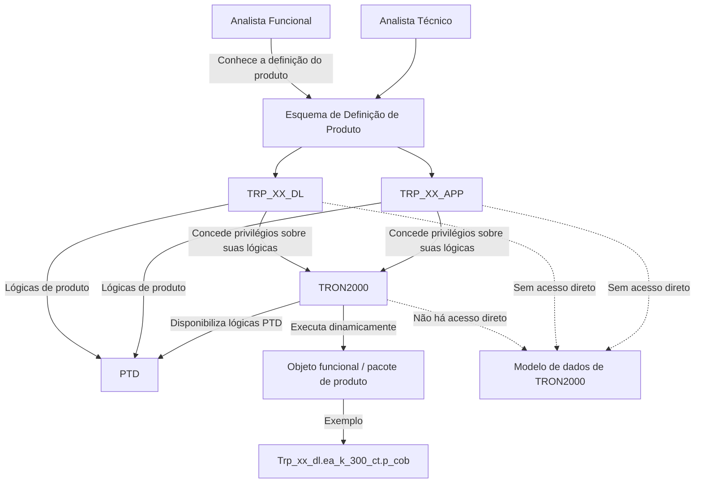
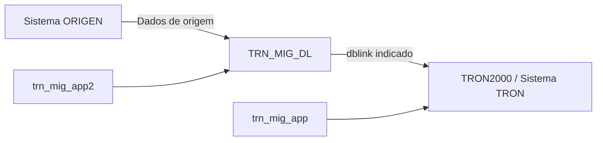
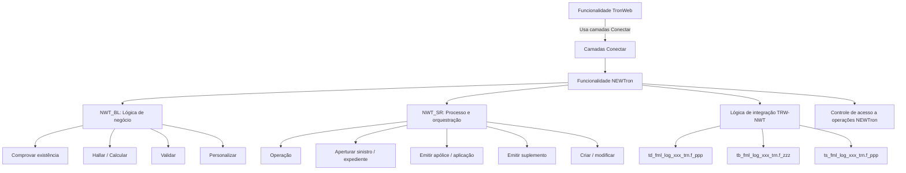
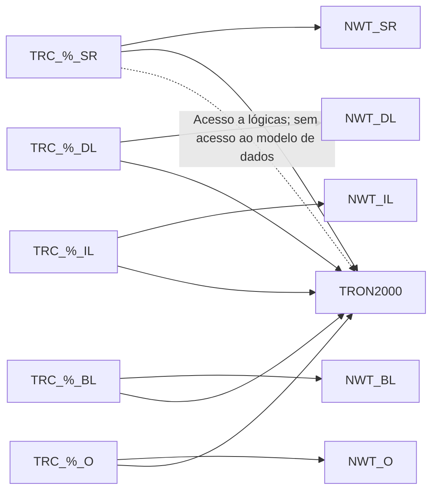

# NEWTron Core — Esquemas de Migração, Produto e Personalização

## 1. Metadados do Documento
- **Arquivo de Origem:** Não identificado; conteúdo bruto de apresentação com 17 páginas identificadas.
- **Tipo de Documento:** Apresentação Executiva / Arquitetura de Software / Material de Formação NEWTron.
- **Domínio / Sistema:** NEWTron, TRON2000, TronWeb, definição de produto, migração e personalização.
- **Público-Alvo:** Analistas funcionais, analistas técnicos, desenvolvedores e arquitetos.
- **Data/Versão Identificada:** Não identificada. A página 5 cita `TRP Plantilla pdc Lógica v1.2.pdc`.

---

## 2. Resumo Executivo & Contexto de Negócio

O documento apresenta a organização de esquemas próprios na mesma base de dados do sistema TRON para três finalidades: migração (`TRN_MIG`), definição de produto (`TRP`) e personalização por país (`TRC`). Esses esquemas são separados dos esquemas centrais do TRON, identificados no material como `TRON2000` e `NWT_%`.

Os esquemas de migração são utilizados em migrações massivas e no tratamento de sinistros de apólices que não estão no TRON. A estrutura de migração mantém os dados de origem em `TRN_MIG_DL` e apresenta uma relação de banco de dados entre o sistema TRON e o sistema de origem, incluindo `dblink`.

A definição de produto ocorre em esquemas corporativos e por país. `TRON2000` disponibiliza lógicas PTD aos esquemas de produto, enquanto os esquemas de produto concedem privilégios sobre suas próprias lógicas a `TRON2000`. Os esquemas de produto não possuem acesso ao modelo de dados de `TRON2000`; o acesso ao núcleo ocorre exclusivamente por meio das lógicas PTD.

A apresentação descreve uma arquitetura em camadas para NEWTron, separando lógica de negócio, lógica de processo, orquestração, integração TronWeb–NEWTron, serviços e dados. A funcionalidade TronWeb utiliza funcionalidades NEWTron pelas camadas “Conectar”, e o material destaca a funcionalidade de controle de acesso às operações NEWTron.

A personalização utiliza esquemas próprios de país com o acrônimo `TRC`. Esses esquemas têm acesso a lógicas de TRON, mas não ao modelo de dados de TRON. A composição apresentada inclui camadas de serviço, descrição, integração, negócio e objetos, relacionadas às camadas `NWT_BL`, `NWT_DL`, `NWT_IL`, `NWT_SR` e `NWT_O`.

---

## 3. Arquitetura, Componentes & Tecnologias Envolvidas

### Componentes e esquemas identificados

| Componente / Esquema | Papel identificado no documento |
| :--- | :--- |
| `TRON2000` | Esquema central do TRON; disponibiliza lógicas PTD aos esquemas de produto; executa dinamicamente lógicas de produto; contém definição PTD e tabelas de núcleo. |
| `NWT_%` | Conjunto de esquemas NEWTron citado como separado dos esquemas de migração, produto e personalização. |
| `TRN_MIG` | Acrônimo dos esquemas de migração. |
| `TRN_MIG_DL` | Camada de dados de origem no contexto de migração. |
| `trn_mig_app` | Esquema/aplicação citado no diagrama de migração. |
| `trn_mig_app2` | Esquema/aplicação citado no diagrama de migração. |
| `TRP` | Acrônimo dos esquemas de produto. |
| `TRP_XX_DL` | Camada de dados lógicos corporativa de produto; `XX` representa o nível corporativo. |
| `TRP_XX_APP` | Camada de aplicação corporativa de produto. |
| `TRP_RD_DL` | Camada de dados lógicos de produto para República Dominicana, segundo o exemplo. |
| `TRP_RD_APP` / `TRP_RD_AP` | Camada de aplicação de produto para República Dominicana; o material usa ambas as grafias. |
| `TRC` | Acrônimo dos esquemas de personalização. |
| `TRC_%_SR` | Camada de personalização com lógicas de escaparate, integração, negócio, orquestrador, processo e serviço. |
| `TRC_%_DL` | Camada de personalização com lógicas de descrição e escaparate. |
| `TRC_%_IL` | Camada de integração da personalização. |
| `TRC_%_BL` | Camada com lógicas de escaparate e integração, conforme o diagrama. |
| `TRC_%_O` | Camada de objetos da personalização. |
| `NWT_BL` | Camada de lógica de negócio NEWTron. |
| `NWT_DL` | Camada de dados/descritiva NEWTron, conforme relação com `TRC_%_DL`. |
| `NWT_IL` | Camada de integração NEWTron. |
| `NWT_SR` | Camada de serviço/orquestração NEWTron. |
| `NWT_O` | Camada de objetos NEWTron. |
| PTD | Lógicas disponibilizadas por `TRON2000` para a definição de produto. O significado expandido da sigla não é informado. |
| TronWeb / TRW | Funcionalidade que utiliza NEWTron por meio das camadas “Conectar”. |
| `dblink` | Mecanismo indicado no diagrama de migração entre o sistema TRON e o sistema de origem. |

### Relação entre esquema de produto e núcleo TRON



### Fluxo de migração apresentado



### Arquitetura metodológica NEWTron e TronWeb



### Relação entre personalização e núcleo



---

## 4. Regras de Negócio, Especificações Funcionais & Processos

### 4.1 Regras para esquemas de migração

1. A migração será utilizada em:
   - Migrações massivas.
   - Migrações para tratamento de sinistros de apólices que não estão no TRON.
2. A definição de migração é desenhada na mesma base de dados do TRON.
3. Os esquemas de migração são próprios e separados dos esquemas do TRON, citados como `TRON2000` e `NWT_%`.
4. O acrônimo dos esquemas de migração é `TRN_MIG`.
5. A nomenclatura indicada é `TRN_MIG_Capa de lógica`.
6. `TRN_MIG_DL` é apresentado como camada de dados de origem.
7. O diagrama de migração menciona `dblink`, `trn_mig_app` e `trn_mig_app2`.

### 4.2 Regras para esquemas de produto

1. A definição de produto é desenhada na mesma base de dados de TRON.
2. Os esquemas de produto são próprios e separados dos esquemas `TRON2000` e `NWT_%`.
3. `TRON2000` disponibiliza lógicas PTD para os esquemas de produto.
4. Os esquemas de produto são organizados em:
   - Esquema corporativo.
   - Esquemas de país.
5. O acrônimo dos esquemas de produto é `TRP`.
6. A nomenclatura é `TRP_Código de país_Capa de lógica`.
7. Para países, deve ser utilizado código ISO de duas posições.
8. Para a camada corporativa, deve ser utilizado o código `XX`.
9. Esquemas de produto corporativos e de país concedem privilégios sobre suas próprias lógicas a `TRON2000`.
10. Esquemas de produto não têm acesso ao modelo de dados de `TRON2000`.
11. Esquemas de produto acessam `TRON2000` somente por meio das lógicas PTD.
12. Existe uma plantilla para conceder privilégios de produto a `TRON2000`: `TRP Plantilla pdc Lógica v1.2.pdc`.

### 4.3 Definição de produto e execução dinâmica

1. O gerador de produto usa `TRON2000-DEFINICION-PTD`.
2. A definição de produto é inserida em tabelas de núcleo, com exemplos `A1001800` e `A1002150`.
3. `TRON2000` disponibiliza lógicas que acessam dados da definição de produto.
4. São citados os objetos `em_k_a2000030` e `Em_k_`, sendo o segundo incompleto no material.
5. A camada central é descrita como “Núcleo/Genérico para todos” e “NO SE PERSONALIZA”.
6. A integração da paquetaria `TRP` na definição do produto é apresentada por meio de `A1002150.nom_prg`, com o exemplo:
   - `trp_xx_dl.em_k_cvr_trn.p_calc_cap`
7. `TRON2000` executa dinamicamente objetos da definição de produto.
8. O exemplo de interação entre esquemas é:
   - `Trp_xx_dl.ea_k_300_ct.p_cob`
   - Objeto funcional: `def_Ct`
   - Camada associada: `Nwt_sr`.

### 4.4 Paquetaria e lógicas de produto

O material relaciona conceitos de negócio aos seguintes pacotes:

| Conceito / Função | Pacote citado |
| :--- | :--- |
| Trazas, globales e erros | `Trn_k_ptd` |
| Informação geral da apólice | `Em_k_ptd_gni_trn` |
| Atributos / dados variáveis | `Em_k_ptd_atr_trn` |
| Coberturas | `Em_k_ptd_cvr_trn` |
| Cláusulas | `Em_k_ptd_cla_trn` |
| Desgloses | `Em_k_ptd_brw_trn` |
| Intervenção | `Em_k_ptd_ine_trn` |
| Recibo | `Em_k_ptd_rcp_trn` |
| Informação de sinistro | `Ts_k_ptd_lsi` |
| Expediente de sinistros | `Ts_k_ptd_fli` |
| Terceiros | `Dc_k_ptd_thp` |

Regras e exemplos apresentados:

- Há pacotes de validação e cálculo de coberturas (`cvr`).
- Há validação de DV (`atr`).
- Há controle técnico (`utc`).
- Para assistência, o material cita o exemplo `Em_k_asistencia`.
- Para o “Caso 1”, aparecem:
  - `Em_k_160_cvr_trn`
  - `Em_k_160_atr_trn`
  - `Em_k_160_brw_trn`
  - `Em_k_160_tcc_trn`
  - `Em_k_140_cvr_trn`
  - `Em_k_140_atr_trn`
- Para um caso comum, é citado `em_k_999_utc_trn`.
- O controle técnico genérico é descrito como aplicável a todos os ramos.
- Para o “Caso 2”, assistência possui validações específicas por ramo e controle técnico próprio. O material determina a criação de:
  - `Em_k_160_cvr_mrd`
  - `Em_k_160_tcc_mrd`
- `MRD` é identificado no slide como “Mapfre Rep Dom”.
- O exemplo de caso específico está relacionado a `TRP_RD_DL/TRP_RD_APP`.
- O formato indicado é “Tronweb”.

### 4.5 Regras para personalização

1. A definição de personalização é desenhada na mesma base de dados do TRON.
2. Os esquemas de personalização são próprios e separados dos esquemas `TRON2000` e `NWT_%`.
3. Esquemas de personalização têm acesso às lógicas de TRON.
4. Esquemas de personalização não têm acesso ao modelo de dados de TRON.
5. A estrutura é composta por esquemas próprios de país.
6. O acrônimo para esquemas de personalização é `TRC`.
7. A nomenclatura é `TRC_Código de país_Capa de lógica`.
8. O código de país deve utilizar ISO de duas posições.

### 4.6 Metodologia de negócio, processo e integração

A lógica de negócio apresentada em `Nwt_bl` inclui:

1. Comprovar existência:
   - `bl_fml_clg_vrb exs _trn.f_zzz`
2. Hallar/Calcular:
   - `cue`
3. Validar:
   - `vld`
4. Personalizar:
   - `psz`

A lógica de processo e orquestração apresentada em `Nwt_sr` inclui:

1. Abrir sinistro/expediente:
   - `op_fml_clg_opr_zzz_trn.p_ppp`
2. Emitir apólice/aplicação.
3. Emitir suplemento.
4. Criar/modificar.
5. Executar operação:
   - `pr_fml_clg_opr_zzz_trn.p_ppp`

A integração TronWeb–NEWTron usa lógicas “Conectar” para serviços, negócio ou dados:

- `td_fml_log_xxx_trn.f_ppp…`
- `tb_fml_log_xxx_trn.f_zzz...`
- `ts_fml_log_xxx_trn.f_ppp`

---

## 5. Tabelas de Parâmetros, Ambientes e Estruturas de Dados

| Item / Parâmetro | Descrição / Função | Tipo / Valores / Formato | Ambiente / Observações |
| :--- | :--- | :--- | :--- |
| `TRN_MIG` | Acrônimo dos esquemas de migração | Prefixo de esquema | Mesma base de dados de TRON; separado de `TRON2000` e `NWT_%`. |
| `TRN_MIG_Capa de lógica` | Nomenclatura dos esquemas de migração | Convenção de nomes | A camada lógica específica não é detalhada. |
| `TRN_MIG_DL` | Dados de origem para migração | Camada de dados | Relacionado ao sistema de origem. |
| `trn_mig_app` | Elemento de aplicação citado | Nome de esquema/aplicação | Papel detalhado não informado. |
| `trn_mig_app2` | Elemento de aplicação citado | Nome de esquema/aplicação | Papel detalhado não informado. |
| `dblink` | Ligação indicada entre sistemas | Mecanismo de conexão | O material não detalha configuração, destino ou credenciais. |
| `TRP` | Acrônimo de esquemas de produto | Prefixo de esquema | Esquemas corporativos e por país. |
| `TRP_Código de país_Capa de lógica` | Nomenclatura de produto | Convenção de nomes | Código ISO de duas posições para país. |
| `XX` | Código corporativo de produto | Código fixo | Usado em esquemas corporativos, por exemplo `TRP_XX_DL`. |
| `RD` | Código usado no exemplo de República Dominicana | Código de país no exemplo | Associado a Mapfre Rep Dom. |
| `TRP_XX_DL` | Camada corporativa de produto | Esquema de dados lógicos | Associada a lógica de produto corporativa. |
| `TRP_XX_APP` | Camada corporativa de produto | Esquema de aplicação | Associada ao esquema de definição de produto. |
| `TRP_RD_DL` | Camada de produto por país | Esquema de dados lógicos | Exemplo para República Dominicana. |
| `TRP_RD_APP` | Camada de aplicação por país | Esquema de aplicação | Grafia da página 7. |
| `TRP_RD_AP` | Camada de aplicação por país | Esquema de aplicação | Grafia da página 11; inconsistência preservada da fonte. |
| `TRP Plantilla pdc Lógica v1.2.pdc` | Plantilla de privilégios de produto | Arquivo/template | Concede privilégios de produto a `TRON2000`. |
| `A1001800` | Tabela de núcleo citada | Tabela | Usada pelo gerador de produto. |
| `A1002150` | Tabela de núcleo citada | Tabela | `A1002150.nom_prg` é usado para integrar paquetaria TRP. |
| `trp_xx_dl.em_k_cvr_trn.p_calc_cap` | Exemplo de lógica de cobertura | Procedimento / referência de pacote | Associado a `A1002150.nom_prg`. |
| `Trp_xx_dl.ea_k_300_ct.p_cob` | Exemplo de interação de esquemas | Procedimento / referência de pacote | Executado dinamicamente por `TRON2000`. |
| `def_Ct` | Objeto funcional | Objeto | Associado ao exemplo de interação de esquemas. |
| `TRC` | Acrônimo de esquemas de personalização | Prefixo de esquema | Estruturado por país. |
| `TRC_Código de país_Capa de lógica` | Nomenclatura de personalização | Convenção de nomes | Código ISO de duas posições para país. |
| `TRC_%_SR` | Lógicas de personalização | Camada SR | Escaparate, integração, negócio, orquestrador, processo e serviço. |
| `TRC_%_DL` | Lógicas de personalização | Camada DL | Descrição e escaparate. |
| `TRC_%_IL` | Lógicas de personalização | Camada IL | Integração. |
| `TRC_%_BL` | Lógicas de personalização | Camada BL | Escaparate e integração, conforme a fonte. |
| `TRC_%_O` | Objetos de personalização | Camada O | Relacionada a `NWT_O`. |
| `NWT_BL` | Lógica de negócio | Camada NEWTron | Existência, cálculo, validação e personalização. |
| `NWT_SR` | Lógica de processo/orquestração | Camada NEWTron | Abertura, emissão, modificação e operações. |
| `NWT_DL` | Camada NEWTron | Camada técnica | Relacionada a `TRC_%_DL`. |
| `NWT_IL` | Camada de integração NEWTron | Camada técnica | Relacionada a `TRC_%_IL`. |
| `NWT_O` | Camada de objetos NEWTron | Camada técnica | Relacionada a `TRC_%_O`. |
| `bl_fml_clg_vrb exs _trn.f_zzz` | Comprovação de existência | Função citada | Espaçamento e grafia preservados da fonte. |
| `op_fml_clg_opr_zzz_trn.p_ppp` | Abertura de sinistro/expediente | Procedimento citado | Lógica de processo. |
| `pr_fml_clg_opr_zzz_trn.p_ppp` | Operação | Procedimento citado | Lógica de processo. |
| `td_fml_log_xxx_trn.f_ppp` | Lógica “Conectar” | Função citada | Integração TronWeb–NEWTron. |
| `tb_fml_log_xxx_trn.f_zzz` | Lógica “Conectar” | Função citada | Integração TronWeb–NEWTron. |
| `ts_fml_log_xxx_trn.f_ppp` | Lógica “Conectar” | Função citada | Integração TronWeb–NEWTron. |

---

## 6. Bateria de Perguntas & Respostas para RAG (FAQ Sintético)

### P1: Para quais cenários os esquemas `TRN_MIG` são utilizados?
**R:** Os esquemas `TRN_MIG` são utilizados em migrações massivas e em migrações destinadas ao tratamento de sinistros de apólices que não estão no TRON. A definição de migração é implementada na mesma base de dados do TRON, mas em esquemas próprios separados de `TRON2000` e `NWT_%`.

### P2: Qual é a convenção de nomenclatura dos esquemas de produto?
**R:** A convenção é `TRP_Código de país_Capa de lógica`. Para países, o código deve ser ISO de duas posições. Para o nível corporativo, deve ser utilizado `XX`, como nos exemplos `TRP_XX_DL` e `TRP_XX_APP`.

### P3: Os esquemas de produto podem consultar diretamente o modelo de dados de `TRON2000`?
**R:** Não. Os esquemas de produto não têm acesso ao modelo de dados de `TRON2000`. O acesso a `TRON2000` deve ocorrer exclusivamente por meio das lógicas PTD disponibilizadas pelo próprio `TRON2000`.

### P4: Como os esquemas de produto se relacionam com `TRON2000` em termos de privilégios?
**R:** Os esquemas de produto, tanto corporativos quanto por país, concedem privilégios sobre suas próprias lógicas a `TRON2000`. O documento cita a plantilla `TRP Plantilla pdc Lógica v1.2.pdc` para conceder esses privilégios.

### P5: Onde a definição do produto é armazenada?
**R:** O gerador de produto insere a definição nas tabelas de núcleo de `TRON2000`. O material cita como exemplos as tabelas `A1001800` e `A1002150`. A integração da paquetaria TRP pode ocorrer através de `A1002150.nom_prg`, com o exemplo `trp_xx_dl.em_k_cvr_trn.p_calc_cap`.

### P6: Como `TRON2000` executa lógicas específicas de produto?
**R:** `TRON2000` executa dinamicamente objetos e lógicas da definição de produto. O documento apresenta como exemplo `Trp_xx_dl.ea_k_300_ct.p_cob`, associado ao objeto funcional `def_Ct` e à camada `Nwt_sr`.

### P7: Qual é a diferença entre o controle técnico genérico e uma personalização por ramo?
**R:** O controle técnico genérico é indicado pelo exemplo comum `em_k_999_utc_trn` e é descrito como aplicável a todos os ramos. Quando assistência possui validações específicas para o ramo e controle técnico próprio, o material indica criar lógicas próprias, como `Em_k_160_cvr_mrd` e `Em_k_160_tcc_mrd` para Mapfre República Dominicana.

### P8: Quais são as funções descritas para a camada `NWT_BL`?
**R:** A camada `NWT_BL` concentra lógica de negócio para comprovar existência, hallar/calcular, validar e personalizar. O documento associa essas atividades, respectivamente, aos identificadores `exs`, `cue`, `vld` e `psz`, incluindo o exemplo `bl_fml_clg_vrb exs _trn.f_zzz`.

### P9: Quais operações aparecem na lógica de processo `NWT_SR`?
**R:** A lógica de processo `NWT_SR` inclui abrir sinistro ou expediente, emitir apólice ou aplicação, emitir suplemento, criar/modificar e executar operações. São citados `op_fml_clg_opr_zzz_trn.p_ppp` para abertura de sinistro/expediente e `pr_fml_clg_opr_zzz_trn.p_ppp` para operação.

### P10: Como TronWeb acessa funcionalidades NEWTron?
**R:** A funcionalidade TronWeb utiliza funcionalidades NEWTron através das camadas “Conectar”. O documento cita como exemplos de lógicas de integração `td_fml_log_xxx_trn.f_ppp`, `tb_fml_log_xxx_trn.f_zzz` e `ts_fml_log_xxx_trn.f_ppp`.

### P11: Qual é a regra de acesso dos esquemas `TRC` de personalização?
**R:** Os esquemas `TRC` têm acesso às lógicas de TRON, mas não ao modelo de dados de TRON. A definição de personalização permanece na mesma base de dados do TRON, porém em esquemas próprios e separados de `TRON2000` e `NWT_%`.

### P12: Quais camadas de personalização são definidas no diagrama `TRC`?
**R:** O diagrama apresenta `TRC_%_SR`, `TRC_%_DL`, `TRC_%_IL`, `TRC_%_BL` e `TRC_%_O`. `TRC_%_SR` contém lógicas de escaparate, integração, negócio, orquestrador, processo e serviço; `TRC_%_DL` contém descrição e escaparate; `TRC_%_IL` é a camada de integração; `TRC_%_BL` contém escaparate e integração; e `TRC_%_O` representa objetos.

---

## 7. Glossário de Termos, Siglas & Conceitos-Chave

- **TRON:** Sistema central referido no documento, cuja base de dados contém `TRON2000` e esquemas relacionados.
- **TRON2000:** Esquema central que disponibiliza lógicas PTD, contém tabelas de núcleo e executa dinamicamente lógicas de produto.
- **NEWTron / NWT:** Funcionalidade e conjunto de camadas/esquemas relacionados a negócio, processo, integração, dados e objetos.
- **TRN_MIG:** Acrônimo para esquemas de migração.
- **TRN_MIG_DL:** Camada de dados de origem para migração.
- **TRP:** Acrônimo para esquemas de produto.
- **TRC:** Acrônimo para esquemas de personalização.
- **PTD:** Lógicas disponibilizadas por `TRON2000` para esquemas de produto. O documento não expande a sigla.
- **DL:** Sufixo de camada presente em diversos esquemas; no contexto de migração é explicitamente “Dados Origem”. A expansão uniforme para todos os usos não é fornecida.
- **APP / AP:** Sufixos de camada de aplicação presentes nos exemplos de produto. A fonte utiliza `APP` e `AP`.
- **BL:** Camada de lógica de negócio, identificada em `NWT_BL`.
- **SR:** Camada de serviço, processo e/ou orquestração, identificada em `NWT_SR` e `TRC_%_SR`.
- **IL:** Camada de integração, identificada em `NWT_IL` e `TRC_%_IL`.
- **O:** Camada de objetos, identificada em `NWT_O` e `TRC_%_O`.
- **TRW / TronWeb:** Funcionalidade que usa NEWTron por meio das camadas “Conectar”.
- **dblink:** Elemento de ligação indicado entre sistema TRON e sistema de origem no diagrama de migração.
- **DV:** Elemento sujeito a validação pelo pacote `atr`; significado não expandido no documento.
- **UTC:** Identificador associado a controle técnico no exemplo `em_k_999_utc_trn`; significado não expandido.
- **CVR:** Identificador associado a validação/cálculo de coberturas.
- **ATR:** Identificador associado à validação de DV e atributos/dados variáveis.
- **GNI:** Identificador associado à informação geral da apólice.
- **CLA:** Identificador associado a cláusulas.
- **BRW:** Identificador associado a desgloses.
- **INE:** Identificador associado a intervenção.
- **RCP:** Identificador associado a recibo.
- **LSI:** Identificador associado a informação de sinistro.
- **FLI:** Identificador associado a expediente de sinistros.
- **THP:** Identificador associado a terceiros.
- **Escaparate:** Termo utilizado para uma categoria de lógica em esquemas de personalização; o documento não fornece definição adicional.
- **Mapfre Rep Dom / MRD:** Referência no exemplo de validações e controle técnico específicos para República Dominicana.

---

## 8. Notas Críticas, Riscos & Limitações

- **Nota de Análise:** O documento é uma apresentação de formação e contém diagramas visuais parcialmente convertidos em texto. Alguns relacionamentos precisos entre objetos, tabelas e camadas não podem ser reconstruídos com certeza apenas a partir da extração.
- **Nota de Análise:** PTD, DV, UTC, DL, APP, AP, BL, SR, IL e diversos identificadores de pacote não possuem expansão formal no material. O significado foi mantido somente quando explicitamente indicado.
- **Inconsistência de nomenclatura:** A camada de aplicação da República Dominicana aparece como `TRP_RD_APP` na página 7 e como `TRP_RD_AP` na página 11.
- **Inconsistência de paginação:** A última página é apresentada como “PÁGINA 17 DE 17”, mas mostra o número “18”.
- **Restrição arquitetural crítica:** Esquemas de produto e personalização não podem acessar diretamente o modelo de dados de TRON/`TRON2000`; devem usar as lógicas disponibilizadas pelo núcleo.
- **Risco de privilégio:** A integração entre produto e `TRON2000` depende da concessão correta de privilégios sobre lógicas de produto; a fonte cita uma plantilla específica, mas não detalha o processo de execução ou validação.
- **Risco de implementação:** O material cita execução dinâmica de lógicas de produto, mas não fornece contratos, assinaturas completas, tratamento de falhas, mecanismos de auditoria ou critérios de versionamento.
- **Nota de Análise:** O documento lista `trn_mig_app`, `trn_mig_app2` e `dblink`, mas não detalha configuração, autenticação, topologia de rede, mecanismos de sincronização ou tratamento de erro.
- **Nota de Análise:** O documento lista o componente `Dc_k_ptd_thp` para terceiros, porém não detalha operações, métodos, contratos de dados ou regras de validação expostas.
- **Nota de Análise:** O documento cita uma funcionalidade de controle de acesso a operações NEWTron, mas não especifica papéis, matrizes de permissão, critérios de autorização ou mecanismos de autenticação.

---

## 9. Conteúdo Bruto Estruturado (Referência Fiel)

```text
--- [PÁGINA 1 DE 17] ---

1
core
Nuevos esquemas
(TRN_MIG - TRP - TRC)


--- [PÁGINA 2 DE 17] ---

2
core
1. Esquemas de Migración
2. Esquemas de Producto
3. Esquemas de Personalización
ÍNDICE


--- [PÁGINA 3 DE 17] ---

3
core
➢ La migración se utilizará:
• En las migraciones masivas
• En las migraciones para el tratamiento de Siniestros de
pólizas que no están en TRON
➢ La definición de Migración se diseña en la misma base de datos de
TRON, pero en esquemas propios y separados de los esquemas de
TRON (TRON2000 y NWT_%)
➢ El acrónimo para estos esquemas es TRN_MIG
➢ La nomenclatura de estos esquemas es TRN_MIG_Capa de lógica
Introducción Esquemas MIGRACIÓN
Esquemas de Migración
TRON2000 TRN_MIG_DL Datos Origen
Sistema TRON Sistema ORIGEN
trn_mig_app trn_mig_app2
Dblink *


--- [PÁGINA 4 DE 17] ---

4
1. Diagramas - Esquemas de Migración
2. Diagramas - Esquemas de Producto
3. Diagramas - Esquemas de Personalización
core
ÍNDICE


--- [PÁGINA 5 DE 17] ---

5
core Esquemas de Producto
➢ La definición de Producto se diseña en la misma base de datos de TRON, pero
en esquemas propios y separados de los esquemas de TRON (TRON2000 y
NWT_%)
➢ TRON2000 disponibiliza las lógicas PTD a los esquemas de producto.
➢ Los esquemas se estructuran en esquema Corporativo y esquemas de País.
➢ El acrónimo para estos esquemas es TRP
➢ La nomenclatura de estos esquemas es TRP_Código de país_Capa de lógica:
• Para el país se utiliza el código ISO de 2 posiciones
• Para Corporativo se utilizará XX
➢ Los esquemas de producto (Corporativo, País):
• Otorgan privilegios sobres sus lógicas a TRON2000
• No tienen acceso al Modelo de datos de TRON2000
• Acceden a TRON2000 sólo a través de las lógicas PTD
➢ Existen plantilla para otorgar los privilegios de producto a TRON2000:
• TRP Plantilla pdc Lógica v1.2.pdc


--- [PÁGINA 6 DE 17] ---

6
core Esquemas de Producto


--- [PÁGINA 7 DE 17] ---

7
core Esquemas de Producto
PlyIna
PlyGni PlyRsk
PlyIne
Interv
PlyCvr PlyBrw
Ply
RcpPmr
PlyIne
PlyCla Dcm
- Paquetes Validación/Calculo de Coberturas (cvr)
- Validación de DV (atr)
- Control Técnico (utc)
- Ej: Em_k_asistencia >>
Caso1: Em_k_160_cvr_trn
        Em_k_160_atr_trn
        Em_k_160_brw_trn
        Em_k_160_tcc_trn
       Em_k_140_cvr_trn
      Em_ k_140_atr_trn …
Caso1: (común) em_k_999_utc_trn
Caso1. Tenemos el Control técnico genérico para
todos los ramos
TRP_XX_DL/TRP_XX_APP
Caso2: Asistencia tiene validaciones específicas
para el ramo, y un control técnico propio > hay que
crear
         Em_k_160_cvr_mrd
         Em_k_160_tcc_mrd           (Mapfre Rep Dom)
TRP_RD_DL/TRP_RD_APP
(Formato Tronweb)
PlyAtr
GENERADOR PRODUCTO
-TRON2000-DEFINICION-PTD
- Inserta Definición producto en Tablas de
Núcleo
    (A1001800; A1002150…)
- Dispone de las lógicas que acceden a esos
datos
- em_k_a2000030
- Em_k_
- Es Núcleo/Genérico para todos y NO SE
PERSONALIZA
- Conceptos                               Paquetes
- Em_k_ptd_trn
- Em_k_ptd_gni_trn
- Em_k_ptd_cvr_trn
- Usa las Lógicas Conectar para acceder a
Funcionalidades NEWTron
Integrar paquetería TRP en definición del
producto
(Def Cob): A1002150.nom_prg
(trp_xx_dl.em_k_cvr_trn.p_calc_cap
Esquema “TRON2000”
Conceptos Paquete
Trazas; Globales; Errores Trn_k_ptd
Errores
Información General Póliza Em_k_ptd_gni_trn
Atributos/Datos variables Em_k_ptd_atr_trn
Coberturas Em_k_ptd_cvr_trn
Clausulas Em_k_ptd_cla_trn
Desgloses Em_k_ptd_brw_trn
Intervencion Em_k_ptd_ine_trn
Recibo Em_k_ptd_rcp_trn
Información Siniestro Ts_k_ptd_lsi
Expediente (siniestros) Ts_k_ptd_fli
Terceros Dc_k_ptd_thp
Ejecuta dinámico (TRON2000)
Analista
Funcional
Analista
Técnico
Esquema “Definición Producto”


--- [PÁGINA 8 DE 17] ---

8
core Relación esquemas TRON y PRODUCTO
Esquema “Definición Producto”
TRP_XX_DL/TRP_XX_APP PTD
Esquema “TRON2000”


--- [PÁGINA 9 DE 17] ---

9
core Relación esquemas TRON y PRODUCTO
Esquema “Definición Producto”
TRP_XX_DL/TRP_XX_APP PTD
Esquema “TRON2000”


--- [PÁGINA 10 DE 17] ---

NEWTron - Formación
Desarrollo (Resumen TW-> Definición Producto) - Relación esquemas TRON y PRODUCTO
10
Ejecuta dinámico (TRON2000)
Trp_xx_dl.ea_k_300_ct.p_cob
Tron2000
Ejecuta
dinámico
(TRON2000)
Objeto functional
(def_Ct)
Nwt_sr
Ejemplo ‘Interacción esquemas’
Ejecuta dinámico (TRON2000)
Analista
Funcional
Conoce
Definición
Del
Producto


--- [PÁGINA 11 DE 17] ---

11
core Relación esquemas TRON y PRODUCTO
Esquema
“Definición Producto”
TRP_RD_DL/TRP_RD_AP
Ejemplo Entidades
Cia 5: Honduras –HNL
Cia 8: Panamá
Mismo Producto: 300, pero
particularizado para cada entidad
Ejecuta dinámico (TRON2000)
Analista
Funcional
Conoce
Definición
Del
Producto


--- [PÁGINA 12 DE 17] ---

12
Core -Visión general - Metodología
Lógica
de
negocio
Comprobar Existencia bl_fml_clg_vrb exs _trn.f_zzz
Hallar/Calcular cue
Validar vld
Personalizar psz….
Nwt_bl
Lógica
de
Proceso
Lógica Orquestador
de Proceso
Lógica Orquestador
de Concepto Lógico
Nwt_sr
Aperturar sini/expediente op_fml_clg_opr_zzz_trn.p_ppp
Emitir poliza/aplicacion
Emitir suplemento
Crear / Modificar …….
Operación pr_fml_clg_opr_zzz_trn.p_ppp
Lóg integración
Trw-Nwt
Servicio o
Negocio
O Datos
Conectar XXX
td_fml_log_xxx_trn.f_ppp…
Conectar XXX
tb_fml_log_xxx_trn.f_zzz...
Conectar XXX
ts_fml_log_xxx_trn.f_ppp
Tenemos la
funcionalidad NEWTron:
Control Acceso
Operaciones NEWTron


--- [PÁGINA 13 DE 17] ---

13
Core -Visión general - Metodología
Lógica
de
negocio
Comprobar Existencia bl_fml_clg_vrb exs _trn.f_zzz
Hallar/Calcular cue
Validar vld
Personalizar psz….
Nwt_bl
Lógica
de
Proceso
Lógica Orquestador
de Proceso
Lógica Orquestador
de Concepto Lógico
Nwt_sr
Aperturar sini/expediente op_fml_clg_opr_zzz_trn.p_ppp
Emitir poliza/aplicacion
Emitir suplemento
Crear / Modificar …….
Operación pr_fml_clg_opr_zzz_trn.p_ppp
Lóg integración
Trw-Nwt
Servicio o
Negocio
O Datos
Conectar XXX
td_fml_log_xxx_trn.f_ppp…
Conectar XXX
tb_fml_log_xxx_trn.f_zzz...
Conectar XXX
ts_fml_log_xxx_trn.f_ppp
Funcionalidad TronWeb
Hace uso de la
Funcionalidad NEWTron
A través de las capas
Conectar.


--- [PÁGINA 14 DE 17] ---

14
1. Esquemas de Migración
2. Esquemas de Producto
3. Esquemas de Personalización
core
ÍNDICE


--- [PÁGINA 15 DE 17] ---

15
core Relación esquemas TRON y PRODUCTO
➢ La definición de la Personalización se diseña en la misma base de datos de
TRON, pero en esquemas propios y separados de los esquemas de TRON
(TRON2000 y NWT_%)
➢ Los esquemas de personalización tendrán acceso a lógicas de TRON, pero
no al Modelo de datos de TRON
➢ Los esquemas se estructuran en esquemas propios de País.
➢ El acrónimo para estos esquemas es TRC
➢ La nomenclatura de estos esquemas es TRC_Código de país_Capa de lógica:
• Para el país se utiliza el código ISO de 2 posiciones


--- [PÁGINA 16 DE 17] ---

16
core Relación entre esquemas de personalización y núcleo
TRC_%_SR (Lógicas: escaparate, integración, negocio, orquestador, proceso y
servicio) (Objetos)
NWT_BL
TRC_%_DL (Lógicas: descripción y
escaparate)
NWT_DL
NWT_IL
NWT_SR
NWT_O
TRC_%_IL (Lógicas: Integración)
TRC_%_BL (Lógicas:
escaparate e integración)
TRON2000
TRC_%_O (Objetos)


--- [PÁGINA 17 DE 17] ---

18
Asunto visto
Muchas Gracias por su atención.
core
```
