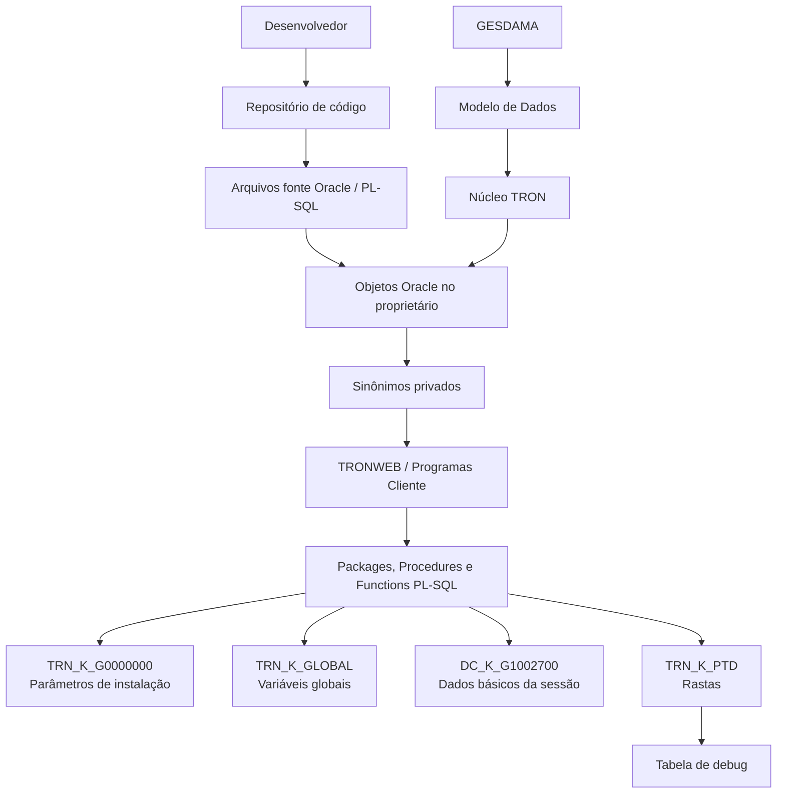
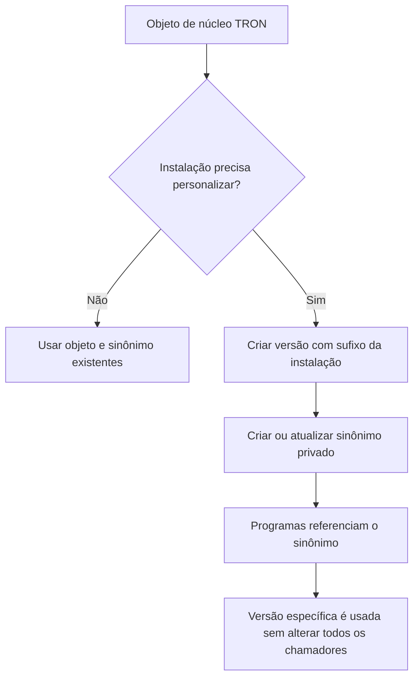

# TRON — Guia de Estilo e Programação PL/SQL para TRONWEB e NEWTron

## 1. Metadados do Documento
- **Arquivo de Origem:** Não identificado no texto fornecido
- **Tipo de Documento:** Especificação Técnica / Guia de Programação
- **Domínio / Sistema:** TRON, TRONWEB, NEWTron, Oracle PL/SQL, GESDAMA
- **Público-Alvo:** Desenvolvedores, Arquitetos de Software, Operação e equipes de manutenção TRON
- **Data/Versão Identificada:** Última atualização: setembro de 2023

---

## 2. Resumo Executivo & Contexto de Negócio

O documento define o padrão corporativo de nomenclatura, estruturação, documentação e programação PL/SQL para o ecossistema TRON, abrangendo objetos Oracle usados por TRONWEB, NEWTron e componentes associados. O guia padroniza nomes de tabelas, campos, procedimentos, funções, packages, programas cliente, sinônimos e arquivos de repositório.

A especificação estabelece uma separação explícita entre o núcleo TRON e objetos específicos de cada instalação. Essa diferenciação é realizada principalmente pelo uso de códigos de módulo, numeração reservada e sufixos de instalação, como `_trn`, `_mpe`, `_mmx` e `_sls`. Objetos de núcleo não podem ser modificados diretamente pelas instalações.

O guia também determina práticas de desenvolvimento PL/SQL, incluindo propagação de exceções, uso obrigatório de cursores para consultas `SELECT`, tipagem baseada em colunas de tabelas, proibição de alterações diretas na base de dados e uso de repositórios como fonte de versões dos programas.

A rastreabilidade operacional é tratada por meio do pacote `trn_k_ptd`, que deve registrar início, fim, parâmetros, variáveis, retornos e comentários de execução. As rastas não são mais gravadas em arquivo texto: são persistidas em uma tabela de debug.

O documento ainda apresenta utilitários de núcleo, parâmetros gerais de instalação, tabelas GESDAMA controladas pelo núcleo, padrões de comentários, estruturas de arquivos fonte/histórico e convenções para criação de sinônimos e permissões.

---

## 3. Arquitetura, Componentes & Tecnologias Envolvidas

### Componentes identificados

| Componente | Função descrita |
| :--- | :--- |
| TRON / Tronador | Núcleo da aplicação e módulo geral identificado pelo código `TRN`. |
| TRONWEB | Camada de programas cliente com frontal Java e suporte PL/SQL. |
| NEWTron | Modelo de nomenclatura para novas tabelas e operações. |
| Oracle PL/SQL | Linguagem e plataforma de banco de dados para objetos, packages, procedures, functions, triggers e sinônimos. |
| GESDAMA | Gestão de Dados Mestres; tabelas cujas definições e parametrizações são controladas pelo núcleo. |
| Modelo de Dados | Canal por meio do qual dados GESDAMA podem ser criados ou modificados pelo núcleo. |
| `TRN_K_G0000000` | Pacote de recuperação de parâmetros gerais da instalação. |
| `DC_K_G1002700` | Pacote de dados básicos carregados na conexão inicial. |
| `TRN_K_GLOBAL` | Pacote para tratamento de variáveis globais. |
| `TRN_K_TIEMPO` | Pacote para operações com datas e tempos. |
| `TRN_K_ENVIO_MAIL` | Pacote para envio de e-mail através do Oracle. |
| `TRN_K_PTD` | Pacote para geração e controle de rastas de execução. |
| EXPORTADOR | Utilitário para exportar tabelas de configuração para outros ambientes por scripts reentrantes. |
| Jasper | Tecnologia citada para listados com padrão específico de package. |
| Crystal Reports | Formato de listados configurável pelo parâmetro `TIP_FORMATO_LISTADO`. |
| UTL_FILE | Utilitário Oracle referenciado para geração de arquivos de listados e SQL. |
| SAP | Sistema citado no mapeamento `G5029025`, entre campos TRON e SAP. |
| BPM | Processo habilitável para controle técnico de Emissão e Sinistros. |



### Fluxo de personalização de objetos PL/SQL



---

## 4. Regras de Negócio, Especificações Funcionais & Processos

### 4.1 Regras gerais de nomenclatura PL/SQL

1. Nomes devem ser escritos em letras minúsculas.
2. Apenas palavras reservadas de PL/SQL devem ser escritas em maiúsculas.
3. Nomes podem utilizar somente letras de `a` a `z`, sublinhado e números.
4. Não devem ser usados caracteres especiais, acentos, `ñ` ou `ç`.
5. Nomes devem ser descritivos, respeitando o limite máximo de 30 caracteres.
6. Palavras reservadas de PL/SQL não podem ser usadas como nomes de objetos.
7. Tabelas, views, funções, procedimentos e packages devem usar:
   - Prefixo do módulo;
   - Identificação do tipo de objeto, quando aplicável;
   - Nome descritivo;
   - Sufixo da instalação ou versão do TRON, quando aplicável.

### 4.2 Regras para tabelas TRONWEB

A estrutura geral informada é:

```text
TMMMONNN_UUU
```

Onde:

- `T`: tipo de tabela;
- `MMM`: módulo proprietário;
- `O`: proprietário;
- `NNN`: número identificador;
- `_UUU`: sufixo de instalação.

Tipos identificados:

- `G`: definição;
- `A`: dados;
- `X`: transitória;
- `V`: view;
- `S`: suplementos batch;
- `R`: pré-renovações batch;
- `P`: orçamentos e apólices;
- `C`: cotações;
- `W`: trabalho;
- `B`: caixas de entrada;
- `I`: incidências;
- `H`: histórico;
- `T`: tempos.

Regras adicionais:

- Tabelas de núcleo não possuem sufixo de instalação.
- Tabelas de núcleo não podem ser modificadas por instalações.
- Uma instalação que precisa complementar dados de uma tabela de núcleo deve criar tabela anexa.
- A tabela anexa deve ter o mesmo nome da tabela principal, acrescido do sufixo da instalação.
- A chave primária da tabela anexa deve ser igual à chave primária da tabela principal.
- Devem ser criados procedimentos e funções necessários para acessar dados da tabela anexa.
- Tabelas exclusivas de instalação devem conter `9` no quinto caractere do nome.
- O `9` no quinto caractere identifica uma tabela exclusiva e não uma tabela anexa.

Exemplos fornecidos:

| Nome | Descrição |
| :--- | :--- |
| `A1000900` | Companhias |
| `A2100420` | Submodelos |
| `A2100420_MPE` | Categorias de Submodelos |
| `A1009690_MPE` | Nova tabela da instalação do Peru |

### 4.3 Exceção para tabelas de tarifas

Tabelas de definição de produto ou geradas pelo Gerador de Produtos para cálculo de tarifas podem usar:

```text
TARRRMCC
TARRRCCC
```

Regras:

- `TA`: constante fixa que identifica tabela de tarifa gerada;
- `RRR`: recomenda-se o código do ramo;
- `MCC`: módulo abreviado e número consecutivo;
- `CCC`: número consecutivo;
- Módulos abreviados citados:
  - `2`: Emissão;
  - `5`: Tesouraria;
  - `7`: Sinistros.

### 4.4 Campos de tabelas TRONWEB

Estrutura:

```text
AAA_XXXXXXX
```

- `AAA`: tipo ou conteúdo do dado, usando abreviação autorizada de três caracteres.
- `XXXXXXX`: descrição do campo.
- Preferencialmente devem ser usadas palavras completas.
- Para palavras comuns no TRON, devem ser usadas abreviações autorizadas.

Campos comuns obrigatórios ou recorrentes:

| Campo | Descrição | Tipo |
| :--- | :--- | :--- |
| `COD_CIA` | Código de companhia | `NUMBER(2)` |
| `COD_NIVEL3` | Código do terceiro nível da estrutura comercial | `NUMBER(4)` |
| `NUM_POLIZA` | Número da apólice | `VARCHAR2(13)` |
| `NUM_SPTO` | Número do suplemento/endosso/modificação da apólice | `NUMBER(5)` |
| `COD_AGT` | Código do agente | `NUMBER(5)` |
| `FEC_VCTO_POLIZA` | Data de vencimento da apólice | `DATE` |
| `COD_MON` | Código da moeda | `VARCHAR2(3)` |
| `COD_USR` | Código do usuário que atualiza um registro; deve existir em tabelas gerais e reais | `VARCHAR2(8)` |
| `FEC_ACTU` | Data de atualização; deve existir em tabelas gerais e reais | `DATE` |
| `MCA_INH` | Marca de inabilitação | `VARCHAR2(1)` |
| `FEC_VALIDEZ` | Data de validade de um registro | `DATE` |

### 4.5 NEWTron

A estrutura de nomes de novas tabelas é:

```text
TBL_CAT_FML_PRY_INS2_LGC_SPC2
```

Significados:

- `TBL_CAT`: código predefinido de dois caracteres para categoria da tabela;
- `FML`: família, com três caracteres;
- `PRY`: projeto e/ou aplicação, com três caracteres;
- `INS2`: instalação, com dois caracteres;
- `LGC`: conceito lógico, com três caracteres;
- `SPC2`: específico ao conceito lógico, com três caracteres.

Todos os termos empregados devem constar no glossário.

A nomenclatura abaixo é considerada obsoleta e não pode ser usada:

```text
T_FML_INS_TBL_CAT_LGC_SPC_SQN1
```

### 4.6 Tabelas GESDAMA

Tabelas GESDAMA são tabelas de Gestão de Dados Mestres com definições e/ou parametrizações controladas pelo núcleo. Seus valores somente podem ser criados e/ou modificados pelo núcleo por meio de solicitações ao Modelo de Dados.

A versão atualizada do catálogo é indicada pelo documento em:

```text
https://tron.es.mapfre.net/es/catalogos/
```

Regra específica para `A1002200`:

- Instalações podem definir atividades de terceiros com numeração entre `100` e `998`.
- Os demais valores são reservados pelo núcleo.

Regras específicas para `G1010030` e `G1010031`:

- Dados com código de instalação `TRN` são fixos.
- Instalações somente podem criar valores com código de instalação próprio.
- A criação é permitida apenas se o código de campo não existir com instalação `TRN`.

### 4.7 Procedimentos armazenados TRONWEB

Estrutura:

```text
MM_T_NOMBRE_UUU
```

- `MM`: módulo;
- `T`: tipo de objeto;
- `NOMBRE`: nome descritivo;
- `UUU`: instalação.

Tipos de objeto:

| Código | Tipo |
| :--- | :--- |
| `f` | Função |
| `p` | Procedimento |
| `k` | Package |
| `t` | Trigger |

Regras:

- Nome em minúsculas.
- Máximo de 30 caracteres.
- Objetos gerais com prefixo `trn` não levam o sufixo `_trn`.
- O sufixo de instalação deve ser separado por sublinhado.
- Deve existir prefixo identificativo de módulo, identificador de tipo e nome descritivo.

### 4.8 Programas cliente

Programas cliente são os que realizam funcionalidade ou manutenção on-line. São formados por:

1. Frontal em TRONWEB/Java;
2. Parte PL/SQL que suporta o tratamento da tela.

Estrutura de programas Oracle:

```text
mm_k_PPMMMNNN_uuu
```

Estrutura de programas Java:

```text
PPMMMNNN_UUU
```

Tipos de programa Java:

| Código | Tipo |
| :--- | :--- |
| `AP` | Manutenção |
| `AC` | Consulta |
| `AL` | Listas de valores |
| `AM` | Menu |
| `AS` | Rotina |

Regras:

- Programas de núcleo não possuem sufixo de instalação.
- A personalização é realizada colocando a versão personalizada na rota da instalação, com o mesmo nome do programa de núcleo: `mapfre.uuu.mm`.
- `uuu` representa a instalação.
- `mm` representa o módulo.
- Programas de núcleo possuem código com oito caracteres.
- Programas de instalação possuem código com doze caracteres.
- Programas de instalação devem conter `9` na sexta posição.
- Programas de instalação não podem utilizar números reservados para programas de núcleo.
- O código do programa deve ser único e não pode coincidir com outros programas ou objetos da base de dados.

### 4.9 Sinônimos

Regras obrigatórias:

1. O acesso aos objetos da aplicação ocorre sempre por sinônimos.
2. Usuários conectam-se a um usuário Oracle diferente do proprietário dos objetos.
3. Não podem ser criados sinônimos públicos.
4. Sinônimos de tabelas devem ter o mesmo nome do objeto.
5. Sinônimos de objetos PL/SQL devem usar o nome do objeto sem o sufixo de instalação.
6. Referências devem apontar sempre para o sinônimo, nunca diretamente para o objeto.

Exemplo de benefício:

- Um programa que use o sinônimo `dc_f_nombre` pode continuar inalterado.
- Uma instalação pode criar `dc_f_nombre_uuu`.
- O sinônimo pode ser redirecionado para a função específica da instalação.
- Não é necessário alterar todos os programas consumidores.

Exceção identificada:

- Pode ocorrer colisão entre o sinônimo de uma tabela auxiliar e o nome de um package.
- No exemplo apresentado, o package `dc_k_a1000999_mpe_mpe` deve receber sinônimo diferente, como `dc_k_a1000999_mpe_aux`.

### 4.10 Funções e procedimentos em packages

Regras de nome:

| Prefixo | Significado |
| :--- | :--- |
| `f_` | Função pública |
| `p_` | Procedimento público |
| `fp_` | Função privada |
| `pp_` | Procedimento privado |

Critérios:

- Funções e procedimentos públicos são declarados na especificação do package.
- Funções e procedimentos privados existem apenas no corpo do package.
- Não é necessário identificar o módulo no nome interno, pois o package já identifica o módulo.
- O nome deve ser minúsculo, descritivo e limitado a 30 caracteres.
- No corpo do package, a ordenação deve ser:
  1. Procedimentos privados;
  2. Funções privadas;
  3. Procedimentos públicos;
  4. Funções públicas.

### 4.11 Funções e procedimentos internos

| Prefixo | Significado |
| :--- | :--- |
| `pi_` | Procedimento interno |
| `fi_` | Função interna |

Regras:

- Só podem ser referenciados pela função ou procedimento em que foram declarados.
- Devem ser escritos em minúsculas.
- Devem ter nome descritivo.
- O nome completo está limitado a 30 caracteres.

### 4.12 Prefixos de elementos PL/SQL

#### Escopo

| Prefixo | Escopo |
| :--- | :--- |
| `g` | Global a um package; não usar para variáveis |
| `l` | Local a um procedure ou function |
| `li` | Local interno de procedure/function interno ou bloco `DECLARE...BEGIN...END` |
| `p` | Parâmetro de procedure ou function |
| `pi` | Parâmetro local interno |
| `pc` | Parâmetro de cursor |

#### Tipo de elemento

| Prefixo | Tipo |
| :--- | :--- |
| Sem código | Variável de tipo básico |
| `c_` | Cursor |
| `record_` | Declaração de tipo `RECORD` |
| `reg_` | Variável de tipo registro |
| `table_` | Declaração de tipo `TABLE` |
| `tb_` | Variável de tipo tabela PL/SQL |
| `cursor` | Declaração de tipo `REF CURSOR` |
| `e_` | Exceção |

Regras adicionais:

- Prefixos de variáveis concatenam escopo e tipo.
- Parâmetros usam somente o prefixo de escopo: `p_`, `pi_` ou `pc_`.
- Variáveis criadas automaticamente em `FOR ... LOOP` não necessitam de prefixos.
- `g_k` é reservado a constantes globais ou tipos estáticos que não mudam de valor.
- Não deve haver variáveis globais para todo o programa, pois TRON trabalha em modo desconectado e os valores podem ser perdidos.

### 4.13 Comentários e documentação

Regras:

- PL/SQL possui comentários de linha `--` e comentários de múltiplas linhas `/* ... */`.
- Comentários devem ser usados como separadores de código, processos e comentários ao fim de linhas.
- Não podem existir linhas em branco; ao menos deve existir comentário no início da linha.
- Todos os objetos PL/SQL devem ser documentados no código fonte.
- A descrição geral do objeto deve ficar no início do código.
- O número de versão deve ser informado depois da descrição geral.
- Depois do comentário de versão, deve existir comentário detalhando o motivo da modificação.
- No package fonte deve permanecer apenas o comentário da última modificação.
- Todo o histórico de modificações, incluindo a última, deve ser mantido no arquivo histórico correspondente.
- Mensagens TRON são codificadas na tabela `G1010020`.
- Ao apresentar mensagem, o código deve ser acompanhado de comentário com o texto para facilitar a compreensão.

### 4.14 Utilitários de núcleo

| Utilitário | Uso |
| :--- | :--- |
| `TRN_K_G0000000` | Recuperação de parâmetros gerais da instalação. |
| `DC_K_G1002700` | Carrega variáveis globais básicas na conexão inicial. |
| `TRN_K_GLOBAL` | Armazena, recupera, remove, transfere, salva e restaura variáveis globais. |
| `TRN_K_TIEMPO` | Operações com datas, tempos e formatações. |
| `TRN_K_ENVIO_MAIL` | Envio de correio eletrônico por Oracle. |
| `EXPORTADOR` | Exporta dados de tabelas de configuração por scripts reentrantes. |
| `TRN_K_PTD` | Registra rastas de execução. |

`TRN_K_GLOBAL` permite:

- Armazenar variáveis globais;
- Recuperar variáveis;
- Usar `p_devuelve`;
- Usar `p_ref_f_global`, cujo uso deve ser evitado;
- Apagar variáveis globais;
- Apagar todas as variáveis globais;
- Enviar globais para outra sessão Oracle;
- Receber globais de outra sessão Oracle;
- Salvar e restaurar globais.

### 4.15 Rastas

Regras mandatórias:

1. Todo procedimento ou função deve iniciar com rastreio de começo.
2. Todo procedimento ou função deve encerrar com rastreio de final.
3. Após o início da rasta, parâmetros recebidos devem ser registrados com `p_gen_traza_parametro`.
4. O método `p_gen_traza_parametro` suporta texto, numéricos, datas e booleanos.
5. Rastros são gravados em tabela de debug, não em arquivo texto.

Operações de rasta:

| Método | Uso |
| :--- | :--- |
| `p_gen_comienzo_traza` | Registra início de execução. |
| `p_gen_final_traza` | Registra fim de execução. |
| `p_gen_traza_parametro` | Registra parâmetro recebido. |
| `f_dev_identificador_traza` | Retorna identificador de rasta para debug, habilitação ou desabilitação. |
| `p_habilita_traza` | Habilita geração de rastas. |
| `p_deshabilita_traza` | Inabilita geração de rastas. |
| `p_set_habilita_traza` | Habilita ou inabilita rastas conforme parâmetro. |
| `p_gen_traza_variable` | Registra valor de variável. |
| `p_gen_traza_retorno_funcion` | Registra retorno de função. |
| `p_gen_traza_comentario` | Registra comentário entre rastas. |

### 4.16 Exceções e programação

Regras:

- Em regra geral, procedimentos e packages não devem capturar exceções.
- Exceções devem propagar até a tela ou processo batch correspondente.
- `WHEN OTHERS` não deve ser usado, salvo situações pontuais.
- Caso `WHEN OTHERS` seja usado para fechar um cursor, deve obrigatoriamente conter `RAISE` para propagar o erro.
- Nunca se deve editar diretamente na base de dados.
- Alterações devem ser feitas por repositórios, usando sempre a versão mais recente do programa.

### 4.17 Regras para `SELECT`, cursores e transações

1. Cláusulas `SELECT` devem ser declaradas como cursores.
2. Cursores devem ser gerenciados no corpo do package.
3. Deve ser controlada a exceção de ausência de registros.
4. Não se pode usar `SELECT FROM DUAL` em programas.
5. Cursores não devem conter valores fixos no filtro.
6. Todo filtro deve chegar ao cursor por parâmetro.
7. Não é permitido fazer consultas dinâmicas a partir de procedimento dinâmico.
8. Não se deve usar `EXIT` para sair de loops.
9. Caso seja necessário `COMMIT`, ele deve ser executado em transação autônoma.
10. Não deve existir `COMMIT` global para a transação inteira.
11. Não podem ser criadas globais com nomes de colunas do sistema.

### 4.18 Variáveis, parâmetros e constantes

Regras:

- Variáveis e parâmetros devem ser referenciados a campos de tabelas com `%TYPE`.
- Não devem ser declarados diretamente como `NUMBER`, `CHAR` ou `VARCHAR2` quando existe campo de tabela aplicável.
- Chamadas a outros programas devem usar parâmetros nomeados.
- Variáveis devem usar nomes equivalentes aos parâmetros e prefixos adequados.
- Não usar tabulador.
- Não usar acentos, inclusive em comentários, versão ou histórico de modificação.
- Valores literais devem ser substituídos por constantes disponíveis em packages de constantes.
- Cada módulo possui package de constantes que pode ser utilizado pela aplicação.

---

## 5. Tabelas de Parâmetros, Ambientes e Estruturas de Dados

### 5.1 Módulos TRON

| Código do Módulo | Número | Nome do Módulo |
| :--- | :--- | :--- |
| `TRN` | `000` | General a Tronador |
| `JF` | `010` | Jetform |
| `JB` | `020` | Cadenas de Ejecución |
| `DC` | `100` | Datos Comunes |
| `SS` | `101` | Sistema de Seguridad |
| `EM` | `200` | Emisión |
| `EA` | `210` | Emisión Automóviles |
| `EV` | `230` | Emisión Vida |
| `RA` | `250` | Reaseguro |
| `ET` | `260` | Emisión Transportes |
| `CA` | `280` | Coaseguro |
| `EM` | `299` | Emisión |
| `TS` | `300` | Siniestros — Liquidaciones |
| `EM` | `420` | Emisión |
| `GC` | `502` | Gestión de Cobros |
| `FN` | `505` | Financieras |
| `CO` | `510` | Contabilidad |
| `CB` | `520` | Conciliaciones Bancarias |
| `CG` | `560` | Control de Gestión |
| `PG` | `580` | TRONWEB-SAPG (Veracruz) |
| `CE` | `600` | Comercio Electrónico |
| `TS` | `700` | Siniestros — Tramitaciones |
| `TS` | `770` | Siniestros — Salvamentos |
| `FN` | `800` | Financieras |
| `DO` | `910` | Documentación |
| `BI` | `970` | Cognos BI |
| `DC` | `999` | Datos Comunes |

### 5.2 Códigos de instalação

| Sufixo | Instalação |
| :--- | :--- |
| `_trn` | Mapfre Soft — Núcleo |
| `_vcr` | Mapfre Brasil |
| `_sls` | Mapfre Venezuela |
| `_eur` | Mapfre Chile |
| `_mpe` | Mapfre Peru |
| `_mpt` | Mapfre Portugal |
| `_mpy` | Mapfre Paraguay |
| `_csg` | Mapfre Colombia |
| `_maa` | Mapfre Aconcagua |
| `_mmx` | Mapfre México |
| `_mpr` | Mapfre Puerto Rico |
| `_mtr` | Mapfre Turquía |
| `_mfl` | Mapfre Florida |
| `_mrd` | Mapfre Dominicana |
| `_mma` | Mapfre USA |
| `_muy` | Mapfre Uruguay |
| `_mmt` | Mapfre Insurance Malta |
| `_mph` | Mapfre Insurance Filipinas |
| `_mcr` | Mapfre Costa Rica |
| `_mhn` | Mapfre Honduras |
| `_mgt` | Mapfre Guatemala |
| `_mni` | Mapfre Nicaragua |
| `_mec` | Mapfre Ecuador |
| `_msv` | Mapfre El Salvador |
| `_mpa` | Mapfre Seguros Panamá |

### 5.3 Abreviações de tipo de dado TRONWEB

| Abreviação | Descrição | Tipo / Observações |
| :--- | :--- | :--- |
| `ABR` | Abreviação | Texto, normalmente cinco caracteres |
| `APE` | Apelidos | Texto, normalmente `VARCHAR2(30)` |
| `COD` | Código | Texto, `CHAR`, `VARCHAR2` ou similar |
| `FEC` | Data | `DATE` |
| `IMP` | Importe | Numérico com decimais |
| `LNG` | Comprimento | Numérico |
| `MCA` | Marca | Texto; normalmente `S` ou `N`, com exceções |
| `NOM` | Nome | Texto, normalmente 30 caracteres |
| `NUM` | Número | Numérico; com exceções como número de apólice |
| `OBS` | Observações | Texto, normalmente 60 caracteres |
| `PCT` | Percentual | Numérico com decimais |
| `TIP` | Tipo | Valores predefinidos em tabela de tipos |
| `TXT` | Texto | Texto livre para comentários ou descrições |
| `VAL` | Valor | Numérico não calculado, como taxa de câmbio |

### 5.4 Parâmetros gerais de instalação

| Item / Parâmetro | Descrição / Função | Tipo / Valores / Formato | Ambiente / Observações |
| :--- | :--- | :--- | :--- |
| `MAX_NUM_FILAS_CONSULTA` | Máximo de linhas retornadas por consulta | Não detalhado | Instalação |
| `MCA_COBROS_MULTICIA` | Indica se permite cobranças de recibos de várias companhias em uma única caixa | Não detalhado | Instalação |
| `COD_INSTALACION` | Código da instalação | Não detalhado | Instalação |
| `TXT_MSPOOL_DIR` | Diretório padrão para listados MSPOOL via `UTL_FILE` | Diretório | Deve coincidir com diretório Oracle em `INT.ORA` |
| `TXT_MSPOOL_DIR_REAL` | Diretório padrão MSPOOL no servidor de programas | Diretório | Pode ser diferente do servidor de banco |
| `TXT_SQL_DIR` | Diretório padrão para SQL gerado via `UTL_FILE` | Diretório | Deve coincidir com diretório Oracle em `INT.ORA` |
| `TXT_SQL_DIR_REAL` | Diretório padrão SQL no servidor de programas | Diretório | Pode ser diferente do servidor de banco |
| `TXT_SEPARADOR_MILES` | Formato de separador de milhares | Formato numérico | Instalação |
| `TXT_SEPARADOR_DECIMALES` | Formato de separador decimal | Formato numérico | Instalação |
| `TXT_FORMATO_FECHA` | Formato para campos de data | Padrão `DD/MM/YYYY` | Instalação |
| `TXT_FORMATO_MMYYYY` | Formato de data sem dia | Padrão `MM-YYYY` | Instalação |
| `MCA_PARTITION_TABLE` | Indica se aplicação está em versão igual ou superior ao Oracle 9i | Não detalhado | Instalação |
| `MCA_ORACLE_V9` | Indica se instalação usa Oracle 9 | Não detalhado | Instalação |
| `VAL_COD_TERCERO_GEN` | Valor do código de terceiro genérico | Não detalhado | Instalação |
| `FORMATO_FECHA_SIN_SEPARADOR` | Formato de data sem separador | Não detalhado | Instalação |
| `TIP_FORMATO_LISTADO` | Tipo de formato de listados | `1`: texto; `2`: Crystal Reports; `3`: Jasper | Instalação |
| `HORA_DESDE_DEFECTO` | Hora padrão de efeito de suplementos | Não detalhado | Instalação |
| `URL_APPLICATION_SERVER` | URL do servidor de aplicações | URL | Instalação |
| `MCA_FEC_ACTU_EXTEND` | Indica se `FEC_ACTU` usa data truncada ou `HH:MI:SS` | Não detalhado | Instalação |
| `COD_IDIOMA_INSTALACION` | Idioma padrão da instalação | Código de idioma | Instalação |
| `MCA_MULTI_CTA_CTE` | Permite mais de uma conta corrente bancária em terceiros | Não detalhado | Instalação |
| `MCA_BPM_CT_EM` | Indica se BPM está ativo no controle técnico de Emissão | Não detalhado | Instalação |
| `MCA_BPM_CT_TS` | Indica se BPM está ativo no controle técnico de Sinistros | Não detalhado | Instalação |
| `MCA_MOD_BANK_OFFICE` | Permite modificar ID Office quando tipo de conta é `2` (`ABA NUMBER`) | Não detalhado | Instalação |
| `MCA_ROL_MENUOPCIONES` | Indica se menus de opções devem ser filtrados por papel | Não detalhado | Instalação |
| `MAX_NUM_FILAS_CONSULTA_GP` | Máximo de linhas por consulta no Gerador de Produtos | Não detalhado | Instalação |
| `COD_ISO_CHARSET` | Conjunto de caracteres a utilizar | Charset | Instalação |
| `MCA_SIEMPRE_A1000802` | Recupera dados locais de terceiros | Não detalhado | Instalação |
| `MCA_CTR_ACCESO_OP_TW_NWT` | Indica uso de controle de acesso de usuário a operações NEWTron | Não detalhado | Instalação |
| `YES` | Sim | Valor lógico | Instalação |
| `NO` | Não | Valor lógico | Instalação |
| `SAV_TMP` | Grava temporal | Não detalhado | Instalação |
| `FRM_SHR_DAT_WIT_SPR` | Formato de data curto | Formato | Instalação |
| `FRM_DAT_YER` | Formato de ano de uma data | Formato | Instalação |
| `FRM_SHR_DAT_YER` | Formato curto de ano de uma data | Formato | Instalação |
| `FRM_DAT_MNH` | Formato de mês de uma data | Formato | Instalação |
| `FRM_DAT_HOR` | Formato de hora em 24 horas | Formato | Instalação |
| `FRM_DAT_TME_WIT_SPR` | Formato de data-hora | Formato | Instalação |
| `FRM_TME_WIT_SPR` | Formato de hora | Formato | Instalação |
| `FRM_TME_EDT` | Formato de hora editado | Formato | Instalação |
| `FRM_DAT_SCN` | Formato de segundos de uma data | Formato | Instalação |
| `DBS_VAL` | Base de dados | Não detalhado | Instalação |
| `MLR_VAL` | Multitarjeta | Não detalhado | Instalação |
| `CPB_VAL` | Compatible | Não detalhado | Instalação |
| `BGN_DAY_WEK` | Dia de início da semana | Não detalhado | Instalação |

### 5.5 Dados básicos carregados na sessão

| Global | Conteúdo |
| :--- | :--- |
| `cod_cia` | Companhia do usuário |
| `cod_usr` | Código de usuário |
| `cod_ejercicio` | Código do exercício contábil da companhia |
| `cod_idioma` | Idioma do usuário |
| `cod_idioma_cia` | Idioma da companhia |
| `cod_mon_cia` | Moeda padrão da companhia |
| `num_decimales` | Número de decimais da moeda |
| `txt_formato_fecha` | Formato de data |
| `tip_docum_usr` | Tipo de documento do usuário |
| `cod_docum_usr` | Código do documento do usuário |
| `cod_agt_usr` | Código de agente, ou `NULL` se usuário não for agente |
| `cod_emp_agt_usr` | Código de subagente, ou `NULL` se usuário não for agente |
| `mca_emp_usr` | Indica se usuário é empregado |
| `mca_inf_parcial_usr` | Indica se consulta de informação parcial se aplica ao usuário |

### 5.6 Packages de constantes

| Package | Módulo | Sinônimo | Observação |
| :--- | :--- | :--- | :--- |
| `TRN` | Tronador | `TRN` | Não personalizável; também possui body |
| `CA_TRN` | Coaseguro | `CA` | Não detalhado |
| `DC_TRN` | Dados Comuns | `DC` | Não detalhado |
| `EM_TRN` | Emissão | `EM` | Não detalhado |
| `GC_TRN` | Gestão de Cobros | `GC` | Não detalhado |
| `RA_TRN` | Reaseguro | `RA` | Não detalhado |
| `TS_TRN` | Sinistros | `TS` | Não detalhado |

### 5.7 Tipos de arquivo

| Extensão | Conteúdo |
| :--- | :--- |
| `.sql` | Sentenças de definição ou manipulação de elementos Oracle |
| `.st` | Código de trigger de tabela |
| `.pdc` | Permissões, grants e criação de sinônimos |
| `.sps` | Especificação de package |
| `.spb` | Corpo de package |
| `.tys` | Especificação de type |
| `.tyb` | Corpo de type |
| `.hps` | Histórico de especificação de package |
| `.hpb` | Histórico de corpo de package |
| `.hys` | Histórico de especificação de type |
| `.hyb` | Histórico de corpo de type |
| `.drop` | Eliminação de elementos Oracle |
| `.hf` | Histórico de função |
| `.sf` | Fonte de função |
| `.hp` | Histórico de procedimento |
| `.sp` | Fonte de procedimento |

---

## 6. Bateria de Perguntas & Respostas para RAG (FAQ Sintético)

### P1: Como diferenciar um objeto de núcleo TRON de um objeto específico de instalação?
**R:** Objetos específicos de instalação usam um sufixo identificativo, como `_mpe`, `_mmx` ou `_sls`. Objetos de núcleo normalmente não usam sufixo de instalação. Em tabelas TRONWEB criadas exclusivamente pela instalação, o quinto caractere deve ser `9`. Tabelas anexo usam o nome da tabela principal acrescido do sufixo da instalação.

### P2: Uma instalação pode modificar diretamente uma tabela de núcleo TRON?
**R:** Não. Tabelas de núcleo não podem ser modificadas pelas instalações. Quando uma instalação precisa complementar dados de uma tabela de núcleo, deve criar uma tabela anexo com o mesmo nome da tabela principal, o sufixo da instalação, a mesma chave primária e os procedimentos e funções necessários para acessar os dados complementares.

### P3: Qual é a regra para usar sinônimos em objetos Oracle do TRON?
**R:** O acesso aos objetos da aplicação deve ocorrer sempre por sinônimos. Não podem ser criados sinônimos públicos. Sinônimos de tabelas mantêm o mesmo nome do objeto, enquanto sinônimos de objetos PL/SQL removem o sufixo de instalação. Programas devem referenciar o sinônimo, e nunca diretamente o objeto físico.

### P4: Por que objetos PL/SQL devem ser acessados por sinônimos?
**R:** Sinônimos permitem que uma instalação substitua uma função ou procedimento por uma versão específica sem alterar todos os programas chamadores. Um programa pode chamar, por exemplo, `dc_f_nombre`, enquanto o sinônimo pode ser redirecionado para uma implementação específica como `dc_f_nombre_uuu`.

### P5: Como devem ser declaradas variáveis e parâmetros em código PL/SQL TRON?
**R:** Variáveis e parâmetros devem ser referenciados a campos de tabelas usando `%TYPE`, como `a2000030.cod_cia%TYPE`. Não se deve declarar diretamente `NUMBER`, `CHAR` ou `VARCHAR2` quando existe um campo de tabela correspondente. Os nomes devem seguir os prefixos de escopo e tipo definidos pelo guia.

### P6: É permitido capturar `WHEN OTHERS` em procedures e packages TRON?
**R:** Como regra geral, não. Exceções devem se propagar até a tela ou processo batch correspondente. `WHEN OTHERS` somente pode ser usado em situações pontuais, como para fechar um cursor aberto. Nesse caso, é obrigatório usar `RAISE` depois do tratamento para que o erro continue sendo propagado.

### P7: Como rastrear a execução de procedures e functions?
**R:** Deve-se utilizar os procedimentos do package `trn_k_ptd`. Todo procedure ou function deve começar com `p_gen_comienzo_traza` e terminar com `p_gen_final_traza`. Os parâmetros devem ser registrados com `p_gen_traza_parametro`; variáveis, retornos e comentários podem ser rastreados por métodos específicos. As rastas são gravadas em tabela de debug.

### P8: Onde as mensagens TRON são codificadas?
**R:** As mensagens do Tronador são codificadas na tabela `G1010020`. Ao usar um código de mensagem em `RAISE_APPLICATION_ERROR`, o texto correspondente deve ser incluído como comentário para tornar o significado compreensível no código fonte.

### P9: Quais são as restrições para consultas `SELECT` no padrão TRON?
**R:** Consultas `SELECT` devem ser declaradas como cursores, gerenciadas no corpo do package e preparadas para a ausência de registros. Não é permitido usar `SELECT FROM DUAL`, filtros com valores fixos em cursores, consultas dinâmicas em procedure dinâmico ou `EXIT` para deixar loops.

### P10: Como é a estrutura de nomes dos programas cliente TRONWEB?
**R:** Programas cliente Oracle seguem a estrutura `mm_k_PPMMMNNN_uuu`. Programas Java seguem `PPMMMNNN_UUU`, em que `PP` identifica o tipo de programa, como manutenção (`AP`), consulta (`AC`), lista de valores (`AL`), menu (`AM`) ou rotina (`AS`). Programas de núcleo têm oito caracteres; programas de instalação têm doze e devem ter `9` na sexta posição.

### P11: Qual nomenclatura NEWTron está obsoleta?
**R:** A nomenclatura `T_FML_INS_TBL_CAT_LGC_SPC_SQN1` é obsoleta e não pode ser usada. Para novas tabelas NEWTron, o documento estabelece a estrutura `TBL_CAT_FML_PRY_INS2_LGC_SPC2`.

### P12: Quem pode criar ou modificar dados em tabelas GESDAMA?
**R:** As tabelas GESDAMA possuem definições e parametrizações controladas pelo núcleo. Os valores somente podem ser criados ou modificados pelo núcleo por meio de solicitações ao Modelo de Dados. Uma exceção mencionada é a tabela `A1002200`, na qual instalações podem definir atividades de terceiros entre os números `100` e `998`.

---

## 7. Glossário de Termos, Siglas & Conceitos-Chave

- **BPM:** Processo citado para controle técnico de Emissão e Sinistros.
- **Crystal Reports:** Tipo de formato de listados indicado pelo valor `2` de `TIP_FORMATO_LISTADO`.
- **GESDAMA:** Gestión de Datos Maestros; conjunto de tabelas de definições e parametrizações controladas pelo núcleo.
- **Jasper:** Tecnologia de listados para a qual existe padrão de nomenclatura de packages.
- **NEWTron:** Convenção e estruturas de dados para novas tabelas do ecossistema TRON.
- **PL/SQL:** Linguagem Oracle utilizada para procedures, functions, packages, triggers e demais objetos.
- **Rasta / Traza:** Registro de execução, parâmetros, variáveis, retorno e comentários para depuração.
- **TRON / Tronador:** Núcleo da aplicação e módulo geral do domínio descrito.
- **TRONWEB:** Camada que possui programas cliente, com frontal Java e suporte PL/SQL.
- **UTL_FILE:** Utilitário Oracle usado para geração de arquivos, listados MSPOOL e SQL.
- **`%TYPE`:** Referência de tipo PL/SQL a um campo de tabela.
- **Tabela anexo:** Tabela criada por instalação para complementar dados de tabela de núcleo; usa mesmo nome base, sufixo de instalação e mesma chave primária.
- **Sinônimo:** Nome Oracle usado para acessar objetos sem referenciar diretamente o proprietário ou a versão específica de instalação.
- **Package specification:** Parte pública de package Oracle, onde são declarados procedimentos e funções compartilháveis.
- **Package body:** Corpo de package Oracle, onde ficam implementações e elementos privados.

---

## 8. Notas Críticas, Riscos & Limitações

- **Nota de Análise:** O documento define padrões de programação e nomenclatura, mas não detalha versões do Oracle atualmente homologadas além de referências a Oracle 9 e Oracle 9i.
- **Risco de personalização:** Objetos de núcleo não podem ser modificados por instalações. Personalizações devem respeitar sufixos, numerações reservadas, tabelas anexo e sinônimos.
- **Risco de colisão de nomes:** O documento descreve caso especial em que o sinônimo esperado de uma tabela auxiliar pode conflitar com um package. Nesses casos, deve ser adotado sinônimo alternativo.
- **Risco transacional:** `COMMIT` global não é permitido; quando necessário, deve ocorrer em transação autônoma.
- **Risco de perda de estado:** Variáveis globais de escopo amplo não devem ser usadas porque TRON opera em modo desconectado e os valores podem ser perdidos.
- **Restrição de caracteres:** A proibição de acentos inclui comentários, textos de versão e histórico de alterações.
- **Restrição operacional:** Alterações diretas em banco de dados são proibidas. O desenvolvimento deve usar repositório e a versão mais recente dos fontes.
- **Nota de Análise:** O documento cita a rota `mapfre.uuu.mm` para personalização de programas clientes, mas não apresenta a estrutura física completa de diretórios ou o processo de implantação.
- **Nota de Análise:** A URL `URL_APPLICATION_SERVER` é definida como parâmetro, mas nenhuma URL concreta é fornecida no conteúdo.
- **Inconsistência literal do material:** O slide sobre desabilitação de rastas descreve `p_deshabilita_traza`, mas o exemplo apresentado chama `trn_k_ptd.p_habilita_traza;`. O documento não esclarece se o exemplo contém erro tipográfico.

---

## 9. Conteúdo Bruto Estruturado (Referência Fiel)

```text
--- [PÁGINAS 1 A 3] ---

ACT - Área de Soluciones
Última actualización: Septiembre 2023
Guía de Estilo y Programación PL/SQL

Índice:
PL/SQL Reglas Generales
Módulos Tron
Códigos de Instalación
Tablas, Vistas y Secuencias
Tablas NEWTron
Tablas GESDAMA
Procedimientos Almacenados
Listados Jasper
Programas Cliente
Sinónimos
Funciones y Procedimientos de un package
Funciones y Procedimientos Internos
Elementos de un Procedimiento PL/SQL
Documentación
Utilidades
Consideraciones en la Programación
Tipos de Archivos

--- [PÁGINAS 4 A 5] ---

Reglas generales PL/SQL:
- Escribir nombres en minúsculas.
- Sólo las palabras reservadas deben escribirse en mayúsculas.
- Usar solo letras de a a z, subrayado y números.
- No usar ñ, ç ni acentos.
- Usar nombres suficientemente largos y descriptivos.
- Máximo de 30 caracteres.
- No utilizar palabras reservadas PL/SQL como nombres.
- Objetos principales deben usar prefijo de módulo y sufijo de instalación o versión.

--- [PÁGINAS 7 A 9] ---

Módulos TRON:
TRN 000 GENERAL A TRONADOR
JF 010 JETFORM
JB 020 CADENAS DE EJECUCION
DC 100 DATOS COMUNES
SS 101 SISTEMA DE SEGURIDAD
EM 200 EMISION
EA 210 EMISION AUTOMOVILES
EV 230 EMISION VIDA
RA 250 REASEGURO
ET 260 EMISION TRANSPORTES
CA 280 COASEGURO
EM 299 EMISION
TS 300 SINIESTROS. LIQUIDACIONES
EM 420 EMISION
GC 502 GESTION DE COBROS
FN 505 FINANCIERAS
CO 510 CONTABILIDAD
CB 520 CONCILIACIONES BANCARIAS
CG 560 CONTROL DE GESTION
PG 580 TRONWEB- SAPG (VERACRUZ)
CE 600 COMERCIO ELECTRONICO
TS 700 SINIESTROS. TRAMITACIONES
TS 770 SINIESTROS. SALVAMENTOS
FN 800 FINANCIERAS
DO 910 DOCUMENTACION
BI 970 COGNOS BI
DC 999 DATOS COMUNES

Sufijos de instalación:
_trn Mapfre Soft - NÚCLEO
_vcr Mapfre Brasil
_sls Mapfre Venezuela
_eur Mapfre Chile
_mpe Mapfre Peru
_mpt Mapfre Portugal
_mpy Mapfre Paraguay
_csg Mapfre Colombia
_maa Mapfre Aconcagua
_mmx Mapfre México
_mpr Mapre Puerto Rico
_mtr Mapfre Turquía
_mfl Mapfre Florida
_mrd Mapfre Dominicana
_mma Mapfre USA
_muy Mapfre Uruguay
_mmt Mapfre Insurance Malta
_mph Mapfre Insurance Filipinas
_mcr Mapfre Costa Rica
_mhn Mapfre Honduras
_mgt Mapfre Guatemala
_mni Mapfre Nicaragua
_mec Mapfre Ecuador
_msv Mapfre El Salvador
_mpa Mapfre Seguros Panamá

--- [PÁGINAS 11 A 17] ---

Tablas TRONWEB:
TMMMONNN_UUU

Tipos:
G Definición
A Datos
X Transitoria
V Vista
S Suplementos Batch
R Pre-renovaciones Batch
P Presupuestos y Pólizas
C Cotizaciones
W Trabajo
B Buzones
I Incidencias
H Histórico
T Tiempos

Reglas:
- Tablas de núcleo no llevan sufijo.
- Tablas de núcleo no pueden ser modificadas por instalaciones.
- Tablas anexo deben llevar mismo nombre de tabla principal y sufijo de instalación.
- Clave primaria debe ser igual a la principal.
- Tablas exclusivas de instalación llevan 9 en el quinto carácter.

Campos:
AAA_XXXXXXX

Tipos:
ABR, APE, COD, FEC, IMP, LNG, MCA, NOM, NUM, OBS, PCT, TIP, TXT, VAL.

Ejemplos:
COD_CIA NUMBER(2)
COD_NIVEL3 NUMBER(4)
NUM_POLIZA VARCHAR2(13)
NUM_SPTO NUMBER(5)
COD_AGT NUMBER(5)
FEC_VCTO_POLIZA DATE
COD_MON VARCHAR2(3)
COD_USR VARCHAR2(8)
FEC_ACTU DATE
MCA_INH VARCHAR2(1)
FEC_VALIDEZ DATE

--- [PÁGINAS 19 A 27] ---

Tablas NEWTron:
TBL_CAT_FML_PRY_INS2_LGC_SPC2

Categorías citadas:
AR Archive Histórico
DF Definition Definición
EM Extension Mailbox Extensión de buzón
IM Image Imagen
ML Mailbox Buzón
BR Prior (Before Real) Previo
RL Real Real
SM Simulate Simulación
WR PreRenewal Prerenovación
VW View Vista
MV Materialized View Vista Materializada
NT Nested Nested
DM Dimension Dimensión
GD Garbage Dimension Garbage Dimensión
AG Aggregate Agregado
ST Staging Area Staging
FC Fact Hechos
MN Mini Dimension Mini Dimensión

Nomenclatura obsoleta:
T_FML_INS_TBL_CAT_LGC_SPC_SQN1

GESDAMA:
Las tablas GESDAMA tienen definiciones y/o parametrizaciones controladas por núcleo.
Sólo núcleo puede crear o modificar valores mediante peticiones a Modelo de Datos.
Catálogo actualizado:
https://tron.es.mapfre.net/es/catalogos/

--- [PÁGINAS 29 A 40] ---

Procedimientos almacenados:
MM_T_NOMBRE_UUU

Tipos:
f Función
p Procedimiento
k Package
t Trigger

Programas cliente:
mm_k_PPMMMNNN_uuu
PPMMMNNN_UUU

AP Mantenimiento
AC Consulta
AL Listas de Valores
AM Menú
AS Rutina

Sinónimos:
- Acceso siempre por sinónimos.
- No crear sinónimos públicos.
- Sinónimo de tabla: mismo nombre de objeto.
- Sinónimo PL/SQL: nombre sin sufijo de instalación.
- Referenciar sinónimo, nunca objeto físico.

--- [PÁGINAS 42 A 60] ---

Functions e procedures em packages:
f_ Función pública
p_ Procedimiento público
fp_ Función privada
pp_ Procedimiento privado

Ordem no body:
1. Procedimientos privados
2. Funciones privadas
3. Procedimientos públicos
4. Funciones públicas

Internos:
pi_ Procedimiento interno
fi_ Función interna

Escopo:
g Global a package
l Local
li Local interno
p Parámetro
pi Parámetro interno
pc Parámetro de cursor

Tipos:
c_ Cursor
record_ Tipo RECORD
reg_ Variable registro
table_ Tipo TABLE
tb_ Variable tabela PL
cursor REF CURSOR
e_ Exceção

Documentação:
- Não deixar linhas em branco.
- Incluir descrição geral, versão e última modificação.
- Histórico completo deve estar no arquivo histórico.
- Mensagens estão em G1010020.

--- [PÁGINAS 62 A 72] ---

Utilidades:
TRN_K_G0000000: parámetros generales.
DC_K_G1002700: datos básicos.
TRN_K_GLOBAL: variables globales.
TRN_K_TIEMPO: fechas.
TRN_K_ENVIO_MAIL: correo Oracle.
EXPORTADOR: scripts reentrantes.
TRN_K_PTD: trazas.

Trazas:
- Inicio obligatorio con p_gen_comienzo_traza.
- Fin obligatorio con p_gen_final_traza.
- Parámetros con p_gen_traza_parametro.
- Rastas se guardan en tabla de debug.

--- [PÁGINAS 74 A 79] ---

Consideraciones:
- No capturar excepciones salvo casos puntuales.
- WHEN OTHERS debe realizar RAISE si se usa para cerrar cursor.
- Nunca editar directamente en base de datos.
- Usar repositorios.
- SELECT debe declararse como cursor.
- No SELECT FROM DUAL.
- Filtros de cursor deben llegar como parámetros.
- No consultas dinámicas desde procedimiento dinámico.
- No usar EXIT para salir de bucles.
- COMMIT sólo en transacción autónoma.
- Variables y parámetros referenciados a campo de tabla con %TYPE.
- Usar parámetros nombrados.
- No tabuladores ni acentos.
- Usar constantes de packages de constantes.

--- [PÁGINAS 81 A 86] ---

Extensiones:
.sql Definición o manipulación Oracle
.st Trigger
.pdc Permisos y sinónimos
.sps Especificación package
.spb Cuerpo package
.tys Especificación type
.tyb Cuerpo type
.hps Histórico especificación package
.hpb Histórico cuerpo package
.hys Histórico especificación type
.hyb Histórico cuerpo type
.drop Eliminación de elementos Oracle
.hf Histórico función
.sf Fuente función
.hp Histórico procedimiento
.sp Fuente procedimiento

Plantilla .pdc:
l_logica VARCHAR2(30)
l_sinonimo VARCHAR2(30)
l_personalizable VARCHAR2(1)

Si lógica no es personalizable:
- l_sinonimo debe ser igual a l_logica.
- l_personalizable debe tener valor N.

--- [PÁGINA 87] ---

Página em branco ou apenas elementos visuais/imagem.
```
