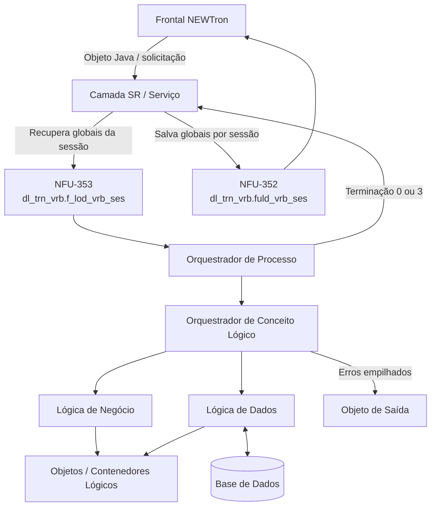
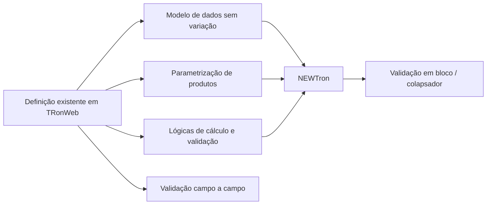
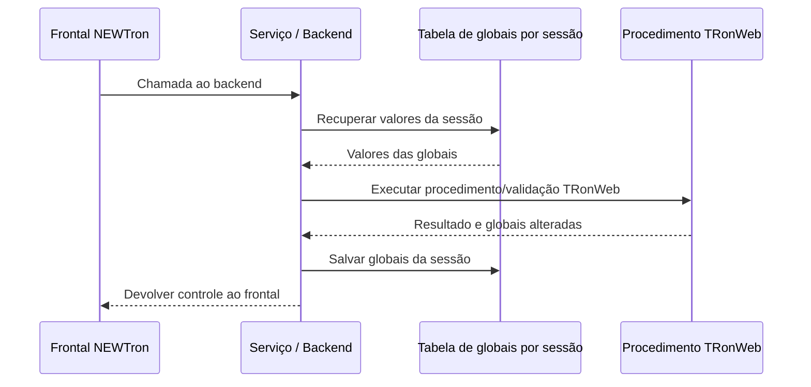

# Reef.core — Compatibilidade entre TRonWeb e NEWTron, Integração e Operação

## 1. Metadados do Documento
- **Arquivo de Origem:** Não identificado; conteúdo extraído de apresentação com 31 slides.
- **Tipo de Documento:** Apresentação Executiva / Arquitetura de Software / Guia de Compatibilidade.
- **Domínio / Sistema:** Reef.core, TRonWeb, NEWTron, plataformas de seguros.
- **Público-Alvo:** Arquitetos, desenvolvedores, analistas funcionais, operação e equipes de produto.
- **Data/Versão Identificada:** Não identificada.

---

## 2. Resumo Executivo & Contexto de Negócio

O documento apresenta a compatibilidade funcional e técnica entre **TRonWeb** e **NEWTron** no contexto da plataforma de seguros **Reef.core**. A principal premissa é preservar a definição funcional existente em TRonWeb — incluindo produtos, dados, regras, validações e procedimentos — enquanto NEWTron fornece uma arquitetura web com organização em camadas e comunicação baseada em objetos lógicos.

NEWTron mantém compatibilidade com TRonWeb em aspectos fundamentais: o modelo de dados não varia, as parametrizações de produto são interpretadas da mesma forma e as lógicas de cálculo e validação previamente construídas em TRonWeb são reutilizadas. O documento afirma que NEWTron simula a arquitetura técnica e funcional de TRonWeb em aproximadamente 95%; para o restante, foram criadas ferramentas e mecanismos de compatibilidade.

A diferença operacional mais relevante é o modo de validação. TRonWeb valida informações campo a campo durante a navegação da tela, enquanto NEWTron trabalha com sessões não conectadas continuamente à base de dados e valida, como regra, todas as informações de um bloco ou “colapsador” quando o usuário aciona a confirmação desse bloco. Essa diferença exige atenção às dependências entre propriedades e à necessidade de processos prévios.

O documento também descreve mecanismos de adaptação para variáveis globais, gestão de erros por camadas, listas de valores, definição de menus, permissões e valores constantes ou variáveis. A motivação arquitetural inclui superar obsolescência tecnológica, ausência de metodologia e documentação, promover reutilização, desacoplar modelo de dados e lógica de negócio, e separar os produtos do núcleo TRON.

---

## 3. Arquitetura, Componentes & Tecnologias Envolvidas

### Componentes e conceitos identificados

| Componente / Tecnologia | Papel descrito no documento |
| :--- | :--- |
| **Reef.core** | Contexto central da apresentação sobre compatibilidade, definição e operação. |
| **TRonWeb** | Aplicação de referência cujas definições de produto, validações e lógicas são reutilizadas por NEWTron. |
| **NEWTron** | Aplicação web compatível com TRonWeb, baseada em camadas e objetos lógicos. |
| **Nwt_sr** | Camada SR/serviços que expõe operações e adapta informações entre consumidores, fornecedores e lógicas. |
| **Objetos lógicos** | Contenedores lógicos de informação usados para transferir dados entre camadas e desacoplar lógica de negócio do modelo de dados. |
| **Lógica de dados** | Camada que consulta ou persiste informações em base de dados e propaga exceções controladas. |
| **Lógica de negócio** | Camada que realiza cálculos, validações e verificações sobre propriedades de objetos. |
| **Orquestrador de conceito lógico** | Camada que organiza ações necessárias para atender um conceito lógico específico. |
| **Orquestrador de processo** | Camada que executa parte ou toda a operação de um processo e coordena diversos conceitos lógicos de uma família. |
| **TRON2000** | Esquema citado nas consultas de validação de listas de valores. |
| **Polarion** | Repositório mencionado para documentação funcional, requisitos e desenho técnico. |
| **Oracle / Backend Oracle** | Ambiente de backend citado nas notas sobre plataformas de seguros. |
| **BPM** | Business Process Management, citado como parte da visão geral de integração. |
| **CRM** | Customer Relationship Management, citado como parte da visão geral de integração. |
| **BI** | Business Intelligence, citado como parte da visão geral de integração. |
| **ECM / Documentum** | Enterprise Content Management, citado como Documentum. |
| **ESB** | Enterprise Service Bus, citado como elemento da visão geral de integração. |
| **SOA** | Service-Oriented Architecture, citado como elemento da visão geral de integração. |
| **Salesforce** | Aplicação externa mencionada em integrações. |
| **COMERound** | Aplicação externa mencionada em integrações. |
| **Portal Inversiones (Finametrix)** | Aplicação externa mencionada em integrações. |
| **Portal Cotizador** | Aplicação externa mencionada em integrações. |
| **Impagos** | Aplicação ou domínio mencionado em integrações. |

### Fluxo arquitetural e de execução



### Modelo de compatibilidade



> **Nota de Análise:** O documento cita APIs, Salesforce, COMERound, Impagos, Portal Inversiones/Finametrix e Portal Cotizador, mas não detalha contratos, protocolos, métodos HTTP, payloads, autenticação ou fluxos individuais de integração.

---

## 4. Regras de Negócio, Especificações Funcionais & Processos

### 4.1 Premissas de compatibilidade TRonWeb e NEWTron

1. O modelo de dados de NEWTron não varia em relação a TRonWeb.
2. NEWTron deposita informações da mesma forma que TRonWeb.
3. NEWTron interpreta as parametrizações realizadas em TRonWeb da mesma forma.
4. NEWTron reutiliza lógicas de cálculo e validação desenvolvidas em TRonWeb.
5. NEWTron simula a arquitetura técnica e funcional de TRonWeb em aproximadamente 95%.
6. O impacto do percentual restante é tratado com ferramentas específicas de compatibilidade.
7. A compatibilidade aplica-se aos domínios de emissão, sinistros e terceiros, entre outros citados sem detalhamento adicional.
8. NEWTron é uma aplicação web que trabalha com sessões não conectadas continuamente à base de dados; a conexão ocorre em pontos estratégicos.
9. NEWTron adota independência entre modelo de dados e lógica de negócio por meio de arquitetura em camadas e objetos lógicos.
10. NEWTron executa validações TRonWeb identificadas por `prdNam` na definição de ramos ou produtos.

### 4.2 Validação campo a campo versus validação em bloco

| Aspecto | TRonWeb | NEWTron |
| :--- | :--- | :--- |
| Unidade de validação | Campo individual. | Bloco ou colapsador de informações. |
| Momento de validação | Durante a passagem de campo a campo. | Normalmente ao pressionar o botão de aceitar do colapsador. |
| Conexão com base de dados | Não detalhada diretamente neste comparativo. | Sessões não conectadas continuamente; acessos em pontos estratégicos. |
| Base funcional | Definições e procedimentos existentes. | Reutiliza a mesma definição funcional de TRonWeb. |
| Impacto | Valida progressivamente os valores inseridos. | Pode exigir validações adicionais ou processos prévios. |

#### Regras para dependências entre propriedades

1. Em NEWTron, a validação de todo o bloco ocorre em um único ponto.
2. Se a validação TRonWeb de uma propriedade depender de outra propriedade, a condição dependente deve estar disponível antes da confirmação do bloco.
3. O valor necessário pode ser informado manualmente ou estabelecido por um processo prévio TRonWeb.
4. NEWTron possui processos prévios para consultar ou obter informações iniciais que devem ser mostradas no colapsador.
5. Uma validação ou processo prévio existente em TRonWeb pode exigir adaptação para execução correta em NEWTron.
6. Exemplo fornecido: o valor inicial de um submodelo pode precisar ser alterado conforme a seleção de um modelo-submodelo específico.

### 4.3 Tratamento de variáveis globais TRonWeb em NEWTron

NEWTron não trabalha com variáveis globais. Os procedimentos NEWTron recebem todas as informações necessárias por parâmetros simples ou conceitos lógicos/objetos. Entretanto, procedimentos e validações herdados de TRonWeb podem usar globais para comunicação entre processos.

Para preservar esses valores por sessão, foi criado um mecanismo baseado em tabela e dois procedimentos:



1. Uma tabela armazena valores de globais por sessão.
2. `NFU-353` — `dl_trn_vrb.f_lod_vrb_ses` transfere o valor guardado em tabela para as globais.
3. `NFU-353` é executado sempre que o frontal chama o backend.
4. `NFU-352` — `dl_trn_vrb.fuld_vrb_ses` salva em tabela os valores das globais.
5. `NFU-352` é executado sempre que o backend devolve o controle ao frontal.
6. A tabela atualmente indicada é `RL_TRN_NWT_XX_VRB`.
7. Para consultar valores de globais no aplicativo NEWTron, existe um procedimento em base de dados executado por ficheiro TST com o identificador da sessão.
8. O identificador de sessão pode ser obtido no navegador pela consola `F12`, em `Network`, selecionando um método e consultando `Headers`, no valor da variável `X-TBID`.

### 4.4 Gestão de erros

#### Lógica de dados

A lógica de dados consulta informações em base de dados e devolve o resultado no objeto de saída ou deixa informações do objeto de entrada em base de dados. As exceções são propagadas, informando nome do package e parâmetros conforme a descrição do slide, e não são empilhadas nessa camada.

Exceções controladas citadas:

- `No_existen_datos` — `20001`.
- `Valor_duplicado` — `20002`.
- `Datos_no_modificados` — `20047`.
- `Datos_no_encontrados_en_lógica_descripciones` — `20125`.

As exceções controladas são executadas em lógica de tabela, lógica de tabela complexa ou lógica de descrições.

#### Lógica de negócio

A lógica de negócio realiza cálculos, validações ou verificações sobre valores das propriedades dos objetos. Ela propaga exceções e não empilha erros. Os erros da lógica de negócio são estabelecidos no funcional e são os mesmos definidos para TRonWeb.

#### Orquestrador de conceito lógico

1. Contém a orquestração necessária para atender um conceito lógico.
2. Recebe toda a informação necessária para resolver a funcionalidade.
3. Executa ações funcionais necessárias.
4. Como regra, se houver erro, captura o erro, empilha o erro, encerra sua execução e lança `20123` (`e_trn.ERR`).
5. Existe função que, recebendo o objeto, verifica erros e lança `20123` se houver erros.
6. Quando o processo deve continuar apesar de um erro, o analista deve especificar no requisito se o erro será empilhado ou omitido e como o processamento continuará.
7. O técnico deve implementar o empilhamento ou a omissão e comprovar a continuidade esperada.
8. O orquestrador de propriedades valida uma a uma as propriedades participantes da operação.
9. Quando uma propriedade falha, o orquestrador empilha o erro e continua validando as propriedades seguintes.
10. Ao final, se não houver erros, grava o objeto: em tabela de trabalho para processos online e em tabela real para processos batch.
11. Na etapa final, se houver erros, lança `20123`.
12. O orquestrador chamador não deve empilhar o `20123`.
13. O objeto devolvido contém informações obtidas, informações validadas e erros produzidos durante a execução.

#### Orquestrador de processo

1. Executa toda ou parte da operação de um processo.
2. Atua no nível da família por gerir diversos conceitos lógicos.
3. Devolve somente o objeto Processo, que contém tabela de erros, campo, dados batch e terminação.
4. Executa orquestradores de diferentes conceitos lógicos da mesma família.
5. Caso um orquestrador de conceito lógico gere erro, interrompe a execução.
6. O erro do orquestrador de conceito lógico deve permanecer empilhado no objeto de saída do processo.
7. Ao final, lança `20123` (`e_trn.ERR`) quando houver erro.
8. A terminação é obtida por `bl_trn_cmn.f_trm`, usando a quantidade de erros do objeto.
9. A terminação é verificada por `dl_trn_err.p_chc`.
10. O documento identifica como erro a ausência da comunicação `20123` em `ISU-12129 - TRASLADAR poliza a buzon`.

#### Camada SR / Serviços

1. O serviço ou intérprete expõe operações relacionadas a um conceito lógico.
2. A função do serviço é adaptar informações para consumidor ou fornecedor.
3. A adaptação pode abranger estruturas e tipos de dados.
4. Um serviço pode receber XML para identificar o serviço, lógica de negócio ou lógica de dados que será chamada.
5. O serviço realiza a gestão de globais.
6. O serviço devolve a informação do orquestrador ou lógica exposta.
7. Se a lógica exposta devolver erro, o serviço devolve o conteúdo desse erro em seu objeto de saída.
8. O serviço deve obter a terminação do processo.
9. Terminação `0` indica sucesso.
10. Terminação `3` indica processo finalizado com erros.

### 4.5 Listas de valores e opções

1. Uma lista de valores deve ser criada em TRonWeb.
2. Para visualização em NEWTron, a lista também deve ser definida em tabelas próprias de NEWTron.
3. O elemento de design de frontal `valueList` usa a definição NEWTron para mostrar a lista.
4. As listas ou opções NEWTron funcionam com dados definidos em listas de valores ou opções TRonWeb.
5. A configuração difere conforme seja uma lista NEWTron ou uma lista TRonWeb.
6. Listas TRonWeb são dinâmicas e, em geral, estão associadas a dados variáveis ou atributos.
7. Para instalações diferentes do núcleo TRN, como Malta (`MMT`) ou Turquia (`MTR`), NEWTron exibe listas da instalação e listas definidas pelo núcleo.
8. Para a execução correta de listas específicas de uma instalação, `cins.properties` deve possuir `ins_val` com o valor da instalação.
9. O ficheiro `c_ins.sps` deve possuir as mesmas constantes e os mesmos valores de `cins.properties`.
10. Listas de valores e opções são cacheáveis.
11. Após modificar uma lista, deve-se limpar o cache do navegador.
12. Se limpar o cache não for suficiente, deve-se reinicializar o probe frontal.

### 4.6 Menu e permissões de operações NEWTron

1. Opções de menu NEWTron estabelecidas pelo Core não são modificáveis.
2. Para uma operação NEWTron ser executável pelo menu da aplicação, é necessária definição em tabelas de texto, vínculo de programas e menu.
3. Novas opções de menu são validadas por analista funcional atribuído.
4. Uma nova operação com permissões próprias requer cadastro de programa, role, textos, relação NEWTron-TRonWeb e menu.
5. Uma operação que herda permissões requer textos, relação NEWTron-TRonWeb e definição de menu.
6. Por norma, programas executados pelo menu recebem Role `1`.

### 4.7 Valores constantes e conceitos variáveis

1. Há funcionalidade para criação de valores constantes usados em cálculos.
2. Valores constantes podem ser utilizados na área de emissão para definição de produtos.
3. Valores constantes podem ser utilizados na área de sinistros para cálculos de importes e valores aplicáveis a expedientes.
4. O acesso aos valores constantes é associado à Família Comum e ao conceito lógico Constante.
5. Há funcionalidade para criação de valores variáveis para Dados Variáveis.
6. Valores variáveis podem atender áreas de emissão e sinistros.
7. Valores podem ser definidos para associação como lista de valores de um dado específico.
8. Esses dados podem ser definidos nos níveis de terceiros, ramo ou coberturas.

---

## 5. Tabelas de Parâmetros, Ambientes e Estruturas de Dados

| Item / Parâmetro | Descrição / Função | Tipo / Valores / Formato | Ambiente / Observações |
| :--- | :--- | :--- | :--- |
| `RL_TRN_NWT_XX_VRB` | Tabela atual para armazenamento de globais por sessão. | Tabela. | Usada na compatibilidade TRonWeb–NEWTron. |
| `NFU-353` | Recupera valores guardados na tabela e os transfere para globais. | `dl_trn_vrb.f_lod_vrb_ses`. | Executado quando o frontal chama o backend. |
| `NFU-352` | Guarda valores das globais na tabela por sessão. | `dl_trn_vrb.fuld_vrb_ses`. | Executado quando o backend devolve controle ao frontal. |
| `X-TBID` | Identificador de sessão consultável no navegador. | Header. | `F12` → Network → método → Headers. |
| `No_existen_datos` | Exceção controlada de lógica de dados. | Código `20001`. | Não empilhada na lógica de dados. |
| `Valor_duplicado` | Exceção controlada de lógica de dados. | Código `20002`. | Não empilhada na lógica de dados. |
| `Datos_no_modificados` | Exceção controlada de lógica de dados. | Código `20047`. | Não empilhada na lógica de dados. |
| `Datos_no_encontrados_en_lógica_descripciones` | Exceção controlada de lógica de descrições. | Código `20125`. | Não empilhada na lógica de dados. |
| `e_trn.ERR` | Erro lançado por orquestradores quando existem erros acumulados. | Código `20123`. | Não deve ser empilhado pelo orquestrador chamador. |
| Terminação de processo | Indicador do resultado de processamento. | `0` = OK; `3` = erro. | Obtido e validado na camada SR e em orquestradores. |
| `bl_trn_cmn.f_trm` | Obtém a terminação do processo a partir do número de erros. | Função. | Usa `trn_err_t.COUNT`. |
| `dl_trn_err.p_chc` | Verifica a terminação do processo. | Procedimento. | Recebe terminação e idioma. |
| `G1010300` | Define colunas apresentadas e ordenação das listas de valores. | Tabela. | Listas de Valores Geral. |
| `G1010310` | Define filtro de consulta para listas de valores. | Tabela. | Listas de Valores Geral. |
| `T_TRN_D_LST_VAL_MAP` | Mapeamento de listas de valores para NEWTron. | Tabela. | Consultada por `obj_prp_idn`. |
| `T_TRN_D_LST_PRP_CLM_MAP` | Mapeamento de colunas de propriedades de listas. | Tabela. | Consultada por `obj_prp_idn`. |
| `AL000010` | Programa geral utilizável para listas de valores definidas em tabelas. | Programa. | Citado para listas de campos referenciados em tabelas. |
| `cins.properties` | Arquivo de constantes tratado no frontal. | Arquivo de propriedades. | Deve conter `ins_val` da instalação. |
| `c_ins.sps` | Arquivo de constantes correspondente. | Arquivo. | Deve possuir mesmas constantes/valores de `cins.properties`. |
| `ins_val` | Constante de instalação. | Valor de instalação. | Necessária para listas específicas de instalação. |
| `DF_TRN_NWT_XX_TXT_SET` | Textos descritivos de opções de menu NEWTron. | Tabela. | Contém `txt_nam`; mesmo identificador da operação. |
| `T_TRN_TRN_D_PGM_LNK` | Relação entre operação NEWTron e operação TRonWeb equivalente. | Tabela. | Inclui URL de acesso à operação NEWTron. |
| `RL_CMN_NWT_XX_MEN` | Definição de opções dentro de agrupamentos funcionais de menu. | Tabela. | Define operação, agrupador funcional e sequência. |
| `PROGRAMAS` | Cadastro de programa para operação NEWTron. | Tabela. | Mantida em TRonWeb. |
| `G1010210` | Associação de roles de acesso aos programas. | Tabela. | Role `1` é padrão para programas acessados por menu. |
| `valueList` | Elemento de design do frontal para apresentação de listas. | Elemento de interface. | Usa definição NEWTron para mostrar a lista. |
| `prdNam` | Identificador de validações TRonWeb na definição dos ramos/produtos. | Identificador citado. | NEWTron executa essas validações. |

### Consultas de validação de listas citadas

```sql
SELECT d.*, d.rowid
FROM TRON2000.G1010300 d
WHERE d.cod_cia IN (&cia0, &cia)
  AND d.nom_tabla = 'G2000000';

SELECT d.*, d.rowid
FROM TRON2000.G1010310 d
WHERE d.cod_cia IN (&cia0, &cia)
  AND d.nom_tabla = 'G2000000';

SELECT d.*, d.rowid
FROM TRON2000.T_TRN_D_LST_VAL_MAP d
WHERE d.obj_prp_idn = 'G2000000';

SELECT d.*, d.rowid
FROM TRON2000.T_TRN_D_LST_PRP_CLM_MAP d
WHERE d.obj_prp_idn = 'G2000000';
```

---

## 6. Bateria de Perguntas & Respostas para RAG (FAQ Sintético)

### P1: Qual é a principal diferença de validação entre TRonWeb e NEWTron?
**R:** TRonWeb valida informações campo a campo conforme o usuário navega pela tela. NEWTron valida, como regra, todas as informações apresentadas ou inseridas em um bloco ou colapsador em um único ponto, normalmente quando o usuário pressiona o botão de aceitar desse colapsador.

### P2: NEWTron altera o modelo de dados utilizado por TRonWeb?
**R:** Não. O documento afirma que o modelo de dados não varia em relação a TRonWeb e que NEWTron deposita as informações da mesma forma que TRonWeb.

### P3: Como NEWTron mantém compatibilidade com procedimentos TRonWeb que usam variáveis globais?
**R:** NEWTron armazena os valores de globais em uma tabela por sessão, indicada como `RL_TRN_NWT_XX_VRB`. Antes de uma chamada do frontal ao backend, `NFU-353` (`dl_trn_vrb.f_lod_vrb_ses`) recupera os valores para as globais. Quando o backend devolve o controle ao frontal, `NFU-352` (`dl_trn_vrb.fuld_vrb_ses`) salva os valores atualizados na tabela.

### P4: Onde obter o identificador de sessão necessário para consultar globais no NEWTron?
**R:** O identificador de sessão pode ser localizado no navegador usando `F12`, acessando a aba Network, selecionando um método e consultando Headers. O valor é informado na variável `X-TBID`.

### P5: Quando um orquestrador de conceito lógico deve lançar o erro 20123?
**R:** Como norma, quando o orquestrador detecta erros acumulados no objeto após executar suas ações e validações. O código `20123` corresponde a `e_trn.ERR`. O orquestrador chamador não deve empilhar esse `20123`; deve preservar os erros já existentes no objeto.

### P6: Como funciona a validação de propriedades em um orquestrador de conceito lógico?
**R:** O orquestrador valida as propriedades envolvidas na operação uma a uma. Se a validação de uma propriedade falha, o erro é empilhado e o orquestrador continua para a próxima propriedade. Ao final, verifica os erros e lança `20123` se houver falhas.

### P7: Qual é a diferença entre persistência online e batch no orquestrador de conceito lógico?
**R:** Quando não há erros, em processos online o orquestrador grava as informações do objeto em tabela de trabalho. Em processos batch, grava em tabela real.

### P8: Qual é a responsabilidade da camada SR ou de serviços em NEWTron?
**R:** A camada SR expõe operações relativas a conceitos lógicos, adapta estruturas e tipos de dados para consumidores ou fornecedores, realiza a gestão de globais, devolve dados ou erros das lógicas expostas e obtém a terminação do processo. A terminação `0` indica sucesso e `3` indica finalização com erros.

### P9: Quais tabelas participam da configuração de listas de valores?
**R:** O documento cita `G1010300` para colunas apresentadas e ordenação, `G1010310` para filtros de consulta, `T_TRN_D_LST_VAL_MAP` para mapeamento de listas de valores e `T_TRN_D_LST_PRP_CLM_MAP` para mapeamento de colunas de propriedades.

### P10: O que deve ser feito após alterar uma lista de valores ou opção NEWTron?
**R:** Deve-se limpar o cache do navegador. Se a alteração ainda não for refletida, é necessário reinicializar o probe frontal para que NEWTron aceite a última alteração realizada.

### P11: Quais cadastros são exigidos para criar uma nova opção de menu NEWTron com permissões próprias?
**R:** Devem ser cadastrados o programa na tabela `PROGRAMAS`, o role na tabela `G1010210`, os textos de menu em `DF_TRN_NWT_XX_TXT_SET`, a relação NEWTron–TRonWeb em `T_TRN_TRN_D_PGM_LNK` e a definição de menu em `RL_CMN_NWT_XX_MEN`.

### P12: Qual role é normalmente associado a programas executados pelo menu?
**R:** Por norma, programas executados a partir do menu recebem o Role `1`, conforme a descrição da tabela `G1010210`.

### P13: Como NEWTron trata listas específicas de instalações como Malta ou Turquia?
**R:** NEWTron trabalha de forma equivalente a TRonWeb: apresenta listas da instalação concreta e listas definidas pelo núcleo. Para execução correta, `cins.properties` deve conter a constante `ins_val` com o valor da instalação, e `c_ins.sps` deve ter as mesmas constantes e valores.

---

## 7. Glossário de Termos, Siglas & Conceitos-Chave

- **BBDD:** Base de dados.
- **BI:** Business Intelligence.
- **BPM:** Business Process Management.
- **CRM:** Customer Relationship Management.
- **ECM:** Enterprise Content Management; o documento cita Documentum.
- **ESB:** Enterprise Service Bus.
- **NEWTron / NWT:** Aplicação web compatível com TRonWeb, estruturada em camadas e objetos lógicos.
- **Nwt_sr:** Camada de serviços que expõe operações e adapta dados.
- **Objeto lógico / contenedor lógico de información:** Estrutura lógica que representa um conceito funcional e transfere informações entre camadas, sem expor diretamente o modelo de dados.
- **Orquestrador de conceito lógico:** Lógica que coordena o tratamento de um conceito lógico.
- **Orquestrador de processo:** Lógica que coordena parte ou toda a operação de um processo envolvendo vários conceitos lógicos.
- **Polarion:** Ferramenta ou repositório citado para documentação funcional e técnica.
- **Probe frontal:** Componente de frontal que pode precisar ser reinicializado após mudanças cacheáveis em listas.
- **Reef.core:** Contexto arquitetural e funcional da apresentação.
- **SOA:** Service-Oriented Architecture.
- **TRN:** Núcleo referido no contexto de instalações e listas de valores.
- **TRonWeb / TW:** Aplicação de referência cujas definições e lógicas são reutilizadas por NEWTron.
- **valueList:** Elemento de design do frontal que mostra uma lista de valores.
- **Colapsador:** Bloco de informações da interface NEWTron cuja validação ocorre, normalmente, ao confirmar o bloco.
- **Globais:** Variáveis globais usadas por procedimentos TRonWeb para comunicação entre processos.
- **Terminação de processo:** Indicador que informa se o processo encerrou corretamente (`0`) ou com erros (`3`).

---

## 8. Notas Críticas, Riscos & Limitações

- **Validação em bloco:** Dependências entre propriedades podem falhar se valores condicionantes não forem preparados antes da confirmação do colapsador. Processos prévios e validações podem exigir adaptação.
- **Sessões não conectadas:** NEWTron não mantém conexão contínua com a base de dados, o que condiciona o desenho das validações e recuperações de contexto.
- **Globais legadas:** Procedimentos TRonWeb que dependem de globais requerem o mecanismo de persistência e recuperação por sessão.
- **Cache de listas:** Mudanças em listas ou opções podem não aparecer imediatamente devido ao cache do navegador e do probe frontal.
- **Consistência de instalação:** `cins.properties` e `c_ins.sps` devem possuir as mesmas constantes e valores para execução de listas específicas de instalação.
- **Propagação de erro `20123`:** Orquestradores devem comunicar erros conforme o padrão de `e_trn.ERR`; o documento identifica ausência dessa comunicação no caso `ISU-12129 - TRASLADAR poliza a buzon`.
- **Permissões de menu:** Uma nova operação com permissões próprias depende de múltiplos cadastros coordenados entre TRonWeb e NEWTron.
- **Detalhamento insuficiente:** APIs, Salesforce, COMERound, Impagos, Portal Inversiones/Finametrix e Portal Cotizador são somente mencionados; não há contratos, integrações, autenticação ou fluxos técnicos detalhados.
- **Nota de Análise:** O documento referencia páginas internas, Polarion e Atlassian, mas o conteúdo fornecido não permite validar nem complementar essas fontes externas.

---

## 9. Conteúdo Bruto Estruturado (Referência Fiel)

```text
--- [SLIDE 1 DE 31: Sem Título] ---
* core
* Compatibilidad
* Reef.core

--- [SLIDE 2 DE 31: Sem Título] ---
* core
* Introducción
* Integración con otras aplicaciones
* Compatibilidad TW-NWT
  * Validación paso a paso vs validación en bloque
  * Tratamiento de variables “g” y arrays en paquetes de validación producto TW
  * Gestión de Errores
  * Definición de Listas de Valores; Tabla de Conceptos/Variables
  * Definición del Menú de Reef.core
  * Seguimiento de Trazas
  * Control de Acceso Usuarios
  * Control Acceso a Operaciones NEWTron

--- [SLIDE 3 DE 31: Sem Título] ---
* Core – Integración con otras aplicaciones / sistemas
* Apis
* Salesforce
* COMERound
* Otras apps
* Impagos
* Portal Inversiones (Finametrix)
* Portal Cotizador
Notas: Fontal; BPM; CRM; BI; ECM (Documentum); Access Service; ESB; SOA.

--- [SLIDES 4 A 8 DE 31: Compatibilidade] ---
* O modelo de dados não varia em relação a TRonWeb.
* NEWTron deposita a informação exatamente como TRonWeb.
* NEWTron interpreta parametrizações TRonWeb da mesma maneira.
* NEWTron reutiliza lógicas de cálculo e validação de TRonWeb.
* NEWTron simula a arquitetura técnica e funcional de TRonWeb em 95%.
* TRonWeb valida campo a campo.
* NEWTron valida em bloco/colapsador, normalmente ao pressionar aceitar.
* NEWTron trabalha com sessões não conectadas continuamente à base de dados.
* NEWTron usa processos prévios para obter informação inicial do colapsador.
* Dependências entre propriedades podem exigir adaptação de prévios ou validações TRonWeb.

--- [SLIDES 9 E 10 DE 31: Variáveis globais] ---
* NEWTron não trabalha com globais.
* TRonWeb usa globais para comunicação entre processos.
* Foi criada uma tabela para guardar valores das globais por sessão.
* NFU-353: dl_trn_vrb.f_lod_vrb_ses; recupera valores da tabela para globais.
* NFU-352: dl_trn_vrb.fuld_vrb_ses; guarda globais em tabela.
* Tabela atual: RL_TRN_NWT_XX_VRB.
* A sessão é identificada em X-TBID, via F12 / Network / Headers.

--- [SLIDES 11 A 20 DE 31: Gestão de Erros] ---
* Lógica de dados consulta/atualiza base de dados e propaga exceções sem empilhar erro.
* Exceções controladas: 20001, 20002, 20047 e 20125.
* Lógica de negócio realiza cálculos, validações e verificações sobre propriedades.
* Orquestrador de conceito lógico captura, empilha e comunica erros por 20123 (e_trn.ERR).
* Orquestrador de propriedades continua validando as demais propriedades após erro, empilhando falhas.
* Processo online grava em Trabalho; batch grava em tabela real.
* Orquestrador de processo gerencia vários conceitos lógicos e devolve objeto Processo.
* A terminação é obtida por bl_trn_cmn.f_trm e verificada por dl_trn_err.p_chc.
* Serviço SR adapta estruturas/tipos, gere globais e devolve dados ou erros.
* Terminação 0: OK. Terminação 3: processo com erros.

--- [SLIDES 21 E 22 DE 31: Listas de Valores] ---
* Listas devem ser definidas em TRonWeb e em tabelas NEWTron para visualização.
* G1010300: colunas mostradas e ordem.
* G1010310: filtros de consulta.
* T_TRN_D_LST_VAL_MAP e T_TRN_D_LST_PRP_CLM_MAP: mapeamentos NEWTron.
* AL000010: programa geral citado para listas.
* Listas são cacheáveis.
* Após alteração: limpar cache do navegador; se necessário, reinicializar probe frontal.
* cins.properties e c_ins.sps devem possuir mesmos valores de constantes.
* ins_val deve identificar instalação específica, como MMT ou MTR.

--- [SLIDES 23 E 24 DE 31: Menu e acesso] ---
* Opções de menu estabelecidas pelo Core não são modificáveis.
* DF_TRN_NWT_XX_TXT_SET: texto descritivo do menu.
* T_TRN_TRN_D_PGM_LNK: relação operação NEWTron, programa TRonWeb e URL de acesso.
* RL_CMN_NWT_XX_MEN: opção, agrupador funcional e sequência de menu.
* PROGRAMAS: associação de operação a programa.
* G1010210: role de acesso ao programa.
* Por norma, operações acessadas pelo menu usam Role 1.

--- [SLIDES 25 E 26 DE 31: Valores Constantes] ---
* Funcionalidade para criação de valores constantes.
* Aplicável à emissão: cálculos e valores para definição de produtos.
* Aplicável a sinistros: cálculos de importes/valores para expedientes.
* Família Común; Conceito Lógico: Constante.

--- [SLIDES 27 E 28 DE 31: Conceitos Variáveis] ---
* Funcionalidade para criação de valores variáveis para Dados Variáveis.
* Aplicável à emissão e a sinistros.
* Valores podem ser associados como lista de valores a um dado concreto.
* Dados podem ser definidos em Terceiros, Ramo ou Coberturas.

--- [SLIDES 29 E 30 DE 31: Seguimento, Segurança e Arquitetura] ---
* Remetem para apresentação de Seguimiento de Trazas.
* Remetem para apresentação de Controle de Acesso a Usuários e Operações NEWTron.
* Motivadores: obsolescência tecnológica, ausência de metodologia, ausência de documentação e necessidade de ambiente web.
* Objetivos: migrar de tabela para objeto, decompor componentes, reutilizar conhecimento, desacoplar modelo de dados e lógica de negócio.
* Referências: metodologia, análise, implementação, construção, Polarion, documentação, Wiki, checklist, roles, integração, CRM, comércio eletrônico, motor de regras, virtualização e compatibilidade.

--- [SLIDE 31 DE 31: Encerramento] ---
* Bien, ya hemos finalizado la sesión.
* Muchas Gracias por su atención.
* Motivação: produtos instalados no CORE de TRON acessam o esquema sem restrição.
* Problemas: atualização do CORE, portabilidade do produto e segurança da aplicação.
* Objetivo: separar/independizar produtos do núcleo TRON.
* CORE contém tabelas e lógicas das operações e disponibiliza contenedores aos schemas TRP.
```
