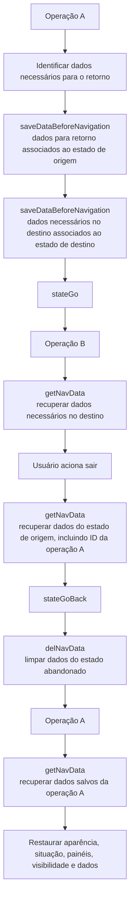
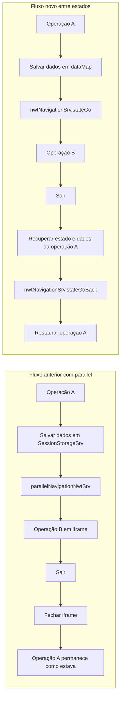

# TRON-11551 — Eliminar `parallel` da Consulta de Pólizas e Migrar para Navegação entre Estados

## 1. Metadados do Documento
- **Arquivo de Origem:** Não identificado
- **Tipo de Documento:** Especificação Técnica
- **Domínio / Sistema:** TRON / consulta de pólizas / navegação entre operações
- **Público-Alvo:** Desenvolvedores e Arquitetos
- **Data/Versão Identificada:** Não identificada

---

## 2. Resumo Executivo & Contexto de Negócio

O documento descreve a mudança técnica TRON-11551, cujo objetivo é eliminar o uso de `parallel` na consulta de pólizas. O cenário envolve uma operação de origem, denominada operação “A”, que precisa abrir uma operação de destino, denominada operação “B”, e posteriormente retornar à operação “A” preservando a aparência, os dados e a situação existentes antes da navegação.

No comportamento anterior, a operação “A” abria a operação “B” em um `iframe` por meio de `parallel`. Dados necessários para a operação “B” eram persistidos em sessão usando `SessionStorageSrv`, e a navegação era realizada por `parallelNavigationNwtSrv`. Ao sair da operação “B”, o `iframe` era fechado e a operação “A” permanecia disponível sem necessidade de reconstrução explícita.

A solução proposta substitui a abertura de `iframe` por uma mudança de estado. A navegação passa a utilizar o serviço `nwtNavigationSrv`, que mantém dados de navegação por estado em uma estrutura local denominada `dataMap`. Antes de navegar, a aplicação deve guardar os dados necessários para a operação de destino e os dados necessários para restaurar a operação de origem.

A maior complexidade ocorre no retorno da operação “B” para a operação “A”. Como não haverá mais um `iframe` a ser fechado, a operação “B” deverá recuperar o identificador da operação “A”, navegar para trás e a operação “A” deverá restaurar seu estado visual e funcional. A restauração pode incluir abertura de painéis, controle de visibilidade, reuso de dados previamente carregados e controle de eventos e `watchers` que possam alterar o resultado.

---

## 3. Arquitetura, Componentes & Tecnologias Envolvidas

### Componentes identificados

| Componente / Elemento | Papel no fluxo |
| :--- | :--- |
| Operação “A” | Estado de origem da navegação e estado que deve ser restaurado no retorno. |
| Operação “B” | Estado de destino aberto a partir da operação “A”. |
| `parallel` | Mecanismo anterior que abria a operação “B” em `iframe`. |
| `iframe` | Contêiner utilizado pelo fluxo anterior para abrir a operação “B”. |
| `SessionStorageSrv` | Serviço utilizado anteriormente para armazenar em sessão os dados necessários à operação “B”. |
| `parallelNavigationNwtSrv` | Serviço utilizado anteriormente para executar a navegação `parallel`. |
| `nwtNavigationSrv` | Serviço de navegação entre estados de um mesmo fluxo; incorpora gerenciamento de dados compartilhados entre estados. |
| `stateGo` | Método de `nwtNavigationSrv` que navega para um estado e gerencia o caminho de migas antes da navegação. |
| `stateGoBack` | Método de `nwtNavigationSrv` que retorna ao estado anterior e limpa os dados do estado abandonado. |
| `saveDataBeforeNavigation` | Método usado para salvar dados de navegação associados a um estado. |
| `getNavData` | Método usado para recuperar dados associados a um estado. |
| `delNavData` | Método que elimina dados do estado abandonado durante o retorno. |
| `dataMap` | Variável local de `nwtNavigationSrv` que armazena um objeto de dados para cada estado. |
| Controladores | Devem disponibilizar os dados necessários para a restauração da operação “A”. |
| Eventos e `watchers` | Elementos que devem ser controlados porque podem alterar o resultado após o retorno à operação “A”. |

### Fluxo de navegação proposto



### Comparação entre o fluxo anterior e o fluxo proposto



---

## 4. Regras de Negócio, Especificações Funcionais & Processos

### Problema identificado

A operação “A” precisa abrir a operação “B” e, depois, voltar para a operação “A” preservando seu estado anterior, sem utilizar `iframes`.

### Solução proposta

A solução substitui a chamada a `parallel` por navegação entre estados. Em vez de abrir uma nova aplicação completa em `iframe`, a aplicação muda de estado e usa funcionalidades adicionadas ao serviço `nwtNavigationSrv` para guardar e recuperar os dados necessários antes, durante e depois da navegação.

### Ponto 1 — Navegação da operação “A” para a operação “B”

#### Comportamento anterior

1. A operação “A” armazenava em `SessionStorageSrv` os dados necessários para carregar a operação “B”.
2. A operação “A” chamava `parallelNavigationNwtSrv`.
3. A operação “B” recuperava os dados de `SessionStorageSrv`.
4. A operação “B” eliminava os dados recuperados de `SessionStorageSrv`.

#### Comportamento novo

1. A operação “A” deve criar um objeto contendo todos os dados necessários no destino.
2. A operação “A” deve criar outro objeto contendo todos os dados necessários para retornar e redesenhar a operação “A” exatamente como estava antes da navegação.
3. Os dois objetos devem ser guardados usando o nome do estado correspondente.
4. A aplicação deve navegar usando o novo serviço de navegação.
5. Todos os dados necessários para o retorno devem estar disponíveis no controlador responsável.
6. Os dados necessários na operação “B” já deveriam estar disponíveis, pois eram previamente armazenados em sessão.

### Ponto 2 — Recuperação de dados na operação “B”

1. A operação “B” não deve mais recuperar os dados de `SessionStorageSrv`.
2. A operação “B” deve recuperar os dados do novo serviço de navegação.
3. O documento declara que este ponto não apresenta maior complexidade.

### Ponto 3 — Retorno da operação “B” para a operação “A”

#### Comportamento anterior

1. A operação “B” era exibida em um `iframe`.
2. Ao selecionar sair na operação “B”, o `iframe` era fechado.
3. A operação “A” continuava disponível no estado anterior sem processamento adicional.

#### Comportamento novo

1. O botão sair da operação “B” deve deixar de fechar um `iframe`.
2. O botão sair deve obter o identificador da operação “A”.
3. A operação “B” deve navegar de volta usando o mecanismo de navegação para trás.
4. A operação “A” deve recuperar os dados guardados antes da navegação.
5. A operação “A” deve reconstruir a aparência e a situação existentes antes da saída.

### Requisitos de restauração da operação “A”

A implementação da restauração depende de cada caso e da forma como a operação “A” carrega seus elementos. A operação “A” pode precisar:

- Abrir painéis que estavam abertos antes da navegação.
- Ocultar ou mostrar elementos conforme o estado anterior.
- Informar os dados exatamente como estavam antes da navegação.
- Evitar executar um carregamento prévio quando os dados correspondentes já tiverem sido guardados.
- Recuperar os dados salvos nos diferentes pontos em que forem necessários.
- Controlar eventos e `watchers` que possam alterar o resultado esperado.

### Uso de `nwtNavigationSrv`

#### Navegar para um estado de destino

1. Guardar os dados necessários para retornar com `saveDataBeforeNavigation`, indicando o nome do estado de origem.
2. Guardar os dados que serão necessários no destino com `saveDataBeforeNavigation`, indicando o nome do estado de destino.
3. Navegar usando `stateGo`.

#### Ao chegar ao destino

1. Recuperar os dados usando `getNavData`.
2. Informar o nome do estado correspondente para `getNavData`.

#### Retornar ao estado de origem

1. Recuperar os dados do estado de origem com `getNavData`.
2. Navegar para o estado de origem usando `stateGoBack`.
3. Durante o retorno, `stateGoBack` limpa os dados do estado abandonado usando `delNavData`.

#### Ao chegar novamente ao estado de origem

1. Recuperar os dados com `getNavData`.
2. Restaurar a operação de origem usando os dados recuperados.
3. Caso uma propriedade seja pesada e não seja mais necessária em outro ponto, remover a propriedade diretamente do objeto retornado por `getNavData`.
4. A remoção direta é possível porque o objeto retornado por `getNavData` é uma referência.

---

## 5. Tabelas de Parâmetros, Ambientes e Estruturas de Dados

| Item / Parâmetro | Descrição / Função | Tipo / Valores / Formato | Ambiente / Observações |
| :--- | :--- | :--- | :--- |
| `dataMap` | Variável local de `nwtNavigationSrv` que guarda um objeto para cada estado. | Objeto por estado. | Não são detalhadas a estrutura interna nem a persistência de `dataMap`. |
| Estado de origem | Nome do estado da operação que inicia a navegação, como a operação “A”. | Nome de estado. | Usado ao salvar dados necessários para retorno. |
| Estado de destino | Nome do estado para o qual a aplicação navega, como a operação “B”. | Nome de estado. | Usado ao salvar dados necessários no destino. |
| Dados para retorno | Dados necessários para reconstruir a operação “A” no retorno. | Objeto. | Deve incluir todos os dados necessários no controlador da operação de origem. |
| Dados de destino | Dados necessários para a operação “B”. | Objeto. | Antes eram armazenados em sessão; no novo fluxo são recuperados do novo serviço. |
| ID da operação “A” | Identificador da operação de origem necessário para voltar a partir da operação “B”. | Identificador não especificado. | Deve ser recuperado ao sair da operação “B”. |
| `saveDataBeforeNavigation` | Salva dados associados a um estado antes da navegação. | Método de `nwtNavigationSrv`. | É usado tanto para estado de origem quanto para estado de destino. |
| `getNavData` | Recupera os dados de navegação de um estado. | Método de `nwtNavigationSrv`. | Retorna uma referência ao objeto armazenado. |
| `stateGo` | Executa a navegação para outro estado. | Método de `nwtNavigationSrv`. | Gerencia o caminho de migas antes de navegar. |
| `stateGoBack` | Navega para trás em direção ao estado de origem. | Método de `nwtNavigationSrv`. | Limpa dados do estado abandonado com `delNavData`. |
| `delNavData` | Elimina os dados de navegação do estado abandonado. | Método de `nwtNavigationSrv`. | Mencionado como chamado no retorno por `stateGoBack`. |
| `SessionStorageSrv` | Armazenamento de dados em sessão utilizado no fluxo anterior. | Serviço. | Não deve ser usado para recuperar dados na operação “B” no novo fluxo. |
| `parallelNavigationNwtSrv` | Serviço de navegação usado pelo fluxo anterior com `parallel`. | Serviço. | Substituído pelo fluxo baseado em `nwtNavigationSrv`. |
| `iframe` | Contêiner da operação “B” no fluxo anterior. | Elemento de interface. | Deixa de ser usado no fluxo descrito. |
| Eventos e `watchers` | Elementos capazes de alterar o resultado de restauração da operação “A”. | Eventos e observadores. | Devem ser controlados durante o retorno. |

> **Nota de Análise:** O documento não especifica a assinatura dos métodos, a linguagem de implementação, os tipos concretos dos objetos, os nomes reais dos estados, métodos HTTP, contratos JSON, URLs, ambientes ou configurações de infraestrutura.

---

## 6. Bateria de Perguntas & Respostas para RAG (FAQ Sintético)

### P1: Qual é o objetivo da mudança TRON-11551?
**R:** A mudança TRON-11551 tem o objetivo de eliminar o uso de `parallel` na consulta de pólizas. A operação “A” deve abrir a operação “B” e voltar à operação “A” sem usar `iframe`, preservando a aparência, os dados e a situação da operação de origem antes da navegação.

### P2: Como funcionava a navegação anterior entre a operação “A” e a operação “B”?
**R:** No fluxo anterior, a operação “A” armazenava em `SessionStorageSrv` os dados necessários para a operação “B” e chamava `parallelNavigationNwtSrv`. A operação “B” era aberta em `iframe`, recuperava os dados de `SessionStorageSrv` e os eliminava. Ao sair da operação “B”, o `iframe` era fechado e a operação “A” permanecia como estava.

### P3: Qual serviço substitui o fluxo baseado em `parallel`?
**R:** O serviço `nwtNavigationSrv` substitui o fluxo baseado em `parallel`. Esse serviço foi criado para gerir a navegação entre estados de um mesmo fluxo, incluindo o gerenciamento do caminho de migas e dos dados compartilhados entre estados.

### P4: Quais métodos de `nwtNavigationSrv` são citados no documento?
**R:** O documento cita `stateGo`, `stateGoBack`, `saveDataBeforeNavigation`, `getNavData` e `delNavData`. `stateGo` navega para outro estado, `stateGoBack` retorna ao estado anterior, `saveDataBeforeNavigation` armazena dados de navegação, `getNavData` recupera dados e `delNavData` elimina dados do estado abandonado.

### P5: O que deve ser salvo antes de navegar da operação “A” para a operação “B”?
**R:** Devem ser salvos dois conjuntos de dados: um objeto com todos os dados necessários pela operação de destino e outro objeto com todos os dados necessários para voltar e redesenhar a operação “A” exatamente como ela estava antes da navegação. Cada objeto deve ser associado ao nome do estado correspondente.

### P6: Como a operação “B” deve obter os dados no novo fluxo?
**R:** A operação “B” deve obter os dados do novo serviço de navegação usando `getNavData` e o nome do estado correspondente. No novo fluxo, a operação “B” não deve recuperar os dados de `SessionStorageSrv`.

### P7: Por que o retorno da operação “B” é o ponto mais complexo da mudança?
**R:** O retorno é mais complexo porque o `iframe` deixa de existir. Antes, sair da operação “B” apenas fechava o `iframe` e deixava a operação “A” intacta. No novo fluxo, a aplicação precisa recuperar o identificador da operação “A”, navegar para trás, recuperar os dados salvos e reconstruir explicitamente a aparência e a situação anteriores da operação “A”.

### P8: O que a operação “A” pode precisar restaurar ao receber o retorno da operação “B”?
**R:** A operação “A” pode precisar abrir painéis, ocultar ou mostrar elementos, informar dados tal como estavam antes da navegação, evitar cargas prévias desnecessárias quando os dados já estiverem guardados, recuperar dados em diferentes pontos e controlar eventos e `watchers` que possam modificar o resultado.

### P9: Como ocorre a limpeza dos dados de navegação ao voltar para o estado anterior?
**R:** O documento informa que `stateGoBack` limpa os dados do estado que está sendo abandonado usando `delNavData`. O retorno deve primeiro recuperar os dados do estado de origem com `getNavData` e depois navegar para esse estado com `stateGoBack`.

### P10: É possível remover dados pesados após recuperá-los com `getNavData`?
**R:** Sim. Se uma propriedade puder ser pesada e não for mais necessária em outro ponto, o documento indica que é possível removê-la do objeto retornado por `getNavData`. Isso funciona porque o retorno de `getNavData` é uma referência ao objeto armazenado.

### P11: O documento fornece os contratos técnicos ou a estrutura dos objetos armazenados em `dataMap`?
**R:** Não. O documento informa apenas que existe uma variável local chamada `dataMap`, com um objeto para cada estado. Não são detalhados os campos, tipos, contratos JSON, assinaturas dos métodos ou mecanismos de persistência desses dados.

---

## 7. Glossário de Termos, Siglas & Conceitos-Chave

- **TRON-11551:** Identificador da mudança técnica para eliminar `parallel` da consulta de pólizas.
- **Operação “A”:** Operação de origem que inicia a navegação e deve ser restaurada após o retorno.
- **Operação “B”:** Operação de destino aberta a partir da operação “A”.
- **`parallel`:** Mecanismo anterior usado para abrir a operação “B” em `iframe`.
- **`iframe`:** Elemento usado no fluxo anterior para abrir uma aplicação ou operação dentro da operação “A”.
- **`SessionStorageSrv`:** Serviço utilizado anteriormente para guardar em sessão os dados necessários pela operação “B”.
- **`parallelNavigationNwtSrv`:** Serviço usado no fluxo anterior para executar a navegação `parallel`.
- **`nwtNavigationSrv`:** Serviço de navegação entre estados de um mesmo fluxo, com funções para compartilhar dados entre estados.
- **`stateGo`:** Método de `nwtNavigationSrv` para navegar para outro estado.
- **`stateGoBack`:** Método de `nwtNavigationSrv` para retornar ao estado anterior.
- **`saveDataBeforeNavigation`:** Método para guardar dados antes da navegação, associados a um estado.
- **`getNavData`:** Método para recuperar os dados de navegação de um estado.
- **`delNavData`:** Método para eliminar os dados de navegação de um estado.
- **`dataMap`:** Variável local de `nwtNavigationSrv` que armazena um objeto de dados para cada estado.
- **Caminho de migas:** Caminho gerenciado pelos métodos `stateGo` e `stateGoBack` antes da navegação.
- **`watchers`:** Elementos citados no documento que devem ser controlados por poderem alterar o resultado esperado.

---

## 8. Notas Críticas, Riscos & Limitações

- A restauração da operação “A” depende de cada caso e de como cada operação carrega seus dados e elementos visuais.
- O controlador da operação “A” deve ter disponíveis todos os dados necessários para o retorno.
- A migração não é somente uma substituição de chamada de navegação: exige reconstrução explícita do estado visual e funcional da operação de origem.
- Eventos e `watchers` podem alterar o resultado da restauração e devem ser controlados.
- Cargas prévias podem precisar ser evitadas quando os dados correspondentes já tiverem sido armazenados antes da navegação.
- O documento não detalha estruturas de dados, contratos, nomes reais de estados, assinaturas de métodos, ambientes, URLs, versões ou mecanismos de persistência além da descrição de `dataMap` como variável local.
- O documento menciona exemplos visuais de comparação entre `parallel` e navegação por estados, mas o conteúdo textual extraído não inclui os diagramas ou códigos desses exemplos.
- Não há detalhamento adicional sobre métodos HTTP, contratos JSON ou interfaces expostas pelos serviços citados.

---

## 9. Conteúdo Bruto Estruturado (Referência Fiel)

```text
# TRON-11551 - Eliminar parallel de la consulta de pólizas

Problema:

* Tenemos un punto de una operación “A” en el que tenemos que abrir operación “B” y luego volver y pintar de nuevo operación “A” como estaba sin usar iframes.
Solución propuesta:

* En operación “A” teníamos un parallel que abría el iframe, ahora vamos a cambiar de estado sin abrir un iframe que nos obliga a cargar una nueva aplicación completa
Punto 1:

* Antes: donde teníamos la llamada a parallel guardábamos datos necesarios para cargar operación B en SessionStorageSrv y llamábamos al servicio parallelNavigationNwtSrv
* Al llegar a operación B recogíamos esos datos del SessionStorageSrv y los eliminábamos
* Ahora: donde teníamos la llamada a parallel vamos a crear un objeto con todos los datos que necesitamos en el destino y otro con todos los datos que vamos a necesitar a la vuelta para volver a pintar operación A tal cual estaba antes de navegar usando las nuevas funcionalidades añadidas en el servicio nwtNavigationSrv vamos a guardar estos objetos con el nombre del estado que corresponde cada uno y navegamos
Punto 2:

* En operación B, donde antes recuperábamos los datos del SessionStorageSrv, ahora los recuperamos del nuevo servicio
Punto 3:

* Antes, con parallel, al pulsar salir en operación B, se cerraba el iframe y operación A seguía tal cual sin tener que hacer nada.
* Ahora, al salir de operación B, necesitamos recuperar de los datos guardados el id de operación A, llamar al método de navegación hacia atrás y volver a cargar operación A recuperando la apariencia y situación que teníamos
Para el punto 1 tenemos que:

- Identificar todos los datos que vamos a necesitar para la vuelta y tenerlos todos disponibles en ese controlador

- Los datos que necesitamos en operación B, deberíamos tenerlos, ya que se estaban guardando ya en sesión

El punto 2 no tiene mayor complicación.

El punto 3 es el más complejo, tenemos que:

- Controlar que el botón salir de operación B en lugar de cerrar iframe, obtenga el id de operación A y navegue de vuelta

- En operación A, depende de cada caso, hay que ver como carga todo y hacer que se pinte como estaba.

Hay que abrir paneles, ocultar o mostrar cosas, informar los datos tal cual estaban antes de la navegación

si teníamos un previo que cargaba x datos, ahora no deberíamos lanzarlo porque los tenemos guardados

habrá que recuperar los datos que guardamos antes de navegar en los diferentes puntos donde sea necesario

hay que controlar eventos, watchers, etc que pueden alterar el resultado.

Nuevo servicio para gestionar datos de navegación entre estados:

nwtNavigationSrv:

Este servicio fue creado para gestionar la navegación entre estados de un mismo flujo.

Tiene los métodos stateGo y stateGoBack que gestionan el camino de migas antes de navegar.

Dentro de este mismo servicio de navegación hemos incluido nuevas funciones para gestionar los datos que necesitamos compartir entre estados.

Hay una variable local al servicio donde se guarda un objeto para cada estado (dataMap)

* Cuando queremos navegar:
* Guardamos los datos que necesitamos al volver con saveDataBeforeNavigation indicando el nombre del estado origen.
* Guardamos los datos que vamos a necesitar en destino con saveDataBeforeNavigation indicando el nombre del estado destino
* Navegamos con el servicio stateGo

|  |  |
| --- | --- |


* Cuando llegamos a destino:
* Recuperamos los datos con el método getNavData indicando el nombre del estado

|  |  |
| --- | --- |


* Cuando queremos volver atrás:
* Debemos recuperar el estado origen con getNavData y navegar a este con stateGoBack, que limpia los datos del estado que estamos abandonando con delNavData

| En este ejemplo vemos la diferencia de cómo se vuelve atrás desde un parallel o con la navegación entre estados | En este otro ejemplo si está en un parallel se cierra el iframe, si tenemos los datos para volver a otro estado lo hacemos y si no vamos a inicio. |
| --- | --- |


* Cuando llegamos a origen de vuelta:
* Recuperamos los datos igualmente con getNavData
* Si queremos eliminar algún dato que pueda ser pesado y sabemos que no lo necesitamos en otro punto, podemos hacer un delete de la propiedad que sea del objeto que devuelve getNavData, ya que es una referencia
```
