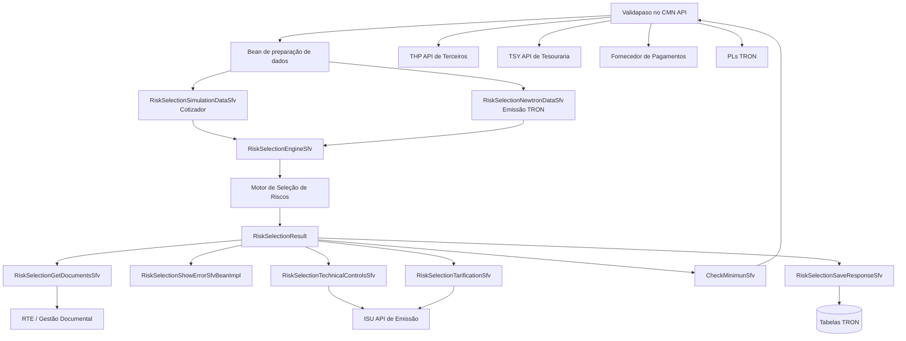
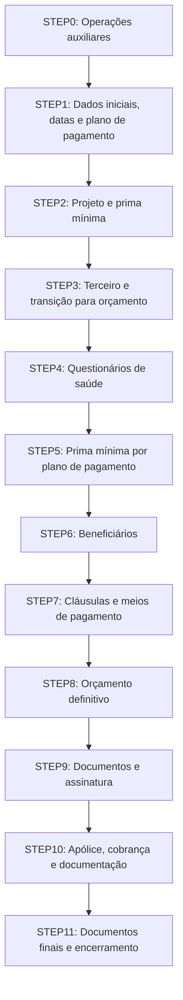
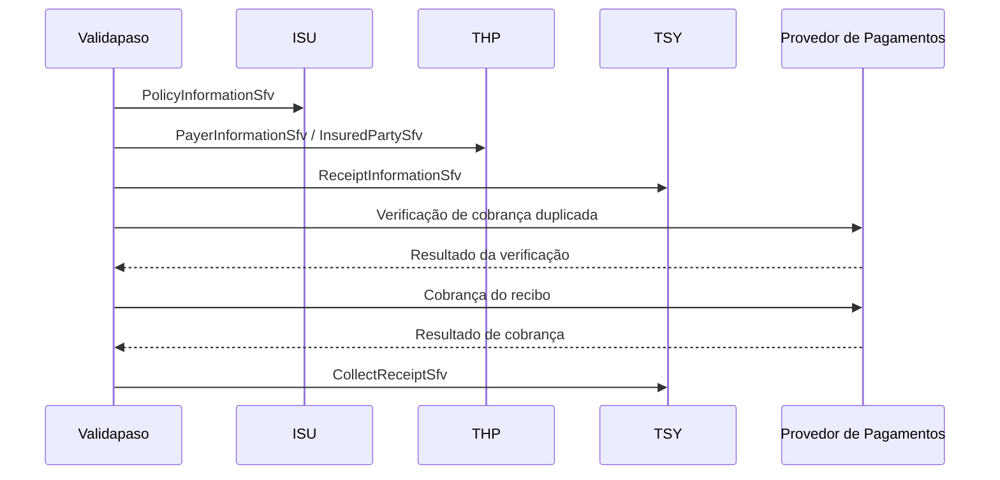

# Serviço de Mantenimiento TRON para MAPFRE — Validapaso VIDA: Arquitetura, Beans Java e Fluxos Operacionais

## 1. Metadados do Documento
- **Arquivo de Origem:** `Servicio de Mantenimiento TRON para MAPFRE — Validapaso VIDA`
- **Tipo de Documento:** Especificação Técnica / Manual Operacional
- **Domínio / Sistema:** MAPFRE VIDA, TRON / NEWTRON, Validapaso, seleção de riscos, emissão, cotização, orçamento, apólices e cobrança
- **Público-Alvo:** Desenvolvedores Java e PL, arquitetos de solução, suporte operacional, equipes TRON, terceiros, tesouraria e gestão documental
- **Data/Versão Identificada:** `27/02/2025`, versão `1.0`, estado `Versión inicial`

---

## 2. Resumo Executivo & Contexto de Negócio

O documento descreve os beans Java e as configurações de **Validapaso** desenvolvidos especificamente para o projeto **VIDA** no contexto do serviço de manutenção TRON para MAPFRE. O Validapaso é executado dentro do **CMN API de TRON** e orquestra validações, chamadas a APIs corporativas, cálculo de tarifas, seleção de riscos, geração documental, assinatura digital, criação de orçamento e emissão de apólices.

A solução integra o motor de **seleção de riscos** com os domínios operacionais do TRON. Os resultados de risco podem produzir ações de documentação, rejeição, tarifação, prima mínima e auditoria/controles técnicos. Os beans transformam essas ações em dados de processo, erros HTTP, controles técnicos persistidos, documentos exigidos, parâmetros de retarificação ou validações de negócio.

O fluxo de emissão percorre etapas identificadas como `STEP0` a `STEP11`. Durante essas etapas, o processo passa por cotização, validação de datas e plano de pagamento, obtenção de dados de terceiros, geração de projeto, criação de orçamento, questionários de saúde, meios de pagamento, assinatura digital, criação de apólice, cobrança do primeiro recibo e encerramento do processo.

A arquitetura também cobre cobrança recorrente. Uma tarefa programada do TRON consulta recibos pendentes, invoca o Validapaso por recibo, chama o fornecedor de pagamentos com prevenção de cobrança duplicada e devolve o resultado para que o TRON realize a baixa do recibo quando aplicável.

O documento detalha configurações, entradas, saídas, dependências e endpoints. Entretanto, vários contratos HTTP, corpos completos de requisição/resposta, valores efetivos de configuração e esquemas físicos das tabelas não são documentados. Esses itens não devem ser inferidos sem consultar as implementações ou configurações efetivas do ambiente.

---

## 3. Arquitetura, Componentes & Tecnologias Envolvidas

### 3.1 Componentes identificados

| Componente | Papel no processo | Integrações citadas |
| :--- | :--- | :--- |
| Validapaso | Orquestra fluxos de validação, PLs e beans Java por etapa de emissão. | CMN API, beans Java, PLs TRON |
| CMN API | Ambiente no qual o Validapaso é executado. | APIs externas configuradas no `zeroConfig` |
| Motor de seleção de riscos | Avalia dados da cotização/orçamento/emissão e devolve regras e ações. | `RiskSelectionEngineSfv` |
| TRON / NEWTRON | Sistema de emissão, cotização, orçamento, apólice, terceiros, dados de trabalho e configurações. | ISU, THP, TSY, tabelas TRON, PLs |
| ISU API | API de emissão. | Cotizações, orçamentos, apólices, formulários, controles técnicos, parâmetros |
| THP API | API de terceiros. | Pessoas, assegurados, agentes, comissões e meios de pagamento |
| TSY API | API de tesouraria. | Recibos pendentes e baixa de cobrança |
| RTE / API de informes | Gestão documental, criação de documentos e assinatura digital. | Documentos, conteúdo, quotation, files, digitalSignature |
| DNIC | Sistema consultado por chamada HTTP genérica para validação/complemento de documentação. | `GeneralRestCallSfv` |
| Provedor de pagamentos | Realiza validação contra duplicidade, cobrança zero e cobrança de recibos. | `GeneralSoapCallSfv` |
| PLs TRON | Implementam cálculos e validações de produto. | `ev_k_400_*`, `op_cmn_sfv_vld.f_vld_aux` |
| BBDD TRON | Fonte de configurações, questionários, documentos e cláusulas. | `DF_CMN_NWT_XX_VRB_CNC`, `A2300205`, `A2300200`, `A9990011`, `P2300205`, `C2000000` |

### 3.2 Configuração de integração no CMN API

| Parâmetro | Descrição / Função | Tipo / Valores / Formato | Ambiente / Observações |
| :--- | :--- | :--- | :--- |
| `app.env.risksel.basePath` | URL base do serviço de seleção de riscos. | URL | Não detalhada |
| `app.env.psypd.timeout` | Timeout de acesso ao serviço de seleção de riscos. | Timeout | Não detalhado |
| `app.env.psypd.clientId` | Client ID para token OAuth de seleção de riscos. | Credencial | Valor não documentado |
| `app.env.psypd.clientSecret` | Client Secret para token OAuth de seleção de riscos. | Segredo | Valor não documentado |
| `app.env.psypd.scope` | Scope para token OAuth. | Texto | Não detalhado |
| `app.env.psypd.tokenPath` | URL de geração do token OAuth. | URL | Não detalhada |
| `app.env.tron.api.thp.basePath` | URL base da API de terceiros. | URL | THP |
| `app.env.tron.api.thp.userName` | Usuário da API de terceiros. | Credencial | Valor não documentado |
| `app.env.tron.api.thp.password` | Senha da API de terceiros. | Segredo | Valor não documentado |
| `app.env.tron.api.isu.basePath` | URL base da API de emissão. | URL | ISU |
| `app.env.tron.api.isu.userName` | Usuário da API de emissão. | Credencial | Valor não documentado |
| `app.env.tron.api.isu.password` | Senha da API de emissão. | Segredo | Valor não documentado |
| `app.env.tron.api.tsy.basePath` | URL base da API de tesouraria. | URL | TSY |
| `app.env.tron.api.tsy.userName` | Usuário da API de tesouraria. | Credencial | Valor não documentado |
| `app.env.tron.api.tsy.password` | Senha da API de tesouraria. | Segredo | Valor não documentado |
| `app.env.report.endpoint` | URL base da API de informes. | URL | RTE |

### 3.3 Fluxo arquitetural de alto nível



### 3.4 Fluxo macro de emissão pelo cotizador



---

## 4. Regras de Negócio, Especificações Funcionais & Processos

### 4.1 Processamento da seleção de riscos

#### `RiskSelectionEngineSfv`

O bean `RiskSelectionEngineSfv` invoca o ativo de seleção de riscos por meio do cliente configurado. A entrada é preparada previamente por:

- `RiskSelectionNewtronDataSfv`, para emissão originada no TRON.
- `RiskSelectionSimulationDataSfv`, para emissão pelo frontal de cotização.

O resultado completo é armazenado na memória como `RiskSelectionResult`, do tipo `RiskSelectionResponse`.

| Elemento | Regra |
| :--- | :--- |
| Entrada em memória | `RiskSelectionData`, tipo `RiskSelectionRequest` |
| Configuração `log` | Quando `log=S`, a requisição enviada ao motor de seleção de riscos é apresentada na saída para depuração. |
| Configuração `saveError` | Quando `saveError=S`, falhas na chamada não geram erro do Validapaso; a exceção é mantida na memória como `RiskSelectionError`. |
| Saída `APPLIED_RULES` | Contém regras cumpridas e ações associadas devolvidas pela seleção de riscos. |
| Saída `FINAL_RESULT` | Contém o resumo devolvido pelo serviço de seleção de riscos. |
| Saída `REQUEST` | Exibida quando `log=S`; representa a informação enviada ao motor. |

### 4.2 Regras documentais de seleção de riscos

#### `RiskSelectionGetDocumentsSfv`

O bean processa ações de documentação devolvidas pela seleção de riscos. Uma ação documental possui `type="Documentacion"`, `vbrNam` como lista documental e `cncVal` como identificador do documento configurado no TRON.

```json
{
  "type": "Documentacion",
  "vbrNam": "PCT_DOC_ESTATICA_9_4",
  "cncVal": "00013"
}
```

| Regra | Comportamento |
| :--- | :--- |
| Identificação de documentos processáveis | Consulta `DF_CMN_NWT_XX_VRB_CNC` com base em `NOMBRE_LISTA`, usando busca por `like`. |
| Caracterização documental | Obtida da mesma tabela por `NOMBRE_LISTA_MAPA`. |
| `TIP_FIRMA=T` | Recupera documentos tanto de assinatura digital como presencial; a saída é separada em `TIP_FIRMA_P` e `TIP_FIRMA_D`. |
| `TIP_FIRMA=P` | Recupera somente documentos de assinatura presencial. |
| `TIP_FIRMA=D` | Recupera somente documentos de assinatura digital. |
| `MOSTRAR_FIRMA=S` | Consulta documentos associados ao orçamento via RTE para verificar marcas de assinatura. |
| `sgtVal` com sufixo `.par` | Indica assinatura digital; a última entrada na tabela de assinatura digital deve possuir `sgtSts/sgtSst` configurado como válido. |
| `sgtVal` sem sufixo `.par` | O documento é tratado como assinado quando `sgtVal` está informado. |
| Saída de assinatura | O documento é considerado assinado quando `sgtVal` está preenchido; o valor devolvido é o valor de gestão documental, por exemplo `xxx.par` para assinatura digital ou `S` para presencial. |

Endpoint citado:

| Serviço | API | URL | Finalidade |
| :--- | :--- | :--- | :--- |
| `quotation` | RTE | `/report_be-web/api/reports/quotation/{presupuesto}` | Recuperar documentos associados a orçamento. |

### 4.3 Rejeições

#### `RiskSelectionShowErrorSfvBeanImpl`

Transforma regras devolvidas pelo motor com tipo configurado como rejeição em erros do Validapaso. Esses erros geram resposta HTTP `400`.

```json
{
  "type": "Rechazo",
  "message": "No es residente fiscal",
  "jumpLevel": 6,
  "value": 4016
}
```

| Configuração | Regra |
| :--- | :--- |
| `REJECTION` | Tipo de ação retornado pela seleção de riscos que indica rejeição. |

### 4.4 Retarificação

#### `RiskSelectionTarificationSfv`

Processa ações de tipo `Tarifa` retornadas pelo motor de seleção de riscos e calcula parâmetros de retarificação.

```json
{
  "coverage": 4085,
  "data": "PCT_AGRAV_MORTA_OT_INI_4085",
  "stype": "O",
  "type": "Tarifa",
  "value": 50.0
}
```

| Campo da ação | Significado |
| :--- | :--- |
| `coverage` | Cobertura associada à regra. |
| `data` | Nome do parâmetro de tarifação. |
| `stype` | Tipo da regra de tarifação; regras do mesmo tipo possuem limitações conjuntas. |
| `type` | `Tarifa` identifica ação de tarifação. |
| `value` | Valor de prima/agravamento produzido pela regra. |
| `excStype` | Tipo de regra cuja presença pode excluir a ação. |
| `max=true` | Indica que o valor não deve ser somado; deve prevalecer o maior valor. |

#### Algoritmo de cálculo

1. A retarificação é executada quando `RETARIF<>N` e há regras de tarifação, ou quando `FORC_RETARIF=S`, mesmo sem regras retornadas.
2. Caso os dados completos de simulação não estejam na memória em `outSimulationComplete_<número da cotização>`, o bean chama `simulationComplete`.
3. O bean filtra ações do tipo configurado em `TARIFICATION`.
4. Para cada parâmetro, mantém `<parametro>_S` com os `stype` aplicados.
5. Uma ação com `excStype` é excluída se o valor de `excStype` estiver presente no parâmetro `<parametro>_S`.
6. Valores resultantes são acumulados no parâmetro `<parametro>_<passo>`.
7. Para ações com `max=true`, o maior valor temporário do passo é armazenado em `<parametro>_<passo>_MAX_ACUM`.
8. O valor máximo temporário é agregado ao valor do passo e o parâmetro temporário é removido.
9. Parâmetros existentes na simulação original, mas não recalculados no passo atual, recebem `0`; isso remove impactos de tarifações prévias no mesmo passo.
10. Os valores de todos os passos são acumulados no parâmetro final sem sufixo de passo.
11. Limites configurados em `LIMIT_PARAMS` são aplicados.
12. Quando aplicável, o bean persiste/atualiza parâmetros, obtém sua ordenação e chama a simulação para recalcular a cotização.

Exemplo documentado: se existirem valores de passo `0`, `10`, `0` e `50` para os passos 1 a 4, o valor final será `60`. Se `LIMIT_PARAMS` limitar o parâmetro a `50`, o valor final será `50`.

| Configuração | Descrição |
| :--- | :--- |
| `COD_RAMO` | Ramo da cotização. |
| `TARIFICATION` | Tipo de ação devolvida que indica retarificação. |
| `TABLA` | Indicador da tabela `C2000000` usado para informação de retarificação. |
| `TAREA` | Código da tarefa de retarificação no TRON. |
| `RETARIF` | Define se a API de simulação deve ser chamada: `S` ou `N`. Na emissão pelo TRON, os cálculos são realizados, mas a simulação não deve ser chamada. |
| `FORC_RETARIF` | Força retarificação: `S` ou `N`. |
| `TARIF_PARAMS` | Lista de prefixos de parâmetros considerados na retarificação. |
| `LIMIT_PARAMS` | Mapa de limites por parâmetro. |

### 4.5 Controles técnicos

#### `RiskSelectionTechnicalControlsSfv`

O bean converte ações de auditoria/controle técnico em controles persistidos no orçamento TRON.

```json
{
  "jumpLevel": 6,
  "type": "Auditoria",
  "message": "[402102410] Actividad de la empresa EJERCITO",
  "value": 4021
}
```

| Regra | Comportamento |
| :--- | :--- |
| Tipos processáveis | Ações cujo `type` pertence à configuração `TCTYPES`. |
| Controle bloqueante | O primeiro valor de `TCTYPES` identifica o tipo cuja ocorrência torna o controle bloqueante. |
| Agrupamento | Ações com mesmo código de controle técnico geram um único controle; as mensagens são acumuladas. |
| Exclusão | Controles presentes em `TCBORRAR` são removidos da estrutura recuperada. |
| Bloqueio | Se existir controle bloqueante, o orçamento é marcado como bloqueado por `PRV_MVM=S`. |
| Persistência | Recupera o orçamento por `quotationInformation`, atualiza controles e persiste por `previousToReal`. |

### 4.6 Prima mínima

#### `CheckMinimunSfv`

O bean processa ações de seleção de riscos do tipo `Prima minima`.

| Configuração `action` | Regras usadas | Resultado |
| :--- | :--- | :--- |
| `A` | Tipo 2: contém `codFracPago` e `modulo`. | Produz prima mínima por módulo para o tipo de pagamento escolhido. Usada no passo 2. |
| `V` | Tipo 1: contém `codFracPago`. | Converte o resultado em ação de rejeição se o tipo de pagamento selecionado coincidir com a ação. |
| `R` | Tipo 2. | Produz prima mínima por módulo e por tipo de pagamento; usada pelo RTE para apresentar informação no PDF de projeto. |
| `L` | Tipo 1. | Produz prima mínima por tipo de pagamento; usada no passo 5. |

Estruturas de saída documentadas:

```json
{
  "PRIMA_UNICA": {
    "<modulo>": "<message>"
  }
}
```

```json
{
  "PRIMA_UNICA": {
    "<modulo>": {
      "<codFracPago>": "<message>"
    }
  }
}
```

```json
{
  "PRIMA_UNICA": {
    "<codFracPago>": "<message>"
  }
}
```

### 4.7 Documentos e assinatura

| Bean | Função principal | Regras relevantes |
| :--- | :--- | :--- |
| `CheckDocumentsSfv` | Valida documentos obrigatórios assinados. | Para assinatura presencial, verifica listas `NOMBRE_LISTA_OBL`. Para digital, verifica listas `NOMBRE_LISTA_FIRMAR`, sufixo `.par` e estados válidos. |
| `RetrieveDocumentsSfv` | Recupera documentos de orçamento/apólice e conteúdo em Base64. | Prioriza `NUM_POLIZA` sobre `NUM_PRESUPUESTO`; filtra dinâmicos por `A_DESCARGAR`; entradas com `@` representam `dcnVal\|grpVal`. |
| `PlySmnDocQrySfv` | Consulta documentos configurados em TRON. | Busca exata ou por prefixo conforme `like`. |
| `GenerateDocumentSfv` | Solicita criação de documentos dinâmicos. | Para vários identificadores, chamadas RTE são feitas em paralelo e aguardadas antes de continuar. |
| `DigitalSignDocumentsSfv` | Inicia assinatura digital de documentos pendentes. | Determina signatários com base em `FIRMANTES`; consolida pessoas idênticas em uma única solicitação. |

#### Regras de `DigitalSignDocumentsSfv`

- Figuras permitidas de assinatura:
  - `RL`: representante legal.
  - `A`: assegurado.
  - `C`: contador.
  - `T`: tomador.
- Quando representante legal ou assegurado não existe separadamente, o tomador é utilizado.
- O contador é obtido do formulário definido por `FORMULARIO_C`.
- Documentos já assinados digitalmente com assinatura válida não são reenviados.
- Pessoas com mesmo tipo de documento, documento, telefone e e-mail são consolidadas em uma única solicitação de assinatura.
- `PREFIJO`, quando informado e ausente do telefone, é concatenado no início do número.
- `additionalEmail` está marcado como **EN DESUSO** na API.

### 4.8 Terceiros e meios de pagamento

#### `InsuredPartySfv`

Recupera dados de terceiros usando documento e, opcionalmente, atividade.

| Condição | Comportamento |
| :--- | :--- |
| `ACTIVIDAD` ausente ou igual a `1` | Consulta `insuredpartyv1`. |
| `ACTIVIDAD` informada | Consulta `insuredpartyv1` para dados básicos e, depois, `thirdPartyByActivity` para a atividade recebida. |
| Endereço residencial/correspondência | Seleciona endereço de tipo adequado, não desabilitado e marcado como padrão. Caso inexistente, usa o primeiro não desabilitado. |
| Telefone/e-mail | Seleciona contato do tipo correspondente, não desabilitado e padrão; na ausência, usa o primeiro não desabilitado. |
| `skipError` | Permite continuar sem erro do Validapaso em caso de falha da API. |
| `dataOutput` | Solicita geração dos dados completos na saída. |

#### `ProcessInsuredPartySfv`

Cria ou atualiza terceiro e cadastra um meio de pagamento de tipo cartão `TA`.

| Regra | Comportamento |
| :--- | :--- |
| Terceiro existente | Dados pessoais, endereço e contatos não são alterados; somente o novo meio de pagamento é adicionado. |
| Terceiro inexistente | Terceiro é criado com endereço recebido como padrão e telefone/e-mail como contatos padrão. |
| `acnOrgVal` e `btcMvmTypVal` | Valor `1` para alta e `2` para modificação. |
| Estruturas internas | Dados pessoais, meio de pagamento, endereço e contatos são marcados como alta com `acnOrgVal=1`. |
| Meio `TA` | Recebe token inicial, tipo `CREDIT` ou `DEBIT` e demais propriedades definidas por configuração. |
| Verificação prévia | O meio é buscado por tipo, subtipo, chave e valor antes de ser incluído. |
| Sequencial `pcmSqnVal` | Caso o meio não exista, recebe o maior sequencial existente mais `1`; para novo terceiro, recebe `1`. |
| Valores por configuração | Um valor como `TA.tknVal=${TOKEN}` é extraído da entrada do processo. |
| Persistência | Chama `processInsuredPartyComplete` do THP. |

### 4.9 Apólice, orçamento, recibos e cobrança

| Bean | Função |
| :--- | :--- |
| `CreatePolicySfv` | Cria orçamento, apólice ou ambos a partir de orçamento de origem. |
| `SaveNewTarificationSfv` | Transfere dados econômicos da simulação para o orçamento. |
| `PolicyInformationSfv` | Recupera a apólice e bloqueia fluxo caso esteja cancelada. |
| `PayerInformationSfv` | Obtém pagador, ou beneficiário como pagador padrão, e sequencial do meio de pagamento. |
| `ReceiptInformationSfv` | Recupera lista de recibos pendentes e devolve informação do primeiro recibo. |
| `ToPaymentPlatformTokenSfv` | Extrai token, número de parcelas e tipo de cartão dos meios de pagamento. |
| `ToPaymentPlatformSfv` | Prepara dados de recibo, pagador e cartão para o provedor de pagamentos. |
| `CollectReceiptSfv` | Marca recibo como cobrado na tesouraria. |

#### Criação de orçamento e apólice

| Cenário | Etapas |
| :--- | :--- |
| Orçamento | Recupera orçamento original, consulta comissão pelo agente, consulta dados do agente, preenche pessoas `O`, `A` e `E`, e chama `quotationQuotation2` com marca de movimento `8`. |
| Apólice | Recupera o orçamento original e chama `policyQuotation2` com marca de movimento `3`. |
| Orçamento + apólice | Executa as duas etapas em sequência. |
| Entrada `POLIZA` | Gera somente apólice. |
| Entrada `PRESUPUESTO` | Gera somente orçamento. |
| Sem `POLIZA` e sem `PRESUPUESTO` | Gera orçamento e apólice. |

#### Cobrança do primeiro recibo

O passo `STEP10/COBRO` só é executado quando a apólice não estiver retida por controle técnico, isto é, quando `PRV_MVM=N`.



### 4.10 Estados, limitações e itens em desuso

| Item | Estado / Limitação |
| :--- | :--- |
| `UpdateProcessStatusSfv` | Criado porque o Validapaso não permite misturar chamadas PL e Java na ordem necessária: executa PLs antes de Java. |
| `RiskSelectionSimulationCTSfvBeanImpl` | Controles técnicos não se aplicam conceitualmente a cotizações; são persistidos em `C2000000` para uso posterior. |
| `SimulatePaymentPlatformSfv` | **EN DESUSO**; não chegou a ser utilizado devido à disponibilidade do provedor do Uruguai. |
| Validação de dados em `STEP1` | **EN DESUSO**. |
| Validação de questionários em `STEP4` | **EN DESUSO**. |
| `RiskSelectionResult` em `UpdateProcessStatusSfv` | **EN DESUSO**. |
| `DOCS` em `UpdateProcessStatusSfv` | Tratamento de documentos pendentes está marcado como **EN DESUSO**. |
| `CreatePolicySfv` em `STEP9` | Mantido por compatibilidade, mas não é executado devido a condicionamento. |
| Beans adicionais em `STEP10` | Mantidos por compatibilidade, mas não são executados devido a condicionamento. |

---

## 5. Tabelas de Parâmetros, Ambientes e Estruturas de Dados

### 5.1 APIs e endpoints identificados

| Serviço | API | URL documentada | Função |
| :--- | :--- | :--- | :--- |
| `quotation` | RTE | `/report_be-web/api/reports/quotation/{presupuesto}` | Documentos associados a orçamento. |
| `documentContent` | RTE | `/report_be-web/api/reports/1.0/document/` | Conteúdo de documento. |
| `documentsByPolicy` | RTE | `/report_be-web/api/reports/1.0/policy/` | Documentos associados a orçamento, conforme descrição documental. |
| `documentsByQuotation` | RTE | `/report_be-web/api/reports/1.0/quotation/` | Documentos associados a apólice, conforme descrição documental. |
| `files` | RTE | `/report_be-web/api/notification/files` | Solicitar criação de documento. |
| `digitalSignature` | RTE | `/report_be-web/api/signature/bus/incoming/digitalSignature` | Iniciar processo de assinatura digital. |
| `addSimulationParameters` | ISU | `/nwt_isu_api_be-web/newtron/api/issue/business_line/{ramo}/simulation/{cotización}/parameteres` | Salvar dados de cotização em `C2000000`. |
| `simulationV1` | ISU | `/nwt_isu_api_be-web/newtron/api/issue/business_line/{ramo}/simulationV1` | Recalcular retarificação. |
| `attributesDefinitionParameterTask` | ISU | `/nwt_isu_api_be-web/newtron/api/issue/attributesDefinition/parameterTask` | Obter ordem dos parâmetros. |
| `quotationInformation` | ISU | `/nwt_isu_api_be-web/newtron/api/issue/business_line/quotation/{presupuesto}/query` | Consultar orçamento. |
| `previousToReal` | ISU | `/nwt_isu_api_be-web/newtron/api/issue/business_line/policy/previousToReal` | Persistir dados de orçamento. |
| `commissionChartByAgn` | THP | `/nwt_thp_api_be-web/newtron/api/thirdparty/commissionCharts` | Consultar comissão do agente. |
| `agent` | THP | `/nwt_thp_api_be-web/newtron/api/thirdparty/agent/{agente}` | Consultar informações do agente. |
| `quotationQuotation2` | ISU | `/nwt_isu_api_be-web/newtron/api/issue/business_line/2.0/quotation/issue/quotation` | Criar orçamento a partir de orçamento. |
| `policyQuotation2` | ISU | `/nwt_isu_api_be-web/newtron/api/issue/business_line/2.0/policy/issue/quotation` | Criar apólice a partir de orçamento. |
| `receiptCollect` | TSY | `/nwt_tsy_api_be-web/newtron/api/treasury/receipt/{recibo}/collect` | Marcar recibo como cobrado. |
| `simulationComplete` | ISU | `/nwt_isu_api_be-web/newtron/api/issue/business_line/{ramo}/simulation/{cotización}/complete` | Consultar dados completos de cotização. |
| `receiptByPlyv1API` | TSY | `/nwt_isu_api_be-web/newtron/api/treasury/receipt/1.0/querybyply` | Consultar recibos pendentes. |
| `formularyQuotation` | ISU | `/nwt_isu_api_be-web/newtron/api/issue/business_line/quotation/issue/formulary/query` | Consultar ou salvar respostas de questionário. |
| `policyInformation` | ISU | `/nwt_isu_api_be-web/newtron/api/issue/business_line/policy/{póliza}/query` | Consultar apólice. |
| `policyOperative` | ISU | `/nwt_isu_api_be-web/newtron/api/issue/business_line/policy/{póliza}/queryOperativeData` | Consultar dados operacionais/cancelamento. |
| `personByDocument` | THP | `/nwt_thp_api_be-web/newtron/api/thirdparty/person/queryByDocument` | Consultar dados básicos do terceiro. |
| `insuredpartyv1` | THP | `/nwt_thp_api_be-web/newtron/api/thirdparty/insuredpartyV1` | Consultar dados de terceiro assegurado. |
| `thirdPartyByActivity` | THP | `/nwt_thp_api_be-web/newtron/api/thirdparty/ThirdPartybyActivity` | Consultar terceiro por atividade. |
| `processInsuredPartyComplete` | THP | `/nwt_thp_api_be-web/newtron/api/thirdparty/insuredparty/process/` | Criar/modificar terceiro. |
| `workingInformation` | ISU | `/nwt_isu_api_be-web/newtron/api/issue/business_line/working/{póliza}/query` | Consultar emissão TRON nas tabelas de trabalho. |

> **Nota de análise:** os endpoints foram preservados conforme extraídos. Há inconsistências textuais na descrição de `documentsByPolicy` e `documentsByQuotation`, assim como variações na escrita de `parameteres`; o documento não esclarece se são erros de transcrição ou contratos efetivos.

### 5.2 Beans Java

| Bean | Função resumida | Principais dependências |
| :--- | :--- | :--- |
| `RiskSelectionEngineSfv` | Invoca seleção de riscos. | Preparadores de dados de simulação ou TRON |
| `RiskSelectionGetDocumentsSfv` | Processa documentos exigidos pelo motor de risco. | `RiskSelectionEngineSfv`, RTE |
| `RiskSelectionSaveResponseSfv` | Salva resultado de risco para PLs de emissão TRON. | Motor de risco, retarificação |
| `RiskSelectionShowErrorSfvBeanImpl` | Converte rejeições em erro HTTP 400. | Motor de risco |
| `RiskSelectionSimulationCTSfvBeanImpl` | Persiste controles técnicos em cotização. | Motor de risco, ISU |
| `RiskSelectionTarificationSfv` | Calcula e opcionalmente executa retarificação. | Motor de risco, ISU |
| `RiskSelectionTechnicalControlsSfv` | Gera/persiste controles técnicos em orçamento. | Motor de risco, ISU |
| `CheckDocumentsSfv` | Valida assinaturas exigidas. | Motor de risco, documentos processados |
| `CheckMinimunSfv` | Processa regras de prima mínima. | Motor de risco |
| `ClausulasSfv` | Recupera cláusulas da tabela `A9990011`. | BBDD TRON |
| `CollectReceiptSfv` | Marca recibo como cobrado. | TSY |
| `CreatePolicySfv` | Cria orçamento e/ou apólice. | ISU, THP |
| `UpdateProcessStatusSfv` | Invoca PL de atualização do processo. | PL TRON |
| `ToPaymentPlatformTokenSfv` | Extrai token e dados de cartão. | Dados de meio de pagamento |
| `ToPaymentPlatformSfv` | Prepara dados de cobrança. | Dados de recibo e pagador |
| `SimulatePaymentPlatformSfv` | Simulação de cobrança. | Em desuso |
| `RetrieveDocumentsSfv` | Recupera documentos e conteúdo Base64. | RTE |
| `SaveNewTarificationSfv` | Transfere dados econômicos de simulação para orçamento. | ISU |
| `ReceiptInformationSfv` | Recupera primeiro recibo pendente. | TSY |
| `QuestionnariesStatusSfv` | Consulta e atualiza estado de questionários. | BBDD TRON, PL, ISU |
| `PreQuestionnariesCalcImcSfv` | Calcula IMC e médias de pressão. | PLs, ISU |
| `PolicyInformationSfv` | Consulta apólice, cancelamento e plano de pagamento. | ISU |
| `PlySmnDocQrySfv` | Consulta listas documentais configuradas. | `DF_CMN_NWT_XX_VRB_CNC` |
| `PlyQtnCTSInformationSfv` | Extrai controles técnicos de apólice/orçamento. | ISU |
| `PaymentMethodsSfv` | Recupera meios de pagamento por plano ou meio anterior. | `DF_CMN_NWT_XX_VRB_CNC` |
| `PayerInformationSfv` | Obtém pagador e sequencial de meio de pagamento. | Dados de apólice |
| `GenerateDocumentSfv` | Solicita documentos dinâmicos. | RTE |
| `InsuredPartySfv` | Consulta terceiro. | THP |
| `ProcessInsuredPartySfv` | Cria/altera terceiro e cadastra cartão. | THP |
| `DigitalSignDocumentsSfv` | Solicita assinatura digital. | RTE, dados de risco |
| `RiskSelectionSimulationDataSfv` | Monta requisição de risco para cotizador. | ISU, THP |
| `RiskSelectionNewtronDataSfv` | Monta requisição de risco para emissão TRON. | ISU, THP |

### 5.3 Fluxos Validapaso por etapa

| Etapa | Operação | Executáveis principais |
| :--- | :--- | :--- |
| `STEP0` | CTS | `PlyQtnCTSInformationSfv` |
| `STEP0` | Descartar cotização | `UpdateProcessStatusSfv`, `TIP_MVTO_BATCH=7` |
| `STEP0` | Descartar orçamento | `UpdateProcessStatusSfv`, `TIP_MVTO_BATCH=8` |
| `STEP0` | Descarregar documentos | `RetrieveDocumentsSfv` |
| `STEP0` | Emissão no TRON | Preparação de dados TRON, seleção de riscos, tarifação com `RETARIF=N`, persistência da resposta |
| `STEP1` | Cálculo de datas | PLs de vencimento, idade atuarial e data de fim |
| `STEP1` | Validar plano de pagamento | `ev_k_400_atr.p_v_cod_fracc_pago` |
| `STEP1` | Recuperar dados do terceiro | PL, DNIC, `InsuredPartySfv` |
| `STEP1` | Sair e guardar | `UpdateProcessStatusSfv` |
| `STEP1` | Fim de tela | Validação tomador/assegurado, risco, controles técnicos, tarifação e atualização de estado |
| `STEP2` | Gerar projeto | Valida e-mail/telefone e atualiza estado |
| `STEP2` | Prima mínima | Risco + `CheckMinimunSfv`, `action=A` |
| `STEP2` | Prima mínima RPT | Risco + `CheckMinimunSfv`, `action=R` |
| `STEP2` | Listagem de documentos | `PlySmnDocQrySfv` |
| `STEP2` | Fim de tela | Risco, controles técnicos, tarifação e atualização de estado |
| `STEP3` | Dados do terceiro | DNIC + `InsuredPartySfv` |
| `STEP3` | Sair e guardar | `UpdateProcessStatusSfv` |
| `STEP3` | Fim de tela | Estado de orçamento inicial, valida idade, risco, controles, tarifação, prima mínima por rejeição |
| `STEP4` | Cálculo de questionário de saúde | PLs para IMC e médias de pressão |
| `STEP4` | Questionários | `QuestionnariesStatusSfv` |
| `STEP4` | Fim de tela | Cálculo prévio, risco, controles, tarifação e atualização de estado |
| `STEP5` | Prima mínima | Risco + `CheckMinimunSfv`, `action=L` |
| `STEP5` | Fim de tela | Risco, controles técnicos e atualização de estado |
| `STEP6` | Dados do terceiro | `InsuredPartySfv` |
| `STEP6` | Fim de tela | Validação de beneficiários, risco, controles e atualização |
| `STEP7` | Cláusulas | `ClausulasSfv` |
| `STEP7` | Meios de pagamento | `PaymentMethodsSfv` |
| `STEP7` | Dados do terceiro | DNIC + `InsuredPartySfv` |
| `STEP7` | Guardar cartão | Token, validação duplicidade, cobrança zero, consulta/criação de terceiro |
| `STEP7` | Fim de tela | Atualização de estado |
| `STEP8` | Geração de orçamento | `CreatePolicySfv`, `PRESUPUESTO=true` |
| `STEP8` | Fim de tela | Gera documentos, processa risco, controles e atualização |
| `STEP9` | Documentos dinâmicos | Preparação de risco, risco, processamento documental |
| `STEP9` | Listagem de documentos | `PlySmnDocQrySfv` |
| `STEP9` | Assinatura digital | Preparação com `SIGN_DATA=S`, risco, documentos, assinatura digital |
| `STEP9` | Fim de tela | Risco, documentos, validação de assinaturas e atualização |
| `STEP10` | Criar apólice | `CreatePolicySfv`, `POLIZA=true`, atualização |
| `STEP10` | Cobro do primeiro recibo | Apólice, pagador, recibo, provedor de pagamentos, `CollectReceiptSfv` |
| `STEP10` | Gerar documentação | `GenerateDocumentSfv` |
| `STEP11` | Listagem de documentos | `PlySmnDocQrySfv` |
| `STEP11` | Fim de tela | `UpdateProcessStatusSfv` |
| `RECURRING_COLLECTION` | Cobrança recorrente | Preparação, apólice, pagador, recibo, provedor e retorno para tarefa TRON |

---

## 6. Bateria de Perguntas & Respostas para RAG (FAQ Sintético)

### P1: Como o Validapaso prepara a requisição para o motor de seleção de riscos?
**R:** O Validapaso usa `RiskSelectionSimulationDataSfv` quando a emissão vem do cotizador e `RiskSelectionNewtronDataSfv` quando a emissão é originada no TRON. Os beans montam `RiskSelectionData`, do tipo `RiskSelectionRequest`, que é consumido pelo `RiskSelectionEngineSfv`.

### P2: Quando o bean `RiskSelectionTarificationSfv` chama a API de simulação?
**R:** O bean chama a API de simulação quando a configuração `RETARIF` é diferente de `N` e existem ações de tipo tarifação, ou quando `FORC_RETARIF=S`. Na emissão TRON, `RETARIF=N` permite calcular os parâmetros de tarifação sem chamar a API de simulação.

### P3: Como uma ação de tarifação é excluída durante a retarificação?
**R:** Uma ação é excluída quando possui `excStype` e esse tipo está presente no parâmetro `<parametro>_S` associado. O parâmetro `_S` acumula os valores `stype` das regras aplicadas ao parâmetro.

### P4: Como o processo identifica documentos de assinatura digital válidos?
**R:** Para assinatura digital, o documento deve possuir `sgtVal` terminando em `.par` e a última entrada associada ao documento na tabela de assinatura digital deve possuir combinação válida de estado/subestado `sgtSts/sgtSst`, conforme `ESTADOS_VALIDOS_FIRMA`.

### P5: O que ocorre se a seleção de riscos devolver uma regra de rejeição?
**R:** O `RiskSelectionShowErrorSfvBeanImpl` processa ações cujo tipo seja igual à configuração `REJECTION`, transforma essas regras em mensagens de saída do Validapaso e gera erro HTTP 400.

### P6: Como os controles técnicos bloqueiam um orçamento?
**R:** O `RiskSelectionTechnicalControlsSfv` processa os tipos configurados em `TCTYPES`. O primeiro tipo da lista identifica ações bloqueantes. Quando uma ação bloqueante é encontrada, o orçamento é marcado com `PRV_MVM=S` antes da persistência por `previousToReal`.

### P7: Quais são as opções de processamento de prima mínima?
**R:** A configuração `action` aceita `A`, `V`, `R` e `L`. `A` retorna incumprimentos por módulo; `V` transforma incumprimento em rejeição; `R` devolve módulos e tipos de pagamento para geração documental; `L` devolve incumprimentos por tipo de pagamento.

### P8: Como o sistema evita cobrança duplicada do primeiro recibo?
**R:** No fluxo `STEP10/COBRO`, o Validapaso chama primeiro o fornecedor de pagamento por `GeneralSoapCallSfv` para verificar duplicidade. `UtilsSfv` analisa a resposta e interrompe o fluxo se houver cobrança duplicada. Somente depois ocorre a chamada de cobrança e, após sucesso, `CollectReceiptSfv` marca o recibo como cobrado no TRON.

### P9: Como o `ProcessInsuredPartySfv` trata um terceiro que já existe?
**R:** Quando o terceiro já existe, o bean não altera dados pessoais, endereço ou contatos. O processo somente adiciona o novo meio de pagamento após verificar se já existe meio equivalente por tipo, subtipo, chave e valor.

### P10: Qual é a diferença entre `RiskSelectionSimulationCTSfvBeanImpl` e `RiskSelectionTechnicalControlsSfv`?
**R:** `RiskSelectionSimulationCTSfvBeanImpl` salva controles técnicos gerados durante a cotização na tabela TRON `C2000000`. `RiskSelectionTechnicalControlsSfv` trata controles para orçamento, combina-os com controles existentes, remove os configurados em `TCBORRAR`, define bloqueio por `PRV_MVM` e persiste a estrutura atualizada.

### P11: Como são definidos os signatários de um documento?
**R:** `DigitalSignDocumentsSfv` consulta o mapa `FIRMANTES`, que associa códigos de documento às figuras `RL`, `A`, `C` e `T`. Se representante legal ou assegurado não existirem como pessoas distintas, o tomador é usado. O contador é obtido no formulário definido em `FORMULARIO_C`.

### P12: O que acontece quando a apólice está cancelada?
**R:** `PolicyInformationSfv` chama `policyOperative`, verifica o campo `canPly` e gera erro se a apólice estiver cancelada. Caso não esteja cancelada, recupera a informação da apólice e devolve plano de pagamento e parcelas de cartão.

---

## 7. Glossário de Termos, Siglas & Conceitos-Chave

- **API:** Interface de programação utilizada pelos beans para integrar sistemas.
- **BBDD:** Base de dados.
- **CMN API:** API do ambiente TRON onde o Validapaso é executado.
- **CTS:** Controles técnicos.
- **DNIC:** Sistema consultado por chamada HTTP genérica para validação/complemento de dados documentais.
- **ISU:** API de emissão do TRON.
- **IMC:** Índice de Massa Corporal.
- **PL:** Procedimento lógico/programa de lógica TRON utilizado em cálculos e validações.
- **PRV_MVM:** Indicador de bloqueio do orçamento/apólice por controle técnico; `S` representa bloqueio.
- **RCP:** Recibo.
- **RTE:** API de informes/gestão documental.
- **SFV:** Sufixo presente nos beans documentados do Validapaso.
- **THP:** API de terceiros do TRON.
- **TIP_FIRMA:** Tipo de assinatura: `D` para digital, `P` para presencial e `T` para ambos.
- **TRON / NEWTRON:** Plataforma corporativa de emissão, cotização, apólices, terceiros e tesouraria.
- **TSY:** API de tesouraria.
- **Validapaso:** Ferramenta que orquestra validadores, PLs e beans Java por fluxo, passo, tela e campo.
- **`C2000000`:** Tabela TRON mencionada para persistência de dados de cotização e controles técnicos.
- **`DF_CMN_NWT_XX_VRB_CNC`:** Tabela de configuração de listas documentais e meios de pagamento.
- **`A2300205`:** Tabela TRON usada para consultar respostas de questionários.
- **`A2300200`:** Tabela TRON usada para identificar o programa validador do formulário.
- **`A9990011`:** Tabela TRON de cláusulas.
- **`P2300205`:** Tabela consultada para dados do signatário contador.

---

## 8. Notas Críticas, Riscos & Limitações

- **Segredos em configuração:** `clientSecret`, senhas de APIs e tokens são parâmetros de integração sensíveis. O documento nomeia essas propriedades, mas não fornece mecanismos de armazenamento, rotação ou mascaramento.
- **Contratos incompletos:** métodos HTTP, esquemas completos de payload, autenticação efetiva, códigos de erro e contratos JSON das APIs não estão detalhados.
- **Dependência de tabelas TRON:** regras documentais, questionários, meios de pagamento, cláusulas e parâmetros dependem diretamente de registros de banco e configurações externas.
- **Dependência de ordem de execução:** vários beans exigem execução anterior de outros beans, como `RiskSelectionGetDocumentsSfv` após `RiskSelectionEngineSfv`, ou `ToPaymentPlatformSfv` após `InsuredPartySfv` e `ReceiptInformationSfv`.
- **Processos em desuso:** existem beans e validações marcados como `EN DESUSO`; integrações novas não devem adotá-los sem validação técnica.
- **Limitação do Validapaso:** a impossibilidade de misturar invocações PL e Java na ordem necessária motivou `UpdateProcessStatusSfv`.
- **Persistência por substituição:** `previousToReal` não atualiza parcialmente; o documento informa que esse serviço apaga/insere a informação. O chamador precisa recuperar a estrutura completa antes de persistir mudanças.
- **Inconsistências documentais:** há nomenclaturas e rotas com possíveis erros tipográficos, por exemplo `parameteres`, `quotationInforMati on`, campos duplicados ou descrições aparentemente invertidas para endpoints documentais.
- **Cobrança depende de bloqueio:** a cobrança do primeiro recibo ocorre somente quando `PRV_MVM=N`; controles técnicos bloqueantes impedem essa etapa.
- **Nota de análise:** o documento lista `GeneralSoapCallSfv`, `GeneralRestCallSfv` e `UtilsSfv`, mas não detalha implementação, autenticação, endpoints externos completos ou contratos dessas chamadas.

---

## 9. Conteúdo Bruto Estruturado (Referência Fiel)

```text
--- [PÁGINA 1 DE 101] ---
Validapaso VIDA
Servicio de Mantenimiento TRON para MAPFRE

--- [PÁGINA 2 DE 101] ---
Control de documentación
Histórico de versiones
27/02/2025 | 1.0 | Versión inicial

--- [PÁGINAS 3-4 DE 101] ---
Índice do documento:
- Configuración CMN_API.
- 32 beans Java, desde RiskSelectionEngineSfv até RiskSelectionNewtronDataSfv.
- Fluxos Validapaso: PASO0 a PASO11.
- Cobro recurrente.

--- [PÁGINAS 5-66 DE 101] ---
Especificação dos beans Java:
1. RiskSelectionEngineSfv
2. RiskSelectionGetDocumentsSfv
3. RiskSelectionSaveResponseSfv
4. RiskSelectionShowErrorSfvBeanImpl
5. RiskSelectionSimulationCTSfvBeanImpl
6. RiskSelectionTarificationSfv
7. RiskSelectionTechnicalControlsSfv
8. CheckDocumentsSfv
9. CheckMinimunSfv
10. ClausulasSfv
11. CollectReceiptSfv
12. CreatePolicySfv
13. UpdateProcessStatusSfv
14. ToPaymentPlatformTokenSfv
15. ToPaymentPlatformSfv
16. SimulatePaymentPlatformSfv EN DESUSO
17. RetrieveDocumentsSfv
18. SaveNewTarificationSfv
19. ReceiptInformationSfv
20. QuestionnariesStatusSfv
21. PreQuestionnariesCalcImcSfv
22. PolicyInformationSfv
23. PlySmnDocQrySfv
24. PlyQtnCTSInformationSfv
25. PaymentMethodsSfv
26. PayerInformationSfv
27. GenerateDocumentSfv
28. InsuredPartySfv
29. ProcessInsuredPartySfv
30. DigitalSignDocumentsSfv
31. RiskSelectionSimulationDataSfv
32. RiskSelectionNewtronDataSfv

--- [PÁGINAS 67-101 DE 101] ---
Fluxos Validapaso identificados:
- PASO0: CTS, descartar cotização, descartar orçamento, download documental e emissão no TRON.
- PASO1: datas, plano de pagamento, terceiro, salvar, validações em desuso e fim de tela.
- PASO2: gerar projeto, prima mínima, prima mínima RPT, documentos e fim de tela.
- PASO3: terceiro, salvar e fim de tela.
- PASO4: cálculos de saúde, questionários, validação em desuso e fim de tela.
- PASO5: prima mínima e fim de tela.
- PASO6: terceiro e fim de tela.
- PASO7: cláusulas, meios de pagamento, terceiro, guardar cartão e fim de tela.
- PASO8: criação de orçamento e fim de tela.
- PASO9: documentos dinâmicos, listagem documental, assinatura digital e fim de tela.
- PASO10: criação de apólice, cobrança de primeiro recibo e geração documental.
- PASO11: listagem documental e encerramento.
- RECURRING_COLLECTION: cobrança recorrente invocada por tarefa programada TRON.
```

> **Referência de auditoria:** a transcrição literal integral de 101 páginas foi fornecida como conteúdo bruto de origem nesta conversa. As seções anteriores preservam os fatos técnicos extraídos, organizados para recuperação RAG, sem acrescentar valores, tecnologias, versões, endpoints ou regras não sustentadas pelo texto original.
