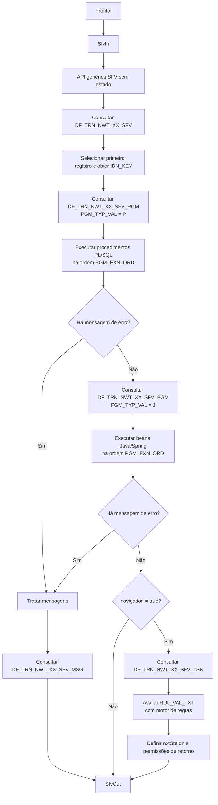

# Especificação Técnica do Fluxo Dinâmico de Validação SFV (SfvIn/SfvOut, PL/SQL, Beans Java e Regras de Navegação)

## 1. Metadados do Documento
- **Arquivo de Origem:** Não informado; conteúdo menciona anexos `SFV.xls`, `TSN.xls`, `PGM.xls` e `MSG.xls`
- **Tipo de Documento:** Especificação Técnica / Arquitetura de Software
- **Domínio / Sistema:** SFV / NEWTron / fluxos dinâmicos de validação
- **Público-Alvo:** Desenvolvedores, Arquitetos, Operação e Analistas Funcionais
- **Data/Versão Identificada:** 01/06/2023; anexos datados de 03/05/2023, 01:08 pm

---

## 2. Resumo Executivo & Contexto de Negócio

O documento especifica uma proposta de API genérica e sem estado para validação, consulta e navegação dinâmica de fluxos. A API deve ser invocada por um frontal e deve delegar comportamentos específicos a uma configuração parametrizada em base de dados, evitando que a lógica particular de cada fluxo fique fixada no código-base da API.

A seleção do fluxo é baseada na operação (`FLW_IDN`), companhia e atributos da estrutura comercial: agente, níveis de estrutura comercial, canal, setor, subsector, contrato e subcontrato. A consulta de configuração retorna um identificador único de fluxo, denominado `IDN_KEY`, que passa a ser utilizado nas etapas subsequentes de execução e depuração.

O processamento combina procedimentos PL/SQL configurados dinamicamente, beans Java/Spring e um motor de regras de navegação. Os procedimentos PL/SQL e beans são executados em ordem parametrizada; a continuidade do processamento depende da inexistência de mensagens de erro retornadas pelas execuções anteriores.

A saída da API contém dados de tela atualizados, mensagens e informações de navegação. As mensagens podem ser enriquecidas ou redefinidas por configuração de banco de dados conforme código, campo, seção, idioma, passo, companhia e `IDN_KEY`. Quando não há erro e a navegação é solicitada, regras parametrizadas são avaliadas sobre os dados da tela para determinar o próximo passo e permissões de retorno no fluxo.

A proposta preserva a funcionalidade de Brasil para validações e consultas em procedimento genérico de banco de dados. O documento também estabelece compatibilidade com NEWTron: o código `3` é reservado para mensagens de erro.

---

## 3. Arquitetura, Componentes & Tecnologias Envolvidas

### Componentes identificados

| Componente | Função descrita |
| :--- | :--- |
| Frontal | Invoca a API genérica e envia dados da tela, posição atual, filtros estruturais e indicador de navegação. |
| API genérica SFV | Processo central sem estado; seleciona fluxo, executa lógicas configuradas, trata mensagens e aplica regras de navegação. |
| `SfvIn` | Estrutura de entrada da API genérica e dos beans Java. |
| `SfvOut` | Estrutura de saída contendo parâmetros da tela, mensagens e navegação. |
| `IDN_KEY` | Identificador único do fluxo selecionado; parâmetro para os passos seguintes e elemento de depuração. |
| `DF_TRN_NWT_XX_SFV` | Tabela de configuração de fluxos e seleção do `IDN_KEY`. |
| `DF_TRN_NWT_XX_SFV_PGM` | Tabela de parametrização de procedimentos PL/SQL e beans Java. |
| `DF_TRN_NWT_XX_SFV_MSG` | Tabela de redefinição de textos de mensagens. |
| `DF_TRN_NWT_XX_SFV_TSN` | Tabela de regras de transição e navegação. |
| Procedimento genérico de base de dados | Lê a configuração e executa procedimentos PL/SQL na ordem estabelecida. |
| PL/SQL interno | Executa validações ou consultas; atualiza parâmetros e mensagens de saída. |
| Beans de validação | Beans Java/Spring executados após PL/SQL sem erro. |
| Interface `ISfvBean` | Interface Java comum para beans: `SfvOut execute(SfvIn in)`. |
| Easy Rules / `org.jeasy.rules` | Motor de regras indicado para avaliar regras de navegação parametrizadas. |
| `BasicRule` | Classe base utilizada no exemplo da regra Java `MyRule`. |
| `Facts` | Estrutura de fatos do motor de regras; representa os dados da tela. |
| NEWTron | Sistema citado como motivação para reservar o código `3` para mensagens de erro. |



### Nota de Análise

O documento cita Spring, `org.jeasy.rules` e `BasicRule`, mas não detalha versões de Java, Spring, Oracle, Easy Rules, protocolos HTTP, métodos HTTP, autenticação, serialização, endpoints ou contratos JSON completos da API.

---

## 4. Regras de Negócio, Especificações Funcionais & Processos

### Premissas e condições do desenho

1. Deve existir uma API genérica invocada por um frontal.
2. O código específico deve ser parametrizado e invocado pelo código básico da API.
3. A API não deve guardar estado.
4. A API deve permitir consultas, validações e navegação dinâmica.
5. A parametrização de fluxos pode variar conforme estrutura comercial, agente e demais atributos estruturais.
6. O código de mensagem `3` é reservado para erro por compatibilidade com NEWTron.
7. `IDN_KEY` deve estar presente na saída para facilitar depuração.
8. `IDN_KEY` deve ser enviado à entrada das lógicas Java para transmitir os mesmos dados enviados às lógicas PL/SQL.
9. Companhia, idioma e usuário devem ser removidos da interface de entrada do frontal para evitar confusão, pois chegam na requisição por outros parâmetros.
10. Companhia, idioma e usuário devem continuar sendo recebidos pelas lógicas PL/SQL e Java.
11. Companhia, idioma e usuário devem ser removidos da interface de saída.

### Processo principal

1. A API acessa a tabela de configuração de fluxos com companhia, operação e estrutura.
2. A seleção consulta `DF_TRN_NWT_XX_SFV`.
3. A consulta considera valores específicos e valores genéricos para atributos de estrutura.
4. Registros desabilitados são excluídos com `DSB_ROW = 'N'`.
5. A versão válida é determinada pela maior data de validade (`VLD_DAT`).
6. A ordenação prioriza configurações mais específicas por meio de `DECODE`.
7. A API utiliza somente o primeiro registro retornado.
8. O `IDN_KEY` do primeiro registro se torna parâmetro das próximas etapas.
9. A API invoca procedimentos PL/SQL configurados em `DF_TRN_NWT_XX_SFV_PGM`, com `PGM_TYP_VAL = 'P'`.
10. Os procedimentos PL/SQL são executados conforme `PGM_EXN_ORD`.
11. Se um PL/SQL retornar mensagem de erro, os PL/SQL posteriores não são executados.
12. Se o procedimento não terminar com erro, a API consulta e executa beans Java configurados com `PGM_TYP_VAL = 'J'`.
13. Os beans Java são executados na ordem `PGM_EXN_ORD`.
14. O documento afirma que o loop continua se alguma execução não retornar erro; o critério indicado é que a saída possua mensagens e alguma mensagem seja `0`.
15. A API trata as mensagens retornadas.
16. Para cada mensagem, a API tenta localizar uma redefinição textual por código de mensagem, campo, seção, idioma, passo, companhia e `IDN_KEY`.
17. O campo considerado para procurar a mensagem é, nesta ordem: o campo retornado pela mensagem; o campo recebido na entrada do serviço; ou `null`, se nenhum estiver informado.
18. Se não existir redefinição de mensagem, a API preserva `msgTxtVal` retornado pela execução que originou o erro.
19. Se não houver erro e o indicador de navegação estiver ativado, a API avalia regras de navegação configuradas em banco.
20. Se uma regra estiver vazia, a regra é considerada satisfeita e atua como regra padrão.
21. A regra de navegação avalia os dados atuais da tela e define o próximo passo e permissões de navegação retrospectiva.

### Semântica das regras de navegação

A coluna `RUL_VAL_TXT` contém um JSON interpretado pelo motor de regras sobre os dados da tela.

| Elemento lógico | Semântica descrita |
| :--- | :--- |
| Array de objetos da regra | OR lógico: basta um objeto ser satisfeito. |
| Campos dentro de um mesmo objeto | AND lógico: todos os campos precisam ser satisfeitos. |
| Regra vazia ou nula | Retorna `true`; é uma regra padrão. |
| Campo ausente em `Facts` | A avaliação daquele campo retorna `false`. |
| Operadores suportados | `=`, `!=`, `>`, `>=`, `<`, `<=`, `IN`, `NOT IN`, `BETWEEN`, `NOT BETWEEN`. |
| Comparações numéricas | Realizadas com `BigDecimal` no exemplo Java. |
| `BETWEEN` | Verdadeiro quando o valor está entre os dois limites, inclusive. |
| `NOT BETWEEN` | Inverte o resultado de `BETWEEN`. |

### Regras de mensagens

| Regra | Comportamento |
| :--- | :--- |
| Tipo de mensagem `3` | Representa erro por compatibilidade com NEWTron. |
| Busca de redefinição | Usa `IDN_KEY`, companhia, passo, campo, seção, código da mensagem, idioma, `DSB_ROW` e maior `VAL_DAT`. |
| Campo para busca | Campo retornado na mensagem; se ausente, campo da entrada; se ausente, valor nulo. |
| Mensagem não configurada | Preserva o texto `msgTxtVal` devolvido pela execução original. |
| Conteúdo da mensagem | Tipo, código, texto e campo opcional para posicionar o cursor. |

### Lógicas PL/SQL internas

- Os PL/SQL internos devem receber a mesma interface de entrada e saída do processo principal.
- A lógica principal deve preencher progressivamente a tabela de parâmetros com a saída dos PL/SQL internos.
- A lógica principal deve preencher progressivamente a lista de mensagens.
- Mensagem de erro retornada por um PL/SQL interno interrompe a execução dos demais PL/SQL parametrizados.
- Exceções lançadas por processos internos devem ser transformadas em estrutura de mensagens de saída sem erro, conforme declaração do documento.
- O exemplo fornecido executa uma função PL/SQL de forma dinâmica com `EXECUTE IMMEDIATE`.

### Beans de validação

- Cada bean recebe companhia, idioma, usuário, operação, estrutura comercial, `IDN_KEY`, posição e dados de tela.
- Cada bean pode indicar finalização com erro.
- Cada bean retorna dados de tela atualizados e mensagens.
- A interface comum proposta é:

```java
public interface ISfvBean {
  public SfvOut execute(SfvIn in);
}
```

---

## 5. Tabelas de Parâmetros, Ambientes e Estruturas de Dados

### Campos da estrutura de entrada `SfvIn`

| Item / Parâmetro | Descrição / Função | Tipo / Valores / Formato | Ambiente / Observações |
| :--- | :--- | :--- | :--- |
| `flwIdn` | Operação do fluxo. | Exemplo: `"smn"` | Usado para localizar a configuração de fluxo. |
| `filter.agnVal` | Agente. | Numérico; opcional | Critério de seleção de fluxo. |
| `filter.frsLvlVal` | Estrutura comercial de primeiro nível. | Numérico; opcional | Critério de seleção de fluxo. |
| `filter.scnLvlVal` | Estrutura comercial de segundo nível. | Numérico; opcional | Critério de seleção de fluxo. |
| `filter.thrLvlVal` | Estrutura comercial de terceiro nível. | Numérico; opcional | Critério de seleção de fluxo. |
| `filter.frsDstHnlVal` | Canal de primeiro nível. | Texto; opcional | Critério de seleção de fluxo. |
| `filter.scnDstHnlVal` | Canal de segundo nível. | Texto; opcional | Critério de seleção de fluxo. |
| `filter.thrDstHnlVal` | Canal de terceiro nível. | Texto; opcional | Critério de seleção de fluxo. |
| `filter.secVal` | Setor. | Numérico; opcional | Critério de seleção de fluxo. |
| `filter.sbsVal` | Subsector. | Numérico; opcional | Critério de seleção de fluxo. |
| `filter.delVal` | Contrato. | Numérico; opcional | Critério de seleção de fluxo. |
| `filter.sblVal` | Subcontrato. | Numérico; opcional | Critério de seleção de fluxo. |
| `position.steIdn` | Passo atual do fluxo. | Exemplo: `"step1"` | Usado para PL/SQL, beans, mensagens e transições. |
| `position.fldSet` | Seção da tela. | Exemplo: `"section1"`; opcional | Documento alterna os nomes `FLD_SET` e `SCR_SCI` em consultas. |
| `position.fldNam` | Campo da tela. | Exemplo: `"thpDcmVal"`; opcional | Usado para posicionamento e filtragem de configuração. |
| `parameters` | Mapa de código de campo para valor. | Exemplo: `"thpDcmVal": "00000000T"` | Dados enviados ou atualizados pelo frontal. |
| `navigation` | Indica se deve executar navegação. | Booleano; exemplo: `true` | Regras de transição são aplicadas somente sem erro. |
| Companhia | Identifica companhia. | Não detalhado | Chega por parâmetro externo no frontal; continua chegando a PL/SQL e Java. |
| Idioma | Identifica idioma. | Não detalhado | Usado na redefinição de mensagens. |
| Usuário | Identifica usuário. | Não detalhado | Recebido por PL/SQL e Java. |
| `IDN_KEY` | Identificador das lógicas e do fluxo selecionado. | Exemplo: `"IDN-KEY-1"` | Deve estar disponível para lógica Java e PL/SQL. |

### Campos da estrutura de saída `SfvOut`

| Item / Parâmetro | Descrição / Função | Tipo / Valores / Formato | Ambiente / Observações |
| :--- | :--- | :--- | :--- |
| `flwIdn` | Operação. | Texto | Presente no exemplo de saída. |
| `idnKey` | Identificador das lógicas. | Texto | Adicionado para depuração. |
| `parameters` | Dados de tela a atualizar no frontal. | Mapa campo–valor; opcional | Exemplo: `"thpDcmVal": "00000000T"`. |
| `messages` | Lista de mensagens. | Array; opcional | Mensagens de erro, OK ou informação. |
| `messages[].msgTypVal` | Tipo da mensagem. | Código numérico | Código `3` reservado para erro por compatibilidade com NEWTron. |
| `messages[].msgVal` | Código da mensagem. | Exemplo: `20001` | Usado na busca de redefinição textual. |
| `messages[].msgTxtVal` | Texto da mensagem. | Exemplo: `"NO EXISTE"` | Preservado quando não há redefinição configurada. |
| `messages[].fldNam` | Campo de posicionamento do cursor. | Texto; opcional | Exemplo: `"thpDcmVal"`. |
| `navigation.nxtSteIdn` | Próximo passo. | Exemplo: `"step2"` | Resultante da regra de navegação aplicável. |
| `navigation.pmnNvgPrrSte` | Permite voltar ao passo anterior. | Booleano | Exemplo: `true`. |
| `navigation.pmnNvgWhtPrrSte` | Permite voltar a qualquer passo anterior. | Booleano | Exemplo: `false`. |

### Entidades e tabelas de configuração

| Item / Parâmetro | Descrição / Função | Tipo / Valores / Formato | Ambiente / Observações |
| :--- | :--- | :--- | :--- |
| `DF_TRN_NWT_XX_SFV` | Configuração de fluxo e seleção de `IDN_KEY`. | Tabela | Consulta por operação, companhia, estrutura e validade. |
| `DF_TRN_NWT_XX_SFV_PGM` | Programas PL/SQL e beans Java. | Tabela | Diferenciada por `PGM_TYP_VAL`. |
| `DF_TRN_NWT_XX_SFV_MSG` | Textos configurados de mensagens. | Tabela | Diferenciada por código, idioma, campo e seção. |
| `DF_TRN_NWT_XX_SFV_TSN` | Regras de transição/navegação. | Tabela | Contém regra JSON, passo de destino e permissões. |
| `FLW_IDN` | Identificador da operação/fluxo. | Texto | Filtro primário na seleção de configuração. |
| `CMP_VAL` | Companhia. | Não detalhado | Filtro comum às consultas. |
| `IDN_KEY` | Identificador único do fluxo. | Não detalhado | Liga configuração, programas, mensagens e transições. |
| `STE_IDN` | Passo. | Não detalhado | Filtro de programas, mensagens e transições. |
| `FLD_NAM` | Campo. | Não detalhado | Filtro com valor informado ou genérico. |
| `SCR_SCI` | Seção de tela. | Não detalhado | Filtro com valor informado ou genérico. |
| `FLD_SET` | Seção de tela. | Não detalhado | Nome usado em parte da consulta de beans. |
| `PGM_TYP_VAL` | Tipo de programa. | `'P'` ou `'J'` | `'P'` para PL/SQL; `'J'` para bean Java. |
| `PGM_EXN_ORD` | Ordem de execução. | Numérico | Ordena PL/SQL e beans. |
| `DSB_ROW` | Indicador de linha desabilitada. | `'N'` para ativo | Usado em todas as consultas exibidas. |
| `VLD_DAT` / `VAL_DAT` | Data de validade. | Data | Maior data é selecionada pelas subconsultas. |
| `MSG_VAL` | Código da mensagem. | Numérico | Filtro na tabela de mensagens. |
| `LNG_VAL` | Idioma. | Não detalhado | Filtro na tabela de mensagens. |
| `ORD_RUL_VAL` | Ordem da regra de navegação. | Numérico | Ordena regras de transição. |
| `RUL_VAL_TXT` | Regra JSON de navegação. | JSON | Avaliada pelo motor de regras. |
| `NXT_STE_IDN` | Passo de destino. | Texto | Retornado quando a regra é satisfeita. |
| `PMN_NVG_PRR_STE` | Permite navegação ao passo anterior. | Não detalhado | Configuração de transição. |
| `PMN_NVG_WHT_PRR_STE` | Permite navegação a qualquer passo anterior. | Não detalhado | Configuração de transição. |

### Operadores de regras

| Operador | Significado no processo |
| :--- | :--- |
| `=` | Igualdade. |
| `!=` | Diferença. |
| `>` | Maior que. |
| `>=` | Maior ou igual. |
| `<` | Menor que. |
| `<=` | Menor ou igual. |
| `IN` | Valor presente na lista. |
| `NOT IN` | Valor ausente da lista. |
| `BETWEEN` | Valor entre dois limites numéricos, inclusive. |
| `NOT BETWEEN` | Valor fora dos dois limites numéricos. |

---

## 6. Bateria de Perguntas & Respostas para RAG (FAQ Sintético)

### P1: Como a API SFV identifica qual fluxo dinâmico deve executar?
**R:** A API consulta `DF_TRN_NWT_XX_SFV` usando a operação (`FLW_IDN`), companhia (`CMP_VAL`) e os atributos da estrutura: agente, níveis de estrutura comercial, canais, setor, subsector, contrato e subcontrato. A consulta considera tanto valores específicos quanto valores genéricos, exclui registros com `DSB_ROW` diferente de `'N'`, seleciona a maior data de validade e prioriza a configuração mais específica. A API usa o primeiro registro retornado e obtém seu `IDN_KEY`.

### P2: Para que serve o `IDN_KEY` no fluxo SFV?
**R:** O `IDN_KEY` é o identificador único do fluxo selecionado. Ele é retornado para facilitar depuração e utilizado como parâmetro nas etapas seguintes: busca de procedimentos PL/SQL, beans Java, textos de mensagens e regras de navegação. O documento também exige que o `IDN_KEY` seja enviado às lógicas Java para que recebam os mesmos dados das lógicas PL/SQL.

### P3: O processo SFV mantém estado entre chamadas?
**R:** Não. Uma das condições explícitas do documento é “No guardar estado”. A API genérica deve operar sem estado, selecionando a configuração e executando as lógicas com base nos dados recebidos em cada invocação.

### P4: Em que ordem os procedimentos PL/SQL e os beans Java são executados?
**R:** Primeiro são executados os procedimentos PL/SQL parametrizados em `DF_TRN_NWT_XX_SFV_PGM` com `PGM_TYP_VAL = 'P'`. Se não houver erro, são executados os beans Java da mesma tabela com `PGM_TYP_VAL = 'J'`. Nos dois casos, a ordem é determinada por `PGM_EXN_ORD`.

### P5: O que ocorre quando um PL/SQL interno retorna uma mensagem de erro?
**R:** Quando um PL/SQL interno retorna mensagem de erro, o processo não continua com os demais PL/SQL parametrizados. A lógica principal deve consolidar a saída e as mensagens já produzidas. O documento também determina que exceções dos processos internos sejam tratadas na estrutura de mensagens de saída.

### P6: Como a API redefine o texto de uma mensagem retornada pelas validações?
**R:** A API consulta `DF_TRN_NWT_XX_SFV_MSG` com `IDN_KEY`, companhia, passo, campo, seção, código de mensagem e idioma. O campo considerado é o campo retornado pela mensagem; se ausente, é usado o campo da entrada do serviço; se ambos estiverem ausentes, é usado valor nulo. Se não houver configuração de mensagem, a API mantém `msgTxtVal` devolvido pela lógica que originou o erro.

### P7: Qual código representa erro e por que ele é reservado?
**R:** O código `3` é reservado para mensagens de erro por compatibilidade com NEWTron. O documento registra essa decisão na modificação de 01/06/2023.

### P8: Quando as regras de navegação são avaliadas?
**R:** As regras são avaliadas somente quando não ocorreu erro durante o processamento e quando a entrada informa que deseja navegar. A API consulta as regras em `DF_TRN_NWT_XX_SFV_TSN`, avalia `RUL_VAL_TXT` com base nos dados da tela e retorna o próximo passo e as permissões de retorno configuradas.

### P9: Como funciona a lógica OR e AND no JSON `RUL_VAL_TXT`?
**R:** O array da regra é interpretado como OR: se qualquer objeto do array for satisfeito, a regra é considerada verdadeira. Dentro de cada objeto, cada campo é interpretado como AND: todos os campos daquele objeto precisam ser satisfeitos para que o objeto seja verdadeiro.

### P10: O que acontece se uma regra de navegação estiver vazia?
**R:** Uma regra vazia é considerada satisfeita. O código Java apresentado retorna `true` quando `innerRule.getRulVal()` é nulo ou vazio, caracterizando uma regra padrão.

### P11: Quais operadores podem ser usados nas regras de navegação?
**R:** O documento lista os operadores `=`, `!=`, `>`, `>=`, `<`, `<=`, `IN`, `NOT IN`, `BETWEEN` e `NOT BETWEEN`. No exemplo Java, comparações de desigualdade e intervalo são executadas com `BigDecimal`; `IN` e `NOT IN` usam a lista de valores da regra.

### P12: Qual é a interface comum esperada para um bean de validação?
**R:** A interface proposta é `ISfvBean`, contendo o método `SfvOut execute(SfvIn in)`. Cada bean recebe dados de contexto — incluindo companhia, idioma, usuário, operação, estrutura comercial, `IDN_KEY`, posição e dados da tela — e pode retornar dados atualizados, mensagens e indicação de finalização com erro.

---

## 7. Glossário de Termos, Siglas & Conceitos-Chave

- **SFV:** Identificador presente nas estruturas, tabelas e anexos do documento; a expansão da sigla não é detalhada.
- **SfvIn:** Estrutura de entrada do fluxo genérico e da interface de execução de beans Java.
- **SfvOut:** Estrutura de saída contendo parâmetros de tela, mensagens e navegação.
- **`IDN_KEY`:** Identificador único da configuração de fluxo selecionada.
- **`FLW_IDN`:** Identificador da operação ou fluxo.
- **PL/SQL:** Linguagem/procedimento de banco de dados utilizada para validações e consultas internas.
- **Bean:** Componente Java/Spring parametrizado para estender a funcionalidade de validação.
- **`ISfvBean`:** Interface Java comum dos beans de validação.
- **NEWTron:** Sistema citado como requisito de compatibilidade para o código de erro `3`.
- **`DF_TRN_NWT_XX_SFV`:** Tabela de configuração e seleção de fluxo.
- **`DF_TRN_NWT_XX_SFV_PGM`:** Tabela de programas PL/SQL e beans Java.
- **`DF_TRN_NWT_XX_SFV_MSG`:** Tabela de mensagens configuradas.
- **`DF_TRN_NWT_XX_SFV_TSN`:** Tabela de transições e regras de navegação.
- **`PGM_TYP_VAL`:** Tipo de programa configurado: `'P'` para procedimento PL/SQL e `'J'` para bean Java.
- **`PGM_EXN_ORD`:** Ordem de execução de programa ou bean.
- **`DSB_ROW`:** Indicador de linha desabilitada; consultas usam `'N'` para registros ativos.
- **`VLD_DAT` / `VAL_DAT`:** Data de validade utilizada para selecionar a configuração mais recente.
- **`RUL_VAL_TXT`:** JSON que representa uma regra de navegação.
- **Easy Rules:** Motor de regras citado como reutilizável a partir do sistema de módulos/tarificador.
- **`Facts`:** Objeto do Easy Rules que contém os dados da tela utilizados na avaliação de regras.
- **`BasicRule`:** Classe base usada pela implementação de exemplo `MyRule`.
- **`FLD_NAM`:** Nome ou código de campo da tela.
- **`FLD_SET` / `SCR_SCI`:** Identificador de seção da tela; o documento usa ambos os nomes.
- **`NXT_STE_IDN`:** Próximo passo de navegação.
- **`PMN_NVG_PRR_STE`:** Indicador de permissão para voltar ao passo anterior.
- **`PMN_NVG_WHT_PRR_STE`:** Indicador de permissão para voltar a qualquer passo anterior.

---

## 8. Notas Críticas, Riscos & Limitações

- **Ambiguidade de nomenclatura de seção:** O documento utiliza `FLD_SET` e `SCR_SCI` em pontos distintos para seção de tela. É necessário validar se representam o mesmo atributo ou campos diferentes no modelo físico.
- **Fragmentos de SQL:** Algumas sentenças SQL aparecem divididas entre páginas e parcialmente truncadas. A intenção funcional está descrita, mas o documento não fornece scripts completos e executáveis.
- **Critério de continuidade:** A frase sobre continuidade do loop — “si alguna ejecución no devuelve error” — pode ser semanticamente ambígua. O documento associa a ausência de erro a mensagens com valor `0`, mas não define de forma completa a enumeração de tipos/códigos de mensagem.
- **Contrato externo não detalhado:** Não há especificação de endpoint, protocolo, autenticação, autorização, HTTP, serialização, payload integral, códigos HTTP, tratamento transacional ou mecanismo de observabilidade.
- **Modelo físico incompleto:** A página intitulada “Modelo de datos” não apresenta o modelo completo; ela contém apenas o restante do código Java e referências a planilhas.
- **Definição das siglas ausente:** SFV, TRN, NWT, TSN, PGM, MSG e demais abreviações não são expandidas no conteúdo fornecido.
- **Dependência de parametrização:** O comportamento do fluxo depende diretamente da consistência das tabelas `SFV`, `PGM`, `MSG` e `TSN`, incluindo datas de validade, ordens de execução, registros ativos e regras JSON válidas.
- **Risco de regras inválidas:** O documento informa operadores suportados, mas não detalha validação sintática ou semântica do JSON `RUL_VAL_TXT`.
- **Conversão numérica:** O exemplo Java converte valores para `BigDecimal` em comparações numéricas. Valores não numéricos usados com `>`, `>=`, `<`, `<=`, `BETWEEN` ou `NOT BETWEEN` podem gerar falha, mas o comportamento de tratamento não é detalhado.
- **Nota de Análise:** O documento lista `thpDcmVal`, `smn`, `FF-1`, `BeanJava1`, `prg1` e demais valores como exemplos; não define seus significados de negócio.

---

## 9. Conteúdo Bruto Estruturado (Referência Fiel)

```text
--- [PÁGINA 1 DE 14] ---

DT Validapaso
Condiciones
Entrada/Salida
Entrada
Propuesta de estructura de entrada (SfvIn)
Entrada
Propuesta de estructura de salida (SfvOut)
Diagrama de flujo
Lógica de proceso
Procedimiento dinámico de validación
Entrada
Propuesta de la interface de entrada
Salida
Propuesta de la interface de salida
Diagrama de flujo
Lógica
Ejemplo de código de invocar una función pl/sql dinámicamente
Beans de validación
Entrada
Salida
Propuesta de interfaz común
Propuesta de definición de regla para el motor de reglas
Modelo de datos
Condiciones
Tener un api genérico que se invoque desde un frontal; el código específico estará parametrizado y se invocará desde
el código básico del API
No guardar estado
Permitir consultas, validaciones y navegación dinámica
Permitir distinta parametrización de los flujos en función de la estructura comercial, agente, etc.
01/06/2023 Reservar código 3 para mensaje de error por compatibilidad con NEWTron
Añadir IDN_KEY a la salida para facilitar depuración
Añadir IDN_KEY a la entrada de las lógicas Java para enviar los mismos datos que a las lógicas PL
Quitar de la interfaz de entrada los datos de compañía, idioma, usuario que llegan en la
petición en otros parámetros para evitar confusión. A la entrada de las lógicas PL/Java debe
seguir llegando esta información
Quitar de la interfaz de salida los datos de compañía, idioma, usuario

FECHA MODIFICACION

--- [PÁGINA 2 DE 14] ---

Entrada/Salida
Entrada
Compañía
Idioma
OPERACIÓN
Estructura: agente, canal, estructura comercial, contrato, subcontrato
Posición: paso, sección, campo
Datos de la pantalla: mapa código del campo – valor
Indicador de que se desea navegar
Propuesta de estructura de entrada (SfvIn)
Entrada
Datos de la pantalla: mapa código del campo – valor (datos para ser actualizados por el frontal)
Mensajes: tipo (error, ok, info), mensaje, campo a posicionar el cursor (opcional)
Navegación: siguiente paso, puede volver a paso anterior, puede volver a cualquier paso anterior
Propuesta de estructura de salida (SfvOut)
1 {
2   flwIdn: "smn",  // Operación
3   filter: {
4     agnVal: 0,  // Agente  (opcional)
5     frsLvlVal: 99,  // Estructura comercial 1er nivel  (opcional)
6     sncLvlval: 999,  // Estructura comercial 2do nivel  (opcional)
7     thrLvlVal: 9999,  // Estructura comercial 3er nivel  (opcional)
8     frsDstHnlVal: "ZZ",  // Canal 1er nivel  (opcional)
9     scnDstHnlVal: "ZZZ",  // Canal 2do nivel  (opcional)
10     thrDstHnlVal: "ZZZZ",  // Canal 3er nivel  (opcional)
11     secVal: 0,  // Sector  (opcional)
12     sbsVal: 0,  // Subsector  (opcional)
13     delVal: 0,  // Contrato  (opcional)
14     sblVal: 0   // Subcontrato  (opcional)
15   },
16   position: {
17     steIdn: "step1",  // Paso en el flujo
18     fldSet: "section1",  // Sección de la pantalla (opcional)
19     fldNam: "thpDcmVal",  // Campo de la pantalla (opcional)
20   },
21   parameters: {  // Mapa de datos en la pantalla
22     "thpDcmVal": "00000000T",
23     …
24   },
25   navigation: true  // Indicador de navegación
26 }
1 {
2   flwIdn: "smn",  // Operación
3   idnKey: "IDN-KEY-1", // Id de las lógicas
4   parameters: {  // Mapa de datos en la pantalla (opcional)
5     "thpDcmVal": "00000000T",
6   },

--- [PÁGINA 3 DE 14] ---

Diagrama de flujo
7   messages: [  // Mensajes (opcional)
8     {
9       msgTypVal: 0,  // Tipo de mensaje (3-error por compatibilidad con NEWTron)
10       msgVal: 20001,  // Código del mensaje
11       msgTxtVal: "NO EXISTE",  // Texto del mensaje
12       fldNam: "thpDcmVal"  // Campo de la pantalla (opcional)
13     }
14   ],
15   navigation: {  // Navegación (opcional)
16     nxtSteIdn: "step2",  // Siguiente paso en la navegación
17     pmnNvgPrrSte: true,  // Indicador permite volver al paso anterior
18     pmnNvgWhtPrrSte: false  // Indicador permite volver cualquier paso
19   }
20 }

--- [PÁGINA 4 DE 14] ---

[Página em branco ou apenas elementos visuais/imagem]

--- [PÁGINA 5 DE 14] ---

Lógica de proceso
1/ Acceder a la tabla de configuración de los flujos con los datos de compañía, tipo de movimiento y estructura
Devuelve los datos de un identificador único del flujo
Select a ejecutar
72 7     1 2 3     FF-1
72 7 1             FF-2
COMPAÑÍA OPERACIÓN AGENTE CANAL1 CANAL2 CANAL3 … IDN_KEY
1 SELECT A.*
2 FROM DF_TRN_NWT_XX_SFV A
3 WHERE A.FLW_IDN = ?
4   AND A.CMP_VAL = ?
5   AND A.FRS_LVL_VAL IN (?, GENERICO)
6   AND A.SCN_LVL_VAL IN (?, GENERICO)
7   AND A.THR_LVL_VAL IN (?, GENERICO)
8   AND A.FRS_DST_HNL_VAL IN (?, GENERICO)
9   AND A.SCN_DST_HNL_VAL IN (?, GENERICO)
10   AND A.THR_DST_HNL_VAL IN (?, GENERICO)
11   AND A.AGN_VAL IN (?, GENERICO)
12   AND A.SEC_VAL IN (?, GENERICO)
13   AND A.SBS_VAL IN (?, GENERICO)
14   AND A.DEL_VAL IN (?, GENERICO)
15   AND A.SBL_VAL IN (?, GENERICO)
16   AND A.DSB_ROW = 'N'
17   AND A.VLD_DAT = (SELECT MAX(B.VLD_DAT)

--- [PÁGINA 6 DE 14] ---

Quedarse con el primer registro que devuelva la sentencia, el IDN_KEY es parámetro para los siguientes pasos
2/ Invocar a un procedimiento genérico de base de datos que realice validaciones/consultas (mantener la funcionalidad
de Brasil)
Este procedimiento lee la parametrización de una tabla y ejecuta los procedimientos en el orden establecido.
Sentencia a ejecutar
18     FROM DF_TRN_NWT_XX_SFV B
19     WHERE B.CMP_VAL = A.CMP_VAL
20       AND B.FRS_LVL_VAL = A.FRS_LVL_VAL
21       AND B.SCN_LVL_VAL = A.SCN_LVL_VAL
22       AND B.THR_LVL_VAL = A.THR_LVL_VAL
23       AND B.FRS_DST_HNL_VAL = A.FRS_DST_HNL_VAL
24       AND B.SCN_DST_HNL_VAL = A.SCN_DST_HNL_VAL
25       AND B.THR_DST_HNL_VAL = A.THR_DST_HNL_VAL
26       AND B.AGN_VAL = A.AGN_VAL
27       AND B.SEC_VAL = A.SEC_VAL
28       AND B.SBS_VAL = A.SBS_VAL
29       AND B.DEL_VAL = A.DEL_VAL
30       AND B.SBL_VAL = A.SBL_VAL
31       AND B.DSB_ROW = 'N')
32 ORDER BY
33   (DECODE(A.AGN_VAL, GENERICO, 0, 10000000)
34     + DECODE(A.THR_DST_HNL_VAL, GENERICO, 0, 1000000)
35     + DECODE(A.SCN_DST_HNL_VAL, GENERICO, 0, 100000)
36     + DECODE(A.FRS_DST_HNL_VAL, GENERICO, 0, 10000)
37     + DECODE(A.THR_LVL_VAL, GENERICO, 0, 1000)
38     + DECODE(A.SCN_LVL_VAL, GENERICO, 0, 100)
39     + DECODE(A.FRS_LVL_VAL, GENERICO, 0, 10)
40     + DECODE(A.SEC_VAL, GENERICO, 0, 1)
41     + DECODE(A.SBS_VAL, GENERICO, 0, 1)
42     + DECODE(A.DEL_VAL, GENERICO, 0, 1)
43     + DECODE(A.SBL_VAL, GENERICO, 0, 1)) DESC,
44   A.VLD_DAT DESC,
45   A.AGN_VAL,
46   A.THR_DST_HNL_VAL,
47   A.SCN_DST_HNL_VAL,
48   A.FRS_DST_HNL_VAL,
49   A.THR_LVL_VAL,
50   A.SCN_LVL_VAL,
51   A.FRS_LVL_VAL,
52   A.SEC_VAL,
53   A.SBS_VAL,
54   A.DEL_VAL,
55   A.SBL_VAL;
72 FF-1 1     1 prg1
72 FF-1 1     2 prg2
72 FF-1 1     3 prg3
COMPAÑÍA IDN_KEY PASO SECCION CAMPO ORDEN NOM_PRG
1 SELECT A.*
2 FROM DF_TRN_NWT_XX_SFV_PGM A
3 WHERE A.IDN_KEY = ?

--- [PÁGINA 7 DE 14] ---

3/ Si el procedimiento no finaliza con error, invocar los bean Bean que extienden la funcionalidad java
Este procedimiento lee la parametrización de una tabla y ejecuta el bean spring identificado
Sentencia a ejecutar
El bucle continúa si alguna ejecución no devuelve error(el out tiene informada la parte de mensajes y alguno de los
mensajes es 0).
4/ Se hace un tratamiento de los mensajes
4   AND A.CMP_VAL = ?
5   AND A.STE_IDN = ?
6   AND A.FLD_NAM = NVL(?, GENERICO)
7   AND A.SCR_SCI = NVL(?, GENERICO)
8   AND A.PGM_TYP_VAL = 'P'
9   AND A.DSB_ROW = 'N'
10   AND A.VAL_DAT = (SELECT MAX(B.VAL_DAT)
11     FROM DF_TRN_NWT_XX_SFV_PGM B
12     WHERE B.CMP_VAL = A.CMP_VAL
13       AND B.IDN_KEY = A.IDN_KEY
14       AND B.STE_IDN = A.STE_IDN
15       AND B.FLD_NAM = A.FLD_NAM
16       AND B.SCR_SCI = A.SCR_SCI
17       AND B.PGM_EXN_ORD = A.PGM_EXN_ORD
18       AND B.PGM_TYP_VAL= A.PGM_TYP_VAL
19       AND B.DSB_ROW = 'N')
20 ORDER BY
21   A.PGM_EXN_ORD;
72 FF-1 1     1 BeanJava1
72 FF-1 1     2 BeanJava2
72 FF-1 1     3 BeanJava3
COMPAÑÍA IDN_KEY PASO SECCION CAMPO ORDEN BEAN
1 SELECT A.*
2 FROM DF_TRN_NWT_XX_SFV_PGM A
3 WHERE A.IDN_KEY = ?
4   AND A.CMP_VAL = ?
5   AND A.STE_IDN = ?
6   AND A.FLD_NAM = NVL(?, GENERICO)
7   AND A.SCR_SCI = NVL(?, GENERICO)
8   AND A.PGM_TYP_VAL = 'J'
9   AND A.DSB_ROW = 'N'
10   AND A.VAL_DAT = (SELECT MAX(B.VAL_DAT)
11     FROM DF_TRN_NWT_XX_SFV_PGM B
12     WHERE B.CMP_VAL = A.CMP_VAL
13       AND B.IDN_KEY = A.IDN_KEY
14       AND B.STE_IDN = A.STE_IDN
15       AND B.FLD_NAM = A.FLD_NAM
16       AND B.SCR_SCI = A.FLD_SET
17       AND B.PGM_EXN_ORD = A.PGM_EXN_ORD
18       AND B.PGM_TYP_VAL = A.PGM_TYP_VAL
19       AND B.DSB_ROW = 'N')
20 ORDER BY
21   A.PGM_EXN_ORD;

--- [PÁGINA 8 DE 14] ---

Busca la redefinición del texto del mensaje en base al código del mensaje msgVal y el campo fldNam (se toma el campo
que retorna el mensaje, si no está informado toma el campo de la entrada del servicio, si tampoco está informado se
pasa a nulo).
Sentencia a ejecutar
Si no existe el mensaje se queda con el texto msgtxtVal devuelto por la ejecución que originó el error.
5/ Si no se ha producido ningún error y si se informa que se desea navegar el API aplica un motor de reglas sobre los
datos de la pantalla. La regla si se cumple indica a que paso debe avanzar el flujo. Estas reglas están parametrizadas en
BBDD
Se puede usar el mismo motor de reglas que en el sistema de módulos/tarificador (easyRules)
Si la regla está vacía se cumple (regla por defecto)
Sentencia a ejecutar
72 FF-1 1 1 COD_DOCUM 20001 ES …
COMPAÑÍA IDN_KEY PASO SECCION CAMPO CODIGO IDIOMA MSJ
1 SELECT A.*
2 FROM DF_TRN_NWT_XX_SFV_MSG A
3 WHERE A.IDN_KEY = ?
4   AND A.CMP_VAL = ?
5   AND A.STE_IDN = ?
6   AND A.FLD_NAM = NVL(?, GENERICO)
7   AND A.SCR_SCI = NVL(?, GENERICO)
8   AND A.MSG_VAL = ?
9   AND A.LNG_VAL = ?
10   AND A.DSB_ROW = 'N'
11   AND A.VAL_DAT = (SELECT MAX(B.VAL_DAT)
12     FROM DF_TRN_NWT_XX_SFV_MSG B
13     WHERE B.CMP_VAL = A.CMP_VAL
14       AND B.IDN_KEY = A.IDN_KEY
15       AND B.STE_IDN = A.STE_IDN
16       AND B.FLD_NAM = A.FLD_NAM
17       AND B.SCR_SCI = A.SCR_SCI
18       AND B.MSG_VAL = A.MSG_VAL
19       AND B.LNG_VAL = A.LNG_VAL
20       AND B.DSB_ROW = 'N');
72 FF-1 1 1 {…} 3 S S
72 FF-1 1 2 {…} 4 S N
72 FF-1 1 3   2 N N
COMPAÑÍA IDN_KEY PASO ORDEN REGLA PASO_DST PASO_PRV PASO_ANT
1 SELECT A.*
2 FROM DF_TRN_NWT_XX_SFV_TSN A
3 WHERE A.IDN_KEY = ?
4   AND A.CMP_VAL = ?
5   AND A.STE_IDN = ?
6   AND A.DSB_ROW = 'N'
7   AND A.VAL_DAT = (SELECT MAX(B.VAL_DAT)

--- [PÁGINA 9 DE 14] ---

La regla RUL_VAL_TXT es un JSON que interpreta el motor sobre los datos de la pantalla. El array se interpreta como un
OR, cada campo dentro de un objeto como un AND
Procedimiento dinámico de validación
Entrada
El procedimiento recibe
Compañía
Idioma
Usuario
OPERACIÓN
Estructura: agente, canal, estructura comercial, contrato, subcontrato
IDN_KEY
Posición: paso, sección, campo
Datos de la pantalla: mapa código del campo - valor
Propuesta de la interface de entrada
8     FROM DF_TRN_NWT_XX_SFV_TSN B
9     WHERE B.CMP_VAL = A.CMP_VAL
10       AND B.IDN_KEY = A.IDN_KEY
11       AND B.STE_IDN = A.STE_IDN
12       AND B.ORD_RUL_VAL = A.ORD_RUL_VAL
13       AND B.DSB_ROW = 'N')
14 ORDER BY
15   A.ORD_RUL_VAL;
1 [
2   {
3     "NOM_CAMPO": {
4       "op": "=|!=|>|>=|<|<=|IN|NOT IN|BETWEEN|NOT BETWEEN",
5       "values": [ ]
6     },
7     …
8   },
9   …
10 ]
1 TYPE O_TRN_SFV_S IS RECORD (
2   CMP_VAL,
3   LNG_VAL,
4   FLW_IDN,
5   STE_IDN,
6   FLD_SET,
7   FLD_NAM,
8   AGN_VAL,
9   FRS_LVL_VAL,
10   SCN_LVL_VAL,
11   THR_LVL_VAL,
12   FRS_DST_HNL_VAL,
13   SCN_DST_HNL_VAL,
14   THR_DST_HNL_VAL,
15   SEC_VAL,
16   SBS_VAL,
17   DEL_VAL,

--- [PÁGINA 10 DE 14] ---

Salida
El procedimiento retorna
Datos de la pantalla: mapa código del campo – valor (datos para ser actualizados por el frontal)
Mensajes: tipo (error, ok, info), código, mensaje, campo a posicionar el cursor (opcional)
Propuesta de la interface de salida
Diagrama de flujo
18   SBL_VAL,
19   IDN_KEY
20 );
21
22 TYPE O_PLY_ATR_T (
23    O_PLY_ATR_S (
24      FLD_NAM,
25      FLD_VAL_VAL
26   )
27 );
1 TYPE O_PLY_ATR_CPT IS RECORD (
2   PRC_TRM_VAL
3   O_PLY_ATR_PT (
4     O_PLY_ATR_P (
5       O_PLY_ATR_S (
6         FLD_NAM,
7         FLD_VAL_VAL
8       )
9       O_TRN_PRC_S (
10         O_TRN_ERR_T (
11           PRC_TRM_VAL
12           O_TRN_ERR_S (
13             SQN_VAL
14             ERR_NAM
15             ERR_VAL
16             PRP_NAM
17           )
18         )
19       )
20     )
21   )
22 )

--- [PÁGINA 11 DE 14] ---

Lógica
Los pl/sql internos tendrán la misma interfaz de entrada/salida del proceso principal y parte de la lógica de principal será
ir rellenado la tabla de parámetros con la salida de los pl/sql internos y la lista de mensajes.
Si el pl/sql interno devuelve un mensaje de error ya no se continúa con el resto de pl/sql parametrizados.
Parte de la funcionalidad del procedimiento será tratar las excepciones lanzadas desde los procesos internos a la
estructura de mensajes de salida sin error
Ejemplo de código de invocar una función pl/sql dinámicamente
1 FUNCTION FTESTEX(O IN VARCHAR2) RETURN VARCHAR2 IS
2 BEGIN
3     RETURN O;
4 END FTESTEX;
5 FUNCTION FTEST(N IN VARCHAR2, O IN VARCHAR2) RETURN VARCHAR2 IS
6   --
7   lv_data   VARCHAR2(100) := O;
8   o_data   VARCHAR2(100);
9   --
10 BEGIN
11   --
12   EXECUTE IMMEDIATE 'CALL '|| N ||'(:lv_data) INTO :o_data' USING IN lv_data, OUT o_data;
13   --
14   RETURN o_data;

--- [PÁGINA 12 DE 14] ---

Beans de validación
Entrada
Cada bean recibe
Compañía
Idioma
Usuario
OPERACIÓN
Estructura comercial: agente, canal, estructura comercial, contrato, subcontrato
IDN_KEY
Posición: paso, sección, campo
Datos de la pantalla: mapa código del campo - valor
Salida
El bean retorna
Finaliza con error
Datos de la pantalla: mapa código del campo – valor (datos para ser actualizados por el frontal)
Mensajes: tipo (error, ok, info), código, mensaje, campo a posicionar el cursor (opcional)
Propuesta de interfaz común
Propuesta de definición de regla para el motor de reglas
15   --
16 END FTEST;
17 DECLARE
18   o VARCHAR2(100);
19 BEGIN
20   o := TEST_TRN.FTEST('TEST_TRN.FTESTEX', 'Adios');
21   DBMS_OUTPUT.PUT_LINE(o);
22 END;
1 public interface ISfvBean {
2   public SfvOut execute(SfvIn in);
3 }
1 package com.example.navdemo;
2
3 import java.math.BigDecimal;
4 import java.util.List;
5 import java.util.Map;
6
7 import org.jeasy.rules.api.Facts;
8 import org.jeasy.rules.core.BasicRule;
9
10 import lombok.Getter;
11 import lombok.Setter;
12
13 public class MyRule extends BasicRule {
14 private NavRule innerRule;
15
16 public MyRule(NavRule m) {

--- [PÁGINA 13 DE 14] ---

17 super("Rule " + m.getOrdRulVal(), "Rule " + m.getOrdRulVal(), m.getOrdRulVal());
18 this.innerRule = m;
19 }
20
21 @Override
22 public boolean evaluate(Facts facts) {
23 // Default rule
24 if (innerRule.getRulVal() == null || innerRule.getRulVal().isEmpty()) {
25 return true;
26 }
27 for (Map<String, NavRuleStep> item: innerRule.getRulVal()) {
28 if (evaluateItem(facts, item)) {
29 return true;
30 }
31 }
32 return false;
33 }
34
35 private boolean evaluateItem(Facts facts, Map<String, NavRuleStep> item) {
36 for (Map.Entry<String, NavRuleStep> step: item.entrySet()) {
37 if (!evaluateStep(facts, step.getKey(), step.getValue())) {
38 return false;
39 }
40 }
41 return true;
42 }
43
44 private boolean evaluateStep(Facts facts, String fldNam, NavRuleStep step) {
45 if (!facts.asMap().containsKey(fldNam)) {
46 return false;
47 }
48 switch(step.getOp()) {
49 case "=":
50 return facts.get(fldNam).equals(step.getValues().get(0));
51 case "!=":
52 return !facts.get(fldNam).equals(step.getValues().get(0));
53 case ">=":
54 case ">":
55 case "<":
56 case "<=":
57 return applyOp(facts.get(fldNam).toString(), step.getOp(), step.getValues().get(0));
58 case "IN":
59 return step.getValues().contains(facts.get(fldNam).toString());
60 case "NOT IN":
61 return !step.getValues().contains(facts.get(fldNam).toString());
62 case "BETWEEN":
63 return applyBetween(facts.get(fldNam).toString(), step.getValues().get(0), step.getValues().get(1))
64 case "NOT BETWEEN":
65 return !applyBetween(facts.get(fldNam).toString(), step.getValues().get(0), step.getValues().get(1)
66 default:
67 return false;
68 }
69 }
70
71 private boolean applyBetween(String val1, String val21, String val22) {
72 BigDecimal b1 = new BigDecimal(val1);
73 BigDecimal b21 = new BigDecimal(val21);
74 BigDecimal b22 = new BigDecimal(val22);

--- [PÁGINA 14 DE 14] ---

Modelo de datos

75 int cmp1 = b1.compareTo(b21);
76 int cmp2 = b1.compareTo(b22);
77 return (cmp1 >= 0) && (cmp2 <= 0);
78 }
79
80 private boolean applyOp(String val1, String op, String val2) {
81 BigDecimal b1 = new BigDecimal(val1);
82 BigDecimal b2 = new BigDecimal(val2);
83 int cmp = b1.compareTo(b2);
84 switch(op) {
85 case ">=":
86 return cmp >= 0;
87 case ">":
88 return cmp > 0;
89 case "<":
90 return cmp < 0;
91 case "<=":
92 return cmp <= 0;
93 default:
94 return false;
95 }
96 }
97
98 public NavRule getNavRule() {
99 return this.innerRule;
100 }
101
102 @Getter @Setter
103 public static class NavRule {
104   private List<Map<String, NavRuleStep>> rulVal;
105   private String nxtSteIdn;
106   private String pmnNvgPrrSte;
107   private String pmnNvgWhtPrrSte;
108   private Integer ordRulVal;
109 }
110
111 @Getter @Setter
112 public static class NavRuleStep {
113 private String op;
114 private List<String> values;
115 }
116 }
DF_TRN_NWT…
03 may 2023, 01:08 pm
SFV.xls
 DF_TRN_NWT…
03 may 2023, 01:08 pm
TSN.xls
 DF_TRN_NWT…
03 may 2023, 01:08 pm
PGM.xls
 DF_TRN_NWT…
03 may 2023, 01:08 pm
MSG.xls
```
