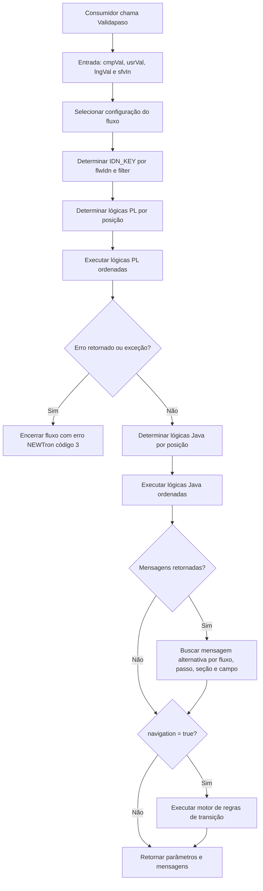
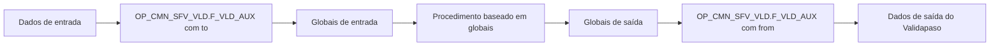

# Validapaso / NEWTron — Especificação Técnica de Validação, Orquestração de Fluxos e Integrações

## 1. Metadados do Documento
- **Arquivo de Origem:** Não identificado no conteúdo extraído
- **Tipo de Documento:** Especificação Técnica / Manual de Desenvolvimento
- **Domínio / Sistema:** NEWTron / Validapaso / CMN_API
- **Público-Alvo:** Desenvolvedores, Arquitetos, Operação e equipes de parametrização
- **Data/Versão Identificada:** 06 jun 2023 e 11 jun 2023 em referências de anexos; versão geral não identificada

---

## 2. Resumo Executivo & Contexto de Negócio

O documento descreve o serviço **Validapaso**, uma API do ecossistema NEWTron responsável por executar lógicas de validação e enriquecimento de dados em fluxos configuráveis. O serviço recebe contexto corporativo, critérios de filtragem, posição no fluxo e dados livres da tela; então determina a configuração aplicável, executa lógicas PL/SQL ou Java e, opcionalmente, calcula a navegação para o próximo passo.

A seleção do fluxo é baseada em `flwIdn` e critérios como agente, contrato, estrutura comercial, canal, setor e subsector. O identificador interno `IDN_KEY` conecta a definição de fluxo às tabelas de programas, mensagens e transições. A prioridade de seleção é determinada por agente, canal, estrutura comercial, demais critérios informados e data de validade.

O Validapaso suporta lógicas de banco de dados, beans Java Spring, procedimentos baseados em globais e beans genéricos para invocação de serviços REST e SOAP. A parametrização livre em `MNR_CPO_VAL` permite condicionar execuções, alterar o comportamento diante de erros, transformar valores, configurar integrações e definir mapeamentos de entrada e saída.

A documentação também estabelece uma limitação central: lógicas PL e Java não podem ser misturadas livremente na mesma sequência configurada. Quando for necessário combinar esses tipos, a lógica Java deve assumir a responsabilidade de invocar os procedimentos correspondentes por código.

---

## 3. Arquitetura, Componentes & Tecnologias Envolvidas

### Componentes identificados

| Componente | Função documentada |
| :--- | :--- |
| Validapaso API | Serviço principal que seleciona fluxos, executa lógicas, trata mensagens e calcula navegação. |
| `nwt_cmn_api_be-web` | Aplicação onde é exposto o Swagger do serviço Validapaso. |
| `CMN_API` | Projeto que deve conter as lógicas Java do Validapaso. |
| `nwt_cmn_api-sfv-pgm` | Projeto/pacote indicado para implementação de beans Java de lógica. |
| `ISfvBean` | Interface Java obrigatória para lógicas Java do Validapaso. |
| `SfvIn` | Objeto de entrada entregue a uma lógica Java. |
| `SfvOut` | Objeto de saída retornado por uma lógica Java. |
| `DF_TRN_NWT_XX_SFV` | Tabela de definição e seleção de fluxos. |
| `DF_TRN_NWT_XX_SFV_PGM` | Tabela de definição e ordenação das lógicas executáveis. |
| `DF_TRN_NWT_XX_SFV_MSG` | Tabela de mensagens alternativas por fluxo e posição. |
| `DF_TRN_NWT_XX_SFV_TSN` | Tabela de transições e regras de navegação. |
| `DF_CMN_NWT_XX_WBS_DFN` | Tabela de configuração de integrações web. |
| `OP_CMN_SFV_VLD.F_VLD_AUX` | Utilitário auxiliar para procedimentos baseados em globais. |
| `SfvWithConditionalBeanBase` | Classe que uma lógica Java deve estender para poder ser condicionada. |
| `IGeneralSfvFunction` | Interface para funções de transformação individuais. |
| `GRCSfvFnDatefmt` | Bean de transformação de formato de data. |
| `GRCSfvFnConvert` | Bean de conversão de valores por mapa de equivalência. |
| `GRCSfvFnConcat` | Bean de concatenação de campos. |

### Endpoint documentado

| Item | Valor |
| :--- | :--- |
| Swagger de exemplo | `https://trnic.desa.mapfre.net/nwt_cmn_api_be-web/swagger-ui.html#!/Validate_Step/postValidateStep` |
| Query parameter | `cmpVal`: companhia |
| Query parameter | `usrVal`: usuário |
| Header | `lngVal`: idioma |
| Corpo da requisição | `sfvIn` |

### Fluxo de processamento



### Sequência para procedimentos baseados em globais



---

## 4. Regras de Negócio, Especificações Funcionais & Processos

### Seleção da configuração do fluxo

1. O Validapaso utiliza `flwIdn` e os critérios de `filter` para localizar o `IDN_KEY`.
2. O `IDN_KEY` identifica a configuração que define as lógicas aplicáveis.
3. Dados de filtro desconhecidos devem ser enviados vazios.
4. Quando mais de uma configuração atende aos critérios, a prioridade é:
   1. Agente;
   2. Canal;
   3. Estrutura comercial;
   4. Demais critérios informados;
   5. Data de validade.
5. Os valores genéricos devem ser utilizados nas colunas que não participam do filtro.

### Execução de lógicas

1. Com `IDN_KEY` e a posição `steIdn` / `fldSet` / `fldNam`, o serviço determina as lógicas PL aplicáveis e sua ordem.
2. Cada lógica recebe todos os dados produzidos pela lógica anterior.
3. A primeira lógica recebe os dados originalmente recebidos na interface.
4. Se uma lógica retorna erro, o processamento é interrompido.
5. O erro é tratado como código NEWTron `3`.
6. Se uma lógica lançar exceção, o serviço principal encapsula o evento como erro controlado de código `3`.
7. Quando não há erro nas lógicas PL, o serviço determina e executa as lógicas Java configuradas.
8. Lógicas Java também recebem os dados resultantes da lógica anterior.
9. O documento informa que o ordenamento ocorre por tipo de lógica e que não é possível misturar lógicas PL e Java na mesma execução configurada.
10. Para combinar procedimentos PL e lógica Java, deve-se implementar uma lógica Java que invoque os procedimentos necessários por código.

### Mensagens alternativas

1. Mensagens retornadas pelas lógicas podem receber texto alternativo.
2. A busca de mensagem considera fluxo, passo, seção e campo.
3. A seção só é considerada se estiver informada na entrada.
4. O campo de busca é, prioritariamente, o campo apontado pela lógica que gerou o erro.
5. Se a lógica não informar o campo de erro, utiliza-se o campo informado na interface de entrada.
6. `msgTypVal = 3` é reservado para mensagens de erro por compatibilidade com a gestão de erros NEWTron.

### Navegação

1. O motor de navegação é executado apenas quando `navigation = true`.
2. As regras de transição usam valores originalmente recebidos em `parameters` e valores produzidos pelas lógicas executadas.
3. Uma configuração com uma única navegação e sem regras representa a navegação padrão.
4. O array de regras é interpretado como **OR**.
5. Cada objeto dentro do array é interpretado como **AND**.
6. A resposta pode conter:
   - `nxtSteIdn`: próximo passo;
   - `pmnNvgPrrSte`: possibilidade de retornar ao passo anterior;
   - `pmnNvgWhtPrrSte`: possibilidade de retornar a qualquer passo anterior.

### Controle de execução por `MNR_CPO_VAL`

| Chave | Regra |
| :--- | :--- |
| `onError: false` | Comportamento tradicional; o fluxo para em caso de erro. Também é o comportamento quando a chave não é definida. |
| `onError: true` | O Validapaso continua a execução mesmo que a lógica retorne erro. |
| `conditions` | Define se a lógica deve ser executada de acordo com valores de entrada. |
| `conditions: [{"TXT_VAL": ""}]` | Campo não informado. |
| `conditions: [{"TXT_VAL": "*"}]` | Campo informado. |
| `conditions: [{"TXT_VAL": "VALUE"}]` | Campo igual ao valor informado. |
| `conditions: [{"TXT_VAL": "!VALUE"}]` | Campo diferente do valor informado. |

### Condições de execução

- O array `conditions` é interpretado como **OR**.
- As condições dentro de cada objeto do array são interpretadas como **AND**.
- Para condicionar uma lógica Java, a implementação deve estender `SfvWithConditionalBeanBase`.

### Procedimentos baseados em globais

| Chave | Função |
| :--- | :--- |
| `from` | Retorna dados de globais para a saída. |
| `to` | Envia dados de entrada para globais. |
| `map` | Copia variáveis de entrada para saída usando outro nome. |
| `put` | Define valores fixos em globais por parametrização. |

Os tipos de global documentados são `S` para cadeia, `N` para número e `D` para data. O formato de data exemplificado é `DDMMYYYY`.

### Beans de utilidade

| Chave | Função |
| :--- | :--- |
| `map` | Mapeia variável de entrada para variável de saída. |
| `set` | Define valores fixos na saída. |

Os dados de companhia, idioma e usuário podem ser utilizados por meio de `${CMP_VAL}`, `${LNG_VAL}` e `${USR_VAL}`.

### Integrações REST

- O bean REST é destinado a serviços com entrada simples, sem loops e sem parâmetros condicionais de entrada.
- A autenticação pode ser por usuário/senha ou inexistente.
- A configuração pode ser direta, pela tabela `DF_CMN_NWT_XX_WBS_DFN` ou por `zeroConfig`.
- Campos de entrada enviados como `headers` ou `queryParams` não são enviados no corpo da requisição.
- O bean empilha dados da resposta, permitindo acesso a estruturas aninhadas por notação com ponto.

### Integrações SOAP

- O documento descreve um bean para invocação SOAP, embora o texto inicial o chame de “servicios REST”; a parametrização indicada é semelhante à REST.
- O método HTTP para SOAP é sempre `POST`.
- A configuração suporta URL, autenticação, timeout, proxy, tabela `DF_CMN_NWT_XX_WBS_DFN`, `zeroConfig`, cabeçalhos, `SOAPAction`, `bodyDef`, `map` e `mapErrors`.

---

## 5. Tabelas de Parâmetros, Ambientes e Estruturas de Dados

### Estrutura de entrada `sfvIn`

| Item / Parâmetro | Descrição / Função | Tipo / Valores / Formato | Ambiente / Observações |
| :--- | :--- | :--- | :--- |
| `flwIdn` | Identificador do fluxo. | Texto. | Obrigatório para seleção do fluxo. |
| `filter` | Critérios para determinar a lógica/configuração aplicável. | Objeto. | Dados desconhecidos devem ser enviados vazios. |
| `filter.agnVal` | Agente. | Numérico. | Genérico: `999999`. |
| `filter.delVal` | Contrato. | Numérico. | Genérico: `99999`. |
| `filter.sblVal` | Subcontrato. | Numérico. | Genérico: `99999`. |
| `filter.secVal` | Setor. | Numérico. | Genérico: `9999`. |
| `filter.sbsVal` | Subsetor. | Numérico. | Genérico: `9999`. |
| `filter.frsLvlVal` | Primeiro nível da estrutura comercial. | Numérico. | Genérico: `99`. |
| `filter.sncLvlval` | Segundo nível da estrutura comercial. | Numérico. | Genérico: `999`. |
| `filter.thrLvlVal` | Terceiro nível da estrutura comercial. | Numérico. | Genérico: `9999`. |
| `filter.frsDstHnlVal` | Primeiro nível de canal. | Texto. | Genérico: `ZZZZ`. |
| `filter.scnDstHnlVal` | Segundo nível de canal. | Texto. | Genérico: `ZZZZ`. |
| `filter.thrDstHnlVal` | Terceiro nível de canal. | Texto. | Genérico: `ZZZZ`. |
| `position` | Identifica a lógica invocada dentro do fluxo. | Objeto. | Usado com `IDN_KEY`. |
| `position.steIdn` | Passo. | Texto. | Obrigatório na parametrização de programas e mensagens. |
| `position.fldSet` | Seção. | Texto. | Opcional. |
| `position.fldNam` | Campo. | Texto. | Opcional. |
| `parameters` | Dados livres de chave-valor. | Mapa. | Pode conter dados da tela, configuração e outros dados do chamador. |
| `navigation` | Solicita cálculo de navegação. | Booleano. | Deve ser `false` para lógicas internas de tela ou fluxo pré-construído sem navegação dinâmica. |

### Estrutura de saída

| Item / Parâmetro | Descrição / Função | Tipo / Valores / Formato | Ambiente / Observações |
| :--- | :--- | :--- | :--- |
| `flwIdn` | Identificador do fluxo executado. | Texto. | Retornado pelo serviço. |
| `idnKey` | Identificador da configuração utilizada. | Texto. | Determinado na seleção do fluxo. |
| `parameters` | Dados devolvidos pelo serviço. | Mapa chave-valor. | Pode conter valores produzidos pelas lógicas. |
| `messages` | Mensagens devolvidas pelo serviço. | Lista opcional. | Pode conter mensagens de erro ou informativas. |
| `messages.msgTypVal` | Tipo de mensagem. | Numérico. | Valor `3` reservado para erro. |
| `messages.msgVal` | Código da mensagem. | Numérico. | Exemplo: `20001`. |
| `messages.msgTxtVal` | Texto da mensagem. | Texto. | Pode ser substituído por mensagem alternativa parametrizada. |
| `messages.fldNam` | Campo que originou o erro. | Texto opcional. | Prioritário na busca de mensagem alternativa. |
| `navigation.nxtSteIdn` | Próximo passo. | Texto. | Retornado quando a navegação é solicitada. |
| `navigation.pmnNvgPrrSte` | Permite retorno ao passo anterior. | Booleano. | — |
| `navigation.pmnNvgWhtPrrSte` | Permite retorno a qualquer passo anterior. | Booleano. | — |

### Tabelas de parametrização do fluxo

| Tabela | Finalidade | Campos e regras relevantes |
| :--- | :--- | :--- |
| `DF_TRN_NWT_XX_SFV` | Define o fluxo e os filtros para localizar lógicas aplicáveis. | O `IDN_KEY` é o dado principal e relaciona o fluxo às demais tabelas. |
| `DF_TRN_NWT_XX_SFV_PGM` | Define lógicas PL, procedimentos globais e lógicas Java. | `PGM_TYP_VAL=P` para PL; `G` para procedimento sem entrada/saída baseado em globais; `J` para Java. |
| `DF_TRN_NWT_XX_SFV_PGM` | Define posição e ordem de execução. | `STE_IDN` e `PGM_EXN_ORD` obrigatórios; `SCR_SCI` e `FLD_NAM` opcionais. |
| `DF_TRN_NWT_XX_SFV_PGM` | Configura o executável. | `PGM_NAM` recebe nome do PL ou nome do bean Spring. |
| `DF_TRN_NWT_XX_SFV_PGM` | Guarda parametrização livre da lógica. | `MNR_CPO_VAL` em formato JSON. |
| `DF_TRN_NWT_XX_SFV_MSG` | Define textos alternativos de mensagens. | Considera fluxo, passo, seção e campo. |
| `DF_TRN_NWT_XX_SFV_TSN` | Define transições entre passos. | Regras JSON em `RUL_VAL_TXT`. |
| `DF_CMN_NWT_XX_WBS_DFN` | Centraliza configuração de chamadas web. | URL, usuário, senha, timeout, método e proxy. |

### Tipos de programa

| `PGM_TYP_VAL` | Tipo de lógica | Configuração documentada |
| :--- | :--- | :--- |
| `P` | Procedimento PL | `PGM_NAM` deve conter o nome do PL, por exemplo `XXX_TEST.test1`. |
| `G` | Procedimento baseado em globais | Uso associado à utilidade `OP_CMN_SFV_VLD.F_VLD_AUX`. |
| `J` | Lógica Java | `PGM_NAM` deve conter o nome do bean Spring. |

### Contexto de lógica de banco de dados

| Campo | Descrição |
| :--- | :--- |
| `cmp_val` | Companhia. |
| `flw_idn` | Identificador do fluxo. |
| `idn_key` | Identificador interno calculado. |
| `ste_idn` | Passo. |
| `fld_nam` | Campo opcional. |
| `scr_sci` | Seção opcional. |
| `frs_lvl_val`, `scn_lvl_val`, `thr_lvl_val` | Níveis da estrutura comercial. |
| `frs_dst_hnl_val`, `scn_dst_hnl_val`, `thr_dst_hnl_val` | Níveis da estrutura de canal. |
| `agn_val` | Agente. |
| `sec_val` | Setor. |
| `sbs_val` | Subsetor. |
| `del_val` | Contrato. |
| `sbl_val` | Subcontrato. |
| `mnr_cpo_val` | Parametrização definida para a lógica. |
| `pmOPlyAtrPT[].fld_nam` | Código do campo livre de entrada. |
| `pmOPlyAtrPT[].fld_val_val` | Valor do campo livre de entrada. |

### Retorno de lógica de banco de dados

| Campo | Função |
| :--- | :--- |
| `prc_trm_val` | Estado do processamento: `nwt_o.c_trn.trm_val_ok` ou `nwt_o.c_trn.trm_val_err`. |
| `ply_atr_pt[i].ply_atr_s.fld_nam` | Código do campo de saída. |
| `ply_atr_pt[i].ply_atr_s.fld_val_val` | Valor do campo de saída. |
| `trn_err_t[j].err_val` | Código do erro. |
| `trn_err_t[j].err_nam` | Descrição do erro. |
| `trn_err_t[j].prp_nam` | Campo que originou o erro; opcional. |

### Interface Java obrigatória

```java
public interface ISfvBean {
  SfvOut execute(
      SfvIn in,
      BigDecimal cmpVal,
      String usrVal,
      String lngVal,
      Map<String, Object> parametrization
  );
}
```

### Regras de implementação Java

| Item | Regra |
| :--- | :--- |
| Localização | As lógicas devem estar no CMN_API, projeto `nwt_cmn_api-sfv-pgm`. |
| Pacote | `com.mapfre.tron.sfv.pgm.beans.impl.*`. |
| Registro | A lógica deve ser um bean Spring. |
| Nome configurado em banco | O nome da anotação `@Component("...")` é o valor utilizado em `PGM_NAM`. |
| Condicionamento | Beans Java condicionais devem estender `SfvWithConditionalBeanBase`. |

### Configuração de integração REST

| Chave | Descrição / Função | Tipo / Valores / Formato |
| :--- | :--- | :--- |
| `url` | URL de acesso ao serviço. | Texto. |
| `user` | Usuário de autenticação. | Texto. |
| `pass` | Senha de autenticação. | Texto. |
| `timeout` | Timeout de invocação. | Numérico; exemplo `5000`. |
| `method` | Método HTTP. | `GET`, `POST` ou `PUT`. |
| `proxy` | Proxy de acesso. | Texto; exemplo documentado `proxytal.glb.mapfre.net:80`. |
| `wbsCodVal` | Chave de serviço na tabela web. | Texto. |
| `wbsSbdVal` | Chave complementar de serviço na tabela web. | Texto. |
| `zeroConfig` | Caminho de configuração do projeto. | Exemplo: `app.env.rest`. |
| `headers` | Cabeçalhos da requisição. | Valores de entrada, contexto ou fixos. |
| `queryParams` | Parâmetros de query. | Valores de entrada, contexto ou fixos. |
| `body` | Limita os parâmetros de entrada enviados no corpo. | Lista de campos. |
| `bodyDef` | Template de corpo da requisição. | Variáveis com notação `${...}`. |
| `map` | Mapeia resposta do serviço para saída Validapaso. | Suporta `vrb`, `apply` e `params`. |
| `mapErrors` | Mapeia resposta para mensagens de erro. | Suporta `code`, `message` e `if`. |

### Colunas de `DF_CMN_NWT_XX_WBS_DFN`

| Coluna | Descrição |
| :--- | :--- |
| `URL_WBS_TXT_VAL` | URL de acesso ao serviço. |
| `WBS_USR_VAL` | Usuário de autenticação. |
| `WBS_PSW_TXT_VAL` | Senha de autenticação. |
| `TMT_VAL` | Timeout de invocação. |
| `MTH_TYP_VAL` | Método HTTP: `GET`, `POST` ou `PUT`. |
| `PXY_TXT_VAL` | Proxy de acesso. |

### Contexto disponível em parametrizações

| Variável | Descrição |
| :--- | :--- |
| `${CMP_VAL}` | Companhia. |
| `${LNG_VAL}` | Idioma. |
| `${USR_VAL}` | Usuário. |

---

## 6. Bateria de Perguntas & Respostas para RAG (FAQ Sintético)

### P1: Como o Validapaso seleciona a configuração de fluxo que deve ser executada?
**R:** O Validapaso usa o identificador `flwIdn` e os critérios de `filter` para determinar o `IDN_KEY`. Quando múltiplas configurações atendem à entrada, a prioridade segue agente, canal, estrutura comercial, demais critérios informados e data de validade. Campos que não participam do filtro devem usar seus valores genéricos configurados.

### P2: O que acontece quando uma lógica PL ou Java retorna erro?
**R:** No comportamento padrão, o Validapaso interrompe o processamento quando uma lógica retorna erro. O erro é tratado como erro NEWTron de código `3`. Caso a lógica gere uma exceção, a API principal captura a exceção e a devolve como erro controlado com código `3`.

### P3: Como permitir que o fluxo continue após uma lógica retornar erro?
**R:** A parametrização JSON em `MNR_CPO_VAL` pode definir `"onError": true`. Com essa configuração, a execução do Validapaso continua mesmo que a lógica retorne erro. Se `onError` não for informado, ou estiver configurado como `false`, o comportamento é interromper o fluxo.

### P4: É possível configurar lógicas PL e Java alternadas no mesmo fluxo?
**R:** Não. O documento informa que não é possível misturar livremente lógicas PL e Java na execução parametrizada. Quando for necessário combinar os dois tipos, a alternativa é implementar uma lógica Java que invoque, por código, os procedimentos necessários e parametrizar apenas a lógica Java chamadora.

### P5: Como são escolhidas as mensagens alternativas do Validapaso?
**R:** O serviço busca mensagens alternativas por fluxo, passo, seção e campo. Se a lógica que produziu o erro informar o campo responsável, esse campo é usado na busca. Caso a lógica não informe o campo, mas a entrada contenha `fldNam`, o campo da entrada é utilizado.

### P6: Quando o motor de navegação é executado?
**R:** O motor de navegação é executado somente quando a requisição possui `navigation: true`. As regras usam dados recebidos em `parameters` e dados produzidos pelas lógicas. Uma transição única sem regras é interpretada como navegação padrão.

### P7: Como interpretar as regras JSON da tabela `DF_TRN_NWT_XX_SFV_TSN`?
**R:** O array de regras é interpretado como OR, enquanto as condições dentro de cada objeto são interpretadas como AND. Assim, cada objeto representa um conjunto de condições que deve ser atendido simultaneamente, e qualquer objeto do array que seja atendido pode selecionar a transição.

### P8: Onde uma lógica Java do Validapaso deve ser implementada e como é configurada?
**R:** A lógica Java deve ser incluída no CMN_API, no projeto `nwt_cmn_api-sfv-pgm`, pacote `com.mapfre.tron.sfv.pgm.beans.impl.*`, como bean Spring. O nome informado na anotação `@Component("NomeDoBean")` é o nome que deve ser configurado como `PGM_NAM` na tabela `DF_TRN_NWT_XX_SFV_PGM`.

### P9: Qual interface uma lógica Java deve implementar?
**R:** A lógica deve implementar `ISfvBean`, cuja operação é `execute(SfvIn in, BigDecimal cmpVal, String usrVal, String lngVal, Map<String, Object> parametrization)`. A implementação recebe a entrada do fluxo, contexto de companhia, usuário, idioma e parametrização livre, retornando um objeto `SfvOut`.

### P10: Como um procedimento baseado em globais pode ser usado no Validapaso?
**R:** O padrão documentado possui três etapas: primeiro, invoca-se `OP_CMN_SFV_VLD.F_VLD_AUX` com `to` para copiar dados de entrada para globais; depois, executa-se o procedimento baseado em globais; por fim, invoca-se novamente `OP_CMN_SFV_VLD.F_VLD_AUX` com `from` para transferir os resultados das globais para a saída do Validapaso.

### P11: Quais modos de configuração são aceitos pelo bean REST?
**R:** O bean REST aceita configuração direta no JSON de parametrização, configuração referenciada pela tabela `DF_CMN_NWT_XX_WBS_DFN` usando `wbsCodVal` e `wbsSbdVal`, ou configuração referenciada por um caminho de `zeroConfig`. As opções incluem URL, autenticação, timeout, método, proxy, cabeçalhos, query parameters, corpo, template de corpo, mapeamento de resposta e mapeamento de erros.

### P12: Como mapear dados aninhados retornados por um serviço para a saída do Validapaso?
**R:** O bean de integração empilha os dados retornados, permitindo mapear estruturas aninhadas por notação de ponto. O mapeamento `map` associa um campo de saída Validapaso a uma variável `vrb` da resposta do serviço. Opcionalmente, o campo `apply` pode indicar um bean de transformação e `params` fornece seus parâmetros.

---

## 7. Glossário de Termos, Siglas & Conceitos-Chave

- **Validapaso:** API NEWTron que seleciona e executa lógicas de validação, enriquecimento, mensagens e navegação de fluxos.
- **NEWTron:** Plataforma/contexto de tratamento de processos e erros mencionado no documento.
- **PL:** Lógica de banco de dados, configurada com `PGM_TYP_VAL=P`.
- **BBDD:** Base de dados.
- **`IDN_KEY`:** Identificador interno da configuração de fluxo selecionada.
- **`flwIdn`:** Identificador do fluxo.
- **`MNR_CPO_VAL`:** Campo JSON de parametrização livre associado à lógica.
- **`PGM_NAM`:** Nome do programa, procedimento ou bean Spring configurado.
- **`PGM_EXN_ORD`:** Ordem de execução do programa.
- **`STE_IDN`:** Identificador do passo.
- **`SCR_SCI`:** Seção da tela.
- **`FLD_NAM`:** Nome ou código do campo.
- **`RUL_VAL_TXT`:** Campo JSON que armazena regras de transição.
- **`SfvIn`:** Objeto Java de entrada para lógicas Java.
- **`SfvOut`:** Objeto Java de saída para lógicas Java.
- **`ISfvBean`:** Interface obrigatória das lógicas Java.
- **`IGeneralSfvFunction`:** Interface de funções individuais de transformação.
- **`DF_TRN_NWT_XX_SFV`:** Tabela de definição de fluxos e filtros.
- **`DF_TRN_NWT_XX_SFV_PGM`:** Tabela de programas/lógicas do fluxo.
- **`DF_TRN_NWT_XX_SFV_MSG`:** Tabela de mensagens alternativas.
- **`DF_TRN_NWT_XX_SFV_TSN`:** Tabela de transições entre passos.
- **`DF_CMN_NWT_XX_WBS_DFN`:** Tabela de configuração de serviços web.
- **`zeroConfig`:** Arquivo/configuração de projeto usado como fonte de propriedades de integração.
- **`SOAPAction`:** Cabeçalho específico de serviço SOAP.
- **`onError`:** Parametrização que determina se o fluxo deve continuar após erro.
- **`conditions`:** Parametrização de condição para execução de lógica.
- **`mapErrors`:** Mapeamento da resposta de uma integração para mensagens de erro Validapaso.

---

## 8. Notas Críticas, Riscos & Limitações

- **Mistura de tecnologias:** O documento registra que não é possível misturar lógicas PL e Java livremente em uma sequência parametrizada. Combinações exigem encapsulamento por uma lógica Java.
- **Interrupção por erro:** O comportamento padrão interrompe o fluxo após erro. O uso de `onError: true` altera esse comportamento e deve ser avaliado cuidadosamente, pois erros podem coexistir com processamento posterior.
- **Dependência de parametrização:** A seleção de fluxos, mensagens, transições e programas depende da consistência das tabelas `DF_TRN_NWT_XX_SFV`, `DF_TRN_NWT_XX_SFV_PGM`, `DF_TRN_NWT_XX_SFV_MSG` e `DF_TRN_NWT_XX_SFV_TSN`.
- **Ambiguidade documental SOAP:** O anexo SOAP afirma inicialmente que foi desenvolvido um bean para “servicios REST”, mas o restante da seção descreve invocação SOAP. A documentação não esclarece se a redação é erro editorial.
- **Contratos incompletos:** O documento descreve estruturas e exemplos, mas não apresenta uma especificação completa de todos os contratos JSON, tipos Java, esquemas de banco ou critérios de validação de cada operador.
- **Segurança de integrações:** O documento menciona `user` e `pass` na parametrização, mas não detalha mecanismo de proteção, criptografia, mascaramento ou gestão de credenciais.
- **Nota de Análise:** O documento cita o endpoint Swagger de um ambiente de exemplo (`desa`), porém não detalha ambientes adicionais, políticas de disponibilidade, autenticação da API ou controle de acesso.

---

## 9. Conteúdo Bruto Estruturado (Referência Fiel)

```text
--- [PÁGINAS 1 A 3 — Interface, entrada e saída] ---

Interface del servicio
Swagger:
https://trnic.desa.mapfre.net/nwt_cmn_api_be-web/swagger-ui.html#!/Validate_Step/postValidateStep

Entrada:
cmpVal: compañía (query)
usrVal: usuario (query)
lngVal: idioma (cabecera)
sfvIn: cuerpo de la petición

flwIdn: identificador del flujo
filter: filtro de aplicación para determinar la lógica del flujo
agnVal: agente
delVal: contrato
sblVal: subcontrato
secVal: sector
sbsVal: subsector
frsLvlVal / sncLvlval / thrLvlVal: estructura comercial
frsDstHnlVal / scnDstHnlVal / thrDstHnlVal: canal
position: identificador de la lógica dentro del flujo
steIdn: paso
fldSet: sección
fldNam: campo
parameters: datos libres tipo clave-valor
navigation: indicador de consulta de navegación

Salida:
flwIdn: identificador del flujo
idnKey: identificador de la configuración utilizada
parameters: datos retornados tipo clave-valor
messages: mensajes devueltos por el servicio
msgTypVal: tipo de mensaje
msgVal: código del mensaje
msgTxtVal: texto del mensaje
fldNam: campo que origina el error
navigation:
nxtSteIdn: siguiente paso
pmnNvgPrrSte: retorno al paso previo
pmnNvgWhtPrrSte: retorno a cualquier paso previo

--- [PÁGINAS 3 A 4 — Funcionamiento del Validapaso] ---

1. Determinar IDN-KEY mediante flwIdn y criterios de filtrado.
2. Determinar y ejecutar lógicas PL por IDN-KEY y posición.
3. Si no hay error, determinar y ejecutar lógicas Java.
4. Buscar texto alternativo para mensajes devueltos.
5. Si navigation=true, ejecutar motor de reglas para determinar siguiente paso.

Prioridad de configuración:
agente -> canal -> estructura comercial -> resto de criterios informados -> fecha de validez

Las lógicas reciben los datos de la lógica previa.
La primera lógica recibe los datos de la interfaz.
Una lógica con error detiene el proceso.
Una excepción se encapsula como error controlado código 3.
No es posible mezclar lógicas Java y PL libremente.

--- [PÁGINAS 5 A 7 — Tablas y ejemplos de flujo] ---

DF_TRN_NWT_XX_SFV:
Tabla de definición de flujos.
Valores genéricos:
AGN_VAL: 999999
DEL_VAL: 99999
SBL_VAL: 99999
SEC_VAL: 9999
SBS_VAL: 9999
FRS_LVL_VAL: 99
SNC_LVL_VAL: 999
THR_LVL_VAL: 9999
FRS_DST_HNL_VAL: ZZZZ
SCN_DST_HNL_VAL: ZZZZ
THR_DST_HNL_VAL: ZZZZ

DF_TRN_NWT_XX_SFV_PGM:
PGM_TYP_VAL=P: procedimientos PL
PGM_TYP_VAL=G: procedimientos basados en globales
PGM_TYP_VAL=J: Java
STE_IDN y PGM_EXN_ORD obligatorios.
SCR_SCI y FLD_NAM opcionales.
MNR_CPO_VAL almacena JSON libre.

DF_TRN_NWT_XX_SFV_MSG:
Mensajes alternativos por flujo, posición, sección y campo.

DF_TRN_NWT_XX_SFV_TSN:
Transiciones entre pasos.
RUL_VAL_TXT contiene reglas JSON.
Array: OR.
Elementos internos: AND.

--- [PÁGINAS 8 A 10 — Lógicas de BBDD y Java] ---

Lógica BBDD:
FUNCTION <nombre>(
  pmOCmnSfvS IN nwt_o.o_cmn_sfv_s,
  pmOPlyAtrPT IN nwt_o.o_ply_atr_pt
) RETURN nwt_o.o_ply_atr_cpt

Contexto:
cmp_val, flw_idn, idn_key, ste_idn, fld_nam, scr_sci,
estructura comercial, canal, agente, sector, subsector,
contrato, subcontrato y mnr_cpo_val.

Salida:
prc_trm_val
ply_atr_pt[].ply_atr_s.fld_nam
ply_atr_pt[].ply_atr_s.fld_val_val
errores con err_val, err_nam y prp_nam.

Lógica Java:
public interface ISfvBean {
  SfvOut execute(SfvIn in, BigDecimal cmpVal,
    String usrVal, String lngVal,
    Map<String, Object> parametrization);
}

--- [PÁGINAS 11 A 15 — Beans Java e controle de fluxo] ---

As lógicas Java:
- Devem estar no CMN_API.
- Devem estar no projeto nwt_cmn_api-sfv-pgm.
- Devem pertencer ao pacote com.mapfre.tron.sfv.pgm.beans.impl.*.
- Devem ser beans Spring.
- O nome em @Component é configurado em base de dados.

msgTypVal=3:
Reservado para mensagens de erro.

Controle de fluxo em MNR_CPO_VAL:
{
  "onError": false
}

{
  "onError": true
}

Conditions:
{
  "conditions": [
    {
      "TXT_VAL": "VALUE"
    }
  ]
}

Para lógica Java condicional:
estender SfvWithConditionalBeanBase.

--- [PÁGINAS 15 A 16 — Procedimentos globais e bean de utilidades] ---

OP_CMN_SFV_VLD.F_VLD_AUX:
from: retorna dados de globais para saída.
to: retorna dados de entrada para globais.
map: copia variáveis de entrada para saída.
put: estabelece valores fixos em globais.

Tipos:
S: cadena
N: número
D: fecha

Bean de utilidades:
map: transformação de variáveis.
set: estabelecer valores fixos na saída.

Variáveis de contexto:
${CMP_VAL}
${LNG_VAL}
${USR_VAL}

--- [PÁGINAS 17 A 20 — Bean REST e transformações] ---

Bean REST:
- Entrada simples, sem loops e sem parâmetros condicionais.
- Autenticação por usuário/password ou sem autenticação.
- Configuração direta, DF_CMN_NWT_XX_WBS_DFN ou zeroConfig.

Parâmetros:
url
user
pass
timeout
method: GET, POST, PUT
proxy
wbsCodVal
wbsSbdVal
zeroConfig
headers
queryParams
body
bodyDef
map
mapErrors

DF_CMN_NWT_XX_WBS_DFN:
URL_WBS_TXT_VAL
WBS_USR_VAL
WBS_PSW_TXT_VAL
TMT_VAL
MTH_TYP_VAL
PXY_TXT_VAL

Transformações:
IGeneralSfvFunction.apply(String v, Object params, Map<String, String> values)

Beans existentes:
GRCSfvFnDatefmt
GRCSfvFnConvert
GRCSfvFnConcat

--- [PÁGINAS 21 A 23 — Bean SOAP] ---

Bean de invocação SOAP:
- Entrada simples, sem loops e sem parâmetros condicionais.
- Autenticação por usuário/password ou sem autenticação.
- Parametrização similar ao bean REST.
- Método HTTP sempre POST.
- Suporta URL, usuário, senha, timeout, proxy, DF_CMN_NWT_XX_WBS_DFN e zeroConfig.
- Suporta headers, incluindo SOAPAction.
- Suporta bodyDef, map e mapErrors.
- Permite mapeamento de estruturas aninhadas por notação com ponto.
- As funções de transformação podem ser aplicadas como em REST.
```
