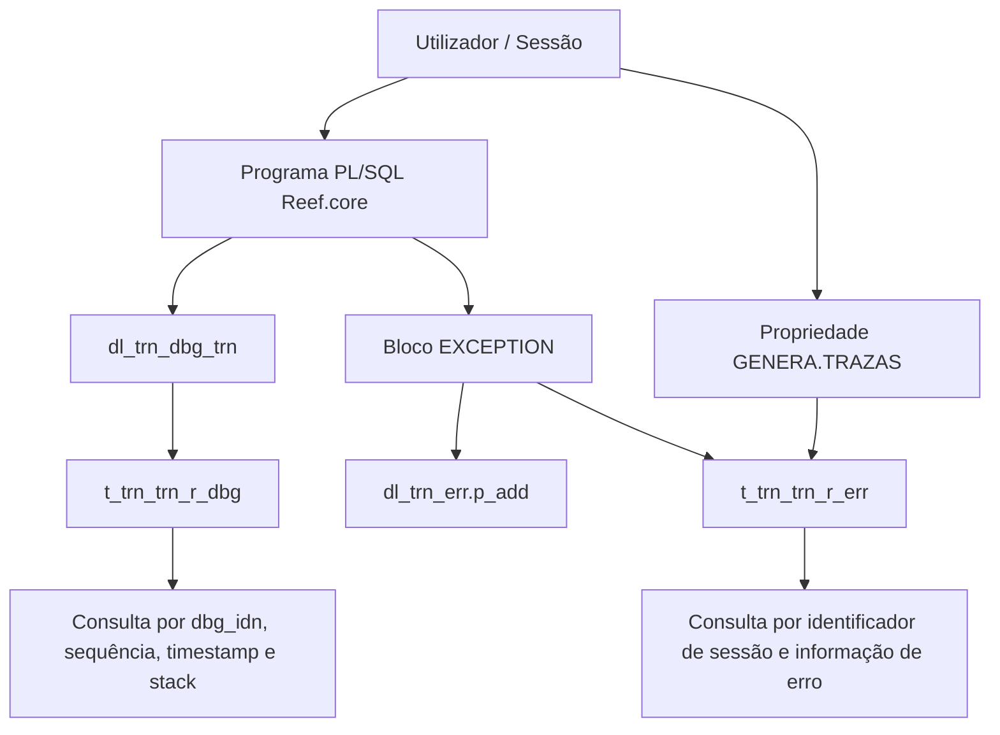
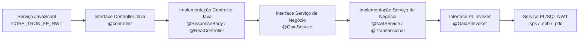
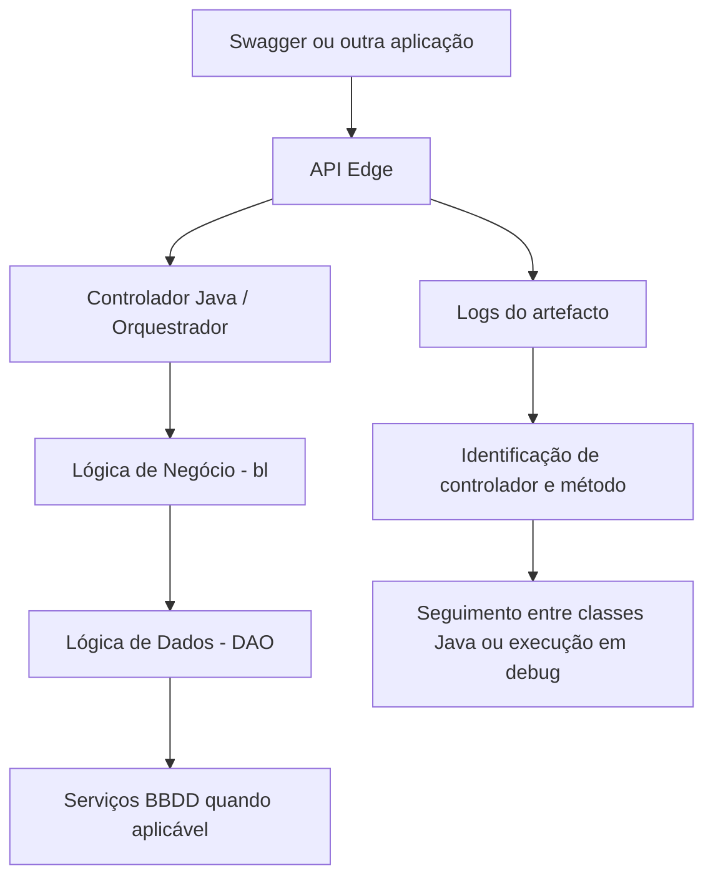

# Gestão de Trazas em Reef.core: Guia de Rastreabilidade em Backend PL/SQL, Frontais Java e APIs

## 1. Metadados do Documento
- **Arquivo de Origem:** `Gestión de Trazas en Reef.core` — nome do arquivo não identificado no conteúdo extraído.
- **Tipo de Documento:** Manual Operacional / Apresentação Técnica.
- **Domínio / Sistema:** Reef.core, NEWTron, TronWeb, API Edge, PTD, GAIA e Novos Frontais.
- **Público-Alvo:** Desenvolvedores PL/SQL, Java e JavaScript; arquitetos; operação; suporte; equipas funcionais.
- **Data/Versão Identificada:** Não identificada. O resumo inclui como exemplo de identificador de sessão a data `23-04-2024`.

---

## 2. Resumo Executivo & Contexto de Negócio

O documento apresenta a estratégia de gestão de traces e rastreabilidade da plataforma Reef.core. O objetivo é permitir a deteção, o diagnóstico e a correção de erros funcionais ou de execução mediante o acompanhamento do fluxo de procedimentos, serviços, classes Java, chamadas PL/SQL, parâmetros, variáveis, retornos, exceções e dados de sessão.

No backend PL/SQL, a geração de traces é sustentada pelo pacote `dl_trn_dbg_trn`, que grava registos na tabela `t_trn_trn_r_dbg`. As traces devem ser inseridas nos programas de arquitetura NEWTron de forma inicialmente comentada e ativadas apenas durante investigações controladas. A norma exige trace de início, parâmetros simples de entrada e finalização de procedimentos ou funções. Após resolver o problema, as traces devem voltar a permanecer comentadas e o pacote deve ser recompilado.

A plataforma também possui rastreabilidade de erros na tabela `t_trn_trn_r_err`. A gravação ocorre durante a sessão do utilizador quando a propriedade `GENERA.TRAZAS` possui valor positivo. A investigação de um erro pode combinar informações da tabela de erros, identificador de sessão, pilhas de chamadas, logs de artefactos Java, browser developer tools e consultas em Splunk.

Para frontais, o documento diferencia a arquitetura GAIA do NEWTron e a arquitetura de Novos Frontais. Em GAIA, a rastreabilidade inicia no serviço JavaScript, segue para controller Java, serviço de negócio Java e integração PL/SQL. Nos Novos Frontais, a investigação parte de uma chamada `action`, dos dados enviados no DTO e da parametrização da tabela `DF_TRN_NWT_XX_FLW_CFG_DSH`, que determina managers Java e métodos executados em sequência.

Para APIs, a rastreabilidade depende principalmente dos logs. A partir da identificação de controlador e método, como `bussinessLineController` e `getFulldailyPositionbyDate`, a análise continua pelas classes chamadas, incluindo lógica de negócio (`bl`) e lógica de dados (`DAO`). Quando uma API falha por um serviço NEWTron, a tabela `t_trn_trn_r_err` pode complementar os logs mediante identificador de sessão e texto do erro.

---

## 3. Arquitetura, Componentes & Tecnologias Envolvidas

### Componentes e tecnologias identificados

| Componente / Tecnologia | Papel descrito no documento |
| :--- | :--- |
| Reef.core | Plataforma no contexto da qual se aplica a gestão de traces. |
| Tron / TRON2000 | Backend do Reef.core construído com pacotes PL/SQL; TRON2000 é referido como núcleo. |
| NEWTron / NWT | Arquitetura e elementos de frontend/backend utilizados no Reef.core. |
| PL/SQL | Tecnologia de implementação de lógicas de processo, negócio, dados e integração. |
| `dl_trn_dbg_trn` | Pacote de geração e consulta de traces no backend. |
| `dl_trn_err_trn.p_sav` | Funcionalidade de gravação de erros. |
| `dl_trn_err.p_add` | Chamada exemplificada para adicionar dados de erro em bloco `EXCEPTION`. |
| `t_trn_trn_r_dbg` | Tabela de debug e traces de sessões. |
| `t_trn_trn_r_err` | Tabela de erros e traces de erro do Reef.core. |
| `trn_k_ptd` | Lógica para geração de traces em pacotes PTD. |
| `t_trn_trn_d_dbg` | Tabela mencionada como destino de traces em PTD. |
| PTD | Lógicas de definição de produto que dão acesso a lógicas e tabelas de núcleo sem permitir modificá-las. |
| GAIA | Arquitetura usada na construção do frontend de NEWTron. |
| JavaScript | Tecnologia do serviço de frontend cliente. |
| Java | Tecnologia de controllers, serviços, managers, APIs, lógica de negócio e classes de integração. |
| `CORE_TRON_FE_NWT` | Camada de frontend NEWTron. |
| `CORE_TRON_BE_NWT` | Camada backend Java NEWTron. |
| `CORE_BK_NWT` | Camada de backend/core indicada nos diagramas. |
| `@controller` | Anotação identificativa da interface de controller Java. |
| `@ResponseBody` | Anotação indicada na implementação de controller Java. |
| `@RealController` | Anotação indicada na implementação de controller Java. |
| `@GaiaService` | Anotação de interface de serviço de negócio Java. |
| `@NwtService` | Anotação da implementação de serviço Java. |
| `@Transaccional` | Anotação da implementação de serviço Java. |
| `@GaiaPlInvoker` | Anotação de interface Java que atua como intérprete para PL/SQL. |
| `DF_TRN_NWT_XX_FLW_CFG_DSH` | Tabela de configuração de managers nos fluxos dos Novos Frontais. |
| `RL_TRN_NWT_XX_VRB` | Tabela de variáveis globais de sessão desconectada. |
| `logback.xml` | Ficheiro de configuração de logs incluído na biblioteca LOG4M. |
| LOG4M | Biblioteca/módulo de configuração de logs de artefactos. |
| JBoss | Plataforma na qual as bibliotecas de configuração de logs são descritas como módulos. |
| Splunk | Ferramenta centralizada de consulta de logs de aplicações Reef.core. |
| BitBucket | Ferramenta utilizada no Reef.core para acesso aos repositórios FE e BE de NEWTron. |
| Swagger | Aplicação utilizada para executar APIs no Reef.core. |
| Chrome / F12 | Ferramenta de depuração de frontend cliente. |

### Arquitetura de rastreabilidade no backend PL/SQL



### Fluxo GAIA / NEWTron descrito



### Fluxo de Novos Frontais

```mermaid
graph TD
    UI[Frontend / Ação action] --> DTO[DTO de comunicação]
    DTO --> FD[flowData e objetos funcionais frm]
    FD --> CFG[DF_TRN_NWT_XX_FLW_CFG_DSH]
    CFG --> MGR[Manager Java]
    MGR --> MTD[Método execute[cpoIdn]AcnIdnRun]
    MTD --> BE[Serviços Backend / PL-SQL quando aplicável]
    MTD --> LOG[Logs de artefactos]
    BE --> ERR[t_trn_trn_r_err quando aplicável]
```

### Fluxo de rastreabilidade de APIs



> **Nota de Análise:** O documento cita camadas, anotações e nomes de artefactos, mas não fornece contratos HTTP completos, payloads JSON integrais, versões de Java, versões de JBoss, topologia de servidores ou especificações de autenticação para os serviços.

---

## 4. Regras de Negócio, Especificações Funcionais & Processos

### 4.1 Organização do backend PL/SQL

O backend Reef.core — Tron — é construído com pacotes PL/SQL. A organização está associada aos conceitos lógicos ou de negócio que definem as operações funcionais da aplicação. O backend mantém estrutura por camadas:

1. Lógica de processo ou orquestração.
2. Lógica de negócio.
3. Lógica de dados.
4. Lógicas de integração NWT-TW.
5. Lógicas de integração TW-NWT.

### 4.2 Gestão de traces com `dl_trn_dbg_trn`

Todos os procedimentos de geração de traces indicados no documento inserem registos em `t_trn_trn_r_dbg`. O pacote disponibiliza funções e procedimentos para criar identificadores, ativar ou desativar tracing por sessão, inserir comentários, erros, entradas, saídas, parâmetros e variáveis, consultar traces e removê-las.

### 4.3 Traces obrigatórias em programas NEWTron

Todo procedimento ou função da arquitetura NEWTron deve conter, no mínimo:

1. Constante `c_pgm_nam` com o nome do package Oracle.
2. Trace de início na primeira parte do procedimento ou função.
3. Trace de todos os parâmetros simples de entrada logo após o trace de início.
4. Trace de erro em bloco de captura de exceção, quando aplicável.
5. Trace de finalização antes do término do procedimento ou função.

As traces devem ser criadas inicialmente comentadas. O exemplo apresentado usa o programa `sr_thp_adr_qry_trn` e a função `f_tbl`.

```sql
c_pgm_nam CONSTANT nwt_o.d_trn.pgm_nam := 'sr_thp_adr_qry_trn';
```

```sql
/**/ dl_trn_dbg.p_set_mth_bgn (
/**/     pm_pgm_nam => c_pgm_nam,
/**/     pm_mth_nam => 'f_tbl'
/**/ );
```

```sql
/**/ dl_trn_dbg.p_set_prm (
/**/     pm_pgm_nam => c_pgm_nam,
/**/     pm_prm_nam => 'pm_thp_dcm_typ_val',
/**/     pm_prm_val => pm_thp_dcm_typ_val
/**/ );
```

```sql
EXCEPTION
   WHEN OTHERS THEN
       dl_trn_err.p_add (
           pm_err_val     => SQLCODE,
           pm_err_nam     => SQLERRM,
           pm_o_trn_err_t => pm_o_trn_prc_s.prc_err_t
       );
    /**/ dl_trn_dbg.p_set_err(pm_pgm_nam => c_pgm_nam);
END;
```

```sql
/*--@*/ dl_trn_dbg.p_set_mth_trm(
/**/     pm_pgm_nam => c_pgm_nam,
/**/     pm_mth_nam => 'f_tbl'
/**/ );
```

### 4.4 Ativação temporária de traces PL/SQL

O processo descrito para ativar traces é:

1. Possuir permissão para modificar código-fonte.
2. Descomentar as statements de tracing.
3. O documento indica como alternativas substituir `--@` por `/*--@*/` ou substituir `--@` por `/**/`.
4. Incluir a ativação de traces no início do procedimento.
5. Compilar o package com traces ativadas.
6. Executar o cenário de investigação.
7. Consultar a tabela de traces pelo identificador utilizado.
8. Após detetar e corrigir o erro, comentar novamente as traces.
9. Remover a statement de ativação, quando aplicável.
10. Recompilar o package.

Exemplo de ativação:

```sql
dl_trn_dbg.p_enb(pm_dbg_idn => 'PRUEBA_' || sysdate);
```

O identificador fornecido em `pm_dbg_idn` permite localizar as traces na tabela.

### 4.5 Gestão de erros

A tabela `t_trn_trn_r_err` armazena traces de pacotes Reef.core nos quais ocorreu erro. A funcionalidade de gravação de erro é `dl_trn_err_trn.p_sav`; o documento esclarece que não é necessário incluir essa funcionalidade em cada package, pois a gestão de erros já a contém e grava o erro quando a variável de utilizador `GENERA.TRAZAS` possui valor positivo.

A informação de erro abrange:

- **Errors Stack:** linha e mensagem de erro.
- **Errors Backtrace:** percurso pela pilha de chamadas desde a linha que originou a exceção; identifica a linha real que causou o problema.
- **PL/SQL Call Stack:** programas executados e aninhamento de chamadas a subprogramas.

O identificador de sessão necessário para aceder à trace de erros é obtido do próprio erro.

### 4.6 Ativação de gravação de erros

Para que os erros Reef.core sejam gravados na tabela de erros durante a sessão do utilizador, a variável `GENERA.TRAZAS` deve ter valor positivo. O documento indica que a configuração pode ser feita a partir de TronWeb.

Após corrigir o erro, a marca de geração de traces deve ser desativada para o utilizador.

### 4.7 Traces em PTD

Os esquemas de definição de produto foram criados para instalações REEF que não podem aceder diretamente às lógicas ou tabelas do esquema TRON2000, preservando independência relativamente aos programas das instalações. O núcleo fornece lógicas PTD que permitem acesso às lógicas e tabelas de núcleo sem permitir alterações.

Para traces em pacotes PTD, utiliza-se `trn_k_ptd`. As traces são gravadas na tabela indicada como `t_trn_trn_d_dbg`.

Regras obrigatórias para PTD:

1. `p_gen_comienzo_traza` deve ser a primeira linha de código de todos os procedimentos e funções.
2. `p_gen_final_traza` deve ser a última linha de código de todos os procedimentos e funções.
3. `p_gen_traza_parametro` deve ser usada sempre após a trace de início para registar todos os parâmetros recebidos.
4. O método de parâmetros possui sobrecargas para texto, numérico, data e booleano.
5. Variáveis, retornos de função e comentários podem ser gerados por métodos específicos.
6. As traces já não são obtidas em ficheiro texto; são gravadas em tabela de debug.

### 4.8 Rastreabilidade em frontend GAIA

Na arquitetura GAIA, o processo de investigação começa pelo serviço JavaScript. O documento usa como exemplo o “Lanzador de tareas”, no serviço executado pelo botão de aceitar/validar tarefa:

```text
https://trn.desa.mapfre.net/nwt_fe-web/api/nwt/ply/ply/pssV/runTskFns
```

O serviço identificado é `plyplypssVSrv.runTskFns`. O seguimento deve localizar a interface de controller Java, a implementação do controller, os serviços Java de negócio, a interface PL invoker e o serviço PL/SQL correspondente.

### 4.9 Rastreabilidade em Novos Frontais

Nos Novos Frontais, os serviços que chamam backend são denominados `action`, além de listas de opções e valores. Estes serviços:

- Enviam e recebem o mesmo DTO de comunicação.
- Podem enviar dados simples, tais como companhia e idioma.
- Contêm o parâmetro `flowData`, que inclui dados recebidos automaticamente no fluxo.
- Transportam objetos funcionais `frm` com propriedades como estado, visibilidade, obrigatoriedade, modificabilidade e dados.
- Usam os dados de cada objeto `frm` para identificar o manager de backend na tabela `DF_TRN_NWT_XX_FLW_CFG_DSH`.
- Executam managers de acordo com a ordem dos objetos no DTO.
- Permitem configurar se um erro num manager interrompe ou permite continuar a execução; essa parametrização ocorre em `DF_TRN_NWT_XX_FLW_CFG_DSH`.

O método de ação é descrito pela convenção:

```text
[execute][cpoIdn]AcnIdnRun
```

Exemplos identificados:

| Cenário | Manager | Classe base | Método |
| :--- | :--- | :--- | :--- |
| Criar Ordem de Serviço / ação Accept | `LssSvoOpnSrvOrdMnr` | `SplBaseManager` | `executeLssSvoFrmAccept` |
| Modificar Serviço de Ordem de Serviço / ação Accept | `LssSswOpnSrvOrdMnr` | `SplBaseManager` | `executeLssSswFrmAccept` |

### 4.10 Ferramentas de rastreabilidade

Para frontend cliente:

1. Abrir ferramentas de desenvolvimento do browser com `F12`.
2. Usar a consola para erros JavaScript não controlados ou erros no código.
3. Usar a aba `Network` para invocações de serviço e E/S.
4. Usar `Headers` para URL do serviço.
5. Usar `Request Payload` ou `Payload` para dados enviados.
6. Usar `Preview/Response` para resposta do serviço.

Para frontend camada servidor, backend Java e APIs:

1. Consultar logs de artefactos.
2. Aceder aos repositórios FE e BE de NEWTron para localizar classes Java.
3. Usar bibliotecas de logs, como `loggerUtils` ou `log`.
4. Utilizar níveis de logging indicados: `info`, `debug`, `error` e `warm` — a grafia `warm` é a utilizada no documento.
5. Nos Novos Frontais, consultar `DF_TRN_NWT_XX_FLW_CFG_DSH`.
6. No backend Oracle, consultar `RL_TRN_NWT_XX_VRB`, `T_TRN_TRN_R_ERR`, a propriedade `GENERA.TRAZAS`, o identificador de sessão e as traces PL/SQL.

### 4.11 Logs e Splunk

Cada artefacto Java — FE backend Java, BE ou APIs — dispõe de biblioteca de configuração de logs. As bibliotecas exemplificadas são:

- `MAPFRE_GAIA_LOG4M_nwt_fe_DIST`
- `MAPFRE_GAIA_LOG4M_nwt_be_DIST`
- `MAPFRE_GAIA_LOG4M_nwt_isu_api_be_DIST`

A configuração está no `logback.xml` da biblioteca LOG4M. O ficheiro define os ficheiros de log gerados e níveis de trace.

Splunk centraliza logs por ambiente e índice, permitindo filtros por máquina, log, host, sessão, identificador de tarefa, utilizador, data/hora e nível de severidade.

### 4.12 Variáveis globais em sessões desconectadas

NEWTron trabalha com sessões de base de dados desconectadas. Os valores globais são guardados em `RL_TRN_NWT_XX_VRB` ao desconectar da base de dados.

A tabela contém:

- `ses_val`: identificador da sessão.
- `vrb_val`: valor das variáveis globais da sessão.

O campo `vrb_val` possui tipo `anydata` e contém um objeto `to_properties`, com:

- `nom_variable`: nome da variável.
- `val_variable`: valor da variável.

### 4.13 Rastreabilidade de APIs

Para APIs, o documento indica que Swagger pode ser utilizado para execução. Ao contrário de outros elementos de frontend, a identificação da classe Java executada depende de logs. Após identificar controlador e método, a rastreabilidade continua entre classes chamadas ou por execução em debug.

Exemplo apresentado:

| Elemento | Valor |
| :--- | :--- |
| Operação | Consulta da Posição Diária |
| Controlador Java | `bussinessLineController` |
| Método | `getFulldailyPositionbyDate` |

---

## 5. Tabelas de Parâmetros, Ambientes e Estruturas de Dados

### 5.1 Métodos do pacote `dl_trn_dbg_trn`

| Item / Parâmetro | Descrição / Função | Tipo / Valores / Formato | Ambiente / Observações |
| :--- | :--- | :--- | :--- |
| `f_get_idn` | Devolve identificador único utilizado como chave primária pela tabela de debug. | Função. | Backend PL/SQL. |
| `p_drp` | Elimina traces. | Três versões sobrecarregadas. | Elimina por identificação, a partir de data ou entre duas datas. |
| `p_dsb` | Inabilita geração de traces para sessão. | Procedimento. | Sessão PL/SQL. |
| `p_enb` | Habilita geração de traces e inicializa variáveis globais relacionadas. | Procedimento. | Inicializa o identificador de traces da sessão. |
| `p_get_dbg` | Devolve traces para o identificador recebido. | Procedimento ou função conforme descrição textual. | Consulta traces por identificador. |
| `p_set_cmt` | Gera trace de comentário. | Procedimento. | Grava em `t_trn_trn_r_dbg`. |
| `p_set_enb` | Habilita ou desabilita geração de traces e inicializa variáveis globais. | Procedimento. | Sessão PL/SQL. |
| `p_set_err` | Gera trace de erro. | Procedimento. | Grava em `t_trn_trn_r_dbg`. |
| `p_set_mth_bgn` | Gera trace de início de procedimento. | Procedimento. | Grava em `t_trn_trn_r_dbg`. |
| `p_set_mth_trm` | Gera trace de fim de procedimento. | Procedimento. | Grava em `t_trn_trn_r_dbg`. |
| `p_set_prm` | Gera trace de parâmetro. | Possui versões sobrecarregadas por tipo. | Grava em `t_trn_trn_r_dbg`. |
| `p_set_rtr` | Gera trace de retorno de função. | Possui versões sobrecarregadas por tipo. | Grava em `t_trn_trn_r_dbg`. |
| `p_set_vrb` | Gera trace de variável de função. | Possui versões sobrecarregadas por tipo. | Grava em `t_trn_trn_r_dbg`. |

### 5.2 Estrutura de `t_trn_trn_r_dbg`

| Item / Parâmetro | Descrição / Função | Tipo / Valores / Formato | Ambiente / Observações |
| :--- | :--- | :--- | :--- |
| `dbg_idn` | Identificador das traces geradas na mesma sessão. | Parte da chave primária. | Chave primária com `tim_inv`. |
| `tim_inv` | Timestamp de inserção do registo de trace. | Parte da chave primária. | Chave primária com `dbg_idn`. |
| `dbg_sqn` | Sequência numérica para visualização ordenada de traces da sessão. | Valor numérico. | Simplifica ordenação comparativamente a `tim_inv`. |
| `dbg_bgn_end` | Indica início ou término de procedimento/função. | `B` = começo; `T` = terminação. | Associado a traces de método. |
| `ind_lvl` | Nível na pilha de invocações do subprograma gerador. | Numérico. | A invocado pelo cliente tem nível 0; B chamado por A tem nível 1. |
| `pgm_nam` | Nome do subprograma que gerou a trace. | Texto. | Usado como `c_pgm_nam` nas chamadas. |
| `mmb_typ` | Tipo de membro associado à trace. | `cmt`, `err`, `mth`, `prm`, `rtr`, `vrb`. | Comentário, erro, método, parâmetro, retorno ou variável. |
| `mmb_nam` | Nome do membro associado à trace. | Texto. | Depende do tipo de membro. |
| `mmb_val` | Valor do membro associado à trace. | Valor do elemento rastreado. | Parâmetro, variável, retorno ou outro conteúdo. |
| `dbg_stc` | Pilha de invocações no instante de geração da trace. | Stack de chamadas. | Permite análise de encadeamento de programas. |

### 5.3 Estrutura de `t_trn_trn_r_err`

| Item / Parâmetro | Descrição / Função | Tipo / Valores / Formato | Ambiente / Observações |
| :--- | :--- | :--- | :--- |
| `err_idn` | Identificação que agrupa erros ocorridos numa sessão. | Identificador de sessão. | Corresponde ao identificador da sessão onde o erro ocorreu. |
| `err_sqn` | Ordem dentro de erros relacionados à sessão. | Sequência. | Ordenação dos erros da sessão. |
| `msg_val` | Código do erro gerado. | Código de erro. | Informação do erro. |
| `msg_nam` | Pilha de invocação no momento em que a trace foi gerada. | Stack de chamadas. | Descrição textual do documento. |

### 5.4 Métodos PTD citados

| Item / Parâmetro | Descrição / Função | Tipo / Valores / Formato | Ambiente / Observações |
| :--- | :--- | :--- | :--- |
| `trn_k_ptd.p_gen_comienzo_traza` | Gera trace de início. | Procedimento. | Deve ser primeira linha de todo procedimento/função PTD. |
| `trn_k_ptd.p_gen_final_traza` | Gera trace de finalização. | Procedimento. | Deve ser última linha de todo procedimento/função PTD. |
| `trn_k_ptd.p_gen_traza_parametro` | Regista conteúdo de parâmetros de entrada. | Sobrecargas para texto, numérico, data e booleano. | Deve ser executado imediatamente após trace de início. |
| `trn_k_ptd.f_dev_identificador_traza` | Devolve identificador para tabela de debug ou ativação/desativação. | Função. | Pode receber identificador para facilitar localização. |
| `trn_k_ptd.p_habilita_traza` | Habilita geração de traces. | Procedimento. | Recebe `p_idn_traza` no exemplo. |
| `trn_k_ptd.p_deshabilita_traza` | Inabilita geração de traces. | Procedimento. | O exemplo do documento apresenta `p_habilita_traza`; possível inconsistência textual. |
| `trn_k_ptd.p_set_habilita_traza` | Habilita ou desabilita traces conforme parâmetro. | Procedimento. | Exemplo usa `pm_dbg_enb => trn.TRUE`. |
| `trn_k_ptd.p_gen_traza_variable` | Gera trace de variável. | Procedimento. | Recebe nome e valor da variável. |
| `trn_k_ptd.p_gen_traza_retorno_funcion` | Gera trace de valor retornado por função. | Procedimento. | Recebe nome da função e valor de retorno. |
| `trn_k_ptd.p_gen_traza_comentario` | Gera comentário entre traces. | Procedimento. | Recebe comentário. |

### 5.5 Tabelas de configuração e sessão

| Item / Parâmetro | Descrição / Função | Tipo / Valores / Formato | Ambiente / Observações |
| :--- | :--- | :--- | :--- |
| `DF_TRN_NWT_XX_FLW_CFG_DSH` | Configuração de managers e execução de fluxo funcional. | Tabela de definição de fluxo. | Usada pelos Novos Frontais. |
| `CMP_VAL` | Campo usado no exemplo de consulta. | Valor `1` no exemplo. | Filtro da consulta apresentada. |
| `flw_idn` | Identificador de fluxo. | Exemplo: `spl.opn.srv`. | Fluxo da operação. |
| `cpo_idn` | Identificador de componente funcional. | Exemplo: `LssSvoFrm`. | Widget/componente funcional. |
| `RL_TRN_NWT_XX_VRB` | Variáveis globais de sessão desconectada. | Tabela. | NEWTron guarda dados ao desconectar da BBDD. |
| `ses_val` | Identificador da sessão. | Campo de tabela. | Permite recuperar variáveis de sessão. |
| `vrb_val` | Valor das variáveis globais da sessão. | `anydata`, contendo `to_properties`. | Inclui pares nome/valor. |
| `nom_variable` | Nome da variável global. | Propriedade de `to_properties`. | Dentro de `vrb_val`. |
| `val_variable` | Valor da variável global. | Propriedade de `to_properties`. | Dentro de `vrb_val`. |
| `GENERA.TRAZAS` | Propriedade de utilizador que habilita gravação de erros e traces de erro. | Deve possuir valor positivo. | Deve ser desativada após correção. |
| `T-Xbid` | Identificador de sessão referido no resumo. | Identificador de sessão. | Utilizado para acesso a variáveis globais. |

### 5.6 URLs, caminhos de logs e índices Splunk

| Item / Parâmetro | Descrição / Função | Tipo / Valores / Formato | Ambiente / Observações |
| :--- | :--- | :--- | :--- |
| Serviço exemplo GAIA | URL de execução de serviço do Lanzador de tareas. | `https://trn.desa.mapfre.net/nwt_fe-web/api/nwt/ply/ply/pssV/runTskFns` | Ambiente `desa` conforme URL. |
| Splunk | Ferramenta centralizada de logs. | `https://splunk.es.mapfre.net/` | Acesso por utilizador/senha Mapfre conforme documento. |
| Log NWT-FE | Log framework GAIA. | `/tmp/LOGS_GAIA/gaia-fw.default.log` | NWT-FE. |
| Log NWT-FE third-party | Log de terceiros GAIA. | `/tmp/LOGS_GAIA/gaia-thirdparty.log` | NWT-FE. |
| Log NWT-FE rotativo | Log diário/índice de terceiros. | `/tmp/LOGS_GAIA/gaia-thirdparty.%d{yyyy-MM-dd}-%i.log` | NWT-FE. |
| Log NWT-BE | Log backend NWT. | `/tmp/LOGS_GAIA/log_nwt_be.log_${appservername}.log` | NWT-BE. |
| Log NWT-BE rotativo | Log backend rotativo. | `/tmp/LOGS_GAIA/log_nwt_be.log_${appservername}.log.%d{yyyy-MM-dd}-%i` | NWT-BE. |
| Log NWT-BE third-party | Log de terceiros backend. | `/tmp/LOGS_GAIA/log_nwt_be.log_${appservername}.log-thirdparty.log` | NWT-BE. |
| Índice EDiC | Índice Splunk para máquinas EDiC. | `idx_jboss_newtron_maquinas_edic` | Associado a `SPLUNK_PROD-IDX1`. |
| Índice integração | Índice Splunk para máquinas de integração. | `idx_jboss_newtron_maquinas_int` | Associado a `SPLUNK_PROD-IDX1`. |
| Índice pré-produção | Índice Splunk para máquinas PRE. | `idx_jboss_newtron_maquinas_pre` | Associado a `SPLUNK_PROD-IDX1`. |
| Host exemplo NEWTron | Host de NEWTron na integração núcleo. | `LES000A103093` | Exemplo de cláusula `host=`. |
| Log fornecedor exemplo | Fonte de log de fornecedores. | `/var/log/app/edic/log_spl.log_appservername_IS_UNDEFINED.log` | Apresentado como exemplo. |

### 5.7 Cláusulas e filtros Splunk

| Item / Parâmetro | Descrição / Função | Tipo / Valores / Formato | Ambiente / Observações |
| :--- | :--- | :--- | :--- |
| `index=` | Seleciona servidor/índice de ambiente. | Exemplo: `index=idx_jboss_newtron_maquinas_int`. | Splunk. |
| `host=` | Seleciona host da aplicação. | Exemplo: `host=LES000A103093`. | Splunk. |
| `source=` | Seleciona ficheiro de log do artefacto. | Exemplo: `source=/tmp/LOGS_GAIA/gaia-fw.default.log`. | Splunk. |
| `tbid:` | Pesquisa ações de artefactos que registam sessão. | Exemplo: `tbid:ddfe8708-4ee6-430f-8dbf-9af4ef4cbbde`. | NWT e RPT, segundo documento. |
| `task-25` | Pesquisa por identificador de tarefa. | Exemplo de cláusula. | Aplicável a alguns artefactos como NWT e RPT. |
| `remoteUser:` | Pesquisa por utilizador remoto. | Exemplo: `remoteUser:MENAIG`. | Splunk. |
| `ERROR` | Pesquisa registos com trace de erro. | Palavra-chave. | Splunk. |
| `INFO` | Pesquisa registos com trace de informação. | Palavra-chave. | Splunk. |

---

## 6. Bateria de Perguntas & Respostas para RAG (FAQ Sintético)

### P1: Qual é o pacote PL/SQL responsável pela gestão de traces no backend Reef.core?
**R:** O pacote responsável é `dl_trn_dbg_trn`. O pacote disponibiliza operações para criar identificadores de trace, ativar ou desativar traces por sessão, gravar comentários, erros, início e fim de métodos, parâmetros, retornos e variáveis, consultar traces e removê-las. Os registos são gravados na tabela `t_trn_trn_r_dbg`.

### P2: Quais traces são obrigatórias numa função ou procedimento da arquitetura NEWTron?
**R:** A função ou procedimento deve conter a constante `c_pgm_nam` com o nome do package Oracle, uma trace de início com `p_set_mth_bgn`, traces dos parâmetros simples de entrada com `p_set_prm` imediatamente após o início e uma trace de finalização com `p_set_mth_trm`. O documento também exemplifica `p_set_err` num bloco `EXCEPTION` para registar erro.

### P3: Como devem ser ativadas e desativadas traces PL/SQL durante uma investigação?
**R:** É necessário possuir permissão para alterar o código, descomentar as statements de trace, incluir `dl_trn_dbg.p_enb(pm_dbg_idn => 'PRUEBA_' || sysdate)` no início do procedimento, compilar o package e executar o cenário. Após identificar e corrigir o problema, as traces devem voltar a ficar comentadas, a statement de ativação deve ser retirada quando aplicável e o package deve ser recompilado.

### P4: Qual é a diferença entre `t_trn_trn_r_dbg` e `t_trn_trn_r_err`?
**R:** `t_trn_trn_r_dbg` é a tabela de traces gerais de debug, contendo identificador, timestamp, sequência, início/fim, nível de invocação, programa, tipo/nome/valor de membro e stack de chamadas. `t_trn_trn_r_err` é a tabela de erros, agrupando erros por sessão e armazenando identificador de erro, sequência, código de erro e pilha de invocação.

### P5: Em que condição os erros Reef.core são gravados em `t_trn_trn_r_err`?
**R:** Os erros são gravados durante a sessão do utilizador quando a variável/propriedade de utilizador `GENERA.TRAZAS` possui valor positivo. O documento indica que a configuração pode ser feita a partir de TronWeb e que a marca deve ser desativada depois de corrigir o erro.

### P6: Como rastrear uma ação em Novos Frontais?
**R:** Deve-se identificar o serviço `action` e o componente funcional `frm` que lançou a ação, observar os dados enviados no DTO e consultar a tabela `DF_TRN_NWT_XX_FLW_CFG_DSH`. A tabela permite identificar o manager Java e o método da ação. O padrão de método indicado é `[execute][cpoIdn]AcnIdnRun`. A análise pode prosseguir entre classes Java chamadas ou pelos logs.

### P7: Que informação o DTO dos Novos Frontais contém para rastreabilidade?
**R:** O DTO envia e recebe a mesma estrutura de comunicação. Pode incluir dados simples como companhia e idioma, o parâmetro `flowData` com dados automáticos do fluxo e objetos funcionais `frm`. Cada objeto `frm` pode conter estado, visibilidade, obrigatoriedade, modificabilidade e dados, além de parâmetros que identificam o serviço de backend ou manager configurado.

### P8: Como localizar o serviço JavaScript e o controller numa execução NEWTron baseada em GAIA?
**R:** A investigação inicia na consola do browser, especialmente em `F12` e na aba `Network`, para identificar a URL e o serviço JavaScript. O resumo indica que a identificação do serviço JavaScript no formato `nombre1VSrv` permite conhecer o controller Java correspondente no formato `nombre1VController`. O exemplo de serviço apresentado é `plyplypssVSrv.runTskFns`.

### P9: Que recursos do browser devem ser usados para diagnosticar um erro de frontend?
**R:** O documento recomenda abrir as ferramentas de desenvolvimento com `F12`. A consola mostra erros JavaScript não controlados ou erros de código; a aba `Network` apresenta pedidos ao servidor; `Headers` mostra a URL do serviço; `Request Payload` ou `Payload` mostra dados enviados; e `Preview/Response` mostra a resposta do serviço.

### P10: Como os logs de artefactos Java são configurados no Reef.core?
**R:** Cada artefacto Java de frontend backend, backend ou API possui uma biblioteca de configuração de logs, como `MAPFRE_GAIA_LOG4M_nwt_fe_DIST`, `MAPFRE_GAIA_LOG4M_nwt_be_DIST` e `MAPFRE_GAIA_LOG4M_nwt_isu_api_be_DIST`. A configuração é parametrizada no ficheiro `logback.xml` incluído na biblioteca LOG4M, onde são definidos ficheiros de log e níveis como `info`, `warm`, `error` e `debug`.

### P11: Como pesquisar logs de um artefacto NEWTron no Splunk?
**R:** Deve-se selecionar o índice de ambiente com `index=`, o host com `host=`, o ficheiro de log com `source=`, e filtros adicionais conforme necessário, como identificador de sessão `tbid:`, identificador de tarefa, intervalo temporal, `remoteUser:`, `ERROR` ou `INFO`. O documento dá como exemplo de integração `index=idx_jboss_newtron_maquinas_int` e host `LES000A103093`.

### P12: Onde são consultadas as variáveis globais em sessões desconectadas de NEWTron?
**R:** As variáveis globais são consultadas na tabela `RL_TRN_NWT_XX_VRB`. O campo `ses_val` identifica a sessão e `vrb_val` contém o valor das variáveis. `vrb_val` é `anydata` e contém um objeto `to_properties`, com as propriedades `nom_variable` e `val_variable`.

### P13: Como rastrear uma API Reef.core quando não há informação de frontend equivalente a um manager?
**R:** A API deve ser executada através de Swagger ou outra aplicação e os logs devem ser consultados para identificar controlador e método Java. Depois, a rastreabilidade continua pelas classes chamadas, como lógica de negócio e lógica de dados, ou mediante execução em modo debug. No exemplo da consulta de posição diária, o controlador é `bussinessLineController` e o método é `getFulldailyPositionbyDate`.

### P14: Como complementar uma falha de serviço backend com informação de base de dados?
**R:** Quando o erro está associado a um serviço backend, o documento recomenda complementar o log do artefacto com a tabela de traces de erro `t_trn_trn_r_err`, usando o identificador de sessão. Se o erro entre camadas backend for um erro de código ou não controlado, o documento indica que a rastreabilidade disponível é apenas a existente no log.

---

## 7. Glossário de Termos, Siglas & Conceitos-Chave

- **API:** Interface de programação tratada no documento como parte do API Edge do Reef.core.
- **API Edge:** Camada de APIs do Reef.core descrita como contendo controlador/orquestrador, lógica de negócio e lógica de dados.
- **BE:** Backend.
- **BBDD:** Base de dados, conforme terminologia utilizada no documento.
- **BL:** Lógica de negócio em arquitetura de APIs.
- **DAO:** Lógica de dados em arquitetura de APIs.
- **DTO:** Objeto de transferência de dados usado na comunicação dos Novos Frontais.
- **FE:** Frontend.
- **F12:** Atalho para abrir ferramentas de desenvolvimento do browser, particularmente Chrome no exemplo.
- **GAIA:** Arquitetura usada para construção do frontend NEWTron.
- **LOG4M:** Biblioteca/módulo de configuração de logs dos artefactos.
- **Manager:** Classe Java dos Novos Frontais que contém métodos para ações sobre um componente funcional.
- **NEWTron / NWT:** Arquitetura e conjunto de componentes de frontend e backend citados no Reef.core.
- **PL/SQL:** Linguagem/tecnologia dos packages Oracle que implementam lógicas de backend.
- **PTD:** Lógicas de definição de produto que permitem às instalações aceder a lógicas e tabelas de núcleo sem modificá-las.
- **Reef.core:** Sistema/plataforma corporativa objeto do guia.
- **Splunk:** Ferramenta centralizada de consulta e filtragem de logs.
- **TRON2000:** Esquema de núcleo mencionado como não acessível diretamente por instalações PTD.
- **TronWeb / TW:** Aplicação/camada citada para gestão de propriedade de utilizador e integrações NWT-TW/TW-NWT.
- **Trace / Traza:** Registo técnico de execução, parâmetros, variáveis, chamadas, erros ou retornos para diagnóstico.
- **`action`:** Serviço de Novos Frontais que chama backend.
- **`flowData`:** Parâmetro do DTO com dados disponibilizados automaticamente pelo fluxo.
- **`frm`:** Objeto de componente funcional presente no DTO de Novos Frontais.
- **`GENERA.TRAZAS`:** Propriedade de utilizador que deve possuir valor positivo para gravação de erros e respetivas traces.
- **`T-Xbid`:** Identificador de sessão referido como meio de aceder a valores globais.
- **`anydata`:** Tipo de dados de `vrb_val` em `RL_TRN_NWT_XX_VRB`.
- **`to_properties`:** Objeto contido em `vrb_val`, com nome e valor de variáveis globais.

---

## 8. Notas Críticas, Riscos & Limitações

- As traces PL/SQL devem permanecer comentadas por padrão. O documento determina que, depois de resolver um erro, as traces devem voltar a ser comentadas e o package deve ser recompilado.
- A ativação da geração de erros via `GENERA.TRAZAS` deve ser desativada após a correção do problema.
- A ativação de traces requer permissão para modificar código-fonte e recompilar packages.
- Em erros de código ou erros não controlados entre camadas backend, o documento afirma que a rastreabilidade disponível é apenas a do log.
- A ordem dos objetos `frm` no DTO é relevante, pois os managers são executados consecutivamente nessa ordem.
- A tabela `DF_TRN_NWT_XX_FLW_CFG_DSH` determina se a execução continua ou é interrompida quando ocorre erro num manager.
- O documento exclui expressamente a rastreabilidade de outras aplicações Reef.core com frontends próprios cuja rastreabilidade exista em instâncias não Reef.core.
- O conteúdo menciona imagens, exemplos visuais, ficheiros de teste e um ficheiro com todos os logs disponíveis, mas esses anexos não estão presentes na extração fornecida.
- Há inconsistência na secção PTD: o texto nomeia `p_deshabilita_traza`, mas o exemplo apresentado usa `trn_k_ptd.p_habilita_traza;`. A extração não permite determinar se é erro de slide, erro de transcrição ou comportamento intencional.
- Há possível inconsistência entre a introdução, que menciona “Trazabilidad dentro del Backend Java de Reef.core”, e a organização de secções apresentada, que concentra backend Java sob a secção de “Trazabilidad en Frontal”.
- O documento não detalha contratos HTTP, payloads completos, autenticação técnica de APIs, versões de componentes, retenção de logs, políticas de mascaramento de dados ou permissões específicas de base de dados.
- O documento utiliza a grafia `warm` para nível de log. Não é possível inferir se representa um nível específico ou uma variação textual de outro termo.

---

## 9. Conteúdo Bruto Estruturado (Referência Fiel)

```text
--- [PÁGINA 1 DE 48] ---

Introducción
Trazabilidad en Backend pl
Trazabilidad en Backend java
Trazabilidad en Frontal
Trazabilidad en las Api
Gestión de Trazas en Reef.core
Índice
ACT – Área de Soluciones Tecnológicas Corporativas                                                                        P á g i n a  1 |


--- [PÁGINA 2 DE 48] ---

Gestión de Trazas en Reef.core
Introducción
ACT – Área de Soluciones Tecnológicas Corporativas                                                                        P á g i n a  2 |
* ¿Que pretendemos en esta formación?
Explicar cómo se utiliza la trazabilidad en los programas de Reef.core como una herramienta de ayuda para la 
detección y corrección de errores. 
Ámbito de aplicación en programas Reef.core:  packages pl y clases java / java script  (FE y BE) 
* Que entendemos como Gestión de Trazas
La gestión de trazas es el proceso que muestra, en la medida que es posible, el flujo de procedimientos que se 
están ejecutando, así como los datos básicos necesarios para poder identificar errores funcionales o de 
ejecución en un proceso funcional, contribuyendo a la detección de dichos errores y posibilitando su 
corrección.
Con este documento vamos a ver como se utiliza dentro de los paquetes, procesos y funciones en su estado de 
desarrollo o modificación para facilitar las pruebas de estos. 
* Objetivo
El objetivo de este documento es servir como guía para la generación de trazas en la depuración de la aplicación 
en el contexto del proyecto Reef.core.
En el primer apartado define la Generación de Trazas dentro del PL de Reef.core 
En el segundo apartado se va a mostrar la Trazabilidad dentro del Backend Java de Reef.core
En el tercer apartado se va a mostrar la Trazabilidad dentro del Frontal Java, diferenciando en este punto 
entre el Java NEWTron y el Java de las operaciones del Nuevo Frontal
En el último apartado se va a mostrar la Trazabilidad dentro de las APIS,


--- [PÁGINA 3 DE 48] ---

1.1 Breve Recordatorio sobre los elementos con los que estamos trabajando
• El backend de Reef.core –Tron- está construido con paquetería pl:
     -  Cuya organización está asociada a los “conceptos lógicos/de negocio” que definen las operaciones funcionales de 
la aplicación.
     -  Y manteniendo una estructura por capas:   
          .   Lógica de Proceso u orquestación                                                .  Lógicas de integración NWT-TW 
          .   Lógica de Negocio                                                                           .  Lógicas de integración TW-NWT
.         .   Lógica de Datos
 
 
 .
Gestión de Trazas en Reef.core
Gestión de Trazas en Backend pl - Organización de los packages
ACT – Área de Soluciones Tecnológicas Corporativas                                                                        P á g i n a  3 |


--- [PÁGINA 4 DE 48] ---

1.2 Procedimientos y funciones disponibles para la generación de trazas en Reef.core
La generación de trazas se implementa en el paquete dl_trn_dbg_trn. En este apartado se describen los funciones y 
procedimientos públicos de este paquete.   
• f_get_idn: Devuelve un identificador único que es utilizado como clave primaria por la tabla de debug.
• p_drp: Este procedimiento elimina las trazas. Existen tres versiones sobrecargadas, que se describen a continuación.
o Eliminar las trazas con un determinado valor de identificación
o Eliminar las trazas a partir de una determinada fecha  o Eliminar las trazas entre dos fechas
• p_dsb: Inhabilita la generación de trazas para una sesión.
• p_enb: Habilita la generación de trazas para una sesión e inicializa las variables globales relacionadas. Entre las variables 
globales que se inicializan, está el identificador de las trazas para esa sesión.
• p_get_dbg: Devuelve las trazas correspondientes al identificador recibido.
• p_set_cmt: Genera la traza correspondiente a un comentario en la tabla t_trn_trn_r_dbg.
• p_set_enb: Habilita o deshabilita la generación de trazas para una sesión. En cualquiera de los dos casos, inicializa las 
variables globales relacionadas.
• p_set_err: Genera la traza correspondiente a un error en la tabla t_trn_trn_r_dbg.
• p_set_mth_bgn: Genera la traza correspondiente a un comienzo de procedimiento en la tabla t_trn_trn_r_dbg.
• p_set_mth_trm: Genera la traza correspondiente a un final de procedimiento en la tabla t_trn_trn_r_dbg.
• p_set_prm: Genera la traza correspondiente a un parámetro en la tabla t_trn_trn_r_dbg. Existe una versión sobrecargada 
para cada uno de los tipos que puede tener un parámetro.
• p_set_rtr: Genera la traza correspondiente al valor de retorno de una función en la tabla t_trn_trn_r_dbg. Existe una 
versión sobrecargada para cada uno de los tipos que puede tener un valor de retorno.
• p_set_vrb: Genera la traza correspondiente a una variable de una función en la tabla t_trn_trn_r_dbg. Existe una 
versión sobrecargada para cada uno de los tipos que puede tener una variable.
Gestión de Trazas en Reef.core
Gestión de Trazas en Backend pl - Utilidades
ACT – Área de Soluciones Tecnológicas Corporativas                                                                        P á g i n a  4 |


--- [PÁGINA 5 DE 48] ---

1.3 Estructura de la tabla de trazas: t_trn_trn_r_dbg
Todos los procedimientos de generación de trazas mencionados en el apartado anterior insertan registros en la tabla 
t_trn_trn_r_dbg. Cuyo contenido de sus campos es el siguiente:
• dbg_idn: Identificador de las trazas generadas desde una misma sesión. Forma parte de la clave primaria junto con 
tim_inv.
• tim_inv: Timestamp del momento en que se insertó el registro de traza. Forma parte de la clave primaria junto con 
dbg_idn.
• dbg_sqn: Valor numérico que permite visualizar el orden en el que se generaron las trazas de una sesión de forma más 
sencilla que utilizando el tim_inv.
• dbg_bgn_end: Indica si la traza corresponde a un comienzo o terminación de procedimiento o función. Los valores 
posibles son los siguientes:
o B: Comienzo                                                                         o T: Terminación
• ind_lvl: Indica el nivel en la pila de invocaciones del subprograma que generó la traza. Por ejemplo, si desde el cliente se 
invoca al subprograma A, las trazas generadas desde A tendrán un valor de ind_lvl igual a cero. Si el subprograma A invoca al 
subprograma B, las trazas generadas desde B tendrán un valor de ind_lvl igual a uno.
• pgm_nam: Nombre del subprograma desde el que se generó la traza.
• mmb_typ: Tipo del miembro al que corresponde la traza. Algunos valores posibles de esta columna se definen a 
continuación.
o cmt: Comentario                                                                      
o err: Error
o mth: Método
• mmb_nam: Nombre del miembro al que corresponde la traza.
• mmb_val: Valor del miembro al que corresponde la traza.
• dbg_stc: Pila de invocación en el momento en el que se generó la traza.
Gestión de Trazas en Reef.core
Gestión de Trazas en Backend pl - Utilidades
ACT – Área de Soluciones Tecnológicas Corporativas                                                                        P á g i n a  5 |
o prm: Parámetro
o rtr: Retorno
o vrb: Variable
•


--- [PÁGINA 6 DE 48] ---

*   Ejemplo de traza sobre la tabla t_trn_trn_r_dbg
Donde se puede ver: 
- El identificador de la traza.
- El tiempo en el cual se insertó la traza
- La secuencia de las trazas
- y sobre todo: el procedimiento trazado, y los parámetros/variables  a los cuales se ha realizado el seguimiento
Y por último: la pila de programas invocados en el momento en el cual se generó la traza: 
Pila de traza 1: 
Pila del traza 14
Gestión de Trazas en Reef.core
Gestión de Trazas en Backend pl - Utilidades
ACT – Área de Soluciones Tecnológicas Corporativas                                                                        P á g i n a  6 |


--- [PÁGINA 7 DE 48] ---

1.4 Trazas Obligatorias
Un procedimiento o función de la arquitectura NEWTron, debe tener como mínimo las trazas que se enumeran a 
continuación.
      Para explicarlo vamos a tomar de ejemplo “Consulta de direcciones de un tercero”: sr_thp_adr_qry_trn.f_tbl):
• Importante: Las trazas se crean ‘comentadas’
• Todos los programas definirán la constante c_pgm_nam con el nombre del programa (package oracle), se utilizará 
como parámetro en todas las sentencias de traza:
c_pgm_nam CONSTANT nwt_o.d_trn.pgm_nam := 'sr_thp_adr_qry_trn’; 
• Las Trazas incluidas al comienzo de un procedimiento:
-Al principio de cada función se debe incluir la traza de inicio 
/**/ dl_trn_dbg.p_set_mth_bgn (pm_pgm_nam => c_pgm_nam,
/**/                                                     pm_mth_nam => ‘f_tbl’);
- A continuación, se deben incluir las trazas de todos los parámetros simples de entrada de la función:
/**/ dl_trn_dbg.p_set_prm (pm_pgm_nam => c_pgm_nam,
/**/                       pm_prm_nam => ‘pm_thp_dcm_typ_val',
/**/                       pm_prm_val => pm_thp_dcm_typ_val);   …….
Gestión de Trazas en Reef.core
Gestión de Trazas en Backend pl - Trazas Obligatorias
ACT – Área de Soluciones Tecnológicas Corporativas                                                                        P á g i n a  7 |


--- [PÁGINA 8 DE 48] ---

/**/ dl_trn_dbg.p_set_prm (pm_pgm_nam => c_pgm_nam,
/**/                       pm_prm_nam => ‘pm_thp_acv_val',
/**/                       pm_prm_val => pm_thp_acv_val);
/**/                      
/**/ dl_trn_dbg.p_set_prm (pm_pgm_nam => c_pgm_nam,
/**/                       pm_prm_nam => ‘pm_vld_dat',
/**/                       pm_prm_val => pm_vld_dat);
/**/                      
/**/ dl_trn_dbg.p_set_prm (pm_pgm_nam => c_pgm_nam,
/**/                       pm_prm_nam => 'pm_get_nam_typ_val',
/**/                       pm_prm_val => pm_get_nam_typ_val);
 
- También se puede incluir la traza en la captura de error 
 Ejemplo de traza de captura de error:
EXCEPTION
   WHEN OTHERS THEN
       dl_trn_err.p_add (pm_err_val     => SQLCODE,
                        pm_err_nam     => SQLERRM,
                        pm_o_trn_err_t => pm_o_trn_prc_s.prc_err_t);
    /**/ dl_trn_dbg.p_set_err(pm_pgm_nam => c_pgm_nam);
      --
END;.
Gestión de Trazas en Reef.core
Gestión de Trazas en Backend pl - Trazas Obligatorias
ACT – Área de Soluciones Tecnológicas Corporativas                                                                        P á g i n a  8 |


--- [PÁGINA 9 DE 48] ---

- El siguiente paso es incluir la traza en la finalización del procedimiento:
En el ejemplo a continuación, se puede ver la traza de terminación del procedimiento:
   --
   /*--@*/ dl_trn_dbg.p_set_mth_trm(pm_pgm_nam => c_pgm_nam,
   /**/                          pm_mth_nam => ‘f_tbl');
   --
END f_tbl;
1.5 Proceso a seguir para la activación de trazas: 
Para ello hay que tener permiso para activar modificar el código fuente:
- Des comentando las trazas, para ello se puede sustituir  “--@” por “/*--@*/, o   “--@” por “/**/, 
- Incluir al inicio del procedimiento la activación de trazas para el identificador. 
                     activar la traza:   dl_trn_dbg.p_enb(pm_dbg_idn => ‘PRUEBA_’||sysdate);
   En esta instrucción, el “identificador” nos va a permitir localizar las trazas en la tabla
- Compilar el paquete con las trazas activadas .
NOTA: Es Obligatorio, una vez que la activación de la traza ha cumplido su función –es decir, nos ha 
ayudado a la detección y corrección del error- hay que volver a comentar la traza y volver a compilar el 
paquete.
Gestión de Trazas en Reef.core
Gestión de Trazas en Backend pl - Trazas Obligatorias
ACT – Área de Soluciones Tecnológicas Corporativas                                                                        P á g i n a  9 |


--- [PÁGINA 10 DE 48] ---

- Ejemplo de Trazas en Desarrollo. !se crean inicialmente comentadas!
 
Gestión de Trazas en Reef.core
Gestión de Trazas en Backend pl - Trazas Obligatorias
ACT – Área de Soluciones Tecnológicas Corporativas                                                                        P á g i n a  10 |


--- [PÁGINA 11 DE 48] ---

1.6 Trazas en las tablas de Errores
Así como la tabla de trazas, también disponemos de la tabla de Errores: t_trn_trn_r_err,  la cual así mismo, guarda 
las trazas de los paquetes de Reef.core donde se ha generado el error.
* Definición las funcionalidades definidas sobre dicha tabla:
• Grabar el error (dl_trn_err_trn.p_sav)
A diferencia del paquete de trazas, esta funcionalidad no hay que incluirla en ninguno de nuestros packages, ya que 
la gestión de errores ya la tiene incluida y se encarga de grabar el error siempre que la variable de usuario 
‘GENERA.TRAZAS’ tenga valor positivo.
 * Definición de la tabla t_trn_trn_r_err. 
• err_idn: Identificación del error que agrupa los errores producidos en una sesión. Se corresponde 
con el Identificación de la sesión donde se ha producido el error.
• err_sqn: secuencia de orden dentro de los errores relacionados con la sesión.
• msg_val: código del Error que se ha generado.
• msg_nam: Pila de invocación (llamadas) en el momento en el que se generó la traza.
Gestión de Trazas en Reef.core
Gestión de Trazas en Backend pl - Utilidades
ACT – Área de Soluciones Tecnológicas Corporativas                                                                        P á g i n a  11 |


--- [PÁGINA 12 DE 48] ---

* Descripción de la estructura del error
- Sección o apartado “Errors Stack”,  donde visualiza la Línea y mensaje de error.
- Sección o apartado “Errors Backtrace” ( Propagación excepción): recorrido por pila de llamadas desde la línea 
donde se generó la excepción. (línea real que causo el problema)
- Sección “Pl/Sql call stack “  (Programas ejecutados): pila de llamadas se mostrará el código que se esta ejecutando, 
incluye información sobre anidamiento de llamadas a subprogramas.
Gestión de Trazas en Reef.core
Gestión de Trazas en Backend pl - Utilidades
ACT – Área de Soluciones Tecnológicas Corporativas                                                                        P á g i n a  12 |


--- [PÁGINA 13 DE 48] ---

* Obtener identificación de la sesión 
 El identificador de la sesión, para acceder a la traza de errores se obtiene del propio error
Gestión de Trazas en Reef.core
Gestión de Trazas en Backend pl - Utilidades
ACT – Área de Soluciones Tecnológicas Corporativas                                                                        P á g i n a  13 |


--- [PÁGINA 14 DE 48] ---

* Activar la Grabación de los errores y sus Trazas  
Los errores de Reef.core se graban en la tabla de errores, durante la sesión del usuario, siempre que la variable 
‘GENERA.TRAZAS’ tenga valor positivo, tal como hemos mencionado en el punto anterior.
Para ello se puede hacer desde TronWeb 
 
NOTA: Igual que en el caso de las Trazas, también es Obligatorio, una vez que el error se ha corregido,  hay que 
desactivar esta marca para el usuario..
Gestión de Trazas en Reef.core
Gestión de Trazas en Backend pl - Utilidades
ACT – Área de Soluciones Tecnológicas Corporativas                                                                        P á g i n a  14 | 25
Acceder a la definición del 
usuario
para poder modificar el valor


--- [PÁGINA 15 DE 48] ---

1.7 Trazas en los PTDs:
Debido a la creación de los esquemas de “Definición del producto” para las instalaciones que tienen REEF,  los 
cuales no pueden acceder directamente ni a las lógicas ni a las tablas del esquema TRON2000  -núcleo- para 
mantener, así, la independencia de estos elementos respecto de los programas de las instalaciones.
Por ello, núcleo proporciona las lógicas “PTD”  -definición de producto- las cuales “dan acceso” a las lógicas y tablas 
de núcleo, sin permitir modificarlas.
 
 
Gestión de Trazas en Reef.core
Gestión de Trazas en Backend pl - Utilidades Trazas para Packages Instalaciones
ACT – Área de Soluciones Tecnológicas Corporativas                                                                        P á g i n a  15 |


--- [PÁGINA 16 DE 48] ---

*  Trazas en los PTDs:
• En este caso, para incluir “trazas” en los paquetes PTD se ha creado la lógica trn_k_ptd, la cual proporciona los 
procedimientos o funciones necesarias para crearlas.
• Los siguientes procedimientos o funciones permiten grabar las trazas en la tabla del apartado anterior: t_trn_trn_d_dbg.
• Trazas obligatorias:
 - Inicio Traza: debe incluirse como primera línea de código en todos los procedimientos y funciones: 
trn_k_ptd.p_gen_comienzo_traza (p_nom_prg => 'TST_FORMACION',
p_nom_metodo => 'p_gen_traza_variable’ );
- Final Traza: debe incluirse como la última línea de código en todos los procedimientos y funciones. 
trn_k_ptd.p_gen_final_traza (p_nom_prg => 'TST_FORMACION',
p_nom_metodo => 'p_gen_traza_variable’ );
- Traza descripción del parámetro de entrada: “p_gen_traza_parámetro”. Permite mostrar el contenido de los parámetros de 
entrada en procedimientos y funciones.
o Debe usarse SIEMPRE a continuación del comienzo de traza, para poder controlar todos los parámetros que se reciben 
o Este método está sobre escrito para aceptar parámetros de tipo texto, tipo numérico, tipo fecha y booleanos.
o Ejemplos:
trn_k_ptd.p_gen_traza_parametro(p_nom_prg => 'TST_FORMACION',
p_nom_parametro => 'p_nom_cliente',
p_val_parametro => p_nom_cliente);
--
trn_k_ptd.p_gen_traza_parametro(p_nom_prg => 'TST_FORMACION',
p_nom_parametro => 'p_num_cliente',
p_val_parametro => p_num_cliente);
--
trn_k_ptd.p_gen_traza_parametro(p_nom_prg => 'TST_FORMACION',
p_nom_parametro => 'p_fec_alta',
p_val_parametro => p_fec_alta); 
--
trn_k_ptd.p_gen_traza_parametro(p_nom_prg => 'TST_FORMACION',
p_nom_parametro => 'p_true_false',
p_val_parametro => p_true_false); 
Gestión de Trazas en Reef.core
Gestión de Trazas en Backend pl - Utilidades Trazas para Packages Instalaciones
ACT – Área de Soluciones Tecnológicas Corporativas                                                                        P á g i n a  16 |


--- [PÁGINA 17 DE 48] ---

*  Trazas en los PTDs –continuación-
• Componentes (procedimientos y funciones)  de trazas creados:
 - f_dev_identificador_traza: Devuelve un identificador para ser utilizado en la tabla de debug o al habilitar, 
deshabilitar las trazas. Permite enviar un identificador para localizar mejor las trazas.
lv_idn_trz := trn_k_ptd.f_dev_identificador_traza (p_identificador =>‘xxx-->');
- p_habilita_traza: Habilita la generación de trazas.
.trn_k_ptd.p_habilita_traza (p_idn_traza => lv_idn_traza);
- p_deshabilita_traza → Inhabilita la generación de trazas
trn_k_ptd.p_habilita_traza;
- p_gen_habilita_traza → Habilita o deshabilita la generación de trazas dependiendo del parámetro enviado
trn_k_ptd.p_set_habilita_traza (p_idn_traza => lv_idn_traza,
pm_dbg_enb => trn.TRUE);
• Procedimientos para crear Trazas de Variables o Trazas de Resultados devuelto por una función o para poner un 
comentario entre las trazas:
trn_k_ptd.p_gen_traza_variable(p_nom_prg => 'TST_FORMACION',
p_nom_variable => ‘l_imp_acumulado’,
p_val_variable => l_imp_acumulado);
 
trn_k_ptd.p_gen_traza_retorno_funcion(p_nom_prg => 'TST_FORMACION',
p_nom_funcion => 'ra_f_política_actual',
p_val_retorno => l_cod_política_actual); 
trn_k_ptd.p_gen_traza_comentario (p_nom_prg =>'TST_FORMACION' ,
p_comentario => 'cambio de tipo de traza’ );
Nota: tal como se indica en el inicio de este apartado: las trazas ya no se obtienen en un fichero de texto. Ahora se graban en una
tabla de debug:
Gestión de Trazas en Reef.core
Gestión de Trazas en Backend pl - Utilidades Trazas para Packages Instalaciones
ACT – Área de Soluciones Tecnológicas Corporativas                                                                        P á g i n a  17 |


--- [PÁGINA 18 DE 48] ---

• Ejemplo de aplicación de Código
• Adjunto Test con notas 
sobre los procedimientos
Gestión de Trazas en Reef.core
Gestión de Trazas en Backend pl - Utilidades Trazas para Packages Instalaciones
ACT – Área de Soluciones Tecnológicas Corporativas                                                                        P á g i n a  18 |


--- [PÁGINA 19 DE 48] ---

* Hasta aquí hemos llegado en esta Sesión.
                       Muchas gracias por su atención
Gestión de Trazas en Reef.core
Gestión de Trazas en Backend pl - FIN
ACT – Área de Soluciones Tecnológicas Corporativas                                                                        P á g i n a  19 |


--- [PÁGINA 20 DE 48] ---

2.1 Introducción.
• En este apartado vamos a ver como se realiza la trazabilidad 
en las capas de desarrollo del Frontal de Reef.core.
• Debido a que la Construcción del Frontal de Reef.core ha 
evolucionado en el tiempo usando dos arquitecturas 
distintas, vamos a realizar el seguimiento de las clases java / 
java scripts creados en cada caso.
 .
Gestión de Trazas en Reef.core
Trazabilidad en Frontal  -  (Trazabilidad en Backend java + Trazabilidad en FrontEnd java) 
ACT – Área de Soluciones Tecnológicas Corporativas                                                                        P á g i n a  20 | 
• La construcción del Frontal de NEWTron se ha realizado con 
arquitectura GAIA, lo cual implica la creación de los 
elementos especificados en la imagen de la derecha
• La construcción de los “Nuevos Frontales”, tales que: Nuevo 
módulo tramitación de expedientes,  Gestion Orden de 
Servicio, Nuevo Frontal de Tesorería, GDC, Orquestador 
(Fuji)…. se ha realizado aplicando la arquitectura “Nuevos 
Frontales”, la cual se apoya en la creación de los elementos 
de la imagen de arriba.


--- [PÁGINA 21 DE 48] ---

Gestión de Trazas en Reef.core
Trazabilidad en Frontal  -
ACT – Área de Soluciones Tecnológicas Corporativas                                                                        P á g i n a  21 | 
-. Dentro del Contexto de la información que 
contiene este documento no incluye la 
trazabilidad de Otras Aplicaciones 
Reef.core (Frontales)
• Ejemplos de otras aplicaciones de 
Reef.core con sus propios frontales cuya 
trazabilidad se encuentra en otras 
instancias no Reef.core 
 .
Nota Aclaratoria


--- [PÁGINA 22 DE 48] ---

2.2.a Trazabilidad Elementos en Arquitectura GAIA
• Elementos construidos:
 
           
 
 
 .
Gestión de Trazas en Reef.core
Trazabilidad en Frontal  -  (Trazabilidad en Backend java + Trazabilidad en FrontEnd java) 
ACT – Área de Soluciones Tecnológicas Corporativas                                                                        P á g i n a  22 | 
CORE_TRON_FE_NWT CORE_TRON_BE_NWT CORE_BK_NWT
(Frontal Cliente)
“Servicio Java 
Script”
 
(recoge  información 
de  pantalla    y       la  
 comunica   a  la sgte
Capa                       >> 
 
(Frontal Servidor) 
“Controller Java”
*Datos identificativos:
-Define la interface de 
la clase ‘Controller’  
java.
-Incluye la anotación: 
@controller
-Contiene la Url de 
ejecución del método 
y el método
(Frontal Servidor) 
Implementación del 
Controller java
*Datos identificativos:
-Incluye la anotación
@ResponseBody
@RealController
-Tiene llamada a la clase 
java del Servicio BE (clase 
de la lógica negocio) que 
se corresponde con el 
Servicio Backend pl- 
(BackEnd Java) 
Clase lógica negocio        
-interface-
*Datos identificativos:
-Clase interface 
ISrFmlClgOpr.java
-Incluye anotación
@GaiaService
-Lleva en comentario el 
nombre del req 
funcional NWT
-Expone el servicio a 
otros clientes 
(BackEnd Java) 
Clas lógica negocio
-implementación-
*Datos identificativos:
-Clase SrFmlClgOpr.java
-Incluye anotación
@NwtService 
@Transaccional
-Tiene llamada al 
servicio de negocio 
(nomenclatura java)
-Implementación / 
descripción de clase java
(BackEnd Java) 
Clase interface
*Datos 
identificativos
-Clase 
ISrFmlClgOpr.java
–Incl.
