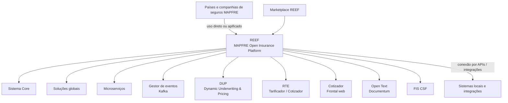
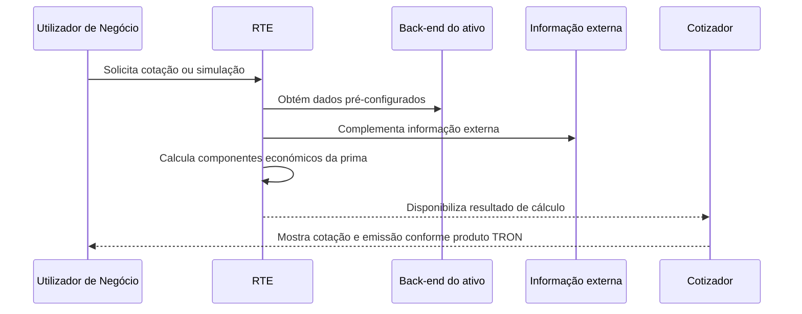
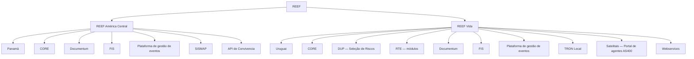

# REEF PaaS — Plataforma MAPFRE Open Insurance Platform, Governo, Serviços, Instâncias e Roadmap

## 1. Metadados do Documento
- **Arquivo de Origem:** `Não identificado no conteúdo fornecido`
- **Tipo de Documento:** `Apresentação Executiva`
- **Domínio / Sistema:** `REEF — MAPFRE Open Insurance Platform`
- **Público-Alvo:** `Negócio, Arquitetura, TI, Equipas de Produto, Operação e Países/Unidades MAPFRE`
- **Data/Versão Identificada:** `5 outubro 2023; dados atualizados a 3 outubro 2023`

---

## 2. Resumo Executivo & Contexto de Negócio

REEF é a plataforma que permite às companhias de seguros MAPFRE consumir soluções seguradoras em modalidade de serviço. A plataforma pode ser utilizada diretamente pelos países ou de forma “apificada”, conectando soluções REEF aos sistemas locais. REEF foi criado como um dos objetivos do Plano Estratégico de TI 2022–2024 e é identificado como a **MAPFRE Open Insurance Platform**.

O contexto de criação de REEF está relacionado aos pontos de dor da extensão TRON: descentralização, elevada dispersão de versões do núcleo, instalações locais desatualizadas e forte personalização por país. Embora o sistema seja comum, o documento informa que a reutilização é baixa, os tempos de atualização são longos e o suporte é complexo.

A plataforma busca atender necessidades dos países, incluindo incorporação rápida e eficiente de serviços para apoiar planos de negócio, produtos de seguro, soluções para clientes e colaboradores — como autosserviço, Quote&Buy e aplicações —, automação de tarefas e conectividade por APIs. REEF também visa combater desafios de obsolescência e segurança dos sistemas.

O modelo REEF combina um sistema Core, soluções globais, microserviços, um Marketplace e um modelo de governo. O Core é responsável pela configuração de produtos, emissão, sinistros, administração e funcionalidades comuns. O Marketplace disponibiliza componentes e incorpora continuamente capacidades funcionais provenientes de desenvolvimentos próprios, mercado e Insurtechs.

O documento descreve duas instâncias existentes: REEF América Central, utilizada pelo Panamá, e REEF Vida, utilizada pelo Uruguai. O roadmap prevê extensão da solução para seis países da América Central, desenvolvimento de capacidades globais para produtos de vida e expansão contínua de soluções no Marketplace.

---

## 3. Arquitetura, Componentes & Tecnologias Envolvidas

REEF é apresentado como uma plataforma de soluções seguradoras “as a Service”, orientada por um modelo de governo capaz de atender regiões, unidades e países. Os componentes descritos são organizados em Core, soluções globais, microserviços, serviços de eventos, gestão documental, geração de documentos, cálculo de risco e precificação, e canais de cotação/emissão.

| Componente / Tecnologia | Papel descrito no documento |
| :--- | :--- |
| **REEF** | Plataforma para consumo de soluções seguradoras em modalidade de serviço pelas companhias MAPFRE. |
| **MAPFRE Open Insurance Platform** | Denominação apresentada para REEF. |
| **Sistema Core** | Coração da plataforma; responsável pela configuração de produtos, processos de emissão, sinistros, administração e funções comuns. |
| **Marketplace REEF** | Oferta componentes e soluções em modalidade SaaS; incorpora capacidades funcionais continuamente. |
| **DUP** | Dynamic Underwriting & Pricing; ativo para cálculos dinâmicos de subscrição e pricing no negócio digital, com parametrização por utilizadores de negócio. |
| **RTE (Microservicio)** | Ativo digital tarificador/cotizador; calcula os componentes económicos que compõem o prémio das coberturas contratadas. |
| **Cotizador** | Frontal web para cotação e emissão de apólices de vários ramos; gera ecrãs dinamicamente conforme a definição do produto no TRON. |
| **FIS CSF** | Ferramenta de geração e distribuição de documentos, incluindo faturas, comunicados e contratos, a partir de modelos previamente desenhados. |
| **Open Text (Documentum)** | Gestor documental corporativo e repositório eletrónico para armazenamento, conservação, rastreabilidade, segurança e expurgo de documentação digital. |
| **Gestor de eventos / Kafka** | Serviço PaaS para gestão de eventos; disponibiliza infraestrutura para arquiteturas orientadas a eventos na integração MAPFRE. |
| **TRON** | Sistema operacional citado como origem da definição de produto para o Cotizador; também existe TRON Local na instância REEF Vida. |
| **SISMAP** | Sistema local integrado pela instância REEF América Central. |
| **API de Convivencia** | Integração citada para a instância REEF América Central. |
| **AS400** | Portal de agentes satélite integrado pela instância REEF Vida. |
| **RONDANET** | Serviço Web integrado pela instância REEF Vida. |
| **DNIC** | Serviço Web integrado pela instância REEF Vida. |
| **BI** | Capacidade prevista para inclusão no roadmap da América Central. |
| **BPM** | Solução global de suporte e capacidade prevista para inclusão no roadmap da América Central. |





> **Nota de Análise:** O documento identifica componentes, responsabilidades e integrações, mas não detalha contratos HTTP, formatos JSON, protocolos, versões de software, portas de rede ou topologia de infraestrutura.

---

## 4. Regras de Negócio, Especificações Funcionais & Processos

### 4.1. Consumo de soluções REEF

1. As companhias de seguros MAPFRE podem consumir soluções seguradoras em modalidade de serviço através de REEF.
2. Os países podem utilizar soluções diretamente na plataforma.
3. Os países também podem utilizar soluções de forma apificada, conectando REEF aos respetivos sistemas locais.
4. Os serviços construídos para REEF devem ser desenhados para ligação nativa e por configuração com a plataforma.
5. Pode existir mais de uma instância REEF, conforme as necessidades dos países.

### 4.2. Sistema Core e soluções globais

1. O Sistema Core atua como coração da plataforma.
2. O Sistema Core é responsável pela configuração de produtos.
3. O Sistema Core suporta processos de emissão.
4. O Sistema Core suporta processos de sinistros.
5. O Sistema Core suporta administração e funcionalidades comuns.
6. As soluções globais incluem soluções de atendimento ao cliente final e ao distribuidor, incluindo autosserviços e cotizadores/emissores.
7. As soluções globais incluem suporte para gestão documental, BPM, motor de regras, gestor de eventos, clientes e outros componentes.
8. Microserviços podem atender necessidades específicas, como cotação e subscrição de riscos.

### 4.3. Regras funcionais dos produtos REEF

#### DUP — Dynamic Underwriting & Pricing

- DUP permite realizar cálculos para gerir dinamicamente a subscrição e o pricing do negócio digital.
- DUP possui capacidades de parametrização pelos utilizadores de negócio.
- O documento não detalha fórmulas, critérios de aceitação de risco, parâmetros de pricing nem interfaces de DUP.

#### RTE — Microserviço tarificador/cotizador

- RTE funciona como motor de cálculo ou tarificação dos componentes económicos que formam o prémio das coberturas contratadas.
- RTE permite um serviço de cotação e simulação.
- O serviço parte de dados pré-configurados no back-end do ativo.
- O serviço complementa os dados pré-configurados com informação externa.
- O cálculo e apresentação do recibo de prémios dependem das combinações de modalidades e planos de pagamento existentes na configuração.
- O documento não informa os dados de entrada, os algoritmos de tarificação, as fontes externas nem os contratos expostos por RTE.

#### Cotizador

- O Cotizador é um frontal web para cotação e emissão de apólices de diferentes ramos.
- O Cotizador gera dinamicamente os ecrãs com base na definição de produto do sistema operacional TRON.
- O documento não detalha os ramos suportados, etapas de emissão, campos de ecrã ou integrações técnicas do Cotizador.

#### FIS CSF

- FIS CSF gera documentos como faturas, comunicados e contratos.
- FIS CSF distribui documentos através dos canais providos.
- A ferramenta compõe cada documento a partir de um modelo previamente desenhado.
- O documento não identifica modelos, canais de distribuição, formatos de ficheiro ou regras de composição documental.

#### Open Text (Documentum)

- Open Text (Documentum) atua como gestor documental corporativo.
- Open Text (Documentum) atua como repositório eletrónico para documentação digital da organização.
- As capacidades citadas são armazenamento, conservação, rastreabilidade, segurança e expurgo.
- O documento não descreve políticas de retenção, regras de expurgo, perfis de acesso ou metadados documentais.

#### Gestor de eventos com Kafka

- O Gestor de eventos é um serviço PaaS para gestão de eventos com Kafka.
- O serviço disponibiliza infraestrutura para arquiteturas orientadas a eventos na integração MAPFRE.
- Factos de negócio são disparados e recolhidos numa fila.
- Aplicações podem subscrever-se e receber notificações de factos de negócio em tempo real.
- O documento não especifica tópicos Kafka, esquemas de evento, retenção, garantias de entrega ou mecanismos de autenticação.

### 4.4. Governo REEF

O modelo de governo REEF possui os seguintes objetivos:

| Dimensão de Governo | Regras, objetivos e responsabilidades descritas |
| :--- | :--- |
| **Garantir a operação** | Habilitar e executar serviços associados à plataforma para garantir a sua operação. |
| **Procedimentos** | Estabelecer procedimentos operacionais e modelo de operação para gestão de incidentes, gestão de demanda e outros processos. |
| **FinOps** | Estabelecer critérios de custo; conhecer, acompanhar e controlar o custo de cada componente da solução, procurando eficiência. |
| **Cobertura funcional** | Promover aumento gradual da cobertura funcional por novas soluções e ampliação das capacidades das soluções existentes. |
| **Reparto de responsabilidades** | Definir a divisão de responsabilidades entre Corporativo e local na execução dos serviços estabelecidos. |

REEF é descrito como uma organização orientada a produto. O modelo operacional inclui equipas estáveis, autónomas, multidisciplinares e multifuncionais; fortalecimento de comunidades; negócio integrado na equipa como Owners; gestão de um backlog comum; impulso e acompanhamento de planos de curto prazo; e foco na entrega de valor através do produto.

### 4.5. Reef Council

1. O Reef Council é um comité mensal de acompanhamento.
2. O Reef Council define a visão, estratégia e roadmap de REEF.
3. O Reef Council define e assegura os OKRs.
4. O Reef Council estabelece políticas e melhores práticas.
5. O Reef Council define o modelo operacional.
6. O Reef Council estabelece prioridades, mitiga riscos e resolve conflitos.
7. O Reef Council assegura alinhamento de todas as partes envolvidas.
8. Os membros indicados são Reef Manager, Product Manager das equipas de produto e Responsável por Comunidades.

### 4.6. Procedimentos normativos

O marco normativo REEF define procedimentos para gestão e evolução dos componentes da plataforma.

| Procedimento | Finalidade |
| :--- | :--- |
| **Procedimento de versionamento** | Define a operação para versionamento de software dos componentes REEF, incluindo major releases, patches e hotfixes. |
| **Procedimento de regularização de dados** | Define a operação para realizar regularizações de dados em ambientes produtivos. |
| **Procedimento de catalogação de ativos no Marketplace** | Define a publicação de soluções no Marketplace REEF e deve garantir que a solução cumpre os requisitos estabelecidos para esse fim. |

### 4.7. Catálogo de Serviços REEF

O Catálogo de Serviços deve estabelecer os serviços prestados pela plataforma e o respetivo modelo de governo. Também deve relacionar os serviços e os acordos de nível de serviço definidos por cada Delivery Unit.

| Categoria | Responsabilidades ou serviços descritos |
| :--- | :--- |
| **Software de Produto — Delivery Unit Corporativa** | Construção; documentação; asseguramento da qualidade; produção de releases; suporte ao software de produto; suporte à instalação de CIMS. |
| **Software personalizado — Delivery Unit Regional/local** | Integração com sistemas locais; desenvolvimento de personalizações locais; projetos de configuração de produtos; asseguramento da qualidade; produção de releases de software local. |
| **Plataforma e Operação** | Gestão de infraestrutura; observabilidade e monitorização; controlo da dispersão; atualizações de software; controlo de segurança; Disaster Recovery. |
| **Explotação** | Service Desk; suporte funcional de nível 1 e 2; suporte funcional ao Core; deploy do software de produto Core; deploy do software local REEF; exploração de batch; controlo de acessos; configuração geral do sistema; formação. |
| **Governo** | Estratégia de evolução da plataforma; FinOps; OKRs; metodologia de desenvolvimento. |

### 4.8. Marketplace REEF

1. O Marketplace REEF permite consumo de soluções em modalidade SaaS.
2. As soluções do Marketplace são orientadas ao negócio.
3. O Marketplace inclui soluções desenvolvidas internamente e/ou de mercado.
4. As soluções devem ser aprovadas na MAPFRE em arquitetura e segurança.
5. As soluções devem estar em uso.
6. Os objetivos declarados incluem redução de custos, visibilidade de ativos ocultos no âmbito local, prevenção de desenvolvimentos duplicados e redução da dispersão.
7. O documento indica 22 soluções disponíveis, sendo 15 em 2023.
8. Notícias do Marketplace são publicadas periodicamente na Intranet Global.
9. As soluções são apresentadas por utilizadores de Negócio e pela equipa de TI.

### 4.9. Instâncias REEF



#### REEF América Central

- É utilizada pelo Panamá.
- Utiliza CORE, Documentum, FIS e a Plataforma de gestão de Eventos.
- Possui produtos corporativos estandardizados com implantações locais por configuração.
- Integra com SISMAP, identificado como sistema local.
- Integra com API de Convivencia.

#### REEF Vida

- É utilizada pelo Uruguai.
- Utiliza CORE.
- Utiliza DUP para Seleção de Riscos.
- Utiliza módulos RTE.
- Utiliza Documentum, FIS e a Plataforma de gestão de Eventos.
- Possui produtos corporativos estandardizados com implantações locais por configuração.
- Integra com TRON Local para sincronização de Terceiros, Fechos/Contabilidade, Cobranças e Pagamentos e Gestão de Recibos.
- Integra com satélites, incluindo Portal de agentes AS400.
- Integra com Webservices para consulta e cobrança online de recibos, consulta e cobrança de ordens de pagamento, Serviço Web RONDANET e Serviço Web DNIC.

### 4.10. Roadmap

#### América Central

- Extensão da solução a seis países da América Central e dez produtos durante quatro anos.
- Implementação simultânea de um produto para seis países, reduzindo o tempo de deploy e assegurando unificação.
- Inclusão das soluções de Cotizador, BI, BPM e outras capacidades adicionadas a REEF.
- Redução de custos recorrentes de 1,2 M€ em 2028, associada ao descomissionamento de sistemas legacy.

#### Vida

- Desenvolvimento de capacidades globais para gestão de produtos de vida.
- Produtos corporativos estandardizados com implantações locais por configuração.
- Implementação de frontal web cotizador/contratador integrado como parte da plataforma.
- MVP para produto de vida misto/dotal no Uruguai em novembro de 2023.

---

## 5. Tabelas de Parâmetros, Ambientes e Estruturas de Dados

| Item / Parâmetro | Descrição / Função | Tipo / Valores / Formato | Ambiente / Observações |
| :--- | :--- | :--- | :--- |
| REEF | Plataforma para consumo de soluções seguradoras como serviço. | Plataforma / PaaS | Companhias de seguros MAPFRE; uso direto ou apificado. |
| Sistema Core | Configuração de produtos, emissão, sinistros, administração e comuns. | Sistema Core | Componente central da plataforma. |
| DUP | Cálculo dinâmico para subscrição e pricing do negócio digital. | Ativo | Parametrizável por utilizadores de negócio. |
| RTE | Cálculo/tarificação de componentes económicos da prima. | Microserviço / ativo digital | Permite cotação e simulação com dados de back-end e informação externa. |
| Cotizador | Cotação e emissão de apólices. | Frontal web | Ecrãs gerados dinamicamente a partir da definição de produto TRON. |
| FIS CSF | Geração e distribuição de documentos. | Ferramenta | Gera, entre outros, faturas, comunicados e contratos a partir de modelos. |
| Open Text (Documentum) | Repositório e gestor documental corporativo. | Gestor documental | Armazenamento, conservação, rastreabilidade, segurança e expurgo. |
| Gestor de eventos | Gestão de eventos e suporte a arquiteturas orientadas a eventos. | Serviço PaaS com Kafka | Aplicações subscrevem-se para receber notificações de factos de negócio em tempo real. |
| Marketplace REEF | Catálogo e consumo de soluções. | Marketplace / SaaS | Soluções internas ou de mercado, aprovadas em arquitetura e segurança MAPFRE e em uso. |
| Procedimento de versionamento | Regula versões de software REEF. | Procedimento | Inclui major releases, patches e hotfixes. |
| Procedimento de regularização de dados | Regula regularizações de dados. | Procedimento | Aplicável a ambientes produtivos. |
| Procedimento de catalogação de ativos | Regula publicação de soluções no Marketplace. | Procedimento | Deve assegurar cumprimento dos requisitos para publicação. |
| REEF América Central | Instância REEF utilizada pelo Panamá. | Instância | CORE, Documentum, FIS, plataforma de eventos, SISMAP e API de Convivencia. |
| REEF Vida | Instância REEF utilizada pelo Uruguai. | Instância | CORE, DUP, RTE, Documentum, FIS, plataforma de eventos, TRON Local, satélites e Webservices. |
| Redução de custos recorrentes | Benefício previsto no roadmap América Central. | 1,2 M€ | Previsto para 2028; associado ao descomissionamento de sistemas legacy. |
| Cobertura América Central | Extensão planeada da solução. | 6 países e 10 produtos | Horizonte de quatro anos. |
| Marketplace — soluções disponíveis | Quantidade indicada de soluções. | 22 soluções | O documento indica 15 em 2023. |
| Atividade REEF | Pessoas com tarefas atribuídas. | 59 pessoas | Dados acumulados desde dezembro de 2021 até 3 outubro de 2023. |
| Atividade REEF | Equipas. | 16 equipas | Produtos, comunidades e suporte. |
| Atividade REEF | Média de Story Points por sprint. | Mais de 680 | Apenas histórias de prioridade alta. |
| Atividade REEF | Média de Story Points feitos por sprint. | Mais de 420 | Apenas histórias de prioridade alta. |
| Atividade REEF | Pilotos orientados a produto. | 4 pilotos | Dados atualizados a 3 outubro de 2023. |
| Atividade REEF | Épicas. | 169 épicas | Inclui 27 compromissos estratégicos e 13 compromissos estratégicos em Q4. |
| Atividade REEF | Histórias de utilizador concluídas. | 1,8 mil | Dados acumulados desde dezembro de 2021. |
| Atividade REEF | Sprints principais em paralelo. | 2 sprints | Atividade REEF. |
| Atividade REEF | Tempo de vida. | Quase 2 anos | Dados atualizados a 3 outubro de 2023. |
| Sprint planning | Cadência de planeamento. | A cada 3 semanas | Equipas ágeis REEF. |
| Retrospectiva | Cadência de retrospectiva. | A cada 3 semanas | Equipas ágeis REEF. |
| Reef Council | Órgão máximo de governo. | Comité mensal de acompanhamento | Define visão, estratégia, roadmap, OKRs, prioridades e modelo operacional. |

### Equipas de Produto e Responsáveis Identificados

| Área / Equipa | Product Manager | Product Owner | Scrum Master |
| :--- | :--- | :--- | :--- |
| APIs | Pablo Velázquez | Pedro Sacristán | Jorge Huete |
| Vida | David de Francisco | Hugo Machado | Marta Martín |
| Cotizador | Ignacio Arcusa | Hugo Machado | Sara Martinez |
| Gestão Documental | Luis Balairón | Hugo Machado / Ivis S. Rokas / Moisés Rovira | Alicia Arroyo |
| TRON | Raúl Tejado | ACO | Carolina Vázquez |

| Comunidade / Função | Pessoas identificadas |
| :--- | :--- |
| Transformação | Cristina Pérez; Andrea García; Fernando Cano; Sonia Molina |
| Arquitetura | Não detalhado individualmente no conteúdo apresentado. |
| Infraestrutura | Antonio Sanchez; Fidel Moreno; Miguel Angel Muñoz; Abel Fiz; Jose Antonio Martinez Pla |
| Segurança | Juan Manuel Muñoz; Omar Molinero |
| Comunidades | David Jimenez; Emilio Jaen; Alberto Rodrigo; Hugo Roces; Nacho Arcusa |
| FinOps | Jose de Abreu; Javier Tello |
| Cloud | Mat Jovanovic; Raiza Acosta |

---

## 6. Bateria de Perguntas & Respostas para RAG (FAQ Sintético)

### P1: O que é a plataforma REEF na MAPFRE?
**R:** REEF é a plataforma que permite às companhias de seguros MAPFRE consumir soluções seguradoras em modalidade de serviço. REEF é também denominado MAPFRE Open Insurance Platform. Os países podem utilizar as soluções diretamente na plataforma ou de forma apificada, conectando REEF aos seus sistemas locais.

### P2: Que problemas da extensão TRON motivaram a criação de REEF?
**R:** O documento aponta descentralização, elevado grau de dispersão das versões do núcleo, instalações locais com versões não atualizadas e forte personalização nos países. Apesar de o sistema ser comum, a reutilização era baixa, os tempos de atualização eram longos e o suporte era complexo.

### P3: Qual é a responsabilidade do Sistema Core em REEF?
**R:** O Sistema Core atua como coração da plataforma REEF. O Core é responsável pela configuração de produtos, pelos processos de emissão, pelos sinistros, pela administração e pelas funcionalidades comuns.

### P4: Como funciona o RTE dentro do ecossistema REEF?
**R:** O RTE é um microserviço e ativo digital tarificador/cotizador. O RTE calcula todos os componentes económicos que constituem o prémio das coberturas contratadas. O RTE permite cotação e simulação com base em dados pré-configurados no back-end do ativo, complementados por informação externa, mostrando o recibo de prémios conforme modalidades e planos de pagamento configurados.

### P5: Qual é a função do Cotizador REEF?
**R:** O Cotizador é um frontal web que permite cotação e emissão de apólices de distintos ramos. As telas do Cotizador são geradas dinamicamente a partir da definição de produto no sistema operacional TRON.

### P6: Como o Gestor de Eventos REEF utiliza Kafka?
**R:** O Gestor de Eventos é um serviço PaaS para gestão de eventos com Kafka. O serviço fornece infraestrutura para arquiteturas orientadas a eventos na integração MAPFRE. Factos de negócio são disparados e recolhidos numa fila, e as aplicações podem subscrever-se para receber notificações desses factos em tempo real.

### P7: Quais são os objetivos do governo REEF?
**R:** O governo REEF busca garantir a operação da plataforma, estabelecer procedimentos e um modelo operacional para incidentes e gestão de demanda, definir critérios FinOps, aumentar gradualmente a cobertura funcional e distribuir responsabilidades entre o âmbito Corporativo e os âmbitos regionais ou locais.

### P8: Quais decisões e responsabilidades pertencem ao Reef Council?
**R:** O Reef Council é um comité mensal de acompanhamento. Define a visão, estratégia e roadmap de REEF; define e assegura os OKRs; estabelece políticas e melhores práticas; define o modelo operacional; estabelece prioridades; mitiga riscos; resolve conflitos; e assegura o alinhamento das partes envolvidas.

### P9: Quais procedimentos normativos são definidos para REEF?
**R:** O documento identifica três procedimentos: versionamento de software, regularização de dados em ambientes produtivos e catalogação de ativos no Marketplace. O procedimento de versionamento abrange major releases, patches e hotfixes. O procedimento de catalogação deve assegurar que a solução publicada cumpre os requisitos estabelecidos.

### P10: Que componentes e integrações utiliza a instância REEF América Central?
**R:** REEF América Central é utilizada pelo Panamá. Utiliza CORE, Documentum, FIS e a Plataforma de gestão de Eventos. Trabalha com produtos corporativos estandardizados implantados localmente por configuração e integra com SISMAP, identificado como sistema local, e com a API de Convivencia.

### P11: Que componentes e integrações utiliza a instância REEF Vida?
**R:** REEF Vida é utilizada pelo Uruguai. Utiliza CORE, DUP para Seleção de Riscos, módulos RTE, Documentum, FIS e a Plataforma de gestão de Eventos. Integra com TRON Local para sincronização de Terceiros, Fechos/Contabilidade, Cobranças e Pagamentos e Gestão de Recibos; com o Portal de agentes AS400; e com Webservices para consultas e cobranças de recibos e ordens de pagamento, RONDANET e DNIC.

### P12: Quais resultados são esperados no roadmap da América Central?
**R:** O roadmap prevê extensão para seis países da América Central e dez produtos em quatro anos. Prevê implementação simultânea de um produto para seis países, redução do tempo de deploy, unificação, inclusão de Cotizador, BI, BPM e outras capacidades adicionadas a REEF. Também prevê redução de custos recorrentes de 1,2 M€ em 2028 mediante descomissionamento de sistemas legacy.

---

## 7. Glossário de Termos, Siglas & Conceitos-Chave

- **API:** Interface de programação citada como mecanismo de conectividade com outros sistemas e como modalidade “apificada” de uso das soluções REEF.
- **API de Convivencia:** Integração citada na instância REEF América Central; o documento não detalha a sigla, contrato ou funcionalidade.
- **AS400:** Plataforma referida no documento como Portal de agentes AS400 integrado pela instância REEF Vida.
- **BI:** Capacidade citada para inclusão no roadmap da América Central; o documento não expande a sigla.
- **BPM:** Solução global de suporte citada no documento; também prevista no roadmap da América Central. O documento não expande a sigla.
- **CIMS:** Elemento para o qual a Delivery Unit Corporativa presta suporte à instalação; o documento não expande a sigla.
- **Core:** Sistema central da plataforma responsável por configuração de produtos, emissão, sinistros, administração e comuns.
- **Cotizador:** Frontal web para cotação e emissão de apólices de diferentes ramos.
- **Delivery Unit:** Unidade para a qual o Catálogo de Serviços determina responsabilidades corporativas e regionais/locais.
- **DNIC:** Serviço Web integrado pela instância REEF Vida; o documento não detalha o significado.
- **DUP:** Dynamic Underwriting & Pricing; ativo que realiza cálculos dinâmicos de subscrição e pricing do negócio digital.
- **FinOps:** Dimensão de governo para definição, acompanhamento e controlo dos custos dos componentes da solução.
- **FIS CSF:** Ferramenta para geração e distribuição de documentos a partir de modelos desenhados previamente.
- **Hotfix:** Tipo de versionamento de software citado no procedimento de versionamento; não há definição adicional no documento.
- **Insurtechs:** Fonte possível de capacidades funcionais incorporadas continuamente no Marketplace REEF.
- **Kafka:** Tecnologia citada para gestão de eventos no serviço PaaS de eventos.
- **Marketplace REEF:** Espaço de oferta e consumo de soluções em modalidade SaaS.
- **MVP:** Marco previsto para produto de vida misto/dotal no Uruguai em novembro de 2023; o documento não expande a sigla.
- **OKR:** Objetivo de governo que o Reef Council define e assegura; o documento não expande a sigla.
- **Open Text (Documentum):** Gestor documental corporativo e repositório eletrónico para documentação digital.
- **PaaS:** Modalidade pela qual REEF é apresentado; o documento associa REEF a uma plataforma de soluções seguradoras “as a Service”.
- **Pricing:** Precificação no contexto de cálculos dinâmicos realizados por DUP.
- **REEF:** MAPFRE Open Insurance Platform para consumo de soluções seguradoras como serviço.
- **RONDANET:** Serviço Web integrado pela instância REEF Vida; o documento não detalha o significado.
- **RTE:** Microserviço e ativo digital tarificador/cotizador para cálculo de prémios.
- **SaaS:** Modalidade de consumo de soluções oferecidas pelo Marketplace REEF.
- **SISMAP:** Sistema local integrado pela instância REEF América Central.
- **Story Points:** Métrica de atividade apresentada para sprints REEF, considerando apenas histórias de prioridade alta.
- **TRON:** Sistema operacional cuja definição de produto orienta a geração dinâmica de telas do Cotizador.
- **TRON Local:** Sistema integrado pela instância REEF Vida para sincronização de terceiros, contabilidade, cobranças, pagamentos e gestão de recibos.

---

## 8. Notas Críticas, Riscos & Limitações

- O documento apresenta REEF em nível executivo e funcional; não detalha arquitetura de infraestrutura, rede, autenticação, autorização, contratos de API, formatos de mensagens, SLAs, RPO, RTO ou procedimentos de Disaster Recovery.
- O documento cita Kafka, mas não especifica tópicos, produtores, consumidores, esquemas de eventos, retenção, segurança ou garantias de entrega.
- O documento cita procedimentos de versionamento, regularização de dados e catalogação de ativos, mas não apresenta os passos operacionais completos, critérios de aprovação, responsáveis por etapa ou evidências exigidas.
- As responsabilidades corporativas, regionais e locais são identificadas por categoria, mas não há matriz RACI completa.
- O Catálogo de Serviços deve relacionar serviços e acordos de nível de serviço, mas os valores de SLA não são apresentados.
- A operação inclui controlo da dispersão, atualizações de software, segurança e Disaster Recovery, mas o documento não informa métricas, ferramentas, calendário, regras de escalonamento ou modelos de recuperação.
- O roadmap da América Central prevê redução de custos recorrentes de 1,2 M€ em 2028 associada ao descomissionamento de sistemas legacy; o documento não apresenta cálculo financeiro, baseline, premissas nem plano de descomissionamento.
- As instâncias REEF América Central e REEF Vida possuem integrações identificadas, mas não há detalhe sobre métodos, frequência, sincronização, tratamento de falhas ou propriedade dos dados.
- Os dados de atividade REEF são acumulados desde dezembro de 2021 até 3 de outubro de 2023 e não devem ser interpretados como métricas atuais posteriores a essa data.
- **Nota de Análise:** O documento menciona o microsserviço RTE, DUP, TRON Local e múltiplos Webservices, porém não detalha métodos HTTP, contratos JSON, esquemas de dados ou endpoints expostos.

---

## 9. Conteúdo Bruto Estruturado (Referência Fiel)

```text
--- [PÁGINA 1 DE 30] ---

1
Presentación
Reef PaaS
5 octubre 2023


--- [PÁGINA 2 DE 30] ---

Antecedentes Reef
Reef como PaaS
Servicios Reef
Instancias Reef
Roadmap Reef
2


--- [PÁGINA 3 DE 30] ---

3
Extensión TRON Puntos de dolor
- Descentralización
- Alto grado de dispersión versión núcleo
- Instalaciones locales con versiones no
actualizadas
- Fuerte personalización en los países
_antecedentes
Aunque el sistema es común:
- la reutilización es baja,
- los tiempos de actualización del sistema son
largos y
- el soporte es complejo.


--- [PÁGINA 4 DE 30] ---

4
Necesidades de los países
- Incorporar rápida y de manera eficiente servicios en los sistemas que les permita desarrollar
sus planes de negocio
- Productos de seguro
- Soluciones para clientes y colaboradores: Autoservicio, Quote&Buy, APPs.
- Automatización de tareas
- Conectividad con otros sistemas a través de API
- Combatir los desafíos de obsolescencia y de seguridad de los sistemas
_antecedentes


--- [PÁGINA 5 DE 30] ---

Antecedentes Reef
Reef como PaaS
Servicios Reef
Instancias Reef
Roadmap Reef
5


--- [PÁGINA 6 DE 30] ---

6
¿Qué es Reef?
Es el nombre de la Plataforma que permite a
las compañías de seguro de MAPFRE consumir
soluciones aseguradoras en modalidad de
servicio.
Los países pueden usar directamente las
soluciones en la propia Plataforma o de forma
apificada (conectada) con sus sistemas
locales.
Reef nace…
Como uno de los objetivos en el Plan Estratégico de TI 2022-2024
_Reef como PaaS


--- [PÁGINA 7 DE 30] ---

7
_Reef como PaaS
¿Qué es REEF?
MAPFRE Open Insurance Platform
¿Qué es REEF?
MAPFRE Open Insurance Platform


--- [PÁGINA 8 DE 30] ---

8
Plataforma
Soluciones aseguradoras
As a Service
Gobierno
Para establecer un modelo de entrega que sea capaz de servir a todas las regiones, unidades y países, en
base a un modelo de gobierno.
Sistema Core
Que actúa como corazón de la Plataforma, responsable de la configuración de los productos, procesos de
emisión, siniestros, administración y comunes.
Soluciones globales
• de atención al cliente final y distribuidor Autoservicios, Cotizadores / Emisores.
• de soporte para Gestión Documental, BPM, Motor de Reglas, gestor de eventos, Clientes, etc.
• microservicios para dar respuesta a necesidades específicas (cotización, suscripción de riesgos)
_Reef como PaaS
Marketplace
Los componentes son ofertados en un Marketplace en el que se van incorporando más capacidades
funcionales de forma continua (desarrollos propios, de mercado, de Insurtechs,…).


--- [PÁGINA 9 DE 30] ---

9
_Reef como PaaS


--- [PÁGINA 10 DE 30] ---

10
_Reef como PaaS
DUP
Dynamic Underwriting & Pricing.
Activo que permite realizar cálculos para gestionar de
manera dinámica la Suscripción y Pricing del negocio
digital y con capacidades de parametrización de los
usuarios de negocio.
RTE (Microservicio)
Activo digital tarificador / cotizador.
Sirve como motor de cálculo o tarificación de todos los
componentes económicos que conforman la prima de
las coberturas contratadas.
Posibilita un servicio de cotización / simulación en el
que, partiendo de datos preconfigurados en el back-
end del activo y complementados con información
externa, permite calcular y mostrar el recibo de primas
de acuerdo a las combinaciones de las modalidades y
planes de pago contemplados en su configuración.
Productos Reef
Cotizador
Frontal web que permite la cotización y emisión de
pólizas de distintos ramos.
El sistema genera dinámicamente las pantallas en
base a la definición del producto del sistema
operacional (TRON).
FIS
FIS CSF es una herramienta para la generación de
documentos tales como facturas, comunicados,
contratos, etc. y su posterior distribución por los
canales provistos.
La herramienta compone un documento a partir de
una plantilla previamente diseñada.
Open Text (Documentum)
Gestor documental corporativo que actúa como
repositorio electrónico ofreciendo las siguientes
capacidades sobre la documentación digital de la
organización: almacenamiento, conservación,
trazabilidad, seguridad y expurgo.
Gestor de eventos
Servicio PaaS para la gestión de eventos con Kafka.
Ofrece la infraestructura para la implementación de
arquitecturas orientadas a eventos como parte de la
integración en MAPFRE.
Los hechos de negocio (eventos) se disparan y se
recogen en una cola. Las aplicaciones pueden
suscribirse y recibir la notificación del hecho de
negocio en tiempo real.


--- [PÁGINA 11 DE 30] ---

Antecedentes Reef
Reef como PaaS
Servicios Reef
Gobierno
Catálogo de Servicios
Marketplace
Instancias Reef
Roadmap Reef
11


--- [PÁGINA 12 DE 30] ---

12
_servicios Reef
Un modelo de gobierno… ¿para qué?
Gobierno Reef
Garantizar la Operación
Habilitar y ejecutar los
servicios asociados a la
Plataforma de tal
manera que se
garantice la operación
de la misma.
Procedimientos
Establecer los
procedimientos que
permitan la operación,
así como el modelo
operativo para la gestión
de incidentes, gestión de
demanda, entre otros.
FinOps
Establecer los criterios
de coste (FinOps).
Tener conocimiento del
coste de cada uno de
los componentes que
conforman la solución,
así como el seguimiento
y control de los mismos
con el ánimo de
eficientarlos.
Cobertura funcional
Velar por el incremento
de la cobertura funcional
de Reef de forma gradual
con la inclusión
progresiva de nuevas
soluciones y ampliando
las capacidades
funcionales de las
soluciones ya existentes.
Reparto
responsabilidades
Establecer el reparto
de responsabilidades
entre Corporativo y
local en la ejecución
de los servicios
establecidos.


--- [PÁGINA 13 DE 30] ---

13
_servicios Reef
Gobierno Reef
Reef es una organización orientada a Producto, lo que implica un cambio en la forma de trabajar
Organización Reef: nuevo modelo operativo
Equipos estables,
autónomos,
multidisciplinares y
multifuncionales
Potenciando las
comunidades
Negocio como parte del
equipo: Owners
Impulso y seguimiento de
los planes a corto plazo
Gestión de un mismo
backlog
Foco en la entrega de
valor: el Producto


--- [PÁGINA 14 DE 30] ---

14
_servicios Reef
Órganos de Gobierno – Reef Council
Gobierno Reef
- Comité mensual de seguimiento (Reef Council)
- Objetivo:
o Definir la visión, estrategia y roadmap de Reef
o Definir y asegurar los OKR´s
o Establece políticas y mejores prácticas
o Define el modelo operativo
o Establece prioridades, mitiga riesgos y resuelve
conflictos
o Asegura el alineamiento de todas las partes implicadas
- Miembros:
o Reef Manager
o Product Manager de equipos de producto
o Responsable Comunidades


--- [PÁGINA 15 DE 30] ---

15
_servicios Reef
Gobierno Reef
APIs
Product Manager: Pablo Velázquez
Product Owner: Pedro Sacristán
Scrum Master: Jorge Huete
Vida
Product Manager: David de Francisco
Product Owner: Hugo Machado
Scrum Master: Marta Martín
Cotizador
Product Manager: Ignacio Arcusa
Product Owner: Hugo Machado
Scrum Master: Sara Martinez
Gestión Documental
Product Manager: Luis Balairón
Product Owner: Hugo Machado/Ivis S.Rokas
/ Moisés Rovira
Scrum Master: Alicia Arroyo
TRON
Product Manager: Raúl Tejado
Product Owner: ACO
Scrum Master: Carolina Vázquez
Equipos de producto
Transformación
Cristina Pérez
Andrea García
Fernando Cano
Sonia Molina
Arquitectura
Infraestructura
Antonio Sanchez
Fidel Moreno
Miguel Angel Muñoz
Abel Fiz
Jose Antonio Martinez Pla
Seguridad
Juan Manuel Muñoz
Omar Molinero
Comunidades
David Jimenez
Emilio Jaen
Alberto Rodrigo
Hugo Roces
Nacho Arcusa
FinOps
Jose de Abreu
Javier Tello
Cloud
Mat Jovanovic
Raiza Acosta


--- [PÁGINA 16 DE 30] ---

16
_servicios Reef
Gobierno Reef
Reef es una familia de equipos de producto con visión completa donde…¡TODO SUMA!
59
personas
con tareas
asignadas
16
equipos
(productos,
comunidades,
soporte)
+680 Story
Points de
media por
sprint (*)
4 pilotos
orientados a
Producto
169 épicas
(27 compromisos
estratégicos,
13 compromisos
estratégicos en
Q4)
1.8k
historias
de usuario
completadas
2 sprints
principales en
paralelo
Casi 2 años
de vida
+420 Story
Points de
media hechos
por sprint (*)
13 en Q4
(datos acumulados desde diciembre 2021 a 3 octubre 2023)
(*) sólo historias de prioridad alta
Equipos ágiles
organizados y
sincronizados
Sprint planning
Cada 3
semanas
Eventos
diarios
equipos de
producto
Retrospectiva
Cada 3
semanas
REEF
Council
máximo órgano
de gobierno
Actividad
Reef
Datos actualizados a 3 octubre 2023


--- [PÁGINA 17 DE 30] ---

17
_servicios Reef
Seguimiento Tiempos de Entrega
Gobierno Reef
Midiendo para mejorar


--- [PÁGINA 18 DE 30] ---

18
_servicios Reef
Marco normativo
Gobierno Reef
Establecer procedimientos de actuación para la correcta gestión y evolución de los componentes de Reef:
o Procedimiento de versionado:
Operativa a seguir para realizar versionados de software en componentes de la Plataforma Reef (major
releases, parches y hotfix).
o Procedimiento de regularización de datos
Operativa a seguir para realizar las regularizaciones de datos en entornos productivos.
o Procedimiento de catalogación de activos en Marketplace
Procedimiento para la publicación de soluciones en el Marketplace de Reef. El procedimiento debe
garantizar que la solución que se ofrece en el Marketplace cumple con los requisitos establecidos para
tal fin.
Catalogación
activos MP
Regularización
datos
Versionado
software


--- [PÁGINA 19 DE 30] ---

19
_servicios Reef Catálogo de servicios Reef
Se hace necesario establecer un Catálogo de
Servicios que presta la Plataforma, así como el
modelo de gobierno de los mismos …
Software de Producto
Determinar las responsabilidades que tiene la Delivery Unit Corporativa
• construcción,
• documentación,
• aseguramiento de la
calidad,
• producción de las
releases,
• soporte del SW de
Producto
• soporte a la instalación de
CIMS.
Determinar las responsabilidades que tiene la Delivery Unit Regional/local
Relacionar los servicios y acuerdos de nivel de servicio que cada Delivery
Unit establece
Software
personalizado
• integración con sistemas
locales,
• desarrollo de
personalizaciones locales,
• proyectos de
configuración de
Productos,
• aseguramiento de la
calidad
• producción de las releases
de SW local.
Plataforma y
Operación
• gestión de la
infraestructura,
• observabilidad y
monitorización,
• control de la dispersión,
• actualizaciones de SW,
• control de la Seguridad
• Disaster Recovery
Explotación
• Service Desk,
• soporte funcional nivel 1 y
2,
• soporte funcional a Core,
• despliegue del SW de
Producto Core,
• despliegue del SW local de
Reef,
• explotación del batch,
• control de accesos,
• configuración general del
sistema
• formación
Gobierno
• estrategia de la evolución
de la Plataforma,
• FinOps,
• OKR´s
• metodología de desarrollo
… para


--- [PÁGINA 20 DE 30] ---

20
Servicios que ofrece la Plataforma: ámbito responsabilidad
_servicios Reef Catálogo de servicios Reef


--- [PÁGINA 21 DE 30] ---

21
Marketplace Reef
Consumo de soluciones en
modalidad de servicio (SaaS)
Orientadas a negocio
Soluciones desarrollo interno
y/o de mercado aprobadas
en MAPFRE (arquitectura y
seguridad) y en uso
_Reducción de costes
_Dar visibilidad a activos
ocultos en el ámbito local
_Prevenir desarrollos
duplicados
_Evitar la dispersión
_marketplace
22
Soluciones
disponibles
[15 en 2023]
Acceder Marketplace


--- [PÁGINA 22 DE 30] ---

22
_marketplace
De forma periódica se publican noticias del Marketplace en la Intranet Global.
Las soluciones son presentadas por los usuarios de Negocio y por el equipo de TI
¡¡síguenos!!
Divulgación Marketplace


--- [PÁGINA 23 DE 30] ---

Antecedentes Reef
Reef como PaaS
Servicios Reef
Instancias Reef
Roadmap Reef
23


--- [PÁGINA 24 DE 30] ---

24
Los servicios son construidos para Reef
- Todas las funcionalidades son diseñadas para conectar nativamente y por configuración con Reef.
Puede haber más de una instancia Reef
- De acuerdo a las necesidades de los países pueden ser generadas una o más instancias de Reef.
- Actualmente existen dos instancias de Reef:
- América Central
- Vida
_instancias Reef


--- [PÁGINA 25 DE 30] ---

25
_instancias Reef
Reef América Central
▪ Utilizada por Panamá
▪ Utiliza: CORE, Documentum, FIS y la
Plataforma de gestión de Eventos
▪ Productos corporativos estandarizados
con implantaciones locales por
configuración.
▪ Integra con: SISMAP (sistema local), API de
Convivencia.


--- [PÁGINA 26 DE 30] ---

26
_instancias Reef
Reef Vida
▪ Utilizada por Uruguay
▪ Utiliza: CORE, DUP (Selección de Riesgos),
RTE (módulos), Documentum, FIS y la
Plataforma de gestión de Eventos
▪ Productos corporativos estandarizados
con implantaciones locales por
configuración.
Integra con:
• TRON Local: sincronización de Terceros, Cierres/Contabilidad, Cobros y Pagos, Gestión de Recibos
• Satelitales: Portal de agentes AS400
• Webservices: Consulta y cobro de recibos online, Consulta y cobro de órdenes de pago, Servicio Web RONDANET y Servicio Web DNIC.


--- [PÁGINA 27 DE 30] ---

Antecedentes Reef
Reef como PaaS
Servicios Reef
Instancias Reef
Roadmap Reef
27


--- [PÁGINA 28 DE 30] ---

28
_roadmap Reef
América Central
o Extensión de la solución a 6 países de América Central y 10
productos (4 años).
o La implementación de un producto simultáneo para seis países,
reduciendo el tiempo de despliegue y asegurando unificación.
o Inclusión de las soluciones de Cotizador, BI, BPM y otras
capacidades que se están añadiendo a REEF.
o Reducción costes recurrentes (1,2M€ en 2028) >>
decomisionamiento sistemas legacy.
Vida
o Desarrollo de Capacidades globales para la gestión de productos de
vida.
o Productos corporativos Estandarizados con implantaciones locales
por configuración.
o Implementación frontal web cotizador / contratador integrado como
parte de la plataforma.
o MVP para producto vida mixto / dotal en Uruguay en noviembre
2023


--- [PÁGINA 29 DE 30] ---

2023
2022 2024
Q1 Q2 Q3 Q4 Q1 Q2 Q3 Q4 Q1 Q2 Q3 Q4
COBERTURA
FUNCIONAL
MARKETPLACE
Panamá - REEF
Oleadas Panamá
Roadmap América Central
Reef Vida (MVP) Uruguay
España Salud
Creación Market
Place + 7 soluciones
Incorporar 20 Nuevas soluciones Incorporación de nuevas soluciones
adicionales
Retraso sobre planificación
Roadmap América Central
España Salud
_roadmap Reef
Roadmap Vida


--- [PÁGINA 30 DE 30] ---

30
GRACIAS
```
