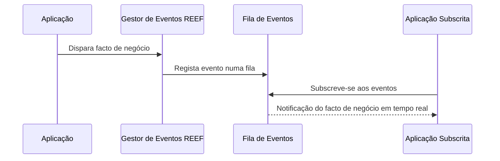

# Plataforma REEF da MAPFRE — Arquitetura PaaS, Governança, Serviços, Instâncias e Roadmap

## 1. Metadados do Documento
- **Arquivo de Origem:** Não identificado no conteúdo fornecido
- **Tipo de Documento:** Apresentação Executiva
- **Domínio / Sistema:** REEF — MAPFRE Open Insurance Platform
- **Público-Alvo:** Desenvolvedores, Arquitetos, Operação, Negócio, Equipas de Produto e Gestores de TI
- **Data/Versão Identificada:** 5 de outubro de 2023; dados de atividade atualizados até 3 de outubro de 2023

---

## 2. Resumo Executivo & Contexto de Negócio

REEF é a plataforma da MAPFRE que permite às companhias de seguros consumir soluções seguradoras na modalidade de serviço. A plataforma permite utilização direta das soluções na própria REEF ou consumo apificado, isto é, integrado aos sistemas locais dos países. REEF foi criado como um dos objetivos do Plano Estratégico de TI 2022–2024.

O contexto de criação da plataforma decorre de problemas identificados na extensão TRON: descentralização, forte dispersão de versões do núcleo, instalações locais desatualizadas e alto nível de personalização por país. Embora o sistema fosse comum, a reutilização era baixa, os tempos de atualização eram longos e o suporte era complexo.

A plataforma busca habilitar os países a incorporar serviços de forma rápida e eficiente para suportar planos de negócio, produtos de seguro, soluções para clientes e colaboradores, automação de tarefas e conectividade com outros sistemas por APIs. REEF também se posiciona como resposta aos desafios de obsolescência e segurança dos sistemas.

Como PaaS, REEF reúne um sistema Core, soluções globais, microsserviços e componentes oferecidos em um Marketplace. O modelo inclui governança, processos operacionais, FinOps, expansão gradual da cobertura funcional e divisão de responsabilidades entre as estruturas corporativa e regional/local.

A apresentação descreve duas instâncias existentes: REEF América Central, utilizada pelo Panamá, e REEF Vida, utilizada pelo Uruguai. O roadmap prevê expansão regional, evolução de capacidades globais para seguros de vida, novos produtos e soluções, redução de custos recorrentes e descomissionamento de sistemas legados.

---

## 3. Arquitetura, Componentes & Tecnologias Envolvidas

REEF é apresentada como uma plataforma de seguros “as a Service”, com um modelo de governo destinado a atender regiões, unidades e países. O sistema Core é descrito como o coração da plataforma, responsável pela configuração de produtos, processos de emissão, sinistros, administração e funções comuns.

As soluções globais incluem funcionalidades para atendimento ao cliente final e ao distribuidor, como autosserviços e cotadores/emissores. Também incluem suporte para gestão documental, BPM, motor de regras, gestor de eventos, clientes e microsserviços para necessidades específicas, como cotação e subscrição de riscos.

| Componente / Serviço | Descrição sustentada pelo documento |
| :--- | :--- |
| REEF | Plataforma MAPFRE para consumo de soluções seguradoras em modalidade de serviço. |
| Sistema Core | Coração da plataforma; responsável por configuração de produtos, emissão, sinistros, administração e funções comuns. |
| DUP | Dynamic Underwriting & Pricing; ativo para cálculos dinâmicos de subscrição e pricing no negócio digital, com parametrização pelos utilizadores de negócio. |
| RTE | Microserviço e ativo digital de tarifação/cotação; calcula componentes económicos da prima das coberturas contratadas. |
| Cotizador | Frontal web para cotação e emissão de apólices de diferentes ramos; gera telas dinamicamente a partir da definição do produto no TRON. |
| FIS CSF | Ferramenta para geração e distribuição de documentos, incluindo faturas, comunicados e contratos, a partir de modelos previamente desenhados. |
| Open Text (Documentum) | Gestor documental corporativo para armazenamento, conservação, rastreabilidade, segurança e expurgo de documentação digital. |
| Gestor de eventos | Serviço PaaS de gestão de eventos com Kafka; oferece infraestrutura para arquiteturas orientadas a eventos na integração MAPFRE. |
| Marketplace REEF | Catálogo de soluções de negócio em modalidade SaaS, incluindo soluções internas, de mercado e de Insurtechs. |
| TRON | Sistema operacional citado como fonte da definição de produtos para o Cotizador e como sistema local integrado na instância REEF Vida. |
| BPM | Capacidade global de suporte explicitamente citada entre as soluções REEF. |
| BI | Solução prevista para inclusão no roadmap da América Central. |
| CIMS | Instalação cujo suporte é responsabilidade da Delivery Unit Corporativa, conforme o catálogo de serviços. |
| SISMAP | Sistema local integrado com REEF América Central. |
| API de Convivencia | Interface de integração citada para REEF América Central. |
| AS400 | Portal de agentes satélite integrado à instância REEF Vida. |
| RONDANET | Serviço Web integrado à instância REEF Vida. |
| DNIC | Serviço Web integrado à instância REEF Vida. |

```mermaid
graph TD
    Paises["Países / Unidades MAPFRE"] --> REEF["REEF: MAPFRE Open Insurance Platform"]

    REEF --> Governo["Governo REEF"]
    REEF --> Marketplace["Marketplace REEF"]
    REEF --> Core["Sistema Core"]
    REEF --> SolucoesGlobais["Soluções globais"]
    REEF --> Microservicos["Microsserviços"]

    Core --> Produtos["Configuração de produtos"]
    Core --> Emissao["Processos de emissão"]
    Core --> Sinistros["Sinistros"]
    Core --> Administracao["Administração e comuns"]

    SolucoesGlobais --> Cotizador["Cotizador"]
    SolucoesGlobais --> FIS["FIS CSF"]
    SolucoesGlobais --> Documentum["Open Text / Documentum"]
    SolucoesGlobais --> BPM["BPM"]
    SolucoesGlobais --> Eventos["Gestor de eventos com Kafka"]

    Microservicos --> DUP["DUP"]
    Microservicos --> RTE["RTE"]

    Marketplace --> SaaS["Consumo de soluções SaaS"]

    REEF --> AmericaCentral["Instância REEF América Central"]
    REEF --> Vida["Instância REEF Vida"]

    AmericaCentral --> Panama["Panamá"]
    AmericaCentral --> SISMAP["SISMAP"]
    AmericaCentral --> APIConvivencia["API de Convivencia"]

    Vida --> Uruguay["Uruguai"]
    Vida --> TRONLocal["TRON Local"]
    Vida --> AS400["Portal de agentes AS400"]
    Vida --> WebServices["Webservices: recibos, ordens de pagamento, RONDANET e DNIC"]
```



### Fluxo de eventos descrito



**Nota de Análise:** O documento informa que o gestor de eventos utiliza Kafka, mas não especifica tópicos, políticas de retenção, contratos de mensagens, formatos de payload, autenticação ou métodos de publicação e subscrição.

---

## 4. Regras de Negócio, Especificações Funcionais & Processos

### Necessidades dos países atendidas por REEF

A plataforma é direcionada às seguintes necessidades:

1. Incorporar serviços rapidamente e de forma eficiente nos sistemas dos países para suportar planos de negócio.
2. Suportar produtos de seguro.
3. Disponibilizar soluções para clientes e colaboradores, incluindo autosserviço, Quote&Buy e aplicações.
4. Automatizar tarefas.
5. Conectar-se a outros sistemas por APIs.
6. Combater obsolescência e desafios de segurança dos sistemas.

### Modelo de consumo de soluções

Os países podem consumir soluções seguradoras de duas formas:

1. Utilização direta das soluções dentro da plataforma REEF.
2. Utilização apificada, conectando as soluções REEF com sistemas locais.

### Funcionamento dos componentes funcionais

#### DUP — Dynamic Underwriting & Pricing

- Permite realizar cálculos para gerir dinamicamente a subscrição e o pricing do negócio digital.
- Possui capacidades de parametrização pelos utilizadores de negócio.
- O documento não detalha fórmulas de cálculo, parâmetros de risco, regras de underwriting ou contratos técnicos do ativo DUP.

#### RTE — ativo digital tarificador/cotizador

- Atua como motor de cálculo ou tarifação de todos os componentes económicos da prima das coberturas contratadas.
- Suporta um serviço de cotação/simulação.
- Parte de dados pré-configurados no back-end do ativo.
- Complementa os dados pré-configurados com informação externa.
- Calcula e mostra o recibo de primas conforme combinações de modalidades e planos de pagamento existentes na configuração.
- O documento não apresenta métodos HTTP, campos de entrada, campos de saída, algoritmos, APIs ou contratos JSON do microserviço RTE.

#### Cotizador

- É um frontal web para cotação e emissão de apólices de diferentes ramos.
- Gera as telas dinamicamente.
- A geração das telas é baseada na definição de produto existente no sistema operacional TRON.

#### FIS CSF

- Gera documentos como faturas, comunicados e contratos.
- Distribui os documentos pelos canais disponibilizados.
- Compõe documentos a partir de uma plantilla previamente desenhada.
- O documento não descreve formatos de modelos, motores de composição, canais específicos de entrega nem regras de arquivamento.

#### Open Text / Documentum

O gestor documental corporativo disponibiliza:

- Armazenamento de documentação digital.
- Conservação de documentação digital.
- Rastreabilidade de documentação digital.
- Segurança de documentação digital.
- Expurgo de documentação digital.

#### Gestor de eventos

- É um serviço PaaS para gestão de eventos com Kafka.
- Oferece infraestrutura para implementar arquiteturas orientadas a eventos na integração MAPFRE.
- Factos de negócio são disparados e recolhidos numa fila.
- Aplicações podem subscrever-se e receber notificações de factos de negócio em tempo real.

### Regras de arquitetura e instanciamento

1. Os serviços são construídos para REEF.
2. Todas as funcionalidades são desenhadas para conectar-se nativamente e por configuração com REEF.
3. Pode existir mais de uma instância REEF.
4. Uma ou mais instâncias podem ser geradas conforme as necessidades dos países.
5. O documento identifica duas instâncias atualmente existentes: América Central e Vida.
6. As duas instâncias descritas usam produtos corporativos estandardizados com implantações locais por configuração.

### Governança REEF

O modelo de governança possui os seguintes propósitos:

| Objetivo de governança | Regra ou finalidade |
| :--- | :--- |
| Garantir a operação | Habilitar e executar os serviços associados à plataforma para assegurar a operação. |
| Procedimentos | Estabelecer procedimentos operacionais e modelo de gestão de incidentes, gestão de demanda e outros processos. |
| FinOps | Definir critérios de custo; conhecer, acompanhar e controlar os custos dos componentes para os tornar mais eficientes. |
| Cobertura funcional | Expandir gradualmente a cobertura funcional por inclusão de novas soluções e ampliação das capacidades das soluções existentes. |
| Repartição de responsabilidades | Estabelecer divisão de responsabilidades entre estruturas Corporativa e local na execução dos serviços. |

REEF é apresentada como uma organização orientada a produto. O modelo operacional indicado possui:

- Equipas estáveis, autónomas, multidisciplinares e multifuncionais.
- Potencialização das comunidades.
- Negócio como parte da equipa, por meio de Owners.
- Impulso e acompanhamento de planos de curto prazo.
- Gestão de um mesmo backlog.
- Foco na entrega de valor por meio do produto.

### REEF Council

O REEF Council é o comité mensal de seguimento e é apresentado como o máximo órgão de governo da REEF.

| Aspecto | Informação |
| :--- | :--- |
| Periodicidade | Mensal |
| Nome | REEF Council |
| Objetivo estratégico | Definir visão, estratégia e roadmap REEF. |
| OKRs | Definir e assegurar os OKRs. |
| Políticas | Estabelecer políticas e melhores práticas. |
| Modelo operacional | Definir o modelo operativo. |
| Priorização e riscos | Estabelecer prioridades, mitigar riscos e resolver conflitos. |
| Alinhamento | Assegurar alinhamento entre todas as partes envolvidas. |
| Membros | REEF Manager, Product Manager das equipas de produto e Responsável pelas Comunidades. |

### Marco normativo

O documento estabelece procedimentos para a gestão e evolução correta dos componentes REEF:

| Procedimento | Escopo descrito |
| :--- | :--- |
| Procedimento de versionamento | Operação para versionamento de software em componentes REEF, incluindo major releases, patches e hotfixes. |
| Procedimento de regularização de dados | Operação para realizar regularizações de dados em ambientes produtivos. |
| Procedimento de catalogação de ativos no Marketplace | Publicação de soluções no Marketplace REEF, assegurando cumprimento dos requisitos estabelecidos para esse fim. |

**Nota de Análise:** A apresentação identifica os procedimentos, mas não contém passos operacionais detalhados, critérios de aprovação, responsáveis por etapa, tempos de execução, critérios de rollback ou fluxos de exceção.

### Catálogo de serviços e responsabilidades

| Área de serviço | Responsabilidades descritas |
| :--- | :--- |
| Software de Produto — Delivery Unit Corporativa | Construção, documentação, garantia de qualidade, produção de releases, suporte ao software de produto e suporte à instalação de CIMS. |
| Software personalizado — Delivery Unit Regional/local | Integração com sistemas locais, desenvolvimento de personalizações locais, projetos de configuração de produtos, garantia de qualidade e produção de releases de software local. |
| Plataforma e Operação | Gestão de infraestrutura, observabilidade e monitorização, controlo da dispersão, atualizações de software, controlo de segurança e Disaster Recovery. |
| Exploração | Service Desk, suporte funcional de nível 1 e 2, suporte funcional ao Core, deployment do software de produto Core, deployment do software local REEF, exploração do batch, controlo de acessos, configuração geral do sistema e formação. |
| Governo | Estratégia de evolução da plataforma, FinOps, OKRs e metodologia de desenvolvimento. |

### Marketplace REEF

O Marketplace disponibiliza soluções em modalidade SaaS orientadas ao negócio. As soluções podem ser de desenvolvimento interno e/ou de mercado, desde que tenham aprovação da MAPFRE em arquitetura e segurança e estejam em uso.

Os objetivos explícitos do Marketplace são:

- Redução de custos.
- Dar visibilidade a ativos ocultos no âmbito local.
- Prevenir desenvolvimentos duplicados.
- Evitar dispersão.

A apresentação informa a existência de 22 soluções disponíveis, sendo 15 em 2023. Notícias do Marketplace são publicadas periodicamente na Intranet Global, e as soluções são apresentadas por utilizadores de Negócio e pela equipa de TI.

### Instância REEF América Central

- Utilizada pelo Panamá.
- Utiliza CORE, Documentum, FIS e a plataforma de gestão de eventos.
- Utiliza produtos corporativos estandardizados, com implantação local por configuração.
- Integra com SISMAP, descrito como sistema local.
- Integra com API de Convivencia.

### Instância REEF Vida

- Utilizada pelo Uruguai.
- Utiliza CORE.
- Utiliza DUP para seleção de riscos.
- Utiliza módulos RTE.
- Utiliza Documentum, FIS e a plataforma de gestão de eventos.
- Utiliza produtos corporativos estandardizados, com implantação local por configuração.
- Integra com TRON Local para sincronização de terceiros, fechos/contabilidade, cobranças e pagamentos e gestão de recibos.
- Integra com satélites, especificamente o Portal de agentes AS400.
- Integra com Webservices para consulta e cobrança online de recibos, consulta e cobrança de ordens de pagamento, Serviço Web RONDANET e Serviço Web DNIC.

### Roadmap REEF

#### América Central

- Extensão da solução a seis países da América Central e dez produtos ao longo de quatro anos.
- Implementação simultânea de um produto para seis países, com objetivo de reduzir o tempo de deployment e assegurar unificação.
- Inclusão das soluções Cotizador, BI, BPM e outras capacidades em adição à REEF.
- Redução de custos recorrentes de 1,2 milhões de euros em 2028, associada ao descomissionamento de sistemas legados.

#### Vida

- Desenvolvimento de capacidades globais para gestão de produtos de vida.
- Produtos corporativos estandardizados com implantação local por configuração.
- Implementação de frontal web cotizador/contratador integrado como parte da plataforma.
- MVP para produto de vida misto/dotal no Uruguai em novembro de 2023.

---

## 5. Tabelas de Parâmetros, Ambientes e Estruturas de Dados

| Item / Parâmetro | Descrição / Função | Tipo / Valores / Formato | Ambiente / Observações |
| :--- | :--- | :--- | :--- |
| Modalidade de consumo REEF | Forma pela qual países utilizam soluções REEF. | Uso direto na plataforma ou uso apificado conectado a sistemas locais. | Aplicável às companhias de seguros MAPFRE. |
| Sistema Core | Componente central da plataforma. | Configuração de produtos, emissão, sinistros, administração e comuns. | REEF. |
| DUP | Cálculo dinâmico de subscrição e pricing. | Dynamic Underwriting & Pricing; parametrização por utilizadores de negócio. | REEF Vida utiliza DUP para seleção de riscos. |
| RTE | Motor de tarifação/cotação. | Microserviço; calcula componentes económicos da prima. | REEF Vida utiliza módulos RTE. |
| Cotizador | Cotação e emissão de apólices. | Frontal web com telas geradas dinamicamente a partir do produto TRON. | Previsto para inclusão na América Central; frontal cotizador/contratador no roadmap Vida. |
| FIS CSF | Geração e distribuição documental. | Faturas, comunicados, contratos e outros documentos compostos por plantilla. | Utilizado nas instâncias América Central e Vida. |
| Open Text / Documentum | Gestão documental corporativa. | Armazenamento, conservação, rastreabilidade, segurança e expurgo. | Utilizado nas instâncias América Central e Vida. |
| Gestor de eventos | Gestão de eventos. | Serviço PaaS com Kafka; eventos em fila e notificação em tempo real a subscritores. | Utilizado nas instâncias América Central e Vida. |
| Marketplace REEF | Catálogo de soluções. | Soluções SaaS internas e/ou de mercado aprovadas em arquitetura e segurança. | 22 soluções disponíveis; 15 em 2023. |
| REEF Council | Órgão de governo. | Comité mensal. | Máximo órgão de governo REEF. |
| Sprint planning | Evento de planeamento. | Periodicidade de três semanas. | Dados de atividade REEF. |
| Retrospectiva | Evento de melhoria contínua. | Periodicidade de três semanas. | Dados de atividade REEF. |
| Eventos diários | Acompanhamento das equipas de produto. | Eventos diários. | Dados de atividade REEF. |
| Pessoas com tarefas atribuídas | Indicador de dimensão organizacional. | 59 pessoas. | Dados acumulados de dezembro de 2021 a 3 de outubro de 2023. |
| Equipas | Indicador organizacional. | 16 equipas de produtos, comunidades e suporte. | Dados acumulados de dezembro de 2021 a 3 de outubro de 2023. |
| Story Points de média por sprint | Indicador de atividade. | Mais de 680 Story Points de média por sprint. | Apenas histórias de prioridade alta. |
| Story Points feitos por sprint | Indicador de entrega. | Mais de 420 Story Points de média feitos por sprint; 13 no Q4. | Apenas histórias de prioridade alta. |
| Pilotos orientados a produto | Indicador de transformação. | 4 pilotos. | Dados de atividade REEF. |
| Épicas | Indicador de backlog estratégico. | 169 épicas; 27 compromissos estratégicos; 13 compromissos estratégicos em Q4. | Dados de atividade REEF. |
| Histórias de utilizador concluídas | Indicador de entrega. | 1,8 mil histórias de utilizador. | Dados acumulados de dezembro de 2021 a 3 de outubro de 2023. |
| Sprints principais em paralelo | Indicador operacional. | 2 sprints principais em paralelo. | Dados de atividade REEF. |
| Tempo de vida REEF | Indicador temporal. | Quase 2 anos. | Informação apresentada em outubro de 2023. |
| REEF América Central | Instância REEF. | Panamá; CORE, Documentum, FIS e plataforma de eventos. | Integra SISMAP e API de Convivencia. |
| REEF Vida | Instância REEF. | Uruguai; CORE, DUP, RTE, Documentum, FIS e plataforma de eventos. | Integra TRON Local, AS400 e Webservices. |
| Expansão América Central | Meta de expansão. | 6 países e 10 produtos em 4 anos. | Roadmap. |
| Redução de custos recorrentes | Meta financeira. | 1,2M€ em 2028. | Associada ao descomissionamento de sistemas legacy. |
| MVP Vida | Entrega planeada. | Produto vida misto/dotal. | Uruguai; novembro de 2023. |

### Equipas de produto e papéis identificados

| Equipa / Área | Product Manager | Product Owner | Scrum Master |
| :--- | :--- | :--- | :--- |
| APIs | Pablo Velázquez | Pedro Sacristán | Jorge Huete |
| Vida | David de Francisco | Hugo Machado | Marta Martín |
| Cotizador | Ignacio Arcusa | Hugo Machado | Sara Martinez |
| Gestão Documental | Luis Balairón | Hugo Machado / Ivis S. Rokas / Moisés Rovira | Alicia Arroyo |
| TRON | Raúl Tejado | ACO | Carolina Vázquez |

### Comunidades e áreas de suporte identificadas

| Área | Pessoas identificadas |
| :--- | :--- |
| Transformação | Cristina Pérez; Andrea García; Fernando Cano; Sonia Molina |
| Arquitetura | Não identificadas individualmente no slide |
| Infraestrutura | Antonio Sanchez; Fidel Moreno; Miguel Angel Muñoz; Abel Fiz; Jose Antonio Martinez Pla |
| Segurança | Juan Manuel Muñoz; Omar Molinero |
| Comunidades | David Jimenez; Emilio Jaen; Alberto Rodrigo; Hugo Roces; Nacho Arcusa |
| FinOps | Jose de Abreu; Javier Tello |
| Cloud | Mat Jovanovic; Raiza Acosta |

---

## 6. Bateria de Perguntas & Respostas para RAG (FAQ Sintético)

### P1: O que é a plataforma REEF da MAPFRE?
**R:** REEF é a plataforma da MAPFRE que permite às companhias de seguros consumir soluções seguradoras em modalidade de serviço. Os países podem utilizar as soluções diretamente dentro da plataforma ou consumi-las de forma apificada, conectando-as aos respetivos sistemas locais.

### P2: Quais problemas da extensão TRON motivaram a criação da REEF?
**R:** A apresentação identifica descentralização, elevado grau de dispersão das versões do núcleo, instalações locais com versões não atualizadas e forte personalização nos países. Apesar de o sistema ser comum, a reutilização era baixa, as atualizações demoravam e o suporte era complexo.

### P3: Qual é a responsabilidade do Sistema Core na arquitetura REEF?
**R:** O Sistema Core atua como o coração da plataforma. É responsável pela configuração dos produtos, pelos processos de emissão, pelos sinistros, pela administração e pelas capacidades comuns indicadas no documento.

### P4: Como o microserviço RTE calcula uma cotação ou tarifação?
**R:** O RTE é um ativo digital tarificador/cotizador que calcula os componentes económicos que formam a prima das coberturas contratadas. Para cotação ou simulação, utiliza dados pré-configurados no back-end do ativo, complementa-os com informação externa e calcula o recibo de primas conforme as combinações de modalidades e planos de pagamento configurados.

### P5: Qual é a diferença entre DUP e RTE na REEF?
**R:** DUP significa Dynamic Underwriting & Pricing e permite cálculos para gerir dinamicamente subscrição e pricing do negócio digital, incluindo parametrização pelos utilizadores de negócio. RTE é um microserviço de tarifação e cotação que calcula componentes económicos da prima das coberturas e suporta simulações de cotação.

### P6: Como funciona o gestor de eventos da REEF?
**R:** O gestor de eventos é um serviço PaaS com Kafka que oferece infraestrutura para arquiteturas orientadas a eventos na integração MAPFRE. Os factos de negócio são disparados e recolhidos numa fila, e as aplicações subscritas podem receber notificações desses factos em tempo real.

### P7: Quais serviços e tecnologias são utilizados pela instância REEF América Central?
**R:** A instância REEF América Central é utilizada pelo Panamá e utiliza CORE, Documentum, FIS e a plataforma de gestão de eventos. Trabalha com produtos corporativos estandardizados implementados localmente por configuração e integra com SISMAP, descrito como sistema local, e com a API de Convivencia.

### P8: Quais integrações existem na instância REEF Vida do Uruguai?
**R:** REEF Vida é utilizada pelo Uruguai e integra com TRON Local para sincronização de terceiros, fechos/contabilidade, cobranças e pagamentos e gestão de recibos. Também integra com o Portal de agentes AS400 e com Webservices para consulta e cobrança online de recibos, consulta e cobrança de ordens de pagamento, Serviço Web RONDANET e Serviço Web DNIC.

### P9: Quais são os objetivos do REEF Council?
**R:** O REEF Council é um comité mensal de seguimento responsável por definir a visão, estratégia e roadmap da REEF; definir e assegurar os OKRs; estabelecer políticas e melhores práticas; definir o modelo operativo; estabelecer prioridades; mitigar riscos; resolver conflitos; e assegurar alinhamento entre as partes envolvidas.

### P10: Que responsabilidades pertencem à Delivery Unit Corporativa no catálogo de serviços REEF?
**R:** A Delivery Unit Corporativa é responsável pela construção, documentação, garantia de qualidade, produção de releases, suporte ao software de produto e suporte à instalação de CIMS.

### P11: Que responsabilidades pertencem às estruturas regionais ou locais para software personalizado?
**R:** A Delivery Unit Regional/local é responsável pela integração com sistemas locais, desenvolvimento de personalizações locais, projetos de configuração de produtos, garantia de qualidade e produção de releases de software local.

### P12: Qual é o objetivo do Marketplace REEF?
**R:** O Marketplace REEF disponibiliza soluções orientadas ao negócio em modalidade SaaS. As soluções podem ser internas ou de mercado, desde que aprovadas pela MAPFRE em arquitetura e segurança e estejam em uso. Os objetivos são reduzir custos, dar visibilidade a ativos locais ocultos, prevenir desenvolvimentos duplicados e evitar dispersão.

### P13: Quais procedimentos fazem parte do marco normativo REEF?
**R:** O marco normativo define o procedimento de versionamento de software, incluindo major releases, patches e hotfixes; o procedimento de regularização de dados em ambientes produtivos; e o procedimento de catalogação de ativos no Marketplace, que deve assegurar que a solução publicada cumpre os requisitos estabelecidos.

### P14: Qual é o roadmap da REEF para a América Central?
**R:** O roadmap prevê estender a solução a seis países da América Central e dez produtos ao longo de quatro anos. Inclui implementação simultânea de um produto para seis países, inclusão de Cotizador, BI, BPM e outras capacidades, além da redução de custos recorrentes de 1,2M€ em 2028 por meio do descomissionamento de sistemas legados.

### P15: Qual entrega do roadmap REEF Vida estava prevista para novembro de 2023?
**R:** Estava previsto um MVP para um produto de vida misto/dotal no Uruguai em novembro de 2023. O roadmap também incluía o desenvolvimento de capacidades globais para produtos de vida e um frontal web cotizador/contratador integrado à plataforma.

---

## 7. Glossário de Termos, Siglas & Conceitos-Chave

- **API:** Interface de programação citada como mecanismo de conectividade com outros sistemas.
- **API de Convivencia:** Interface de integração mencionada para a instância REEF América Central.
- **AS400:** Plataforma mencionada no Portal de agentes integrado à instância REEF Vida.
- **BI:** Solução de Business Intelligence citada no roadmap da América Central, sem detalhamento adicional.
- **BPM:** Capacidade de suporte citada entre as soluções globais e no roadmap REEF, sem expansão da sigla no documento.
- **CIMS:** Instalação para a qual a Delivery Unit Corporativa presta suporte, sem detalhamento adicional.
- **Core:** Sistema central da REEF para produtos, emissão, sinistros, administração e funções comuns.
- **Delivery Unit Corporativa:** Estrutura responsável pelo software de produto, incluindo construção, documentação, qualidade, releases e suporte.
- **Delivery Unit Regional/local:** Estrutura responsável por integrações locais, personalizações, configurações de produto, qualidade e releases locais.
- **Disaster Recovery:** Responsabilidade de Plataforma e Operação; o documento não detalha a estratégia de recuperação.
- **Documentum:** Gestor documental corporativo Open Text utilizado para armazenamento, conservação, rastreabilidade, segurança e expurgo de documentos.
- **DUP:** Dynamic Underwriting & Pricing; ativo para cálculos dinâmicos de subscrição e pricing.
- **FinOps:** Disciplina de definição, acompanhamento e controlo de custos dos componentes da solução.
- **FIS CSF:** Ferramenta de geração e distribuição de documentos a partir de modelos.
- **Hotfix:** Tipo de versionamento de software explicitamente citado no procedimento de versionamento.
- **Kafka:** Tecnologia utilizada pelo gestor de eventos REEF.
- **Marketplace:** Catálogo REEF de soluções de negócio disponibilizadas em modalidade SaaS.
- **MVP:** Produto mínimo viável; citado para o produto de vida misto/dotal no Uruguai.
- **OKR:** Objetivos e resultados-chave citados como responsabilidade do REEF Council e do governo REEF.
- **PaaS:** Modalidade de plataforma como serviço; REEF é apresentada como plataforma de seguros nessa modalidade.
- **Patch:** Tipo de versionamento de software citado no procedimento REEF.
- **Pricing:** Determinação de preço; capacidade relacionada ao ativo DUP.
- **Product Manager:** Papel identificado nas equipas de produto REEF.
- **Product Owner:** Papel identificado nas equipas de produto REEF.
- **REEF Council:** Comité mensal e máximo órgão de governo da REEF.
- **RTE:** Microserviço e ativo digital tarificador/cotizador.
- **SaaS:** Modalidade de software como serviço utilizada pelo Marketplace REEF.
- **Scrum Master:** Papel identificado nas equipas de produto REEF.
- **Service Desk:** Serviço de exploração responsável pelo suporte operacional indicado no catálogo.
- **SISMAP:** Sistema local integrado à instância REEF América Central.
- **Story Points:** Métrica de atividade das equipas ágeis utilizada na apresentação.
- **TRON:** Sistema operacional utilizado como referência de definição de produto pelo Cotizador; também existe TRON Local integrado à REEF Vida.
- **Underwriting:** Subscrição de riscos; capacidade relacionada ao DUP.
- **Webservices:** Serviços integrados à REEF Vida para operações de recibos, ordens de pagamento, RONDANET e DNIC.

---

## 8. Notas Críticas, Riscos & Limitações

- A apresentação é executiva e não contém contratos técnicos detalhados para APIs, microsserviços, Webservices, eventos Kafka, formatos de payload, autenticação, autorização, URLs, portas, certificados ou mecanismos de observabilidade.
- O documento cita RTE como microserviço, mas não informa métodos HTTP, endpoints, contratos JSON, esquemas de dados, versões ou regras matemáticas da tarifação.
- O documento cita DUP para subscrição e pricing, mas não detalha modelos de risco, regras de aceitação, tabelas de pricing, fórmulas ou fluxos de aprovação.
- O procedimento de versionamento é mencionado, incluindo major releases, patches e hotfixes, mas não descreve critérios de classificação, processo de aprovação, janelas de deployment, rollback ou responsáveis.
- O procedimento de regularização de dados menciona ambientes produtivos, mas não define controlos, trilha de auditoria, backups, validações, segregação de funções ou aprovações.
- A catalogação de ativos no Marketplace exige cumprimento de requisitos, mas a apresentação não enumera critérios funcionais, técnicos, arquiteturais ou de segurança.
- A gestão de eventos utiliza Kafka, porém não há informação sobre tópicos, consumidores, produtores, partições, retenção, esquemas ou garantias de entrega.
- A meta de redução de custos recorrentes de 1,2M€ em 2028 está associada ao descomissionamento de sistemas legados, mas o documento não identifica esses sistemas, premissas financeiras ou plano de transição.
- O roadmap apresentado contém a indicação “Retraso sobre planificación”, sinalizando atraso em relação ao planeamento para elementos mostrados no roadmap visual. A apresentação não detalha causa, impacto, plano de recuperação ou replaneamento.
- A apresentação informa integração da REEF Vida com TRON Local, AS400 e Webservices, mas não detalha a tecnologia, periodicidade, direção dos fluxos, governança de dados ou tratamento de falhas dessas integrações.
- **Nota de Análise:** A apresentação contém um slide sobre “Seguimiento Tiempos de Entrega — Midiendo para mejorar”, mas não apresenta métricas, metas, fórmulas, gráficos ou dados de tempo de entrega nesse slide.

---

## 9. Conteúdo Bruto Estruturado (Referência Fiel)

```text
--- [PÁGINA 1 DE 30] ---

1
Presentación
Reef PaaS
5 octubre 2023


--- [PÁGINA 2 DE 30] ---

Antecedentes Reef
Reef como PaaS
Servicios Reef
Instancias Reef
Roadmap Reef
2


--- [PÁGINA 3 DE 30] ---

3
Extensión TRON Puntos de dolor
- Descentralización
- Alto grado de dispersión versión núcleo
- Instalaciones locales con versiones no actualizadas
- Fuerte personalización en los países
_antecedentes
Aunque el sistema es común:
- la reutilización es baja,
- los tiempos de actualización del sistema son largos y
- el soporte es complejo.


--- [PÁGINA 4 DE 30] ---

4
Necesidades de los países
- Incorporar rápida y de manera eficiente servicios en los sistemas que les permita desarrollar sus planes de negocio
- Productos de seguro
- Soluciones para clientes y colaboradores: Autoservicio, Quote&Buy, APPs.
- Automatización de tareas
- Conectividad con otros sistemas a través de API
- Combatir los desafíos de obsolescencia y de seguridad de los sistemas
_antecedentes


--- [PÁGINA 5 DE 30] ---

Antecedentes Reef
Reef como PaaS
Servicios Reef
Instancias Reef
Roadmap Reef
5


--- [PÁGINA 6 DE 30] ---

6
¿Qué es Reef?
Es el nombre de la Plataforma que permite a las compañías de seguro de MAPFRE consumir soluciones aseguradoras en modalidad de servicio.
Los países pueden usar directamente las soluciones en la propia Plataforma o de forma apificada (conectada) con sus sistemas locales.
Reef nace…
Como uno de los objetivos en el Plan Estratégico de TI 2022-2024
_Reef como PaaS


--- [PÁGINA 7 DE 30] ---

7
_Reef como PaaS
¿Qué es REEF?
MAPFRE Open Insurance Platform
¿Qué es REEF?
MAPFRE Open Insurance Platform


--- [PÁGINA 8 DE 30] ---

8
Plataforma
Soluciones aseguradoras
As a Service
Gobierno
Para establecer un modelo de entrega que sea capaz de servir a todas las regiones, unidades y países, en base a un modelo de gobierno.
Sistema Core
Que actúa como corazón de la Plataforma, responsable de la configuración de los productos, procesos de emisión, siniestros, administración y comunes.
Soluciones globales
• de atención al cliente final y distribuidor Autoservicios, Cotizadores / Emisores.
• de soporte para Gestión Documental, BPM, Motor de Reglas, gestor de eventos, Clientes, etc.
• microservicios para dar respuesta a necesidades específicas (cotización, suscripción de riesgos)
_Reef como PaaS
Marketplace
Los componentes son ofertados en un Marketplace en el que se van incorporando más capacidades funcionales de forma continua (desarrollos propios, de mercado, de Insurtechs,…).


--- [PÁGINA 9 DE 30] ---

9
_Reef como PaaS


--- [PÁGINA 10 DE 30] ---

10
_Reef como PaaS
DUP
Dynamic Underwriting & Pricing.
Activo que permite realizar cálculos para gestionar de manera dinámica la Suscripción y Pricing del negocio digital y con capacidades de parametrización de los usuarios de negocio.
RTE (Microservicio)
Activo digital tarificador / cotizador.
Sirve como motor de cálculo o tarificación de todos los componentes económicos que conforman la prima de las coberturas contratadas.
Posibilita un servicio de cotización / simulación en el que, partiendo de datos preconfigurados en el back-end del activo y complementados con información externa, permite calcular y mostrar el recibo de primas de acuerdo a las combinaciones de las modalidades y planes de pago contemplados en su configuración.
Productos Reef
Cotizador
Frontal web que permite la cotización y emisión de pólizas de distintos ramos.
El sistema genera dinámicamente las pantallas en base a la definición del producto del sistema operacional (TRON).
FIS
FIS CSF es una herramienta para la generación de documentos tales como facturas, comunicados, contratos, etc. y su posterior distribución por los canales provistos.
La herramienta compone un documento a partir de una plantilla previamente diseñada.
Open Text (Documentum)
Gestor documental corporativo que actúa como repositorio electrónico ofreciendo las siguientes capacidades sobre la documentación digital de la organización: almacenamiento, conservación, trazabilidad, seguridad y expurgo.
Gestor de eventos
Servicio PaaS para la gestión de eventos con Kafka.
Ofrece la infraestructura para la implementación de arquitecturas orientadas a eventos como parte de la integración en MAPFRE.
Los hechos de negocio (eventos) se disparan y se recogen en una cola. Las aplicaciones pueden suscribirse y recibir la notificación del hecho de negocio en tiempo real.


--- [PÁGINA 11 DE 30] ---

Antecedentes Reef
Reef como PaaS
Servicios Reef
Gobierno
Catálogo de Servicios
Marketplace
Instancias Reef
Roadmap Reef
11


--- [PÁGINA 12 DE 30] ---

12
_servicios Reef
Un modelo de gobierno… ¿para qué?
Gobierno Reef
Garantizar la Operación
Habilitar y ejecutar los servicios asociados a la Plataforma de tal manera que se garantice la operación de la misma.
Procedimientos
Establecer los procedimientos que permitan la operación, así como el modelo operativo para la gestión de incidentes, gestión de demanda, entre otros.
FinOps
Establecer los criterios de coste (FinOps). Tener conocimiento del coste de cada uno de los componentes que conforman la solución, así como el seguimiento y control de los mismos con el ánimo de eficientarlos.
Cobertura funcional
Velar por el incremento de la cobertura funcional de Reef de forma gradual con la inclusión progresiva de nuevas soluciones y ampliando las capacidades funcionales de las soluciones ya existentes.
Reparto responsabilidades
Establecer el reparto de responsabilidades entre Corporativo y local en la ejecución de los servicios establecidos.


--- [PÁGINA 13 DE 30] ---

13
_servicios Reef
Gobierno Reef
Reef es una organización orientada a Producto, lo que implica un cambio en la forma de trabajar
Organización Reef: nuevo modelo operativo
Equipos estables, autónomos, multidisciplinares y multifuncionales
Potenciando las comunidades
Negocio como parte del equipo: Owners
Impulso y seguimiento de los planes a corto plazo
Gestión de un mismo backlog
Foco en la entrega de valor: el Producto


--- [PÁGINA 14 DE 30] ---

14
_servicios Reef
Órganos de Gobierno – Reef Council
Gobierno Reef
- Comité mensual de seguimiento (Reef Council)
- Objetivo:
o Definir la visión, estrategia y roadmap de Reef
o Definir y asegurar los OKR´s
o Establece políticas y mejores prácticas
o Define el modelo operativo
o Establece prioridades, mitiga riesgos y resuelve conflictos
o Asegura el alineamiento de todas las partes implicadas
- Miembros:
o Reef Manager
o Product Manager de equipos de producto
o Responsable Comunidades


--- [PÁGINA 15 DE 30] ---

15
_servicios Reef
Gobierno Reef
APIs
Product Manager: Pablo Velázquez
Product Owner: Pedro Sacristán
Scrum Master: Jorge Huete
Vida
Product Manager: David de Francisco
Product Owner: Hugo Machado
Scrum Master: Marta Martín
Cotizador
Product Manager: Ignacio Arcusa
Product Owner: Hugo Machado
Scrum Master: Sara Martinez
Gestión Documental
Product Manager: Luis Balairón
Product Owner: Hugo Machado/Ivis S.Rokas / Moisés Rovira
Scrum Master: Alicia Arroyo
TRON
Product Manager: Raúl Tejado
Product Owner: ACO
Scrum Master: Carolina Vázquez
Equipos de producto
Transformación
Cristina Pérez
Andrea García
Fernando Cano
Sonia Molina
Arquitectura
Infraestructura
Antonio Sanchez
Fidel Moreno
Miguel Angel Muñoz
Abel Fiz
Jose Antonio Martinez Pla
Seguridad
Juan Manuel Muñoz
Omar Molinero
Comunidades
David Jimenez
Emilio Jaen
Alberto Rodrigo
Hugo Roces
Nacho Arcusa
FinOps
Jose de Abreu
Javier Tello
Cloud
Mat Jovanovic
Raiza Acosta


--- [PÁGINA 16 DE 30] ---

16
_servicios Reef
Gobierno Reef
Reef es una familia de equipos de producto con visión completa donde…¡TODO SUMA!
59 personas con tareas asignadas
16 equipos (productos, comunidades, soporte)
+680 Story Points de media por sprint (*)
4 pilotos orientados a Producto
169 épicas (27 compromisos estratégicos, 13 compromisos estratégicos en Q4)
1.8k historias de usuario completadas
2 sprints principales en paralelo
Casi 2 años de vida
+420 Story Points de media hechos por sprint (*) 13 en Q4
(datos acumulados desde diciembre 2021 a 3 octubre 2023)
(*) sólo historias de prioridad alta
Equipos ágiles organizados y sincronizados
Sprint planning cada 3 semanas
Eventos diarios equipos de producto
Retrospectiva cada 3 semanas
REEF Council máximo órgano de gobierno
Actividad Reef
Datos actualizados a 3 octubre 2023


--- [PÁGINA 17 DE 30] ---

17
_servicios Reef
Seguimiento Tiempos de Entrega
Gobierno Reef
Midiendo para mejorar


--- [PÁGINA 18 DE 30] ---

18
_servicios Reef
Marco normativo
Gobierno Reef
Establecer procedimientos de actuación para la correcta gestión y evolución de los componentes de Reef:
o Procedimiento de versionado:
Operativa a seguir para realizar versionados de software en componentes de la Plataforma Reef (major releases, parches y hotfix).
o Procedimiento de regularización de datos
Operativa a seguir para realizar las regularizaciones de datos en entornos productivos.
o Procedimiento de catalogación de activos en Marketplace
Procedimiento para la publicación de soluciones en el Marketplace de Reef. El procedimiento debe garantizar que la solución que se ofrece en el Marketplace cumple con los requisitos establecidos para tal fin.
Catalogación activos MP
Regularización datos
Versionado software


--- [PÁGINA 19 DE 30] ---

19
_servicios Reef Catálogo de servicios Reef
Se hace necesario establecer un Catálogo de Servicios que presta la Plataforma, así como el modelo de gobierno de los mismos …
Software de Producto
Determinar las responsabilidades que tiene la Delivery Unit Corporativa
• construcción,
• documentación,
• aseguramiento de la calidad,
• producción de las releases,
• soporte del SW de Producto
• soporte a la instalación de CIMS.
Determinar las responsabilidades que tiene la Delivery Unit Regional/local
Relacionar los servicios y acuerdos de nivel de servicio que cada Delivery Unit establece
Software personalizado
• integración con sistemas locales,
• desarrollo de personalizaciones locales,
• proyectos de configuración de Productos,
• aseguramiento de la calidad
• producción de las releases de SW local.
Plataforma y Operación
• gestión de la infraestructura,
• observabilidad y monitorización,
• control de la dispersión,
• actualizaciones de SW,
• control de la Seguridad
• Disaster Recovery
Explotación
• Service Desk,
• soporte funcional nivel 1 y 2,
• soporte funcional a Core,
• despliegue del SW de Producto Core,
• despliegue del SW local de Reef,
• explotación del batch,
• control de accesos,
• configuración general del sistema
• formación
Gobierno
• estrategia de la evolución de la Plataforma,
• FinOps,
• OKR´s
• metodología de desarrollo
… para


--- [PÁGINA 20 DE 30] ---

20
Servicios que ofrece la Plataforma: ámbito responsabilidad
_servicios Reef Catálogo de servicios Reef


--- [PÁGINA 21 DE 30] ---

21
Marketplace Reef
Consumo de soluciones en modalidad de servicio (SaaS)
Orientadas a negocio
Soluciones desarrollo interno y/o de mercado aprobadas en MAPFRE (arquitectura y seguridad) y en uso
_Reducción de costes
_Dar visibilidad a activos ocultos en el ámbito local
_Prevenir desarrollos duplicados
_Evitar la dispersión
_marketplace
22 Soluciones disponibles
[15 en 2023]
Acceder Marketplace


--- [PÁGINA 22 DE 30] ---

22
_marketplace
De forma periódica se publican noticias del Marketplace en la Intranet Global.
Las soluciones son presentadas por los usuarios de Negocio y por el equipo de TI
¡¡síguenos!!
Divulgación Marketplace


--- [PÁGINA 23 DE 30] ---

Antecedentes Reef
Reef como PaaS
Servicios Reef
Instancias Reef
Roadmap Reef
23


--- [PÁGINA 24 DE 30] ---

24
Los servicios son construidos para Reef
- Todas las funcionalidades son diseñadas para conectar nativamente y por configuración con Reef.
Puede haber más de una instancia Reef
- De acuerdo a las necesidades de los países pueden ser generadas una o más instancias de Reef.
- Actualmente existen dos instancias de Reef:
- América Central
- Vida
_instancias Reef


--- [PÁGINA 25 DE 30] ---

25
_instancias Reef
Reef América Central
▪ Utilizada por Panamá
▪ Utiliza: CORE, Documentum, FIS y la Plataforma de gestión de Eventos
▪ Productos corporativos estandarizados con implantaciones locales por configuración.
▪ Integra con: SISMAP (sistema local), API de Convivencia.


--- [PÁGINA 26 DE 30] ---

26
_instancias Reef
Reef Vida
▪ Utilizada por Uruguay
▪ Utiliza: CORE, DUP (Selección de Riesgos), RTE (módulos), Documentum, FIS y la Plataforma de gestión de Eventos
▪ Productos corporativos estandarizados con implantaciones locales por configuración.
Integra con:
• TRON Local: sincronización de Terceros, Cierres/Contabilidad, Cobros y Pagos, Gestión de Recibos
• Satelitales: Portal de agentes AS400
• Webservices: Consulta y cobro de recibos online, Consulta y cobro de órdenes de pago, Servicio Web RONDANET y Servicio Web DNIC.


--- [PÁGINA 27 DE 30] ---

Antecedentes Reef
Reef como PaaS
Servicios Reef
Instancias Reef
Roadmap Reef
27


--- [PÁGINA 28 DE 30] ---

28
_roadmap Reef
América Central
o Extensión de la solución a 6 países de América Central y 10 productos (4 años).
o La implementación de un producto simultáneo para seis países, reduciendo el tiempo de despliegue y asegurando unificación.
o Inclusión de las soluciones de Cotizador, BI, BPM y otras capacidades que se están añadiendo a REEF.
o Reducción costes recurrentes (1,2M€ en 2028) >> decomisionamiento sistemas legacy.
Vida
o Desarrollo de Capacidades globales para la gestión de productos de vida.
o Productos corporativos Estandarizados con implantaciones locales por configuración.
o Implementación frontal web cotizador / contratador integrado como parte de la plataforma.
o MVP para producto vida mixto / dotal en Uruguay en noviembre 2023


--- [PÁGINA 29 DE 30] ---

2023
2022 2024
Q1 Q2 Q3 Q4 Q1 Q2 Q3 Q4 Q1 Q2 Q3 Q4
COBERTURA FUNCIONAL
MARKETPLACE
Panamá - REEF
Oleadas Panamá
Roadmap América Central
Reef Vida (MVP) Uruguay
España Salud
Creación Market Place + 7 soluciones
Incorporar 20 Nuevas soluciones
Incorporación de nuevas soluciones adicionales
Retraso sobre planificación
Roadmap América Central
España Salud
_roadmap Reef
Roadmap Vida


--- [PÁGINA 30 DE 30] ---

30
GRACIAS
```
