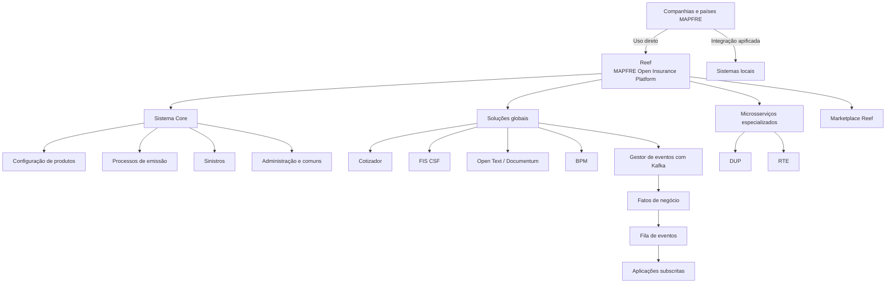
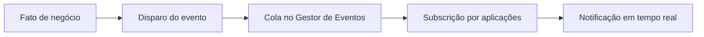

# Reef PaaS — Plataforma MAPFRE Open Insurance Platform, Governo, Serviços, Instâncias e Roadmap

## 1. Metadados do Documento
- **Arquivo de Origem:** Não identificado no conteúdo fornecido
- **Tipo de Documento:** Apresentação Executiva
- **Domínio / Sistema:** Reef / MAPFRE Open Insurance Platform / TRON
- **Público-Alvo:** Negócio, desenvolvedores, arquitetos, operação e equipes de produto
- **Data/Versão Identificada:** 5 de outubro de 2023; dados de atividade atualizados até 3 de outubro de 2023

---

## 2. Resumo Executivo & Contexto de Negócio

Reef é a plataforma da MAPFRE que permite às companhias de seguros consumir soluções de seguros no modelo *as a service*. As unidades e países podem utilizar as soluções diretamente na plataforma ou de maneira “apificada”, conectando a plataforma Reef aos sistemas locais. Reef surgiu como um dos objetivos do Plano Estratégico de TI 2022–2024.

O contexto de criação de Reef está relacionado aos pontos de dor da extensão TRON: descentralização, dispersão elevada da versão núcleo, instalações locais com versões desatualizadas e personalização intensa em cada país. Mesmo com um sistema comum, esses fatores reduzem a reutilização, tornam atualizações longas e tornam o suporte complexo.

A plataforma busca habilitar os países a incorporar serviços de forma rápida e eficiente para seus planos de negócio, incluindo produtos de seguros, autosserviços, soluções Quote&Buy, aplicativos, automação de tarefas e conectividade com outros sistemas por APIs. Reef também busca combater obsolescência e desafios de segurança dos sistemas.

Reef reúne um sistema core, soluções globais, microsserviços especializados e um Marketplace. O Marketplace oferece componentes e capacidades funcionais continuamente incorporadas, incluindo desenvolvimentos próprios, soluções de mercado e soluções de Insurtechs. As soluções são consumidas em modalidade de serviço SaaS e precisam ser aprovadas por arquitetura e segurança da MAPFRE.

O modelo operacional de Reef é orientado a produto e sustentado por governança. O modelo cobre operação, procedimentos, FinOps, expansão funcional e divisão de responsabilidades entre as unidades corporativas e regionais/locais. Em outubro de 2023, Reef possuía duas instâncias: América Central e Vida.

---

## 3. Arquitetura, Componentes & Tecnologias Envolvidas

### Componentes e capacidades identificados

| Componente / Sistema | Papel descrito no documento |
| :--- | :--- |
| **Reef** | Plataforma MAPFRE Open Insurance Platform para consumo de soluções de seguros em modalidade de serviço. |
| **Sistema Core** | Coração da plataforma; responsável pela configuração de produtos, processos de emissão, sinistros, administração e funcionalidades comuns. |
| **TRON** | Sistema operacional citado como fonte da definição de produto para geração dinâmica das telas do Cotizador. Também possui integração local na instância Reef Vida. |
| **DUP** | Dynamic Underwriting & Pricing; ativo para cálculos dinâmicos de subscrição e *pricing* do negócio digital, com parametrização por usuários de negócio. |
| **RTE** | Microsserviço e ativo digital tarificador/cotizador para cálculo dos componentes econômicos da prima das coberturas contratadas. |
| **Cotizador** | Frontal web para cotação e emissão de apólices de diferentes ramos; gera telas dinamicamente conforme a definição do produto no TRON. |
| **FIS CSF** | Ferramenta para geração e distribuição de documentos, como faturas, comunicados e contratos, a partir de modelos previamente projetados. |
| **Open Text (Documentum)** | Gestor documental corporativo para armazenamento, conservação, rastreabilidade, segurança e expurgo de documentação digital. |
| **Gestor de eventos** | Serviço PaaS de gestão de eventos com Kafka; fornece infraestrutura para arquitetura orientada a eventos e integração na MAPFRE. |
| **Kafka** | Tecnologia citada como base para a gestão de eventos na plataforma. |
| **Marketplace Reef** | Catálogo de soluções internas, de mercado e de Insurtechs aprovadas pela MAPFRE. |
| **SISMAP** | Sistema local integrado à instância Reef América Central. |
| **API de Convivencia** | Integração citada para a instância Reef América Central. |
| **AS400** | Portal de agentes satélite integrado à instância Reef Vida. |
| **RONDANET** | Serviço Web citado entre as integrações da instância Reef Vida. |
| **DNIC** | Serviço Web citado entre as integrações da instância Reef Vida. |
| **BI** | Capacidade prevista para inclusão no roadmap da América Central. |
| **BPM** | Capacidade global citada e capacidade prevista para inclusão no roadmap da América Central. |

### Fluxo representativo da plataforma Reef



### Fluxo de eventos descrito



> **Nota de Análise:** O documento identifica componentes, funções e integrações, mas não apresenta contratos HTTP, formatos JSON, tópicos Kafka, portas, URLs, versões de tecnologia ou detalhes de implantação.

---

## 4. Regras de Negócio, Especificações Funcionais & Processos

### Necessidades atendidas por Reef

1. Incorporar rápida e eficientemente serviços aos sistemas dos países para permitir o desenvolvimento dos planos de negócio.
2. Disponibilizar produtos de seguros.
3. Disponibilizar soluções para clientes e colaboradores, incluindo autosserviços, Quote&Buy e aplicativos.
4. Automatizar tarefas.
5. Permitir conectividade com outros sistemas por APIs.
6. Combater obsolescência e desafios de segurança dos sistemas.

### Modelo de consumo das soluções

- As companhias de seguros da MAPFRE consomem soluções de seguros na modalidade de serviço.
- Os países podem utilizar soluções diretamente na plataforma Reef.
- Os países também podem usar soluções de forma apificada, conectando Reef aos sistemas locais.
- Os componentes são ofertados pelo Marketplace Reef.
- O Marketplace incorpora continuamente novas capacidades funcionais, provenientes de desenvolvimento próprio, mercado ou Insurtechs.
- As soluções do Marketplace são voltadas ao negócio, estão em uso e devem ser aprovadas por arquitetura e segurança da MAPFRE.

### Regras funcionais dos produtos Reef

#### DUP — Dynamic Underwriting & Pricing
- Permite executar cálculos para gerir dinamicamente subscrição e *pricing* do negócio digital.
- Possui capacidades de parametrização por usuários de negócio.

#### RTE — Microsserviço tarificador/cotizador
- Calcula todos os componentes econômicos que compõem a prima das coberturas contratadas.
- Suporta cotação e simulação.
- Parte de dados pré-configurados no *back-end* do ativo.
- Complementa os dados pré-configurados com informação externa.
- Calcula e apresenta o recibo de primas conforme combinações de modalidades e planos de pagamento configurados.

#### Cotizador
- É um frontal web para cotação e emissão de apólices de diferentes ramos.
- Gera dinamicamente suas telas segundo a definição do produto no sistema operacional TRON.

#### FIS CSF
- Gera documentos como faturas, comunicados e contratos.
- Distribui os documentos pelos canais disponibilizados.
- Compõe o documento a partir de um modelo previamente desenhado.

#### Open Text / Documentum
- Armazena documentação digital corporativa.
- Permite conservação, rastreabilidade, segurança e expurgo da documentação.

#### Gestor de eventos
- Oferece serviço PaaS para gestão de eventos com Kafka.
- Permite arquiteturas orientadas a eventos na integração da MAPFRE.
- Fatos de negócio são disparados e recolhidos em uma fila.
- Aplicações podem se subscrever e receber notificações de fatos de negócio em tempo real.

### Regras e objetivos de governo Reef

| Área de governo | Objetivo / Regra |
| :--- | :--- |
| Garantia da operação | Habilitar e executar serviços associados à plataforma, garantindo sua operação. |
| Procedimentos | Estabelecer procedimentos operacionais e modelo de gestão de incidentes, gestão de demanda e outros processos. |
| FinOps | Estabelecer critérios de custo, conhecer custos dos componentes, acompanhar e controlar custos para torná-los mais eficientes. |
| Cobertura funcional | Ampliar gradualmente a cobertura funcional com novas soluções e expansão das capacidades das soluções existentes. |
| Responsabilidades | Definir a divisão de responsabilidades entre áreas corporativas e locais na execução dos serviços estabelecidos. |
| Organização | Trabalhar com equipes estáveis, autônomas, multidisciplinares e multifuncionais. |
| Produto | Manter negócio como parte do time, com Owners, um mesmo backlog e foco na entrega de valor pelo produto. |

### Reef Council

- É o comitê mensal de acompanhamento de Reef.
- Constitui o máximo órgão de governo de Reef.
- Define visão, estratégia e roadmap de Reef.
- Define e assegura os OKRs.
- Estabelece políticas e melhores práticas.
- Define o modelo operacional.
- Estabelece prioridades.
- Mitiga riscos e resolve conflitos.
- Assegura alinhamento entre as partes envolvidas.

**Membros identificados:**
- Reef Manager
- Product Managers das equipes de produto
- Responsável por Comunidades

### Procedimentos normativos identificados

| Procedimento | Finalidade |
| :--- | :--- |
| Versionamento de software | Definir a operação para versionamento de software dos componentes Reef, incluindo *major releases*, patches e hotfixes. |
| Regularização de dados | Definir a operação para regularização de dados em ambientes produtivos. |
| Catalogação de ativos no Marketplace | Definir a publicação de soluções no Marketplace e garantir que a solução atende aos requisitos para ser ofertada. |

### Catálogo de Serviços Reef

| Categoria | Responsabilidades ou escopo descrito |
| :--- | :--- |
| Software de Produto — Delivery Unit Corporativa | Construção, documentação, asseguramento da qualidade, produção de releases, suporte ao software de produto e suporte à instalação de CIMS. |
| Software personalizado — Delivery Unit Regional/local | Integração com sistemas locais, desenvolvimento de personalizações locais, projetos de configuração de produtos, asseguramento da qualidade e produção de releases de software local. |
| Plataforma e Operação | Gestão de infraestrutura, observabilidade e monitorização, controle da dispersão, atualizações de software, controle de segurança e Disaster Recovery. |
| Exploração | Service Desk, suporte funcional nível 1 e 2, suporte funcional ao Core, implantação do software de produto Core, implantação de software local Reef, exploração de batch, controle de acessos, configuração geral do sistema e formação. |
| Governo | Estratégia de evolução da plataforma, FinOps, OKRs e metodologia de desenvolvimento. |

### Instâncias Reef

#### Reef América Central
- Utilizada pelo Panamá.
- Utiliza CORE, Documentum, FIS e a Plataforma de Gestão de Eventos.
- Usa produtos corporativos padronizados com implantações locais por configuração.
- Integra com SISMAP, identificado como sistema local.
- Integra com API de Convivencia.

#### Reef Vida
- Utilizada pelo Uruguai.
- Utiliza CORE, DUP para Seleção de Riscos, RTE em módulos, Documentum, FIS e Plataforma de Gestão de Eventos.
- Usa produtos corporativos padronizados com implantações locais por configuração.
- Integra com TRON Local para sincronização de terceiros, fechamentos/contabilidade, cobranças e pagamentos e gestão de recibos.
- Integra com satélites, incluindo Portal de agentes AS400.
- Integra com Webservices para consulta e cobrança on-line de recibos, consulta e cobrança de ordens de pagamento, Serviço Web RONDANET e Serviço Web DNIC.

### Roadmap identificado

#### América Central
- Estender a solução para seis países da América Central e dez produtos em quatro anos.
- Implementar um produto simultaneamente para seis países, reduzindo o tempo de implantação e garantindo unificação.
- Incluir Cotizador, BI, BPM e outras capacidades adicionadas a REEF.
- Reduzir custos recorrentes em 1,2 milhão de euros em 2028 por meio do descomissionamento de sistemas legados.

#### Vida
- Desenvolver capacidades globais para gestão de produtos de vida.
- Usar produtos corporativos padronizados com implantações locais por configuração.
- Implementar frontal web cotizador/contratador integrado à plataforma.
- Entregar MVP de produto de vida misto/dotal no Uruguai em novembro de 2023.

---

## 5. Tabelas de Parâmetros, Ambientes e Estruturas de Dados

| Item / Parâmetro | Descrição / Função | Tipo / Valores / Formato | Ambiente / Observações |
| :--- | :--- | :--- | :--- |
| Plano Estratégico de TI | Contexto de origem de Reef | Período 2022–2024 | Reef nasce como um dos objetivos do plano. |
| Instâncias Reef atuais | Instâncias explicitamente existentes | América Central; Vida | Situação apresentada em outubro de 2023. |
| País da instância América Central | País usuário da instância | Panamá | Instância Reef América Central. |
| País da instância Vida | País usuário da instância | Uruguai | Instância Reef Vida. |
| Componentes América Central | Componentes utilizados | CORE, Documentum, FIS, Plataforma de Gestão de Eventos | Reef América Central. |
| Integrações América Central | Sistemas conectados | SISMAP; API de Convivencia | SISMAP é identificado como sistema local. |
| Componentes Vida | Componentes utilizados | CORE, DUP, RTE, Documentum, FIS, Plataforma de Gestão de Eventos | Reef Vida. |
| Integrações TRON Local | Integrações funcionais | Terceiros; Fechamentos/Contabilidade; Cobranças e Pagamentos; Gestão de Recibos | Reef Vida. |
| Integrações satélite | Sistema satélite identificado | Portal de agentes AS400 | Reef Vida. |
| Integrações Webservices | Serviços identificados | Consulta e cobrança on-line de recibos; consulta e cobrança de ordens de pagamento; RONDANET; DNIC | Reef Vida. |
| Evento de negócio | Unidade informacional tratada pelo Gestor de Eventos | Disparo, fila e subscrição | Aplicações recebem notificação em tempo real. |
| Periodicidade Reef Council | Frequência do comitê de acompanhamento | Mensal | Máximo órgão de governo Reef. |
| Sprint planning | Cadência declarada | A cada 3 semanas | Dados apresentados em 3 de outubro de 2023. |
| Retrospectiva | Cadência declarada | A cada 3 semanas | Dados apresentados em 3 de outubro de 2023. |
| Eventos diários | Rotina de equipes de produto | Diário | Equipes de produto. |
| Pessoas com tarefas atribuídas | Indicador de atividade | 59 pessoas | Dados acumulados de dezembro de 2021 a 3 de outubro de 2023. |
| Equipes | Indicador de atividade | 16 equipes | Produtos, comunidades e suporte. |
| Story Points médios por sprint | Indicador de atividade | Mais de 680 | Apenas histórias de alta prioridade. |
| Story Points médios concluídos por sprint | Indicador de atividade | Mais de 420 | Apenas histórias de alta prioridade. |
| Pilotos orientados a produto | Indicador de atividade | 4 pilotos | Dados apresentados. |
| Épicas | Indicador de atividade | 169 épicas | Inclui 27 compromissos estratégicos e 13 em Q4. |
| Histórias de usuário concluídas | Indicador de atividade | 1,8 mil | Dados acumulados apresentados. |
| Sprints principais paralelos | Indicador de atividade | 2 | Dados apresentados. |
| Tempo de vida Reef | Indicador de atividade | Quase 2 anos | Dados apresentados. |
| Soluções disponíveis no Marketplace | Quantidade declarada | 22 soluções | O documento indica “[15 em 2023]”. |
| Expansão América Central | Meta de extensão | 6 países; 10 produtos; 4 anos | Roadmap América Central. |
| Redução de custos recorrentes | Meta financeira | 1,2 M€ em 2028 | Associada ao descomissionamento de sistemas legados. |
| MVP Vida no Uruguai | Marco planejado | Novembro de 2023 | Produto de vida misto/dotal. |

> **Nota de Análise:** O documento não fornece endereços de ambientes, URLs, portas, credenciais, versões de software, contratos de API, estruturas JSON, esquemas de banco de dados ou configuração detalhada de infraestrutura.

---

## 6. Bateria de Perguntas & Respostas para RAG (FAQ Sintético)

### P1: O que é Reef no contexto da MAPFRE?
**R:** Reef é a MAPFRE Open Insurance Platform. A plataforma permite que as companhias de seguros da MAPFRE consumam soluções de seguros na modalidade de serviço. Os países podem utilizar as soluções diretamente na plataforma ou conectá-las aos sistemas locais de forma apificada.

### P2: Quais problemas da extensão TRON motivaram a criação da plataforma Reef?
**R:** O documento aponta descentralização, alto grau de dispersão da versão núcleo, instalações locais com versões não atualizadas e forte personalização nos países. Mesmo com um sistema comum, esses fatores resultavam em baixa reutilização, tempos longos de atualização do sistema e suporte complexo.

### P3: Qual é a responsabilidade do Sistema Core na plataforma Reef?
**R:** O Sistema Core atua como coração da plataforma Reef. Ele é responsável pela configuração dos produtos, pelos processos de emissão, sinistros, administração e funcionalidades comuns.

### P4: Para que serve o DUP?
**R:** DUP significa Dynamic Underwriting & Pricing. É um ativo que executa cálculos para gerir dinamicamente a subscrição e o *pricing* do negócio digital, disponibilizando capacidades de parametrização aos usuários de negócio.

### P5: Como o RTE calcula a cotação ou o recibo de primas?
**R:** O RTE é um microsserviço tarificador/cotizador que calcula os componentes econômicos da prima das coberturas contratadas. Ele parte de dados pré-configurados no *back-end*, complementa esses dados com informação externa e calcula e apresenta o recibo de primas conforme as combinações configuradas de modalidades e planos de pagamento.

### P6: Como funciona o Gestor de Eventos da plataforma Reef?
**R:** O Gestor de Eventos é um serviço PaaS com Kafka que fornece infraestrutura para arquiteturas orientadas a eventos. Fatos de negócio são disparados e recolhidos em uma fila; aplicações subscritas podem receber notificações desses fatos em tempo real.

### P7: Qual é o objetivo do Reef Council?
**R:** O Reef Council é o comitê mensal de acompanhamento e o máximo órgão de governo de Reef. Ele define visão, estratégia, roadmap, OKRs, políticas, melhores práticas e modelo operacional; também estabelece prioridades, mitiga riscos, resolve conflitos e assegura o alinhamento entre as partes envolvidas.

### P8: Quais são os procedimentos normativos explicitamente definidos para Reef?
**R:** O documento lista três procedimentos: versionamento de software, para *major releases*, patches e hotfixes; regularização de dados em ambientes produtivos; e catalogação de ativos no Marketplace, para garantir que soluções publicadas atendam aos requisitos definidos.

### P9: Quais responsabilidades são atribuídas à Delivery Unit Corporativa no software de produto?
**R:** A Delivery Unit Corporativa é responsável pela construção, documentação, asseguramento da qualidade, produção das releases, suporte ao software de produto e suporte à instalação de CIMS.

### P10: Quais componentes e integrações fazem parte da instância Reef América Central?
**R:** Reef América Central é utilizada pelo Panamá e utiliza CORE, Documentum, FIS e a Plataforma de Gestão de Eventos. A instância usa produtos corporativos padronizados com implantação local por configuração e integra com SISMAP, sistema local, e com a API de Convivencia.

### P11: Quais integrações são citadas para a instância Reef Vida?
**R:** Reef Vida, utilizada pelo Uruguai, integra com TRON Local para sincronização de terceiros, fechamentos/contabilidade, cobranças e pagamentos e gestão de recibos. Também integra com o Portal de agentes AS400 e com Webservices de consulta e cobrança de recibos on-line, consulta e cobrança de ordens de pagamento, RONDANET e DNIC.

### P12: Quais são os objetivos do roadmap de Reef para a América Central?
**R:** O roadmap prevê estender a solução a seis países da América Central e dez produtos em quatro anos, implantar simultaneamente um produto para seis países, incluir Cotizador, BI, BPM e outras capacidades de REEF, além de reduzir custos recorrentes em 1,2 milhão de euros em 2028 por meio do descomissionamento de sistemas legados.

---

## 7. Glossário de Termos, Siglas & Conceitos-Chave

- **API:** Mecanismo de conectividade com outros sistemas citado como uma necessidade dos países.
- **AS400:** Portal de agentes satélite integrado à instância Reef Vida.
- **BI:** Capacidade prevista no roadmap da América Central.
- **BPM:** Solução global de suporte e capacidade prevista no roadmap da América Central.
- **CIMS:** Instalação cujo suporte é atribuído à Delivery Unit Corporativa.
- **Core / CORE:** Coração da plataforma, responsável por produtos, emissão, sinistros, administração e comuns.
- **DUP:** *Dynamic Underwriting & Pricing*; ativo para cálculos dinâmicos de subscrição e *pricing*.
- **FinOps:** Critérios, conhecimento, acompanhamento e controle dos custos dos componentes da solução.
- **FIS CSF:** Ferramenta de geração e distribuição de documentos a partir de modelos.
- **Kafka:** Tecnologia usada pelo serviço PaaS de gestão de eventos.
- **Marketplace:** Catálogo de soluções consumidas como serviço SaaS, incluindo soluções internas, de mercado e de Insurtechs.
- **MVP:** Marco de produto de vida misto/dotal previsto para o Uruguai em novembro de 2023.
- **OKRs:** Elementos que o Reef Council define e assegura.
- **PaaS:** Modalidade pela qual Reef oferece serviços de plataforma, incluindo a gestão de eventos.
- **Pricing:** Gestão dinâmica de precificação no contexto do DUP.
- **RTE:** Microsserviço e ativo digital tarificador/cotizador.
- **SaaS:** Modalidade de consumo das soluções do Marketplace Reef.
- **SISMAP:** Sistema local integrado à instância Reef América Central.
- **TRON:** Sistema operacional associado à definição de produtos do Cotizador e à integração local na instância Reef Vida.

---

## 8. Notas Críticas, Riscos & Limitações

- A dispersão da versão núcleo, instalações locais desatualizadas e personalizações intensas são riscos explicitamente identificados no contexto TRON.
- O documento associa o cenário anterior à baixa reutilização, atualização lenta e suporte complexo.
- A governança precisa definir responsabilidades entre unidades corporativas e unidades regionais/locais.
- A operação depende de procedimentos para incidentes, demanda, versionamento, regularização de dados e catalogação de ativos.
- A redução projetada de custos recorrentes depende do descomissionamento de sistemas legados.
- As soluções do Marketplace devem ser aprovadas por arquitetura e segurança da MAPFRE.
- O documento não detalha métodos HTTP, contratos de API, topologias de infraestrutura, SLAs quantificados, mecanismos de autenticação, tópicos Kafka, esquemas de dados ou configurações de Disaster Recovery.
- O slide 20 anuncia “Serviços que oferece la Plataforma: ámbito responsabilidad”, mas o conteúdo detalhado dessa matriz não está presente na extração fornecida.
- O slide 29 apresenta um roadmap visual e menciona “Retraso sobre planificación”, porém não detalha causa, impacto, plano de mitigação ou marco específico afetado.

---

## 9. Conteúdo Bruto Estruturado (Referência Fiel)

```text
--- [PÁGINA 1 DE 30] ---

1
Presentación
Reef PaaS
5 octubre 2023

--- [PÁGINA 2 DE 30] ---

Antecedentes Reef
Reef como PaaS
Servicios Reef
Instancias Reef
Roadmap Reef
2

--- [PÁGINA 3 DE 30] ---

3
Extensión TRON Puntos de dolor
- Descentralización
- Alto grado de dispersión versión núcleo
- Instalaciones locales con versiones no actualizadas
- Fuerte personalización en los países
_antecedentes
Aunque el sistema es común:
- la reutilización es baja,
- los tiempos de actualización del sistema son largos y
- el soporte es complejo.

--- [PÁGINA 4 DE 30] ---

4
Necesidades de los países
- Incorporar rápida y de manera eficiente servicios en los sistemas que les permita desarrollar sus planes de negocio
- Productos de seguro
- Soluciones para clientes y colaboradores: Autoservicio, Quote&Buy, APPs.
- Automatización de tareas
- Conectividad con otros sistemas a través de API
- Combatir los desafíos de obsolescencia y de seguridad de los sistemas
_antecedentes

--- [PÁGINA 5 DE 30] ---

Antecedentes Reef
Reef como PaaS
Servicios Reef
Instancias Reef
Roadmap Reef
5

--- [PÁGINA 6 DE 30] ---

6
¿Qué es Reef?
Es el nombre de la Plataforma que permite a las compañías de seguro de MAPFRE consumir soluciones aseguradoras en modalidad de servicio.
Los países pueden usar directamente las soluciones en la propia Plataforma o de forma apificada (conectada) con sus sistemas locales.
Reef nace…
Como uno de los objetivos en el Plan Estratégico de TI 2022-2024
_Reef como PaaS

--- [PÁGINA 7 DE 30] ---

7
_Reef como PaaS
¿Qué es REEF?
MAPFRE Open Insurance Platform
¿Qué es REEF?
MAPFRE Open Insurance Platform

--- [PÁGINA 8 DE 30] ---

8
Plataforma
Soluciones aseguradoras
As a Service
Gobierno
Para establecer un modelo de entrega que sea capaz de servir a todas las regiones, unidades y países, en base a un modelo de gobierno.
Sistema Core
Que actúa como corazón de la Plataforma, responsable de la configuración de los productos, procesos de emisión, siniestros, administración y comunes.
Soluciones globales
• de atención al cliente final y distribuidor Autoservicios, Cotizadores / Emisores.
• de soporte para Gestión Documental, BPM, Motor de Reglas, gestor de eventos, Clientes, etc.
• microservicios para dar respuesta a necesidades específicas (cotización, suscripción de riesgos)
_Reef como PaaS
Marketplace
Los componentes son ofertados en un Marketplace en el que se van incorporando más capacidades funcionales de forma continua (desarrollos propios, de mercado, de Insurtechs,…).

--- [PÁGINA 9 DE 30] ---

9
_Reef como PaaS

--- [PÁGINA 10 DE 30] ---

10
_Reef como PaaS
DUP
Dynamic Underwriting & Pricing.
Activo que permite realizar cálculos para gestionar de manera dinámica la Suscripción y Pricing del negocio digital y con capacidades de parametrización de los usuarios de negocio.
RTE (Microservicio)
Activo digital tarificador / cotizador.
Sirve como motor de cálculo o tarificación de todos los componentes económicos que conforman la prima de las coberturas contratadas.
Posibilita un servicio de cotización / simulación en el que, partiendo de datos preconfigurados en el back-end del activo y complementados con información externa, permite calcular y mostrar el recibo de primas de acuerdo a las combinaciones de las modalidades y planes de pago contemplados en su configuración.
Productos Reef
Cotizador
Frontal web que permite la cotización y emisión de pólizas de distintos ramos.
El sistema genera dinámicamente las pantallas en base a la definición del producto del sistema operacional (TRON).
FIS
FIS CSF es una herramienta para la generación de documentos tales como facturas, comunicados, contratos, etc. y su posterior distribución por los canales provistos.
La herramienta compone un documento a partir de una plantilla previamente diseñada.
Open Text (Documentum)
Gestor documental corporativo que actúa como repositorio electrónico ofreciendo las siguientes capacidades sobre la documentación digital de la organización: almacenamiento, conservación, trazabilidad, seguridad y expurgo.
Gestor de eventos
Servicio PaaS para la gestión de eventos con Kafka.
Ofrece la infraestructura para la implementación de arquitecturas orientadas a eventos como parte de la integración en MAPFRE.
Los hechos de negocio (eventos) se disparan y se recogen en una cola. Las aplicaciones pueden suscribirse y recibir la notificación del hecho de negocio en tiempo real.

--- [PÁGINA 11 DE 30] ---

Antecedentes Reef
Reef como PaaS
Servicios Reef
Gobierno
Catálogo de Servicios
Marketplace
Instancias Reef
Roadmap Reef
11

--- [PÁGINA 12 DE 30] ---

12
_servicios Reef
Un modelo de gobierno… ¿para qué?
Gobierno Reef
Garantizar la Operación
Habilitar y ejecutar los servicios asociados a la Plataforma de tal manera que se garantice la operación de la misma.
Procedimientos
Establecer los procedimientos que permitan la operación, así como el modelo operativo para la gestión de incidentes, gestión de demanda, entre otros.
FinOps
Establecer los criterios de coste (FinOps). Tener conocimiento del coste de cada uno de los componentes que conforman la solución, así como el seguimiento y control de los mismos con el ánimo de eficientarlos.
Cobertura funcional
Velar por el incremento de la cobertura funcional de Reef de forma gradual con la inclusión progresiva de nuevas soluciones y ampliando las capacidades funcionales de las soluciones ya existentes.
Reparto responsabilidades
Establecer el reparto de responsabilidades entre Corporativo y local en la ejecución de los servicios establecidos.

--- [PÁGINA 13 DE 30] ---

13
_servicios Reef
Gobierno Reef
Reef es una organización orientada a Producto, lo que implica un cambio en la forma de trabajar
Organización Reef: nuevo modelo operativo
Equipos estables, autónomos, multidisciplinares y multifuncionales
Potenciando las comunidades
Negocio como parte del equipo: Owners
Impulso y seguimiento de los planes a corto plazo
Gestión de un mismo backlog
Foco en la entrega de valor: el Producto

--- [PÁGINA 14 DE 30] ---

14
_servicios Reef
Órganos de Gobierno – Reef Council
Gobierno Reef
- Comité mensual de seguimiento (Reef Council)
- Objetivo:
o Definir la visión, estrategia y roadmap de Reef
o Definir y asegurar los OKR´s
o Establece políticas y mejores prácticas
o Define el modelo operativo
o Establece prioridades, mitiga riesgos y resuelve conflictos
o Asegura el alineamiento de todas las partes implicadas
- Miembros:
o Reef Manager
o Product Manager de equipos de producto
o Responsable Comunidades

--- [PÁGINA 15 DE 30] ---

15
_servicios Reef
Gobierno Reef
APIs
Product Manager: Pablo Velázquez
Product Owner: Pedro Sacristán
Scrum Master: Jorge Huete
Vida
Product Manager: David de Francisco
Product Owner: Hugo Machado
Scrum Master: Marta Martín
Cotizador
Product Manager: Ignacio Arcusa
Product Owner: Hugo Machado
Scrum Master: Sara Martinez
Gestión Documental
Product Manager: Luis Balairón
Product Owner: Hugo Machado/Ivis S.Rokas / Moisés Rovira
Scrum Master: Alicia Arroyo
TRON
Product Manager: Raúl Tejado
Product Owner: ACO
Scrum Master: Carolina Vázquez
Equipos de producto
Transformación
Cristina Pérez
Andrea García
Fernando Cano
Sonia Molina
Arquitectura
Infraestructura
Antonio Sanchez
Fidel Moreno
Miguel Angel Muñoz
Abel Fiz
Jose Antonio Martinez Pla
Seguridad
Juan Manuel Muñoz
Omar Molinero
Comunidades
David Jimenez
Emilio Jaen
Alberto Rodrigo
Hugo Roces
Nacho Arcusa
FinOps
Jose de Abreu
Javier Tello
Cloud
Mat Jovanovic
Raiza Acosta

--- [PÁGINA 16 DE 30] ---

16
_servicios Reef
Gobierno Reef
Reef es una familia de equipos de producto con visión completa donde…¡TODO SUMA!
59 personas con tareas asignadas
16 equipos (productos, comunidades, soporte)
+680 Story Points de media por sprint (*)
4 pilotos orientados a Producto
169 épicas (27 compromisos estratégicos, 13 compromisos estratégicos en Q4)
1.8k historias de usuario completadas
2 sprints principales en paralelo
Casi 2 años de vida
+420 Story Points de media hechos por sprint (*)
13 en Q4
(datos acumulados desde diciembre 2021 a 3 octubre 2023)
(*) sólo historias de prioridad alta
Equipos ágiles organizados y sincronizados
Sprint planning Cada 3 semanas
Eventos diarios equipos de producto
Retrospectiva Cada 3 semanas
REEF Council máximo órgano de gobierno
Actividad Reef
Datos actualizados a 3 octubre 2023

--- [PÁGINA 17 DE 30] ---

17
_servicios Reef
Seguimiento Tiempos de Entrega
Gobierno Reef
Midiendo para mejorar

--- [PÁGINA 18 DE 30] ---

18
_servicios Reef
Marco normativo
Gobierno Reef
Establecer procedimientos de actuación para la correcta gestión y evolución de los componentes de Reef:
o Procedimiento de versionado:
Operativa a seguir para realizar versionados de software en componentes de la Plataforma Reef (major releases, parches y hotfix).
o Procedimiento de regularización de datos
Operativa a seguir para realizar las regularizaciones de datos en entornos productivos.
o Procedimiento de catalogación de activos en Marketplace
Procedimiento para la publicación de soluciones en el Marketplace de Reef. El procedimiento debe garantizar que la solución que se ofrece en el Marketplace cumple con los requisitos establecidos para tal fin.
Catalogación activos MP
Regularización datos
Versionado software

--- [PÁGINA 19 DE 30] ---

19
_servicios Reef Catálogo de servicios Reef
Se hace necesario establecer un Catálogo de Servicios que presta la Plataforma, así como el modelo de gobierno de los mismos …
Software de Producto
Determinar las responsabilidades que tiene la Delivery Unit Corporativa
• construcción,
• documentación,
• aseguramiento de la calidad,
• producción de las releases,
• soporte del SW de Producto
• soporte a la instalación de CIMS.
Determinar las responsabilidades que tiene la Delivery Unit Regional/local
Relacionar los servicios y acuerdos de nivel de servicio que cada Delivery Unit establece
Software personalizado
• integración con sistemas locales,
• desarrollo de personalizaciones locales,
• proyectos de configuración de Productos,
• aseguramiento de la calidad
• producción de las releases de SW local.
Plataforma y Operación
• gestión de la infraestructura,
• observabilidad y monitorización,
• control de la dispersión,
• actualizaciones de SW,
• control de la Seguridad
• Disaster Recovery
Explotación
• Service Desk,
• soporte funcional nivel 1 y 2,
• soporte funcional a Core,
• despliegue del SW de Producto Core,
• despliegue del SW local de Reef,
• explotación del batch,
• control de accesos,
• configuración general del sistema
• formación
Gobierno
• estrategia de la evolución de la Plataforma,
• FinOps,
• OKR´s
• metodología de desarrollo
… para

--- [PÁGINA 20 DE 30] ---

20
Servicios que ofrece la Plataforma: ámbito responsabilidad
_servicios Reef Catálogo de servicios Reef

--- [PÁGINA 21 DE 30] ---

21
Marketplace Reef
Consumo de soluciones en modalidad de servicio (SaaS)
Orientadas a negocio
Soluciones desarrollo interno y/o de mercado aprobadas en MAPFRE (arquitectura y seguridad) y en uso
_Reducción de costes
_Dar visibilidad a activos ocultos en el ámbito local
_Prevenir desarrollos duplicados
_Evitar la dispersión
_marketplace
22 Soluciones disponibles
[15 en 2023]
Acceder Marketplace

--- [PÁGINA 22 DE 30] ---

22
_marketplace
De forma periódica se publican noticias del Marketplace en la Intranet Global.
Las soluciones son presentadas por los usuarios de Negocio y por el equipo de TI
¡¡síguenos!!
Divulgación Marketplace

--- [PÁGINA 23 DE 30] ---

Antecedentes Reef
Reef como PaaS
Servicios Reef
Instancias Reef
Roadmap Reef
23

--- [PÁGINA 24 DE 30] ---

24
Los servicios son construidos para Reef
- Todas las funcionalidades son diseñadas para conectar nativamente y por configuración con Reef.
Puede haber más de una instancia Reef
- De acuerdo a las necesidades de los países pueden ser generadas una o más instancias de Reef.
- Actualmente existen dos instancias de Reef:
- América Central
- Vida
_instancias Reef

--- [PÁGINA 25 DE 30] ---

25
_instancias Reef
Reef América Central
▪ Utilizada por Panamá
▪ Utiliza: CORE, Documentum, FIS y la Plataforma de gestión de Eventos
▪ Productos corporativos estandarizados con implantaciones locales por configuración.
▪ Integra con: SISMAP (sistema local), API de Convivencia.

--- [PÁGINA 26 DE 30] ---

26
_instancias Reef
Reef Vida
▪ Utilizada por Uruguay
▪ Utiliza: CORE, DUP (Selección de Riesgos), RTE (módulos), Documentum, FIS y la Plataforma de gestión de Eventos
▪ Productos corporativos estandarizados con implantaciones locales por configuración.
Integra con:
• TRON Local: sincronización de Terceros, Cierres/Contabilidad, Cobros y Pagos, Gestión de Recibos
• Satelitales: Portal de agentes AS400
• Webservices: Consulta y cobro de recibos online, Consulta y cobro de órdenes de pago, Servicio Web RONDANET y Servicio Web DNIC.

--- [PÁGINA 27 DE 30] ---

Antecedentes Reef
Reef como PaaS
Servicios Reef
Instancias Reef
Roadmap Reef
27

--- [PÁGINA 28 DE 30] ---

28
_roadmap Reef
América Central
o Extensión de la solución a 6 países de América Central y 10 productos (4 años).
o La implementación de un producto simultáneo para seis países, reduciendo el tiempo de despliegue y asegurando unificación.
o Inclusión de las soluciones de Cotizador, BI, BPM y otras capacidades que se están añadiendo a REEF.
o Reducción costes recurrentes (1,2M€ en 2028) >> decomisionamiento sistemas legacy.
Vida
o Desarrollo de Capacidades globales para la gestión de productos de vida.
o Productos corporativos Estandarizados con implantaciones locales por configuración.
o Implementación frontal web cotizador / contratador integrado como parte de la plataforma.
o MVP para producto vida mixto / dotal en Uruguay en noviembre 2023

--- [PÁGINA 29 DE 30] ---

2023
2022 2024
Q1 Q2 Q3 Q4 Q1 Q2 Q3 Q4 Q1 Q2 Q3 Q4
COBERTURA FUNCIONAL
MARKETPLACE
Panamá - REEF
Oleadas Panamá
Roadmap América Central
Reef Vida (MVP) Uruguay
España Salud
Creación Market Place + 7 soluciones
Incorporar 20 Nuevas soluciones Incorporación de nuevas soluciones adicionales
Retraso sobre planificación
Roadmap América Central
España Salud
_roadmap Reef
Roadmap Vida

--- [PÁGINA 30 DE 30] ---

30
GRACIAS
```
