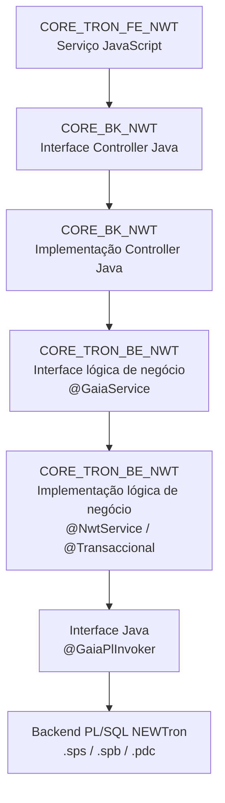
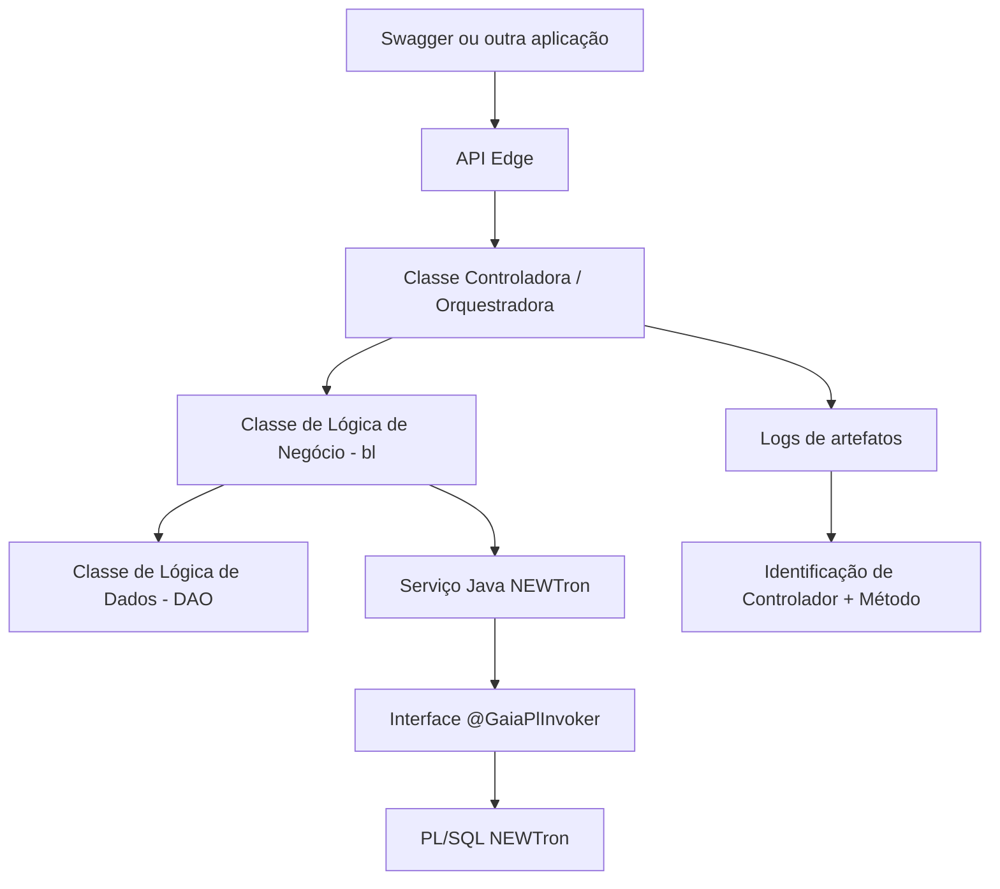

# Gestão de Trazas no Reef.core: Guia de Rastreabilidade em Backend PL/SQL, Frontais Java/JavaScript e APIs

## 1. Metadados do Documento
- **Arquivo de Origem:** Não informado; conteúdo extraído de apresentação com 48 páginas.
- **Tipo de Documento:** Manual Operacional e Arquitetura de Software.
- **Domínio / Sistema:** Reef.core, Tron, NEWTron, PTD, API Edge.
- **Público-Alvo:** Desenvolvedores, Arquitetos, Operação e equipes de suporte.
- **Data/Versão Identificada:** Não identificada.

---

## 2. Resumo Executivo & Contexto de Negócio

O documento descreve a gestão de rastros (*trazas*) no ecossistema Reef.core como instrumento de diagnóstico, correção de erros funcionais e investigação de falhas de execução. A rastreabilidade registra o fluxo de procedimentos executados e os dados necessários para identificar a origem de problemas durante operações funcionais.

O escopo abrange pacotes PL/SQL do backend Tron, componentes Java e JavaScript associados aos frontais NEWTron e Novos Frontais, além de APIs do API Edge. O material apresenta mecanismos de depuração no código, tabelas Oracle de rastros e erros, logs de artefatos Java e ferramentas de observabilidade, incluindo Splunk.

No backend PL/SQL, a geração de rastros utiliza principalmente o pacote `dl_trn_dbg_trn`, cujos procedimentos registram início e fim de métodos, parâmetros, variáveis, retornos, comentários e erros na tabela `t_trn_trn_r_dbg`. O documento estabelece que os rastros devem ser inicialmente mantidos comentados e ativados temporariamente durante a investigação.

Para os frontais, a rastreabilidade parte da identificação do serviço executado — JavaScript/Controller em GAIA ou `action`/manager nos Novos Frontais — e segue a cadeia de chamadas Java até o backend PL/SQL. Para APIs, a identificação do controlador e método ocorre por logs; em seguida, a análise continua pelas classes chamadas, podendo ser complementada com a tabela de erros quando a falha envolver serviços NEWTron.

> **Nota de Análise:** O documento cita múltiplas classes, bibliotecas e arquiteturas, mas não fornece contratos HTTP, estruturas completas de DTO, detalhes de autenticação ou configurações integrais de `logback.xml`.

---

## 3. Arquitetura, Componentes & Tecnologias Envolvidas

### Componentes identificados

| Componente / Tecnologia | Papel documentado |
| :--- | :--- |
| Reef.core | Sistema no qual são aplicadas as práticas de gestão de rastros. |
| Tron | Backend do Reef.core construído com pacotes PL. |
| NEWTron | Arquitetura e elementos Java/PL associados ao frontal e backend. |
| GAIA | Arquitetura usada na construção do frontal NEWTron. |
| Novos Frontais | Arquitetura aplicada, entre outros, a tramitação de expedientes, Gestão de Ordem de Serviço, Tesouraria, GDC e Orquestrador Fuji. |
| API Edge | Camada de APIs do Reef.core. |
| Oracle PL/SQL | Tecnologia das lógicas de negócio e de dados do backend Tron. |
| Java / JavaScript | Tecnologias usadas nas camadas de frontal, backend Java e APIs. |
| JBoss | Ambiente mencionado como hospedeiro de módulos de configuração de logs. |
| LOG4M | Biblioteca/módulo de configuração de logs usada nos artefatos. |
| `logback.xml` | Arquivo de configuração principal de logs de um ativo. |
| Splunk | Ferramenta centralizada para consulta de logs por ambiente, índice, máquina, host e outros filtros. |
| BitBucket | Ferramenta citada para acesso aos repositórios FE e BE de NEWTron. |
| Swagger | Aplicação usada para executar APIs. |
| Chrome / F12 | Ferramentas de depuração do navegador para console, rede, payload e resposta. |

### Organização do backend Tron

O backend de Reef.core/Tron é construído com pacotes PL organizados por conceitos lógicos ou de negócio que definem operações funcionais. A estrutura é dividida nas seguintes camadas:

- Lógica de Processo ou orquestração.
- Lógica de Negócio.
- Lógica de Dados.
- Lógicas de integração NWT–TW.
- Lógicas de integração TW–NWT.

### Fluxo de rastreabilidade — arquitetura GAIA



### Fluxo de rastreabilidade — Novos Frontais

```mermaid
graph TD
    A[Frontal / Action] --> B[DTO de comunicação]
    B --> C[Objetos funcionais frm]
    C --> D[Tabela DF_TRN_NWT_XX_FLW_CFG_DSH]
    D --> E[Manager Java]
    E --> F[Método execute[cpoIdn]AcnIdnRun]
    F --> G[Backend Java]
    G --> H[Interface @GaiaPlInvoker]
    H --> I[Backend PL/SQL NEWTron]
```

### Fluxo de rastreabilidade — API Edge



---

## 4. Regras de Negócio, Especificações Funcionais & Processos

### 4.1 Objetivo da gestão de rastros

A gestão de rastros deve exibir, na medida do possível:

1. O fluxo de procedimentos em execução.
2. Os dados básicos necessários para identificar erros funcionais ou de execução.
3. Informações que contribuam para detectar e corrigir erros em processos funcionais.
4. Informações de depuração durante desenvolvimento ou modificação de pacotes, processos e funções.

### 4.2 Rastreabilidade obrigatória em procedimentos e funções NEWTron

Todo procedimento ou função da arquitetura NEWTron deve possuir, no mínimo:

1. Uma constante `c_pgm_nam` com o nome do programa/pacote Oracle.
2. Um rastro de início do método ou função.
3. Rastros de todos os parâmetros simples de entrada.
4. Opcionalmente, um rastro na captura de erro.
5. Um rastro de término do procedimento ou função.

Exemplo de constante de programa:

```plsql
c_pgm_nam CONSTANT nwt_o.d_trn.pgm_nam := 'sr_thp_adr_qry_trn';
```

Exemplo de início:

```plsql
/**/ dl_trn_dbg.p_set_mth_bgn(
/**/     pm_pgm_nam => c_pgm_nam,
/**/     pm_mth_nam => 'f_tbl');
```

Exemplo de rastro de parâmetro:

```plsql
/**/ dl_trn_dbg.p_set_prm(
/**/     pm_pgm_nam => c_pgm_nam,
/**/     pm_prm_nam => 'pm_thp_dcm_typ_val',
/**/     pm_prm_val => pm_thp_dcm_typ_val);
```

Exemplo de rastro durante captura de erro:

```plsql
EXCEPTION
    WHEN OTHERS THEN
        dl_trn_err.p_add(
            pm_err_val     => SQLCODE,
            pm_err_nam     => SQLERRM,
            pm_o_trn_err_t => pm_o_trn_prc_s.prc_err_t);
    /**/ dl_trn_dbg.p_set_err(pm_pgm_nam => c_pgm_nam);
END;
```

Exemplo de término:

```plsql
/*--@*/ dl_trn_dbg.p_set_mth_trm(
/**/     pm_pgm_nam => c_pgm_nam,
/**/     pm_mth_nam => 'f_tbl');
```

### 4.3 Processo de ativação e desativação dos rastros PL/SQL

1. Ter permissão para modificar o código-fonte.
2. Descomentar os rastros, substituindo as marcações `--@` por `/*--@*/` ou `/**/`, conforme aplicável.
3. Incluir a ativação de rastros no início do procedimento.
4. Utilizar um identificador para localizar posteriormente os registros na tabela de rastros.
5. Compilar o pacote com os rastros ativados.
6. Investigar e corrigir o erro.
7. Comentar novamente os rastros.
8. Remover a instrução de ativação.
9. Compilar novamente o pacote.

Exemplo de ativação:

```plsql
dl_trn_dbg.p_enb(pm_dbg_idn => 'PRUEBA_' || sysdate);
```

> **Regra obrigatória:** Após o diagnóstico e a correção do erro, os rastros devem voltar a ficar comentados e o pacote deve ser recompilado.

### 4.4 Registro de erros

A tabela `t_trn_trn_r_err` registra erros gerados nos pacotes Reef.core. O registro ocorre durante a sessão do usuário quando a variável de usuário `GENERA.TRAZAS` possui valor positivo.

A funcionalidade `dl_trn_err_trn.p_sav` grava o erro, porém não precisa ser adicionada manualmente aos pacotes: a gestão de erros já a utiliza e é responsável pela gravação quando a condição de `GENERA.TRAZAS` é atendida.

Após a resolução do problema, a marca `GENERA.TRAZAS` deve ser desativada para o usuário.

### 4.5 Estrutura interpretativa do erro

A análise de um erro deve considerar:

| Seção | Informação apresentada |
| :--- | :--- |
| Errors Stack | Linha e mensagem de erro. |
| Errors Backtrace | Propagação da exceção desde a linha que gerou o problema. |
| PL/SQL Call Stack | Programas em execução e informações de aninhamento de chamadas a subprogramas. |

### 4.6 Rastreabilidade em PTDs

Os esquemas de Definição de Produto são usados por instalações REEF que não podem acessar diretamente as lógicas ou tabelas do esquema central `TRON2000`. Para manter a independência, o núcleo fornece lógicas PTD que permitem acesso às lógicas e tabelas centrais sem permitir modificações.

Para rastros nos pacotes PTD, deve-se usar a lógica `trn_k_ptd`, que grava rastros na tabela `t_trn_trn_d_dbg`.

Regras obrigatórias em procedimentos e funções PTD:

1. `trn_k_ptd.p_gen_comienzo_traza` deve ser a primeira linha de código.
2. `trn_k_ptd.p_gen_final_traza` deve ser a última linha de código.
3. `trn_k_ptd.p_gen_traza_parametro` deve ser usado sempre logo após o início para registrar todos os parâmetros de entrada.
4. O método de rastreamento de parâmetros possui sobrecargas para texto, número, data e booleano.

### 4.7 Rastreabilidade em GAIA

No frontal NEWTron com arquitetura GAIA:

1. Identificar o serviço JavaScript executado.
2. Identificar o Controller Java correspondente.
3. Seguir a implementação do Controller.
4. Localizar o serviço Java de negócio anotado com `@GaiaService`.
5. Localizar a implementação anotada com `@NwtService` e `@Transaccional`.
6. Seguir a interface anotada com `@GaiaPlInvoker`.
7. Identificar a lógica PL/SQL NEWTron correspondente.

No exemplo de “Lanzador de tareas”, a URL do serviço é:

```text
https://trn.desa.mapfre.net/nwt_fe-web/api/nwt/ply/ply/pssV/runTskFns
```

O documento indica a busca pelo serviço JavaScript `plyplypssVSrv.runTskFns`.

### 4.8 Rastreabilidade em Novos Frontais

Nos Novos Frontais, as chamadas ao backend são realizadas pelos serviços chamados `action`, além de listas de opções e valores.

Características registradas:

- As chamadas enviam e recebem o mesmo DTO de comunicação.
- O DTO pode incluir dados simples, como companhia e idioma.
- O parâmetro `flowData` inclui dados recebidos automaticamente do fluxo.
- O DTO contém objetos funcionais `frm`, suas propriedades e seus dados.
- As propriedades dos objetos podem indicar estado, visibilidade, obrigatoriedade e possibilidade de modificação.
- Cada objeto `frm` participante da chamada possui parâmetros de identificação do serviço backend/manager.
- A tabela `DF_TRN_NWT_XX_FLW_CFG_DSH` define o manager para o fluxo.
- A ordem dos objetos no DTO importa, pois os managers são executados consecutivamente.
- A parametrização pode definir se a execução continua ou é interrompida após erro de um manager.

No exemplo de criação de Ordem de Serviço:

| Item | Valor identificado |
| :--- | :--- |
| Manager | `LssSvoOpnSrvOrdMnr` |
| Ação | `Accept` |
| Classe estendida | `SplBaseManager` |
| Método | `executeLssSvoFrmAccept` |

No exemplo de modificação de Serviço de Ordem de Serviço:

| Item | Valor identificado |
| :--- | :--- |
| Manager | `LssSswOpnSrvOrdMnr` |
| Ação | `Accept` |
| Classe estendida | `SplBaseManager` |
| Método | `executeLssSswFrmAccept` |

### 4.9 Ferramentas de investigação no frontal

Para o frontal cliente, usar as ferramentas F12 do navegador:

1. **Console:** erros JavaScript não tratados ou erros de código.
2. **Network:** informações das requisições feitas ao servidor.
3. **Headers:** URL do serviço invocado.
4. **Request Payload:** dados enviados ao servidor.
5. **Preview/Response:** dados de resposta do serviço.

Para o frontend na camada de servidor e para o backend Java:

- Consultar logs dos artefatos.
- Acessar repositórios FE e BE de NEWTron.
- Usar bibliotecas de log Java com métodos `info`, `debug`, `error` e `warm`, conforme escrito no documento.
- Usar `loggerUtils` e/ou `log` para rastrear classes e métodos Java.
- Incluir apenas os rastros necessários para acompanhar o fluxo e detectar erros.

### 4.10 Ferramentas de investigação em backend Oracle

A investigação no backend Oracle pode usar:

1. A tabela `RL_TRN_NWT_XX_VRB` de variáveis globais de sessão.
2. A tabela `T_TRN_TRN_R_ERR` de erros de aplicação.
3. A propriedade de usuário `GENERA.TRAZAS`.
4. O identificador de sessão.
5. Chamadas ao pacote `dl_trn_dbg_trn`.
6. Ativação temporária dos rastros em pacotes PL/SQL.

### 4.11 Rastreabilidade em APIs

Para APIs do API Edge:

1. Executar a API via Swagger ou outra aplicação.
2. Consultar os logs para identificar a classe controladora e o método executado.
3. Seguir a cadeia de chamadas entre classes Java.
4. Alternativamente, executar a API em modo debug com aplicação específica.
5. Se o erro provier de um serviço NEWTron, complementar a análise consultando `t_trn_trn_r_err` pelo identificador da sessão e texto do erro.

Exemplo documentado:

| Item | Valor |
| :--- | :--- |
| Operação | Consulta da Posição Diária |
| Controlador | `bussinessLineController` |
| Método | `getFulldailyPositionbyDate` |

---

## 5. Tabelas de Parâmetros, Ambientes e Estruturas de Dados

### 5.1 Procedimentos e funções de `dl_trn_dbg_trn`

| Item / Parâmetro | Descrição / Função | Tipo / Valores / Formato | Ambiente / Observações |
| :--- | :--- | :--- | :--- |
| `f_get_idn` | Retorna identificador único usado como chave primária na tabela de debug. | Função. | Backend PL/SQL. |
| `p_drp` | Elimina rastros. | Três versões sobrecarregadas. | Pode excluir por identificação, a partir de uma data ou entre duas datas. |
| `p_dsb` | Desabilita geração de rastros para uma sessão. | Procedimento. | Backend PL/SQL. |
| `p_enb` | Habilita rastros e inicializa variáveis globais relacionadas. | Procedimento. | Inicializa o identificador dos rastros da sessão. |
| `p_get_dbg` | Retorna rastros do identificador informado. | Procedimento/função conforme apresentação. | Consulta de rastros por identificador. |
| `p_set_cmt` | Registra comentário. | Procedimento. | Insere em `t_trn_trn_r_dbg`. |
| `p_set_enb` | Habilita ou desabilita rastros e inicializa variáveis globais. | Procedimento. | Backend PL/SQL. |
| `p_set_err` | Registra erro. | Procedimento. | Insere em `t_trn_trn_r_dbg`. |
| `p_set_mth_bgn` | Registra início de procedimento. | Procedimento. | Insere em `t_trn_trn_r_dbg`. |
| `p_set_mth_trm` | Registra término de procedimento. | Procedimento. | Insere em `t_trn_trn_r_dbg`. |
| `p_set_prm` | Registra parâmetro. | Procedimento com sobrecargas por tipo. | Insere em `t_trn_trn_r_dbg`. |
| `p_set_rtr` | Registra retorno de função. | Procedimento com sobrecargas por tipo. | Insere em `t_trn_trn_r_dbg`. |
| `p_set_vrb` | Registra variável de função. | Procedimento com sobrecargas por tipo. | Insere em `t_trn_trn_r_dbg`. |

### 5.2 Estrutura de `t_trn_trn_r_dbg`

| Item / Parâmetro | Descrição / Função | Tipo / Valores / Formato | Ambiente / Observações |
| :--- | :--- | :--- | :--- |
| `dbg_idn` | Identificador dos rastros da mesma sessão. | Parte da chave primária. | Chave composta com `tim_inv`. |
| `tim_inv` | Timestamp de inserção do registro. | Parte da chave primária. | Chave composta com `dbg_idn`. |
| `dbg_sqn` | Ordem numérica dos rastros da sessão. | Valor numérico. | Simplifica a visualização da sequência. |
| `dbg_bgn_end` | Indica início ou término de procedimento/função. | `B` = começo; `T` = término. | Campo de ciclo do método. |
| `ind_lvl` | Nível do subprograma na pilha de invocações. | Numérico. | O programa inicial possui nível zero; subprogramas chamados elevam o nível. |
| `pgm_nam` | Nome do subprograma gerador do rastro. | Texto. | Nome do programa/pacote. |
| `mmb_typ` | Tipo de membro rastreado. | `cmt`, `err`, `mth`, `prm`, `rtr`, `vrb`. | Comentário, erro, método, parâmetro, retorno ou variável. |
| `mmb_nam` | Nome do membro rastreado. | Texto. | Associado ao tipo de membro. |
| `mmb_val` | Valor do membro rastreado. | Valor do membro. | Associado ao tipo de membro. |
| `dbg_stc` | Pilha de invocações no momento do rastro. | Texto/estrutura não detalhada. | Permite analisar os programas chamados. |

### 5.3 Estrutura de `t_trn_trn_r_err`

| Item / Parâmetro | Descrição / Função | Tipo / Valores / Formato | Ambiente / Observações |
| :--- | :--- | :--- | :--- |
| `err_idn` | Identificação que agrupa erros produzidos em uma sessão. | Identificador de sessão. | Corresponde à sessão em que ocorreu o erro. |
| `err_sqn` | Sequência dos erros da sessão. | Numérico/sequencial. | Ordena erros relacionados. |
| `msg_val` | Código do erro gerado. | Código de erro. | Registro de aplicação. |
| `msg_nam` | Pilha de invocações no momento da geração do rastro. | Pilha de chamadas. | Campo descrito pelo documento. |

### 5.4 Funções de rastreabilidade PTD em `trn_k_ptd`

| Item / Parâmetro | Descrição / Função | Tipo / Valores / Formato | Ambiente / Observações |
| :--- | :--- | :--- | :--- |
| `p_gen_comienzo_traza` | Registra início de rastro. | Procedimento. | Primeira linha de todos os procedimentos e funções PTD. |
| `p_gen_final_traza` | Registra término de rastro. | Procedimento. | Última linha de todos os procedimentos e funções PTD. |
| `p_gen_traza_parametro` | Registra valor de parâmetro de entrada. | Sobrecargas para texto, numérico, data e booleano. | Deve ser chamado logo após o início. |
| `f_dev_identificador_traza` | Retorna identificador para debug ou habilitação/desabilitação. | Função. | Pode receber identificador para facilitar localização. |
| `p_habilita_traza` | Habilita geração de rastros. | Procedimento. | Recebe identificador de rastro. |
| `p_deshabilita_traza` | Desabilita geração de rastros. | Procedimento. | O exemplo da apresentação mostra `p_habilita_traza`; há possível inconsistência textual. |
| `p_gen_habilita_traza` / `p_set_habilita_traza` | Habilita ou desabilita segundo parâmetro recebido. | Procedimento. | O slide alterna os nomes; preservar a nomenclatura apresentada. |
| `p_gen_traza_variable` | Registra variável. | Procedimento. | Exemplo com `l_imp_acumulado`. |
| `p_gen_traza_retorno_funcion` | Registra retorno de função. | Procedimento. | Exemplo com `l_cod_política_actual`. |
| `p_gen_traza_comentario` | Registra comentário entre rastros. | Procedimento. | Exemplo: “cambio de tipo de traza”. |

### 5.5 Tabelas de configuração e dados de sessão

| Item / Parâmetro | Descrição / Função | Tipo / Valores / Formato | Ambiente / Observações |
| :--- | :--- | :--- | :--- |
| `DF_TRN_NWT_XX_FLW_CFG_DSH` | Configura managers dos fluxos funcionais. | Tabela. | Usada em Novos Frontais. |
| `RL_TRN_NWT_XX_VRB` | Guarda variáveis globais por sessão ou conexão. | Tabela. | Também descrita como “Variables Globales (Sesión Desconectada)”. |
| `ses_val` | Identificador da sessão. | Identificador. | Campo de `RL_TRN_NWT_XX_VRB`. |
| `vrb_val` | Valor de todas as variáveis globais da sessão. | `anydata`. | Contém objeto `to_properties`. |
| `nom_variable` | Nome de variável global. | Propriedade de `to_properties`. | Associada a uma variável da sessão. |
| `val_variable` | Valor de variável global. | Propriedade de `to_properties`. | Associada a uma variável da sessão. |
| `GENERA.TRAZAS` | Habilita gravação de erros/rastros para usuário. | Valor positivo para habilitar. | Deve ser desativada após a correção. |
| `T-Xbid` | Identificador de sessão mencionado no resumo. | Identificador. | Usado para acessar valores globais após desconexão da BBDD. |

### 5.6 Logs, bibliotecas e caminhos

| Item / Parâmetro | Descrição / Função | Tipo / Valores / Formato | Ambiente / Observações |
| :--- | :--- | :--- | :--- |
| `MAPFRE_GAIA_LOG4M_nwt_fe_DIST` | Biblioteca de log para NWT-FE. | Módulo/biblioteca. | Configuração referenciada pela aplicação. |
| `MAPFRE_GAIA_LOG4M_nwt_be_DIST` | Biblioteca de log para NWT-BE. | Módulo/biblioteca. | Configuração referenciada pela aplicação. |
| `MAPFRE_GAIA_LOG4M_nwt_isu_api_be_DIST` | Biblioteca de log para API BE. | Módulo/biblioteca. | Configuração referenciada pela aplicação. |
| `logback.xml` | Configuração principal do log do ativo. | Arquivo XML. | Define arquivos e níveis: `info`, `warm`, `error`, `debug`. |
| `/tmp/LOGS_GAIA/gaia-fw.default.log` | Log NWT-FE. | Caminho de arquivo. | Reef.core. |
| `/tmp/LOGS_GAIA/gaia-thirdparty.log` | Log NWT-FE. | Caminho de arquivo. | Reef.core. |
| `/tmp/LOGS_GAIA/gaia-thirdparty.%d{yyyy-MM-dd}-%i.log` | Log NWT-FE rotacionado. | Caminho/padrão de arquivo. | Reef.core. |
| `/tmp/LOGS_GAIA/log_nwt_be.log_${appservername}.log` | Log NWT-BE. | Caminho/padrão de arquivo. | Reef.core. |
| `/tmp/LOGS_GAIA/log_nwt_be.log_${appservername}.log.%d{yyyy-MM-dd}-%i` | Log NWT-BE rotacionado. | Caminho/padrão de arquivo. | Reef.core. |
| `/tmp/LOGS_GAIA/log_nwt_be.log_${appservername}.log-thirdparty.log` | Log NWT-BE de terceiros. | Caminho/padrão de arquivo. | Reef.core. |

### 5.7 Consultas e filtros Splunk

| Item / Parâmetro | Descrição / Função | Tipo / Valores / Formato | Ambiente / Observações |
| :--- | :--- | :--- | :--- |
| URL Splunk | Acesso à ferramenta de logs centralizados. | `https://splunk.es.mapfre.net/` | Acesso por usuário/senha Mapfre, conforme documento. |
| `idx_jboss_newtron_maquinas_edic` | Índice de máquinas EDIC. | Índice Splunk. | Identificado como `SPLUNK_PROD-IDX1`. |
| `idx_jboss_newtron_maquinas_int` | Índice de máquinas de integração. | Índice Splunk. | Identificado como `SPLUNK_PROD-IDX1`. |
| `idx_jboss_newtron_maquinas_pre` | Índice de máquinas PRE. | Índice Splunk. | Identificado como `SPLUNK_PROD-IDX1`. |
| `index=idx_jboss_newtron_maquinas_int` | Seleciona índice/servidor de ambiente. | Cláusula Splunk. | Exemplo fornecido. |
| `host=LES000A103093` | Filtra host da aplicação. | Cláusula Splunk. | Exemplo de host NEWTron em integração núcleo. |
| `source=/tmp/LOGS_GAIA/gaia-fw.default.log` | Seleciona log NWT. | Cláusula Splunk. | Exemplo fornecido. |
| `tbid:ddfe8708-4ee6-430f-8dbf-9af4ef4cbbde` | Busca por sessão registrada em log. | Identificador de sessão. | Exemplo fornecido. |
| `task-25` | Busca por id de tarefa. | Cláusula/termo de busca. | Aplicável a alguns artefatos, como NWT e RPT. |
| `remoteUser:MENAIG` | Busca por usuário remoto. | Cláusula Splunk. | Exemplo fornecido. |
| `ERROR` | Filtra registros de erro. | Termo de busca. | Splunk. |
| `INFO` | Filtra registros informativos. | Termo de busca. | Splunk. |

---

## 6. Bateria de Perguntas & Respostas para RAG (FAQ Sintético)

### P1: Qual é o objetivo da gestão de rastros no Reef.core?
**R:** A gestão de rastros no Reef.core permite visualizar o fluxo de procedimentos executados e os dados necessários para identificar erros funcionais ou de execução. O objetivo é apoiar a detecção e a correção de falhas em pacotes, processos e funções, principalmente durante desenvolvimento, modificação e testes.

### P2: Qual pacote PL/SQL deve ser usado para gerar rastros no backend Reef.core?
**R:** O pacote indicado é `dl_trn_dbg_trn`. Entre suas funções e procedimentos públicos estão `f_get_idn`, `p_enb`, `p_dsb`, `p_get_dbg`, `p_set_cmt`, `p_set_err`, `p_set_mth_bgn`, `p_set_mth_trm`, `p_set_prm`, `p_set_rtr` e `p_set_vrb`.

### P3: Quais rastros são obrigatórios em uma função ou procedimento NEWTron?
**R:** Todo procedimento ou função NEWTron deve declarar a constante `c_pgm_nam`, registrar o início com `p_set_mth_bgn`, registrar todos os parâmetros simples de entrada com `p_set_prm` e registrar o término com `p_set_mth_trm`. O rastro de erro com `p_set_err` pode ser incluído no tratamento de exceções.

### P4: Como ativar rastros em um pacote PL/SQL do Reef.core?
**R:** É necessário ter permissão para modificar o código, descomentar os rastros, inserir uma chamada de ativação como `dl_trn_dbg.p_enb(pm_dbg_idn => 'PRUEBA_' || sysdate);` no início do procedimento e recompilar o pacote. O identificador informado permite localizar os registros na tabela de rastros.

### P5: O que deve ser feito depois que um erro é corrigido com ajuda de rastros?
**R:** Os rastros devem ser comentados novamente, a instrução de ativação deve ser removida e o pacote deve ser recompilado. O documento estabelece expressamente que essa etapa é obrigatória.

### P6: Qual tabela contém os rastros de depuração do backend PL/SQL?
**R:** A tabela é `t_trn_trn_r_dbg`. Ela contém, entre outros, identificador de rastro (`dbg_idn`), timestamp (`tim_inv`), sequência (`dbg_sqn`), início ou término (`dbg_bgn_end`), nível de invocação (`ind_lvl`), nome do programa (`pgm_nam`), tipo, nome e valor do membro e a pilha de invocações (`dbg_stc`).

### P7: Como são gravados erros na tabela `t_trn_trn_r_err`?
**R:** Os erros de Reef.core são gravados durante a sessão do usuário quando a variável `GENERA.TRAZAS` possui valor positivo. A funcionalidade `dl_trn_err_trn.p_sav` já faz parte da gestão de erros e não precisa ser adicionada manualmente aos pacotes.

### P8: Como rastrear uma ação nos Novos Frontais?
**R:** Deve-se identificar o serviço `action`, o componente funcional `frm` que disparou a ação e consultar a tabela `DF_TRN_NWT_XX_FLW_CFG_DSH`. Essa tabela permite identificar o manager Java e o método executado, cujo padrão informado é `[execute][cpoIdn]AcnIdnRun`. Depois, a investigação continua pelas classes Java chamadas ou pelos logs.

### P9: Que ferramentas do navegador ajudam a rastrear uma requisição do frontal?
**R:** O documento recomenda usar F12 no navegador, especialmente o Console para erros JavaScript, a aba Network para requisições ao servidor, Headers para a URL do serviço, Request Payload para os dados enviados e Preview/Response para os dados de resposta.

### P10: Onde consultar logs de artefatos NEWTron e como filtrá-los?
**R:** Os logs podem ser consultados centralmente no Splunk em `https://splunk.es.mapfre.net/`. A consulta pode filtrar índice com `index=`, host com `host=`, caminho do arquivo com `source=`, sessão com `tbid:`, tarefa, usuário remoto com `remoteUser:`, além de termos como `ERROR` e `INFO`.

### P11: Como identificar a classe Java de uma API executada no Reef.core?
**R:** O documento indica executar a API pelo Swagger ou outra aplicação e consultar os logs para identificar o controlador e o método executados. A rastreabilidade então continua pelas classes Java chamadas, ou a API pode ser executada em modo debug.

### P12: Qual exemplo de controlador e método é apresentado para a API de Consulta da Posição Diária?
**R:** O exemplo identifica o controlador `bussinessLineController` e o método `getFulldailyPositionbyDate`.

---

## 7. Glossário de Termos, Siglas & Conceitos-Chave

- **API Edge:** Camada de APIs do Reef.core descrita no documento.
- **BE:** Backend.
- **BBDD:** Base de dados.
- **BL:** Lógica de negócio, apresentada como camada entre controlador e DAO em APIs.
- **DAO:** Classe de lógica de dados.
- **DTO:** Objeto de transferência usado na comunicação de ações dos Novos Frontais.
- **FE:** Frontend.
- **GAIA:** Arquitetura usada na construção do frontal NEWTron.
- **LOG4M:** Biblioteca/módulo de configuração de logs dos artefatos.
- **NEWTron / NWT:** Contexto arquitetural e funcional do Reef.core associado a elementos Java e PL/SQL.
- **PL/SQL:** Linguagem usada nos pacotes do backend Oracle.
- **PTD:** Lógicas de Definição de Produto que permitem acesso controlado às lógicas e tabelas de núcleo.
- **Reef.core:** Sistema/domínio abrangido pelo documento.
- **Splunk:** Ferramenta centralizada de consulta e filtragem de logs.
- **Tron:** Backend Reef.core construído com pacotes PL.
- **TronWeb / TW:** Aplicação/contexto citado para alteração de propriedades do usuário e integrações NWT–TW/TW–NWT.
- **`frm`:** Objeto de componente funcional presente no DTO dos Novos Frontais.
- **`flowData`:** Parâmetro que contém dados recebidos automaticamente no fluxo.
- **Manager:** Classe Java configurada para executar ações de componentes funcionais nos Novos Frontais.
- **`action`:** Serviço de chamada ao backend nos Novos Frontais.
- **`c_pgm_nam`:** Constante com o nome do pacote/programa Oracle usada como parâmetro de rastreamento.
- **`GENERA.TRAZAS`:** Propriedade de usuário que deve ter valor positivo para gravar erros na tabela de erros.
- **`T-Xbid`:** Identificador de sessão citado para consulta de variáveis globais após desconexão da base de dados.

---

## 8. Notas Críticas, Riscos & Limitações

- Os rastros PL/SQL devem ser criados inicialmente comentados e somente ativados durante investigação. Deixá-los ativos após o diagnóstico viola a regra indicada no documento.
- A propriedade `GENERA.TRAZAS` deve ser desativada após a correção do erro.
- A sequência dos objetos `frm` no DTO dos Novos Frontais determina a ordem consecutiva de execução dos managers.
- A tabela `DF_TRN_NWT_XX_FLW_CFG_DSH` pode configurar a continuidade ou a interrupção do fluxo quando ocorre erro em um manager.
- A rastreabilidade de outras aplicações Reef.core com frontais próprios não está incluída no escopo do documento; suas rastreabilidades encontram-se em instâncias não Reef.core.
- Quando um erro acontece entre camadas do backend e é erro de código ou erro não controlado, o documento indica que a rastreabilidade está disponível apenas no log.
- O material apresenta uma possível inconsistência no slide sobre PTD: menciona `p_deshabilita_traza`, mas o exemplo exibido usa `trn_k_ptd.p_habilita_traza;`.
- O material alterna entre `p_gen_habilita_traza` e `p_set_habilita_traza`; não há detalhamento suficiente para resolver a nomenclatura sem consultar a implementação real.
- O nível de log aparece como `warm` na apresentação. O documento não esclarece se é nomenclatura intencional ou erro de transcrição.
- Não foram fornecidos contratos de APIs, esquemas completos de DTO, configurações integrais de logs ou detalhes de autenticação além do que está transcrito.

---

## 9. Conteúdo Bruto Estruturado (Referência Fiel)

```text
--- [PÁGINAS 1–2 DE 48] ---

Gestión de Trazas en Reef.core.

Índice:
- Trazabilidad en Backend PL.
- Trazabilidad en Backend Java.
- Trazabilidad en Frontal.
- Trazabilidad en las APIs.
- Gestión de Trazas en Reef.core.

Objetivo de la formación:
Explicar cómo se utiliza la trazabilidad en los programas de Reef.core como una herramienta de ayuda para la detección y corrección de errores.

Ámbito:
Packages PL y clases Java / JavaScript, tanto en FE como en BE.

Definición:
La gestión de trazas muestra el flujo de procedimientos ejecutados y los datos básicos necesarios para identificar errores funcionales o de ejecución, contribuyendo a su detección y corrección.

El documento sirve como guía para generar trazas durante la depuración en Reef.core:
1. Generación de trazas dentro del PL.
2. Trazabilidad dentro del Backend Java.
3. Trazabilidad dentro del Frontal Java: Java NEWTron y Java de Nuevos Frontales.
4. Trazabilidad dentro de las APIs.

--- [PÁGINA 3 DE 48] ---

Backend Reef.core — Tron:
- Construido con paquetería PL.
- Organización asociada a conceptos lógicos/de negocio de las operaciones funcionales.
- Estructura por capas:
  - Lógica de Proceso u orquestación.
  - Lógica de Negocio.
  - Lógica de Datos.
  - Lógicas de integración NWT-TW.
  - Lógicas de integración TW-NWT.

--- [PÁGINAS 4–6 DE 48] ---

Paquete de trazas: dl_trn_dbg_trn.

Funciones y procedimientos públicos:
- f_get_idn: devuelve identificador único usado como clave primaria por tabla de debug.
- p_drp: elimina trazas por identificación, desde una fecha o entre dos fechas.
- p_dsb: inhabilita generación de trazas para una sesión.
- p_enb: habilita trazas e inicializa variables globales e identificador de trazas.
- p_get_dbg: devuelve trazas del identificador recibido.
- p_set_cmt: genera rastro de comentario en t_trn_trn_r_dbg.
- p_set_enb: habilita/deshabilita trazas e inicializa variables globales.
- p_set_err: genera rastro de error.
- p_set_mth_bgn: genera rastro de comienzo.
- p_set_mth_trm: genera rastro de finalización.
- p_set_prm: genera rastro de parámetro; tiene sobrecargas por tipo.
- p_set_rtr: genera rastro de retorno; tiene sobrecargas por tipo.
- p_set_vrb: genera rastro de variable; tiene sobrecargas por tipo.

Tabla t_trn_trn_r_dbg:
- dbg_idn: identificador de trazas de una sesión; clave primaria junto con tim_inv.
- tim_inv: timestamp de inserción; clave primaria junto con dbg_idn.
- dbg_sqn: secuencia numérica de trazas.
- dbg_bgn_end: B = comienzo; T = terminación.
- ind_lvl: nivel de pila de invocaciones.
- pgm_nam: nombre de subprograma.
- mmb_typ: cmt, err, mth, prm, rtr, vrb.
- mmb_nam: nombre de miembro.
- mmb_val: valor de miembro.
- dbg_stc: pila de invocación.

--- [PÁGINAS 7–10 DE 48] ---

Trazas obligatorias NEWTron:
- Las trazas se crean comentadas.
- Todos los programas definen c_pgm_nam con el nombre del package Oracle.
- Inicio con dl_trn_dbg.p_set_mth_bgn.
- Registro de parámetros simples de entrada con dl_trn_dbg.p_set_prm.
- Se puede registrar el error en EXCEPTION con dl_trn_dbg.p_set_err.
- Finalización con dl_trn_dbg.p_set_mth_trm.

Activación:
- Descomentar trazas reemplazando --@.
- Activar con:
  dl_trn_dbg.p_enb(pm_dbg_idn => 'PRUEBA_' || sysdate);
- Compilar paquete con trazas activas.
- Tras corregir el error, comentar las trazas y recompilar.

--- [PÁGINAS 11–14 DE 48] ---

Tabla de errores: t_trn_trn_r_err.

La funcionalidad dl_trn_err_trn.p_sav graba el error.
No necesita ser incluida manualmente porque la gestión de errores ya la usa cuando la variable de usuario GENERA.TRAZAS tiene valor positivo.

Campos:
- err_idn: identificación de error/sesión.
- err_sqn: secuencia de error en sesión.
- msg_val: código de error.
- msg_nam: pila de invocaciones.

Estructura del error:
- Errors Stack: línea y mensaje.
- Errors Backtrace: propagación de excepción desde línea real causante.
- PL/SQL Call Stack: programas ejecutados y anidamiento.

Los errores se graban durante sesión de usuario cuando GENERA.TRAZAS tiene valor positivo.
Después de corregir el error se debe desactivar la marca para el usuario.

--- [PÁGINAS 15–18 DE 48] ---

PTDs:
Los esquemas de Definición de Producto no acceden directamente a lógicas ni tablas TRON2000; el núcleo provee lógicas PTD que dan acceso sin permitir modificar elementos centrales.

Para trazas PTD se usa trn_k_ptd.
Los rastros se almacenan en t_trn_trn_d_dbg.

Trazas obligatorias:
- p_gen_comienzo_traza como primera línea.
- p_gen_final_traza como última línea.
- p_gen_traza_parametro después del comienzo para todos los parámetros.
- Sobrecargas de parámetros: texto, numérico, fecha y booleano.

Componentes:
- f_dev_identificador_traza.
- p_habilita_traza.
- p_deshabilita_traza.
- p_gen_habilita_traza / p_set_habilita_traza.
- p_gen_traza_variable.
- p_gen_traza_retorno_funcion.
- p_gen_traza_comentario.

Los rastros se almacenan en tabla de debug, ya no en archivo de texto.

--- [PÁGINAS 20–26 DE 48] ---

Frontal Reef.core:
- NEWTron fue construido con arquitectura GAIA.
- Nuevos Frontales incluyen módulo de tramitación de expedientes, Gestión de Orden de Servicio, Nuevo Frontal de Tesorería, GDC y Orquestador Fuji.
- No se incluye la trazabilidad de otras aplicaciones Reef.core con frontales propios en instancias no Reef.core.

GAIA:
CORE_TRON_FE_NWT:
- Servicio JavaScript que recoge datos de pantalla y comunica a capa siguiente.

CORE_BK_NWT:
- Interface Controller Java con @controller, URL y método.
- Implementación Controller con @ResponseBody y @RealController.
- Llama al servicio Java de backend.

CORE_TRON_BE_NWT:
- Interface de lógica de negocio con @GaiaService.
- Implementación con @NwtService y @Transaccional.
- Interface con @GaiaPlInvoker.
- Backend PL/SQL NWT con .sps, .spb y .pdc.

Ejemplo Lanzador de tareas:
https://trn.desa.mapfre.net/nwt_fe-web/api/nwt/ply/ply/pssV/runTskFns

Servicio JS:
plyplypssVSrv.runTskFns.

--- [PÁGINAS 26–32 DE 48] ---

Nuevos Frontales:
- Servicios que llaman al backend se denominan action.
- Envían y reciben el mismo DTO.
- DTO puede incluir compañía, idioma, flowData y objetos frm.
- Objetos frm contienen propiedades: estado, visible, requerido, modificable y datos.
- La tabla DF_TRN_NWT_XX_FLW_CFG_DSH permite identificar el manager.
- El orden de objetos DTO determina ejecución consecutiva de managers.
- La tabla permite decidir si se continúa o se interrumpe tras error de manager.

Ejemplo Crear Orden Servicio:
- Manager: LssSvoOpnSrvOrdMnr.
- Acción: Accept.
- Extiende: SplBaseManager.
- Método: executeLssSvoFrmAccept.

Ejemplo Modificar Servicio de Orden de Servicio:
- Manager: LssSswOpnSrvOrdMnr.
- Acción: Accept.
- Extiende: SplBaseManager.
- Método: executeLssSswFrmAccept.

--- [PÁGINAS 33–42 DE 48] ---

Herramientas:
Frontal cliente:
- F12.
- Console: errores JavaScript no controlados.
- Network: peticiones al servidor.
- Headers: URL.
- Request Payload: información enviada.
- Preview/Response: información de respuesta.

Frontend capa servidor y backend Java:
- Logs de artefactos.
- Repositorios FE y BE NEWTron.
- Librerías de log con info, debug, error y warm.
- loggerUtils / log.
- Deben incluirse solo trazas necesarias.

Logs:
NWT-FE:
- /tmp/LOGS_GAIA/gaia-fw.default.log
- /tmp/LOGS_GAIA/gaia-thirdparty.log
- /tmp/LOGS_GAIA/gaia-thirdparty.%d{yyyy-MM-dd}-%i.log

NWT-BE:
- /tmp/LOGS_GAIA/log_nwt_be.log_${appservername}.log
- /tmp/LOGS_GAIA/log_nwt_be.log_${appservername}.log.%d{yyyy-MM-dd}-%i
- /tmp/LOGS_GAIA/log_nwt_be.log_${appservername}.log-thirdparty.log

Bibliotecas:
- MAPFRE_GAIA_LOG4M_nwt_fe_DIST.
- MAPFRE_GAIA_LOG4M_nwt_be_DIST.
- MAPFRE_GAIA_LOG4M_nwt_isu_api_be_DIST.

Splunk:
https://splunk.es.mapfre.net/

Índices:
- idx_jboss_newtron_maquinas_edic.
- idx_jboss_newtron_maquinas_int.
- idx_jboss_newtron_maquinas_pre.

Filtros:
- index=idx_jboss_newtron_maquinas_int.
- host=LES000A103093.
- source=/tmp/LOGS_GAIA/gaia-fw.default.log.
- tbid:ddfe8708-4ee6-430f-8dbf-9af4ef4cbbde.
- task-25.
- remoteUser:MENAIG.
- ERROR.
- INFO.

Variables globales:
RL_TRN_NWT_XX_VRB:
- ses_val: identificador de sesión.
- vrb_val: anydata con objeto to_properties.
- to_properties contiene nom_variable y val_variable.

--- [PÁGINAS 44–46 DE 48] ---

API Edge:
- Clase controladora/orquestadora con acciones API definidas por módulo funcional.
- Clase de lógica de negocio (bl).
- Clase de lógica de datos (DAO).
- Puede acceder o no a servicios BBDD.
- Conexión con CORE_TRON_BE_NWT, CORE_BK_NWT y PL/SQL NEWTron.

Trazabilidad API:
- Ejecutar API por Swagger.
- Consultar logs para identificar clase Java.
- Continuar búsqueda por clases llamadas.
- Alternativamente ejecutar API en debug.

Ejemplo Consulta Posición Diaria:
- Controlador: bussinessLineController.
- Método: getFulldailyPositionbyDate.

--- [PÁGINA 48 DE 48] ---

Resumen:
- Paquete de trazas backend: dl_trn_dbg_trn.
- Tabla de trazas: t_trn_trn_r_dbg.
- Tabla de rastros de errores backend: t_trn_trn_r_err.
- GENERA.TRAZAS debe tener valor positivo para grabar errores.
- PTDs usan trn_k_ptd.
- Tabla de variables globales: rl_trn_nwt_xx_vrb.
- NEWTron usa sesiones desconectadas de BBDD y guarda variables globales al desconectarse.
- Identificador de sesión: T-Xbid.
- GAIA: Servicio JS → Controller Java → ServicioNegocioJava → PL.
- Nuevos Frontales: action → componente funcional → tabla de configuración → manager/método.
- APIs: identificar controlador/método por logs y seguir Controlador → BL → demás clases.
```
