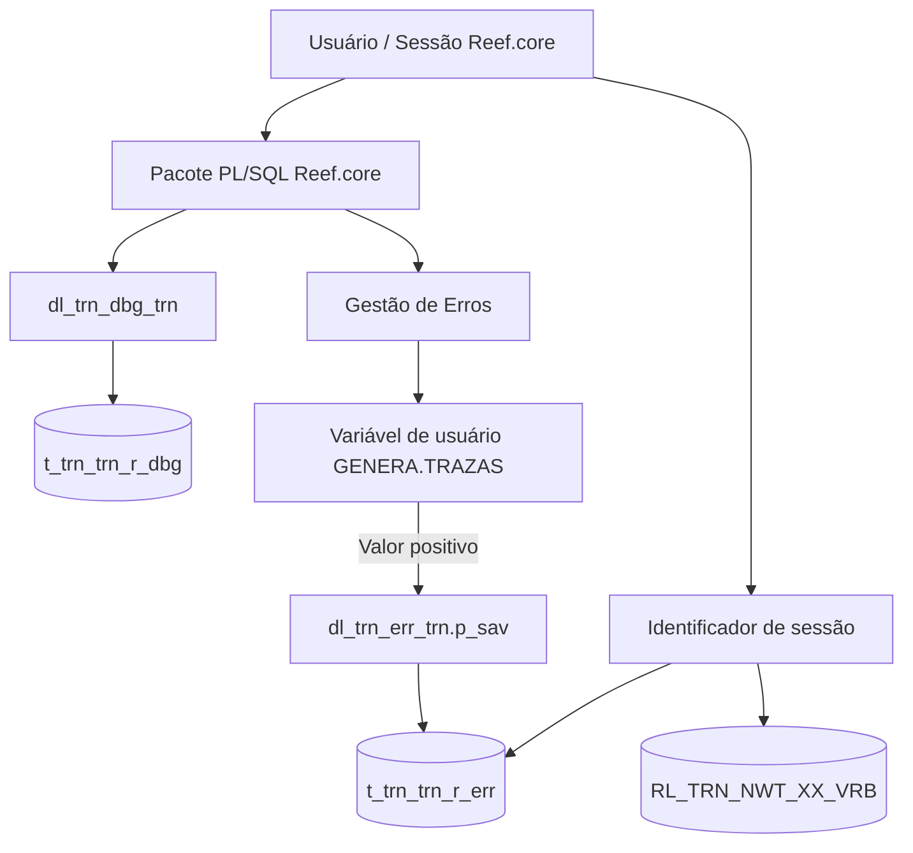
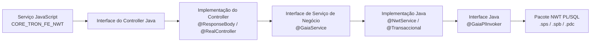
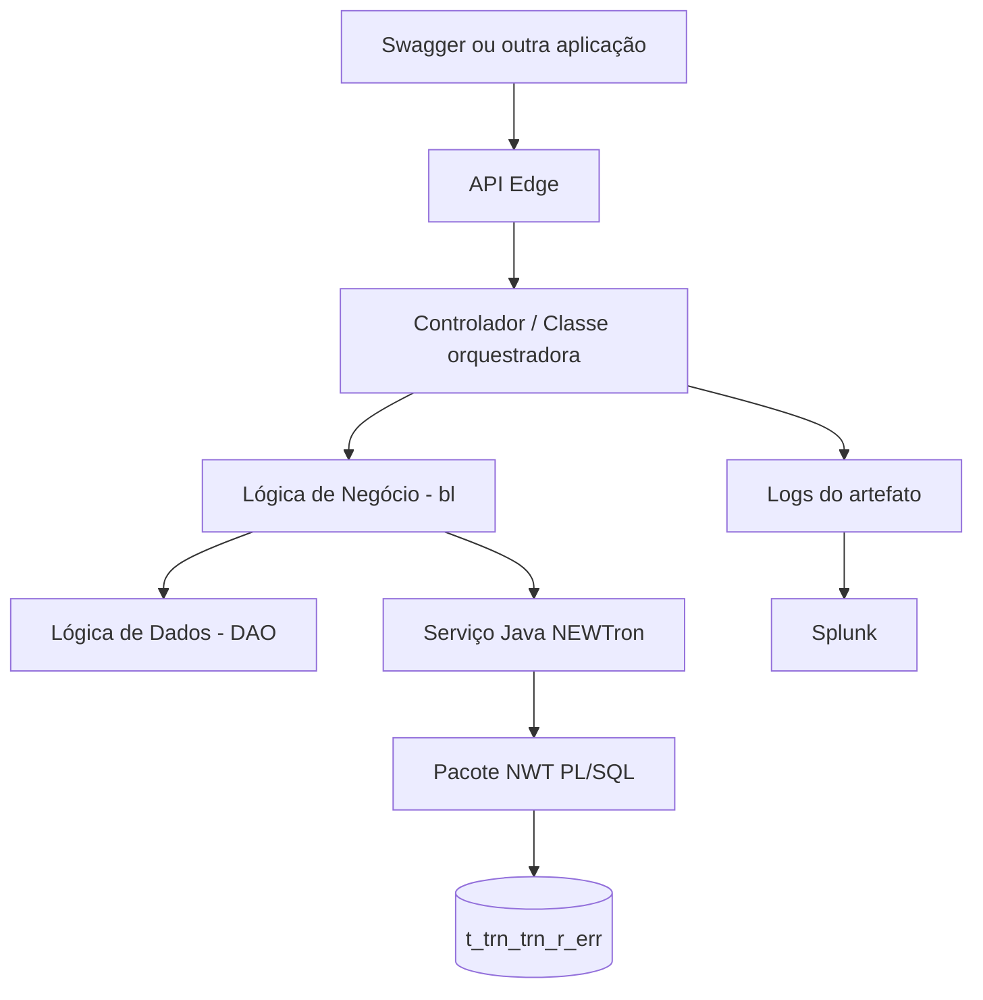

# Gestão de Trazas em Reef.core: Guia de Rastreabilidade para Backend PL/SQL, Frontend, Java e APIs

## 1. Metadados do Documento
- **Arquivo de Origem:** `Gestión de Trazas en Reef.core` — nome de arquivo não identificado no conteúdo extraído
- **Tipo de Documento:** Manual Operacional / Arquitetura de Software / Material de Formação
- **Domínio / Sistema:** Reef.core, NEWTron, TronWeb, TRON2000, GAIA, Novos Frontais e API Edge
- **Público-Alvo:** Desenvolvedores PL/SQL e Java, Arquitetos, Equipes de Operação, Suporte e Analistas Técnicos
- **Data/Versão Identificada:** Não identificada

---

## 2. Resumo Executivo & Contexto de Negócio

O documento descreve a gestão de rastros (*trazabilidad* ou *trazas*) no ecossistema Reef.core como mecanismo de apoio à identificação, análise e correção de erros funcionais ou de execução. A rastreabilidade é apresentada como a capacidade de registrar o fluxo de procedimentos executados, os dados básicos envolvidos e a pilha de chamadas, permitindo investigar problemas ao longo das camadas de uma operação.

O escopo abrange o backend Oracle implementado com pacotes PL/SQL, o frontend baseado em JavaScript e Java, o backend Java, os Novos Frontais, os componentes de definição de produto (PTDs) e as APIs do API Edge. O material diferencia as arquiteturas GAIA e Novos Frontais, pois cada uma possui mecanismos distintos para identificar os serviços, classes Java, managers, métodos e fluxos funcionais envolvidos em uma execução.

No backend PL/SQL, a geração de rastros é centralizada no pacote `dl_trn_dbg_trn`, que grava eventos na tabela `t_trn_trn_r_dbg`. Há também uma estrutura específica para erros na tabela `t_trn_trn_r_err`, cuja gravação depende de a variável de usuário `GENERA.TRAZAS` possuir valor positivo. Para pacotes PTD, a rastreabilidade utiliza a lógica `trn_k_ptd`.

No frontend e backend Java, o diagnóstico depende da inspeção do navegador, especialmente com F12, da análise de requisições HTTP, da consulta às classes Java nos repositórios e da leitura de logs dos artefatos. O documento indica o Splunk como ferramenta centralizada de consulta a logs de Reef.core, com seleção por índice, host, fonte de log, sessão, tarefa, usuário, intervalo de tempo e nível de severidade.

O benefício operacional esperado é permitir que uma falha seja correlacionada desde a ação executada pelo usuário até o serviço JavaScript, controller Java, serviço de negócio, manager, lógica PL/SQL, tabela de erros e logs de infraestrutura. O documento enfatiza que as rastros de desenvolvimento devem permanecer comentadas quando não estiverem sendo utilizadas e que tanto a ativação temporária de rastros quanto a propriedade `GENERA.TRAZAS` devem ser desativadas após a correção do problema.

---

## 3. Arquitetura, Componentes & Tecnologias Envolvidas

### Componentes e camadas identificados

| Componente / Tecnologia | Papel no contexto de rastreabilidade |
| :--- | :--- |
| Reef.core | Ecossistema corporativo abordado pelo documento. |
| TRON / TRON2000 | Núcleo de backend e esquema central que não deve ser acessado diretamente por instalações com definição de produto. |
| NEWTron | Arquitetura e conjunto de componentes frontend, backend Java e PL/SQL utilizados no Reef.core. |
| GAIA | Arquitetura utilizada na construção do frontal de NEWTron. |
| Novos Frontais | Arquitetura utilizada por novos módulos funcionais, incluindo tramitación de expedientes, Gestión Orden de Servicio, Tesorería, GDC e Orquestador Fuji. |
| Oracle PL/SQL | Tecnologia das lógicas de processo, negócio, dados e pacotes NWT. |
| JavaScript | Tecnologia dos serviços do frontal cliente. |
| Java | Tecnologia dos controllers, serviços de negócio, managers, controladores de API, lógica de negócio e acesso a dados. |
| `dl_trn_dbg_trn` | Pacote de rastros para backend PL/SQL. |
| `dl_trn_err_trn` | Pacote relacionado à persistência de erros; o documento cita `dl_trn_err_trn.p_sav`. |
| `trn_k_ptd` | Lógica de rastros para pacotes PTD de definição de produto. |
| `t_trn_trn_r_dbg` | Tabela de debug para rastros gerados por `dl_trn_dbg_trn`. |
| `t_trn_trn_r_err` | Tabela de erros e rastros de erro por sessão. |
| `t_trn_trn_d_dbg` | Tabela de debug mencionada para rastros em PTDs. |
| `RL_TRN_NWT_XX_VRB` | Tabela de variáveis globais de sessões desconectadas. |
| `DF_TRN_NWT_XX_FLW_CFG_DSH` | Tabela de configuração de managers e fluxo funcional dos Novos Frontais. |
| TronWeb | Aplicação mencionada para ativar a gravação de erros e rastros por usuário. |
| Swagger | Aplicação utilizada para executar APIs no contexto de rastreabilidade. |
| Splunk | Aplicação centralizada para consulta dos logs de Reef.core. |
| BitBucket | Ferramenta utilizada em Reef.core para acesso aos repositórios FE e BE de NEWTron. |
| JBoss | Ambiente onde módulos de configuração de log são referenciados pelos artefatos Java. |
| LOG4M / `logback.xml` | Biblioteca e arquivo de configuração dos logs dos artefatos Java. |

### Arquitetura de rastreabilidade do backend PL/SQL



### Fluxo de execução NEWTron com arquitetura GAIA



### Fluxo de execução dos Novos Frontais

```mermaid
graph TD
    UI[Frontal / Ação action] --> DTO[DTO de comunicação]
    DTO --> FLOW[Objetos funcionais frm]
    FLOW --> CFG[(DF_TRN_NWT_XX_FLW_CFG_DSH)]
    CFG --> MGR[Manager Java]
    MGR --> METHOD[Método execute[cpoIdn]AcnIdnRun]
    METHOD --> BEIF[Interface de serviço<br/>@GaiaService]
    BEIF --> BE[Implementação Java<br/>@NwtService / @Transaccional]
    BE --> PLIF[Interface @GaiaPlInvoker]
    PLIF --> PL[PL/SQL NWT]
```

### Fluxo de rastreabilidade de APIs



### Nota de análise sobre lacunas documentais

> **Nota de Análise:** O documento descreve a sequência de camadas e cita anotações Java, nomes de classes e exemplos de URLs, mas não detalha contratos HTTP, métodos HTTP, esquemas JSON, portas, credenciais, versões de bibliotecas, políticas de retenção de logs ou implementações completas dos componentes.

---

## 4. Regras de Negócio, Especificações Funcionais & Processos

### 4.1 Definição de gestão de rastros

A gestão de rastros é definida como o processo que mostra, na medida do possível:

1. O fluxo de procedimentos em execução.
2. Os dados básicos necessários para identificar erros funcionais ou de execução.
3. A pilha de invocações existente no momento da geração do rastro.
4. Informações que contribuam para detectar e corrigir erros durante o desenvolvimento, modificação e teste de pacotes, processos e funções.

### 4.2 Organização do backend Reef.core

O backend Reef.core, denominado TRON no documento, utiliza pacotes PL/SQL organizados segundo conceitos lógicos e de negócio associados às operações funcionais. A estrutura é dividida nas seguintes camadas:

- Lógica de Processo ou orquestração.
- Lógica de Negócio.
- Lógica de Dados.
- Lógicas de integração NWT-TW.
- Lógicas de integração TW-NWT.

### 4.3 Regras obrigatórias de rastros em procedimentos e funções NEWTron

Todo procedimento ou função da arquitetura NEWTron deve possuir, no mínimo, os seguintes rastros:

1. Definição da constante `c_pgm_nam` com o nome do programa Oracle.
2. Rastro de início do método ou função.
3. Rastro de todos os parâmetros simples de entrada.
4. Rastro de erro na captura de exceções, quando aplicável.
5. Rastro de término do método ou função.

Exemplo de constante obrigatória citado:

```plsql
c_pgm_nam CONSTANT nwt_o.d_trn.pgm_nam := 'sr_thp_adr_qry_trn';
```

Exemplo de rastro de início:

```plsql
/**/ dl_trn_dbg.p_set_mth_bgn (
/**/     pm_pgm_nam => c_pgm_nam,
/**/     pm_mth_nam => 'f_tbl'
/**/ );
```

Exemplo de rastro de parâmetro simples:

```plsql
/**/ dl_trn_dbg.p_set_prm (
/**/     pm_pgm_nam => c_pgm_nam,
/**/     pm_prm_nam => 'pm_thp_dcm_typ_val',
/**/     pm_prm_val => pm_thp_dcm_typ_val
/**/ );
```

Exemplo de captura de erro:

```plsql
EXCEPTION
    WHEN OTHERS THEN
        dl_trn_err.p_add (
            pm_err_val     => SQLCODE,
            pm_err_nam     => SQLERRM,
            pm_o_trn_err_t => pm_o_trn_prc_s.prc_err_t
        );
        /**/ dl_trn_dbg.p_set_err(pm_pgm_nam => c_pgm_nam);
END;
```

Exemplo de rastro de término:

```plsql
/*--@*/ dl_trn_dbg.p_set_mth_trm(
/**/     pm_pgm_nam => c_pgm_nam,
/**/     pm_mth_nam => 'f_tbl'
/**/ );
END f_tbl;
```

### 4.4 Processo para ativar rastros em PL/SQL

Para ativar rastros em um pacote PL/SQL, o documento determina o seguinte processo:

1. Possuir permissão para modificar o código-fonte.
2. Descomentar os rastros existentes no código.
3. O documento indica que a ativação pode ocorrer substituindo `--@` por `/*--@*/` ou substituindo `--@` por `/**/`.
4. Incluir no início do procedimento a ativação de rastros para um identificador.
5. Compilar o pacote com os rastros ativados.
6. Executar o cenário que apresenta o problema.
7. Consultar os rastros utilizando o identificador informado.
8. Após detectar e corrigir o erro, comentar novamente os rastros.
9. Remover a instrução de ativação.
10. Recompilar o pacote.

Exemplo de ativação:

```plsql
dl_trn_dbg.p_enb(pm_dbg_idn => 'PRUEBA_' || sysdate);
```

O identificador enviado em `pm_dbg_idn` permite localizar posteriormente os rastros inseridos na tabela.

### 4.5 Regra de desativação obrigatória

O documento estabelece explicitamente que os rastros devem ser criados inicialmente comentados. Após cumprirem sua finalidade de apoiar a detecção e correção do erro, os rastros devem voltar a ficar comentados e o pacote deve ser recompilado.

A mesma regra de desativação se aplica à marca de gravação de erros por usuário: depois que o erro for corrigido, a propriedade que habilita a gravação deve ser desativada.

### 4.6 Gravação de erros em `t_trn_trn_r_err`

A tabela `t_trn_trn_r_err` armazena rastros de erros gerados por pacotes Reef.core. A gravação de erro é associada à funcionalidade `dl_trn_err_trn.p_sav`.

Não é necessário incluir essa funcionalidade manualmente nos pacotes, pois a gestão de erros já a possui incorporada. A gravação ocorre quando a variável de usuário `GENERA.TRAZAS` possui valor positivo.

O identificador de sessão deve ser obtido a partir do próprio erro para acessar o rastro correspondente na tabela de erros.

A análise da estrutura de um erro inclui:

1. **Errors Stack:** apresenta a linha e a mensagem de erro.
2. **Errors Backtrace:** apresenta a propagação da exceção, percorrendo a pilha de chamadas a partir da linha real que causou o problema.
3. **PL/SQL Call Stack:** apresenta os programas executados e informações sobre o aninhamento de chamadas a subprogramas.

### 4.7 Rastreabilidade para PTDs

As instalações que utilizam esquemas de Definição do Produto não podem acessar diretamente as lógicas nem as tabelas do esquema central TRON2000. Para preservar a independência desses elementos, o núcleo disponibiliza lógicas PTD que dão acesso às lógicas e tabelas do núcleo sem permitir suas modificações.

Para rastros em pacotes PTD, existe a lógica `trn_k_ptd`. As rastros deixam de ser obtidas em arquivo texto e passam a ser gravadas em tabela de debug.

Regras obrigatórias para procedimentos e funções PTD:

1. `trn_k_ptd.p_gen_comienzo_traza` deve ser a primeira linha de código.
2. `trn_k_ptd.p_gen_final_traza` deve ser a última linha de código.
3. `trn_k_ptd.p_gen_traza_parametro` deve ser chamado imediatamente após o início do rastro para registrar todos os parâmetros de entrada.
4. O método de rastro de parâmetro possui sobrecargas para texto, número, data e booleano.

Exemplo de início:

```plsql
trn_k_ptd.p_gen_comienzo_traza(
    p_nom_prg    => 'TST_FORMACION',
    p_nom_metodo => 'p_gen_traza_variable'
);
```

Exemplo de término:

```plsql
trn_k_ptd.p_gen_final_traza(
    p_nom_prg    => 'TST_FORMACION',
    p_nom_metodo => 'p_gen_traza_variable'
);
```

### 4.8 Rastreabilidade no frontal cliente

Para rastrear erros no frontal cliente, o documento determina o uso das ferramentas de desenvolvedor do navegador, com Chrome citado como exemplo:

1. Abrir as ferramentas de depuração com F12.
2. Consultar o Console para identificar erros JavaScript não controlados ou erros de código.
3. Consultar a aba Network para identificar as requisições ao servidor.
4. Consultar Headers para identificar a URL do serviço.
5. Consultar Request Payload para examinar as informações enviadas ao servidor.
6. Consultar Preview ou Response para examinar a resposta do serviço.

### 4.9 Rastreabilidade na arquitetura GAIA

Na arquitetura GAIA, a sequência de rastreabilidade começa com o serviço JavaScript do frontal cliente. O serviço JavaScript coleta as informações de tela e comunica a próxima camada.

A camada de frontal servidor possui:

- Interface de controller Java.
- Anotação `@controller`.
- URL de execução do método.
- Método associado à URL.
- Implementação de controller Java.
- Anotações `@ResponseBody` e `@RealController`.
- Chamada à classe Java de serviço BE correspondente ao serviço backend PL.

No backend Java, o documento cita:

- Interface de lógica de negócio, como `ISrFmlClgOpr.java`.
- Anotação `@GaiaService`.
- Comentário com o nome do requisito funcional NWT.
- Exposição do serviço a outros clientes.
- Implementação Java, como `SrFmlClgOpr.java`.
- Anotações `@NwtService` e `@Transaccional`.
- Interface com anotação `@GaiaPlInvoker`, cuja implementação atua como intérprete.
- Pacotes NWT PL/SQL nos formatos `.sps`, `.spb` e `.pdc`.

### 4.10 Rastreabilidade nos Novos Frontais

Nos Novos Frontais, os serviços que chamam o backend são denominados `action`, além de listas de opções e valores.

Os serviços `action` possuem as seguintes características:

1. Enviam e recebem o mesmo DTO de comunicação.
2. Podem enviar dados simples, como companhia e idioma.
3. Recebem o parâmetro `flowData`, que contém dados automaticamente provenientes do fluxo.
4. O DTO contém todos os componentes funcionais, denominados objetos `frm`, da operação.
5. Cada objeto `frm` possui propriedades como estado, visibilidade, obrigatoriedade, possibilidade de modificação e dados associados.
6. Os objetos `frm` participantes da chamada contêm parâmetros usados para identificar o serviço backend ou manager configurado.
7. A identificação do manager é realizada pela tabela `DF_TRN_NWT_XX_FLW_CFG_DSH`.
8. A ordem dos objetos no DTO é importante: os managers são executados sequencialmente.
9. A parametrização pode definir se a execução continua ou é interrompida após erro em um manager.
10. Essa configuração de continuidade ou interrupção também é mantida na tabela `DF_TRN_NWT_XX_FLW_CFG_DSH`.

O método associado à ação segue a convenção:

```text
execute[cpoIdn]AcnIdnRun
```

Exemplos identificados no documento:

| Operação | Manager | Classe base | Método |
| :--- | :--- | :--- | :--- |
| Criar Ordem de Serviço | `LssSvoOpnSrvOrdMnr` | `SplBaseManager` | `executeLssSvoFrmAccept` |
| Modificar Serviço de Ordem de Serviço | `LssSswOpnSrvOrdMnr` | `SplBaseManager` | `executeLssSswFrmAccept` |

### 4.11 Rastreabilidade de APIs

No API Edge, o documento indica que a rastreabilidade parte da execução da API, por exemplo através do Swagger. Diferentemente dos frontais, não é descrito um mecanismo equivalente à inspeção do navegador ou à tabela de configuração de managers para identificar diretamente a classe executada.

O processo indicado é:

1. Executar a API a partir do Swagger ou de outra aplicação.
2. Consultar os logs para identificar o controlador e o método Java executados.
3. Localizar a classe controladora.
4. Seguir a cadeia de chamadas entre classes Java.
5. Opcionalmente executar a API em modo debug utilizando uma aplicação específica.

Exemplo documentado:

| Elemento | Valor identificado |
| :--- | :--- |
| Controlador Java | `bussinessLineController` |
| Método | `getFulldailyPositionbyDate` |
| Cenário | Consulta da Posição Diária |

---

## 5. Tabelas de Parâmetros, Ambientes e Estruturas de Dados

### 5.1 Funções e procedimentos do pacote `dl_trn_dbg_trn`

| Item / Parâmetro | Descrição / Função | Tipo / Valores / Formato | Ambiente / Observações |
| :--- | :--- | :--- | :--- |
| `f_get_idn` | Retorna um identificador único para uso como chave primária da tabela de debug. | Função | Relacionado à tabela de rastros. |
| `p_drp` | Elimina rastros. | Procedimento sobrecarregado | Permite eliminar por identificador, a partir de uma data ou entre duas datas. |
| `p_dsb` | Desabilita a geração de rastros de uma sessão. | Procedimento | Atua no escopo da sessão. |
| `p_enb` | Habilita a geração de rastros e inicializa variáveis globais relacionadas. | Procedimento | Inicializa o identificador de rastros da sessão. |
| `p_get_dbg` | Retorna os rastros associados a um identificador recebido. | Procedimento / função conforme denominação do documento | Usado para consulta por identificador. |
| `p_set_cmt` | Gera rastro de comentário. | Procedimento | Insere em `t_trn_trn_r_dbg`. |
| `p_set_enb` | Habilita ou desabilita rastros e inicializa variáveis globais relacionadas. | Procedimento | Atua no escopo da sessão. |
| `p_set_err` | Gera rastro correspondente a erro. | Procedimento | Insere em `t_trn_trn_r_dbg`. |
| `p_set_mth_bgn` | Gera rastro de início de procedimento. | Procedimento | Insere em `t_trn_trn_r_dbg`. |
| `p_set_mth_trm` | Gera rastro de término de procedimento. | Procedimento | Insere em `t_trn_trn_r_dbg`. |
| `p_set_prm` | Gera rastro de parâmetro. | Procedimento com sobrecargas | Há uma versão para cada tipo possível de parâmetro. |
| `p_set_rtr` | Gera rastro de retorno de função. | Procedimento com sobrecargas | Há uma versão para cada tipo de retorno. |
| `p_set_vrb` | Gera rastro de variável de função. | Procedimento com sobrecargas | Há uma versão para cada tipo de variável. |

### 5.2 Estrutura da tabela `t_trn_trn_r_dbg`

| Item / Parâmetro | Descrição / Função | Tipo / Valores / Formato | Ambiente / Observações |
| :--- | :--- | :--- | :--- |
| `dbg_idn` | Identificador dos rastros gerados em uma mesma sessão. | Identificador | Parte da chave primária com `tim_inv`. |
| `tim_inv` | Timestamp do momento de inserção do rastro. | Timestamp | Parte da chave primária com `dbg_idn`. |
| `dbg_sqn` | Sequência numérica para visualização da ordem dos rastros da sessão. | Numérico | Facilita ordenação em relação ao uso de `tim_inv`. |
| `dbg_bgn_end` | Indica se o rastro é de início ou término de procedimento ou função. | `B` ou `T` | `B` = começo; `T` = término. |
| `ind_lvl` | Nível na pilha de invocações do subprograma gerador do rastro. | Numérico | A chamada inicial possui nível zero; chamadas subsequentes incrementam o nível. |
| `pgm_nam` | Nome do subprograma que gerou o rastro. | Texto | Utiliza, por exemplo, `c_pgm_nam`. |
| `mmb_typ` | Tipo de membro associado ao rastro. | `cmt`, `err`, `mth`, `prm`, `rtr`, `vrb` | Comentário, erro, método, parâmetro, retorno ou variável. |
| `mmb_nam` | Nome do membro associado ao rastro. | Texto | Aplicável a método, parâmetro, retorno ou variável. |
| `mmb_val` | Valor do membro associado ao rastro. | Valor do membro | Registrado conforme o tipo do membro. |
| `dbg_stc` | Pilha de invocações existente no momento da geração do rastro. | Texto / estrutura não detalhada | Permite analisar a cadeia de chamadas. |

### 5.3 Estrutura da tabela `t_trn_trn_r_err`

| Item / Parâmetro | Descrição / Função | Tipo / Valores / Formato | Ambiente / Observações |
| :--- | :--- | :--- | :--- |
| `err_idn` | Identificação que agrupa os erros produzidos em uma sessão. | Identificador | Corresponde à identificação da sessão em que ocorreu o erro. |
| `err_sqn` | Sequência de ordenação dos erros relacionados à sessão. | Numérico | Ordena erros de uma mesma sessão. |
| `msg_val` | Código do erro gerado. | Código | Conteúdo detalhado não especificado. |
| `msg_nam` | Pilha de invocações no momento da geração do rastro. | Texto / pilha de chamadas | Relacionada às chamadas em execução. |

### 5.4 Procedimentos e funções de rastros PTD

| Item / Parâmetro | Descrição / Função | Tipo / Valores / Formato | Ambiente / Observações |
| :--- | :--- | :--- | :--- |
| `trn_k_ptd.p_gen_comienzo_traza` | Gera o início do rastro. | Procedimento | Deve ser a primeira linha de todos os procedimentos e funções PTD. |
| `trn_k_ptd.p_gen_final_traza` | Gera o fim do rastro. | Procedimento | Deve ser a última linha de todos os procedimentos e funções PTD. |
| `trn_k_ptd.p_gen_traza_parametro` | Registra parâmetro de entrada. | Procedimento sobrecarregado | Deve ser usado imediatamente após o início do rastro. Aceita texto, número, data e booleano. |
| `trn_k_ptd.f_dev_identificador_traza` | Retorna identificador para tabela de debug ou ativação/desativação de rastros. | Função | Pode receber identificador para facilitar a localização dos rastros. |
| `trn_k_ptd.p_habilita_traza` | Habilita geração de rastros. | Procedimento | Recebe identificador de rastro. |
| `trn_k_ptd.p_deshabilita_traza` | Desabilita geração de rastros. | Procedimento | O slide apresenta `p_habilita_traza` no exemplo, mas o texto nomeia `p_deshabilita_traza`. |
| `trn_k_ptd.p_gen_habilita_traza` | Habilita ou desabilita rastros conforme parâmetro enviado. | Procedimento | O exemplo apresentado usa `p_set_habilita_traza`. |
| `trn_k_ptd.p_gen_traza_variable` | Registra rastro de variável. | Procedimento | Registra nome e valor da variável. |
| `trn_k_ptd.p_gen_traza_retorno_funcion` | Registra retorno de função. | Procedimento | Registra nome da função e valor de retorno. |
| `trn_k_ptd.p_gen_traza_comentario` | Registra comentário entre rastros. | Procedimento | Pode registrar informações intermediárias no fluxo. |

> **Nota de Análise:** Há inconsistências literais na nomenclatura dos exemplos do slide 17: o texto menciona `p_deshabilita_traza` e `p_gen_habilita_traza`, enquanto os trechos exemplificados mostram `p_habilita_traza` e `p_set_habilita_traza`. O documento não esclarece se são erros de transcrição, sobrecargas ou nomes alternativos.

### 5.5 Tabela de variáveis globais

| Item / Parâmetro | Descrição / Função | Tipo / Valores / Formato | Ambiente / Observações |
| :--- | :--- | :--- | :--- |
| `RL_TRN_NWT_XX_VRB` | Armazena variáveis globais de sessões desconectadas. | Tabela Oracle | NEWTron trabalha com sessões desconectadas de banco de dados. |
| `ses_val` | Identificador da sessão. | Identificador de sessão | Usado para recuperar os valores globais associados. |
| `vrb_val` | Valor das variáveis globais da sessão. | `anydata` | Contém objeto `to_properties`. |
| `nom_variable` | Nome da variável global. | Propriedade de `to_properties` | Associado a cada variável armazenada. |
| `val_variable` | Valor da variável global. | Propriedade de `to_properties` | Associado ao respectivo nome de variável. |

### 5.6 Logs e bibliotecas de configuração

| Item / Parâmetro | Descrição / Função | Tipo / Valores / Formato | Ambiente / Observações |
| :--- | :--- | :--- | :--- |
| `MAPFRE_GAIA_LOG4M_nwt_fe_DIST` | Biblioteca de configuração de logs. | Módulo / biblioteca | Associada a artefatos FE Java. |
| `MAPFRE_GAIA_LOG4M_nwt_be_DIST` | Biblioteca de configuração de logs. | Módulo / biblioteca | Associada a artefatos BE Java. |
| `MAPFRE_GAIA_LOG4M_nwt_isu_api_be_DIST` | Biblioteca de configuração de logs. | Módulo / biblioteca | Associada a APIs. |
| `logback.xml` | Arquivo de configuração principal do log do ativo. | Arquivo XML | Define arquivos de log e níveis de rastreamento. |
| Níveis de log citados | Níveis de rastreamento definidos no `logback.xml`. | `info`, `warm`, `error`, `debug` | O documento utiliza literalmente `warm`; não há detalhamento adicional. |
| `loggerUtils` | Biblioteca/utilitário citado para rastrear classes e métodos Java. | Biblioteca Java | Não há padronização obrigatória de biblioteca pela Arquitetura/Metodologia. |
| `log` | Biblioteca/utilitário citado para rastrear classes e métodos Java. | Biblioteca Java | Devem ser incluídos somente rastros necessários. |

### 5.7 Caminhos de logs Reef.core

| Item / Parâmetro | Descrição / Função | Tipo / Valores / Formato | Ambiente / Observações |
| :--- | :--- | :--- | :--- |
| `/tmp/LOGS_GAIA/gaia-fw.default.log` | Log NWT-FE. | Caminho de arquivo | Log disponível em Reef.core. |
| `/tmp/LOGS_GAIA/gaia-thirdparty.log` | Log NWT-FE de terceiros. | Caminho de arquivo | Log disponível em Reef.core. |
| `/tmp/LOGS_GAIA/gaia-thirdparty.%d{yyyy-MM-dd}-%i.log` | Log NWT-FE rotacionado de terceiros. | Padrão de caminho | Possui data e índice. |
| `/tmp/LOGS_GAIA/log_nwt_be.log_${appservername}.log` | Log NWT-BE por servidor de aplicação. | Padrão de caminho | Usa `${appservername}`. |
| `/tmp/LOGS_GAIA/log_nwt_be.log_${appservername}.log.%d{yyyy-MM-dd}-%i` | Log NWT-BE rotacionado. | Padrão de caminho | Usa data e índice. |
| `/tmp/LOGS_GAIA/log_nwt_be.log_${appservername}.log-thirdparty.log` | Log NWT-BE de terceiros. | Padrão de caminho | Caminho citado no material. |
| `/var/log/app/edic/log_spl.log_appservername_IS_UNDEFINED.log` | Log de provedores. | Caminho de arquivo | Exemplo de fonte consultável no Splunk. |

### 5.8 Splunk: URL, índices e filtros

| Item / Parâmetro | Descrição / Função | Tipo / Valores / Formato | Ambiente / Observações |
| :--- | :--- | :--- | :--- |
| `https://splunk.es.mapfre.net/` | Ferramenta centralizada de visualização de logs. | URL | O documento informa acesso por usuário/senha Mapfre. |
| `idx_jboss_newtron_maquinas_edic` | Índice Splunk de máquinas EDIC. | Índice | Associado a `SPLUNK_PROD-IDX1`. |
| `idx_jboss_newtron_maquinas_int` | Índice Splunk de máquinas de integração. | Índice | Associado a `SPLUNK_PROD-IDX1`. |
| `idx_jboss_newtron_maquinas_pre` | Índice Splunk de máquinas de pré-produção. | Índice | Associado a `SPLUNK_PROD-IDX1`. |
| `index=` | Cláusula para selecionar servidor ou índice do ambiente. | Filtro Splunk | Exemplo: `index=idx_jboss_newtron_maquinas_int`. |
| `host=` | Cláusula para selecionar o host da aplicação. | Filtro Splunk | Exemplo: `host=LES000A103093`. |
| `source=` | Cláusula para selecionar o log do artefato. | Filtro Splunk | Exemplo com logs NWT ou de provedores. |
| `tbid:` | Identificador de sessão presente em registros de alguns artefatos. | Campo de sessão | Exemplo: `tbid:ddfe8708-4ee6-430f-8dbf-9af4ef4cbbde`. |
| `task-25` | Exemplo de identificador de tarefa. | Critério de busca | Aplicável a alguns artefatos, como NWT e RPT. |
| `remoteUser:` | Critério para filtrar por usuário. | Filtro Splunk | Exemplo: `remoteUser:MENAIG`. |
| `ERROR` | Critério para rastros de erro. | Texto de busca | Usado na pesquisa no Splunk. |
| `INFO` | Critério para rastros informativos. | Texto de busca | Usado na pesquisa no Splunk. |

### 5.9 URLs, classes e identificadores exemplificados

| Item / Parâmetro | Descrição / Função | Tipo / Valores / Formato | Ambiente / Observações |
| :--- | :--- | :--- | :--- |
| `https://trn.desa.mapfre.net/nwt_fe-web/api/nwt/ply/ply/pssV/runTskFns` | URL de exemplo do serviço do Lanzador de tareas. | URL | Associada ao serviço JS `plyplypssVSrv.runTskFns`. |
| `plyplypssVSrv.runTskFns` | Serviço JavaScript identificado no exemplo de Lanzador de tareas. | Serviço JS | Usado para localizar as camadas subsequentes. |
| `ISrFmlClgOpr.java` | Exemplo de interface Java de lógica de negócio. | Classe/interface Java | Citada em diferentes diagramas de arquitetura. |
| `SrFmlClgOpr.java` | Exemplo de implementação Java de lógica de negócio. | Classe Java | Usa `@NwtService` e `@Transaccional`, conforme o documento. |
| `sr_fml_clg_opr_trn.sps` | Especificação de pacote NWT PL/SQL. | Arquivo PL/SQL | Parte da construção NWT. |
| `Sr_fml_clg_opr_trn.spb` | Corpo de pacote NWT PL/SQL. | Arquivo PL/SQL | Parte da construção NWT. |
| `sr_fml_clg_opr_trn.pdc` | Arquivo NWT PL/SQL citado. | Arquivo PL/SQL | Significado da extensão não detalhado. |
| `LssSvoOpnSrvOrdMnr` | Manager da criação de Ordem de Serviço. | Classe Java | Estende `SplBaseManager`. |
| `executeLssSvoFrmAccept` | Método da ação Accept para criar Ordem de Serviço. | Método Java | Associado a `LssSvoOpnSrvOrdMnr`. |
| `LssSswOpnSrvOrdMnr` | Manager da modificação de Serviço de Ordem de Serviço. | Classe Java | Estende `SplBaseManager`. |
| `executeLssSswFrmAccept` | Método da ação Accept para modificar Serviço de Ordem de Serviço. | Método Java | Associado a `LssSswOpnSrvOrdMnr`. |
| `bussinessLineController` | Controlador Java da API de consulta de posição diária. | Classe Java | Grafia mantida conforme documento. |
| `getFulldailyPositionbyDate` | Método da API de consulta de posição diária. | Método Java | Associado a `bussinessLineController`. |

---

## 6. Bateria de Perguntas & Respostas para RAG (FAQ Sintético)

### P1: Qual pacote PL/SQL do Reef.core gera rastros de debug no backend?
**R:** O pacote responsável pela geração de rastros no backend PL/SQL é o `dl_trn_dbg_trn`. O documento lista funções e procedimentos como `f_get_idn`, `p_enb`, `p_dsb`, `p_set_mth_bgn`, `p_set_mth_trm`, `p_set_prm`, `p_set_vrb`, `p_set_rtr`, `p_set_err` e `p_set_cmt`. Os rastros gerados são inseridos na tabela `t_trn_trn_r_dbg`.

### P2: Quais rastros são obrigatórios em uma função ou procedimento da arquitetura NEWTron?
**R:** Uma função ou procedimento NEWTron deve definir a constante `c_pgm_nam` com o nome do programa Oracle, registrar o início com `dl_trn_dbg.p_set_mth_bgn`, registrar todos os parâmetros simples de entrada com `dl_trn_dbg.p_set_prm`, incluir rastro de erro na captura de exceção quando aplicável usando `dl_trn_dbg.p_set_err` e registrar o término com `dl_trn_dbg.p_set_mth_trm`.

### P3: Como ativar temporariamente os rastros de um pacote PL/SQL?
**R:** É necessário possuir permissão para modificar o código-fonte, descomentar os rastros existentes, incluir a ativação no início do procedimento, por exemplo `dl_trn_dbg.p_enb(pm_dbg_idn => 'PRUEBA_' || sysdate);`, e compilar o pacote. O identificador informado permite localizar os rastros na tabela. Após identificar e corrigir o erro, os rastros devem voltar a ficar comentados, a ativação deve ser removida e o pacote deve ser recompilado.

### P4: Qual tabela contém os rastros de debug de uma sessão PL/SQL e qual é sua chave primária?
**R:** A tabela de rastros de debug é `t_trn_trn_r_dbg`. A chave primária é composta por `dbg_idn`, que identifica os rastros de uma sessão, e `tim_inv`, que registra o timestamp de inserção do rastro. A coluna `dbg_sqn` é utilizada para facilitar a visualização sequencial dos rastros.

### P5: Quando os erros são gravados na tabela `t_trn_trn_r_err`?
**R:** Os erros de Reef.core são gravados na tabela `t_trn_trn_r_err` durante a sessão do usuário quando a variável de usuário `GENERA.TRAZAS` possui valor positivo. A gestão de erros já inclui a lógica de gravação, portanto não é necessário incluir manualmente essa funcionalidade em cada pacote. Após corrigir o erro, a marca deve ser desativada para o usuário.

### P6: Como localizar o manager Java executado em uma ação dos Novos Frontais?
**R:** Deve-se identificar a ação `action` e o componente funcional `frm` que a disparou, usando as informações observadas no frontal e no DTO. Em seguida, consulta-se a tabela `DF_TRN_NWT_XX_FLW_CFG_DSH`, onde está parametrizado o manager Java associado ao fluxo e componente funcional. O documento destaca que a ordem dos objetos no DTO determina a ordem sequencial de execução dos managers.

### P7: Qual é o padrão do método Java executado por um manager nos Novos Frontais?
**R:** O documento indica o padrão `[execute][cpoIdn]AcnIdnRun`. Nos exemplos de Ordem de Serviço, o manager `LssSvoOpnSrvOrdMnr` executa o método `executeLssSvoFrmAccept`, enquanto o manager `LssSswOpnSrvOrdMnr` executa `executeLssSswFrmAccept`.

### P8: Como investigar uma falha no frontend usando o navegador?
**R:** O documento orienta abrir as ferramentas de desenvolvedor com F12. O Console permite identificar erros JavaScript não controlados ou erros de código. A aba Network mostra as requisições ao servidor. Em Headers é possível identificar a URL do serviço; em Request Payload, os dados enviados; e em Preview ou Response, os dados retornados pelo serviço.

### P9: Quais logs de NEWTron são citados para análise de rastreabilidade?
**R:** Para NWT-FE, são citados `/tmp/LOGS_GAIA/gaia-fw.default.log`, `/tmp/LOGS_GAIA/gaia-thirdparty.log` e `/tmp/LOGS_GAIA/gaia-thirdparty.%d{yyyy-MM-dd}-%i.log`. Para NWT-BE, são citados `/tmp/LOGS_GAIA/log_nwt_be.log_${appservername}.log`, `/tmp/LOGS_GAIA/log_nwt_be.log_${appservername}.log.%d{yyyy-MM-dd}-%i` e `/tmp/LOGS_GAIA/log_nwt_be.log_${appservername}.log-thirdparty.log`.

### P10: Como filtrar logs no Splunk para uma aplicação NEWTron?
**R:** O Splunk permite selecionar o índice do ambiente com `index=`, o host com `host=`, a origem do arquivo com `source=`, a sessão com identificadores como `tbid:...`, a tarefa com identificadores como `task-25`, o usuário com `remoteUser:NomeDoUsuario` e o nível de severidade com termos como `ERROR` ou `INFO`. O documento apresenta como exemplo o índice `idx_jboss_newtron_maquinas_int` e o host `LES000A103093`.

### P11: Como rastrear uma API Edge quando não há identificação direta da classe pelo frontal?
**R:** A API pode ser executada via Swagger ou outra aplicação. Para identificar a classe Java responsável, é necessário consultar os logs do artefato. A partir da informação encontrada no log, deve-se localizar o controlador e o método e seguir a cadeia de chamadas entre as classes Java. O exemplo documentado identifica o controlador `bussinessLineController` e o método `getFulldailyPositionbyDate`.

### P12: Para que serve a tabela `RL_TRN_NWT_XX_VRB`?
**R:** A tabela `RL_TRN_NWT_XX_VRB` armazena as variáveis globais de sessões desconectadas da aplicação. Ela contém o identificador da sessão no campo `ses_val` e os valores das variáveis no campo `vrb_val`, que é do tipo `anydata`. O valor contém um objeto `to_properties` com `nom_variable` e `val_variable` para cada variável global.

### P13: Como funcionam os rastros em pacotes PTD?
**R:** Pacotes PTD utilizam a lógica `trn_k_ptd`. Todo procedimento ou função deve começar com `trn_k_ptd.p_gen_comienzo_traza` e terminar com `trn_k_ptd.p_gen_final_traza`. Os parâmetros de entrada devem ser registrados logo após o início com `trn_k_ptd.p_gen_traza_parametro`, que possui versões para valores texto, numéricos, datas e booleanos. Os rastros são gravados em tabela de debug, não em arquivo texto.

---

## 7. Glossário de Termos, Siglas & Conceitos-Chave

- **API Edge:** Camada de APIs do Reef.core descrita como ponto de entrada para operações de API, com controlador, lógica de negócio e lógica de dados.
- **BE:** Backend; camada Java e serviços de negócio que se comunicam com o backend PL/SQL.
- **BBDD:** Banco de dados, expressão utilizada no documento em espanhol.
- **BL:** Lógica de Negócio (*Business Logic*) no contexto das APIs.
- **Controller:** Classe Java da camada de frontal servidor ou API responsável por receber e encaminhar uma operação.
- **DAO:** Lógica de Dados (*Data Access Object*) citada na arquitetura de APIs.
- **DTO:** Objeto de transferência de dados utilizado na comunicação dos Novos Frontais.
- **FE:** Frontend; inclui frontal cliente, frontal servidor e componentes JavaScript/Java.
- **GAIA:** Arquitetura utilizada para a construção do frontal de NEWTron.
- **Manager:** Classe Java dos Novos Frontais que contém métodos correspondentes às ações de um componente funcional.
- **NEWTron / NWT:** Arquitetura e componentes associados ao frontend, backend Java e pacotes PL/SQL do Reef.core.
- **PL/SQL:** Linguagem utilizada nos pacotes Oracle do backend Reef.core.
- **PTD:** Definición del Producto; lógica utilizada por instalações para acessar lógicas e tabelas do núcleo sem modificá-las diretamente.
- **Reef.core:** Sistema e domínio corporativo abordado pelo documento.
- **Splunk:** Ferramenta centralizada de consulta e filtragem de logs.
- **T-Xbid:** Identificador de sessão mencionado no resumo do documento.
- **TRON / TRON2000:** Núcleo do sistema e esquema central relacionado ao backend Reef.core.
- **TronWeb / TW:** Aplicação mencionada para acesso a configurações de usuário e ativação da propriedade `GENERA.TRAZAS`.
- **`action`:** Serviço dos Novos Frontais que pode chamar o backend.
- **`flowData`:** Parâmetro de fluxo enviado automaticamente no DTO dos serviços `action`.
- **`frm`:** Objeto ou componente funcional presente no DTO de uma operação.
- **`GENERA.TRAZAS`:** Propriedade ou variável de usuário que, com valor positivo, habilita a gravação de erros e rastros de erro durante a sessão.
- **`logback.xml`:** Arquivo de configuração de logs do ativo, referenciado pela biblioteca LOG4M.
- **`tbid`:** Identificador de sessão que pode constar em logs de alguns artefatos.

---

## 8. Notas Críticas, Riscos & Limitações

- As rastros de desenvolvimento em pacotes PL/SQL devem ser criadas inicialmente comentadas e devem voltar a ser comentadas após a investigação. Deixar rastros ativos ou a chamada de habilitação no código contradiz a orientação expressa do documento.
- A gravação de erros em `t_trn_trn_r_err` depende de a propriedade de usuário `GENERA.TRAZAS` ter valor positivo. Sem essa condição, a tabela pode não conter o rastro esperado para a sessão.
- A propriedade `GENERA.TRAZAS` deve ser desativada após a correção do erro, conforme indicado pelo documento.
- O documento não apresenta detalhes sobre a política de acesso, retenção, proteção de dados ou mascaramento de dados registrados nos rastros e logs.
- O documento não define níveis de log recomendados para cada tipo de evento. Apenas cita os níveis `info`, `warm`, `error` e `debug`.
- A Arquitetura/Metodologia não obriga o uso de uma única biblioteca Java de logs; são citados `loggerUtils` e `log`, com a diretriz de registrar apenas rastros necessários.
- A rastreabilidade de outras aplicações Reef.core com frontais próprios não está incluída no escopo. O documento informa que essas rastreabilidades se encontram em instâncias externas ao Reef.core.
- Para APIs, a identificação inicial da classe Java depende da consulta aos logs. O material não descreve uma tabela de mapeamento equivalente à configuração de managers dos Novos Frontais.
- Existem inconsistências de nomenclatura na seção de PTDs entre nomes descritivos e exemplos de código, especialmente em `p_deshabilita_traza`, `p_habilita_traza`, `p_gen_habilita_traza` e `p_set_habilita_traza`.
- Os slides fazem referência a imagens, exemplos visuais, arquivos anexos de teste e arquivo com todos os logs disponíveis, mas esses conteúdos não foram incluídos na extração fornecida.
- A URL do Splunk e a URL de ambiente de desenvolvimento foram preservadas por fidelidade ao conteúdo. O documento não descreve políticas de acesso, autorização ou uso operacional dessas URLs.
- O documento cita o acesso aos repositórios via BitBucket, mas não fornece URLs de repositório, estratégias de branch, controles de acesso ou convenções de versionamento.
- Não são detalhados contratos JSON, métodos HTTP, status HTTP, mecanismos de autenticação de API ou esquemas dos DTOs.

---

## 9. Conteúdo Bruto Estruturado (Referência Fiel)

```text
--- [PÁGINA 1 DE 48] ---

Introducción
Trazabilidad en Backend pl
Trazabilidad en Backend java
Trazabilidad en Frontal
Trazabilidad en las Api
Gestión de Trazas en Reef.core
Índice
ACT – Área de Soluciones Tecnológicas Corporativas                                                                        P á g i n a  1 |


--- [PÁGINA 2 DE 48] ---

Gestión de Trazas en Reef.core
Introducción
ACT – Área de Soluciones Tecnológicas Corporativas                                                                        P á g i n a  2 |
* ¿Que pretendemos en esta formación?
Explicar cómo se utiliza la trazabilidad en los programas de Reef.core como una herramienta de ayuda para la 
detección y corrección de errores. 
Ámbito de aplicación en programas Reef.core:  packages pl y clases java / java script  (FE y BE) 
* Que entendemos como Gestión de Trazas
La gestión de trazas es el proceso que muestra, en la medida que es posible, el flujo de procedimientos que se 
están ejecutando, así como los datos básicos necesarios para poder identificar errores funcionales o de 
ejecución en un proceso funcional, contribuyendo a la detección de dichos errores y posibilitando su 
corrección.
Con este documento vamos a ver como se utiliza dentro de los paquetes, procesos y funciones en su estado de 
desarrollo o modificación para facilitar las pruebas de estos. 
* Objetivo
El objetivo de este documento es servir como guía para la generación de trazas en la depuración de la aplicación 
en el contexto del proyecto Reef.core.
En el primer apartado define la Generación de Trazas dentro del PL de Reef.core 
En el segundo apartado se va a mostrar la Trazabilidad dentro del Backend Java de Reef.core
En el tercer apartado se va a mostrar la Trazabilidad dentro del Frontal Java, diferenciando en este punto 
entre el Java NEWTron y el Java de las operaciones del Nuevo Frontal
En el último apartado se va a mostrar la Trazabilidad dentro de las APIS,


--- [PÁGINA 3 DE 48] ---

1.1 Breve Recordatorio sobre los elementos con los que estamos trabajando
• El backend de Reef.core –Tron- está construido con paquetería pl:
     -  Cuya organización está asociada a los “conceptos lógicos/de negocio” que definen las operaciones funcionales de 
la aplicación.
     -  Y manteniendo una estructura por capas:   
          .   Lógica de Proceso u orquestación                                                .  Lógicas de integración NWT-TW 
          .   Lógica de Negocio                                                                           .  Lógicas de integración TW-NWT
.         .   Lógica de Datos
 
 
 .
Gestión de Trazas en Reef.core
Gestión de Trazas en Backend pl - Organización de los packages
ACT – Área de Soluciones Tecnológicas Corporativas                                                                        P á g i n a  3 |


--- [PÁGINA 4 DE 48] ---

1.2 Procedimientos y funciones disponibles para la generación de trazas en Reef.core
La generación de trazas se implementa en el paquete dl_trn_dbg_trn. En este apartado se describen los funciones y 
procedimientos públicos de este paquete.   
• f_get_idn: Devuelve un identificador único que es utilizado como clave primaria por la tabla de debug.
• p_drp: Este procedimiento elimina las trazas. Existen tres versiones sobrecargadas, que se describen a continuación.
o Eliminar las trazas con un determinado valor de identificación
o Eliminar las trazas a partir de una determinada fecha  o Eliminar las trazas entre dos fechas
• p_dsb: Inhabilita la generación de trazas para una sesión.
• p_enb: Habilita la generación de trazas para una sesión e inicializa las variables globales relacionadas. Entre las variables 
globales que se inicializan, está el identificador de las trazas para esa sesión.
• p_get_dbg: Devuelve las trazas correspondientes al identificador recibido.
• p_set_cmt: Genera la traza correspondiente a un comentario en la tabla t_trn_trn_r_dbg.
• p_set_enb: Habilita o deshabilita la generación de trazas para una sesión. En cualquiera de los dos casos, inicializa las 
variables globales relacionadas.
• p_set_err: Genera la traza correspondiente a un error en la tabla t_trn_trn_r_dbg.
• p_set_mth_bgn: Genera la traza correspondiente a un comienzo de procedimiento en la tabla t_trn_trn_r_dbg.
• p_set_mth_trm: Genera la traza correspondiente a un final de procedimiento en la tabla t_trn_trn_r_dbg.
• p_set_prm: Genera la traza correspondiente a un parámetro en la tabla t_trn_trn_r_dbg. Existe una versión sobrecargada 
para cada uno de los tipos que puede tener un parámetro.
• p_set_rtr: Genera la traza correspondiente al valor de retorno de una función en la tabla t_trn_trn_r_dbg. Existe una 
versión sobrecargada para cada uno de los tipos que puede tener un valor de retorno.
• p_set_vrb: Genera la traza correspondiente a una variable de una función en la tabla t_trn_trn_r_dbg. Existe una versión 
sobrecargada para cada uno de los tipos que puede tener una variable.


--- [PÁGINA 5 DE 48] ---

1.3 Estructura de la tabla de trazas: t_trn_trn_r_dbg
Todos los procedimientos de generación de trazas mencionados en el apartado anterior insertan registros en la tabla 
t_trn_trn_r_dbg. Cuyo contenido de sus campos es el siguiente:
• dbg_idn: Identificador de las trazas generadas desde una misma sesión. Forma parte de la clave primaria junto con 
tim_inv.
• tim_inv: Timestamp del momento en que se insertó el registro de traza. Forma parte de la clave primaria junto con 
dbg_idn.
• dbg_sqn: Valor numérico que permite visualizar el orden en el que se generaron las trazas de una sesión de forma más 
sencilla que utilizando el tim_inv.
• dbg_bgn_end: Indica si la traza corresponde a un comienzo o terminación de procedimiento o función. Los valores 
posibles son los siguientes:
o B: Comienzo                                                                         o T: Terminación
• ind_lvl: Indica el nivel en la pila de invocaciones del subprograma que generó la traza. Por ejemplo, si desde el cliente se 
invoca al subprograma A, las trazas generadas desde A tendrán un valor de ind_lvl igual a cero. Si el subprograma A invoca al 
subprograma B, las trazas generadas desde B tendrán un valor de ind_lvl igual a uno.
• pgm_nam: Nombre del subprograma desde el que se generó la traza.
• mmb_typ: Tipo del miembro al que corresponde la traza.
o cmt: Comentario
o err: Error
o mth: Método
o prm: Parámetro
o rtr: Retorno
o vrb: Variable
• mmb_nam: Nombre del miembro al que corresponde la traza.
• mmb_val: Valor del miembro al que corresponde la traza.
• dbg_stc: Pila de invocación en el momento en el que se generó la traza.


--- [PÁGINA 6 DE 48] ---

* Ejemplo de traza sobre la tabla t_trn_trn_r_dbg
Donde se puede ver: 
- El identificador de la traza.
- El tiempo en el cual se insertó la traza
- La secuencia de las trazas
- y sobre todo: el procedimiento trazado, y los parámetros/variables a los cuales se ha realizado el seguimiento
Y por último: la pila de programas invocados en el momento en el cual se generó la traza: 
Pila de traza 1: 
Pila del traza 14


--- [PÁGINA 7 DE 48] ---

1.4 Trazas Obligatorias
Un procedimiento o función de la arquitectura NEWTron, debe tener como mínimo las trazas que se enumeran a 
continuación.
Para explicarlo vamos a tomar de ejemplo “Consulta de direcciones de un tercero”: sr_thp_adr_qry_trn.f_tbl):
• Importante: Las trazas se crean ‘comentadas’
• Todos los programas definirán la constante c_pgm_nam con el nombre del programa (package oracle), se utilizará 
como parámetro en todas las sentencias de traza:
c_pgm_nam CONSTANT nwt_o.d_trn.pgm_nam := 'sr_thp_adr_qry_trn’; 
• Las Trazas incluidas al comienzo de un procedimiento:
-Al principio de cada función se debe incluir la traza de inicio 
/**/ dl_trn_dbg.p_set_mth_bgn (pm_pgm_nam => c_pgm_nam,
/**/                                                     pm_mth_nam => ‘f_tbl’);
- A continuación, se deben incluir las trazas de todos los parámetros simples de entrada de la función:
/**/ dl_trn_dbg.p_set_prm (pm_pgm_nam => c_pgm_nam,
/**/                       pm_prm_nam => ‘pm_thp_dcm_typ_val',
/**/                       pm_prm_val => pm_thp_dcm_typ_val);   ……..


--- [PÁGINA 8 DE 48] ---

/**/ dl_trn_dbg.p_set_prm (pm_pgm_nam => c_pgm_nam,
/**/                       pm_prm_nam => ‘pm_thp_acv_val',
/**/                       pm_prm_val => pm_thp_acv_val);
/**/                      
/**/ dl_trn_dbg.p_set_prm (pm_pgm_nam => c_pgm_nam,
/**/                       pm_prm_nam => ‘pm_vld_dat',
/**/                       pm_prm_val => pm_vld_dat);
/**/                      
/**/ dl_trn_dbg.p_set_prm (pm_pgm_nam => c_pgm_nam,
/**/                       pm_prm_nam => 'pm_get_nam_typ_val',
/**/                       pm_prm_val => pm_get_nam_typ_val);
 
- También se puede incluir la traza en la captura de error 
Ejemplo de traza de captura de error:
EXCEPTION
   WHEN OTHERS THEN
       dl_trn_err.p_add (pm_err_val     => SQLCODE,
                        pm_err_nam     => SQLERRM,
                        pm_o_trn_err_t => pm_o_trn_prc_s.prc_err_t);
    /**/ dl_trn_dbg.p_set_err(pm_pgm_nam => c_pgm_nam);
      --
END;.


--- [PÁGINA 9 DE 48] ---

- El siguiente paso es incluir la traza en la finalización del procedimiento:
En el ejemplo a continuación, se puede ver la traza de terminación del procedimiento:
   --
   /*--@*/ dl_trn_dbg.p_set_mth_trm(pm_pgm_nam => c_pgm_nam,
   /**/                          pm_mth_nam => ‘f_tbl');
   --
END f_tbl;
1.5 Proceso a seguir para la activación de trazas: 
Para ello hay que tener permiso para activar modificar el código fuente:
- Des comentando las trazas, para ello se puede sustituir  “--@” por “/*--@*/, o   “--@” por “/**/, 
- Incluir al inicio del procedimiento la activación de trazas para el identificador. 
activar la traza: dl_trn_dbg.p_enb(pm_dbg_idn => ‘PRUEBA_’||sysdate);
En esta instrucción, el “identificador” nos va a permitir localizar las trazas en la tabla
- Compilar el paquete con las trazas activadas .
NOTA: Es Obligatorio, una vez que la activación de la traza ha cumplido su función –es decir, nos ha 
ayudado a la detección y corrección del error- hay que volver a comentar la traza y volver a compilar el 
paquete.


--- [PÁGINA 10 DE 48] ---

- Ejemplo de Trazas en Desarrollo. !se crean inicialmente comentadas!


--- [PÁGINA 11 DE 48] ---

1.6 Trazas en las tablas de Errores
Así como la tabla de trazas, también disponemos de la tabla de Errores: t_trn_trn_r_err, la cual así mismo, guarda 
las trazas de los paquetes de Reef.core donde se ha generado el error.
* Definición las funcionalidades definidas sobre dicha tabla:
• Grabar el error (dl_trn_err_trn.p_sav)
A diferencia del paquete de trazas, esta funcionalidad no hay que incluirla en ninguno de nuestros packages, ya que 
la gestión de errores ya la tiene incluida y se encarga de grabar el error siempre que la variable de usuario 
‘GENERA.TRAZAS’ tenga valor positivo.
* Definición de la tabla t_trn_trn_r_err. 
• err_idn: Identificación del error que agrupa los errores producidos en una sesión. Se corresponde 
con el Identificación de la sesión donde se ha producido el error.
• err_sqn: secuencia de orden dentro de los errores relacionados con la sesión.
• msg_val: código del Error que se ha generado.
• msg_nam: Pila de invocación (llamadas) en el momento en el que se generó la traza.


--- [PÁGINA 12 DE 48] ---

* Descripción de la estructura del error
- Sección o apartado “Errors Stack”, donde visualiza la Línea y mensaje de error.
- Sección o apartado “Errors Backtrace” ( Propagación excepción): recorrido por pila de llamadas desde la línea 
donde se generó la excepción. (línea real que causo el problema)
- Sección “Pl/Sql call stack “ (Programas ejecutados): pila de llamadas se mostrará el código que se esta ejecutando, 
incluye información sobre anidamiento de llamadas a subprogramas.


--- [PÁGINA 13 DE 48] ---

* Obtener identificación de la sesión 
El identificador de la sesión, para acceder a la traza de errores se obtiene del propio error


--- [PÁGINA 14 DE 48] ---

* Activar la Grabación de los errores y sus Trazas  
Los errores de Reef.core se graban en la tabla de errores, durante la sesión del usuario, siempre que la variable 
‘GENERA.TRAZAS’ tenga valor positivo, tal como hemos mencionado en el punto anterior.
Para ello se puede hacer desde TronWeb 
 
NOTA: Igual que en el caso de las Trazas, también es Obligatorio, una vez que el error se ha corregido, hay que 
desactivar esta marca para el usuario..


--- [PÁGINA 15 DE 48] ---

1.7 Trazas en los PTDs:
Debido a la creación de los esquemas de “Definición del producto” para las instalaciones que tienen REEF, los 
cuales no pueden acceder directamente ni a las lógicas ni a las tablas del esquema TRON2000 -núcleo- para 
mantener, así, la independencia de estos elementos respecto de los programas de las instalaciones.
Por ello, núcleo proporciona las lógicas “PTD” -definición de producto- las cuales “dan acceso” a las lógicas y tablas 
de núcleo, sin permitir modificarlas.


--- [PÁGINA 16 DE 48] ---

* Trazas en los PTDs:
• En este caso, para incluir “trazas” en los paquetes PTD se ha creado la lógica trn_k_ptd, la cual proporciona los 
procedimientos o funciones necesarias para crearlas.
• Los siguientes procedimientos o funciones permiten grabar las trazas en la tabla del apartado anterior: t_trn_trn_d_dbg.
• Trazas obligatorias:
- Inicio Traza: debe incluirse como primera línea de código en todos los procedimientos y funciones:
trn_k_ptd.p_gen_comienzo_traza (p_nom_prg => 'TST_FORMACION',
p_nom_metodo => 'p_gen_traza_variable’ );
- Final Traza: debe incluirse como la última línea de código en todos los procedimientos y funciones. 
trn_k_ptd.p_gen_final_traza (p_nom_prg => 'TST_FORMACION',
p_nom_metodo => 'p_gen_traza_variable’ );
- Traza descripción del parámetro de entrada: “p_gen_traza_parámetro”. Permite mostrar el contenido de los parámetros de 
entrada en procedimientos y funciones.
o Debe usarse SIEMPRE a continuación del comienzo de traza, para poder controlar todos los parámetros que se reciben 
o Este método está sobre escrito para aceptar parámetros de tipo texto, tipo numérico, tipo fecha y booleanos.
o Ejemplos:
trn_k_ptd.p_gen_traza_parametro(p_nom_prg => 'TST_FORMACION',
p_nom_parametro => 'p_nom_cliente',
p_val_parametro => p_nom_cliente);
--
trn_k_ptd.p_gen_traza_parametro(p_nom_prg => 'TST_FORMACION',
p_nom_parametro => 'p_num_cliente',
p_val_parametro => p_num_cliente);
--
trn_k_ptd.p_gen_traza_parametro(p_nom_prg => 'TST_FORMACION',
p_nom_parametro => 'p_fec_alta',
p_val_parametro => p_fec_alta); 
--
trn_k_ptd.p_gen_traza_parametro(p_nom_prg => 'TST_FORMACION',
p_nom_parametro => 'p_true_false',
p_val_parametro => p_true_false); 


--- [PÁGINA 17 DE 48] ---

* Trazas en los PTDs –continuación-
• Componentes (procedimientos y funciones) de trazas creados:
- f_dev_identificador_traza: Devuelve un identificador para ser utilizado en la tabla de debug o al habilitar, 
deshabilitar las trazas. Permite enviar un identificador para localizar mejor las trazas.
lv_idn_trz := trn_k_ptd.f_dev_identificador_traza (p_identificador =>‘xxx-->');
- p_habilita_traza: Habilita la generación de trazas.
.trn_k_ptd.p_habilita_traza (p_idn_traza => lv_idn_traza);
- p_deshabilita_traza → Inhabilita la generación de trazas
trn_k_ptd.p_habilita_traza;
- p_gen_habilita_traza → Habilita o deshabilita la generación de trazas dependiendo del parámetro enviado
trn_k_ptd.p_set_habilita_traza (p_idn_traza => lv_idn_traza,
pm_dbg_enb => trn.TRUE);
• Procedimientos para crear Trazas de Variables o Trazas de Resultados devuelto por una función o para poner un 
comentario entre las trazas:
trn_k_ptd.p_gen_traza_variable(p_nom_prg => 'TST_FORMACION',
p_nom_variable => ‘l_imp_acumulado’,
p_val_variable => l_imp_acumulado);
 
trn_k_ptd.p_gen_traza_retorno_funcion(p_nom_prg => 'TST_FORMACION',
p_nom_funcion => 'ra_f_política_actual',
p_val_retorno => l_cod_política_actual); 
trn_k_ptd.p_gen_traza_comentario (p_nom_prg =>'TST_FORMACION' ,
p_comentario => 'cambio de tipo de traza’ );
Nota: tal como se indica en el inicio de este apartado: las trazas ya no se obtienen en un fichero de texto. Ahora se graban en una
tabla de debug:


--- [PÁGINA 18 DE 48] ---

• Ejemplo de aplicación de Código
• Adjunto Test con notas sobre los procedimientos


--- [PÁGINA 19 DE 48] ---

* Hasta aquí hemos llegado en esta Sesión.
Muchas gracias por su atención


--- [PÁGINA 20 DE 48] ---

2.1 Introducción.
• En este apartado vamos a ver como se realiza la trazabilidad 
en las capas de desarrollo del Frontal de Reef.core.
• Debido a que la Construcción del Frontal de Reef.core ha 
evolucionado en el tiempo usando dos arquitecturas 
distintas, vamos a realizar el seguimiento de las clases java / 
java scripts creados en cada caso.
• La construcción del Frontal de NEWTron se ha realizado con 
arquitectura GAIA.
• La construcción de los “Nuevos Frontales”, tales que: Nuevo 
módulo tramitación de expedientes, Gestion Orden de 
Servicio, Nuevo Frontal de Tesorería, GDC, Orquestador 
(Fuji)…. se ha realizado aplicando la arquitectura “Nuevos 
Frontales”.


--- [PÁGINA 21 DE 48] ---

Nota Aclaratoria
Dentro del Contexto de la información que contiene este documento no incluye la 
trazabilidad de Otras Aplicaciones Reef.core (Frontales).
Ejemplos de otras aplicaciones de Reef.core con sus propios frontales cuya 
trazabilidad se encuentra en otras instancias no Reef.core.


--- [PÁGINA 22 DE 48] ---

2.2.a Trazabilidad Elementos en Arquitectura GAIA
• Elementos construidos:

CORE_TRON_FE_NWT
(Frontal Cliente)
“Servicio Java Script”
(recoge información de pantalla y la comunica a la siguiente capa)

CORE_TRON_BE_NWT
(Frontal Servidor)
“Controller Java”
*Datos identificativos:
- Define la interface de la clase ‘Controller’ java.
- Incluye la anotación: @controller.
- Contiene la Url de ejecución del método y el método.

CORE_BK_NWT
(Frontal Servidor)
Implementación del Controller java
*Datos identificativos:
- Incluye la anotación @ResponseBody.
- Incluye la anotación @RealController.
- Tiene llamada a la clase java del Servicio BE, clase de lógica de negocio, correspondiente al Servicio Backend PL.

(BackEnd Java)
Clase lógica negocio - interface -
*Datos identificativos:
- Clase interface ISrFmlClgOpr.java.
- Incluye anotación @GaiaService.
- Lleva en comentario el nombre del req funcional NWT.
- Expone el servicio a otros clientes.

(BackEnd Java)
Clase lógica negocio - implementación -
*Datos identificativos:
- Clase SrFmlClgOpr.java.
- Incluye anotación @NwtService.
- Incluye anotación @Transaccional.
- Tiene llamada al servicio de negocio, nomenclatura java.
- Implementación / descripción de clase java.

(BackEnd Java)
Clase interface
*Datos identificativos:
- Clase ISrFmlClgOpr.java.
- Incluye anotación @GaiaPlInvoker.
- Implementación de la interface.
- Especificación: solo hace de intérprete.

Servicios de Negocio
Lógica Funcional negocio
*Datos identificativos:
- Construcción NWT PL/SQL.
- sr_fml_clg_opr_trn.sps.
- Sr_fml_clg_opr_trn.spb.
- Sr_fml_clg_opr_trn.pdc.


--- [PÁGINA 23 DE 48] ---

2.2.a.1 Trazabilidad Eltos- Arquitectura GAIA
• Vamos a comentar los elementos apoyándonos en el ejemplo del “Lanzador de tareas”; en el Servicio que se ejecuta en el botón aceptar (valida tarea) para identificar el resto de los elementos:

https://trn.desa.mapfre.net/nwt_fe-web/api/nwt/ply/ply/pssV/runTskFns

Empezamos por el Servicio Js.

CORE_TRON_FE_NWT
“Servicio”
Clase interface ISrFmlClgOpr.java
buscar servicio >> plyplypssVSrv.runTskFns
(Frontal Servidor) “Controller Java”
Interface de la clase
(Frontal Servidor) Implementación del Controller java


--- [PÁGINA 24 DE 48] ---

2.2.a.1 Trazabilidad Eltos- Arquitectura GAIA
* Seguimos apoyándonos en el ejemplo del “Lanzador de tareas”; en el Servicio que se ejecuta en el botón aceptar (validar tarea) para identificar
