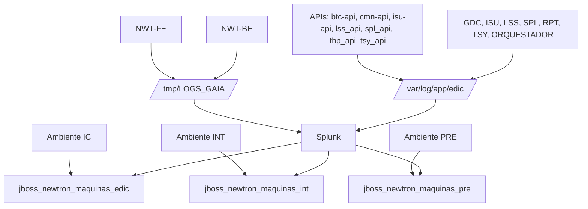

# Especificação de Ingestão de Logs Newtron/EDIC para Splunk

## 1. Metadados do Documento
- **Arquivo de Origem:** Não identificado no conteúdo fornecido
- **Tipo de Documento:** Especificação Técnica / Procedimento Operacional
- **Domínio / Sistema:** Newtron / EDIC / Splunk
- **Público-Alvo:** Desenvolvedores, Arquitetos e Operação
- **Data/Versão Identificada:** Não identificada

---

## 2. Resumo Executivo & Contexto de Negócio

O documento especifica fontes de logs de aplicações Newtron e EDIC destinadas à ingestão no Splunk. O escopo inclui aplicações front-end e back-end, APIs e componentes adicionais identificados como GDC, ISU, LSS, SPL, RPT, TSY e ORQUESTADOR.

A especificação define os ambientes IC, INT e PRE, incluindo URLs de servidores para cada ambiente. O ambiente PRE possui duas URLs listadas, sem que o documento detalhe a finalidade individual de cada servidor ou a forma de distribuição das aplicações entre eles.

A estimativa máxima de ingestão de dados no Splunk é de **1,7 GB por dia**, com referência de **10 MB por dia por aplicação e ambiente**. O documento não descreve a metodologia de cálculo, a retenção dos índices, políticas de rotação no Splunk ou mecanismos de alerta.

As rotas dos logs são declaradas como iguais em todos os ambientes. Os padrões de arquivos incluem logs principais, logs rotacionados por data e índice, além de logs associados a `jdbcobjectservice` e `thirdparty`.

A indexação no Splunk é segregada por ambiente: IC utiliza `jboss_newtron_maquinas_edic`, INT utiliza `jboss_newtron_maquinas_int` e PRE utiliza `jboss_newtron_maquinas_pre`.

---

## 3. Arquitetura, Componentes & Tecnologias Envolvidas

### Componentes identificados

| Componente | Categoria | Observação |
| :--- | :--- | :--- |
| NWT-FE | Aplicação front-end | Logs armazenados em `/tmp/LOGS_GAIA/`. |
| NWT-BE | Aplicação back-end | Logs armazenados em `/tmp/LOGS_GAIA/`. |
| `btc-api` | API | Utiliza padrão de log `log_nwt_xxx_api_be`. |
| `cmn-api` | API | Utiliza padrão de log `log_nwt_xxx_api_be`. |
| `isu-api` | API | Utiliza padrão de log `log_nwt_xxx_api_be`. |
| `lss_api` | API | Utiliza padrão de log `log_nwt_xxx_api_be`. |
| `spl_api` | API | Utiliza padrão de log `log_nwt_xxx_api_be`. |
| `thp_api` | API | Utiliza padrão de log `log_nwt_xxx_api_be`. |
| `tsy_api` | API | Utiliza padrão de log `log_nwt_xxx_api_be`. |
| GDC | Aplicação | Utiliza padrão de log `log_xxx`. |
| ISU | Aplicação | Utiliza padrão de log `log_xxx`. |
| LSS | Aplicação | Utiliza padrão de log `log_xxx`. |
| SPL | Aplicação | Utiliza padrão de log `log_xxx`. |
| RPT | Aplicação | Utiliza padrão de log `log_xxx`. |
| TSY | Aplicação | Utiliza padrão de log `log_xxx`. |
| ORQUESTADOR | Aplicação | Utiliza padrão de log `log_xxx`. |
| Splunk | Plataforma de ingestão e indexação | Recebe os logs definidos e os separa por índice de ambiente. |



**Nota de Análise:** o documento descreve fontes de logs, ambientes e índices Splunk, mas não detalha agentes de coleta, configurações de `inputs.conf`, `props.conf`, `transforms.conf`, protocolos de transporte, credenciais, portas de ingestão ou políticas de retenção.

---

## 4. Regras de Negócio, Especificações Funcionais & Processos

1. A ingestão de dados no Splunk possui estimativa máxima de **1,7 GB por dia**.
2. A referência de volume por aplicação e ambiente é de **10 MB por dia**.
3. As rotas de logs são declaradas como iguais em todos os ambientes.
4. As aplicações NWT-FE e NWT-BE utilizam rotas sob `/tmp/LOGS_GAIA/`.
5. APIs utilizam rotas sob `/var/log/app/edic/`, substituindo `xxx` pelo nome da API.
6. GDC, ISU, LSS, SPL, RPT, TSY e ORQUESTADOR utilizam rotas sob `/var/log/app/edic/`, substituindo `xxx` pelo nome da aplicação.
7. O placeholder `${appservername}` representa o nome do servidor da aplicação nos padrões de logs.
8. Os arquivos rotacionados utilizam padrões contendo `%d{yyyy-MM-dd}` e `%i`.
9. O índice Splunk depende do ambiente:
   - IC: `jboss_newtron_maquinas_edic`
   - INT: `jboss_newtron_maquinas_int`
   - PRE: `jboss_newtron_maquinas_pre`
10. O documento lista duas URLs para PRE, mas não define se ambas devem ser utilizadas simultaneamente, se representam alta disponibilidade ou se atendem componentes distintos.

---

## 5. Tabelas de Parâmetros, Ambientes e Estruturas de Dados

### Ambientes e servidores

| Item / Parâmetro | Descrição / Função | Tipo / Valores / Formato | Ambiente / Observações |
| :--- | :--- | :--- | :--- |
| URL do servidor | Endpoint listado para acesso ao ambiente | `http://les000a103120:11000` | IC |
| URL do servidor | Endpoint listado para acesso ao ambiente | `http://les000a103093:11000` | INT |
| URL do servidor | Endpoint listado para acesso ao ambiente | `http://les000a204135:11000` | PRE |
| URL do servidor | Endpoint adicional listado para PRE | `http://les000a204136:11000` | PRE; finalidade não detalhada |
| Volume máximo de ingestão | Estimativa máxima diária para Splunk | `1,7 GB/dia` | Todos os ambientes |
| Volume por aplicação e ambiente | Estimativa mencionada por combinação de aplicação e ambiente | `10 MB/dia` | Todos os ambientes |

### Índices Splunk

| Item / Parâmetro | Descrição / Função | Tipo / Valores / Formato | Ambiente / Observações |
| :--- | :--- | :--- | :--- |
| Índice Splunk | Índice destinado aos logs do ambiente IC | `jboss_newtron_maquinas_edic` | IC |
| Índice Splunk | Índice destinado aos logs do ambiente INT | `jboss_newtron_maquinas_int` | INT |
| Índice Splunk | Índice destinado aos logs do ambiente PRE | `jboss_newtron_maquinas_pre` | PRE |

### Padrões de logs do NWT-FE

| Item / Parâmetro | Descrição / Função | Tipo / Valores / Formato | Ambiente / Observações |
| :--- | :--- | :--- | :--- |
| Log principal | Log padrão do framework Gaia | `/tmp/LOGS_GAIA/gaia-fw.default.log` | Todos os ambientes |
| Log rotacionado | Log padrão do framework Gaia rotacionado por data e índice | `/tmp/LOGS_GAIA/gaia-fw.%d{yyyy-MM-dd}-%i.log` | Todos os ambientes |
| Log JDBC | Log de `jdbcobjectservice` | `/tmp/LOGS_GAIA/gaia-fw-jdbcobjectservice.log` | Todos os ambientes |
| Log JDBC rotacionado | Log JDBC rotacionado por data e índice | `/tmp/LOGS_GAIA/gaia-fw-jdbcobjectservice.%d{yyyy-MM-dd}-%i.log` | Todos os ambientes |
| Log third-party | Log de integrações ou componentes identificados como third-party | `/tmp/LOGS_GAIA/gaia-thirdparty.log` | Todos os ambientes |
| Log third-party rotacionado | Log third-party rotacionado por data e índice | `/tmp/LOGS_GAIA/gaia-thirdparty.%d{yyyy-MM-dd}-%i.log` | Todos os ambientes |

### Padrões de logs do NWT-BE

| Item / Parâmetro | Descrição / Função | Tipo / Valores / Formato | Ambiente / Observações |
| :--- | :--- | :--- | :--- |
| Log principal | Log principal do NWT-BE | `/tmp/LOGS_GAIA/log_nwt_be.log_${appservername}.log` | Todos os ambientes; aparece duas vezes no conteúdo original |
| Log rotacionado | Log principal rotacionado por data e índice | `/tmp/LOGS_GAIA/log_nwt_be.log_${appservername}.log.%d{yyyy-MM-dd}-%i` | Todos os ambientes |
| Log JDBC | Log de `jdbcobjectservice` | `/tmp/LOGS_GAIA/log_nwt_be.log_${appservername}.log-jdbcobjectservice` | Todos os ambientes |
| Log JDBC rotacionado | Log JDBC rotacionado por data e índice | `/tmp/LOGS_GAIA/log_nwt_be.log_${appservername}.log-jdbcobjectservice.%d{yyyy-MM-dd}-%i.log` | Todos os ambientes |
| Log third-party | Log third-party | `/tmp/LOGS_GAIA/log_nwt_be.log_${appservername}.log-thirdparty.log` | Todos os ambientes |
| Log third-party rotacionado | Log third-party rotacionado por data e índice | `/tmp/LOGS_GAIA/log_nwt_be.log_${appservername}.log-thirdparty.%d{yyyy-MM-dd}-%i` | Todos os ambientes |

### Padrões de logs das APIs

| Item / Parâmetro | Descrição / Função | Tipo / Valores / Formato | Ambiente / Observações |
| :--- | :--- | :--- | :--- |
| Substituição `xxx` | Nome da API no padrão de arquivo | `btc-api`, `cmn-api`, `isu-api`, `lss_api`, `spl_api`, `thp_api`, `tsy_api` | Todos os ambientes |
| Log principal | Log principal da API | `/var/log/app/edic/log_nwt_xxx_api_be.log_${appservername}.log` | Substituir `xxx` pelo nome da API |
| Log rotacionado | Log principal rotacionado | `/var/log/app/edic/log_nwt_xxx_api_be.log_${appservername}.log.%d{yyyy-MM-dd}-%i` | Substituir `xxx` pelo nome da API |
| Log JDBC rotacionado | Log `jdbcobjectservice` rotacionado | `/var/log/app/edic/log_nwt_xxx_api_be.log_${appservername}.log-jdbcobjectservice.%d{yyyy-MM-dd}-%i.log` | Substituir `xxx` pelo nome da API |
| Log third-party rotacionado | Log third-party rotacionado | `/var/log/app/edic/log_nwt_xxx_api_be.log_${appservername}.log-thirdparty.%d{yyyy-MM-dd}-%i` | Substituir `xxx` pelo nome da API |

### Padrões de logs de GDC, ISU, LSS, SPL, RPT, TSY e ORQUESTADOR

| Item / Parâmetro | Descrição / Função | Tipo / Valores / Formato | Ambiente / Observações |
| :--- | :--- | :--- | :--- |
| Substituição `xxx` | Nome da aplicação no padrão de arquivo | `GDC`, `ISU`, `LSS`, `SPL`, `RPT`, `TSY`, `ORQUESTADOR` | Todos os ambientes |
| Log principal | Log principal da aplicação | `/var/log/app/edic/log_xxx.log_${appservername}.log` | Substituir `xxx` pelo nome da aplicação |
| Log rotacionado | Log principal rotacionado | `/var/log/app/edic/log_xxx.log_${appservername}.log.%d{yyyy-MM-dd}-%i` | Substituir `xxx` pelo nome da aplicação |
| Log JDBC rotacionado | Log `jdbcobjectservice` rotacionado | `/var/log/app/edic/log_xxx.log_${appservername}.log-jdbcobjectservice.%d{yyyy-MM-dd}-%i.log` | Substituir `xxx` pelo nome da aplicação |
| Log third-party rotacionado | Log third-party rotacionado | `/var/log/app/edic/log_xxx.log_${appservername}.log-thirdparty.%d{yyyy-MM-dd}-%i` | Substituir `xxx` pelo nome da aplicação |

---

## 6. Bateria de Perguntas & Respostas para RAG (FAQ Sintético)

### P1: Qual é a estimativa máxima de ingestão diária de logs no Splunk?
**R:** A estimativa máxima de ingestão no Splunk é de **1,7 GB por dia**. O documento também informa uma referência de **10 MB por dia para cada aplicação e ambiente**.

### P2: Quais índices Splunk devem ser utilizados para os ambientes IC, INT e PRE?
**R:** O ambiente IC utiliza o índice `jboss_newtron_maquinas_edic`, o ambiente INT utiliza `jboss_newtron_maquinas_int` e o ambiente PRE utiliza `jboss_newtron_maquinas_pre`.

### P3: Qual é a URL listada para o ambiente IC?
**R:** A URL listada para o ambiente IC é `http://les000a103120:11000`.

### P4: Quais URLs estão listadas para o ambiente PRE?
**R:** O documento lista `http://les000a204135:11000` e `http://les000a204136:11000` para PRE. Não há detalhamento sobre a finalidade de cada URL.

### P5: Onde estão os logs da aplicação NWT-FE?
**R:** Os logs da aplicação NWT-FE estão sob o diretório `/tmp/LOGS_GAIA/`. Os arquivos incluem `gaia-fw.default.log`, logs rotacionados `gaia-fw.%d{yyyy-MM-dd}-%i.log`, logs de `jdbcobjectservice` e logs `thirdparty`.

### P6: Qual padrão deve ser utilizado para coletar logs de uma API como `btc-api`?
**R:** Para APIs, deve-se substituir `xxx` pelo nome da API no padrão `/var/log/app/edic/log_nwt_xxx_api_be.log_${appservername}.log`. Para `btc-api`, o padrão resultante é `/var/log/app/edic/log_nwt_btc-api_api_be.log_${appservername}.log`.

### P7: Como identificar os arquivos de log rotacionados?
**R:** Os arquivos rotacionados contêm os marcadores `%d{yyyy-MM-dd}` para data e `%i` para índice de rotação. O documento apresenta variações com e sem a extensão final `.log`, dependendo do componente e da categoria do log.

### P8: Quais aplicações usam o padrão `/var/log/app/edic/log_xxx.log_${appservername}.log`?
**R:** GDC, ISU, LSS, SPL, RPT, TSY e ORQUESTADOR utilizam esse padrão. O placeholder `xxx` deve ser substituído pelo nome da aplicação correspondente.

### P9: As rotas de logs mudam entre IC, INT e PRE?
**R:** Não. O documento declara expressamente que as rotas de logs são iguais em todos os ambientes.

### P10: Quais tipos de log adicionais são especificados além do log principal?
**R:** Além do log principal, o documento especifica logs relacionados a `jdbcobjectservice`, logs `thirdparty` e versões rotacionadas de determinados arquivos.

---

## 7. Glossário de Termos, Siglas & Conceitos-Chave

- **API:** Interface de programação de aplicações. O documento lista `btc-api`, `cmn-api`, `isu-api`, `lss_api`, `spl_api`, `thp_api` e `tsy_api`.
- **IC:** Ambiente identificado no documento e associado ao índice `jboss_newtron_maquinas_edic`.
- **INT:** Ambiente identificado no documento e associado ao índice `jboss_newtron_maquinas_int`.
- **PRE:** Ambiente identificado no documento e associado ao índice `jboss_newtron_maquinas_pre`.
- **NWT-FE:** Aplicação front-end Newtron identificada no documento.
- **NWT-BE:** Aplicação back-end Newtron identificada no documento.
- **Splunk:** Plataforma utilizada para a ingestão e indexação dos logs descritos.
- **`appservername`:** Placeholder utilizado nos nomes dos arquivos para representar o nome do servidor da aplicação.
- **`xxx`:** Placeholder utilizado nos padrões de logs para representar o nome de uma API ou aplicação.
- **`jdbcobjectservice`:** Identificador presente em arquivos de log específicos. O documento não define sua função.
- **`thirdparty`:** Identificador presente em arquivos de log específicos. O documento não define quais integrações ou componentes são abrangidos.
- **GDC, ISU, LSS, SPL, RPT, TSY e ORQUESTADOR:** Aplicações ou componentes listados; seus significados expandidos não são definidos no conteúdo fornecido.

---

## 8. Notas Críticas, Riscos & Limitações

- O documento não identifica o arquivo de origem, autor, data, versão ou responsável técnico.
- Não há definição de agente, método ou protocolo de coleta dos logs para Splunk.
- Não são definidos configurações de monitoramento, alertas, retenção, mascaramento de dados, permissões de acesso ou requisitos de segurança.
- O ambiente PRE possui duas URLs, mas o documento não explica o papel de cada servidor.
- A rota principal do NWT-BE é repetida duas vezes no conteúdo original; a duplicidade foi preservada como referência fiel.
- Não há contratos de API, métodos HTTP, payloads, portas adicionais, dependências técnicas ou relacionamentos funcionais descritos para `btc-api`, `cmn-api`, `isu-api`, `lss_api`, `spl_api`, `thp_api` e `tsy_api`.
- Os significados de GDC, ISU, LSS, SPL, RPT, TSY e ORQUESTADOR não são detalhados.
- **Nota de Análise:** o documento lista padrões de logs e índices, mas não estabelece explicitamente regras de parsing, sourcetypes, timestamps, multiline events ou estratégias de tratamento de falhas de ingestão.

---

## 9. Conteúdo Bruto Estruturado (Referência Fiel)

```text
- Aplicaciones:

NWT-FE, NWT-BE, APIs (btc-api, cmn-api, isu-api, lss_api, spl_api, thp_api, tsy_api), GDC, ISU, LSS, SPL, RPT, TSY, ORQUESTADOR

- Servidores/Entornos:

IC -http://les000a103120:11000

INT -http://les000a103093:11000

PRE -http://les000a204135:11000

http://les000a204136:11000

- Estimación de ingesta de datos en SPLUNK en GB/día: 1,7Gb/día máximo (10Mb/día por aplicación y entorno)

- Rutas de los logs Son iguales en todos los entornos:

** NWT-FE:

/tmp/LOGS_GAIA/gaia-fw.default.log

/tmp/LOGS_GAIA/gaia-fw.%d{yyyy-MM-dd}-%i.log

/tmp/LOGS_GAIA/gaia-fw-jdbcobjectservice.log

/tmp/LOGS_GAIA/gaia-fw-jdbcobjectservice.%d{yyyy-MM-dd}-%i.log

/tmp/LOGS_GAIA/gaia-thirdparty.log

/tmp/LOGS_GAIA/gaia-thirdparty.%d{yyyy-MM-dd}-%i.log

** NWT-BE:

/tmp/LOGS_GAIA/log_nwt_be.log_${appservername}.log

/tmp/LOGS_GAIA/log_nwt_be.log_${appservername}.log

/tmp/LOGS_GAIA/log_nwt_be.log_${appservername}.log.%d{yyyy-MM-dd}-%i

/tmp/LOGS_GAIA/log_nwt_be.log_${appservername}.log-jdbcobjectservice

/tmp/LOGS_GAIA/log_nwt_be.log_${appservername}.log-jdbcobjectservice.%d{yyyy-MM-dd}-%i.log

/tmp/LOGS_GAIA/log_nwt_be.log_${appservername}.log-thirdparty.log

/tmp/LOGS_GAIA/log_nwt_be.log_${appservername}.log-thirdparty.%d{yyyy-MM-dd}-%i

* APIS (Por cada una de las indicadas sustituir xxx por el nombre de la api)

/var/log/app/edic/log_nwt_xxx_api_be.log_${appservername}.log

/var/log/app/edic/log_nwt_xxx_api_be.log_${appservername}.log.%d{yyyy-MM-dd}-%i

/var/log/app/edic/log_nwt_xxx_api_be.log_${appservername}.log-jdbcobjectservice.%d{yyyy-MM-dd}-%i.log

/var/log/app/edic/log_nwt_xxx_api_be.log_${appservername}.log-thirdparty.%d{yyyy-MM-dd}-%i

* GDC, ISU, LSS, SPL, RPT, TSY, ORQUESTADOR (Por cada applicacion sustituir xxx por el nombre de la aplicacion)

/var/log/app/edic/log_xxx.log_${appservername}.log

/var/log/app/edic/log_xxx.log_${appservername}.log.%d{yyyy-MM-dd}-%i

/var/log/app/edic/log_xxx.log_${appservername}.log-jdbcobjectservice.%d{yyyy-MM-dd}-%i.log

/var/log/app/edic/log_xxx.log_${appservername}.log-thirdparty.%d{yyyy-MM-dd}-%i

- Índices

'jboss_newtron_maquinas_edic' para entorno IC

'jboss_newtron_maquinas_int' para entorno INT

'jboss_newtron_maquinas_pre' para entorno PRE
```
