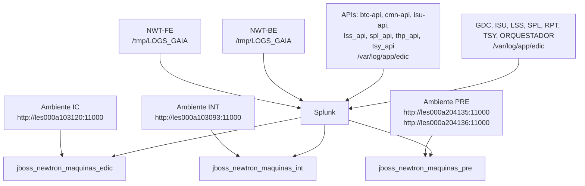

# Configuração de Ingestão de Logs das Aplicações NWT no Splunk

## 1. Metadados do Documento
- **Arquivo de Origem:** `Não identificado`
- **Tipo de Documento:** `Procedimento`
- **Domínio / Sistema:** `Aplicações NWT / Newtron e monitoramento Splunk`
- **Público-Alvo:** `Operação, Desenvolvimento, Arquitetura e equipes responsáveis por observabilidade`
- **Data/Versão Identificada:** `Não identificada`

---

## 2. Resumo Executivo & Contexto de Negócio

O documento relaciona aplicações, APIs, ambientes, endereços de servidores, estimativa de volume de ingestão e rotas de arquivos de log para integração com o Splunk. O escopo apresentado cobre as aplicações NWT-FE, NWT-BE, APIs específicas, GDC, ISU, LSS, SPL, RPT, TSY e ORQUESTADOR.

A estimativa máxima de ingestão de dados no Splunk é de **1,7 GB por dia**. O texto também informa a referência de **10 MB por dia por aplicação e ambiente**, sem detalhar o método de cálculo que conduz ao valor consolidado de 1,7 GB/dia.

Os ambientes identificados são IC, INT e PRE. Cada ambiente possui uma URL informada, exceto PRE, que possui duas URLs listadas. Os índices Splunk são definidos por ambiente: `jboss_newtron_maquinas_edic` para IC, `jboss_newtron_maquinas_int` para INT e `jboss_newtron_maquinas_pre` para PRE.

As rotas de logs são declaradas como iguais em todos os ambientes. NWT-FE e NWT-BE registram logs em `/tmp/LOGS_GAIA`, enquanto as APIs e as aplicações GDC, ISU, LSS, SPL, RPT, TSY e ORQUESTADOR registram logs sob `/var/log/app/edic`.

---

## 3. Arquitetura, Componentes & Tecnologias Envolvidas

### Componentes identificados

| Componente | Categoria | Descrição sustentada pelo documento |
| :--- | :--- | :--- |
| NWT-FE | Aplicação | Aplicação com logs localizados em `/tmp/LOGS_GAIA`. |
| NWT-BE | Aplicação | Aplicação com logs localizados em `/tmp/LOGS_GAIA`. |
| btc-api | API | API listada entre as aplicações; utiliza o padrão de logs de APIs. |
| cmn-api | API | API listada entre as aplicações; utiliza o padrão de logs de APIs. |
| isu-api | API | API listada entre as aplicações; utiliza o padrão de logs de APIs. |
| lss_api | API | API listada entre as aplicações; utiliza o padrão de logs de APIs. |
| spl_api | API | API listada entre as aplicações; utiliza o padrão de logs de APIs. |
| thp_api | API | API listada entre as aplicações; utiliza o padrão de logs de APIs. |
| tsy_api | API | API listada entre as aplicações; utiliza o padrão de logs de APIs. |
| GDC | Aplicação | Aplicação que utiliza o padrão de logs `log_xxx`. |
| ISU | Aplicação | Aplicação que utiliza o padrão de logs `log_xxx`. |
| LSS | Aplicação | Aplicação que utiliza o padrão de logs `log_xxx`. |
| SPL | Aplicação | Aplicação que utiliza o padrão de logs `log_xxx`. |
| RPT | Aplicação | Aplicação que utiliza o padrão de logs `log_xxx`. |
| TSY | Aplicação | Aplicação que utiliza o padrão de logs `log_xxx`. |
| ORQUESTADOR | Aplicação | Aplicação que utiliza o padrão de logs `log_xxx`. |
| Splunk | Plataforma de ingestão/índices | Destino associado à estimativa de ingestão diária e aos índices por ambiente. |



> **Nota de Análise:** O documento não detalha o mecanismo técnico de coleta, agentes, sourcetypes, regras de parsing, retenção, permissões de acesso, métodos HTTP ou contratos expostos pelas APIs.

---

## 4. Regras de Negócio, Especificações Funcionais & Processos

1. As aplicações incluídas no escopo são NWT-FE, NWT-BE, as APIs `btc-api`, `cmn-api`, `isu-api`, `lss_api`, `spl_api`, `thp_api` e `tsy_api`, além de GDC, ISU, LSS, SPL, RPT, TSY e ORQUESTADOR.

2. A estimativa máxima informada para ingestão de dados no Splunk é de **1,7 GB por dia**.

3. A referência de consumo indicada é de **10 MB por dia por aplicação e ambiente**.

4. As rotas de logs devem ser consideradas iguais em todos os ambientes identificados: IC, INT e PRE.

5. Para os logs das APIs, o marcador `xxx` deve ser substituído pelo nome da API correspondente.

6. Para os logs de GDC, ISU, LSS, SPL, RPT, TSY e ORQUESTADOR, o marcador `xxx` deve ser substituído pelo nome da aplicação correspondente.

7. O marcador `${appservername}` é utilizado nos nomes de arquivos de log de NWT-BE, APIs e aplicações GDC, ISU, LSS, SPL, RPT, TSY e ORQUESTADOR. O documento não define o formato ou a origem do valor de `${appservername}`.

8. A associação entre ambientes e índices é obrigatoriamente:
   - IC → `jboss_newtron_maquinas_edic`
   - INT → `jboss_newtron_maquinas_int`
   - PRE → `jboss_newtron_maquinas_pre`

9. O ambiente PRE possui duas URLs informadas:
   - `http://les000a204135:11000`
   - `http://les000a204136:11000`

---

## 5. Tabelas de Parâmetros, Ambientes e Estruturas de Dados

### Ambientes, servidores e índices

| Item / Parâmetro | Descrição / Função | Tipo / Valores / Formato | Ambiente / Observações |
| :--- | :--- | :--- | :--- |
| IC | Ambiente identificado no documento | `http://les000a103120:11000` | Índice Splunk: `jboss_newtron_maquinas_edic` |
| INT | Ambiente identificado no documento | `http://les000a103093:11000` | Índice Splunk: `jboss_newtron_maquinas_int` |
| PRE | Ambiente identificado no documento | `http://les000a204135:11000` | Índice Splunk: `jboss_newtron_maquinas_pre` |
| PRE | Segunda URL informada para o ambiente PRE | `http://les000a204136:11000` | O documento não esclarece a finalidade específica da segunda URL. |
| Ingestão máxima no Splunk | Estimativa de volume diário máximo | `1,7 GB/dia` | Aplicável ao conjunto documentado. |
| Referência de ingestão | Estimativa por aplicação e ambiente | `10 MB/dia por aplicação e ambiente` | Sem detalhamento adicional de cálculo. |

### Rotas de logs da aplicação NWT-FE

| Item / Parâmetro | Descrição / Função | Tipo / Valores / Formato | Ambiente / Observações |
| :--- | :--- | :--- | :--- |
| Log principal NWT-FE | Arquivo de log padrão | `/tmp/LOGS_GAIA/gaia-fw.default.log` | Rotas iguais em todos os ambientes. |
| Log rotacionado NWT-FE | Arquivo de log com data e índice | `/tmp/LOGS_GAIA/gaia-fw.%d{yyyy-MM-dd}-%i.log` | Rotas iguais em todos os ambientes. |
| Log JDBC Object Service | Arquivo de log JDBC Object Service | `/tmp/LOGS_GAIA/gaia-fw-jdbcobjectservice.log` | Rotas iguais em todos os ambientes. |
| Log JDBC Object Service rotacionado | Arquivo de log JDBC Object Service com data e índice | `/tmp/LOGS_GAIA/gaia-fw-jdbcobjectservice.%d{yyyy-MM-dd}-%i.log` | Rotas iguais em todos os ambientes. |
| Log third-party | Arquivo de log third-party | `/tmp/LOGS_GAIA/gaia-thirdparty.log` | Rotas iguais em todos os ambientes. |
| Log third-party rotacionado | Arquivo de log third-party com data e índice | `/tmp/LOGS_GAIA/gaia-thirdparty.%d{yyyy-MM-dd}-%i.log` | Rotas iguais em todos os ambientes. |

### Rotas de logs da aplicação NWT-BE

| Item / Parâmetro | Descrição / Função | Tipo / Valores / Formato | Ambiente / Observações |
| :--- | :--- | :--- | :--- |
| Log NWT-BE | Arquivo de log com identificador de servidor | `/tmp/LOGS_GAIA/log_nwt_be.log_${appservername}.log` | O caminho aparece duas vezes no conteúdo bruto. |
| Log NWT-BE rotacionado | Arquivo de log com data e índice | `/tmp/LOGS_GAIA/log_nwt_be.log_${appservername}.log.%d{yyyy-MM-dd}-%i` | Rotas iguais em todos os ambientes. |
| Log JDBC Object Service | Arquivo de log JDBC Object Service | `/tmp/LOGS_GAIA/log_nwt_be.log_${appservername}.log-jdbcobjectservice` | Rotas iguais em todos os ambientes. |
| Log JDBC Object Service rotacionado | Arquivo de log JDBC Object Service com data e índice | `/tmp/LOGS_GAIA/log_nwt_be.log_${appservername}.log-jdbcobjectservice.%d{yyyy-MM-dd}-%i.log` | Rotas iguais em todos os ambientes. |
| Log third-party | Arquivo de log third-party | `/tmp/LOGS_GAIA/log_nwt_be.log_${appservername}.log-thirdparty.log` | Rotas iguais em todos os ambientes. |
| Log third-party rotacionado | Arquivo de log third-party com data e índice | `/tmp/LOGS_GAIA/log_nwt_be.log_${appservername}.log-thirdparty.%d{yyyy-MM-dd}-%i` | Rotas iguais em todos os ambientes. |

### Rotas de logs das APIs

| Item / Parâmetro | Descrição / Função | Tipo / Valores / Formato | Ambiente / Observações |
| :--- | :--- | :--- | :--- |
| Aplicações abrangidas | APIs incluídas no escopo | `btc-api`, `cmn-api`, `isu-api`, `lss_api`, `spl_api`, `thp_api`, `tsy_api` | Substituir `xxx` pelo nome da API. |
| Log principal de API | Arquivo de log de backend da API | `/var/log/app/edic/log_nwt_xxx_api_be.log_${appservername}.log` | Substituir `xxx` pelo nome da API. |
| Log rotacionado de API | Arquivo de log da API com data e índice | `/var/log/app/edic/log_nwt_xxx_api_be.log_${appservername}.log.%d{yyyy-MM-dd}-%i` | Substituir `xxx` pelo nome da API. |
| Log JDBC Object Service de API | Arquivo de log JDBC Object Service da API | `/var/log/app/edic/log_nwt_xxx_api_be.log_${appservername}.log-jdbcobjectservice.%d{yyyy-MM-dd}-%i.log` | Substituir `xxx` pelo nome da API. |
| Log third-party de API | Arquivo de log third-party da API | `/var/log/app/edic/log_nwt_xxx_api_be.log_${appservername}.log-thirdparty.%d{yyyy-MM-dd}-%i` | Substituir `xxx` pelo nome da API. |

### Rotas de logs de GDC, ISU, LSS, SPL, RPT, TSY e ORQUESTADOR

| Item / Parâmetro | Descrição / Função | Tipo / Valores / Formato | Ambiente / Observações |
| :--- | :--- | :--- | :--- |
| Aplicações abrangidas | Aplicações incluídas no padrão `log_xxx` | `GDC`, `ISU`, `LSS`, `SPL`, `RPT`, `TSY`, `ORQUESTADOR` | Substituir `xxx` pelo nome da aplicação. |
| Log principal | Arquivo de log com identificador de servidor | `/var/log/app/edic/log_xxx.log_${appservername}.log` | Substituir `xxx` pelo nome da aplicação. |
| Log rotacionado | Arquivo de log com data e índice | `/var/log/app/edic/log_xxx.log_${appservername}.log.%d{yyyy-MM-dd}-%i` | Substituir `xxx` pelo nome da aplicação. |
| Log JDBC Object Service | Arquivo de log JDBC Object Service | `/var/log/app/edic/log_xxx.log_${appservername}.log-jdbcobjectservice.%d{yyyy-MM-dd}-%i.log` | Substituir `xxx` pelo nome da aplicação. |
| Log third-party | Arquivo de log third-party | `/var/log/app/edic/log_xxx.log_${appservername}.log-thirdparty.%d{yyyy-MM-dd}-%i` | Substituir `xxx` pelo nome da aplicação. |

---

## 6. Bateria de Perguntas & Respostas para RAG (FAQ Sintético)

### P1: Qual é a estimativa máxima de ingestão diária de dados no Splunk para as aplicações documentadas?
**R:** A estimativa máxima de ingestão no Splunk é de **1,7 GB por dia**. O documento também apresenta a referência de **10 MB por dia por aplicação e ambiente**.

### P2: Quais índices Splunk devem ser usados para os ambientes IC, INT e PRE?
**R:** O ambiente IC utiliza o índice `jboss_newtron_maquinas_edic`; o ambiente INT utiliza `jboss_newtron_maquinas_int`; e o ambiente PRE utiliza `jboss_newtron_maquinas_pre`.

### P3: Qual URL está associada ao ambiente IC?
**R:** A URL informada para o ambiente IC é `http://les000a103120:11000`.

### P4: Qual URL está associada ao ambiente INT?
**R:** A URL informada para o ambiente INT é `http://les000a103093:11000`.

### P5: Quais URLs estão listadas para o ambiente PRE?
**R:** O ambiente PRE possui duas URLs listadas: `http://les000a204135:11000` e `http://les000a204136:11000`. O documento não explica a diferença operacional entre os dois endereços.

### P6: Onde estão localizados os logs da aplicação NWT-FE?
**R:** Os logs da aplicação NWT-FE estão no diretório `/tmp/LOGS_GAIA`. Os arquivos listados incluem `gaia-fw.default.log`, arquivos rotacionados `gaia-fw.%d{yyyy-MM-dd}-%i.log`, logs `gaia-fw-jdbcobjectservice` e logs `gaia-thirdparty`.

### P7: Qual é o padrão de caminho dos logs para uma API como btc-api?
**R:** Para APIs, o valor `xxx` deve ser substituído pelo nome da API. Para `btc-api`, por exemplo, o padrão principal resulta em `/var/log/app/edic/log_nwt_btc-api_api_be.log_${appservername}.log`. O mesmo critério é aplicado aos arquivos rotacionados, JDBC Object Service e third-party.

### P8: Quais APIs estão incluídas no escopo de logs?
**R:** As APIs listadas são `btc-api`, `cmn-api`, `isu-api`, `lss_api`, `spl_api`, `thp_api` e `tsy_api`.

### P9: Qual é o padrão de logs para GDC, ISU, LSS, SPL, RPT, TSY e ORQUESTADOR?
**R:** Essas aplicações utilizam arquivos no diretório `/var/log/app/edic`, com o marcador `xxx` substituído pelo nome da aplicação. O padrão principal é `/var/log/app/edic/log_xxx.log_${appservername}.log`, acompanhado por padrões rotacionados, JDBC Object Service e third-party.

### P10: As rotas dos arquivos de log variam entre IC, INT e PRE?
**R:** Não. O documento declara expressamente que as rotas de logs são iguais em todos os ambientes.

### P11: O que representa o marcador `${appservername}` nos caminhos de log?
**R:** `${appservername}` é um marcador presente nos nomes de arquivos de logs de NWT-BE, APIs e aplicações GDC, ISU, LSS, SPL, RPT, TSY e ORQUESTADOR. O documento não especifica como esse valor é preenchido.

### P12: O documento define como o Splunk coleta os logs ou quais agentes são utilizados?
**R:** Não. O documento apresenta aplicações, ambientes, estimativas, rotas de logs e índices, mas não detalha agentes de coleta, mecanismos de forwarding, sourcetypes, parsing, retenção ou configuração de acesso ao Splunk.

---

## 7. Glossário de Termos, Siglas & Conceitos-Chave

- **API:** Interface de programação de aplicações. No documento, refere-se a `btc-api`, `cmn-api`, `isu-api`, `lss_api`, `spl_api`, `thp_api` e `tsy_api`.
- **GDC:** Nome de aplicação listado no escopo. O documento não expande a sigla.
- **IC:** Ambiente associado à URL `http://les000a103120:11000` e ao índice `jboss_newtron_maquinas_edic`.
- **INT:** Ambiente associado à URL `http://les000a103093:11000` e ao índice `jboss_newtron_maquinas_int`.
- **ISU:** Nome de aplicação e API listados no escopo. O documento não expande a sigla.
- **JDBC Object Service:** Denominação utilizada em nomes de arquivos de log. O documento não fornece definição adicional.
- **LSS:** Nome de aplicação e API listados no escopo. O documento não expande a sigla.
- **NWT-BE:** Aplicação NWT de backend, conforme a nomenclatura apresentada.
- **NWT-FE:** Aplicação NWT de frontend, conforme a nomenclatura apresentada.
- **ORQUESTADOR:** Aplicação listada no escopo; o documento não descreve suas responsabilidades.
- **PRE:** Ambiente associado às URLs `http://les000a204135:11000` e `http://les000a204136:11000`, além do índice `jboss_newtron_maquinas_pre`.
- **RPT:** Nome de aplicação listado no escopo. O documento não expande a sigla.
- **SPL:** Nome de aplicação e API listados no escopo. O documento não expande a sigla.
- **Splunk:** Plataforma mencionada como destino da estimativa de ingestão e como contexto dos índices configurados por ambiente.
- **third-party:** Denominação utilizada em arquivos de log destinados a eventos de terceiros; o documento não detalha o conteúdo desses logs.
- **TSY:** Nome de aplicação e API listados no escopo. O documento não expande a sigla.
- **`${appservername}`:** Marcador de nome de servidor usado em arquivos de log.
- **`xxx`:** Marcador que deve ser substituído pelo nome da API ou aplicação correspondente.

---

## 8. Notas Críticas, Riscos & Limitações

- O documento não apresenta nome de arquivo, autoria, data, versão, aprovadores ou histórico de alterações.
- Não há descrição da arquitetura funcional ou técnica das aplicações NWT-FE, NWT-BE, APIs, GDC, ISU, LSS, SPL, RPT, TSY e ORQUESTADOR.
- Não são informados agentes de coleta, configuração de forwarding, portas de ingestão, sourcetypes, parsing, campos indexados, políticas de retenção ou permissões do Splunk.
- O documento não detalha a fórmula que relaciona a referência de 10 MB/dia por aplicação e ambiente à estimativa máxima consolidada de 1,7 GB/dia.
- O ambiente PRE possui duas URLs, mas não há indicação se representam servidores distintos, balanceamento, redundância ou outra finalidade.
- O caminho principal de log de NWT-BE `/tmp/LOGS_GAIA/log_nwt_be.log_${appservername}.log` aparece duplicado no conteúdo bruto.
- As siglas GDC, ISU, LSS, SPL, RPT e TSY não são expandidas ou definidas.
- O documento lista a API `thp_api`, porém não detalha métodos HTTP, contratos JSON, endpoints, autenticação ou integrações expostas.

---

## 9. Conteúdo Bruto Estruturado (Referência Fiel)

```text
- Aplicaciones:

NWT-FE, NWT-BE, APIs (btc-api, cmn-api, isu-api, lss_api, spl_api, thp_api, tsy_api), GDC, ISU, LSS, SPL, RPT, TSY, ORQUESTADOR

- Servidores/Entornos:

IC -http://les000a103120:11000

INT -http://les000a103093:11000

PRE -http://les000a204135:11000

http://les000a204136:11000

- Estimación de ingesta de datos en SPLUNK en GB/día: 1,7Gb/día máximo (10Mb/día por aplicación y entorno)

- Rutas de los logs Son iguales en todos los entornos:

** NWT-FE:

/tmp/LOGS_GAIA/gaia-fw.default.log

/tmp/LOGS_GAIA/gaia-fw.%d{yyyy-MM-dd}-%i.log

/tmp/LOGS_GAIA/gaia-fw-jdbcobjectservice.log

/tmp/LOGS_GAIA/gaia-fw-jdbcobjectservice.%d{yyyy-MM-dd}-%i.log

/tmp/LOGS_GAIA/gaia-thirdparty.log

/tmp/LOGS_GAIA/gaia-thirdparty.%d{yyyy-MM-dd}-%i.log

** NWT-BE:

/tmp/LOGS_GAIA/log_nwt_be.log_${appservername}.log

/tmp/LOGS_GAIA/log_nwt_be.log_${appservername}.log

/tmp/LOGS_GAIA/log_nwt_be.log_${appservername}.log.%d{yyyy-MM-dd}-%i

/tmp/LOGS_GAIA/log_nwt_be.log_${appservername}.log-jdbcobjectservice

/tmp/LOGS_GAIA/log_nwt_be.log_${appservername}.log-jdbcobjectservice.%d{yyyy-MM-dd}-%i.log

/tmp/LOGS_GAIA/log_nwt_be.log_${appservername}.log-thirdparty.log

/tmp/LOGS_GAIA/log_nwt_be.log_${appservername}.log-thirdparty.%d{yyyy-MM-dd}-%i

* APIS (Por cada una de las indicadas sustituir xxx por el nombre de la api)

/var/log/app/edic/log_nwt_xxx_api_be.log_${appservername}.log

/var/log/app/edic/log_nwt_xxx_api_be.log_${appservername}.log.%d{yyyy-MM-dd}-%i

/var/log/app/edic/log_nwt_xxx_api_be.log_${appservername}.log-jdbcobjectservice.%d{yyyy-MM-dd}-%i.log

/var/log/app/edic/log_nwt_xxx_api_be.log_${appservername}.log-thirdparty.%d{yyyy-MM-dd}-%i

* GDC, ISU, LSS, SPL, RPT, TSY, ORQUESTADOR (Por cada applicacion sustituir xxx por el nombre de la aplicacion)

/var/log/app/edic/log_xxx.log_${appservername}.log

/var/log/app/edic/log_xxx.log_${appservername}.log.%d{yyyy-MM-dd}-%i

/var/log/app/edic/log_xxx.log_${appservername}.log-jdbcobjectservice.%d{yyyy-MM-dd}-%i.log

/var/log/app/edic/log_xxx.log_${appservername}.log-thirdparty.%d{yyyy-MM-dd}-%i

- Índices

'jboss_newtron_maquinas_edic' para entorno IC

'jboss_newtron_maquinas_int' para entorno INT

'jboss_newtron_maquinas_pre' para entorno PRE
```
