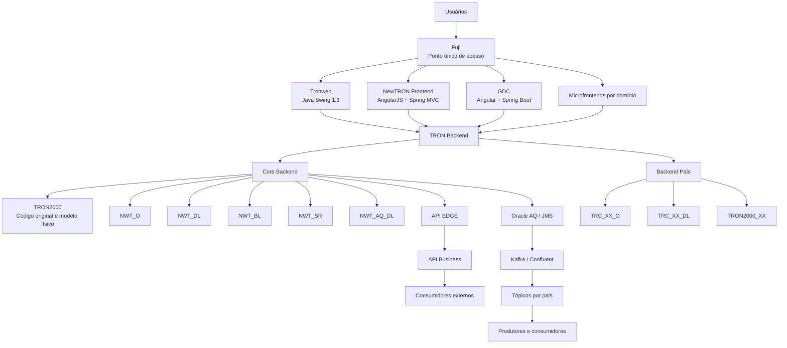
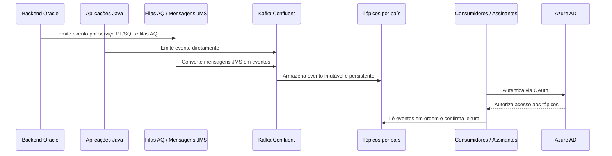

# Arquitetura TRON, REEF como PaaS e Capacidades de Integração

## 1. Metadados do Documento
- **Arquivo de Origem:** Não identificado no conteúdo extraído
- **Tipo de Documento:** Apresentação Executiva / Arquitetura de Software
- **Domínio / Sistema:** TRON, NewTRON, REEF, REEF Core, integração corporativa e eventos
- **Público-Alvo:** Arquitetos, desenvolvedores, equipes de integração, operação e responsáveis por plataformas REEF/TRON
- **Data/Versão Identificada:** 26 de outubro de 2023

---

## 2. Resumo Executivo & Contexto de Negócio

O documento apresenta a arquitetura TRON no contexto da plataforma REEF como PaaS. REEF Core é descrito como o coração da plataforma, responsável pela configuração de produtos, processos de emissão, sinistros, administração e capacidades comuns. A plataforma também inclui soluções globais de atendimento ao cliente e distribuidores, autosserviços, cotadores/emissores, gestão documental, BPM, motor de regras, gestão de eventos, clientes e microsserviços para necessidades específicas, como cotação e subscrição de riscos.

A arquitetura propõe a separação entre componentes de Core, país, front-end e integração. O código de Core não deve ser alterado, e a personalização por substituição de sinônimos não é permitida. A evolução funcional ocorre nas camadas NewTRON, com separação explícita entre código de Core e código específico de cada país, visando compatibilidade retroativa e redução do impacto da adoção de novas versões.

A evolução dos frontais inclui Tronweb, NewTRON Frontend, GDC, microfrontends e Fuji. Fuji é o ponto único de acesso para usuários e centraliza a orquestração dos frontais, o menu, o idioma, a companhia, a comunicação entre frontais e a autenticação SSO via Azure.

O documento também estabelece APIs e eventos como capacidades complementares de integração. APIs são destinadas à execução de ações no sistema, como emitir uma apólice ou gerar condições particulares. Eventos representam fatos já ocorridos, como a emissão de uma apólice, permitindo que consumidores reajam de maneira desacoplada. A plataforma de eventos usa Kafka disponibilizado pela Confluent, com tópicos protegidos por OAuth contra Azure AD.

Por fim, são apresentados cenários de implantação para América Central e Vida Latam, além de capacidades de reporting e plataforma documental. As implantações usam tecnologias distintas conforme o cenário: WebLogic, Fargate, RDS Oracle, Dynatrace, Control-M, APIs de convivência e integração orientada a eventos.

---

## 3. Arquitetura, Componentes & Tecnologias Envolvidas

### Componentes e capacidades identificadas

| Componente / Tecnologia | Papel descrito no documento |
| :--- | :--- |
| REEF Core | Coração da plataforma; configura produtos, emissão, sinistros, administração e funcionalidades comuns. |
| Marketplace | Oferta contínua de capacidades funcionais, incluindo desenvolvimentos próprios, soluções de mercado e Insurtechs. |
| TRON Backend | Backend associado aos frontais Tronweb, NewTRON, GDC e microfrontends. |
| Tronweb | Frontal legado baseado em Java Swing 1.3; permanece temporariamente para telas de Tesouraria. |
| NewTRON Frontend | Frontal AngularJS + Spring MVC para todos os processos e famílias TRON, exceto Tesouraria. |
| GDC | Gerador de telas e manutenção zero code de tabelas; usa Angular + Spring Boot e é baseado em MAR 2.0. |
| Microfrontends | Um microfrontend por domínio funcional, com implantação independente e módulos configuráveis em banco de dados. |
| Fuji | Ponto único de acesso; orquestra frontais, menu, idioma, companhia, comunicação e SSO Azure. |
| Core Backend | Arquitetura em camadas baseada em esquemas de banco de dados e modelo lógico com type objects. |
| Backend País | Arquitetura em camadas específica por país, independente do Core e configurável dinamicamente. |
| API EDGE | Camada de integração entre consumidores e funcionalidades/módulos do Core. |
| API Business | Catálogo de serviços com linguagem mais padronizada; comunica-se com API EDGE. |
| API Batch | APIs para tarefas e tarefas Java. |
| API de Convivência | Integração síncrona entre REEF e sistemas locais do país por APIs REST. |
| Oracle AQ | Modelo de filas AQ utilizado como fonte de mensagens JMS. |
| Kafka / Confluent | Broker e plataforma de eventos para publicação, assinatura, armazenamento e processamento de fluxos. |
| Azure AD | IdP utilizado para autenticação OAuth de produtores e consumidores de tópicos. |
| Plataforma Documental | Serviços de composição, distribuição e gestão documental. |
| FIS | Serviço técnico de composição de documentos. |
| Documentum | Tecnologia de gestão documental citada na Plataforma Documental. |
| Dynatrace | Plataforma de observabilidade para cenários de cloud e serviços locais. |
| WebLogic Server | Ambiente de implantação de componentes Java na América Central. |
| AWS Fargate | Serviço serverless usado para componentes Java no cenário Vida. |
| RDS Oracle | Banco de dados no cenário Vida. |
| Control-M | Agente em cloud integrado ao maestro de Espacio MAPFRE. |
| MAR 2.0 | Base para GDC e arquetipos aplicados à arquitetura Vida. |

### Arquitetura lógica de Core, país, frontais e integração



### Fluxo de eventos descrito



---

## 4. Regras de Negócio, Especificações Funcionais & Processos

### REEF como PaaS

- REEF Core atua como coração da plataforma.
- REEF Core é responsável pela configuração de:
  - Produtos.
  - Processos de emissão.
  - Sinistros.
  - Administração.
  - Capacidades comuns.
- As soluções globais incluem:
  - Atendimento ao cliente final e distribuidores.
  - Autosserviços.
  - Cotadores e emissores.
  - Gestão documental.
  - BPM.
  - Motor de regras.
  - Gestor de eventos.
  - Clientes.
  - Microsserviços para necessidades específicas, como cotação e subscrição de riscos.
- Os componentes são ofertados em um Marketplace com incorporação contínua de capacidades funcionais.
- O modelo de governo deve permitir entrega para regiões, unidades e países.

### Frontais

#### Tronweb

- Usa Java Swing 1.3.
- Está associado a manutenção corretiva.
- É usado temporariamente para telas de Tesouraria.

#### NewTRON Frontend

- Usa AngularJS + Spring MVC.
- Abrange todos os processos e famílias TRON, exceto Tesouraria.
- Possui componentes modulares e reutilizáveis.
- Possui look and feel 100% personalizável.

#### GDC

- É um gerador de telas.
- Permite manutenção zero code de tabelas.
- Usa Angular + Spring Boot.
- É baseado em MAR 2.0.
- Opera por definição parametrizada.
- Abrange todas as funcionalidades de manutenção.
- Executa validações por integração de API.

#### Microfrontends

- Existe um microfrontend por domínio funcional.
- Apresentam telas geradas por parametrização.
- São baseados em MAR.
- Possuem implantação independente.
- São baseados em componentes reutilizáveis.
- Possuem módulos personalizados por configuração em banco de dados.
- Os domínios citados são:
  - Sinistros.
  - Emissão.
  - Provedores.
  - Tesouraria.
  - Países.
  - Documentos.

#### Fuji

- É o único ponto de acesso para usuários.
- Orquestra os frontais.
- Gerencia menu, idioma e companhia.
- Permite comunicação entre frontais.
- Implementa autenticação SSO Azure.

### Core Backend

- A arquitetura é organizada em camadas ou esquemas; cada camada possui uma finalidade.
- O modelo lógico é baseado em type objects.
- O código de Core não pode ser alterado.
- Não é permitida personalização por substituição de sinônimos.
- O Core é multi-país e multi-companhia.
- O código de país é separado do Core.
- Existem utilidades de diagnóstico de erros em execução.
- Não são permitidas utilidades que abrem comunicações externas, incluindo:
  - `UTL_HTTP`
  - `UTL_FILE`

#### Organização histórica e esquemas de Core

O documento relata que originalmente TRON possuía os objetos em um único esquema `TRON2000`, no qual a lógica de acesso a dados era misturada à lógica de negócio. A arquitetura baseada em esquemas de banco de dados foi criada para organizar esse software.

| Esquema | Função |
| :--- | :--- |
| TRON2000 | Código original do sistema e modelo físico do Core, incluindo tabelas e vistas. |
| NWT_O | Definição do modelo lógico, arquivos de constantes e definição dos tipos manipulados pelo sistema. |
| NWT_DL | Camada de acesso a dados. Possui nível interno e nível de interface. |
| NWT_AQ_DL | Modelo de filas AQ para geração de mensagens JMS. |
| NWT_BL | Validações de atributos de conceitos de negócio. |
| NWT_SR | Camada de serviço com orquestração de propriedades, processos e interfaces de serviço. |
| NWT_APP | Acesso às interfaces de serviço definidas em `NWT_SR`. |
| NWT_DM_APP | Acesso ao modelo físico para novos desenvolvimentos com implementação completa em Java. |
| TRON2000_APP | Acesso à paquetaria TRONWEB, incluindo APIs, TRONWEB e módulo de Tesouraria. |
| NWT_AQ_APP | Acesso às filas AQ como fonte de mensagens JMS para eventos Kafka. |
| TRP_XX | Objetos de definição de produtos de Core; controla acesso a dados do sistema por programas PTD disponíveis em `TRON2000`. |
| NWT_IL | Mediação entre esquemas NewTRON e lógica original TRONWEB; traduz modelo lógico NewTRON/type objects para types records TRONWEB. |
| NWT_TS, NWT_TB, NWT_TD | Acesso de esquemas TRONWEB à lógica NewTRON. |

#### Níveis da camada `NWT_DL`

1. **Interno:** acessa tabelas e realiza carga e descarga de informações sobre objetos do modelo lógico.
2. **Interface:** recebe conceitos de negócio e orquestra os `DL` internos.

#### Níveis da camada `NWT_SR`

1. Orquestrador de propriedades de um conceito lógico.
2. Orquestrador de processo que usa os conceitos lógicos envolvidos em uma funcionalidade.
3. Interface de serviço visível a partir dos esquemas de conexão.

### Backend País

- Possui arquitetura em camadas semelhante à do Core.
- O código do país é independente do código de Core.
- A personalização ocorre por configuração:
  - Parametrização.
  - Execução dinâmica.
- Existe previsão de novo esquema para processos TRONWEB originais do TRON local, tratados como dívida técnica.
- A arquitetura é desconectada; deve-se ter cuidado com globais em nível de pacote.
- O modelo físico é desacoplado para minimizar impacto de novas versões do Core.

| Esquema | Função |
| :--- | :--- |
| TRC_XX_O | Modelo lógico do país baseado em type objects. |
| TRC_XX_DL | Tabelas próprias do país e paquetaria interna e de interface para exposição de conceitos lógicos. |
| TRON2000_XX | Esquema planejado para alojar paquetaria TRONWEB local e controlar dívida técnica. |

A personalização do país não ocorre por substituição de sinônimos. A extensão é realizada por configuração do processo de negócio, incluindo possibilidade de definir procedimentos e funções configurados, executados dinamicamente.

O documento cita o caso de Uruguai / REEF Latam Vida, no qual processos locais foram inicialmente incorporados a `TRC_XX_DL`. Posteriormente, foi decidido abrir o esquema `TRON2000_XX` para alojar essa paquetaria e controlar a dívida técnica.

### APIs

- APIs são usadas para executar ações desejadas no sistema.
- Exemplos citados:
  - Emitir apólice.
  - Gerar condições particulares de uma apólice.
- `API Business` fornece catálogo de serviços com linguagem mais padronizada.
- `API Business` comunica-se com `API EDGE`.
- `API EDGE` intermedeia funcionalidades de Core, módulos, frontais REEF e consumidores.
- APIs Batch suportam tarefas e tarefas Java.
- APIs de convivência tratam a integração entre REEF e sistema local do país.
- A integração de convivência é síncrona e usa APIs REST.

### Eventos

- Um evento é algo que acontece ou uma representação de um fato.
- Um evento também é definido como registro de mudança de estado em um sistema.
- Eventos são imutáveis e possuem persistência.
- Uma arquitetura orientada a eventos reduz o acoplamento porque o emissor não conhece a identidade dos receptores em tempo de compilação.
- A abordagem permite isolar processos e definir responsabilidades com maior clareza.
- O documento contrasta eventos com a orquestração síncrona dentro de uma mesma transação:
  - A orquestração interna de chamadas pode afetar desempenho.
  - Pode aumentar a possibilidade de erros de execução.
  - Pode exigir a intervenção de mais equipes para resolução de erros.
- Mensagens são validadas contra um esquema para armazenamento em tópico.
- Clientes, também chamados de assinantes, assinam tópicos de eventos.
- Consumidores leem e confirmam a leitura dos eventos.
- Cada consumidor possui referência própria do último evento lido.
- O processamento ocorre em ordem para cada consumidor.
- Consumidores podem ter capacidades distintas de leitura.

#### Emissão e consumo de eventos

- Eventos podem ser emitidos:
  - Pelo backend Oracle, usando serviço PL/SQL e filas AQ.
  - Por Java.
  - Por fontes externas, mediante os serviços pertinentes.
- Filas AQ das bases TRON funcionam como fontes de mensagens JMS, que são convertidas em eventos e encaminhadas aos tópicos.
- Cada país possui:
  - Tópicos originalmente fornecidos pelo Core.
  - Tópicos próprios definidos pelo país.
- TRON disponibiliza serviço parametrizado para gerar mensagens nas bases TRON desde a versão `rls2023.01`.
- Kafka é a tecnologia nativa mencionada para integração em Java, pois Kafka foi desenvolvido em Java.
- A plataforma centralizada de eventos é oferecida pela Confluent e está implantada na AWS, na região da Irlanda.
- O acesso aos tópicos é protegido por OAuth contra Azure AD.
- REEF Centro América e Vida Latam já nascem com a integração estabelecida.
- Para países, são requeridos:
  - Versão mínima de Core.
  - Habilitação de comunicações pela rede interna da Mapfre.

### Casos de uso de eventos

| Caso de uso | Descrição |
| :--- | :--- |
| Gestão de Impagos | Sincronização de recibos impagados em TRON com o ativo centralizado Gestão de Impagos para processamento. |
| Autoservicio Proveedores | Sincronização de dados de terceiros do tipo Provedor desde TRON Chile para Autoservicio Proveedor. |
| Ficha Cliente 360 | Sincronização de dados de clientes de sistemas transacionais para a base de dados do ativo Ficha Cliente 360. |
| REEF Vida | Sincronização bidirecional de dados de clientes entre REEF e TRON local do Uruguai. |
| Salesforce CRM | Sincronização de dados de cotações, orçamentos e apólices. |
| Prestaciones Salud | Novo sistema de prestações de saúde da Espanha; método principal de integração entre domínios do sistema e sistemas externos. |

### Reporting e Plataforma Documental

- A Plataforma Documental oferece:
  - Composição de documentos com FIS.
  - Distribuição de documentos por e-mail, SMS, Webplus e outros canais.
  - Gestão de documentos com Documentum.
- A plataforma realiza normalização do mapa documental.
- TRON fornece serviços funcionais que exploram as capacidades da Plataforma Documental com base em parametrização.
- As capacidades documentais estão integradas ao frontal TRON:
  - D2.
  - Módulo Gestor de Documentos.
- Os documentos relacionados incluem:
  - Apólices.
  - Orçamentos.
  - Sinistros.
  - Expedientes.
  - Serviços.
  - Faturas.
  - Provedores.
- Documentos enviados aos clientes são gerenciados pela Plataforma Documental.

### Cenário cloud: América Central

- Implantação em Ashburn, região US East.
- Disaster Recovery em San José, região US West.
- Componentes Java implantados em WebLogic Server.
- Observabilidade via Dynatrace, incluindo serviços locais como a API de Convivência.
- Reutilização da instalação de frameworks de Gestão Documental do datacenter de Miami.
- API de Convivência no Panamá para integração entre REEF e SISMAP.
- Agente Control-M em cloud integrado ao maestro de Espacio MAPFRE.

### Cenário cloud: Vida

- Implantação na região de São Paulo, `sa-east-1`.
- Disaster Recovery em Ohio, `us-east-2`.
- Componentes Java implantados como contêineres serverless no Fargate.
- Banco de dados em RDS Oracle.
- Arquetipos MAR 2.0 em toda a arquitetura.
- Implantação multirregião automatizada.
- Observabilidade com Dynatrace.
- Sincronização de dados de clientes entre REEF e TRON Uruguai por eventos.
- Integração dos serviços DUP e RTE para seleção de riscos e módulos.

---

## 5. Tabelas de Parâmetros, Ambientes e Estruturas de Dados

| Item / Parâmetro | Descrição / Função | Tipo / Valores / Formato | Ambiente / Observações |
| :--- | :--- | :--- | :--- |
| Código Core | Código funcional central do sistema | Não alterável | A personalização por substituição de sinônimos não é permitida. |
| Código País | Código específico de cada país | Independente do Core | Mantido em esquemas próprios por país. |
| Personalização País | Extensão de processos locais | Parametrização e execução dinâmica | Pode usar procedimentos e funções configurados. |
| Modelo lógico | Modelo de conceitos de negócio | Type objects | Usado em Core e Backend País. |
| Modelo físico | Tabelas e vistas | Banco de dados Oracle | O desacoplamento reduz impacto de novas versões de Core. |
| `UTL_HTTP` | Utilidade Oracle | Não permitida | Não são permitidas utilidades que abram comunicações externas. |
| `UTL_FILE` | Utilidade Oracle | Não permitida | Não são permitidas utilidades que abram comunicações externas. |
| Eventos | Registro de mudança de estado | Imutável e persistente | Validado contra esquema antes de armazenamento em tópico. |
| Broker de eventos | Plataforma para eventos | Kafka oferecido pela Confluent | Serviço centralizado implantado na AWS, região Irlanda. |
| Autenticação de tópicos | Controle de acesso | OAuth via Azure AD | Aplicável a produtores e consumidores. |
| Versão para geração parametrizada de eventos | Serviço TRON para gerar mensagens em bases TRON | `rls2023.01` | Disponibilizado a partir dessa versão. |
| API de Convivência | Integração REEF e sistema local | API REST síncrona | Citada para integração REEF com SISMAP no Panamá. |
| Frontais | Camada de interação | Tronweb, NewTRON, GDC, Microfrontends, Fuji | Fuji é o ponto único de acesso. |
| Domínios de microfrontends | Domínios funcionais independentes | Sinistros, Emissão, Provedores, Tesouraria, Países, Documentos | Um microfrontend por domínio. |
| Região principal América Central | Região de implantação | Ashburn / US East | DR em San José / US West. |
| Região principal Vida | Região de implantação | São Paulo / `sa-east-1` | DR em Ohio / `us-east-2`. |
| Runtime Java América Central | Hospedagem de componentes Java | WebLogic Server | Cenário América Central. |
| Runtime Java Vida | Hospedagem de componentes Java | Contêineres serverless Fargate | Cenário Vida. |
| Banco Vida | Base de dados | RDS Oracle | Cenário Vida. |
| Observabilidade | Monitoramento | Dynatrace | Citada em América Central e Vida. |
| Gestão documental | Composição, distribuição e gestão de documentos | FIS, e-mail, SMS, Webplus, Documentum | Integrada ao frontal TRON. |

---

## 6. Bateria de Perguntas & Respostas para RAG (FAQ Sintético)

### P1: Qual é a responsabilidade principal do REEF Core?
**R:** REEF Core atua como o coração da plataforma REEF. O documento informa que REEF Core é responsável pela configuração de produtos, processos de emissão, sinistros, administração e capacidades comuns.

### P2: O código de Core pode ser personalizado diretamente para cada país?
**R:** Não. O código de Core não é alterável e o documento proíbe a personalização por substituição de sinônimos. O código específico de cada país deve permanecer separado do Core, em esquemas próprios, e a personalização deve ocorrer por parametrização e execução dinâmica de processos de negócio.

### P3: Qual é a diferença entre Tronweb, NewTRON Frontend e GDC?
**R:** Tronweb é um frontal baseado em Java Swing 1.3, mantido temporariamente para telas de Tesouraria e sujeito a manutenção corretiva. NewTRON Frontend usa AngularJS + Spring MVC e atende todos os processos e famílias TRON, exceto Tesouraria. GDC é um gerador de telas e manutenção zero code de tabelas, baseado em Angular + Spring Boot e MAR 2.0, com definição parametrizada e validações por integração de API.

### P4: Qual é a função do Fuji na arquitetura de front-end?
**R:** Fuji é o ponto único de acesso para os usuários. Fuji orquestra os diferentes frontais, gerencia menu, idioma e companhia, permite a comunicação entre frontais e fornece autenticação SSO Azure.

### P5: Como está estruturada a camada de acesso a dados `NWT_DL`?
**R:** A camada `NWT_DL` possui dois níveis. O nível interno acessa tabelas e executa carga e descarga de informações sobre objetos do modelo lógico. O nível de interface recebe conceitos de negócio e orquestra os componentes internos de acesso a dados.

### P6: Como APIs e eventos se complementam na arquitetura TRON/REEF?
**R:** APIs são utilizadas para executar ações desejadas no sistema, como emitir uma apólice ou gerar condições particulares. Eventos representam fatos já ocorridos, como uma apólice emitida; consumidores reagem a esses fatos e executam seus processos de negócio. O documento define APIs e eventos como capacidades complementares.

### P7: Quais são as características de um evento na plataforma descrita?
**R:** Um evento é um fato ou registro de uma mudança de estado no sistema. Eventos são imutáveis, persistentes e validados contra um esquema antes de serem armazenados em um tópico. Consumidores assinam tópicos, leem eventos em ordem e confirmam a leitura, mantendo cada um sua própria referência do último evento processado.

### P8: Como eventos são emitidos a partir do backend Oracle?
**R:** Eventos podem ser emitidos pelo backend Oracle por meio de serviço PL/SQL e filas AQ. As filas AQ funcionam como fontes de mensagens JMS, que são convertidas em eventos e encaminhadas aos tópicos da plataforma Kafka oferecida pela Confluent.

### P9: Como é protegido o acesso aos tópicos Kafka?
**R:** O acesso aos tópicos é protegido por OAuth via Azure AD. Essa autenticação se aplica aos produtores e consumidores que acessam os tópicos de eventos.

### P10: Quais pré-requisitos são citados para países adotarem a integração por eventos?
**R:** Para os países, o documento informa que é necessária uma versão mínima de Core e a habilitação de comunicações por meio da rede interna da Mapfre. REEF Centro América e Vida Latam já nascem com a integração estabelecida.

### P11: Quais casos de uso de eventos são apresentados?
**R:** O documento apresenta casos para Gestão de Impagos, Autoservicio Proveedores, Ficha Cliente 360, REEF Vida, Salesforce CRM e Prestaciones Salud. Entre eles estão a sincronização de recibos impagados, dados de provedores, dados de clientes, cotações, orçamentos, apólices e integração entre domínios de prestações de saúde.

### P12: Como funciona a Plataforma Documental integrada ao TRON?
**R:** A Plataforma Documental oferece composição de documentos com FIS, distribuição por canais como e-mail, SMS e Webplus, e gestão documental com Documentum. TRON fornece serviços funcionais parametrizados que exploram essas capacidades e os integra ao frontal TRON, incluindo D2 e o módulo Gestor de Documentos.

### P13: Quais são as diferenças de infraestrutura entre América Central e Vida?
**R:** Na América Central, a implantação principal ocorre em Ashburn/US East, com DR em San José/US West, e componentes Java em WebLogic Server. Em Vida, a implantação principal ocorre em São Paulo/`sa-east-1`, com DR em Ohio/`us-east-2`, componentes Java em contêineres serverless Fargate e banco de dados RDS Oracle.

---

## 7. Glossário de Termos, Siglas & Conceitos-Chave

- **API:** Interface utilizada para executar ações no sistema e integrar consumidores, módulos e funcionalidades.
- **API Business:** Catálogo de serviços com linguagem mais padronizada, integrado à API EDGE.
- **API EDGE:** Camada de integração entre consumidores, frontais REEF, módulos e Core TRON.
- **API de Convivência:** API REST síncrona usada para integração entre REEF e sistemas locais do país.
- **AQ:** Advanced Queuing; mecanismo de filas Oracle utilizado como fonte de mensagens JMS.
- **Azure AD:** Provedor de identidade usado para validar OAuth no acesso aos tópicos.
- **BPM:** Capacidade de gestão de processos de negócio citada como solução global.
- **Core:** Núcleo da plataforma responsável por produtos, emissão, sinistros, administração e capacidades comuns.
- **D2:** Frontal citado como integrado aos serviços de Plataforma Documental.
- **DR:** Disaster Recovery; ambiente de recuperação de desastre.
- **Dynatrace:** Ferramenta de observabilidade usada nos cenários América Central e Vida.
- **EDA:** Arquitetura orientada a eventos; paradigma em que componentes executam em resposta ao recebimento de notificações de eventos.
- **Fargate:** Serviço serverless usado para execução de componentes Java no cenário Vida.
- **FIS:** Serviço técnico de composição de documentos.
- **Fuji:** Ponto único de acesso dos usuários para orquestração de frontais e autenticação SSO Azure.
- **GDC:** Gerador de telas e manutenção zero code de tabelas.
- **IdP:** Identity Provider; provedor de identidade. No documento, Azure AD é utilizado nessa função.
- **JMS:** Java Message Service; formato de mensagens geradas a partir das filas AQ antes da conversão para eventos.
- **Kafka:** Plataforma de software para publicar, assinar, armazenar e processar fluxos de registros em tempo real.
- **MAR 2.0:** Base utilizada pelo GDC e pelos arquetipos da arquitetura Vida.
- **Microfrontend:** Frontal independente por domínio funcional, baseado em componentes reutilizáveis.
- **NWT:** Prefixo utilizado em esquemas da arquitetura NewTRON de Core.
- **OAuth:** Mecanismo de autenticação/autorização usado para proteger acesso a tópicos Kafka.
- **PaaS:** Platform as a Service; modelo no qual REEF é apresentado como plataforma.
- **PTD:** Programas disponíveis em `TRON2000` para controlar os dados do sistema acessados por objetos de produto.
- **RDS Oracle:** Banco de dados Oracle gerenciado citado na implantação Vida.
- **REEF:** Plataforma que integra Core, soluções globais, Marketplace e modelo de governo.
- **RTE:** Serviço citado como integrado no cenário Vida para seleção de riscos e módulos.
- **SSO:** Single Sign-On; autenticação centralizada fornecida por Fuji via Azure.
- **TRON2000:** Esquema com código original do sistema e modelo físico do Core.
- **TRC_XX:** Prefixo de esquemas específicos de um país.
- **TRP_XX:** Esquema de objetos de definição de produtos de Core.
- **Type objects:** Modelo lógico utilizado nas arquiteturas Core e Backend País.
- **WebLogic Server:** Servidor de aplicação usado para componentes Java na América Central.

---

## 8. Notas Críticas, Riscos & Limitações

- **Código de Core imutável:** o código de Core não pode ser alterado, e a personalização por substituição de sinônimos não é permitida.
- **Comunicações externas Oracle restritas:** `UTL_HTTP` e `UTL_FILE` não são permitidos.
- **Dívida técnica local:** processos TRONWEB originais de países são tratados como dívida técnica; no caso do Uruguai, o documento prevê `TRON2000_XX` para controlá-la.
- **Globais em nível de pacote:** a arquitetura Backend País é descrita como desconectada, exigindo cuidado com globais em nível de pacote.
- **Adoção de eventos por países:** depende de versão mínima de Core e da habilitação de comunicações pela rede interna da Mapfre.
- **Impacto da orquestração síncrona:** a execução de chamadas a múltiplas funcionalidades dentro da mesma transação pode degradar performance, aumentar a probabilidade de erros e ampliar o número de equipes envolvidas na resolução.
- **Detalhamento incompleto de APIs:** o documento cita API EDGE, API Business, API Batch e API de Convivência, mas não detalha contratos HTTP, endpoints, payloads JSON, códigos de resposta ou políticas de versionamento.
- **Detalhamento incompleto de tópicos:** são citados tópicos por país, tópicos fornecidos pelo Core e tópicos próprios de cada país, mas não são fornecidos nomes de tópicos, esquemas de mensagens ou políticas de retenção.
- **Nota de Análise:** o documento cita integração com DUP, RTE, SISMAP, Salesforce CRM e ativos como Ficha Cliente 360, porém não detalha seus contratos técnicos, modelos de dados ou fluxos de exceção.

---

## 9. Conteúdo Bruto Estruturado (Referência Fiel)

```text
--- [SLIDE 1 DE 21: Sem Título] ---

* Arquitectura TRON
* 26 Octubre 2023

--- [SLIDE 2 DE 21: Sem Título] ---

* Reef como PaaS
* Core
* Actúa como corazón de la Plataforma, responsable de la configuración de los productos, procesos de emisión, siniestros, administración y comunes.
* Soluciones globales
* de atención al cliente final y distribuidor Autoservicios, Cotizadores / Emisores.
* de soporte para Gestión Documental, BPM, Motor de Reglas, gestor de eventos, Clientes…
* microservicios para dar respuesta a necesidades específicas (cotización, suscripción de riesgos)
* Marketplace
* Los componentes son ofertados en un Marketplace en el que se van incorporando más capacidades funcionales de forma continua (desarrollos propios, de mercado, de Insurtechs,…).
* Gobierno
* Para establecer un modelo de entrega que sea capaz de servir a todas las regiones, unidades y países, en base a un modelo de gobierno.

--- [SLIDE 3 DE 21: Sem Título] ---

* Reef como PaaS
* Arquitectura Reef Core
  * TRON
  * Gestion Documental
* Arquitectura Soluciones Globales
  * RTE / DUP
  * Impagos
  * Ficha 360
  * Plataforma Eventos
  * Finametrix
  * Cotizador / Contratador
  * BPM/LowCode

--- [SLIDE 4 DE 21: Sem Título] ---

* Tronweb
* Java Swing 1.3
* Mantenimiento correctivo
* Temporalmente para pantallas de Tesorería
* TRON Backend

--- [SLIDE 5 DE 21: Sem Título] ---

* Newtron Frontend
* AngularJS + Spring MVC
* Todos los procesos y familias de TRON excepto Tesorería
* Componentes modulares y reutilizables
* Look & feel 100% personalizable
* Tronweb
* TRON Backend
* NewTRON

--- [SLIDE 6 DE 21: Sem Título] ---

* Generador de pantallas
* Mantenimiento de tablas zero code
* Angular + Spring Boot
* Basado en MAR 2.0
* Definición por parametrización
* Todas las funcionalidades mantenimiento
* Validaciones a través de integración de API
* Tronweb
* TRON Backend
* NewTRON
* GDC

--- [SLIDE 7 DE 21: Sem Título] ---

* Microfrontends
* Uno por dominio funcional
* Presentación de pantallas generadas por parametrización.
* Basado en MAR
* Despliegue independiente
* Basado en componentes reutilizables
* Módulos personalizados por configuración en BD
* Tronweb
* TRON Backend
* NewTRON
* GDC
* Siniestros
* Emisión
* Proveedores
* Tesorería
* Países
* Documentos

--- [SLIDE 8 DE 21: Sem Título] ---

* Fuji
* Único punto de acceso para usuarios
* Orquestación de frontales
* Gestión del Menú, idioma y compañía
* Comunicación entre frontales
* Autenticación SSO AZURE
* Tronweb
* TRON Backend
* NewTRON
* GDC
* Proveedores
* Siniestros
* Emisión
* Tesorería
* FUJI
* Países
* Documentos

--- [SLIDE 9 DE 21: Sem Título] ---

* Core Backend
* Arquitectura en capas (esquemas). Cada capa tiene un propósito.
* Modelo Lógico basado en type Objects.
* Código de Core no alterable.
* No se permite la personalización por sustitución de sinónimos.
* Core Multi-País y Multi-Compañía
* Se separa el código de País del Core.
* Utilidades diagnóstico errores en Ejecución.
* No se permite utilidades que abren comunicaciones externas (UTL_HTTP, UTL_FILE)

[NOTAS DO APRESENTADOR]
TRON2000: código original del sistema + modelo físico de CORE (tablas + vistas)
NWT_O: definición del modelo lógico y ficheros de constantes y definición de tipos.
NWT_DL: capa de acceso a datos, con nivel interno y nivel de interfaz.
NWT_AQ_DL: modelo de colas AQ para generar mensajes JMS.
NWT_BL: validaciones de atributos de conceptos de negocio.
NWT_SR: capa de servicio con orquestación de propiedades, procesos e interfaz de servicio.
NWT_APP: acceso a interfaces de servicio definidas en NWT_SR.
NWT_DM_APP: acceso al modelo físico para nuevos desarrollos con implementación completa en Java.
TRON2000_APP: acceso a paquetería TRONWEB, APIs y módulo de Tesorería.
NWT_AQ_APP: acceso a colas AQ como fuente de mensajes JMS para eventos Kafka.
TRP_XX: objetos de definición de productos de CORE.
NWT_IL: traducción entre modelo lógico NewTRON/type objects y TRONWEB/types records.
NWT_TS, NWT_TB y NWT_TD: acceso desde TRONWEB a lógica NewTRON.

--- [SLIDE 10 DE 21: Sem Título] ---

* Backend País
* Arquitectura en capas (esquemas). Similar al CORE.
* Código independiente al de CORE
* Personalización por configuración (parametrización & ejecución dinámica).
* Nuevo esquema para incorporar procesos TRONWEB originales del Tron local (deuda técnica).
* Arquitectura desconectada. Cuidado con las globales a nivel paquete.
* Desacoplamiento del modelo físico para minimizar el impacto con las nuevas versiones de CORE

[NOTAS DO APRESENTADOR]
TRC_XX_O: Modelo Lógico basado en type objects.
TRC_XX_DL: Tablas propias del país y paquetería interna e interfaz.
TRON2000_XX: nuevo esquema para albergar paquetería TRONWEB local y controlar deuda técnica.
La personalización se realiza por configuración del proceso de negocio, con extensión mediante procedimientos o funciones configuradas y ejecutadas dinámicamente.

--- [SLIDE 11 DE 21: Sem Título] ---

* API
* API EDGE
* Funcionalidad de Core
* Módulos
* Consumidores
* API BATCH. Tareas. Tareas Java
* API Business
* Catálogo de servicios con lenguaje más estándar
* Comunicación con API EDGE
* Preconstruido
* CORE TRON
* Frontales REEF
* Consumidores Externos
* Catálogo de servicios
* Intermediación con el Core

--- [SLIDE 12 DE 21: Sem Título] ---

* API de convivencia
* API EDGE
* CORE TRON
* Frontales REEF
* API Business
* Integración REEF y sistema local del país
* Integraciones síncronas
* API de Convivencia vs API EDGE
* API REST
* Sistema Local
* CORE Local
* API Convivencia

--- [SLIDE 13 DE 21: Sem Título] ---

* Eventos

[NOTAS DO APRESENTADOR]
Arquitecturas basadas en eventos son un paradigma de diseño en el que un componente se ejecuta en respuesta a una o más notificaciones de eventos.
EDA tiene menor acoplamiento que cliente/servidor porque el emisor no conoce la identidad de los receptores en compilación.
La orquestación de llamadas dentro de una misma transacción impacta en performance, errores de ejecución y equipos implicados en la resolución.

--- [SLIDE 14 DE 21: Sem Título] ---

* Eventos
* Los eventos son cosas que pasan o representaciones de hechos.
* Un evento, mensaje o registro, es un registro de un cambio de estado en un sistema.

[NOTAS DO APRESENTADOR]
Los mensajes son inmutables y persistentes.
Los mensajes se validan contra un esquema para ser almacenados en un topic.
Los suscriptores leen y confirman eventos.
Cada consumidor mantiene una referencia diferente del último mensaje leído y procesa en orden.

--- [SLIDE 15 DE 21: Sem Título] ---

* Eventos
* Definición: Hecho que ya ha sucedido en el sistema, inmutable y con persistencia.
* Emisión de eventos desde backend Oracle (servicio plsql&colas AQ) y Java.
* Uso desde los Tron onPremise y Sistemas locales.
* Broker de Eventos, a través de servicio Kafka ofrecido por Confluent.
* Acceso a los topics securizado a través de Oauth vía IdP Azure AD.

[NOTAS DO APRESENTADOR]
Plataforma centralizada de eventos ofrecida por Confluent y desplegada en AWS, región de Irlanda.
Conectores a BBDD TRON funcionan como fuentes de mensajes JMS convertidos en eventos.
Cada país dispone de topics de CORE y topics propios.
TRON dispone de servicio parametrizado para generar mensajes desde versión rls2023.01.
REEF Centro América y Vida Latam nacen con integración establecida.
Los países requieren versión mínima de Core y comunicaciones por red interna de Mapfre.

--- [SLIDE 16 DE 21: Sem Título] ---

* Casos de uso
* Gestión de Impagos: sincronización de recibos impagados en TRON con activo centralizado.
* Autoservicio Proveedores: sincronización de datos de proveedores desde TRON Chile.
* Ficha Cliente 360: sincronización de datos de clientes desde sistemas transaccionales.
* REEF Vida: sincronización bidireccional de clientes entre REEF y TRON Uruguay.
* Salesforce CRM: sincronización de cotizaciones, presupuestos y pólizas.
* Prestaciones Salud: integración entre dominios del sistema y sistemas externos.

--- [SLIDE 17 DE 21: Sem Título] ---

[NOTAS DO APRESENTADOR]
APIs: acciones que se desean ejecutar en el sistema, como emitir póliza o generar condiciones particulares.
Eventos: hechos ya producidos, como póliza emitida, ante los que consumidores reaccionan.
Las dos capacidades son complementarias.

--- [SLIDE 18 DE 21: Sem Título] ---

* REPORTING
* Plataforma Documental ofrece Composición de Documentos (FIS), Distribución de Documentos (email, SMS, Webplus...) y Gestión de Documentos (Documentum).
* Normalización del Mapa Documental.
* TRON ofrece servicios funcionales parametrizados que explotan las capacidades de la Plataforma Documental.
* Integrados en Frontal TRON, D2 y módulo Gestor de Documentos.
* Documentos: pólizas, presupuestos, siniestros, expedientes, servicios, facturas y proveedores.
* Los documentos enviados a clientes son gestionados a través de la Plataforma Documental.

--- [SLIDE 19 DE 21: Sem Título] ---

* America Central
* Despliegue en región Ashburn (US East) y DR en San José (US West).
* Componentes Java desplegados sobre Weblogic Server.
* Observabilidad con Dynatrace, incluyendo API de convivencia.
* Reutilización de frameworks de Gestión Documental del DC de Miami.
* API de Convivencia en Panamá para integración REEF con SISMAP.
* Agente Control-M en cloud integrado con maestro de Espacio MAPFRE.

--- [SLIDE 20 DE 21: Sem Título] ---

* Vida
* Despliegue en São Paulo (sa-east-1) y DR en Ohio (us-east-2).
* Componentes Java como contenedores serverless Fargate.
* Base de datos en RDS Oracle.
* Arquetipos MAR 2.0 en toda la arquitectura.
* Despliegue multiregion automatizado.
* Observabilidad con Dynatrace.
* Sincronización de clientes entre REEF y TRON Uruguay mediante eventos.
* Integración de servicios DUP y RTE para selección de riesgos y módulos.

--- [SLIDE 21 DE 21: Sem Título] ---

* GRACIAS
```
