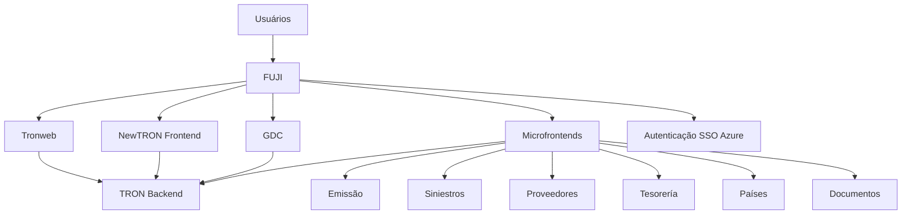
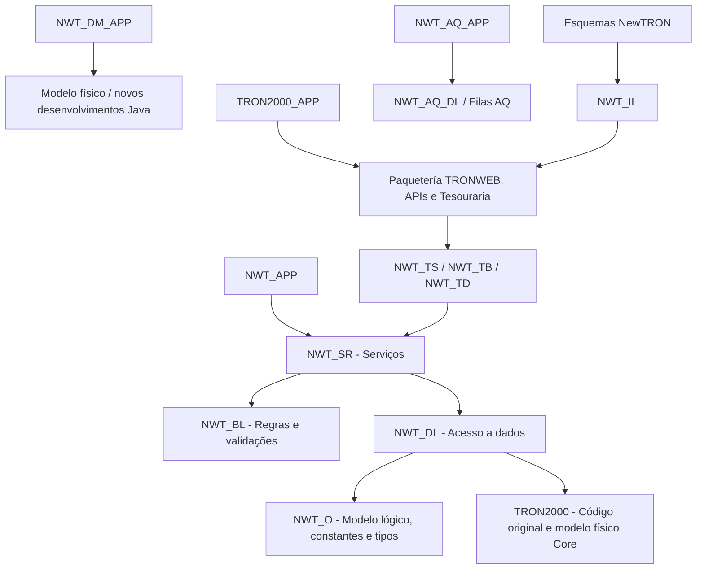
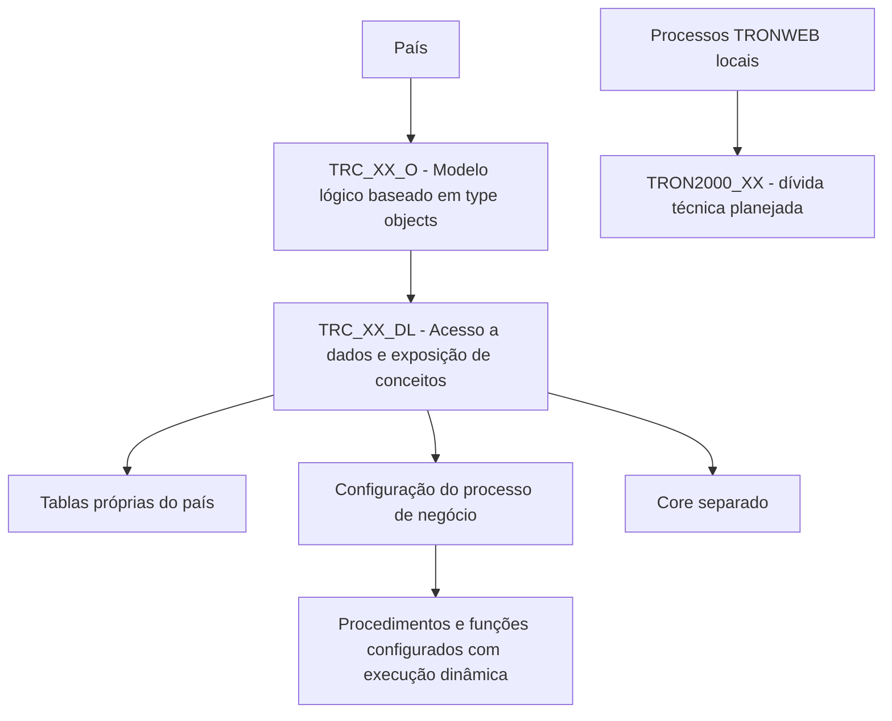
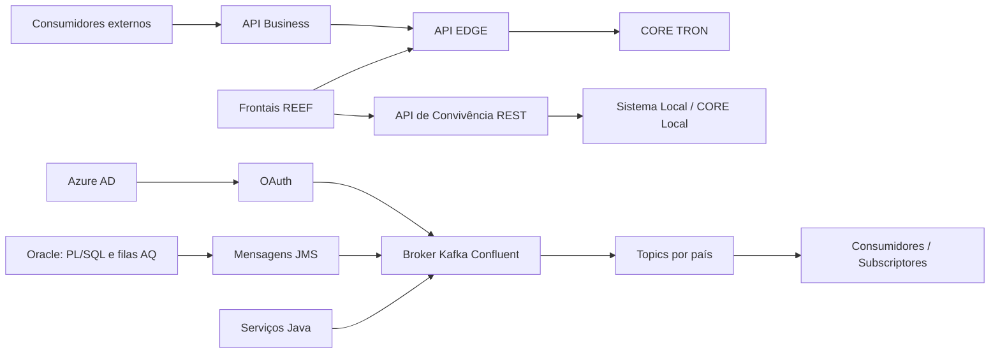

# Arquitetura TRON, REEF como PaaS e Capacidades de Integração, Eventos, Reporting e Cloud

## 1. Metadados do Documento
- **Arquivo de Origem:** Não identificado no conteúdo extraído.
- **Tipo de Documento:** Apresentação Executiva / Arquitetura de Software.
- **Domínio / Sistema:** TRON, REEF, NewTRON, Plataforma de Eventos, Gestão Documental e soluções globais.
- **Público-Alvo:** Arquitetos, desenvolvedores, equipes de integração, operação, países e equipes de negócio.
- **Data/Versão Identificada:** 26 de outubro de 2023.

---

## 2. Resumo Executivo & Contexto de Negócio

O documento apresenta a arquitetura TRON no contexto de REEF como uma plataforma PaaS. REEF Core é descrito como o coração da plataforma, responsável pela configuração de produtos, processos de emissão, sinistros, administração e capacidades comuns. A plataforma disponibiliza soluções globais de atendimento a clientes finais e distribuidores, autosserviços, cotadores, emissores, gestão documental, BPM, motor de regras, gestão de eventos, clientes e microsserviços especializados.

A estratégia de REEF inclui um Marketplace no qual novas capacidades funcionais são incorporadas continuamente por meio de desenvolvimentos próprios, soluções de mercado e Insurtechs. O modelo também prevê governança para permitir entregas consistentes às regiões, unidades e países.

A evolução da camada de front-end passa por Tronweb, NewTRON, GDC, microfrontends por domínio funcional e Fuji. Fuji atua como ponto único de acesso para usuários, orquestrando os frontais e centralizando menu, idioma, companhia, comunicação entre frontais e autenticação SSO com Azure.

A arquitetura de backend separa claramente Core e País. O Core não pode ser alterado diretamente e separa o código de país do código central. A camada de País permite personalização por configuração, parametrização e execução dinâmica, preservando o desacoplamento do modelo físico para reduzir impactos de novas versões de NewTRON.

A apresentação também posiciona APIs e eventos como capacidades complementares de integração. APIs representam ações a executar no sistema; eventos representam fatos já ocorridos, imutáveis e persistentes. A plataforma de eventos utiliza Kafka fornecido pela Confluent, com acesso protegido por OAuth via Azure AD, suportando produtores e consumidores Oracle, Java, TRON on-premise, REEF e sistemas locais.

---

## 3. Arquitetura, Componentes & Tecnologias Envolvidas

### Componentes e domínios identificados

| Componente / Domínio | Papel identificado no documento |
| :--- | :--- |
| REEF Core | Coração da plataforma; configuração de produtos, emissão, sinistros, administração e funcionalidades comuns. |
| TRON | Sistema central e backend associado ao ecossistema TRON. |
| Tronweb | Front-end legado baseado em Java Swing 1.3; manutenção corretiva e uso temporário em telas de Tesouraria. |
| NewTRON | Evolução de front-end e backend, baseada em componentes modulares, arquitetura em camadas e modelo lógico baseado em type objects. |
| GDC | Gerador de telas e manutenção zero code de tabelas; baseado em Angular, Spring Boot e MAR 2.0. |
| Fuji | Ponto único de acesso aos usuários, responsável por orquestração de frontais, menu, idioma, companhia, comunicação e SSO Azure. |
| Microfrontends | Frontais independentes por domínio funcional, com módulos configuráveis em banco de dados e componentes reutilizáveis. |
| API EDGE | Camada de integração exposta para funcionalidades de Core, módulos e consumidores. |
| API Business | Catálogo de serviços com linguagem mais padronizada; intermediação com Core e comunicação com API EDGE. |
| API de Convivência | Integração síncrona entre REEF e sistemas locais dos países por APIs REST. |
| Plataforma de Eventos | Capacidade centralizada de integração orientada a eventos. |
| Kafka / Confluent | Broker e serviço de eventos para publicar, subscrever, armazenar e processar fluxos de registros em tempo real. |
| Oracle / AQ | Banco de dados e filas AQ usadas como fontes de mensagens JMS convertidas em eventos. |
| Gestão Documental | Serviços de composição, distribuição e gestão de documentos. |
| FIS | Serviço técnico de composição de documentos. |
| Documentum | Plataforma de gestão documental. |
| Dynatrace | Observabilidade de componentes e serviços locais. |
| WebLogic Server | Ambiente de implantação de componentes Java na arquitetura de América Central. |
| AWS Fargate | Serviço serverless de contêineres para componentes Java na arquitetura Vida. |
| RDS Oracle | Serviço de banco de dados identificado na arquitetura Vida. |
| Control-M | Agente cloud integrado ao maestro de Espacio MAPFRE. |
| MAR 2.0 | Base arquitetural para GDC e para toda a arquitetura Vida. |

### Evolução de front-end



### Arquitetura de backend Core



### Arquitetura de backend País



### Arquitetura de integração por APIs e eventos



---

## 4. Regras de Negócio, Especificações Funcionais & Processos

### REEF como PaaS

- REEF Core atua como o coração da plataforma.
- REEF Core é responsável pela configuração de produtos, processos de emissão, sinistros, administração e capacidades comuns.
- As soluções globais incluem atendimento ao cliente final e ao distribuidor.
- As soluções globais incluem autosserviços, cotadores e emissores.
- Há soluções de suporte para Gestão Documental, BPM, Motor de Regras, gestor de eventos e clientes.
- Microsserviços são utilizados para necessidades específicas, como cotação e subscrição de riscos.
- Componentes são disponibilizados em um Marketplace com ampliação contínua de capacidades funcionais.
- O modelo de governo busca atender regiões, unidades e países.

### Front-end TRON e NewTRON

- Tronweb utiliza Java Swing 1.3.
- Tronweb está sob manutenção corretiva.
- Tronweb é utilizado temporariamente para telas de Tesouraria.
- NewTRON Frontend utiliza AngularJS e Spring MVC.
- NewTRON cobre todos os processos e famílias TRON, exceto Tesouraria.
- NewTRON utiliza componentes modulares e reutilizáveis.
- NewTRON possui look and feel 100% personalizável.
- GDC utiliza Angular e Spring Boot.
- GDC é baseado em MAR 2.0.
- GDC permite geração de telas e manutenção zero code de tabelas.
- GDC define funcionalidades por parametrização.
- GDC suporta funcionalidades de manutenção.
- GDC executa validações por integração de API.
- Microfrontends são organizados por domínio funcional.
- Microfrontends apresentam telas geradas por parametrização.
- Microfrontends são baseados em MAR.
- Cada microfrontend possui implantação independente.
- Microfrontends usam componentes reutilizáveis.
- Módulos personalizados são configurados em banco de dados.

### Fuji

- Fuji é o único ponto de acesso para usuários.
- Fuji orquestra os diferentes frontais.
- Fuji gerencia menu, idioma e companhia.
- Fuji permite comunicação entre frontais.
- Fuji utiliza autenticação SSO Azure.

### Regras do Core Backend

- A arquitetura Core é organizada em camadas de esquemas, cada uma com propósito próprio.
- O modelo lógico é baseado em type objects.
- O código Core não pode ser alterado.
- Não é permitida personalização por substituição de sinônimos.
- O Core suporta múltiplos países e múltiplas companhias.
- O código de país é separado do Core.
- Existem utilitários para diagnóstico de erros em execução.
- Não são permitidos utilitários que abram comunicações externas com `UTL_HTTP` ou `UTL_FILE`.

### Estrutura histórica e camadas do Core Backend

- Originalmente, TRON concentrava todos os objetos no esquema `TRON2000`.
- No modelo original, lógica de acesso a dados e lógica de negócio estavam misturadas.
- A arquitetura baseada em esquemas de banco de dados foi criada para ordenar o software.
- `TRON2000` contém código original do sistema e o modelo físico do Core, incluindo tabelas e views.
- `NWT_O` define o modelo lógico, constantes e tipos manipulados pelo sistema.
- `NWT_DL` é a camada de acesso a dados.
- `NWT_DL` possui camada interna para acesso a tabelas e carga/descarga de informações de objetos do modelo lógico.
- `NWT_DL` possui camada de interface que recebe conceitos de negócio e orquestra camadas internas de acesso a dados.
- `NWT_AQ_DL` contém o modelo de filas AQ para geração de mensagens JMS.
- `NWT_BL` concentra validações dos atributos de conceitos de negócio.
- `NWT_SR` é a camada de serviços.
- `NWT_SR` possui nível de orquestração de propriedades de conceito lógico.
- `NWT_SR` possui nível de orquestração de processos que utiliza conceitos lógicos envolvidos em funcionalidades.
- `NWT_SR` possui interface de serviço visível a partir dos esquemas de conexão.
- `NWT_APP` acessa interfaces de serviço definidas em `NWT_SR`.
- `NWT_DM_APP` acessa o modelo físico para novos desenvolvimentos com implementação completa em Java.
- `TRON2000_APP` acessa a paquetería TRONWEB, APIs, Tronweb e módulo de Tesouraria.
- `NWT_AQ_APP` acessa filas AQ como fonte de mensagens JMS para eventos Kafka.
- `TRP_XX` contém objetos de definição de produtos Core, como produtos de Vida.
- `TRP_XX` controla dados do sistema acessados por programas PTD disponíveis em `TRON2000`.
- `NWT_IL` é a camada de mediação entre esquemas NewTRON e lógica original de Tronweb.
- `NWT_IL` traduz o modelo lógico NewTRON baseado em type objects para o modelo Tronweb baseado em types records.
- `NWT_TS`, `NWT_TB` e `NWT_TD` possibilitam que esquemas Tronweb acessem lógica NewTRON.
- A evolução do sistema ocorre há anos nas camadas NewTRON; há casos em que Tronweb precisa acessar funcionalidades presentes em NewTRON.

### Regras do Backend País

- A arquitetura de País é semelhante à arquitetura Core, organizada em camadas de esquemas.
- O código de País é independente do código Core.
- A personalização é realizada por configuração, parametrização e execução dinâmica.
- Não há personalização por substituição de sinônimos.
- Cada país possui esquemas próprios para hospedagem de seu código.
- `TRC_XX_O` é o modelo lógico de País baseado em type objects.
- `TRC_XX_DL` contém tabelas próprias do país e duas camadas de paquetería.
- A camada interna de `TRC_XX_DL` acessa tabelas do país.
- A camada de interface de `TRC_XX_DL` expõe conceitos lógicos para as demais camadas.
- O Core e o código do país não devem ser misturados; devem permanecer em esquemas separados.
- A extensão de processos pode ocorrer por definição de procedimentos e funções configurados e executados dinamicamente.
- Processos locais desenvolvidos no Uruguai, no contexto REEF Latam Vida, foram incorporados a `TRC_XX_DL` como dívida técnica.
- Está prevista a abertura do esquema `TRON2000_XX` para alojar a paquetería TRONWEB local e controlar a dívida técnica.
- O modelo está desacoplado do modelo físico para buscar compatibilidade retroativa entre versões NewTRON e minimizar impactos nos países.

### APIs

- APIs representam ações que se deseja executar no sistema.
- Exemplos apresentados de ações por API: emitir uma apólice e gerar condições particulares de uma apólice.
- API EDGE expõe funcionalidades de Core e módulos para consumidores.
- API Business disponibiliza catálogo de serviços em linguagem mais padronizada.
- API Business realiza intermediação com Core.
- API Business comunica-se com API EDGE.
- API Batch é associada a tarefas Java.
- API de Convivência permite integração entre REEF e o sistema local de um país.
- A API de Convivência suporta integrações síncronas por API REST.
- A apresentação diferencia API de Convivência e API EDGE, mas não especifica os contratos técnicos, métodos HTTP ou formatos JSON.

### Eventos

- Eventos são fatos que já ocorreram no sistema.
- Eventos representam mudanças de estado em um sistema.
- Eventos são mensagens ou registros imutáveis.
- Eventos possuem persistência.
- Mensagens de eventos não podem ser modificadas.
- Eventos são validados contra um esquema antes de serem armazenados em um topic.
- Clientes ou subscritores inscrevem-se em topics de eventos.
- Consumidores leem e confirmam a leitura de eventos.
- Cada consumidor possui referência própria do último evento lido.
- Cada consumidor processa eventos em ordem.
- Consumidores podem possuir diferentes capacidades de processamento.
- Arquitetura orientada a eventos reduz o acoplamento em comparação com arquiteturas cliente-servidor.
- Em arquitetura orientada a eventos, o componente emissor não conhece a identidade dos receptores no momento da compilação.
- Eventos ajudam a isolar processos e delimitar responsabilidades.
- O documento cita emissão de apólice e processos pós-emissão como exemplo de processos que podem ser desacoplados.
- A orquestração transacional de várias chamadas pode impactar performance, aumentar a possibilidade de erros e envolver mais equipes na resolução de incidentes.

### Plataforma de Eventos

- Eventos podem ser emitidos pelo backend Oracle, usando serviços PL/SQL e filas AQ.
- Eventos podem ser emitidos por Java.
- Eventos podem ser utilizados por TRON on-premise e sistemas locais.
- O broker de eventos é fornecido por Kafka oferecido pela Confluent.
- Kafka é descrito como plataforma open source que permite publicar, subscrever, armazenar e processar fluxos de registros em tempo real.
- A plataforma centralizada de eventos está implantada na AWS, na região Irlanda.
- Conectores para bancos de dados TRON permitem que bancos atuem como fontes de mensagens JMS.
- Mensagens JMS são convertidas em eventos e encaminhadas aos topics.
- Cada país possui um conjunto de topics fornecidos originalmente pelo Core e topics próprios definidos pelo país.
- TRON possui serviço parametrizado para gerar mensagens nas bases TRON desde a versão `rls2023.01`.
- Existem bibliotecas em diversas linguagens para integração com topics.
- Java é citado como linguagem nativa, pois Kafka é desenvolvido em Java.
- Acesso a topics é protegido por OAuth com validação no Azure AD.
- Produtores e consumidores externos podem gerar ou consumir eventos conforme os serviços pertinentes.
- REEF Centroamérica e Vida Latam já nascem com a integração estabelecida.
- Países precisam de versão mínima de Core e habilitação de comunicações pela rede interna Mapfre.
- Autosserviços, Cotizadores, Tarificador, Impagos e Ficha Cliente 360 são ativos com capacidade atual ou futura de gerar ou consumir eventos.

### Casos de uso de eventos

1. **Gestão de Impagos:** sincronização de recibos inadimplentes no TRON com o ativo centralizado Gestão de Impagos para processamento.
2. **Autosservicio Proveedores:** sincronização de dados de terceiros do tipo fornecedor entre TRON Chile e Autosservicio Proveedor.
3. **Ficha Cliente 360:** sincronização de dados de clientes dos sistemas transacionais para o banco de dados do ativo Ficha Cliente 360.
4. **REEF Vida:** sincronização bidirecional de dados de clientes entre REEF e TRON local Uruguai.
5. **Salesforce CRM:** sincronização de dados de cotações, orçamentos e apólices.
6. **Prestaciones Salud:** integração entre domínios do novo sistema de prestações de saúde da Espanha e sistemas externos.

### Reporting e documentos

- A Plataforma Documental oferece composição de documentos por FIS.
- A Plataforma Documental oferece distribuição de documentos por email, SMS e Webplus.
- A Plataforma Documental oferece gestão de documentos por Documentum.
- O mapa documental é normalizado.
- TRON fornece serviços funcionais que exploram capacidades da Plataforma Documental com base em parametrização.
- As capacidades documentais estão integradas ao frontal TRON, D2 e módulo Gestor de Documentos.
- O Gestor de Documentos cobre apólices, orçamentos, sinistros, expedientes, serviços, faturas e fornecedores.
- Documentos enviados a clientes são gerenciados pela Plataforma Documental.

### Cloud: América Central

- A implantação ocorre em Ashburn, identificada como US East.
- O disaster recovery ocorre em San José, identificado como US West.
- Componentes Java são implantados em WebLogic Server.
- Dynatrace fornece observabilidade, incluindo serviços locais como API de Convivência.
- Há reutilização da instalação dos frameworks de Gestão Documental disponíveis no datacenter de Miami.
- A API de Convivência no Panamá integra REEF com SISMAP.
- Há agente Control-M cloud integrado ao maestro de Espacio MAPFRE.

### Cloud: Vida

- A implantação ocorre em São Paulo, região `sa-east-1`.
- O disaster recovery ocorre em Ohio, região `us-east-2`.
- Componentes Java são implantados como contêineres no serviço serverless Fargate.
- O banco de dados é RDS Oracle.
- Toda a arquitetura utiliza arquétipos MAR 2.0.
- A implantação multirregião é automatizada.
- Dynatrace fornece observabilidade.
- Dados de clientes são sincronizados entre REEF e TRON Uruguai por eventos.
- Serviços DUP e RTE são integrados para seleção de riscos e módulos.

---

## 5. Tabelas de Parâmetros, Ambientes e Estruturas de Dados

### Esquemas Core e conexões Oracle

| Item / Parâmetro | Descrição / Função | Tipo / Valores / Formato | Ambiente / Observações |
| :--- | :--- | :--- | :--- |
| `TRON2000` | Código original do sistema e modelo físico Core. | Esquema de banco de dados; tabelas e views. | Modelo histórico; originalmente concentrava objetos e lógica. |
| `NWT_O` | Definição do modelo lógico, constantes e tipos do sistema. | Esquema Core. | Modelo baseado em type objects. |
| `NWT_DL` | Acesso a dados e exposição de conceitos lógicos. | Esquema Core; níveis interno e interface. | Camada interna acessa tabelas; interface orquestra conceitos de negócio. |
| `NWT_AQ_DL` | Modelo de filas AQ para geração de mensagens JMS. | Esquema Core. | Suporta integração com eventos. |
| `NWT_BL` | Validação de atributos de conceitos de negócio. | Esquema Core. | Camada de regras e validações. |
| `NWT_SR` | Camada de serviços. | Esquema Core; três níveis. | Orquestra propriedades, processos e interfaces de serviço. |
| `NWT_APP` | Acesso a interfaces de serviços definidas em `NWT_SR`. | Esquema de conexão Oracle. | Acesso ao backend Oracle. |
| `NWT_DM_APP` | Acesso ao modelo físico para novos desenvolvimentos Java. | Esquema de conexão Oracle. | Implementação completa em Java. |
| `TRON2000_APP` | Acesso à paquetería TRONWEB, APIs e Tesouraria. | Esquema de conexão Oracle. | Inclui APIs, Tronweb e módulo de Tesouraria. |
| `NWT_AQ_APP` | Acesso às filas AQ. | Esquema de conexão Oracle. | Filas AQ como fonte JMS para eventos Kafka. |
| `TRP_XX` | Definição de produtos Core. | Esquema de produto. | Exemplo citado: Vida; acesso via programas PTD de `TRON2000`. |
| `NWT_IL` | Mediação entre NewTRON e Tronweb. | Esquema/camada de tradução. | Traduz type objects NewTRON para types records Tronweb. |
| `NWT_TS` | Acesso de Tronweb à lógica NewTRON. | Esquema de mediação. | Não detalhado individualmente além da função conjunta. |
| `NWT_TB` | Acesso de Tronweb à lógica NewTRON. | Esquema de mediação. | Não detalhado individualmente além da função conjunta. |
| `NWT_TD` | Acesso de Tronweb à lógica NewTRON. | Esquema de mediação. | Não detalhado individualmente além da função conjunta. |

### Esquemas de País

| Item / Parâmetro | Descrição / Função | Tipo / Valores / Formato | Ambiente / Observações |
| :--- | :--- | :--- | :--- |
| `TRC_XX_O` | Modelo lógico específico de país. | Esquema de País baseado em type objects. | Código separado do Core. |
| `TRC_XX_DL` | Acesso a tabelas próprias e exposição de conceitos do país. | Esquema de País; camada interna e interface. | Também recebeu processos locais do Uruguai como dívida técnica. |
| `TRON2000_XX` | Esquema planejado para paquetería TRONWEB local. | Esquema de País planejado. | Objetivo de controlar dívida técnica. |
| Procedimentos / funções configurados | Extensão de processos de negócio. | Definidos por configuração e executados dinamicamente. | Personalização por parametrização; não por sinônimos. |

### Front-end e domínios funcionais

| Item / Parâmetro | Descrição / Função | Tipo / Valores / Formato | Ambiente / Observações |
| :--- | :--- | :--- | :--- |
| Tronweb | Front-end legado. | Java Swing 1.3. | Manutenção corretiva; temporariamente para Tesouraria. |
| NewTRON Frontend | Front-end TRON evoluído. | AngularJS + Spring MVC. | Todos os processos e famílias TRON, exceto Tesouraria. |
| GDC | Gerador de telas e manutenção de tabelas. | Angular + Spring Boot; MAR 2.0. | Definição parametrizada; manutenção zero code; validações por API. |
| Microfrontends | Frontais independentes por domínio. | Baseados em MAR e componentes reutilizáveis. | Implantação independente; configuração de módulos em banco de dados. |
| Fuji | Orquestrador de frontais e ponto de acesso único. | Autenticação SSO Azure. | Menu, idioma, companhia e comunicação entre frontais. |
| Emissão | Domínio funcional de microfrontend. | Domínio de negócio. | Citado sem detalhamento funcional adicional. |
| Siniestros | Domínio funcional de microfrontend. | Domínio de negócio. | Citado sem detalhamento funcional adicional. |
| Proveedores | Domínio funcional de microfrontend. | Domínio de negócio. | Citado sem detalhamento funcional adicional. |
| Tesorería | Domínio funcional. | Domínio de negócio. | Tronweb é usado temporariamente para suas telas. |
| Países | Domínio funcional de microfrontend. | Domínio de negócio. | Citado sem detalhamento adicional. |
| Documentos | Domínio funcional de microfrontend. | Domínio de negócio. | Associado também à Plataforma Documental. |

### Integração e eventos

| Item / Parâmetro | Descrição / Função | Tipo / Valores / Formato | Ambiente / Observações |
| :--- | :--- | :--- | :--- |
| API EDGE | Exposição de funcionalidade Core e módulos. | Camada de API. | Consumida por frontais REEF e outros consumidores. |
| API Business | Catálogo de serviços padronizado. | Camada de API. | Intermediação com Core e comunicação com API EDGE. |
| API Batch | Execução de tarefas. | Tarefas Java. | Sem detalhamento adicional. |
| API de Convivência | Integração REEF e sistema local de país. | API REST síncrona. | Diferenciada da API EDGE; contratos não detalhados. |
| Eventos | Fatos ocorridos e persistentes. | Mensagens imutáveis. | Registro de mudança de estado. |
| Filas AQ | Fonte de mensagens JMS. | Oracle AQ. | Mensagens convertidas em eventos. |
| Kafka | Broker de eventos. | Plataforma open source. | Serviço oferecido pela Confluent. |
| Topics | Canais de eventos por país. | Core + topics definidos pelo país. | Mensagens validadas contra esquema antes do armazenamento. |
| OAuth | Mecanismo de autenticação para topics. | OAuth via IdP Azure AD. | Protege acesso de produtores e consumidores. |
| `rls2023.01` | Versão a partir da qual há serviço TRON parametrizado de geração de mensagens. | Identificador de versão. | Aplicável às bases TRON segundo o documento. |

### Ambientes cloud

| Item / Parâmetro | Descrição / Função | Tipo / Valores / Formato | Ambiente / Observações |
| :--- | :--- | :--- | :--- |
| Ashburn | Região principal de implantação. | US East. | América Central. |
| San José | Região de disaster recovery. | US West. | América Central. |
| WebLogic Server | Hospedagem de componentes Java. | Servidor de aplicação. | América Central. |
| Datacenter de Miami | Instalação reutilizada de frameworks documentais. | Datacenter. | América Central. |
| Panamá | Local da API de Convivência para SISMAP. | Localização de integração. | REEF integrado com SISMAP. |
| São Paulo | Região principal de implantação. | AWS `sa-east-1`. | Vida. |
| Ohio | Região de disaster recovery. | AWS `us-east-2`. | Vida. |
| Fargate | Execução de componentes Java em contêineres. | Serviço serverless. | Vida. |
| RDS Oracle | Banco de dados. | Serviço gerenciado Oracle. | Vida. |
| Dynatrace | Observabilidade. | Ferramenta de monitoramento. | América Central e Vida. |
| Control-M | Agente cloud de automação. | Agente integrado. | Integrado ao maestro de Espacio MAPFRE. |

---

## 6. Bateria de Perguntas & Respostas para RAG (FAQ Sintético)

### P1: Qual é a responsabilidade principal do REEF Core na arquitetura apresentada?
**R:** REEF Core atua como o coração da plataforma REEF. O documento atribui ao REEF Core a configuração de produtos, processos de emissão, sinistros, administração e funcionalidades comuns. A plataforma também se relaciona com soluções globais, gestão documental, BPM, motor de regras, gestão de eventos, clientes e microsserviços especializados.

### P2: Qual é a diferença entre Tronweb e NewTRON Frontend?
**R:** Tronweb é um front-end baseado em Java Swing 1.3, mantido corretivamente e usado temporariamente para telas de Tesouraria. NewTRON Frontend utiliza AngularJS e Spring MVC, atende todos os processos e famílias de TRON exceto Tesouraria, oferece componentes modulares e reutilizáveis e possui look and feel 100% personalizável.

### P3: Para que serve o GDC no ecossistema TRON?
**R:** GDC é um gerador de telas e mecanismo de manutenção zero code de tabelas. O documento informa que GDC utiliza Angular e Spring Boot, é baseado em MAR 2.0, define funcionalidades por parametrização, cobre funcionalidades de manutenção e realiza validações por integração de API.

### P4: Como Fuji participa da experiência dos usuários?
**R:** Fuji é o único ponto de acesso para usuários. Fuji orquestra os frontais, gerencia menu, idioma e companhia, permite comunicação entre frontais e implementa autenticação SSO Azure.

### P5: Quais são as principais restrições de personalização do Core Backend?
**R:** O código do Core não pode ser alterado. O documento também estabelece que não é permitida personalização por substituição de sinônimos. O Core separa o código de país e permite arquitetura multi-país e multi-companhia. Além disso, não são permitidos utilitários que abram comunicações externas usando `UTL_HTTP` ou `UTL_FILE`.

### P6: Qual é a função das camadas `NWT_DL`, `NWT_BL` e `NWT_SR`?
**R:** `NWT_DL` é a camada de acesso a dados, com nível interno para tabelas e carga/descarga de objetos lógicos e nível de interface para orquestrar conceitos de negócio. `NWT_BL` valida atributos de conceitos de negócio. `NWT_SR` é a camada de serviços, com orquestração de propriedades de conceitos lógicos, orquestração de processos e interface de serviço exposta aos esquemas de conexão.

### P7: Como a arquitetura de País preserva a independência em relação ao Core?
**R:** Cada país possui esquemas próprios, como `TRC_XX_O` para modelo lógico e `TRC_XX_DL` para acesso a tabelas próprias e exposição de conceitos. O código de país não é misturado ao Core. A personalização ocorre por configuração, parametrização e execução dinâmica de procedimentos ou funções configurados, e não por substituição de sinônimos.

### P8: Qual é a diferença entre APIs e eventos no modelo de integração apresentado?
**R:** APIs representam ações que se deseja executar no sistema, como emitir uma apólice ou gerar condições particulares. Eventos representam fatos que já ocorreram, como uma apólice emitida. As duas capacidades são complementares: APIs são usadas para solicitar ações, enquanto consumidores reagem a eventos para executar seus próprios processos de negócio.

### P9: Quais propriedades de eventos são exigidas pela plataforma?
**R:** Eventos são fatos já ocorridos, imutáveis e persistentes. Um evento representa uma mudança de estado no sistema. As mensagens são validadas contra um esquema antes de serem armazenadas em um topic; consumidores se subscrevem aos topics, confirmam leituras, mantêm sua própria referência de último evento lido e processam eventos em ordem.

### P10: Como eventos podem ser produzidos a partir do backend TRON?
**R:** O documento informa que eventos podem ser emitidos pelo backend Oracle usando serviço PL/SQL e filas AQ, bem como por Java. Conectores para bancos TRON permitem que bancos funcionem como fontes de mensagens JMS. Essas mensagens JMS são convertidas em eventos e encaminhadas aos topics Kafka.

### P11: Como o acesso aos topics Kafka é protegido?
**R:** O acesso aos topics é protegido por OAuth por meio do provedor de identidade Azure AD. Essa validação protege os produtores e consumidores que acessam a plataforma de eventos.

### P12: Quais casos de uso de eventos são apresentados?
**R:** Os casos apresentados incluem sincronização de recibos inadimplentes para Gestão de Impagos; sincronização de fornecedores entre TRON Chile e Autoservicio Proveedor; envio de dados de clientes para Ficha Cliente 360; sincronização bidirecional de clientes entre REEF e TRON Uruguai; sincronização de cotações, orçamentos e apólices para Salesforce CRM; e integração entre domínios e sistemas externos no novo sistema espanhol de Prestaciones Salud.

### P13: Como a Plataforma Documental se integra ao TRON?
**R:** A Plataforma Documental fornece composição de documentos por FIS, distribuição por email, SMS e Webplus e gestão documental por Documentum. TRON disponibiliza serviços funcionais parametrizados que utilizam essas capacidades. A integração existe no frontal TRON, D2 e Gestor de Documentos para apólices, orçamentos, sinistros, expedientes, serviços, faturas e fornecedores.

### P14: Quais diferenças existem entre as arquiteturas cloud de América Central e Vida?
**R:** América Central está implantada em Ashburn, com disaster recovery em San José; usa WebLogic Server para componentes Java, reutiliza frameworks documentais do datacenter de Miami e possui API de Convivência no Panamá para SISMAP. Vida está implantada em São Paulo, com disaster recovery em Ohio; executa Java em contêineres Fargate, usa RDS Oracle, MAR 2.0 em toda a arquitetura, implantação multirregião automatizada e sincronização REEF–TRON Uruguai por eventos.

---

## 7. Glossário de Termos, Siglas & Conceitos-Chave

- **API:** Interface de programação usada no documento para representar ações a serem executadas no sistema.
- **API Business:** Catálogo de serviços com linguagem mais padrão, responsável pela intermediação com o Core e comunicação com API EDGE.
- **API EDGE:** Camada de API associada à funcionalidade Core, módulos e consumidores.
- **API de Convivência:** API REST síncrona para integração entre REEF e sistemas locais de países.
- **AQ:** Advanced Queuing; filas Oracle usadas como fonte de mensagens JMS no contexto apresentado.
- **Azure AD:** Provedor de identidade utilizado para autenticação OAuth de produtores e consumidores Kafka.
- **BPM:** Business Process Management; capacidade de suporte citada na plataforma REEF.
- **Core:** Camada central do sistema, separada do código específico de país.
- **D2:** Frontal citado como integrado às capacidades documentais; sem detalhamento adicional.
- **DR:** Disaster Recovery; região alternativa de recuperação de desastre.
- **Dynatrace:** Ferramenta de observabilidade citada nas arquiteturas cloud.
- **EDA:** Event-Driven Architecture; paradigma em que componentes executam em resposta a notificações de eventos.
- **Fargate:** Serviço serverless utilizado para executar contêineres Java na arquitetura Vida.
- **FIS:** Serviço técnico de composição de documentos.
- **GDC:** Gerador de telas e manutenção zero code de tabelas, baseado em Angular, Spring Boot e MAR 2.0.
- **IdP:** Identity Provider; no documento, Azure AD é o provedor de identidade para OAuth.
- **JMS:** Java Message Service; mensagens provenientes de filas AQ podem ser convertidas em eventos.
- **Kafka:** Plataforma open source para publicar, subscrever, armazenar e processar fluxos de registros em tempo real.
- **MAR 2.0:** Base arquitetural utilizada por GDC e por toda a arquitetura Vida.
- **Microfrontend:** Front-end independente por domínio funcional, com implantação independente e componentes reutilizáveis.
- **NWT:** Prefixo de esquemas associados à arquitetura NewTRON/Core.
- **OAuth:** Mecanismo de autorização utilizado para proteger o acesso aos topics da plataforma de eventos.
- **PaaS:** Platform as a Service; modelo no qual REEF é apresentado.
- **PTD:** Programas disponíveis em `TRON2000` usados para controlar dados acessados por objetos de produto `TRP_XX`; sigla não expandida no documento.
- **RDS Oracle:** Serviço de banco de dados Oracle utilizado na arquitetura Vida.
- **REEF:** Plataforma PaaS que integra Core, soluções globais, Marketplace e governança.
- **RTE / DUP:** Soluções globais citadas e integradas na arquitetura Vida para seleção de riscos e módulos; siglas não expandidas no documento.
- **SSO:** Single Sign-On; autenticação centralizada implementada por Fuji com Azure.
- **Topic:** Canal de eventos no Kafka ao qual produtores publicam e consumidores se subscrevem.
- **TRC_XX:** Prefixo de esquemas específicos de país.
- **TRON:** Sistema e domínio arquitetural central da apresentação.
- **TRONWEB:** Lógica e paquetería original associada ao Tronweb.
- **Type objects:** Modelo lógico utilizado no Core e em esquemas de País.
- **Types records:** Modelo utilizado pelo Tronweb, traduzido pela camada `NWT_IL`.
- **UTL_FILE:** Utilitário Oracle citado como não permitido para comunicações externas no Core.
- **UTL_HTTP:** Utilitário Oracle citado como não permitido para comunicações externas no Core.

---

## 8. Notas Críticas, Riscos & Limitações

- O conteúdo apresenta slides resumidos; diversos componentes são citados sem especificação de contratos, interfaces, versões, protocolos detalhados ou responsabilidades completas.
- **Nota de Análise:** O documento cita API EDGE, API Business e API de Convivência, mas não detalha métodos HTTP, endpoints, contratos JSON, modelos de erro ou políticas de versionamento.
- O código Core não pode ser alterado, restringindo intervenções diretas em funcionalidades centrais.
- A personalização por substituição de sinônimos não é permitida no Core nem no modelo de País apresentado.
- `UTL_HTTP` e `UTL_FILE` não são permitidos para abertura de comunicações externas no Core.
- A arquitetura de País identifica dívida técnica relacionada a processos locais do Uruguai incorporados em `TRC_XX_DL`.
- Há intenção de criar `TRON2000_XX` para hospedar a paquetería TRONWEB local e controlar essa dívida técnica.
- O documento alerta que a arquitetura de País é desconectada e requer cuidado com variáveis globais em nível de pacote.
- Países dependem de versão mínima de Core e da habilitação de comunicações pela rede interna Mapfre para integrar-se à plataforma de eventos.
- A evolução de funcionalidades ocorre nas camadas NewTRON, mas Tronweb ainda pode precisar acessar essas funcionalidades por esquemas de mediação.
- O uso de orquestração transacional de múltiplas operações pode prejudicar performance, aumentar falhas de execução e ampliar o número de equipes envolvidas na resolução de erros.
- **Nota de Análise:** A apresentação informa que a plataforma de eventos está na AWS, região Irlanda, mas não detalha políticas de retenção, recuperação, particionamento, disponibilidade, governança de schemas ou estratégia de tratamento de falhas.
- **Nota de Análise:** O documento menciona uma versão mínima de Core para países, porém não identifica qual é essa versão.
- **Nota de Análise:** O documento menciona APIs Batch e tarefas Java, mas não detalha agendamento, mecanismos de execução ou dependências operacionais.

---

## 9. Conteúdo Bruto Estruturado (Referência Fiel)

```text
--- [SLIDE 1 DE 21: Sem Título] ---

* Arquitectura TRON
* 26 Octubre 2023

--- [SLIDE 2 DE 21: Sem Título] ---

* 2
* _Reef como PaaS
* Core
* Actúa como corazón de la Plataforma, responsable de la configuración de los productos, procesos de emisión, siniestros, administración y comunes.
* .
* Soluciones globales
* de atención al cliente final y distribuidor Autoservicios, Cotizadores / Emisores.
* de soporte para Gestión Documental, BPM, Motor de Reglas, gestor de eventos, Clientes…
* microservicios para dar respuesta a necesidades específicas (cotización, suscripción de riesgos)
* Marketplace
* Los componentes son ofertados en un Marketplace en el que se van incorporando más capacidades funcionales de forma continua (desarrollos propios, de mercado, de Insurtechs,…).
* Gobierno
* Para establecer un modelo de entrega que sea capaz de servir a todas las regiones, unidades y países, en base a un modelo de gobierno.

--- [SLIDE 3 DE 21: Sem Título] ---

* Reef como PaaS
* Arquitectura Reef Core
  * TRON
  * Gestion Documental
* Arquitectura Soluciones Globales
  * RTE / DUP
  * Impagos
  * Ficha 360
  * Plataforma Eventos
* 3
  * Finametrix
  * Cotizador / Contratador
  * BPM/LowCode

--- [SLIDE 4 DE 21: Sem Título] ---

* _front
* Tronweb
* Tronweb
* Java Swing 1.3
* Mantenimiento correctivo
* Temporalmente para pantallas de Tesorería
* TRON Backend

--- [SLIDE 5 DE 21: Sem Título] ---

* _front
* Newtron Frontend
* AngularJS + Spring MVC
* Todos los procesos y familias de TRON excepto Tesorería
* Componentes modulares y reutilizables
* Look & feel 100% personalizable
* Tronweb
* TRON Backend
* NewTRON

--- [SLIDE 6 DE 21: Sem Título] ---

* _front
* Generador de pantallas
* Mantenimiento de tablas zero code
* Angular + Spring Boot
* Basado en MAR 2.0
* Definición por parametrización
* Todas las funcionalidades mantenimiento
* Validaciones a través de integración de API
* Tronweb
* TRON Backend
* NewTRON
* GDC

--- [SLIDE 7 DE 21: Sem Título] ---

* _front
* Microfrontends
* Uno por dominio funcional
* Presentación de pantallas generadas por parametrización.
* Basado en MAR
* Despliegue independiente
* Basado en componentes reutilizables
* Módulos personalizados por configuración en BD
* Tronweb
* TRON Backend
* NewTRON
* GDC
* Siniestros
* Emisión
* Proveedores
* Tesorería
* Países
* Documentos

--- [SLIDE 8 DE 21: Sem Título] ---

* _front
* Fuji
* Único punto de acceso para usuarios
* Orquestación de frontales
* Gestión del Menú, idioma y compañía
* Comunicación entre frontales
* Autenticación SSO AZURE
* Tronweb
* TRON Backend
* NewTRON
* GDC
* Proveedores
* Siniestros
* Emisión
* Tesorería
* FUJI
* Países
* Documentos

--- [SLIDE 9 DE 21: Sem Título] ---

* _backend Core
* Core Backend
* Arquitectura en capas (esquemas). Cada capa tiene un propósito.
* Modelo Lógico basado en type Objects.
* Código de Core no alterable.
* No se permite la personalización por sustitución de sinónimos.
* Core Multi-País y Multi-Compañía
* Se separa el código de País del Core.
* Utilidades diagnóstico errores en Ejecución.
* No se permite utilidades que abren comunicaciones externas (UTL_HTTP, UTL_FILE)

NOTAS DO APRESENTADOR:
Si recuerdan, originalmente TRON disponía de todos los objetos en un único esquema TRON2000, donde se mezclaba la lógia de acceso a datos con la lógica de negocio. Para ordenar todo este software se genera esta arquitectura basada en esquemas de BBDD:
- TRON2000: código original del sistema + modelo físico de CORE (tablas + vistas)
- NWT_O: definición del modelo lógico y ficheos de constantes y definición de tipos que va a manejar el sistema.
- NWT_DL: capa de acceso a datos. Dos niveles:
  + interno: acceso a las tables y carga y descarga de información sobre los objetos del modelo lógico (conceptos lógicos).
  + interfaz: recibe los conectpos de negocio y orquesta los dl internos.
- NWT_AQ_DL: modelo de colas AQ para generar los mensajes JMS.
- NWT_BL: validaciones de los atributos de los conceptos de negocio.
- NWT_SR: Capa de servicio con tres niveles:
  + Orquestador de propiedades de un concepto lógico.
  + Orquestador de proceso, donde se hace uso de los distintos conceptos lógicos que intervienen en una funcionalidad.
  + interfaz de servicio visible desde los esquemas de conexión.

Esquemas de conexión al backend Oracle:
- NWT_APP: acceso a las intefaces de servicio definidas en NWT_SR.
- NWT_DM_APP: acceso al modelo físico (nuevos desarrollos con implementación complete en java).
- TRON2000_APP: acceso a la paquetería TRONWEB (APIS + TRONWEB + Módulo de Tesorería).
- NWT_AQ_APP: acceso a las colas AQ como Fuente de mensajes JMS (eventos kafka).

Esquema de producto:
TRP_XX: objetos de definición de productos de CORE (como puede ser el caso de vida). Se controla los datos del Sistema a los que accede a través de programas PTDs disponibles en TRON2000.

Esquemas de mediación entre NEWTron y TRONWEB:
NWT_IL: acceso desde los esquemas de NEWTron a la lógica original de TRONWEB. Es una capa de traducción entre modelo lógico NEWTron (type objects) y el de TRONWEB (types records).
NWT_TS, NWT_TB y NWT_TD: acceso desde los esquemas de TRONWEB a lógica de NEWTron. Desde hace años, la evolución del Sistema se realiza en las capas de NEWTron, por lo que hay casos que es encesario acceder a funcioalidades presents en NEWTron.

--- [SLIDE 10 DE 21: Sem Título] ---

* _backend País
* Backend País
* Arquitectura en capas (esquemas). Cada capa tiene un propósito. Similar al CORE.
* Código independiente al de CORE
* Personalización por configuración (parametrización & ejecución dinámica).
* Nuevo esquema para incorporar procesos TRONWEB originales del Tron local (deuda técnica).
* Arquitectura desconectada. Cuidado con las globales a nivel paquete.
* Desacoplamiento del modelo físico para minimizar el impacto con las nuevas versiones de CORE

NOTAS DO APRESENTADOR:
Estructura muy similar a la de CORE pero para el país.
Cada país dispondrá de sus porpios esquemas donde alojar su código.
TRC_XX_O: Modelo Lógico basa en type objects.
TRC_XX_DL: Tablas propias del país y dos niveles de paquetería, interna de acceso a estas tablas y de interfaz para exposición del concepto lógico hacia el resto de capas.
Como pueden observar, no se mezcla el código de core con el de país, van a esquemas separados.
En este modelo, la personalización no se realiza por sustitución de sinónimos, sino por configuración del proceso de negocio correspondiente, con posibilidad de extensión vía definición de procedimientos / funciones configuradas y que se ejecutan de forma dinámica.
Con Uruguay (reef latam vida) ciertos procesos ya desarrollados localmente se han incorporado a TRC_XX_DL como esquema donde albergar esta deuda técnica. Tras un segundo análisis realizado, vamos a abrir un nuevo esquema TRON2000_XX para albergar esta paquetería y tener controlada esta deuda téncia. El resto del modelo está desacoplado del modelo físico, con lo que las versiones de NEWTron, deberían ser compatibles hacia atrás, minimizando el impacto en los países y favoreciendo la incorporación de las nuevas versiones.

--- [SLIDE 11 DE 21: Sem Título] ---

* _integracion
* API
* API EDGE
* Funcionalidad de Core
* Módulos
* Consumidores
* API BATCH. Tareas. Tareas Java
* API Business
* Catálogo de servicios con lenguaje más estándar
* Comunicación con API EDGE
* Preconstruido
* API EDGE
* CORE TRON
* Frontales REEF
* API Business
* Consumidores Externos
* Introducción
* Catálogo de servicios
* Intermediación con el Core

--- [SLIDE 12 DE 21: Sem Título] ---

* _integracion
* API de convivencia
* API EDGE
* CORE TRON
* Frontales REEF
* API Business
* Integración REEF y sistema local del país
* Integraciones síncronas
* API de Convivencia vs API EDGE
* API REST
* Sistema Local
* CORE Local
* API Convivencia

--- [SLIDE 13 DE 21: Sem Título] ---

* _integracion
* Eventos

NOTAS DO APRESENTADOR:
Cuando hablamos de eventos, no sólo hablamos de una nueva plataforma o capacidad de integración que se ofrece desde Reef.
Eventos y las arquitecturas orientas a eventos es un nuevo paradigama de diseño de aplicaciones.
Gartner: Arquitecturas basada en eventos (EDA) es un paradigma de diseño en el que un componente de software se ejecuta en respuesta a recibir una o más notificaciones de eventos.
EDA tiene un menor acoplamiento que arquitecturas cliente/servidor porque el componente que envía la notificación no conoce la identidad de los componentes receptores en el momento de la compilación.
Permite aislar los procesos y fijar mejor las responsabilidades. Ejemplo: emisión de póliza y procesos post emisión.
Actualmente, dentro de la misma transacción incluimos la orquestación de llamadas al resto de operaciones / funcionalidades que se han de ejecutar, lo cual impacta directamente en performance, mayor posibilidad de errores de ejecución, más equipos interviniendo en la resolución de posibles errores.

--- [SLIDE 14 DE 21: Sem Título] ---

* _integracion
* Eventos
* Los eventos son cosas que pasan o definidos de otra manera, representaciones de hechos.
* En el flujo de eventos, un evento (también llamado mensaje o registro) es simplemente un registro de un cambio de estado en un sistema.

NOTAS DO APRESENTADOR:
Confluent: eventos son cosas que pasan o representaciones de hechos, mensajes inmutables.
RedHat: registro de un cambio de estado en un sistema.
La gestión de eventos incorpora persistencia y es inmutable.
Los mensajes se validan contra un esquema para poder ser almacenados en un topic.
Los clientes, también llamados suscriptores, se subscriben al topic correspondiente, leen y confirman la lectura.
Cada consumidor dispone de una referencia distinta del último mensaje leído y procesa siempre por orden.

--- [SLIDE 15 DE 21: Sem Título] ---

* _integracion
* Eventos
* Definición: Hecho que ya ha sucedido en el sistema, inmutable y con persistencia.
* Emisión de eventos desde backend Oracle (servicio plsql & colas AQ) y Java.
* Uso desde los Tron onPremise y Sistemas locales.
* Broker de Eventos, a través de servicio Kafka ofrecido por Confluent.
* Acceso a los topics securizado a través de Oauth vía IdP Azure AD.

NOTAS DO APRESENTADOR:
Se disponibiliza una plataforma de eventos centralizada a través de un servicio de Confluent desplegado en AWS, región de Irlanda.
Se disponibilizan conectores a las BBDD TRON para que funcionen como fuentes de mensajes JMS convertidos a eventos y encaminados a topics.
Cada país dispone de topics originalmente proporcionados por CORE y topics propios definidos por el país.
TRON dispone de un servicio parametrizado que permite generar mensajes en BBDD TRON desde la versión rls2023.01.
Existen librerías para distintos lenguajes; Java es el nativo porque Kafka está desarrollado en Java.
El acceso está securizado y se valida mediante OAuth contra Azure AD.
REEF Centro América y Vida Latam nacen con integración establecida.
Para países se requiere versión mínima de Core y habilitar comunicaciones mediante red interna Mapfre.
Autoservicios, Cotizadores, Tarificador, Impagos y Ficha Cliente 360 tienen o tendrán capacidades para generar o consumir eventos.

--- [SLIDE 16 DE 21: Sem Título] ---

* Casos de uso
* 01. Gestión de Impagos
  Sincronización de recibos impagados en TRON con el activo centralizado de Gestión de Impagos para su procesamiento.
* 02. Autoservicio Proveedores
  Sincronización de datos de terceros de tipo Proveedor desde TRON Chile a Autoservicio Proveedor.
* 03. Ficha Cliente 360
  Sincronización de datos de clientes desde los distintos sistemas transaccionales hacia la BD del activo Ficha Cliente 360.
* 04. REEF Vida
  Sincronización bidireccional de datos de Clientes entre REEF y TRON local Uruguay.
* 05. Salesforce CRM
  Sincronización de datos de Cotizaciones, Presupuestos y Pólizas.
* 06. Prestaciones Salud
  Nuevo Sistema de Prestaciones de Salud España. Método principal de integración entre dominios del sistema, así como sistemas externos.

--- [SLIDE 17 DE 21: Sem Título] ---

* _integracion

NOTAS DO APRESENTADOR:
APIs: acciones que quiero ejecutar en el sistema, por ejemplo emitir póliza o generar condiciones particulares de una póliza.
Eventos: hechos que ya se han producido, por ejemplo póliza emitida; consumidores reaccionan y ejecutan procesos de negocio.
Las dos capacidades son complementarias.

--- [SLIDE 18 DE 21: Sem Título] ---

* _reporting
* REPORTING
* Plataforma Documental ofrece servicios téncios de Composición de Documentos (FIS) + Distribucción de Documentos (email, SMS, Webplus...) + Gestión de Documentos (Documentum)
* Normalización del Mapa Documental
* TRON ofrece servicios funcionales que, en base a una parametrización, explota las capacidades de la Plataforma Documental.
* Integrados en Frontal TRON, tanto D2 como módulo Gestor de Documentos (pólizas, presupuestos, Siniestros, Expedientes, Servicios, Facturas, Proveedores).
* Los documentos enviados a los clientes son gestionados a través de la plataforma Documental

--- [SLIDE 19 DE 21: Sem Título] ---

* _cloud
* Despliegue en la region de Ashburn (US East) y DR en San José (US West)
* Componentes Java desplegados sobre Weblogic server
* Observabilidad con Dynatrace incluyendo servicios locales como el API de convivencia
* Reutilización de la instalación de los frameworks de Gestion Documental disponibles en el DC de Miami
* API de Convivencia en Panamá para integración desde REEF con SISMAP
* Agente Control-M en cloud integrado con el maestro de Espacio MAPFRE
* America Central

--- [SLIDE 20 DE 21: Sem Título] ---

* _cloud
* Despliegue en la region de Sao Paulo (sa-east-1) y DR en Ohio (us-east-2)
* Componentes Java desplegados como contenedores en el servicio serverless Fargate
* Base de datos en RDS Oracle
* Arquetipos MAR 2.0 en toda la arquitectura
* Despliegue multiregion automatizado
* Observabilidad con Dynatrace
* Sincronizacion de datos de clientes entre REEF y TRON Uruguay mediante eventos
* Integracion de los servicios DUP y RTE para selección de riesgos y modulos.
* Vida

--- [SLIDE 21 DE 21: Sem Título] ---

* GRACIAS
```
