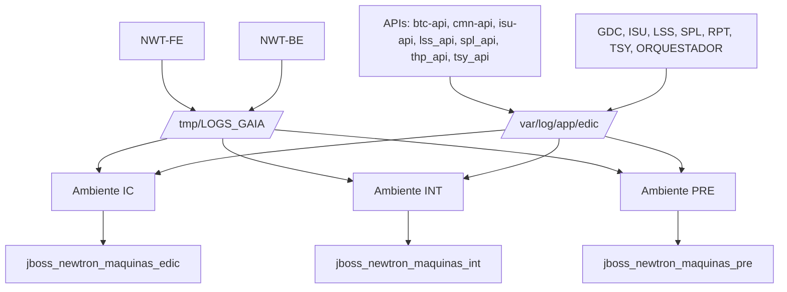

# Especificação de Ingestão Splunk, Índices e Rotas de Logs das Aplicações NWT / Newtron

## 1. Metadados do Documento
- **Arquivo de Origem:** `Não identificado; conteúdo bruto fornecido na solicitação`
- **Tipo de Documento:** `Procedimento`
- **Domínio / Sistema:** `NWT / Newtron, aplicações EDIC e Splunk`
- **Público-Alvo:** `Operação, desenvolvedores e equipes responsáveis por observabilidade`
- **Data/Versão Identificada:** `Não identificada`

---

## 2. Resumo Executivo & Contexto de Negócio

O documento define informações operacionais para ingestão de logs no Splunk das aplicações NWT-FE, NWT-BE, APIs e aplicações GDC, ISU, LSS, SPL, RPT, TSY e ORQUESTADOR. O conteúdo identifica ambientes, URLs de servidores, estimativa máxima de volume diário, índices Splunk por ambiente e padrões de rotas de arquivos de log.

A configuração de ingestão diferencia quatro grupos de aplicações: NWT-FE, NWT-BE, APIs e aplicações corporativas GDC/ISU/LSS/SPL/RPT/TSY/ORQUESTADOR. Cada grupo possui convenções próprias de diretórios, nomes de arquivos, variáveis de substituição e arquivos associados a logs padrão, JDBC Object Service e integrações de terceiros.

Os ambientes identificados são IC, INT e PRE. Para esses ambientes, o documento associa índices Splunk específicos: `jboss_newtron_maquinas_edic` para IC, `jboss_newtron_maquinas_int` para INT e `jboss_newtron_maquinas_pre` para PRE. Também são fornecidas URLs HTTP para servidores dos três ambientes, com duas URLs listadas para PRE.

A estimativa declarada de ingestão de dados no Splunk é de máximo de `1,7Gb/día`, com a referência adicional de `10Mb/día por aplicación y entorno`. O documento não detalha a metodologia de cálculo, a retenção dos índices, as configurações de forwarder, nem os critérios de parsing, sourcetype ou alertamento no Splunk.

---

## 3. Arquitetura, Componentes & Tecnologias Envolvidas

### Componentes e aplicações citados

- **NWT-FE**
- **NWT-BE**
- **APIs:** `btc-api`, `cmn-api`, `isu-api`, `lss_api`, `spl_api`, `thp_api`, `tsy_api`
- **Aplicações adicionais:** `GDC`, `ISU`, `LSS`, `SPL`, `RPT`, `TSY`, `ORQUESTADOR`
- **Plataforma de observabilidade:** `Splunk`
- **Ambientes:** `IC`, `INT`, `PRE`
- **Diretórios de logs:** `/tmp/LOGS_GAIA` e `/var/log/app/edic`

### Fluxo lógico de coleta e indexação



### Nota de Análise

O documento estabelece as fontes de log e os índices Splunk por ambiente, mas não descreve o mecanismo técnico de transporte dos arquivos até o Splunk. Não há detalhamento de agentes, forwarders, coletores, sourcetypes, regras de parsing ou configurações de retenção.

---

## 4. Regras de Negócio, Especificações Funcionais & Processos

1. A estimativa máxima de ingestão de dados no Splunk é de `1,7Gb/día`.
2. O documento informa adicionalmente a referência de `10Mb/día por aplicación y entorno`.
3. As rotas de logs são declaradas como iguais em todos os ambientes.
4. NWT-FE grava logs no diretório `/tmp/LOGS_GAIA`.
5. NWT-BE grava logs no diretório `/tmp/LOGS_GAIA`.
6. As APIs listadas devem utilizar o padrão `xxx` substituído pelo nome da API correspondente.
7. As aplicações GDC, ISU, LSS, SPL, RPT, TSY e ORQUESTADOR devem utilizar o padrão `xxx` substituído pelo nome da aplicação correspondente.
8. O placeholder `${appservername}` deve ser preservado ou resolvido conforme o nome do servidor da aplicação.
9. Os padrões de arquivos incluem logs principais, arquivos rotacionados por data e índice, logs `jdbcobjectservice` e logs `thirdparty`.
10. O ambiente IC utiliza o índice Splunk `jboss_newtron_maquinas_edic`.
11. O ambiente INT utiliza o índice Splunk `jboss_newtron_maquinas_int`.
12. O ambiente PRE utiliza o índice Splunk `jboss_newtron_maquinas_pre`.
13. O documento lista uma URL para IC, uma URL para INT e duas URLs para PRE.
14. Não há detalhamento no conteúdo sobre métodos HTTP, contratos de APIs, portas alternativas, autenticação, responsáveis operacionais, frequência de coleta ou políticas de retenção.

---

## 5. Tabelas de Parâmetros, Ambientes e Estruturas de Dados

### Ambientes, servidores e índices Splunk

| Item / Parâmetro | Descrição / Função | Tipo / Valores / Formato | Ambiente / Observações |
| :--- | :--- | :--- | :--- |
| Ambiente IC | Ambiente identificado no documento | `IC` | URL: `http://les000a103120:11000` |
| Ambiente INT | Ambiente identificado no documento | `INT` | URL: `http://les000a103093:11000` |
| Ambiente PRE | Ambiente identificado no documento | `PRE` | URL: `http://les000a204135:11000` |
| Ambiente PRE | Segunda URL listada para PRE | URL HTTP | `http://les000a204136:11000` |
| Índice IC | Índice Splunk para o ambiente IC | `jboss_newtron_maquinas_edic` | IC |
| Índice INT | Índice Splunk para o ambiente INT | `jboss_newtron_maquinas_int` | INT |
| Índice PRE | Índice Splunk para o ambiente PRE | `jboss_newtron_maquinas_pre` | PRE |
| Estimativa máxima de ingestão | Limite máximo declarado de ingestão diária no Splunk | `1,7Gb/día máximo` | O documento também cita `10Mb/día por aplicación y entorno` |
| Estimativa por aplicação e ambiente | Referência de volume por aplicação e ambiente | `10Mb/día` | Critério de composição do total não detalhado |

### Aplicações e padrões de logs

| Item / Parâmetro | Descrição / Função | Tipo / Valores / Formato | Ambiente / Observações |
| :--- | :--- | :--- | :--- |
| NWT-FE | Aplicação front-end NWT | Aplicação | Logs em `/tmp/LOGS_GAIA`; rotas iguais em todos os ambientes |
| NWT-BE | Aplicação back-end NWT | Aplicação | Logs em `/tmp/LOGS_GAIA`; rotas iguais em todos os ambientes |
| `btc-api` | API listada | API | Deve substituir `xxx` no padrão de logs de APIs |
| `cmn-api` | API listada | API | Deve substituir `xxx` no padrão de logs de APIs |
| `isu-api` | API listada | API | Deve substituir `xxx` no padrão de logs de APIs |
| `lss_api` | API listada | API | Deve substituir `xxx` no padrão de logs de APIs |
| `spl_api` | API listada | API | Deve substituir `xxx` no padrão de logs de APIs |
| `thp_api` | API listada | API | Deve substituir `xxx` no padrão de logs de APIs |
| `tsy_api` | API listada | API | Deve substituir `xxx` no padrão de logs de APIs |
| GDC | Aplicação listada | Aplicação | Deve substituir `xxx` no padrão de aplicações |
| ISU | Aplicação listada | Aplicação | Deve substituir `xxx` no padrão de aplicações |
| LSS | Aplicação listada | Aplicação | Deve substituir `xxx` no padrão de aplicações |
| SPL | Aplicação listada | Aplicação | Deve substituir `xxx` no padrão de aplicações |
| RPT | Aplicação listada | Aplicação | Deve substituir `xxx` no padrão de aplicações |
| TSY | Aplicação listada | Aplicação | Deve substituir `xxx` no padrão de aplicações |
| ORQUESTADOR | Aplicação listada | Aplicação | Deve substituir `xxx` no padrão de aplicações |

### Rotas de logs do NWT-FE

| Item / Parâmetro | Descrição / Função | Tipo / Valores / Formato | Ambiente / Observações |
| :--- | :--- | :--- | :--- |
| Log padrão atual | Arquivo principal do framework GAIA | `/tmp/LOGS_GAIA/gaia-fw.default.log` | NWT-FE; todos os ambientes |
| Log padrão rotacionado | Arquivo de log por data e índice | `/tmp/LOGS_GAIA/gaia-fw.%d{yyyy-MM-dd}-%i.log` | NWT-FE; todos os ambientes |
| Log JDBC Object Service atual | Log JDBC Object Service | `/tmp/LOGS_GAIA/gaia-fw-jdbcobjectservice.log` | NWT-FE; todos os ambientes |
| Log JDBC Object Service rotacionado | Log JDBC Object Service por data e índice | `/tmp/LOGS_GAIA/gaia-fw-jdbcobjectservice.%d{yyyy-MM-dd}-%i.log` | NWT-FE; todos os ambientes |
| Log third-party atual | Log de integrações de terceiros | `/tmp/LOGS_GAIA/gaia-thirdparty.log` | NWT-FE; todos os ambientes |
| Log third-party rotacionado | Log de integrações de terceiros por data e índice | `/tmp/LOGS_GAIA/gaia-thirdparty.%d{yyyy-MM-dd}-%i.log` | NWT-FE; todos os ambientes |

### Rotas de logs do NWT-BE

| Item / Parâmetro | Descrição / Função | Tipo / Valores / Formato | Ambiente / Observações |
| :--- | :--- | :--- | :--- |
| Log principal | Arquivo principal do NWT-BE | `/tmp/LOGS_GAIA/log_nwt_be.log_${appservername}.log` | Aparece duas vezes no conteúdo original |
| Log principal rotacionado | Arquivo por data e índice | `/tmp/LOGS_GAIA/log_nwt_be.log_${appservername}.log.%d{yyyy-MM-dd}-%i` | NWT-BE; todos os ambientes |
| Log JDBC Object Service | Log JDBC Object Service | `/tmp/LOGS_GAIA/log_nwt_be.log_${appservername}.log-jdbcobjectservice` | NWT-BE; todos os ambientes |
| Log JDBC Object Service rotacionado | Log JDBC Object Service por data e índice | `/tmp/LOGS_GAIA/log_nwt_be.log_${appservername}.log-jdbcobjectservice.%d{yyyy-MM-dd}-%i.log` | NWT-BE; todos os ambientes |
| Log third-party | Log de integrações de terceiros | `/tmp/LOGS_GAIA/log_nwt_be.log_${appservername}.log-thirdparty.log` | NWT-BE; todos os ambientes |
| Log third-party rotacionado | Log de integrações de terceiros por data e índice | `/tmp/LOGS_GAIA/log_nwt_be.log_${appservername}.log-thirdparty.%d{yyyy-MM-dd}-%i` | NWT-BE; todos os ambientes |

### Rotas de logs das APIs

| Item / Parâmetro | Descrição / Função | Tipo / Valores / Formato | Ambiente / Observações |
| :--- | :--- | :--- | :--- |
| Substituição `xxx` | Nome da API | `btc-api`, `cmn-api`, `isu-api`, `lss_api`, `spl_api`, `thp_api` ou `tsy_api` | Aplicar em cada padrão de API |
| Log principal | Log principal da API | `/var/log/app/edic/log_nwt_xxx_api_be.log_${appservername}.log` | Todos os ambientes |
| Log principal rotacionado | Log da API por data e índice | `/var/log/app/edic/log_nwt_xxx_api_be.log_${appservername}.log.%d{yyyy-MM-dd}-%i` | Todos os ambientes |
| Log JDBC Object Service rotacionado | Log JDBC Object Service da API | `/var/log/app/edic/log_nwt_xxx_api_be.log_${appservername}.log-jdbcobjectservice.%d{yyyy-MM-dd}-%i.log` | Todos os ambientes |
| Log third-party rotacionado | Log third-party da API | `/var/log/app/edic/log_nwt_xxx_api_be.log_${appservername}.log-thirdparty.%d{yyyy-MM-dd}-%i` | Todos os ambientes |

### Rotas de logs de GDC, ISU, LSS, SPL, RPT, TSY e ORQUESTADOR

| Item / Parâmetro | Descrição / Função | Tipo / Valores / Formato | Ambiente / Observações |
| :--- | :--- | :--- | :--- |
| Substituição `xxx` | Nome da aplicação | `GDC`, `ISU`, `LSS`, `SPL`, `RPT`, `TSY` ou `ORQUESTADOR` | Aplicar em cada padrão de aplicação |
| Log principal | Log principal da aplicação | `/var/log/app/edic/log_xxx.log_${appservername}.log` | Todos os ambientes |
| Log principal rotacionado | Log por data e índice | `/var/log/app/edic/log_xxx.log_${appservername}.log.%d{yyyy-MM-dd}-%i` | Todos os ambientes |
| Log JDBC Object Service rotacionado | Log JDBC Object Service | `/var/log/app/edic/log_xxx.log_${appservername}.log-jdbcobjectservice.%d{yyyy-MM-dd}-%i.log` | Todos os ambientes |
| Log third-party rotacionado | Log de terceiros | `/var/log/app/edic/log_xxx.log_${appservername}.log-thirdparty.%d{yyyy-MM-dd}-%i` | Todos os ambientes |

---

## 6. Bateria de Perguntas & Respostas para RAG (FAQ Sintético)

### P1: Qual índice Splunk deve ser utilizado para logs do ambiente IC?
**R:** Os logs do ambiente IC devem ser direcionados ao índice Splunk `jboss_newtron_maquinas_edic`.

### P2: Qual índice Splunk corresponde ao ambiente INT?
**R:** O ambiente INT utiliza o índice Splunk `jboss_newtron_maquinas_int`.

### P3: Qual índice Splunk corresponde ao ambiente PRE?
**R:** O ambiente PRE utiliza o índice Splunk `jboss_newtron_maquinas_pre`.

### P4: Qual é a estimativa máxima de ingestão diária de logs no Splunk?
**R:** O documento informa uma estimativa máxima de ingestão de `1,7Gb/día`. Também informa `10Mb/día por aplicación y entorno`, sem detalhar como esse valor compõe a estimativa máxima.

### P5: Onde estão os logs do NWT-FE?
**R:** Os logs do NWT-FE estão no diretório `/tmp/LOGS_GAIA`. Os arquivos incluem `gaia-fw.default.log`, arquivos rotacionados `gaia-fw.%d{yyyy-MM-dd}-%i.log`, logs `gaia-fw-jdbcobjectservice` e logs `gaia-thirdparty`.

### P6: Onde estão os logs do NWT-BE?
**R:** Os logs do NWT-BE estão no diretório `/tmp/LOGS_GAIA` e utilizam o padrão `log_nwt_be.log_${appservername}.log`, incluindo variantes rotacionadas, `jdbcobjectservice` e `thirdparty`.

### P7: Como formar o caminho do log de uma API como btc-api?
**R:** Para APIs, o placeholder `xxx` deve ser substituído pelo nome da API. Para `btc-api`, o padrão principal torna-se `/var/log/app/edic/log_nwt_btc-api_api_be.log_${appservername}.log`. O documento também define variantes rotacionadas, JDBC Object Service e third-party.

### P8: Quais APIs estão explicitamente incluídas no escopo de logs?
**R:** As APIs listadas são `btc-api`, `cmn-api`, `isu-api`, `lss_api`, `spl_api`, `thp_api` e `tsy_api`.

### P9: Como formar o caminho do log da aplicação ORQUESTADOR?
**R:** Para ORQUESTADOR, o placeholder `xxx` deve ser substituído pelo nome da aplicação. O padrão principal torna-se `/var/log/app/edic/log_ORQUESTADOR.log_${appservername}.log`.

### P10: As rotas de logs variam entre IC, INT e PRE?
**R:** Não. O documento afirma que as rotas de logs são iguais em todos os ambientes. O que varia explicitamente por ambiente é o índice Splunk e as URLs de servidores listadas.

### P11: Quais URLs são fornecidas para o ambiente PRE?
**R:** O documento lista duas URLs para PRE: `http://les000a204135:11000` e `http://les000a204136:11000`.

### P12: O documento descreve como os logs são enviados ao Splunk?
**R:** Não. O conteúdo define aplicações, rotas de arquivos, ambientes, índices e estimativas de volume, mas não especifica forwarders, agentes de coleta, protocolos de transporte, sourcetypes ou regras de parsing.

---

## 7. Glossário de Termos, Siglas & Conceitos-Chave

- **API:** Interface de programação de aplicações; o documento lista APIs específicas, mas não expande o significado da sigla.
- **GDC:** Aplicação listada no escopo; significado não detalhado no documento.
- **IC:** Ambiente identificado no documento; significado não detalhado.
- **INT:** Ambiente identificado no documento; significado não detalhado.
- **ISU:** Aplicação listada no escopo; significado não detalhado.
- **JDBC Object Service:** Categoria de arquivo de log identificada pelo sufixo `jdbcobjectservice`; comportamento não detalhado.
- **LSS:** Aplicação listada no escopo; significado não detalhado.
- **NWT-BE:** Aplicação NWT back-end, conforme nomenclatura apresentada.
- **NWT-FE:** Aplicação NWT front-end, conforme nomenclatura apresentada.
- **ORQUESTADOR:** Aplicação listada no escopo; comportamento não detalhado.
- **PRE:** Ambiente identificado no documento; significado não detalhado.
- **RPT:** Aplicação listada no escopo; significado não detalhado.
- **SPL:** Aplicação listada no escopo; não deve ser confundida com Splunk apenas com base neste conteúdo.
- **Splunk:** Plataforma citada como destino de ingestão e indexação de logs.
- **TSY:** Aplicação listada no escopo; significado não detalhado.
- **`${appservername}`:** Placeholder presente nos nomes de arquivos de log para representar o nome do servidor da aplicação.
- **`xxx`:** Placeholder que deve ser substituído pelo nome da API ou aplicação aplicável.
- **`%d{yyyy-MM-dd}`:** Padrão de data presente nos nomes de arquivos rotacionados.
- **`%i`:** Índice presente nos nomes de arquivos rotacionados.

---

## 8. Notas Críticas, Riscos & Limitações

- O documento não identifica arquivo de origem, autor, data, versão ou responsável técnico.
- O documento não detalha a expansão das siglas IC, INT, PRE, GDC, ISU, LSS, SPL, RPT e TSY.
- A estimativa de `1,7Gb/día máximo` coexistente com `10Mb/día por aplicación y entorno` não possui fórmula de consolidação documentada.
- O arquivo `/tmp/LOGS_GAIA/log_nwt_be.log_${appservername}.log` aparece duplicado no conteúdo original.
- Não há informações sobre configuração de Splunk Universal Forwarder, Heavy Forwarder, agente alternativo, rede, autenticação, coleta, retenção, parsing ou sourcetype.
- Não há critérios documentados para monitoramento de indisponibilidade, atraso de ingestão, rotação não executada, espaço em disco ou falhas de acesso aos diretórios.
- Não há detalhamento de contratos, métodos HTTP ou funcionalidades das APIs `btc-api`, `cmn-api`, `isu-api`, `lss_api`, `spl_api`, `thp_api` e `tsy_api`.
- As duas URLs listadas para PRE não possuem identificação de função, balanceamento, alta disponibilidade ou distinção entre servidores.

---

## 9. Conteúdo Bruto Estruturado (Referência Fiel)

```text
- Aplicaciones:

NWT-FE, NWT-BE, APIs (btc-api, cmn-api, isu-api, lss_api, spl_api, thp_api, tsy_api), GDC, ISU, LSS, SPL, RPT, TSY, ORQUESTADOR

- Servidores/Entornos:

IC -http://les000a103120:11000

INT -http://les000a103093:11000

PRE -http://les000a204135:11000

http://les000a204136:11000

- Estimación de ingesta de datos en SPLUNK en GB/día: 1,7Gb/día máximo (10Mb/día por aplicación y entorno)

- Rutas de los logs Son iguales en todos los entornos:

** NWT-FE:

/tmp/LOGS_GAIA/gaia-fw.default.log

/tmp/LOGS_GAIA/gaia-fw.%d{yyyy-MM-dd}-%i.log

/tmp/LOGS_GAIA/gaia-fw-jdbcobjectservice.log

/tmp/LOGS_GAIA/gaia-fw-jdbcobjectservice.%d{yyyy-MM-dd}-%i.log

/tmp/LOGS_GAIA/gaia-thirdparty.log

/tmp/LOGS_GAIA/gaia-thirdparty.%d{yyyy-MM-dd}-%i.log

** NWT-BE:

/tmp/LOGS_GAIA/log_nwt_be.log_${appservername}.log

/tmp/LOGS_GAIA/log_nwt_be.log_${appservername}.log

/tmp/LOGS_GAIA/log_nwt_be.log_${appservername}.log.%d{yyyy-MM-dd}-%i

/tmp/LOGS_GAIA/log_nwt_be.log_${appservername}.log-jdbcobjectservice

/tmp/LOGS_GAIA/log_nwt_be.log_${appservername}.log-jdbcobjectservice.%d{yyyy-MM-dd}-%i.log

/tmp/LOGS_GAIA/log_nwt_be.log_${appservername}.log-thirdparty.log

/tmp/LOGS_GAIA/log_nwt_be.log_${appservername}.log-thirdparty.%d{yyyy-MM-dd}-%i

* APIS (Por cada una de las indicadas sustituir xxx por el nombre de la api)

/var/log/app/edic/log_nwt_xxx_api_be.log_${appservername}.log

/var/log/app/edic/log_nwt_xxx_api_be.log_${appservername}.log.%d{yyyy-MM-dd}-%i

/var/log/app/edic/log_nwt_xxx_api_be.log_${appservername}.log-jdbcobjectservice.%d{yyyy-MM-dd}-%i.log

/var/log/app/edic/log_nwt_xxx_api_be.log_${appservername}.log-thirdparty.%d{yyyy-MM-dd}-%i

* GDC, ISU, LSS, SPL, RPT, TSY, ORQUESTADOR (Por cada applicacion sustituir xxx por el nombre de la aplicacion)

/var/log/app/edic/log_xxx.log_${appservername}.log

/var/log/app/edic/log_xxx.log_${appservername}.log.%d{yyyy-MM-dd}-%i

/var/log/app/edic/log_xxx.log_${appservername}.log-jdbcobjectservice.%d{yyyy-MM-dd}-%i.log

/var/log/app/edic/log_xxx.log_${appservername}.log-thirdparty.%d{yyyy-MM-dd}-%i

- Índices

'jboss_newtron_maquinas_edic' para entorno IC

'jboss_newtron_maquinas_int' para entorno INT

'jboss_newtron_maquinas_pre' para entorno PRE
```
