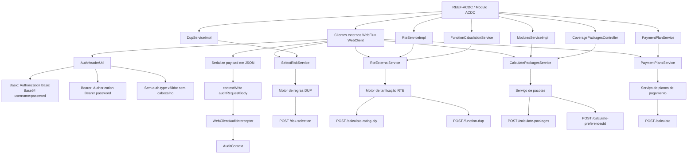

# REEF-ACDC — Clientes Externos via WebClient, Autenticação, Integrações e Auditoria

## 1. Metadados do Documento
- **Arquivo de Origem:** `EXTERNAL_CLIENTS` / nome físico do arquivo não identificado no conteúdo fornecido
- **Tipo de Documento:** Especificação Técnica
- **Domínio / Sistema:** REEF-ACDC; integração com DUP, RTE, pacotes de coberturas, planos de pagamento e auditoria
- **Público-Alvo:** Desenvolvedores, Arquitetos, Operação
- **Data/Versão Identificada:** Não identificada

---

## 2. Resumo Executivo & Contexto de Negócio

O documento descreve os clientes externos do backend REEF-ACDC implementados com WebFlux `WebClient`. Esses clientes conectam o módulo principal ACDC a serviços especializados responsáveis por seleção de risco no motor DUP, tarificação no motor RTE, cálculo de pacotes de cobertura e cálculo de planos de pagamento.

A implementação dos clientes externos segue um padrão uniforme: serialização do payload para JSON, chamada HTTP `POST` via `WebClient`, aplicação opcional de cabeçalho de autenticação, envio do corpo da requisição, tratamento específico de HTTP 422 quando aplicável, desserialização da resposta, injeção do payload no contexto Reactor para auditoria e execução bloqueante com `.block()`.

O mecanismo de autenticação é configurado por cliente por meio de propriedades `external.services.<cliente>.auth.*`. O utilitário `AuthHeaderUtil` suporta autenticação `Basic`, autenticação `Bearer` e ausência de cabeçalho de autenticação. Credenciais ausentes não provocam falha de configuração por si só: as propriedades possuem valor padrão vazio e, nesse caso, nenhuma cabecera de autenticação é adicionada.

O `SelectRiskService` é explicitamente identificado como o cliente mais importante do sistema, pois é invocado pelo `DupServiceImpl` em todos os passos do orquestrador: `PREVIOUS`, `VALIDATION` e `CT`. O documento também estabelece regras de resiliência funcionais: falhas no `PaymentPlansService` não interrompem o fluxo principal de cotização e resultam em `paymentPlans: []`.

A rastreabilidade das chamadas externas é suportada pela integração com o sistema de auditoria. Cada cliente injeta o corpo serializado no contexto Reactor, permitindo que `WebClientAuditInterceptor` capture requisição, resposta ou erro, URL, método, status e duração, registrando essas informações no `AuditContext` da thread atual.

---

## 3. Arquitetura, Componentes & Tecnologias Envolvidas

### Componentes identificados

| Componente | Responsabilidade descrita |
| :--- | :--- |
| `REEF-ACDC` | Backend e módulo principal ACDC que realiza chamadas para clientes externos. |
| WebFlux `WebClient` | Cliente HTTP utilizado por todos os clientes externos em modo bloqueante com `.block()`. |
| `AuthHeaderUtil` | Utilitário em `util/AuthHeaderUtil.java` que aplica autenticação por cliente. |
| `SelectRiskService` | Cliente do motor de regras DUP, usando `POST /risk-selection`. |
| `DupServiceImpl` | Serviço que chama `SelectRiskService` em cada passo do orquestrador: `PREVIOUS`, `VALIDATION` e `CT`. |
| Motor de regras DUP | Serviço externo de seleção de risco. |
| `RteExternalService` | Cliente do motor de tarificação RTE. |
| `RteServiceImpl` | Serviço que constrói payload e chama RTE durante o fluxo de orquestração. |
| `FunctionCalculationService` | Serviço que utiliza o endpoint RTE de cálculo de funções DUP individuais. |
| `CalculatePackagesService` | Cliente do serviço de cálculo de pacotes e preferências de coberturas. |
| `ModulesServiceImpl` | Serviço que usa `CalculatePackagesService` para calcular coberturas associadas a pacotes. |
| `CoveragePackagesController` | Controller que usa a obtenção de preferências disponíveis. |
| `PaymentPlansService` | Cliente de cálculo de planos de pagamento. |
| `PaymentPlanService` | Serviço que constrói `PricingPlyRequest` com planos `["001", "002"]`. |
| `TechnicalBasisController` | Controller citado como consumidor da configuração de bases técnicas do produto. |
| `WebClientAuditInterceptor` | Interceptor registrado como `ExchangeFilterFunction` em `WebClientConfig`. |
| `WebClientConfig` | Configuração na qual `WebClientAuditInterceptor` é registrado. |
| `AuditContext` | Contexto de auditoria da thread atual onde as informações de chamadas são registradas. |
| `AcdcError` | Corpo de erro parseado em respostas HTTP 422 tratadas explicitamente. |
| `AcdcException` | Exceção lançada após o parsing de `AcdcError` em respostas HTTP 422 tratadas. |
| `PlyValException` | Exceção capturada pelo orquestrador no tratamento de falhas de planos de pagamento. |

### Fluxo arquitetural consolidado



### Padrão comum de implementação

```text
1. Serializar o payload a JSON para auditoria.
2. Executar webClient.post().uri(url + "/endpoint").
3. Aplicar .headers(AuthHeaderUtil::applyAuthHeader).
4. Enviar .bodyValue(payload).
5. Executar .retrieve().
6. Quando configurado, tratar HTTP 422 parseando AcdcError e lançando AcdcException.
7. Consumir bodyToMono ou bodyToFlux.
8. Adicionar auditRequestBody no contexto Reactor.
9. Executar .block().
```

### Tratamento geral de erros

- Todos os clientes usam WebFlux `WebClient` com execução bloqueante por `.block()`.
- Clientes que tratam explicitamente HTTP 422 convertem o body de erro para `AcdcError` e lançam `AcdcException`.
- Outros erros HTTP, no caso de `SelectRiskService`, propagam a exceção do `WebClient`.
- `PaymentPlansService` não trata HTTP 422 explicitamente; a exceção é capturada pelo orquestrador como `PlyValException`.
- O documento informa que o endpoint de bases técnicas também não trata HTTP 422 explicitamente, mas não identifica de forma explícita o nome da classe cliente correspondente.

---

## 4. Regras de Negócio, Especificações Funcionais & Processos

### 4.1 Regra de chamada padronizada para clientes externos

Todos os clientes externos devem seguir o padrão documentado:

1. O payload deve ser serializado em JSON para fins de auditoria.
2. A chamada deve ser HTTP `POST`.
3. A URL deve ser formada a partir da propriedade de URL configurada para o serviço mais o endpoint correspondente.
4. O cabeçalho de autenticação deve ser aplicado por `AuthHeaderUtil::applyAuthHeader`.
5. O payload deve ser enviado com `.bodyValue(payload)`.
6. A resposta deve ser recuperada por `.retrieve()`.
7. A resposta deve ser transformada por `.bodyToMono()` ou `.bodyToFlux()`, conforme o contrato de retorno.
8. O JSON serializado deve ser adicionado ao contexto Reactor com a chave `auditRequestBody`.
9. A chamada deve terminar em `.block()`.

### 4.2 Regras de autenticação

| Condição | Resultado |
| :--- | :--- |
| `auth.type == "Basic"` | Gera `Authorization: Basic Base64(username:password)`. |
| `auth.type == "Bearer"` | Gera `Authorization: Bearer <password>`, sendo que `password` contém o token. |
| `auth.type` vazio | Nenhuma cabecera de autenticação é adicionada. |
| `auth.type` com valor diferente de `Basic` e `Bearer` | Nenhuma cabecera de autenticação é adicionada. |
| Credenciais não configuradas | Como as propriedades têm valor padrão vazio, nenhuma cabecera de autenticação é adicionada. |

### 4.3 Regras de negócio do `SelectRiskService`

- O `SelectRiskService` chama `POST {select-risk.url}/risk-selection`.
- O `SelectRiskService` é chamado pelo `DupServiceImpl`.
- A chamada ocorre em todos os passos do orquestrador: `PREVIOUS`, `VALIDATION` e `CT`.
- A requisição é `RiskSelectionRequest`.
- A resposta é `RiskSelectionResponse`.
- Em HTTP 422, o cliente deve parsear o body para `AcdcError` e lançar `AcdcException`.
- Em outros erros HTTP, o cliente propaga a exceção de `WebClient`.
- A resposta contém regras aplicadas e ações associadas, incluindo atributos como tipo de ação, campo e valor.

### 4.4 Regras de negócio do `RteExternalService`

#### Tarificação de apólice

- O método `callRte()` chama `POST {rte.url}/calculate-rating-ply`.
- O método é chamado a partir de `RteServiceImpl.sendToRteService()`.
- Durante o fluxo de orquestração, a chamada ocorre duas vezes por módulo: `RTE Flow #1` e `RTE Flow #2`.
- O payload é construído por `RteServiceImpl.buildPayload()`.
- O objeto `currentPolicy` recebe `oPlyPlyCPrev` da requisição.
- `oPlyPlyCPrev` representa a apólice anterior em cenários de suplemento e pode ser `null`.
- O objeto `newSupplement` recebe `oPlyPlyC` com as coberturas calculadas.
- A resposta é `OPlyPlyCDto`, contendo a apólice com primas calculadas e atributos atualizados pelo RTE.

#### Cálculo de funções DUP

- O método `callRteFunctionCalculation()` chama `POST {rte.url}/function-dup`.
- Esse endpoint é usado por `FunctionCalculationService`.
- O endpoint não integra o orquestrador batch.
- A finalidade é realizar cálculos pontuais de funções DUP individuais.
- A requisição é `CalculationDupRteFunctionRequest`.
- A resposta é `CalculationDupRteFunctionResponse`.

### 4.5 Regras de negócio do `CalculatePackagesService`

#### Cálculo de módulos e coberturas

- O método `callCalculatePackages()` chama `POST {coverage-packages.url}/calculate-packages`.
- `ModulesServiceImpl` usa esse método para calcular as coberturas correspondentes a cada pacote.
- A requisição é `PackagesRequest`.
- A resposta é `PackagesResponse`.
- A estrutura da resposta agrupa dados por riscos e preferências, sendo que cada preferência contém uma lista de coberturas.
- Em HTTP 422, o cliente lança `AcdcException`.

#### Obtenção de preferências

- O método `callObtainPackages()` chama `POST {coverage-packages.url}/calculate-preferencesId`.
- O endpoint retorna preferências disponíveis sem calcular coberturas concretas.
- `CoveragePackagesController` usa esse método.
- A requisição é `PackagesRequest`.
- A resposta é `List<ResponsePreferences>`.
- A desserialização usa `.bodyToFlux().collectList()`.

### 4.6 Regras de negócio do `PaymentPlansService`

- O `PaymentPlansService` chama `POST {payment-plans.url}/calculate`.
- A chamada só é realizada quando `executionType == "7"`.
- O valor `executionType == "7"` corresponde a cotização, conforme o documento.
- A requisição é `PricingPlyRequest`.
- `PaymentPlanService` constrói a requisição usando os planos `["001", "002"]`.
- A resposta é `List<PaymentPlan>`.
- A desserialização usa `.bodyToFlux().collectList()`.
- O cliente não trata HTTP 422 explicitamente.
- Qualquer erro é capturado no orquestrador usando `catch (PlyValException e)`.
- Falhas no cálculo de planos de pagamento não interrompem o fluxo principal.
- Quando ocorre uma falha, a resposta devolve `paymentPlans: []`.

### 4.7 Bases técnicas

- O conteúdo informa que um serviço de bases técnicas é usado por `TechnicalBasisController` e seus casos de uso.
- A funcionalidade é obter a configuração de bases técnicas do produto.
- Essa funcionalidade não faz parte do fluxo do orquestrador batch.
- A requisição é `TechnicalBasisQuery`.
- A resposta é `List<TechnicalBasisResponse>`.
- A desserialização usa `.bodyToFlux().collectList()`.
- HTTP 422 não é tratado explicitamente.

> **Nota de Análise:** O documento apresenta uma seção de bases técnicas após a seção `PaymentPlansService`, mas não informa de forma explícita o nome do cliente, arquivo Java, endpoint HTTP ou propriedade de configuração do serviço de bases técnicas.

### 4.8 Integração obrigatória com auditoria

1. Cada cliente serializa o payload de requisição.
2. Cada cliente adiciona o JSON serializado ao contexto Reactor:
   ```java
   .contextWrite(ctx -> ctx.put("auditRequestBody", requestBody))
   ```
3. `WebClientAuditInterceptor` intercepta a chamada.
4. O interceptor lê `auditRequestBody` do contexto Reactor.
5. O interceptor captura a resposta ou o erro.
6. O interceptor constrói um `WebClientCallInfo`.
7. `WebClientCallInfo` contém URL, método, corpos, status e duração.
8. A informação é registrada no `AuditContext` da thread atual.

---

## 5. Tabelas de Parâmetros, Ambientes e Estruturas de Dados

### 5.1 Clientes externos e propriedades

| Cliente | Serviço externo | Endpoint | Propriedade de configuração |
| :--- | :--- | :--- | :--- |
| `SelectRiskService` | Motor de regras DUP | `POST /risk-selection` | `external.services.select-risk.*` |
| `RteExternalService` | Motor de tarificação RTE | `POST /calculate-rating-ply` | `external.services.rte.*` |
| `RteExternalService` | Motor de tarificação RTE | `POST /function-dup` | `external.services.rte.*` |
| `CalculatePackagesService` | Serviço de pacotes | `POST /calculate-packages` | `external.services.coverage-packages.*` |
| `CalculatePackagesService` | Serviço de pacotes | `POST /calculate-preferencesId` | `external.services.coverage-packages.*` |
| `PaymentPlansService` | Planos de pagamento | `POST /calculate` | `external.services.payment-plans.*` |
| Cliente de bases técnicas não identificado | Configuração de bases técnicas do produto | Não identificado | Não identificada |

### 5.2 Configuração de autenticação

| Item / Parâmetro | Descrição / Função | Tipo / Valores / Formato | Ambiente / Observações |
| :--- | :--- | :--- | :--- |
| `auth.type` | Define a estratégia de autenticação por cliente externo. | `Basic`, `Bearer`, vazio ou outro valor. | Configurado sob `external.services.<cliente>.auth`. |
| `auth.username` | Usuário utilizado em autenticação Basic. | Texto. | Aplicável quando `auth.type: Basic`. |
| `auth.password` | Senha para Basic ou token para Bearer. | Texto. | No modo Bearer, o campo contém o token. |
| Basic | Gera cabeçalho HTTP Basic. | `Authorization: Basic Base64(username:password)` | Aplicável a `select-risk` e `payment-plans` no exemplo. |
| Bearer | Gera cabeçalho HTTP Bearer. | `Authorization: Bearer <password>` | Aplicável a `rte` no exemplo. |
| Sem autenticação | Nenhum cabeçalho de autorização. | `auth.type` vazio ou valor diferente de `Basic` e `Bearer`. | Aplicável a `coverage-packages` no exemplo. |

### 5.3 Exemplo documentado de ambientes e URLs

| Serviço / Item | URL / Valor | Autenticação | Observações |
| :--- | :--- | :--- | :--- |
| Portal REEF-ACDC Backend | `https://reef.acdc-dev.es.emea.aws.mapfre.net/acdc/docs-portal/index.html` | Não informado | URL apresentada no cabeçalho do conteúdo bruto. |
| `select-risk` | `http://dup-service:8080` | Basic; `username: user`, `password: secret` | Exemplo em `application-dev.yml`. |
| `rte` | `http://rte-service:8080` | Bearer; `password: eyJhbGciOiJSUzI1NiJ9...` | Exemplo em `application-dev.yml`; o valor exibido é truncado. |
| `coverage-packages` | `http://packages-service:8080` | Sem autenticação | Exemplo em `application-dev.yml`. |
| `payment-plans` | `http://payment-service:8080` | Basic; `username: app`, `password: pass` | Exemplo em `application-dev.yml`. |

### 5.4 Requisições, respostas e tratamento de erros

| Operação | Request | Response | Desserialização | Tratamento de erro documentado |
| :--- | :--- | :--- | :--- | :--- |
| Seleção de risco DUP | `RiskSelectionRequest` | `RiskSelectionResponse` | Não detalhada | HTTP 422: `AcdcError` para `AcdcException`; demais erros HTTP propagam erro de `WebClient`. |
| Tarificação de apólice RTE | Payload construído em `RteServiceImpl.buildPayload()` | `OPlyPlyCDto` | Não detalhada | Não detalhado especificamente. |
| Cálculo de funções DUP no RTE | `CalculationDupRteFunctionRequest` | `CalculationDupRteFunctionResponse` | Não detalhada | Não detalhado especificamente. |
| Cálculo de pacotes | `PackagesRequest` | `PackagesResponse` | Não detalhada | HTTP 422: `AcdcException`. |
| Obtenção de preferências | `PackagesRequest` | `List<ResponsePreferences>` | `.bodyToFlux().collectList()` | Não detalhado especificamente. |
| Planos de pagamento | `PricingPlyRequest` | `List<PaymentPlan>` | `.bodyToFlux().collectList()` | Sem tratamento explícito de HTTP 422; `PlyValException` é capturada pelo orquestrador. |
| Bases técnicas | `TechnicalBasisQuery` | `List<TechnicalBasisResponse>` | `.bodyToFlux().collectList()` | Sem tratamento explícito de HTTP 422. |

### 5.5 Estrutura documentada de `RiskSelectionResponse`

| Campo | Descrição / Função | Tipo / Valores / Formato | Ambiente / Observações |
| :--- | :--- | :--- | :--- |
| `appliedRules` | Lista de regras aplicadas pelo motor DUP. | Lista. | Cada elemento apresenta `ruleId` e `actions`. |
| `ruleId` | Identificador da regra aplicada. | Exemplo: `RULE_001`. | Retornado pelo motor DUP. |
| `actions` | Lista de ações associadas à regra aplicada. | Lista. | Exemplo de ação de atribuição. |
| `actions.type` | Tipo da ação. | Exemplo: `ASIGNACION`. | Valor apresentado no exemplo. |
| `actions.field` | Campo afetado pela ação. | Exemplo: `MCA_SEXO`. | Valor apresentado no exemplo. |
| `actions.value` | Valor atribuído pela ação. | Exemplo: `"1"`. | Valor apresentado no exemplo. |

### 5.6 Estrutura documentada de `PackagesResponse`

| Campo | Descrição / Função | Tipo / Valores / Formato | Ambiente / Observações |
| :--- | :--- | :--- | :--- |
| `risks` | Agrupamento de resultados por risco. | Objeto indexado por identificador de risco. | Exemplo apresenta a chave `"1"`. |
| `risks.<id>.risk` | Identificador numérico do risco. | Exemplo: `1`. | Apresentado no exemplo de resposta. |
| `risks.<id>.preferences` | Preferências disponíveis para o risco. | Objeto indexado por identificador de preferência. | Exemplo apresenta `"101"` e `"102"`. |
| `preferences.<id>.coverages` | Coberturas associadas à preferência. | Lista. | Conteúdo dos itens não detalhado. |

### 5.7 Dados de auditoria capturados

| Item / Parâmetro | Descrição / Função | Tipo / Valores / Formato | Ambiente / Observações |
| :--- | :--- | :--- | :--- |
| `auditRequestBody` | Chave no contexto Reactor com o JSON da requisição serializada. | String JSON no contexto Reactor. | Inserida antes do `.block()`. |
| `WebClientAuditInterceptor` | Intercepta chamadas WebClient. | `ExchangeFilterFunction`. | Registrado em `WebClientConfig`. |
| `WebClientCallInfo` | Registro consolidado da chamada externa. | Objeto de auditoria. | Contém URL, método, bodies, status e duração. |
| `AuditContext` | Contexto da thread atual para registro de auditoria. | Contexto de execução. | Recebe `WebClientCallInfo`. |

---

## 6. Bateria de Perguntas & Respostas para RAG (FAQ Sintético)

### P1: Qual padrão técnico todos os clientes externos do REEF-ACDC utilizam para executar chamadas HTTP?
**R:** Todos os clientes externos seguem um padrão baseado em WebFlux `WebClient`: serializam o payload para JSON, executam `webClient.post()` com URL e endpoint, aplicam `AuthHeaderUtil::applyAuthHeader`, enviam o corpo com `.bodyValue(payload)`, recuperam a resposta com `.retrieve()`, convertem o body com `bodyToMono` ou `bodyToFlux`, adicionam o JSON ao contexto Reactor na chave `auditRequestBody` e finalizam de forma bloqueante com `.block()`.

### P2: Como o REEF-ACDC configura autenticação Basic, Bearer e ausência de autenticação para serviços externos?
**R:** A autenticação é configurada por cliente usando `auth.type`. Com `auth.type: Basic`, é gerado `Authorization: Basic Base64(username:password)`. Com `auth.type: Bearer`, é gerado `Authorization: Bearer <password>`, em que `password` contém o token. Quando `auth.type` está vazio ou possui outro valor, nenhuma cabecera de autenticação é adicionada. As credenciais possuem valor padrão vazio; por isso, credenciais não configuradas também resultam na ausência de cabeçalho de autenticação.

### P3: Qual serviço externo é chamado durante todos os passos do orquestrador DUP?
**R:** O `SelectRiskService` é chamado por `DupServiceImpl` em todos os passos do orquestrador: `PREVIOUS`, `VALIDATION` e `CT`. O cliente executa `POST {select-risk.url}/risk-selection` no motor de regras DUP, enviando `RiskSelectionRequest` e recebendo `RiskSelectionResponse`.

### P4: Como o `SelectRiskService` trata respostas HTTP 422?
**R:** Quando o motor de regras DUP responde HTTP 422, o `SelectRiskService` parseia o body como `AcdcError` e lança `AcdcException`. Para outros erros HTTP, a exceção de `WebClient` é propagada.

### P5: Quais endpoints o `RteExternalService` expõe e quais são suas finalidades?
**R:** O `RteExternalService` expõe `POST {rte.url}/calculate-rating-ply`, utilizado por `RteServiceImpl.sendToRteService()` para tarificação da apólice durante o fluxo de orquestração, e `POST {rte.url}/function-dup`, utilizado por `FunctionCalculationService` para cálculos pontuais de funções DUP individuais fora do orquestrador batch.

### P6: Como é estruturado o payload enviado ao RTE para tarificação de apólice?
**R:** O payload é construído em `RteServiceImpl.buildPayload()` e contém `requestInfo`, `currentPolicy` e `newSupplement`. `currentPolicy` contém `oPlyPlyCPrev`, que representa a apólice atual ou anterior em suplementos e pode ser `null`. `newSupplement` contém `oPlyPlyC` com as coberturas calculadas. A resposta do RTE é `OPlyPlyCDto`, com primas calculadas e atributos atualizados.

### P7: Qual a diferença entre `callCalculatePackages()` e `callObtainPackages()`?
**R:** `callCalculatePackages()` chama `POST {coverage-packages.url}/calculate-packages` e é usado por `ModulesServiceImpl` para calcular quais coberturas correspondem a cada pacote. Retorna `PackagesResponse` e trata HTTP 422 lançando `AcdcException`. `callObtainPackages()` chama `POST {coverage-packages.url}/calculate-preferencesId`, retorna somente a lista de preferências disponíveis sem calcular coberturas concretas, é usado por `CoveragePackagesController` e devolve `List<ResponsePreferences>` por `.bodyToFlux().collectList()`.

### P8: Em qual condição o `PaymentPlansService` é executado?
**R:** O `PaymentPlansService` só é invocado quando `executionType == "7"`, condição identificada no documento como cotização. A chamada usa `POST {payment-plans.url}/calculate`, recebe `PricingPlyRequest` construído por `PaymentPlanService` com os planos `["001", "002"]` e retorna `List<PaymentPlan>`.

### P9: O que ocorre se o cálculo de planos de pagamento falhar?
**R:** Uma falha no `PaymentPlansService` não interrompe o fluxo principal. O cliente não possui tratamento explícito para HTTP 422; a exceção é capturada no orquestrador com `catch (PlyValException e)`, e a resposta retorna `paymentPlans: []`.

### P10: Como as chamadas de clientes externos são auditadas no REEF-ACDC?
**R:** Antes de `.block()`, cada cliente adiciona o corpo serializado da requisição ao contexto Reactor usando `.contextWrite(ctx -> ctx.put("auditRequestBody", requestBody))`. O `WebClientAuditInterceptor`, registrado como `ExchangeFilterFunction` em `WebClientConfig`, lê esse valor, captura a resposta ou o erro, constrói `WebClientCallInfo` com URL, método, corpos, status e duração e registra o resultado no `AuditContext` da thread atual.

### P11: Quais informações são conhecidas sobre a integração de bases técnicas?
**R:** A integração de bases técnicas é usada por `TechnicalBasisController` e seus casos de uso para obter a configuração de bases técnicas do produto. Não faz parte do fluxo do orquestrador batch, recebe `TechnicalBasisQuery`, retorna `List<TechnicalBasisResponse` por `.bodyToFlux().collectList()` e não trata HTTP 422 explicitamente. O documento não identifica o nome do cliente, o endpoint ou a propriedade de configuração correspondente.

---

## 7. Glossário de Termos, Siglas & Conceitos-Chave

- **ACDC:** Módulo principal do sistema REEF-ACDC, conforme a estrutura de documentação apresentada.
- **AcdcError:** Estrutura de erro que é parseada do body em respostas HTTP 422 tratadas explicitamente.
- **AcdcException:** Exceção lançada após o parsing de `AcdcError` em determinados clientes externos.
- **AuditContext:** Contexto da thread atual que recebe registros de chamadas WebClient auditadas.
- **Bearer:** Tipo de autenticação HTTP que gera `Authorization: Bearer <password>`, com token armazenado no campo `password`.
- **Basic:** Tipo de autenticação HTTP que gera `Authorization: Basic Base64(username:password)`.
- **DUP:** Motor de regras citado para seleção de risco e funções DUP.
- **ExchangeFilterFunction:** Tipo de filtro WebClient associado ao `WebClientAuditInterceptor`.
- **HTTP 422:** Código de status tratado explicitamente por alguns clientes para converter `AcdcError` em `AcdcException`.
- **OPlyPlyCDto:** DTO de apólice retornado pelo RTE com primas calculadas e atributos atualizados.
- **PlyValException:** Exceção capturada pelo orquestrador em falhas de cálculo de planos de pagamento.
- **RAG:** Retrieval-Augmented Generation; contexto de uso deste artefato como fonte de conhecimento estruturada.
- **REEF-ACDC:** Backend e domínio documental que contém o módulo ACDC e seus clientes externos.
- **RTE:** Motor de tarificação utilizado para calcular tarificação de apólices e funções DUP.
- **WebClient:** Cliente HTTP WebFlux empregado pelos clientes externos.
- **WebClientAuditInterceptor:** Interceptor WebClient responsável por capturar dados de chamadas externas para auditoria.
- **WebClientCallInfo:** Objeto de auditoria construído com URL, método, bodies, status e duração.
- **WebFlux:** Tecnologia de programação reativa utilizada pelo `WebClient`.
- **`auditRequestBody`:** Chave no contexto Reactor usada para armazenar o JSON serializado do payload de requisição.
- **`bodyToFlux().collectList()`:** Operação utilizada para materializar respostas reativas em listas.
- **`contextWrite`:** Operação Reactor usada para incluir `auditRequestBody` no contexto.
- **`.block()`:** Operação que executa de forma bloqueante a chamada WebClient documentada.
- **`executionType == "7"`:** Condição que identifica cotização e habilita a chamada ao `PaymentPlansService`.

---

## 8. Notas Críticas, Riscos & Limitações

- Todos os clientes utilizam WebFlux `WebClient` em modo bloqueante com `.block()`. O documento confirma o comportamento, mas não apresenta justificativa arquitetural, impacto de capacidade ou estratégia de isolamento para chamadas bloqueantes.
- O comportamento de HTTP 422 não é uniformemente detalhado para todos os clientes. `SelectRiskService` e `CalculatePackagesService` têm tratamento explícito descrito; `PaymentPlansService` e a integração de bases técnicas não o têm.
- Credenciais ausentes resultam na não inclusão de cabeçalho de autenticação. Isso reduz falhas de configuração imediatas, mas pode deslocar a detecção do problema para o serviço externo.
- O token Bearer é armazenado na propriedade `password`. Essa convenção deve ser considerada ao configurar e revisar propriedades de autenticação.
- Falhas de `PaymentPlansService` não interrompem a cotização e retornam `paymentPlans: []`. Esse comportamento mantém o fluxo principal, porém consumidores devem considerar que uma lista vazia pode representar falha de integração, não apenas inexistência de planos.
- O documento apresenta a integração de bases técnicas sem identificar claramente cliente, arquivo Java, endpoint HTTP ou propriedade de configuração.
- O detalhamento do contrato de `RiskSelectionRequest` é delegado a `DUP_ENGINE.md §8`; o mapeamento completo não está presente no conteúdo fornecido.
- Os contratos internos completos de `PackagesRequest`, `PackagesResponse`, `PricingPlyRequest`, `PaymentPlan`, `TechnicalBasisQuery` e `TechnicalBasisResponse` não são detalhados além das informações apresentadas.
- A URL do token Bearer e exemplos de usuários e senhas aparecem apenas como exemplos de configuração em `application-dev.yml`; não há confirmação de que representem valores operacionais reais.
- O documento cita `AUDIT.md` para o detalhe completo da auditoria, mas esse conteúdo não foi fornecido nesta extração.

---

## 9. Conteúdo Bruto Estruturado (Referência Fiel)

```text
# Clientes externos

Clientes externos


# [REEF-ACDC Backend](https://reef.acdc-dev.es.emea.aws.mapfre.net/acdc/docs-portal/index.html)

* **Inicio**
  + [Documentación general](#/README "Documentación general")* **ACDC — Módulo principal**
    + [Endpoints Online](#/ACDC/ENDPOINTS_ONLINE "Endpoints Online")+ [Orquestador Batch](#/ACDC/ENDPOINT_BATCH_ORCHESTATOR "Orquestador Batch")+ [Cotizaciones](#/ACDC/COTIZACIONES "Cotizaciones")+ [Clientes externos](#/ACDC/EXTERNAL_CLIENTS "Clientes externos")
            - [Índice](#/ACDC/EXTERNAL_CLIENTS?id=%c3%8dndice "Índice")- [1. Patrón común](#/ACDC/EXTERNAL_CLIENTS?id=_1-patr%c3%b3n-com%c3%ban "1. Patrón común")- [2. Configuración de autenticación](#/ACDC/EXTERNAL_CLIENTS?id=_2-configuraci%c3%b3n-de-autenticaci%c3%b3n "2. Configuración de autenticación")- [3. Tabla de clientes](#/ACDC/EXTERNAL_CLIENTS?id=_3-tabla-de-clientes "3. Tabla de clientes")- [4. `SelectRiskService` — Motor de reglas DUP](#/ACDC/EXTERNAL_CLIENTS?id=_4-selectriskservice-motor-de-reglas-dup "4. SelectRiskService — Motor de reglas DUP")- [5. `RteExternalService` — Tarificación](#/ACDC/EXTERNAL_CLIENTS?id=_5-rteexternalservice-tarificaci%c3%b3n "5. RteExternalService — Tarificación")- [6. `CalculatePackagesService` — Paquetes de coberturas](#/ACDC/EXTERNAL_CLIENTS?id=_6-calculatepackagesservice-paquetes-de-coberturas "6. CalculatePackagesService — Paquetes de coberturas")- [7. `PaymentPlansService` — Planes de pago](#/ACDC/EXTERNAL_CLIENTS?id=_7-paymentplansservice-planes-de-pago "7. PaymentPlansService — Planes de pago")- [9. Integración con la auditoría](#/ACDC/EXTERNAL_CLIENTS?id=_9-integraci%c3%b3n-con-la-auditor%c3%ada "9. Integración con la auditoría")+ [Auditoría](#/ACDC/AUDIT "Auditoría")+ [Seguridad](#/ACDC/SECURITY "Seguridad")* **DUP — Motor de reglas**
      + [DUP Engine](#/DUP/DUP_ENGINE "DUP Engine")+ [Módulo DUP](#/DUP/README_DUP_MODULE "Módulo DUP")* **Módulos**
        + [Cálculo de Módulos](#/MODULOS/MODULES_SERVICE "Cálculo de Módulos")* **RTE — Tarificación**
          + [Configuración de tarifas](#/RTE/RTE_TARIFF_CONFIGURATION "Configuración de tarifas")

# [Clientes externos (WebClient)](#/ACDC/EXTERNAL_CLIENTS?id=clientes-externos-webclient)

> 📚 Parte de la documentación de `REEF-ACDC` · [← Índice general](#/../README)

**Relacionado con:** [DUP\_ENGINE.md](#/../DUP/DUP_ENGINE) · [AUDIT.md](#/AUDIT)

---

## [Índice](#/ACDC/EXTERNAL_CLIENTS?id=%c3%8dndice)

1. [Patrón común](#/ACDC/EXTERNAL_CLIENTS?id=1-patr%c3%b3n-com%c3%ban)- [Configuración de autenticación](#/ACDC/EXTERNAL_CLIENTS?id=2-configuraci%c3%b3n-de-autenticaci%c3%b3n)- [Tabla de clientes](#/ACDC/EXTERNAL_CLIENTS?id=3-tabla-de-clientes)- [SelectRiskService — Motor de reglas DUP](#/ACDC/EXTERNAL_CLIENTS?id=4-selectriskservice--motor-de-reglas-dup)- [RteExternalService — Tarificación](#/ACDC/EXTERNAL_CLIENTS?id=5-rteexternalservice--tarificaci%c3%b3n)- [CalculatePackagesService — Paquetes de coberturas](#/ACDC/EXTERNAL_CLIENTS?id=6-calculatepackagesservice--paquetes-de-coberturas)- [PaymentPlansService — Planes de pago](#/ACDC/EXTERNAL_CLIENTS?id=7-paymentplansservice--planes-de-pago)- [TechnicalsBasisService — Bases técnicas](#/ACDC/EXTERNAL_CLIENTS?id=8-technicalssbasisservice--bases-t%c3%a9cnicas)- [Integración con la auditoría](#/ACDC/EXTERNAL_CLIENTS?id=9-integraci%c3%b3n-con-la-auditor%c3%ada)

---

## [1. Patrón común](#/ACDC/EXTERNAL_CLIENTS?id=_1-patr%c3%b3n-com%c3%ban)

Todos los clientes externos siguen el mismo patrón de implementación:

```
1. Serializar el payload a JSON (para auditoría)
2. webClient.post().uri(url + "/endpoint")
3.   .headers(AuthHeaderUtil::applyAuthHeader)
4.   .bodyValue(payload)
5.   .retrieve()
6.   .onStatus(422, parsear AcdcError y lanzar AcdcException)
7.   .bodyToMono / bodyToFlux
8.   .contextWrite(ctx -> ctx.put("auditRequestBody", requestBody))  ← para auditoría
9.   .block()
```

**Puntos clave:**

* Todos usan **WebFlux `WebClient`** en modo bloqueante (`.block()`).* El manejo de **HTTP 422** es uniforme: se parsea el body como `AcdcError` y se lanza `AcdcException`.* El `requestBody` serializado se inyecta en el contexto reactor para que `WebClientAuditInterceptor` lo capture. Ver [AUDIT.md](#/AUDIT).* Las credenciales se leen de propiedades con valor por defecto vacío, por lo que **si no se configuran, no se añade cabecera de auth**.

---

## [2. Configuración de autenticación](#/ACDC/EXTERNAL_CLIENTS?id=_2-configuraci%c3%b3n-de-autenticaci%c3%b3n)

**Fichero:** `util/AuthHeaderUtil.java`

El tipo de autenticación se configura por cliente con la propiedad `auth.type`:

| Valor de `auth.type` | Cabecera generada |
| --- | --- |
| `Basic` | `Authorization: Basic Base64(username:password)` |
| `Bearer` | `Authorization: Bearer <password>` (el campo `password` contiene el token) |
| vacío / cualquier otro | Sin cabecera de autenticación |

**Ejemplo de configuración en `application-dev.yml`:**

```
external:
  services:
    select-risk:
      url: http://dup-service:8080
      auth:
        type: Basic
        username: user
        password: secret
    rte:
      url: http://rte-service:8080
      auth:
        type: Bearer
        password: eyJhbGciOiJSUzI1NiJ9...
    coverage-packages:
      url: http://packages-service:8080
      auth:
        type:          # sin autenticación
    payment-plans:
      url: http://payment-service:8080
      auth:
        type: Basic
        username: app
        password: pass
```

---

## [3. Tabla de clientes](#/ACDC/EXTERNAL_CLIENTS?id=_3-tabla-de-clientes)

| Cliente | Servicio externo | Endpoints | Propiedad de configuración |
| --- | --- | --- | --- |
| `SelectRiskService` | Motor de reglas DUP | `POST /risk-selection` | `external.services.select-risk.*` |
| `RteExternalService` | Motor de tarificación RTE | `POST /calculate-rating-ply` · `POST /function-dup` | `external.services.rte.*` |
| `CalculatePackagesService` | Servicio de paquetes | `POST /calculate-packages` · `POST /calculate-preferencesId` | `external.services.coverage-packages.*` |
| `PaymentPlansService` | Planes de pago | `POST /calculate` | `external.services.payment-plans.*` |

---

## [4. `SelectRiskService` — Motor de reglas DUP](#/ACDC/EXTERNAL_CLIENTS?id=_4-selectriskservice-motor-de-reglas-dup)

**Fichero:** `external/client/SelectRiskService.java`  
**Endpoint:** `POST {select-risk.url}/risk-selection`

Es el cliente más importante del sistema. Lo llama `DupServiceImpl` en **cada paso** del orquestador (PREVIOUS, VALIDATION y CT).

**Request:** `RiskSelectionRequest` — ver [DUP\_ENGINE.md §8](#/../DUP/DUP_ENGINE?id=8-mapeo-completo-oplyzplyczdto--riskselectionrequest) para el detalle completo del mapeo.

**Response:** `RiskSelectionResponse`

```
{
  "appliedRules": [
    {
      "ruleId": "RULE_001",
      "actions": [
        { "type": "ASIGNACION", "field": "MCA_SEXO", "value": "1" }
      ]
    }
  ]
}
```

**Comportamiento ante errores:**

* **HTTP 422** → parsea `AcdcError` del body y lanza `AcdcException` (error de negocio del motor de reglas).* **Otros errores HTTP** → propaga la excepción de WebClient.

---

## [5. `RteExternalService` — Tarificación](#/ACDC/EXTERNAL_CLIENTS?id=_5-rteexternalservice-tarificaci%c3%b3n)

**Fichero:** `external/client/RteExternalService.java`

Expone dos endpoints:

### [`callRte()` — Tarificación de póliza](#/ACDC/EXTERNAL_CLIENTS?id=callrte-tarificaci%c3%b3n-de-p%c3%b3liza)

**Endpoint:** `POST {rte.url}/calculate-rating-ply`

Se llama desde `RteServiceImpl.sendToRteService()` durante el flujo de orquestación (dos veces por módulo: `RTE Flow #1` y `RTE Flow #2`).

**Payload construido en `RteServiceImpl.buildPayload()`:**

```
{
  "requestInfo": { ... },
  "currentPolicy": {
    "oPlyPlyC": { /* OPlyPlyCDto póliza actual/previa */ }
  },
  "newSupplement": {
    "oPlyPlyC": { /* OPlyPlyCDto nuevo suplemento */ }
  }
}
```

* `currentPolicy` → `oPlyPlyCPrev` de la request (póliza previa, para suplementos). Puede ser `null`.* `newSupplement` → `oPlyPlyC` con las coberturas calculadas.

**Response:** `OPlyPlyCDto` — la póliza con primas calculadas y atributos actualizados por RTE.

### [`callRteFunctionCalculation()` — Cálculo de funciones](#/ACDC/EXTERNAL_CLIENTS?id=callrtefunctioncalculation-c%c3%a1lculo-de-funciones)

**Endpoint:** `POST {rte.url}/function-dup`

Utilizado desde `FunctionCalculationService` (no desde el orquestador batch) para cálculos puntuales de funciones DUP individuales.

**Request:** `CalculationDupRteFunctionRequest`  
**Response:** `CalculationDupRteFunctionResponse`

---

## [6. `CalculatePackagesService` — Paquetes de coberturas](#/ACDC/EXTERNAL_CLIENTS?id=_6-calculatepackagesservice-paquetes-de-coberturas)

**Fichero:** `external/client/CalculatePackagesService.java`

### [`callCalculatePackages()` — Cálculo de módulos](#/ACDC/EXTERNAL_CLIENTS?id=callcalculatepackages-c%c3%a1lculo-de-m%c3%b3dulos)

**Endpoint:** `POST {coverage-packages.url}/calculate-packages`

Usado por `ModulesServiceImpl` para calcular qué coberturas corresponden a cada paquete.

**Request:** `PackagesRequest`  
**Response:** `PackagesResponse`

```
{
  "risks": {
    "1": {
      "risk": 1,
      "preferences": {
        "101": { "coverages": [ ... ] },
        "102": { "coverages": [ ... ] }
      }
    }
  }
}
```

**Comportamiento ante HTTP 422** → `AcdcException`.

### [`callObtainPackages()` — Obtener preferencias](#/ACDC/EXTERNAL_CLIENTS?id=callobtainpackages-obtener-preferencias)

**Endpoint:** `POST {coverage-packages.url}/calculate-preferencesId`

Devuelve la lista de preferencias disponibles sin calcular coberturas concretas. Usado por `CoveragePackagesController`.

**Request:** `PackagesRequest`  
**Response:** `List<ResponsePreferences>` (usando `.bodyToFlux().collectList()`)

---

## [7. `PaymentPlansService` — Planes de pago](#/ACDC/EXTERNAL_CLIENTS?id=_7-paymentplansservice-planes-de-pago)

**Fichero:** `external/client/PaymentPlansService.java`  
**Endpoint:** `POST {payment-plans.url}/calculate`

Solo se invoca si `executionType == "7"` (cotización). Un fallo en este cliente **no interrumpe** el flujo principal — la excepción se captura en el orquestador y se devuelve `paymentPlans: []`.

**Request:** `PricingPlyRequest` (construido por `PaymentPlanService` con los planes `["001", "002"]`)  
**Response:** `List<PaymentPlan>` (usando `.bodyToFlux().collectList()`)
> No maneja HTTP 422 explícitamente — cualquier error se captura en el orquestador con `catch (PlyValException e)`.

---

Usado por `TechnicalBasisController` y sus casos de uso para obtener la configuración de bases técnicas del producto (no forma parte del flujo del orquestador batch).

**Request:** `TechnicalBasisQuery`  
**Response:** `List<TechnicalBasisResponse>` (usando `.bodyToFlux().collectList()`)
> No maneja HTTP 422 explícitamente.

---

## [9. Integración con la auditoría](#/ACDC/EXTERNAL_CLIENTS?id=_9-integraci%c3%b3n-con-la-auditor%c3%ada)

Todos los clientes inyectan el body serializado en el contexto reactor antes del `.block()`:

```
.contextWrite(ctx -> ctx.put("auditRequestBody", requestBody))
```

El `WebClientAuditInterceptor` (registrado como `ExchangeFilterFunction` en `WebClientConfig`) intercepta cada llamada y:

1. Lee `auditRequestBody` del contexto reactor.- Captura la respuesta (o el error).- Construye un `WebClientCallInfo` con URL, método, bodies, status y duración.- Lo registra en el `AuditContext` del hilo actual.

Ver [AUDIT.md](#/AUDIT) para el detalle completo del sistema de auditoría.
```
