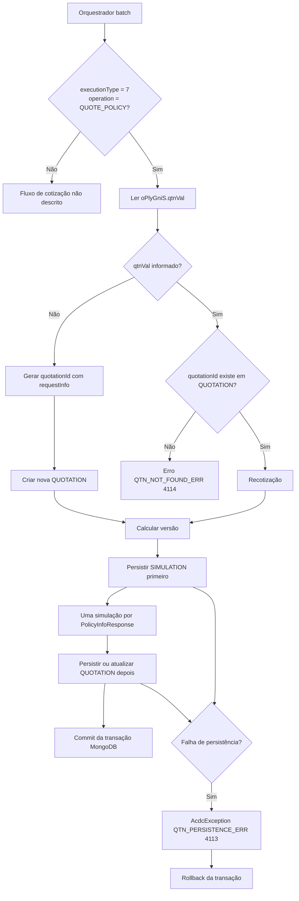

# Cotizações (Quotation) — Persistência, Versionamento e Consulta no REEF-ACDC Backend

## 1. Metadados do Documento
- **Arquivo de Origem:** `Cotizaciones` (conteúdo bruto fornecido na solicitação)
- **Tipo de Documento:** Especificação Técnica
- **Domínio / Sistema:** REEF-ACDC Backend — módulo principal ACDC, módulo de cotizações
- **Público-Alvo:** Desenvolvedores, Arquitetos, Operação
- **Data/Versão Identificada:** Não identificada

---

## 2. Resumo Executivo & Contexto de Negócio

O módulo de cotizações do REEF-ACDC persiste o resultado produzido pelo orquestrador batch quando a operação recebida é uma cotização. A condição explícita para esse comportamento é `executionType = "7"` e `operation = QUOTE_POLICY`.

A persistência utiliza MongoDB e distribui as informações entre duas coleções: `QUOTATION`, que representa a cabeceira da cotização e controla sua última versão, e `SIMULATION`, que armazena uma entrada para cada simulação recalculada. A modelagem permite manter o histórico de versões das simulações vinculadas a uma mesma cotização.

O identificador `quotationId` é extraído do campo `oPlyGniS.qtnVal` da apólice de entrada. Quando esse valor não é informado, o sistema trata a solicitação como uma nova cotização e gera o identificador a partir de dados de `requestInfo` do orquestrador. Quando o valor é informado e já existe no banco de dados, a operação é uma recotização com nova versão. Quando o valor é informado, mas não existe no banco, o processo falha com o erro `QTN_NOT_FOUND_ERR (4114)`.

A operação de persistência é transacional por meio de `ExecuteOrchestratorUsecase.executeOrchestration(...)`, anotado com `@Transactional`, utilizando o bean `MongoTransactionManager` registrado em `MongoConfig`. A transação requer MongoDB configurado como réplica ou `mongos`; qualquer falha de gravação provoca rollback e gera `AcdcException` com o código `QTN_PERSISTENCE_ERR (4113)`.

---

## 3. Arquitetura, Componentes & Tecnologias Envolvidas

### Componentes e elementos identificados

| Componente / Tecnologia | Papel identificado no documento |
| :--- | :--- |
| `REEF-ACDC` | Sistema cuja documentação contém o módulo de cotizações. |
| ACDC | Módulo principal da documentação REEF-ACDC. |
| Orquestrador batch | Produz o resultado que será persistido quando a operação for `QUOTE_POLICY`. |
| `ExecuteOrchestratorUsecase.executeOrchestration(...)` | Método responsável pela execução da orquestração; possui anotação `@Transactional`. |
| MongoDB | Banco de dados utilizado para persistir `QUOTATION` e `SIMULATION`. |
| `MongoTransactionManager` | Gerenciador de transações MongoDB utilizado pelo processo. |
| `MongoConfig` | Configuração onde o bean `MongoTransactionManager` está registrado. |
| `QUOTATION` | Coleção MongoDB da cabeceira de cotização. |
| `SIMULATION` | Coleção MongoDB com simulações recalculadas por cotização e versão. |
| `PackagesMapper.getDefaultFixedValues` | Origem de `fixedValues` na criação de uma nova cotização. |
| `OPlyGniS` | Dados gerais da apólice persistidos na criação de `QUOTATION`. |
| `OPlyIneS` | Tomador, identificado como o primeiro interveniente, persistido na criação de `QUOTATION`. |
| `OPlyPlyCDto` | Representação da apólice calculada completa armazenada em `SIMULATION`. |
| `PolicyInfoResponse` | Fonte para a criação de uma simulação por item retornado. |
| `GET /acdc/quotations/{quotationId}?version={n}` | Endpoint de leitura de cotizações. |

### Fluxo de persistência de cotizações



### Fluxo de consulta de cotizações

```mermaid
graph TD
  A[GET /acdc/quotations/{quotationId}?version={n}] --> B{QUOTATION existe?}
  B -- Não --> C[Retornar quotationId e simulations: []]
  B -- Sim --> D{version foi informada?}
  D -- Não --> E[Usar lastVersion]
  D -- Sim --> F[Usar versão solicitada]
  E --> G[Para cada numSimulation]
  F --> G
  G --> H[Retornar SIMULATION com maior versão menor ou igual à solicitada]
```

> **Nota de Análise:** O documento não descreve métodos HTTP adicionais, contratos JSON completos, autenticação do endpoint ou detalhes de infraestrutura além da exigência de MongoDB em réplica ou `mongos`.

---

## 4. Regras de Negócio, Especificações Funcionais & Processos

### 4.1 Condição de ativação da persistência

O módulo persiste o resultado do orquestrador batch exclusivamente quando os seguintes valores são atendidos:

- `executionType = "7"`
- `operation = QUOTE_POLICY`

### 4.2 Resolução de `quotationId`

O valor de `quotationId` é lido do campo `oPlyGniS.qtnVal` presente na apólice de entrada.

| Situação de `qtnVal` | Comportamento |
| :--- | :--- |
| `qtnVal` ausente | A solicitação é uma nova cotização. O sistema gera um `quotationId` e cria um documento `QUOTATION` com `holder`, `oPlyGniS` e `fixedValues` extraídos da apólice. |
| `qtnVal` informado e existente no banco de dados | A solicitação é uma recotização. Uma nova versão da cotização existente é persistida. |
| `qtnVal` informado e inexistente no banco de dados | O processamento falha com `QTN_NOT_FOUND_ERR (4114)`. |

### 4.3 Fórmula de geração de `quotationId`

Para novas cotizações, o `quotationId` é gerado sem espaços com a seguinte composição:

```text
companyId + branchId + productId + yyyyMMddHHmmss + countryId
```

A origem dos campos é `requestInfo` do orquestrador.

Exemplo documentado:

```text
10120130120260807153045ES
```

### 4.4 Persistência transacional

O método `ExecuteOrchestratorUsecase.executeOrchestration(...)` possui anotação `@Transactional` e utiliza o bean `MongoTransactionManager`, registrado em `MongoConfig`.

A transação MongoDB exige uma instalação MongoDB em réplica ou um ambiente com `mongos`.

Se qualquer gravação falhar:

1. É lançada uma `AcdcException`.
2. O código utilizado é `QTN_PERSISTENCE_ERR (4113)`.
3. A transação executa rollback.

### 4.5 Ordem de gravação

A ordem de persistência é obrigatória:

1. Persistir as simulações na coleção `SIMULATION`.
2. Criar ou atualizar a cotização na coleção `QUOTATION`.

#### Regras para `SIMULATION`

- Deve existir uma simulação para cada `PolicyInfoResponse`.
- `numSimulation` deve ser sequencial, de `1` até `N`.
- `version` deve ser igual a `lastVersion + 1`.
- Para uma cotização nova, `version` deve ser `1`.
- Não existe “arrastre”: somente as simulações recalculadas são gravadas.

#### Regras para nova `QUOTATION`

Na criação de uma cotização, o documento `QUOTATION` recebe:

- `oPlyGniS`
- `holder`, identificado como `oPlyIneS`
- `fixedValues`, obtido por `PackagesMapper.getDefaultFixedValues`

#### Regras para recotização

Na recotização, somente os seguintes campos de `QUOTATION` são atualizados:

- `lastVersion`
- `lastUpdateDate`

Os seguintes dados são estáveis e nunca são atualizados em recotizações:

- `oPlyGniS`
- `oPlyIneS`
- `fixedValues`

### 4.6 Proteção de concorrência

A coleção `SIMULATION` possui índice único composto por:

```text
(quotationId, numSimulation, version)
```

Esse índice rejeita colisões. A versão é calculada dentro da transação por meio da releitura de `lastVersion` em `QUOTATION`. Esse procedimento assegura o uso do número correto caso outra requisição seja processada antes.

### 4.7 Consulta de cotizações

O endpoint de leitura é:

```text
GET /acdc/quotations/{quotationId}?version={n}
```

Regras de resposta:

- Se a cotização não existir, a resposta devolve `quotationId` e `simulations: []`.
- Se `version` não for informado, a consulta utiliza `lastVersion`.
- Para cada `numSimulation`, a consulta devolve o documento com a maior versão menor ou igual à versão solicitada.

---

## 5. Tabelas de Parâmetros, Ambientes e Estruturas de Dados

### 5.1 Condições de operação

| Item / Parâmetro | Descrição / Função | Tipo / Valores / Formato | Ambiente / Observações |
| :--- | :--- | :--- | :--- |
| `executionType` | Define o tipo de execução que ativa a persistência de cotizações. | String: `"7"` | Deve ocorrer em conjunto com `operation = QUOTE_POLICY`. |
| `operation` | Define a operação processada pelo orquestrador batch. | `QUOTE_POLICY` | Deve ocorrer em conjunto com `executionType = "7"`. |
| `oPlyGniS.qtnVal` | Campo de entrada utilizado para resolver o `quotationId`. | Valor informado ou ausente | Ausente gera nova cotização; informado exige existência prévia em banco. |
| `quotationId` | Identificador único da cotização. | String | Gerado para novas cotizações ou reutilizado em recotizações. |
| `version` | Versão a consultar no endpoint. | Inteiro `n` | Quando omitido, a consulta usa `lastVersion`. |
| `numSimulation` | Número da simulação dentro da versão. | Inteiro sequencial `1..N` | Uma entrada por `PolicyInfoResponse`. |

### 5.2 Composição do `quotationId`

| Item / Parâmetro | Descrição / Função | Tipo / Valores / Formato | Ambiente / Observações |
| :--- | :--- | :--- | :--- |
| `companyId` | Parte do identificador da cotização. | Não detalhado | Proveniente de `requestInfo`. |
| `branchId` | Parte do identificador da cotização. | Não detalhado | Proveniente de `requestInfo`. |
| `productId` | Parte do identificador da cotização. | Não detalhado | Proveniente de `requestInfo`. |
| `yyyyMMddHHmmss` | Componente temporal do identificador. | Formato de data e hora | Integrado sem espaços ao `quotationId`. |
| `countryId` | Parte do identificador da cotização. | Não detalhado | Proveniente de `requestInfo`. |
| Fórmula completa | Geração do identificador de uma nova cotização. | `companyId + branchId + productId + yyyyMMddHHmmss + countryId` | Sem espaços. |

### 5.3 Estrutura da coleção `QUOTATION`

| Item / Parâmetro | Descrição / Função | Tipo / Valores / Formato | Ambiente / Observações |
| :--- | :--- | :--- | :--- |
| `quotationId` | Identificador único da cotização. | `String` | Possui índice único. |
| `lastVersion` | Última versão persistida. | `Integer` | Atualizado em recotizações. |
| `oPlyGniS` | Dados gerais da apólice. | `OPlyGniS` | Persistido somente na criação. |
| `oPlyIneS` | Tomador, primeiro interveniente. | `OPlyIneS` | Persistido somente na criação. |
| `creationDate` | Data de criação da cotização. | `LocalDateTime` | Data de alta. |
| `lastUpdateDate` | Data da última atualização. | `LocalDateTime` | Atualizada em recotizações. |

### 5.4 Estrutura da coleção `SIMULATION`

| Item / Parâmetro | Descrição / Função | Tipo / Valores / Formato | Ambiente / Observações |
| :--- | :--- | :--- | :--- |
| `quotationId` | Referência à coleção `QUOTATION`. | `String` | Participa do índice único composto. |
| `version` | Versão da simulação. | `Integer` | Participa do índice único composto. |
| `numSimulation` | Número da simulação na versão. | `Integer` | Participa do índice único composto. |
| `oPlyPlyC` | Apólice calculada completa. | `OPlyPlyCDto` | Persistida em cada simulação. |
| `paymentPlans` | Planos de pagamento. | `List` | Sem estrutura interna detalhada. |
| `creationDate` | Data de criação. | `LocalDateTime` | Data de alta. |
| `lastUpdateDate` | Data de modificação. | `LocalDateTime` | Atualizada quando aplicável. |

### 5.5 Índices MongoDB

| Item / Parâmetro | Descrição / Função | Tipo / Valores / Formato | Ambiente / Observações |
| :--- | :--- | :--- | :--- |
| `QUOTATION.quotationId` | Garante unicidade da cotização. | Índice único | Coleção `QUOTATION`. |
| `SIMULATION.(quotationId, numSimulation, version)` | Evita colisões entre simulações, números e versões. | Índice único composto | Coleção `SIMULATION`. |

### 5.6 Erros documentados

| Item / Parâmetro | Descrição / Função | Tipo / Valores / Formato | Ambiente / Observações |
| :--- | :--- | :--- | :--- |
| `QTN_PERSISTENCE_ERR` | Falha durante a persistência. | Código `4113` | Gera `AcdcException` e rollback transacional. |
| `QTN_NOT_FOUND_ERR` | `qtnVal` informado não existe no banco de dados. | Código `4114` | Ocorre na resolução de uma recotização inexistente. |

---

## 6. Bateria de Perguntas & Respostas para RAG (FAQ Sintético)

### P1: Quando o REEF-ACDC persiste uma cotização no MongoDB?
**R:** O módulo de cotizações persiste o resultado do orquestrador batch quando `executionType = "7"` e `operation = QUOTE_POLICY`. Nessas condições, a operação grava informações nas coleções MongoDB `QUOTATION` e `SIMULATION`.

### P2: De onde vem o `quotationId` utilizado pela cotização?
**R:** O `quotationId` é lido do campo `oPlyGniS.qtnVal` da apólice de entrada. Se `qtnVal` estiver ausente, o sistema considera a operação uma nova cotização e gera um identificador com dados de `requestInfo` do orquestrador.

### P3: Como é gerado o `quotationId` de uma nova cotização?
**R:** O identificador é formado sem espaços pela concatenação `companyId + branchId + productId + yyyyMMddHHmmss + countryId`. Todos os campos da fórmula vêm de `requestInfo` do orquestrador. O exemplo documentado é `10120130120260807153045ES`.

### P4: O que acontece quando `oPlyGniS.qtnVal` é informado, mas não existe na base de dados?
**R:** O processamento falha com o erro `QTN_NOT_FOUND_ERR`, de código `4114`. Esse cenário corresponde a uma tentativa de recotização cujo `quotationId` não possui documento existente na coleção `QUOTATION`.

### P5: Quais dados são atualizados em uma recotização?
**R:** Em uma recotização, apenas `lastVersion` e `lastUpdateDate` da coleção `QUOTATION` são atualizados. Os dados `oPlyGniS`, `oPlyIneS` e `fixedValues` permanecem estáveis e nunca são atualizados em recotizações.

### P6: Qual é a ordem de persistência entre `SIMULATION` e `QUOTATION`?
**R:** O sistema deve primeiro gravar as entradas de `SIMULATION` e somente depois criar ou atualizar `QUOTATION`. Para cada `PolicyInfoResponse`, é persistida uma simulação com `numSimulation` sequencial de `1` até `N`.

### P7: Como é definida a versão de uma simulação?
**R:** A versão é calculada como `lastVersion + 1`. Para uma cotização nova, a versão inicial é `1`. O cálculo ocorre dentro da transação, com releitura de `lastVersion` em `QUOTATION`, para assegurar a numeração correta em situações concorrentes.

### P8: Como o módulo evita colisões de simulações concorrentes?
**R:** A coleção `SIMULATION` possui um índice único composto por `(quotationId, numSimulation, version)`, que rejeita colisões. Além disso, a versão é recalculada dentro da transação após releitura de `lastVersion` da coleção `QUOTATION`.

### P9: O que ocorre se uma gravação MongoDB falhar durante a persistência de cotização?
**R:** O processo lança `AcdcException` com o código `QTN_PERSISTENCE_ERR (4113)`. Como `ExecuteOrchestratorUsecase.executeOrchestration(...)` é transacional e usa `MongoTransactionManager`, a transação executa rollback.

### P10: Qual infraestrutura MongoDB é necessária para a transação de cotizações?
**R:** A persistência transacional requer MongoDB configurado como réplica ou a utilização de `mongos`. O documento associa essa exigência ao uso de `MongoTransactionManager`.

### P11: Como consultar uma cotização e uma versão específica?
**R:** A consulta é realizada pelo endpoint `GET /acdc/quotations/{quotationId}?version={n}`. Se `version` for omitido, o sistema usa `lastVersion`; para cada `numSimulation`, devolve a simulação com a maior versão menor ou igual à versão solicitada.

### P12: O que o endpoint retorna quando o `quotationId` não existe?
**R:** Quando a cotização não existe, o endpoint retorna o `quotationId` solicitado e `simulations: []`.

---

## 7. Glossário de Termos, Siglas & Conceitos-Chave

- **ACDC:** Módulo principal identificado na documentação REEF-ACDC.
- **REEF-ACDC:** Sistema ou backend ao qual pertence a documentação de cotizações.
- **Cotização / Quotation:** Operação cujo resultado é persistido pelo módulo quando `executionType = "7"` e `operation = QUOTE_POLICY`.
- **Recotização:** Nova versão de uma cotização existente, identificada quando `qtnVal` é informado e o `quotationId` existe no banco.
- **`quotationId`:** Identificador único da cotização.
- **`qtnVal`:** Campo `oPlyGniS.qtnVal` utilizado para resolver o identificador da cotização.
- **`QUOTATION`:** Coleção MongoDB que armazena a cabeceira da cotização e sua última versão.
- **`SIMULATION`:** Coleção MongoDB que armazena simulações recalculadas vinculadas a uma cotização.
- **`PolicyInfoResponse`:** Item que origina uma entrada de simulação.
- **`numSimulation`:** Número sequencial da simulação dentro de uma versão.
- **`lastVersion`:** Última versão persistida da cotização.
- **`OPlyGniS`:** Dados gerais da apólice.
- **`OPlyIneS`:** Tomador, definido como o primeiro interveniente.
- **`OPlyPlyCDto`:** Objeto que representa a apólice calculada completa em `SIMULATION`.
- **`MongoTransactionManager`:** Bean utilizado para administrar a transação MongoDB.
- **`MongoConfig`:** Configuração que registra o bean `MongoTransactionManager`.
- **`mongos`:** Componente citado como alternativa à réplica MongoDB para suportar a transação.
- **`QTN_PERSISTENCE_ERR`:** Erro `4113` associado a falha durante a persistência.
- **`QTN_NOT_FOUND_ERR`:** Erro `4114` associado a `qtnVal` informado e inexistente no banco.
- **Rollback:** Reversão transacional executada quando uma gravação falha.

---

## 8. Notas Críticas, Riscos & Limitações

- A persistência transacional depende de MongoDB configurado como réplica ou do uso de `mongos`. O documento não descreve procedimentos de configuração, disponibilidade ou recuperação dessa infraestrutura.
- A operação de recotização depende da existência prévia de `quotationId` em banco. Um valor de `qtnVal` inexistente causa erro `QTN_NOT_FOUND_ERR (4114)`.
- Apenas simulações recalculadas são persistidas; o documento declara que não há “arrastre” de simulações anteriores.
- Os dados `oPlyGniS`, `oPlyIneS` e `fixedValues` não são atualizados durante recotizações. Essa estabilidade é uma restrição explícita de persistência.
- A proteção contra concorrência depende do índice único de `SIMULATION` e da releitura transacional de `lastVersion`.
- O documento não detalha o formato completo da resposta do endpoint, os contratos JSON de entrada e saída, métodos adicionais, autenticação, autorização, paginação ou tratamento de versões inválidas.
- O documento não detalha a estrutura interna de `paymentPlans`, `OPlyGniS`, `OPlyIneS`, `OPlyPlyCDto`, `PolicyInfoResponse` ou `fixedValues`.

---

## 9. Conteúdo Bruto Estruturado (Referência Fiel)

```text
# Cotizaciones

Cotizaciones


# [REEF-ACDC Backend](https://reef.acdc-dev.es.emea.aws.mapfre.net/acdc/docs-portal/index.html)

* **Inicio**
  + [Documentación general](#/README "Documentación general")* **ACDC — Módulo principal**
    + [Endpoints Online](#/ACDC/ENDPOINTS_ONLINE "Endpoints Online")+ [Orquestador Batch](#/ACDC/ENDPOINT_BATCH_ORCHESTATOR "Orquestador Batch")+ [Cotizaciones](#/ACDC/COTIZACIONES "Cotizaciones")
          - [1. Objetivo](#/ACDC/COTIZACIONES?id=_1-objetivo "1. Objetivo")- [2. Resolución del `quotationId`](#/ACDC/COTIZACIONES?id=_2-resoluci%c3%b3n-del-quotationid "2. Resolución del quotationId")- [3. Persistencia transaccional](#/ACDC/COTIZACIONES?id=_3-persistencia-transaccional "3. Persistencia transaccional")- [4. Modelo de datos](#/ACDC/COTIZACIONES?id=_4-modelo-de-datos "4. Modelo de datos")- [5. Errores](#/ACDC/COTIZACIONES?id=_5-errores "5. Errores")- [6. Consulta de cotizaciones](#/ACDC/COTIZACIONES?id=_6-consulta-de-cotizaciones "6. Consulta de cotizaciones")+ [Clientes externos](#/ACDC/EXTERNAL_CLIENTS "Clientes externos")+ [Auditoría](#/ACDC/AUDIT "Auditoría")+ [Seguridad](#/ACDC/SECURITY "Seguridad")* **DUP — Motor de reglas**
      + [DUP Engine](#/DUP/DUP_ENGINE "DUP Engine")+ [Módulo DUP](#/DUP/README_DUP_MODULE "Módulo DUP")* **Módulos**
        + [Cálculo de Módulos](#/MODULOS/MODULES_SERVICE "Cálculo de Módulos")* **RTE — Tarificación**
          + [Configuración de tarifas](#/RTE/RTE_TARIFF_CONFIGURATION "Configuración de tarifas")

# [Cotizaciones (Quotation)](#/ACDC/COTIZACIONES?id=cotizaciones-quotation)

> 📚 Parte de la documentación de `REEF-ACDC` · [← Índice general](#/../README)

**Relacionado con:** [ENDPOINT\_BATCH\_ORCHESTATOR.md](#/ENDPOINT_BATCH_ORCHESTATOR) · [ENDPOINTS\_ONLINE.md](#/ENDPOINTS_ONLINE)

---

## [1. Objetivo](#/ACDC/COTIZACIONES?id=_1-objetivo)

El módulo de cotizaciones persiste el resultado del orquestador batch cuando la operación es de cotización:

* `executionType = "7"`* `operation = QUOTE_POLICY`

La persistencia se realiza en MongoDB sobre:

* colección `QUOTATION` (cabecera de cotización)* colección `SIMULATION` (una entrada por simulación recalculada)

---

## [2. Resolución del `quotationId`](#/ACDC/COTIZACIONES?id=_2-resoluci%c3%b3n-del-quotationid)

El `quotationId` se lee del campo `oPlyGniS.qtnVal` de la póliza entrante.

| Situación | Comportamiento |
| --- | --- |
| `qtnVal` **ausente** | Nueva cotización: se genera un `quotationId` con la fórmula descrita abajo y se crea el documento `QUOTATION` con `holder`, `oPlyGniS` y `fixedValues` extraídos de la póliza |
| `qtnVal` **informado y existe** en BD | Recotización: nueva versión de la cotización existente |
| `qtnVal` **informado pero NO existe** en BD | Error `QTN_NOT_FOUND_ERR (4114)` |

### [Fórmula de generación de `quotationId`](#/ACDC/COTIZACIONES?id=f%c3%b3rmula-de-generaci%c3%b3n-de-quotationid)

`companyId + branchId + productId + yyyyMMddHHmmss + countryId` — sin espacios.

Fuente de los campos: `requestInfo` del orquestador.

Ejemplo: `10120130120260807153045ES`

---

## [3. Persistencia transaccional](#/ACDC/COTIZACIONES?id=_3-persistencia-transaccional)

El método `ExecuteOrchestratorUsecase.executeOrchestration(...)` está marcado con `@Transactional` y usa el bean `MongoTransactionManager` registrado en `MongoConfig`. Requiere una réplica MongoDB o mongos.

### [Orden de guardado](#/ACDC/COTIZACIONES?id=orden-de-guardado)

1. **Guardar simulaciones** (`SIMULATION`) — primero:
   * Una simulación por cada `PolicyInfoResponse`.* `numSimulation` secuencial (`1..N`).* `version` = `lastVersion + 1` (o `1` si es nueva).* Sin "arrastre": solo se graban las simulaciones recalculadas.- **Actualizar/crear cotización** (`QUOTATION`) — después:
     * **Nueva cotización**: se crea el documento con `oPlyGniS`, `holder` (`oPlyIneS`) y `fixedValues` (`PackagesMapper.getDefaultFixedValues`).* **Recotización**: solo se actualiza `lastVersion` y `lastUpdateDate`. `oPlyGniS`, `oPlyIneS` y `fixedValues` son **estables** — nunca se refrescan en recotizaciones.

Si falla cualquier guardado se lanza `AcdcException` con código `QTN_PERSISTENCE_ERR (4113)` y la transacción hace rollback.

### [Protección de concurrencia](#/ACDC/COTIZACIONES?id=protecci%c3%b3n-de-concurrencia)

El índice único en `SIMULATION (quotationId, numSimulation, version)` rechaza colisiones. La versión se computa dentro de la transacción (re-lectura de `lastVersion` desde `QUOTATION`) para garantizar que se gana el número correcto si otro request llegó antes.

---

## [4. Modelo de datos](#/ACDC/COTIZACIONES?id=_4-modelo-de-datos)

### [QUOTATION](#/ACDC/COTIZACIONES?id=quotation)

| Campo | Tipo | Descripción |
| --- | --- | --- |
| `quotationId` | String | Identificador único |
| `lastVersion` | Integer | Última versión persistida |
| `oPlyGniS` | OPlyGniS | Datos generales de la póliza — solo al crear |
| `oPlyIneS` | OPlyIneS | Tomador (primer interviniente) — solo al crear |
| `creationDate` | LocalDateTime | Fecha de alta |
| `lastUpdateDate` | LocalDateTime | Última actualización |

### [SIMULATION](#/ACDC/COTIZACIONES?id=simulation)

| Campo | Tipo | Descripción |
| --- | --- | --- |
| `quotationId` | String | Referencia a QUOTATION |
| `version` | Integer | Versión de la simulación |
| `numSimulation` | Integer | Número de simulación dentro de la versión |
| `oPlyPlyC` | OPlyPlyCDto | Póliza calculada completa |
| `paymentPlans` | List | Planes de pago |
| `creationDate` | LocalDateTime | Fecha de alta |
| `lastUpdateDate` | LocalDateTime | Fecha de modificación |

### [Índices MongoDB](#/ACDC/COTIZACIONES?id=%c3%8dndices-mongodb)

| Colección | Índice | Tipo |
| --- | --- | --- |
| `QUOTATION` | `quotationId` | Único |
| `SIMULATION` | `(quotationId, numSimulation, version)` | Único compuesto |

---

## [5. Errores](#/ACDC/COTIZACIONES?id=_5-errores)

| Código | Enum | Descripción |
| --- | --- | --- |
| 4113 | `QTN_PERSISTENCE_ERR` | Fallo durante la persistencia |
| 4114 | `QTN_NOT_FOUND_ERR` | `qtnVal` informado no existe en BD |

---

## [6. Consulta de cotizaciones](#/ACDC/COTIZACIONES?id=_6-consulta-de-cotizaciones)

Endpoint de lectura: `GET /acdc/quotations/{quotationId}?version={n}`

* Si no existe: devuelve `quotationId` y `simulations: []`.* `version` omitido → usa `lastVersion`.* Por cada `numSimulation`, devuelve el documento con la mayor versión ≤ a la solicitada.
```
