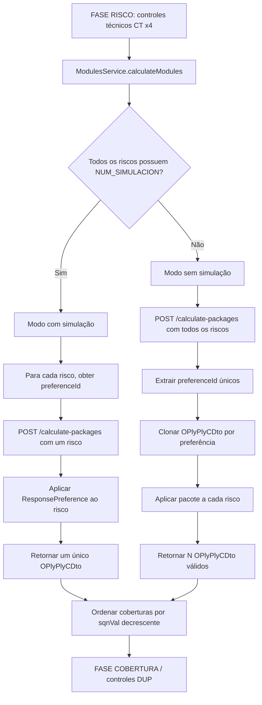
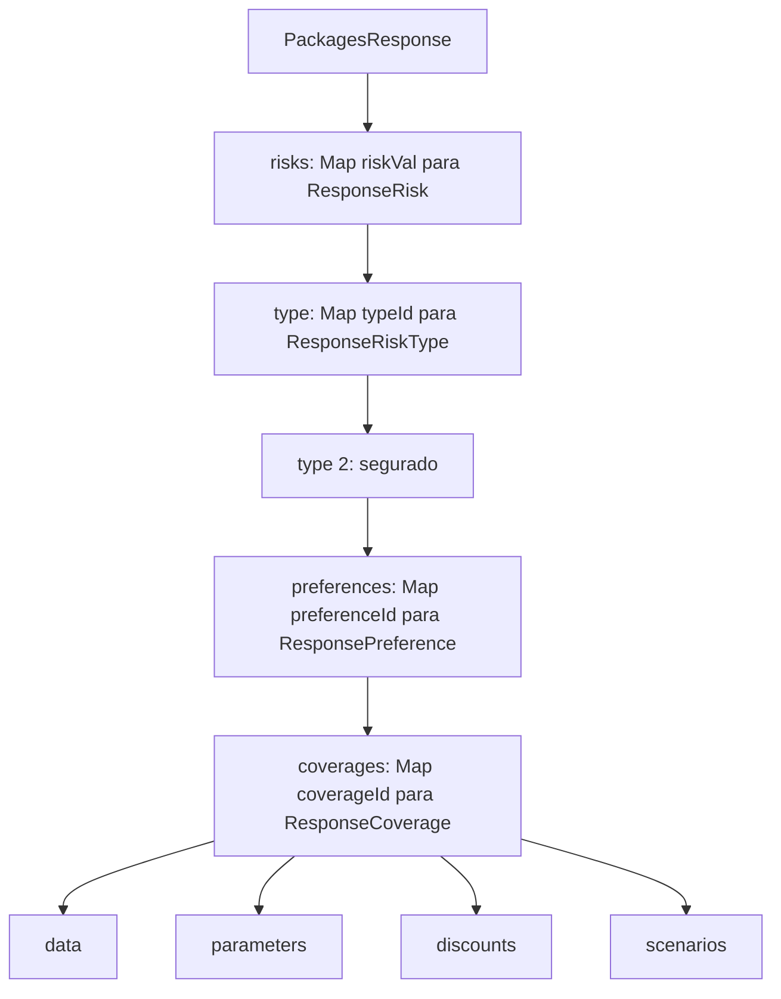
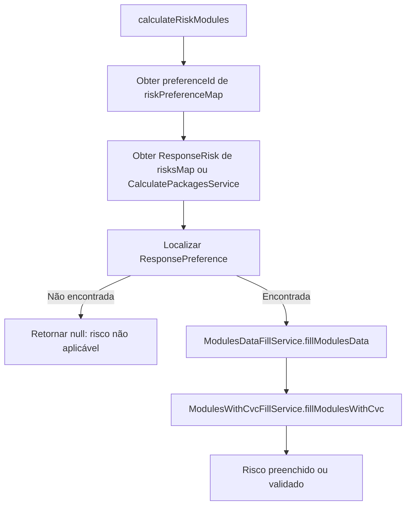
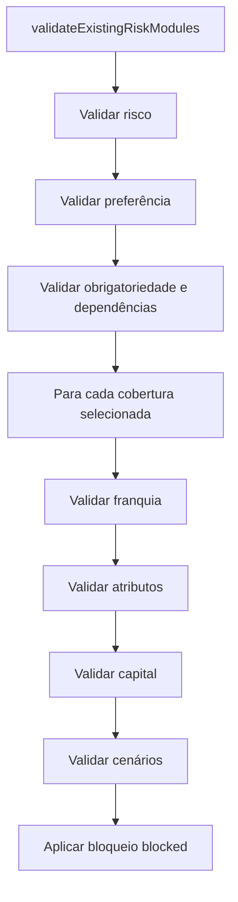
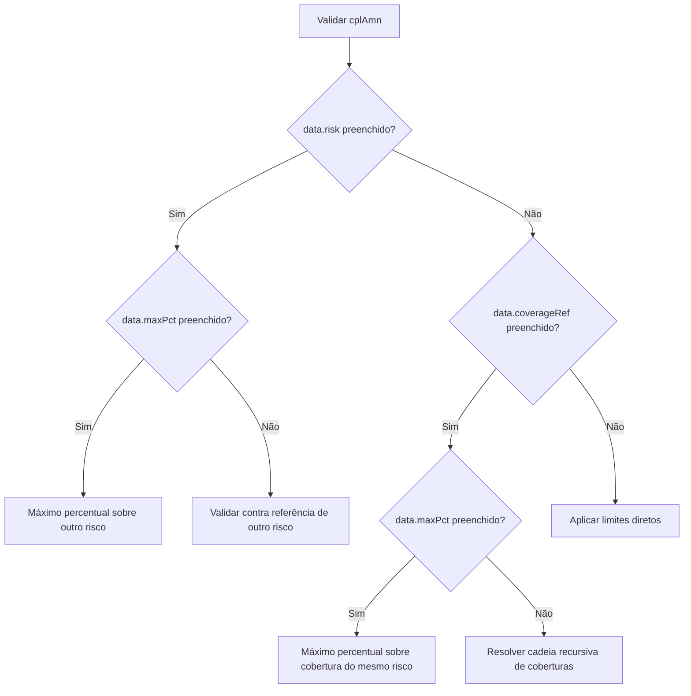

# REEF-ACDC — ModulesService: Cálculo, Validação e Fusão de Módulos de Coberturas

## 1. Metadados do Documento
- **Arquivo de Origem:** `Cálculo de Módulos`
- **Tipo de Documento:** Especificação Técnica
- **Domínio / Sistema:** REEF-ACDC / ACDC — módulos, pacotes e coberturas de apólices
- **Público-Alvo:** Desenvolvedores, Arquitetos, Operação e Analistas Funcionais
- **Data/Versão Identificada:** Não identificada

---

## 2. Resumo Executivo & Contexto de Negócio

O documento especifica o comportamento de `ModulesService` no backend REEF-ACDC para cálculo, preenchimento, validação e fusão de módulos — também denominados pacotes — de coberturas de uma apólice. Um módulo representa uma combinação predefinida de coberturas oferecida ao segurado, determinada externamente pelo serviço `CalculatePackagesService`.

O processamento de módulos ocorre na Fase 3 do orquestrador, após os controles técnicos de apólice e risco e antes do ciclo de controles de cobertura. O resultado de `ModulesService.calculateModules()` é uma lista de objetos `OPlyPlyCDto`; cada objeto corresponde a uma alternativa válida de cotação com riscos e coberturas preenchidos ou validados.

A seleção de módulos é executada em dois modos: com simulação, quando todos os riscos possuem o atributo `NUM_SIMULACION`, e sem simulação, quando o sistema identifica todas as preferências aplicáveis. No modo com simulação, cada risco informa o `preferenceId` escolhido anteriormente. No modo sem simulação, o sistema gera uma cotação candidata por preferência aplicável a todos os riscos.

A especificação define regras completas para obrigatoriedade de coberturas, referências entre coberturas, franquias, parâmetros não modificáveis, limites de capital, importes válidos, percentuais válidos, cenários condicionais e bloqueio de edição no frontend. As validações aplicam-se especialmente quando a apólice já contém coberturas informadas pelo usuário.

O documento também descreve o método `getPreviousCoverages`, usado para reconstruir a lista de coberturas de um risco em uma preferência previamente selecionada. Esse método preserva coberturas existentes, adiciona coberturas ausentes do catálogo e recalcula capitais derivados por `coverageRef + validPcts` quando necessário.

---

## 3. Arquitetura, Componentes & Tecnologias Envolvidas

| Componente / Tecnologia | Responsabilidade documentada |
| :--- | :--- |
| `REEF-ACDC` | Contexto de backend que contém a documentação e o processamento de módulos. |
| `ModulesService` | Calcula módulos, retorna preferências, obtém coberturas e executa a fusão de coberturas anteriores. |
| `ModulesService.calculateModules()` | Produz `List<OPlyPlyCDto>` para alternativas válidas de cotação. |
| `CalculatePackagesService` | Serviço externo que determina pacotes aplicáveis e responde a `POST /calculate-packages`. |
| `CoveragePackagesController` | Consumidor de `getModules()` e `getPreferences()`. |
| `PreviousCoveragePackagesUsecase` | Consumidor de `getPreviousCoverages()`. |
| `ModulesDataFillService` | Preenche atributos, dados de risco e coberturas quando a apólice não possui coberturas. |
| `ModulesWithCvcFillService` | Valida coberturas preexistentes e preenche coberturas conforme o pacote. |
| `ExecuteOrchestratorUsecase.sortCoverages()` | Ordena coberturas por `sqnVal` em ordem decrescente antes das fases DUP. |
| `DUP` | Motor de regras e fluxo de controles de cobertura mencionado como etapa posterior. |
| `core_rte_service` | Serviço externo cujo `PackagesService` avalia regras de `COVERAGE-PACKAGE-DEFINITION`. |
| `PackagesMapper` | Constrói `PackagesRequest.fixedValues` e publica `USR_VAL` em `PackagesRequest.parameters`. |
| `CoverageAgeCustomExclusionFunctions` | Funções que recebem o mapa completo de `fixedValues` para exclusão de cobertura por idade. |
| TRON | Sistema afetado pela preservação de `oTrnPrcS`; substituir o objeto completo pode causar `VCR-06531`. |





### Fluxo de cálculo por risco



---

## 4. Regras de Negócio, Especificações Funcionais & Processos

### 4.1 Conceito de módulo e momento de cálculo

Um módulo ou pacote é uma combinação predefinida de coberturas oferecida ao segurado. `CalculatePackagesService` determina os pacotes aplicáveis a uma apólice específica e retorna as coberturas que devem ser adicionadas em cada caso.

`ModulesService.calculateModules()` é chamado na Fase 3 do orquestrador, após controles técnicos de apólice e risco e antes do ciclo de coberturas.

```text
FASE RISCO (CT x4)
       ↓
ModulesService.calculateModules()
       ↓
BUCLE por cada módulo retornado
       ↓
FASE COBERTURA
```

### 4.2 Modos de cálculo

A seleção é automática e depende da presença de `NUM_SIMULACION` nos atributos de todos os riscos.

| Condição | Modo | Resultado |
| :--- | :--- | :--- |
| Todos os riscos possuem `NUM_SIMULACION` | Com simulação | Um único `OPlyPlyCDto` |
| Pelo menos um risco não possui `NUM_SIMULACION` | Sem simulação | N objetos `OPlyPlyCDto`, um por preferência válida |

#### Cálculo com simulação

1. Para cada risco, lê `NUM_SIMULACION`.
2. Usa o valor como `preferenceId`.
3. Chama `POST /calculate-packages` com apenas o risco correspondente.
4. Obtém o `ResponseRisk`.
5. Aplica as coberturas da preferência ao risco.
6. Retorna uma lista com um único `OPlyPlyCDto`.

Se qualquer risco não produzir resultado, o sistema lança `AcdcException(PK_PLY_ERR)`.

#### Cálculo sem simulação

1. Constrói `PackagesRequest` com todos os riscos.
2. Chama `POST /calculate-packages`.
3. Extrai todos os `preferenceId` únicos.
4. Para cada preferência:
   - clona o `OPlyPlyCDto` original;
   - localiza o `ResponseRisk` de cada risco;
   - aplica a preferência ao risco;
   - descarta a preferência caso algum risco não seja aplicável.
5. Se nenhuma preferência produzir uma apólice válida, lança `PlyValException(PK_PLY_ERR, plyVal)`.

### 4.3 Ordenação das coberturas

Antes das fases DUP `PREVIOUS` e `VALIDATION` de cobertura, `ExecuteOrchestratorUsecase.sortCoverages()` ordena as coberturas por `OPlyCvcC.OPlyCvrP.OPlyCvrS.sqnVal` em ordem decrescente. Coberturas com maior sequência são processadas primeiro.

### 4.4 Preenchimento quando o risco não possui coberturas

Quando `OPlyRkcPC` contém `OPlyCvcCT` vazio, o sistema constrói as coberturas a partir do catálogo do módulo.

| Origem | Destino na apólice | Regra |
| :--- | :--- | :--- |
| `coverageId` | `OPlyCvrS.cvrVal` | Identificador da cobertura. |
| `data.currency` | `OPlyCvrS.cplCrnVal` | Moeda do capital. |
| `data.amount` calculado | `OPlyCvrS.cplAmn` | Capital final. |
| `data.mandatory = true` | `OPlyCvrS.cvrSlc = "*"` | A cobertura é selecionada. |
| `data.blocked = true` | `oTrnPrcS.mdf = "N"` | Cobertura não editável e não desmarcável no frontend. |
| Posição no catálogo | `OPlyCvrS.sqnVal` | Sequência correlativa. |
| `discounts[default=true]` | `dctVal`, `dctCrnVal` | Franquia padrão. |
| `discounts[default=true].minValue` | `mnmDctVal` | Mínimo da franquia. |
| `discounts[default=true].maxValue` | `mxmDctVal` | Máximo da franquia. |
| `parameters[].code` | `OPlyAtcC.fldNam` | Nome do atributo de cobertura. |
| `parameters[].value` | `OPlyAtcC.fldValVal` | Valor padrão do atributo. |

#### Prioridade para cálculo de `cplAmn`

```text
1. data.risk preenchido
   → localizar risco de referência por atributos;
   → usar o cplAmn da coverageRef nesse risco.

2. data.validPcts preenchido e data.amount não nulo
   → cplAmn = data.amount × validPcts[0] / 100;
   → arredondamento HALF_UP com três decimais.

3. data.coverageRef não nulo
   → usar amount da cobertura referenciada na mesma preferência.

4. Demais casos
   → usar data.amount; se nulo, usar 0.
```

### 4.5 Validação quando o risco já possui coberturas

Quando a apólice já inclui coberturas, `ModulesWithCvcFillService` não sobrescreve os valores informados. O serviço valida compatibilidade com o módulo e lança `AcdcException(PK_PLY_ERR_VAL)` em qualquer falha.



#### Validações de risco e preferência

- O `riskId` da resposta deve corresponder ao `rskVal` de algum risco da apólice.
  - Falha: `20719` — `error.risk.not.found`.
- O `preferenceId` solicitado deve existir em algum `ResponseRiskType`.
  - Falha: `20720` — `error.preference.not.found`.

#### Coberturas obrigatórias e dependências

- Toda cobertura com `data.mandatory = true` deve existir e estar selecionada.
  - Falha: `20712` — `error.mandatory.not.selected`.
- Uma cobertura que possua `coverageRef`, sem `data.risk`, exige que a cobertura referenciada exista e esteja selecionada.
- A cadeia de `coverageRef` é recursiva.
- Referências cíclicas são inválidas.
  - Falha: `20717` — `error.coverage.cross.reference`.
- Cobertura ou risco de referência ausente:
  - Falha: `20999` — `error.package.require.coverage.not.found`.

#### Validação de franquias

A validação ocorre quando o módulo contém `discounts[]` e a apólice informa `dctVal`.

- `dctVal` deve ser igual a um dos valores `discounts[].discount`.
- Quando a franquia é válida, o sistema atualiza `mnmDctVal` e `mxmDctVal`.
- Se `dctVal` for nulo, a validação de franquia não é executada.
- Falha: `20708` — `error.discount.not.found.validation`.

#### Validação de atributos

Os atributos são buscados na cobertura do risco, no nível de cobertura (`lvlTypVal=3`).

| Regra | Comportamento | Falha |
| :--- | :--- | :--- |
| `jump = true` com `value` preenchido | O atributo deve corresponder exatamente ao valor configurado. | `20706` — `error.attribute.not.modifiable.validation` |
| `validValues` preenchido | O atributo deve pertencer à lista, com comparação case-insensitive. | `20707` — `error.attribute.value.validation` |

`jump` e `validValues` são regras independentes e podem acumular erros para o mesmo parâmetro.

### 4.6 Árvore de validação de importes



| Cenário | Regra |
| :--- | :--- |
| `risk[] + maxPct` | Localiza risco por atributos, obtém capital de `coverageRef` ou da própria cobertura e exige `cplAmn <= referência × maxPct / 100`. |
| `risk[]` sem `maxPct` | Localiza o risco de referência e usa seu capital como base para `validPcts`. Se não localizar o risco, `referenceAmount = 0`. |
| `coverageRef + maxPct` | Localiza cobertura referenciada no mesmo risco e exige `cplAmn <= cplAmn_referenciada × maxPct / 100`. |
| `coverageRef` sem `maxPct` | Resolve recursivamente a cobertura-base e valida por `validPcts`, `validAmounts` ou `amount`, nessa ordem. |
| Sem `risk[]` e sem `coverageRef` | Aplica limites diretos. |

#### Limites diretos

| Campo `data` | Condição de erro | Código | Property key |
| :--- | :--- | :--- | :--- |
| `maxAmount` | `cplAmn > maxAmount` | `20714` | `error.max.amount.exceeded` |
| `minAmount` | `cplAmn < minAmount` | `20715` | `error.min.amount.not.met` |
| `validAmounts[]` | `cplAmn` não pertence à lista | `20713` | `error.amount.mismatch` |
| `validPcts[]` | Nenhum cálculo `base × pct / 100` equivale a `cplAmn` | `20701` | `error.operator.in.validation` |

Todos os limites configurados são avaliados e podem acumular erros. `maxAmount`, `minAmount`, `validAmounts` e `validPcts` podem coexistir.

### 4.7 Cenários condicionais

Um cenário somente é avaliado quando todas as condições de `selector` são verdadeiras, com semântica lógica `AND`.

| Campo do seletor | Avaliação |
| :--- | :--- |
| `selected` | Verifica se a cobertura está selecionada. |
| `amount` | Aplica operador sobre `cplAmn`. |
| `discount` | Aplica operador sobre `dctAmn`. |
| `parameters[]` | Aplica operador sobre atributos de cobertura. |

| Tipo de ação | Semântica | Código de erro |
| :--- | :--- | :--- |
| `X` | A cobertura referenciada não pode estar selecionada. | `20709` — `error.ref.coverage.selected` |
| `S` | A cobertura referenciada deve estar selecionada. | `20710` — `error.ref.coverage.not.selected` |
| `M` | Exclusão mútua entre cobertura e referência. | `20716` — `error.mandatory.ref.coverage` |
| `AS` | Pelo menos uma cobertura do grupo deve estar selecionada. | `20721` — `error.ref.coverage.group.not.selected` |
| `AX` | Nenhuma cobertura do grupo pode estar selecionada. | `20722` — `error.ref.coverage.group.selected` |

| Operador | Aplicação |
| :--- | :--- |
| `==`, `=` | Igualdade numérica ou string. |
| `!=`, `<>` | Diferença numérica ou string. |
| `>`, `<`, `>=`, `<=` | Comparação numérica com `BigDecimal`. |
| `IN`, `NOT IN` | Inclusão ou exclusão em lista. |
| `BETWEEN`, `NOT BETWEEN` | Intervalo numérico fechado ou sua negação. |

### 4.8 Bloqueio de cobertura

Após as validações, coberturas com `data.blocked = true` recebem `oTrnPrcS.mdf = "N"`.

A operação não lança erro. O backend deve preservar o `oTrnPrcS` existente, incluindo `rowid`, `oTrnFldT` e `oTrnErrT`, alterando exclusivamente `mdf`. Um novo objeto só é criado quando a cobertura não possuía `oTrnPrcS`, como uma cobertura adicionada em `/previous`.

Substituir o objeto completo pode causar falha do TRON:

```text
VCR-06531: Reference to uninitialized collection
```

### 4.9 Fusão de coberturas anteriores: `getPreviousCoverages`

`getPreviousCoverages` é utilizado quando a apólice já possui coberturas e o usuário solicita novamente a tela de seleção para um módulo específico.

| Etapa | Regra |
| :--- | :--- |
| 1 | Localizar risco por `riskVal`; falha gera `AcdcException(PK_PLY_ERR)`. |
| 2 | Ler `NUM_SIMULACION` para identificar `preferenceId`. |
| 3 | Chamar `POST /calculate-packages` com o risco. |
| 4 | Localizar `ResponseRisk`; ausência gera `AcdcException(PK_PLY_ERR)`. |
| 5 | Localizar `ResponsePreference` para `type = 2`; ausência gera `AcdcException(PK_PLY_ERR)`. |
| 6 | Validar se todas as coberturas existentes pertencem ao catálogo do módulo. |
| 7 | Preservar coberturas existentes e criar as ausentes. |
| 8 | Marcar novas coberturas obrigatórias com `cvrSlc = "*"`. |
| 9 | Resolver cadeias do mesmo risco com `coverageRef + validPcts`. |

Para `coverageRef + validPcts`, `resolveSameRiskAmount` resolve primeiro a cobertura-base e preserva um capital informado caso ele já corresponda a um percentual válido. Caso contrário, usa o primeiro `validPct`.

Ciclos, referências fora do catálogo, ausência de capital-base, regras com `data.risk` ou `maxPct` não são corrigidos por `/previous`. Essas condições deixam apenas a cobertura afetada sem alteração e não causam erro de validação nessa operação.

### 4.10 Regras em `COVERAGE-PACKAGE-DEFINITION`

`PackagesService`, no `core_rte_service`, avalia as regras de configuração de pacotes.

- Objetos de regra combinam campos com `AND`.
- Elementos distintos do array `rules[]` são alternativas independentes.
- Quando mais de uma regra se aplica, o motor para na primeira, por `skipOnFirstAppliedRule=true`.
- `fixedValues` não é publicado como fatos individuais; não pode ser utilizado em condições de `rules[]`.
- `fixedValues` é usado para filtros MongoDB e por `CoverageAgeCustomExclusionFunctions`.
- Atributos dinâmicos de apólice são publicados em `PackagesRequest.parameters`.
- `USR_VAL` é lido de `OPlyGniS.usrVal` e publicado como `parameters["USR_VAL"]`.
- `USR_VAL` não representa identidade autenticada e não deve ser utilizado para autorização.

---

## 5. Tabelas de Parâmetros, Ambientes e Estruturas de Dados

| Item / Parâmetro | Descrição / Função | Tipo / Valores / Formato | Ambiente / Observações |
| :--- | :--- | :--- | :--- |
| `NUM_SIMULACION` | Identifica a preferência já selecionada para um risco. | Atributo de risco / `preferenceId` | Obrigatório no cálculo com simulação e em `getPreviousCoverages`. |
| `POST /calculate-packages` | Calcula pacotes aplicáveis. | Endpoint POST | Consumido por `CalculatePackagesService`. |
| `POST /calculate-preferencesId` | Obtém preferências disponíveis. | Endpoint POST | Consumido por `obtainModules()`. |
| `requestId` | Identificador da requisição. | Campo de `PackagesResponse` | Retornado pelo serviço externo. |
| `countryId` | Identificador do país. | Campo de `PackagesResponse` | Retornado pelo serviço externo. |
| `companyId` | Identificador da empresa. | Campo de `PackagesResponse` | Retornado pelo serviço externo. |
| `branchId` | Identificador do ramo. | Campo de `PackagesResponse` | Retornado pelo serviço externo. |
| `risks` | Mapa de riscos retornados. | `Map<riskVal, ResponseRisk>` | Estrutura principal da resposta. |
| `type = 2` | Tipo utilizado pelo processamento de módulos. | Identificador de tipo | Representa o segurado. |
| `preferenceId` | Identificador do módulo/pacote. | Identificador numérico | Seleciona `ResponsePreference`. |
| `preferenceName` | Nome descritivo do pacote. | Texto; exemplos: `BASICO`, `PREMIUM` | Retornado na preferência. |
| `coverageId` | Identificador de cobertura. | Identificador numérico | Chave das coberturas de um pacote. |
| `mandatory` | Define cobertura obrigatória. | Booleano | Cobertura deve existir e estar selecionada. |
| `selected` | Seleção padrão do catálogo. | Booleano | Usado em dados da resposta. |
| `blocked` | Bloqueia edição/desmarcação. | Booleano | Mapeia para `oTrnPrcS.mdf = "N"`. |
| `currency` | Moeda do capital ou franquia. | ISO; exemplo `978 = EUR` | Campo de dados e descontos. |
| `amount` | Capital-base da cobertura. | Valor monetário | Pode ser base para `validPcts`. |
| `coverageRef` | Referência a outra cobertura. | Identificador de cobertura | Usado para dependências e cálculo de capital. |
| `maxPct` | Percentual máximo sobre referência. | Percentual | Aplica-se a outro risco ou ao mesmo risco. |
| `maxAmount` | Limite máximo direto. | Valor monetário | Falha `20714` se excedido. |
| `minAmount` | Limite mínimo direto. | Valor monetário | Falha `20715` se não alcançado. |
| `validAmounts` | Capitais exatos permitidos. | Lista de valores | Falha `20713` se não houver correspondência. |
| `validPcts` | Percentuais permitidos sobre base. | Lista de percentuais | Falha `20701` se não houver correspondência. |
| `risk` | Atributos para localizar risco de referência. | Mapa de atributos | Pode ser combinado com `coverageRef`. |
| `prm` | Prêmio indicativo. | Valor | Retornado em `ResponseData`. |
| `parameters.code` | Nome do atributo. | Mapeia para `fldNam` | Atributo de cobertura. |
| `parameters.value` | Valor padrão do atributo. | Mapeia para `fldValVal` | Atributo de cobertura. |
| `parameters.jump` | Indica atributo não modificável. | Booleano | Valida igualdade estrita quando há valor. |
| `parameters.validValues` | Valores permitidos. | Lista | Comparação case-insensitive. |
| `discount` | Valor de franquia. | Valor monetário | Mapeia para `dctVal`. |
| `default` | Define franquia padrão. | Booleano | Usada no preenchimento inicial. |
| `minValue` | Mínimo da franquia. | Valor monetário | Mapeia para `mnmDctVal`. |
| `maxValue` | Máximo da franquia. | Valor monetário | Mapeia para `mxmDctVal`. |
| `sqnVal` | Ordem de processamento de cobertura. | Número de sequência | Ordenação decrescente no orquestrador. |
| `cvrSlc = "*"` | Marca cobertura como selecionada. | String | Aplicável a coberturas obrigatórias. |
| `mdf = "N"` | Indica cobertura não editável. | String | Aplicado em `oTrnPrcS`. |
| `fixedValues` | Dados de cabeçalho usados em filtros e funções específicas. | Mapa | Não pode ser usado diretamente em `rules[]`. |
| `currencyDecimals` | Decimais de moeda gerados pelo ACDC. | `"2"` | Incluído em `fixedValues`. |
| `enforceDevolution` | Valor gerado pelo ACDC. | `"S"` | Incluído em `fixedValues`. |
| `USR_VAL` | Usuário da apólice publicado como parâmetro de regras. | Valor de `OPlyGniS.usrVal` | Não é atributo dinâmico nem identidade autenticada. |
| Datas em `fixedValues` | Datas do cabeçalho da apólice. | `yyyyMMdd` | Valores nulos são enviados como string vazia. |

### Operadores de regras de `COVERAGE-PACKAGE-DEFINITION`

| Operador | Significado | Exemplo |
| :--- | :--- | :--- |
| `mxm` | Menor que | `{"age":{"mxm":65}}` |
| `mnm` | Maior que | `{"age":{"mnm":17}}` |
| `mxe` | Menor ou igual | `{"age":{"mxe":65}}` |
| `mne` | Maior ou igual | `{"age":{"mne":18}}` |
| `neq` | Diferente | `{"age":{"neq":40}}` |
| `in` | Pertence à lista | `{"COD_GIRO_NEGOCIO":{"in":[74,75]}}` |
| `nin` | Não pertence à lista | `{"COD_GIRO_NEGOCIO":{"nin":[74,75]}}` |

---

## 6. Bateria de Perguntas & Respostas para RAG (FAQ Sintético)

### P1: Quando `ModulesService.calculateModules()` é executado no fluxo de cotação?
**R:** `ModulesService.calculateModules()` é chamado na Fase 3 do orquestrador, após todos os controles técnicos de apólice e risco e imediatamente antes do ciclo de coberturas. Após o cálculo, cada módulo retornado percorre a fase de cobertura e os controles DUP.

### P2: Qual é a diferença entre o cálculo de módulos com e sem `NUM_SIMULACION`?
**R:** Quando todos os riscos possuem `NUM_SIMULACION`, o sistema interpreta o valor como `preferenceId` previamente escolhido, calcula o pacote por risco e devolve um único `OPlyPlyCDto`. Quando ao menos um risco não possui esse atributo, o sistema consulta todos os riscos, extrai todas as preferências possíveis e gera um `OPlyPlyCDto` por preferência aplicável a todos os riscos.

### P3: O que acontece se um risco não produzir resultado no cálculo com simulação?
**R:** O cálculo com simulação falha com `AcdcException(PK_PLY_ERR)` se qualquer risco não produzir resultado para o `preferenceId` informado em `NUM_SIMULACION`.

### P4: Como são tratadas coberturas obrigatórias em uma apólice que já possui coberturas?
**R:** Toda cobertura cujo catálogo possui `data.mandatory = true` deve estar presente e selecionada na apólice. Se estiver ausente ou não selecionada, a validação falha com o código `20712` e a chave `error.mandatory.not.selected`.

### P5: Como funciona uma cadeia de `coverageRef`?
**R:** Uma cobertura com `coverageRef` depende de outra cobertura. Quando não há `maxPct`, o sistema resolve recursivamente a cobertura-base, calcula os valores válidos usando `validPcts`, `validAmounts` ou `amount`, nessa prioridade, e valida o `cplAmn` informado. Se houver ciclo entre referências, ocorre o erro `20717`, `error.coverage.cross.reference`.

### P6: Em que situação é lançado o erro `20714`?
**R:** O erro `20714`, `error.max.amount.exceeded`, é lançado quando o capital `cplAmn` ultrapassa `maxAmount`, quando ultrapassa o máximo calculado por `maxPct` sobre uma cobertura do mesmo risco ou quando ultrapassa o máximo calculado por `maxPct` sobre uma cobertura de outro risco.

### P7: O que significa `blocked = true` em uma cobertura de módulo?
**R:** `data.blocked = true` faz o backend definir `oTrnPrcS.mdf = "N"` na cobertura. Isso informa ao frontend que a cobertura não pode ser editada nem desmarcada. Essa alteração ocorre após validações e não produz erro.

### P8: Como o sistema valida uma franquia informada pelo usuário?
**R:** Se a cobertura possui `discounts[]` e a apólice informa `dctVal`, o valor deve coincidir com algum `discounts[].discount`. Em caso de correspondência, o sistema atualiza `mnmDctVal` e `mxmDctVal`; em caso contrário, lança `20708`, `error.discount.not.found.validation`. Se `dctVal` for nulo, a validação não é executada.

### P9: Qual é o comportamento de `getPreviousCoverages()`?
**R:** `getPreviousCoverages()` é usado para recuperar as coberturas de um risco em uma preferência já selecionada. O método exige `NUM_SIMULACION`, preserva coberturas existentes que pertencem ao catálogo, cria as coberturas ausentes, seleciona as obrigatórias e recalcula apenas capitais derivados por `coverageRef + validPcts` do mesmo risco.

### P10: O que ocorre se a apólice contiver uma cobertura fora do catálogo do módulo em `getPreviousCoverages()`?
**R:** A operação falha com `AcdcException(PK_PLY_ERR_VAL)`, porque toda cobertura existente na apólice deve pertencer ao catálogo da preferência selecionada antes que a lista final seja construída.

### P11: `fixedValues` pode ser utilizado diretamente em condições de `rules[]`?
**R:** Não. Embora `PackagesMapper.getDefaultFixedValues()` construa o mapa `PackagesRequest.fixedValues`, o `core_rte_service` não o publica como fatos individuais. Portanto, esses valores não podem ser utilizados em condições de `rules[]`; seus usos documentados são filtros MongoDB e funções de exclusão de cobertura por idade.

### P12: Como `USR_VAL` é disponibilizado para regras de pacotes?
**R:** `USR_VAL` é lido de `OPlyPlyCDto.OPlyGniP.OPlyGniS.usrVal` e publicado explicitamente como `PackagesRequest.parameters["USR_VAL"]`. Uma definição só é afetada se declarar `USR_VAL` explicitamente em uma alternativa de `rules[]`. O valor não representa identidade autenticada e não deve ser usado para autorização.

---

## 7. Glossário de Termos, Siglas & Conceitos-Chave

- **ACDC:** Contexto de backend REEF-ACDC referido pela documentação.
- **AS:** Ação de cenário que exige ao menos uma cobertura selecionada em um grupo.
- **AX:** Ação de cenário que exige que nenhuma cobertura de um grupo esteja selecionada.
- **BM25:** Modelo de recuperação lexical; aplicável ao uso previsto do artefato em busca híbrida, mas não detalhado pelo documento-fonte.
- **CVC:** Referência aos objetos de cobertura, como `OPlyCvcPC`.
- **DUP:** Motor de regras mencionado nas fases de processamento de cobertura.
- **`dctVal`:** Valor de franquia informado na cobertura.
- **`cplAmn`:** Capital ou importe da cobertura.
- **`coverageRef`:** Referência a uma cobertura usada para dependência ou cálculo de capital.
- **`fixedValues`:** Mapa de dados de cabeçalho de apólice usado por filtros e funções específicas.
- **`fldNam`:** Nome de atributo de cobertura.
- **`fldValVal`:** Valor de atributo de cobertura.
- **IRV-24822:** Referência a incidente associado à preservação de `oTrnPrcS`.
- **M:** Ação de cenário de exclusão mútua.
- **`maxPct`:** Percentual máximo permitido sobre um capital de referência.
- **`NUM_SIMULACION`:** Atributo de risco que identifica a preferência selecionada.
- **`OPlyPlyCDto`:** Objeto de opção de cotação retornado por `calculateModules()`.
- **`OPlyCvcPC`:** Objeto de cobertura retornado por métodos de módulos.
- **`OPlyRkcPC`:** Estrutura de risco da apólice.
- **`OPlyGniS`:** Estrutura de dados gerais da apólice, incluindo `usrVal`.
- **`oTrnPrcS`:** Estrutura associada ao processamento da transação; `mdf = "N"` bloqueia edição.
- **PK_PLY_ERR:** Chave de erro usada em falhas gerais de cálculo/obtenção de módulos.
- **PK_PLY_ERR_VAL:** Chave de erro usada em falhas de validação.
- **RAG:** Retrieval-Augmented Generation; contexto de uso previsto para este documento estruturado.
- **`ResponseCoverage`:** Resposta de catálogo para uma cobertura.
- **`ResponsePreference`:** Resposta que representa uma preferência ou módulo.
- **`ResponseRisk`:** Resposta associada a um risco.
- **S:** Ação de cenário que exige cobertura referenciada selecionada.
- **TRON:** Sistema que pode falhar se `oTrnPrcS` for substituído indevidamente.
- **X:** Ação de cenário que proíbe cobertura referenciada selecionada.

---

## 8. Notas Críticas, Riscos & Limitações

- **Nota de Análise:** O documento descreve contratos, classes e endpoints, mas não apresenta os contratos HTTP completos, cabeçalhos, autenticação, payloads completos ou códigos de sucesso de `CalculatePackagesService`.
- O processamento do tipo de risco utiliza atualmente apenas `type = 2`, identificado como segurado.
- No modo sem simulação, uma preferência é descartada integralmente se qualquer risco não for aplicável.
- Em `getPreviousCoverages`, referências cíclicas, referências não resolvíveis, regras com `data.risk` e regras com `maxPct` não são corrigidas; apenas a cobertura impactada permanece inalterada.
- A operação `/previous` não equivale à validação feita em `/coverage-packages/calculation`: a primeira pode preservar uma cobertura não resolvida, enquanto a segunda rejeita importes incompatíveis.
- `fixedValues` não pode ser usado diretamente em `rules[]`, pois é publicado como um único mapa e não como fatos individuais.
- Valores nulos em `fixedValues` são transmitidos como string vazia; regras ou filtros consumidores devem considerar essa representação.
- `USR_VAL` não é identidade autenticada e não deve ser usado para autorização.
- Repetir a mesma chave em um objeto JSON de regra não permite múltiplas condições: apenas a última ocorrência é preservada.
- Substituir integralmente `oTrnPrcS` pode provocar o erro TRON `VCR-06531: Reference to uninitialized collection`.
- O documento não identifica versão, data de publicação, ambiente operacional específico, hosts, portas ou URLs de ambientes além do portal de documentação citado na extração.

---

## 9. Conteúdo Bruto Estruturado (Referência Fiel)

```text
Título: Cálculo de Módulos

Sistema: REEF-ACDC Backend
Documento: ModulesService — Cálculo de módulos e pacotes de coberturas

Estrutura principal:
- Um módulo ou pacote é uma combinação predefinida de coberturas.
- CalculatePackagesService determina pacotes aplicáveis a uma apólice.
- ModulesService.calculateModules() retorna List<OPlyPlyCDto>.
- O cálculo ocorre na Fase 3 do orquestrador, após controles técnicos de apólice e risco e antes do ciclo de coberturas.

Modos de cálculo:
- Com simulação:
  - Todos os riscos possuem NUM_SIMULACION.
  - NUM_SIMULACION determina preferenceId.
  - Chamada a POST /calculate-packages com um risco por vez.
  - Retorna um único OPlyPlyCDto.
  - Ausência de resultado para um risco gera AcdcException(PK_PLY_ERR).
- Sem simulação:
  - Algum risco não possui NUM_SIMULACION.
  - Chamada a POST /calculate-packages com todos os riscos.
  - Uma cotação candidata é criada por preferenceId.
  - Preferência é descartada se algum risco não for aplicável.
  - Lista vazia gera PlyValException(PK_PLY_ERR, plyVal).

Classes:
- ModulesDataFillService: preenche atributos e dados de risco por ResponsePreference.
- ModulesWithCvcFillService: constrói ou valida OPlyCvcPC conforme pacote.
- CoveragePackagesController consome getModules() e getPreferences().
- PreviousCoveragePackagesUsecase consome getPreviousCoverages().

Métodos:
- getModules(): retorna List<OPlyCvcPC> do primeiro módulo calculado para um risco.
- getPreferences(): retorna List<ResponsePreferences> de POST /calculate-preferencesId.
- obtainModules(): chama CalculatePackagesService.callObtainPackages().
- getPreviousCoverages(): funde apólice e catálogo, adiciona coberturas ausentes e recalcula capitais derivados.

PackagesResponse:
- requestId
- countryId
- companyId
- branchId
- risks: Map<riskVal, ResponseRisk>
  - risk
  - product
  - type: Map<typeId, ResponseRiskType>
    - type 2: segurado
    - preferences: Map<preferenceId, ResponsePreference>
      - preferenceId
      - preferenceName
      - coverages: Map<coverageId, ResponseCoverage>
        - data: mandatory, selected, blocked, currency, amount, coverageRef,
          maxPct, maxAmount, minAmount, validAmounts, validPcts, risk, prm
        - parameters: code, value, jump, validValues
        - discounts: discount, currency, default, maxValue, minValue
        - scenarios: selector, actions

Mapeamento de preenchimento:
- coverageId -> OPlyCvrS.cvrVal
- data.currency -> OPlyCvrS.cplCrnVal
- data.amount calculado -> OPlyCvrS.cplAmn
- data.mandatory -> OPlyCvrS.cvrSlc = "*"
- data.blocked -> oTrnPrcS.mdf = "N"
- discounts default -> dctVal, dctCrnVal, mnmDctVal, mxmDctVal
- parameters.code -> OPlyAtcC.fldNam
- parameters.value -> OPlyAtcC.fldValVal

Validações:
- 20719: error.risk.not.found
- 20720: error.preference.not.found
- 20712: error.mandatory.not.selected
- 20999: error.package.require.coverage.not.found
- 20717: error.coverage.cross.reference
- 20259: error.coverage.not.found
- 20708: error.discount.not.found.validation
- 20706: error.attribute.not.modifiable.validation
- 20707: error.attribute.value.validation
- 20714: error.max.amount.exceeded
- 20715: error.min.amount.not.met
- 20713: error.amount.mismatch
- 20701: error.operator.in.validation
- 20709: error.ref.coverage.selected
- 20710: error.ref.coverage.not.selected
- 20716: error.mandatory.ref.coverage
- 20721: error.ref.coverage.group.not.selected
- 20722: error.ref.coverage.group.selected
- INVALID_OPERATOR: error.invalid.operator
- 20702: error.operator.not.in.validation
- 20703: error.operator.between.validation
- 20704: error.operator.not.between.validation
- 20705: error.operator.operator.default.validation

Regras de cenário:
- X: referência não pode estar selecionada.
- S: referência deve estar selecionada.
- M: exclusão mútua.
- AS: pelo menos uma cobertura de um grupo deve estar selecionada.
- AX: nenhuma cobertura de um grupo pode estar selecionada.

Operadores de cenário:
- ==, =
- !=, <>
- >, <, >=, <=
- IN, NOT IN
- BETWEEN, NOT BETWEEN

Regras COVERAGE-PACKAGE-DEFINITION:
- fixedValues é usado em filtros MongoDB e funções de exclusão por idade.
- fixedValues não pode ser usado diretamente em rules[].
- Parâmetros dinâmicos são publicados em PackagesRequest.parameters.
- USR_VAL vem de OPlyGniS.usrVal e é publicado como parameters["USR_VAL"].
- Regras dentro de um mesmo objeto usam AND.
- Cada item do array rules[] é uma alternativa independente.
- skipOnFirstAppliedRule=true interrompe na primeira regra aplicável.
- Operadores: mxm, mnm, mxe, mne, neq, in, nin.
- Datas usam formato yyyyMMdd.
- Valores nulos em fixedValues são enviados como string vazia.
```
