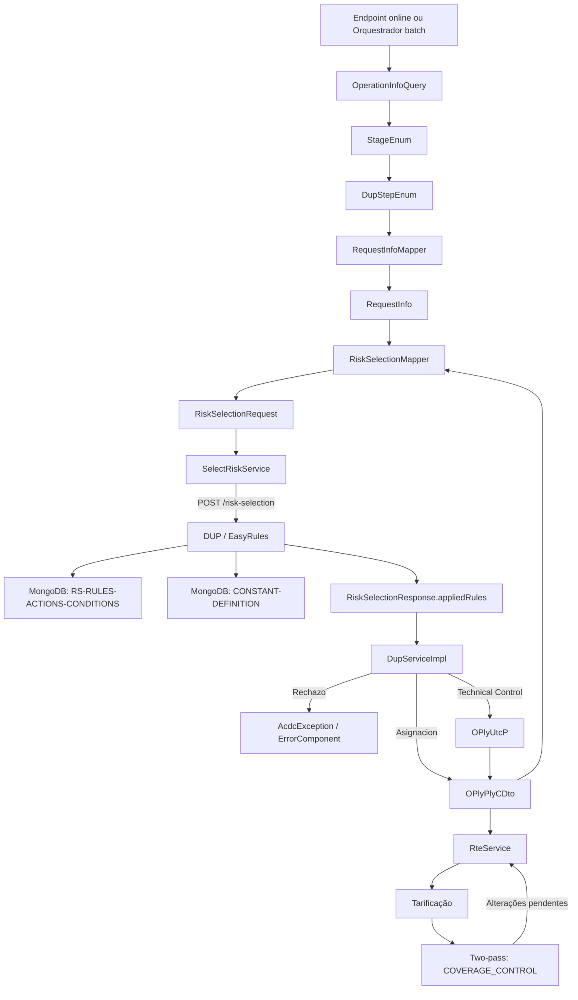
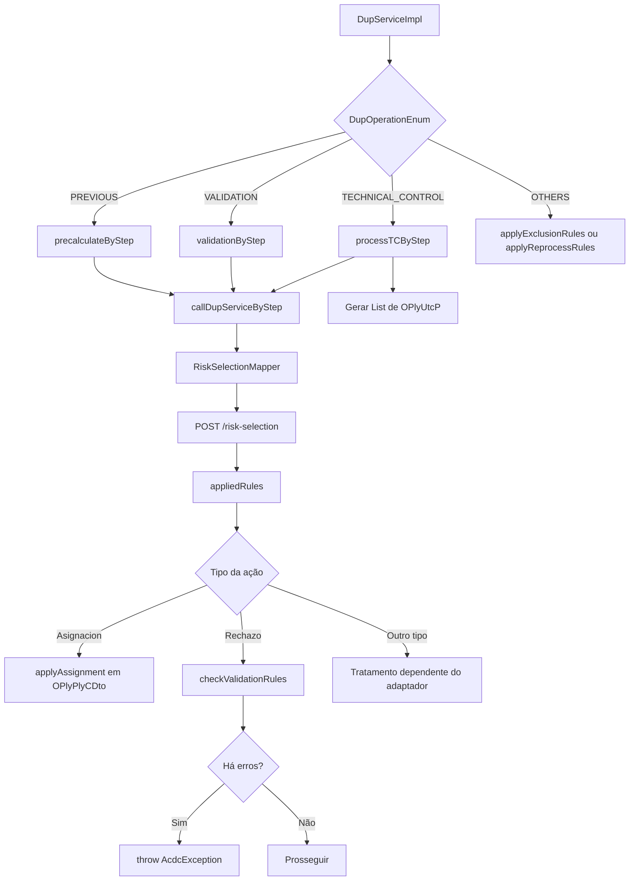
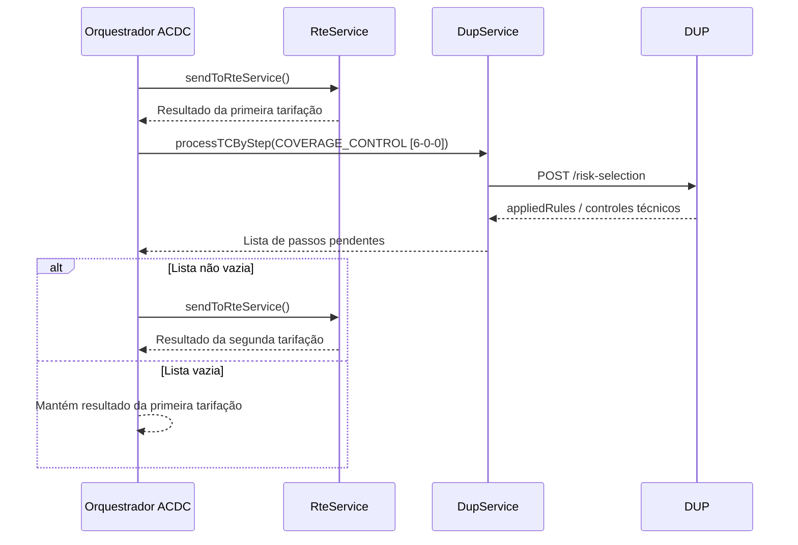

# DUP Engine — Motor de Regras de Negócio e Mapeamento de Dados do REEF-ACDC

## 1. Metadados do Documento
- **Arquivo de Origem:** Não identificado; conteúdo bruto de documentação `DUP_ENGINE`.
- **Tipo de Documento:** Especificação Técnica / Arquitetura de Software.
- **Domínio / Sistema:** REEF-ACDC, DUP (Data Update Process), seleção de riscos, tarifação RTE e regras de negócio de seguros.
- **Público-Alvo:** Desenvolvedores, Arquitetos, Configuradores de Regras, Operação e Analistas Funcionais.
- **Data/Versão Identificada:** Referências documentais em 2026-08-28 e 2026-09-09; versão formal não identificada.

---

## 2. Resumo Executivo & Contexto de Negócio

O DUP (Data Update Process) é o motor externo de regras de negócio do ecossistema REEF-ACDC. O motor recebe o estado corrente de uma apólice, representado internamente por `OPlyPlyCDto`, e um contexto de execução derivado de `DupStepEnum`. A partir dessas informações, o DUP avalia regras persistidas em MongoDB e devolve `appliedRules`, contendo ações como atribuições, rejeições, avisos, requisitos, controles técnicos, exclusões e decisões de reprocessamento.

O backend ACDC integra-se ao DUP pelo componente `SelectRiskService`, que chama `POST /risk-selection`. O `RiskSelectionMapper` transforma a estrutura de apólice em `RiskSelectionRequest`, incluindo metadados de execução, dados fixos, atributos variáveis, coberturas, segurado, participantes, questionários e documentos. O motor DUP converte esse payload em facts consumidos pelas regras V1 e V2.

A execução de regras é orientada por passos, níveis e estágios. `DupStepEnum` define a tríade interna `processStep`, `processStepMenuOption` e `processStepOption`; `RiskSelectionTypeEnum` define a granularidade de execução por apólice, grupo de apólice, risco, cobertura, formulário ou dados fixos; e `StageEnum` expõe agrupamentos funcionais para os endpoints online. O contrato público online informa `operationInfo.onlineStage`, enquanto a tríade interna é derivada pelo backend.

O DUP suporta pré-cálculo (`PREVIOUS`), validação bloqueante (`VALIDATION`), controles técnicos (`TECHNICAL_CONTROL`) e operações especiais (`OTHERS`). Regras de pré-cálculo aplicam atribuições em memória; validações podem lançar `AcdcException`; controles técnicos geram elementos `OPlyUtcP`; e operações especiais tratam exclusão de renovação e decisão de reprocessamento em pré-renovação.

O fluxo também se integra com o RTE para tarifação. Após a primeira chamada de tarifa, o ACDC executa controles técnicos de cobertura. Caso esses controles retornem alterações pendentes, o sistema faz uma segunda chamada ao RTE, no padrão denominado *two-pass*, para recalcular a tarifa com os efeitos das regras técnicas.

---

## 3. Arquitetura, Componentes & Tecnologias Envolvidas

| Componente / Tecnologia | Responsabilidade documentada |
| :--- | :--- |
| `REEF-ACDC` | Backend que orquestra processos de apólice, regras DUP, módulos e tarifação RTE. |
| DUP / Data Update Process | Serviço externo de motor de regras de negócio e controles técnicos. |
| `DupServiceImpl` | Serviço ACDC que executa regras DUP e aplica o resultado na estrutura de apólice. |
| `SelectRiskService` | Cliente de integração que chama `POST /risk-selection`. |
| `RiskSelectionMapper` | Mapper MapStruct que converte `OPlyPlyCDto` em `RiskSelectionRequest`. |
| `RequestInfoMapper` | Mapper MapStruct que cria `RequestInfo` a partir de `OperationInfoQuery` e `DupStepEnum`. |
| `DupStepEnum` | Catálogo de passos internos, identificados pela tríade step/menu/option. |
| `StageEnum` | Agrupamento de passos DUP usado pelos endpoints online. |
| `RiskSelectionTypeEnum` | Define a granularidade de execução: apólice, grupo, risco, cobertura, formulário ou dados fixos. |
| `RiskSelectionRequest` | Payload enviado pelo ACDC ao DUP. |
| `RiskSelectionResponse` | Resposta DUP, contendo `appliedRules` e, quando aplicável, `finalResult`. |
| `OPlyPlyCDto` | Estrutura Java interna da apólice, denominada “polizón” no documento. |
| `OPlyUtcP` | Estrutura de controle técnico acumulada na apólice, risco ou cobertura. |
| MongoDB `RS-RULES-ACTIONS-CONDITIONS` | Coleção de regras DUP, ações e condições. |
| MongoDB `CONSTANT-DEFINITION` | Coleção de constantes resolvidas dinamicamente pelas regras. |
| EasyRules | Motor referido para disponibilizar facts e avaliar regras DUP. |
| Janino | Mecanismo usado pelas condições e fórmulas V2. |
| `SafeFactsUtils` | Utilitário de acesso tipado a facts em expressões V2. |
| EhCache | Cache de constantes; TTL documentado de 30 minutos. |
| RTE / `RteService` | Serviço de tarifação chamado antes e, quando necessário, depois de controles técnicos DUP. |



### Fluxo de execução por operação



### Níveis de aplicação de regras

| Nível (`RiskSelectionTypeEnum`) | Iteração | Conteúdo de `variableData` |
| :--- | :--- | :--- |
| `POLICY_TYPE` | Uma chamada para toda a apólice. | Atributos raiz da apólice (`OPlyAtcCT`). |
| `POLICY_GROUP` | Uma chamada para grupo de apólice. | Atributos raiz da apólice. |
| `RISK_TYPE` | Uma chamada para cada risco. | Atributos da apólice, do risco atual e das coberturas do risco. |
| `COVERAGE_TYPE` | Uma chamada para cada cobertura de cada risco. | Atributos da apólice, risco atual e cobertura atual. |
| `FORM_TYPE` | Uma chamada por formulário. | Atributos do formulário. |
| `FIXED_DATA` | Uma chamada para dados fixos. | Não aplicável. |

---

## 4. Regras de Negócio, Especificações Funcionais & Processos

### 4.1 Tipos de operação DUP

| Operação (`DupOperationEnum`) | Método ACDC | Comportamento |
| :--- | :--- | :--- |
| `PREVIOUS` | `precalculateByStep()` | Executa pré-cálculo, atribuições, valores padrão e propagação de dados. Não bloqueia o fluxo diante de validações. |
| `VALIDATION` | `validationByStep()` | Executa validações. Ações de rejeição podem acumular erros e lançar `AcdcException`. |
| `TECHNICAL_CONTROL` | `processTCByStep()` | Processa controles sobre coberturas, reasseguro, cláusulas, impressão e opções adicionais. Retorna `List<OPlyUtcP>`. |
| `OTHERS` | `applyExclusionRules()` e `applyReprocessRules()` | Trata exclusão de apólice e reprocessamento de renovação, fora do modelo normal de pré-cálculo, validação ou controle técnico. |

### 4.2 Passos DUP relevantes

| Passo | Tríade `[step-menu-option]` | Nível | Operação |
| :--- | :--- | :--- | :--- |
| `FIXED_DATA_DUP` | `[1-0-0]` | `POLICY_TYPE` | CT |
| `PREVIOUS_VARIABLE_DATA_POLICY` | `[2-0-10]` | `POLICY_TYPE` | `PREVIOUS` |
| `VALIDATION_VARIABLE_DATA_POLICY` | `[2-0-20]` | `POLICY_TYPE` | `VALIDATION` |
| `PREVIOUS_VARIABLE_DATA_RISK` | `[4-0-10]` | `RISK_TYPE` | `PREVIOUS` |
| `VALIDATION_VARIABLE_DATA_RISK` | `[4-0-20]` | `RISK_TYPE` | `VALIDATION` |
| `PREVIOUS_VARIABLE_COVERAGE` | `[6-0-10]` | `COVERAGE_TYPE` | `PREVIOUS` |
| `VALIDATION_VARIABLE_COVERAGE` | `[6-0-20]` | `COVERAGE_TYPE` | `VALIDATION` |
| `COVERAGE_CONTROL` | `[6-0-0]` | `COVERAGE_TYPE` | CT |
| `REINSURANCE_CONTROL` | `[7-0-0]` | `COVERAGE_TYPE` | CT |
| `TERMINATE_CONTROL` | `[8-1-6]` | `COVERAGE_TYPE` | CT |
| `SUSPEND_CONTROL` | `[8-1-3]` | `COVERAGE_TYPE` | CT |
| `SAVE_CONTROL` | `[8-3-1]` | `COVERAGE_TYPE` | CT |
| `CLAUSES_CONTROL` | `[8-3-4]` | `COVERAGE_TYPE` | CT |
| `PRINT_CONTROL` | `[8-3-6]` | `COVERAGE_TYPE` | CT |
| `EXCLUSION_POLICY` | `[50-0-30]` | `POLICY_TYPE` | `OTHERS` |
| `REPROCESS_POLICY` | `[50-0-40]` | `POLICY_TYPE` | `OTHERS` |

### 4.3 Estágios online e conversão para passos internos

| `StageEnum` | Passos DUP executados |
| :--- | :--- |
| `POLICY_PREVIOUS` | `PREVIOUS_VARIABLE_DATA_POLICY` |
| `RISK_PREVIOUS` | `PREVIOUS_VARIABLE_DATA_RISK` |
| `COVERAGE_PREVIOUS` | `PREVIOUS_VARIABLE_COVERAGE` |
| `POLICY_DATA_VALIDATION` | `PREVIOUS_VARIABLE_DATA_POLICY` + `VALIDATION_VARIABLE_DATA_POLICY` |
| `RISK_DATA_VALIDATION` | `PREVIOUS_VARIABLE_DATA_RISK` + `VALIDATION_VARIABLE_DATA_RISK` |
| `COVERAGE_DATA_VALIDATION` | `PREVIOUS_VARIABLE_COVERAGE` + `VALIDATION_VARIABLE_COVERAGE` |
| `FIXED_DATA_TC` | `FIXED_DATA_DUP` |
| `RISK_DATA_TC` | `VARIABLE_DATA_RISK` |
| `COVERAGE_DATA_TC` | `COVERAGE_CONTROL` |
| `END_COVERAGE_TC` | `REINSURANCE_CONTROL` + `TERMINATE_CONTROL` |
| `END_POLICY_TC` | `SAVE_CONTROL` + `CLAUSES_CONTROL` + `ANNEX_PAGES_CONTROL` |
| `COVERAGE_FINAL_TC` | Controles de save, abandon, verify, clauses, annex pages, print, risks e opções adicionais. |
| `GRP_PLY_FIXED_DATA_VALIDATION` | `VALIDATION_FIXED_DATA_PLY_GRP` |
| `GRP_PLY_VARIABLE_DATA_PREVIOUS` | `PREVIOUS_VARIABLE_DATA_PLY_GRP` |
| `GRP_PLY_VARIABLE_DATA_VALIDATION` | `VALIDATION_VARIABLE_DATA_PLY_GRP` |

**Regra de contrato público:** endpoints online recebem `operationInfo.onlineStage`. Os campos `processStep`, `processStepMenuOption` e `processStepOption` são internos e derivados do `StageEnum`; não devem ser enviados como contrato público.

### 4.4 Fluxo batch de exclusão e reprocessamento

1. Para `RENEW_POLICY` (`RnwPly`) e `PRE_RENEW_POLICY` (`PlyPrw`), o orquestrador avalia `EXCLUSION_POLICY` `[50-0-30]`.
2. Se existirem regras de exclusão aplicadas, o ACDC constrói erros a partir dessas regras, lança `AcdcException` e bloqueia o fluxo.
3. Para `PRE_RENEW_POLICY`, o orquestrador também avalia `REPROCESS_POLICY` `[50-0-40]`.
4. Se as regras informarem que o reprocessamento não deve prosseguir, a resposta é devolvida antecipadamente com `oTrnPrcS.trmVal = "1"` e `paymentPlans: []`.
5. Nesse retorno antecipado, o sistema não continua para módulos, RTE ou planos de pagamento.

### 4.5 Regras de seleção e especificidade

As regras são lidas da coleção MongoDB `RS-RULES-ACTIONS-CONDITIONS` utilizando contexto comercial, operacional e de apólice:

- Cabeçalho: companhia, ramo, produto, tipo de execução, tipo de processo, passo, menu, opção, campo de processo, status ativo e validade.
- Produto: a consulta aceita produto específico ou o wildcard `99999`.
- Processo: aceita `processTypeId` ou valor genérico `99`.
- Coberturas: se houver coberturas no contexto, aceita regra com cobertura nula ou presente no conjunto de coberturas; sem coberturas, aceita apenas `coverage = null`.
- Especialização opcional: número de apólice, apólice cliente, contrato, apólice grupo, terceiro, canais e níveis comerciais.
- Quando a requisição possui valor em um campo de especialização, o filtro aceita valor exato ou `null` na regra.
- Vigência: a consulta filtra `active = "Y"` e `expiry_date >= operationDate`.
- `disabled_date` existe no documento de regra, mas não há filtro explícito documentado por `disabledDate` no repositório atual.
- Em pré-validação, a ordenação considera a posição de `processField` em `processFields`.
- Fora de pré-validação, a ordenação considera severidade da ação e fatores de especificidade em produtos não exatos.

### 4.6 Ações DUP suportadas

| `action.type` | Impacto funcional |
| :--- | :--- |
| `TEMP` | Cálculo ou atribuição temporária. |
| `Rechazo` | Resultado bloqueante de maior severidade funcional. |
| `Revisión` | Indica necessidade de revisão ou subscrição. |
| `Requisito` | Solicita requisito adicional. |
| `Documento` | Solicita ou registra documentação necessária. |
| `Cuestionario` | Solicita ou relaciona questionários e formulários. |
| `Tarifa` | Ação associada a condições de tarifa. |
| `Aviso` | Mensagem informativa ou não bloqueante, segundo o adaptador. |
| `Asignacion` | Atribui valor a facts, atributos de apólice ou contexto. |
| `Documentacion` | Ação documental genérica. |
| `Auditoria` | Registro ou trilha funcional de auditoria. |
| `Prima minima` | Controle ou informação de prêmio mínimo. |
| `Exclusion` | Bloqueia renovação ou pré-renovação excluída. |
| `Reproceso` | Decide se o reprocessamento pode continuar. |

Em prioridade fora de pré-validação, o código pondera `TEMP=1`, `Rechazo=2`, `Revisión=3`, `Requisito`/`Documento`/`Cuestionario`/`Tarifa=4` e demais ações como `5`.

### 4.7 Condições V1

| Operador | Significado |
| :--- | :--- |
| `GT`, `GE`, `LT`, `LE` | Maior, maior ou igual, menor, menor ou igual. |
| `EQ`, `NOT_EQ` | Igualdade ou diferença para números, texto ou listas. |
| `IN`, `NOT_IN` | Pertence ou não pertence à lista `values`. |
| `BTW` | Intervalo inclusivo entre `value1` e `value2`. |
| `EX`, `NEX` | Existe ou não existe; existência requer valor não nulo e não vazio. |
| `BLANK` | Valor nulo ou texto em branco. |
| `ANY_MATCH` | Algum fact que corresponda ao padrão wildcard é igual ao valor. |
| `ANY_GT` | Algum elemento wildcard é estritamente maior que o valor; exclusivamente numérico. |
| `ANY_LT` | Algum elemento wildcard é estritamente menor que o valor; exclusivamente numérico. |

Regras V1 usam `conditions[]`. Cada condição pode possuir `factor`, `operator`, `value`, `values`, `value1`, `value2`, `prevFactor` e `compareDateFactor`.

**Prioridade do operando direito em V1:**
1. `prevFactor`, quando informado;
2. `value`, quando `prevFactor` não existe;
3. `values`, exclusivamente para `IN` e `NOT_IN`.

### 4.8 Condições V2 e fórmulas

Regras V2 usam `condition` como expressão Janino com `SafeFactsUtils`.

Funções documentadas:
- `asString`
- `asInteger`
- `asDouble`
- `asLocalDate`
- `asList`
- `anyMatch`
- `anyGt`
- `anyLt`

Exemplo documentado:

```java
f.asInteger("insured.age") != null
&& f.asInteger("insured.age") >= 18
&& "M".equals(f.asString("fixedValues.paymentModality"))
&& f.asDouble("coverages.100.capital") != null
&& f.asDouble("coverages.100.capital") > 50000
```

### 4.9 Cálculo de valores de ação

| `valueCalculationType` | Comportamento |
| :--- | :--- |
| `DIRECT` | Usa `value` sem transformação. |
| `FACTOR` | Resolve `value` como fact, constante, data ou expressão suportada. |
| `FORMULA` | Avalia `value` como expressão Janino V2. |
| `FUNCTION` | Reservado para comportamento por função; não transforma `value` no pré-processamento atual. |

### 4.10 Atribuições, rejeições e avisos

- `Asignacion` é sensível a maiúsculas nos adaptadores ACDC. `ASIGNACION` não executa a atribuição.
- `applyAssignment()` localiza o atributo no nível `POLICY`, `RISK` ou `COVERAGE` e atualiza `fldValVal`.
- `EXPLICIT_NULL` não é armazenado como texto: força a atribuição de `null`.
- `Rechazo` gera `ErrorComponent` por `checkValidationRules()` e pode interromper o fluxo com `AcdcException`.
- `Aviso` pode aparecer em `RiskSelectionResponse.finalResult` como `Aviso - <message>` quando for a primeira ação da regra aplicada de maior prioridade.
- Os adaptadores atuais ACDC de `PREVIOUS`, `VALIDATION` e `TECHNICAL_CONTROL` não transportam `Aviso` ao consumidor.
- Alterar a tríade de uma regra de aviso para validação não resolve essa limitação de exposição do ACDC.

### 4.11 Fluxo especial de capital de cobertura

Quando uma regra possui primeiro uma ação `Rechazo` e depois uma ação `Asignacion` com `data: "capital"`:

1. A rejeição é processada normalmente e gera erro bloqueante.
2. A atribuição deve ser interpretada como alteração direta de `OPlyCvrS.cplAmn`.
3. Caso não exista campo atribuível chamado `capital`, o backend devolve erro de atribuição.
4. O erro deve conter o código da cobertura em `fieldName` e `capital` em `attributeVariableName`.
5. O conteúdo documentado da exceção possui `code: "4072"`, `component: "Assignment"` e o valor de capital em `message`.

### 4.12 Two-pass com RTE



---

## 5. Tabelas de Parâmetros, Ambientes e Estruturas de Dados

### 5.1 Endpoint e integração

| Item / Parâmetro | Descrição / Função | Tipo / Valores / Formato | Ambiente / Observações |
| :--- | :--- | :--- | :--- |
| Backend REEF-ACDC | Portal de documentação referenciado. | URL HTTPS | `https://reef.acdc-dev.es.emea.aws.mapfre.net/acdc/docs-portal/index.html` |
| Seleção de riscos | Endpoint do DUP invocado pelo ACDC. | `POST /risk-selection` | Chamado via `SelectRiskService`. |
| Regras DUP | Coleção de persistência de regras. | MongoDB `RS-RULES-ACTIONS-CONDITIONS` | Contém ações, condições, contexto e vigência. |
| Constantes | Coleção de constantes dinâmicas. | MongoDB `CONSTANT-DEFINITION` | Resolução sob demanda. |
| Cache de constantes | Cache de resolução de constantes. | EhCache / TTL 30 min | Cache `constantsDefinition`. |

### 5.2 Cabeçalho de `RiskSelectionRequest`

| Campo | Origem | Tipo / Formato | Observações |
| :--- | :--- | :--- | :--- |
| `companyId` | `OPlyGniS.cmpVal` | Numérico | Companhia. |
| `branchId` | `OPlyGniS.lobVal` | Numérico | Ramo. |
| `languageId` | `RequestInfo.languageId` | Texto | Idioma. |
| `productId` | `RequestInfo.productId` | Numérico | Produto. |
| `executionType` | `RequestInfo.executionType` | Texto | Default documentado: `"Seleccion"`. |
| `processTypeId` | `RequestInfo.processTypeId` | Numérico | Tipo de processo. |
| `processStep` | `DupStepEnum.stepLevel` | Numérico | Passo DUP interno. |
| `processStepMenuOption` | `DupStepEnum.optionMenuNumber` | Numérico | Opção de menu interna. |
| `processStepOption` | `DupStepEnum.optionNumber` | Numérico ou `null` | Opção interna. |
| `operationNumber` | `RequestInfo.operationNumber` | Não detalhado | Número de operação. |
| `operationDate` | `System.currentTimeMillis()` | Epoch milliseconds | Timestamp da operação. |
| `riskEffectiveDate` | `OPlyRskS.rskEfcDat` | Epoch milliseconds | Fallback para `Instant.now()` quando nulo. |
| `prevalidation` | Valor fixo | Booleano `false` | Sempre `false` no mapeamento documentado. |

### 5.3 `fixedData` da apólice

| Fact / Campo de saída | Origem | Descrição / Função |
| :--- | :--- | :--- |
| `contractNumber` | `OPlyGniS.delVal` | Número de contrato. |
| `subcontract` | `OPlyGniS.sblVal` | Subcontrato. |
| `groupPolicyNumber` | `OPlyGniS.gppVal` | Número da apólice grupo. |
| `supplementCode` | `OPlyGniS.enrVal` | Código de suplemento. |
| `supplementSubcode` | `OPlyGniS.enrSbdVal` | Subcódigo de suplemento. |
| `supplementNumber` | `OPlyGniS.enrSqn` | Número de suplemento. |
| `supplementType` | `OPlyGniS.enrTypVal` | Tipo de suplemento. |
| `clientPolicy` | `OPlyGniS.clpVal` | Apólice cliente. |
| `policyNumber` | `OPlyGniS.plyVal` | Número de apólice. |
| `user` | `OPlyGniS.usrVal` | Usuário informado na apólice. |
| `validityDate` | `OPlyGniS.vldDat` | Data de validade. |
| `policyEffectiveDate` | `OPlyGniS.plyEfcDat` | Data de efeito da apólice. |
| `policyExpirationDate` | `OPlyGniS.plyExpDat` | Data de vencimento da apólice. |
| `paymentModality` | `OPlyGniS.pmsVal` | Modalidade de pagamento. |
| `currency` | `OPlyGniS.crnVal` | Divisa. |
| `applyProrata` | `OPlyGniS.ptaPly` | Aplicação de pró-rata. |
| `manualPremium` | `OPlyGniS.mnlPre` | Prêmio manual. |
| `manualReinsurance` | `OPlyGniS.mnlRnsDst` | Resseguro manual. |
| `reinsuranceType` | `OPlyGniS.rnsTypVal` | Tipo de resseguro. |
| `businessType` | `OPlyGniS.bsnVal` | Tipo de negócio. |
| `currencyDecimals` | Constante | Sempre `"2"`. |
| `enforceDevolution` | Constante | Sempre `"S"`. |
| `thirdPartyCode` | `OPlyInaS.thpVal` | Código de terceiro/agente. |
| `level1`, `level2`, `level3` | `OPlyInaS.frsLvlVal`, `scnLvlVal`, `thrLvlVal` | Níveis comerciais do agente. |
| `channel1`, `channel2`, `channel3` | Campos `*DstHnlVal` de `OPlyInaS` | Canais de distribuição. |
| `commissionTable` | `OPlyInaS.cmcVal` | Tabela de comissões. |

### 5.4 Composição de `variableData`

| Nível | Fontes incluídas | Regra de colisão |
| :--- | :--- | :--- |
| `POLICY_TYPE` / `POLICY_GROUP` | Atributos raiz de `OPlyPlyCDto.OPlyAtcCT[]`. | Não aplicável além da ordem interna. |
| `RISK_TYPE` | Atributos de apólice + risco atual + todas as coberturas do risco. | Cobertura substitui risco; risco substitui apólice. |
| `COVERAGE_TYPE` | Atributos de apólice + risco atual + cobertura atual. | Cobertura substitui risco; risco substitui apólice. |

O mapeamento de atributo usa `fldNam` como chave e `fldValVal` como valor. Apenas atributos em que ambos os campos não são nulos são enviados.

### 5.5 Coberturas

| Campo DUP | Origem | Observação |
| :--- | :--- | :--- |
| `coverages.{id}.name` | `OPlyCvrS.cvrNam` | Nome da cobertura. |
| `coverages.{id}.capital` | `OPlyCvrS.cplAmn` | Capital assegurado. |
| `coverages.{id}.franchiseCode` | `OPlyCvrS.dctVal` | Código de franquia. |
| `coverages.{id}.supplementCapital` | `OPlyCvrS.enrCplAmn` | Capital de suplemento. |
| `coverages.{id}.minFranchise` | `OPlyCvrS.mnmDctVal` | Franquia mínima. |
| `coverages.{id}.maxFranchise` | `OPlyCvrS.mxmDctVal` | Franquia máxima. |
| `coverages.{id}.franchiseTypeCode` | `OPlyCvrS.dctTypVal` | Tipo de franquia. |
| `coverages.{id}.annualPremium` | `OPlyBrwPT` com `ecmBrwCncVal == 1` | Prêmio anual base. |
| `coverages.{id}.supplementAnnualPremium` | `OPlyBrwPT` com `ecmBrwCncVal == 1` | Prêmio anual de suplemento. |

Somente coberturas para as quais `CoverageUtil.evaluateCoverageSelected()` retorna `true` são incluídas.

### 5.6 Segurado e participantes

| Fact | Origem | Tipo |
| :--- | :--- | :--- |
| `insured.birthDate` | `FEC_NACIMIENTO` | `LocalDate` |
| `insured.gender` | `MCA_SEXO` | `Integer` |
| `insured.age` | `EDAD_ACTUARIAL_INI` | `Integer` |
| `insured.finalNaturalAge` | `EDAD_ACTUARIAL_FINAL` | `Integer` |
| `insured.occupationCode` | `COD_OCUPACION` | `Integer` |
| `insured.federatedSports` | `NUM_DEPORTE_COMPETICION` | `Integer` |
| `insured.motorcycleCC` | `CC_MOTO` | `Integer` |
| `insured.relationType` | `OPlyIneS.rlnTypVal` | `String` |
| `insured.contactMethod` | `OPlyIneS.cnhSqnVal` | `Integer` |
| `insured.address` | `OPlyIneS.adrSqnVal` | `Integer` |
| `insured.paymentMethod` | `OPlyIneS.pcmSqnVal` | `Integer` |
| `insured.managerType` | `OPlyIneS.mnrTypVal` | `String` |
| `participants.policyHolder.documentCode` | `OPlyIneS.thpDcmVal` | Texto |
| `participants.policyHolder.documentType` | `OPlyIneS.thpDcmTypVal` | Texto |
| `participants.policyHolder.name` | `OPlyIneS.cpeNam` | Texto |
| `participants.policyHolder.sameAsInsured` | Cálculo interno | `"S"` quando não há `bnfTypVal == "2"` no risco. |
| `participants.beneficiaries.{n}.beneficiaryType` | `OPlyIneS.bnfTypVal` | Código válido em `BeneficiaryTypeEnum`. |

### 5.7 Resolução de constantes

| Dimensão | Campo MongoDB | Wildcard | Fonte |
| :--- | :--- | :--- | :--- |
| Produto | `mdtVal` | `99999` | `request.productId` |
| Cobertura | `cvrVal` | `9999` | `request.coverageId`, `request.ruleCoverageId` |
| Canal 1, 2 e 3 | `frsDstHnlVal`, `scnDstHnlVal`, `thrDstHnlVal` | `ZZZZ` | `fixedValues.channel1..3` |
| Nível 1 | `frsLvlVal` | `99` | `fixedValues.level1` |
| Nível 2 | `scnLvlVal` | `999` | `fixedValues.level2` |
| Nível 3 | `thrLvlVal` | `9999` | `fixedValues.level3` |
| Contrato | `delVal` | `99999` | `fixedValues.contractNumber` |
| Subcontrato | `sblVal` | `99999` | `fixedValues.subcontract` |
| Apólice grupo | `gppVal` | `ZZZZZZZZZZZZZ` | `fixedValues.groupPolicyNumber` |
| Apólice | `plyVal` | `ZZZZZZZZZZZZZ` | `fixedValues.policyNumber` |
| Divisa | `crnVal` | `99` | `fixedValues.currency` |

Campos obrigatórios para resolver constantes: `countryCode`, `companyId`, `branchId` e `riskEffectiveDate`. Se algum estiver ausente, `ConstantResolutionService.resolve()` retorna `null` e registra `WARN`, sem lançar exceção.

---

## 6. Bateria de Perguntas & Respostas para RAG (FAQ Sintético)

### P1: O que é o DUP no REEF-ACDC?
**R:** DUP significa Data Update Process e atua como o motor externo de regras de negócio do REEF-ACDC. Ele recebe o estado da apólice e o contexto do passo de processamento, avalia regras e devolve `appliedRules` capazes de atribuir valores, validar dados, bloquear fluxos, produzir controles técnicos, excluir renovações ou decidir reprocessamentos.

### P2: Qual endpoint o ACDC usa para chamar o motor DUP?
**R:** O backend ACDC chama o serviço externo por meio de `SelectRiskService`, utilizando `POST /risk-selection`. Antes da chamada, `RiskSelectionMapper` converte `OPlyPlyCDto` e `RequestInfo` em `RiskSelectionRequest`.

### P3: Qual é a diferença entre `PREVIOUS`, `VALIDATION` e `TECHNICAL_CONTROL`?
**R:** `PREVIOUS` executa pré-cálculos e aplica atribuições em memória sem bloquear por erros de validação. `VALIDATION` processa regras que podem produzir `Rechazo`, acumular `ErrorComponent` e lançar `AcdcException`. `TECHNICAL_CONTROL` processa controles e retorna `List<OPlyUtcP>`, acumulada na apólice, risco ou cobertura.

### P4: Como os endpoints online informam o passo DUP a ser executado?
**R:** O contrato público deve informar `operationInfo.onlineStage`, representado por `StageEnum`. O ACDC converte internamente o estágio em um ou mais `DupStepEnum` e deriva `processStep`, `processStepMenuOption` e `processStepOption`. Esses três últimos campos não devem ser enviados pelo contrato público.

### P5: Como funciona uma regra de exclusão no fluxo batch?
**R:** A regra `EXCLUSION_POLICY` `[50-0-30]` é aplicada para `RENEW_POLICY` e `PRE_RENEW_POLICY`. Quando há regras de exclusão aplicadas, o ACDC constrói erros a partir das regras, lança `AcdcException` e bloqueia a continuidade do fluxo de renovação ou pré-renovação.

### P6: Quando o fluxo batch retorna `oTrnPrcS.trmVal = "1"`?
**R:** O retorno antecipado com `oTrnPrcS.trmVal = "1"` e `paymentPlans: []` ocorre no passo `REPROCESS_POLICY` `[50-0-40]`, exclusivo de `PRE_RENEW_POLICY`, quando as regras indicam que o reprocessamento não deve continuar. Nesse caso módulos, RTE e planos de pagamento não são executados.

### P7: Como o DUP diferencia dados fixos e dados variáveis?
**R:** Dados fixos são enviados em `fixedData`, derivados sobretudo de `OPlyGniS` e do primeiro agente em `OPlyInaPT[0].OPlyInaS`, sendo expostos nas regras como `fixedValues.*`. Dados variáveis usam atributos `fldNam` e `fldValVal`, são enviados em `variableData` e expostos como `variableData.*`; sua composição depende do nível de execução do passo DUP.

### P8: Como uma regra acessa valores da apólice anterior?
**R:** Quando a apólice anterior `prevOPlyPlyC` está disponível, o motor cria facts com o prefixo `prev.` no início da chave. Exemplos: `prev.fixedValues.policyNumber`, `prev.variableData.SUMA_ASEGURADA`, `prev.insured.age` e `prev.coverages.100.capital`. Em V1, comparações entre atual e anterior devem utilizar `prevFactor`.

### P9: Como deve ser tratada uma mensagem com ação `Aviso`?
**R:** O DUP pode montar `finalResult` como `Aviso - <message>` se `Aviso` for a primeira ação da regra aplicada de maior prioridade. Entretanto, os adaptadores ACDC de `PREVIOUS`, `VALIDATION` e `TECHNICAL_CONTROL` não expõem o aviso ao consumidor. O aviso não bloqueia o fluxo, e alterar a regra para um passo de validação não corrige essa limitação.

### P10: O que acontece quando uma ação `Asignacion` possui valor `EXPLICIT_NULL`?
**R:** `EXPLICIT_NULL` é uma constante de backend, não um valor textual a ser preservado. Ao processar a ação, `applyAssignment()` define o atributo de destino como `null`.

### P11: Como funciona o two-pass entre DUP e RTE?
**R:** O orquestrador chama inicialmente o `RteService`. Em seguida, atualiza o contexto para `COVERAGE_CONTROL [6-0-0]` e executa `DupService.processTCByStep`. Se os controles técnicos retornarem passos pendentes ou alterações relevantes, o ACDC chama o RTE pela segunda vez; se não retornarem, preserva o resultado da primeira tarifação.

### P12: Quais facts de acumulação CML estão disponíveis para o segurado?
**R:** Quando existe correspondência entre o documento do segurado e `cmlObj`, o motor disponibiliza facts como `insured.accumulations.{cvrVal}.mxmAgrCplVal`, `mxmAgrPreVal`, `accumulationWithCapital` e `accumulationWithPremium`. Os dois últimos dependem da presença da cobertura correspondente em `coverages`.

### P13: Como as constantes são resolvidas no DUP?
**R:** Constantes `constants.*` são resolvidas sob demanda a partir de `CONSTANT-DEFINITION`, sem pré-carga global em facts. A seleção considera país, companhia, ramo, vigência, produto, cobertura, canais, níveis de agente, contrato, subcontrato, apólice grupo, apólice e moeda, escolhendo o candidato mais específico por máscara de bits.

### P14: Qual é o risco de usar índice fixo em `participants.beneficiaries`?
**R:** Os beneficiários são indexados de forma posicional como `"1"`, `"2"` e assim sucessivamente, considerando participantes de todos os riscos. O índice pode mudar conforme os intervinientes da apólice. Por isso, regras devem preferir wildcard, como `participants.beneficiaries.*.beneficiaryType` com `ANY_MATCH`, em vez de índice fixo.

---

## 7. Glossário de Termos, Siglas & Conceitos-Chave

- **ACDC:** Backend REEF-ACDC que orquestra apólices, seleção de riscos, módulos e tarifação.
- **AcdcException:** Exceção lançada pelo ACDC quando validações ou regras bloqueantes geram erros.
- **`appliedRules`:** Lista de regras efetivamente aplicadas na resposta de seleção de risco.
- **`cmlObj`:** Estrutura externa usada para fornecer acumulações CML por documento e cobertura.
- **CT:** Abreviação usada nas tabelas para controle técnico.
- **DUP:** Data Update Process; motor de regras de negócio.
- **EasyRules:** Motor citado como responsável por expor e avaliar facts das regras DUP.
- **Fact:** Dado publicado no motor de regras e referenciado por caminhos como `fixedValues.paymentModality`.
- **`fixedData` / `fixedValues`:** Dados estruturais e fixos da apólice enviados ao DUP e expostos como facts.
- **Janino:** Mecanismo de avaliação de expressões V2 e fórmulas.
- **`OPlyPlyCDto`:** Estrutura Java interna de apólice, chamada de “polizón”.
- **`OPlyUtcP`:** Resultado de controle técnico acumulado na apólice, risco ou cobertura.
- **`PREVIOUS`:** Operação DUP de pré-cálculo e atribuição.
- **RAG:** Retrieval-Augmented Generation; abordagem de recuperação de conhecimento usada por assistentes.
- **`Rechazo`:** Ação DUP bloqueante que pode gerar `AcdcException`.
- **`RequestInfo`:** Contexto de execução usado para construir `RiskSelectionRequest`.
- **RTE:** Serviço de tarifação integrado ao orquestrador.
- **`RiskSelectionRequest`:** Payload ACDC enviado ao endpoint `/risk-selection`.
- **`RiskSelectionResponse`:** Resposta do DUP contendo regras aplicadas e resultado final.
- **`StageEnum`:** Enum que expõe agrupamentos de etapas DUP ao contrato online.
- **`variableData`:** Atributos dinâmicos de produto, risco e cobertura, derivados de `fldNam` e `fldValVal`.
- **V1:** Modelo de condições com `conditions[]`, operadores e fatores.
- **V2:** Modelo de condição por expressão Janino no campo `condition`.

---

## 8. Notas Críticas, Riscos & Limitações

- **Avisos não expostos pelo ACDC:** embora o DUP possa produzir `Aviso - <message>` em `finalResult`, os adaptadores atuais de `PREVIOUS`, `VALIDATION` e `TECHNICAL_CONTROL` não transportam avisos ao consumidor.
- **`disabled_date` não substitui ativação e vigência:** a documentação informa que `disabled_date` existe e afeta prioridade interna, mas não substitui `active` e `expiry_date` no filtro de regras.
- **Falha silenciosa de constantes:** se `countryCode`, `companyId`, `branchId` ou `riskEffectiveDate` não estiverem disponíveis, a resolução de constantes retorna `null` com `WARN`, sem exceção.
- **Fallback temporal de constante:** se `riskEffectiveDate` estiver nulo, o sistema usa `Instant.now()`. Isso pode resolver uma constante diferente da esperada quando houver múltiplas linhas com vigências distintas.
- **Participantes indexados dinamicamente:** não devem ser consultados por índices fixos, pois a posição muda conforme os intervinientes existentes.
- **Condições wildcard independentes:** duas condições `ANY_MATCH` podem ser satisfeitas por participantes diferentes; validar dois atributos no mesmo participante requer regra V2.
- **Campos do tomador parcialmente não mapeados:** diversos campos do tomador são enviados com valores padrão; `policyHolderLegalRepresentative` é enviado como instância vazia.
- **Mapeamento possivelmente incorreto de beneficiário:** a documentação registra que `mnrTypVal` é mapeado para `participants.beneficiaries.{n}.contactMethod`, enquanto `managerType` permanece nulo.
- **Atribuição inválida por campo ausente:** se `data` não corresponder a um `fldNam` existente no nível avaliado, o resultado é erro `ASSIGNMENT_RULE_ERR`.
- **Sensibilidade do tipo de ação:** apenas `"Asignacion"` com a capitalização documentada é reconhecida para aplicação de atribuição pelos adaptadores ACDC.
- **Nota de Análise:** a documentação menciona classes, métodos e coleções, mas não detalha contratos HTTP completos, autenticação, códigos de resposta HTTP, políticas de retentativa ou configuração de conectividade do endpoint `/risk-selection`.

---

## 9. Conteúdo Bruto Estruturado (Referência Fiel)

```text
Título principal:
DUP Engine — Motor de regras y mapeo de datos

Definição:
DUP (Data Update Process) é o motor de regras de negócio do sistema. Dado
o estado de uma apólice e o identificador do passo, devolve appliedRules
para atribuição, validação e controles técnicos.

Integração:
SelectRiskService → POST /risk-selection

Estruturas principais:
- DupOperationEnum: PREVIOUS, VALIDATION, TECHNICAL_CONTROL, OTHERS.
- RiskSelectionTypeEnum: POLICY_TYPE, POLICY_GROUP, RISK_TYPE,
  COVERAGE_TYPE, FORM_TYPE, FIXED_DATA.
- DupStepEnum: define stepLevel, optionMenuNumber e optionNumber.
- StageEnum: agrupa passos DUP para endpoints online.
- RiskSelectionMapper: OPlyPlyCDto → RiskSelectionRequest.
- RequestInfoMapper: OperationInfoQuery + DupStepEnum → RequestInfo.
- DupServiceImpl: aplica resposta DUP na apólice.

Principais passos DUP:
FIXED_DATA_DUP [1-0-0]
PREVIOUS_VARIABLE_DATA_POLICY [2-0-10]
VALIDATION_VARIABLE_DATA_POLICY [2-0-20]
PREVIOUS_VARIABLE_DATA_RISK [4-0-10]
VALIDATION_VARIABLE_DATA_RISK [4-0-20]
COVERAGE_CONTROL [6-0-0]
PREVIOUS_VARIABLE_COVERAGE [6-0-10]
VALIDATION_VARIABLE_COVERAGE [6-0-20]
REINSURANCE_CONTROL [7-0-0]
EXCLUSION_POLICY [50-0-30]
REPROCESS_POLICY [50-0-40]

Fluxo PREVIOUS / VALIDATION:
DupServiceImpl.precalculateByStep() ou validationByStep()
→ callDupServiceByStep()
→ RiskSelectionMapper.toRiskSelectionRequest()
→ SelectRiskService.callSelectRisk()
→ RiskSelectionResponse.appliedRules[]
→ Asignacion: applyAssignment()
→ Rechazo: checkValidationRules()
→ erro: throw AcdcException

Fluxo TECHNICAL_CONTROL:
DupServiceImpl.processTCByStep()
→ callDupServiceByStep()
→ SelectRiskService.callSelectRisk()
→ RiskSelectionResponse.appliedRules[]
→ List<OPlyUtcP>
→ acumulação em OPlyPlyCDto, risco ou cobertura.

Dados fixos:
OPlyGniS e OPlyInaS são convertidos em fixedData/fixedValues.
Exemplos: policyNumber, groupPolicyNumber, paymentModality, currency,
channel1, channel2, channel3, level1, level2, level3.

Dados variáveis:
OPlyAtcPC.OPlyAtcC.OPlyAtrP.OPlyAtrS:
fldNam → chave
fldValVal → valor

Coberturas:
coverages.{cvrVal}.name
coverages.{cvrVal}.capital
coverages.{cvrVal}.annualPremium
Somente coberturas ativas/selecionadas são enviadas.

Segurado:
bnfTypVal == "2".
Exemplos:
FEC_NACIMIENTO → insured.birthDate
EDAD_ACTUARIAL_INI → insured.age
CC_MOTO → insured.motorcycleCC
NUM_DEPORTE_COMPETICION → insured.federatedSports

Tomador:
bnfTypVal == "0".
Mapeado em participants.policyHolder.

Beneficiários:
Participantes cujo bnfTypVal existe em BeneficiaryTypeEnum.
Devem ser consultados com wildcard, pois o índice é posicional.

Questionários:
DataForm { frlVal, fldNam, fldValVal }
→ questionnaires.{frlVal}.{fldNam}

Documentos:
Document { dcnNam, dcnVal, grpVal, sgtVal }
→ documents.{grpVal}.{dcnVal}

Acumulações:
cmlObj é cruzado pelo documento do interviniente.
Exemplos:
insured.accumulations.{cvrVal}.mxmAgrCplVal
insured.accumulations.{cvrVal}.accumulationWithCapital
participants.policyHolder.accumulations.{cvrVal}.mxmAgrCplVal

Constantes:
constants.* são resolvidas sob demanda em MongoDB, coleção
CONSTANT-DEFINITION, com cache EhCache de 30 minutos.
Campos obrigatórios:
countryCode, companyId, branchId, riskEffectiveDate.

Condições V1:
GT, GE, LT, LE, EQ, NOT_EQ, IN, NOT_IN, BTW, EX, NEX, BLANK,
ANY_MATCH, ANY_GT, ANY_LT.

Condições V2:
Expressões Janino com SafeFactsUtils:
asString, asInteger, asDouble, asLocalDate, asList, anyMatch, anyGt, anyLt.

Póliza anterior:
Facts da apólice anterior possuem prefixo prev.
Exemplos:
prev.fixedValues.policyNumber
prev.variableData.SUMA_ASEGURADA
prev.insured.age
prev.coverages.100.capital

Two-pass RTE:
Após primeira chamada a RteService, o ACDC executa COVERAGE_CONTROL [6-0-0].
Se houver mudanças pendentes, o RteService é chamado novamente.
```
