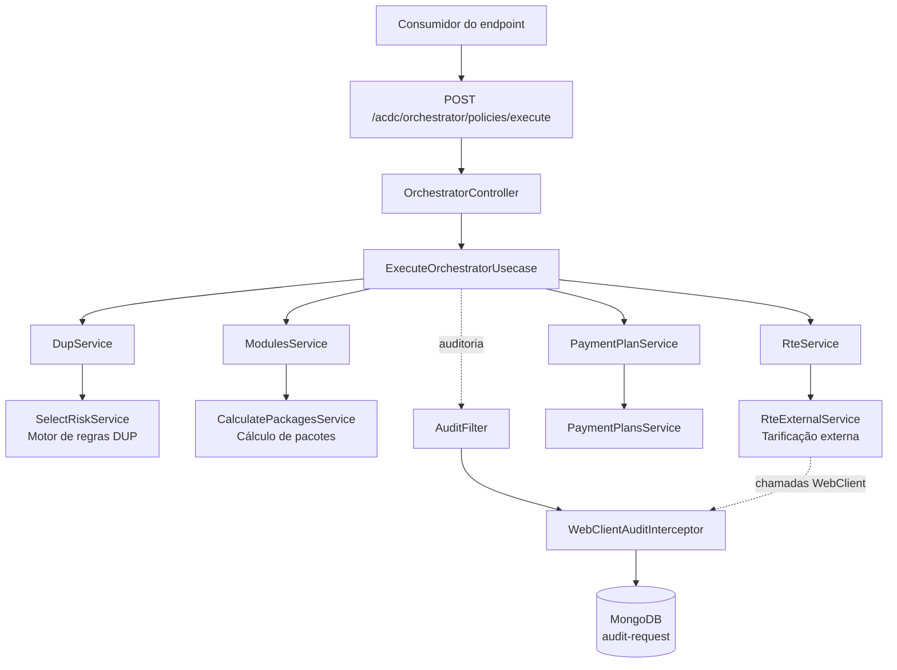
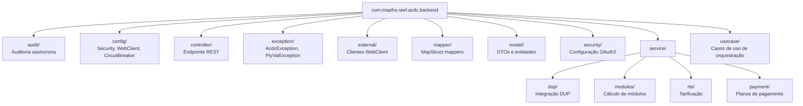

# REEF-ACDC Backend — Índice de Documentação, Arquitetura de Orquestração e Módulos Funcionais

## 1. Metadados do Documento
- **Arquivo de Origem:** `REEF-ACDC — Documentación`
- **Tipo de Documento:** Arquitetura de Software
- **Domínio / Sistema:** REEF-ACDC Backend
- **Público-Alvo:** Desenvolvedores, Arquitetos, Operação e Analistas Funcionais
- **Data/Versão Identificada:** Não identificada

---

## 2. Resumo Executivo & Contexto de Negócio

O documento apresenta o índice da documentação técnica do sistema **REEF-ACDC Backend**, uma aplicação cujo context path é `/acdc`. A solução é implementada com **Spring Boot 3**, **Java 21**, **WebFlux WebClient** e **MongoDB**.

A arquitetura organiza o domínio em quatro áreas documentais principais: **ACDC**, módulo principal responsável por endpoints, orquestração, auditoria e segurança; **DUP**, motor de regras e módulo associado; **MODULOS**, responsável pelo cálculo de módulos e pacotes de coberturas; e **RTE**, responsável pela tarificação externa.

O fluxo central exposto é iniciado pelo endpoint `POST /acdc/orchestrator/policies/execute`. A requisição é recebida por `OrchestratorController`, encaminhada para `ExecuteOrchestratorUsecase` e distribuída para serviços especializados em seleção de riscos, cálculo de pacotes, tarificação e planos de pagamento.

A solução possui mecanismos transversais de auditoria assíncrona, compostos por `AuditFilter` e `WebClientAuditInterceptor`, com persistência no MongoDB sob a referência `audit-request`. O índice também indica a utilização de `CircuitBreaker` na configuração da aplicação e no contexto da auditoria.

O conteúdo fornecido é um índice documental e uma visão arquitetural resumida. Diversos detalhes operacionais, como contratos HTTP completos, payloads, métodos de autenticação, esquemas MongoDB e fórmulas de tarificação, são apenas referenciados por documentos específicos e não estão detalhados no material bruto analisado.

---

## 3. Arquitetura, Componentes & Tecnologias Envolvidas

### Tecnologias identificadas

| Componente / Tecnologia | Descrição baseada no documento |
| :--- | :--- |
| Spring Boot 3 | Framework informado para o REEF-ACDC Backend. |
| Java 21 | Versão da linguagem Java informada para a aplicação. |
| WebFlux WebClient | Tecnologia indicada para clientes externos WebClient. |
| MongoDB | Banco de dados citado para o modelo de auditoria `audit-request`. |
| MapStruct | Tecnologia indicada para mappers no pacote `mapper/`. |
| OAuth2 | Mecanismo de segurança referenciado no pacote `security/`. |
| CircuitBreaker | Componente de configuração Spring e de auditoria citado no documento. |

### Componentes e módulos

| Componente | Responsabilidade identificada | Referência documental |
| :--- | :--- | :--- |
| `OrchestratorController` | Recebe a chamada do endpoint de execução do orquestrador. | `ACDC/ENDPOINT_BATCH_ORCHESTATOR.md` |
| `ExecuteOrchestratorUsecase` | Caso de uso de orquestração acionado pelo controlador. | `usecase/` |
| `DupService` | Integração com o módulo DUP. | `DUP/DUP_ENGINE.md` |
| `SelectRiskService` | Serviço relacionado à seleção de riscos no motor de regras DUP. | `DUP/DUP_ENGINE.md` |
| `ModulesService` | Serviço de integração para cálculo de módulos. | `MODULOS/MODULES_SERVICE.md` |
| `CalculatePackagesService` | Serviço de cálculo de pacotes. | `MODULOS/MODULES_SERVICE.md` |
| `RteService` | Serviço relacionado à tarificação. | `RTE/` |
| `RteExternalService` | Cliente/serviço externo de tarificação. | `RTE/` e `ACDC/EXTERNAL_CLIENTS.md` |
| `PaymentPlanService` | Serviço associado a planos de pagamento. | Não detalhado adicionalmente |
| `PaymentPlansService` | Serviço de planos de pagamento. | Não detalhado adicionalmente |
| `AuditFilter` | Componente de auditoria transversal. | `ACDC/AUDIT.md` |
| `WebClientAuditInterceptor` | Interceptador de auditoria para chamadas WebClient. | `ACDC/AUDIT.md` |
| MongoDB / `audit-request` | Persistência relacionada à auditoria assíncrona. | `ACDC/AUDIT.md` |

### Fluxo arquitetural extraído



### Estrutura de pacotes



> **Nota de Análise:** O documento lista `PaymentPlanService` e `PaymentPlansService`, mas não descreve regras, operações, contratos ou dependências desses serviços.

> **Nota de Análise:** O documento menciona clientes WebClient externos, autenticação e endpoints, porém não apresenta no conteúdo bruto os URLs, métodos HTTP, headers, payloads ou mecanismos de autenticação específicos.

---

## 4. Regras de Negócio, Especificações Funcionais & Processos

### Processo de execução do orquestrador

1. Um consumidor chama o endpoint `POST /acdc/orchestrator/policies/execute`.
2. O endpoint é atendido por `OrchestratorController`.
3. `OrchestratorController` encaminha o processamento para `ExecuteOrchestratorUsecase`.
4. `ExecuteOrchestratorUsecase` aciona `DupService`.
5. `DupService` utiliza `SelectRiskService`, associado ao motor de regras DUP, para seleção de riscos.
6. `ExecuteOrchestratorUsecase` aciona `ModulesService`.
7. `ModulesService` utiliza `CalculatePackagesService` para cálculo de módulos e pacotes.
8. `ExecuteOrchestratorUsecase` aciona `RteService`.
9. `RteService` utiliza `RteExternalService` para tarificação.
10. `ExecuteOrchestratorUsecase` aciona `PaymentPlanService`, que se relaciona a `PaymentPlansService`.
11. A auditoria ocorre de modo transversal por `AuditFilter` e `WebClientAuditInterceptor`.
12. A persistência de auditoria utiliza MongoDB, com referência a `audit-request`.

### Regras e capacidades documentadas por módulo

| Módulo | Regras, funções ou capacidades explicitamente referenciadas |
| :--- | :--- |
| ACDC | Endpoints online granulares, orquestração batch, cotizações, clientes externos, auditoria e segurança. |
| DUP | Motor de regras, passos, operações, mapeamento `OPlyPlyCDto → RiskSelectionRequest` e valores fixos `fixedValues.*` para seleção de riscos. |
| MODULOS | Cálculo de módulos, pacotes e parâmetros utilizáveis em `COVERAGE-PACKAGE-DEFINITION.rules[]`. |
| RTE | Configuração de conceitos de desagregação, fórmulas, tipos de cálculo, bases técnicas e integração com tarificação externa. |
| Cotizações | Persistência de cotações e simulações, uso de `quotationId`, versionamento e consulta. |
| Auditoria | Auditoria assíncrona, estratégias, modelo MongoDB e Circuit Breaker. |
| Segurança | O índice indica que a documentação de segurança está pendente de conclusão por Alberto Rodrigo e Santiago Conde. |

> **Nota de Análise:** Não foram fornecidas regras detalhadas para os cálculos em `COVERAGE-PACKAGE-DEFINITION.rules[]`, nem fórmulas RTE, definições de `fixedValues.*`, estrutura de `RiskSelectionRequest` ou definição de `OPlyPlyCDto`.

---

## 5. Tabelas de Parâmetros, Ambientes e Estruturas de Dados

| Item / Parâmetro | Descrição / Função | Tipo / Valores / Formato | Ambiente / Observações |
| :--- | :--- | :--- | :--- |
| URL da documentação REEF-ACDC Backend | Portal de documentação do REEF-ACDC Backend. | `https://reef.acdc-dev.es.emea.aws.mapfre.net/acdc/docs-portal/index.html` | O domínio contém `acdc-dev`; o documento não explica formalmente a classificação do ambiente. |
| Context path | Prefixo de contexto da aplicação. | `/acdc` | REEF-ACDC Backend |
| Endpoint de execução | Inicia o fluxo do orquestrador de políticas. | `POST /acdc/orchestrator/policies/execute` | Endpoint principal apresentado no diagrama textual. |
| `quotationId` | Identificador citado no contexto de persistência de cotações e simulações. | Não detalhado | Associado a versionamento e consulta. |
| `OPlyPlyCDto` | Objeto de origem citado em um mapeamento do motor DUP. | DTO; estrutura não detalhada | Mapeado para `RiskSelectionRequest`. |
| `RiskSelectionRequest` | Objeto de destino citado para seleção de riscos. | Request; estrutura não detalhada | Usado no motor de regras DUP. |
| `fixedValues.*` | Guia de dados fixos para seleção de riscos. | Prefixo de propriedades/campos; valores não detalhados | Módulo DUP. |
| `COVERAGE-PACKAGE-DEFINITION.rules[]` | Estrutura de regras que aceita parâmetros utilizáveis no cálculo de módulos e pacotes. | Lista/array de regras; schema não detalhado | Módulo MODULOS. |
| `audit-request` | Referência do modelo/persistência de auditoria no MongoDB. | Não detalhado | MongoDB; auditoria assíncrona. |
| Spring Boot | Tecnologia de aplicação. | Versão 3 | REEF-ACDC Backend. |
| Java | Linguagem/plataforma de desenvolvimento. | Versão 21 | REEF-ACDC Backend. |
| WebFlux WebClient | Cliente HTTP reativo para integrações externas. | Tecnologia informada | Clientes externos e interceptor de auditoria. |
| MongoDB | Banco de dados citado. | Tecnologia informada | Auditoria e modelo `audit-request`. |
| OAuth2 | Configuração de segurança citada. | Protocolo/mecanismo de autorização; detalhes não fornecidos | Pacote `security/`. |
| CircuitBreaker | Mecanismo de resiliência citado. | Configuração/componente; detalhes não fornecidos | Pacote `config/` e documentação de auditoria. |
| `AcdcException` | Exceção da aplicação. | Classe de exceção | Pacote `exception/`. |
| `PlyValException` | Exceção da aplicação. | Classe de exceção | Pacote `exception/`. |

### Estrutura documental

| Diretório / Documento | Conteúdo descrito |
| :--- | :--- |
| `docs/ACDC/` | Endpoints, orquestração, auditoria e segurança do módulo principal. |
| `docs/DUP/` | Motor de regras DUP e módulo `reef-acdc-dup`. |
| `docs/MODULOS/` | Cálculo de módulos e pacotes de coberturas. |
| `docs/RTE/` | Tarificação externa RTE. |
| `ACDC/ENDPOINT_BATCH_ORCHESTATOR.md` | Endpoint do orquestrador batch, fluxo E2E e validação de entrada. |
| `ACDC/COTIZACIONES.md` | Persistência de cotações e simulações, `quotationId`, versionamento e consulta. |
| `ACDC/ENDPOINTS_ONLINE.md` | Endpoints online granulares para atributos, controles técnicos, pacotes, tarificação, formulários e bases técnicas. |
| `ACDC/EXTERNAL_CLIENTS.md` | Configuração, endpoints e autenticação de clientes WebClient externos. |
| `ACDC/AUDIT.md` | Auditoria assíncrona, estratégias, modelo MongoDB e Circuit Breaker. |
| `ACDC/SECURITY.md` | Segurança; pendente de conclusão segundo o índice. |
| `DUP/DUP_ENGINE.md` | Motor de regras DUP, operações, mapeamento para `RiskSelectionRequest` e `fixedValues.*`. |
| `DUP/README_DUP_MODULE.md` | Entidades, serviços, configuração e uso de `reef-acdc-dup` desde `reef-acdc-back`. |
| `MODULOS/MODULES_SERVICE.md` | Cálculo de módulos/pacotes e parâmetros de `COVERAGE-PACKAGE-DEFINITION.rules[]`. |
| `RTE/RTE_TARIFF_CONFIGURATION.md` | Conceitos de desagregação, fórmulas, tipos de cálculo e bases técnicas. |

---

## 6. Bateria de Perguntas & Respostas para RAG (FAQ Sintético)

### P1: Qual endpoint inicia o fluxo de orquestração de políticas no REEF-ACDC Backend?
**R:** O fluxo é iniciado pelo endpoint `POST /acdc/orchestrator/policies/execute`. Esse endpoint direciona a requisição para `OrchestratorController`, que aciona `ExecuteOrchestratorUsecase`.

### P2: Quais tecnologias foram identificadas no REEF-ACDC Backend?
**R:** O documento identifica Spring Boot 3, Java 21, WebFlux WebClient e MongoDB. Também cita MapStruct para mapeadores, OAuth2 no contexto de segurança e CircuitBreaker em configurações e auditoria.

### P3: Qual é o context path da aplicação REEF-ACDC?
**R:** O context path informado pelo documento é `/acdc`.

### P4: Como o motor de regras DUP participa do fluxo principal?
**R:** `ExecuteOrchestratorUsecase` chama `DupService`, que se relaciona com `SelectRiskService`. O motor DUP é documentado como responsável por passos, operações, mapeamento de `OPlyPlyCDto` para `RiskSelectionRequest` e uso de `fixedValues.*` para seleção de riscos.

### P5: Qual componente realiza o cálculo de módulos e pacotes?
**R:** O cálculo de módulos e pacotes é associado a `ModulesService` e `CalculatePackagesService`. A documentação referenciada também informa que parâmetros podem ser utilizados em `COVERAGE-PACKAGE-DEFINITION.rules[]`.

### P6: Como a tarificação é integrada ao REEF-ACDC?
**R:** A orquestração chama `RteService`, que utiliza `RteExternalService` para tarificação. O índice aponta documentação específica para conceitos de desagregação, fórmulas, tipos de cálculo, bases técnicas e integração com RTE, mas não fornece esses detalhes no conteúdo bruto.

### P7: Como funciona a auditoria no REEF-ACDC Backend?
**R:** A auditoria é descrita como assíncrona e utiliza `AuditFilter` e `WebClientAuditInterceptor`. O fluxo de auditoria possui persistência em MongoDB com referência a `audit-request`, e a documentação de auditoria também cita Circuit Breaker.

### P8: Onde estão localizadas as exceções da aplicação?
**R:** As exceções estão no pacote `com.mapfre.reef.acdc.backend.exception/`. O documento cita especificamente `AcdcException` e `PlyValException`.

### P9: O que é documentado sobre cotações e simulações?
**R:** O documento referencia `ACDC/COTIZACIONES.md`, que cobre persistência de cotações e simulações, uso de `quotationId`, versionamento e consulta. O conteúdo analisado não apresenta o modelo de dados nem as regras de versionamento.

### P10: Quais responsabilidades possuem os clientes externos?
**R:** Os clientes externos ficam no pacote `external/` e utilizam WebFlux WebClient. A documentação `ACDC/EXTERNAL_CLIENTS.md` é indicada para configuração, endpoints e autenticação; também inclui uma seção referente à integração com RTE.

### P11: A documentação de segurança está completa?
**R:** Não. O índice marca `ACDC/SECURITY.md` como pendente de conclusão por Alberto Rodrigo e Santiago Conde. Portanto, detalhes de OAuth2, autorização, autenticação e políticas de segurança não podem ser inferidos a partir do material fornecido.

### P12: Qual é a estrutura de alto nível dos pacotes Java do REEF-ACDC Backend?
**R:** A raiz é `com.mapfre.reef.acdc.backend`, contendo os pacotes `audit`, `config`, `controller`, `exception`, `external`, `mapper`, `model`, `security`, `service` e `usecase`. Dentro de `service` existem os subpacotes `dup`, `modules`, `rte` e `payment`.

---

## 7. Glossário de Termos, Siglas & Conceitos-Chave

- **ACDC:** Módulo principal do REEF-ACDC, associado a endpoints, orquestração, auditoria e segurança.
- **DUP:** Motor de regras e módulo `reef-acdc-dup`.
- **RTE:** Área de tarificação externa, incluindo configuração de tarifas e integração por cliente externo.
- **DTO:** Data Transfer Object. O termo aparece implicitamente no nome `OPlyPlyCDto`; o documento não expande formalmente a sigla.
- **E2E:** End-to-End. O documento cita fluxo E2E no contexto do endpoint do orquestrador batch.
- **MongoDB:** Banco de dados citado para auditoria e referência `audit-request`.
- **OAuth2:** Mecanismo/protocolo de segurança citado na configuração do pacote `security/`.
- **WebClient:** Cliente HTTP reativo do WebFlux, utilizado para integrações externas.
- **CircuitBreaker:** Mecanismo de resiliência citado em configurações e auditoria.
- **MapStruct:** Tecnologia de mapeamento de objetos citada no pacote `mapper/`.
- **`quotationId`:** Identificador citado para persistência, versionamento e consulta de cotações e simulações.
- **`fixedValues.*`:** Guia de dados fixos referido para seleção de riscos no motor DUP.
- **`COVERAGE-PACKAGE-DEFINITION.rules[]`:** Estrutura de regras associada a parâmetros utilizados no cálculo de módulos e pacotes.
- **`audit-request`:** Referência de persistência/modelo de auditoria no MongoDB.
- **`OPlyPlyCDto → RiskSelectionRequest`:** Mapeamento referido no motor DUP para seleção de riscos.

---

## 8. Notas Críticas, Riscos & Limitações

- A documentação de segurança em `ACDC/SECURITY.md` é explicitamente indicada como pendente de conclusão por Alberto Rodrigo e Santiago Conde.
- O conteúdo analisado é predominantemente um índice de documentação e uma visão arquitetural de alto nível; ele não contém contratos completos dos endpoints.
- Não foram especificados payloads, métodos HTTP além de `POST /acdc/orchestrator/policies/execute`, códigos de resposta, headers, URLs de serviços externos, credenciais ou fluxos OAuth2.
- O documento cita `CircuitBreaker`, mas não informa biblioteca utilizada, políticas de abertura/fechamento, tempos de espera, limites de falhas ou estratégias de fallback.
- O modelo MongoDB de `audit-request` é citado, mas seus campos, índices, política de retenção e estratégia de consulta não são apresentados.
- As fórmulas, conceitos de desagregação, tipos de cálculo e bases técnicas do RTE são somente referenciados por documentação específica, sem detalhamento no conteúdo bruto.
- A estrutura e os valores de `fixedValues.*`, `OPlyPlyCDto`, `RiskSelectionRequest` e `COVERAGE-PACKAGE-DEFINITION.rules[]` não foram fornecidos.
- Os serviços `PaymentPlanService` e `PaymentPlansService` aparecem no fluxo de orquestração, mas não possuem detalhamento funcional adicional.
- Não é possível afirmar que o domínio da URL `reef.acdc-dev.es.emea.aws.mapfre.net` represente formalmente um ambiente de desenvolvimento; o documento não define essa classificação.

---

## 9. Conteúdo Bruto Estruturado (Referência Fiel)

```text
# REEF-ACDC — Documentación

REEF-ACDC — Documentación


# [REEF-ACDC Backend](https://reef.acdc-dev.es.emea.aws.mapfre.net/acdc/docs-portal/index.html)

* **Inicio**
  + [Documentación general](#/README "Documentación general")* **ACDC — Módulo principal**
    + [Endpoints Online](#/ACDC/ENDPOINTS_ONLINE "Endpoints Online")+ [Orquestador Batch](#/ACDC/ENDPOINT_BATCH_ORCHESTATOR "Orquestador Batch")+ [Cotizaciones](#/ACDC/COTIZACIONES "Cotizaciones")+ [Clientes externos](#/ACDC/EXTERNAL_CLIENTS "Clientes externos")+ [Auditoría](#/ACDC/AUDIT "Auditoría")+ [Seguridad](#/ACDC/SECURITY "Seguridad")* **DUP — Motor de reglas**
      + [DUP Engine](#/DUP/DUP_ENGINE "DUP Engine")+ [Módulo DUP](#/DUP/README_DUP_MODULE "Módulo DUP")* **Módulos**
        + [Cálculo de Módulos](#/MODULOS/MODULES_SERVICE "Cálculo de Módulos")* **RTE — Tarificación**
          + [Configuración de tarifas](#/RTE/RTE_TARIFF_CONFIGURATION "Configuración de tarifas")

# [REEF-ACDC — Índice de documentación](#/?id=reef-acdc-%c3%8dndice-de-documentaci%c3%b3n)

> **Spring Boot 3 · Java 21 · WebFlux WebClient · MongoDB**  
> Context path: `/acdc`

---

## [📁 Estructura de la documentación](#/?id=%f0%9f%93%81-estructura-de-la-documentaci%c3%b3n)

```
docs/
├── ACDC/        → Endpoints, orquestación, auditoría y seguridad del módulo principal
├── DUP/         → Motor de reglas DUP y módulo reef-acdc-dup
├── MODULOS/     → Cálculo de módulos y paquetes de coberturas
└── RTE/         → Tarificación externa (RTE)
```

---

## [🔷 ACDC — Módulo principal](#/?id=%f0%9f%94%b7-acdc-m%c3%b3dulo-principal)

| Documento | Descripción |
| --- | --- |
| [ENDPOINT\_BATCH\_ORCHESTATOR.md](#/ACDC/ENDPOINT_BATCH_ORCHESTATOR) | Endpoint del orquestador batch, flujo E2E y validación de entrada |
| [COTIZACIONES.md](#/ACDC/COTIZACIONES) | Persistencia de cotizaciones y simulaciones: `quotationId`, versionado y consulta |
| [ENDPOINTS\_ONLINE.md](#/ACDC/ENDPOINTS_ONLINE) | Endpoints online granulares: atributos, controles técnicos, paquetes, tarificación, formularios y bases técnicas |
| [EXTERNAL\_CLIENTS.md](#/ACDC/EXTERNAL_CLIENTS) | Clientes WebClient externos: configuración, endpoints y autenticación |
| [AUDIT.md](#/ACDC/AUDIT) | Sistema de auditoría asíncrona: estrategias, modelo MongoDB y Circuit Breaker |
| [SECURITY.md](#/ACDC/SECURITY) | ⚠️ Seguridad — pendiente de completar por Alberto Rodrigo y Santiago Conde |

---

## [🔷 DUP — Motor de reglas y módulo dup](#/?id=%f0%9f%94%b7-dup-motor-de-reglas-y-m%c3%b3dulo-dup)

| Documento | Descripción |
| --- | --- |
| [DUP\_ENGINE.md](#/DUP/DUP_ENGINE) | Motor de reglas DUP: pasos, operaciones, mapeo `OPlyPlyCDto → RiskSelectionRequest` y guía de datos fijos `fixedValues.*` para selección de riesgos |
| [README\_DUP\_MODULE.md](#/DUP/README_DUP_MODULE) | Descripción del módulo `reef-acdc-dup`: entidades, servicios, configuración y uso desde `reef-acdc-back` |

---

## [🔷 MODULOS — Cálculo de módulos y coberturas](#/?id=%f0%9f%94%b7-modulos-c%c3%a1lculo-de-m%c3%b3dulos-y-coberturas)

| Documento | Descripción |
| --- | --- |
| [MODULES\_SERVICE.md](#/MODULOS/MODULES_SERVICE) | Cálculo de módulos/paquetes y parámetros utilizables en `COVERAGE-PACKAGE-DEFINITION.rules[]` |

---

## [🔷 RTE — Tarificación](#/?id=%f0%9f%94%b7-rte-tarificaci%c3%b3n)

| Documento | Descripción |
| --- | --- |
| [RTE\_TARIFF\_CONFIGURATION.md](#/RTE/RTE_TARIFF_CONFIGURATION) | Configuración de conceptos de desglose, fórmulas, tipos de cálculo y bases técnicas |
| [EXTERNAL\_CLIENTS.md](#/ACDC/EXTERNAL_CLIENTS?id=5-rteexternalservice--tarificaci%c3%b3n) | Integración con RTE (cliente, endpoint y payload principal) |

---

## [Arquitectura en una línea](#/?id=arquitectura-en-una-l%c3%adnea)

```
POST /acdc/orchestrator/policies/execute
        │
        ▼
OrchestratorController  →  ExecuteOrchestratorUsecase
        │
        ├── DupService  →  SelectRiskService  (motor de reglas)         → docs/DUP/
        ├── ModulesService  →  CalculatePackagesService  (paquetes)     → docs/MODULOS/
        ├── RteService  →  RteExternalService  (tarificación)           → docs/RTE/
        └── PaymentPlanService  →  PaymentPlansService  (planes de pago)
                                          ↕
                                   AuditFilter + WebClientAuditInterceptor  → docs/ACDC/AUDIT.md
                                          ↕
                                      MongoDB (audit-request)
```

---

## [Estructura de paquetes](#/?id=estructura-de-paquetes)

```
com.mapfre.reef.acdc.backend
├── audit/          → Auditoría asíncrona (→ ACDC/AUDIT.md)
├── config/         → Configuración Spring (Security, WebClient, CircuitBreaker)
├── controller/     → Endpoints REST (→ ACDC/ENDPOINT_BATCH_ORCHESTATOR.md, ACDC/ENDPOINTS_ONLINE.md)
├── exception/      → AcdcException, PlyValException
├── external/       → Clientes WebClient (→ ACDC/EXTERNAL_CLIENTS.md)
├── mapper/         → MapStruct mappers
├── model/          → DTOs y entidades
├── security/       → Configuración OAuth2 (→ ACDC/SECURITY.md)
├── service/
│   ├── dup/        → Integración con módulo DUP (→ DUP/DUP_ENGINE.md)
│   ├── modules/    → Cálculo de módulos (→ MODULOS/MODULES_SERVICE.md)
│   ├── rte/        → Tarificación (→ RTE/)
│   └── payment/    → Planes de pago
└── usecase/        → Casos de uso de orquestación
```
```
