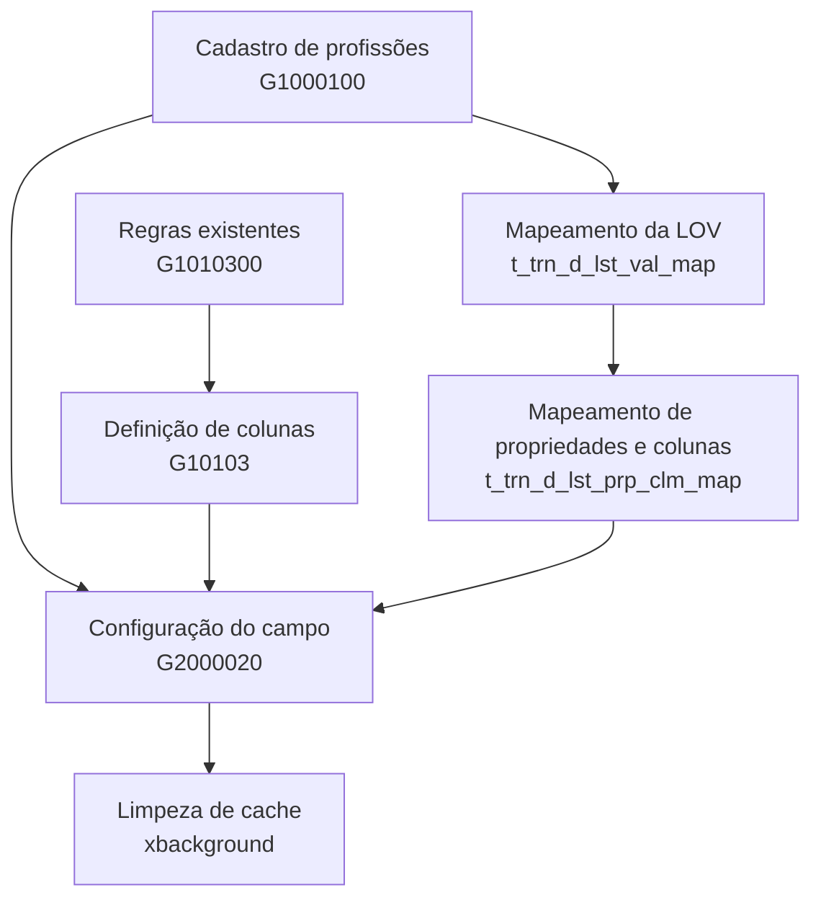
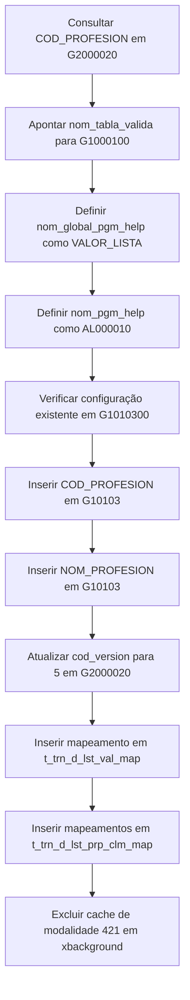

# Configuração de Profissões como Lista de Valores (LOV) no TRON2000

## 1. Metadados do Documento
- **Arquivo de Origem:** Não identificado — conteúdo bruto fornecido diretamente.
- **Tipo de Documento:** Procedimento técnico de configuração de banco de dados.
- **Domínio / Sistema:** TRON2000 / TRN — configuração de profissões para modalidade 42101.
- **Público-Alvo:** Desenvolvedores, administradores de banco de dados, analistas funcionais e operação.
- **Data/Versão Identificada:** Versão configurada `5`; data não identificada.

---

## 2. Resumo Executivo & Contexto de Negócio

O procedimento configura o campo de profissão (`COD_PROFESION`) para funcionar como uma Lista de Valores (LOV) no sistema TRON2000. A referência de dados para as profissões é a tabela `G1000100`, cadastrada para a companhia `15` e idioma `BR`.

A configuração principal ocorre na tabela de dados variáveis `G2000020`, para o ramo `421` e a modalidade `42101`. O campo `COD_PROFESION` deve apontar para a tabela `G1000100`, utilizar o tipo de exibição `VALOR_LISTA`, utilizar o programa de ajuda `AL000010` e estar associado à versão `5`.

A definição estrutural da LOV requer registros de configuração da tabela `G1000100` na tabela `G10103`. São configuradas duas colunas: `COD_PROFESION`, como código numérico visível de seis posições, e `NOM_PROFESION`, como nome textual visível de trinta posições.

O procedimento também registra o mapeamento da lista de valores nas tabelas `t_trn_d_lst_val_map` e `t_trn_d_lst_prp_clm_map`. Os campos de propriedade `JOB_NAM` e `PRF_VAL` são vinculados, respectivamente, às colunas `NOM_PROFESION` e `COD_PROFESION`.

Após as alterações, o cache relacionado à modalidade deve ser removido da tabela `xbackground`, usando o critério `cod_marco LIKE '%421%'`. O documento fornece ainda uma consulta auxiliar para identificar tipos, comentários e valores de campos de tabelas do esquema `TRON2000`.

---

## 3. Arquitetura, Componentes & Tecnologias Envolvidas

### Componentes e tabelas identificados

| Componente / Tabela | Função no procedimento |
| :--- | :--- |
| `G1000100` | Tabela de referência para o cadastro e a LOV de profissões. |
| `G2000020` | Tabela de dados variáveis onde o campo `COD_PROFESION` é configurado. |
| `G1010300` | Tabela consultada para verificar regras existentes associadas à tabela `G1000100`. |
| `G10103` | Tabela onde são inseridas configurações das colunas da tabela de profissões. |
| `t_trn_d_lst_val_map` | Tabela de mapeamento da lista de valores. |
| `t_trn_d_lst_prp_clm_map` | Tabela de mapeamento entre propriedades e colunas da lista de valores. |
| `xbackground` | Tabela usada para limpeza de cache relacionado à modalidade. |
| `g1010031` | Tabela auxiliar consultada para obter valores e nomes de valores de campos. |
| `all_tab_columns` | Visão Oracle consultada para identificar colunas, tipos e tamanhos. |
| `all_col_comments` | Visão Oracle consultada para recuperar comentários de colunas. |
| `AL000010` | Programa de ajuda definido para o campo de profissão. |
| `VALOR_LISTA` | Tipo de exibição e configuração de lista de valores. |
| `TRN` | Módulo, instalação e valor de inserção identificados nas configurações. |
| `TW` | Origem (`src`) usada nos mapeamentos de LOV. |



### Fluxo técnico de configuração



> **Nota de Análise:** O documento não detalha os métodos de cadastro dos registros de profissão em `G1000100`, os contratos de interface, a aplicação consumidora da LOV ou mecanismos transacionais para execução conjunta dos comandos SQL.

---

## 4. Regras de Negócio, Especificações Funcionais & Processos

### 4.1 Cadastro e referência de profissões

1. O cadastro de profissões é realizado na tabela `G1000100`.
2. A referência é configurada para:
   - `cod_cia = 15`
   - `cod_idioma = 'BR'`
3. A tabela `G1000100` passa a ser a LOV do campo de profissão.

### 4.2 Identificação do campo de profissão

O campo de profissão deve ser localizado na tabela `G2000020` pelos seguintes critérios:

- Companhia: `cod_cia = 15`
- Ramo: `cod_ramo = 421`
- Campo: `cod_campo = 'COD_PROFESION'`
- Modalidade: `cod_modalidad = 42101`

### 4.3 Configuração do campo como lista de valores

O registro localizado em `G2000020` deve ser atualizado para:

- Validar valores na tabela `G1000100`, por meio de `nom_tabla_valida`.
- Exibir os valores como lista, por meio de `nom_global_pgm_help = 'VALOR_LISTA'`.
- Usar o programa de ajuda `AL000010`, por meio de `nom_pgm_help`.

### 4.4 Configuração estrutural da tabela de profissões

Antes da inclusão, deve ser consultada a tabela `G1010300` para verificar regras preexistentes para:

- Companhia: `15`
- Tabela: `G1000100`

Embora existam registros prévios, devem ser incluídos dois novos registros na tabela `G10103`.

#### Registro 1 — Código da profissão

O código da profissão deve ser configurado com os seguintes critérios:

- Coluna: `COD_PROFESION`
- Tipo: `N`
- Ordem da tabela: `1`
- Sequência de coluna: `1`
- Tamanho visível: `6`
- Módulo: `TRN`
- Texto: `685`
- Global: `VALOR_LISTA`
- Indicador de função: `N`
- Visível, filtrável e ordenável: `S`
- Instalação: `TRN`
- Companhia: `15`
- Versão: `5`

#### Registro 2 — Nome da profissão

O nome da profissão deve ser configurado com os seguintes critérios:

- Coluna: `NOM_PROFESION`
- Tipo: `C`
- Ordem da tabela: `1`
- Sequência de coluna: `2`
- Tamanho visível: `30`
- Módulo: `TRN`
- Texto: `686`
- Global: valor vazio
- Indicador de função: `N`
- Visível, filtrável e ordenável: `S`
- Instalação: `TRN`
- Companhia: `15`
- Versão: `5`

### 4.5 Vinculação da versão

Após criar os registros de configuração, a tabela `G2000020` deve receber:

- `cod_version = 5`
- `cod_cia = 15`
- `cod_campo = 'COD_PROFESION'`
- `cod_modalidad = 42101`

### 4.6 Mapeamento da Lista de Valores

A LOV da tabela `G1000100` deve receber um registro em `t_trn_d_lst_val_map` com:

- `ins_val = 'TRN'`
- `obj_prp_idn = 'G1000100'`
- `src = 'TW'`
- `cod_lst_typ = 'V'`
- `cod_lov_aer = 'G1000100'`
- `nbr_vrs_aer = 5`
- `nbr_vrs = 5`

Os mapeamentos de propriedade para coluna devem ser criados em `t_trn_d_lst_prp_clm_map`:

1. `JOB_NAM` associado a `NOM_PROFESION`.
2. `PRF_VAL` associado a `COD_PROFESION`.

Ambos os registros usam:

- `src = 'TW'`
- `obj_prp_idn = 'G1000100'`
- `nbr_vrs = 5`

### 4.7 Limpeza de cache

Após executar os comandos de inclusão e atualização, deve ser removido o cache com:

- Tabela: `tron2000.xbackground`
- Critério: `cod_marco LIKE '%421%'`

### 4.8 Consulta auxiliar de metadados

Para entender colunas e preenchimentos de tabelas, a consulta auxiliar:

1. Consulta colunas da visão `all_tab_columns`.
2. Recupera comentários de `all_col_comments`.
3. Recupera valores de `tron2000.g1010031`.
4. Restringe a consulta ao proprietário `TRON2000`.
5. Usa `A1001410` como exemplo de tabela a ser alterada para a tabela desejada.
6. Usa companhia `15` e idioma `BR` para relacionar registros de `g1010031`.

---

## 5. Tabelas de Parâmetros, Ambientes e Estruturas de Dados

| Item / Parâmetro | Descrição / Função | Tipo / Valores / Formato | Ambiente / Observações |
| :--- | :--- | :--- | :--- |
| `cod_cia` | Identificador da companhia. | `15` | Usado nas tabelas `G1000100`, `G2000020`, `G1010300`, `G10103` e consulta auxiliar. |
| `cod_idioma` | Identificador do idioma. | `'BR'` | Usado no cadastro de profissões e na consulta à `g1010031`. |
| `cod_ramo` | Identificador do ramo. | `421` | Usado para localizar o campo de profissão em `G2000020`. |
| `cod_modalidad` | Identificador da modalidade. | `42101` | Usado na configuração do campo `COD_PROFESION`. |
| `cod_campo` | Identificador do campo de profissão. | `'COD_PROFESION'` | Campo configurado na tabela `G2000020`. |
| `nom_tabla_valida` | Tabela de validação do campo. | `'G1000100'` | Configura a tabela de profissões como origem da LOV. |
| `nom_global_pgm_help` | Tipo de exibição ou ajuda global. | `'VALOR_LISTA'` | Indica exibição em formato de lista. |
| `nom_pgm_help` | Programa de ajuda. | `'AL000010'` | Definido no registro de `G2000020`. |
| `cod_version` | Versão da configuração. | `5` | Aplicada em `G10103`, `G2000020` e mapeamentos de LOV. |
| `nom_tabla` | Nome da tabela configurada. | `'G1000100'` | Usado na consulta à tabela `G1010300`. |
| `nom_columna` | Nome da coluna da tabela de profissões. | `COD_PROFESION` ou `NOM_PROFESION` | Inserido na tabela `G10103`. |
| `tip_columna` | Tipo de coluna configurada. | `N` ou `C` | `N` para código; `C` para nome. |
| `lng_visible` | Tamanho visível da coluna. | `6` ou `30` | `6` para código; `30` para nome. |
| `mca_funcion` | Indicador de função. | `'N'` | Usado nos dois registros de `G10103`. |
| `cod_modulo` | Código do módulo. | `'TRN'` | Usado nos registros de `G10103`. |
| `cod_texto` | Código de texto associado à coluna. | `685` ou `686` | `685` para código; `686` para nome. |
| `nom_global` | Configuração global associada à coluna. | `'VALOR_LISTA'` ou `''` | Preenchido para `COD_PROFESION`; vazio para `NOM_PROFESION`. |
| `mca_visible` | Indicador de visibilidade. | `'S'` | Usado nos dois registros de `G10103`. |
| `mca_filtro` | Indicador de filtro. | `'S'` | Usado nos dois registros de `G10103`. |
| `mca_order_by` | Indicador de ordenação. | `'S'` | Usado nos dois registros de `G10103`. |
| `cod_instalacion` | Código de instalação. | `'TRN'` | Usado nos dois registros de `G10103`. |
| `ins_val` | Valor de inserção no mapeamento da LOV. | `'TRN'` | Usado em `t_trn_d_lst_val_map`. |
| `obj_prp_idn` | Identificador do objeto/propriedade. | `'G1000100'` | Usado nos mapeamentos de LOV. |
| `src` | Origem do mapeamento. | `'TW'` | Usado nas tabelas de mapeamento de LOV. |
| `cod_lst_typ` | Tipo da lista. | `'V'` | Usado em `t_trn_d_lst_val_map`. |
| `cod_lov_aer` | Identificador da LOV. | `'G1000100'` | Usado em `t_trn_d_lst_val_map`. |
| `nbr_vrs_aer` | Número da versão AER. | `5` | Usado em `t_trn_d_lst_val_map`. |
| `nbr_vrs` | Número da versão. | `5` | Usado em ambas as tabelas de mapeamento. |
| `JOB_NAM` | Propriedade mapeada para o nome da profissão. | `'JOB_NAM'` | Associada a `NOM_PROFESION`. |
| `PRF_VAL` | Propriedade mapeada para o código da profissão. | `'PRF_VAL'` | Associada a `COD_PROFESION`. |
| `cod_marco` | Campo usado para identificar cache associado à modalidade. | `LIKE '%421%'` | Usado no `DELETE` da tabela `xbackground`. |
| `A1001410` | Tabela de exemplo da consulta auxiliar. | `'A1001410'` | Deve ser substituída pela tabela desejada. |

---

## 6. Bateria de Perguntas & Respostas para RAG (FAQ Sintético)

### P1: Qual tabela deve ser usada como Lista de Valores para o campo de profissão?
**R:** A tabela `G1000100` deve ser usada como referência da Lista de Valores (LOV) para o campo de profissão. O cadastro de profissões é realizado nessa tabela para `cod_cia = 15` e `cod_idioma = 'BR'`.

### P2: Como localizar o campo `COD_PROFESION` na tabela `G2000020`?
**R:** O campo deve ser localizado em `tron2000.G2000020` pelos critérios `cod_cia = 15`, `cod_ramo = 421`, `cod_campo = 'COD_PROFESION'` e `cod_modalidad = 42101`.

### P3: Quais valores devem ser atualizados em `G2000020` para configurar a LOV de profissões?
**R:** O registro deve receber `nom_tabla_valida = 'G1000100'`, `nom_global_pgm_help = 'VALOR_LISTA'` e `nom_pgm_help = 'AL000010'`, mantendo os critérios de companhia `15`, campo `COD_PROFESION` e modalidade `42101`.

### P4: Qual versão deve ser vinculada ao campo de profissão na tabela `G2000020`?
**R:** O campo `COD_PROFESION` deve ser vinculado à versão `5` por meio da atualização de `cod_version = 5` na tabela `G2000020`, para a companhia `15` e modalidade `42101`.

### P5: Quais colunas devem ser configuradas na tabela `G10103` para a LOV de profissões?
**R:** Devem ser configuradas as colunas `COD_PROFESION` e `NOM_PROFESION`. `COD_PROFESION` possui tipo `N`, tamanho visível `6`, sequência `1` e `nom_global = 'VALOR_LISTA'`. `NOM_PROFESION` possui tipo `C`, tamanho visível `30`, sequência `2` e `nom_global` vazio.

### P6: Quais são os códigos de texto associados ao código e ao nome da profissão?
**R:** O código da profissão, `COD_PROFESION`, usa `cod_texto = 685`. O nome da profissão, `NOM_PROFESION`, usa `cod_texto = 686`.

### P7: Como deve ser criado o mapeamento da Lista de Valores para `G1000100`?
**R:** Deve ser inserido um registro em `t_trn_d_lst_val_map` com `ins_val = 'TRN'`, `obj_prp_idn = 'G1000100'`, `src = 'TW'`, `cod_lst_typ = 'V'`, `cod_lov_aer = 'G1000100'`, `nbr_vrs_aer = 5` e `nbr_vrs = 5`.

### P8: Qual propriedade representa o nome da profissão no mapeamento de colunas da LOV?
**R:** A propriedade `JOB_NAM` representa o nome da profissão e deve ser mapeada para a coluna `NOM_PROFESION` na tabela `t_trn_d_lst_prp_clm_map`, com `src = 'TW'`, `obj_prp_idn = 'G1000100'` e `nbr_vrs = 5`.

### P9: Qual propriedade representa o código da profissão no mapeamento de colunas da LOV?
**R:** A propriedade `PRF_VAL` representa o código da profissão e deve ser mapeada para a coluna `COD_PROFESION` na tabela `t_trn_d_lst_prp_clm_map`, com origem `TW`, objeto `G1000100` e versão `5`.

### P10: Qual ação deve ser executada após os inserts e updates de configuração?
**R:** Deve ser executada a limpeza do cache na tabela `tron2000.xbackground`, removendo registros cujo campo `cod_marco` corresponda ao critério `LIKE '%421%'`.

### P11: Como verificar se já existem regras configuradas para a tabela de profissões?
**R:** Deve ser consultada a tabela `tron2000.G1010300` com os critérios `cod_cia = 15` e `nom_tabla = 'G1000100'`. O documento informa que havia registros existentes, mas ainda foi necessária a inclusão de dois novos registros.

### P12: Como consultar metadados e comentários de uma tabela do esquema TRON2000?
**R:** A consulta auxiliar utiliza `all_tab_columns`, `all_col_comments` e `tron2000.g1010031` para recuperar identificador, nome, tipo, tamanho, comentário e valores associados às colunas. O exemplo usa `atc.owner = 'TRON2000'` e `atc.table_name = 'A1001410'`, sendo necessário trocar `A1001410` pela tabela desejada.

---

## 7. Glossário de Termos, Siglas & Conceitos-Chave

- **LOV:** Lista de Valores; referência usada para disponibilizar valores selecionáveis para um campo.
- **TRON2000:** Esquema de banco de dados identificado nas instruções SQL do procedimento.
- **TRN:** Código utilizado como módulo, instalação e valor de inserção em configurações.
- **TW:** Valor de origem (`src`) utilizado nos mapeamentos da lista de valores.
- **`COD_PROFESION`:** Campo e coluna que representa o código da profissão.
- **`NOM_PROFESION`:** Coluna que representa o nome da profissão.
- **`VALOR_LISTA`:** Configuração usada como tipo de exibição e valor global da coluna de código da profissão.
- **`AL000010`:** Programa de ajuda configurado para o campo de profissão.
- **`G1000100`:** Tabela utilizada como cadastro e referência de profissões.
- **`G2000020`:** Tabela de dados variáveis onde o campo de profissão é configurado.
- **`G1010300`:** Tabela consultada para identificação de regras de configuração existentes.
- **`G10103`:** Tabela na qual são inseridas definições das colunas configuráveis.
- **`t_trn_d_lst_val_map`:** Tabela de mapeamento de uma lista de valores.
- **`t_trn_d_lst_prp_clm_map`:** Tabela que relaciona propriedades com colunas de uma lista de valores.
- **`xbackground`:** Tabela utilizada para exclusão de cache relacionado à modalidade.
- **`JOB_NAM`:** Propriedade associada ao nome da profissão.
- **`PRF_VAL`:** Propriedade associada ao código da profissão.
- **`cod_version`:** Campo que identifica a versão de configuração.
- **`mca_visible`:** Indicador de visibilidade.
- **`mca_filtro`:** Indicador de disponibilidade para filtro.
- **`mca_order_by`:** Indicador de disponibilidade para ordenação.

---

## 8. Notas Críticas, Riscos & Limitações

- O procedimento modifica tabelas de configuração e mapeamento diretamente por comandos `INSERT`, `UPDATE` e `DELETE`.
- A limpeza de cache remove todos os registros de `xbackground` cujo `cod_marco` contenha `421`; o documento não detalha se o critério pode afetar registros além da modalidade `42101`.
- O documento determina a inclusão de dois registros em `G10103`, apesar de existirem registros prévios consultados em `G1010300`; não são detalhados critérios de idempotência, prevenção de duplicidade ou estratégia de rollback.
- O documento não informa validações posteriores à configuração para comprovar a apresentação da LOV em interface.
- O documento não apresenta controle transacional, gestão de permissões, estratégia de backup ou aprovação operacional para execução dos comandos.
- **Nota de Análise:** O documento informa que `G1000100` é a referência para profissões, mas não descreve sua estrutura completa, os valores permitidos em `COD_PROFESION` ou o processo de manutenção do cadastro.
- **Nota de Análise:** O documento usa `G1010300` para consulta e `G10103` para inclusão. Não há detalhamento explícito sobre a relação estrutural entre essas duas identificações.

---

## 9. Conteúdo Bruto Estruturado (Referência Fiel)

```text
Passo a passo para configuração das profissões

1. Cadastro das profissões

O cadastro das profissões foi realizado na tabela G1000100, utilizando os seguintes parâmetros:

cod_cia = 15

cod_idioma = 'BR'

Essa tabela passa a ser a referência (LOV - Lista de Valores) para o campo de profissão.

2. Configuração da tabela de dados variáveis

2.1 Identificação do campo de profissão

Na tabela de dados variáveis G2000020, foi identificado o campo referente às profissões (COD_PROFESION) por meio da query abaixo:

SQL

SELECT a.*, rowid

FROM tron2000.G2000020 a

WHERE cod_cia = 15

AND cod_ramo = 421

AND cod_campo = 'COD_PROFESION'

AND cod_modalidad = 42101;

2.2 Atualização da tabela de dados variáveis

Com base nas informações localizadas, foi realizado o update para apontar o campo para a tabela de profissões e configurar a exibição como lista de valores:

SQL

UPDATE tron2000.G2000020

SET nom_tabla_valida = 'G1000100', -- Tabela de profissões

nom_global_pgm_help = 'VALOR_LISTA', -- Tipo de exibição (lista)

nom_pgm_help = 'AL000010'

WHERE cod_cia = 15

AND cod_campo = 'COD_PROFESION'

AND cod_modalidad = 42101;

3. Configuração da tabela de configuração (G1010300 / G10103)

3.1 Verificação de regras existentes

Foi realizada a consulta abaixo para verificar se já existiam regras configuradas para a tabela de profissões:

SQL

SELECT a.*, rowid

FROM tron2000.G1010300 a

WHERE cod_cia = 15

AND nom_tabla = 'G1000100'; -- Tabela de profissões

Apesar de existirem alguns registros, foi necessária a inclusão de dois novos registros, conforme descrito a seguir.

3.2 Inclusão dos registros de configuração

Registro 1 – Código da profissão

nom_tabla: G1000100

cod_version: 5

num_orden_tabla: 1

num_secu_columna: 1

nom_columna: COD_PROFESION

tip_columna: N

lng_visible: 6

mca_funcion: N

cod_modulo: TRN

cod_texto: 685

nom_global: VALOR_LISTA

mca_visible / filtro / order_by: S

cod_instalacion: TRN

cod_cia: 15

SQL

INSERT INTO tron2000.G10103

(nom_tabla, cod_version, num_orden_tabla, num_secu_columna,

nom_columna, tip_columna, lng_visible, mca_funcion, cod_modulo,

cod_texto, nom_global, mca_visible, mca_filtro, mca_order_by,

cod_instalacion, cod_cia)

VALUES

('G1000100', 5, 1, 1, 'COD_PROFESION', 'N', 6, 'N',

'TRN', 685, 'VALOR_LISTA', 'S', 'S', 'S', 'TRN', 15);

Registro 2 – Nome da profissão

nom_columna: NOM_PROFESION

tip_columna: C

lng_visible: 30

cod_texto: 686

SQL

INSERT INTO tron2000.G10103

(nom_tabla, cod_version, num_orden_tabla, num_secu_columna,

nom_columna, tip_columna, lng_visible, mca_funcion, cod_modulo,

cod_texto, nom_global, mca_visible, mca_filtro, mca_order_by,

cod_instalacion, cod_cia)

VALUES

('G1000100', 5, 1, 2, 'NOM_PROFESION', 'C', 30, 'N',

'TRN', 686, '', 'S', 'S', 'S', 'TRN', 15);

4. Vinculação da versão na tabela de dados variáveis

Após a criação dos registros de configuração, foi necessário vincular a versão criada (cod_version = 5) na tabela G2000020:

SQL

UPDATE tron2000.G2000020

SET cod_version = 5 -- Versão configurada

WHERE cod_cia = 15

AND cod_campo = 'COD_PROFESION'

AND cod_modalidad = 42101;

5. Configuração das tabelas de lista de valores (LOV)

5.1 Consulta prévia

SQL

SELECT a.*, rowid

FROM tron2000.t_trn_d_lst_val_map a

WHERE a.obj_prp_idn IN ('G1000100');

SELECT t.*, rowid

FROM tron2000.t_trn_d_lst_prp_clm_map t

WHERE obj_prp_idn = 'G1000100';

5.2 Inclusão dos registros

SQL

INSERT INTO tron2000.t_trn_d_lst_val_map

(ins_val, obj_prp_idn, src, cod_lst_typ,

cod_lov_aer, nbr_vrs_aer, nbr_vrs)

VALUES

('TRN', 'G1000100', 'TW', 'V', 'G1000100', 5, 5);

SQL

INSERT INTO tron2000.t_trn_d_lst_prp_clm_map

(prp_idn, clm_idn, src, obj_prp_idn, nbr_vrs)

VALUES

('JOB_NAM', 'NOM_PROFESION', 'TW', 'G1000100', 5);

SQL

INSERT INTO tron2000.t_trn_d_lst_prp_clm_map

(prp_idn, clm_idn, src, obj_prp_idn, nbr_vrs)

VALUES

('PRF_VAL', 'COD_PROFESION', 'TW', 'G1000100', 5);

6. Limpeza de cache

Após todos os inserts e updates, é necessário limpar o cache relacionado à modalidade:

SQL

DELETE tron2000.xbackground

WHERE cod_marco LIKE '%421%';

7. Consulta auxiliar para entendimento dos campos

Caso haja dúvidas sobre o significado ou preenchimento dos campos das tabelas, a query abaixo pode ser utilizada para consulta:

SQL

SELECT atc.column_id,

atc.column_name,

CASE

WHEN atc.data_type = 'VARCHAR2'

THEN atc.data_type || '(' || atc.data_length || ')'

ELSE atc.data_type

END AS data_type,

acc.comments AS comentario_coluna,

g.cod_valor,

g.nom_valor

FROM all_tab_columns atc

LEFT JOIN all_col_comments acc

ON acc.owner = atc.owner

AND acc.table_name = atc.table_name

AND acc.column_name = atc.column_name

LEFT JOIN tron2000.g1010031 g

ON g.cod_campo = atc.column_name

AND g.cod_cia = 15

AND g.cod_idioma = 'BR'

WHERE atc.owner = 'TRON2000'

AND atc.table_name = 'A1001410' -- Alterar para a tabela desejada

ORDER BY 1, 5;
```
