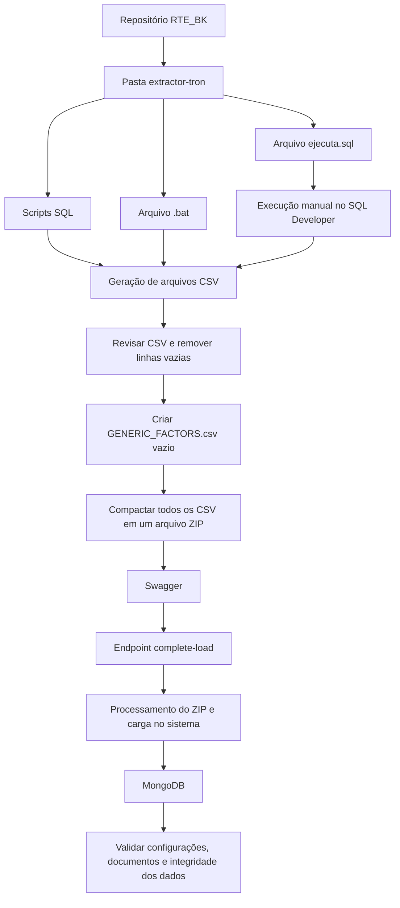

# Guia Operacional para Carga de Produto no RTE por CSV, ZIP, Swagger e MongoDB

## 1. Metadados do Documento
- **Arquivo de Origem:** `Não identificado no conteúdo fornecido`
- **Tipo de Documento:** `Procedimento`
- **Domínio / Sistema:** `RTE — Carga de Produto`
- **Público-Alvo:** `Desenvolvedores, Operação e equipes responsáveis pela configuração de produtos`
- **Data/Versão Identificada:** `Versão 1.0`

---

## 2. Resumo Executivo & Contexto de Negócio

O documento descreve o procedimento operacional para carregar configurações de um produto no sistema RTE. O processo inicia no repositório `RTE_BK`, especificamente na pasta `extractor-tron`, onde estão disponíveis scripts SQL, um arquivo `.bat` para automação e o arquivo `ejecuta.sql` para execução manual pelo SQL Developer.

A extração é parametrizada pelas variáveis `compania` e `ramo`. Essas variáveis determinam quais configurações do produto serão extraídas para os arquivos CSV. Portanto, a preparação correta dessas variáveis é um pré-requisito para que o conteúdo gerado corresponda ao produto esperado.

Após a geração dos CSV, o procedimento exige uma revisão obrigatória para remover ou evitar linhas vazias, pois essas linhas podem provocar erros na carga posterior. Também é necessário criar manualmente um arquivo vazio chamado `GENERIC_FACTORS.csv` no mesmo repositório dos arquivos gerados.

Na etapa de carga, todos os CSV, incluindo `GENERIC_FACTORS.csv`, devem ser comprimidos em um único arquivo ZIP. Esse ZIP é enviado pelo endpoint `complete-load`, disponível na interface Swagger do ambiente indicado. O endpoint processa o arquivo compactado e carrega as informações no sistema.

Como validação final, o documento determina a verificação da inserção do produto no MongoDB. A equipe responsável deve confirmar que todas as configurações foram criadas, que não existem documentos ausentes e que não há problemas de estrutura ou dados incompletos.

---

## 3. Arquitetura, Componentes & Tecnologias Envolvidas

Os componentes e ferramentas identificados no procedimento são:

| Componente / Tecnologia | Papel no processo |
| :--- | :--- |
| `RTE_BK` | Repositório que contém os artefatos necessários para a extração de informações do produto. |
| `extractor-tron` | Pasta dentro do repositório `RTE_BK` que contém scripts SQL, arquivo `.bat` e `ejecuta.sql`. |
| Scripts SQL | Extraem as informações necessárias para gerar as configurações do produto. |
| Arquivo `.bat` | Automatiza a execução do processo de extração. |
| `ejecuta.sql` | Arquivo SQL que pode ser executado manualmente pelo SQL Developer. |
| SQL Developer | Ferramenta utilizada para executar manualmente o arquivo `ejecuta.sql`. |
| Arquivos CSV | Resultado da extração das configurações do produto. |
| `GENERIC_FACTORS.csv` | Arquivo adicional, criado manualmente e vazio, obrigatório para a carga. |
| Arquivo ZIP | Pacote único contendo todos os CSV necessários para envio. |
| Swagger | Interface utilizada para acessar o endpoint de carga. |
| Endpoint `complete-load` | Endpoint responsável por processar o ZIP e carregar as informações no sistema. |
| MongoDB | Base de dados onde o produto e suas configurações são inseridos após a carga. |



**Nota de Análise:** O documento identifica o endpoint `complete-load`, mas não detalha o método HTTP, o contrato de entrada além do arquivo ZIP, o formato da resposta, mecanismos de autenticação ou códigos de erro retornados pelo Swagger.

---

## 4. Regras de Negócio, Especificações Funcionais & Processos

### 4.1. Preparação da extração

1. A equipe deve acessar o repositório `RTE_BK`.
2. A equipe deve localizar a pasta `extractor-tron`.
3. A pasta `extractor-tron` contém:
   - Scripts SQL que extraem as informações necessárias.
   - Um arquivo `.bat` que automatiza a execução.
   - O arquivo `ejecuta.sql`, executável manualmente por meio do SQL Developer.
4. Antes de iniciar a extração, é obrigatório modificar as variáveis:
   - `compania`
   - `ramo`
5. As variáveis `compania` e `ramo` determinam quais configurações de produto serão extraídas.

### 4.2. Execução da extração

O procedimento permite dois métodos alternativos para executar a extração:

1. Executar diretamente o arquivo `.bat` no repositório.
2. Executar manualmente o arquivo `ejecuta.sql` no SQL Developer.

Ambos os métodos devem gerar os arquivos CSV correspondentes às configurações do produto.

### 4.3. Revisão dos arquivos CSV

A revisão dos CSV gerados é obrigatória. Os arquivos CSV não devem conter linhas vazias, porque linhas vazias podem gerar erros durante a carga posterior.

### 4.4. Criação do arquivo adicional obrigatório

Além dos CSV produzidos automaticamente, a equipe deve criar manualmente um arquivo com o nome exato:

```text
GENERIC_FACTORS.csv
```

O arquivo `GENERIC_FACTORS.csv` deve:

- Ser criado no mesmo repositório dos demais arquivos.
- Permanecer vazio.
- Ser incluído no arquivo ZIP enviado para carga.

### 4.5. Compressão e carga pelo Swagger

Após reunir todos os CSV, incluindo `GENERIC_FACTORS.csv`, a equipe deve:

1. Comprimir todos os arquivos em um único arquivo ZIP.
2. Acessar a interface Swagger indicada no documento.
3. Utilizar o endpoint `complete-load`.
4. Enviar o arquivo ZIP como parâmetro de entrada.

O endpoint `complete-load` é responsável por processar o arquivo ZIP e carregar as informações no sistema.

### 4.6. Verificação pós-carga no MongoDB

Após a conclusão da carga, o produto deve estar inserido no MongoDB. A verificação deve confirmar:

1. Todas as configurações foram criadas.
2. Não existem documentos ausentes.
3. Não existem erros de estrutura.
4. Não existem dados incompletos.

---

## 5. Tabelas de Parâmetros, Ambientes e Estruturas de Dados

| Item / Parâmetro | Descrição / Função | Tipo / Valores / Formato | Ambiente / Observações |
| :--- | :--- | :--- | :--- |
| `compania` | Define a companhia cujas configurações de produto serão extraídas. | Variável de configuração; valor não detalhado. | Deve ser modificada antes da execução do processo. |
| `ramo` | Define o ramo cujas configurações de produto serão extraídas. | Variável de configuração; valor não detalhado. | Deve ser modificada antes da execução do processo. |
| `RTE_BK` | Repositório que contém os recursos para extração e preparação da carga. | Repositório. | Contém a pasta `extractor-tron`. |
| `extractor-tron` | Pasta com scripts e arquivos usados na extração. | Diretório. | Localizada dentro de `RTE_BK`. |
| Scripts SQL | Extraem as informações necessárias para a configuração do produto. | SQL. | Presentes em `extractor-tron`. |
| Arquivo `.bat` | Automatiza a execução do processo de extração. | Arquivo batch. | Pode ser executado diretamente no repositório. |
| `ejecuta.sql` | Permite a execução manual do processo de extração. | Arquivo SQL. | Executável via SQL Developer. |
| SQL Developer | Ferramenta usada para executar manualmente `ejecuta.sql`. | Ferramenta de banco de dados. | Utilizada como alternativa ao `.bat`. |
| Arquivos CSV | Contêm as configurações do produto extraídas. | CSV. | Não podem conter linhas vazias. |
| `GENERIC_FACTORS.csv` | Arquivo adicional exigido para carga. | CSV vazio. | Deve ser criado manualmente no mesmo repositório e incluído no ZIP. |
| Arquivo ZIP | Agrupa todos os arquivos CSV para envio. | ZIP. | Deve conter os CSV gerados e `GENERIC_FACTORS.csv`. |
| Swagger | Interface para realizar a carga. | Interface web/API. | URL indicada no documento. |
| `complete-load` | Endpoint usado para processar o ZIP e realizar a carga. | Endpoint de API. | Recebe o arquivo ZIP como parâmetro de entrada. |
| MongoDB | Banco de dados usado para verificar a inserção do produto. | Banco de dados NoSQL. | As coleções correspondentes devem ser revisadas após a carga. |
| URL do Swagger | Endereço para acesso à interface Swagger. | URL HTTPS. | `https://rating.int.azure.mapfre.net/api-backoffice/swagger-ui/index.html?configUrl=/api-backoffice/v3/api-docs/swagger-config` |

---

## 6. Bateria de Perguntas & Respostas para RAG (FAQ Sintético)

### P1: Onde estão localizados os scripts necessários para extrair configurações de produto para o RTE?
**R:** Os scripts necessários estão no repositório `RTE_BK`, dentro da pasta `extractor-tron`. Essa pasta contém scripts SQL, um arquivo `.bat` para automatizar a execução e o arquivo `ejecuta.sql` para execução manual pelo SQL Developer.

### P2: Quais variáveis precisam ser configuradas antes de executar a extração de produto?
**R:** Antes de iniciar a extração, é obrigatório modificar as variáveis `compania` e `ramo`. Essas variáveis determinam quais configurações do produto serão extraídas para os arquivos CSV.

### P3: Quais são as opções disponíveis para executar o processo de extração dos CSV?
**R:** O processo pode ser executado de duas formas: pela execução direta do arquivo `.bat` no repositório ou pela execução manual do arquivo `ejecuta.sql` utilizando o SQL Developer. Ambos os métodos devem gerar os arquivos CSV das configurações do produto.

### P4: Por que os arquivos CSV precisam ser revisados antes da carga?
**R:** Os arquivos CSV devem ser revisados para garantir que não contenham linhas vazias. O documento informa que linhas vazias podem provocar erros durante a carga posterior do produto.

### P5: O que é o arquivo `GENERIC_FACTORS.csv` e qual conteúdo ele deve ter?
**R:** `GENERIC_FACTORS.csv` é um arquivo adicional obrigatório para o processo de carga. Ele deve ser criado manualmente no mesmo repositório dos demais CSV e deve permanecer vazio.

### P6: Quais arquivos devem ser incluídos no ZIP enviado ao endpoint de carga?
**R:** O arquivo ZIP deve conter todos os CSV gerados pelo processo de extração, incluindo obrigatoriamente o arquivo vazio `GENERIC_FACTORS.csv`.

### P7: Qual endpoint Swagger deve ser usado para carregar o produto no RTE?
**R:** O endpoint indicado para a carga é `complete-load`. Esse endpoint recebe o arquivo ZIP como parâmetro de entrada, processa o conteúdo compactado e carrega as informações no sistema.

### P8: Qual é a URL de acesso ao Swagger usada no procedimento de carga?
**R:** A URL indicada é `https://rating.int.azure.mapfre.net/api-backoffice/swagger-ui/index.html?configUrl=/api-backoffice/v3/api-docs/swagger-config`.

### P9: O que deve ser validado no MongoDB após a carga do produto?
**R:** Após a carga, deve-se revisar as coleções correspondentes no MongoDB para confirmar que todas as configurações foram criadas, que nenhum documento está ausente e que não existem erros estruturais ou dados incompletos.

### P10: O documento descreve o contrato HTTP ou o payload detalhado do endpoint `complete-load`?
**R:** Não. O documento apenas informa que o endpoint `complete-load` deve receber o arquivo ZIP como parâmetro de entrada e que é responsável por processar o ZIP e carregar as informações no sistema. Não há detalhamento sobre método HTTP, autenticação, estrutura de resposta ou códigos de erro.

---

## 7. Glossário de Termos, Siglas & Conceitos-Chave

- **RTE:** Nome do sistema ou domínio associado ao processo de carga de produto. O documento não apresenta a expansão da sigla.
- **RTE_BK:** Repositório que contém os recursos necessários para extração e preparação da carga.
- **CSV:** Formato de arquivo usado para armazenar as configurações de produto extraídas.
- **ZIP:** Formato de compressão usado para reunir todos os arquivos CSV em um único arquivo de carga.
- **SQL:** Linguagem utilizada nos scripts de extração de informações.
- **SQL Developer:** Ferramenta utilizada para executar manualmente o arquivo `ejecuta.sql`.
- **MongoDB:** Banco de dados onde o produto carregado e suas configurações devem ser verificados.
- **Swagger:** Interface de documentação e execução de APIs usada para acessar o endpoint de carga.
- **`complete-load`:** Endpoint responsável por processar o ZIP e carregar as informações no sistema.
- **`GENERIC_FACTORS.csv`:** Arquivo CSV adicional, obrigatório, criado manualmente e mantido vazio.
- **`compania`:** Variável que define a companhia das configurações de produto a extrair.
- **`ramo`:** Variável que define o ramo das configurações de produto a extrair.

---

## 8. Notas Críticas, Riscos & Limitações

- A configuração incorreta de `compania` ou `ramo` pode resultar na extração de configurações de produto diferentes das esperadas.
- Linhas vazias nos arquivos CSV representam um risco operacional explícito, pois podem causar erros na carga posterior.
- A ausência do arquivo `GENERIC_FACTORS.csv`, ou a inclusão de conteúdo nesse arquivo quando ele deveria estar vazio, pode comprometer o cumprimento do procedimento documentado.
- O ZIP deve incluir todos os CSV gerados e o arquivo `GENERIC_FACTORS.csv`; a ausência de arquivos não é tratada pelo documento.
- A validação pós-carga depende da revisão manual das coleções correspondentes no MongoDB.
- O documento não detalha os nomes das coleções MongoDB que devem ser verificadas.
- O documento não detalha os contratos de API, método HTTP, autenticação, validações do endpoint, formatos de erro, tempo de processamento ou mecanismo de rollback do endpoint `complete-load`.
- O documento não especifica valores permitidos, origem ou regras de preenchimento para `compania` e `ramo`.
- **Nota de Análise:** O procedimento descreve a sequência operacional de carga, mas não descreve critérios de sucesso técnicos retornados pelo Swagger além da posterior verificação no MongoDB.

---

## 9. Conteúdo Bruto Estruturado (Referência Fiel)

```text
--- [PÁGINA 1 DE 3] ---

Guía para la Carga de
 Producto en RTE
 Repositorio RTE_BK · SQL Developer · MongoDB · Swagger
Paso 1
Preparación de los scripts y generación de CSV
En el repositorio RTE_BK, dentro de la carpeta extractor-tron, se encuentran:
 Los scripts SQL que extraen la información necesaria.
 Un archivo .bat que automatiza la ejecución.
 El fichero ejecuta.sql, que puede ejecutarse manualmente desde SQL Developer.
Antes de lanzar el proceso, es imprescindible modificar las variables:
compania
ramo
Estas variables determinan qué configuraciones del producto se extraerán.


--- [PÁGINA 2 DE 3] ---

Paso 2
Ejecución del proceso de extracción
Puedes elegir entre dos métodos:
 Ejecutar el .bat directamente desde el repositorio.
 Ejecutar manualmente ejecuta.sql desde SQL Developer.
Ambos métodos generarán los ficheros CSV correspondientes a las configuraciones del producto.
■
Revisión obligatoria: Verifica que los CSV generados no contengan líneas vacías, ya
que pueden provocar errores en la carga posterior.
Paso 3
Creación del fichero adicional requerido
Además de los CSV generados automáticamente, es necesario crear manualmente en el mismo
repositorio un fichero llamado:
 GENERIC_FACTORS.csv
Este fichero debe estar vacío.


--- [PÁGINA 3 DE 3] ---

Paso 4
Compresión y carga mediante Swagger
Una vez tengas todos los CSV (incluyendo GENERIC_FACTORS.csv):
1
Comprime todos los ficheros en un único archivo ZIP.
2
Accede a Swagger:
https://rating.int.azure.mapfre.net/api-backoffice/swagger-ui/index.html?configUrl=/api-back
office/v3/api-docs/swagger-config
3
Utiliza el endpoint complete-load.
4
Sube el archivo ZIP como parámetro de entrada.
Este endpoint se encarga de procesar el ZIP y cargar la información en el sistema.
Paso 5
Verificación de la carga en MongoDB
Una vez completada la carga:
 El producto habrá sido insertado en MongoDB.
 Revisa las colecciones correspondientes para confirmar que:
    – Todas las configuraciones se han creado.
    – No faltan documentos.
    – No hay errores de estructura o datos incompletos.
RTE · Guía de Carga de Producto
 Versión 1.0
```
