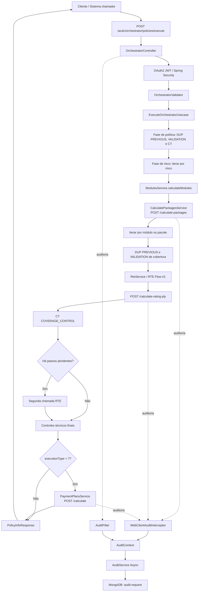
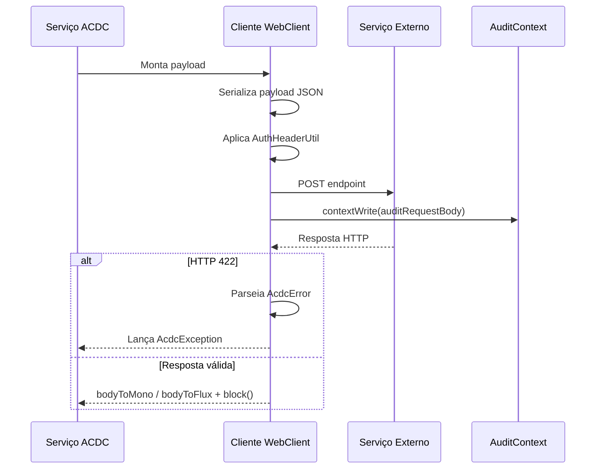
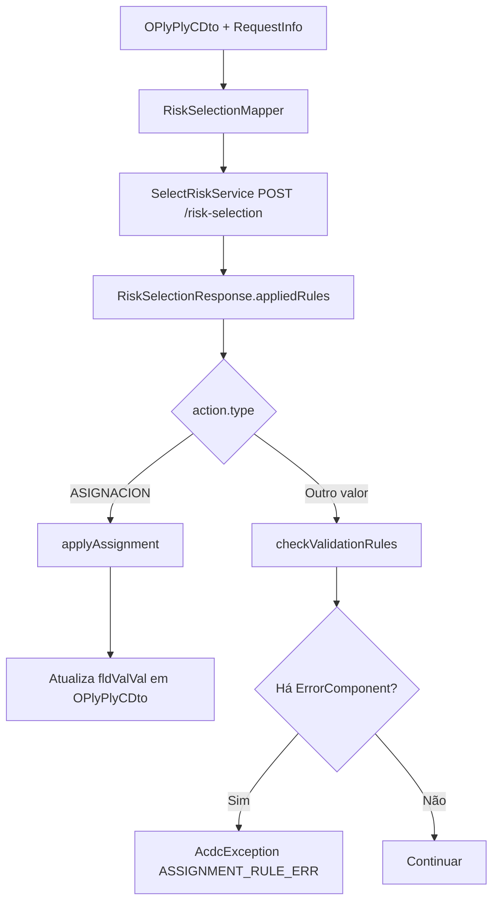

# REEF-ACDC — Guia de Arquitetura, Orquestração, DUP, RTE, Pacotes, Auditoria e Integrações Externas

## 1. Metadados do Documento
- **Arquivo de Origem:** `Não identificado — conteúdo bruto fornecido no prompt`
- **Tipo de Documento:** Arquitetura de Software / Especificação Técnica
- **Domínio / Sistema:** REEF-ACDC, MAPFRE TRON, seguros, cotação, emissão, seleção de riscos e tarificação
- **Público-Alvo:** Desenvolvedores, Arquitetos, Operação, Analistas Funcionais e equipes de regras de negócio
- **Data/Versão Identificada:** Versão 1.0 — Março de 2026
- **Equipe Identificada:** ACDC - MAPFRE TRON
- **Tecnologias Identificadas:** Spring Boot 3, Java 21, WebFlux WebClient, MongoDB, OAuth2 JWT, Spring Security Resource Server, MapStruct, Guava Stopwatch, JEasy Rules, Janino e Resilience4j Circuit Breaker.
- **Context Path:** `/acdc`

---

## 2. Resumo Executivo & Contexto de Negócio

O REEF-ACDC é um backend de orquestração para processos de cotação e emissão de apólices de seguros no ecossistema MAPFRE TRON. O sistema recebe uma estrutura completa de apólice, representada por `PolicyInfoRequest` e `OPlyPlyCDto`, executa regras de negócio, controles técnicos, cálculo de pacotes de cobertura, tarificação e, quando aplicável, cálculo de planos de pagamento.

O ponto central do processo batch é o endpoint `POST /acdc/orchestrator/policies/execute`. O endpoint é o único ponto de entrada para a execução ponta a ponta da orquestração. O `ExecuteOrchestratorUsecase` coordena uma sequência rígida e determinística de chamadas ao motor de regras DUP, ao serviço de pacotes de cobertura, ao motor de rating RTE e ao serviço externo de planos de pagamento.

O motor DUP, denominado Data Update Process, é responsável por pré-cálculos, validações e controles técnicos. O DUP opera sobre facts derivados da estrutura da apólice, incluindo dados fixos, atributos variáveis, coberturas, segurado, participantes, questionários, documentos, acumulações e constantes provenientes do MongoDB. As regras DUP podem atribuir valores, bloquear o fluxo, solicitar documentos, aplicar tarifas, registrar avisos ou produzir controles técnicos.

O motor RTE, identificado como core-engine, é responsável pelo cálculo de primas. O RTE utiliza configurações de ramo, coberturas, conceitos de breakdown, regras JEasy Rules, fórmulas parametrizadas e operações de subscrição. O resultado da tarificação é refletido novamente na estrutura `OPlyPlyCDto`, incluindo coberturas e conceitos de breakdown.

O REEF-ACDC também oferece endpoints online granulares para frontends e BFFs. Esses endpoints permitem executar operações isoladas, como pré-cálculo de atributos, validação de atributos, controles técnicos, cálculo de pacotes, consulta de preferências, cálculo de rating, validação de formulários, consulta de bases técnicas e validação de dados gerais. A auditoria é assíncrona, persistida no MongoDB e configurável conforme a estratégia `NONE`, `ALL` ou `ERROR`.

---

## 3. Arquitetura, Componentes & Tecnologias Envolvidas

### 3.1 Arquitetura funcional principal

| Componente | Responsabilidade | Tecnologia / Padrão citado |
| :--- | :--- | :--- |
| `OrchestratorController` | Expõe o endpoint batch de orquestração ponta a ponta. | Spring REST Controller |
| `ExecuteOrchestratorUsecase` | Coordena todas as fases do fluxo de cotação/emissão. | Caso de uso |
| `OrchestratorValidator` | Valida a entrada antes de chamadas externas. | Camada de validação |
| `DupService` | Executa pré-cálculos, validações e controles técnicos DUP. | Serviço de regras |
| `SelectRiskService` | Cliente WebClient do motor DUP. | `POST /risk-selection` |
| `ModulesService` | Calcula módulos e pacotes de cobertura. | Serviço |
| `CalculatePackagesService` | Cliente do serviço externo de pacotes. | `POST /calculate-packages` |
| `RteService` | Coordena chamadas de tarificação. | Serviço |
| `RteExternalService` | Cliente WebClient do motor RTE. | `POST /calculate-rating-ply` |
| `PaymentPlanService` | Coordena cálculo de planos de pagamento. | Serviço |
| `PaymentPlansService` | Cliente do serviço externo de planos. | `POST /calculate` |
| `TechnicalsBasisService` | Consulta bases técnicas. | `POST /technical-basis/search` |
| `AuditFilter` | Intercepta requisições HTTP de entrada. | `OncePerRequestFilter` |
| `WebClientAuditInterceptor` | Audita chamadas WebClient de saída. | `ExchangeFilterFunction` |
| `AuditService` | Persiste auditoria sem bloquear o fluxo. | `@Async` + Circuit Breaker |
| `AuditRepository` | Persistência de auditoria. | Spring Data MongoDB |
| `AuditLog` | Modelo persistido na coleção `audit-request`. | MongoDB `@Document` |

### 3.2 Estrutura de pacotes Java

| Pacote | Finalidade |
| :--- | :--- |
| `com.mapfre.reef.acdc.backend.audit` | Auditoria assíncrona. |
| `com.mapfre.reef.acdc.backend.config` | Configurações Spring, Security, WebClient e Circuit Breaker. |
| `com.mapfre.reef.acdc.backend.controller` | Endpoints REST. |
| `com.mapfre.reef.acdc.backend.exception` | Exceções `AcdcException` e `PlyValException`. |
| `com.mapfre.reef.acdc.backend.external.client` | Clientes WebClient para integrações externas. |
| `com.mapfre.reef.acdc.backend.model` | DTOs, requests, responses, enums e mappers. |
| `com.mapfre.reef.acdc.backend.orchestator.domain` | `DupStepEnum`, `StageEnum` e `DupOperationEnum`. |
| `com.mapfre.reef.acdc.backend.service` | Serviços DUP, módulos, RTE e pagamentos. |
| `com.mapfre.reef.acdc.backend.usecase` | Casos de uso. |
| `com.mapfre.reef.acdc.backend.util` | `AppKeys`, `CoverageUtil`, `AuthHeaderUtil` e `Utils`. |
| `com.mapfre.reef.acdc.backend.validation` | `OrchestratorValidator`. |

### 3.3 Fluxo arquitetural batch



### 3.4 Componentes externos

| Cliente | Serviço externo | Endpoint | Configuração |
| :--- | :--- | :--- | :--- |
| `SelectRiskService` | Motor DUP | `POST /risk-selection` | `external.services.select-risk.*` |
| `RteExternalService` | Motor RTE | `POST /calculate-rating-ply` | `external.services.rte.*` |
| `RteExternalService` | Funções RTE/DUP | `POST /function-dup` | `external.services.rte.*` |
| `CalculatePackagesService` | Pacotes de cobertura | `POST /calculate-packages` | `external.services.coverage-packages.*` |
| `CalculatePackagesService` | Preferências de pacote | `POST /calculate-preferencesId` | `external.services.coverage-packages.*` |
| `PaymentPlansService` | Planos de pagamento | `POST /calculate` | `external.services.payment-plans.*` |
| `TechnicalsBasisService` | Bases técnicas | `POST /technical-basis/search` | `external.services.technical-basis.*` |

### 3.5 Padrão comum dos clientes WebClient



O padrão comum utiliza `WebFlux WebClient` com chamada bloqueante via `.block()`. Para HTTP `422`, o cliente interpreta a resposta como `AcdcError` e lança `AcdcException`. O body serializado é associado ao contexto Reactor para auditoria.

---

## 4. Regras de Negócio, Especificações Funcionais & Processos

### 4.1 Endpoint batch de orquestração

| Método | Rota | Descrição |
| :--- | :--- | :--- |
| `POST` | `/acdc/orchestrator/policies/execute` | Executa o processo ponta a ponta de cotação/emissão de apólice. |

O endpoint recebe os dados de uma apólice, executa serviços externos em ordem estritamente definida e retorna uma lista de opções válidas de cotação. A resposta é uma lista porque `ModulesService` pode produzir uma ou mais combinações de coberturas.

### 4.2 Segurança do endpoint batch

| Situação | Resultado |
| :--- | :--- |
| Ausência de token | `401 Unauthorized` |
| Token válido sem papel autorizado | `403 Forbidden` |
| Token válido com papel autorizado | O fluxo continua. |
| `spring.security.enabled: false` | Segurança pode ser desativada em ambientes locais. |

A autorização do endpoint batch requer uma das autoridades abaixo:

```java
@PreAuthorize("hasAnyAuthority('GAZU_ROLRTEMGR', 'GAZU_ROLRTEADM')")
```

### 4.3 Estrutura de entrada `PolicyInfoRequest`

```json
{
  "oPlyPlyC": {},
  "oPlyPlyCPrev": {},
  "requestInfo": {
    "countryId": "ES",
    "productId": 1234,
    "executionType": "7",
    "processTypeId": "ALT",
    "languageId": "es",
    "requestId": "uuid-v4"
  },
  "operation": "ALT",
  "dataFormMap": [],
  "documents": [],
  "cmlObj": []
}
```

| Campo | Obrigatoriedade | Regra identificada |
| :--- | :--- | :--- |
| `PolicyInfoRequest` | Obrigatório | Não pode ser nulo. |
| `oPlyPlyC` | Obrigatório | Validado por `ValidationUtil.validatePlyData`. |
| `operation` | Obrigatório | Não pode ser nulo. |
| `requestInfo` | Obrigatório | Não pode ser nulo. |
| `requestInfo.countryId` | Obrigatório | Não nulo e não vazio. |
| `requestInfo.productId` | Obrigatório | Não nulo. |
| `requestInfo.executionType` | Obrigatório | Não nulo. |
| `requestInfo.processTypeId` | Obrigatório | Não nulo. |
| `requestInfo.languageId` | Opcional | Idioma da solicitação. |
| `requestInfo.requestId` | Opcional | Rastreabilidade e auditoria. |
| `dataFormMap` | Não detalhado como obrigatório | Origem de facts de questionários. |
| `documents` | Não detalhado como obrigatório | Origem de facts de documentos. |
| `cmlObj` | Não detalhado como obrigatório | Origem de facts de acumulações. |

**Regra de planos de pagamento:** somente `executionType == "7"` ativa o cálculo de planos de pagamento. Para qualquer outro valor, a resposta retorna `paymentPlans: []`.

### 4.4 Respostas e erros do endpoint batch

| Código HTTP | Significado |
| :--- | :--- |
| `200` | Lista de `PolicyInfoResponse`, uma por módulo/pacote calculado. |
| `400` | Request inválido, incluindo erro de parse JSON. |
| `422` | Erro de negócio, retornado como `AcdcError`. |
| `500` | Erro interno não controlado. |

```json
[
  {
    "oPlyPlyC": {},
    "paymentPlans": []
  }
]
```

```json
{
  "code": "ORCH_ERR",
  "message": "Error ejecutando la orquestación",
  "application": "acdc-backend",
  "errors": [
    {
      "code": "...",
      "message": "...",
      "component": "ExecuteOrchestratorUsecase"
    }
  ]
}
```

### 4.5 Fluxo completo do `ExecuteOrchestratorUsecase`

O `ExecuteOrchestratorUsecase` mede tempos usando `Stopwatch` do Guava. A execução é rígida e determinística.

| Fase | Passo | Tipo | Objetivo |
| :--- | :--- | :--- | :--- |
| Política | `[2-0-10] PREVIOUS_VARIABLE_DATA_POLICY` | DUP PREVIOUS | Pré-cálculo de atributos de política. |
| Política | `[2-0-20] VALIDATION_VARIABLE_DATA_POLICY` | DUP VALIDATION | Validação de atributos de política. |
| Política | `[1-0-0] FIXED_DATA_DUP` | CT | Controle técnico de dados fixos. |
| Política | `[2-0-0] VARIABLE_DATA_POLICY` | CT | Controle técnico de dados variáveis da política. |
| Política | `[3-0-0] BENEFICIARY_RISK_TYPE` | CT | Controle técnico de beneficiários. |
| Risco | `[4-0-10] PREVIOUS_VARIABLE_DATA_RISK` | DUP PREVIOUS | Pré-cálculo de atributos do risco. |
| Risco | `[4-0-20] VALIDATION_VARIABLE_DATA_RISK` | DUP VALIDATION | Validação de atributos do risco. |
| Risco | `[4-0-0] VARIABLE_DATA_RISK` | CT | Controle técnico dos dados do risco. |
| Risco | `[11-0-0] RISK_SELECTION_FORM` | CT | Controle técnico de formulário. |
| Módulos | `ModulesService.calculateModules()` | Serviço | Calcula um ou mais módulos/pacotes. |
| Cobertura | `[6-0-10] PREVIOUS_VARIABLE_COVERAGE` | DUP PREVIOUS | Pré-cálculo por cobertura. |
| Cobertura | `[6-0-20] VALIDATION_VARIABLE_COVERAGE` | DUP VALIDATION | Validação por cobertura. |
| Tarificação | RTE Flow #1 | RTE | Tarificação no nível `RISK_TYPE`. |
| Cobertura | `[6-0-0] COVERAGE_CONTROL` | CT | Controle de cobertura. |
| Cobertura | `[11-0-0] RISK_SELECTION_FORM` | CT | Controle de formulário. |
| Cobertura | `[7-0-0] REINSURANCE_CONTROL` | CT | Controle de resseguro. |
| Cobertura | `[8-1-6] TERMINATE_CONTROL` | CT | Controle de término. |
| Cobertura | `[8-1-3] SUSPEND_CONTROL` | CT | Controle de suspensão. |
| Cobertura | `[8-1-4] MULTIUSER_CONTROL` | CT | Controle multiusuário. |
| Tarificação | RTE Flow #2 | RTE | Aplicado somente se existirem CVC no nível de política, risco `0`. |
| Finais | `[8-3-1] SAVE_CONTROL` | CT | Controle de salvamento. |
| Finais | `[8-3-2] ABANDON_CONTROL` | CT | Controle de abandono. |
| Finais | `[8-3-3] VERIFY_CONTROL` | CT | Controle de verificação. |
| Finais | `[8-3-4] CLAUSES_CONTROL` | CT | Controle de cláusulas. |
| Finais | `[8-3-5] ANNEX_PAGES_CONTROL` | CT | Controle de páginas anexas. |
| Finais | `[8-3-6] PRINT_CONTROL` | CT | Controle de impressão. |
| Finais | `[8-3-7] RISKS_CONTROL` | CT | Controle de riscos. |
| Finais | `[8-3-8] ADDITIONAL_OPTIONS_CONTROL` | CT | Controle de opções adicionais. |
| Finais | `[8-7-null] ADDITIONAL_ANY_OPTIONS_CONTROL` | CT | Controle de opções adicionais `ANY`. |
| Pagamentos | `PaymentPlanService` | Serviço | Executado somente para `executionType == "7"`. |

### 4.6 Tratamento de exceções

| Exceção / Condição | Comportamento |
| :--- | :--- |
| `AcdcException` | Relançada diretamente porque já contém erro formatado pelo serviço de origem. |
| `PlyValException` durante planos de pagamento | Capturada; a resposta contém `paymentPlans: []`; o fluxo principal não é interrompido. |
| Outra `Exception` | Encapsulada em `AcdcException` com código `ORCH_ERR`. |
| Erro de validação inicial | `AcdcException` com código `RS_MISSING_DATA`, antes de chamadas externas. |
| Erro HTTP `422` em cliente externo | `AcdcError` é parseado e convertido em `AcdcException`. |

### 4.7 Endpoints online

Todos os endpoints online usam base path `/acdc`, autenticação OAuth2 JWT, formato `application/json` e `SourceSystemEnum.ONLINE`.

| Endpoint | Caso de uso / Serviço | Papéis | Objetivo |
| :--- | :--- | :--- | :--- |
| `POST /acdc/attributes/previous` | `PrevalidateAttributesUsecase`, `DupService.precalculateByStep()` | `GAZU-ROLPSYADM`, `GAZU-ROLPSYCTR` | Pré-calcula valores padrão e atribuições automáticas. |
| `POST /acdc/attributes/validation` | `ValidateAttributesUsecase`, `DupService.validationByStep()` | `GAZU-ROLPSYADM`, `GAZU-ROLPSYCTR` | Valida atributos submetidos pelo usuário. |
| `POST /acdc/technical-control/execution` | `TechnicalControlUsecase`, `DupService.processTCByStep()` | `GAZU-ROLPSYADM`, `GAZU-ROLPSYCTR` | Executa um controle técnico isolado. |
| `POST /acdc/coverage-packages/calculation` | `CalculateCoveragePackagesUsecase` | `GAZU_ROLRTEMGR`, `GAZU_ROLRTEADM` | Calcula coberturas para pacote e risco. |
| `POST /acdc/coverage-packages/preferences` | `ObtainCoveragePackagesUsecase` | `GAZU_ROLRTEMGR`, `GAZU_ROLRTEADM` | Obtém preferências de pacotes disponíveis. |
| `POST /acdc/rating/calculation` | `RatingUsecase`, `RteService.calculationRisk()` | `GAZU_ROLRTEMGR`, `GAZU_ROLRTEADM` | Calcula ou recalcula primas de um risco. |
| `POST /acdc/form/definition` | `FormDefinitionUsecase` | `GAZU_ROLRTEMGR`, `GAZU_ROLRTEADM` | Retorna definição de formulários; atualmente é mock. |
| `POST /acdc/form/previous` | `PreCalculateFormUsecase`, DUP PREVIOUS | `GAZU_ROLRTEMGR`, `GAZU_ROLRTEADM` | Pré-calcula atributos de formulário. |
| `POST /acdc/form/validation` | `ValidateFormUsecase`, DUP VALIDATION | `GAZU_ROLRTEMGR`, `GAZU_ROLRTEADM` | Valida dados de formulário. |
| `POST /acdc/technical-basis/search` | `TechnicalBasisUsecase` | `GAZU-ROLPSYADM`, `GAZU-ROLPSYCTR` | Consulta bases técnicas; não integra o fluxo batch. |
| `POST /acdc/general-data/validation` | `GeneralDataAttributesUsecase` | `GAZU-ROLPSYADM`, `GAZU-ROLPSYCTR` | Valida dados gerais `OPlyGniP`. |

### 4.8 DUP — tipos de operação

| Valor `DupOperationEnum` | Método `DupService` | Semântica |
| :--- | :--- | :--- |
| `PREVIOUS` | `precalculateByStep()` | Executa pré-cálculo e atribuições sobre a apólice em memória. Não bloqueia por erros de validação. |
| `VALIDATION` | `validationByStep()` | Executa validações. Erros bloqueantes lançam `AcdcException`. |
| `TECHNICAL_CONTROL` | `processTCByStep()` | Executa controles técnicos e retorna `List<OPlyUtcP>`. |

### 4.9 DUP — níveis de aplicação

| Nível | Iteração | Dados em `variableData` |
| :--- | :--- | :--- |
| `POLICY_TYPE` | Uma chamada para toda a apólice. | Atributos de política em `OPlyAtcCT` raiz. |
| `POLICY_GROUP` | Uma chamada para grupo de apólice. | Atributos raiz da política. |
| `RISK_TYPE` | Uma chamada para cada risco. | Atributos de política, risco atual e coberturas do risco. |
| `COVERAGE_TYPE` | Uma chamada por cobertura de cada risco. | Atributos de política, risco atual e cobertura atual. |
| `FORM_TYPE` | Uma chamada por formulário. | Atributos de formulário. |
| `FIXED_DATA` | Uma chamada para dados fixos. | Não detalhado. |

### 4.10 DUP — processamento de respostas



Se `riskVal` for nulo nos fluxos `PREVIOUS` e `VALIDATION`, `DupServiceImpl` itera por todos os riscos. A ação `ASIGNACION` modifica o atributo no nível indicado. A ação com valor `EXPLICIT_NULL` atribui `null` ao atributo. Outras ações são tratadas como validações e acumulam erros.

| Nível | Destino dos controles técnicos `OPlyUtcP` |
| :--- | :--- |
| `POLICY_TYPE` | `OPlyPlyCDto.OPlyUtcPT` |
| `RISK_TYPE` | `OPlyRkcC.OPlyUtcPT` do risco correspondente |
| `COVERAGE_TYPE` | `OPlyCvcC.OPlyUtcPT` da cobertura correspondente |

### 4.11 RTE — two-pass

O fluxo RTE executa uma primeira chamada de rating. Em seguida, `recalculateTwoPass()` executa o controle técnico `COVERAGE_CONTROL`. Se o DUP retornar passos pendentes, o REEF-ACDC chama o RTE uma segunda vez. Se a lista estiver vazia, o resultado da primeira chamada é retornado.

### 4.12 Regras RS-RULES-ACTIONS-CONDITIONS

As regras são identificadas pela tríade:

```text
[processStep-optionMenuNumber-optionNumber]
```

| Campo | Significado |
| :--- | :--- |
| `processStep` | Nível de salto do processo. |
| `optionMenuNumber` | Família de controles. |
| `optionNumber` | Opção específica dentro do passo. |

| `processStep` | Nome DUP | Descrição |
| :--- | :--- | :--- |
| `1` | `FIXED_DATA` | Dados fixos de política. |
| `2` | `VARIABLE_DATA_POLICY` | Dados variáveis de política. |
| `3` | `BENEFICIARY_RISK_TYPE` | Tipo de beneficiário/risco. |
| `4` | `VARIABLE_DATA_RISK` | Dados variáveis de risco. |
| `6` | `COVERAGE` | Controle de coberturas. |
| `7` | `REINSURANCE` | Controle de resseguro. |
| `8` | `CONTROLS` | Controles finais. |
| `11` | `RISK_SELECTION_FORM` | Formulário de seleção de riscos. |

### 4.13 Condições V1 e V2

| Característica | V1 — Legacy estruturada | V2 — Expressões Java |
| :--- | :--- | :--- |
| Seleção | Regra sem `condition` ou com `condition` vazia. | Regra com campo `condition`. |
| Estrutura | Objetos JSON em `ruleConditions`. | Expressão Java compilada em runtime. |
| Motor | Avaliador de operadores. | Janino. |
| Operadores lógicos | `AND` implícito. | `AND`, `OR` e `NOT`. |
| Cálculos | Não suportados. | Suportados. |
| Complexidade | Baixa. | Média a alta. |
| Desempenho descrito | Rápido. | Muito rápido, compilado. |

| Operador V1 | Significado |
| :--- | :--- |
| `EQ` | Igualdade exata. |
| `NOT_EQ` | Diferença. |
| `GT` | Maior que. |
| `GE` | Maior ou igual. |
| `LT` | Menor que. |
| `LE` | Menor ou igual. |
| `IN` | Pertence a lista. |
| `NOT_IN` | Não pertence a lista. |
| `BTW` | Entre `value1` e `value2`. |
| `EX` | Fact existe. |
| `NEX` | Fact não existe. |
| `BLANK` | Fact vazio ou nulo. |
| `ANY_MATCH` | Procura correspondência em coleção por padrão. |

O caractere `*` é curinga para índices numéricos, por exemplo: `participants.beneficiaries.*.beneficiaryType`.

As expressões V2 proíbem termos como `System.`, `Runtime.`, `Process.`, `File.`, `ClassLoader.`, `Thread.`, `exec(`, `getRuntime(`, `Class.forName` e `new`.

### 4.14 Priorização de regras

Uma pontuação menor representa maior prioridade. Após uma regra afetar um `processField`, o campo é bloqueado para regras posteriores.

| Critério | Penalidade |
| :--- | ---: |
| Regra com `productId` | `-1200` |
| Regra com `policyNumber` | `-1100` |
| Regra com `clientPolicy` | `-1000` |
| Regra com `contractNumber` | `-900` |
| Regra com `groupPolicyNumber` | `-800` |
| Regra com `thirdPartyCode` | `-700` |
| Regra com `channel3` | `-600` |
| Regra com `channel2` | `-500` |
| Regra com `channel1` | `-400` |
| Regra com `level3` | `-300` |
| Regra com `level2` | `-200` |
| Regra com `level1` | `-100` |
| Regra com `disabledDate` | `-10000` |

### 4.15 Ações DUP

| Tipo | Código | Efeito |
| :--- | :--- | :--- |
| Rejeição | `Rechazo` | Rejeita a operação. |
| Revisão | `Revisión` | Marca para revisão manual. |
| Requisito | `requirement` | Solicita informação adicional. |
| Documento | `document` | Solicita documentação. |
| Tarifa | `Tarifa` | Aplica extraprima. |
| Atribuição | `Asignacion` | Atribui valores a variáveis. |
| Questionário | `questionnaire` | Solicita questionário adicional. |
| Aviso | `message` | Informa sem bloquear. |
| Aceito | `Aceptado` | Aceita explicitamente. |
| Cálculo de data | `TEMP` | Calcula e armazena uma data. |
| Exclusão | `Exclusion` | Exclui elementos. |
| Reprocesso | `Reproceso` | Solicita reprocessamento. |

| Tipo de cálculo de valor | Semântica |
| :--- | :--- |
| `DIRECT` | Valor literal. |
| `FACTOR` | Referência a fact existente. |
| `FORMULA` | Expressão Java pelo motor V2. |
| `FUNCTION` | Função predefinida do RTE. |

---

## 5. Tabelas de Parâmetros, Ambientes e Estruturas de Dados

### 5.1 Mapeamento de `RequestInfo`

| Campo / Parâmetro | Descrição / Função | Tipo / Valores / Formato | Ambiente / Observações |
| :--- | :--- | :--- | :--- |
| `riskSelectionType` | Define o nível de aplicação DUP. | Enum, por exemplo `RISK_TYPE`. | Derivado do `DupStepEnum`. |
| `processStep` | Passo principal do processo. | Número. | Derivado de `DupStepEnum.stepLevel`. |
| `processStepMenuOption` | Família de opções. | Número. | Derivado de `DupStepEnum.optionMenuNumber`. |
| `processStepOption` | Opção específica. | Número ou `null`. | Derivado de `DupStepEnum.optionNumber`. |
| `requestId` | Identificador de rastreabilidade. | String. | Vem de `OperationInfoQuery`. |
| `languageId` | Idioma. | String. | Vem de `OperationInfoQuery`. |
| `productId` | Produto. | Número. | Vem de `OperationInfoQuery`. |
| `executionType` | Tipo de execução. | String. | Vem de `OperationInfoQuery`. |
| `processTypeId` | Tipo de processo. | Número / valor descrito no request. | Vem de `OperationInfoQuery`. |
| `riskVal` | Índice/valor de risco. | Número. | Vem de `OperationInfoQuery`. |
| `coverageVal` | Índice/valor de cobertura. | Número. | Vem de `OperationInfoQuery`. |

### 5.2 Dados fixos enviados ao DUP

| Chave `fixedData` / Fact | Origem | Descrição |
| :--- | :--- | :--- |
| `contractNumber` | `OPlyGniS.delVal` | Número de contrato. |
| `subcontract` | `OPlyGniS.sblVal` | Subcontrato. |
| `groupPolicyNumber` | `OPlyGniS.gppVal` | Número de apólice de grupo. |
| `supplementCode` | `OPlyGniS.enrVal` | Código de suplemento. |
| `supplementSubcode` | `OPlyGniS.enrSbdVal` | Subcódigo de suplemento. |
| `supplementNumber` | `OPlyGniS.enrSqn` | Número de suplemento. |
| `supplementType` | `OPlyGniS.enrTypVal` | Tipo de suplemento. |
| `clientPolicy` | `OPlyGniS.clpVal` | Apólice de cliente. |
| `policyNumber` | `OPlyGniS.plyVal` | Número de apólice. |
| `validityDate` | `OPlyGniS.vldDat` | Data de validade. |
| `policyEffectiveDate` | `OPlyGniS.plyEfcDat` | Data de início de vigência. |
| `policyExpirationDate` | `OPlyGniS.plyExpDat` | Data de vencimento da apólice. |
| `supplementEffectiveDate` | `OPlyGniS.enrEfcDat` | Data de início do suplemento. |
| `supplementExpirationDate` | `OPlyGniS.enrExpDat` | Data de vencimento do suplemento. |
| `currency` | `OPlyGniS.crnVal` | Moeda. |
| `applyProrata` | `OPlyGniS.ptaPly` | Indica aplicação de pró-rata. |
| `applicationNumber` | `OPlyGniS.aplVal` | Número de solicitação. |
| `supplementApplicationNumber` | `OPlyGniS.aplEnrSqn` | Número de solicitação de suplemento. |
| `policyDuration` | `OPlyGniS.plyDrtVal` | Duração da apólice. |
| `paymentModality` | `OPlyGniS.pmsVal` | Modalidade de pagamento. |
| `renovationsNumber` | `OPlyGniS.rnwVal` | Número de renovações. |
| `applyRegularization` | `OPlyGniS.plyRgl` | Aplicar regularização. |
| `regularizationType` | `OPlyGniS.rglTypVal` | Tipo de regularização. |
| `regularizationPercentage` | `OPlyGniS.rglPer` | Percentual de regularização. |
| `regularizationIndex` | `OPlyGniS.rglIdxVal` | Índice de regularização. |
| `manualPremium` | `OPlyGniS.mnlPre` | Prêmio manual. |
| `temporalSupplement` | `OPlyGniS.tmpEnr` | Suplemento temporal. |
| `policyType` | `OPlyGniS.tnrPlyTypVal` | Tipo de apólice. |
| `changeRate` | `OPlyGniS.exrVal` | Taxa de câmbio. |
| `sector` | `OPlyGniS.secVal` | Setor. |
| `totalRisk` | `OPlyGniS.totRskVal` | Risco total. |
| `coinsuranceType` | `OPlyGniS.cinTypVal` | Tipo de cosseguro. |
| `supplementMotivation` | `OPlyGniS.enrCasVal` | Motivo do suplemento. |
| `sendType` | `OPlyGniS.sndVal` | Tipo de envio. |
| `manualReinsurance` | `OPlyGniS.mnlRnsDst` | Resseguro manual. |
| `captureThirdLevel` | `OPlyGniS.cptThrLvlVal` | Captura de terceiro nível. |
| `reinsuranceType` | `OPlyGniS.rnsTypVal` | Tipo de resseguro. |
| `businessType` | `OPlyGniS.bsnVal` | Tipo de negócio. |
| `initialQuota` | `OPlyGniS.inlInmAmn` | Cota inicial. |
| `declarationPolicy` | `OPlyGniS.frpVal` | Apólice de declaração. |
| `currencyDecimals` | Constante | Sempre `"2"`. |
| `enforceDevolution` | Constante | Sempre `"S"`. |

### 5.3 Dados fixos do agente

| Chave `fixedData` / Fact | Origem | Descrição |
| :--- | :--- | :--- |
| `thirdPartyCode` | `OPlyInaS.thpVal` | Código do agente. |
| `level1` | `OPlyInaS.frsLvlVal` | Nível 1. |
| `level2` | `OPlyInaS.scnLvlVal` | Nível 2. |
| `level3` | `OPlyInaS.thrLvlVal` | Nível 3. |
| `channel1` | `OPlyInaS.frsDstHnlVal` | Canal 1. |
| `channel2` | `OPlyInaS.scnDstHnlVal` | Canal 2. |
| `channel3` | `OPlyInaS.thrDstHnlVal` | Canal 3. |
| `commissionTable` | `OPlyInaS.cmcVal` | Tabela de comissões. |

### 5.4 `variableData`, cobertura, segurado e participantes

| Categoria | Regra de mapeamento | Observação |
| :--- | :--- | :--- |
| `variableData` | `fldNam` é a chave; `fldValVal` é o valor. | Ambos devem ser não nulos. |
| Colisão de atributos | O nível inferior sobrescreve o superior. | Política < risco < cobertura. |
| Coberturas | Apenas coberturas em que `CoverageUtil.evaluateCoverageSelected()` retorna `true`. | Índice do mapa é `cvrVal`. |
| Segurado | Extraído de atributos do risco para `bnfTypVal == "2"`. | Gera facts `insured.*`. |
| Tomador | Filtra `OPlyIneS.bnfTypVal == "0"`. | Gera `participants.policyHolder.*`. |
| Beneficiários | Filtra `OPlyIneS.bnfTypVal == "5"` em todos os riscos. | Gera `participants.beneficiaries.{n}.*`. |
| Questionários | Agrupa campos por ID de formulário. | Origem: `dataFormMap`. |
| Documentos | Mapeamento direto 1:1. | Origem: `documents`. |
| Acumulações | Facts de `cmlObj`. | Prefixo `accumulations.*`. |
| Constantes | Origem MongoDB `ConstantDefinition`. | Prefixo `constants.*`. |

### 5.5 Facts do segurado

| Fact DUP | Atributo `fldNam` | Tipo indicado |
| :--- | :--- | :--- |
| `insured.birthDate` | `FEC_NACIMIENTO` | `LocalDate` |
| `insured.gender` | `MCA_SEXO` | `Integer` |
| `insured.occupationCode` | `COD_OCUPACION` | `Integer` |
| `insured.resident` | `MCA_RESIDENTE_FISCAL` | `String` |
| `insured.residenceCountry` | `MCA_PAIS_RESIDENCIA` | `String` |
| `insured.age` | `EDAD_ACTUARIAL_INI` | `Integer` |
| `insured.finalNaturalAge` | `EDAD_ACTUARIAL_FINAL` | `Integer` |
| `insured.doesSports` | `MCA_PRACTICA_DEPORTES` | `String` |
| `insured.nonFederatedSports` | `NUM_DEPORTE_NO_FEDERADO` | `Integer` |
| `insured.federatedSports` | `NUM_DEPORTE_COMPETICION` | `Integer` |
| `insured.ridesMotorcycle` | `MCA_MOTO` | `String` |
| `insured.motorcycleCC` | `CC_MOTO` | `Integer` |
| `insured.motorcycleHP` | `HP_MOTO` | `Integer` |
| `insured.staysAbroadPlanned` | `MCA_ESTANCIA_EXTRANJERO` | `String` |
| `insured.maritalStatusCode` | `COD_EST_CIVIL_2` | `Integer` |
| `insured.educationLevelCode` | `COD_ESTUDIOS_2` | `Integer` |
| `insured.typeOfEmploymentCode` | `TIP_EMPLEO_2` | `Integer` |

### 5.6 Cálculo de módulos e pacotes

| Condição | Modo | Resultado |
| :--- | :--- | :--- |
| Todos os riscos possuem `NUM_SIMULACION` | Com simulação | Um único `OPlyPlyCDto`. |
| Pelo menos um risco não possui `NUM_SIMULACION` | Sem simulação | `N` objetos `OPlyPlyCDto`, um para cada preferência válida. |
| Com simulação e risco sem resultado | Erro | `AcdcException(PK_PLY_ERR)`. |
| Sem simulação e sem preferência válida | Erro | `PlyValException(PK_PLY_ERR)`. |
| Serviço de pacotes retorna HTTP 422 | Erro | `AcdcException`. |

As coberturas são ordenadas de forma decrescente por `sqnVal` antes do fluxo DUP.

### 5.7 Configuração de rating RTE

| Tipo de cálculo de cobertura | Valor | Descrição |
| :--- | ---: | :--- |
| `PERCENTAGE` | `1` | Percentual sobre capital. |
| `SO_MUCH_PER_THOUSAND` | `2` | Tanto por mil. |
| `FIXED_AMOUNT` | `3` | Valor fixo. |
| `FIXED_AMOUNT_PER_UNIT` | `4` | Valor fixo por unidade. |
| `OBJECT` | `6` | Programa personalizado. |
| `FORMULA` | `9` | Fórmula. |
| `FORMULA_ACDC` | `10` | Fórmula ACDC. |
| `MULTIPLICATIVE_RATE` | `11` | Taxa multivariável. |

| Tipo de cálculo de conceito de breakdown | Valor | Descrição |
| :--- | ---: | :--- |
| `PERCENTAGE` | `1` | Percentual sobre base. |
| `SO_MUCH_PER_THOUSAND` | `2` | Tanto por mil. |
| `FIXED_AMOUNT` | `3` | Valor fixo. |
| `OBJECT` | `5` | Programa personalizado. |
| `FORMULA` | `6` | Fórmula. |
| `FORMULA_ACDC` | `7` | Fórmula ACDC. |

### 5.8 Auditoria

| Configuração / Campo | Valor / Comportamento |
| :--- | :--- |
| Coleção MongoDB | `audit-request` |
| Estratégia padrão | `NONE` |
| Estratégia `ALL` | Captura todas as chamadas WebClient, sucessos, erros e bodies. |
| Estratégia `ERROR` | Captura bodies somente quando há erro `4xx`, `5xx` ou exceção. |
| Máximo de chamadas por contexto | 30 `WebClientCallInfo`. |
| Limite MongoDB | 16 MB. |
| Tratamento preventivo | Se tamanho estimado for superior a 14 MB, trunca chamadas mais antigas e, se necessário, bodies de chamadas com erro para `TRUNCATED`. |
| Bodies de requisição principal | Nunca são truncados. |
| `audit.filter.max-body-size` | `250000`. |
| `audit.webclient.max-body-size` | `5000`. |
| Exclusões de filtro | `/actuator/**`, `/swagger-ui/**`, `/v3/api-docs/**`, `/favicon.ico`. |

### 5.9 Circuit Breaker da auditoria

| Parâmetro | Valor |
| :--- | :--- |
| `failureRateThreshold` | `50%` |
| `slidingWindowSize` | `10` |
| `minimumNumberOfCalls` | `5` |
| `waitDurationInOpenState` | `30s` |
| `permittedCallsInHalfOpenState` | `5` |
| `autoTransitionHalfOpen` | `true` |

| Estado | Comportamento |
| :--- | :--- |
| `CLOSED` | Chamadas normais são realizadas. |
| `OPEN` | Salvamentos são ignorados porque MongoDB pode estar indisponível. |
| `HALF_OPEN` | Permite cinco chamadas de teste. |

---

## 6. Bateria de Perguntas & Respostas para RAG (FAQ Sintético)

### P1: Qual endpoint executa a orquestração completa de cotação ou emissão de apólice no REEF-ACDC?
**R:** O endpoint é `POST /acdc/orchestrator/policies/execute`, implementado por `OrchestratorController` e coordenado por `ExecuteOrchestratorUsecase`. Ele valida a solicitação, executa etapas DUP de política e risco, calcula módulos de cobertura, executa tarificação RTE, controles técnicos finais e, quando `executionType == "7"`, calcula planos de pagamento.

### P2: Quais papéis OAuth2 são necessários para chamar o endpoint batch de orquestração?
**R:** O endpoint exige uma das autoridades `GAZU_ROLRTEMGR` ou `GAZU_ROLRTEADM`, conforme `@PreAuthorize("hasAnyAuthority('GAZU_ROLRTEMGR', 'GAZU_ROLRTEADM')")`. Sem token, o retorno é HTTP `401`; com token válido, mas sem uma dessas autoridades, o retorno é HTTP `403`.

### P3: Em qual condição o REEF-ACDC chama o serviço de planos de pagamento?
**R:** O `PaymentPlanService` só é invocado quando `requestInfo.executionType` é exatamente `"7"`. Para outros valores de `executionType`, o sistema não chama o serviço externo de planos e retorna `paymentPlans: []`. Falhas de planos de pagamento não interrompem a resposta principal: uma `PlyValException` produz `paymentPlans: []`.

### P4: Como o DUP diferencia pré-cálculo, validação e controle técnico?
**R:** O DUP usa `DupOperationEnum`. `PREVIOUS` chama `precalculateByStep()` e aplica atribuições sem bloquear por validação. `VALIDATION` chama `validationByStep()` e pode lançar `AcdcException` por erros bloqueantes. `TECHNICAL_CONTROL` chama `processTCByStep()` e retorna controles técnicos `List<OPlyUtcP>`.

### P5: Como os dados variáveis são construídos para uma chamada ao motor DUP?
**R:** Os atributos são extraídos de `OPlyAtcPC.OPlyAtcC.OPlyAtrP.OPlyAtrS`, usando `fldNam` como chave e `fldValVal` como valor. Apenas atributos com ambos os campos não nulos são incluídos. Em colisões, o atributo do nível inferior substitui o nível superior: atributos de cobertura prevalecem sobre atributos de risco, que prevalecem sobre atributos de política.

### P6: O que provoca uma segunda chamada ao motor RTE no fluxo two-pass?
**R:** Após a primeira chamada de RTE, o fluxo executa `DupService.processTCByStep(COVERAGE_CONTROL)`. Se o controle de cobertura retornar passos pendentes, o REEF-ACDC executa uma segunda chamada ao RTE. Se a lista de passos pendentes estiver vazia, o resultado da primeira tarificação é mantido.

### P7: Como o `ModulesService` define se o cálculo de pacotes gera uma ou várias opções de apólice?
**R:** O sistema verifica se todos os riscos possuem `NUM_SIMULACION`. Quando todos possuem o atributo, usa o modo com simulação e devolve uma única opção `OPlyPlyCDto`. Quando algum risco não possui `NUM_SIMULACION`, executa o modo sem simulação, identifica os `preferenceId` disponíveis, clona a apólice original para cada preferência válida e devolve uma lista com `N` opções.

### P8: Quais facts podem ser usados em regras DUP?
**R:** As regras DUP podem consultar facts com os prefixos `fixedValues.*`, `variableData.*`, `coverages.*`, `insured.*`, `participants.*`, `questionnaires.*`, `documents.*`, `accumulations.*` e `constants.*`. Os dados fixos vêm da apólice e do primeiro agente, atributos variáveis vêm da estrutura da apólice, e as constantes vêm da coleção MongoDB `ConstantDefinition`.

### P9: Como uma regra DUP V1 difere de uma regra V2?
**R:** Uma regra V1 não possui `condition` ou possui `condition` vazio; ela avalia objetos estruturados em `ruleConditions` com operadores como `EQ`, `GE`, `LT`, `IN` e `ANY_MATCH`, usando `AND` implícito. Uma regra V2 possui o campo `condition`, executa uma expressão Java compilada em runtime por Janino e permite lógica mais complexa, cálculos e operadores `AND`, `OR` e `NOT`.

### P10: O que é registrado no MongoDB pela auditoria do REEF-ACDC?
**R:** A coleção `audit-request` armazena um `AuditLog` com identificador, `requestId`, timestamp, endpoint, método HTTP, bodies de request e response, status, chamadas WebClient, duração total, indicadores de erro, contadores de chamadas bem-sucedidas e falhas, além do momento de persistência. Cada chamada WebClient pode registrar serviço, URL, método, bodies, status, duração, sucesso e mensagem de erro.

### P11: O que ocorre se uma chamada WebClient externa retornar HTTP 422?
**R:** Os clientes externos seguem um padrão comum: quando recebem HTTP `422`, parseiam a resposta estruturada `AcdcError` e lançam `AcdcException`. A exceção pode então ser relançada pelo fluxo de orquestração, pois já contém o erro produzido pelo serviço originador.

### P12: A seção de segurança detalha todas as políticas de proteção do projeto?
**R:** Não. A seção de segurança do documento está explicitamente marcada como pendente de conclusão e reservada para uma versão definitiva. O conteúdo disponível descreve autenticação OAuth2 JWT, Spring Security Resource Server, papéis requeridos e a possibilidade de desligar segurança localmente com `spring.security.enabled: false`, mas não detalha a arquitetura definitiva de segurança.

---

## 7. Glossário de Termos, Siglas & Conceitos-Chave

- **ACDC:** Nome do backend REEF-ACDC responsável pela orquestração de regras, módulos, rating e planos de pagamento.
- **BFF:** Backend for Frontend; consumidor potencial dos endpoints online granulares.
- **BM25:** Método de recuperação lexical; relevante para indexação do conteúdo estruturado.
- **Breakdown Concept:** Conceito de desglose de prêmio, incluindo prima pura, recargos, impostos e descontos.
- **CT:** Controle Técnico.
- **DUP:** Data Update Process; motor externo de regras de negócio.
- **Facts:** Dados disponibilizados ao motor de regras DUP.
- **FORMULA:** Fórmula matemática parametrizada padrão do RTE.
- **FORMULA_ACDC:** Fórmula avançada com funções personalizadas no RTE.
- **JEasy Rules:** Framework de motor de regras utilizado pelo RTE.
- **MapStruct:** Tecnologia de mapeamento citada para `RequestInfoMapper` e `RiskSelectionMapper`.
- **MMATH.f_cte():** Função usada em fórmulas para referenciar constantes.
- **MongoDB:** Banco utilizado para configurações, regras, constantes, fórmulas, pacotes e auditoria.
- **OPlyAtcPC:** Estrutura de atributos dinâmicos de política, risco ou cobertura.
- **OPlyBrwP / OPlyBrwS:** Estruturas relacionadas a conceitos de breakdown.
- **OPlyCvcPC:** Estrutura de cobertura retornada em operações de módulos e rating.
- **OPlyGniP / OPlyGniS:** Estruturas de dados gerais de apólice.
- **OPlyIneS:** Estrutura de participante, tomador ou beneficiário.
- **OPlyPlyCDto:** Estrutura completa de dados de apólice, também chamada de polizón.
- **OPlyUtcP:** Controle técnico resultante do DUP.
- **PREVIOUS:** Operação DUP de pré-cálculo de atributos.
- **Pure Premium:** Prêmio puro, base antes de recargos.
- **Rating:** Processo de cálculo de prêmio ou tarificação.
- **RTE:** Motor de tarificação, Rating Engine ou core-engine.
- **SourceSystemEnum.ONLINE:** Identificador de sistema fonte para endpoints online.
- **Subscription:** Subscrição individual dentro de uma cobertura.
- **Technical Basis:** Bases técnicas utilizadas no cálculo de prêmio.
- **VALIDATION:** Operação DUP de validação de atributos.
- **WebClient:** Cliente HTTP reativo WebFlux utilizado em modo bloqueante com `.block()`.

---

## 8. Notas Críticas, Riscos & Limitações

- **Segurança incompleta:** a seção de segurança está marcada como pendente e reservada para uma futura versão definitiva. Não há detalhamento adicional sobre políticas de autorização, gestão de segredos, rotação de chaves, escopos OAuth2 ou auditoria de acesso.
- **Planos de pagamento parcialmente documentados:** a documentação do `PaymentPlanService` está pendente. O conteúdo disponível limita-se à regra `executionType == "7"`, ao endpoint externo `POST {payment-plans.url}/calculate` e ao comportamento tolerante a falhas.
- **Formulários parcialmente implementados:** `POST /acdc/form/definition` está identificado como mock. O documento não detalha contratos completos de formulários ou persistência de definições.
- **Clientes WebFlux bloqueantes:** embora os clientes usem `WebFlux WebClient`, o padrão termina em `.block()`. O documento descreve esse comportamento, mas não detalha implicações de capacidade, threading ou dimensionamento.
- **Dependência crítica de serviços externos:** DUP, RTE, pacotes, planos de pagamento e bases técnicas dependem de endpoints externos configurados em `external.services.*`.
- **Auditoria possui limites de retenção por requisição:** `AuditContext` acumula até 30 chamadas WebClient e aplica truncamento preventivo acima de 14 MB estimados para permanecer abaixo do limite MongoDB de 16 MB.
- **Corpo principal não é truncado:** o request principal nunca é truncado, mesmo quando chamadas WebClient e seus bodies precisem ser reduzidos.
- **Regras V2 possuem execução dinâmica:** regras V2 usam Janino em runtime. O documento cita bloqueios de expressões perigosas, mas não detalha os mecanismos de validação, sandbox ou testes de segurança do compilador.
- **Nota de Análise:** o documento identifica coleções MongoDB, regras, serviços e endpoints, mas não fornece URLs base concretas, portas, credenciais, políticas de timeout, retries, contratos completos de payload ou contratos completos de resposta dos serviços externos.
- **Nota de Análise:** os métodos HTTP e contratos detalhados de alguns serviços são listados apenas de forma resumida; por exemplo, `POST /function-dup` é citado, mas não há estrutura de request ou response no conteúdo fornecido.

---

## 9. Conteúdo Bruto Estruturado (Referência Fiel)

```text
--- [PÁGINAS 1–3 DE 75] ---

REEF-ACDC — Guía Completa del Proyecto
Spring Boot 3 · Java 21 · WebFlux WebClient · MongoDB
Context path: /acdc
Versión: 1.0 — Marzo 2026
Equipo: ACDC - MAPFRE TRON

O documento está estruturado em onze partes:
- Visão geral.
- Endpoint batch — orquestrador.
- Endpoints online.
- Motor DUP — regras de negócio.
- RS-RULES-ACTIONS-CONDITIONS — definição de regras.
- Módulos e pacotes de coberturas.
- Motor RTE — tarificação.
- Clientes externos.
- Auditoria.
- Segurança.
- Planos de pagamento.

Também contém anexos de glossário e coleções MongoDB.

--- [PÁGINAS 4–11 DE 75] ---

Arquitetura principal:

POST /acdc/orchestrator/policies/execute
  -> OrchestratorController
  -> ExecuteOrchestratorUsecase
  -> DupService -> SelectRiskService
  -> ModulesService -> CalculatePackagesService
  -> RteService -> RteExternalService
  -> PaymentPlanService -> PaymentPlansService
  <-> AuditFilter + WebClientAuditInterceptor
  <-> MongoDB: audit-request

Endpoint:
POST /acdc/orchestrator/policies/execute

Segurança:
@PreAuthorize("hasAnyAuthority('GAZU_ROLRTEMGR', 'GAZU_ROLRTEADM')")

Regras de segurança:
- Sem token: 401 Unauthorized.
- Token válido sem papel: 403 Forbidden.
- Token válido com papel correto: o fluxo continua.
- spring.security.enabled: false permite desativar segurança localmente.

Request:
PolicyInfoRequest contendo oPlyPlyC, oPlyPlyCPrev, requestInfo, operation,
dataFormMap, documents e cmlObj.

Regra:
executionType = "7" é o único valor que ativa cálculo de planos de pagamento.
Outros valores retornam paymentPlans: [].

Respostas:
- 200: lista de PolicyInfoResponse.
- 400: request inválido ou erro de parse JSON.
- 422: erro de negócio AcdcError.
- 500: erro interno não controlado.

Fases:
1. Política: DUP PREVIOUS, DUP VALIDATION e controles técnicos.
2. Risco: iteração por risco com DUP PREVIOUS, DUP VALIDATION e CT.
3. Módulos: CalculatePackagesService retorna 1..N apólices.
4. Por módulo: DUP de cobertura, RTE, controles técnicos, RTE opcional,
   controles finais e planos de pagamento quando executionType = "7".

--- [PÁGINAS 12–17 DE 75] ---

Endpoints online:

POST /acdc/attributes/previous
- Pré-calcula valores padrão e atribuições automáticas.
- Chama DupService.precalculateByStep() -> SelectRiskService POST /risk-selection.

POST /acdc/attributes/validation
- Valida atributos do usuário.
- Pode retornar 422 AcdcError.

POST /acdc/technical-control/execution
- Executa controle técnico DUP isolado.
- Retorna List<OPlyUtcP>.

POST /acdc/coverage-packages/calculation
- Calcula coberturas para pacote e risco.
- Retorna List<OPlyCvcPC>.

POST /acdc/coverage-packages/preferences
- Retorna List<ResponsePreferences>.

POST /acdc/rating/calculation
- Chama RteService.calculationRisk().
- Usa RteExternalService POST /calculate-rating-ply.
- Retorna List<OPlyCvcPC>.

POST /acdc/form/definition
- Retorna List<FormDefinition>.
- Atualmente é mock.

POST /acdc/form/previous
- Pré-calcula atributos de formulário.

POST /acdc/form/validation
- Valida dados de formulário.

POST /acdc/technical-basis/search
- Consulta bases técnicas.
- Não pertence ao fluxo batch.

POST /acdc/general-data/validation
- Valida OPlyGniP com regras DUP de dados fixos e variáveis.

--- [PÁGINAS 18–23 DE 75] ---

DUP significa Data Update Process.
DUP é o motor externo de regras de negócio.

Operações:
- PREVIOUS: pré-cálculo.
- VALIDATION: validação.
- TECHNICAL_CONTROL: controles técnicos.

Níveis:
- POLICY_TYPE.
- POLICY_GROUP.
- RISK_TYPE.
- COVERAGE_TYPE.
- FORM_TYPE.
- FIXED_DATA.

O método DupServiceImpl:
- Constrói payload através de RiskSelectionMapper.
- Chama SelectRiskService POST /risk-selection.
- Processa RiskSelectionResponse.appliedRules.
- action.type == "ASIGNACION" executa applyAssignment().
- Outros valores executam checkValidationRules().
- Erros geram AcdcException(ASSIGNMENT_RULE_ERR).

Acumulação de controles técnicos:
- POLICY_TYPE: OPlyPlyCDto.OPlyUtcPT.
- RISK_TYPE: OPlyRkcC.OPlyUtcPT.
- COVERAGE_TYPE: OPlyCvcC.OPlyUtcPT.

--- [PÁGINAS 24–41 DE 75] ---

RiskSelectionRequest inclui:
companyId, branchId, languageId, productId, executionType, processTypeId,
processStep, processStepMenuOption, processStepOption, operationNumber,
operationDate, prevalidation, fixedData, variableData, coverages, insured,
participants, questionnaires e documents.

Mapeamento de metadata:
- companyId: OPlyGniS.cmpVal.
- branchId: OPlyGniS.lobVal.
- languageId: RequestInfo.languageId.
- productId: RequestInfo.productId.
- executionType: RequestInfo.executionType, com default "Seleccion".
- operationDate: System.currentTimeMillis().
- prevalidation: sempre false.

variableData:
- fldNam é chave.
- fldValVal é valor.
- Níveis inferiores sobrescrevem níveis superiores.

Coberturas:
- Apenas coberturas selecionadas.
- cvrVal é chave de mapa.
- Dados incluem nome, capital, franquia, capital suplementar,
  franquia mínima, franquia máxima, tipo de franquia, prêmio anual
  e prêmio anual suplementar.

Segurado:
- Derivado de atributos de risco do segurado com bnfTypVal == "2".
- Inclui nascimento, sexo, ocupação, residência, idade, esportes,
  motocicleta, permanência no exterior, estado civil, estudos e emprego.

Participantes:
- Tomador: bnfTypVal == "0".
- Beneficiários: bnfTypVal == "5".

Two-pass RTE:
- Primeira chamada a RTE.
- Controle técnico COVERAGE_CONTROL.
- Segunda chamada RTE somente se houver passos pendentes.

--- [PÁGINAS 42–56 DE 75] ---

Regras RS-RULES-ACTIONS-CONDITIONS:
- Identificador: [processStep-optionMenuNumber-optionNumber].
- Facts: variableData, fixedValues, constants, questionnaires, documents,
  coverages, accumulations, insured e participants.
- Condições V1: estruturas JSON e AND implícito.
- Condições V2: expressões Java compiladas por Janino.
- V2 usa SafeFactsUtils.
- Operações proibidas incluem System, Runtime, Process, File, ClassLoader,
  Thread, exec, getRuntime, Class.forName e new.

Critérios obrigatórios de filtragem:
companyId, branchId, processStep, executionType e processTypeId.

Critérios opcionais:
productId, coverageId, optionNumber e optionMenuNumber.

Filtros de estado:
- active = "S".
- Regras com disabledDate são excluídas.
- Regras expiradas são excluídas.

Ações:
Rechazo, Revisión, requirement, document, Tarifa, Asignacion,
questionnaire, message, Aceptado, TEMP, Exclusion e Reproceso.

--- [PÁGINAS 56–66 DE 75] ---

Módulos:
- Um módulo é uma combinação predefinida de coberturas.
- ModulesService.calculateModules() retorna List<OPlyPlyCDto>.
- Todos os riscos com NUM_SIMULACION retornam um resultado.
- Sem NUM_SIMULACION em algum risco, retornam N resultados.
- Coberturas são ordenadas de forma decrescente por sqnVal.

RTE:
- core-engine é o motor de cálculo de rating.
- Calcula primas com configurações de ramo, coberturas, breakdown,
  regras, fórmulas, anulações e modificações.
- Endpoints:
  - POST /api/1.00/calculate-rating
  - POST /api/1.00/calculate-rating-ply
- Usa PlyRequestMapper, PlyResponseMapper, RatingService e JEasy Rules.

Coleções RTE:
- branches.
- FORMULA-DEFINITION.
- CONSTANT-DEFINITION.
- COVERAGE-PACKAGE-DEFINITION.
- COVERAGE-PACKAGE-NAME.
- SUPPLEMENT-OPERATION-RULES.

--- [PÁGINAS 66–75 DE 75] ---

Clientes externos:
- SelectRiskService: POST /risk-selection.
- RteExternalService: POST /calculate-rating-ply e POST /function-dup.
- CalculatePackagesService: POST /calculate-packages e POST /calculate-preferencesId.
- PaymentPlansService: POST /calculate.
- TechnicalsBasisService: POST /technical-basis/search.

Auditoria:
- AuditFilter inicializa AuditContext.
- WebClientAuditInterceptor registra chamadas externas.
- AuditService é assíncrono e protegido por Circuit Breaker.
- Persistência na coleção MongoDB audit-request.
- Estratégias: NONE, ALL e ERROR.
- Limite preventivo: 14 MB estimados para conteúdo de auditoria.
- Limite MongoDB citado: 16 MB.

Segurança:
Documento pendente de completar.

Planos de pagamento:
Documento pendente de completar.
Informações atuais:
- Apenas executionType == "7" chama planos de pagamento.
- Falha não interrompe fluxo principal.
- Endpoint externo: POST {payment-plans.url}/calculate.

Fim do documento.
Versão: 1.0.
Data: Março de 2026.
Equipe: ACDC - MAPFRE TRON.
```
