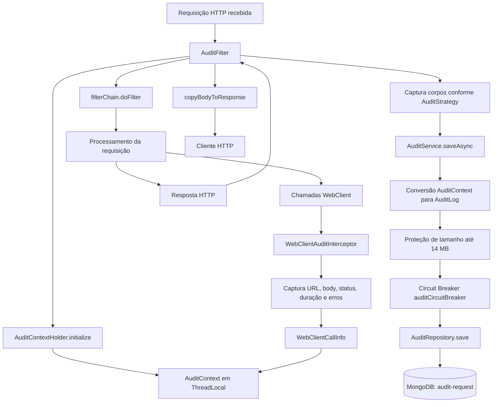
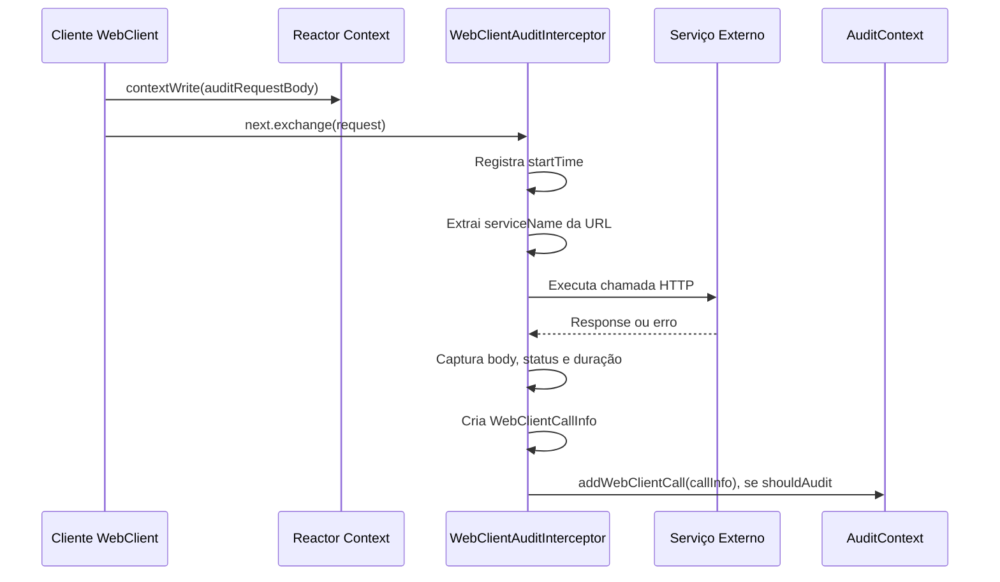

# Sistema de Auditoria Assíncrona do REEF-ACDC Backend

## 1. Metadados do Documento
- **Arquivo de Origem:** `Não identificado — conteúdo bruto fornecido na solicitação`
- **Tipo de Documento:** `Arquitetura de Software`
- **Domínio / Sistema:** `REEF-ACDC Backend — Sistema de Auditoria`
- **Público-Alvo:** `Desenvolvedores, Arquitetos e Operação`
- **Data/Versão Identificada:** `Não identificada`

---

## 2. Resumo Executivo & Contexto de Negócio

O Sistema de Auditoria do REEF-ACDC Backend registra, de forma assíncrona e não intrusiva, as requisições HTTP recebidas pelo sistema e as chamadas WebClient realizadas durante o processamento dessas requisições. O objetivo declarado é fornecer rastreabilidade completa para atividades de troubleshooting sem impactar o desempenho do fluxo principal da aplicação.

A auditoria é controlada pela propriedade `audit.strategy` no arquivo `application.yml`. As estratégias disponíveis são `NONE`, `ALL` e `ERROR`, permitindo desativar integralmente a captura, registrar todas as interações ou registrar apenas informações relevantes a falhas. A estratégia `ERROR` é indicada pelo documento como ideal para produção, pois reduz a ocupação do MongoDB ao restringir a captura detalhada a cenários com erro.

O fluxo começa no `AuditFilter`, que intercepta a requisição HTTP, inicializa um `AuditContext` por requisição e captura metadados como identificador, URI, método HTTP e, conforme a estratégia, corpos de requisição e resposta. Durante o processamento, o `WebClientAuditInterceptor` captura chamadas externas, incluindo URL, corpo, código de status, duração e eventuais mensagens de erro.

Ao final da requisição, o `AuditService` converte o contexto acumulado em um documento `AuditLog` e realiza sua persistência assíncrona na coleção `audit-request` do MongoDB. A persistência é protegida por um Circuit Breaker para evitar que indisponibilidade ou sobrecarga do MongoDB afete a aplicação principal.

O mecanismo também possui controles explícitos de capacidade: no máximo 30 chamadas WebClient são acumuladas por requisição e existe proteção contra o limite de 16 MB por documento do MongoDB. Quando o tamanho estimado ultrapassa 14 MB, o sistema remove progressivamente chamadas WebClient mais antigas e, se necessário, substitui corpos de chamadas com erro por `TRUNCATED`.

---

## 3. Arquitetura, Componentes & Tecnologias Envolvidas

| Componente / Tecnologia | Tipo | Papel no Sistema |
| :--- | :--- | :--- |
| `AuditFilter` | `OncePerRequestFilter` com `@Order(HIGHEST_PRECEDENCE)` | Intercepta requisições HTTP, inicializa o contexto, captura corpos e inicia o salvamento ao fim da requisição. |
| `WebClientAuditInterceptor` | `ExchangeFilterFunction` | Intercepta chamadas WebClient e captura dados de requisição, resposta, status, duração e erros. |
| `AuditContext` | Estado por requisição | Armazena metadados da requisição HTTP e a lista de chamadas WebClient associadas. |
| `AuditContextHolder` | `ThreadLocal` | Mantém o `AuditContext` da requisição corrente. |
| `AuditService` | `@Service` com `@Async` | Converte `AuditContext` em `AuditLog`, aplica proteção de tamanho e persiste dados. |
| `AuditRepository` | Spring Data MongoDB | Interface de persistência da coleção `audit-request`. |
| `AuditLog` | `@Document` MongoDB | Modelo persistido no MongoDB. |
| `CircuitBreaker` | Mecanismo de resiliência | Protege a persistência no MongoDB contra falhas e sobrecarga. |
| MongoDB | Banco de dados | Armazena documentos de auditoria na coleção `audit-request`. |
| `auditExecutor` | Pool assíncrono | Executa `AuditService.saveAsync()` sem bloquear a thread HTTP. |
| Reactor Context | Contexto reativo | Transporta `auditRequestBody` para o interceptor WebClient. |
| `ContentCachingRequestWrapper` | Wrapper HTTP | Permite ler o corpo da requisição mais de uma vez. |
| `ContentCachingResponseWrapper` | Wrapper HTTP | Permite ler o corpo da resposta mais de uma vez e restaurá-lo ao cliente. |



### Fluxo de auditoria de chamadas WebClient



### Estratégias de auditoria

| Estratégia | Comportamento da requisição HTTP principal | Comportamento das chamadas WebClient | Overhead / Uso indicado |
| :--- | :--- | :--- | :--- |
| `NONE` | Não captura dados. | Não registra chamadas. | Zero overhead quando auditoria não é necessária. |
| `ALL` | Captura corpos de requisição e resposta. | Captura todas as chamadas, com sucesso ou erro, incluindo corpos. | Análise completa e troubleshooting intensivo. |
| `ERROR` | Registra endpoint e timestamp sempre; captura corpos apenas se houver erro. | Registra somente chamadas com falha HTTP `4xx`/`5xx` ou exceção de rede. | Indicado para produção segundo o documento. |

---

## 4. Regras de Negócio, Especificações Funcionais & Processos

### 4.1. Inicialização e encerramento do contexto de auditoria

Para cada requisição HTTP, o `AuditFilter` executa o seguinte ciclo:

1. Executa `AuditContextHolder.initialize()`.
2. Gera `context.requestId` com `UUID.randomUUID()`.
3. Define `context.requestStartTime` com `LocalDateTime.now()`.
4. Define `context.endpoint` com `request.getRequestURI()`.
5. Define `context.httpMethod` com `request.getMethod()`.
6. Executa `filterChain.doFilter(wrappedRequest, wrappedResponse)`.
7. Obtém o status HTTP por meio de `wrappedResponse.getStatus()`.
8. Define erro quando `status >= 400` ou `context.hasErrors()` retorna verdadeiro.
9. Captura `requestBody` e `responseBody` somente quando `shouldCaptureBody(isError)` permitir.
10. Define o status por meio de `context.setResponseStatus(responseStatus)`.
11. Chama `auditService.saveAsync(context)` sem bloquear a thread HTTP.
12. Executa `wrappedResponse.copyBodyToResponse()` para restaurar o corpo da resposta ao cliente.

### 4.2. Regra de captura de corpos da requisição HTTP

| Estratégia | Resultado de `shouldCaptureBody(isError)` |
| :--- | :--- |
| `NONE` | Sempre `false`. |
| `ALL` | Sempre `true`. |
| `ERROR` | `true` somente quando `isError == true`. |

Os corpos são obtidos por `ContentCachingRequestWrapper` e `ContentCachingResponseWrapper`. O corpo principal é truncado quando ultrapassa `audit.filter.max-body-size` caracteres.

### 4.3. Regras de captura de chamadas WebClient

O corpo da requisição WebClient não está diretamente disponível no `ExchangeFilterFunction`. Para disponibilizá-lo ao interceptor, cada cliente externo deve serializar o payload e inseri-lo no contexto Reactor antes de chamar `.block()`:

```text
.contextWrite(ctx -> ctx.put("auditRequestBody", requestBodyJson))
```

O interceptor obtém o valor com:

```text
Mono.deferContextual(contextView -> {
    String requestBody = contextView.getOrDefault("auditRequestBody", "");
    ...
})
```

Para cada chamada WebClient, o interceptor:

1. Registra `startTime`.
2. Extrai `serviceName` da URL.
3. Chama `next.exchange(request)`.
4. Captura o corpo da resposta como `String` usando `bodyToMono`.
5. Cria um novo `ClientResponse` com o mesmo corpo para manter o corpo disponível ao cliente.
6. Cria um `WebClientCallInfo`.
7. Avalia `shouldAudit(callInfo)`.
8. Registra o `WebClientCallInfo` no `AuditContext` quando a estratégia permitir.
9. Em caso de erro, via `onErrorResume`, cria um `WebClientCallInfo` com `success=false` e `errorMessage=exception.message`.

### 4.4. Regra de auditoria de chamadas WebClient

| Estratégia | Regra de `shouldAudit()` |
| :--- | :--- |
| `NONE` | Nunca audita. |
| `ALL` | Sempre audita. |
| `ERROR` | Audita somente quando `callInfo.success == false`. |

### 4.5. Regras do `AuditContext`

O `AuditContext` é inicializado no começo de cada requisição HTTP e removido ao final. A lista de chamadas WebClient utiliza `CopyOnWriteArrayList`, sendo thread-safe.

| Método calculado | Regra |
| :--- | :--- |
| `calculateTotalDuration()` | Calcula `now() - requestStartTime` em milissegundos. |
| `hasErrors()` | Retorna `true` quando algum `WebClientCallInfo` possui `success == false`. |
| `getTotalCalls()` | Retorna o tamanho de `webClientCalls`. |
| `getSuccessfulCalls()` | Retorna a quantidade de chamadas com `success == true`. |
| `getFailedCalls()` | Retorna a quantidade de chamadas com `success == false`. |

A quantidade máxima de chamadas WebClient é 30, definida por `MAX_WEBCLIENT_CALLS`. O objetivo dessa limitação é prevenir consumo excessivo de memória em requisições com muitas iterações, como um orquestrador com muitos riscos.

### 4.6. Regras de persistência assíncrona

O método `saveAsync(AuditContext context)` do `AuditService` possui `@Async("auditExecutor")`. Portanto, sua execução ocorre em uma thread do pool `auditExecutor`, sem bloquear a thread HTTP.

O processo de persistência é:

1. Converter `AuditContext` em `AuditLog`.
2. Aplicar `applyMongoSizeProtection(auditLog)`.
3. Decorar `auditRepository.save(auditLog)` com `CircuitBreaker`.
4. Caso o circuito esteja `OPEN`, ocorrerá `CallNotPermittedException`.
5. Quando o circuito estiver `OPEN`, o sistema registra `log.warn("Audit save skipped (Circuit OPEN)")`.
6. Quando a gravação for bem-sucedida, o sistema registra informações com `RequestID`, `Endpoint`, `TotalCalls` e `HasErrors`.

### 4.7. Regras do Circuit Breaker

O Circuit Breaker denominado `auditCircuitBreaker` protege o MongoDB contra sobrecarga e evita que uma falha no banco bloqueie a aplicação principal.

| Estado | Comportamento |
| :--- | :--- |
| `CLOSED` | Estado normal; todas as chamadas ao MongoDB são realizadas. |
| `OPEN` | MongoDB possivelmente indisponível; os salvamentos são ignorados e um warning é registrado. |
| `HALF_OPEN` | Permite cinco chamadas de teste para verificar a recuperação do MongoDB. |

As transições de estado são registradas com:

```text
log.warn("Audit Circuit Breaker: X -> Y")
```

### 4.8. Regras de proteção contra limite de documento MongoDB

O MongoDB possui limite de 16 MB por documento. O `AuditService.applyMongoSizeProtection()` usa 14 MB como limiar operacional.

| Condição | Ação |
| :--- | :--- |
| `estimatedSize ≤ 14MB` | O `AuditLog` é salvo sem alterações. |
| `estimatedSize > 14MB` — passo 1 | Remove progressivamente `WebClientCallInfo` do primeiro ao último; chamadas mais antigas são removidas e chamadas mais recentes são preservadas. |
| Ainda `estimatedSize > 14MB` — passo 2 | Para cada `WebClientCallInfo` com `errorMessage` não nulo, define `requestBody = "TRUNCATED"` e `responseBody = "TRUNCATED"`. |
| Após truncamento dos corpos | Recalcula o tamanho estimado e registra `log.warn("All WebClient call bodies truncated")`. |

Os campos `requestBody` e `responseBody` da requisição HTTP principal nunca são truncados por esse mecanismo.

### 4.9. Exclusões e desativação do filtro

As rotas configuradas em `audit.filter.exclude-patterns` são excluídas da auditoria. O filtro pode ser totalmente desabilitado com:

```text
audit.filter.enabled: false
```

---

## 5. Tabelas de Parâmetros, Ambientes e Estruturas de Dados

### 5.1. Configuração `application.yml`

| Item / Parâmetro | Descrição / Função | Tipo / Valores / Formato | Ambiente / Observações |
| :--- | :--- | :--- | :--- |
| `audit.strategy` | Define a estratégia de auditoria. | `NONE`, `ALL`, `ERROR` | Exemplo apresentado: `ALL`. |
| `audit.filter.enabled` | Habilita ou desabilita completamente o filtro de auditoria. | Booleano: `true` ou `false` | Exemplo apresentado: `true`. |
| `audit.filter.exclude-patterns` | Define padrões de URI excluídos da auditoria. | Lista separada por vírgulas | Inclui endpoints operacionais e de documentação. |
| `audit.filter.max-body-size` | Define o máximo de caracteres capturados do corpo principal. | Número inteiro | Exemplo: `250000`. |
| `audit.webclient.max-body-size` | Define o máximo de caracteres capturados do corpo WebClient. | Número inteiro | Exemplo: `5000`. |
| `spring.data.mongodb.uri` | URI de conexão com MongoDB. | Expressão de configuração | `${MONGODB_URI:mongodb://localhost:27017/orc-int}`. |

### 5.2. Parâmetros do Circuit Breaker

| Item / Parâmetro | Descrição / Função | Tipo / Valores / Formato | Ambiente / Observações |
| :--- | :--- | :--- | :--- |
| `failureRateThreshold` | Percentual de falhas a partir do qual o circuito abre. | `50%` | Abre quando pelo menos 50% das chamadas falham. |
| `slidingWindowSize` | Quantidade de chamadas consideradas na janela deslizante. | `10` | Últimas 10 chamadas. |
| `minimumNumberOfCalls` | Número mínimo de chamadas antes do cálculo da taxa de falha. | `5` | Necessário para avaliar a taxa de falha. |
| `waitDurationInOpenState` | Tempo em estado `OPEN` antes de tentar `HALF_OPEN`. | `30s` | Tempo de espera definido. |
| `permittedCallsInHalfOpenState` | Chamadas de teste permitidas no estado `HALF_OPEN`. | `5` | Verifica possível recuperação do MongoDB. |
| `autoTransitionHalfOpen` | Habilita transição automática de `OPEN` para `HALF_OPEN`. | `true` | Transição automática habilitada. |

### 5.3. Estrutura do `AuditContext`

| Campo | Descrição / Função | Tipo / Valores / Formato | Ambiente / Observações |
| :--- | :--- | :--- | :--- |
| `requestId` | Identificador da requisição. | UUID | Gerado por `UUID.randomUUID()`. |
| `requestStartTime` | Momento de início da requisição. | Data/hora | Definido com `LocalDateTime.now()`. |
| `endpoint` | URI da requisição recebida. | String | Obtido por `request.getRequestURI()`. |
| `httpMethod` | Método HTTP da requisição. | Ex.: `GET`, `POST` | Obtido por `request.getMethod()`. |
| `requestBody` | Corpo da requisição HTTP recebida. | String / bytes convertidos | Captura depende da estratégia. |
| `responseBody` | Corpo da resposta HTTP enviada. | String / bytes convertidos | Captura depende da estratégia. |
| `responseStatus` | Código HTTP de resposta. | Código HTTP | Obtido de `wrappedResponse.getStatus()`. |
| `webClientCalls` | Chamadas WebClient associadas à requisição. | `List<WebClientCallInfo>` | `CopyOnWriteArrayList`; máximo de 30 entradas. |

### 5.4. Estrutura do `AuditLog`

| Campo | Descrição / Função | Tipo / Valores / Formato | Ambiente / Observações |
| :--- | :--- | :--- | :--- |
| `_id` | Identificador persistido do documento. | `ObjectId` | Gerado pelo MongoDB. |
| `requestId` | Identificador UUID da requisição. | UUID | Campo indexado. |
| `timestamp` | Data/hora de início da requisição. | Data/hora | Campo indexado. |
| `endpoint` | URI do endpoint. | String | Campo indexado. |
| `httpMethod` | Método HTTP. | Ex.: `GET`, `POST` | Persistido no documento. |
| `requestBody` | Corpo da requisição HTTP de entrada. | String | Pode depender da estratégia. |
| `responseBody` | Corpo da resposta HTTP de saída. | String | Pode depender da estratégia. |
| `responseStatus` | Código HTTP da resposta. | Código HTTP | Persistido no documento. |
| `webClientCalls` | Lista de chamadas externas WebClient. | Lista de objetos | Pode conter até 30 entradas no contexto. |
| `totalDurationMs` | Duração total da requisição. | Milissegundos | Calculado a partir de `requestStartTime`. |
| `hasErrors` | Indica se alguma chamada WebClient falhou. | Booleano | Derivado de `WebClientCallInfo.success`. |
| `totalCalls` | Número total de chamadas WebClient. | Número inteiro | Calculado. |
| `successfulCalls` | Número de chamadas bem-sucedidas. | Número inteiro | Calculado. |
| `failedCalls` | Número de chamadas com falha. | Número inteiro | Calculado. |
| `persistedAt` | Data/hora da escrita no MongoDB. | Data/hora | Registrada na persistência. |

### 5.5. Estrutura de `WebClientCallInfo`

| Campo | Descrição / Função | Tipo / Valores / Formato | Ambiente / Observações |
| :--- | :--- | :--- | :--- |
| `serviceName` | Nome do serviço chamado. | String | Extraído da URL. |
| `url` | URL completa chamada. | String | Capturada pelo interceptor. |
| `httpMethod` | Método HTTP da chamada externa. | Método HTTP | Persistido na chamada auditada. |
| `requestBody` | Payload enviado ao serviço externo. | String | Obtido do Reactor Context. |
| `responseBody` | Corpo da resposta do serviço externo. | String | Capturado com `bodyToMono`. |
| `statusCode` | Código HTTP de resposta externa. | Código HTTP | Associado à chamada. |
| `startTime` | Momento de início da chamada. | Data/hora | Registrado pelo interceptor. |
| `endTime` | Momento de fim da chamada. | Data/hora | Registrado pelo interceptor. |
| `durationMs` | Duração da chamada. | Milissegundos | Calculada a partir de início e fim. |
| `success` | Indica sucesso ou falha. | Booleano | `false` em erro HTTP ou exceção, conforme documentado. |
| `errorMessage` | Mensagem associada à exceção. | String | Preenchida somente quando `success=false`. |

### 5.6. Rotas excluídas por padrão

| Item / Parâmetro | Descrição / Função | Tipo / Valores / Formato | Ambiente / Observações |
| :--- | :--- | :--- | :--- |
| `/actuator/**` | Health checks e métricas. | Padrão de rota | Excluído por padrão. |
| `/swagger-ui/**` | Documentação OpenAPI. | Padrão de rota | Excluído por padrão. |
| `/v3/api-docs/**` | Especificação OpenAPI. | Padrão de rota | Excluído por padrão. |
| `/favicon.ico` | Ícone do site. | Rota fixa | Excluído por padrão. |

---

## 6. Bateria de Perguntas & Respostas para RAG (FAQ Sintético)

### P1: Qual é o objetivo do Sistema de Auditoria do REEF-ACDC Backend?
**R:** O Sistema de Auditoria registra de forma assíncrona e não intrusiva cada requisição HTTP recebida e todas as chamadas WebClient realizadas durante seu processamento. O objetivo é fornecer rastreabilidade completa para troubleshooting sem impactar o desempenho da aplicação principal.

### P2: Qual componente intercepta as requisições HTTP recebidas pelo REEF-ACDC?
**R:** O componente `AuditFilter`, localizado em `audit/filter/AuditFilter.java`, intercepta requisições HTTP. Ele é um `OncePerRequestFilter` com `@Order(HIGHEST_PRECEDENCE)`, inicializa o `AuditContext`, captura metadados e corpos quando aplicável, e dispara o salvamento assíncrono ao fim da requisição.

### P3: Quais estratégias de auditoria podem ser configuradas em `audit.strategy`?
**R:** As estratégias são `NONE`, `ALL` e `ERROR`. `NONE` não captura nenhum dado; `ALL` captura todas as chamadas WebClient e corpos da requisição principal; `ERROR` registra endpoint e timestamp sempre, mas captura corpos e chamadas WebClient somente em situações de erro.

### P4: Quando a estratégia `ERROR` registra uma chamada WebClient?
**R:** Com a estratégia `ERROR`, o `WebClientAuditInterceptor` adiciona `WebClientCallInfo` somente quando a chamada falha. O documento considera falha respostas HTTP `4xx` ou `5xx` e exceções de rede, representadas por `callInfo.success == false`.

### P5: Como o corpo de uma requisição WebClient é disponibilizado para auditoria?
**R:** Cada cliente externo deve serializar seu payload e incluí-lo no Reactor Context antes de `.block()`, usando `.contextWrite(ctx -> ctx.put("auditRequestBody", requestBodyJson))`. O `WebClientAuditInterceptor` lê esse valor por `Mono.deferContextual`.

### P6: Qual é o limite de chamadas WebClient armazenadas por requisição?
**R:** O `AuditContext` armazena no máximo 30 entradas de `WebClientCallInfo`, por meio do limite `MAX_WEBCLIENT_CALLS`. O documento informa que essa limitação previne consumo excessivo de memória em requisições com muitas iterações.

### P7: Como o salvamento de auditoria evita bloquear a requisição HTTP?
**R:** O método `AuditService.saveAsync()` utiliza a anotação `@Async("auditExecutor")`. Dessa forma, a conversão de `AuditContext` em `AuditLog`, a proteção de tamanho e a persistência no MongoDB ocorrem em uma thread do pool `auditExecutor`, sem bloquear a thread HTTP.

### P8: O que acontece quando o Circuit Breaker de auditoria está no estado `OPEN`?
**R:** Quando o `auditCircuitBreaker` está `OPEN`, a persistência no MongoDB é ignorada e ocorre `CallNotPermittedException`. O sistema registra o warning `Audit save skipped (Circuit OPEN)`, evitando que falhas do MongoDB bloqueiem a aplicação principal.

### P9: Como o sistema protege documentos de auditoria contra o limite de 16 MB do MongoDB?
**R:** O sistema usa um limiar de 14 MB. Se o tamanho estimado ultrapassar esse valor, remove progressivamente chamadas WebClient mais antigas, preservando as mais recentes. Se o tamanho permanecer acima de 14 MB, substitui `requestBody` e `responseBody` por `TRUNCATED` para chamadas WebClient que tenham `errorMessage` não nulo. Os corpos da requisição HTTP principal nunca são truncados por esse mecanismo.

### P10: Quais dados do `AuditLog` são indexados no MongoDB?
**R:** O modelo `AuditLog` indica que `requestId`, `timestamp` e `endpoint` possuem `@Indexed`. Esses campos representam, respectivamente, o UUID da requisição, a data/hora de início e a URI do endpoint.

### P11: Quais rotas são excluídas da auditoria por padrão?
**R:** As rotas excluídas por padrão são `/actuator/**`, `/swagger-ui/**`, `/v3/api-docs/**` e `/favicon.ico`. Elas podem ser configuradas na propriedade `audit.filter.exclude-patterns`.

### P12: Como a resposta HTTP é preservada para o cliente depois da auditoria?
**R:** O `AuditFilter` usa `ContentCachingResponseWrapper` para ler o corpo da resposta e, ao final, chama `wrappedResponse.copyBodyToResponse()`. Essa operação é importante porque restaura o corpo da resposta para o cliente HTTP.

---

## 7. Glossário de Termos, Siglas & Conceitos-Chave

- **ACDC:** Nome do módulo principal documentado dentro do REEF-ACDC Backend.
- **AuditContext:** Estado de auditoria associado à requisição HTTP atual, contendo metadados e chamadas WebClient.
- **AuditContextHolder:** Componente baseado em `ThreadLocal` que armazena o `AuditContext` da requisição atual.
- **AuditFilter:** Filtro HTTP responsável por iniciar, preencher e finalizar a auditoria da requisição.
- **AuditLog:** Modelo MongoDB persistido na coleção `audit-request`.
- **AuditRepository:** Interface Spring Data MongoDB usada para persistir o `AuditLog`.
- **AuditService:** Serviço assíncrono que converte, protege e persiste dados de auditoria.
- **AuditStrategy:** Estratégia configurável que determina quais informações são auditadas e quando.
- **Circuit Breaker:** Mecanismo de resiliência que interrompe temporariamente tentativas de persistência quando o MongoDB apresenta taxa de falhas relevante.
- **`CLOSED`:** Estado normal do Circuit Breaker, no qual chamadas ao MongoDB são permitidas.
- **`HALF_OPEN`:** Estado de teste do Circuit Breaker, no qual cinco chamadas são permitidas para verificar recuperação.
- **`OPEN`:** Estado do Circuit Breaker no qual salvamentos são ignorados.
- **`ExchangeFilterFunction`:** Tipo de filtro utilizado pelo `WebClientAuditInterceptor` para interceptar chamadas WebClient.
- **MongoDB:** Banco de dados que armazena os documentos `AuditLog`.
- **Reactor Context:** Contexto reativo utilizado para transmitir o corpo da requisição WebClient ao interceptor.
- **ThreadLocal:** Mecanismo utilizado por `AuditContextHolder` para manter estado por requisição.
- **WebClient:** Cliente HTTP utilizado pelo sistema para chamadas externas.
- **WebClientCallInfo:** Estrutura que representa uma chamada WebClient auditada.

---

## 8. Notas Críticas, Riscos & Limitações

- A estratégia padrão é `NONE`; nessa configuração, `AuditFilter` e `WebClientAuditInterceptor` retornam imediatamente e não capturam informações.
- A estratégia `ALL` captura corpos da requisição principal e de chamadas WebClient, inclusive em operações bem-sucedidas. O documento a indica para análise completa e troubleshooting intensivo.
- Na estratégia `ERROR`, endpoint e timestamp da requisição principal são capturados sempre, mas corpos são capturados somente em caso de erro.
- A captura de `requestBody` das chamadas WebClient depende de cada cliente externo escrever `auditRequestBody` no Reactor Context. O documento não descreve comportamento alternativo quando um cliente não inserir essa informação.
- O `AuditContext` limita a 30 o número de chamadas WebClient. Chamadas acima desse limite não são detalhadas no conteúdo fornecido.
- A proteção de tamanho remove chamadas WebClient mais antigas quando o documento excede 14 MB estimados. Isso pode reduzir a rastreabilidade histórica de chamadas iniciais em uma requisição.
- Quando o documento ainda excede 14 MB, os corpos de chamadas WebClient com `errorMessage` não nulo são substituídos por `TRUNCATED`.
- Os corpos da requisição e resposta HTTP principal nunca são truncados pelo algoritmo de `applyMongoSizeProtection()`, conforme o documento.
- Quando o Circuit Breaker está `OPEN`, salvamentos de auditoria são ignorados. Portanto, pode haver ausência de registros de auditoria durante indisponibilidade percebida do MongoDB.
- A URI padrão apresentada para MongoDB é `mongodb://localhost:27017/orc-int`, condicionada à ausência de `MONGODB_URI`.
- **Nota de Análise:** O documento não detalha os contratos HTTP, métodos ou payloads dos serviços externos auditados.
- **Nota de Análise:** O documento cita o registro de `WebClientAuditInterceptor` em `WebClientConfig`, mas não apresenta a implementação dessa configuração.
- **Nota de Análise:** O documento não informa políticas de retenção, expurgo, mascaramento de dados sensíveis, criptografia ou controle de acesso para os registros armazenados na coleção `audit-request`.

---

## 9. Conteúdo Bruto Estruturado (Referência Fiel)

```text
# Auditoría

# Sistema de Auditoría

Parte de la documentación de REEF-ACDC.

## 1. Visión general

El sistema de auditoría registra de forma asíncrona y no intrusiva cada petición HTTP entrante y todas las llamadas WebClient salientes que se realizan durante su procesamiento. El objetivo es tener trazabilidad completa para troubleshooting sin impactar el rendimiento.

Petición HTTP entrante
        │
        ▼
  ┌─────────────┐   inicializa AuditContext (ThreadLocal)
  │ AuditFilter │   captura URI, método, body request/response
  └──────┬──────┘
         │
         ▼  (cada llamada WebClient)
  ┌──────────────────────────┐
  │ WebClientAuditInterceptor │   captura URL, body, status, duración
  └──────────┬───────────────┘
             │
             ▼
  ┌──────────────────┐
  │  AuditContext    │   acumula hasta 30 WebClientCallInfo
  └──────────┬───────┘
             │ al finalizar la petición HTTP
             ▼
  ┌──────────────────┐
  │  AuditService    │   @Async — no bloquea el hilo principal
  │  (+ CircuitBreaker)│
  └──────────┬───────┘
             │
             ▼
  MongoDB: colección audit-request

## 2. Estrategias de auditoría (AuditStrategy)

Configurable con audit.strategy en application.yml. Controla qué se captura y cuándo.

### NONE (por defecto)

- No se captura nada.
- AuditFilter y WebClientAuditInterceptor retornan inmediatamente sin hacer nada.
- Cero overhead en producción si no se necesita auditoría.

### ALL

- Captura todas las llamadas WebClient, éxitos y errores.
- Captura bodies de request y response de la petición principal.
- Captura bodies de request y response de cada llamada WebClient.
- Útil para análisis completo y troubleshooting intensivo.

### ERROR

- Captura el endpoint y timestamp de la petición principal siempre.
- Solo captura bodies de request y response principal si hubo algún error.
- Solo añade WebClientCallInfo para llamadas WebClient que fallaron: HTTP 4xx/5xx o excepción de red.
- Ideal para producción: registra lo necesario para diagnosticar problemas sin llenar MongoDB con datos de éxito.

## 3. Componentes y flujo de datos

| Componente | Tipo | Responsabilidad |
| --- | --- | --- |
| AuditFilter | OncePerRequestFilter @Order(HIGHEST_PRECEDENCE) | Intercepta requests HTTP. Inicializa AuditContext. Captura bodies de entrada/salida. Dispara el guardado al finalizar. |
| WebClientAuditInterceptor | ExchangeFilterFunction | Intercepta cada llamada WebClient. Captura URL, request body del contexto reactor, response body, status y duración. |
| AuditContext | ThreadLocal vía AuditContextHolder | Almacena el estado de auditoría de la petición actual: metadata y lista de WebClientCallInfo. |
| AuditService | @Service + @Async | Convierte AuditContext a AuditLog, aplica protección de tamaño y persiste en MongoDB. |
| AuditRepository | Spring Data MongoDB | Interfaz de persistencia para la colección audit-request. |
| AuditLog | @Document MongoDB | Modelo de datos persistido. |

## 4. AuditFilter — Captura de la request HTTP entrante

Fichero: audit/filter/AuditFilter.java

Envuelve request y response con ContentCachingRequestWrapper y ContentCachingResponseWrapper para poder leer los bodies más de una vez.

Ciclo de vida por petición:

1. AuditContextHolder.initialize()
2. context.requestId = UUID.randomUUID()
3. context.requestStartTime = LocalDateTime.now()
4. context.endpoint = request.getRequestURI()
5. context.httpMethod = request.getMethod()
6. filterChain.doFilter(wrappedRequest, wrappedResponse)
7. responseStatus = wrappedResponse.getStatus()
8. isError = (status >= 400) || context.hasErrors()
9. Si shouldCaptureBody(isError):
   - requestBody = wrappedRequest.getContentAsByteArray()
   - responseBody = wrappedResponse.getContentAsByteArray()
   - truncados si superan maxBodySize caracteres
10. context.setResponseStatus(responseStatus)
11. auditService.saveAsync(context)
12. wrappedResponse.copyBodyToResponse()

shouldCaptureBody(isError):
- NONE: siempre false.
- ALL: siempre true.
- ERROR: solo si isError == true.

## 5. WebClientAuditInterceptor — Captura de llamadas salientes

Fichero: audit/interceptor/WebClientAuditInterceptor.java

Registrado como ExchangeFilterFunction en WebClientConfig. Se ejecuta para cada llamada que hace cualquier cliente WebClient del sistema.

El body no está directamente disponible en el ExchangeFilterFunction. Cada cliente serializa su payload y lo coloca en el contexto reactor antes del .block():

.contextWrite(ctx -> ctx.put("auditRequestBody", requestBodyJson))

El interceptor lo lee con:

Mono.deferContextual(contextView -> {
    String requestBody = contextView.getOrDefault("auditRequestBody", "");
    ...
})

Flujo de captura:

1. Registra startTime.
2. Extrae serviceName de la URL.
3. Llama al siguiente handler: next.exchange(request).
4. Captura el response body como String con bodyToMono.
5. Construye ClientResponse nuevo con el mismo body.
6. Crea WebClientCallInfo con todos los datos.
7. Si shouldAudit(callInfo), ejecuta registerAudit(callInfo, contextView).
8. AuditContextHolder.getContext().addWebClientCall(callInfo).
9. En caso de error, onErrorResume crea WebClientCallInfo con success=false y errorMessage=exception.message.

| Estrategia | ¿Cuándo audita? |
| --- | --- |
| NONE | Nunca |
| ALL | Siempre |
| ERROR | Solo si callInfo.success == false |

## 6. AuditContext — Estado por petición

Fichero: audit/context/AuditContext.java

Almacenado en AuditContextHolder mediante ThreadLocal. Se inicializa al inicio de cada request HTTP y se limpia al finalizar.

AuditContext {
    requestId
    requestStartTime
    endpoint
    httpMethod
    requestBody
    responseBody
    responseStatus
    List<WebClientCallInfo> webClientCalls
}

La lista webClientCalls es thread-safe mediante CopyOnWriteArrayList y admite como máximo 30 entradas.

| Método | Descripción |
| --- | --- |
| calculateTotalDuration() | now() - requestStartTime en milisegundos |
| hasErrors() | true si algún WebClientCallInfo tiene success == false |
| getTotalCalls() | Tamaño de webClientCalls |
| getSuccessfulCalls() | Llamadas con success == true |
| getFailedCalls() | Llamadas con success == false |

El límite MAX_WEBCLIENT_CALLS previene consumo excesivo de memoria en peticiones con muchas iteraciones, como un orquestador con muchos riesgos.

## 7. AuditService — Persistencia asíncrona

Fichero: audit/service/AuditService.java

saveAsync() está anotado con @Async("auditExecutor"), por lo que se ejecuta en un hilo del pool auditExecutor, configurado en AuditConfig, sin bloquear el hilo HTTP.

Proceso de guardado:

saveAsync(AuditContext context)
   │
   ├── convertToAuditLog(context) → AuditLog
   ├── applyMongoSizeProtection(auditLog)
   ├── CircuitBreaker.decorateSupplier(circuitBreaker, () -> auditRepository.save(auditLog))
   │     → si el circuito está OPEN: CallNotPermittedException
   │     → log.warn("Audit save skipped (Circuit OPEN)")
   │     → si OK: guarda en MongoDB
   └── log.info("Audit saved - RequestID: ... - Endpoint: ... - TotalCalls: ... - HasErrors: ...")

## 8. Modelo AuditLog en MongoDB

Colección: audit-request

AuditLog {
  _id
  requestId      @Indexed
  timestamp      @Indexed
  endpoint       @Indexed
  httpMethod
  requestBody
  responseBody
  responseStatus

  webClientCalls: [
    {
      serviceName
      url
      httpMethod
      requestBody
      responseBody
      statusCode
      startTime
      endTime
      durationMs
      success
      errorMessage
    }
  ]

  totalDurationMs
  hasErrors
  totalCalls
  successfulCalls
  failedCalls
  persistedAt
}

## 9. Circuit Breaker

Fichero: config/CircuitBreakerConfiguration.java

Configuración del CircuitBreaker auditCircuitBreaker:
- failureRateThreshold: 50%
- slidingWindowSize: 10
- minimumNumberOfCalls: 5
- waitDurationInOpenState: 30s
- permittedCallsInHalfOpenState: 5
- autoTransitionHalfOpen: true

| Estado | Comportamiento |
| --- | --- |
| CLOSED | Normal; todas las llamadas a MongoDB se realizan. |
| OPEN | MongoDB posiblemente caído; se saltan los guardados y se registra warning. |
| HALF_OPEN | Prueba; permite cinco llamadas para verificar recuperación de MongoDB. |

Los cambios de estado se registran con:
log.warn("Audit Circuit Breaker: X -> Y")

## 10. Protección de tamaño: límite de 16 MB MongoDB

MongoDB tiene un límite de 16 MB por documento. AuditService.applyMongoSizeProtection() aplica un umbral de 14 MB.

estimatedSize = suma de bytes de todos los campos del AuditLog

Si estimatedSize ≤ 14MB:
- Guardar sin cambios.

Si estimatedSize > 14MB:
- Paso 1: truncar WebClientCallInfo progresivamente de primero a último.
- Se eliminan las llamadas más antiguas y se preservan las más recientes.
- Recalcular estimatedSize.

Si el tamaño sigue siendo superior a 14MB:
- Para cada WebClientCallInfo con errorMessage no nulo:
  - requestBody = "TRUNCATED"
  - responseBody = "TRUNCATED"
- Recalcular estimatedSize.
- log.warn("All WebClient call bodies truncated")

Nota: requestBody y responseBody de la petición principal nunca se truncan.

## 11. Configuración

application.yml:

audit:
  strategy: ALL

  filter:
    enabled: true
    exclude-patterns: /actuator/**,/swagger-ui/**,/v3/api-docs/**,/favicon.ico
    max-body-size: 250000

  webclient:
    max-body-size: 5000

spring:
  data:
    mongodb:
      uri: ${MONGODB_URI:mongodb://localhost:27017/orc-int}

## 12. Exclusiones

Rutas excluidas de auditoría por defecto:
- /actuator/**: health checks y métricas.
- /swagger-ui/**: documentación OpenAPI.
- /v3/api-docs/**: especificación OpenAPI.
- /favicon.ico

La auditoría también se puede deshabilitar completamente con:
audit.filter.enabled: false
```
