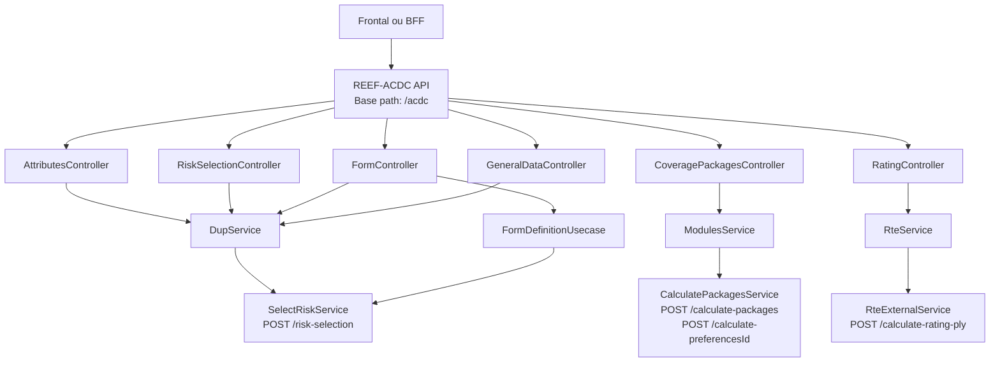
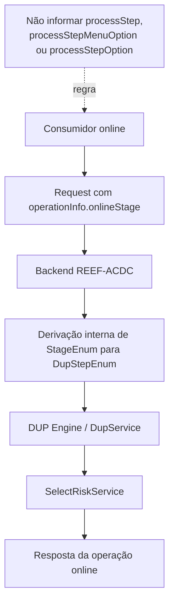
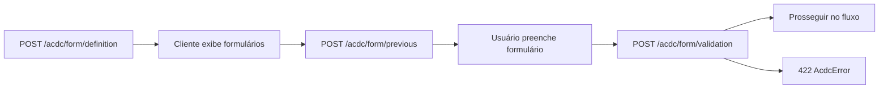

# Endpoints Online — API REEF-ACDC: Operações Granulares de Contratação, DUP, Módulos, Tarificação e Formulários

## 1. Metadados do Documento
- **Arquivo de Origem:** Não identificado; conteúdo bruto fornecido na solicitação.
- **Tipo de Documento:** Especificação Técnica / Arquitetura de Software.
- **Domínio / Sistema:** REEF-ACDC, DUP Engine, Modules Service e RTE.
- **Público-Alvo:** Desenvolvedores, Arquitetos, Operação e Analistas Funcionais.
- **Data/Versão Identificada:** Não identificada.

---

## 2. Resumo Executivo & Contexto de Negócio

O documento especifica os endpoints online da API REEF-ACDC, concebidos para executar operações granulares do processo de contratação de apólices. Diferentemente do orquestrador batch, que executa o ciclo integral de uma apólice, os endpoints online permitem que frontais e BFFs invoquem etapas individuais sob demanda.

A API REEF-ACDC centraliza operações de pré-cálculo e validação de atributos, execução de controles técnicos, cálculo e consulta de pacotes de cobertura, tarificação, definição e validação de formulários e validação de dados gerais da apólice. Todos os endpoints utilizam o caminho-base `/acdc`, autenticação OAuth2 JWT via Spring Security Resource Server, formato `application/json` e o sistema-fonte `SourceSystemEnum.ONLINE`.

O motor DUP é responsável pela seleção e execução de regras em diversas operações online. O contrato público online utiliza `operationInfo.onlineStage`, baseado em `StageEnum`, para determinar internamente os passos DUP correspondentes. Consumidores online não devem enviar `processStep`, `processStepMenuOption` ou `processStepOption`.

A solução integra módulos internos como `DupService`, `ModulesService`, `RteService` e use cases específicos, além de sistemas ou serviços subjacentes como `SelectRiskService`, `CalculatePackagesService` e `RteExternalService`. A estrutura permite que experiências de contratação online sejam implementadas passo a passo, preservando regras de negócio, validações e cálculos definidos no ecossistema REEF-ACDC.

---

## 3. Arquitetura, Componentes & Tecnologias Envolvidas

### Componentes identificados

| Componente | Responsabilidade documentada |
| :--- | :--- |
| REEF-ACDC | API que expõe endpoints online para contratação, validação, módulos, formulários e tarificação. |
| `AttributesController` | Gerencia atributos variáveis em nível de apólice, risco ou cobertura. |
| `RiskSelectionController` | Executa controles técnicos DUP em um passo específico. |
| `CoveragePackagesController` | Calcula, consulta e prepara pacotes ou módulos de cobertura. |
| `RatingController` | Executa tarificação de apólices ou suplementos. |
| `FormController` | Define, pré-calcula e valida formulários de produto. |
| `GeneralDataController` | Valida dados gerais da apólice. |
| `DupService` | Executa operações DUP de pré-cálculo, validação e controles técnicos. |
| `SelectRiskService` | Serviço chamado pelo fluxo DUP por meio de `POST /risk-selection`. |
| `ModulesService` | Gerencia cálculo e preferências de módulos de cobertura. |
| `CalculatePackagesService` | Serviço chamado para cálculo de pacotes e obtenção de preferências. |
| `RteService` | Coordena a tarificação de riscos e coberturas. |
| `RteExternalService` | Serviço externo chamado por `RteService` em `POST /calculate-rating-ply`. |
| DUP Engine | Motor de regras utilizado para seleção, validação, pré-cálculo, formulários e controles técnicos. |
| RTE | Componente de tarificação de apólices, suplementos, riscos e coberturas. |
| MongoDB `RS-RULES-ACTIONS-CONDITIONS` | Coleção que armazena regras de formulários DUP. |



### Fluxo de seleção de etapas DUP online



### Fluxo de ciclo de vida de formulários



---

## 4. Regras de Negócio, Especificações Funcionais & Processos

### Regras comuns aos endpoints online

- O caminho-base é `/acdc`.
- A autenticação é OAuth2 JWT por Spring Security Resource Server.
- O formato de comunicação é `application/json`.
- O sistema-fonte é `SourceSystemEnum.ONLINE`, em contraste com `BATCH`, utilizado pelo orquestrador batch.
- Endpoints online que executam DUP usam `operationInfo.onlineStage`.
- O backend deriva os valores de `processStep`, `processStepMenuOption` e `processStepOption` a partir de `onlineStage` e valores de `DupStepEnum`.
- O consumidor online não deve informar diretamente `processStep`, `processStepMenuOption` ou `processStepOption`.
- `processTypeId` é um `Integer` no modelo Java. Representações históricas como `"ALT"` devem ser consideradas desatualizadas para esse campo.

### Póliza anterior e facts `prev.*`

Quando um DTO expõe `prevOPlyPlyC` e esse objeto é informado, o mapper cria facts com o prefixo `prev.`:

- `prev.fixedValues.*`
- `prev.variableData.*`
- `prev.insured.*`
- `prev.coverages.*`
- `prev.participants.*`

Esses facts permitem regras de comparação entre apólice atual e apólice anterior.

### Contrato `cmlObj` em operações DUP online

Nos endpoints `/attributes/*` e `/technical-control/execution`, o campo `cmlObj` publica acumulações como facts avaliáveis pelo motor de regras.

- Facts de tomador: `participants.policyHolder.accumulations.{cvrVal}.*`
- Facts de segurado: `insured.accumulations.{cvrVal}.*`
- Campos derivados:
  - `accumulationWithCapital`
  - `accumulationWithPremium`
- Os campos derivados são criados apenas quando a cobertura `coverages.{cvrVal}` existe no contexto.
- Regras podem utilizar wildcard `*` e operador `ANY_MATCH`, por exemplo:
  - `coverages.*.name`
  - `insured.accumulations.*.accumulationWithCapital`
- Se não houver correspondência documental entre `thpDcmTypVal` + `thpDcmVal` e tomador ou segurado, facts de acumulação não são gerados.

### Atributos de apólice, risco e cobertura

#### `POST /acdc/attributes/previous`

- Pré-calcula valores padrão e atribuições automáticas.
- Deve ser utilizado antes de exibir um formulário, para preencher valores padrão ou propagar dados de níveis superiores.
- Equivale aos passos batch:
  - `PREVIOUS_VARIABLE_DATA_POLICY`
  - `PREVIOUS_VARIABLE_DATA_RISK`
  - `PREVIOUS_VARIABLE_COVERAGE`
- Fluxo interno: `DupService.precalculateByStep()` → `SelectRiskService`.

O campo `level` define o nível de execução:

- `"1"`: apólice.
- `"2"`: risco.
- `"3"`: cobertura.

#### `POST /acdc/attributes/validation`

- Valida atributos introduzidos pelo usuário.
- Deve ser utilizado no envio de formulário, antes do avanço no processo.
- Stages de validação citados:
  - `POLICY_DATA_VALIDATION`
  - `RISK_DATA_VALIDATION`
  - `COVERAGE_DATA_VALIDATION`
  - stages `GRP_PLY_*`
- Em inconsistências detectadas por regras DUP, a API retorna `422` com erros de validação.
- O documento registra que `ValidateAttributesUsecase` atualmente chama `DupService.precalculateByStep()`, embora o endpoint possua semântica funcional de validação.
- **Nota de Análise:** o documento determina que o contrato não deve ser alterado sem revisão do código.

### Validação de póliza grupo

| Stage online | Step DUP derivado | Uso |
| :--- | :--- | :--- |
| `GRP_PLY_FIXED_DATA_VALIDATION` | `VALIDATION_FIXED_DATA_PLY_GRP` `[1-30-20]` | Validação de dados fixos de grupo. |
| `GRP_PLY_VARIABLE_DATA_PREVIOUS` | `PREVIOUS_VARIABLE_DATA_PLY_GRP` `[2-30-10]` | Pré-cálculo de variáveis de grupo. |
| `GRP_PLY_VARIABLE_DATA_VALIDATION` | `VALIDATION_VARIABLE_DATA_PLY_GRP` `[2-30-20]` | Validação de variáveis de grupo. |

O número de apólice grupo é transportado em `OPlyGniS.gppVal` e publicado como `fixedValues.groupPolicyNumber`.

### Controles técnicos

#### `POST /acdc/technical-control/execution`

- Executa um bloco de controles técnicos DUP para um passo concreto.
- Exemplos de controles técnicos citados:
  - `COVERAGE_CONTROL`
  - `CLAUSES_CONTROL`
- Retorna `OPlyUtcP`, representando controles técnicos aplicados, como reasseguro, cláusulas e impressão.
- Fluxo interno: `DupService.processTCByStep()` → `SelectRiskService`.
- O passo DUP é definido pelo `operationInfo.onlineStage`.
- Para `BENEFICIARY_RISK_TYPE` `[3-0-0]`, o documento referencia o catálogo de tipos de interveniente `bnfTypVal`.

### Pacotes e módulos de cobertura

#### `POST /acdc/coverage-packages/calculation`

- Calcula coberturas pertencentes ao pacote selecionado para um risco.
- Deve ser utilizado quando o usuário selecionou um pacote e `NUM_SIMULACION` está informado.
- Fluxo interno: `ModulesService.getModules()` → `CalculatePackagesService`.
- Retorna `List<OPlyCvcPC>`.

#### `POST /acdc/coverage-packages/preferences`

- Retorna opções de pacotes disponíveis para o risco.
- Não materializa coberturas concretas.
- Deve ser utilizado para construir o seletor de módulos no cliente.
- Fluxo interno: `ModulesService.getPreferences()` → `CalculatePackagesService`.
- Retorna `List<ResponsePreferences>`.

#### `POST /acdc/coverage-packages/previous`

- Retorna todas as coberturas do módulo ou preferência selecionada.
- Preserva coberturas independentes já existentes.
- Completa coberturas restantes com valores padrão.
- Coberturas obrigatórias não informadas recebem `cvrSlc = "*"`.
- Requer `riskVal` e `NUM_SIMULACION` no polizón.
- Recalcula capitais do mesmo risco que tenham `coverageRef + validPcts`.
- A base de cálculo é o `cplAmn` resolvido da cobertura referenciada:
  - valor enviado pelo usuário, quando informado;
  - valor padrão do módulo, quando preenchido automaticamente.
- O método privado recursivo `resolveSameRiskAmount`, em `ModulesServiceImpl`, utiliza guarda de ciclos `visitedCoverageIds`.
- Quando um capital informado pelo usuário coincide com algum `validPct` da base resolvida, esse capital é preservado.
- Caso contrário, é aplicado o primeiro `validPct`.
- Ciclos, referências irresolúveis, regras com `data.risk` ou `maxPct` são preservados sem alteração.
- Essas condições não geram erro de validação no endpoint.

### Tarificação

#### `POST /acdc/rating/calculation`

- Calcula ou recalcula prêmios para um risco específico.
- Tipicamente deve ser usado antes da apresentação do resumo de cotação.
- Fluxo interno: `RteService.calculationRisk()` → `RteExternalService`.
- Retorna `List<OPlyCvcPC>` com coberturas e prêmios calculados.
- `currentPolicy` representa a apólice atual ou vigente e pode ser `null` em primeira emissão.
- `newSupplement` representa a apólice contendo os novos dados a tarifar.
- A diferença entre `currentPolicy` e `newSupplement` permite cálculo de diferenciais de prêmio em suplementos.
- `riskVal` é obrigatório neste endpoint.

Quando `riskVal = 0`:

- O catálogo de pacotes é consultado com `coverageLevel=POLICY`.
- É utilizado `product=99999` como valor genérico para coberturas fictícias.
- Coberturas de apólice são injetadas em `oPlyCvcCT` antes da chamada a RTE.

#### `POST /acdc/rating/calculation-risks`

- Tarifa e retorna um ou mais riscos como `List<OPlyRkcPC>`.
- `riskVal = 0`: retorna coberturas de apólice embrulhadas como risco sintético.
- `riskVal` concreto: retorna apenas o risco solicitado.
- `riskVal = null`: retorna todos os riscos.
- Para `riskVal = null`, o risco sintético `0` é incluído com coberturas de apólice injetadas.
- Para riscos concretos como `1`, `2` ou `3`, o catálogo de coberturas de apólice não é consultado.
- Se não existirem documentos de catálogo com `coverageLevel: "POLICY"`, o risco `0` é devolvido sem coberturas.

### Formulários

#### Stages de formulário

| Stage online | Step DUP |
| :--- | :--- |
| `PRE_RATING_FORMULARY_DEFINITION` | `PRE_FORM_VALIDATION_DEFINITION` `[11-10-10]` |
| `POST_RATING_FORMULARY_DEFINITION` | `POST_FORM_VALIDATION_DEFINITION` `[11-10-20]` |

#### `POST /acdc/form/definition`

- Obtém a definição de formulários exigidos em uma etapa.
- Retorna `List<FormDefinition>`.
- A saída é construída filtrando ações DUP com `type = CUESTIONARIO`.
- O valor `frlVal` da ação é mapeado para `FormDefinition.frlVal`.
- Os campos `cmpVal`, `mdtVal`, `frlNam`, `frlShrNam`, `btcPrcVal`, `obsGrpMxnPonVal`, `atzErrVal`, `prrFrlPrdNam` e `plcFrlRqs` permanecem nulos na implementação atual, salvo extensão futura do mapeamento.
- Sem regras aplicáveis, retorna lista vazia.
- Ações `CUESTIONARIO` sem `frlVal` válido são ignoradas e geram warning.
- Múltiplas ações de questionário resultam em um item por ação encontrada.
- Dados obrigatórios ausentes geram `RS_MISSING_DATA`.

#### `POST /acdc/form/previous`

- Pré-calcula atributos de formulário com `PRE_FORM_VALIDATION_DEFINITION`.
- Aplica ações `Asignacion` aos campos do formulário.
- Retorna atributos enriquecidos com valores e, quando aplicável, modificadores de interface:
  - `RQR`
  - `INV`
  - `BLK`

#### `POST /acdc/form/validation`

- Valida dados preenchidos no formulário com `POST_FORM_VALIDATION_DEFINITION`.
- Pode comparar apólice atual com `prevOPlyPlyC`.
- Retorna `422 AcdcError` quando existem erros.
- Erros de negócio podem surgir quando existem ações:
  - `DOCUMENTATION`
  - `CUESTIONARIO`
  - `REJECTION`
  - `AUDIT`

### Modelagem de regras Mongo para formulários

- As regras ficam na coleção `RS-RULES-ACTIONS-CONDITIONS`.
- Uma regra destinada a `/acdc/form/definition` deve retornar ao menos uma ação `CUESTIONARIO`.
- `frlVal` deve ser convertível para número, pois é transformado para `BigDecimal`.
- Recomendações documentadas:
  1. Alinhar `process_step`, `option_menu_number` e `option_number` ao fluxo DUP consumidor.
  2. Usar `process_field` para diferenciar formulários semelhantes.
  3. Manter `frlVal` único por formulário.
  4. Evitar regras equivalentes duplicadas no mesmo contexto, pois cada ação encontrada gera uma entrada na resposta.

### Dados gerais da apólice

#### `POST /acdc/general-data/validation`

- Valida `OPlyGniP`.
- Abrange dados de cabeçalho como companhia, ramo, produto, datas e moeda.
- Equivale aos passos:
  - `FIXED_DATA_DUP` `[1-0-0]`
  - `VARIABLE_DATA_POLICY` `[2-0-0]`
- Utiliza `DupService` em múltiplos passos e `SelectRiskService`.
- Retorna os dados gerais atualizados e validados.

---

## 5. Tabelas de Parâmetros, Ambientes e Estruturas de Dados

### Convenções técnicas globais

| Item / Parâmetro | Descrição / Função | Tipo / Valores / Formato | Ambiente / Observações |
| :--- | :--- | :--- | :--- |
| Base path | Prefixo comum das rotas online | `/acdc` | API REEF-ACDC |
| Autenticação | Controle de acesso dos endpoints | OAuth2 JWT | Spring Security Resource Server |
| Formato | Formato de payload e resposta | `application/json` | Todos os endpoints |
| Sistema fonte | Identifica chamadas online | `SourceSystemEnum.ONLINE` | Diferente do `BATCH` |
| `onlineStage` | Determina a etapa DUP | `StageEnum` | Obrigatório para operações DUP online |
| `processStep` | Etapa DUP explícita | Não informar pelo consumidor | Derivado internamente |
| `processStepMenuOption` | Opção de menu DUP | Não informar pelo consumidor | Derivado internamente |
| `processStepOption` | Opção DUP | Não informar pelo consumidor | Derivado internamente |
| `processTypeId` | Tipo de processo | `Integer` | Valores string históricos são desatualizados |

### Controllers, rotas e papéis

| Controller | Rota base | Função | Roles requeridos |
| :--- | :--- | :--- | :--- |
| `AttributesController` | `/attributes` | Pré-cálculo e validação de atributos | `GAZU-ROLPSYADM`, `GAZU-ROLPSYCTR`, `ROL_ACDC_ATR` |
| `RiskSelectionController` | `/technical-control` | Execução de controles técnicos DUP | `GAZU-ROLPSYADM`, `GAZU-ROLPSYCTR`, `ROL_ACDC_TECH_CONTROL` |
| `CoveragePackagesController` | `/coverage-packages` | Cálculo e consulta de módulos e pacotes | `GAZU_ROLRTEMGR`, `GAZU_ROLRTEADM`, `ROL_ACDC_CVR_PACK` |
| `RatingController` | `/rating` | Tarificação de apólices e suplementos | `GAZU_ROLRTEMGR`, `GAZU_ROLRTEADM`, `ROL_ACDC_RATING` |
| `FormController` | `/form` | Definição, pré-cálculo e validação de formulários | `GAZU_ROLRTEMGR`, `GAZU_ROLRTEADM`, `ROL_ACDC_FORM` |
| `GeneralDataController` | `/general-data` | Validação de dados gerais | `GAZU-ROLPSYADM`, `GAZU-ROLPSYCTR`, `ROL_ACDC_GNI_DATA` |

### Rotas online

| Endpoint | Request principal | Response | Serviço subjacente |
| :--- | :--- | :--- | :--- |
| `POST /acdc/attributes/previous` | `PrevalidationRequestDto` | `List<OPlyAtcPC>` | `DupService.precalculateByStep()` |
| `POST /acdc/attributes/validation` | `PrevalidationRequestDto` | `List<OPlyAtcPC>` ou `422 AcdcError` | `ValidateAttributesUsecase` / `DupService.precalculateByStep()` |
| `POST /acdc/technical-control/execution` | `TechnicalControlRequestDto` | `List<OPlyUtcP>` | `DupService.processTCByStep()` |
| `POST /acdc/coverage-packages/calculation` | `CalculatePackagesRequestDto` | `List<OPlyCvcPC>` | `ModulesService.getModules()` |
| `POST /acdc/coverage-packages/preferences` | `CalculatePackagesRequestDto` | `List<ResponsePreferences>` | `ModulesService.getPreferences()` |
| `POST /acdc/coverage-packages/previous` | `CalculatePackagesRequestDto` | `List<OPlyCvcPC>` | `PreviousCoveragePackagesUsecase.getPreviousCoverages()` |
| `POST /acdc/rating/calculation` | `RatingPlyRequestDto` | `List<OPlyCvcPC>` | `RteService.calculationRisk()` |
| `POST /acdc/rating/calculation-risks` | `RatingPlyRequestDto` | `List<OPlyRkcPC>` | `RatingUsecase.calculateRatingRisks()` |
| `POST /acdc/form/definition` | `FormDefinitionRequestDto` | `List<FormDefinition>` | `FormDefinitionUsecase.requestFormDefinitions()` |
| `POST /acdc/form/previous` | `FormDefinitionRequestDto` | `List<OPlyAtcPC>` | `DupService.precalculateByStep()` |
| `POST /acdc/form/validation` | `FormDefinitionRequestDto` | `List<OPlyAtcPC>` ou `422 AcdcError` | `DupService.validationByStep()` |
| `POST /acdc/general-data/validation` | `GeneralDataValidationRequestDto` | `OPlyGniP` | `DupService` |

### Campos de `FormDefinitionRequestDto`

| Campo | Descrição / Função | Tipo / Valores / Formato | Ambiente / Observações |
| :--- | :--- | :--- | :--- |
| `operationInfo` | Contexto de execução | operação, `onlineStage`, `requestId`, idioma, `executionType`, `processTypeId`, `productId` | O backend aplica valores padrão quando faltam `requestId`, `executionType` ou `processTypeId`. |
| `oPlyPlyC` | Apólice atual | Objeto de apólice | Usada por DUP e em pré-cálculo/validação. |
| `prevOPlyPlyC` | Apólice anterior | Objeto de apólice opcional | Relevante em `/validation`. |
| `riskVal` | Risco-alvo | Valor de risco | Restringe busca no DUP. |
| `coverageVal` | Cobertura-alvo | Valor de cobertura | Usado em formulários dependentes de cobertura. |
| `dataFormMap` | Contexto adicional | Mapa de dados | Transferido ao critério DUP em `/definition`. |
| `dataForms` | Formulários e atributos construídos | Lista | Consumida em `/previous` e `/validation`. |
| `documents` | Documentos submetidos | Lista | Utilizados em regras documentais DUP. |
| `cmlObj` | Acumulações e dados CML | Lista | Enviado ao motor DUP. |

### Campos mínimos de regra Mongo para formulário

| Campo Mongo | Descrição / Função | Tipo / Valores / Formato | Ambiente / Observações |
| :--- | :--- | :--- | :--- |
| `rule_id` / `rule_name` | Identificador funcional | Texto | Identificação da regra. |
| `company`, `branch`, `product` | Escopo comercial | Texto | `product` pode usar wildcard `99999`. |
| `execution_type`, `process_type` | Segmentação de execução e processo | Valores de contexto | Aplicados pela seleção DUP. |
| `process_step` | Passo DUP | Ex.: `11-10-10`, `11-10-20` | Usualmente utilizado em formulários. |
| `option_menu_number`, `option_number` | Opções do fluxo DUP | Números | Associados à etapa. |
| `process_field` | Campo ativador | Texto | Diferencia formulários similares. |
| `coverage` | Cobertura-alvo | Cobertura ou `null` | `null` quando a regra não depende de cobertura. |
| `active`, `expiry_date` | Estado e vigência | Ex.: `Y`, data | Controle de ativação. |
| `conditions` / `condition` | Critérios de aplicação | Condições V1 ou V2 | Avaliados pelo motor. |
| `actions` | Ações resultantes | Lista de ações | Deve conter `CUESTIONARIO` para definição de formulário. |

---

## 6. Bateria de Perguntas & Respostas para RAG (FAQ Sintético)

### P1: Qual é a diferença entre os endpoints online REEF-ACDC e o orquestrador batch?
**R:** O orquestrador batch executa o ciclo completo de uma apólice de ponta a ponta. Os endpoints online REEF-ACDC expõem operações granulares para frontais ou BFFs que precisam executar individualmente etapas específicas do processo de contratação, como pré-cálculo de atributos, validação, controles técnicos, seleção de pacotes, tarificação e formulários.

### P2: Quais campos DUP não devem ser informados por consumidores online?
**R:** Consumidores online não devem informar `processStep`, `processStepMenuOption` ou `processStepOption`. O backend REEF-ACDC deriva esses valores internamente a partir de `operationInfo.onlineStage` e dos valores de `DupStepEnum`.

### P3: Como enviar dados de apólice anterior para regras DUP online?
**R:** Quando o DTO expõe o campo `prevOPlyPlyC`, a apólice anterior deve ser enviada nesse campo. O mapper gera facts com prefixo `prev.`, incluindo `prev.fixedValues.*`, `prev.variableData.*`, `prev.insured.*`, `prev.coverages.*` e `prev.participants.*`, permitindo comparações entre estado atual e anterior.

### P4: Para que serve o endpoint `/acdc/attributes/previous`?
**R:** O endpoint `POST /acdc/attributes/previous` pré-calcula valores padrão e atribuições automáticas de atributos em nível de apólice, risco ou cobertura. Deve ser usado antes de exibir um formulário, para preencher valores padrão ou propagar dados de níveis superiores.

### P5: Qual endpoint executa controles técnicos DUP isoladamente?
**R:** O endpoint `POST /acdc/technical-control/execution`, do `RiskSelectionController`, executa um bloco de controles técnicos DUP para um passo determinado por `operationInfo.onlineStage`. Ele retorna `List<OPlyUtcP>` com controles como reasseguro, cláusulas ou impressão.

### P6: Qual a diferença entre `/coverage-packages/preferences` e `/coverage-packages/calculation`?
**R:** `POST /acdc/coverage-packages/preferences` retorna as opções de pacotes disponíveis para o risco, sem materializar coberturas concretas. `POST /acdc/coverage-packages/calculation` calcula as coberturas correspondentes ao pacote selecionado, normalmente após o preenchimento de `NUM_SIMULACION`.

### P7: Como o endpoint `/coverage-packages/previous` trata capitais de coberturas relacionadas?
**R:** O endpoint recalcula capitais do mesmo risco que possuam `coverageRef + validPcts`, usando o `cplAmn` da cobertura referenciada. Se o valor informado pelo usuário já coincide com algum percentual válido, ele é preservado; caso contrário, é aplicado o primeiro `validPct`. Ciclos, referências irresolúveis e regras com `data.risk` ou `maxPct` permanecem inalterados e não geram erro de validação.

### P8: Quando `currentPolicy` deve ser `null` na tarificação?
**R:** Em uma cotação nova ou primeira emissão, `currentPolicy` deve ser `null`. A separação entre `currentPolicy` e `newSupplement` existe para que RTE calcule diferenciais de prêmio em operações de suplemento.

### P9: O que acontece quando `riskVal = 0` no endpoint `/acdc/rating/calculation`?
**R:** Antes da chamada a RTE, REEF-ACDC consulta o catálogo de pacotes com `coverageLevel=POLICY` e `product=99999`, valor genérico para coberturas fictícias. As coberturas de apólice são então injetadas em `oPlyCvcCT`. O campo `riskVal` é obrigatório nesse endpoint.

### P10: Como o endpoint `/acdc/form/definition` identifica os formulários a retornar?
**R:** O endpoint filtra ações DUP cujo tipo é `CUESTIONARIO` e mapeia o campo `frlVal` para `FormDefinition.frlVal`. Se não houver regras aplicáveis, retorna uma lista vazia. Ações sem `frlVal` válido são ignoradas e registram warning.

### P11: Quais ações DUP podem gerar erro de negócio na validação de formulário?
**R:** Em `POST /acdc/form/validation`, erros de negócio podem ser retornados quando a avaliação encontra ações `DOCUMENTATION`, `CUESTIONARIO`, `REJECTION` ou `AUDIT`. O endpoint pode retornar `422 AcdcError`.

### P12: Onde devem ser armazenadas as regras de formulários DUP?
**R:** As regras de formulários ficam na coleção MongoDB `RS-RULES-ACTIONS-CONDITIONS`. Para que `/acdc/form/definition` identifique um formulário, uma regra aplicável deve conter pelo menos uma ação com `type: "CUESTIONARIO"`.

---

## 7. Glossário de Termos, Siglas & Conceitos-Chave

- **ACDC:** Módulo principal documentado da API REEF-ACDC.
- **BFF:** Backend for Frontend; consumidor potencial dos endpoints online.
- **CML:** Dados de acumulações enviados no campo `cmlObj`.
- **DUP:** Motor de regras utilizado para pré-cálculo, validação, controles técnicos e formulários.
- **DUP Engine:** Componente que seleciona e avalia regras conforme contexto, `StageEnum` e `DupStepEnum`.
- **JWT:** JSON Web Token utilizado na autenticação OAuth2.
- **OAuth2:** Protocolo de autenticação utilizado pela API.
- **RTE:** Componente de tarificação responsável pelo cálculo de prêmios.
- **`StageEnum`:** Enumeração utilizada por `operationInfo.onlineStage` para determinar uma etapa online.
- **`DupStepEnum`:** Enumeração de passos DUP derivada internamente a partir de `StageEnum`.
- **`OPlyPlyC`:** Estrutura de polizón ou apólice utilizada em requests.
- **`OPlyAtcPC`:** Estrutura retornada para atributos atualizados ou validados.
- **`OPlyUtcP`:** Estrutura retornada para controles técnicos.
- **`OPlyCvcPC`:** Estrutura de cobertura retornada em cálculo de pacotes e tarificação.
- **`OPlyRkcPC`:** Estrutura de risco retornada na tarificação por riscos.
- **`OPlyGniP`:** Dados gerais da apólice.
- **`OPlyGniS.gppVal`:** Campo que transporta o dado de apólice grupo.
- **`cplAmn`:** Capital utilizado no cálculo de coberturas relacionadas.
- **`cvrSlc`:** Indicador de seleção de cobertura; `"*"` marca cobertura obrigatória selecionada.
- **`NUM_SIMULACION`:** Informação de simulação utilizada para materialização de pacotes e módulos.
- **`frlVal`:** Identificador de formulário retornado por `POST /acdc/form/definition`.
- **`CUESTIONARIO`:** Tipo de ação DUP utilizado para representar formulário ou questionário.
- **`ANY_MATCH`:** Operador de regra utilizado com wildcard `*` em mapas de cobertura ou acumulação.
- **`RS_MISSING_DATA`:** Retorno de validação quando dados obrigatórios estão ausentes.
- **`RS-RULES-ACTIONS-CONDITIONS`:** Coleção MongoDB onde regras DUP de formulários são armazenadas.

---

## 8. Notas Críticas, Riscos & Limitações

- **Nota de Análise:** O documento não identifica versão, data de publicação ou arquivo-fonte original.
- **Nota de Análise:** O endpoint `/acdc/attributes/validation` possui semântica de validação, mas a documentação registra que `ValidateAttributesUsecase` chama atualmente `DupService.precalculateByStep()`. Alterações contratuais exigem revisão de código.
- **Nota de Análise:** O documento referencia materiais relacionados, como `DUP_ENGINE.md`, `MODULES_SERVICE.md`, `EXTERNAL_CLIENTS.md` e `ENDPOINT_BATCH_ORCHESTATOR.md`, mas não fornece o conteúdo integral desses materiais.
- `frlVal` inválido ou ausente impede que uma ação `CUESTIONARIO` seja devolvida pela definição de formulários.
- Sem regras DUP aplicáveis, endpoints de definição de formulário podem retornar listas vazias sem erro funcional.
- Sem documentos de catálogo com `coverageLevel: "POLICY"`, o risco sintético `0` pode ser devolvido sem coberturas.
- Ciclos e referências de cobertura não resolvíveis no fluxo `/coverage-packages/previous` não resultam em erro de validação; essas regras são preservadas sem alteração.
- O documento não detalha contratos JSON completos, esquemas de todos os DTOs, códigos HTTP além de `422`, URLs de ambientes adicionais, portas, mecanismos de observabilidade ou políticas de timeout.
- **Nota de Análise:** O documento cita `REEF-ACDC Backend` em `https://reef.acdc-dev.es.emea.aws.mapfre.net/acdc/docs-portal/index.html`, mas não descreve disponibilidade, autenticação de acesso ao portal ou características adicionais do ambiente.

---

## 9. Conteúdo Bruto Estruturado (Referência Fiel)

```text
# Endpoints Online

Endpoints Online

REEF-ACDC Backend:
https://reef.acdc-dev.es.emea.aws.mapfre.net/acdc/docs-portal/index.html

Seções de navegação identificadas:
- Inicio
  - Documentación general
- ACDC — Módulo principal
  - Endpoints Online
  - Orquestador Batch
  - Cotizaciones
  - Clientes externos
  - Auditoría
  - Seguridad
- DUP — Motor de reglas
  - DUP Engine
  - Módulo DUP
- Módulos
  - Cálculo de Módulos
- RTE — Tarificación
  - Configuración de tarifas

Endpoints Online — API de REEF-ACDC

Contexto:
A diferencia del orquestador batch que ejecuta el ciclo completo de una póliza de principio a fin, estos endpoints exponen operaciones granulares pensadas para ser invocadas desde frontales o BFF que necesitan ejecutar pasos concretos del proceso de contratación de forma individual y bajo demanda.

Todos los endpoints comparten:
- Base path: /acdc
- Autenticación: OAuth2 JWT (Spring Security Resource Server)
- Formato: application/json
- Sistema fuente: SourceSystemEnum.ONLINE (frente al BATCH del orquestador)

Selección de paso DUP en contrato online:
En los endpoints online que ejecutan DUP, el contrato público usa operationInfo.onlineStage (StageEnum). No se deben informar processStep, processStepMenuOption ni processStepOption desde el consumidor online: el backend los deriva internamente a partir del stage y los valores de DupStepEnum.

Ejemplo:
"operationInfo": {
  "requestId": "uuid-v4",
  "countryId": "ES",
  "productId": 1234,
  "processTypeId": 1,
  "executionType": "7",
  "onlineStage": "POLICY_PREVIOUS"
}

processTypeId es Integer en el modelo Java; si la documentación histórica mostraba valores string como "ALT", debe entenderse como desactualizada para este campo.

Póliza anterior:
Los endpoints DUP online aceptan póliza anterior mediante prevOPlyPlyC cuando el DTO lo expone. Si se informa, el mapper genera facts con prefijo prev. al inicio:
- prev.fixedValues.*
- prev.variableData.*
- prev.insured.*
- prev.coverages.*
- prev.participants.*

Contrato cmlObj:
En /attributes/* y /technical-control/execution, cmlObj publica acumulaciones en facts evaluables por reglas.

Ejemplo:
"cmlObj": [
  {
    "thpDcmTypVal": "DNI",
    "thpDcmVal": "12345678A",
    "agrCvrT": [
      { "cvrVal": 100, "mxmAgrPreVal": 1500, "mxmAgrCplVal": 300000 }
    ]
  }
]

Facts:
- participants.policyHolder.accumulations.{cvrVal}.*
- insured.accumulations.{cvrVal}.*
- accumulationWithCapital
- accumulationWithPremium

Índice de endpoints:
- AttributesController: /attributes — Pre-cálculo y validación de atributos de póliza/riesgo/cobertura.
- RiskSelectionController: /technical-control — Ejecución de controles técnicos DUP en un paso concreto.
- CoveragePackagesController: /coverage-packages — Cálculo y consulta de paquetes/módulos de coberturas.
- RatingController: /rating — Tarificación de una póliza o suplemento.
- FormController: /form — Definición, pre-cálculo y validación de formularios.
- GeneralDataController: /general-data — Validación de datos generales de la póliza.

AttributesController:
- Fichero: controller/AttributesController.java
- Casos de uso: PrevalidateAttributesUsecase · ValidateAttributesUsecase
- Roles: GAZU-ROLPSYADM, GAZU-ROLPSYCTR, ROL_ACDC_ATR

POST /acdc/attributes/previous:
- Request: PrevalidationRequestDto
- Response: List<OPlyAtcPC>
- Uso: pre-calcular valores por defecto y asignaciones automáticas.
- Equivalente batch: PREVIOUS_VARIABLE_DATA_POLICY, PREVIOUS_VARIABLE_DATA_RISK, PREVIOUS_VARIABLE_COVERAGE.
- Llama a: DupService.precalculateByStep() → SelectRiskService.

POST /acdc/attributes/validation:
- Uso: validar atributos introducidos por el usuario.
- Stages: POLICY_DATA_VALIDATION, RISK_DATA_VALIDATION, COVERAGE_DATA_VALIDATION y GRP_PLY_*.
- Response: List<OPlyAtcPC> o 422 AcdcError.
- ValidateAttributesUsecase invoca DupService.precalculateByStep() según la implementación actual.

Validaciones de póliza grupo:
- GRP_PLY_FIXED_DATA_VALIDATION → VALIDATION_FIXED_DATA_PLY_GRP [1-30-20].
- GRP_PLY_VARIABLE_DATA_PREVIOUS → PREVIOUS_VARIABLE_DATA_PLY_GRP [2-30-10].
- GRP_PLY_VARIABLE_DATA_VALIDATION → VALIDATION_VARIABLE_DATA_PLY_GRP [2-30-20].
- OPlyGniS.gppVal se publica como fixedValues.groupPolicyNumber.

RiskSelectionController:
- Fichero: controller/RiskSelectionController.java
- Caso de uso: TechnicalControlUsecase
- Roles: GAZU-ROLPSYADM, GAZU-ROLPSYCTR, ROL_ACDC_TECH_CONTROL

POST /acdc/technical-control/execution:
- Request: TechnicalControlRequestDto.
- Response: List<OPlyUtcP>.
- Llama a: DupService.processTCByStep() → SelectRiskService.
- El paso DUP se determina desde operationInfo.onlineStage.

CoveragePackagesController:
- Fichero: controller/CoveragePackagesController.java
- Casos de uso: CalculateCoveragePackagesUsecase, ObtainCoveragePackagesUsecase, PreviousCoveragePackagesUsecase.
- Roles: GAZU_ROLRTEMGR, GAZU_ROLRTEADM, ROL_ACDC_CVR_PACK.

POST /acdc/coverage-packages/calculation:
- Request: CalculatePackagesRequestDto.
- Response: List<OPlyCvcPC>.
- Llama a: ModulesService.getModules() → CalculatePackagesService.

POST /acdc/coverage-packages/preferences:
- Response: List<ResponsePreferences>.
- Llama a: ModulesService.getPreferences() → CalculatePackagesService.

POST /acdc/coverage-packages/previous:
- Requiere riskVal y NUM_SIMULACION.
- Retorna todas las coberturas del módulo seleccionado.
- Conserva coberturas independientes.
- Completa las restantes con valores por defecto.
- Coberturas obligatorias no informadas: cvrSlc = "*".
- Usa resolveSameRiskAmount con guarda visitedCoverageIds.

RatingController:
- Fichero: controller/RatingController.java
- Caso de uso: RatingUsecase.
- Roles: GAZU_ROLRTEMGR, GAZU_ROLRTEADM, ROL_ACDC_RATING.

POST /acdc/rating/calculation:
- Request: RatingPlyRequestDto.
- Response: List<OPlyCvcPC>.
- Llama a: RteService.calculationRisk() → RteExternalService.
- currentPolicy puede ser null en primera emisión.
- riskVal es obligatorio.
- riskVal = 0 consulta coverageLevel=POLICY y product=99999.

POST /acdc/rating/calculation-risks:
- Response: List<OPlyRkcPC>.
- riskVal = 0: coberturas de apólice como risco sintético.
- riskVal concreto: devuelve ese risco.
- riskVal = null: devuelve todos los riscos.
- Si no hay coverageLevel: "POLICY", el risco 0 vuelve sin coberturas.

FormController:
- Fichero: controller/FormController.java
- Casos de uso: FormDefinitionUsecase, PreCalculateFormUsecase, ValidateFormUsecase.
- Roles: GAZU_ROLRTEMGR, GAZU_ROLRTEADM, ROL_ACDC_FORM.

POST /acdc/form/definition:
- Response: List<FormDefinition>.
- Filtra acciones type = CUESTIONARIO.
- Mapea frlVal a FormDefinition.frlVal.
- Sin reglas: lista vacía.
- frlVal inválido: acción ignorada y warning.
- Datos obligatorios ausentes: RS_MISSING_DATA.

POST /acdc/form/previous:
- Usa PRE_FORM_VALIDATION_DEFINITION [11-10-10].
- Aplica Asignacion.
- Puede devolver modificadores RQR, INV y BLK.

POST /acdc/form/validation:
- Usa POST_FORM_VALIDATION_DEFINITION [11-10-20].
- Puede comparar con prevOPlyPlyC.
- Retorna 422 AcdcError ante errores.
- Acciones relevantes: DOCUMENTATION, CUESTIONARIO, REJECTION, AUDIT.

Reglas Mongo de formulário:
- Colección: RS-RULES-ACTIONS-CONDITIONS.
- Acción requerida para definition: type: "CUESTIONARIO".
- Campos de acción: questionnaire, value, frlVal.
- frlVal debe ser convertible a BigDecimal.

Ejemplo de regla:
{
  "rule_id": "CUESTIONARIO_MEDICO_DEPORTE",
  "rule_name": "Cuestionario médico por deporte federado",
  "company": "MAPFRE",
  "branch": "ACDC",
  "product": "123",
  "execution_type": "7",
  "process_type": 99,
  "process_step": 11,
  "option_menu_number": 10,
  "option_number": 10,
  "process_field": "QUESTIONNAIRE_MEDICO",
  "active": "Y",
  "expiry_date": "2099-12-31",
  "conditions": [
    { "factor": "insured.federatedSports", "operator": "GT", "value": "0" },
    { "factor": "questionnaires.42", "operator": "NEX" }
  ],
  "actions": [
    {
      "type": "CUESTIONARIO",
      "questionnaire": "Debe responder el cuestionario médico por deporte federado",
      "value": "42",
      "frlVal": "1001"
    }
  ]
}

GeneralDataController:
- Fichero: controller/GeneralDataController.java.
- Caso de uso: GeneralDataAttributesUsecase.
- Roles: GAZU-ROLPSYADM, GAZU-ROLPSYCTR, ROL_ACDC_GNI_DATA.

POST /acdc/general-data/validation:
- Request: GeneralDataValidationRequestDto.
- Response: OPlyGniP.
- Equivalente batch: FIXED_DATA_DUP [1-0-0] y VARIABLE_DATA_POLICY [2-0-0].
- Llama a: DupService → SelectRiskService.

Módulos subyacentes por endpoint:
/attributes/previous           → DupService (PREVIOUS) → SelectRiskService
/attributes/validation         → DupService (precalculateByStep; endpoint funcionalmente VALIDATION) → SelectRiskService
/technical-control/execution   → DupService (CT) → SelectRiskService
/coverage-packages/calculation → ModulesService → CalculatePackagesService
/coverage-packages/preferences → ModulesService → CalculatePackagesService
/coverage-packages/previous    → PreviousCoveragePackages → CalculatePackagesService/catálogo
/rating/calculation            → RteService → RteExternalService
/rating/calculation-risks      → RteService → RteExternalService
/form/definition               → FormDefinitionUsecase → SelectRiskService
/form/previous                 → DupService (PREVIOUS) → SelectRiskService
/form/validation               → DupService (VALIDATION) → SelectRiskService
/general-data/validation       → DupService (CT) → SelectRiskService
```
