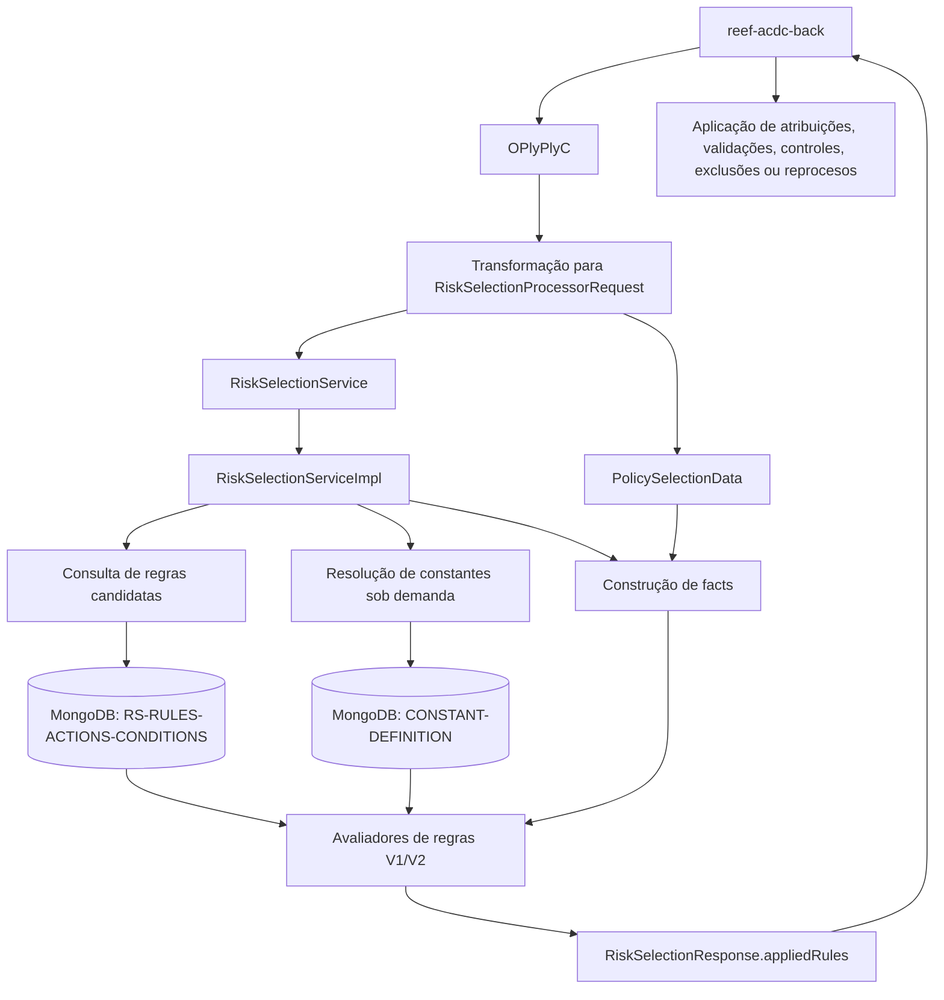

# REEF ACDC — Módulo DUP (`reef-acdc-dup`): Motor de Seleção e Avaliação de Regras

## 1. Metadados do Documento
- **Arquivo de Origem:** Não identificado no conteúdo extraído
- **Tipo de Documento:** Arquitetura de Software / Especificação Técnica
- **Domínio / Sistema:** REEF ACDC — DUP (Motor de regras)
- **Público-Alvo:** Desenvolvedores, Arquitetos, Operação e Analistas Funcionais
- **Data/Versão Identificada:** Não identificada

---

## 2. Resumo Executivo & Contexto de Negócio

O módulo `reef-acdc-dup` implementa o motor interno de seleção e avaliação de regras DUP utilizado por `reef-acdc-back`. O objetivo central do módulo é receber uma requisição de seleção de risco normalizada, recuperar regras candidatas armazenadas no MongoDB, construir os *facts* necessários para a avaliação e devolver as ações das regras aplicadas ao backend.

O módulo DUP não é descrito como um módulo JPA ou PostgreSQL e não contém entidades fictícias como `DupEntity` ou `RuleEntity`. As regras e constantes são consultadas no MongoDB, respectivamente nas coleções `RS-RULES-ACTIONS-CONDITIONS` e `CONSTANT-DEFINITION`, e o processamento ocorre em memória.

O fluxo começa quando `reef-acdc-back` transforma o objeto de apólice `OPlyPlyC` em `RiskSelectionProcessorRequest`. Essa requisição reúne metadados de execução, identificação do produto, contexto de processo e dados da apólice atual. Quando disponível, a apólice anterior também é disponibilizada ao mecanismo de regras.

As regras aplicadas podem resultar em atribuições, cálculos, avisos, auditorias, requisitos, documentos, questionários, rejeições, exclusões e reprocesos. A seleção de regras considera critérios de contexto, vigência, estado de ativação, cobertura, dados fixos da apólice, canais e níveis organizacionais, além de critérios de prioridade e especificidade.

---

## 3. Arquitetura, Componentes & Tecnologias Envolvidas

### Componentes identificados

| Componente | Responsabilidade |
| :--- | :--- |
| `reef-acdc-back` | Transforma o objeto de apólice `OPlyPlyC` em `RiskSelectionProcessorRequest` e aplica as ações devolvidas pelo motor DUP. |
| `reef-acdc-dup` | Motor interno de seleção e avaliação de regras DUP. |
| `RiskSelectionService` | Ponto de entrada do motor de regras. |
| `RiskSelectionServiceImpl` | Implementação que consulta regras candidatas, constrói *facts* e avalia condições. |
| `RiskSelectionProcessorRequest` | Requisição normalizada recebida pelo motor de regras. |
| `RiskSelectionResponse` | Resposta que contém as regras aplicadas em `appliedRules`. |
| `PolicySelectionData` | Agrupador de dados da apólice atual e, opcionalmente, da apólice anterior. |
| MongoDB | Base utilizada para consulta de regras e constantes. |
| `RS-RULES-ACTIONS-CONDITIONS` | Coleção MongoDB que armazena regras, ações e condições. |
| `CONSTANT-DEFINITION` | Coleção MongoDB utilizada para resolução de constantes sob demanda. |
| Avaliadores de regras V1/V2 | Componentes responsáveis pela avaliação das regras. |
| `TechnicalControlTypeEnum` | Enumeração dos tipos de ações e controles técnicos reconhecidos pelo módulo. |

### Fluxo arquitetural



### Contexto de dados e execução

O `RiskSelectionProcessorRequest` inclui metadados como `productId`, `executionType`, `processTypeId`, `processStep`, `processStepMenuOption`, `processStepOption`, país, companhia e ramo. O objeto também transporta os dados da apólice atual em `currentPolicyData` e, opcionalmente, os dados da apólice anterior em `previousPolicyData`.

> **Nota de Análise:** O documento cita avaliadores de regras V1/V2, mas não especifica os critérios que determinam qual versão do avaliador é utilizada, nem apresenta os contratos internos dessas implementações.

---

## 4. Regras de Negócio, Especificações Funcionais & Processos

### Fluxo funcional do motor DUP

1. O `reef-acdc-back` transforma o objeto de apólice `OPlyPlyC` em um `RiskSelectionProcessorRequest`.
2. O `RiskSelectionProcessorRequest` inclui metadados de produto, execução, processo, etapa, opções, país, companhia, ramo e dados de apólice.
3. O motor recebe os dados da apólice atual por meio de `currentPolicyData`.
4. Quando houver apólice anterior, o motor recebe os dados em `previousPolicyData`.
5. `RiskSelectionServiceImpl` consulta as regras candidatas no MongoDB.
6. `RiskSelectionServiceImpl` constrói os *facts* necessários para a avaliação.
7. Os avaliadores de regras V1/V2 avaliam as condições das regras.
8. As ações das regras aplicadas são devolvidas em `RiskSelectionResponse.appliedRules`.
9. O `reef-acdc-back` utiliza as ações aplicadas para executar atribuições, validações, controles técnicos, exclusões ou reprocesos.

### Dados agrupados em `PolicySelectionData`

O objeto `PolicySelectionData` agrupa os seguintes conjuntos de dados:

- `fixedData`: dados fixos de apólice, incluindo `policyNumber`, `clientPolicy`, `contractNumber`, `groupPolicyNumber`, canais e níveis.
- `variableData`: atributos dinâmicos.
- `insured`: informações do segurado.
- `coverages`: mapa de coberturas.
- `participants`: tomador, beneficiários e demais participantes.

### Facts da apólice anterior

Quando a apólice anterior `prevOPlyPlyC` está presente, seus dados são publicados como *facts* com o prefixo `prev.`:

- `prev.fixedValues.*`
- `prev.variableData.*`
- `prev.insured.*`
- `prev.coverages.*`
- `prev.participants.*`

### Critérios de seleção de regras candidatas

As regras candidatas são filtradas pelos seguintes critérios:

| Critério | Regra de filtragem |
| :--- | :--- |
| Companhia | A regra deve corresponder à companhia aplicável. |
| Ramo | A regra deve corresponder ao ramo aplicável. |
| Produto | A regra deve corresponder ao `productId` ou utilizar o curinga `99999`. |
| Tipo de execução | A regra deve corresponder ao `executionType`. |
| Tipo de processo | A regra deve corresponder ao `processTypeId`; o valor padrão informado é `99`. |
| Etapa e opções DUP | A regra deve corresponder ao passo e às opções do processo DUP. |
| Cobertura | A regra deve corresponder à cobertura aplicável. |
| Campo de processo | A regra deve corresponder ao campo de processo. |
| Ativação | A regra deve possuir `active = "Y"`. |
| Vigência | A regra deve possuir `expiry_date >= operationDate`. |
| Dados fixos | Quando presentes, os dados da apólice devem corresponder ao valor exato da regra ou a regra deve possuir valor `null`. |

### Dados fixos considerados na especificidade

Quando presentes, os seguintes dados fixos participam da seleção de regras:

- `policyNumber`
- `clientPolicy`
- `contractNumber`
- `groupPolicyNumber`
- terceiro
- `channel1`
- `channel2`
- `channel3`
- `level1`
- `level2`
- `level3`

A regra pode aceitar valor exato ou valor `null` para esses critérios.

### Prioridade e especificidade

A prioridade de seleção de regras é calculada de acordo com o modo de processamento:

| Modo | Critério de prioridade |
| :--- | :--- |
| Prevalidação | Posição de `processField` dentro de `processFields`. |
| Outros modos | Severidade da ação e fatores de especificidade. |

A severidade de ação indicada no documento considera a seguinte ordenação conceitual:

1. `TEMP`
2. `Rechazo`
3. `Revisión`
4. Requisitos, documentos, questionários e tarifa
5. Outras ações

### Póliza grupo

O valor `OPlyGniS.gppVal` é mapeado para `groupPolicyNumber`. Esse mapeamento permite:

- Selecionar regras específicas de apólice de grupo.
- Alimentar o *fact* `fixedValues.groupPolicyNumber`.

### Ações e controles técnicos suportados

O enum `TechnicalControlTypeEnum` reconhece os seguintes valores:

- `TEMP`
- `Rechazo`
- `Revisión`
- `Requisito`
- `Documento`
- `Cuestionario`
- `Tarifa`
- `Aviso`
- `Asignacion`
- `Documentacion`
- `Auditoria`
- `Prima minima`
- `Exclusion`
- `Reproceso`

Os impactos gerais informados são:

- Atribuir ou calcular valores com `TEMP` e `Asignacion`.
- Devolver avisos ou controles com `Aviso`, `Auditoria` e `Documentacion`.
- Exigir revisão, documentos, requisitos ou questionários.
- Bloquear ou rejeitar quando aplicável.
- Suportar exclusões em renovações e decisões de reproceso com `Exclusion` e `Reproceso`.

---

## 5. Tabelas de Parâmetros, Ambientes e Estruturas de Dados

| Item / Parâmetro | Descrição / Função | Tipo / Valores / Formato | Ambiente / Observações |
| :--- | :--- | :--- | :--- |
| `productId` | Identificador de produto utilizado na seleção de regras. | Valor do produto ou curinga `99999`. | Presente em `RiskSelectionProcessorRequest`. |
| `executionType` | Tipo de execução utilizado na filtragem de regras. | Não detalhado. | Deve corresponder à regra candidata. |
| `processTypeId` | Identificador do tipo de processo. | Valor padrão `99`. | Utilizado para filtrar regras. |
| `processStep` | Etapa do processo. | Não detalhado. | Parte dos metadados do request. |
| `processStepMenuOption` | Opção de menu associada à etapa do processo. | Não detalhado. | Parte dos metadados do request. |
| `processStepOption` | Opção de processo associada à etapa DUP. | Não detalhado. | Parte dos metadados do request. |
| `currentPolicyData` | Dados da apólice atual. | `PolicySelectionData`. | Utilizado na construção dos *facts*. |
| `previousPolicyData` | Dados opcionais da apólice anterior. | `PolicySelectionData`. | Publicado como *facts* com prefixo `prev.`. |
| `policyNumber` | Número da apólice. | Não detalhado. | Dado fixo usado na seleção de regras. |
| `clientPolicy` | Apólice de cliente. | Não detalhado. | Dado fixo usado na seleção de regras. |
| `contractNumber` | Número de contrato. | Não detalhado. | Dado fixo usado na seleção de regras. |
| `groupPolicyNumber` | Número de apólice de grupo. | Mapeado de `OPlyGniS.gppVal`. | Alimenta `fixedValues.groupPolicyNumber`. |
| `channel1..3` | Canais utilizados como critério de seleção. | Três níveis de canal. | A regra pode aceitar valor exato ou `null`. |
| `level1..3` | Níveis utilizados como critério de seleção. | Três níveis. | A regra pode aceitar valor exato ou `null`. |
| `active` | Estado de ativação da regra. | Deve ser `"Y"`. | Critério obrigatório de filtragem. |
| `expiry_date` | Data de expiração da regra. | Deve ser maior ou igual a `operationDate`. | Critério de vigência. |
| `disabled_date` | Data de desativação presente no documento de regra. | Não detalhado. | Não há filtro explícito por `disabledDate` percebido no repositório custom. |
| `RS-RULES-ACTIONS-CONDITIONS` | Coleção de regras, ações e condições. | Coleção MongoDB. | Fonte de regras candidatas. |
| `CONSTANT-DEFINITION` | Coleção de constantes. | Coleção MongoDB. | Utilizada para resolução de constantes sob demanda. |
| `RiskSelectionResponse.appliedRules` | Regras e ações aplicadas. | Lista ou estrutura não detalhada. | Consumida por `reef-acdc-back`. |

---

## 6. Bateria de Perguntas & Respostas para RAG (FAQ Sintético)

### P1: Qual é a responsabilidade do módulo `reef-acdc-dup`?
**R:** O módulo `reef-acdc-dup` implementa o motor interno de seleção e avaliação de regras DUP utilizado pelo `reef-acdc-back`. Ele consulta regras no MongoDB, constrói *facts* com dados da apólice, avalia condições e devolve as ações das regras aplicadas em `RiskSelectionResponse.appliedRules`.

### P2: O módulo DUP utiliza JPA ou PostgreSQL para armazenar regras?
**R:** Não. O documento afirma que `reef-acdc-dup` não é um módulo JPA/PostgreSQL e não contém entidades fictícias como `DupEntity` ou `RuleEntity`. As regras são consultadas no MongoDB e processadas em memória.

### P3: Quais coleções MongoDB são utilizadas pelo motor DUP?
**R:** O motor consulta regras na coleção `RS-RULES-ACTIONS-CONDITIONS` e utiliza a coleção `CONSTANT-DEFINITION` para resolver constantes sob demanda.

### P4: Como os dados da apólice chegam ao motor DUP?
**R:** O `reef-acdc-back` transforma o objeto `OPlyPlyC` em um `RiskSelectionProcessorRequest`. A requisição inclui metadados de execução e os dados da apólice atual em `currentPolicyData`, podendo incluir uma apólice anterior em `previousPolicyData`.

### P5: Quais informações fazem parte de `PolicySelectionData`?
**R:** `PolicySelectionData` agrupa `fixedData`, `variableData`, `insured`, `coverages` e `participants`. Os dados fixos incluem `policyNumber`, `clientPolicy`, `contractNumber`, `groupPolicyNumber`, canais e níveis; os participantes incluem tomador, beneficiários e outros participantes.

### P6: Como a apólice anterior é disponibilizada para as regras DUP?
**R:** Quando `prevOPlyPlyC` está disponível, os seus dados são publicados como *facts* com o prefixo `prev.`, incluindo `prev.fixedValues.*`, `prev.variableData.*`, `prev.insured.*`, `prev.coverages.*` e `prev.participants.*`.

### P7: Quais filtros determinam se uma regra é candidata à avaliação?
**R:** As regras são filtradas por companhia, ramo, produto — incluindo o curinga `99999` —, `executionType`, `processTypeId`, etapa e opções DUP, cobertura, campo de processo, estado `active = "Y"` e vigência com `expiry_date >= operationDate`. Dados fixos, canais e níveis também podem ser considerados quando presentes.

### P8: Qual valor padrão de `processTypeId` é utilizado na seleção de regras?
**R:** O documento informa que `processTypeId` possui o valor padrão `99` no processo de filtragem de regras candidatas.

### P9: Como é calculada a prioridade das regras em prevalidação?
**R:** Em prevalidação, a prioridade é calculada pela posição de `processField` dentro de `processFields`.

### P10: Como a prioridade é calculada fora do modo de prevalidação?
**R:** Nos demais modos, a prioridade considera a severidade da ação — incluindo `TEMP`, `Rechazo`, `Revisión`, requisitos, documentos, questionários e tarifa — além de fatores de especificidade.

### P11: Quais ações o `TechnicalControlTypeEnum` suporta?
**R:** O enum reconhece `TEMP`, `Rechazo`, `Revisión`, `Requisito`, `Documento`, `Cuestionario`, `Tarifa`, `Aviso`, `Asignacion`, `Documentacion`, `Auditoria`, `Prima minima`, `Exclusion` e `Reproceso`.

### P12: Como a póliza de grupo influencia a seleção de regras?
**R:** O valor `OPlyGniS.gppVal` é mapeado para `groupPolicyNumber`. Esse dado permite selecionar regras específicas de apólice de grupo e alimentar o *fact* `fixedValues.groupPolicyNumber`.

---

## 7. Glossário de Termos, Siglas & Conceitos-Chave

- **ACDC:** Nome do contexto de sistema REEF ACDC presente na documentação.
- **DUP:** Motor de regras responsável por seleção e avaliação de regras no contexto REEF ACDC.
- **REEF:** Nome da plataforma ou contexto técnico presente nos nomes `reef-acdc-back` e `reef-acdc-dup`; o significado expandido não é informado.
- **MongoDB:** Banco de dados utilizado para consultar regras e constantes.
- **JPA:** Tecnologia mencionada apenas para esclarecer que o módulo não é um módulo JPA.
- **PostgreSQL:** Banco de dados mencionado apenas para esclarecer que o módulo não utiliza PostgreSQL.
- **Fact:** Dado publicado para utilização durante a avaliação de regras.
- **Wildcard `99999`:** Valor curinga de produto aceito durante a seleção de regras.
- **Prevalidación:** Modo de processamento no qual a prioridade depende da posição de `processField` em `processFields`.
- **`RiskSelectionProcessorRequest`:** Requisição normalizada enviada ao motor DUP.
- **`RiskSelectionResponse.appliedRules`:** Estrutura de resposta que contém as regras aplicadas.
- **`TechnicalControlTypeEnum`:** Enumeração de ações e controles técnicos reconhecidos pelo motor.

---

## 8. Notas Críticas, Riscos & Limitações

- O documento informa que existe o campo `disabled_date` no documento de regra, porém não identifica filtro explícito por `disabledDate` no repositório custom. Isso representa uma limitação de rastreabilidade do comportamento de desativação de regras.
- Não há detalhamento dos métodos HTTP, contratos JSON, endpoints ou mecanismos de autenticação associados ao módulo `reef-acdc-dup`.
- O documento não detalha a estrutura interna de `RiskSelectionResponse.appliedRules`.
- O documento cita avaliadores de regras V1/V2, mas não descreve os contratos, critérios de seleção ou diferenças funcionais entre as versões.
- Os formatos, tipos e domínios de valores para diversos metadados — como `executionType`, `processStep`, `processStepMenuOption`, `processStepOption`, país, companhia e ramo — não foram especificados.
- A documentação relacionada indica que `DUP_ENGINE.md` contém mapeamentos completos e exemplos de *facts*, mas esse conteúdo não foi incluído no material extraído.
- A documentação relacionada indica que `ENDPOINTS_ONLINE.md` descreve invocação online por `operationInfo.onlineStage`, mas não fornece detalhes adicionais no conteúdo disponível.

---

## 9. Conteúdo Bruto Estruturado (Referência Fiel)

```text
# Módulo DUP

Módulo DUP


# [REEF-ACDC Backend](https://reef.acdc-dev.es.emea.aws.mapfre.net/acdc/docs-portal/index.html)

* **Inicio**
  + [Documentación general](#/README "Documentación general")* **ACDC — Módulo principal**
    + [Endpoints Online](#/ACDC/ENDPOINTS_ONLINE "Endpoints Online")+ [Orquestador Batch](#/ACDC/ENDPOINT_BATCH_ORCHESTATOR "Orquestador Batch")+ [Cotizaciones](#/ACDC/COTIZACIONES "Cotizaciones")+ [Clientes externos](#/ACDC/EXTERNAL_CLIENTS "Clientes externos")+ [Auditoría](#/ACDC/AUDIT "Auditoría")+ [Seguridad](#/ACDC/SECURITY "Seguridad")* **DUP — Motor de reglas**
      + [DUP Engine](#/DUP/DUP_ENGINE "DUP Engine")+ [Módulo DUP](#/DUP/README_DUP_MODULE "Módulo DUP")
          - [Descripción real del módulo](#/DUP/README_DUP_MODULE?id=descripci%c3%b3n-real-del-m%c3%b3dulo "Descripción real del módulo")- [Flujo funcional](#/DUP/README_DUP_MODULE?id=flujo-funcional "Flujo funcional")- [Datos y facts](#/DUP/README_DUP_MODULE?id=datos-y-facts "Datos y facts")- [Acciones soportadas](#/DUP/README_DUP_MODULE?id=acciones-soportadas "Acciones soportadas")- [Selección de reglas y especificidad](#/DUP/README_DUP_MODULE?id=selecci%c3%b3n-de-reglas-y-especificidad "Selección de reglas y especificidad")- [Póliza grupo](#/DUP/README_DUP_MODULE?id=p%c3%b3liza-grupo "Póliza grupo")- [Documentación relacionada](#/DUP/README_DUP_MODULE?id=documentaci%c3%b3n-relacionada "Documentación relacionada")* **Módulos**
        + [Cálculo de Módulos](#/MODULOS/MODULES_SERVICE "Cálculo de Módulos")* **RTE — Tarificación**
          + [Configuración de tarifas](#/RTE/RTE_TARIFF_CONFIGURATION "Configuración de tarifas")

# [REEF ACDC - DUP module (`reef-acdc-dup`)](#/DUP/README_DUP_MODULE?id=reef-acdc-dup-module-reef-acdc-dup)

## [Descripción real del módulo](#/DUP/README_DUP_MODULE?id=descripci%c3%b3n-real-del-m%c3%b3dulo)

`reef-acdc-dup` implementa el motor interno de selección/evaluación de reglas DUP usado por `reef-acdc-back`. No es un módulo JPA/PostgreSQL ni contiene entidades ficticias tipo `DupEntity`/`RuleEntity`: las reglas se consultan en MongoDB y se procesan en memoria.

Piezas principales:

* `RiskSelectionService` / `RiskSelectionServiceImpl`: punto de entrada del motor.* `RiskSelectionProcessorRequest`: request normalizada que llega al motor.* `PolicySelectionData`: wrapper de datos de póliza actual y póliza anterior.* Repositorios MongoDB: reglas en `RS-RULES-ACTIONS-CONDITIONS` y constantes en `CONSTANT-DEFINITION`.* Evaluadores de reglas V1/V2 y resolución de constantes bajo demanda.

## [Flujo funcional](#/DUP/README_DUP_MODULE?id=flujo-funcional)

1. `reef-acdc-back` transforma el polizón (`OPlyPlyCDto`) a `RiskSelectionProcessorRequest`.- El request incluye metadatos (`productId`, `executionType`, `processTypeId`, `processStep`, `processStepMenuOption`, `processStepOption`, país, compañía, ramo, etc.) y los datos de póliza (`currentPolicyData`, opcionalmente `previousPolicyData`).- `RiskSelectionServiceImpl` busca reglas candidatas en MongoDB, construye facts y evalúa condiciones.- Las acciones de reglas aplicadas se devuelven en `RiskSelectionResponse.appliedRules` para que el backend aplique asignaciones, validaciones, controles técnicos, exclusiones o reprocesos.

## [Datos y facts](#/DUP/README_DUP_MODULE?id=datos-y-facts)

`PolicySelectionData` agrupa:

* `fixedData`: datos fijos de póliza, incluyendo `policyNumber`, `clientPolicy`, `contractNumber`, `groupPolicyNumber`, canales y niveles.* `variableData`: atributos dinámicos.* `insured`: datos del asegurado.* `coverages`: mapa de coberturas.* `participants`: tomador, beneficiarios y otros participantes.

Si llega póliza anterior (`prevOPlyPlyC`), se publica con prefijo `prev.` al inicio del fact: `prev.fixedValues.*`, `prev.variableData.*`, `prev.insured.*`, `prev.coverages.*`, `prev.participants.*`.

## [Acciones soportadas](#/DUP/README_DUP_MODULE?id=acciones-soportadas)

El enum `TechnicalControlTypeEnum` reconoce: `TEMP`, `Rechazo`, `Revisión`, `Requisito`, `Documento`, `Cuestionario`, `Tarifa`, `Aviso`, `Asignacion`, `Documentacion`, `Auditoria`, `Prima minima`, `Exclusion` y `Reproceso`.

Impacto general:

* asignar/calcular valores (`TEMP`, `Asignacion`),* devolver avisos o controles (`Aviso`, `Auditoria`, `Documentacion`),* requerir revisión, documentos, requisitos o cuestionarios,* bloquear/rechazar cuando aplique,* soportar renovaciones excluidas o decisiones de reproceso (`Exclusion`, `Reproceso`).

## [Selección de reglas y especificidad](#/DUP/README_DUP_MODULE?id=selecci%c3%b3n-de-reglas-y-especificidad)

Las reglas candidatas se filtran por compañía, ramo, producto (`productId` o wildcard `99999`), `executionType`, `processTypeId` (`99` por defecto), paso/opciones DUP, cobertura, campo de proceso, `active = "Y"` y vigencia (`expiry_date >= operationDate`).

Además se consideran datos fijos si están presentes: `policyNumber`, `clientPolicy`, `contractNumber`, `groupPolicyNumber`, tercero, canales (`channel1..3`) y niveles (`level1..3`), admitiendo valor exacto o `null` en la regla. El documento incluye `disabled_date`; en el código actual no se aprecia filtro explícito por `disabledDate` en el repositorio custom.

La prioridad se calcula por modo:

* Prevalidación: posición de `processField` en `processFields`.* Resto: severidad de acción (`TEMP`, `Rechazo`, `Revisión`, requisitos/documentos/cuestionarios/tarifa, otros) y factores de especificidad.

## [Póliza grupo](#/DUP/README_DUP_MODULE?id=p%c3%b3liza-grupo)

El dato `OPlyGniS.gppVal` se mapea a `groupPolicyNumber`. Permite seleccionar reglas específicas de póliza grupo y alimentar facts `fixedValues.groupPolicyNumber`.

## [Documentación relacionada](#/DUP/README_DUP_MODULE?id=documentaci%c3%b3n-relacionada)

* [DUP\_ENGINE.md](#/./DUP_ENGINE): pasos `DupStepEnum`, `StageEnum`, mapeos completos y ejemplos de facts.* [ENDPOINTS\_ONLINE.md](#/../ACDC/ENDPOINTS_ONLINE): invocación online mediante `operationInfo.onlineStage`.
```
