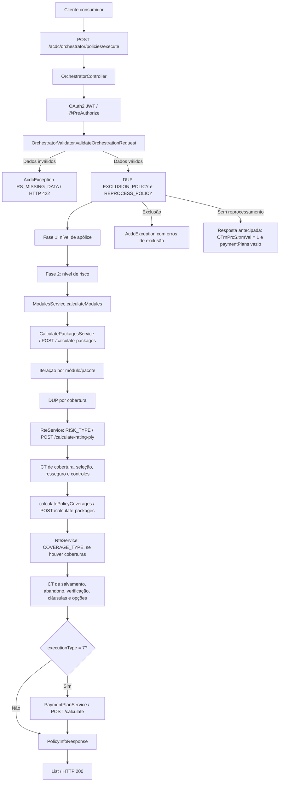

# REEF-ACDC Backend — Orquestador Batch: Endpoint e Fluxo de Orquestração de Políticas

## 1. Metadados do Documento
- **Arquivo de Origem:** Não identificado; conteúdo extraído de documentação REEF-ACDC.
- **Tipo de Documento:** Especificação Técnica / Arquitetura de Software.
- **Domínio / Sistema:** REEF-ACDC Backend — orquestração de cotação, emissão e suplemento de apólices.
- **Público-Alvo:** Desenvolvedores, Arquitetos, Operação e Analistas Funcionais.
- **Data/Versão Identificada:** Não identificada.

---

## 2. Resumo Executivo & Contexto de Negócio

O documento especifica o endpoint de orquestração batch do backend `REEF-ACDC`, responsável por executar o processo ponta a ponta de cotação, emissão ou suplemento de uma apólice. O endpoint `POST /acdc/orchestrator/policies/execute` é descrito como o único ponto de entrada para a cadeia completa de orquestração.

A orquestração recebe informações completas da apólice, incluindo riscos, coberturas, participantes, questionários, documentos e acumulações CML. O processo valida os dados obrigatórios antes de realizar chamadas externas e coordena, em ordem determinística, regras DUP, controles técnicos, cálculo de módulos, tarificação RTE, cálculo de coberturas de nível de apólice e planos de pagamento.

O fluxo possui fases distintas para nível de apólice, nível de risco e nível de módulo ou pacote. A etapa de cálculo de módulos pode gerar de uma a N combinações de coberturas, sendo retornado um objeto `PolicyInfoResponse` para cada alternativa válida. Isso permite representar múltiplas opções de cotação resultantes das preferências ou pacotes disponíveis.

O documento também estabelece controles de segurança baseados em OAuth2 JWT, tratamento estruturado de erros de negócio, validação de entrada e regras especiais de exclusão e reprocessamento para operações de renovação. A execução é instrumentada com `Stopwatch` da Guava para registrar tempos das etapas relevantes do processo.

---

## 3. Arquitetura, Componentes & Tecnologias Envolvidas

| Componente / Tecnologia | Papel no fluxo |
| :--- | :--- |
| `OrchestratorController` | Controlador que expõe o endpoint de orquestração. |
| `ExecuteOrchestratorUsecase` | Caso de uso que executa a sequência rígida e determinística de orquestração. |
| `OrchestratorValidator` | Valida a requisição antes de chamadas externas. |
| DUP | Motor de regras utilizado para pré-cálculo, validação e regras especiais de apólice, risco e cobertura. |
| CT | Controles técnicos executados em diferentes níveis do fluxo. |
| `ModulesService` | Calcula módulos e obtém combinações de coberturas ou pacotes. |
| `CalculatePackagesService` | Serviço chamado por `ModulesService` por meio de `POST /calculate-packages`. |
| `RteService` | Executa tarificação por meio de `POST /calculate-rating-ply`. |
| `PaymentPlanService` | Calcula planos de pagamento por meio de `POST /calculate`; acionado apenas quando `executionType == "7"`. |
| `ExternalHttpClient` | Cliente utilizado para consultar o catálogo de coberturas de nível de apólice. |
| Spring Security Resource Server | Proteção OAuth2 JWT do endpoint. |
| Guava `Stopwatch` | Medição de tempos da execução de orquestração. |
| `AcdcException` | Exceção estruturada do domínio ACDC. |
| `PlyValException` | Exceção de validação de planos de pagamento; não interrompe a resposta. |



> **Nota de Análise:** O documento referencia os módulos `COTIZACIONES`, `DUP_ENGINE`, `MODULES_SERVICE`, `EXTERNAL_CLIENTS` e `AUDIT`, mas não apresenta o conteúdo detalhado desses documentos relacionados.

---

## 4. Regras de Negócio, Especificações Funcionais & Processos

### 4.1 Endpoint e responsabilidade

O endpoint `POST /acdc/orchestrator/policies/execute` executa o processo E2E de cotação ou emissão de apólice. O endpoint recebe os dados de uma apólice e coordena a execução dos serviços externos em uma ordem estritamente definida.

O arquivo controlador identificado é `controller/OrchestratorController.java`, e o caso de uso responsável pelo fluxo é `usecase/ExecuteOrchestratorUsecase.java`.

### 4.2 Segurança e autorização

O endpoint utiliza OAuth2 JWT por meio do Spring Security Resource Server. A autorização exige o papel `ROL_ACDC_ORCH` ou uma das permissões GAZU existentes:

```java
@PreAuthorize("hasRole('ROL_ACDC_ORCH') or hasAnyAuthority('GAZU_ROLRTEMGR', 'GAZU_ROLRTEADM')")
```

A segurança pode ser desativada exclusivamente em ambientes locais mediante a configuração:

```yaml
spring.security.enabled: false
```

### 4.3 Regras de `executionType`

- O valor `executionType = "7"` é o único valor que ativa o cálculo de planos de pagamento ao final do fluxo.
- Qualquer valor de `executionType` diferente de `"7"` retorna `paymentPlans: []`.
- O campo `executionType` é obrigatório.

### 4.4 Regras de `processTypeId`

- `processTypeId` é obrigatório.
- `processTypeId` é do tipo `Integer` no modelo atual.
- As referências antigas ao valor textual `"ALT"` não representam o contrato atual do campo.
- O tipo inteiro está presente em `RequestInfo.processTypeId` e `RiskSelectionProcessorRequest.processTypeId`.

### 4.5 Regras funcionais de `cmlObj`

`cmlObj` representa acumulações CML usadas pelas regras DUP para tomador e segurado.

Regras de cruzamento documental antes da invocação do DUP:

1. O tomador é associado por `thpDcmTypVal + thpDcmVal` contra `participants.policyHolder`.
2. O segurado é associado por `thpDcmVal`; quando houver tipo documental informado, o cruzamento também usa `thpDcmTypVal` contra `insured`.
3. Cada valor `agrCvrT.cvrVal` é publicado como chave de cobertura nos facts de regras.
4. Se não existir cruzamento documental, o backend não gera facts de acumulações.
5. Se o `cvrVal` informado em `cmlObj` não existir entre as coberturas selecionadas da apólice, o backend não gera os facts `accumulationWithCapital` nem `accumulationWithPremium` para essa chave.

Facts disponíveis para regras DUP:

- `participants.policyHolder.accumulations.{cvrVal}.mxmAgrCplVal`
- `participants.policyHolder.accumulations.{cvrVal}.mxmAgrPreVal`
- `participants.policyHolder.accumulations.{cvrVal}.accumulationWithCapital`
- `participants.policyHolder.accumulations.{cvrVal}.accumulationWithPremium`
- `insured.accumulations.{cvrVal}.mxmAgrCplVal`
- `insured.accumulations.{cvrVal}.mxmAgrPreVal`
- `insured.accumulations.{cvrVal}.accumulationWithCapital`
- `insured.accumulations.{cvrVal}.accumulationWithPremium`

O uso do curinga `*` é permitido com o operador `ANY_MATCH` em chaves de cobertura e acumulações. Exemplos documentados:

- `coverages.*.name`
- `insured.accumulations.*.accumulationWithCapital`
- `participants.policyHolder.accumulations.*.mxmAgrCplVal`

### 4.6 Regras especiais de batch para renovação

Antes da fase de apólice, o orquestrador avalia regras especiais:

| Identificador DUP | Regra | Aplicabilidade | Resultado |
| :--- | :--- | :--- | :--- |
| `[50-0-30]` | `EXCLUSION_POLICY` | Apenas `RENEW_POLICY (RnwPly)` e `PRE_RENEW_POLICY (PlyPrw)` | Se houver regras aplicadas, lança `AcdcException` com erros de exclusão e interrompe o fluxo. |
| `[50-0-40]` | `REPROCESS_POLICY` | Apenas `PRE_RENEW_POLICY (PlyPrw)` | Se não houver reprocessamento, retorna antecipadamente `OTrnPrcS.trmVal = "1"` e `paymentPlans: []`. |

### 4.7 Fase 1 — Nível de apólice

A fase de apólice executa as seguintes etapas, na ordem definida:

1. `[2-0-10] DUP PREVIOUS_VARIABLE_DATA_POLICY`: pré-cálculo de atributos de apólice.
2. `[2-0-20] DUP VALIDATION_VARIABLE_DATA_POLICY`: validação de atributos de apólice.
3. `[1-0-0] CT FIXED_DATA_DUP`: controle técnico de dados fixos.
4. `[2-0-0] CT VARIABLE_DATA_POLICY`: controle técnico de dados variáveis.
5. `[3-0-0] CT BENEFICIARY_RISK_TYPE`: controle técnico de beneficiários.

### 4.8 Catálogo de tipos de interveniente

O controle técnico `[3-0-0] CT BENEFICIARY_RISK_TYPE` usa o catálogo `BeneficiaryTypeEnum`.

`participants.beneficiaries` contém todo interveniente cujo `bnfTypVal` pertença ao catálogo, inclusive tomador (`0`) e segurado (`2`). As regras DUP filtram o papel pelo campo `participants.beneficiaries.*.beneficiaryType`. Códigos que não pertencem ao catálogo não são mapeados.

### 4.9 Fase 2 — Nível de risco

A fase de risco é repetida para cada risco da apólice:

1. `[4-0-10] DUP PREVIOUS_VARIABLE_DATA_RISK`: pré-cálculo de atributos do risco.
2. `[4-0-20] DUP VALIDATION_VARIABLE_DATA_RISK`: validação de atributos do risco.
3. `[4-0-0] CT VARIABLE_DATA_RISK`: controle técnico de dados do risco.
4. `[11-0-0] CT RISK_SELECTION_FORM`: controle técnico de formulário.

### 4.10 Fase 3 — Cálculo de módulos

O método `ModulesService.calculateModules()` chama `CalculatePackagesService` com `POST /calculate-packages`.

O resultado contém de uma a N instâncias de `OPlyPlyCDto`, com uma instância por pacote ou preferência. Essas combinações são processadas individualmente e geram uma lista de respostas.

### 4.11 Fase 4 — Processamento por módulo ou pacote

Para cada módulo ou pacote retornado:

1. `[6-0-10] DUP PREVIOUS_VARIABLE_COVERAGE`: pré-cálculo por cobertura.
2. `[6-0-20] DUP VALIDATION_VARIABLE_COVERAGE`: validação por cobertura.
3. RTE Flow #1 com tipo `RISK_TYPE`.
4. Execução de controles técnicos de cobertura, seleção, resseguro, término, suspensão e multiusuário.
5. Execução de `setRiskVal(0)` para mudar o contexto para nível de apólice.
6. Execução de `calculatePolicyCoverages()`.
7. Consulta ao catálogo com `coverageLevel=POLICY`.
8. Chamada via `ExternalHttpClient` para `POST /calculate-packages`.
9. Injeção de coberturas em `oPlyCvcCT`, sempre sobrescrevendo o conteúdo.
10. RTE Flow #2 com tipo `COVERAGE_TYPE`, apenas se `calculatePolicyCoverages()` devolver coberturas.
11. Execução dos controles técnicos finais de salvamento, abandono, verificação, cláusulas, páginas de anexo, impressão, riscos, opções adicionais e opções adicionais genéricas.
12. Execução de `PaymentPlanService` apenas se `executionType == "7"`.
13. Inclusão do resultado na lista de `PolicyInfoResponse`.

### 4.12 Tratamento de erros

| Exceção / Situação | Regra de tratamento |
| :--- | :--- |
| `AcdcException` | Relançada diretamente, pois já vem formatada pelo serviço de origem. |
| `PlyValException` no cálculo de planos de pagamento | Capturada; a resposta retorna `paymentPlans: []` sem interromper a orquestração. |
| Qualquer outra `Exception` | Encapsulada em `AcdcException` com código `ORCH_ERR`. |
| Erro de parsing JSON | Retorno HTTP `400`. |
| Erro de negócio | Retorno HTTP `422` com `AcdcError` estruturado. |
| Erro interno não controlado | Retorno HTTP `500`. |

### 4.13 Validação de entrada

A validação é executada no início de `ExecuteOrchestratorUsecase.executeOrchestration()`. Na presença de erro, o processo lança `AcdcException` com código `RS_MISSING_DATA` antes de qualquer chamada externa.

Campos validados:

1. `PolicyInfoRequest` não pode ser nulo.
2. `oPlyPlyC` deve possuir uma estrutura válida de apólice por meio de `ValidationUtil.validatePlyData`.
3. `operation` não pode ser nulo.
4. `requestInfo` não pode ser nulo.
5. `requestInfo.countryId` não pode ser nulo nem vazio.
6. `requestInfo.productId` não pode ser nulo.
7. `requestInfo.executionType` não pode ser nulo.
8. `requestInfo.processTypeId` não pode ser nulo.

---

## 5. Tabelas de Parâmetros, Ambientes e Estruturas de Dados

### 5.1 Endpoint

| Item / Parâmetro | Descrição / Função | Tipo / Valores / Formato | Ambiente / Observações |
| :--- | :--- | :--- | :--- |
| Método HTTP | Método de invocação da orquestração | `POST` | Endpoint único do fluxo E2E. |
| Rota | Caminho da API | `/acdc/orchestrator/policies/execute` | Executa cotação, emissão ou suplemento. |
| Controlador | Classe controladora | `controller/OrchestratorController.java` | Protegido por OAuth2 JWT. |
| Caso de uso | Classe de orquestração | `usecase/ExecuteOrchestratorUsecase.java` | Ordem de execução rígida e determinística. |

### 5.2 Autorização

| Item / Parâmetro | Descrição / Função | Tipo / Valores / Formato | Ambiente / Observações |
| :--- | :--- | :--- | :--- |
| Segurança | Mecanismo de autenticação | OAuth2 JWT | Spring Security Resource Server. |
| Papel ACDC | Papel autorizado para orquestração | `ROL_ACDC_ORCH` | Permite continuidade do fluxo. |
| Autoridade GAZU | Autoridade alternativa | `GAZU_ROLRTEMGR` | Permite continuidade do fluxo. |
| Autoridade GAZU | Autoridade alternativa | `GAZU_ROLRTEADM` | Permite continuidade do fluxo. |
| Token ausente | Resultado de autenticação | `401 Unauthorized` | Sem token JWT. |
| Papel ausente | Resultado de autorização | `403 Forbidden` | Token válido sem autorização. |
| Desativação de segurança | Configuração local | `spring.security.enabled: false` | Apenas para ambientes locais. |

### 5.3 `PolicyInfoRequest`

| Item / Parâmetro | Descrição / Função | Tipo / Valores / Formato | Ambiente / Observações |
| :--- | :--- | :--- | :--- |
| `oPlyPlyC` | Objeto completo de apólice | Objeto | Inclui riscos, coberturas e atributos; obrigatório estruturalmente. |
| `oPlyPlyCPrev` | Apólice anterior | Objeto anulável | Aplicável apenas a suplementos. |
| `requestInfo.countryId` | Identificador do país | String, exemplo `ES` | Obrigatório; não nulo e não vazio. |
| `requestInfo.productId` | Identificador do produto | Número, exemplo `1234` | Obrigatório; não nulo. |
| `requestInfo.executionType` | Tipo de execução | String, exemplo `"7"` | Obrigatório; `"7"` habilita planos de pagamento. |
| `requestInfo.processTypeId` | Identificador do processo | `Integer`, exemplo `1` | Obrigatório; não é string `"ALT"`. |
| `requestInfo.languageId` | Identificador do idioma | String, exemplo `es` | Opcional. |
| `requestInfo.requestId` | Identificador de rastreabilidade | String, exemplo `uuid-v4` | Opcional; utilizado em rastreabilidade e auditoria. |
| `operation` | Operação funcional | `OperTypeEnum`, exemplo `AltPly` | Obrigatório. |
| `dataFormMap` | Questionários e formulários do produto | Lista | Pode ser vazia. |
| `documents` | Documentos anexos | Lista | Pode ser vazia. |
| `cmlObj` | Acumulações CML de tomador ou segurado | Lista | Alimenta regras DUP. |

### 5.4 Estrutura de `cmlObj`

| Item / Parâmetro | Descrição / Função | Tipo / Valores / Formato | Ambiente / Observações |
| :--- | :--- | :--- | :--- |
| `thpDcmTypVal` | Tipo de documento | String, exemplo `DNI` | Usado no cruzamento do tomador e, quando informado, do segurado. |
| `thpDcmVal` | Valor do documento | String, exemplo `12345678A` | Usado no cruzamento do tomador e segurado. |
| `agrCvrT` | Lista de acumulações por cobertura | Lista | Cada item contém uma cobertura identificada por `cvrVal`. |
| `agrCvrT.cvrVal` | Código ou valor de cobertura | Número, exemplos `100`, `410` | Publicado como chave de cobertura nos facts DUP. |
| `agrCvrT.mxmAgrPreVal` | Valor máximo agregado de prêmio | Número | Disponibilizado para facts DUP. |
| `agrCvrT.mxmAgrCplVal` | Valor máximo agregado de capital | Número | Disponibilizado para facts DUP. |

### 5.5 Respostas HTTP

| Item / Parâmetro | Descrição / Função | Tipo / Valores / Formato | Ambiente / Observações |
| :--- | :--- | :--- | :--- |
| `200` | Resposta de sucesso | Lista de `PolicyInfoResponse` | Uma resposta por módulo ou pacote calculado. |
| `400` | Requisição inválida | Erro de parsing JSON | Não representa erro de negócio estruturado. |
| `422` | Erro de negócio | `AcdcError` com lista de erros | Inclui validação de entrada e erros de domínio. |
| `500` | Erro interno | Erro não controlado | Exceção não tratada especificamente. |

### 5.6 `PolicyInfoResponse` e `AcdcError`

| Item / Parâmetro | Descrição / Função | Tipo / Valores / Formato | Ambiente / Observações |
| :--- | :--- | :--- | :--- |
| `PolicyInfoResponse.oPlyPlyC` | Apólice enriquecida | Objeto | Inclui atributos calculados, CTs aplicados e tarificação. |
| `PolicyInfoResponse.paymentPlans` | Planos de pagamento | Lista | Vazia quando `executionType != "7"` ou quando ocorre `PlyValException`. |
| `AcdcError.code` | Código de erro | String, exemplo `ORCH_ERR` | Código da falha de orquestração. |
| `AcdcError.message` | Mensagem de erro | String | Exemplo: `Error ejecutando la orquestación`. |
| `AcdcError.application` | Aplicação de origem | String | Valor documentado: `acdc-backend`. |
| `AcdcError.errors` | Detalhes de erro | Lista | Contém código, mensagem e componente. |
| `AcdcError.errors.component` | Componente originador | String | Exemplo: `ExecuteOrchestratorUsecase`. |

### 5.7 Catálogo `BeneficiaryTypeEnum`

| Item / Parâmetro | Descrição / Função | Tipo / Valores / Formato | Ambiente / Observações |
| :--- | :--- | :--- | :--- |
| `bnfTypVal = 0` | TOMADOR | Código numérico | Participante mapeado no catálogo. |
| `bnfTypVal = 1` | TOMADORES ALTERNOS | Código numérico | Participante mapeado no catálogo. |
| `bnfTypVal = 2` | ASSEGURADOS | Código numérico | Participante mapeado no catálogo. |
| `bnfTypVal = 3` | CONDUTORES | Código numérico | Participante mapeado no catálogo. |
| `bnfTypVal = 4` | PROPRIETÁRIOS | Código numérico | Participante mapeado no catálogo. |
| `bnfTypVal = 5` | BENEFICIÁRIOS | Código numérico | Participante mapeado no catálogo. |
| `bnfTypVal = 6` | BENEFICIÁRIOS VIDA | Código numérico | Participante mapeado no catálogo. |
| `bnfTypVal = 7` | PROPONENTE | Código numérico | Participante mapeado no catálogo. |
| `bnfTypVal = 8` | ENDOSSATÁRIO | Código numérico | Participante mapeado no catálogo. |
| `bnfTypVal = 9` | PREVENTOR | Código numérico | Participante mapeado no catálogo. |
| `bnfTypVal = 11` | BENEFS. CONTINGENTE, VIDA | Código numérico | Participante mapeado no catálogo. |
| `bnfTypVal = 12` | CONSÓRCIO | Código numérico | Participante mapeado no catálogo. |
| `bnfTypVal = 13` | AVAL | Código numérico | Participante mapeado no catálogo. |
| `bnfTypVal = 14` | TUTOR LEGAL | Código numérico | Participante mapeado no catálogo. |
| `bnfTypVal = 15` | PROPRIETÁRIO DA CARGA | Código numérico | Participante mapeado no catálogo. |
| `bnfTypVal = 20` | SUBAGENTES | Código numérico | Participante mapeado no catálogo. |
| `bnfTypVal = 21` | PAGADOR | Código numérico | Participante mapeado no catálogo. |
| `bnfTypVal = 22` | BENEFICIÁRIO IRREVOGÁVEL | Código numérico | Participante mapeado no catálogo. |
| `bnfTypVal = 23` | BENEFICIÁRIO CESSÃO DE DIREITOS | Código numérico | Participante mapeado no catálogo. |
| `bnfTypVal = 24` | BENEFICIÁRIOS LEGAIS | Código numérico | Participante mapeado no catálogo. |
| `bnfTypVal = 25` | HERDEIRO LEGAL | Código numérico | Participante mapeado no catálogo. |
| `bnfTypVal = 26` | REPRESENTANTE LEGAL | Código numérico | Participante mapeado no catálogo. |
| `bnfTypVal = 27` | CONDUTOR OCASIONAL | Código numérico | Participante mapeado no catálogo. |
| `bnfTypVal = 28` | NOTÁRIO | Código numérico | Participante mapeado no catálogo. |

### 5.8 Logs de tempo

| Item / Parâmetro | Descrição / Função | Tipo / Valores / Formato | Ambiente / Observações |
| :--- | :--- | :--- | :--- |
| `execution time risk selection previous` | Tempo da seleção de risco anterior | `Xms` | Log produzido pelo `Stopwatch`. |
| `execution time modules` | Tempo de cálculo de módulos | `Xms` | Log produzido pelo `Stopwatch`. |
| `execution time rte` | Tempo de tarificação RTE | `Xms` | Log produzido pelo `Stopwatch`. |
| `execution time risk selection` | Tempo de seleção de risco | `Xms` | Log produzido pelo `Stopwatch`. |
| `execution time payment plans` | Tempo de planos de pagamento | `Xms` | Aplicável quando planos são calculados. |
| `method executeOrchestration finish, total time execution` | Tempo total de execução | `Xms` | Log final da orquestração. |

---

## 6. Bateria de Perguntas & Respostas para RAG (FAQ Sintético)

### P1: Qual endpoint inicia todo o fluxo de cotação, emissão ou suplemento de apólice no REEF-ACDC?
**R:** O único ponto de entrada do fluxo completo é `POST /acdc/orchestrator/policies/execute`, exposto por `controller/OrchestratorController.java`. O endpoint recebe os dados de uma apólice e aciona a cadeia determinística de validações, regras DUP, controles técnicos, cálculo de módulos, tarificação e planos de pagamento.

### P2: Quais permissões são necessárias para invocar o endpoint de orquestração?
**R:** O endpoint utiliza OAuth2 JWT com Spring Security Resource Server. A requisição precisa possuir o papel `ROL_ACDC_ORCH` ou uma das autoridades `GAZU_ROLRTEMGR` e `GAZU_ROLRTEADM`. A ausência de token resulta em `401 Unauthorized`; token válido sem uma dessas permissões resulta em `403 Forbidden`.

### P3: Quando o REEF-ACDC calcula os planos de pagamento?
**R:** O `PaymentPlanService` só é acionado quando `requestInfo.executionType` possui exatamente o valor `"7"`. Para qualquer outro valor, a resposta contém `paymentPlans: []`. Mesmo quando `executionType` é `"7"`, uma `PlyValException` durante o cálculo não interrompe o fluxo: a resposta retorna planos de pagamento vazios.

### P4: Quais campos da requisição são obrigatórios antes da execução de chamadas externas?
**R:** O `OrchestratorValidator` exige `PolicyInfoRequest` não nulo, uma estrutura de apólice válida em `oPlyPlyC`, `operation` não nulo, `requestInfo` não nulo, `countryId` não nulo e não vazio, além de `productId`, `executionType` e `processTypeId` não nulos. Falhas lançam `AcdcException` com código `RS_MISSING_DATA` antes de qualquer chamada externa.

### P5: Qual é o tipo atual de `processTypeId` e como interpretar referências antigas a `"ALT"`?
**R:** `processTypeId` é um `Integer` no contrato atual, presente em `RequestInfo.processTypeId` e `RiskSelectionProcessorRequest.processTypeId`. Referências históricas ao valor textual `"ALT"` não correspondem ao contrato atual do campo.

### P6: Como o objeto `cmlObj` alimenta as regras DUP?
**R:** `cmlObj` contém acumulações CML para tomador e segurado. O backend cruza tomador por `thpDcmTypVal + thpDcmVal` contra `participants.policyHolder` e segurado por `thpDcmVal`, incluindo `thpDcmTypVal` quando informado. Cada `agrCvrT.cvrVal` vira uma chave de cobertura nos facts DUP, disponibilizando valores de acumulação máxima de capital, prêmio, capital acumulado e prêmio acumulado.

### P7: O que ocorre quando não há correspondência documental entre `cmlObj` e os participantes da apólice?
**R:** Quando não há cruzamento documental, o backend não gera facts de acumulações para regras DUP. Além disso, se o `cvrVal` do `cmlObj` não existir entre as coberturas selecionadas da apólice, os facts `accumulationWithCapital` e `accumulationWithPremium` não são gerados para aquela chave de cobertura.

### P8: Como o sistema trata exclusão e reprocessamento em renovações?
**R:** Antes da fase de apólice, `EXCLUSION_POLICY` (`[50-0-30]`) é avaliada para `RENEW_POLICY (RnwPly)` e `PRE_RENEW_POLICY (PlyPrw)`. Se regras de exclusão forem aplicadas, o sistema lança `AcdcException` e encerra o fluxo. Para `PRE_RENEW_POLICY (PlyPrw)`, `REPROCESS_POLICY` (`[50-0-40]`) é avaliada; se não for necessário reprocessar, a resposta antecipada contém `OTrnPrcS.trmVal = "1"` e `paymentPlans: []`.

### P9: Por que a resposta do endpoint é uma lista de `PolicyInfoResponse`?
**R:** A resposta é uma lista porque `ModulesService` pode retornar de uma a N combinações de coberturas, pacotes ou preferências. Cada combinação válida é tratada como um módulo individual e produz sua própria instância de `PolicyInfoResponse`.

### P10: Em que momento é executada a segunda tarificação RTE?
**R:** O RTE Flow #2 é executado no contexto `COVERAGE_TYPE` somente se `calculatePolicyCoverages()` retornar coberturas. Antes dessa etapa, o orquestrador chama `setRiskVal(0)`, consulta o catálogo com `coverageLevel=POLICY` por meio de `POST /calculate-packages` e injeta as coberturas em `oPlyCvcCT`.

### P11: Quais exceções não interrompem a resposta da orquestração?
**R:** A exceção `PlyValException` gerada na etapa de planos de pagamento é capturada e não interrompe a resposta; o resultado contém `paymentPlans: []`. Já `AcdcException` é relançada diretamente, e demais exceções são encapsuladas em `AcdcException` com código `ORCH_ERR`.

### P12: Quais métricas de tempo são registradas durante a execução?
**R:** O `ExecuteOrchestratorUsecase` usa `Stopwatch` da Guava e registra tempos de seleção de risco anterior, cálculo de módulos, tarificação RTE, seleção de risco, planos de pagamento e tempo total de execução do método `executeOrchestration`.

---

## 7. Glossário de Termos, Siglas & Conceitos-Chave

- **ACDC:** Nome do backend `REEF-ACDC` documentado; o significado expandido não é informado.
- **AcdcError:** Estrutura de resposta de erro de negócio HTTP `422`.
- **AcdcException:** Exceção de domínio ACDC utilizada para erros formatados de orquestração.
- **ANY_MATCH:** Operador usado em regras DUP com curinga `*` para correspondência em múltiplas chaves.
- **BNF:** Referência implícita ao tipo de beneficiário/interveniente pelo campo `bnfTypVal`.
- **CML:** Acumulações usadas como entrada para regras DUP de tomador e segurado; a expansão da sigla não é informada.
- **CT:** Controle técnico executado em diferentes pontos do fluxo.
- **DUP:** Motor de regras responsável por pré-cálculos, validações e regras especiais; a expansão da sigla não é informada.
- **E2E:** End-to-end; fluxo completo de ponta a ponta.
- **GAZU:** Prefixo de autoridades de segurança existentes, como `GAZU_ROLRTEMGR` e `GAZU_ROLRTEADM`; o significado expandido não é informado.
- **JWT:** JSON Web Token usado no mecanismo OAuth2 de autenticação e autorização.
- **OPlyPlyCDto:** Objeto retornado pelo cálculo de módulos, representando uma apólice por pacote ou preferência.
- **OAuth2:** Protocolo de autorização utilizado na proteção do endpoint.
- **PlyValException:** Exceção de validação relacionada aos planos de pagamento.
- **RTE:** Componente de tarificação acionado por `RteService`; a expansão da sigla não é informada.
- **RISK_TYPE:** Contexto do primeiro fluxo RTE, executado durante o processamento por módulo.
- **COVERAGE_TYPE:** Contexto do segundo fluxo RTE, executado após a obtenção de coberturas de nível de apólice.
- **`cvrVal`:** Identificador ou valor de cobertura usado como chave nos facts de acumulações.
- **`executionType`:** Campo que define o tipo de execução; o valor `"7"` habilita planos de pagamento.
- **`processTypeId`:** Identificador inteiro obrigatório do tipo de processo.
- **`thpDcmTypVal`:** Tipo de documento utilizado no cruzamento documental de acumulações.
- **`thpDcmVal`:** Valor do documento utilizado no cruzamento documental de acumulações.

---

## 8. Notas Críticas, Riscos & Limitações

- A sequência implementada em `ExecuteOrchestratorUsecase` é rígida e determinística. Alterar a ordem de DUP, CT, cálculo de módulos, RTE ou planos de pagamento pode impactar o comportamento funcional documentado.
- A desativação de segurança por `spring.security.enabled: false` é descrita somente para ambientes locais.
- `processTypeId` deve ser tratado como `Integer`; integrações que enviem o legado `"ALT"` não atendem ao contrato atual.
- A inexistência de cruzamento documental entre `cmlObj` e os participantes impede a geração de facts de acumulação para regras DUP.
- A inexistência de cobertura selecionada correspondente a `cvrVal` impede a criação dos facts `accumulationWithCapital` e `accumulationWithPremium`.
- `PlyValException` em planos de pagamento não falha a orquestração, mas pode produzir respostas aparentemente bem-sucedidas com `paymentPlans: []`; consumidores precisam considerar essa regra.
- O documento referencia materiais externos para detalhes de regras DUP, cálculo de módulos, clientes externos, auditoria e cotações. Esses detalhes não estão presentes no conteúdo fornecido.
- **Nota de Análise:** O documento identifica chamadas `POST /calculate-packages`, `POST /calculate-rating-ply` e `POST /calculate`, mas não especifica contratos JSON, URLs completas, autenticação entre serviços, timeouts, políticas de retry ou circuit breaker.
- **Nota de Análise:** O documento lista logs de tempo, mas não informa níveis de log, destinos, retenção ou correlação explícita com `requestId`.

---

## 9. Conteúdo Bruto Estruturado (Referência Fiel)

```text
# Orquestador Batch

Orquestador Batch


# [REEF-ACDC Backend](https://reef.acdc-dev.es.emea.aws.mapfre.net/acdc/docs-portal/index.html)

* **Inicio**
  + [Documentación general](#/README "Documentación general")* **ACDC — Módulo principal**
    + [Endpoints Online](#/ACDC/ENDPOINTS_ONLINE "Endpoints Online")+ [Orquestador Batch](#/ACDC/ENDPOINT_BATCH_ORCHESTATOR "Orquestador Batch")
        - [Índice](#/ACDC/ENDPOINT_BATCH_ORCHESTATOR?id=%c3%8dndice "Índice")- [1. Endpoint](#/ACDC/ENDPOINT_BATCH_ORCHESTATOR?id=_1-endpoint "1. Endpoint")- [2. Seguridad](#/ACDC/ENDPOINT_BATCH_ORCHESTATOR?id=_2-seguridad "2. Seguridad")- [3. Request body](#/ACDC/ENDPOINT_BATCH_ORCHESTATOR?id=_3-request-body "3. Request body")- [4. Respuestas](#/ACDC/ENDPOINT_BATCH_ORCHESTATOR?id=_4-respuestas "4. Respuestas")- [5. Flujo de orquestación E2E](#/ACDC/ENDPOINT_BATCH_ORCHESTATOR?id=_5-flujo-de-orquestaci%c3%b3n-e2e "5. Flujo de orquestación E2E")- [6. Manejo de errores](#/ACDC/ENDPOINT_BATCH_ORCHESTATOR?id=_6-manejo-de-errores "6. Manejo de errores")- [7. Validación de entrada](#/ACDC/ENDPOINT_BATCH_ORCHESTATOR?id=_7-validaci%c3%b3n-de-entrada "7. Validación de entrada")- [8. Diagrama de flujo completo](#/ACDC/ENDPOINT_BATCH_ORCHESTATOR?id=_8-diagrama-de-flujo-completo "8. Diagrama de flujo completo")+ [Cotizaciones](#/ACDC/COTIZACIONES "Cotizaciones")+ [Clientes externos](#/ACDC/EXTERNAL_CLIENTS "Clientes externos")+ [Auditoría](#/ACDC/AUDIT "Auditoría")+ [Seguridad](#/ACDC/SECURITY "Seguridad")* **DUP — Motor de reglas**
      + [DUP Engine](#/DUP/DUP_ENGINE "DUP Engine")+ [Módulo DUP](#/DUP/README_DUP_MODULE "Módulo DUP")* **Módulos**
        + [Cálculo de Módulos](#/MODULOS/MODULES_SERVICE "Cálculo de Módulos")* **RTE — Tarificación**
          + [Configuración de tarifas](#/RTE/RTE_TARIFF_CONFIGURATION "Configuración de tarifas")

# [OrchestratorController — Endpoint y flujo de orquestación](#/ACDC/ENDPOINT_BATCH_ORCHESTATOR?id=orchestratorcontroller-endpoint-y-flujo-de-orquestaci%c3%b3n)

> 📚 Parte de la documentación de `REEF-ACDC` · [← Índice general](#/../README)

**Relacionado con:** [COTIZACIONES.md](#/COTIZACIONES) · [DUP\_ENGINE.md](#/../DUP/DUP_ENGINE) · [MODULES\_SERVICE.md](#/../MODULOS/MODULES_SERVICE) · [EXTERNAL\_CLIENTS.md](#/EXTERNAL_CLIENTS) · [AUDIT.md](#/AUDIT)

---

## [Índice](#/ACDC/ENDPOINT_BATCH_ORCHESTATOR?id=%c3%8dndice)

1. [Endpoint](#/ACDC/ENDPOINT_BATCH_ORCHESTATOR?id=1-endpoint)- [Seguridad](#/ACDC/ENDPOINT_BATCH_ORCHESTATOR?id=2-seguridad)- [Request body](#/ACDC/ENDPOINT_BATCH_ORCHESTATOR?id=3-request-body)- [Respuestas](#/ACDC/ENDPOINT_BATCH_ORCHESTATOR?id=4-respuestas)- [Flujo de orquestación E2E](#/ACDC/ENDPOINT_BATCH_ORCHESTATOR?id=5-flujo-de-orquestaci%c3%b3n-e2e)- [Manejo de errores](#/ACDC/ENDPOINT_BATCH_ORCHESTATOR?id=6-manejo-de-errores)- [Validación de entrada](#/ACDC/ENDPOINT_BATCH_ORCHESTATOR?id=7-validaci%c3%b3n-de-entrada)- [Diagrama de flujo completo](#/ACDC/ENDPOINT_BATCH_ORCHESTATOR?id=8-diagrama-de-flujo-completo)

---

## [1. Endpoint](#/ACDC/ENDPOINT_BATCH_ORCHESTATOR?id=_1-endpoint)

**Fichero:** `controller/OrchestratorController.java`  
**Caso de uso:** `usecase/ExecuteOrchestratorUsecase.java`

| Método | Ruta | Descripción |
| --- | --- | --- |
| `POST` | `/acdc/orchestrator/policies/execute` | Ejecuta el proceso E2E de cotización/emisión de póliza |

Es el **único punto de entrada** al flujo de orquestación completo. Recibe los datos de una póliza y coordina la cadena de servicios externos en orden estrictamente definido.

---

## [2. Seguridad](#/ACDC/ENDPOINT_BATCH_ORCHESTATOR?id=_2-seguridad)

El endpoint está protegido con **OAuth2 JWT** (Spring Security Resource Server). Se requiere el rol ACDC de orquestación o uno de los roles GAZU existentes:

```
@PreAuthorize("hasRole('ROL_ACDC_ORCH') or hasAnyAuthority('GAZU_ROLRTEMGR', 'GAZU_ROLRTEADM')")
```

| Situación | Respuesta |
| --- | --- |
| Sin token | `401 Unauthorized` |
| Token válido pero sin rol | `403 Forbidden` |
| Token válido con rol correcto | Continúa el flujo |

> La seguridad puede desactivarse con `spring.security.enabled: false` para entornos locales.

---

## [3. Request body](#/ACDC/ENDPOINT_BATCH_ORCHESTATOR?id=_3-request-body)

### [`PolicyInfoRequest`](#/ACDC/ENDPOINT_BATCH_ORCHESTATOR?id=policyinforequest)

```
{
  "oPlyPlyC":     { },          // Objeto de póliza completo (riesgos, coberturas, atributos)
  "oPlyPlyCPrev": { },          // Póliza previa — solo para suplementos, nullable
  "requestInfo": {
    "countryId":     "ES",      // OBLIGATORIO
    "productId":     1234,      // OBLIGATORIO
    "executionType": "7",       // OBLIGATORIO — "7" = cotización, resto = emisión/suplemento
    "processTypeId": 1,         // OBLIGATORIO; Integer en el modelo actual
    "languageId":    "es",
    "requestId":     "uuid-v4"
  },
  "operation":    "AltPly",     // OBLIGATORIO; enum OperTypeEnum serializado
  "dataFormMap":  [ ],          // Cuestionarios/formularios del producto
  "documents":    [ ],          // Documentos adjuntos
  "cmlObj":       [ ]           // Acumulaciones CML del tomador/asegurado
}
```

> **`executionType = "7"`** es el único valor que activa el cálculo de planes de pago al final del flujo. Cualquier otro valor devuelve `paymentPlans: []`.

> `processTypeId` es `Integer` en el código (`RequestInfo.processTypeId`, `RiskSelectionProcessorRequest.processTypeId`). Las referencias antiguas a string `"ALT"` no reflejan el contrato actual de este campo.

### [Campos de `RequestInfo` validados](#/ACDC/ENDPOINT_BATCH_ORCHESTATOR?id=campos-de-requestinfo-validados)

| Campo | Obligatorio | Validación |
| --- | --- | --- |
| `countryId` | ✅ | No nulo ni vacío |
| `productId` | ✅ | No nulo |
| `executionType` | ✅ | No nulo |
| `processTypeId` | ✅ | No nulo |
| `languageId` | ❌ | Opcional |
| `requestId` | ❌ | Opcional (se usa para trazabilidad/auditoría) |

### [Contrato funcional de `cmlObj` para reglas DUP](#/ACDC/ENDPOINT_BATCH_ORCHESTATOR?id=contrato-funcional-de-cmlobj-para-reglas-dup)

`cmlObj` es la entrada de acumulaciones CML que alimenta las reglas de DUP para tomador y asegurado.

**Estructura esperada:**

```
"cmlObj": [
  {
    "thpDcmTypVal": "DNI",
    "thpDcmVal": "12345678A",
    "agrCvrT": [
      { "cvrVal": 100, "mxmAgrPreVal": 1500, "mxmAgrCplVal": 300000 },
      { "cvrVal": 410, "mxmAgrPreVal": 900, "mxmAgrCplVal": 120000 }
    ]
  }
]
```

**Reglas de cruce que aplica el backend antes de invocar DUP:**

* El tomador cruza por `thpDcmTypVal + thpDcmVal` contra `participants.policyHolder`.* El asegurado cruza por `thpDcmVal` y, si hay tipo documental informado, tambien por `thpDcmTypVal` contra `insured`.* Cada `agrCvrT.cvrVal` se publica como clave de cobertura en facts (`...accumulations.{cvrVal}.*`).

**Facts que quedan disponibles para reglas:**

* `participants.policyHolder.accumulations.{cvrVal}.mxmAgrCplVal`* `participants.policyHolder.accumulations.{cvrVal}.mxmAgrPreVal`* `participants.policyHolder.accumulations.{cvrVal}.accumulationWithCapital`* `participants.policyHolder.accumulations.{cvrVal}.accumulationWithPremium`* `insured.accumulations.{cvrVal}.mxmAgrCplVal`* `insured.accumulations.{cvrVal}.mxmAgrPreVal`* `insured.accumulations.{cvrVal}.accumulationWithCapital`* `insured.accumulations.{cvrVal}.accumulationWithPremium`

**Uso de wildcard `*`:**

* Sí, se puede usar `*` con `ANY_MATCH` sobre claves de cobertura y acumulaciones.* Ejemplos validos:
    + `coverages.*.name`+ `insured.accumulations.*.accumulationWithCapital`+ `participants.policyHolder.accumulations.*.mxmAgrCplVal`

```
{
  "factor": "insured.accumulations.*.accumulationWithCapital",
  "operator": "ANY_MATCH",
  "value": "1000000"
}
```

> Si no hay cruce documental, no se generan facts de acumulaciones.
>
> Si el `cvrVal` de `cmlObj` no existe en las coberturas seleccionadas de la poliza, no se generan `accumulationWithCapital` ni `accumulationWithPremium` para esa clave.
>
> Detalle completo de autoria de reglas en [DUP\_ENGINE.md §11.9](#/../DUP/DUP_ENGINE?id=119-accumulations--desde-cmlobj).

---

## [4. Respuestas](#/ACDC/ENDPOINT_BATCH_ORCHESTATOR?id=_4-respuestas)

| Código | Descripción |
| --- | --- |
| `200` | Lista de `PolicyInfoResponse` (una por módulo/paquete calculado) |
| `400` | Request inválida (error de parseo JSON) |
| `422` | Error de negocio (`AcdcError` estructurado con lista de errores) |
| `500` | Error interno no controlado |

### [`PolicyInfoResponse`](#/ACDC/ENDPOINT_BATCH_ORCHESTATOR?id=policyinforesponse)

```
[
  {
    "oPlyPlyC": { },        // Póliza enriquecida: atributos calculados, CTs aplicados, tarificación
    "paymentPlans": [ ]     // Planes de pago — vacío si executionType != "7"
  }
]
```

> La respuesta es una **lista** porque `ModulesService` puede devolver N combinaciones de coberturas (una por preferencia/paquete disponible). Cada elemento representa una opción válida de cotización. Ver [MODULES\_SERVICE.md](#/../MODULOS/MODULES_SERVICE).

### [`AcdcError` (respuesta de error 422)](#/ACDC/ENDPOINT_BATCH_ORCHESTATOR?id=acdcerror-respuesta-de-error-422)

```
{
  "code": "ORCH_ERR",
  "message": "Error ejecutando la orquestación",
  "application": "acdc-backend",
  "errors": [
    {
      "code": "...",
      "message": "...",
      "component": "ExecuteOrchestratorUsecase"
    }
  ]
}
```

---

## [5. Flujo de orquestación E2E](#/ACDC/ENDPOINT_BATCH_ORCHESTATOR?id=_5-flujo-de-orquestaci%c3%b3n-e2e)

**Fichero:** `usecase/ExecuteOrchestratorUsecase.java`

El `ExecuteOrchestratorUsecase` ejecuta los pasos en un orden **rígido y determinista**, midiendo tiempos con `Stopwatch` (Guava). Los pasos DUP se identifican con notación `[stepLevel-menuOption-stepOption]`.
> Para entender qué hace cada paso DUP y cómo se construye la request, ver [DUP\_ENGINE.md](#/../DUP/DUP_ENGINE).

### [FASE 1 — Nivel Póliza](#/ACDC/ENDPOINT_BATCH_ORCHESTATOR?id=fase-1-nivel-p%c3%b3liza)

Antes de esta fase, el orquestador evalúa reglas batch especiales de exclusión/reproceso:

```
[50-0-30] DUP EXCLUSION_POLICY   ← solo RENEW_POLICY (RnwPly) y PRE_RENEW_POLICY (PlyPrw)
[50-0-40] DUP REPROCESS_POLICY   ← solo PRE_RENEW_POLICY (PlyPrw)
```

* Si `EXCLUSION_POLICY` devuelve reglas aplicadas, se lanza `AcdcException` con errores de exclusión y no continúa el flujo.* Si `REPROCESS_POLICY` indica que no procede reprocesar, se devuelve respuesta temprana con `OTrnPrcS.trmVal = "1"` y `paymentPlans: []`.

```
[2-0-10]  DUP PREVIOUS_VARIABLE_DATA_POLICY     ← pre-cálculo atributos de póliza
[2-0-20]  DUP VALIDATION_VARIABLE_DATA_POLICY   ← validación atributos de póliza
[1-0-0]   CT  FIXED_DATA_DUP                    ← control técnico datos fijos
[2-0-0]   CT  VARIABLE_DATA_POLICY              ← control técnico datos variables
[3-0-0]   CT  BENEFICIARY_RISK_TYPE             ← control técnico beneficiarios
```

#### [Catálogo de tipos de interviniente (`bnfTypVal`)](#/ACDC/ENDPOINT_BATCH_ORCHESTATOR?id=cat%c3%a1logo-de-tipos-de-interviniente-bnftypval)

El control técnico `[3-0-0] CT BENEFICIARY_RISK_TYPE` utiliza este catálogo para interpretar el rol del interviniente:

BeneficiaryTypeEnum
| `bnfTypVal` | Tipo |
|-------------|------|
| `0` | TOMADOR |
| `1` | TOMADORES ALTERNOS |
| `2` | ASEGURADOS |
| `3` | CONDUCTORES |
| `4` | PROPIETARIOS |
| `5` | BENEFICIARIOS |
| `6` | BENEFICIARIOS VIDA |
| `7` | PROPONENTE |
| `8` | ENDOSATARIO |
| `9` | PREVENTOR |
| `11` | BENEFS. CONTINGENTE, VIDA |
| `12` | CONSORCIO |
| `13` | AVAL |
| `14` | TUTOR LEGAL |
| `15` | PROPIETARIO DE LA CARGA |
| `20` | SUBAGENTES |
| `21` | PAGADOR |
| `22` | BENEFICIARIO IRREVOCABLE |
| `23` | BENEFICIARIO CESION DERECHOS |
| `24` | BENEFICIARIOS LEGALES |
| `25` | HEREDERO LEGAL |
| `26` | REPRESENTANTE LEGAL |
| `27` | CONDUCTOR OCASIONAL |
| `28` | NOTARIO |
> Nota: `participants.beneficiaries` contiene todo interviniente cuyo `bnfTypVal` esté en este catálogo (incluidos tomador `0` y asegurado `2`); las reglas DUP filtran el rol con `participants.beneficiaries.*.beneficiaryType`. Códigos fuera del catálogo no se mapean.

### [FASE 2 — Nivel Riesgo *(itera por cada riesgo)*](#/ACDC/ENDPOINT_BATCH_ORCHESTATOR?id=fase-2-nivel-riesgo-itera-por-cada-riesgo)

```
[4-0-10]  DUP PREVIOUS_VARIABLE_DATA_RISK       ← pre-cálculo atributos del riesgo
[4-0-20]  DUP VALIDATION_VARIABLE_DATA_RISK     ← validación atributos del riesgo
[4-0-0]   CT  VARIABLE_DATA_RISK                ← control técnico datos del riesgo
[11-0-0]  CT  RISK_SELECTION_FORM               ← control técnico formulario
```

### [FASE 3 — Cálculo de Módulos](#/ACDC/ENDPOINT_BATCH_ORCHESTATOR?id=fase-3-c%c3%a1lculo-de-m%c3%b3dulos)

```
ModulesService.calculateModules()
  → llama a CalculatePackagesService (POST /calculate-packages)
  → devuelve 1..N OPlyPlyCDto (uno por paquete/preferencia)
```

> Ver [MODULES\_SERVICE.md](#/../MODULOS/MODULES_SERVICE) para el detalle de los dos modos de cálculo.

### [FASE 4 — Por cada Módulo *(bucle)*](#/ACDC/ENDPOINT_BATCH_ORCHESTATOR?id=fase-4-por-cada-m%c3%b3dulo-bucle)

```
[6-0-10]    DUP PREVIOUS_VARIABLE_COVERAGE      ← pre-cálculo por cobertura
[6-0-20]    DUP VALIDATION_VARIABLE_COVERAGE    ← validación por cobertura

            RTE Flow #1 (RISK_TYPE)
              → RteService → POST /calculate-rating-ply
              → two-pass si COVERAGE_CONTROL devuelve pasos pendientes

[6-0-0]     CT  COVERAGE_CONTROL
[11-0-0]    CT  RISK_SELECTION_FORM
[7-0-0]     CT  REINSURANCE_CONTROL
[8-1-6]     CT  TERMINATE_CONTROL
[8-1-3]     CT  SUSPEND_CONTROL
[8-1-4]     CT  MULTIUSER_CONTROL

            setRiskVal(0)                        ← cambia contexto a nivel póliza
            calculatePolicyCoverages()           ← consulta catálogo con coverageLevel=POLICY
              → ExternalHttpClient → POST /calculate-packages
              → inyecta coberturas en oPlyCvcCT (siempre, sobrescribe)

            RTE Flow #2 (COVERAGE_TYPE)          ← solo si calculatePolicyCoverages devolvió coberturas
              → RteService → POST /calculate-rating-ply

[8-3-1]     CT  SAVE_CONTROL
[8-3-2]     CT  ABANDON_CONTROL
[8-3-3]     CT  VERIFY_CONTROL
[8-3-4]     CT  CLAUSES_CONTROL
[8-3-5]     CT  ANNEX_PAGES_CONTROL
[8-3-6]     CT  PRINT_CONTROL
[8-3-7]     CT  RISKS_CONTROL
[8-3-8]     CT  ADDITIONAL_OPTIONS_CONTROL
[8-7-null]  CT  ADDITIONAL_ANY_OPTIONS_CONTROL

            PaymentPlanService                   ← solo si executionType == "7"
              → POST /calculate (planes de pago)

→ PolicyInfoResponse añadida a la lista de respuesta
```

### [Medición de tiempos (log)](#/ACDC/ENDPOINT_BATCH_ORCHESTATOR?id=medici%c3%b3n-de-tiempos-log)

El `Stopwatch` genera las siguientes trazas de log:

```
execution time risk selection previous: Xms
execution time modules: Xms
execution time rte: Xms
execution time risk selection: Xms
execution time payment plans: Xms
method executeOrchestration finish, total time execution: Xms
```

---

## [6. Manejo de errores](#/ACDC/ENDPOINT_BATCH_ORCHESTATOR?id=_6-manejo-de-errores)

| Excepción | Comportamiento |
| --- | --- |
| `AcdcException` | Se relanza directamente — el error ya viene formateado del servicio que lo originó |
| `PlyValException` en planes de pago | Se **captura** y se devuelve `paymentPlans: []` — no interrumpe la respuesta |
| Cualquier otra `Exception` | Se envuelve en `AcdcException` con código `ORCH_ERR` |

---

## [7. Validación de entrada](#/ACDC/ENDPOINT_BATCH_ORCHESTATOR?id=_7-validaci%c3%b3n-de-entrada)

**Fichero:** `validation/OrchestratorValidator.java`

Se ejecuta al inicio de `ExecuteOrchestratorUsecase.executeOrchestration()`. Si hay errores, lanza `AcdcException` con código `RS_MISSING_DATA` **antes** de hacer ninguna llamada externa.

Campos validados:

```
PolicyInfoRequest      → no nulo
  oPlyPlyC             → estructura de póliza (validada con ValidationUtil.validatePlyData)
  operation            → no nulo
  requestInfo          → no nulo
    countryId          → no nulo y no vacío
    productId          → no nulo
    executionType      → no nulo
    processTypeId      → no nulo
```

---

## [8. Diagrama de flujo completo](#/ACDC/ENDPOINT_BATCH_ORCHESTATOR?id=_8-diagrama-de-flujo-completo)

```
POST /acdc/orchestrator/policies/execute
               │
               ▼
      OrchestratorController
       @PreAuthorize(ROL_ACDC_ORCH | GAZU_ROLRTEMGR | GAZU_ROLRTEADM)
               │
               ▼
     OrchestratorValidator.validateOrchestrationRequest()
      → 422 si falta campo obligatorio
               │
               ▼
     ┌─────────────────────────────────┐
     │  FASE PÓLIZA                    │
     │  DUP PREVIOUS + VALIDATION + CT │
     └──────────────┬──────────────────┘
                    │
     ┌──────────────▼──────────────────┐
     │  FASE RIESGO (x cada riesgo)    │
     │  DUP PREVIOUS + VALIDATION + CT │
     └──────────────┬──────────────────┘
                    │
     ┌──────────────▼──────────────────┐
     │  ModulesService                 │
     │  → CalculatePackagesService     │
     │  → devuelve 1..N pólizas        │
     └──────────────┬──────────────────┘
                    │
              ┌─────┴──────────────────────────────────────┐
              │  Por cada módulo/paquete:                   │
              │                                             │
              │  DUP PREVIOUS + VALIDATION (coberturas)     │
              │  → RteService #1 (tarificación RISK_TYPE)   │
              │  → CT x6 (cobertura, reaseguro, controles)  │
              │  → RteService #2 (si hay CVC nivel 0)       │
              │  → CT x9 (cláusulas, impresión, opciones…)  │
              │  → PaymentPlanService (si execType="7")     │
              │  → PolicyInfoResponse                       │
              └─────────────────────────────────────────────┘
                    │
                    ▼
     List<PolicyInfoResponse>  →  HTTP 200
```
```
