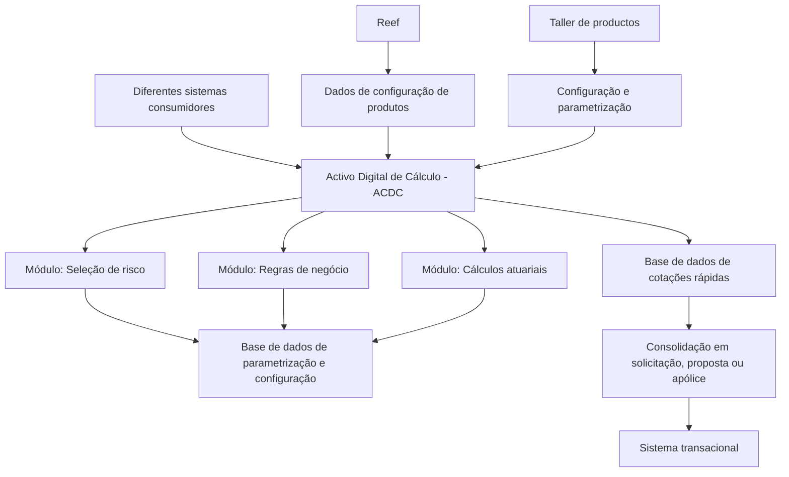
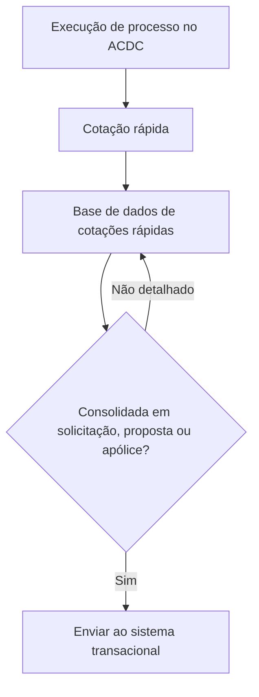

# Activo Digital de Cálculo (ACDC): Visão, Necessidade e Princípios de Arquitetura

## 1. Metadados do Documento
- **Arquivo de Origem:** `Não identificado`
- **Tipo de Documento:** `Apresentação Executiva`
- **Domínio / Sistema:** `Activo Digital de Cálculo (ACDC) / MAPFRE`
- **Público-Alvo:** `Arquitetos, Desenvolvedores, Negócio e Tecnologia`
- **Data/Versão Identificada:** `Não identificada`

---

## 2. Resumo Executivo & Contexto de Negócio

O Activo Digital de Cálculo (ACDC) é uma iniciativa destinada a independizar o processo de análise técnica e de cálculo atuarial de apólices. O objetivo é que esse processo seja executado diretamente no ativo digital, sem dependência do sistema transacional para a execução dos cálculos e análises descritos.

O ACDC busca permitir a entrega de uma oferta comercial aderente às definições de produtos e às regras de negócio definidas pela MAPFRE. A solução pretende otimizar eficiência e precisão na gestão de apólices, além de melhorar a integração com diversas aplicações e outras APIs.

A apresentação identifica limitações nos cálculos atuais implementados em PL/SQL: flexibilidade e desempenho insuficientes, regras de negócio codificadas em programas, dificuldade para identificar ou modificar regras e risco de efeitos colaterais. O ACDC propõe separar regras de negócio dos cálculos atuariais e permitir a chamada independente dos módulos.

A configuração e a parametrização de produtos e regras são associadas ao taller de productos. Os dados de configuração de produtos serão obtidos de Reef. O ACDC também possui uma base de dados para parametrização e configuração do processo e uma base de dados de cotações rápidas, que serão enviadas ao sistema transacional quando consolidadas como solicitação, proposta ou apólice.

A arquitetura proposta é cloud nativa, orientada à segurança, ao desempenho dos cálculos, à flexibilidade das regras de negócio, à manutenção de fórmulas e à independência do transacional. O ACDC deve ser utilizado por diferentes sistemas, suportar processamento on-line e batch, permitir fórmulas em diferentes linguagens de programação e oferecer rastreabilidade dos cálculos intermediários.

---

## 3. Arquitetura, Componentes & Tecnologias Envolvidas

O documento apresenta o ACDC como um ativo com três módulos funcionais: **Seleção de risco**, **Regras de negócio** e **Cálculos atuariais**. Esses módulos devem poder ser chamados de forma independente.

A solução possui uma base de dados contendo toda a parametrização e configuração necessária ao processo. Também possui uma base de dados de cotações rápidas. Quando uma cotação rápida é consolidada em solicitação, proposta ou apólice, ela deve ser transferida ao sistema transacional.

O ACDC consulta o taller de productos para obter configuração e parametrização necessárias. A apresentação também afirma que os dados de configuração de produtos serão obtidos de Reef. Não são detalhados os protocolos, contratos de integração, métodos HTTP, estruturas JSON, mecanismos de autenticação ou topologia de infraestrutura dessas integrações.



### Componentes e capacidades identificados

| Componente / Tecnologia | Função descrita no documento | Observações |
| :--- | :--- | :--- |
| Activo Digital de Cálculo (ACDC) | Executar análise técnica e cálculo atuarial de apólices diretamente no ativo. | Deve ser independente do sistema transacional. |
| Seleção de risco | Módulo do ACDC. | O documento não detalha regras, entradas ou saídas do módulo. |
| Regras de negócio | Módulo do ACDC destinado às regras de negócio. | As regras devem ser separadas dos cálculos. |
| Cálculos atuariais | Módulo do ACDC destinado a cálculos atuariais. | Deve suportar diferentes técnicas e linguagens de programação. |
| Taller de productos | Fonte consultada para configuração e parametrização necessárias. | Não há detalhamento adicional sobre o componente. |
| Reef | Fonte dos dados de configuração de produtos. | O documento não especifica a tecnologia ou o mecanismo de consulta. |
| Base de dados de parametrização e configuração | Armazenar parametrização e configuração necessárias ao processo. | Não são descritos modelo de dados, SGBD ou políticas de retenção. |
| Base de dados de cotações rápidas | Armazenar cotações rápidas. | As cotações devem seguir ao transacional quando consolidadas. |
| PL/SQL | Tecnologia dos cálculos atuais. | É apontada como insuficiente em flexibilidade e desempenho. |
| Arquitetura cloud nativa | Princípio arquitetural do ACDC. | O documento não identifica provedor de nuvem ou serviços utilizados. |

---

## 4. Regras de Negócio, Especificações Funcionais & Processos

### Objetivos funcionais do ACDC

1. O ACDC deve independizar o processo de análise técnica e cálculo atuarial de apólices.
2. O processo de análise técnica e cálculo atuarial deve ser realizado diretamente a partir do ACDC.
3. O ACDC deve permitir uma oferta comercial alinhada às definições de produtos e às regras de negócio definidas pela MAPFRE.
4. O ACDC deve otimizar eficiência e precisão na gestão de apólices.
5. O ACDC deve melhorar a integração com diversas aplicações e outras APIs.
6. O ACDC deve facilitar a configuração e parametrização de produtos e regras no taller de productos.
7. O ACDC deve manter independência dos sistemas transacionais.
8. O ACDC deve ser utilizado por diferentes sistemas.
9. O ACDC deve suportar processamento on-line e batch.

### Separação entre regras e cálculos

1. As regras de negócio devem ser separadas dos cálculos.
2. Os módulos do ACDC devem poder ser chamados de forma independente.
3. As regras de negócio atualmente codificadas em programas são consideradas difíceis de identificar e modificar.
4. A modificação de regras codificadas pode gerar efeitos colaterais.
5. Usuários de negócio devem ter maior controle e independência de TI para a definição, manutenção e alteração de produtos e regras.

### Fórmulas e cálculos atuariais

1. As fórmulas de cálculos atuariais não devem estar limitadas a uma única linguagem de programação.
2. Cada fórmula pode utilizar a linguagem de programação considerada mais adequada para o caso.
3. As fórmulas devem ser estruturadas a partir de elementos atômicos compostos para sua construção.
4. O ACDC deve permitir rastrear cálculos intermediários para ajuste de fórmulas e detecção de falhas.
5. O ACDC deve permitir diferentes técnicas atuariais, incluindo:
   - Multivariáveis.
   - Tabelas de mortalidade.
   - Tabelas geracionais.
   - Outras técnicas atuariais.
6. O ACDC deve garantir desempenho dos cálculos.
7. O ACDC deve facilitar a manutenção das fórmulas.

### Fluxo de cotações rápidas



### Princípios de arquitetura e design

- Arquitetura cloud nativa.
- Arquitetura orientada a garantir segurança.
- Priorização do desempenho dos cálculos.
- Flexibilidade na definição de regras de negócio.
- Facilidade de manutenção das fórmulas.
- Independência do sistema transacional.
- Utilização por diferentes sistemas.
- Formulação em diferentes linguagens de programação.
- Suporte a processamento on-line e batch.
- Rastreabilidade de cálculos intermediários das fórmulas.
- Obtenção de dados de configuração de produtos a partir de Reef.

---

## 5. Tabelas de Parâmetros, Ambientes e Estruturas de Dados

| Item / Parâmetro | Descrição / Função | Tipo / Valores / Formato | Ambiente / Observações |
| :--- | :--- | :--- | :--- |
| ACDC | Ativo responsável por análise técnica e cálculo atuarial de apólices. | Sistema / ativo digital. | Deve operar com independência do transacional. |
| Módulo de Seleção de risco | Componente funcional do ACDC. | Módulo. | Sem detalhamento de regras ou interfaces. |
| Módulo de Regras de negócio | Componente funcional para execução ou gestão de regras de negócio. | Módulo. | Deve ser separado dos cálculos atuariais. |
| Módulo de Cálculos atuariais | Componente funcional para realização de cálculos atuariais. | Módulo. | Deve suportar múltiplas técnicas atuariais e linguagens. |
| Configuração de produtos | Dados necessários para configurar produtos. | Dados de configuração. | Obtidos de Reef. |
| Configuração e parametrização | Configuração necessária para o processo do ACDC. | Dados de parametrização. | Consultados no taller de productos; armazenados em base de dados do ACDC. |
| Base de dados de parametrização e configuração | Base de dados com parametrização e configuração necessárias ao processo. | Base de dados. | Tecnologia não identificada. |
| Base de dados de cotações rápidas | Base de dados destinada às cotações rápidas. | Base de dados. | Cotações seguem ao transacional quando consolidadas. |
| Cotação rápida | Cotação mantida na base de dados específica do ACDC. | Registro de cotação. | Pode ser consolidada em solicitação, proposta ou apólice. |
| Solicitação | Estado de consolidação mencionado para uma cotação rápida. | Estado / entidade de negócio. | Sem regras de transição detalhadas. |
| Proposta | Estado de consolidação mencionado para uma cotação rápida. | Estado / entidade de negócio. | Sem regras de transição detalhadas. |
| Apólice | Estado de consolidação mencionado para uma cotação rápida. | Estado / entidade de negócio. | Relacionada ao processo de cálculo atuarial. |
| Processamento | Modalidades de execução suportadas pelo ACDC. | On-line e batch. | Não há requisitos de tempo, agendas ou janelas batch. |
| Técnicas atuariais | Técnicas que podem ser utilizadas nos cálculos. | Multivariáveis, tabelas de mortalidade, tabelas geracionais ou outras. | Não há fórmulas ou critérios técnicos especificados. |
| Linguagem de programação | Linguagem utilizada na programação de fórmulas. | Diferentes linguagens, conforme adequação ao caso. | Nenhuma linguagem específica é identificada. |
| PL/SQL | Tecnologia associada aos cálculos atuais. | Linguagem / tecnologia. | Apresentada como insuficiente para a flexibilidade e o desempenho requeridos. |

---

## 6. Bateria de Perguntas & Respostas para RAG (FAQ Sintético)

### P1: Qual é o objetivo principal do Activo Digital de Cálculo (ACDC)?
**R:** O objetivo do ACDC é independizar o processo de análise técnica e cálculo atuarial de apólices, permitindo que o processo seja realizado diretamente no ativo digital, com independência dos sistemas transacionais.

### P2: Quais módulos compõem o ACDC?
**R:** O ACDC possui três módulos: Seleção de risco, Regras de negócio e Cálculos atuariais. O documento determina que os diferentes módulos devem poder ser chamados de forma independente.

### P3: Por que os cálculos atuais em PL/SQL são considerados insuficientes?
**R:** A apresentação afirma que os cálculos atuais em PL/SQL não oferecem a flexibilidade nem o desempenho necessários. Também informa que as regras de negócio estão codificadas nos programas, tornando sua identificação e modificação difíceis e sujeitas a efeitos colaterais.

### P4: Como o ACDC deve tratar regras de negócio e cálculos atuariais?
**R:** O ACDC deve separar as regras de negócio dos cálculos atuariais. Essa separação visa permitir chamadas independentes dos módulos e facilitar a definição, identificação, manutenção e alteração de regras de negócio.

### P5: De onde o ACDC obtém os dados de configuração de produtos?
**R:** O documento estabelece que os dados de configuração de produtos serão obtidos de Reef. A apresentação também informa que o ACDC consultará o taller de productos para obter a configuração e parametrização necessárias.

### P6: Como são tratadas as cotações rápidas no ACDC?
**R:** O ACDC possui uma base de dados de cotações rápidas. Quando uma cotação rápida for consolidada em solicitação, proposta ou apólice, essa cotação deverá ser transferida ao sistema transacional.

### P7: Quais capacidades são exigidas para as fórmulas de cálculos atuariais?
**R:** As fórmulas devem ser estruturadas a partir de elementos atômicos compostos para sua construção. Elas podem ser programadas na linguagem de programação mais adequada em cada caso e devem permitir rastreabilidade dos cálculos intermediários para ajuste das fórmulas e detecção de falhas.

### P8: Quais técnicas atuariais o ACDC deve suportar?
**R:** O ACDC deve permitir o uso de diferentes técnicas atuariais, incluindo cálculos multivariáveis, tabelas de mortalidade, tabelas geracionais e outras técnicas atuariais.

### P9: Quais modalidades de processamento devem ser suportadas pelo ACDC?
**R:** O ACDC deve suportar processamento on-line e batch. O documento não detalha tempos de resposta, volumes, agendamento ou janelas de execução batch.

### P10: Quais são os princípios arquiteturais declarados para o ACDC?
**R:** Os princípios declarados incluem arquitetura cloud nativa, orientação à segurança, desempenho dos cálculos, flexibilidade para definição de regras de negócio, facilidade de manutenção de fórmulas, independência do transacional, uso por diferentes sistemas, múltiplas linguagens de programação, suporte on-line e batch e rastreabilidade dos cálculos intermediários.

### P11: Qual é o benefício esperado para usuários de negócio?
**R:** Os usuários de negócio devem ter maior controle e independência em relação à TI para definir produtos e regras de negócio, bem como para realizar sua manutenção.

### P12: O documento especifica APIs, métodos HTTP ou contratos JSON para o ACDC?
**R:** Não. O documento menciona integração com diversas aplicações e outras APIs, mas não detalha métodos HTTP, contratos JSON, endpoints, protocolos, autenticação ou formatos de mensagem.

---

## 7. Glossário de Termos, Siglas & Conceitos-Chave

- **ACDC:** Activo Digital de Cálculo; ativo destinado a independizar o processo de análise técnica e cálculo atuarial de apólices.
- **API:** Interfaces mencionadas como parte da integração do ACDC com diversas aplicações; o documento não detalha contratos ou protocolos.
- **Batch:** Modalidade de processamento suportada pelo ACDC, juntamente com processamento on-line.
- **Cálculo atuarial:** Cálculo associado às apólices, executado pelo módulo de Cálculos atuariais do ACDC.
- **Cloud nativa:** Princípio arquitetural declarado para o ACDC; o documento não identifica provedor ou serviços de nuvem.
- **Cotação rápida:** Cotação armazenada em uma base de dados própria do ACDC e transferida ao transacional quando consolidada.
- **MAPFRE:** Organização que define produtos e regras de negócio referenciadas pela apresentação.
- **PL/SQL:** Tecnologia usada nos cálculos atuais, considerada insuficiente em flexibilidade e desempenho.
- **Reef:** Fonte identificada para obtenção dos dados de configuração de produtos.
- **Sistema transacional:** Sistema do qual o ACDC deve ser independente e para o qual cotações rápidas consolidadas devem ser enviadas.
- **Taller de productos:** Componente ou contexto consultado pelo ACDC para obter configuração e parametrização necessárias.
- **Tabelas de mortalidade:** Técnica atuarial explicitamente citada como suportada pelo ACDC.
- **Tabelas geracionais:** Técnica atuarial explicitamente citada como suportada pelo ACDC.

---

## 8. Notas Críticas, Riscos & Limitações

- **Nota de Análise:** O documento apresenta uma visão executiva e não detalha interfaces, APIs, endpoints, contratos de dados, protocolos de comunicação ou mecanismos de autenticação entre ACDC, Reef, taller de productos e sistemas consumidores.
- **Nota de Análise:** Não foram identificados fornecedor de nuvem, tecnologia de banco de dados, linguagens de programação específicas, frameworks, ferramentas de observabilidade ou plataformas de implantação.
- **Risco identificado no conteúdo:** Regras de negócio codificadas em programas são difíceis de identificar e modificar e podem produzir efeitos colaterais.
- **Risco identificado no conteúdo:** Os cálculos atuais em PL/SQL são descritos como insuficientes em flexibilidade e desempenho.
- **Dependência funcional:** O ACDC depende da obtenção de dados de configuração de produtos a partir de Reef.
- **Dependência funcional:** O ACDC consulta o taller de productos para obter a configuração e parametrização necessárias.
- **Limitação de detalhamento:** O documento não especifica o processo de consolidação de cotações rápidas em solicitação, proposta ou apólice.
- **Limitação de detalhamento:** O documento não define critérios de seleção de linguagens para fórmulas, modelo dos elementos atômicos, métodos de rastreabilidade ou formato dos cálculos intermediários.
- **Limitação de detalhamento:** Não são apresentados requisitos quantitativos de desempenho, disponibilidade, segurança, escalabilidade ou processamento batch.

---

## 9. Conteúdo Bruto Estruturado (Referência Fiel)

```text
--- [SLIDE 1 DE 7: Sem Título] ---

* Activo Digital de Cálculo
* Área Corporativa de Tecnología

--- [SLIDE 2 DE 7: Activo Digital de Cálculo : Agenda] ---


--- [SLIDE 3 DE 7: Activo Digital de Cálculo] ---

* Que es el activo digital de calculo
* Por qué es necesario el activo digital de calculo
* Principios de arquitectura y diseño
* Principios de seguridad
* Módulos que incorpora
* Plan de desarrollo e implementación

--- [SLIDE 4 DE 7: Sem Título] ---

* 1. Que es el Activo Digital de Cálculo
* El Activo Digital de Cálculo (ACDC) tiene como objetivo independizar el proceso de análisis técnico y cálculo actuarial de pólizas, permitiendo que todo el proceso se realice directamente desde el activo.
* Permite entregar una oferta comercial acorde a las definiciones de productos y con las reglas de negocio que defina MAPFRE.
* Tiene tres módulos: Selección de riesgo,  Reglas de negocio,  Cálculos actuariales
* Optimiza la eficiencia y precisión en la gestión de pólizas, mejorando la integración con diversas aplicaciones y otras APIs.
* Facilitando la configuración y parametrización de productos y reglas se hará en el taller de productos.
* Se ha diseñado con las últimas arquitecturas disponible asegurando el rendimiento optimo  y la independencia de los transaccionales.
* Tiene una base de datos con toda la parametrización y configuración necesaria para el proceso.
* Tiene una base de datos de las cotizaciones rápidas, que se pasaran al transaccional cuando se consolide en solicitud, propuesta o póliza.
* Consultará al taller de productos para obtener la configuración y parametrización necesarias.
* Las fórmulas no se limitarán a un único lenguaje de programación, se podrán usar los que se consideren más adecuados en cada caso, y, donde sea posible.

--- [SLIDE 5 DE 7: Sem Título] ---


--- [SLIDE 6 DE 7: Sem Título] ---

* 2. Por qué es necesario el ACDC
* Los cálculos actuales en PL/SQL no ofrecen ni la flexibilidad ni el rendimiento suficiente y necesario.
* Los usuarios de negocio deben tener más control e independencia de TI para la definición de productos, reglas y su mantenimiento.
* Las reglas de negocio estas codificadas en los programas y son muy difíciles de identificar y modificar, generando muchos efectos colaterales.
* Se debe poder llamar a los diferentes módulos de forma independiente
* Deben separarse las reglas de negocio de los cálculos.
* Las fórmulas de los cálculos actuariales deben estar estructuradas, a base de elementos atómicos que se componen para construirlas.
* Se deben poder trazar los cálculos intermedios para poner a punto las fórmulas y detectar fallos.
* Se deben poder utilizar diferentes técnicas actuariales (multivariables, tablas de mortalidad, tablas generacionales u otras)
* Las fórmulas deben poder programarse en el lenguaje de programación más adecuado en cada caso.

--- [SLIDE 7 DE 7: Sem Título] ---

* 3. Principios de arquitectura y diseño
* Arquitectura Cloud nativa
* Orientada a garantizar la seguridad
* Rendimiento de los cálculos
* Flexibilidad en la definición de reglas de negocio
* Facilidad para el mantenimiento de formulas
* Independencia del transaccional
* Debe ser utilizado por diferentes sistemas
* Formulación en diferentes lenguajes de programación
* Para On line y batch
* Trazabilidad de los cálculos intermedios de las fórmulas
* Los datos de configuración de productos se obtendrán de Reef.
```
