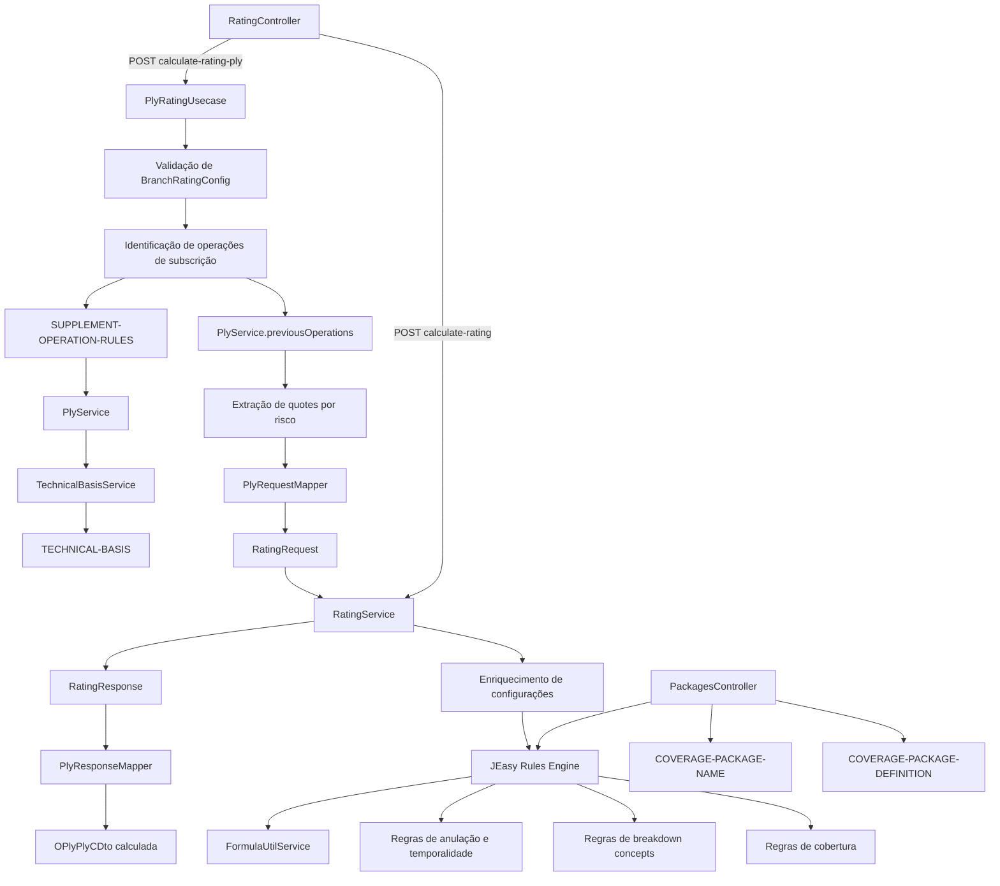
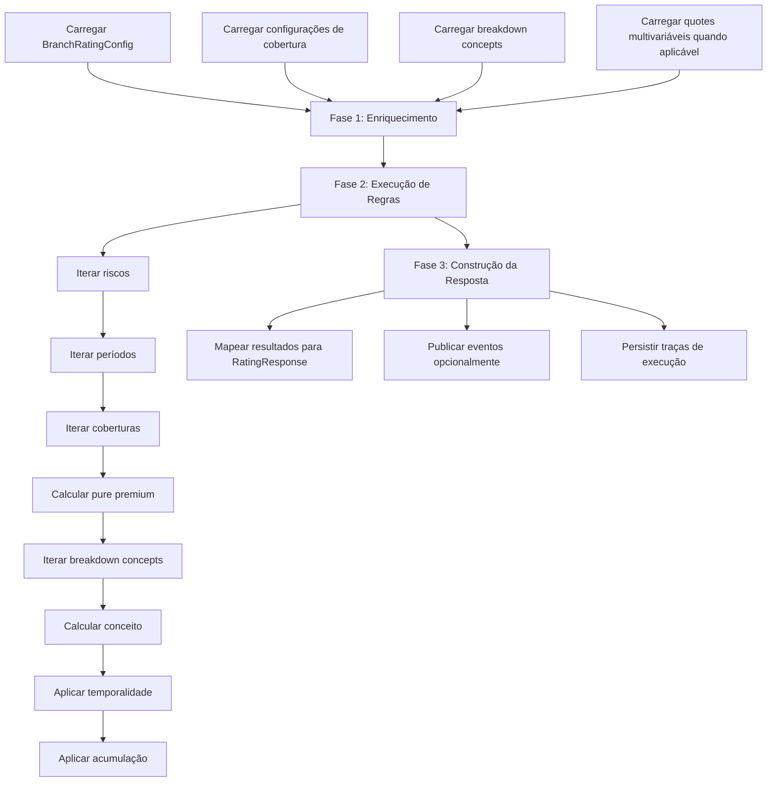

# Documentação Técnica do Motor de Rating Core RTE Service, Fluxo de Subscrições, Mapeamentos, Regras, Fórmulas e Coverage Packages

## 1. Metadados do Documento
- **Arquivo de Origem:** `Não identificado — conteúdo bruto fornecido diretamente`
- **Tipo de Documento:** Especificação Técnica / Arquitetura de Software / Manual Operacional
- **Domínio / Sistema:** MAPFRE TRON — `core-engine`, Motor de Rating RTE e módulo `coverage-packages`
- **Público-Alvo:** Desenvolvedores, Arquitetos, Operação e Analistas Funcionais
- **Data/Versão Identificada:** Versão `1.0.454-SNAPSHOT`; data `24 de Março de 2026`; autor `Equipo ACDC - MAPFRE TRON`

---

## 2. Resumo Executivo & Contexto de Negócio

O projeto `core-engine` é o motor de cálculo de rating, ou tarificação, do sistema TRON. A responsabilidade central do motor é calcular prêmios de seguros com base em configurações de ramo, coberturas, conceitos de desagregação (`breakdown concepts`), regras de negócio parametrizáveis e fórmulas ou programas personalizados.

O motor expõe APIs REST para cálculo a partir de uma estrutura padrão `RatingRequest` e para cálculo diretamente a partir de uma apólice TRON estruturada como `OPlyPlyCDto`. O fluxo baseado em apólice executa validação de configuração, identificação de operações de subscrição, transformações de dados, execução do motor de cálculo e atualização dos conceitos calculados na apólice de saída.

A arquitetura separa a orquestração do caso de uso (`PlyRatingUsecase`), o mapeamento de estruturas (`PlyRequestMapper` e `PlyResponseMapper`), o cálculo principal (`RatingService`) e a execução de regras configuráveis com JEasy Rules. As configurações operacionais, técnicas, fórmulas, constantes, regras de subscrição e pacotes de cobertura são armazenadas em coleções MongoDB.

O fluxo de subscrições administra coberturas configuradas com `mcaAjusteSuscripcion == "S"`. Para essas coberturas, o sistema identifica operações como alta, suspensão, modificação, resgate e bônus, podendo usar bases técnicas, fatores de ajuste e implementações específicas por país ou produto.

O módulo `coverage-packages` calcula preferências compostas por coberturas predefinidas. Esse módulo permite seleção direta de uma preferência, pesquisa inversa de preferências que possuam determinadas coberturas e aplicação de regras dinâmicas para capital, disponibilidade e obrigatoriedade.

---

## 3. Arquitetura, Componentes & Tecnologias Envolvidas

### Componentes principais

| Componente | Responsabilidade |
| :--- | :--- |
| `RatingController` | API REST e recepção de requisições de cálculo |
| `PlyRatingUsecase` | Orquestração do processo completo de cálculo a partir de apólice TRON |
| `PlyRequestMapper` | Transformação de `OPlyPlyCDto` em `RatingRequest` |
| `PlyResponseMapper` | Atualização de `OPlyPlyCDto` a partir de `RatingResponse` |
| `RatingService` | Enriquecimento da configuração, execução das regras e construção da resposta |
| JEasy Rules Engine | Execução ordenada de regras de negócio |
| `FormulaUtilService` | Avaliação de fórmulas parametrizadas |
| `TechnicalBasisService` | Busca de bases técnicas aplicáveis |
| `CalculateSupplementService` | Gestão de operações de subscrição |
| `PlyService` | Interface para operações de subscrição por país ou produto |
| `PackagesController` | API REST do módulo `coverage-packages` |

### Endpoints identificados

| Endpoint | Método | Entrada | Saída | Autorização / Observações |
| :--- | :--- | :--- | :--- | :--- |
| `/api/1.00/calculate-rating` | `POST` | `RatingRequest` | `RatingResponse` | Requer `GAZU_ROLRTEMGR` ou `GAZU_ROLRTEADM` |
| `/api/1.00/calculate-rating-ply` | `POST` | `RatingPlyRequest` | `OPlyPlyCDto` | Mapeia a estrutura de apólice TRON e devolve a apólice calculada |
| `/api/1.00/calculate-packages` | `POST` | País, companhia, ramo, riscos e preferências | Preferências e coberturas calculadas por risco | Pertence ao módulo `coverage-packages` |

### Diagrama de arquitetura e fluxo principal



### Fases do `RatingService.calculate()`



---

## 4. Regras de Negócio, Especificações Funcionais & Processos

### Fluxo do `PlyRatingUsecase`

1. Extrair `RequestInfo`, a nova apólice `OPlyPlyCDto` e a apólice anterior, quando existir.
2. Validar a existência de configuração para a combinação país, companhia e ramo.
3. Carregar `coverageRatingConfigs`.
4. Criar um mapa de operações por risco e cobertura.
5. Para cada cobertura, verificar se `mcaAjusteSuscripcion == "S"`.
6. Para coberturas de subscrição, calcular operações como alta, baixa e modificação de capital.
7. Quando houver coberturas de subscrição, executar `PlyService.previousOperations()`.
8. Extrair atributos de cotação e construir o mapa `riskVal -> quoteId`.
9. Usar `PlyRequestMapper` para criar o `RatingRequest`, incluindo `BranchRatingConfig` e `supplementOperations`.
10. Executar `RatingService.calculate()`.
11. Usar `PlyResponseMapper` para atualizar `breakdown concepts` em `OPlyPlyCDto`.
12. Retornar a apólice calculada.

### Configuração de ramos e coberturas

#### `BranchRatingConfig`

| Campo | Tipo | Descrição |
| :--- | :--- | :--- |
| `country` | `String` | País |
| `company` | `int` | Código de companhia |
| `branch` | `int` | Código de ramo |
| `nameBranch` | `String` | Nome do ramo |
| `cancellationAsAT` | `boolean` | Indica tratamento de anulações como AT |
| `days365` | `boolean` | Indica uso de 365 dias em cálculos |
| `manualRate` | `boolean` | Permite taxa manual |
| `multiperiod` | `boolean` | Indica suporte a múltiplos períodos |
| `coverageRatingConfigs` | `List` | Configurações de coberturas |

#### `CoverageRatingConfig` e `CoverageField`

| Campo | Tipo | Descrição |
| :--- | :--- | :--- |
| `subBranch` | `Integer` | Modalidade ou sub-ramo |
| `coverage` | `int` | Código da cobertura |
| `name` | `String` | Nome da cobertura |
| `fields` | `List<CoverageField>` | Configurações vigentes |
| `calculationType` | `CoverageCalculationType` | Tipo de cálculo da cobertura |
| `calculationRate` | `BigDecimal` | Taxa de cálculo |
| `calculationAmount` | `BigDecimal` | Valor fixo |
| `calculationCustomServiceName` | `String` | Programa de cálculo |
| `codFormula` | `String` | Código de fórmula |
| `mcaAjusteSuscripcion` | `String` | Marca de ajuste de subscrição: `S` ou `N` |
| `validityDate` | `LocalDate` | Data de vigência |
| `breakdownConceptRatingConfigs` | `List` | Configurações de conceitos de desagregação |

#### Tipos de cálculo de cobertura

| Valor | Nome | Descrição |
| :--- | :--- | :--- |
| `1` | `PERCENTAGE` | Percentual sobre o capital |
| `2` | `SO_MUCH_PER_THOUSAND` | Tanto por mil |
| `3` | `FIXED_AMOUNT` | Valor fixo |
| `4` | `FIXED_AMOUNT_PER_UNIT` | Valor fixo por unidade |
| `6` | `OBJECT` | Programa personalizado |
| `9` | `FORMULA` | Fórmula |
| `10` | `FORMULA_ACDC` | Fórmula ACDC |
| `11` | `MULTIPLICATIVE_RATE` | Taxa multivariável |

### Regras de cobertura e cálculo de prêmio puro

A execução das regras de cobertura segue prioridades específicas:

| Prioridade | Regra | Resultado |
| :--- | :--- | :--- |
| `1` | `CoveragePurePremiumManualRule` | Usa prêmio manual e encerra o cálculo de prêmio puro |
| `10` | `CoveragePurePremiumPercentageRule` | `purePremium = capital * rate / 100` |
| `11` | `CoveragePurePremiumSoMuchPerThousandRule` | `purePremium = capital * rate / 1000` |
| `12` | `CoveragePurePremiumFixedAmountRule` | `purePremium = amount` |
| `15` | `CoveragePurePremiumFormulaRule` | Avalia fórmula |
| `16` | `CoveragePurePremiumFormulaAcdcRule` | Avalia fórmula ACDC |
| `17` | `CoveragePurePremiumMultivariateRule` | Calcula prêmio com fatores multivariáveis |
| `100` | `CoverageCapitalChangeRateRule` | Aplica tipo de câmbio quando existir |

A regra percentual é aplicável quando o tipo de cálculo é `PERCENTAGE` e o campo `purePremium` ainda está nulo. A regra calcula o prêmio com escala `6` e arredondamento `RoundingMode.HALF_UP`.

### Conceitos de desagregação (`BreakdownConcept`)

#### `BreakdownConceptRatingConfig` e `BreakdownConceptField`

| Campo | Tipo | Descrição |
| :--- | :--- | :--- |
| `country` | `String` | País |
| `company` | `int` | Companhia |
| `branch` | `Integer` | Ramo; `null` representa entidade |
| `coverage` | `Integer` | Cobertura opcional |
| `breakdownConcept` | `int` | Identificador do conceito |
| `name` | `String` | Nome do conceito |
| `scopeType` | `ScopeType` | Escopo de aplicação |
| `fields` | `List` | Configurações vigentes |
| `operationalScope` | `OperationalScope` | Escopo operacional |
| `calculationBaseType` | `BreakdownConceptCalculationBaseType` | Tipo de base de cálculo |
| `calculationType` | `BreakdownConceptCalculationType` | Tipo de cálculo |
| `calculationRate` | `BigDecimal` | Taxa de cálculo |
| `calculationAmount` | `BigDecimal` | Valor fixo |
| `codFormula` | `String` | Código de fórmula |
| `applyTemporality` | `boolean` | Aplica prorrata |
| `automaticCalculation` | `boolean` | Indica cálculo automático |
| `numOfDecimals` | `Integer` | Casas decimais de arredondamento |
| `economicConceptId` | `String` | Identificador do conceito econômico |

#### Tipos de base de cálculo

| Valor | Nome | Descrição |
| :--- | :--- | :--- |
| `CAPITAL` | Capital | Utiliza o capital da cobertura |
| `PREMIUM` | Prêmio | Utiliza o prêmio puro calculado |
| `AGGREGATOR` | Agregador | Soma os conceitos especificados |

#### Tipos de cálculo de conceito

| Valor | Nome | Descrição |
| :--- | :--- | :--- |
| `1` | `PERCENTAGE` | Percentual sobre a base |
| `2` | `SO_MUCH_PER_THOUSAND` | Tanto por mil |
| `3` | `FIXED_AMOUNT` | Valor fixo |
| `5` | `OBJECT` | Programa personalizado |
| `6` | `FORMULA` | Fórmula |
| `7` | `FORMULA_ACDC` | Fórmula ACDC |

#### Processo de cálculo de `BreakdownConcept`

1. Determinar a base de cálculo:
   - `CAPITAL` usa o capital.
   - `PREMIUM` usa o prêmio puro.
   - `AGGREGATOR` usa um acumulador.
2. Calcular o valor anual:
   - Percentual: `annualAmount = calculationBase * rate / 100`.
   - Valor fixo: `annualAmount = amount`.
   - Fórmula: resultado da fórmula.
3. Aplicar prêmio mínimo, quando aplicável, por `BreakdownConceptMinimumPremiumFixedRateRule`.
4. Aplicar temporalidade:
   - Com prorrata: `supplementAmount = annualAmount * prorate`.
   - Sem prorrata: `supplementAmount = annualAmount`.
5. Aplicar arredondamento.
6. Aplicar acumulação.

### Anulação e temporalidade

| Etapa | Regra / Lógica |
| :--- | :--- |
| Valor anual anterior | `PolicyBreakdownConceptAnnualValidityRule` calcula o valor anual da apólice anterior |
| Anulação total | `AnnulationCoefficientCompleteRule` define `coefficient = 1` |
| Anulação por programa | `AnnulationCoefficientProgramRule` calcula `coefficient = programa()` |
| Anulação proporcional | `AnnulationCoefficientApplyProrateRule` calcula `coefficient = diasRestantes / diasTotais` |
| Valor final de anulação | `annulationAmount = annualAmount * coefficient` |
| Temporalidade | Aplica apenas quando `applyTemporality` é verdadeiro, existe `annualAmount` e não existe `supplementAmount` |

| Faixa de prioridade | Finalidade |
| :--- | :--- |
| `1-9` | Regras preliminares |
| `10-49` | Cálculos principais |
| `50-99` | Pós-processamento |
| `100-149` | Temporalidade e ajustes |
| `150-199` | Arredondamento e formatação |
| `200+` | Acumulação e finalização |

### Subscrições

Uma cobertura de subscrição permite múltiplos ajustes individuais dentro da mesma cobertura. Cada subscrição possui estado, capital segurado, prêmio anual, número de suplemento e datas de efeito e vencimento.

| Campo | Significado |
| :--- | :--- |
| `sbnStsVal` | Estado da subscrição: `AC`, `SP` ou `CA` |
| `cplAmn` | Capital segurado |
| `preAnm` | Prêmio anual |
| `enrSqn` | Número de suplemento |
| `efcDat` | Data de efeito |
| `expDat` | Data de vencimento |

| Estado | Código | Inclui no capital | Inclui no prêmio |
| :--- | :--- | :--- | :--- |
| Ativa | `AC` | Sim | Sim |
| Suspensa | `SP` | Sim | Não |
| Cancelada | `CA` | Não | Não |

#### Fórmulas de subscrição

```text
primaAnual = Σ(preAnm dos ajustes com sbnStsVal == 'AC')

primaSuplemento =
Σ(preAnm dos ajustes com sbnStsVal == 'AC'
  AND enrSqn == suplementoAtual)

capitalTotal =
Σ(cplAmn dos ajustes com sbnStsVal IN ('AC', 'SP'))
```

### Regras `SUPPLEMENT-OPERATION-RULES`

A coleção `SUPPLEMENT-OPERATION-RULES` define qual operação de subscrição será executada conforme condições da apólice atual e anterior.

#### Hierarquia de pesquisa

1. `country + company + branch + product`
2. `country + company + branch + product="99"`
3. `country + company + branch="99" + product="99"`
4. `country + company="99" + branch="99" + product="99"`

#### Operadores de condição

| Operador | Descrição |
| :--- | :--- |
| `EQ` | Igual a |
| `NEQ` | Diferente de |
| `GT` | Maior que |
| `GTE` | Maior ou igual a |
| `LT` | Menor que |
| `LTE` | Menor ou igual a |

#### Tokens de fatores

| Token | Descrição | Exemplo |
| :--- | :--- | :--- |
| `[rsk]` | Risco atual | `oPlyRskP.oPlyRskS.[rsk].rskVal` |
| `[cvc]` | Cobertura atual | `oPlyPlyCvrP.oPlyPlyCvrS.[cvc].cplAmn` |
| `[brw]` | Breakdown concept atual | `oPlyBrwS.[brw].enrAmn` |

#### Valores de configuração da operação

| Campo | Valores | Descrição |
| :--- | :--- | :--- |
| `GENERACION` | `S` / `N` | Indica alta de subscrição |
| `SUSPENSION` | `S` / `N` | Indica suspensão |
| `MODIFICACION` | `S` / `N` | Indica modificação |
| `RESCATE` | `S` / `N` | Indica resgate |
| `BONOS` | `S` / `N` | Indica bônus |
| `TIPO_MODIF.` | `TD`, `CRE`, `REC`, `OT` | Tipo de modificação |
| `MOTIVO` | `String` | Motivo da operação |
| `TIPO_OPERACION` | `IN`, `EX`, entre outros | Tipo de operação de subscrição |

#### Combinações e métodos executados

| Combinação | Código | Método |
| :--- | :--- | :--- |
| `GENERACION=S`, `SUSPENSION=N`, `MODIFICACION=N` | `SNN` | `create()` |
| `GENERACION=N`, `SUSPENSION=N`, `MODIFICACION=S` | `NNS` | `modify()` |
| `GENERACION=N`, `SUSPENSION=S`, `MODIFICACION=S` | `NSS` | `modifySuspended()` |
| `GENERACION=N`, `SUSPENSION=S`, `MODIFICACION=N` | `NSN` | `suspension()` |
| `GENERACION=N`, `SUSPENSION=N`, `MODIFICACION=N` | `NNN` | `compensate()` ou `emptyOperation()` |
| `GENERACION=S`, `SUSPENSION=S`, `MODIFICACION=N` | `SSN` | `createSupended()` |
| `GENERACION=S`, `SUSPENSION=S`, `MODIFICACION=S` | `SSS` | `createSupendedModify()` |
| `RESCATE=S` | — | `rescue()` |
| `BONOS=S` | — | `bonus()` |

Quando múltiplas regras são aplicáveis, o sistema ordena as operações pela quantidade de valores `S` em `GENERACION`, `SUSPENSION`, `MODIFICACION`, `RESCATE` e `BONOS`. A primeira operação forma a base; operações posteriores sobrescrevem valores para os quais possuírem `S`. A implementação utilizada é a da primeira operação.

### Métodos de `PlyService`

| Método | Propósito | Quando é executado |
| :--- | :--- | :--- |
| `previousOperations()` | Executa operações anteriores ao cálculo de rating | Uma única vez, antes do mapeamento para `RatingRequest`, se houver coberturas de subscrição |
| `preCalculation()` | Executa cálculos preliminares por cobertura | Após identificar a operação e antes do método específico |
| `emptyOperation()` | Fallback quando não existe operação aplicável | Quando nenhuma regra é encontrada ou a regra resultante é nula |
| `create()` | Cria uma nova subscrição | Combinação `SNN` |
| `modify()` | Modifica subscrição ativa existente | Combinação `NNS` |
| `modifySuspended()` | Modifica subscrição suspensa | Combinação `NSS` |
| `suspension()` | Suspende subscrição ativa | Combinação `NSN` |
| `rescue()` | Executa resgate | Quando `RESCATE=S` |
| `bonus()` | Aplica bônus | Quando `BONOS=S` |
| `getTechnicalBasis()` | Localiza base técnica aplicável | Durante o cálculo de subscrição |

### Bases técnicas

A coleção `TECHNICAL-BASIS` armazena bases técnicas para cálculo de prêmios de subscrição.

| Ordem | Critério de busca |
| :--- | :--- |
| 1 | `country + company + branch + product + validityDate` |
| 2 | `country + company + branch + validityDate` |
| 3 | `country + company + validityDate` |
| 4 | `country + validityDate` |

| Campo | Tipo | Descrição |
| :--- | :--- | :--- |
| `rate` | `BigDecimal` | Taxa-base do prêmio |
| `minimumPremium` | `BigDecimal` | Prêmio mínimo aplicável |
| `maximumPremium` | `BigDecimal` | Prêmio máximo aplicável |
| `minimumCapital` | `BigDecimal` | Capital mínimo segurável |
| `maximumCapital` | `BigDecimal` | Capital máximo segurável |
| `factors` | `List` | Fatores de ajuste, como idade e sexo |

### Mapeamentos de dados

#### Mapeamento de entrada

`PlyRequestMapper.toRatingRequest()` transforma uma apólice TRON em `RatingRequest`.

| Etapa | Resultado |
| :--- | :--- |
| Extração de dados gerais | Dados de `RequestInfo` e apólice |
| Construção de `FixedValues` | Número da apólice, datas, moeda, dados comerciais, tipo e código de suplemento |
| Construção de `Parameters` | Atributos de apólice, risco, cobertura e campos calculados |
| Mapeamento de riscos | Filtra por `riskVal`, mapeia coberturas e atribui operações de subscrição |
| Construção final | `RatingRequest` completo |

#### Mapeamento de saída

`PlyResponseMapper.toPlyResponse()` atualiza a apólice original com o resultado de rating.

| Campo de `RatingBreakdownConcept` | Campo de destino em `OPlyBrwS` |
| :--- | :--- |
| `breakdownConceptId` | `ecmBrwCncVal` |
| Risco | `rskVal` |
| Cobertura | `cvrVal` |
| `annualAmount` | `anlAmn` |
| `supplementAmount` | `enrAmn` |
| `annualAccumulatedAmount` | `anlAgrAmn` |
| `nonConsumedAmount` | `nonCnmAmn` |

#### `FixedValues`

| Campo origem | Rota de origem | Campo de destino | Obrigatório |
| :--- | :--- | :--- | :--- |
| `plyVal` | `oPlyGniP.oPlyGniS.plyVal` | `policyNumber` | Sim |
| `enrVal` | `oPlyGniP.oPlyGniS.enrVal` | `supplementCode` | Sim |
| `plyEfcDat` | `oPlyGniP.oPlyGniS.plyEfcDat` | `policyEffectiveDate` | Sim |
| `plyExpDat` | `oPlyGniP.oPlyGniS.plyExpDat` | `policyExpirationDate` | Sim |
| `crnVal` | `oPlyGniP.oPlyGniS.crnVal` | `currency` | Sim |
| `cmpVal` | `oPlyGniP.oPlyGniS.cmpVal` | `companyId` | Sim |
| `lobVal` | `oPlyGniP.oPlyGniS.lobVal` | `branchId` | Sim |
| `thpVal` | `oPlyGniP.oPlyGniS.thpVal` | `thirdPartyCode` | Não |
| `frsLvlVal` | `oPlyGniP.oPlyGniS.frsLvlVal` | `level1` | Não |

#### `Parameters`

| Fonte | Convenção |
| :--- | :--- |
| Atributos de apólice | `OPlyAtcCT` |
| Atributos de risco | Prefixo `risk_[rskVal]_` |
| Atributos de cobertura | Prefixo `coverage_[cvcVal]_` |
| Apólice anterior | Prefixo `prev.` |
| Campos calculados | Inseridos como parâmetros adicionais |

### Transformações especiais

| Transformação | Comportamento |
| :--- | :--- |
| `Date` para `Long` | Retorna milissegundos desde epoch; retorna `null` para data nula |
| `Date` para `LocalDate` | Usa `ZoneId.systemDefault()`; retorna `null` para data nula |
| Extração de `subBranch` | Aceita `BigDecimal`, `Integer` e `String` conversível para inteiro; retorna `null` em formatos inválidos |
| Saturação de `BigDecimal` | Se a escala exceder `30`, aplica escala `30` com `RoundingMode.HALF_UP` |

### Motor de regras JEasy Rules

O motor usa JEasy Rules com POJOs, anotações declarativas, prioridades e injeção de `Facts`.

| Anotação | Propósito |
| :--- | :--- |
| `@Rule` | Define metadados da regra |
| `@Priority` | Define ordem de execução |
| `@Condition` | Define a condição de execução |
| `@Action` | Define a ação executada |
| `@Fact` | Injeta um dado no parâmetro do método |

| Fact | Tipo | Disponível em | Descrição |
| :--- | :--- | :--- | :--- |
| `company` | `Company` | Todas as regras | Dados da companhia |
| `ratingRequest` | `RatingRequest` | Todas as regras | Requisição completa |
| `supplement` | `Supplement` | Todas as regras | Suplemento atual |
| `risk` | `SupplementRisk` | Regras de risco | Risco atual |
| `period` | `SupplementPeriod` | Regras de período | Período atual |
| `coverage` | `SupplementCoverage` | Regras de cobertura | Cobertura atual |
| `breakdownConcept` | `SupplementBreakdownConcept` | Regras de conceito | Conceito atual |
| `ruleEngineStats` | `RuleEngineStats` | Todas as regras | Estatísticas |

### Motor de fórmulas

| Tipo | Capacidades | Uso indicado |
| :--- | :--- | :--- |
| `FORMULA` | Variáveis de requisição, constantes `MMATH.f_cte()`, avaliação por MxParser | Cálculos simples |
| `FORMULA_ACDC` | Recursos de `FORMULA`, funções `FUNC_XXX()`, processamento avançado e auditoria completa | Cálculos complexos |

#### Sintaxe de fórmulas

| Elemento | Sintaxe / Exemplo |
| :--- | :--- |
| Variável | `[NOME_VARIAVEL]` |
| Constante parametrizada | `MMATH.f_cte('NOME_CONSTANTE')` |
| Função personalizada | `FUNC_NOME_FUNCAO(arg1, arg2, ...)` |
| Soma | `[A] + [B]` |
| Subtração | `[A] - [B]` |
| Multiplicação | `[A] * [B]` |
| Divisão | `[A] / [B]` |
| Potência | `[A] ^ 2` |
| Agrupamento | `([A] + [B]) * [C]` |
| Raiz quadrada | `sqrt([CAPITAL])` |
| Valor absoluto | `abs([DIFERENCA])` |
| Máximo | `max([A], [B])` |
| Mínimo | `min([A], [B])` |
| Arredondamento | `round([VALOR])` |

#### Pesquisa de constantes

| Ordem | Critério |
| :--- | :--- |
| 1 | País + companhia + ramo + data |
| 2 | País + companhia + data |
| 3 | País + data |

O motor busca constantes em `CONSTANT-DEFINITION`, filtra por país, companhia, ramo e vigência, e substitui a expressão `MMATH.f_cte('NOME')` pelo valor localizado.

### Coverage Packages

| Cenário | Regra de seleção |
| :--- | :--- |
| `preferenceId > 0` | Busca preferência específica; filtra coberturas se a lista for fornecida; caso contrário, retorna todas as coberturas |
| `preferenceId = 0` com coberturas | Busca todas as preferências do ramo e retorna apenas as que tenham interseção não vazia com as coberturas solicitadas |
| Sem `preferences` | Retorna catálogo completo |

| Regra dinâmica | Exemplo descrito |
| :--- | :--- |
| Regra de capital | Se `age > 60`, `maxCapital = 200000` |
| Regra de disponibilidade | Se `profession == "HIGH_RISK"` e `coverageId == 5`, a cobertura é bloqueada |
| Regra de obrigatoriedade | Se `age < 55` e `coverageId == 2`, o status é `MANDATORY` |

---

## 5. Tabelas de Parâmetros, Ambientes e Estruturas de Dados

### Coleções MongoDB

| Item / Parâmetro | Descrição / Função | Tipo / Valores / Formato | Ambiente / Observações |
| :--- | :--- | :--- | :--- |
| `branches` | Configuração de ramos | Coleção MongoDB | Contém `BranchRatingConfig` |
| `breakdownConcepts` | Configuração de conceitos de desagregação | Coleção MongoDB | Contém `BreakdownConceptRatingConfig` |
| `economicConcepts` | Conceitos econômicos | Coleção MongoDB | Apenas citada no documento |
| `quotes` | Cotações multivariáveis | Coleção MongoDB | Aplicável quando o tipo de cálculo requer cotação multivariável |
| `FORMULA-DEFINITION` | Definições de fórmulas | Coleção MongoDB | Usada por `FORMULA` e `FORMULA_ACDC` |
| `CONSTANT-DEFINITION` | Constantes de fórmulas | Coleção MongoDB | Consultada por `MMATH.f_cte()` |
| `SUPPLEMENT-OPERATION-RULES` | Regras de operações de subscrição | Coleção MongoDB | Seleção por hierarquia de país, companhia, ramo e produto |
| `TECHNICAL-BASIS` | Bases técnicas | Coleção MongoDB | Taxas, prêmios, capitais e fatores |
| `COVERAGE-PACKAGE-DEFINITION` | Definições de pacotes de cobertura | Coleção MongoDB | Status e limites de capital |
| `COVERAGE-PACKAGE-NAME` | Nomes e descrições dos pacotes | Coleção MongoDB | Nome e descrição da preferência |

### Estrutura exemplificada de `RatingRequest`

| Campo | Tipo / Exemplo | Descrição |
| :--- | :--- | :--- |
| `countryId` | `"ES"` | País |
| `companyId` | `1` | Companhia |
| `branchId` | `100` | Ramo |
| `operationDate` | `"2026-03-18"` | Data da operação |
| `operationNumber` | `"123456"` | Número da operação |
| `fixedValues.supplementCode` | `"0"` | Código de suplemento |
| `fixedValues.policyNumber` | `"POL123456"` | Número da apólice |
| `parameters` | `{"campo1":"valor1"}` | Parâmetros dinâmicos |
| `newSupplement.risks` | Lista | Riscos do suplemento |

### Estrutura exemplificada de `RatingResponse`

| Campo | Tipo / Exemplo | Descrição |
| :--- | :--- | :--- |
| `companyId` | `1` | Companhia |
| `branchId` | `100` | Ramo |
| `newSupplement.risks[].risk` | `1` | Risco |
| `periods[].period` | `1` | Período |
| `coverages[].coverageId` | `1` | Cobertura |
| `coverages[].purePremium` | `100.50` | Prêmio puro |
| `breakdownConceptId` | `1` | Conceito de desagregação |
| `annualAmount` | `100.50` | Valor anual |
| `supplementAmount` | `100.50` | Valor do suplemento |

### Estrutura exemplificada de `RatingPlyRequest`

| Campo | Tipo / Exemplo | Descrição |
| :--- | :--- | :--- |
| `requestInfo.countryId` | `"ES"` | País |
| `requestInfo.operationNumber` | `123456` | Número da operação |
| `requestInfo.operationDate` | `1710777600000` | Data da operação em milissegundos desde epoch |
| `requestInfo.riskVal` | `1` | Identificador de risco |
| `newSupplement.oPlyPlyC` | Objeto | Nova apólice TRON |
| `currentPolicy.oPlyPlyC` | Objeto | Apólice atual |

### Estrutura exemplificada de base técnica

| Campo | Exemplo | Descrição |
| :--- | :--- | :--- |
| `_id` | `"bt_001"` | Identificador |
| `codBt` | `"4481"` | Código da base técnica |
| `country` | `"ES"` | País |
| `company` | `1` | Companhia |
| `branch` | `100` | Ramo |
| `product` | `"01"` | Produto |
| `validityDate` | `"2024-01-01"` | Vigência |
| `rate` | `0.05` | Taxa |
| `minimumPremium` | `10.00` | Prêmio mínimo |
| `maximumPremium` | `1000.00` | Prêmio máximo |
| `factors.name` | `"AGE"` | Nome do fator |
| `factors.type` | `"RANGE"` | Tipo de fator |
| `factors.ranges` | Faixas de idade e fator | Ajustes por intervalo |

### Estrutura de pacote de cobertura

| Campo | Exemplo | Descrição |
| :--- | :--- | :--- |
| `country` | `"ES"` | País |
| `companyId` | `1` | Companhia |
| `branchId` | `100` | Ramo |
| `preferenceId` | `1` | Identificador da preferência |
| `coverageId` | `1` | Identificador da cobertura |
| `status` | `"MANDATORY"` | Status da cobertura |
| `minCapital` | `10000` | Capital mínimo |
| `maxCapital` | `500000` | Capital máximo |
| `defaultCapital` | `100000` | Capital padrão |

---

## 6. Bateria de Perguntas & Respostas para RAG (FAQ Sintético)

### P1: Qual é a responsabilidade do projeto `core-engine` no sistema TRON?
**R:** O projeto `core-engine` é o motor de rating ou tarificação do sistema TRON. Ele calcula prêmios de seguros a partir de configurações de ramo, coberturas, conceitos de desagregação, regras de negócio parametrizáveis, fórmulas e programas personalizados. O motor também suporta anulações, modificações e operações de subscrição.

### P2: Quais APIs REST são disponibilizadas pelo `RatingController`?
**R:** O `RatingController` disponibiliza `POST /api/1.00/calculate-rating`, que recebe um `RatingRequest` e retorna um `RatingResponse`, e `POST /api/1.00/calculate-rating-ply`, que recebe um `RatingPlyRequest`, mapeia uma estrutura de apólice TRON `OPlyPlyCDto`, executa o rating e retorna a apólice calculada. O endpoint `calculate-rating` requer os papéis `GAZU_ROLRTEMGR` ou `GAZU_ROLRTEADM`.

### P3: Quando uma cobertura é tratada como cobertura de subscrição?
**R:** Uma cobertura é tratada como cobertura de subscrição quando sua configuração possui `mcaAjusteSuscripcion == "S"`. Nessas condições, o `PlyRatingUsecase` identifica operações de subscrição para cada risco e cobertura, como alta, baixa, modificação de capital, suspensão, resgate e bônus.

### P4: Como o sistema seleciona uma regra em `SUPPLEMENT-OPERATION-RULES`?
**R:** O sistema busca regras em ordem hierárquica, da mais específica para a mais genérica: país, companhia, ramo e produto; depois usa produto `99`; depois ramo e produto `99`; por fim, companhia, ramo e produto `99`. As condições usam operadores `EQ`, `NEQ`, `GT`, `GTE`, `LT` e `LTE`, avaliando fatores da apólice atual e anterior.

### P5: Como o motor resolve múltiplas operações de subscrição aplicáveis?
**R:** O motor ordena as operações pela quantidade de valores `S` nas ações `GENERACION`, `SUSPENSION`, `MODIFICACION`, `RESCATE` e `BONOS`. A primeira operação estabelece a base e define a implementação utilizada. Operações seguintes podem sobrescrever valores quando possuírem `S` no campo correspondente.

### P6: Como é calculado o prêmio puro de uma cobertura percentual?
**R:** A regra `CoveragePurePremiumPercentageRule`, com prioridade `10`, calcula `purePremium = capital * rate / 100`. A regra é executada apenas quando o tipo de cálculo é `PERCENTAGE` e a cobertura ainda não possui `purePremium`. O cálculo usa escala `6` e `RoundingMode.HALF_UP`.

### P7: Quais são as bases possíveis para o cálculo de um `BreakdownConcept`?
**R:** O `BreakdownConcept` pode usar a base `CAPITAL`, que utiliza o capital da cobertura; a base `PREMIUM`, que utiliza o prêmio puro calculado; ou a base `AGGREGATOR`, que utiliza a soma de conceitos configurados em um acumulador.

### P8: Como o sistema calcula prêmio anual, prêmio de suplemento e capital total de subscrições?
**R:** O prêmio anual é a soma de `preAnm` de ajustes ativos, isto é, com `sbnStsVal == 'AC'`. O prêmio de suplemento considera ajustes ativos cujo `enrSqn` corresponde ao suplemento atual. O capital total soma `cplAmn` de ajustes ativos ou suspensos, com estado `AC` ou `SP`.

### P9: Como as fórmulas `FORMULA` e `FORMULA_ACDC` diferem?
**R:** Ambas suportam variáveis de requisição entre colchetes e constantes chamadas por `MMATH.f_cte()`. `FORMULA` é destinada a cálculos simples e é avaliada com MxParser. `FORMULA_ACDC` inclui funções personalizadas no padrão `FUNC_XXX()`, processamento avançado de parâmetros e auditoria completa de variáveis, constantes, fórmula processada, resultado e timestamp.

### P10: Como ocorre a busca de uma constante usada em `MMATH.f_cte()`?
**R:** O motor consulta a coleção `CONSTANT-DEFINITION`, buscando a constante por país, companhia, ramo e data de vigência. A busca usa uma hierarquia: país + companhia + ramo + data; país + companhia + data; e país + data. A expressão `MMATH.f_cte('NOME')` é substituída pelo valor encontrado.

### P11: Como funciona a pesquisa inversa no módulo `coverage-packages`?
**R:** A pesquisa inversa é usada quando `preferenceId = 0` e existe uma lista de coberturas. O módulo recupera todas as preferências do ramo, calcula a interseção entre as coberturas de cada preferência e as coberturas solicitadas e retorna somente as preferências cuja interseção não seja vazia. Cada preferência retornada contém apenas as coberturas coincidentes.

### P12: Quais dados o `PlyResponseMapper` atualiza na apólice TRON?
**R:** O `PlyResponseMapper` localiza o risco e a cobertura correspondentes na apólice original, atualiza o prêmio puro e cria ou atualiza `OPlyBrwP` para cada conceito de desagregação. O mapeamento inclui identificador do conceito, valores anual e de suplemento, valor anual acumulado e valor não consumido.

---

## 7. Glossário de Termos, Siglas & Conceitos-Chave

- **AC:** Estado de subscrição ativa.
- **AT:** Tratamento de anulações mencionado pelo campo `cancellationAsAT`.
- **BM25:** Não mencionado no conteúdo técnico do documento-fonte.
- **Breakdown Concept:** Conceito de desagregação; representa componentes como prêmio puro, recargos e impostos.
- **Coverage:** Cobertura de seguro.
- **FORMULA:** Fórmula parametrizada padrão, avaliada com MxParser.
- **FORMULA_ACDC:** Fórmula avançada com funções personalizadas e auditoria completa.
- **Facts:** Dados injetados e disponíveis durante a execução de regras JEasy Rules.
- **FixedValues:** Campos fixos mapeados da apólice, principalmente de `OPlyGniS`.
- **JEasy Rules:** Framework usado como motor de regras de negócio.
- **MMATH.f_cte():** Função de referência a constantes parametrizadas em fórmulas.
- **MxParser:** Tecnologia citada para avaliação de fórmulas padrão.
- **OPlyPlyCDto:** Estrutura de dados de apólice TRON.
- **OPlySbnP / OPlySbnS:** Estrutura de subscrição e seus dados.
- **Parameters:** Parâmetros dinâmicos extraídos de atributos e campos da apólice.
- **Pure Premium:** Prêmio puro; prêmio-base antes de recargos.
- **Rating:** Processo de cálculo de prêmio ou tarificação.
- **RTE:** Referência presente no título “Motor de Rating - RTE”; o documento não expande a sigla.
- **SP:** Estado de subscrição suspensa.
- **CA:** Estado de subscrição cancelada.
- **Subscription:** Subscrição individual dentro de uma cobertura.
- **Supplement:** Suplemento de apólice.
- **Technical Basis:** Base técnica para cálculo de prêmios.
- **Temporality:** Prorrata temporal.
- **TRON:** Sistema corporativo no qual o motor de rating está inserido.

---

## 8. Notas Críticas, Riscos & Limitações

- **Nota de Análise:** O documento descreve classes, componentes, coleções e fluxos, mas não apresenta contratos completos de todas as APIs, esquemas JSON completos nem códigos HTTP de resposta ou erro.
- **Nota de Análise:** O endpoint `POST /api/1.00/calculate-rating-ply` é descrito como retornando `OPlyPlyCDto`, porém não detalha autenticação, autorização ou condições de falha.
- **Nota de Análise:** O documento cita publicação opcional de eventos e persistência de traças no `RatingService`, sem identificar mecanismo de mensageria, destino de eventos, persistência, retenção ou localização de logs.
- **Nota de Análise:** `CalculateSupplementService` é identificado como componente de gestão de operações de subscrição, mas o documento não detalha interfaces, métodos ou fluxo específico desse serviço.
- **Nota de Análise:** A implementação concreta de `PlyService` pode variar por país ou produto. A seleção ocorre pela propriedade `implementation` das regras de operação, mas o documento não lista todas as implementações disponíveis.
- **Nota de Análise:** O exemplo de criação de subscrição consulta `adjustedRate`, enquanto o exemplo de `preCalculation()` armazena `age` e `ageFactor`; a origem ou composição de `adjustedRate` não é detalhada no conteúdo.
- **Nota de Análise:** Há um nome de método grafado como `createSupended()` no documento. A grafia foi preservada fielmente; o documento não confirma se essa é a assinatura efetiva no código.
- **Nota de Análise:** As coleções MongoDB são listadas, mas não são descritos índices, políticas de consistência, mecanismos de versionamento físico, controles de acesso ou estratégia de migração.
- **Risco Operacional:** O cálculo depende da configuração vigente por país, companhia, ramo, produto e data. Configurações ausentes ou inconsistentes podem impedir a execução, pois o fluxo determina que uma exceção seja lançada quando não existir configuração de ramo.
- **Risco Operacional:** Fórmulas e constantes alteráveis em MongoDB permitem flexibilidade sem deploy, mas exigem governança sobre vigência, validação, auditoria e publicação de mudanças.
- **Risco de Regras:** A resolução de múltiplas operações de subscrição prioriza a quantidade de valores `S`; configurações concorrentes podem produzir resultados inesperados se a ordem e a combinação de regras não forem cuidadosamente governadas.

---

## 9. Conteúdo Bruto Estruturado (Referência Fiel)

```text
--- [PÁGINAS 1-2 DE 50] ---

Documentación Completa del Motor de Rating - Core RTE Service
Versión: 1.0.454-SNAPSHOT
Fecha: 24 de Marzo de 2026
Autor: Equipo ACDC - MAPFRE TRON

Estrutura do documento:
PARTE I: MOTOR DE RATING - RTE
1. Introducción al Motor de Rating
2. Arquitectura General
3. API REST - RatingController
4. Flujo Principal de Cálculo
5. Configuración de Ramos, Coberturas y Conceptos

PARTE II: FLUJO DE SUSCRIPCIONES
1. Introducción a Suscripciones
2. SUPPLEMENT-OPERATION-RULES
3. Métodos de PlyService
4. Búsqueda de Bases Técnicas
5. Operaciones de Suscripción

PARTE III: MAPEOS DE DATOS
1. Arquitectura de Mapeos
2. Mapeo de Entrada - PlyRequestMapper
3. Mapeo de Salida - PlyResponseMapper
4. Mapeo de Campos Fijos y Parámetros
5. Transformaciones Especiales

PARTE IV: MOTOR DE REGLAS
1. Introducción a JEasy Rules
2. Estructura de una Regla
3. Facts - Datos Disponibles
4. Reglas de Cobertura
5. Reglas de Breakdown Concept
6. Reglas de Anulación y Temporalidad

PARTE V: MOTOR DE FÓRMULAS
1. Introducción al Motor de Fórmulas
2. Tipos de Fórmulas - FORMULA y FORMULA_ACDC
3. Sintaxis y Variables
4. Constantes Parametrizadas
5. Funciones Personalizadas

PARTE VI: MÓDULO COVERAGE PACKAGES
1. Introducción a Coverage Packages
2. Reglas de Selección de Preferencias

El proyecto core-engine es el motor de cálculo de rating (tarificación) del sistema TRON.
Calcula primas basándose en configuraciones de ramo, coberturas, conceptos de desglose,
reglas de negocio parametrizables, fórmulas y programas personalizados.

Funcionalidades:
- Cálculo automático de primas.
- Gestión de recargos, impuestos y descuentos.
- Manejo de coberturas con ajustes de suscripción.
- Fórmulas parametrizadas.
- Motor de reglas flexible y mantenible.
- Cálculo de devoluciones y ajustes por anulaciones y modificaciones.

--- [PÁGINAS 3-8 DE 50] ---

Arquitectura:
RatingController
- /api/1.00/calculate-rating
- /api/1.00/calculate-rating-ply

RatingController -> PlyRatingUsecase -> Mappers -> RatingService -> JEasy Rules.

PlyRatingUsecase:
- Extracción y validación de datos de entrada.
- Recuperación y validación de configuración de ramo.
- Identificación de operaciones de suscripción.
- Mapeo de estructuras Ply a RatingRequest.

Mappers:
- PlyRequestMapper: OPlyPlyCDto -> RatingRequest.
- PlyResponseMapper: RatingResponse -> OPlyPlyCDto.

RatingService:
1. Enriquecimiento de configuración.
2. Ejecución de reglas de negocio.
3. Construcción de respuesta.

Motor de Reglas:
- Reglas de cobertura.
- Reglas de conceptos de desglose.
- Reglas de anulación.
- Reglas de rehabilitación.
- Reglas de suplementos especiales.

Componentes:
RatingController, PlyRatingUsecase, Mappers, RatingService, JEasy Rules Engine,
FormulaUtilService, TechnicalBasisService y CalculateSupplementService.

Endpoint estándar:
POST /api/1.00/calculate-rating
Autorización: GAZU_ROLRTEMGR o GAZU_ROLRTEADM.
Entrada: RatingRequest.
Salida: RatingResponse.

Endpoint desde póliza:
POST /api/1.00/calculate-rating-ply
Entrada: RatingPlyRequest.
Salida: OPlyPlyCDto.

Flujo PlyRatingUsecase:
1. Extraer RequestInfo, apólice nueva y anterior.
2. Validar configuración de país + compañía + ramo.
3. Identificar operaciones de subscripción cuando mcaAjusteSuscripcion == "S".
4. Ejecutar PlyService.previousOperations() si existen coberturas de subscripción.
5. Extraer quotes por riesgo.
6. Mapear a RatingRequest.
7. Ejecutar RatingService.calculate().
8. Mapear RatingResponse a OPlyPlyCDto.

RatingService:
Fase 1: carga configuración de ramo, coberturas, breakdown concepts y quotes.
Fase 2: itera riesgo, período, cobertura y breakdown concepts; ejecuta cálculo,
temporalidad y acumulación.
Fase 3: construye RatingResponse, puede publicar eventos y persiste trazas.

--- [PÁGINAS 9-12 DE 50] ---

Colección branches: BranchRatingConfig.
Campos: country, company, branch, nameBranch, cancellationAsAT, days365, manualRate,
multiperiod, coverageRatingConfigs.

CoverageRatingConfig:
subBranch, coverage, name, fields.

CoverageField:
calculationType, calculationRate, calculationAmount, calculationCustomServiceName,
codFormula, mcaAjusteSuscripcion, validityDate, breakdownConceptRatingConfigs.

Tipos de cálculo de cobertura:
1 PERCENTAGE
2 SO_MUCH_PER_THOUSAND
3 FIXED_AMOUNT
4 FIXED_AMOUNT_PER_UNIT
6 OBJECT
9 FORMULA
10 FORMULA_ACDC
11 MULTIPLICATIVE_RATE

Colección breakdownConcepts: BreakdownConceptRatingConfig.
Campos: country, company, branch, coverage, breakdownConcept, name, scopeType, fields.

BreakdownConceptField:
operationalScope, calculationBaseType, calculationType, calculationRate,
calculationAmount, codFormula, applyTemporality, automaticCalculation,
numOfDecimals, economicConceptId.

Bases: CAPITAL, PREMIUM y AGGREGATOR.
Cálculos: 1 PERCENTAGE, 2 SO_MUCH_PER_THOUSAND, 3 FIXED_AMOUNT,
5 OBJECT, 6 FORMULA y 7 FORMULA_ACDC.

--- [PÁGINAS 13-24 DE 50] ---

Una cobertura de subscripción permite administrar múltiples ajustes individuales:
sbnStsVal: AC activa, SP suspendida, CA cancelada.
cplAmn: capital asegurado.
preAnm: prima anual.
enrSqn: número de suplemento.
efcDat y expDat: fechas de efecto y vencimiento.

El motor se activa cuando:
- mcaAjusteSuscripcion == "S".
- Se detectan cambios entre suplemento actual y anterior.
- Se requiere cálculo basado en ajustes de subscripción.

SUPPLEMENT-OPERATION-RULES:
Contiene country, company, branch, product, implementation, conditions y values.
Jerarquía: combinación específica; producto 99; ramo y producto 99; compañía,
ramo y producto 99.

Operadores: EQ, NEQ, GT, GTE, LT, LTE.
Tokens: [rsk], [cvc], [brw].

Valores:
GENERACION, SUSPENSION, MODIFICACION, RESCATE, BONOS, TIPO_MODIF., MOTIVO,
TIPO_OPERACION.

Operaciones:
SNN -> create()
NNS -> modify()
NSS -> modifySuspended()
NSN -> suspension()
NNN -> compensate() o emptyOperation()
SSN -> createSupended()
SSS -> createSupendedModify()
RESCATE=S -> rescue()
BONOS=S -> bonus()

PlyService:
previousOperations(): operación previa única antes del mapeo.
preCalculation(): cálculo preliminar por cobertura.
emptyOperation(): fallback cuando no hay operación aplicable.
create(), modify(), modifySuspended(), suspension(), rescue(), bonus(),
getTechnicalBasis().

TECHNICAL-BASIS:
Busca por país, compañía, ramo, producto y fecha, con fallback progresivo.
Campos: rate, minimumPremium, maximumPremium, minimumCapital, maximumCapital y factors.

Estados de subscripción:
AC incluye capital y prima.
SP incluye capital, no prima.
CA no incluye capital ni prima.

primaAnual = suma de preAnm de ajustes AC.
primaSuplemento = suma de preAnm AC con enrSqn del suplemento actual.
capitalTotal = suma de cplAmn para AC y SP.

--- [PÁGINAS 25-30 DE 50] ---

PlyRequestMapper:
OPlyPlyCDto -> RatingRequest.
Extrae FixedValues, Parameters, riesgos y coberturas.

PlyResponseMapper:
RatingResponse -> OPlyPlyCDto.
Actualiza purePremium y crea/actualiza OPlyBrwP.

FixedValues:
plyVal -> policyNumber
enrVal -> supplementCode
plyEfcDat -> policyEffectiveDate
plyExpDat -> policyExpirationDate
crnVal -> currency
cmpVal -> companyId
lobVal -> branchId
thpVal -> thirdPartyCode
frsLvlVal -> level1

Parameters:
- Atributos de póliza.
- Atributos de riesgo con prefijo risk_[rskVal]_.
- Atributos de cobertura con prefijo coverage_[cvcVal]_.
- Campos calculados.
- Póliza anterior con prefijo prev.

Breakdown fields:
ecmBrwCncVal, rskVal, cvrVal, anlAmn, enrAmn, anlAgrAmn, nonCnmAmn.

Transformaciones:
Date -> Long usa epoch en milisegundos.
Date -> LocalDate usa ZoneId.systemDefault().
subBranch acepta BigDecimal, Integer o String.
BigDecimal se limita a MAX_SCALE = 30 con HALF_UP.

--- [PÁGINAS 31-38 DE 50] ---

JEasy Rules:
- POJOs.
- @Rule, @Condition, @Action, @Priority y @Fact.
- Ejecución ordenada por prioridad.
- Inyección de Facts.

Facts:
company, ratingRequest, supplement, risk, period, coverage, breakdownConcept,
ruleEngineStats.

Coberturas:
1 CoveragePurePremiumManualRule.
10 CoveragePurePremiumPercentageRule: capital * rate / 100.
11 CoveragePurePremiumSoMuchPerThousandRule: capital * rate / 1000.
12 CoveragePurePremiumFixedAmountRule.
15 CoveragePurePremiumFormulaRule.
16 CoveragePurePremiumFormulaAcdcRule.
17 CoveragePurePremiumMultivariateRule.
100 CoverageCapitalChangeRateRule.

Breakdown concept:
Base de cálculo: capital, pure premium o agregador.
Cálculo anual: porcentaje, importe fijo o fórmula.
Aplicación de prima mínima.
Temporalidad o prorrata.
Redondeo.
Acumulación.

Anulación:
- Importe anual de póliza anterior.
- Coeficiente completo = 1.
- Coeficiente por programa.
- Coeficiente proporcional = días restantes / días totales.
- annulationAmount = annualAmount * coefficient.

Prioridades:
1-9 preliminares.
10-49 cálculos principales.
50-99 post-procesamiento.
100-149 temporalidad y ajustes.
150-199 redondeo y formato.
200+ acumulación y finalización.

--- [PÁGINAS 39-44 DE 50] ---

Motor de fórmulas:
FORMULA usa variables, MMATH.f_cte() y MxParser.
FORMULA_ACDC adiciona FUNC_XXX(), procesamiento avanzado y auditoría.

FORMULA-DEFINITION:
cnyVal, cmpVal, brgKeyFomVal, fomNam, vldDat, dsbRow.

Variables:
fixedValues, parameters y variables especiales COVERAGE_ID, SUB_BRANCH, BASE_CALCULO.

Operadores: +, -, *, /, ^ y paréntesis.
Funciones: sqrt, abs, max, min y round.

CONSTANT-DEFINITION:
Busca constantes por país, compañía, ramo y vigencia.
Jerarquía: país+compañía+ramo+fecha; país+compañía+fecha; país+fecha.

Funciones personalizadas:
FUNC_NOMBRE_FUNCION(arg1, arg2, ...).
Disponibles solamente para FORMULA_ACDC.

Auditoría:
- Variables utilizadas y valores.
- Constantes consultadas y valores.
- Fórmula procesada.
- Resultado final.
- Timestamp de ejecución.

--- [PÁGINAS 45-50 DE 50] ---

Coverage Packages:
POST /api/1.00/calculate-packages.

Selección directa:
preferenceId > 0.
Busca preferencia, carga coberturas, aplica reglas y retorna resultado.

Búsqueda inversa:
preferenceId = 0 y lista de coverages.
Busca todas las preferencias del ramo.
Incluye una preferencia si contiene al menos una cobertura solicitada.
Retorna únicamente coberturas coincidentes.

Sin preferences:
Retorna catálogo completo.

COVERAGE-PACKAGE-DEFINITION:
country, companyId, branchId, preferenceId, coverages, coverageId, status,
minCapital, maxCapital, defaultCapital.

COVERAGE-PACKAGE-NAME:
country, companyId, branchId, preferenceId, name, description.

Reglas dinámicas:
- age > 60: maxCapital = 200000.
- profession == HIGH_RISK y coverageId == 5: blocked = true.
- age < 55 y coverageId == 2: status = MANDATORY.

Glosario:
Rating, Pure Premium, Breakdown Concept, Coverage, Risk, Supplement, Temporality,
Subscription, Technical Basis, FixedValues, Parameters, JEasy Rules, Facts, Formula,
MMATH.f_cte() y FUNC_XXX.

Colecciones:
branches, breakdownConcepts, economicConcepts, quotes, FORMULA-DEFINITION,
CONSTANT-DEFINITION, SUPPLEMENT-OPERATION-RULES, TECHNICAL-BASIS,
COVERAGE-PACKAGE-DEFINITION y COVERAGE-PACKAGE-NAME.

Enlaces:
https://github.com/j-easy/easy-rules
http://mathparser.org/

Fin del documento.
Versión: 1.0.454-SNAPSHOT.
Fecha: 24 de Marzo de 2026.
Autor: Equipo ACDC - MAPFRE TRON.
```
