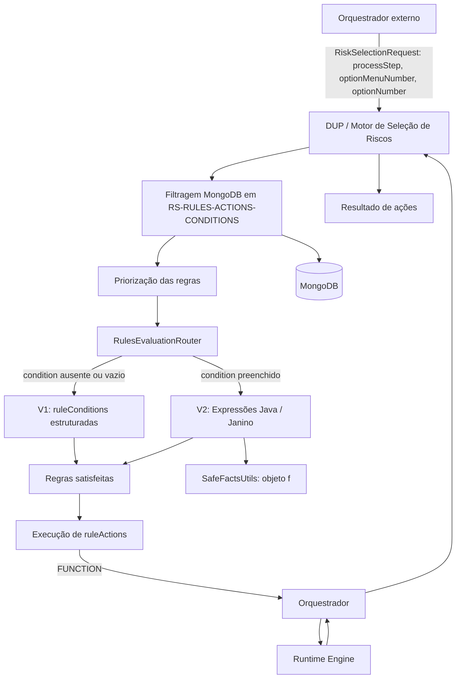
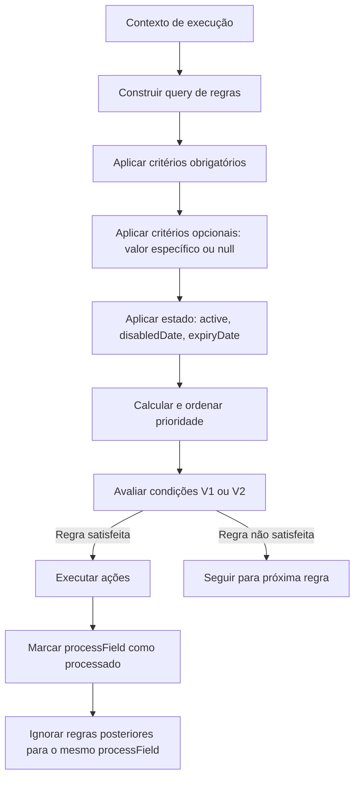

# Guia Técnico do Motor de Regras EasyRules para Seleção de Riscos DUP

## 1. Metadados do Documento
- **Arquivo de Origem:** `Não identificado — texto bruto fornecido na solicitação`
- **Tipo de Documento:** `Especificação Técnica`
- **Domínio / Sistema:** `DUP — seleção de riscos; EasyRules; RS-RULES-ACTIONS-CONDITIONS`
- **Público-Alvo:** `Desenvolvedores, Arquitetos, Operação e Analistas Funcionais`
- **Data/Versão Identificada:** `Não identificada`

---

## 2. Resumo Executivo & Contexto de Negócio

O documento descreve o sistema de regras EasyRules utilizado pelo processo de seleção de riscos no domínio DUP. O motor avalia dados de apólices, riscos, coberturas, segurados, participantes, documentos, questionários, constantes e acumulações para determinar ações operacionais, como rejeição, revisão, solicitação de documentos, tarifas, atribuições, questionários, exclusões e reprocesamento.

A seleção de regras aplicáveis começa pela identificação da invocação do motor mediante a tríade `processStep`, `optionMenuNumber` e `optionNumber`. Essa tríade representa a etapa do processo DUP, a família de controles e a opção específica invocada pelo orquestrador externo através de `RiskSelectionRequest`. A notação compacta documentada é `[processStep-optionMenuNumber-optionNumber]`.

As regras são armazenadas na coleção MongoDB `RS-RULES-ACTIONS-CONDITIONS`. A recuperação de regras utiliza filtros obrigatórios — como companhia, ramo, etapa, tipo de execução e tipo de processo — e filtros opcionais que permitem coexistência entre regras específicas e genéricas. Regras específicas para produto, cobertura, apólice, canal ou classificação recebem prioridade superior.

O documento suporta dois modelos de avaliação: V1, baseado em condições estruturadas no campo `ruleConditions`, e V2, baseado em expressões Java no campo `condition`, compiladas em tempo de execução por Janino. O roteamento entre V1 e V2 é automático: regras com `condition` preenchido usam V2; regras sem esse campo usam V1.

A priorização evita decisões contraditórias para o mesmo `processField`. Após uma regra ser aplicada a determinado campo de processo, regras subsequentes que afetariam o mesmo campo são ignoradas. O sistema também define mecanismos de segurança para expressões V2, bloqueando classes, pacotes e operações potencialmente perigosas.

---

## 3. Arquitetura, Componentes & Tecnologias Envolvidas

| Componente | Função documentada |
| :--- | :--- |
| Orquestrador externo | Envia parâmetros do `RiskSelectionRequest`, invoca o motor e recebe resultados de ações. |
| DUP | Processa regras de seleção de riscos e prepara chamadas ao orquestrador quando há ações `FUNCTION`. |
| Motor EasyRules | Avalia condições de regras e executa ações configuradas. |
| `RulesEvaluationRouter` | Decide automaticamente entre avaliação V1 e V2. |
| V1 — `ruleConditions` | Avalia condições estruturadas JSON com operadores predefinidos. |
| V2 — `condition` | Avalia expressões Java usando Janino e `SafeFactsUtils`. |
| `SafeFactsUtils` | Expõe o objeto `f` para acesso seguro aos facts em expressões V2. |
| MongoDB | Armazena regras, constantes e a coleção `RS-RULES-ACTIONS-CONDITIONS`. |
| `ConstantDefinition` | Fonte MongoDB das constantes acessadas pelo prefixo `constants`. |
| RTE — Runtime Engine | Executa funções predefinidas solicitadas por ações com `valueCalculationType: "FUNCTION"`. |
| `RiskSelectionRulesActionsConditions` | Entidade de configuração das regras, condições, ações, filtros e prioridade. |
| `RiskSelectionTypeEnum` | Enum citado para `executionType`. |
| `DupOperationEnum` | Enum citado para `processTypeId`. |



### Fluxo operacional de regras



> **Nota de Análise:** O documento cita a coleção MongoDB, o compilador Janino, o RTE e classes Java permitidas, mas não detalha versões de MongoDB, Janino, Java, endpoints, autenticação, infraestrutura de implantação ou contratos HTTP/JSON.

---

## 4. Regras de Negócio, Especificações Funcionais & Processos

### 4.1 Tríade de filtragem do orquestrador

| Campo no request | Campo MongoDB | Constante Java | Regra de uso |
| :--- | :--- | :--- | :--- |
| `processStep` | `process_step` | `CRITERIA_NAME_COD_NIVEL_SALTO` | Discriminador principal da fase DUP; obrigatório para execução de seleção (`EXEC_TYPE_SEL`). |
| `processStepOption` | `option_number` | `CRITERIA_NAME_COD_NIVEL_SALTO_OPTION` | Aplicado ao filtro apenas quando informado, isto é, não `null`. |
| `processStepMenuOption` | `option_menu_number` | `CRITERIA_NAME_COD_NIVEL_SALTO_OPTION_MENU` | Aplicado ao filtro apenas quando informado; relevante especialmente no nível 8. |

A notação usada pelo orquestrador é `[processStep-optionMenuNumber-optionNumber]`.

### 4.2 Níveis de salto

| `processStep` | Nome DUP | Descrição |
| :--- | :--- | :--- |
| `1` | `FIXED_DATA` | Dados fixos da apólice. |
| `2` | `VARIABLE_DATA_POLICY` | Dados variáveis da apólice. |
| `3` | `BENEFICIARY_RISK_TYPE` | Tipo de beneficiário / risco. |
| `4` | `VARIABLE_DATA_RISK` | Dados variáveis do risco. |
| `6` | `COVERAGE` | Controle de coberturas. |
| `7` | `REINSURANCE` | Controle de resseguro. |
| `8` | `CONTROLS` | Controles finais: guarda, cláusulas, encerramento e outros. |
| `11` | `RISK_SELECTION_FORM` | Formulário de seleção de riscos. |

### 4.3 Semântica de opções e menus

| Campo / valor | Semântica |
| :--- | :--- |
| `optionNumber = null` ou `0` | Execução principal de controle técnico direto. |
| `optionNumber = 10` | Pré-cálculo DUP, identificado como `PREVIOUS`. |
| `optionNumber = 20` | Validação DUP, identificada como `VALIDATION`. |
| `optionNumber = 1–8`, no nível 8 | Controles individuais agrupados por menu. |
| `optionMenuNumber = 0` | Fluxo padrão para níveis 1–7 e 11. |
| `optionMenuNumber = 1` | No nível 8: encerramento, suspensão e multiusuário. |
| `optionMenuNumber = 3` | No nível 8: guarda, abandono, verificação, cláusulas, anexos, impressão, riscos e opções adicionais. |
| `optionMenuNumber = 7` | No nível 8: opções adicionais do tipo `ANY`. |

O padrão `optionNumber = 10` para `PREVIOUS` e `optionNumber = 20` para `VALIDATION` é declarado como consistente nos níveis 2, 4 e 6.

### 4.4 Invocações documentadas do orquestrador

| Notação | Nome |
| :--- | :--- |
| `[2-0-10]` | `PREVIOUS_VARIABLE_DATA_POLICY` |
| `[2-0-20]` | `VALIDATION_VARIABLE_DATA_POLICY` |
| `[1-0-0]` | `FIXED_DATA_DUP` |
| `[2-0-0]` | `VARIABLE_DATA_POLICY` |
| `[3-0-0]` | `BENEFICIARY_RISK_TYPE` |
| `[4-0-10]` | `PREVIOUS_VARIABLE_DATA_RISK` |
| `[4-0-20]` | `VALIDATION_VARIABLE_DATA_RISK` |
| `[4-0-0]` | `VARIABLE_DATA_RISK` |
| `[11-0-0]` | `RISK_SELECTION_FORM` |
| `[6-0-10]` | `PREVIOUS_VARIABLE_COVERAGE` |
| `[6-0-20]` | `VALIDATION_VARIABLE_COVERAGE` |
| `[6-0-0]` | `COVERAGE_CONTROL` |
| `[7-0-0]` | `REINSURANCE_CONTROL` |
| `[8-1-6]` | `TERMINATE_CONTROL` |
| `[8-1-3]` | `SUSPEND_CONTROL` |
| `[8-1-4]` | `MULTIUSER_CONTROL` |
| `[8-3-1]` | `SAVE_CONTROL` |
| `[8-3-2]` | `ABANDON_CONTROL` |
| `[8-3-3]` | `VERIFY_CONTROL` |
| `[8-3-4]` | `CLAUSES_CONTROL` |
| `[8-3-5]` | `ANNEX_PAGES_CONTROL` |
| `[8-3-6]` | `PRINT_CONTROL` |
| `[8-3-7]` | `RISKS_CONTROL` |
| `[8-3-8]` | `ADDITIONAL_OPTIONS_CONTROL` |
| `[8-7-null]` | `ADDITIONAL_ANY_OPTIONS_CONTROL` |

### 4.5 Facts disponíveis

Os facts são valores disponíveis para avaliação de condições. Os principais prefixos documentados são:

| Prefixo | Conteúdo |
| :--- | :--- |
| `variableData.{chave}` | Dados variáveis de apólice, risco ou cobertura. |
| `fixedValues.{chave}` | Valores fixos configurados. |
| `constants.{nomeConstante}` | Constantes de configuração por país, companhia e ramo em `ConstantDefinition`. |
| `questionnaires.{idCuestionario}` | Questionários de saúde ou risco. |
| `documents.{grupo}.{codigoDoc}` | Existência e assinatura de documentos. |
| `coverages.{id}` | Dados de coberturas contratadas. |
| `accumulations.{id}` | Acumulações de capital e prêmio em nível principal. |
| `insured` | Informações do segurado. |
| `insured.accumulations.{id}` | Acumulações associadas ao segurado. |
| `participants.policyHolder` | Informações do tomador. |
| `participants.policyHolderLegalRepresentative` | Informações do representante legal do tomador. |
| `participants.beneficiaries.{id}` | Informações de beneficiários. |

### 4.6 Avaliação V1

V1 é o modelo legado baseado no campo `ruleConditions`. Cada condição é estruturada como objeto JSON contendo `factor`, `operator` e, conforme o operador, `value`, `value1`, `value2` ou `values`.

Todas as condições V1 são avaliadas com `AND` implícito. V1 é indicado para condições simples, possui estrutura previsível e validação de esquema mais simples, mas não suporta lógica complexa com `OR` aninhado ou cálculos.

### 4.7 Avaliação V2

V2 utiliza o campo `condition` com expressão Java compilada em runtime por Janino. O objeto `f`, instância de `SafeFactsUtils`, é usado para acesso seguro aos facts.

Requisitos declarados para expressões V2:

1. Declarar variáveis para os facts necessários.
2. Retornar um valor booleano com `return`.
3. Validar valores `null` antes do uso.

Os métodos `as*()` retornam `null` se o fact não existir ou não puder ser convertido ao tipo solicitado.

### 4.8 Operações bloqueadas em V2

As seguintes expressões são bloqueadas por segurança:

```text
System.
Runtime.
Process.
File.
Files.
ClassLoader.
Thread.
exec(
getRuntime(
getClass(
java.lang.
java.io.
java.nio.
java.net.
javax.
sun.
com.sun.
Class.forName
new
jdk.internal.
jdk.nashorn.
jdk.vm.
```

Quando uma condição contém expressão proibida, a regra não é executada e um `warning` é registrado.

### 4.9 Avaliação de coleções

V1 e V2 suportam coleções por meio de `ANY_MATCH` e `f.anyMatch`. O asterisco `*` é obrigatório para representar o índice numérico variável de uma coleção.

Exemplo de padrão:

```text
participants.beneficiaries.*.beneficiaryType
```

O padrão procura facts que começam com `participants.beneficiaries.` e terminam com `.beneficiaryType`.

Regras relevantes:

- Comparação de strings é exata e sensível a maiúsculas e minúsculas.
- Números são convertidos automaticamente para `Double`.
- É possível procurar `null` informando `null` como valor.
- `f.anyMatch("path.*.type", 5)` e `f.anyMatch("path.*.type", 5.0)` são tratados como equivalentes.
- `ANY_MATCH` verifica existência de coincidência; o documento ressalta que valores numéricos complexos podem requerer lógica V2 personalizada.

### 4.10 Filtragem de regras

A filtragem ocorre antes de priorização e avaliação de condições.

**Critérios obrigatórios:**

- `companyId`
- `branchId`
- `processStep`
- `executionType`
- `processTypeId`

**Critérios opcionais:**

- `productId`
- `coverageId`
- `optionNumber`
- `optionMenuNumber`

Quando presentes, os critérios opcionais usam lógica de valor específico ou `null`, permitindo que regras específicas e genéricas sejam recuperadas simultaneamente.

**Filtros de contexto estendidos:**

- `policyNumber`
- `clientPolicy`
- `contractNumber`
- `groupPolicyNumber`
- `channel1`, `channel2`, `channel3`
- `level1`, `level2`, `level3`

Esses campos também usam lógica de valor específico ou `null`.

**Filtros de estado:**

- Apenas regras com `active = "S"` são recuperadas.
- Regras com `disabledDate` no passado são excluídas.
- Regras com `expiryDate` no passado são excluídas.

### 4.11 Priorização

A prioridade é calculada por penalizações. Menor pontuação significa maior prioridade e execução anterior.

Após a aplicação de uma regra a determinado `processField`, o campo é marcado como processado. Regras posteriores que afetam o mesmo `processField` são ignoradas.

### 4.12 Ações

As ações ficam no campo `ruleActions` e são executadas quando uma regra é satisfeita. A ordem de execução segue a ordem definida em `ruleActions`; o resultado final obedece à prioridade dos tipos de ação:

1. `Rechazo`
2. `Revisión`
3. `Requisito` / `document`
4. `Tarifa` / `Asignacion`
5. `message` / `Aceptado`

### 4.13 Cálculo do valor de ações

| `valueCalculationType` | Comportamento |
| :--- | :--- |
| `DIRECT` | Usa valor literal sem transformação. |
| `FACTOR` | Obtém valor de um fact existente. |
| `FORMULA` | Executa expressão Java pelo mesmo motor V2. |
| `FUNCTION` | Solicita execução de função predefinida no RTE, via orquestrador. |

Para `FUNCTION`, o documento descreve a sequência: DUP processa a regra, prepara chamada, o orquestrador recebe classe/método e tipo de dado, invoca o RTE, o RTE executa a função com `Polizon`, `Riesgo`, `Cobertura` e `data`, e o resultado retorna ao orquestrador para sobrescrever o valor na regra.

---

## 5. Tabelas de Parâmetros, Ambientes e Estruturas de Dados

### Facts de cobertura e acumulação

| Item / Parâmetro | Descrição / Função | Tipo / Valores / Formato | Ambiente / Observações |
| :--- | :--- | :--- | :--- |
| `coverages.{id}.name` | Nome da cobertura | `String` | Cobertura contratada. |
| `coverages.{id}.capital` | Capital segurado | `BigDecimal` | Cobertura contratada. |
| `coverages.{id}.franchiseCode` | Código de franquia | `String` | Cobertura contratada. |
| `coverages.{id}.supplementCapital` | Capital suplementar | `BigDecimal` | Cobertura contratada. |
| `coverages.{id}.minFranchise` | Franquia mínima | `BigDecimal` | Cobertura contratada. |
| `coverages.{id}.maxFranchise` | Franquia máxima | `BigDecimal` | Cobertura contratada. |
| `coverages.{id}.franchiseTypeCode` | Tipo de franquia | `String` | Cobertura contratada. |
| `coverages.{id}.annualPremium` | Prêmio anual | `BigDecimal` | Cobertura contratada. |
| `coverages.{id}.supplementAnnualPremium` | Prêmio anual suplementar | `BigDecimal` | Cobertura contratada. |
| `accumulations.{id}.mxmAgrCplVal` | Máximo agregado de capital | `String` | Acumulação principal. |
| `accumulations.{id}.mxmAgrPreVal` | Máximo agregado de prêmio | `String` | Acumulação principal. |
| `accumulations.{id}.accumulationWithCapital` | Capital acumulado mais capital de cobertura | `String` | Acumulação principal. |
| `accumulations.{id}.accumulationWithPremium` | Prêmio acumulado mais prêmio de cobertura | `String` | Acumulação principal. |

### Facts do segurado

| Item / Parâmetro | Descrição / Função | Tipo / Valores / Formato | Ambiente / Observações |
| :--- | :--- | :--- | :--- |
| `insured.birthDate` | Data de nascimento | `String` | Segurado. |
| `insured.gender` | Gênero | `String`; `M/F` | Segurado. |
| `insured.age` | Idade atual | `Integer` | Segurado. |
| `insured.finalNaturalAge` | Idade natural final | `Integer` | Segurado. |
| `insured.occupationCode` | Ocupação ou profissão | `String` | Segurado. |
| `insured.resident` | Indicador de residência | `Boolean` | Segurado. |
| `insured.residenceCountry` | País de residência | `String` | Segurado. |
| `insured.doesSport` | Indica prática esportiva | `Boolean` | Segurado. |
| `insured.federatedSport` | Esporte federado | `String` | Segurado. |
| `insured.ridesMotorcycle` | Indica condução de motocicleta | `Boolean` | Segurado. |
| `insured.motorcycleCC` | Cilindrada | `Integer` | Motocicleta. |
| `insured.motorcycleHP` | Cavalos de força | `Integer` | Motocicleta. |
| `insured.staysAbroad.{id}.duration` | Duração da estada no exterior | `Integer` | Estadas planejadas. |
| `insured.staysAbroad.{id}.reason` | Motivo da estada no exterior | `String` | Estadas planejadas. |

### Operadores V1

| Item / Parâmetro | Descrição / Função | Tipo / Valores / Formato | Ambiente / Observações |
| :--- | :--- | :--- | :--- |
| `EQ` | Igualdade exata | `value` | V1. |
| `NOT_EQ` | Diferença | `value` | V1. |
| `GT` | Maior que | `value` | V1. |
| `GE` | Maior ou igual | `value` | V1. |
| `LT` | Menor que | `value` | V1. |
| `LE` | Menor ou igual | `value` | V1. |
| `IN` | Pertence à lista | `values` | V1. |
| `NOT_IN` | Não pertence à lista | `values` | V1. |
| `BTW` | Valor em intervalo | `value1`, `value2` | V1. |
| `EX` | Fact existe | Sem valor obrigatório | V1. |
| `NEX` | Fact não existe | Sem valor obrigatório | V1. |
| `BLANK` | Fact vazio ou nulo | Sem valor obrigatório | V1. |
| `ANY_MATCH` | Algum item da coleção coincide | Padrão com `*` e `value` | V1. |

### Métodos do objeto `f`

| Item / Parâmetro | Descrição / Função | Tipo / Valores / Formato | Ambiente / Observações |
| :--- | :--- | :--- | :--- |
| `f.asString(key)` | Lê fact como texto | Retorna `String` ou `null` | V2. |
| `f.asInteger(key)` | Lê fact como inteiro | Retorna `Integer` ou `null` | V2. |
| `f.asDouble(key)` | Lê fact como número decimal | Retorna `Double` ou `null` | V2. |
| `f.asLocalDate(key)` | Lê fact como data | Retorna `LocalDate` ou `null` | V2. |
| `f.asLocalDateTime(key)` | Lê fact como data e hora | Retorna `LocalDateTime` ou `null` | V2. |
| `f.asList(key, delimiter)` | Lê fact como lista | Retorna `List` | V2. |
| `f.formatLocalDate(date)` | Formata data | Formato `ddMMyyyy` | V2. |
| `f.anyMatch(pattern, value)` | Verifica coincidência em coleção | `boolean` | V2; padrão exige `*`. |

### Penalizações de prioridade

| Critério | Penalização | Observação |
| :--- | :--- | :--- |
| `productId` preenchido | `-1200` | Regra específica de produto. |
| `policyNumber` preenchido | `-1100` | Regra específica de apólice. |
| `clientPolicy` preenchido | `-1000` | Regra específica de apólice de cliente. |
| `contractNumber` preenchido | `-900` | Regra específica de contrato. |
| `groupPolicyNumber` preenchido | `-800` | Regra específica de apólice de grupo. |
| `thirdPartyCode` preenchido | `-700` | Regra com terceiro especificado. |
| `channel3` preenchido | `-600` | Canal nível 3. |
| `channel2` preenchido | `-500` | Canal nível 2. |
| `channel1` preenchido | `-400` | Canal nível 1. |
| `level3` preenchido | `-300` | Classificação nível 3. |
| `level2` preenchido | `-200` | Classificação nível 2. |
| `level1` preenchido | `-100` | Classificação nível 1. |
| `disabledDate` preenchido | `-10000` | Máxima penalização indicada para regra desabilitada. |
| `ruleConditions` | `-N` | `N` é a quantidade de condições. |
| `condition` V2 | `-N` | `N` é a quantidade de chamadas a funções encontradas. |

---

## 6. Bateria de Perguntas & Respostas para RAG (FAQ Sintético)

### P1: Como o motor identifica a etapa DUP em que uma regra deve ser aplicada?
**R:** O motor usa a tríade `processStep`, `optionMenuNumber` e `optionNumber`, enviada pelo orquestrador no `RiskSelectionRequest`. A notação compacta é `[processStep-optionMenuNumber-optionNumber]`. `processStep` identifica a fase principal do fluxo; `optionMenuNumber` identifica a família de controles; e `optionNumber` identifica a opção ou subvariante da execução.

### P2: Quando o sistema usa V1 e quando usa V2 para avaliar uma regra?
**R:** O `RulesEvaluationRouter` seleciona V2 quando o campo MongoDB `condition` possui valor. Quando `condition` está vazio ou não existe, o sistema usa V1 e avalia o campo estruturado `ruleConditions`.

### P3: Qual é a principal limitação do modelo V1 de condições?
**R:** V1 avalia todas as condições com `AND` implícito. O modelo é adequado para condições simples, mas não suporta lógica complexa como `OR` aninhado ou cálculos.

### P4: Como verificar se existe algum beneficiário com determinado tipo sem conhecer o índice do beneficiário?
**R:** Deve-se usar um padrão com asterisco, como `participants.beneficiaries.*.beneficiaryType`. Em V1, o operador é `ANY_MATCH`; em V2, usa-se `f.anyMatch("participants.beneficiaries.*.beneficiaryType", 5)`.

### P5: O que ocorre se uma expressão V2 contiver `Runtime`, `File`, `exec(` ou outra expressão proibida?
**R:** A regra não será executada e o sistema registrará um `warning`. O bloqueio é uma medida de segurança aplicada às expressões Java de V2.

### P6: Quais campos sempre participam do filtro MongoDB de regras?
**R:** Os critérios obrigatórios são `companyId`, `branchId`, `processStep`, `executionType` e `processTypeId`.

### P7: Como uma regra genérica pode coexistir com uma regra específica de produto ou cobertura?
**R:** Quando `productId` ou `coverageId` está presente no contexto, o filtro recupera regras com o valor específico e também regras com o campo igual a `null`. Assim, regras genéricas coexistem com regras específicas; a priorização determina qual será processada primeiro.

### P8: Como a priorização evita conflitos entre regras que alteram o mesmo campo?
**R:** As regras são ordenadas por pontuação de prioridade. Após uma regra ser aplicada a um `processField`, o campo é marcado como processado, e regras seguintes destinadas ao mesmo `processField` são ignoradas.

### P9: Qual pontuação representa maior prioridade no sistema documentado?
**R:** Menor pontuação representa maior prioridade. Por exemplo, uma regra com `productId`, `channel1` e duas `ruleConditions` recebe `-1602`, sendo executada antes de uma regra genérica com pontuação `0`.

### P10: Quais são os quatro tipos de cálculo de valor para uma ação?
**R:** Os tipos são `DIRECT`, para valores literais; `FACTOR`, para obter valor de um fact; `FORMULA`, para calcular valor por expressão Java; e `FUNCTION`, para invocar função predefinida do RTE por meio do orquestrador.

### P11: O que acontece em uma ação com `valueCalculationType: "FUNCTION"`?
**R:** DUP prepara a solicitação de chamada; o orquestrador recebe o valor com classe e método, como `ProcessAttributes.calcYearDuration`, além do tipo de dado esperado; o orquestrador chama o RTE; o RTE executa a função com `Polizon`, `Riesgo`, `Cobertura` e `data`; o resultado retorna ao orquestrador e sobrescreve o valor na regra.

### P12: Quais ações possuem maior e menor prioridade de resultado?
**R:** `Rechazo` possui prioridade máxima. Em seguida vêm `Revisión`, `Requisito` ou `document`, `Tarifa` ou `Asignacion`, e por fim `message` ou `Aceptado`.

---

## 7. Glossário de Termos, Siglas & Conceitos-Chave

- **DUP:** Contexto de processo no qual o motor EasyRules executa seleção de riscos; a expansão da sigla não é definida no texto.
- **EasyRules:** Motor de regras documentado para processamento de seleção de riscos.
- **Fact:** Dado disponível para avaliação de condições de uma regra.
- **V1:** Modelo legado de condições estruturadas no campo `ruleConditions`.
- **V2:** Modelo de condições como expressões Java no campo `condition`.
- **Janino:** Compilador utilizado em runtime para avaliação de expressões V2.
- **RTE:** Runtime Engine, responsável pela execução de funções predefinidas acionadas por ações `FUNCTION`.
- **MongoDB:** Banco de dados que contém regras e constantes referenciadas no documento.
- **`RS-RULES-ACTIONS-CONDITIONS`:** Coleção MongoDB usada para armazenar e filtrar regras, condições e ações.
- **`RiskSelectionRequest`:** Request pelo qual o orquestrador envia parâmetros de contexto ao motor.
- **`RiskSelectionRulesActionsConditions`:** Entidade de configuração das regras.
- **`RiskSelectionTypeEnum`:** Enum associado ao campo `executionType`.
- **`DupOperationEnum`:** Enum associado ao campo `processTypeId`.
- **`processField`:** Campo de processo afetado pela regra; usado para impedir processamento redundante.
- **`ANY_MATCH`:** Operador V1 para verificar se algum elemento de coleção coincide com um valor.
- **`SafeFactsUtils`:** Classe que fornece o objeto `f` para acesso seguro a facts em V2.
- **`PREVIOUS`:** Tipo de operação de pré-cálculo ou validação prévia.
- **`VALIDATION`:** Tipo de operação de validação.
- **`TECHNICAL_CONTROL`:** Tipo de operação de controle técnico.
- **`DIRECT`:** Tipo de cálculo de ação com valor literal.
- **`FACTOR`:** Tipo de cálculo de ação baseado em um fact.
- **`FORMULA`:** Tipo de cálculo de ação baseado em expressão Java.
- **`FUNCTION`:** Tipo de cálculo de ação por função predefinida do RTE.

---

## 8. Notas Críticas, Riscos & Limitações

- V1 é limitado a condições simples com `AND` implícito e não suporta lógica `OR` complexa nem cálculos.
- V2 permite maior flexibilidade, mas exige conhecimento de Java, pode apresentar erros de compilação e possui depuração mais difícil.
- Todo acesso por métodos `f.as*()` deve tratar `null`, pois os métodos retornam `null` quando o fact não existe ou não pode ser convertido.
- Strings usadas em `ANY_MATCH` são comparadas de forma exata e sensível a maiúsculas e minúsculas.
- O padrão de coleção deve conter obrigatoriamente `*`; sem o asterisco, a consulta não segue a semântica documentada de coleção variável.
- Regras com `active` diferente de `"S"`, `disabledDate` no passado ou `expiryDate` no passado não devem ser recuperadas.
- Regras específicas e genéricas podem ser recuperadas simultaneamente; o comportamento final depende da priorização e do bloqueio por `processField`.
- O documento recomenda índices MongoDB nos campos de filtragem obrigatórios, mas não especifica quais índices concretos existem.
- Configurações de `processStep = 50` para exclusão e reprocesamento estão marcadas como `TBD`; `executionType` e `processTypeId` não foram definidos para esses casos.
- A seção de referência apresenta `[11-0-0] RISK_SELECTION_FORM` em mais de uma posição do fluxo, sem detalhar se há semânticas distintas para as invocações.
- O documento cita `Polizon` no fluxo de `FUNCTION`, mas não apresenta a definição desse termo.
- Não há detalhamento de contratos de entrada e saída, códigos de erro, observabilidade, endpoints, autenticação, versionamento ou implantação.

---

## 9. Conteúdo Bruto Estruturado (Referência Fiel)

```text
--- [PÁGINA 1 DE 49] ---

Explicación Rules RS-Rules-Action-Conditions en DUP
Introducción
Este documento es una guía de referencia completa del sistema de reglas EasyRules para el
procesamiento de selección de riesgos en DUP.
Esta guía cubre tres áreas fundamentales del motor de reglas:
1. FACTORES (FACTS) - Todos los datos disponibles para evaluar en las reglas
2. CONDICIONES Y MOTORES DE EVALUACIÓN - Cómo escribir y evaluar condiciones
3. ACCIONES - Qué hacer cuando una regla se cumple

--- [PÁGINAS 2 A 16] ---

Índice documentado:
- Tríada de filtrado: processStep, optionNumber y optionMenuNumber.
- Facts de datos variables, fijos, constantes, cuestionarios, documentos, coberturas,
  acumulaciones, asegurado y participantes.
- Condiciones V1 y V2.
- Tipos de configuración, filtrado y priorización.
- Acciones y cálculo de valores.

Tríada:
- processStep / process_step / CRITERIA_NAME_COD_NIVEL_SALTO.
- processStepOption / option_number / CRITERIA_NAME_COD_NIVEL_SALTO_OPTION.
- processStepMenuOption / option_menu_number /
  CRITERIA_NAME_COD_NIVEL_SALTO_OPTION_MENU.

Niveles:
1 FIXED_DATA
2 VARIABLE_DATA_POLICY
3 BENEFICIARY_RISK_TYPE
4 VARIABLE_DATA_RISK
6 COVERAGE
7 REINSURANCE
8 CONTROLS
11 RISK_SELECTION_FORM

Facts y patrones:
variableData.{clave}
fixedValues.{clave}
constants.{nombreConstante}
questionnaires.{idCuestionario}
questionnaires.{idCuestionario}.{idPregunta}
documents.{grupo}.{codigoDoc}
documents.{grupo}.{codigoDoc}.signed
coverages.{id}.name
coverages.{id}.capital
coverages.{id}.franchiseCode
coverages.{id}.supplementCapital
coverages.{id}.minFranchise
coverages.{id}.maxFranchise
coverages.{id}.franchiseTypeCode
coverages.{id}.annualPremium
coverages.{id}.supplementAnnualPremium
accumulations.{id}.mxmAgrCplVal
accumulations.{id}.mxmAgrPreVal
accumulations.{id}.accumulationWithCapital
accumulations.{id}.accumulationWithPremium

--- [PÁGINAS 17 A 28] ---

V1:
- Campo ruleConditions.
- Operadores: EQ, NOT_EQ, GT, GE, LT, LE, IN, NOT_IN, BTW, EX, NEX,
  BLANK y ANY_MATCH.
- Todas las condiciones se evalúan con AND implícito.

V2:
- Campo condition.
- Usa Janino como compilador en runtime.
- Objeto f como instancia de SafeFactsUtils.
- Métodos: asString, asInteger, asDouble, asLocalDate, asLocalDateTime,
  asList, formatLocalDate y anyMatch.
- Los métodos as* retornan null si el fact no existe o no se puede convertir.
- Las expresiones requieren return boolean y validación de null.

Expresiones prohibidas:
System.
Runtime.
Process.
File.
Files.
ClassLoader.
Thread.
exec(
getRuntime(
getClass(
java.lang.
java.io.
java.nio.
java.net.
javax.
sun.
com.sun.
Class.forName
new
jdk.internal.
jdk.nashorn.
jdk.vm.

Colecciones:
- ANY_MATCH y f.anyMatch permiten usar * como comodín de índice numérico.
- Strings: comparación exacta y case-sensitive.
- Números: conversión automática a Double.
- El asterisco es obligatorio en patrones de colección.

--- [PÁGINAS 29 A 40] ---

Campos de RiskSelectionRulesActionsConditions:
processStep
optionMenuNumber
optionNumber
executionType
processTypeId
companyId
branchId
productId
coverageId
processField
ruleConditions
condition
ruleActions

Criterios obligatorios de filtrado:
companyId
branchId
processStep
executionType
processTypeId

Criterios opcionales:
productId
coverageId
optionNumber
optionMenuNumber

Contexto extendido:
policyNumber
clientPolicy
contractNumber
groupPolicyNumber
channel1
channel2
channel3
level1
level2
level3

Estado:
active = "S"
disabledDate no puede estar en el pasado
expiryDate no puede estar en el pasado

Buenas prácticas declaradas:
- productId = null y coverageId = null para comportamiento por defecto.
- productId = X y coverageId = Y para excepciones o casos particulares.
- Usar active y expiryDate para desactivar temporalmente sin eliminar.
- Crear índices MongoDB en campos obligatorios de filtrado.

--- [PÁGINAS 41 A 49] ---

Acciones:
Rechazo
Revisión
requirement
document
Tarifa
Asignacion
questionnaire
message
Aceptado
TEMP
Exclusion
Reproceso

Tipos de cálculo:
DIRECT
FACTOR
FORMULA
FUNCTION

Priorización:
- Se carga el conjunto de reglas aplicables.
- Cada regla recibe una puntuación.
- Las reglas se ordenan en prioridad descendente según el flujo textual;
  la tabla especifica que una puntuación menor significa mayor prioridad.
- Una regla aplicada a processField bloquea reglas posteriores para ese mismo campo.

Penalizaciones:
productId: -1200
policyNumber: -1100
clientPolicy: -1000
contractNumber: -900
groupPolicyNumber: -800
thirdPartyCode: -700
channel3: -600
channel2: -500
channel1: -400
level3: -300
level2: -200
level1: -100
disabledDate: -10000
ruleConditions: -N
condition V2: -N llamadas a funciones encontradas

Prioridad final de acciones:
1. Rechazo
2. Revisión
3. Requisito/Documento
4. Tarifa/Asignación
5. Mensaje/Aceptado
```
